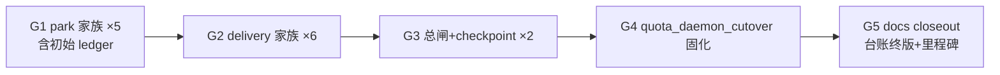

# FLY-1456 62 flag 逐条定值执行 — 实施计划

Issue: FLY-1456 (https://linear.app/geoforge3d/issue/FLY-1456/flag治理清存量eng-62-flag-逐条定值执行-按-hl-盘点圈选-删固化动态化承接-fly-1413)
日期: 2026-07-24
基于: research.md

## 0. 执行合同

- **裁决源(唯一)**:FLY-1413 收敛版 FINAL — branch `flywheel-FLY-1413` commit `67b35748` 的 `tab-decisions.js`。实现节点开工第一步:`git show 67b35748:product/doc/FLY-1413-flag-audit-increment/tab-decisions.js` 复核本计划 §1 台账与裁决源一致(任何不一致 = 停,问 Lead)。
- **执行范围 = 62 − RESERVED = 60**。RESERVED = `workflow_template_dispatch` + `workflow_generalized_templates`(FLY-1436 急停杆,**diff 与其读点零交集**,Annie 红线)。
- 全部改动走 worktree + branch + PR,founder-gated merge(:cool: 流程),绝不自 merge。
- 行为红线:PR-1/2/3 **零行为变化**(死壳,巷道本就恒 off);PR-4 唯一形状变化 = 移除 env 回退口(裁决本身)。

### 0.1 implement dispatch override(2026-07-24)

实现节点向 Tadashi 询问「五个串行 main-based PR」与 generalized implement 单 PR 完成合同的冲突;`ask b6af3621-938e-4b03-9d11-9badb686ad71` 的裁决为:

- **收敛为一个 PR**。
- 原 PR-1 → PR-4 边界改为同一 PR 内的独立 commit group G1 → G4;每组保持原 TDD、测试与 reviewable diff 边界。
- 原 PR-5 docs closeout 改为同一 PR 的末尾 commit group G5。
- PR 描述按 G1-G5 分节;G4 必须保留独立「语义变化」一节。
- 任一组的局部门或最终全仓门失败,整个 PR 不交付。

本 override 只改变交付拓扑,不改变下文已审批的逐 flag 代码范围、删除顺序、运维语义、RESERVED 红线或验收标准。下文保留 `PR-1`…`PR-5` 名称时,均应读作本 PR 的 `G1`…`G5` commit group。

## 1. 62 条执行台账(flag → 裁决 → 动作 → 去向)

执行时在本文件夹落 `execution-ledger.md`,逐条记录并在每个 PR merge 后回填 PR 号。初始内容 = 下表。

### 1a. 删除(13 条,PR-1/2/3)

| flag | 裁决 | PR |
|---|---|---|
| park_watch / park_watch_cadence / park_watch_n1_ms / park_watch_n2_ms / park_watch_qa_n3_ms | 死壳确认可删(settled) | PR-1 |
| delivery_ack / delivery_unconsumed_v2 / delivery_ack_timeout_ms / delivery_max_redeliver / delivery_max_transport_failures / ack_late_window_ms | 死壳确认可删(Tadashi 签字升级,四层取证) | PR-2 |
| legacy_delivery_watchdogs / checkpoint_watchdog | 死壳确认可删(settled;checkpoint 为「同意删」显式裁决) | PR-3 |

### 1b. 固化(1 条,PR-4)

| flag | 裁决 | 动作 |
|---|---|---|
| quota_daemon_cutover | keep@1 固化候选(「关=回退,不能关」) | 写死 retired 真值表后删 flag |

### 1c. 零代码动作(46 条,只进台账)

- **frozen@0 归 FLY-1446**:`cmux_linked_view`(维持 0、不删;活不一致线索归 1446)。`1405_candidate = no`(FLY-1446 owned)。
- **keep(5 条)**:`three_stage_codex_design_toggle`(保持关)· `skill_framework_mode`(保持 split)· `workflow_claims_write` / `workflow_claims_read`(在用)· `cmux_view_invariant`(FLY-1364 护栏)。5 条均 `1405_candidate = yes`(幸存者,逐读点动态化评估归 1405)。
- **default_only(40 条,字面名单)**:跑默认值,零动作;40 条均 `1405_candidate = yes`。名单(与 pinned `67b35748` snapshot.json 的 `newSinceBaseline − explicit − dead − owned` 一致):
  `watchdog_liveness` `watchdog_loop_heartbeat` `watchdog_blocked` `receipt_foundation` `receipt_activation_dry_run` `park_biased_handoff` `prune_park_guard` `readopt_parked_roles` `liveness_activity_window_ms` `codex_gate_wait` `lead_dual_active_scan` `quota_degraded_switch` `claude_account_identity_check` `voice_qa_presence_override` `quota_daemon_wake` `review_severity_policy_killswitch` `design_html_gate` `issue_gate_supersede_mode` `founder_review_gate_exclude` `retest_head_delta_guard` `ship_ci_guard` `ship_ready_notify` `ship_ready_remind_ms` `ask_hygiene` `engine_dead_exec_sweep` `workflow_rework_reentry` `engine_unlaunched_tripwire` `stuck_pane_confirm` `commdb_residue_harvest` `terminal_commdb_sync` `ghost_guard_wait_ms` `lead_lease_bypass` `skill_framework_split_participation` `land_node` `workflow_vendor_at_dispatch` `commdb_protection` `delivery_secret_path` `zombie_reconcile` `terminal_thread_archive` `disposition_receipt`

### 1d. RESERVED(2 条,本单不碰)

`workflow_template_dispatch`(frozen,急停杆)· `workflow_generalized_templates`(FLY-1436 owned)。台账记「RESERVED — FLY-1436 owned,未动」,`1405_candidate = no`。

### 1e. 台账可复现合同 + 生命周期

- **取数源钉死**:`git show 67b35748:product/doc/FLY-1413-flag-audit-increment/snapshot.json` + 同 commit 的 `tab-decisions.js`(不得用实现中途的活 registry 取数——registry 会随删除连续变化,活取数会漏账)。
- **列**:`flag | verdict | action | owner/去向 | PR# | merge_sha | 1405_candidate | reason`。删除/固化的 14 条 `1405_candidate = n/a(deleted)`。
- **自检 guard(写进 ledger 生成脚本或手工核对小节)**:恰 62 个唯一名字、分桶数 40+1+12+2+6+1=62、与 §1a-1d 名单逐字一致。任何不一致 = 停,问 Lead。
- **生命周期(回填时序,消除「PR 记录自己 merge sha」悖论)**:
  1. 初始 62-row ledger = **G1 前的首个实现 commit**(PR#/merge_sha 列全 `pending`)。
  2. 单 PR 创建取得 PR# 后,G5 回填全部 62 行的 PR#;`merge_sha` 在 founder-gated merge 前保持 `pending`。
  3. G5(docs closeout,纯文档)完成本次 review handoff 所能闭合的全单收口:CLAUDE.md 里程碑行、台账 PR#、residue audit 双栏报告。最终 merge SHA 只能在该 PR 合入后由 Lead / ship 流程回填到 Linear 或后续可审计载体,不得在合入前伪造。

## 2. commit group 切分与顺序(同一 PR 串行落地,同触 registry.ts/truth.ts)



顺序理由:先叶子旋钮、后总闸(总闸的墓碑字符串表 `RETIRED_WATCHDOG_ENV_VARS` 是 2a/2b 各读点注释的锚,最后收);G4 独立、放最后保持 review 面清楚。每组单独 commit、单独跑适用的局部门;整 PR 最后统一 Codex code review + 全仓门。

### 每 PR 统一 TDD 顺序(FLY-1243 §1 同款)

1. **config 包先行(RED)**:registry.ts 删定义块 + truth.ts `RETIRED_FLAGS` 加墓碑(`retiredBy: "FLY-1456"`)+ 更新 registry/resolve/drift 测试断言 → drift 正向此时对残留读点红。
2. **生产读点清零(GREEN)**:按 §3 逐点编辑。
3. **teamlead 测试收敛**:删该 flag 的 `=0`/`=1` sentinel 测试(off 路径不存在),on-behavior 改无条件;第一步先 `grep -rn <ENVVAR> packages/*/src/**/__tests__` 清点全部命中再逐个收敛。
4. **全仓门**:`pnpm lint` + `pnpm -r build` + `pnpm test:packages:run` 绿。

### 每 PR 统一验收(三段门,命令可照抄执行)

**① runtime residue scan**(墓碑是唯一合法出现点,必须显式排除;字符串字面 grep 同时覆盖布尔 gate 与 `positiveEnv`/`envPositiveInt` 这类动态 value 读——drift 正向 scanner 只抓布尔 gate,不能替代本条):

```bash
# 自失败形式:有残留 = exit 1,可直接进 set -e gate;干净 = exit 0
if grep -rE "FLYWHEEL_(<该 PR 的 envVar 组>)" packages/*/src --include="*.ts" \
  | grep -v "/__tests__/" \
  | grep -v "feature-flags/truth.ts" | grep -q .; then
  echo "RESIDUE FOUND"; exit 1
fi
# registry.ts 不需排除——定义块已删,出现即 fail。
```

PR-4 追加(同款自失败形式):`scripts/setup-quota-monitor.sh` 对 FLYWHEEL_QUOTA_DAEMON_CUTOVER **零引用**(--disable 的 set_env_key 清理已随 4b 删除,不存在 allowlist 例外)。

**② registry/truth 结构断言**:registry.ts 该 PR 目标定义 = 零;truth.ts `RETIRED_FLAGS` 新增恰好该 PR 条数的 `retiredBy: "FLY-1456"` 墓碑(整单累计 14 条);`pnpm --filter @flywheel/config test` 绿(registry 计数 / drift 双向 / resolve)。

**③ RESERVED 零触碰(直接证据,不靠 diff 文本搜索)**:

```bash
if git diff --name-only main...HEAD | grep -E "workflow-template(-dispatch)?\.ts" | grep -q .; then
  echo "RESERVED FILE TOUCHED"; exit 1
fi
```

且 registry.ts 的 `workflow_template_dispatch` / `workflow_generalized_templates` 两个定义块在 diff 中零变更(`git diff main...HEAD -- packages/config/src/feature-flags/registry.ts` 人工核对 + 现有 registry contract 测试对这两条的存在性断言保持绿)。

**④** Codex code review APPROVED;CI 绿(含 `.github/workflows/ci.yml` 跑的根目录 shell suites)。

## 3. 逐 PR 精确编辑

### PR-1 park 家族(5 flag)

| 位置 | 编辑 |
|---|---|
| `park-watch.ts:181` | 删 `if (process.env.FLYWHEEL_PARK_WATCH === "0") return;` |
| `park-watch.ts:107,183,186` | `positiveEnv("FLYWHEEL_PARK_N*_MS", d)` → 直接用默认常量 `d`(n1/n2 = 600000,qa_n3 = 7200000);`positiveEnv` 若因此无调用者则删 |
| `plugin.ts:8056-8061` | `parkWatchEveryNTicks` IIFE(读 `FLYWHEEL_PARK_WATCH_EVERY_N_TICKS`)整段删,选项传 `undefined`(GatePoller 内部默认 20 不变)或直接不传 |
| registry.ts | 删 5 个定义块 |
| truth.ts | 5 条墓碑 |

注意:`onParkWatchTick: legacyDeliveryWatchdogsOn ? parkWatchTick : undefined`(:8055)**不动**(总闸归 PR-3;且本 PR 不拆巷道)。

### PR-2 delivery 家族(6 flag)

| 位置 | 编辑 |
|---|---|
| `lead-event-ack-policy.ts:13` | `legacyDeliveryWatchdogsEnabled(env) && env.FLYWHEEL_DELIVERY_ACK !== "0"` → `legacyDeliveryWatchdogsEnabled(env)`(常量折叠,保留 OFF 语义) |
| `plugin.ts:4529` | `legacyDeliveryWatchdogsOn && process.env.FLYWHEEL_DELIVERY_ACK !== "0"` → `legacyDeliveryWatchdogsOn` |
| `plugin.ts:4607` | 同上折叠 |
| `plugin.ts:7295` | `const deliveryUnconsumedV2 = process.env.FLYWHEEL_DELIVERY_UNCONSUMED_V2 !== "0";` → `const deliveryUnconsumedV2 = true;`(默认值折叠;所在 `gapScanTick` 本就永不被 wire) |
| `lead-event-delivery.ts:86,91,95,99` | 4 个 `envPositiveInt("FLYWHEEL_…", d)` → 默认常量 `d`;`envPositiveInt` 若无其余调用者则删 |
| registry.ts / truth.ts | 删 6 定义 + 6 墓碑 |

### PR-3 总闸 + checkpoint(2 flag)

| 位置 | 编辑 |
|---|---|
| `watchdog-minimum-set.ts:8-12` | `RETIRED_WATCHDOG_ENV_VARS` 收敛为 `["FLYWHEEL_ZOMBIE_GATE_RESOLVE"]`(第三项不在 62 范围,保留) |
| `legacy-delivery-watchdog-policy.ts:8-9` | 删 `LEGACY_DELIVERY_WATCHDOG_ENV` 常量;`legacyDeliveryWatchdogsEnabled` 收敛为直接 `return retiredWatchdogLaneEnabled(env);`(函数本身**保留** —— 巷道 off 语义的单一出口,20+ 下游消费者不动) |
| `plugin.ts:3919-3922` | `retiredCheckpointEnabled = retiredWatchdogLaneEnabled(process.env, "FLYWHEEL_CHECKPOINT_WATCHDOG")` → 字面 `false` 折叠进 `retiringWatchdogEnabled.checkpoint_watchdog`(状态表键保留,值恒 false —— 下游上报形状不变) |
| `gate-poller.ts:2273-2280` | `checkpointWatchdogEnabled()` 谓词删除;`maybeEmitCheckpointParkAlert` 及其调用点(唯一可达自该谓词的死代码)整体删除,PR 描述列明删除清单;若牵出共享 helper 则止步折叠为 early-return `false` |
| registry.ts / truth.ts | 删 2 定义 + 2 墓碑 |
| **活文档同步**(墓碑后照旧文档操作会被 check-flag-truth 拒绝) | `doc/architecture/infra-alerts-spec.md:146`:`FLYWHEEL_CHECKPOINT_WATCHDOG` 行改为「已退役(FLY-1456),checkpoint patrol 已随退役巷道移除」;`engineering/doc/FLY-1049-fly915-alerts-closeout/enable-window-runbook.md` 顶部加 superseded 标注 +「勿再设置 FLYWHEEL_CHECKPOINT_WATCHDOG」——**只改这两处活引用,历史归档文档(含 FLY-1413 产物)一律不动** |

### PR-4 quota_daemon_cutover 固化(1 flag)

#### 4a. 代码收敛(消费链全闭合,无 dormant 二选一)

| 位置 | 编辑 |
|---|---|
| `quota-daemon-cutover.ts` | 删 `quotaDaemonCutoverEnabled`;`resolveQuotaDaemonBridgeMode()` 无条件返回 retired 真值表(`cutover:true, attachAccountSwitch:false, runAccountSwitchWatchdog:false, retireAccountSwitchRoute:true, quarantinePending:true, runRunnerQuotaScan:true`);`poolConfigured`/`env` 入参删除 |
| `plugin.ts:5666` | caller 随签名收敛;`accountPoolConfigured()` 若仅为此参数服务则该调用点删除(函数本身如有他用不动) |
| `plugin.ts:473-474 / 1296 / 3835 / 5921` | flag 谓词消费链**整条删除**:import → `BridgeAppOptions.quotaDaemonCutover?` 选项(:1296)→ `cutoverEnabled: opts?.quotaDaemonCutover`(:3835)→ `quotaDaemonCutover: quotaDaemonCutoverEnabled`(:5921)。不留 `() => true` 桩 |
| `account-switch-route.ts:112,121` | `cutoverEnabled` dep 删除;route body 无条件 410 `{error:"retired", reason:"quota_daemon_cutover"}`(与今日生产行为逐字节一致;认证层在 router 外不动——认证缺失仍 503,认证过后 410) |
| **route-only holder 链同删**(静态 410 后只服务旧 route 的 dormant machinery,类型检查不会自动逼删,必须逐项列) | `AccountSwitchRouteDeps.getRuntime` + `AccountSwitchRuntime` 接口(`account-switch-route.ts:66-110,185`)· `BridgeAppOptions.accountSwitchRoute?`(`plugin.ts:1294`)· `getRuntime: () => opts?.accountSwitchRoute?.current`(:3834)· `accountSwitchRouteHolder`(:5655/:5920/:9845 runtime 绑定/:10059-10060 onSwitchSuccess hook)——全删;route tests 与注释同步收敛。**边界**:`accountSwitchRepair` / `postSwitchResult` 等与 watchdog 共享的部分按既定巷道边界保留 |
| registry.ts / truth.ts | 删定义 + 墓碑 |

#### 4b. setup-quota-monitor.sh 运维合同重定义(永久 cutover 后的权威语义)

前提事实:cutover 固化后,**外部 quota daemon 是唯一的自动切号 executor,Bridge 侧切号路径永久退役,不存在回退**。脚本三个 mode 的新权威语义:

| mode | 旧语义 | 新语义(fail-loud,不许谎称回退) |
|---|---|---|
| `enable` | daemon 健康后写 `CUTOVER=1` + 重启 Bridge「retire the Bridge switch path」 | 删 `set_env_key FLYWHEEL_QUOTA_DAEMON_CUTOVER 1`(:351)与对应重启理由;日志改「enabled daemon (the only auto-switch executor)」。daemon 健康检查保留不动 |
| `--monitor-only` | 「Bridge switch path remains active」(order 空,Bridge 兜底) | **语义改为纯观测**:daemon 只监控、无人切号。`empty_order` 提示语(:253 附近「use --monitor-only to keep the Bridge switch path active」)与结尾日志(:357)改写为「monitor-only: daemon observes; automatic account switching stays OFF (Bridge switch path permanently retired, FLY-1456)」 |
| `--disable` | bootout + 删 plist + 删 CUTOVER key + 重启 Bridge「restored the Bridge switch path」 | **语义改为全停**:bootout + 删 plist 保留;`set_env_key FLYWHEEL_QUOTA_DAEMON_CUTOVER`(:172)**删除**(脚本源码对该 var 零引用,与验收门①一致;生产 .env 残留行由 §5 运维步骤 + check-flag-truth 提示清理,不靠脚本);**删除 Bridge 重启步骤**(Bridge 已不读该 var,重启无意义);日志改「daemon disabled — automatic account switching is now OFF entirely; NO Bridge fallback exists; re-run setup to re-enable」 |

helper 收尾(Codex R3 非阻塞建议,按 §4 死代码纪律执行):`set_env_key` 仅服务被删的两个 CUTOVER 调用点、`RESTART_BIN` 仅服务被删的两次 Bridge restart —— 调用点收敛后**一并删除**;shell 测试里的 fake restart 保留为「绝不被调用」的负向哨兵。另注:§2 的统一 TDD 顺序适用于 PR-1〜PR-4;PR-5 纯文档 closeout,只执行适用的 residue/docs/ledger 验收。

配套硬门与测试(全部 PR-4 内完成):

- `scripts/__tests__/setup-quota-monitor.test.sh` 按新语义改写三处断言(cutover ordering :112-116 / monitor-only :229-235 / kill switch :283-289);`bash scripts/__tests__/setup-quota-monitor.test.sh` 列为 PR-4 **本地硬门**(CI `.github/workflows/ci.yml:381` 也跑,但不得只赌 CI)。
- `scripts/qa-fly-1252-quota-state-e2e.sh`:legacy truth-table 断言(:310-318)与 `runLegacyScenario` 场景删除/改写为固化后形态(不存在 CUTOVER-off 世界)。
- vitest:`resolveQuotaDaemonBridgeMode` legacy 分支断言删除;retired 真值表 + 路由 410 改无条件断言。
- PR-4 活文档追加:`engineering/doc/FLY-1182-quota-switch-ignition/recovery-runbook.md`(被 qa-report.md 指定为**当前** GO 判断权威,:31-34 与 :147-154 仍以「CUTOVER=1 已设置」的条件式口径描述退役)——改写为「FLY-1456 后永久退役,该变量已墓碑化不得再设置,无 Bridge fallback」;其余 FLY-1182/1256 历史证据文档不动。
- **回滚口径(single-executor 事务,有序可验证)**:回滚 ≠ 裸 revert。生产 .env 的 CUTOVER=1 行按 §5 已清理,裸 revert + 重启会让 reverted 代码读到 unset → legacy Bridge executor 复活,与仍在 launchd 跑的 daemon 形成**双执行者**。两条合法路径:
  - **A(常规,继续用 daemon)**:revert PR-4 → **先**在 .env 恢复 FLYWHEEL_QUOTA_DAEMON_CUTOVER=1(reverted 代码合法读它;「不许 env 翻转」约束的是固化后的 shipped 状态,不约束 reverted 世界)→ 重启 Bridge → 验证 daemon 单执行者(launchctl 有 job、Bridge mode=cutover)。
  - **B(要复活 legacy executor)**:先 bootout daemon + 验证 PID 消失 → revert PR-4 → .env 保持 unset → 重启 Bridge → 验证 Bridge 单执行者。
  任一路径完成后都要验证恰好一个执行者在场。
- **Tadashi 已批(ask d545e2b3 答复,附两条硬要求,PR-4 必须满足)**:
  1. --disable/--monitor-only 的新语义必须写进**脚本自身的运行时输出**(执行时打印「无自动切号兜底 / NO automatic switching fallback」),不能只写在 plan/文档里(4b 表中的日志改写即此要求,实现时不得弱化)。
  2. PR-4 描述里**单列「语义变化」一节**给 founder 看——静默语义漂移是 Annie 红线的镜像,必须显式呈现。

## 4. 死代码删除纪律(全 PR 通用)

- 只删**唯一可达自被删读点**的局部死代码(gate-poller checkpoint patrol 是唯一预期实例);每处在 PR 描述「Dead code removed」小节列明。
- **不拆巷道机器**:park-watch.ts 文件、`gapScanTick`、`LeadEventDeliveryCoordinator`、misroute patrol、`legacyDeliveryWatchdogsOn` 布尔及其 20+ 下游 —— 全部不动(follow-up,见 §7)。
- lint 若报新的 unused(如 `positiveEnv`/`envPositiveInt` 失去全部调用者),在同 PR 内删并列入清单。

## 5. ship / 运维步骤(每 PR merge 后)

1. 常规 :cool: 流程,founder-gated;4 个 PR 可攒同一个重启窗(改动全在 Bridge 侧,单次 Bridge 重启生效;PR-1/2/3 行为零变化,不重启也无风险,PR-4 生效同样零行为差 —— 生产本就 =1)。
2. **生产 .env 两行清理**(PR-3 / PR-4 各一):`FLYWHEEL_CHECKPOINT_WATCHDOG` 显式行、`FLYWHEEL_QUOTA_DAEMON_CUTOVER=1`。墓碑机制(check-flag-truth)会对残留行报「已退役假开关,删这行」——以该检查转绿为完成证据。
3. 台账回填按 §1e 生命周期执行;CLAUDE.md 里程碑行 + 台账终版 + residue audit 双栏报告随 **PR-5(docs closeout)** 落地。

## 6. 验收(整单)

- **runtime residue**:14 个 envVar 按 §2 三段门①(排除 `__tests__` 与 `feature-flags/truth.ts`)零命中;`scripts/setup-quota-monitor.sh` 零 CUTOVER 引用;registry 零定义;truth.ts 恰 14 条 `retiredBy: "FLY-1456"` 墓碑。
- **活文档 vs 历史归档分开列证**:活规范/runbook/脚本 help(infra-alerts-spec、FLY-1049 runbook、**FLY-1182 recovery-runbook(当前 GO 判断权威)**、setup-quota-monitor usage)已按新语义更新;历史归档(FLY-1413 产物、旧 issue 文档、其余 FLY-1182/1256 证据文档)原样未动——residue audit 报告两栏分列,不为 grep-zero 改历史材料。
- `pnpm lint` + `pnpm -r build` + `pnpm test:packages:run` 全绿;drift 双向绿;`bash scripts/__tests__/setup-quota-monitor.test.sh` 绿(PR-4)。
- RESERVED 两 flag:`workflow-template.ts` / `workflow-template-dispatch.ts` 零 diff;registry 两定义块零变更。
- 执行台账 62/62 行齐(§1e 合同:钉死取数源 + guard 自检),FLY-1405 候选列逐条 yes/no/n/a。
- 每 PR Codex code review APPROVED + 独立 QA(死壳 PR 的 QA 重点 = 行为零变化:全套件绿 + drift 绿即可,无需真机 E2E;PR-4 QA 加两条:`/api/account-switch` 真机 410 复核 + setup 脚本三 mode 新语义真跑(fixture 环境))。

## 7. Follow-up(不在本单,建议开单)

1. **巷道拆除**:`legacyDeliveryWatchdogsOn` 恒 false 巷道的机器整体删除(park-watch.ts、gapScanTick、LeadEventDeliveryCoordinator legacy 路径、misroute patrol wiring、`retiringWatchdogEnabled` 表收敛)——FLY-1261 量级,按巷道单独立项。
2. **`FLYWHEEL_ZOMBIE_GATE_RESOLVE`**:baseline 侧同型死壳,下一轮 baseline 治理处理。
3. `FLYWHEEL_CHAT_RECEIPTS`(FLY-1437 在建,未登记)——登记后进下一轮增量盘点(FLY-1413 已预留)。
