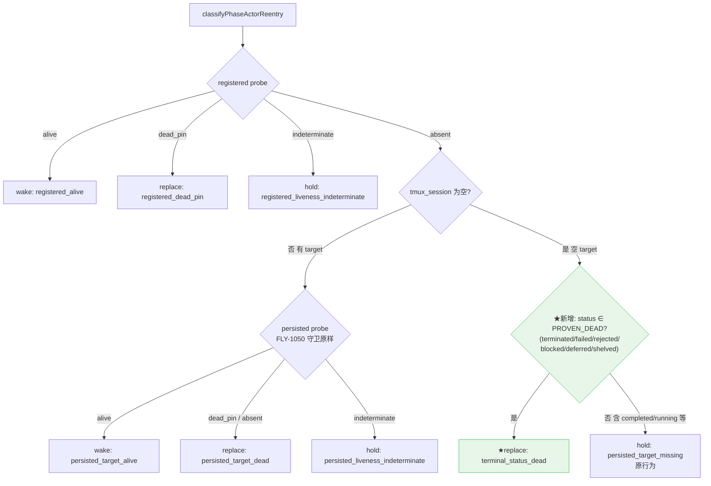

# FLY-1462 rework 永久 hold:terminated holder 空 tmux_session 误判 — 实施计划

Issue: FLY-1462 (https://linear.app/geoforge3d/issue/FLY-1462/infra引擎-rework-永久-holdpersisted-target-missing-terminated-holder-空)
日期: 2026-07-24
基于: research.md

## 0. 一句话

在 `classifyPhaseActorReentry` 的空 `tmux_session` 分支内,把 **FSM proven-dead 终态**(terminated / failed / rejected / blocked / deferred / shelved)认作死亡证据,返回 `{kind:"replace", reason:"terminal_status_dead"}`;其余情况(含 `completed`)维持原 hold。单文件核心改动 + 测试;无 flag;部署后 FLY-1150 在 engine 下一个 reconcile tick 自愈。

## 1. 核心流程图



## 2. 代码改动(唯一核心文件)

### 2.1 `packages/teamlead/src/bridge/phase-actor-reentry.ts`

**(a) 新增 proven-dead 集合**(文件顶部,逐值注释——仓内惯例:终态词汇本地枚举、不跨集合派生):

```ts
/**
 * FLY-1462: FSM statuses that BY THEMSELVES prove the holder can never again
 * be woken through the normal flow — the status semantics entail the runner
 * was affirmatively closed (terminate kills the window; the crash reaper marks
 * failed after death; decision-layer routes close the runner). Only consulted
 * when the row has NO persisted tmux target: with a target present the direct
 * probe keeps guarding (FLY-1050: a cleanupPending terminate can leave the
 * tmux alive — but that case always HAS a known target, so it never reaches
 * this set).
 * Deliberately enumerated value-by-value (not derived from
 * ZOMBIE_IRREVERSIBLE_TERMINAL_STATUSES — the semantics differ):
 *   - terminated — explicit kill (FLY-1150 incident shape).
 *   - failed — crash outcome; pane may be a preserved forensic husk, process dead.
 *   - rejected / deferred / shelved / blocked — decision-layer terminal routes.
 * Excluded on purpose:
 *   - completed — parked-alive is its EXPECTED shape (three-stage park/reuse);
 *     a missing target is not death evidence there → keep hold.
 *   - running / pending / ship_parked / awaiting_review / approved_to_ship /
 *     design_done — live.
 *   - approved / timeout — legacy/ambiguous → conservative hold.
 */
const PROVEN_DEAD_HOLDER_STATUSES: ReadonlySet<string> = new Set([
	"terminated",
	"failed",
	"rejected",
	"blocked",
	"deferred",
	"shelved",
]);
```

**(b) 扩 replace reason union**:

```ts
| {
		kind: "replace";
		reason: "registered_dead_pin" | "persisted_target_dead" | "terminal_status_dead";
  }
```

**(c) 空 target 分支改为**:

```ts
if (!input.session.tmux_session) {
	if (PROVEN_DEAD_HOLDER_STATUSES.has(input.session.status)) {
		return { kind: "replace", reason: "terminal_status_dead" };
	}
	return { kind: "hold", reason: "persisted_target_missing" };
}
```

不新增 reason 的替代方案(复用 `persisted_target_dead`,issue 原文)已否决:该 reason 语义是"探针探过 target 且证死",本分支没跑探针,复用会污染 `last_error` 取证(拿标签冒充事实)。research §6 已证实无生产代码按 reason 字符串分支,新增字面量零下游破坏。

### 2.2 不改的东西(明确列出)

- 有 target 的探针路径:一行不动(FLY-1050 cleanupPending 守卫)。
- registered probe 三分支:不动。
- 两个消费者(`workflow-rework-coordinator.ts` / `phase-orchestrator.ts isWakeTargetProvenDead`):**零改动**——它们只按 `kind` 分支,reason 透传。
- `TERMINAL_SESSION_STATUS` / `DEAD_QA_STATUSES` / `ZOMBIE_IRREVERSIBLE_TERMINAL_STATUSES` / `AUTO_CLOSE_STATES`:不动。
- 无 feature flag、无 env 开关(纯引擎逻辑修 bug,Annie 铁律)。

## 3. 行为对照表(数据模型)

| status | tmux_session | registered | 旧行为 | 新行为 |
|---|---|---|---|---|
| terminated | 空 | absent | **hold(永久死锁)** | **replace: terminal_status_dead** ★ |
| failed / rejected / blocked / deferred / shelved | 空 | absent | hold(同死锁) | replace: terminal_status_dead ★ |
| completed | 空 | absent | hold | hold(不变,parked-alive 保护) |
| running / 其它非终态 | 空 | absent | hold | hold(不变) |
| terminated | 有 | absent | 探针路径 | 探针路径(不变;live ghost 仍由探针守) |
| 任意 | 任意 | alive / dead_pin / indeterminate | wake / replace / hold | 不变 |

消费者侧效果:
- rework coordinator:terminated+空 target → `replacement_pending` → dispatcher `materializeWorkflowReworkReplacement` 派新 executionId → implement attempt 2 真正开跑(FLY-1150 解卡)。
- `isWakeTargetProvenDead`:同类行改判 proven dead → keep-alive 走 spawn fallback 而非对唤不醒的目标空等(顺带修复,同一语义)。

## 4. TDD 测试计划

### 4.1 单测:`workflow-rework-coordinator.test.ts` 的 `classifyPhaseActorReentry` it.each 扩展

现表 8 行全保留(夹具 status="completed",`{absent, hasTarget:false → hold}` 断言不翻转)。新增维度 `status?`(默认沿用夹具 completed):

| 新增用例 | 期望 |
|---|---|
| status=terminated, registered=absent, hasTarget=false | **replace**, reason=terminal_status_dead |
| status=failed, registered=absent, hasTarget=false | replace |
| status=rejected / blocked / deferred / shelved(参数化) | replace |
| status=running, registered=absent, hasTarget=false | hold, reason=persisted_target_missing(原行为) |
| status=completed, registered=absent, hasTarget=false | hold(既有行,显式保留断言 reason) |
| status=terminated, registered=absent, hasTarget=**true**, persisted=alive | **wake**(FLY-1050 守卫:终态不短路探针,live ghost 仍被发现) |
| status=terminated, registered=absent, hasTarget=true, persisted=indeterminate | hold(终态不覆盖探针 indeterminate) |
| status=terminated, registered=**indeterminate**, hasTarget=false | hold(registered 判定优先,终态不越权) |

`probePersisted` 调用次数断言维持 `registered==="absent" && hasTarget ? 1 : 0`(新分支不触探针)。

### 4.2 coordinator 级集成:terminated holder 走通 replacement

`makeHarness` 允许 session 覆盖(或新建局部 harness):session={status:"terminated", tmux_session: undefined},registered=absent → `reconcile()` 返回 `{kind:"replacement_pending", reason:"terminal_status_dead"}`,且 delivery 状态推进 `replacement_pending`、`advanceWorkflowReworkDelivery` 收到 error=terminal_status_dead。对照组:status="completed" 同形 → `{kind:"held", reason:"persisted_target_missing"}` + alertHold 被调(原行为)。

### 4.3 回归

- `workflow-engine-dispatcher.test.ts:1251,1303`(replace reason=persisted_target_dead,探针路径)必须原样绿——证明有 target 路径未被触碰。
- 全量既有套件(§5)。

## 5. 验证 gate(FULL REPO,FLY-224/248 教训)

1. `pnpm lint`(biome 全仓)
2. `pnpm -r build`(topo)
3. `pnpm test:packages:run`(注意 memory 记录的 teamlead 全套件 pre-existing machine-state flake:若见非本改动文件红,用 main HEAD 对照证伪,不当回归)
4. 目标套件单独跑:`workflow-rework-coordinator.test.ts` + `workflow-engine-dispatcher.test.ts` + phase-orchestrator 相关套件

## 6. 上线与自愈

- 改动在 Bridge 进程内 → 生效需 merge + Bridge 重启(随下一次批量重启窗口,遵循 bridge-ship-discipline)。
- 重启后 `workflow-engine-dispatcher.reconcileWorkflowReworks` 首个 tick:claim FLY-1150 的 delivery(generation 981+)→ 分类 terminated+空 target → replace → replacement_pending → materialize 新 executionId → implement attempt 2 派发。**无需人工解卡**。
- 验证取证点(实施/QA 阶段执行):`workflow_rework_delivery.last_error` 从 `persisted_target_missing` 变为 `terminal_status_dead`;`rework_replacement_launched` 事件落库;FLY-1150 新 implement runner 真实起跑。

## 7. 风险与守卫

| 风险 | 评估 | 守卫 |
|---|---|---|
| 误判活进程为死 → 双写者 | 集合仅含"系统affirmatively关闭 runner"的终态;空 target 意味探针本就永远不可得,hold 无出口只是死锁不是保护;replacement 持 TURN,旧壳无 TURN 不能合法写 | completed 排除;有 target 恒走探针;4.1 的 FLY-1050 守卫用例 |
| 新 reason 破坏下游 | research §6:无生产代码按 reason 分支 | union 类型编译期覆盖 + 回归测试 |
| 翻转既有断言 | 夹具 status=completed,completed 不在集合 | 4.1 显式保留断言 |
| blocked 语义争议(个别查询把 blocked 列为活跃) | blocked 行的 runner 已 exit(complete --route blocked);ZOMBIE 词汇同判不可逆 | 设计评审确认;若评审否决可缩集合为 issue 原文三态(terminated/failed/rejected),不影响 FLY-1150 解卡 |

## 8. 诚实边界

**修的是**:proven-dead 终态 + 空 target 的永久 hold(FLY-1462 病类)。
**不修**:① 真 indeterminate hold(registered/persisted 探针 indeterminate)——那是正确的保守行为;② hold 无告警可见性(exploration 方案 D,可另立 follow-up);③ `/loop-reentry` 的可达性;④ 窗口在 ship_parked 被回收却不持久化 target 的上游时序(target 卫生问题,另属别单);⑤ completed + 空 target 的 hold(刻意保留)。
