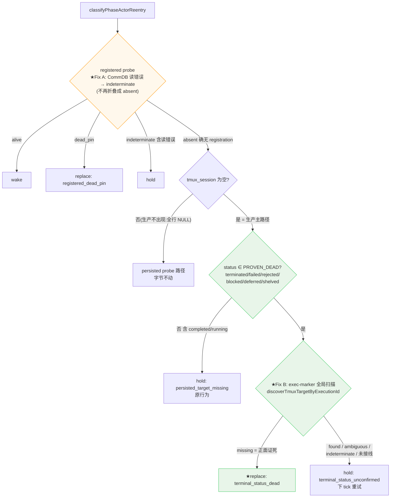

# FLY-1462 rework 永久 hold:terminated holder 空 tmux_session 误判 — 实施计划

Issue: FLY-1462 (https://linear.app/geoforge3d/issue/FLY-1462/infra引擎-rework-永久-holdpersisted-target-missing-terminated-holder-空)
日期: 2026-07-24
基于: research.md + claude-design-review-r1.md(v2:折入独立对抗性 review 的 2 HIGH + 3 MED 发现;v1 见 git 历史 64b5f43f)

## 0. 一句话

`classifyPhaseActorReentry` 的空 `tmux_session` 分支:当 FSM status 属 proven-dead 终态(terminated / failed / rejected / blocked / deferred / shelved)**且** FLY-1374 exec-marker 全局扫描给出正面死亡证据(`missing`)时,返回 `{kind:"replace", reason:"terminal_status_dead"}`;同时把 probe wiring 的 CommDB **读错误**从 `absent` 折叠中拆出(→ `indeterminate`)。其余情况(含 `completed`)维持原 hold。无 flag;部署后 FLY-1150 在 engine 下一个 reconcile tick 自愈。

**v2 与 v1 的差异(对抗性 review 结论)**:v1 只看 FSM status 就 replace。review 证实两条 v1 依赖的前提为假:①"cleanupPending 一定带 tmux target"——实际生产 **1423 行 session 的 `tmux_session` 全部为 NULL**(无生产写方,fly1329 pin test 实锤),空 target 分支是 registration-absent 后的**全部**生产路径,不是角落;② probe wiring 把 CommDB 读错误折叠成 `absent`,v1 会让一次瞬时 sqlite 锁把可恢复的 hold 变成不可逆的双写者。故 v2 要求**三重独立死亡证据**才 replace:FSM 终态 + registration 确无(error 不再算"无")+ marker 扫描确无窗口。

## 1. 核心流程图



## 2. 代码改动

### 2.1 `packages/teamlead/src/bridge/phase-actor-reentry.ts`(核心)

**(a) proven-dead 集合**(逐值注释,本地枚举不跨集合派生——仓内惯例):

```ts
/**
 * FLY-1462: FSM statuses that, TOGETHER WITH a positive exec-marker sweep
 * (see below), prove the holder can never be woken through the normal flow.
 * Status alone is NOT death evidence (FLY-1462 review MED-3: terminate infers
 * physicalGone from registration absence without killing — a never-registered
 * live runner can carry status=terminated with a live pane). Replacement in
 * the no-target branch therefore requires BOTH:
 *   (1) status ∈ this set, AND
 *   (2) discoverByExecMarker returns "missing" — a successful global tmux
 *       sweep (FLY-1374 @flywheel_exec_id window marker) finding NO window
 *       claiming this execution.
 * Enumerated value-by-value:
 *   - terminated — explicit kill route (FLY-1150 incident shape).
 *   - failed — crash outcome (pane at most a preserved forensic husk).
 *   - rejected / deferred / shelved / blocked — decision-layer terminal
 *     routes; FSM has no edge from any of these back to a live status, and
 *     `retry` dispatches a NEW executionId (never revives this row).
 * Excluded on purpose:
 *   - completed — parked-alive is its EXPECTED shape (three-stage park/reuse);
 *     a missing target is not death evidence there → keep hold.
 *   - running / pending / ship_parked / awaiting_review / approved_to_ship /
 *     design_done — live. approved / timeout — legacy/ambiguous → hold.
 */
const PROVEN_DEAD_HOLDER_STATUSES: ReadonlySet<string> = new Set([
	"terminated", "failed", "rejected", "blocked", "deferred", "shelved",
]);
```

**(b) 类型扩展**:

```ts
| { kind: "replace"; reason: "registered_dead_pin" | "persisted_target_dead" | "terminal_status_dead" }
| { kind: "hold"; reason: ... | "terminal_status_unconfirmed" }   // 新 hold 字面量
```

入参新增**可选**依赖(未接线 = 永远 hold,fail-closed 向后兼容):

```ts
discoverByExecMarker?(session: PhaseSession): Promise<RunnerTmuxTargetDiscovery>;
```

**(c) 空 target 分支**:

```ts
if (!input.session.tmux_session) {
	if (
		PROVEN_DEAD_HOLDER_STATUSES.has(input.session.status) &&
		input.discoverByExecMarker
	) {
		const sweep = await input.discoverByExecMarker(input.session);
		if (sweep.kind === "missing") {
			return { kind: "replace", reason: "terminal_status_dead" };
		}
		return { kind: "hold", reason: "terminal_status_unconfirmed" };
	}
	return { kind: "hold", reason: "persisted_target_missing" };
}
```

`found`(marker 窗还在)不 wake 也不 replace——一个 status 已终结却还挂着窗的 ghost 交给既有 patrol/人工,分类器保持 hold(下 tick 重试;与今日行为一致的保守面)。

### 2.2 `packages/teamlead/src/bridge/plugin.ts`(probe wiring,Fix A + Fix B 接线)

两处(rework coordinator effects ~9479;三段式 `probePhaseAlive` effects ~9139):

- `probeRegistered` / `probePhaseAlive`:`getTmuxTargetFromCommDb` → 改用 `lookupTmuxTarget`;`kind==="error"`(CommDB 锁/损坏)→ 返回 `"indeterminate"`(hold,下 tick 自愈);`kind==="gone"` → 维持 `"absent"`;`found` → 照旧探活。语义 `tmux-lookup.ts` 类型注释已定义("callers must treat this as cleanup-pending"),此前折叠是 FLY-228 遗留的信息丢失,本单让它变得 load-bearing,必须拆。
- 两个消费者的 classifier 调用都接线 `discoverByExecMarker: (s) => discoverTmuxTargetByExecutionId(s.execution_id)`(消费者 2 的行来自 ALIVE 过滤集、当前不可达 proven-dead 分支——接线是为契约一致,不为行为)。

### 2.3 不改的东西

- 有 target 的 persisted 探针路径:字节不动(生产不可达,测试可达)。
- registered probe 的 alive/dead_pin 分支、`TERMINAL_SESSION_STATUS`/`DEAD_QA_STATUSES`/`ZOMBIE_IRREVERSIBLE_TERMINAL_STATUSES`/`AUTO_CLOSE_STATES`、rework coordinator 与 orchestrator 的 kind-分支逻辑:零改动。
- 无 feature flag、无 env 开关(纯引擎逻辑修 bug,Annie 铁律)。

## 3. 行为对照表

| status | registered | marker 扫描 | 旧行为 | 新行为 |
|---|---|---|---|---|
| terminated 等六态 | absent | **missing** | **hold(永久死锁)** | **replace: terminal_status_dead** ★(FLY-1150 形态:窗已回收 → 扫描必 missing) |
| terminated 等六态 | absent | found / ambiguous / indeterminate | hold | hold: terminal_status_unconfirmed(ghost 窗在 → 不造双写者;下 tick 重试) |
| terminated 等六态 | **CommDB 读错误** | — | hold(碰巧安全) | hold: registered_liveness_indeterminate ★Fix A(错误不再穿透成 absent) |
| completed | absent | — | hold | hold(不变,parked-alive 保护;姊妹 hold 病留方案 D follow-up) |
| running 等活跃 | absent | — | hold | hold(不变) |
| 任意 | alive / dead_pin | — | wake / replace | 不变 |

消费者侧:rework coordinator 走 replace → `replacement_pending` → dispatcher `materializeWorkflowReworkReplacement` 派新 executionId(FLY-1150 解卡)。消费者 2(`isWakeTargetProvenDead`)的行经 `getAlivePhaseSession` ALIVE 过滤(`plugin.ts:9368`),与六态不相交——**不可达,无收益也无风险**(v1 声称的"同受益"已更正,见 review 记录 MED-4)。

## 4. TDD 测试计划

### 4.1 classifier 单测(`workflow-rework-coordinator.test.ts` it.each 扩展)

现 8 行全保留(夹具 status="completed" 不在集合,断言不翻转)。新维度 `status?` + `sweep?`:

| 用例 | 期望 |
|---|---|
| terminated + absent + 无 target + sweep=missing | replace: terminal_status_dead |
| failed / rejected / blocked / deferred / shelved(参数化)+ 同上 | replace |
| terminated + absent + 无 target + sweep=found | hold: terminal_status_unconfirmed |
| terminated + … + sweep=ambiguous / indeterminate | hold: terminal_status_unconfirmed |
| terminated + absent + 无 target + **未接线 discoverByExecMarker** | hold: persisted_target_missing(fail-closed 兼容) |
| running + absent + 无 target + sweep=missing | hold: persisted_target_missing(status 不在集合,sweep 不该被调用——断言 sweep 零调用) |
| completed + absent + 无 target(既有行) | hold: persisted_target_missing(显式保留) |
| terminated + absent + **有 target** + persisted=alive | wake(探针路径不被 status 短路) |
| terminated + registered=indeterminate | hold(registered 判定优先) |

`probePersisted` 调用次数断言维持;新增 sweep 调用次数断言(仅 proven-dead + 无 target + absent 时恰 1 次)。

### 4.2 coordinator 集成

terminated + 无 target + sweep=missing → `reconcile()` = `{kind:"replacement_pending", reason:"terminal_status_dead"}` + delivery 推进;对照组 sweep=found → `{kind:"held", reason:"terminal_status_unconfirmed"}` + alertHold 被调。

### 4.3 probe wiring(Fix A)

plugin wiring 层(或抽出的 wiring helper)测试:CommDB 读错误(mock `lookupTmuxTarget` 返 `{kind:"error"}`)→ probeRegistered 返 `"indeterminate"`;`gone` → `"absent"`。

### 4.4 回归

`workflow-engine-dispatcher.test.ts:1251,1303`(persisted_target_dead 探针路径)原样绿;fly1329 park-alive pin test(status="running",不受影响)原样绿;全仓套件(§5)。

## 5. 验证 gate(FULL REPO)

1. `pnpm lint`(biome 全仓) 2. `pnpm -r build` 3. `pnpm test:packages:run`(teamlead 机器态 flake 用 main HEAD 对照证伪,不当回归) 4. 目标套件单独跑。

## 6. 上线与自愈

- merge + Bridge 重启(随下一批量重启窗口)。重启后首个 reconcile tick:FLY-1150 delivery 被 claim(gen 981+)→ terminated + registration 确无 + marker 扫描 missing(窗早已回收)→ replace → replacement_pending → 新 implement runner。**无需人工解卡。**
- 取证点:`workflow_rework_delivery.last_error`:`persisted_target_missing` → `terminal_status_dead`;`rework_replacement_launched` 事件落库;新 runner 真实起跑。

## 7. 风险与守卫

| 风险 | 评估 | 守卫 |
|---|---|---|
| 误判活进程为死 → 双写者 | v2 要求三重独立正面证据:FSM 六态(无出边回活)+ registration 确无(error≠absent,Fix A)+ 全局 marker 扫描确无(Fix B)。tmux 扫描失败 → indeterminate → hold | 4.1/4.3 全场景;review HIGH-1/MED-3 场景各有专测 |
| **残余暴露**:FLY-1374 marker 是 dc754746(2026-07-23)才引入——之前 spawn 的活 pane 无 marker,扫描会 missing | 需同时满足"六态 + registration 确无 + pre-marker 活 pane"三条;pre-marker runner 天然随重启/退役在数日内清零,暴露窗时间衰减;当下(修复还没 merge)该窗口已在关闭 | 诚实记录;不为一个衰减中的窗口加机制 |
| 新 reason 字面量破坏下游 | 无生产代码按 reason 分支(grep 证实) | union 编译期 + 回归 |
| plugin wiring 改动波及其它 probe 消费 | 只改喂 classifier 的两处 wiring 闭包;`getTmuxTargetFromCommDb` 其它调用点不动 | diff 审查 + 全套件 |
| blocked 语义争议 | FSM 出边仅 {deferred, shelved, terminated};retry 派新 executionId 不复活旧行(review CLEAN 项已核) | 已由 review 核毕 |

## 8. 诚实边界

**修的是**:proven-dead 终态 + 无 registration + 无 marker 窗口的永久 hold(FLY-1150 病类,= 生产中该分类器 registration-absent 后的主路径)。
**不修**:① 真 indeterminate hold(正确保守);② `completed` + 失 target 的**姊妹永久 hold**(刻意保留 parked-alive 保护;连同 hold 可见性告警 = 方案 D,建议 Tadashi 立 follow-up 单——FLY-1150 坐到 generation 980 才被发现,靠的是 Annie 追问而非系统);③ `/loop-reentry` 可达性;④ 上游 target 卫生(`tmux_session` 列全生产 NULL、无写方——是否废弃该列另属别单);⑤ terminate 对未注册 runner 不尝试物理 kill 的推断链(review MED-3 根源,修在这里越界——本单以 Fix B 在消费端防御)。

## 9. Review 记录

- **独立对抗性 review(Claude stopgap R1,Tadashi 裁决的 FLY-1405 同款流程)**:CHANGES REQUIRED(2 HIGH + 3 MED + 4 CLEAN)→ 全部发现逐条 file:line 复核为真并折入本 v2。详见同文件夹 `claude-design-review-r1.md`。
- **Codex 正式 design review:PENDING**(school profile 配额 2026-07-29 22:35 恢复后补跑;届时以本 v2 为对象)。`design-review.json` 未写入,不伪造 APPROVED。
