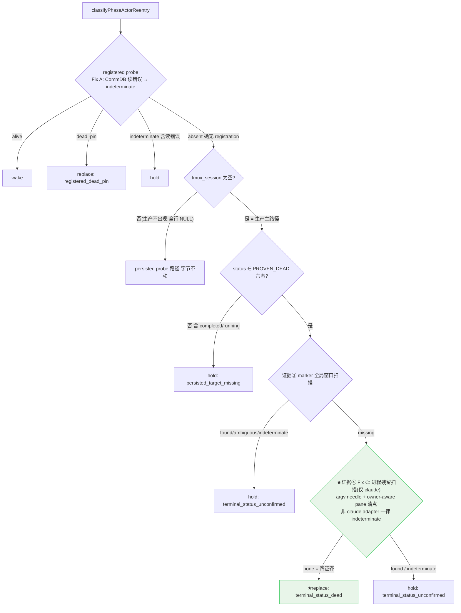

# FLY-1462 rework 永久 hold:terminated holder 空 tmux_session 误判 — 实施计划

Issue: FLY-1462 (https://linear.app/geoforge3d/issue/FLY-1462/infra引擎-rework-永久-holdpersisted-target-missing-terminated-holder-空)
日期: 2026-07-24
基于: research.md + claude-design-review-r1.md + Codex 正式 design review R1(v3;v1/v2 见 git 历史 64b5f43f / ada6dd86)

## 0. 一句话

`classifyPhaseActorReentry` 的空 `tmux_session` 分支:FSM proven-dead 终态(terminated / failed / rejected / blocked / deferred / shelved)**加上两道独立物理扫描都证死**(exec-marker 全局窗口扫描 `missing` **且** adapter-aware 进程残留扫描 `none`)才返回 `{kind:"replace", reason:"terminal_status_dead"}`;probe wiring 的 CommDB 读错误不再折叠成 `absent`(→ `indeterminate`);dispatcher 每个 eligible tick 恢复驱动持久化的 `replacement_pending`(crash recovery)。其余情况(含 `completed`)维持原 hold。无 flag。

**v3 与 v2 的差异(Codex 正式 design review R1,2 HIGH)**:
- **HIGH-1**:v2 拿"marker 扫描 missing"当死亡证明,但 marker 发布是 best-effort(`set-option` 失败只 warn,TmuxAdapter.ts:597-609),且 resident codex daemon 独立于带 marker 的 TUI 窗口存活(可被 reparent,CodexTmuxAdapter)。v3 增加**第二道直接、adapter-aware 的进程证据**(Fix C,见 §2.2):claude 族用 spawn CLI 携带的 Agent Team 身份 argv needle(`--agent-id runner-<execId8>@`,与 spawn 侧共用 `deriveRunnerMailboxIdentity` 派生,结构性防漂移;实测 macOS `ps` argv 跨进程可见、env 不可见),codex 用 adapter 持久化的 daemon pid(`codexSessionStateDir/session.json`,FLY-350 HIGH-3)。不复活 FLY-1374 已被 founder correction 废除的 capability 基建——这是 Codex 认可的替代路径("同等强度的直接、adapter-aware 进程死亡证明")。
- **HIGH-2**:`replacement_pending` 与 materialization 分属两个事务,Bridge 在其间崩溃后旧扫描(只看 `pending|turn_granted`)永不恢复。v3 让 `reconcileWorkflowReworks` 同时扫 `replacement_pending` 并幂等重驱动 `materializeWorkflowReworkReplacement`(request-scoped receipt `rework_replacement_materialized:<requestId>` 保证跨任意多 tick 恰好一个新 execution)。

## 1. 核心流程图

任一依赖未接线(marker 或 remnant)→ `persisted_target_missing`(fail-closed 向后兼容;流程图与代码/测试一致,修正 v2 LOW-3 不一致)。

## 2. 代码改动(实现终态,分支 flywheel-FLY-1462 / PR #700)

### 2.1 `phase-actor-reentry.ts`(核心分类器)
- `PROVEN_DEAD_HOLDER_STATUSES` 六态本地枚举(completed 刻意排除——parked-alive 常态)。
- 空 target 分支:六态 && marker 与 remnant 两依赖都接线 → 先 marker 扫描(非 missing → hold `terminal_status_unconfirmed`,不触 remnant)→ 再 remnant 扫描(`none` → replace `terminal_status_dead`;`found`/`indeterminate` → hold `terminal_status_unconfirmed`)。
- replace/hold reason union 各扩一个字面量;下游无按 reason 分支(research §6)。

### 2.2 `phase-actor-remnant.ts`(新,Fix C;R2 加固版)+ `phase-actor-probe.ts`(Fix A,已落)
- `probeActorProcessRemnant(session)` → `"none" | "found" | "indeterminate"`:
  - claude-tmux(含 adapter_type 缺省的 legacy 行)**两层**:① argv needle(`ps -axww -o command=`,needle = `deriveRunnerMailboxIdentity(execId,·).agentName` 与 spawn 同源)命中 → found;② **窗口记账(R2 HIGH-2)**:identity flags 是条件性的(commdb rollback / 缺 leadId / transport 失败会合法起一个无 needle 的 actor,`run-dispatcher.ts:335-345` + `TmuxAdapter.ts:147-155,776-805`),故 argv 零命中只有在**每个 `runner-*` session 的存活窗口都被 `@flywheel_exec_id` marker 正面归属给别的 execution** 时才算 none;任何**无 marker 的 runner 窗**=不可归属的活 actor → indeterminate;窗 marker=本 exec → found。快照/清点错误、空快照、execId<8 → indeterminate。
  - claude 窗口清点为 **pane-aware 且含 cmux**(R3 HIGH-2 + MED-1):`tmux list-panes -a` 清点 `runner-*` **和** `cmux-*` 两个受管命名空间(cmux linked view 在 base session 死后可为窗口唯一 holder,Scenario F 实证),按 window id 去重;**只有含 ≥1 个活 pane 的窗参与判定**——remain-on-exit 的 dead pin 不能写、也不得全局否决(否则任一无关无 marker 死壳会让 FLY-1150 永远 hold)。
  - codex-tmux(R3 HIGH-1,**显式保守边界**):瞬时负快照(shim pid ESRCH + socket 无 holder + 进程组空)不能证明"不会再 spawn"——codex goal runtime 在 transport death 后自动重启 daemon,下一代 pid/socket 在 initialize/ensureThread 完成前不可观测。可靠证明需要 adapter runtime 的 durable quiescence fence(follow-up);在此之前 codex 行**一律 indeterminate → hold + alertHold 人工收敛**,永不自动 replace。FLY-1150 与事故类均为 claude 行,自愈不受影响。R2 版的 lsof/ps 三事实探测随之删除(其 exit-code 语义问题 = R3 MED-2 一并消解)。
  - antigravity/kimi(no-transport)及未知 adapter → indeterminate(无进程身份签名;此类 runner 走 pr_handoff 终态、不进 wake 环,防御性分支)。
- `probeRegisteredPhaseActor`(Fix A):`lookupTmuxTarget` 的 `error` → indeterminate,`gone` → absent,`found` → 探活。

### 2.3 `plugin.ts` 接线(两处:三段式 effects ~9139 与 rework coordinator effects ~9479)
`probePhaseAlive`/`probeRegistered` 走 `probeRegisteredPhaseActor`;`discoverByExecMarker` + `probeProcessRemnant` 两个消费者都接线(消费者 2 `isWakeTargetProvenDead` 的行经 `getAlivePhaseSession` ALIVE 过滤,与六态不相交——接线为契约一致,非行为;v2 的"同受益"声称已更正)。

### 2.4 `workflow-engine-dispatcher.ts`(R1 HIGH-2 + R2 HIGH-3 crash recovery)
`reconcileWorkflowReworks` 扫描 states 增加 `replacement_pending`;对该态跳过 claim/coordinator,直接以 route 的 `preferred_actor_execution_id` + 新 uuid 调 `materializeWorkflowReworkReplacement`(reason=`replacement_recovered`;receipt 幂等,恰一 execution/launch)。**launch 收尾恢复(R2 HIGH-3 → R3 HIGH-3 原子化)**:launch 成功后的收尾是三个独立落盘(ledger `started` → node `running` → delivery `wake_delivered`,`markStarted`),中间崩溃会让 delivery 永卡 replacement_pending(`started` 是 ledger 终态,launch 扫描不再回访)。恢复走**新 StateStore 原子 finalizer** `finalizeWorkflowReworkReplacementLaunch`:单事务内全 context CAS(receipt 的 execution 与 route/delivery revision/node 绑定逐一核验)+ ledger `started` 行作为 durable launch 证据;node `admitted|running` → `running`,**`done` 保终态不回退**(fast-completed replacement,只收敛 delivery/verification);node 已被换绑到别的 execution → 拒绝且零写入。dispatcher 恢复分支只调 finalizer(`rework_replacement_not_started` = 尚未 launch 的正常答案,归 launch 扫描管)。

### 2.5 不改的东西
有 target 的探针路径、registered alive/dead_pin 分支、各终态词汇集、`getTmuxTargetFromCommDb` 其它调用点、无 feature flag。

## 3. 行为对照表

| status | registered | marker | remnant | 旧行为 | 新行为 |
|---|---|---|---|---|---|
| 六态 | absent | missing | **none** | hold(永久死锁) | **replace ★**(FLY-1150 形态) |
| 六态 | absent | missing | found(活 pane 无 marker / 孤儿 codex daemon) | hold | hold: terminal_status_unconfirmed(HIGH-1 场景堵死) |
| 六态 | absent | missing | indeterminate(ps 失败 / codex state 缺失) | hold | hold: terminal_status_unconfirmed |
| 六态 | absent | found/ambiguous/indeterminate | 不触 | hold | hold: terminal_status_unconfirmed |
| 六态 | **CommDB 读错误** | — | — | hold(碰巧) | hold: registered_liveness_indeterminate(Fix A) |
| completed / running 等 | absent | — | — | hold | hold(不变) |
| delivery=replacement_pending + Bridge 崩于 materialize 前 | — | — | — | **永久 strand** | 下个 eligible tick 幂等恢复物化 ★ |

## 4. 测试(全部已落,126/126 绿:coordinator 34 + remnant 21 + probe 3 + dispatcher 68)

- classifier(workflow-rework-coordinator.test.ts,34):六态×(marker missing+remnant none→replace);remnant found/indeterminate→hold;marker 非 missing→hold 且 remnant 不被触;任一依赖未接线→persisted_target_missing;running 不触扫描;completed 既有 hold 行保留;有 target 探针路径不被 status 短路;coordinator 级 replacement_pending 推进 + remnant=found 对照 held。
- remnant probe(phase-actor-remnant.test.ts,21):needle **用 `deriveRunnerMailboxIdentity` 本身构造 fixture**(派生漂移在测试处断);found/none/ps 错误/空快照/短 execId;raw parser 全形态(Lead strict view 排除 / runner-owned cmux+fwkeeper 纳入 / dead fwstage 折叠 / **ownerless grouped 回退**:runner group 计入并 veto、lead group 排除 / no-owner-no-group 抛 / 非法 pane_dead 抛);全部非 claude adapter 一律 indeterminate 且不触快照。
- probe(phase-actor-probe.test.ts,3):error→indeterminate / gone→absent / found→探活。
- dispatcher(workflow-engine-dispatcher.test.ts,68):**crash-seam 全谱** — 崩于 materialize 前(恢复物化+launch 恰一次、coordinator 不被触、receipt 重放不再 mint)、崩于 ledger-started/node-running 之后(finalizer 收敛 wake_delivered 不重 launch)、fast-completion(done 保终态、delivery held 人工收敛)、node 换绑(零写拒绝);既有 persisted_target_dead 探针路径用例原样绿。
- MED-1(Fix A blast radius,Codex 非 blocker):`probePhaseAlive` 是共享 effect,error→indeterminate 同时影响三段式 park/close 判定、TURN stale 判定、TURN recovery candidate 选择——方向均为 fail-closed(不误 close/不误 regrant);单元层由 probe 测试覆盖,三路径行为级回归记为 follow-up 测试债(见 §8)。

## 5. 验证 gate(FULL REPO)
`pnpm lint` + `pnpm -r build` + `pnpm test:packages:run`(teamlead 机器态 flake 用 main HEAD 对照证伪)。

## 6. 上线与自愈
- merge + Bridge 重启。**coordinator wiring 完成后的首个 eligible tick**(dispatcher 先于 wiring 启动,不承诺严格首 tick——Codex LOW):FLY-1150 delivery 重分类 → terminated + registration 确无 + marker missing(窗已回收)+ remnant none(进程早无)→ replace → replacement_pending → materialize → 新 implement runner。若 Bridge 恰在 advance 后崩,§2.4 恢复扫描兜住。
- **取证以 durable event 为准**(Codex LOW:launch 后 `last_error` 会被清 NULL):`rework_delivery_replacement_pending` / `rework_replacement_materialized` / `rework_replacement_launched` 事件 payload。

## 7. 风险与守卫

| 风险 | 评估/守卫 |
|---|---|
| 误判活进程为死 → 双写者 | 四重独立证据:FSM 六态(无出边回活)+ registration 确无(error≠absent)+ marker 窗口确无 + 进程残留确无(claude:argv needle + owner-aware pane 清点;非 claude 一律不判死)。历轮 review 的全部双写者场景(marker 发布失败活 pane、identity-less 合法 spawn、cmux/fwstage/fwkeeper sole-holder、孤儿 codex daemon、fast-completion 竞态)各有专测或被保守边界拦截 |
| argv needle 漂移 | needle 与 spawn 同源(`deriveRunnerMailboxIdentity`);测试用 helper 本身构造 fixture,派生一变测试即红 |
| `ps` 平台差异 | macOS 实测 argv 跨进程可见(env 不可见——早期 env-sweep 方案即因此被真机 spike 否决);扫描注入依赖,CI(Linux)单测不触真 ps;真 ps 行为属生产验收取证点 |
| 进程树残留无 needle(claude 子进程孤儿) | pane 回收杀进程树;残留孤儿窗口极小且不持 TURN;诚实记录,不加机制 |
| plugin wiring 波及其它 probe 消费(MED-1) | 三消费路径全部 fail-closed 方向;文档已改;行为级回归=follow-up 测试债 |
| replacement 恢复误驱动 | materialize 校验 delivery.state===replacement_pending + route/target 绑定,receipt 幂等;crash-seam 测试双 tick 断言恰一 launch |

## 8. 诚实边界
- `completed` + 失 target 的姊妹 hold 与 hold 可见性告警(方案 D)→ **follow-up 单**(Tadashi 已确认"立单,真洞")。
- **全部非 claude adapter 行(codex/antigravity/kimi/未知)不自愈**——一律 hold + alertHold 人工收敛;codex 的 durable quiescence fence(重启代际栅栏)= follow-up。
- **fast-completion 竞态的 rework 链补偿不做**(R4 HIGH-3 收缩,Tadashi 批):done 节点的 replacement delivery 保持 replacement_pending 由人工收敛;chain-aware 补偿 = follow-up。
- **owner-aware 清点两种拓扑全覆盖(R5 HIGH-1)**:strict 模式认 `@flywheel_cmux_owner`;受支持的 `FLYWHEEL_CMUX_STRICT_VIEW=0` grouped 回退(ownerless grouped view)认 `#{session_group}`(= base session 名,与 shell helper 同源证明)。既无 owner 又无 group 的 managed view、或 included 行 pane 状态不可判定 → **整个清点 fail-closed(indeterminate)**,绝不静默跳过。grouped 回退模式下 lead grouped view 被 group 排除,无 standing veto。
- `found`(ghost 窗/daemon 还在)→ hold,**无 marker-aware patrol 自动收敛**(v2 声称的"交给既有 patrol"已更正——现有 stale-terminal patrol 在 CommDB target 缺失时直接跳过;真实合同 = alertHold + 人工/follow-up,Codex MED-2)。
- MED-1 三路径行为级回归测试 = 测试债(方向 fail-closed,单元层已覆盖)。
- `tmux_session` 死列(全生产 NULL、无写方)归状态权威工作理(Tadashi 已确认记下)。

## 9. Review 记录
- Claude 对抗性 R1(quota 期 stopgap,Tadashi 裁决 FLY-1405 同款):CHANGES REQUIRED 2H+3M → 折入 v2(`claude-design-review-r1.md`)。
- **Codex 正式 design review R1(gpt-5.6-sol,xhigh,配额恢复后补审)**:CHANGES REQUESTED 2H+2M+3L → 全部折入(HIGH-1→Fix C 证据④;HIGH-2→§2.4;MED/LOW→文档+测试修正)。
- **Codex R2**:CHANGES REQUESTED 3H+1M —— HIGH-1 codex shim-pid ESRCH ≠ daemon tree 死;HIGH-2 claude identity flags 条件性;HIGH-3 launch 收尾三步崩溃窗;MED qa-report 旧证据。全部折入。
- **Codex R3**:CHANGES REQUESTED 3H+2M+1L —— HIGH-1 codex 三事实负快照仍敌不过 goal-runtime 自动重启的代际竞态(→ codex 收缩为显式保守边界,永不自动判死;quiescence fence = follow-up);HIGH-2 `cmux-*` sole-holder 漏扫(→ 清点纳入 cmux 命名空间);HIGH-3 finalization 无 CAS 会回退 `done`/覆盖换绑 execution(→ StateStore 原子 finalizer,done 保终态 + context CAS,fast-completion 与 rebound 两道新 seam 测试);MED-1 dead pin 全局否决(→ pane-aware 清点);MED-2 lsof/ps exit 语义(随 codex 收缩删除);LOW 测试数字(已更新)。R4 复审中。
