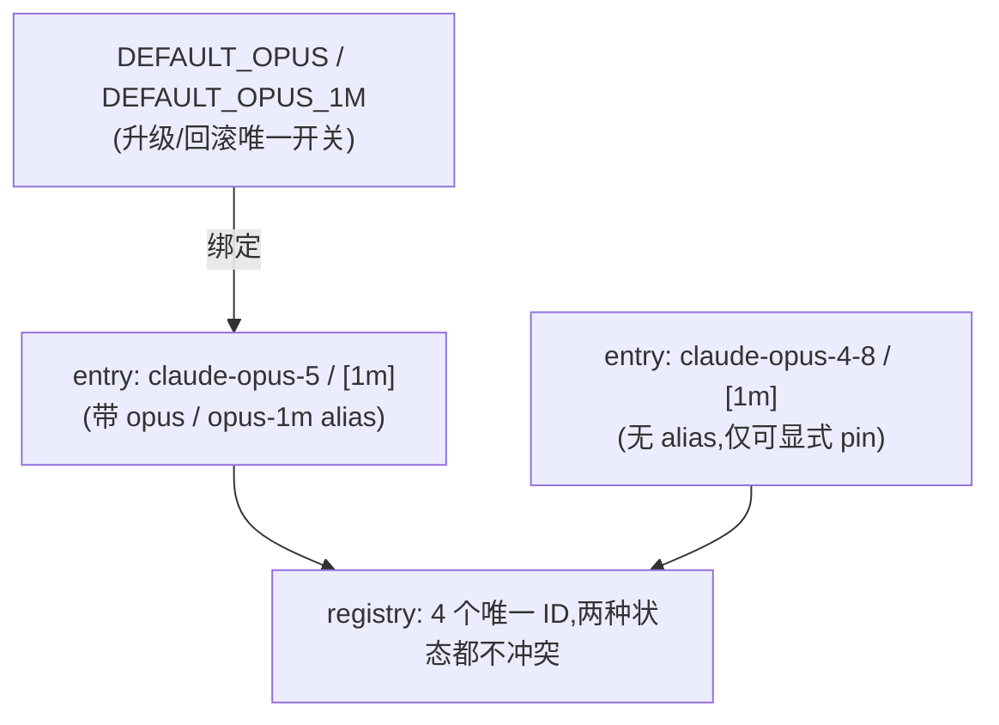

# FLY-1467 默认 opus 档 fleet-wide 升级到 Opus 5 — 实施计划

Issue: FLY-1467 (https://linear.app/geoforge3d/issue/FLY-1467/infra-把默认-opus-档升级到-opus-5fleet-wide-注册表加-claude-opus-5-repoint-opus)
日期: 2026-07-24
基于: exploration.md, research.md, Codex 设计评审 R1 + R2
Version: v1.58.0(暂定,ship 取空号)

## 0. 前提(已闭环)

`claude-opus-5` + `claude-opus-5[1m]` 用生产 OAuth 实测可调、自报身份正确、阴性对照证明 CLI 会验不会静默降级(exploration §2)。Opus 5 = Opus 4.8 同价($5/$25)。**放行 repoint。**

## 0.1 R1 评审后的三处修订(Codex 提,已核实接受)

| # | R1 发现 | 我原方案错在哪 | 本版怎么改 |
|---|---|---|---|
| HIGH-1 | 「翻两行常量回滚」不可执行 | 保留 legacy 条目后把 OPUS 值翻回 4-8 → **两个条目同 id** → `assertValidModelRegistry` import 时抛错,Bridge 起不来;且已迁成全字面量的 pin 根本不跟着回滚 | **身份与绑定分离**(§1):固定 ID 永不改值,单独 binding 决定 `opus` 指向谁 → registry ID 恒唯一,回滚不可能撞 id;并承认 pin 回滚是多文件操作,写全 runbook |
| HIGH-2 | 漏 3 个 `*_land_v1` seed + 1 个运行时 Lead 规则文件 | 只列了 4 个 seed;且 **generalized DAG 的 QA 模型来自 seed 硬编码值,不跟随 medium** | §2-H 补齐 3 seed + `lead-rules-base/model-routing.md`;加默认绑定级测试 |
| HIGH-3 | 活配置边界描述错 | 我称「9 个 runner 角色经 ConfigLoader→normalizeDispatchModel 校验,不改会让 Bridge 起不来」——**全错**:它们是 `projects[].leads[].model`,走 `ProjectConfig`,只查非空+控制字符 | §5 重写为 **Lead fleet 迁移**;迁移理由从「防崩」改为「**防 9 个 Lead 静默漏升**」 |

MEDIUM-4(legacy 条目会变成 console 新可选档)升为**待 Annie 决策第 4 项**,见 §6。

## 1. 设计:模型身份 ↔ 默认绑定分离(HIGH-1 的治本改法)

原方案把「`opus` 指向谁」编码在 `MODEL_IDS.OPUS` 的**值**里,所以回滚必须改值 → 撞 id。本版拆开:

**R2-HIGH-2 修订:下面是写死的 API 契约,不是留给实现者判断的方向。**

```ts
// ① 身份层:只有固定 ID,值永不改动 → registry ID 恒唯一
export const MODEL_IDS = {
  ...
  OPUS_5: "claude-opus-5",     OPUS_5_1M:  "claude-opus-5[1m]",
  OPUS_48: "claude-opus-4-8",  OPUS_48_1M: "claude-opus-4-8[1m]",
} as const;
// ⚠️ MODEL_IDS 内**不得**再有 OPUS / OPUS_1M 这类可变默认成员(R2:那会削弱 identity-only 不变式)

// ② 绑定层:唯一的可动开关
export interface DefaultOpusBindings { readonly opus: string; readonly opus1m: string; }
export const DEFAULT_OPUS_BINDINGS: DefaultOpusBindings = {
  opus:   MODEL_IDS.OPUS_5,     // rollback → MODEL_IDS.OPUS_48
  opus1m: MODEL_IDS.OPUS_5_1M,  // rollback → MODEL_IDS.OPUS_48_1M
};
export const DEFAULT_OPUS    = DEFAULT_OPUS_BINDINGS.opus;
export const DEFAULT_OPUS_1M = DEFAULT_OPUS_BINDINGS.opus1m;

// ③ 纯工厂:registry 与 dispatch lookup 都由 bindings 构造(测试可注入两态)
export function buildModelRegistry(b: DefaultOpusBindings): readonly ModelRegistryEntry[];
export function buildDispatchLookup(b: DefaultOpusBindings): ReadonlyMap<string, string>;
// 生产实例 = 用 DEFAULT_OPUS_BINDINGS 构造
export const MODEL_REGISTRY = buildModelRegistry(DEFAULT_OPUS_BINDINGS);
```

- `opus` / `opus-1m` alias 与 `dispatch` surface 曝光**都由 bindings 决定**,挂在被绑定的条目上 → 两态都不会 alias 冲突 / id 重复;回滚时 alias、默认 ID、dispatch catalog 曝光**一起移动**(R2 点名的要求)。
- **消费方一律直接用 `DEFAULT_OPUS` / `DEFAULT_OPUS_1M`**,不再用含糊的 `MODEL_IDS.OPUS*` 兼容成员 —— 含 `MODEL_TIERS.medium.id`、`runner-label.ts`、`claude-review-runner.ts`。
- **漂移哨兵**:断言 `buildModelRegistry` 与 `buildDispatchLookup` 用的是同一 bindings(两个工厂不得各自漂移)。
- 测试用两套 bindings(Opus 5 / Opus 4.8)各构造一次,跑 alias、registry 冲突、medium、1M、catalog 断言 —— 单次 build 内即可覆盖双态(module-level `const` 做不到,故必须参数化)。



## 2. 逐文件改动(单 PR,不含任何 API 调用代码)

**A. `model-registry.ts`** — 按 §1 加 4 个固定 ID + `DEFAULT_*` binding;4 个条目(opus-5 / opus-5[1m] / 4-8 / 4-8[1m]),alias 按 binding 挂;label 分别 "Opus 5" / "Opus 5 (1M)" / "Opus 4.8" / "Opus 4.8 (1M)"。**legacy 两条永久保留 `workflow` 等运行时 surface**(§2-A′ 已证明去掉会让已发布 4.8 revision dispatch 失败);「能不能被新选」由新增的 `selectable` 元数据控制,**不靠收窄 `surfaces`**。

**B. `model-tiers.ts`** — `medium.id = DEFAULT_OPUS`;`ONE_M_DISPATCH_MODELS`:`opus-1m`→`DEFAULT_OPUS_1M`、`DEFAULT_OPUS_1M`→自身;新增 `LEGACY_DISPATCH_MODELS`(4-8、4-8[1m] → 自身)折进 `buildDispatchLookup`。

> **R2-HIGH-1 更正**:`LEGACY_DISPATCH_MODELS` 只覆盖 **`/api/runs/start`** 与 **小红书 collection model** 两条边界。~~以及 workflow manifest~~ —— **错**:workflow manifest 走 `getModelRegistryEntry` + `isModelSelectionSupported(workflow)`(`workflow-template.ts:211-230`),已发布 revision 在真 dispatch 时再验一次(`workflow-dispatch-resolution.ts:67-79`),**根本不经过 `DISPATCH_MODEL_LOOKUP`**。workflow 的兼容性由 §2-A′ 单独解决。

**A′. 「运行时可接受」与「可被新选」解耦(R2-HIGH-1,实现前必须定)**

现状把两件事绑在同一个 `surfaces` 成员上:`workflow-template.ts:211-230` 用 `isModelSelectionSupported(workflow)` 验 manifest,而 `buildModelCatalog` 又把带该 surface 的条目**全部广告**出去(`model-registry.ts:185-199`)。于是:

| 做法 | 后果 |
|---|---|
| legacy 条目**去掉** `workflow` | 已发布/founder-owned 的 4.8 revision **dispatch 时校验失败** → 生产回归 |
| legacy 条目**保留** `workflow` | 4.8 变成 workflow 面**可新选**模型 → 与决策 4「不要新选」矛盾 |

`resolveCurrentModel().legacyCurrent` **解决不了** —— 它只产出 current-value 视图,校验路径仍走 `isModelSelectionSupported`。

**定法(已选 (a),不再是开放项 — R3 要求)**:

采用 **(a) per-surface `selectable` 元数据**。语义一刀切开:
- `surfaces` = **运行时可接受**(`isModelSelectionSupported` 用它)→ legacy 条目**永久保留** `workflow`,已发布 revision 永远能验能跑。
- 新增 `selectableSurfaces`(默认 = `surfaces`;legacy 条目按决策 4 置空或收窄)= **可被新选**,**只**供 `buildModelCatalog` 与新写入路径过滤。

(未选 (b) 显式 legacy-current 校验通道:它要在持久化与新写入之间劈一条平行校验路径,改动面更大、且两条路径易漂移;(a) 是纯加性元数据,`surfaces` 语义不动 → 现有校验字节不变。)

**关键推论:决策 4 只影响 catalog / 新写入,永远不影响运行时可接受性。** 所以决策 4 无论怎么拍,已发布的 4.8 revision 都不会挂。

**A′-1 具体 API(R4:不能只停在语义层)**

1. `ModelRegistryEntry` 加 `selectableSurfaces`,缺省 = `surfaces`;`assertValidModelRegistry` 断言 **`selectableSurfaces ⊆ surfaces`**。
2. 新增 **`isModelSelectable(...)`**;`isModelSelectionSupported(...)` 保持「运行时可接受」语义(或改名以免混淆)。**两者不可互相顶替。**
3. `buildModelCatalog` 与 **`resolveCurrentModel().selectable`** 改用 `selectableSurfaces`(R4 点名:后者现在从 `entry.surfaces` 算,不改就仍把 legacy 4.8 报成 selectable)。

**A′-2 写入侧强制点(逐个点名,不写「新写入路径」这种含糊话)**

| 调用点 | 改法 |
|---|---|
| `management-dag-writer.ts:117-128` | `input.desired` 改用 `isModelSelectable`;**revision 里既有的无关 legacy 节点继续放行** |
| `StateStore.ts:14278-14299` `createWorkflowTemplateRevision` | 加 selectable 强制 |
| `StateStore.ts:14347-14364` management revision 创建/发布 | 同上 |
| `StateStore.ts:14530-14541` boot seed import | **保持运行时语义**(导入既有 seed,不是新选) |
| `workflow-template.ts:1166-1175,1275-1277,1311-1322` seed 加载 / override / materialize | 区分**新选节点**与**被无关编辑带过的既有 legacy 节点**:仅前者受 selectable 约束 |

判据统一为:**「本次编辑新选的模型」受 `selectableSurfaces` 约束;「revision 里原样带过的既有模型」只受 `surfaces` 约束。**

**A′-3 selectable 从 binding 派生(R4-MEDIUM,回滚态正确性)**

**不按「是不是 legacy」写死,按「当前是否被绑定」派生**:
- **当前被绑定**的 Opus / Opus-1M 条目 → 永远拿到正常的 selectable surfaces(所以回滚态下 4.8 是真默认,catalog **必须**列出它)。
- **决策 4 只管**正向态下「非默认的 4.8」是否额外可选。
- 回滚态下**未被绑定的 Opus 5**:同样按此规则退成非默认,其可选性沿用决策 4 的对称处理(plan 默认:与正向态的 4.8 同策)。

**契约测试(§3.9,每个对外可达的 authoring 边界各一条,不是一条笼统「新写入」测试)**:① 已发布 4.8 revision 仍验证并 dispatch;② 决策 4=否时,**上表每个写入点**都不能新选 4.8;③ 同条件下 catalog 不列 4.8;④ **回滚态**下被绑定的 4.8 在每个应有 surface 的 catalog 里出现,且 `resolveCurrentModel` 报 selectable。

**C. `runner-label.ts:91`** — `"claude-opus-4-8[1m]"` → **`DEFAULT_OPUS_1M`**(非 `MODEL_IDS.OPUS_1M` —— 见 §1:消费方一律用 binding)。该文件**当前无任何 import**,需新增 value import(Codex 已核)。

**D. `claude-review-runner.ts:83`** — `DEFAULT_MODEL` → **`DEFAULT_OPUS`**(非 `MODEL_IDS.OPUS`,同上)。teamlead 已依赖 flywheel-config,config index 已导出,无需新依赖(Codex 已核)。**待 Annie 拍(§6 决策 3)。**

**E. `token-usage/src/pricing.ts`** — 新增 `"claude-opus-5": { input: 5, output: 25, cacheRead: 0.5, cacheWrite: 6.25 }`(= 4.8 行逐字同值);保留 4.8/4.7/4.6 历史行。

**F. `render-html.ts`** — 新增 `"claude-opus-5": "Opus 5"` + **不与 4.8 `#ff3b30` 重复**的颜色;保留 4.8 行。

**G. 注释** — `three-stage-phases.ts:12`、`fleet-capabilities.ts:9-14` 描述更新。**`fleet-capabilities.ts` 的 `id: null` label 保持 "Opus 4.8" 不动**(那是 Claude 账号默认,改 MODEL_IDS 不改变它;除非有真实无-`--model` 运行取证,否则改了就是说谎 — MEDIUM-4)。

**H. config / seed / 运行时策略(HIGH-2 补齐)**

| 文件 | 现值 | 改为 |
|---|---|---|
| `.flywheel/config.yaml:46` | `claude-opus-4-8[1m]` | `claude-opus-5[1m]` |
| `workflow-seeds/tpl_eng.yaml:20` | `claude-opus-4-8` | `claude-opus-5` |
| `tpl_eng_heavy.yaml:21` | 同上 | 同上 |
| `tpl_eng_light.yaml:20` | 同上 | 同上 |
| `tpl_product_prototype.yaml:20` | 同上 | 同上 |
| **`tpl_eng_land_v1.yaml:18-22`** | 同上 | 同上 |
| **`tpl_eng_heavy_land_v1.yaml:19-23`** | 同上 | 同上 |
| **`tpl_eng_light_land_v1.yaml:18-22`** | 同上 | 同上 |
| **`lead-rules-base/model-routing.md:21-46`** | 文案写 "Medium = Opus 4.8"、"opus-1m = Opus 4.8" | 改为 Opus 5 |

**加粗四条是 R1 补的。** 前三个是 bundled seed 且 heavy/light land 是**当前默认工程 binding**;第四个由 `claude-lead.sh:2497-2506` 装进每个非-cos Lead 的 rules bundle,是**运行时策略不是历史文档**。
`__tests__/fixtures/fly1262/project-config.yaml:23` 保持 4-8(向后兼容仍有效,减少 churn),除非其断言 medium 默认解析。

## 3. 测试矩阵(MEDIUM-5:覆盖真实边界,不只纯函数)

1. **registry 双态**:升级态 + **回滚态**(binding 翻回 4-8)各构造一次 registry 跑 `assertValidModelRegistry` 不抛;两态下 `opus`/`opus-1m`/medium 解析正确。
2. **`/api/runs/start` integration**:`opus`/`opus-1m` → Opus 5;`claude-opus-4-8`、`claude-opus-4-8[1m]` **原样接受**;未知 ID 仍 `INVALID_MODEL` fail-loud。
3. **runner-label**:`opus-1m` → `claude-opus-5[1m]`;与 `opus` 同时出现时 1M 优先级不变。
4. **默认 DAG 绑定级**:加载 bundled seeds → 解析 `DEFAULT_ENGINEERING_WORKFLOW_BINDINGS` 指向的每个当前默认 template → 断言所有 Claude QA/review Opus 节点 = `claude-opus-5`。(这条直接防 HIGH-2 复发)
5. **fleet catalog**:显式 Opus 5 / Opus 5 (1M) 存在;legacy 选项行为符合 §6 决策;`null` account-default label 仍为 "Opus 4.8"。
6. **pricing / HTML**:Opus 5 有定价;报告**真渲染** Opus 5 label + legend 且颜色不撞 4.8。
7. **ProjectConfig**:旧 Lead pin(`leads[].model = claude-opus-4-8[1m]`)仍通过校验(边界事实锁定,防再次误述)。
8. **回滚反向迁移**:回滚态下 direct pins 的反向迁移断言。
9. **workflow 三契约(R2-HIGH-1)**:① 已发布 4.8 revision 仍验证并 dispatch 成功;② 决策 4=否时新写入不能选 4.8;③ 同条件下 catalog 不列 4.8。
10. **漂移哨兵(R2-HIGH-2)**:`buildModelRegistry` 与 `buildDispatchLookup` 使用同一 bindings。

## 4. Build / 本地验证

全仓 `pnpm -r build` + `pnpm lint` 绿;焦点测试 config / token-usage / teamlead。

**grep 守卫改为两类 allowlist(R1 措辞修订)** —— 旧措辞「只要仍被接受就可留」会把漏掉的 land seed 当成合规 pin 放过:
- **允许留**:legacy 身份常量、pricing/label 历史行、注释、fixture。
- **必须迁走**:一切 active default / runtime policy / seed。

## 5. 部署交接(founder-gated ship,不在本设计节点)

> 自托管 ship 走 restart-services / 分离式 handoff,**绝不** inline 重启(FLY-270)。

**5.1 Lead fleet 迁移(HIGH-3 重写)** —— 生产 `~/.flywheel/projects.json` 的 9 处 `claude-opus-4-8[1m]` 在 `projects[i].leads[j].model`(行 25/38/51/78/200/214/228/302/316),经 `loadProjects` → `parseAndValidateProjects`,**只查非空 + 控制字符,不调 normalizeDispatchModel**。

- **迁移理由 = 防 9 个 Lead 静默漏升**(它们不会报错,会安静继续跑 4.8),**不是**防 Bridge 起不来。
- **怎么迁**:走现有 fleet transaction / apply 机制;或至少原子写 + 备份 + 跑 `parseAndValidateProjects` / 现有 CLI validator + manifest/plist 重生 + 逐 Lead 重启。**不许把一次未验证的 JSON 文本替换当作充分迁移。**

**5.2 其余** — build dist;seed 变更由 Bridge boot import 为新 published revision,但 **founder-owned seed mismatch 会被拒**(`StateStore.ts:14543-14631`)→ 部署验证必须查 seed-import audit / 当前 published revisions,并审计 founder-owned 或自定义 manifest 里仍 pin 4.8 的节点,**不能只 grep checkout**;config 落地后若动过 config 须再重启一次 Bridge(FLY-205 教训)。

## 6. 待 Annie 决策(4 项)

1. **opus-1m 升 `claude-opus-5[1m]`?** 推荐升(已实测可调)。
2. **三段式 QA 阶段跟升** —— medium 自动跟随的必然结果。她的信号:「QA 测试用 4.8 勉强也还可以,但是新的话都要用 Opus 5」→ 倾向跟升。
3. **review runner `DEFAULT_MODEL` 升?** 推荐升(reviewer 不应弱于被审工作)。
4. **【R1 新增,R3 收窄】旧 Opus 4.8 是否继续作为 console/workflow/cron 的「可新选档」?** 加 legacy 条目会让 Fleet Console 多出可主动选择的 Opus 4.8 / 4.8 (1M) —— 产品面扩张,需她拍。
   **注意作用域(R3 澄清)**:本决策**只**控制 `selectableSurfaces`(catalog 与新写入),**不**影响 `surfaces`(运行时可接受)。~~应收窄 legacy 条目的 surfaces~~ **(作废 — 收窄 `surfaces` 会打断已发布 4.8 revision 的 dispatch,见 §2-A′)**。因此这条决策**不阻塞实现**:默认按「否」(不可新选)实现,她若要「是」只需放开 `selectableSurfaces`。

## 7. 独立 QA(code 改动必过)

`opus` dispatch → **真 runner pane** 显示 `--model claude-opus-5`(终点取证);默认 DAG 的 QA 节点真跑 Opus 5;9 个 Lead 迁移后**真的在 Opus 5 上**(不是只看 JSON 改了);fleet console 显示 Opus 5 且 `null` 仍显示 Opus 4.8;token 日报识别 opus-5;byte-compat:旧 pin 路径不 break。

## 8. 回滚(HIGH-1 重写 —— 不再声称「翻一行、零风险」)

**两层,必须都做:**
1. **绑定层**(轻):`DEFAULT_OPUS` / `DEFAULT_OPUS_1M` 翻回 4-8 → rebuild → restart。因身份与绑定分离,registry ID 恒唯一,**不会**出现重复 id 崩启动。这层能回退:`opus`/`opus-1m` alias、medium 档、three-stage QA、runner-label、review runner。
2. **直接 pin 层**(重,必须反向迁移):9 个 Lead pin + **§2-H allowlist 里的全部 9 行**(`.flywheel/config.yaml` runner default、**7** 个 workflow seed、`model-routing.md`)。**这些是全字面量,不引用 binding,绑定层翻转对它们无效。**

回滚 runbook 必须含备份恢复或精确反向 migration,并跑 §3.1 的回滚态 sentinel。

## 9. 下一门

R2 codex 设计评审 → APPROVED 后交 DAG 派 implement 节点(实现 + PR);部署 ship 单独 founder-gated。HTML v2(防漏措辞)在 plan 定稿后把路径交 Tadashi 由他投递。

## 10. Follow-up(FLY-1467 后续 — Tadashi 05cde232 裁决,2026-07-24)

05cde232(generic 模板清空)撞到两条架构不变式,裁决:**本 PR 走 C 的可落地半**,其余归入独立 follow-up **B**(capable-generic 节点类型)。

- **本 PR 已做(C 的安全半)**:`tpl_generic.yaml` execute 节点加 `produces_output: true` + 必需的 `output` 契约(`node produces_output=true requires output`,workflow-template.ts)。零爆炸半径(per-node 覆盖,不碰 node-type-registry)。
- **归入 B follow-up(独立 issue + review)**:
  1. **capable-generic 节点类型**:新增只给 tpl_generic 用的节点类型,放开 `shared_branch_writer` / `creates_pr`、`completion_route` 不钉 `no_code`。**不改 `generic` 类型本身**(它还被 tpl_product_prototype / tpl_product_v1(2 节点)/ tpl_product_designer 复用,改类型会把这 4 个产出型无代码产品工作流变成建-PR/走-review,破它们)。四个产品 seed 保持老 generic 不动。
  2. **「零 prompt 干净 session」(去 agent_file)**:被 `generic node must define exactly one of role or agent_file`(workflow-template.ts:874)拦下——generic 节点必须有 role 或 agent_file 其一,去掉 agent_file 且不加 role 直接违反不变式(19 测挂)。要「零 prompt」须放开该不变式(生产代码改,影响所有 generic 节点校验),且要一并想清 FLY-217 Blueprint 兜底(无 agent.md 时注入 `agents/generic-executor.md`)——去 seed agent_file 可能反而触发同一文件的兜底注入。这层放进 B 与 capable-generic 类型一起设计。
- **第 3 条指令(generic dispatch vendor/model 解锁 —— 模型写档位 alias、派单参数生效)**:**落在本 PR**(per-node seed dispatch 层,不撞类型注册表)。证据:`vendor`/`model`/`effort` 是 per-node manifest 字段;seed 里写档位 alias 已被支持(`tpl_product_prototype` 的 review 节点就写 `model: opus`,经 registry 解析)。**注**:该指令原文未落到 exec-id 的 CommDB(inbox 仅 88eeaa9e + 05cde232 两条),故精确 seed 改动待 Tadashi 补发规格。
