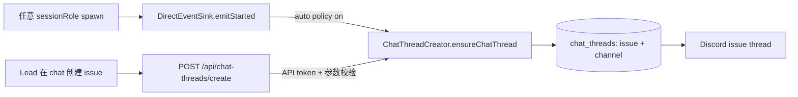

# FLY-147 聊天驱动 Issue Thread — 探索
Issue: FLY-147 (https://linear.app/geoforge3d/issue/FLY-147/chat-driven-issue-creation-auto-discord-thread-when-lead-spawns-new)
日期: 2026-08-30
基于: 无

## 1. 目标与锁定范围

当 Lead 在自然聊天中创建 Linear issue，或为任意 `sessionRole` 启动 Runner 时，系统必须存在一条可靠路径为该 issue 创建/复用 Discord thread。范围只覆盖 Bridge 的 thread 能力、Runner 启动触发和 Lead 操作文档；不改 Linear issue 创建语义、不改 Discord 消息内容、不引入新的编排器。

验收口径：

1. `main`、`qa`、`designer` 与自定义 role 的 Runner 都能得到同一套 thread 创建能力。
2. 尚未 spawn Runner 的 ad-hoc issue 也能由 Lead 显式创建 thread。
3. 现有 engineer/main 自动创建行为保持不变。
4. 文档逐条说明自动与手动路径的触发、配置和失败降级。

## 2. 当前事实

- `DirectEventSink.emitStarted()` 已在 `session_started` 时调用 `ChatThreadCreator.ensureChatThread()`，其分支不判断 `sessionRole`；因此底层自动路径本身已经 role-agnostic。
- `POST /api/chat-threads/create` 已支持 `issueId` 或 `issueIdentifier`，并复用同一 `ChatThreadCreator`，因此未 spawn 的 Linear issue 具备手动创建所需的数据流。
- 两条路径被同一个进程级开关 `TEAMLEAD_CHAT_THREADS_ENABLED` 一起关闭。当前解析只有值严格等于 `"true"` 才启用；这直接解释了实证中的 `{"error":"Chat threads not enabled"}`。
- `ChatThreadCreator` 只在该开关启用时实例化，因此不能仅移除 HTTP route 的 404 guard；必须同步调整 composition root，否则 route 会转为 503。
- `chat_threads` 以 `(issue, channel)` 作为 canonical mapping；现有 FLY-892 语义保证同 issue 的不同 phase/role 复用一条 thread。

## 3. 方案比较

### 方案 A：现有总开关默认开启

把 `TEAMLEAD_CHAT_THREADS_ENABLED` 改成 default-on、显式 `false/0/off` 才关闭。自动与手动路径同时可用，改动最小。

优点：直接消除部署漏配导致的 404；任意 role 自动创建立即可用。
缺点：把“是否暴露 thread 能力”和“是否每次 spawn 自动创建”继续绑死；未配置 API token 的旧安装可能无意中暴露可写 route；无法单独保留手动能力并关闭自动噪音。

### 方案 B：拆分 capability 与 auto policy（推荐）

始终构造 Bridge-local `ChatThreadCreator` 并开放受现有 `/api` 鉴权保护的 `/chat-threads/create`、查询和注册能力；`TEAMLEAD_CHAT_THREADS_ENABLED` 只控制 `session_started` 自动创建、自动 enrichment 等后台行为。自动分支继续使用现有 role-agnostic `DirectEventSink`。

优点：精准打通 ad-hoc 手动路径；保留现有 engineer 自动行为和关闭自动创建的运维选择；不需要增加 role 白名单或新状态机。
缺点：需要把若干 route guard 从“功能总开关”改成“依赖是否可用/鉴权是否配置”的明确判定，并更新旧的 feature-off 测试合同。

安全边界：写 Discord 的手动 route 必须继续处于 `/api` token middleware 后；若没有 `TEAMLEAD_API_TOKEN`，应 fail-closed，而不是因为 capability 常驻就变成匿名写入口。

### 方案 C：新增 project-level `autoCreateChatThread`

在 `ProjectEntry` 增加项目级策略，spawn 时按项目决定是否自动创建；手动 route 独立常驻。

优点：最符合多项目差异化运维。
缺点：本 issue 的实证只有单个全局开关误配，增加 schema、校验、配置迁移和 precedence 属于超出必要范围；未来可在方案 B 的 auto policy seam 上增量实现。

## 4. 推荐设计

采用方案 B：Bridge 的 thread creation capability 与自动触发策略解耦。

数据流：

- 手动路径不依赖 Runner/session 存在；Linear preflight 用 identifier/UUID 解析 issue。
- 自动路径只依赖项目 Lead 的 `chatChannel` 与 bot token，不依赖 `sessionRole`。
- 两条路径统一落 `ensureChatThread()`，已有 thread 返回 `created:false`，并发创建由现有去重/映射逻辑处理。
- `TEAMLEAD_CHAT_THREADS_ENABLED=true` 继续表示自动创建与自动 thread enrichment 开启；关闭时 Lead 仍可显式 `/create`。
- 缺 API token、Linear key、bot token、项目/Lead/channel 不匹配均显式失败，不吞错；自动路径保持 warn + Runner 继续启动的降级语义。

## 5. 明确不做

- 不按 `sessionRole` 分叉创建逻辑或维护 allowlist。
- 不新增 thread 表、Discord API client 或新的 issue→thread key。
- 不把 Linear issue 创建与 Runner spawn 合成新的事务 API。
- 不在本期加入 project-level policy；composition seam 保留后续扩展空间。
- 不改 `CLAUDE.md`。

## 6. 待 research 验证

1. 哪些 `/chat-threads/*` route 会写 Discord，哪些只是本地查询；只有写入口需要新的 fail-closed token guard。
2. `createBridgeApp` 单测能否在不启动完整 Bridge 的情况下表达“auto off + manual create on”。
3. `DirectEventSink` 现有测试是否覆盖非 `main` role；若没有，新增参数化回归测试。
4. 现有运维/Lead 文档中，哪些地方把总开关描述成 route capability，需要同步改为 auto policy。
