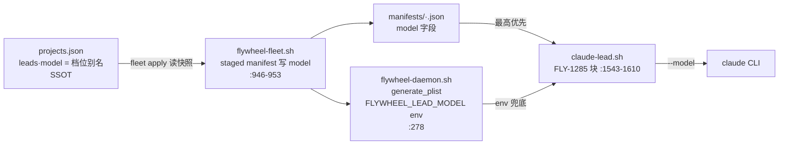

# FLY-1496 模型解钉根治 — 探索

Issue: FLY-1496 (https://linear.app/geoforge3d/issue/FLY-1496/v2批次0-模型解钉根治-别名表配置化-manifest-实时派生-mid-session-漂移调查-难度选型禁-opus-48)
日期: 2026-07-27
基于: 无

## 1. 问题理解

Founder 直令(2026-07-27):"我不太想用 Opus。你先去把这个问题解决了,我们尽量都用 Fable 和 Codex。"
运维止血已做(`.env` TEMPLATE_DISPATCH 去重=0 + 统一重启),本单做**代码级根治**,四个范围:

1. **别名表配置化** — 模型别名/绑定从代码常量 → 配置文件,改配置即生效(热读),不改码不重启。
2. **manifest 根治** — `~/.flywheel/manifests/<project>-<lead>.json` 从"生成一次的落地文件"变为每次启动从 projects.json 实时派生(或删除该层);重启后不得回旧值。
3. **漂移调查** — 找全 mid-session 模型变化来源,产出报告;任何 fallback 目标也不得落 `claude-opus-4-8`。
4. **难度选型落地** — 派发侧按难度选 Fable 5 / GPT(Codex) / Opus 5 的映射入配置;禁 4.8 写成机器校验。

单 session generic 执行,不走三段式(冻结期规则);ship 走 founder gate。

## 2. 代码审计发现(带证据)

### 2.1 病根 1:manifest 是"抄一份然后过期"的输入

模型值的完整链路(Lead 侧):



- **manifest 优先级最高压过 env**:`claude-lead.sh:1567-1589` — manifest 有 model 时直接用,env 不同则打日志 `model drift: env=... manifest=... → using manifest`(与事故日志原话完全吻合)。
- **boot 自写保旧值**:`claude-lead.sh:553-602`(FLY-247 preserve)— launcher 每次启动重写 manifest,`model`/`effort`/`leadBackend` 从**旧 manifest 原样抄回**。fleet apply 是唯一权威写者;任何绕过 fleet apply 的配置变更(直接改 projects.json、restart-services 重启)都不会刷新 manifest → 卡死旧值 `claude-opus-4-8[1m]`。
- **SSOT 实际上是 projects.json**:`~/.flywheel/projects.json` `leads[].model` 写档位别名(实测:`fable` / `opus[1m]` / `sonnet`),`flywheel-fleet.sh:253` 从它读 desired。manifest 只是派生副本,却被 launcher 当输入且优先级最高 —— 这就是"状态抄一份然后过期"病。
- **FLY-1485 review 已标注的 latent HIGH**(`claude-lead.sh:1575-1584`):manifest model 被**raw append**,不经 registry 解析 —— 若 manifest 携带档位别名(如实测 eng-lead manifest 里的 `"model": "fable"`),版本控制权漏给 claude CLI 自己的别名表。
- env 路径已有 FLY-1467 边界解析:`claude-lead.sh:2294-2312` 经 `node -e` 调 `normalizeDispatchModel` 把档位解析成 canonical id,fail-safe(解析失败原样透传)。manifest 路径**没有**这层。

### 2.2 病根 2:别名表是代码常量

`packages/config/src/model-registry.ts`:

- `MODEL_IDS`(:27-42)固定身份常量;`DEFAULT_OPUS_BINDINGS`(:56-59)档位→版本绑定(FLY-1467 后指 Opus 5);`buildModelRegistry`(:111-184)纯工厂;`MODEL_REGISTRY` 模块级常量(:202)+ import 期 `assertValidModelRegistry`(:246);`MODEL_LOOKUP` / `buildDispatchLookup` 模块级派生。
- `packages/config/src/model-tiers.ts`:`MODEL_TIERS`(:47-54)难度→模型映射(heavy→Fable5, medium→DEFAULT_OPUS=Opus5, light→Sonnet5, trivial→Haiku),文件头注释明说"per-project configurable 是 FLY-709 的活"——即本单范围 4 的前身;`DISPATCH_MODEL_LOOKUP`、`ONE_M_DISPATCH_MODELS`、`LEGACY_DISPATCH_MODELS`(4.8 旧 pin 向后兼容)全是模块级常量。
- 出新模型 / 改绑定 / 改难度映射 = 改码 + 全量 build + 重启 Bridge。
- 消费方(非测试,~19 文件):`packages/config` 内部(model-tiers, runner-label, three-stage-phases, ConfigLoader, runner-config-writer, model-display)、`teamlead/src/bridge`(runs-route, role-adapter-resolver, fleet-console, fleet-capabilities, retry-dispatcher, workflow-menu-routes, management-dag-source/writer, management-cron-source/writer, management-topology-source, management-ssot-providers, management-existing-writers, claude-review-runner)、`workflow-template.ts`、`workflow-menu.ts`、`gemini-agent`。launcher 侧经 `packages/config/dist/index.js` 的 `normalizeDispatchModel`(`claude-lead.sh:2295-2304`)。

### 2.3 病根 3:mid-session 漂移候选源(初步清单,research 阶段核实)

| # | 候选源 | 证据 | 初判 |
|---|--------|------|------|
| S1 | **stale manifest × 重启**(launchd KeepAlive 崩溃重启 / account-switch 重启 / restart-services)| `claude-lead.sh:1567` manifest 最高优先;本机夜间 load 崩溃史(MEMORY)| **最可能主因**:Annie 在 session 里 /model 拨回 → Lead 因故重启 → manifest 压回 opus-4-8,体感=「session 中途漂移」 |
| S2 | EdgeWorker 遗留链:`RunnerSelectionService.ts:68` `claudeDefaultModel \|\| defaultModel \|\| "opus"` 硬编码;`ClaudeRunner.ts:412` `fallbackModel \|\| "sonnet"`;`inferFallbackModel` opus→sonnet | bare 别名直达 CLI,版本控制权在 CLI | 需核实该路径生产是否可达(Linear webhook 遗留 lane) |
| S3 | claude CLI 自身:撞限额自动降级(TUI 行为)、账号池切换后各 `CLAUDE_CONFIG_DIR` 的 `settings.json` 默认模型差异(本机主 settings.json 实测 `claude-fable-5[1m]`)| quota-daemon / account-switch-route 存在(`bridge/account-switch-route.ts`, `quota-daemon-*.ts`)| 需核实:切号是否重启 Lead(落回 S1)、池内各号 settings 是否一致 |
| S4 | DAG workflow 模板 node 级 model pin | `workflow-template.ts:224`、`management-dag-*` | TEMPLATE_DISPATCH=0 已绕;模板内容审计 + ban 校验点保留(本单不改模板引擎) |
| S5 | cron 载体 plist 的 `--model` args | `management-cron-source.ts:310`, `management-cron-writer.ts:393` | 落盘 plist 同样是"抄一份"形态,审计值 |
| S6 | three-stage phase table per-phase vendor/model | `three-stage-phases.ts` | 冻结期不走三段式;审计留档 |
| S7 | manifest raw append(FLY-1485 latent)| `claude-lead.sh:1575-1585` | 本单顺手根治(manifest 不再作输入) |

### 2.4 病根 4:难度选型现状

- Lead 侧规则文本:`packages/teamlead/lead-rules-base/model-routing.md`(FLY-728)— Lead 即 difficulty sorter,`/api/runs/start` 传 `model` 档位。
- 服务端白名单:`runs-route.ts` 经 `normalizeDispatchModel`,typo 400 INVALID_MODEL。
- **关键接线事实**:`role-adapter-resolver.ts:210-215` — dispatch `model` 无 `dispatchVendor` 时**强制 backend=claude-tmux**。难度映射若要指到 GPT(Codex),必须让解析层从 registry entry 的 `runtimeVendor` 派生 vendor,否则 codex 模型会被塞进 claude runner。
- runner 默认模型:`role-adapter-resolver.ts:128` `RUNNER_DEFAULT_MODEL = "claude-fable-5"`(FLY-751)。

## 3. 方案方向(brainstorm)

### 3.1 manifest 根治 — 三个选项

| 选项 | 描述 | 评价 |
|------|------|------|
| **A. 输入→输出翻转(推荐)** | boot 时 launcher 直接读 `projects.json`(SSOT)实时解析 `leads[].model` 档位 → canonical id → `--model`;env `FLYWHEEL_LEAD_MODEL` 降为 SSOT 不可读时的兜底;manifest 的 `model` 字段**只写不读**(launcher 把本次实际解析结果写回,作为 fleet 对账 evidence) | 根治:输入永远新鲜;fleet recon(比对 desired vs applied)保留;S7 raw-append 一并消失 |
| B. 彻底删 manifest model 字段 | launcher 读 projects.json;manifest 不再有 model | 破坏 flywheel-fleet.sh 对账(`:268` m_model)与 fleet console evidence;改动面更大,收益相同 |
| C. 只翻优先级(env>manifest) | 最小 diff | 不根治:两份可漂移副本仍在,plist env 也是"抄一份"(daemon install 时生成),SSOT 变更仍需 fleet apply 全链 |

选 A 的注意点(research 阶段确认):fleet rollback 是否还原 projects.json(FLY-247 inc2a 有 config-write journal + per-key 条件还原 → 应一致);apply/rollback 后 launcher 读到的 projects.json 与 staged manifest 值必须同源。

### 3.2 别名表配置化 — 配置 overlay + 内建默认 fail-safe

新配置文件(全局,机器级):`~/.flywheel/models.json`,五段 overlay:

```jsonc
{
  "bindings": { "opus": "claude-opus-5", "opus1m": "claude-opus-5[1m]" },
  "models": [ /* 追加 registry 条目:id/provider/runtimeVendor/label/aliases,可选 surfaces/efforts */ ],
  "tiers": { "heavy": "fable", "medium": "opus", "light": "opus", "trivial": "opus" },
  "phases": {
    "design": { "vendor": "claude", "model": "fable" },
    "implement": { "vendor": "codex", "model": "gpt-5.6-sol", "effort": "xhigh" },
    "qa": { "vendor": "claude", "model": "opus" }
  },
  "banned": ["claude-opus-4-8", "claude-opus-4-8[1m]"]
}
```

- **读取策略**:packages/config 提供 loader,mtime 缓存热读——Bridge 等长驻进程每次解析调函数(不再消费模块级常量);launcher / cron 每次 spawn 新 node 进程天然新鲜。
- **fail-safe**:文件缺失/损坏 → 内建默认(现 MODEL_IDS/DEFAULT_OPUS_BINDINGS/MODEL_TIERS 降级为 built-in defaults)+ 响亮 WARN,绝不因配置问题瘫痪派发或 Lead 启动(与 `claude-lead.sh:2291-2293` 既有 fail-safe 原则一致)。
- 现有模块级导出(`MODEL_REGISTRY` 等)保留为"内建默认视图"兼容层,消费方逐个迁到函数调用(消费面 ~19 文件,plan 阶段列清单)。
- `assertValidModelRegistry` 对"内建+overlay 合并后"结果照跑(重复 id / alias 冲突 fail loud)。

### 3.3 禁 4.8 机器校验

- 中央守卫 `assertModelAllowed(id, surface)`(名字待定)读 `banned` 配置(内建默认含 4.8 两个 id),在**所有**解析出口强制:
  1. `/api/runs/start` 派发边界(runs-route)
  2. `role-adapter-resolver` 各层(label / dispatch / project roles / env / built-in default / **fallback 推导**)
  3. fleet apply 校验(desired model 落 ban → 拒绝写入)
  4. launcher 边界解析(banned → 弃用该值走下一优先级 + 响亮日志,不崩 Lead)
  5. workflow 模板 / cron writer 校验(`isModelSelectionSupported` 同点)
  6. EdgeWorker 遗留 fallback 链(若生产可达)
- ban 是**配置数据 + 代码强制**:founder 改配置可调整名单,但"约定式禁用"不复存在——任何解析结果落 ban 名单必被机器拒绝/替换。
- legacy 兼容张力:`LEGACY_DISPATCH_MODELS` / registry `surfaces` 目前刻意接受 4.8 旧 pin(FLY-1467 为已发布 workflow revision 保运行)。ban 语义与它的边界(拒新选 vs 拒运行时接受)是**开放问题 Q4**。

### 3.4 难度选型入配置

- `tiers` 段落地(3.2),`MODEL_TIERS` 降级为内建默认;`normalizeDispatchModel` / runs-route 白名单 / thread 短码从合并后结果派生。
- tier 可映射到 codex 模型(如 `gpt-5.6-sol`):解析层从 registry entry `runtimeVendor` 派生 vendor → `VENDOR_TO_EXECUTOR` 选 backend(修 2.4 的接线事实)。
- `lead-rules-base/model-routing.md` 的表格改为指向配置(文本降为"查配置",避免又一份抄写漂移)。

### 3.5 漂移调查报告

- 交付 `drift-report.md`(实施阶段完成,含每源:证据 / 修复或豁免 / 验证方式);design 阶段先锁调查方法与 2.3 清单。
- S1 需真机取证:launcher 日志 `model drift` 时间线 × Lead 重启事件 × Annie /model 操作时段对照。

## 4. 开放问题(brainstorm gate 提问)

- **Q1 已最终拍板(2026-07-27 三次修正后的终版)**:generic 难度档 heavy→`fable`,medium/light/trivial→`opus`(canonical Opus 5);Sonnet/Haiku 仍可识别但不作默认档;Codex 继续走 executor-routing 层。另增补:三段式 design=fable / implement=codex(GPT) / qa=opus-5,完整 phase 表同样放入 models.json 热配置。
- **Q2 effort 同治?** manifest 的 `effort` 字段(FLY-671)与 model 同一段 preserve/优先级代码、同一病。建议同机制一并翻转(同 diff 顺手),否则病留一半。
- **Q3 配置文件位置/格式**:建议新建 `~/.flywheel/models.json`(全局机器级,与 projects.json 同目录同格式);备选:并入 projects.json 顶层(但它是数组形态,加顶层键=破坏形状)。
- **Q4 ban 的强度**:4.8 进 ban 后,旧 workflow revision / 旧 pin 的"运行时接受"(`surfaces`)是否也拒?建议:ban 拒**一切新解析结果**(派发/启动/fallback/模板新写入);已落盘旧 revision 的 replay 同样拒并 fail loud(TEMPLATE_DISPATCH=0 期间无实际影响)——"fallback 链里不得出现"是 issue 原文,倾向全拒。

## 5. 边界(本单不做)

- 不改模板引擎的"模板钉 model"设计(v2 后续批次;本单只保证 ban 校验覆盖模板校验点 + 审计现状)。
- 不做 per-project tier 映射(FLY-709 的完整形态);本单是机器级全局配置。
- 不动 Codex/Gemini 后端自身的模型选择逻辑(仅 registry/tier 层)。
- 不迁移 EdgeWorker 遗留架构;只按漂移调查结论修其 fallback 违禁值或记录豁免。
