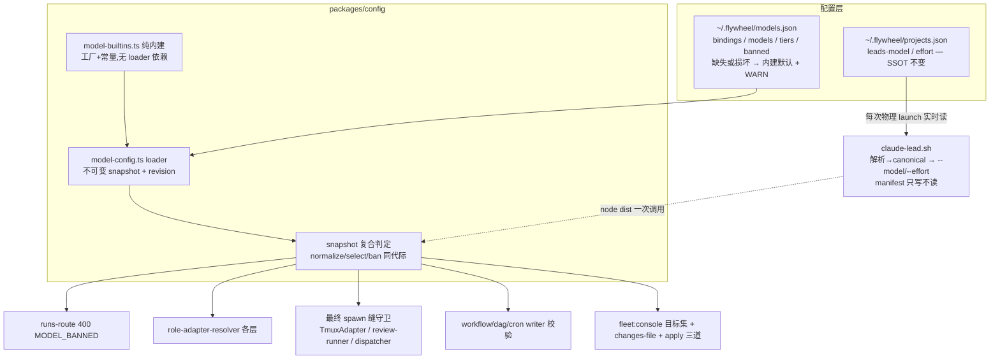

# FLY-1496 模型解钉根治 — 实施计划

Issue: FLY-1496 (https://linear.app/geoforge3d/issue/FLY-1496/v2批次0-模型解钉根治-别名表配置化-manifest-实时派生-mid-session-漂移调查-难度选型禁-opus-48)
日期: 2026-07-27
基于: research.md
状态: codex-approved(design review 5 轮:R1 6H+1M → R2 3H+1M → R3 1H+2M → R4 1M 残留矛盾 → R5 APPROVED;反馈全数并入)

已批决策(brainstorm gate,Tadashi + founder 2026-07-27 最终修正):方案 A(manifest 输入→输出翻转);generic tiers 默认 heavy=fable, medium/light/trivial=opus-5,Sonnet/Haiku 仅保留可识别别名、不作默认档,Codex 不进难度档;三段式 phases 默认 design=fable / implement=codex(GPT) / qa=opus-5,同样进热配置;effort 同治;配置落 `~/.flywheel/models.json`;ban 双态 = 派发路径 400 fail-loud / Lead boot 路径替换内建默认(fable)+ 响亮告警不 brick fleet。

## 0. 修订 — founder 2026-07-27 拍板:整块拿掉禁 4.8 逻辑

本文以下内容记录的是**当时批准的设计**,保留不改写,作为决策留痕。落地实现与
它有一处**范围性差异**,以本节为准:

Annie 决定**移除全部"禁 4.8"机制** —— `banned` 配置段、`isBanned` 快照 API、
派发 400 `MODEL_BANNED`、Lead boot 的 ban 替换与告警、fleet 的 ban 校验、以及
只为扫 banned 残留而存在的 `flywheel-model-sweep.mjs`(整个脚本连同其测试与 CI
接线一并删除)。她的理由:**不是要用 4.8,而是 SSOT 实时解析这一层根治之后已经
足够** —— 模型只可能来自权威配置,不存在"某条路径悄悄解析出 4.8"的可能,除非有人
显式配置它;那样的话专门再加一层 block 就是多余的机制。

**其余全部保留**:models.json 热读、manifest 输入→输出翻转、每次物理 launch 从
projects.json 实时派生、难度档与三段式相位表、各 spawn 缝的 canonical 化守卫。
守卫本身**不删** —— 它同时负责别名规范化(避免裸别名把版本决定权漏给 CLI 别名表),
删掉的只是它里面的 ban 分支。

随之恢复 pre-1496 的两个操作员逃生口(Lead 已确认):账号默认继承
(`validateModelWrite(null)`)与 `FLYWHEEL_RUNNER_DEFAULT_MODEL=off`。
4.8 的 registry 条目保留(历史计价/显示要认它),且**继续被派发边界接受**
—— 那是 `main` 早已存在的旧 pin 向后兼容,不属于本单要删的东西。

## 0. 总览



## 1. 新配置文件 `~/.flywheel/models.json`

```jsonc
{
  "version": 1,
  "bindings": { "opus": "claude-opus-5", "opus1m": "claude-opus-5[1m]" },
  "models": [
    { "id": "claude-fable-6", "provider": "anthropic", "runtimeVendor": "claude",
      "label": "Fable 6", "aliases": ["fable-6"], "dispatch": true }
  ],
  "tiers": { "heavy": "fable", "medium": "opus", "light": "opus", "trivial": "opus" },
  "phases": {
    "design": { "vendor": "claude", "model": "fable" },
    "implement": { "vendor": "codex", "model": "gpt-5.6-sol", "effort": "xhigh" },
    "qa": { "vendor": "claude", "model": "opus" }
  },
  "banned": ["claude-opus-4-8", "claude-opus-4-8[1m]"]
}
```

语义:
- 每段**可省略**;省略 = 内建默认。整文件缺失/损坏 = 全内建默认 + 一次性 WARN(按代际去重),**绝不因配置问题瘫痪派发或 boot**。
- `banned` 缺省时内建默认 = 4.8 两个 id;写了配置以配置为准(founder 主权)。
- `tiers` 值校验:目标条目 `runtimeVendor === "claude"` 且不在 banned;违规 → 该 key 回退内建默认 + WARN。
- `phases` 每行是完整 `{vendor,model,effort?}`;model 必须与 vendor 匹配、runner 可用且不在 banned,违规只回退该 phase 内建行 + WARN。一次 phase 判定只用一个 snapshot。
- `models` 条目与内建合并后跑既有 `assertValidModelRegistry`(冲突 → 整段 models 弃用回退 + WARN,内建照常)。**能力边界(诚实声明)**:配置新增模型 = 可派发/可校验/可显示 label;token 计价目录(`token-usage/pricing.ts`)与 F/O/S/H 短码等元数据不随配置——未知模型计价 $0+WARN、短码走长形回退。models.json 文档注明"上新模型若要正确计价需随后补 pricing 条目"。
- 测试/QA 隔离:`FLYWHEEL_MODELS_CONFIG` env 覆盖路径。
- 文件写入方约定 temp+rename 原子写(setup/文档注明)。

### 1.1 Loader 架构(R1#5:单代际 + 无环)

- **模块拆分**:新 `model-builtins.ts` = 纯内建(现 MODEL_IDS/工厂/内建 tiers 迁入,不 import loader);`model-config.ts` loader 只 import builtins;现 `model-registry.ts` / `model-tiers.ts` 的**函数出口**改为 facade 委托 snapshot——无初始化环。
- **不可变 snapshot + revision**:`getModelConfigSnapshot(): ModelConfigSnapshot`,含 `{revision, registry, dispatchLookup, tiers, phases, banned, bindings}` 与复合判定方法(`normalizeDispatchModel` / `isModelSelectionSupported` / `checkModelAllowed` / `buildModelCatalog` 等)。**一次业务判定(一个 HTTP 请求、一次 launch 解析、一次 phase 路由、一次模板写校验)取一份 snapshot 用到底**,不跨代际混用。
- **缓存键**:`(dev, ino, mtimeMs, size)`(高精度 mtime + inode,防同秒同大小重写误命中);miss 才重读+重建。
- 既有模块级常量(`MODEL_REGISTRY`/`MODEL_TIERS`/`DEFAULT_OPUS*` 等)保留 = 纯内建默认视图,标注"fallback/测试用";业务路径按 §2.6 消费矩阵迁移。

## 2. 改动点清单

### 2.1 packages/config

| 文件 | 改动 |
|------|------|
| `model-builtins.ts`(新) | 纯内建常量与工厂(自 model-registry/model-tiers 迁入);内建 tiers **heavy=FABLE,其余=OPUS 5**;内建 phase fail-safe 表 |
| `model-config.ts`(新) | §1.1 loader + snapshot + `checkModelAllowed` |
| `model-registry.ts` | 函数出口(`getModelRegistryEntry`/`buildModelCatalog`/`isModelSelectable`/`isModelSelectionSupported`/`resolveCurrentModel`)改 facade 委托当前 snapshot,**签名不变** |
| `model-tiers.ts` | `normalizeDispatchModel` 走 snapshot;`ACCEPTED_DISPATCH_MODELS` 补热读函数形态 `acceptedDispatchModels()`(常量保留兼容);banned 从 accepted 列表剔除 |
| `three-stage-phases.ts` | phase 默认表收敛进 snapshot:`design=fable / implement=codex / qa=opus-5`;环境 kill-switch 与 per-run override 也只消费同代际 phase 行,不再从 tier 或散落常量派生 |
| `index.ts` | 导出新 loader/守卫 |

### 2.2 launcher `packages/teamlead/scripts/claude-lead.sh`(方案 A 主体,R1#4 修订)

1. **解析时机 = 每次物理 launch**:模型/effort 解析放进 `_launch_claude` 每轮(crash-loop 重启同样重读 projects.json,不做一次性 boot 缓存)。
2. **SSOT 读取复用既有已验证路径 + 三值语义(R2#1)**:按 launcher 现有 identity 查询同款语义(含 `FLYWHEEL_PROJECTS` env-pin 测试语义)读 `leads[].model/effort`,每字段三值:
   - **present** → 解析(下一步);
   - **权威缺席**(快照有效、project+lead 精确命中、字段不存在——fleet staging 删字段=有意"回默认",`flywheel-fleet.sh:952-955`)→ 内建默认(model=fable canonical;effort=不注 + 既有 companion effort 策略),**绝不落到 env**——supervisor env 跨 crash-loop 冻结(`claude-lead.sh:1549-1552`),权威缺席吃 env = 删除场景下的同款"抄旧值"病;
   - **identity/源失败**(projects.json 不可读/lead 不存在)→ 沿用现有 fail-STOP 合同。
   **env `FLYWHEEL_LEAD_MODEL/EFFORT` 在本次 cutover 后不再有任何 model 权威角色(R3#1)**:resolver 自身故障(node dist 缺/解析异常)→ 直接用 launcher 内**硬编码的不可变内建默认字面量**(`claude-fable-5`,无需 dist 即可用)+ 不注 effort/既有 companion 策略 + 响亮 `model_config` 告警——raw env 无法 canonicalize 也无法过 ban(可能是 4-8/裸别名/未知 id),透传即违反"永不 launch 4.8"与"别名不达 CLI"两条保证。plist 的 `FLYWHEEL_LEAD_MODEL` 继续由 daemon 生成(fleet armed 证据用),launcher 只是不再读它做决策。
3. **一次 node dist 调用**完成:档位解析→canonical→ban 检查,返回 JSON `{model, effort, substituted, reason}`;banned → 替换内建默认 fable + `substituted:true`。
4. **manifest 写(输出 evidence,兼容 fleet 对账 R1#2)**:解析完成后**每次 launch 重写**:`model`/`effort` 保持 **projects.json 原始拼写**(fleet 等值比对与 recovery 语义投影字节不变),新增 `resolvedModel`/`resolvedEffort` = 本次实际 canonical 值(加性字段,fleet 忽略);`leadBackend`/PID/daemon 校验逻辑不动。**manifest 读取路径删除**(`_fly1285_manifest_model/_effort` 输入消失 → S7/FLY-1485 raw-append 根治)。
5. 可观测性:`model source: projects.json=<raw>→<canonical> env=<v> → using projects.json`;ban 替换打 `MODEL BANNED:` 标记行,并经 `lead-alert.sh` 发**新增 allowlist kind `model_config`**(kind 允许表补一项;告警失败不阻 boot)。
6. fail-safe 总则:overlay/解析器故障降级为内建默认字面量(响亮日志+告警),identity 合同不放宽;**测试**:env 冻结为 4-8 / 裸 opus,移除或破坏 config dist → argv 断言确切 `claude-fable-5` + `model_config` 告警。

### 2.3 派发侧 + 最终 spawn 缝(R1#6)

**不变量(范围收窄声明,R3#3):所有被守卫的 launcher/Node spawn 缝——即下表全部 + §2.2 Lead launcher——出站必带显式、allowed、canonical 的 `--model`,所有路由/重写完成后、spawn 前跑最后一道守卫。已加载 cron 载体(落盘 argv 直接执行)是唯一例外,由 §2.5 强制 sweep 收口。**

**守卫形态(R2#2)**:不是裸 `checkModelAllowed`,而是复合终判 `resolveAllowedCanonicalModel(raw, snapshot) → canonical id | throw`——label 层至今存裸别名(`runner-label.ts:97-105` 的 `opus`/`sonnet`/`haiku` 原样透传,`TmuxAdapter.ts:856` 原样 append),裸别名即使不 banned 也会把版本决定权漏给 CLI 别名表、令 bindings 配置失效。最终缝**用返回的 canonical id 替换出站 model**;测试:每个产 raw 值的层各造一个"别名 binding 在 models.json 改指"用例,断言 argv 里的确切 canonical token。

| 位置 | 改动 |
|------|------|
| `bridge/runs-route.ts` | normalize 后 ban 检查:**400 `MODEL_BANNED`**(区别 INVALID_MODEL);accepted 列表热读 |
| `bridge/role-adapter-resolver.ts` | 各层出口过 `checkModelAllowed`(banned→throw);`FLYWHEEL_RUNNER_DEFAULT_MODEL=off`(继承账号默认的逃生口)**ban 生效期视为 unset + WARN**(账号默认出口关闭) |
| `bridge/run-dispatcher.ts` | 审计 :296-308 邮箱强制重写缝(R1 指出它在 resolver 检查后改写/丢 model/effort)——最终守卫覆盖 |
| **最终 spawn 缝守卫**(TmuxAdapter `buildCliArgs` 入口或其调用侧) | 无 model → 注入内建默认 fable canonical;banned → fail loud(派发链早该 400,此处=防御纵深) |
| `bridge/claude-review-runner.ts` | 直接 `--model` 子进程:同守卫 |
| `bridge/approval-signal/subscription-claude-classifier-runner.ts` | 直接 `claude --model` 子进程(`:89-100`,R2#4):同守卫 |
| `bridge/fleet-capabilities.ts` | 可写 `null`("Opus 4.8 账号默认")选项:ban 生效期**移除/拒绝**;选项集改热读(现 import 期构建一次,R1#7) |
| `workflow-template.ts` / `management-dag-writer.ts` / `management-cron-writer.ts` | 既有 `isModelSelectionSupported` 校验点同 snapshot 加 ban 检查(新写入拒 banned) |

### 2.4 fleet(R1#1/#2/#3)

| 文件 | 改动 |
|------|------|
| `scripts/flywheel-fleet-batch.sh` | **changes-file 校验前移**:config lock 之下、首次写 projects.json **之前**,对每条 `to.model` 做 canonicalize+ban 校验,拒 → 整批不落盘(伪造 changes-file 测试:projects.json 字节不变、无 launch、journal 记 rejected) |
| `scripts/flywheel-fleet.sh` | ① inner apply 同校验(防御纵深);② **rollback 补还原 SSOT**:显式 rollback 在还原 manifest/plist 的同一事务里,经 config-lock + per-key CAS + journal 阶段把 projects.json 的 model/effort 还原到 pre-apply 值(崩溃可恢复;apply→观测 argv→rollback→观测 argv 测试,含 SSOT/载体过渡期崩溃注入);③ **rollback ban 预检 fail-closed(R2#3)**:确认/journal 变更/bootout/SSOT 写**之前**,用一份 snapshot 对完整 rollback 目标 canonicalize+ban 检查——pre-image 是 4.8 的旧事务 → **整体拒绝、零变更、显式诊断**(事务合同=精确还原,绝不事务内静默替换);测试:默认 ban 下 4.8 pre-image → fable post-image 的 rollback 被拒且 projects/载体/运行时全未动;④ **SSOT pre-image 出处入事务 schema(R3#2)**:现 inner 事务只记载体 hash + post-batch desired(`flywheel-fleet.sh:834-874`),无 projects.json 原值——新 apply 在载体 cutover **之前**把每 key 的 projects model/effort 精确 pre-image 写进事务 schema 新字段(绑 outer batch/key;outer journal 的 from 值 `flywheel-fleet-journal.sh:38-61` 为佐证链);**pre-FLY-1496 旧事务无此字段 → rollback 拒绝零变更**,除非可链接的 batch journal 记录能证明精确值——**绝不从旧 manifest 推断**(历史载体拼写可能≠SSOT 拼写);legacy 事务 fixture 测 fail-closed |
| Bridge fleet console(`fleet-console.ts` 目标集校验) | `allowedModelTargets` 剔除 banned(stage/apply 边界即拒,R1#3 的 Bridge 道) |
| 等值/恢复语义 | **零改动**(§2.2-4 的 raw-spelling manifest 方案使 `:251-270` 等值比对与 `:1574-1608` recovery 语义投影字节不变);plan/apply 二跑 no-op 与 Lead 已重写 manifest 后 recovery 各加回归测试钉住 |

### 2.5 落盘载体扫除(可复用,R1#6 + R2#4)

ban 是"新写入+解析出口"守卫,已落盘载体需扫除:**可复用** sweep 脚本(非一次性)——扫 `~/.flywheel/manifests/*.json`、cron plist `ProgramArguments --model`、workflow 已发布 revision、projects.json,报告 banned 残留并修复;**残留未清 → 非零退出**(可执行的门,非建议性合同,R3#3)。上线跑一次(前后对照进 drift-report 附录);**热改 `banned` 名单的运维合同**:已加载 cron 载体不受执行时守卫覆盖(它们直接跑落盘 argv)——文档明示"改 banned 后重跑 sweep 至零残留",这是刻意收窄的诚实边界,不做每次执行前的 wrapper 检查(不碰每个 cron 载体,boring 优先)。

### 2.6 消费矩阵(R1#7)

| 类别 | 文件 | 处置 |
|------|------|------|
| 热运行时(必迁 snapshot) | runs-route, role-adapter-resolver, workflow-template, management-dag-source/writer, management-cron-source/writer, fleet-console, fleet-capabilities, workflow-menu(-routes), retry-dispatcher, claude-review-runner | 每判定一份 snapshot |
| 载体/评估器 | `runner-label.ts`(import 期捕获 `DEFAULT_OPUS_1M`)| 迁函数取值(label 解析属热路径) |
| 目录/报告 | `management-ssot-providers.ts`(硬编码 revision)| catalog 带 snapshot revision(变更可见) |
| 刻意冻结 | `three-stage-phases.ts` QA 相位 | 显式 pin(§2.1),不随 medium 变 |
| 遗留 lane(生产不可达) | EdgeWorker/`RunnerSelectionService`/`ClaudeRunner` | founder 最终映射后收紧:默认主模型 Fable、fallback Opus 5;Sonnet/Haiku 只保留显式别名识别;最终 SDK 缝 canonicalize + 全 fallback 链 ban |
| 元数据不随配置 | `token-usage/pricing.ts`、短码表 | §1 诚实声明;不扩 scope |

### 2.7 不动清单(scope discipline)

模板引擎"模板钉 model"设计、`leadBackend.backendId` 载体、per-project tiers(FLY-709 完整形态)、Codex/Gemini 后端内部模型逻辑、EdgeWorker 架构:均不动。fleet staged manifest 写(:946-953)保留(desired evidence;boot 后被同拼写+resolved 字段覆盖)。

## 3. drift-report.md(实施阶段交付,骨架已定)

落本文件夹:S1 实证(research R1 时间线)→ 根治;S2 EdgeWorker 豁免(R3 证据);S3 CLI 外部面豁免+缓解(全链显式 --model、无 --fallback-model、账号池 settings 逐号核对统一、撞限额行为记录);S4 模板 pin 审计;S5 cron 载体审计 + §2.5 sweep 结果;S6 三段式表(QA 显式 pin 说明);S7 已消失;R7 重启触发器归类。每源:证据 / 修复或豁免 / 验证方式。

## 4. 测试(TDD)

- **config 单测**:缺失→默认;损坏→默认+WARN 一次;缺失→有效→无效→恢复序列;**同大小重写热读**(inode/mtimeMs 键);overlay 合并;冲突回退;banned 缺省含 4.8;tiers 指 codex/banned→回退;phase vendor/model mismatch 或 banned→逐行回退;phase 原子改配置后下一决策热生效;**判定中途配置重写 = 单 snapshot 一致性**。
- **派发**:runs-route 4.8 全拼写→400 MODEL_BANNED;新增别名不改码被接受;resolver 各层 banned→throw;`off`→WARN+默认;generic tiers 为 Fable/Opus-5 两值;**每个最终 spawn 缝一测**(TmuxAdapter 无 model 注入 fable / banned fail-loud;review-runner;dispatcher 重写缝)。
- **launcher bash 测试**(`/bin/bash` 3.2):projects.json fixture 派生;陈旧 manifest 注入 opus-4-8[1m] 被忽略;manifest 回写 raw 拼写+resolved 字段;crash-loop 第二轮 launch 重读 projects.json(改值生效);identity 失败仍 fail-STOP;**同 supervisor 权威缺席测试(R2#1)**:env=sonnet/high 冻结,删 SSOT 两字段 → 第二次 launch 用 fable 且无 stale effort;banned→替换 fable+标记行+alert kind;resolver 故障时忽略 env(含 4-8/裸 opus 冻结值),argv 精确为 claude-fable-5、无 stale effort,并发 model_config 告警(与 §2.2 同一合同,单一真相)。
- **fleet**:伪造 changes-file→projects.json 字节不变+journal rejected;inner apply 拒 banned;**apply→argv→rollback→argv 往返**(rollback 后 boot 回 pre-apply 模型),过渡期崩溃注入恢复;**banned pre-image rollback 整体拒绝零变更(R2#3)**;alias 收敛稳态 plan 二跑 no-op;Lead 已重写 manifest 后 recovery 不 fail-closed。
- **最终缝 canonical 断言(R2#2)**:label/projectRoles/env 各 raw 产出层 × models.json 改 binding → argv 断言确切 canonical token;subscription classifier 缝一测(R2#4)。
- **真机 E2E(验收映射)**:①改 models.json 加别名→派发接受;②删 manifest+重启→无 "using manifest" 压 env、manifest raw+resolved 字段正确;③drift-report 交付;④projects.json 注入 4.8→boot 替换+告警 / 派发传 4.8→400;⑤§2.5 sweep 前后对照;全仓 `pnpm lint` + `pnpm -r build` + 相关包测试;Codex code review;founder gate ship。

## 5. 行为变更点(ship 时明示)

1. generic 难度档最终默认 = **heavy Fable 5,medium/light/trivial Opus 5**;Sonnet/Haiku 不再是任何默认档。三段式默认 = design Fable / implement Codex / QA Opus 5,两张表都从 models.json 热读。
2. Lead boot 模型来源 manifest → projects.json 每次 launch 实时派生。
3. 4.8 机器拒绝(覆盖全部被守卫的 launcher/Node spawn 缝;唯一例外=已加载 cron 落盘 argv,由强制 sweep 非零门收口,R3#3):派发 400 / boot 替换+告警;`FLYWHEEL_RUNNER_DEFAULT_MODEL=off` 与 fleet `null`(账号默认)出口关闭;env 不再有 Lead model 权威。
4. models.json 新文件(可选,缺失=内建默认);代码初次部署后,launcher 与 Bridge 都在下一次业务判定热生效,无需再次重启;上线含 §2.5 一次性 sweep。
