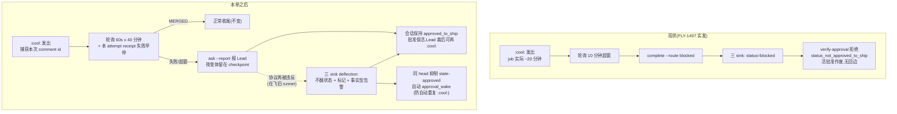

# FLY-1505 Runner ship 轮询窗口与假报 blocked — 实施计划
Issue: FLY-1505 (https://linear.app/geoforge3d/issue/FLY-1505/基建卡点-runner-ship-轮询窗口-10-分钟-ship-job-实际-20-分钟-假报-blocked-并作废活批准)
日期: 2026-07-27
基于: research.md
Status: codex-approved(R6 APPROVED,2026-07-27;implement 增量以 design-correction.md 为准:C1/C5 的固定 40 分钟窗口已作废,改为 started receipt 的 run_id + GitHub workflow run 终态权威;其余 R1-R6 保护机制不变)

## 1. 目标与非目标

**目标**(对应 issue 范围 1/2/3 + Lead brainstorm gate 两条加固):

1. Runner ship 轮询窗口 10 → **40 分钟**(≥ issue 要求的 35;= 30 分钟 job 上限 + 10 分钟余量),间隔 30s → 60s,新增**绑定本次 attempt 的**显式失败早停。
2. ship 尝试失败/超窗的善后**不再翻会话状态**:协议侧改为报 Lead + 按变体留在 checkpoint;服务端三 sink 对 `approved_to_ship + route=blocked` 做 deflection(不翻状态、写 `ship_attempt_failed` 标记、事实型告警),并**抑制同 head 的 stale-approved 自动 re-wake**(防自动重复 :cool:,守 founder ":cool: 点一次" 规则)。
3. 回归测试:窗口一致性(跨文件)、deflection 三 sink(含真实绑定会话)、re-wake 抑制、deflection 后 verify-approval 仍 `approved:true`。

**非目标**(honest boundaries,见 §8):不动 verify-approval;不动 FSM 边;不做 merged-while-stalled 自动对账(FLY-1448);不动 `session_failed` 崩溃路径;不动 generalized-workflow 的 land-executor ship 路径。

## 2. 总体设计



## 3. 改动清单

### C1 — Blueprint 常数提取 + 协议文本改写

**文件**:`packages/edge-worker/src/Blueprint.ts`

新增导出常数(供文本插值 + 测试 import,消灭孤立字面量):

```ts
/** FLY-1505: runner-side merge-poll window. MUST stay >= ship-on-comment.yml
 *  jobs.ship.timeout-minutes + SHIP_MERGE_POLL_WINDOW_MARGIN_MINUTES (pinned by
 *  Blueprint.fly1505-ship-poll-window.test.ts cross-file consistency test). */
export const SHIP_MERGE_POLL_WINDOW_MINUTES = 40;
export const SHIP_MERGE_POLL_INTERVAL_SECONDS = 60;
/** 最低合同余量;当前 40 对 30 的实际余量是 10 分钟,5 是 CI 红线不是目标值。 */
export const SHIP_MERGE_POLL_WINDOW_MARGIN_MINUTES = 5;
```

`:2306-2307`(:cool: 发出 + 轮询两行)替换为(插值常数;**捕获本次 attempt 的 comment id,失败判定只认本 attempt 的 receipt** — Codex R1 #2):

```
   - Post :cool: to trigger deploy AND capture this attempt's comment id: run `gh pr comment <NUMBER> --body ":cool:"` — it prints the comment URL; the trailing number after "issuecomment-" is your COOL_ID for this attempt.
   - Wait for the PR to be merged by the deploy workflow: poll `gh pr view <NUMBER> --json state -q '.state'` every ${SHIP_MERGE_POLL_INTERVAL_SECONDS}s until MERGED, for up to ${SHIP_MERGE_POLL_WINDOW_MINUTES} minutes. The ship job runs the FULL serial test suite and normally needs ~20-30 minutes — an early give-up is a FALSE alarm (FLY-1505); do NOT stop before the window ends unless THIS attempt's ship job explicitly failed.
   - Every ~5 polls also check for an explicit failure receipt OF THIS ATTEMPT: `gh pr view <NUMBER> --json comments -q '[.comments[].body | select(contains("flywheel-ship-receipt")) | select(contains("trigger_comment_id=<COOL_ID>"))] | last'` — `status=failure` means THIS ship job failed: stop waiting and follow the next step. A failure receipt with a DIFFERENT trigger_comment_id is from an OLD attempt — ignore it and keep waiting; no receipt for your COOL_ID yet just means the workflow is still queuing. If you could NOT capture a COOL_ID from the gh pr comment output, SKIP this early-stop check entirely and wait the full window — do NOT inspect or reuse receipts from older attempts.
```

`:2308`(善后行)替换为(FLY-248 红线原样保留,善后改向;**结尾等待姿势按 runner 变体条件化** — Codex R1 #3,复用 step c 既有的 `phaseKeepAlive ? … : isCodexRunner ? … : …` 条件模式):

```
   - The :cool: deploy workflow is the ONLY merge path — do NOT run `gh pr merge` yourself, even after the window ends (FLY-248: a Runner must never self-merge, even after a verified approval; the project's own CI/CD + branch protection is the hard merge boundary). If THIS attempt's ship job FAILED, or the PR is still not MERGED when the window ends: NEVER run `complete --route blocked` — a ship ATTEMPT that did not finish is NOT a blocked session; route=blocked would flip the session out of approved_to_ship and void the still-live founder approval (FLY-1505). Do NOT post another :cool: on your own either. Instead report to your Lead: `node ${commCliPath} ask --lead ${ctx.leadId} --exec-id ${executionId} --report "SHIP-STALLED: PR <NUMBER> not merged after ${SHIP_MERGE_POLL_WINDOW_MINUTES} min | COOL_ID <id> | detail: <state/receipt>"` (use SHIP-FAILED with the receipt detail when the job explicitly failed), then hold at this checkpoint: [变体条件化 → phaseKeepAlive: park + wait for a TURN-authorized wake / codex resident: keep polling your gates and inbox across turns / plain: END YOUR TURN and wait idle for a wake]. The session remains approved_to_ship and the approval stays valid; recovery is Lead-driven — after diagnosis you may be woken and told to post :cool: again (re-run verify-approval first) or to finalize if the merge landed late.
```

注 1:`complete --route blocked` 在 PIPELINE PREAMBLE(onboard 失败)等其他场景仍是合法通道,只有 approved_to_ship 之后的 ship 善后被禁止——文本与服务端闸(C2)口径一致。
注 2:COOL_ID 提取失败的兜底句已在上方权威替换文本内(Codex R5 #2:不能只留在计划注释里让 Implement 阶段抄漏),并由 C5 提示词断言钉住——宁可多等,不可误读旧 receipt。

### C2 — 三 sink deflection(条件全部零新查询;谓词用**原始状态判断**,不复用被收窄的 isPostApproveShip)

**统一条件**:`route === "blocked" && 会话现状态 === "approved_to_ship"`(**原始谓词**;Codex R1 #1:DirectEventSink 现有 `isPostApproveShip` 实为 `status === "approved_to_ship" && !desPhase2Bound`,带真实批准绑定的会话——恰是本单最要保护的——会被它排除)
**统一动作**:不翻状态 → attempt-head 三态裁决(见下)→ `markShipAttemptFailed`(C3)→ 首次告警(C4)→ warn 日志 → 各 sink 的既定"跳过"返回形态。

**attempt-head 三态权威规则(三 sink 统一;Codex R3 #1)**:attempt head 的权威是**完成事件 payload 的 `evidence.headSha`**(`complete.ts:493-551` 在事件发生时捕获的 40-hex;marker 重放时它就是 marker payload 里的值)——**绝不猜当前 session row 的 head**。裁决:

1. payload head 有效且 === 当前 `session.pr_head_sha`(规范化比较)→ 正常 `markShipAttemptFailed` + 首次告警(主路径)。
2. payload head 有效但 ≠ 当前 head(FLY-945 重审圈:head A 的失败 marker 延迟到 head B 获批后才被 boot drain 消费)→ **stale attempt**:消费之(warn 日志 + 独立 outcome),**不写 C3、不告警、不得抑制当前 head**——旧 attempt 的失败不许污染新批准轮次。
3. payload head 缺失/非法 → `"(unknown)"` 哨兵:live sink 里照常写标记+告警(哨兵不参与 C7 抑制,R1 #4 既定);但**永不覆盖已存在的真实-head C3 条目**(`markShipAttemptFailed` 内置:unknown 只写空槽)。

a) `packages/teamlead/src/bridge/event-route.ts:1601-1606`(此文件的 `isPostApproveShip:1388` 就是原始谓词,可直接用):

```ts
} else if (route === "blocked") {
    if (isPostApproveShip) {
        // FLY-1505: a failed/stalled SHIP ATTEMPT is not a blocked session.
        // Deflect: keep approved_to_ship (verify-approval stays usable), mark
        // the attempt in session_params, escalate to the Lead. Recovery is at
        // the PR layer (re-:cool: after Lead diagnosis), never at the session layer.
        // attempt head 权威 = 事件 payload 的 evidence.headSha(三态规则,见上);
        // 三态裁决后才走 markShipAttemptFailed / stale-consume / unknown 哨兵。
        const mark = settleShipAttemptFailed(store, event.execution_id, {
            attemptHeadSha: asString(evidence?.headSha),      // 事件权威
            currentHeadSha: existingSession?.pr_head_sha,      // 当前批准 head
            prNumber: existingSession?.pr_number ?? undefined,
            summary: asString(payload.summary),
        });
        if (
            (mark.outcome === "marked" || mark.outcome === "unknown_head_marked") &&
            mark.firstAttemptForHead &&
            existingSession
        ) {
            void autoQaCoordinator?.current?.alertShipAttemptFailed(existingSession, /* 事实型文案见 C4 */);
        }
        console.warn(`[event-route] FLY-1505 ship_attempt_failed deflected for ${event.execution_id} — approved_to_ship preserved (${mark.outcome})`);
        res.json({ ok: true, warning: "ship_attempt_failed deflected (approved_to_ship preserved)" });
        return; // 早退形态镜像 :1412-1421 invalid-route skip
    }
    status = "blocked"; // 非 approved_to_ship 来源字节不变
}
```

b) `packages/teamlead/src/DirectEventSink.ts:749`:**新建原始谓词** `const isApprovedToShip = preExistingSession?.status === "approved_to_ship";`(现有 `isPostApproveShip:626-628` 的 `!desPhase2Bound` 收窄是 FLY-191/208 给 qid-less evidence-gap 路径的保护,原样保留给 needs_review/auto_approve 分支)。`route === "blocked"` 分支:`isApprovedToShip` → settle + 告警 + `console.warn` + `return`(早退形态镜像 `:794-803` terminal-immune;不 upsertSession、不 enqueueTerminalCommDbStatus、不通知);否则 `status = "blocked"` 字节不变。**helper 调用合同逐字钉死(Codex R4 #1)**:

```ts
const mark = settleShipAttemptFailed(this.store, env.executionId, {
    attemptHeadSha: result.evidence?.headSha,        // 事件权威——禁止用 desPrHead
    currentHeadSha: preExistingSession?.pr_head_sha, // 当前批准 head
    prNumber: preExistingSession?.pr_number ?? undefined,
    summary,
});
```

此 sink 相邻的既有 `desPrHead` 是 **row-first**(`preExistingSession.pr_head_sha` 优先于 `result.evidence.headSha`)——**明令禁止**在本裁决里复用它:复用会把 A-attempt/B-current 的完成误写成 B 的标记并错误抑制当前 head。

c) `packages/teamlead/src/bridge/complete-marker-reconciler.ts` —— **显式 settled 分支,不走 loopback**(Codex R2 #1:`tryReconcileComplete` 的相等快捷路径 `:600-604` 在 replay 前对 `currentStatus === expectedStatus` 直接 unlink 返回;若只改 `expectedStatusFromMarker`,deflection 场景恰好命中该路径 → marker 被删而 C3/C7 side effects 全落空;且 event_id 已插入但 side effects 未完成的崩溃窗里,loopback 还会被 `event-route.ts:1008-1022` 的 duplicate guard 提前挡回。**镜像同函数上方 `settled_merge_block` 前例**——在通用机制前直接做 side effects):

在 `expectedStatusFromMarker` 计算**之前**加 settled 分支:

```ts
// FLY-1505: blocked-after-approval marker — settle side effects DIRECTLY
// (loopback would be swallowed by the equality shortcut below and, in the
// event-id-already-inserted crash window, by the /events duplicate guard).
if (
    body.payload?.decision?.route === "blocked" &&
    currentStatus === "approved_to_ship"
) {
    let mark: ShipAttemptSettle;
    try {
        // MarkerBody.payload 是索引签名,字段在边界收窄(Codex R5 #1):
        const rawAttemptHead = body.payload?.evidence?.headSha;
        const rawSummary = body.payload?.summary;
        mark = settleShipAttemptFailed(deps.store, execId, {
            attemptHeadSha: typeof rawAttemptHead === "string" ? rawAttemptHead : undefined, // 事件权威(R3 三态规则)
            currentHeadSha: currentSession?.pr_head_sha,
            prNumber: currentSession?.pr_number ?? undefined,
            summary: typeof rawSummary === "string" ? rawSummary : undefined,
        });
        if (
            (mark.outcome === "marked" || mark.outcome === "unknown_head_marked") &&
            mark.firstAttemptForHead &&
            currentSession
        ) {
            deps.alertShipAttemptFailed?.(currentSession, /* C4 文案 */);
        }
    } catch (err) {
        // C3 write failed — the marker is the LAST evidence; keep it, retry later.
        return { kind: "transient_failed", error: String(err) };
    }
    safeUnlink(markerPath, log); // 仅在裁决完成(写成功或 stale/skip)后才消费 marker
    return { kind: "settled_ship_attempt_failed", settle: mark.outcome };
}
```

**新 outcome 的消费方合同(Codex R3 #2,全列不漏)**:

1. `ReconcileOutcome` union 显式加入 `{ kind: "settled_ship_attempt_failed"; settle: … }`。
2. boot drain 的成功集合(`complete-marker-reconciler.ts:935-943`,现认 `reconciled` / `duplicate_terminal` / `settled_merge_block`)加入新 kind——否则 marker 已删但统计报未对账,后续调用方把已处理当 fallthrough。
3. 全部 exhaustive 消费方(switch/if 链)逐一核对补齐;T4 对 boot drain 断言 `scanned=1, reconciled=1, quarantined=0` 并单测 `tryReconcileComplete` 返回的具体 kind。

`expectedStatusFromMarker` 的 `route === "blocked"` 分支同步改为 `return isPostApproveShip ? "approved_to_ship" : "blocked";`——settled 分支之后它对该场景不可达,但该函数是导出映射,保持对任何调用方诚实。

### C3 — `settleShipAttemptFailed`(共享裁决+标记 helper;标记 = 恢复的**durable 权威**,告警只是它的通知)

**文件**:`packages/teamlead/src/bridge/post-ship-finalization.ts`(紧挨 `markEvidenceGapCompletion:113`,三 sink 均已 import 此模块)。**三态规则内嵌在 helper 里**,三 sink 只传原料,裁决逻辑单点:

```ts
export type ShipAttemptSettle =
    | { outcome: "marked"; firstAttemptForHead: boolean; attemptCount: number }
    | { outcome: "stale_attempt" }        // payload head 有效但 ≠ 当前 head:不写、不告警
    | { outcome: "unknown_head_marked"; firstAttemptForHead: boolean; attemptCount: number }
    | { outcome: "unknown_head_skipped" }; // 哨兵遇已有真实-head 条目:不覆盖

export function settleShipAttemptFailed(
    store: StateStore,
    executionId: string,
    // attemptHeadSha 接受 string | null | undefined(Codex R5 #1:DirectEventSink 的
    // ExecutionEvidence.headSha 是 string | null;helper 本就要做规范化,null 归一到哨兵)
    info: { attemptHeadSha?: string | null; currentHeadSha?: string | null; prNumber?: number; summary?: string },
): ShipAttemptSettle {
    // 规范化:lowercase;attemptHeadSha 非 40-hex → "(unknown)" 哨兵(Codex R1 #4)。
    // 三态(Codex R3 #1):
    //   有效且 === currentHeadSha → 写/累计标记(主路径,可告警)
    //   有效但 ≠ currentHeadSha  → stale_attempt(warn,零写入)
    //   哨兵 → 已有真实-head 条目则 unknown_head_skipped(不覆盖);空槽/同哨兵则写(可告警,不参与 C7)
    // 写入走 patchSessionParams 读-改-写(patchSessionMetadata 是列白名单,ad-hoc 字段
    // 会静默 no-op —— FLY-208 Codex design R3 guardrail #1 的既有教训)。
    // fly1505_ship_attempt_failed: { at, pr_number, head_sha, summary, attempt_count }
    // firstAttemptForHead = 换 head 或首次;attempt_count 同 head 自增(幂等累计,不重复告警)。
}
```

**告警条件(三 sink 统一)**:`(outcome === "marked" || outcome === "unknown_head_marked") && firstAttemptForHead`。

**标记生命周期**(Codex R1 #3):按 head 键控——head 变化(重审圈换 head)→ 新 head 无标记,天然失效;成功 merge → 会话终态化,标记随会话归档;Lead 人工恢复 → Lead 显式唤醒 runner(显式 wake **不**被 C7 抑制,只有自动 stale-approved pass 被抑制),同 head 重试成功即 merge 收尾。不提供清除命令(YAGNI;Lead 显式 wake 就是恢复动作)。

### C4 — `alertShipAttemptFailed`(事实型告警,best-effort;durable 记录在 C3 标记)

**文件**:`packages/teamlead/src/bridge/auto-qa-coordinator.ts`。仿 `alertMergeWithoutApproval:915` 同投递管道、同容错(catch + console.error;**本管道是 best-effort,不承诺必达**——可靠性由 C3 durable 标记 + 新协议下 runner 自己的 ask --report 主通道承担)。文案**只说服务端观察到的事实**,不代 runner 声称等了多久(Codex R1 #4:deflection 拦的是在飞旧协议 runner,服务端无法证明它等了 40 分钟):

> ⚠️ Runner {execId}({issueId})在获批(approved_to_ship)后发来了 blocked completion —— 已被拦下,**会话保持 approved_to_ship,founder 批准仍有效**。这通常意味着它的 ship 尝试失败或超窗。请检查 PR #{pr} 的 ship workflow run;诊断后的恢复通常是再发一次 :cool:(runner 会先重跑 verify-approval)。
> [outcome 专属尾句 — Codex R4 #2,文案必须与 C7 真实行为一致]
> - `marked`:同 head 的自动重唤醒已暂停,由你显式唤醒。
> - `unknown_head_marked`:本次完成未携带可验证的 head,自动重唤醒**仍开启**(fail-open)。

去重:仅 `firstAttemptForHead === true` 时发(outcome ∈ {marked, unknown_head_marked})。新协议 runner 的重复停摆走它自己的 ask --report 主通道,不依赖此告警重响。

### C7 — 同 head 抑制 stale-approved 自动 re-wake(Codex R1 #3)

**现状**:`gate-poller.ts:3818-3862` 的 `staleApprovedShipReconcilePass` 每轮把闲置的 bound `approved_to_ship` 会话重发 `approval_wake`;wake 会让 runner 重跑 verify-approval → 再 :cool:。deflection 保住 approved_to_ship 后,这条链会**自动反复重发 :cool:**——与"Lead 诊断后再重试"的恢复协议冲突,也违反 founder ":cool: 点一次就等" 规则(ship job 失败时更会无诊断地循环烧 CI)。

**改动**(解析共享化 — Codex R2 #2:解析不能散落在 GatePoller 内联代码里,否则 T7 用手工构造的 probe 全绿而生产接线仍可能漏):

1. `stale-approved-ship-reconciler.ts` 新增**共享导出解析函数**:
   ```ts
   /** 解析 session_params,仅当存在真实(非 "(unknown)")的 fly1505 标记 head 时返回规范化 head;
    *  malformed JSON / 缺字段 / 哨兵 → undefined(fail-open,宁多唤醒不静默卡死)。 */
   export function shipAttemptFailedSuppressedHead(sessionParamsRaw: string | null | undefined): string | undefined
   ```
2. `RewakeSessionProbe` 增加可选字段 `shipAttemptFailedHead?: string`;`isRewakeCandidate`(:49-59)增加一条:该字段与 `session.pr_head_sha`(同规则规范化)**精确相等** → 不是 re-wake 候选。
3. gate-poller 的 `staleApprovedShipReconcilePass` 构造 probe 时用共享函数从会话行的 `session_params` 填充该字段(pass 本就只筛 approved_to_ship 会话,每轮 0-2 个,成本可忽略)。

**抑制的只有这一条自动通道**:Lead/founder 的显式 wake(`sendRunnerWake` 其他调用方、dashboard 动作、mailbox 消息)全部不受影响——这正是"恢复是 Lead-driven"的机制表达。

### C5 — 跨文件一致性回归测试(Lead 加固 ①)

**新文件**:`packages/edge-worker/src/__tests__/Blueprint.fly1505-ship-poll-window.test.ts`

1. **常数合同**:以 `__dirname` 相对路径读 `../../../../.github/workflows/ship-on-comment.yml`,正则 `/timeout-minutes:\s*(\d+)/g` **全局匹配并断言恰好命中 1 处**(Codex R1 #5:未来该文件加第二个 job timeout 时强制此测试重新锚定,而非静默读错),断言
   `SHIP_MERGE_POLL_WINDOW_MINUTES >= timeout + SHIP_MERGE_POLL_WINDOW_MARGIN_MINUTES`。
   谁再单方面调 workflow 预算 → CI 立刻红,红的位置直指两个数的合同(founder 痛点"两个写死的数各过各的"的结构性解)。margin=5 是**最低合同红线**,当前实际余量 10。
2. **窗口下限**:断言 `SHIP_MERGE_POLL_WINDOW_MINUTES >= 35`(issue 范围 1 的硬线)。
3. **提示词断言**:approve-gate prompt 包含新窗口/间隔插值、COOL_ID 捕获指引、"trigger_comment_id=<COOL_ID>" 过滤指引、"A failure receipt with a DIFFERENT trigger_comment_id is from an OLD attempt — ignore"、COOL_ID 捕获失败兜底句("SKIP this early-stop check entirely and wait the full window" — Codex R5 #2)、"NEVER run \`complete --route blocked\`"、SHIP-STALLED 报告指引;不包含旧 summary 串 `"ship workflow did not merge in the poll window"` 与 `"max 10 min"`。
4. **变体断言**:phaseKeepAlive / codex resident / plain 三变体的善后等待句各自正确(park+TURN / poll across turns / end turn and wait)。

### C6 — 测试矩阵其余部分

| # | 测试 | 文件 | 断言 |
|---|---|---|---|
| T1 | 旧 PIN 改写 | `Blueprint.fly191-approve-gate.test.ts:213-217` | 保留 "ONLY merge path"/"never self-merge";删除 `toContain("complete --route blocked")`,换 PIN 新善后(报 Lead + 按变体 hold) |
| T2 | event-route deflection | event-route 测试(仿 dual-session-completed Scenario E 布置) | approved_to_ship + POST route=blocked → 200 `ok+warning`;status 仍 approved_to_ship;session_params 有标记;**用新 event_id 重复 POST**(event-route 对同 event_id 直接去重返回 duplicate — Codex R1 #4)→ attempt_count=2 且不二次告警 |
| T3 | DirectEventSink deflection | `DirectEventSink.test.ts` | **带真实 review_question_id 的 bound approved 会话**被 deflect(Codex R1 #1 主场景)+ unbound 兼容用例;**bound A-event/B-current 用例**(Codex R4 #1):payload head=A、row head=B → `stale_attempt`,零写入、零告警、状态保持 approved_to_ship;**unknown-payload-head 用例**钉住参数取自 `result.evidence?.headSha` 而非 desPrHead;既有 `:798-820`(running→blocked no finalization)字节不变 |
| T8 | settle helper 三态真值表(Codex R4 #2) | `post-ship-finalization` 单测 | 有效且等于当前 head → marked;有效不等 → stale_attempt(零写入);unknown-on-empty → unknown_head_marked;unknown-over-real → unknown_head_skipped 且真实条目**逐字不变**;重复 unknown / 同 head 重复 → attempt_count 自增且 `firstAttemptForHead === false`(helper 可观察量——告警本身不在 helper 内,二次告警抑制由 T2/T3 sink 层用可观察的 alert 回调断言;Codex R5 #3);`null` attemptHeadSha(DirectEventSink 真实形态)归一到哨兵 |
| T4 | **reconciler 真实重启对账**(Codex R2 #1 升级) | `complete-marker-reconciler.test.ts` / integration | 布置:磁盘上真实 complete-failed marker(route=blocked)+ bound approved_to_ship 会话 → boot drain → (a) status 仍 approved_to_ship;(b) session_params 已持久化 head/attempt_count;(c) `isRewakeCandidate` 对该会话为 false(C7 生效);(d) marker 被消费、不 quarantine、kind=settled_ship_attempt_failed。崩溃窗覆盖:event 从未插入 / event_id 已插入但 side effects 未完成——两者都经 settled 分支收敛。C3 写失败注入 → marker **保留** + 返回 retryable(最后证据不丢)。**A/B 重审圈回归(Codex R3 #1)**:head A 的延迟 marker 在会话已重批到 head B 后被 boot drain 消费——(i) B 无标记:A marker 按 stale_attempt 消费,B **不**被新建标记错误抑制;(ii) B 已有标记:A marker 不覆盖 B 条目,B 的抑制不变。boot drain 统计断言 `scanned=1, reconciled=1, quarantined=0`。另保留纯映射断言 `expectedStatusFromMarker(blocked, "approved_to_ship") === "approved_to_ship"` |
| T5 | **批准保活集成**(issue 范围 3) | `verify-approval.test.ts` 或跨包集成测试 | 完整布置:StateStore approved_to_ship + pr_head_sha + CommDB 结构化批准 → 模拟 deflected blocked completion → `verify-approval` 仍 `approved:true` |
| T6 | 字节兼容 | 各 sink 既有测试 | running→blocked、goal_blocked、no_code 等全部现有 blocked 语义不变 |
| T7 | re-wake 抑制(含 GatePoller 接缝 — Codex R2 #2) | `stale-approved-ship-reconciler` 测试 + GatePoller 级测试 | 纯函数层:(a) 同 head 标记 → 不是候选,不发 approval_wake;(b) 无标记的普通 stranded approval **仍** re-wake(既有行为不回归);(c) `"(unknown)"` 哨兵标记不抑制;(d) 标记 head ≠ 当前 pr_head(重审换头后)不抑制。解析层:(e) `shipAttemptFailedSuppressedHead` 对 malformed JSON / 缺字段 / 哨兵全部返回 undefined(fail-open)。接缝层:(f) GatePoller 级测试用**真实 session 行 JSON**(store 写入的 session_params)证明同 head 标记 → `sendRunnerWake` 不被调用;markerless 会话仍被调用 |

**关于"模拟 job 跑 25 分钟"(issue 范围 3)的诚实映射**:轮询窗口是提示词层的行为合同,由 LLM runner 执行,单元测试无法真跑 25 分钟墙钟。代码级等价物 = T5(runner 在 job 未结束时错误发 blocked → 不落终态、批准仍可用)+ C5(窗口常数 ≥ job 预算 + 余量,窗口本身结构性大于 25 分钟)。两者合起来覆盖"25 分钟场景不误报、批准可用"的断言意图。(Codex R1 认可此映射诚实且足够。)

## 4. 保护性机制表单(C2/C7 服务端硬闸;按 founder 反 over-reaction 规则单列供裁)

| 栏目 | 内容 |
|---|---|
| 机制 | ① 三 completion sink 对 `approved_to_ship + route=blocked` 的 deflection(不翻状态 + durable 标记 + 一次事实型告警);② 同 head 的 stale-approved 自动 re-wake 抑制 |
| 防的具体场景(实发) | 2026-07-27 两次实发:FLY-1497 ship 假报 blocked 作废活批准;同晚 89fff45e 假 blocked 等对账。后续再发面:①**在飞旧协议 runner**(spawn 时吃的是旧提示词,C1 管不到它们);②未来协议文本再漂移或新 vendor runner 误用。②抑制防的是 deflection 保状态后,现有 FLY-799 stale-approved pass 每 5 分钟自动 approval_wake → runner 自动反复 :cool:(违反 founder ":cool: 点一次" + job 失败时无诊断循环烧 CI) |
| 为何根治(C1 协议修复)不够 | 提示词只对**新 spawn** 的会话生效;文本是软约束(LLM 执行),违反时无任何服务端拦截——本次事故 runner 恰是忠实执行了错误文本 |
| 常驻成本 | 三 sink 各一个前置分支 + 一个 session_params key + 一条去重告警 + reconciler 候选级一次 session_params 读;**零新状态、零新定时器、零 FSM 改动、零新 DB 列** |
| 误伤面 | approved_to_ship 阶段 runner 唯一剩余职责就是 ship,该阶段的"blocked"必然是 ship 尝试问题;拦下后不静默——告警(best-effort)+ durable 标记可查证 + 新协议 runner 自己报 Lead。re-wake 抑制只针对**同 head + 有 head 证据**的标记;显式 wake 不受限 |
| 撤除条件 | FLY-1448/1498 v2 门模型把 ship 尝试建模为独立动作、legacy runner ship 路径退役时,随之一起退役 |

## 5. 实施顺序(TDD,供 Implement 阶段)

1. RED:C5 一致性测试 + T2/T3/T4/T5/T7/T8 先写(全红)。
2. GREEN:C3 settle helper(T8 先绿)→ C4 告警 → C2 三 sink → C7 re-wake 抑制 → C1 常数+文本。
3. T1 旧 PIN 改写;T6 全量回归;`pnpm lint` + `pnpm -r build` + 相关包测试。
4. 文档:本文件夹 docs 随 PR;CLAUDE.md 里程碑行。

**硬实施门(Codex R1 #5)**:merge 前若 FLY-1448 已合入(或其 tip 更新),必须在其**最终 tip** 上重新审计四个接缝——event-route 的 route=blocked 分支位置、GatePoller/stale-approved pass、phase park 机制、`ship_parked` 投影——并整体重跑 T2-T8。"只有文本冲突"是当前 checkout 的观察,不是对 held PR tip 的证明,不得跳过此门。

## 6. Rollout

- Blueprint 文本与 teamlead sinks 均编译进 Bridge 常驻进程 → **生效需生产 build + Bridge 重启**;搭 FLY-1507 合入后的统一重启窗(task ledger 既定安排),不为本单单独重启。
- 重启前的在飞旧协议 runner 由 C2 deflection + C7 抑制兜住(这正是它们存在的理由)。
- 撤销临时硬指令的条件:本单合入 + 生产重启 + 首个真 ship 走新协议被观察到(Lead 确认)。

## 7. 风险与接缝

| 风险 | 应对 |
|---|---|
| FLY-1448 held PR 重写 event-route/wake/park,接缝风险 | §5 硬实施门:在 1448 最终 tip 上重审四接缝 + 重跑 T2-T8;若 1448 先合,本单 deflection/抑制分支平移进新结构 |
| 三 sink 漂移(改了一处漏两处) | T2/T3/T4 各 sink 独立断言;reconciler **直接调用共享 settle helper**(不经 loopback),与两个 live sink 的 agreement 由共享 helper 单点化 + T4 钉住 |
| 告警丢失(best-effort 管道) | 恢复权威是 durable 标记(C3)+ 新协议 runner 自己的 ask --report 主通道;告警只是加速通知。残余风险 = Lead 两条都没看到 → 会话安静地留在 approved_to_ship 直到 Lead 巡检,劣于告警但**严格优于现状**(现状是批准直接作废) |
| 告警轰炸(runner 反复 emission) | firstAttemptForHead 去重,同 head 只响一次;attempt_count 留证;重复停摆由 runner 主通道上报 |
| deflection 后 runner 自认为已完结、闲置 | C7 只停自动 re-wake;Lead 显式 wake 不受限;会话 approved_to_ship 非终态,可正常唤醒 |

## 8. Honest boundaries(本单不做)

- **不动 verify-approval**:status 检查是安全不变量;deflection 后状态不翻,检查自然通过。
- **不动 FSM**:`approved_to_ship → blocked` 边保留——`session_failed` 的 `goal_blocked`(runner 真崩溃,event-route.ts:2180)仍合法走它;真崩溃时批准同样会失效,那是另一个问题(FLY-1448 的 durable receipt/park 范畴),本单不扩。
- **不做 merged-while-stalled 自动对账**:PR 在窗口后合入而 runner 已闲置的收尾,近期靠 Lead 升级人工闭环,结构性解在 FLY-1448 外部权威 recheck。
- **不动 generalized-workflow**:land-executor 服务端 ship 路径自带 receipt 判定(且 receipt 消费天然按 operation 键控),与本单无共享代码。
- **不加 CLI 侧拒绝闸**(考虑后否决):服务端已兜底且是唯一权威;CLI 层重复实现依赖 runner env 的 StateStore 路径可读性,QA 房间 env 漂移会造成假拒绝;协议文本已明确指路。
- **不给标记加清除命令**(考虑后否决):head 键控 + 显式 wake 不受限已覆盖全部恢复路径;清除命令是多余状态面。
