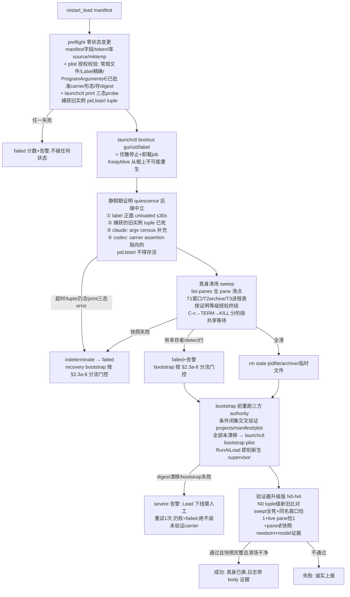

# FLY-1507 restart 换管家不换真身 — 实施计划

Issue: FLY-1507 (https://linear.app/geoforge3d/issue/FLY-1507/基建卡点-restart-换管家不换真身-孤儿-lead-本体被收养旧-modelopus-4-8-永不落地)
日期: 2026-07-27
基于: research.md

Version: v1.58.0(暂定,ship 时取空号)
Status: codex-approved(R6 APPROVED,2026-07-27;R1 3H/3M/1L、R2 3H/2M、R3 3H、R4 2H/2M、R5 1M 全采纳,见 §7)

## 0. 目标与不变量

**目标**:`restart-services.sh` 的每次 Lead 重启保证「真身被替换」——重启完成时,该 Lead 的 claude/codex 本体是本次重启新生的进程,启动参数(含 `--model`)来自 FLY-1496 热解析;验证器绝不把残存旧本体判为成功。

**不变量(改完必须仍然成立)**:

- I1 无孤儿的正常 Lead 重启语义与今天一致:supervisor 收到 SIGTERM 优雅退出(cleanup 带走本体)→ 新 supervisor 新生 launch——假阴性零容忍(Tadashi ⑥)。
- I2 任何信号只发给「身份证明完备」的目标:pid+start-identity 双验 + 归属证明(见 §2.2 证明等级);证明不齐 = 只检测不动手(fail-closed 成 failed,绝不误杀)。
- I3 claude-lead.sh / codex-lead.sh / 三层守卫 / Runner 收养逻辑零改动;**本版 flywheel-lead-wrapper.sh 也零改动**(R1-2 后过渡锁被结构性方案取代)。
- I4 换身不失忆:SESSION_ID_FILE 不动,新本体 `--resume` 同一 session。
- I5 stdout 契约不变(`do_restart_all_leads` 输出 `skipped:N failed:M`,日志走 stderr);`set -euo pipefail` 下任何新代码的非零都显式折算为该 Lead failed,绝不中止整波 fleet。
- I6 QA test-slot manifest 照旧 skip;清场绝不触碰归属证明不指向本 (project, lead) 的窗口/进程。
- I7 **采集即权威(R1-1)**:newborn 判定只在「快照完整成功」的前提下成立;快照任何一步失败 = indeterminate = 该 Lead 永不判成功。

## 1. 总体设计



原理:三层守卫(lease/archive/preflight)全部锚定「本体活着」,本体死则全部自然放行(research.md §3 逐条核验),新 supervisor ≤30s 内物理 launch,FLY-1496 热解析自动落地。**零改 claude-lead.sh。**

**结构性竞态封闭(R1-2 重构,取代 v1 的 wrapper 过渡锁)**:v1 用锁文件挡 KeepAlive 间隙重生,但锁只是检查点不是屏障,且 unlock→kickstart 之间仍有窗口。v2 改用 launchd 自身的状态机:`bootout` 卸载 job 后,launchd **结构上不可能**再拉起任何实例(不是"检查后放行",是没有 job 可拉);清场在无 job 期完成;`bootstrap` 重载即启动唯一被祝福的新代。`kickstart -k` 从 Lead 路径彻底退场(它对活实例是无 cleanup 强杀,正是孤儿制造机之一)。wrapper 零改动。in-repo 先例:`scripts/flywheel-daemon.sh` 的 stop/start 生命周期即 bootout/bootstrap(FLY-247 fleet engine 同款)。

## 2. 变更清单(3 个文件 + 测试)

**可测性落点(R4-4)**:新逻辑一律进可 source 的 production lib——`scripts/lib/lead-body-sweep.sh`(§2.1 快照/终结/验证器 helpers)与 `scripts/lib/lead-restart-lifecycle.sh`(launchd 三态 probe、carrier 条件闭集矩阵、plist/三方 authority 校验与 digest、失败态 bootstrap 分流、loaded-plist 清点);`restart-services.sh` 只做 orchestration(调用序列 + 计数折算)。T10/T16/T19/T20 直接 source lib 测真函数(不写 keep-in-sync 副本,`test-restart-services.sh:37-66` 的手抄函数模式不复制);另设至少一个 orchestration 级测试走真实 `restart_lead`/fleet 折算,锁住「helper 对但没接线」。

### 2.1 新库 `scripts/lib/lead-body-sweep.sh`(新文件,source-only)

bash 3.2 安全、无 trap、不改 shell opts;依赖 `packages/teamlead/scripts/lib/lead-identity-preflight.sh`(`lead_identity_command_matches`)与 `packages/teamlead/scripts/lib/tmux-supervisor-guard.sh`(`tmux_supervisor_archive_read` / `tmux_supervisor_process_start_identity` / `tmux_supervisor_archived_process_matches`)。所有 tmux 调用走 `_sweep_tmux`(`FLYWHEEL_TMUX_SOCKET_OVERRIDE` 有值则 `tmux -S`,镜像 claude-lead.sh:1278-1284;生产不设 = 字节等价)。

**快照(采集即权威,I7)** `lead_body_collect_targets <project> <lead_id> <backend> <archive_file> <out_file>`

- out_file 首行状态头 `#status=complete|indeterminate`,目标行 `pid \t start_identity \t proof(full|detect) \t source(window|archive|proctable) \t window_id(可空) \t pane_id(可空,R3-3)`。
- **统一 pane 清点 helper(R3-2)** `lead_body_pane_inventory`:`_sweep_tmux list-panes -s -t =flywheel -F '#{window_id}\t#{window_name}\t#{pane_id}\t#{pane_pid}\t#{pane_dead}'`——**`-s` 把 target 限定为 flywheel session**(`-a` 会无视 target 扫整个 server,QA slot/Runner 的同名窗口会被卷入,I6 破防);collector、清窗收尾重枚举、验证器 N1/N3 **三处必须复用同一 helper**,杜绝口径漂移。
- **T1 窗口(强制权威源,全 pane 清点,R2-3)**:经 `lead_body_pane_inventory` 一次拿到**每个 pane 一行**(`list-windows` 只报 active pane,不是 pane inventory——in-repo 先例 `flywheel-daemon.sh:438-470`、`fleet-data.ts:160-188` 都用 list-panes),过滤 `window_name == "<project>-<lead_id>"` 精确匹配(窗口可多个,pane 可多枚,全收,**逐 pane 记录 pane_id**)。live pane(pane_dead=0):取 pane_pid + start_identity + `ps -o command=`,按 §2.2 证明等级定 proof——**同名窗口里任何一个 live pane 无法证明归属 → 该 pane 记 detect,整窗禁止 kill-window**;**枚举失败、行解析失败、活 pane 的 start_identity/command 读取失败 → 整体 indeterminate**。dead pane(pane_dead=1):记 window_id+pane_id,pid 留空(proof=full,窗口可清的必要条件之一)。
- **T2 archive**(claude backend;codex 无此档案,文件存在即异常→detect 行;R4-1 重构):**不把 `tmux_supervisor_archived_process_matches` 的布尔 rc 当 proof**(该 helper 把 parse/死亡/lstart 读失败/command 读失败/不匹配全压成 rc=1,且只验 `--agent` 不验 project)。分步取证:`tmux_supervisor_archive_read` → 分别探测 alive(kill -0)、lstart(process_start_identity)、command(ps -o command=),**传感器失败(读不到)与判定性不符(读到但不同)分开处理**:lead token 匹配**且** bundle project 旁证通过 → full;同 (pid,lstart) 但 bundle 缺失/异项目 → detect;任何读取失败 → 保留 archive + 整体 indeterminate;仅在「确定死亡」或「lstart 确定不同」时按 stale archive 清理。
- **跨源去重(R4-1)**:同一 pid 在多源分类冲突时,**detect 压倒 full**(证明不一致本身就是不许动手的理由;v3 的 full 优先会让 archive 的 lead-only 证明反向覆盖 T3 的异项目 detect 保护,重开跨项目误杀)。
- **T3 进程表(补充源,backend=claude-code)**:`ps -axo pid=,command=` 逐行 `lead_identity_command_matches`;命中后 project 旁证 = argv `--append-system-prompt-file …/lead-rules-bundles/<basename>` 的 basename 以 `<project>-<lead_id>.` 开头 → full;**无 bundle 参数或前缀不符 → proof=detect(只检测,绝不发信号,防跨项目 lead_id 撞名误杀;R1-3)**;ps 快照失败 → indeterminate。
- 按 pid 去重(**detect 压倒 full**,R4-1:多源证明冲突=不许动手)。indeterminate 时目标行仍尽量写全(供诊断),但上层视同失败。

**终结(分阶段共享等待,R1-7)** `lead_body_terminate <targets_file> <lead_id> <archive_file>`

- 只对 proof=full 的目标发信号;**每阶段每目标发信号前重验 pid+start_identity**(变了=复用,跳过;I2/P2)。
- 阶段化:①对有 **pane_id** 的目标发 C-c(R3-3):先按 pane_id 重读 `(window_id,pane_pid,pane_dead)` 并与授权 tuple 全等复验,通过才 `send-keys -t "$pane_id" C-c`——**绝不以 window 为 target**(window target 命中 active pane,多 pane 时会把 C-c 打进未授权 shell);pane 消失/迁窗/身份变化 → 跳过 C-c,按 tuple 规则落到②③ → 全体共享等待 ≤5s;②幸存者 `kill -TERM` → 共享等待 ≤5s;③幸存者 `kill -KILL` → 共享等待 ≤2s。最坏 ~12s/Lead,与目标数无关。archive/proctable-only 目标(pane_id 空)不走①。
- 收尾 kill-window(R1-3+R2-3):仅当该窗口的**全部** pane 满足「pane_dead=1」或「(pane_pid,start_identity) 与本次已授权并验死的目标 tuple 全等复验通过」——任何一个 live pane 无授权(detect/无关进程)→ 整窗不动 + indeterminate(kill-window 会连带终结全部 pane,绝不许连坐);archive 仅在其记录 tuple 确认死亡或确认身份漂移后 rm(与 claude-lead.sh:1461-1465 自愈兼容)。
- 返回:0=full 目标全死且无 detect 行;1=有幸存者;2=存在 detect 行(检测到疑似本体但无权终结)——1/2 上层都计 failed+告警,绝不报成功。

**验证器辅助**:
- `lead_body_swept_all_dead <targets_file>`:状态头必须 complete;逐行(含 detect 行)kill -0 + start_identity 比对,任一仍活 → 1。
- `lead_body_newborn_ok <project> <lead_id> <targets_file>`:状态头 complete + 同名窗口恰 1 + **该窗口 live pane 恰 1 且即本体(list-panes 全清点,无额外 live pane,R2-3)** + (pane_pid,start) ∉ 快照集合 + `lead_body_swept_all_dead` 通过 → 输出 `P \t S`;否则 1。不做 lstart→epoch 日期解析(BSD/GNU 不兼容);「出生晚于清场」由完整快照的集合差 + bootout 无 job 期封死旁路创建共同保证。
- `lead_body_model_evidence <pane_pid> <manifest_file>`(claude backend):ps argv 精确 token 取 `--model` 值,与 manifest `.resolvedModel`(FLY-1496 同次 launch 写入)比对;不一致 → WARNING+1;resolvedModel 缺失 → WARNING+0(证据缺失≠身份未换)。

### 2.2 目标归属证明等级(R1-3)

| 等级 | 条件 | 权限 |
|------|------|------|
| full | claude pane/进程:`lead_identity_command_matches`(可执行名+`--agent <lead_id>` 精确 token)**且** bundle basename `<project>-<lead_id>.` 前缀旁证;codex pane(R2-4 收紧):窗口名精确匹配 **且** argv token 证明 = 可执行 basename `codex` + 精确 `resume` token + 合法 `--remote unix://…/app-server-control.sock` token + `-C/-s/-c` 固定形态校验(对照生产创建器 `tui-window.ts:67-97`);dead pane:窗口名精确匹配 | 可终结;清窗另需整窗全 pane 授权(§2.1 收尾) |
| detect | 名字/agent 匹配但 project 旁证缺失或不符(legacy 无 bundle、跨项目撞名)、codex pane argv 读取/解析失败或仅普通 `codex` 命令、同名窗口内任何无法归属的 live pane | 只记录+WARN+计 failed,绝不发信号(诚实失败优于冒险) |

### 2.3 `scripts/restart-services.sh` 改动

**a. `restart_lead()` launchd 分支重构**(918-1051;legacy nohup 分支见 e):

1. **preflight(零状态变更,R1-4 + R2-5 授权校验 + R3-1 carrier 闭集矩阵)**:manifest 字段、bot token(现有 1008-1014 检查**上移**到任何状态变更之前)、两个依赖库 source 成功、`mktemp` 成功;**carrier 条件闭集矩阵(三方权威交叉验证,R3-1+R4-2)**——manifest 的 `leadBackend` **不是** backend 权威(实机核验:生产 `growth-mufasa-lead.json` 的 leadBackend=null 而 plist 走定制 codex TUI wrapper,`// "claude-code"` 默认值会把 Mufasa 误判成 claude,重开 R2-2 的代理清窗风险)。**条件闭集**:①标准 `flywheel-lead-wrapper.sh <manifest>` 逐字 argv **只批准 effective claude**——若 projects.json/manifest 任一声明 codex → failed 于 bootout 之前(标准 wrapper 按 manifest 派发到 codex-lead.sh,其默认 **headless**、仅 ambient env 才 TUI(`codex-lead.sh:136-176`),放行即违反 FLY-398「生产 Codex 只许 windowed」硬规;classifier 先例 `flywheel-cmux-sync.sh:542-556` 同判 config-drift);② `flywheel-codex-lead-wrapper-mufasa-tui-fullaccess.sh` → growth-mufasa-lead,codex TUI;③ `flywheel-codex-lead-wrapper-codex-infra-bot.sh` → flywheel-codex-infra-bot-lead,codex TUI;legacy `…mufasa-tui.sh` **不批准**,命中即 failed 要求人工裁决。**manifest 字段语义**:标准 carrier + manifest backend 缺失 → 按 wrapper 真实运行语义归一为 claude;定制 carrier + manifest null = 「无声明」非分歧;显式相反值 → failed。三方(plist 形态 / projects.json / manifest)判定后任何不可调和分歧 → failed+告警,不碰状态。**plist 授权校验**:常规文件(拒 symlink)、`Label` 精确等于 `daemon_label`、ProgramArguments ∈ 上述闭集(对照 `flywheel-daemon.sh:560-607` destructive-boundary 复验先例),并**记录 plist digest**;**launchctl print 三态 probe(loaded|unloaded|error,对照 `flywheel-daemon.sh:139-163`:只有 could-not-find-service 类错误算 unloaded,其他非零=error)**,loaded 时捕获旧实例 `(old_pid, old_lstart)` tuple。任一失败/error → failed+告警,直接 return 1,不碰任何状态。
2. **stop = `launchctl bootout "$daemon_target"`**(取代 pidfile TERM + kickstart -k 组合;launchd 对实例发 SIGTERM → supervisor cleanup 照常带走本体 → ExitTimeOut(默认 20s)后 launchd 兜底强杀)。probe 已判 unloaded → 视为已满足。
3. **quiescence 证明(backend 中立,R2-1)**:①轮询三态 probe 直到 label **正面 unloaded**(≤30s;error ≠ unloaded);②preflight 捕获的旧实例 `(old_pid, old_lstart)` tuple 已死(bootout 后进程可比 job record 活得久——生产事实见 `flywheel-cmux-sync.sh:6520-6528`,必须验 tuple 而非只看 print);③claude backend 补充 argv census(`claude-lead.sh <lead_id> … <project_name>`,pid+start 复验);④codex backend 读取其 per-lead carrier assertion(发布点 `codex-lead[-tui]-runtime.ts:852-863,1405-1411`,格式 `lead-lease.ts:612-716`)——assertion 指向的 `(pid,lstart)` 仍活 → 不 quiet;assertion 存在但读取/解析失败 → indeterminate。任一不满足 → indeterminate → failed(recovery 走 8 的分流门控)。
4. **清场**:`lead_body_collect_targets` + `lead_body_terminate`(§2.1)。indeterminate/幸存者/detect 行 → failed 路径(bootstrap 是否执行按 8 分流,绝不报成功)。
5. **收尾**:rm stale pidfile(既有 1002)、临时 targets 文件经统一 finalizer 清理(单一出口,`|| rc=$?` 折算,I5)。
6. **start**:bootstrap 前**重跑同一 carrier 条件闭集交叉验证**(R4-2:不只 plist digest——projects.json/manifest 也是 authority(标准 wrapper 真实消费 manifest、projects 决定期望 backend),preflight 记录三份 relevant snapshot/digest,此处逐一复验未漂移;destructive-boundary 三方 fence 先例 `flywheel-daemon.sh:572-607`;任何漂移 → severe 告警+failed,绝不装未验证 carrier)→ `launchctl bootstrap gui/$(id -u) <plist>`(RunAtLoad=true 即刻新生);失败重试 1 次,仍败 → severe 告警「Lead 下线需人工」+ failed。
7. **验证循环**(既有 30×2s + 最终复验结构不动)调用升级版验证器(b)。成功条件 = 验证器通过 **且** 快照 complete **且** 清场 rc=0。成功日志:`Lead $lead_id restarted via launchd (supervisor $PID, body PID $BODY_PID born $BODY_START, model $BODY_MODEL)`。
8. **失败态 bootstrap 分流门控(R2-2)**:recovery bootstrap 的前提永远是「旧 supervisor tuple 已证死」。**claude backend**:tuple 证死后,快照 indeterminate/detect/幸存者仍可 bootstrap(pidfile 护栏+三层守卫让新 supervisor 安全 hold = 今天的行为);tuple 未证死 → 不 bootstrap,severe 告警需人工。**codex backend**:因新 generation 首次 `ensureTuiWindow` 会**无条件 kill-window 同名旧窗**(`codex-lead-tui-runtime.ts:402-458,729-734`、`tui-window.ts:120-155`)——快照 indeterminate、存在 detect 行或有幸存者时 bootstrap 会借新 runtime 之手绕过 P2/P4 连坐清窗,且旧 sidecar 未证死时 bootstrap 造双 supervisor、其新建 pane 还会污染 newborn 集合——所以 codex 在上述任一不安全态一律**不 bootstrap**,severe 告警「Lead offline/需人工」;宁可下线不换误杀/双写。**旧 supervisor 抗 TERM(R1-2c)**:bootout ExitTimeOut 强杀兜底;quiescence 仍见活 tuple → indeterminate,绝不进入清场后旁路;restart 开始前一刻 KeepAlive 恰好重生的实例同理被 bootout 终结——无 job 期没有任何 launch 通道。

**b. `launchd_lead_outcome_ready()` 升级**(899-914,追加参数 `<targets_file> <backend> <manifest>`):

```
N0 launchd 新实例存在,且其 (pid,lstart) tuple ≠ preflight 捕获的旧 tuple
   (R2-1:tuple 级比对,纯 PID 数值不同不算——防 PID 复用假阴/假阳)
   + 既有窗口探测保留
新增(全部 fail-closed):
  N1 同名窗口计数恰 1(经 lead_body_pane_inventory,session 内精确过滤,R3-2)
  N2 lead_body_swept_all_dead(含 detect 行;旧本体断气才算数)
  N3 lead_body_newborn_ok → (P,S)(含「live pane 恰 1 且即本体」,R2-3)
  N4 backend=claude-code → lead_body_model_evidence(不一致→not ready);
     其他 backend 跳过 N4,N1-N3 照常(Tadashi ④)
通过后导出 BODY_PID/BODY_START/BODY_MODEL 供成功日志
```

假阳性根除点:孤儿场景 N2/N3 永假 → 重试穷尽 → return 1 + 既有 `alert_warning lead-restart-failed`。快照 indeterminate 时上层根本不进成功分支(I7),Codex backend 也不例外(R1-1 回归测试锁死)。

**c. 路径口径**:新代码内 pids/archive 路径沿用本脚本既有字面量 `${HOME}/.flywheel/pids`(与 975 行一致);v2 无 wrapper 侧消费者,R1-4 的 producer/consumer 分裂问题不复存在。custom stateDir 的全面归一是既有债,不在本单扩科。

**d. 时间预算**:健康路径 = bootout 优雅退出(数秒)+ 空清场 + bootstrap,与今天量级相当;最坏路径 = bootout 20s + quiescence 30s + 清场 12s ≈ 62s/Lead。13 Lead 顺序最坏 +13min(仅在全 fleet 同时烂掉时);正常增量 ≈ 0。不调既有超时参数。

**e. legacy nohup 分支**(1053-1086,非 launchd 管理):保留既有 pidfile TERM,但补 KILL 升级(60s 后仍活 → 复验身份 → KILL);同样执行清场;无 KeepAlive 竞态,无验证器升级(生产全部 launchd 管理,如实记边界)。

**f. fleet 统一候选清点(R3-1+R4-3+R5-1:total、去重、一次分类)**:`do_restart_all_leads` 现只遍历 manifests + `claude-lead.sh` 进程发现(1181-1203,旧 process 源只按 leadId 判覆盖、无 test-slot 分类),**无 manifest 的已加载 Lead 会从结果里凭空消失**(实机核验两例:`flywheel-codex-infra-bot-lead` 有 plist+projects 无 manifest;`flywheel-anna-interviewer-lead` plist loaded、无 manifest、**projects.json 也没有**)。合同——lifecycle lib 产出**按 exact daemon key `(projectName,leadId)` 去重的统一候选清单**,orchestration 一次分类,不做独立增量计数器:
   - 三源归并:manifest 精确覆盖 / loaded plist(常规文件→解析 exact `Label`→三态 probe:**loaded** 才候选,**unloaded** 磁盘残留忽略,**error** 计 failed+告警,transport/权限错误不得冒充未加载)/ legacy 进程发现(只补充未被前两源表示的 key,取不到 exact project 身份 → fail-closed 计 failed,不靠 leadId 猜)。同一 key 全程只计一次(`loaded plist + 同一 live 进程` 不得双计)。
   - 分类:`flywheel-test-*` 任一源出现都不计数直接 continue(I6);loaded 非 QA + production 精确匹配 + 无 manifest → `skipped` + `alert_warning` 点名;loaded 非 QA + **projects 缺失/错误或 Label/身份解析失败**(Anna 形态)→ `failed` + config-drift 告警点名(对齐 `restart-candidate.sh:27-43` 的 non-QA drift 走 fail 不 skip),**绝不静默**。
   - 本单不为无 manifest 的 Lead 实施 restart(manifest 携带 botTokenEnv 等启动要素,补齐 manifest 属运维/后续单,边界如实记录)。

### 2.4 wrapper:零改动(v1 的 §2.3 整节删除)

## 3. 保护性机制表(founder 可裁砍;Tadashi ③,R1-6 全文内联)

| # | 机制 | 防的场景 | 为什么主线(清场+验证器)不够 | 砍掉的后果 | 摘除边界 |
|---|------|----------|------------------------------|------------|----------|
| P1′ | bootout→清场→bootstrap 结构性无 job 期(取代 v1 锁文件方案) | KeepAlive 在停止与启动之间重生 supervisor 抢跑 launch,再被强杀留下新孤儿(模型正确但失管);v1 的锁只是检查点,unlock→kickstart 仍有窗口(Codex R1-2) | 清场管不到清场之后诞生的本体;验证器会把"清场后出生"的抢跑孤儿判为 newborn → 假阳性变种复发 | 回到 kickstart -k:每次重启有概率再造失管本体,问题以新形态回归 | 把 stop/start 改回 pidfile TERM + kickstart -k 两行;quiescence/清场/验证器不受影响 |
| P2 | 每次发信号/清窗前 pid+start_identity(+argv 归属)全量复验 | 快照与信号之间目标自死且 PID 被无关进程复用 → 误杀无辜(可能是别的 Lead/Runner) | 快照是时点数据,清场含多次等待循环,竞态窗口真实存在 | 极低概率误杀任意进程;库内所有既有 reaper 均带此复验,砍掉即低于既有安全标准 | terminate 内复验调用点,逐个可删 |
| P3′ | quiescence 失败/bootstrap 失败时的补救(恢复 job / severe 告警) | restart 自身故障把 Lead 留在无 job 失管态 | 主线只保证"不假成功",不自动保证"失败后 Lead 还活着" | restart 失败叠加 Lead 下线,靠 KeepAlive 兜不住(job 已卸载) | 步骤 3/6 的补救分支 |
| P4 | detect 等级(证明不齐只检测不动手) | 跨项目 lead_id 撞名、legacy 无 bundle 形态、窗口被人工改名/占用 | 主线若一律终结则误杀,一律忽略则假 newborn;分级是唯一两全 | 砍成"一律终结"→误杀风险;砍成"一律忽略"→撞名场景假阳性 | 证明等级表 §2.2,detect 分支独立 |

## 4. 测试计划(TDD,先写测试)

载体:新 `scripts/test-lead-body-sweep.sh` + `scripts/test-restart-services.sh` 追加(直跑、PASS/FAIL 计数、mktemp 隔离;stub = PATH 前置假 `ps`/`kill`/`tmux`/`launchctl` bin,沿用既有模式;**source 真实库函数,不另写 keep-in-sync 副本**,R1-5)。全部脚本过 `/bin/bash -n`(bash 3.2 铁律)。

| # | 测试 | 断言 |
|---|------|------|
| T1 | collect 三源去重(含同名窗口×2) | 目标集正确;T3 仅 claude backend |
| T2 | 跨项目撞名 / legacy 无 bundle | proof=detect,零信号,rc=2,failed 路径(R1-3) |
| T3 | terminate 阶段化:TERM 后即死 | 不发 KILL;信号序列被 stub 记录验证;共享等待(多目标总时长≤上限) |
| T4 | 信号前 start_identity 变化(PID 复用) | 跳过零信号(P2);kill-window 前 pane tuple 复验不符 → 不清窗+indeterminate |
| T5 | KILL 后仍活 | rc=1 + 幸存 pid 输出 + failed |
| T6 | **假阳性回归(核心)**:孤儿 pane 活 | 验证器全程 not ready → return 1,无成功日志;**claude 与 codex backend 参数化各跑一遍**(R1-5) |
| T7 | **假阴性回归**:无孤儿正常 Lead | bootout→空清场→bootstrap→验证通过;成功日志含 body 证据;**双 backend 参数化** |
| T8 | **快照 indeterminate(R1-1 核心)**:collect 时 tmux/ps/lstart 失败,验证时恢复且旧 pane 仍活 | 双 backend 均 not ready,绝不 newborn;**codex 态并断言 bootstrap 调用次数=0**(R2-2) |
| T9 | N1 同名窗口=2 → not ready;N4 model 不一致 → not ready+WARNING;resolvedModel 缺失 → WARNING+通过;codex 跳 N4 但 N1-N3 生效 | 各态断言 |
| T10 | **launchd 状态机(R1-2+R2-1)**:bootout 超时 / print 三态 error(权限/transport)≠unloaded / 旧实例 tuple 在 job 卸载后仍活(claude supervisor 与 codex `exec node` runtime 两形态)/ codex carrier assertion 指向活进程 / assertion 解析失败 / bootstrap 失败(重试后恢复与不恢复) | 全部 indeterminate→failed,不进 sweep/success;分流门控走对(claude tuple 证死后可恢复 bootstrap;codex 不安全态 bootstrap=0 且无经新 runtime 的 kill-window);severe 告警;全程无成功日志 |
| T11 | 幸存者场景 restart_lead 全流程 | claude:照常 bootstrap、failed、alert;codex:bootstrap=0、severe「需人工」;两者绝无成功日志 |
| T12 | 反向兼容哨兵:clean lead 全流程 | stdout 契约不变;stub tmux 记录证明未触碰非本 Lead 窗口;preflight 失败(token/plist 缺)在任何状态变更前 return(R1-4) |
| T13 | archive 分步取证(R4-1):command/lstart 读取失败 vs 同 leadId+异项目 bundle vs legacy 无 bundle vs 判定性不符 | 读取失败→indeterminate+保留 archive;异项目 bundle→detect 且**不被同 pid 的 archive full 覆盖**(detect 压倒 full);三态全部零 signal;仅确定死亡/lstart 确定不同才清档 |
| T14 | `set -e` 安全:collect/terminate 非零在 restart_lead 内被折算 | 单 Lead failed,fleet 循环继续(I5) |
| T15 | **multi-pane(R2-3+R3-3)**:同名窗口内 full 本体在 **inactive pane**、无关人工 shell 为 **active pane**,双 backend | 无关 pane 零按键(stub 断言 send-keys target = 本体精确 `%pane_id`,shell 收到按键数 0)、整窗零 kill-window、failed;N3 因 live pane≠1 拒绝 |
| T16 | **plist/三方授权(R2-5+R4-2)**:malformed / Label 不符 / ProgramArguments 非已批准 carrier / bootout 后 plist digest 漂移 / **bootout 后 manifest backend 或 projects backend 漂移** | 前三者 preflight 拒于任何状态变更前;任一漂移态不 bootstrap + severe 告警 |
| T17 | codex full argv 证明(R2-4):完整 `codex resume --remote unix://…` 形态 vs 普通 `codex` vs 解析失败 | 仅完整形态 full;其余 detect 零信号 |
| T18 | **session 隔离(R3-2)**:flywheel 之外的 QA/runner session 存在同名、full 形态 pane | 目标集完全忽略、零 send-keys/kill/kill-window;stub 断言 tmux argv 用 `list-panes -s -t =flywheel` |
| T19 | **carrier 矩阵实机形态(R3-1+R4-2)**:Mufasa 形(manifest leadBackend=null + projects.json codex + 定制 plist)→ 判 codex、跳 N4、codex 门控生效;**standard wrapper + projects/manifest codex → failed 于 bootout 之前**(FLY-398 windowed-only);legacy `…mufasa-tui.sh` → failed;三方不可调和分歧 → failed 于状态变更前 | 各态断言 |
| T20 | **统一候选清点合同(R3-1+R4-3+R5-1)**:infra-bot 形(loaded plist+projects,无 manifest)/ **Anna 形(loaded plist,无 manifest,projects 也无)** / unloaded 磁盘残留 plist / print 三态 error / 同 leadId 跨项目 manifest 遮蔽 / loaded QA `flywheel-test-*` plist / **loaded plist + 同一 live pgrep 进程** / **manifestless QA 同时现于 plist+pgrep 两源** | 依次:skipped+alert 点名;**failed+config-drift 告警点名**;忽略;failed+告警;exact (project,lead) 键不遮蔽;QA 不计数 continue;**只计一次**;**计零**——全部绝不静默消失 |
| T21 | **orchestration 接线(R4-4+R5-1)**:真实 `restart_lead` + fleet 折算(source 生产 lib,stub 外部命令),含三源归并去重路径 | helper 全部被真实调用序列接到;同一 key 端到端只计一次;stdout 契约不变 |

## 5. 验收(能力级 E2E,真机;issue 原文)

1. 合入部署后跑一次 `restart-services.sh`(自托管纪律:ship 走 :cool: / detached `self-ship-restart.sh`,绝不 inline):**全部本次实际 restart 的 manifest-backed Lead** `ps` 出生时间刷新为本次重启,`--model` 与 projects.json 派生一致,**不再有任何 `claude-opus-4-8`**(现存 9 个冻结本体全部属 manifest-backed,一次收敛);manifestless 的 skipped/config-drift job(infra-bot、Anna 形态)必须在 degraded status 与点名告警中逐一出现(R5-1,与 §6 边界自洽)。
2. restart 日志对每个 Lead 的成功都携带 body PID/born/model 证据,与 `ps` 实测一致;无假阳性。
3. 正常(无孤儿)Lead 同一次重启照常成功(假阴性检验)。
4. Codex code review 通过;ship 走 founder gate。

## 6. 诚实边界

- ✅ 重启一次即收敛任何存量/增量孤儿;验证器不再说谎;模型落地交给 FLY-1496(已 ship)。
- ❌ 不改两次重启**之间**的语义:supervisor 崩溃 → 新 supervisor 依旧 hold 旁观活本体(防 split-brain by design),本体失管至下次重启——已知接受。
- ❌ 证明不齐的疑似本体(detect 等级)不终结:该 Lead 重启诚实失败并告警,由人裁决——不冒误杀险换收敛。
- ❌ codex backend 在不安全失败态(快照 indeterminate/detect/幸存者/旧 tuple 未证死)选择「下线等人工」而非自动恢复:接受 Lead 暂时 offline,换取不双写、不借新 runtime 之手连坐清窗(R2-2)。
- ❌ bootout 的 ExitTimeOut(默认 20s)短于今天 pidfile 路径的 60s 等待:cleanup 实测 ≤7s,残余风险=清理超 20s 的 supervisor 被 launchd 强杀(其本体由清场兜底);不改 plist(fleet 配置属 FLY-247 域)。
- ❌ 不消除 resume 固有风险(换身后 `--resume` 偶发确认框冻结,系既有同款路径)。
- ❌ legacy nohup 分支只加清场+KILL 升级,不加验证器升级(生产全部 launchd 管理)。
- ❌ 无 manifest 的已加载 Lead plist(如 flywheel-codex-infra-bot-lead)本单只做**可见性**(skipped+告警点名),不做 restart——补齐 manifest 属运维/后续单(R3-1)。
- ❌ 不动 Runner 收养(FLY-1399)、三层守卫、Bridge/cmux、wrapper。

## 7. 设计评审台账

- Codex R1(2026-07-27,xhigh):CHANGES REQUESTED,3H/3M/1L 全采纳——H1 快照 indeterminate fail-closed(I7/T8);H2 锁方案推翻,改 bootout/bootstrap 结构性无 job 期(§1/P1′/T10);H3 证明等级制+kill-window tuple 复验(§2.2/P4/T2/T4);M4 preflight 前置+单一出口+set-e 折算(§2.3a-1/5,T12/T14);M5 测试矩阵双 backend 参数化+竞态/indeterminate 场景(§4);M6 保护性机制表内联(§3);L7 阶段化共享等待+预算重算(§2.1/2.3d)。
- Codex R2(2026-07-27,xhigh):CHANGES REQUESTED,3H/2M 全采纳——H1 quiescence 后端中立化:print 三态 probe+旧实例 tuple 捕获/验死+claude census 降为补充+codex carrier assertion 检查+N0 tuple 级比对(§2.3a-1/3,N0,T10);H2 失败态 bootstrap 分流门控:claude tuple 证死后才可恢复,codex 不安全态一律不 bootstrap(其 ensureTuiWindow 会无条件清同名旧窗,绕过 P2/P4)(§2.3a-8,T8/T10/T11);H3 list-panes 全 pane 清点取代 list-windows,整窗全 pane 授权才可清窗,newborn 加「live pane 恰 1」(§2.1,N1/N3,T15);M4 codex full 证明从 basename 收紧为完整 TUI argv token(§2.2,T17);M5 plist 授权校验+digest TOCTOU 复验(§2.3a-1/6,T16)。
- Codex R3(2026-07-27,xhigh):CHANGES REQUESTED,3H 全采纳——H1 carrier 闭集矩阵:manifest leadBackend 不作 backend 权威(实机:Mufasa manifest 该字段 null 会被误判 claude),三方权威交叉验证+生产 carrier 逐字列名+legacy 不批准+无 manifest 已加载 plist 的 fleet 可见性(§2.3a-1/f,T19/T20);H2 `list-panes -a` 越 session 边界 → `-s -t =flywheel` 统一 helper,collector/清窗/验证器三处同源(§2.1,N1,T18);H3 targets 增列 pane_id,C-c 以精确 pane 为 target+发前按 pane 复验,绝不回退 window target(§2.1,T15 扩)。
- Codex R4(2026-07-27,xhigh):CHANGES REQUESTED,2H/2M 全采纳——H1 archive 分步取证(布尔 helper 不当 proof;full 需 lead token+project bundle 双证;传感器失败≠判定性不符;跨源去重改 detect 压倒 full)(§2.1 T2/去重,T13);H2 carrier 改条件闭集(standard wrapper 只批 effective claude,projects/manifest 声明 codex → bootout 前 failed,守 FLY-398 windowed-only)+ bootstrap 前三方 authority 全量复验非仅 plist digest(§2.3a-1/6,T16/T19);M3 loaded-plist 清点合同化(exact Label+三态 probe+exact (project,lead) 键+QA 不计数)(§2.3f,T20);M4 新增 `scripts/lib/lead-restart-lifecycle.sh` 落 lifecycle/carrier/inventory helpers,restart-services.sh 只 orchestration,+orchestration 接线测试(§2 preamble,T21)。
- Codex R5(2026-07-27,xhigh):CHANGES REQUESTED,1M 采纳——统一候选清点:三源(manifest/loaded plist/legacy 进程)按 exact daemon key 归并去重一次分类;Anna 形态(loaded、无 manifest、projects 也无)= failed+config-drift 告警不 skip(对齐 restart-candidate.sh);legacy 源只补未表示 key、同 QA skip、身份取不到 fail-closed;验收措辞收窄为 manifest-backed Leads 并要求 manifestless 逐一现于 degraded status/告警(§2.3f、§4 T20/T21、§5-1)。
- Codex R6(2026-07-27,xhigh):**APPROVED**;非阻断建议(流程图同步 bootstrap 前三方校验措辞)已就地采纳。
