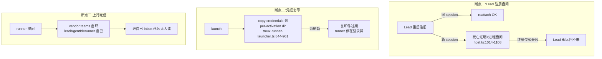
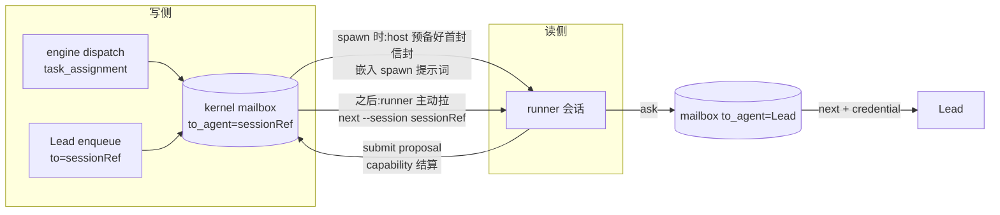

# FLY-1543 三处断点根治 — Lead 直接接手 / 单一活凭据 / mailbox 唯一通道(teams JSON 废除 + session 寻址)实施计划

Issue: FLY-1543 (https://linear.app/geoforge3d/issue/FLY-1543)
日期: 2026-07-30
基于: main@`90c9da15` 实码审计(五路并行,file:line 锚点见各节)+ PR #727(①②③旧实现,**仅参考不继承**)+ commit `800e8072` 的 `engineering/doc/FLY-1537-session-addressing/plan.md`(已过一轮评审;**与本单口径冲突处以本单为准**,冲突明细见 §10)+ `packages/flywheel-comm`(v1 成熟 mailbox 交互样板,founder 点名)

## 0. 权威与红线

- **红线(founder 逐字)**:不新增任何 flag / 开关 / 守护进程 / 兜底;**同 UID = 已接受边界**(不为同机同用户进程互信再造防线);**agent-agnostic**(Codex 等非 Claude runner 走同一条 CLI、同一套 mailbox)。
- **流程**:设计单轮完成(founder 今晚压缩指示,不跑多轮 codex 评审);设计 settle 后 implement 自动接棒。
- **teams JSON 定性(founder 原话)**:「收件箱就是我们 Database 的 mailbox,压根没打算用它那套 JSON」。DB mailbox 是唯一投递账本;vendor 的 Agent Team/teams JSON 从来不是设计的一部分。
- 一次 stop-the-world 迁移窗口(镜像 FLY-1502 纪律):停 host → 备份 → 迁移 → 新码 → 起 host。不双写、不灰度。
- 交互形态样板 = `flywheel-comm`(id-returning 非阻塞 ask、回信按关联键路由、清晰的 verb 边界);**机制**全部落在 v2 kernel mailbox + host socket,不引用 v1 任何运行时。

## 1. 现状与三处断点(含今晚活体证据)



三处断点都在今晚的生产管线上真实断过;第四、五、六件事是同一根因的深挖:

1. **Lead 注册盘问**:`host.ts` `#registerLead`(`:975-1145`)对换 session 的注册要求 death evidence + 进程 probe 仪式(7 条 FenceViolation 拒绝路径),Lead 掉线后换新 session 回来 = 三步人工仪式,否则 `"existing lead identity requires evidenced generation takeover"`(`host.ts:1115-1117`)永拒。
2. **凭据复印**:`#provisionClaudeCredentials`(`tmux-runner-launcher.ts:844-901`)把 `~/.flywheel/v2/claude-credentials.json` **复印**进每个 per-activation `CLAUDE_CONFIG_DIR`;源文件按自己的节奏刷新,复印件即刻过期,新 runner 开在登录屏上没人看见。
3. **上行死信**:launcher 写的 teams config 把 `leadAgentId` 写成 runner 自己(单人自环团队,`tmux-runner-launcher.ts:774-806`),runner 用 vendor 工具提问 = 投进自己的 inbox;runner 任务中途**没有任何可达 Lead 的通道**。
4. **teams JSON 依赖**:v2 的 runner 收件全靠 vendor Agent Team 文件轮询(`claude-shim.ts` 写 inbox JSON,靠 `CLAUDE_CODE_EXPERIMENTAL_AGENT_TEAMS=1` 启用 stock `useInboxPoller`,`tmux-runner-launcher.ts:1340`)——DB mailbox 只是被抄写的源,投递真相在 vendor 文件里,与设计意图相反。
5. **岗位名寻址/工牌制**:mailbox `to_agent` = 角色名(`appendTaskAssignmentTx`,`dispatch.ts:744`),`agent_binding` 占位(`dispatch.ts:497-504`)使同角色全局串行。**今晚活体证据**:FLY-1543 自己的 implement 节点 task_assignment(messageUid `6b134c7e`,attempt #2)被投进了 design 节点的 session——按岗位名 `engineer` 寻址,谁持有工牌谁收信,design runner 收到了 implement 的派工信封,只能按协议用 `misrouted_delivery_report` event 结算(已落 events 账本,proposalDigest `6c89504f...`)。
6. **静默跳过**:dispatch 循环 11 种 skip 原因坍缩成 3 个无标签布尔(审计见 §7.1);admission 检出 writer_gap 时**收下不登记**(`admission.ts:271-290` 只落 event,mailbox 通知缺失,后续 dispatch `:996` 对该 worktree 的 writes_repo 任务永久静默 continue)。

## 2. ① Lead 注册直接接手(纯删除)

**原则:注册即上岗。** 新注册直接接手岗位,旧注册作废;作废本身就是安全机制——走现有 generation fence,零新增。

### 2.1 host.ts `#registerLead`(`:975-1145`)三分支改两分支

```
current 不存在 / generation=0        → fresh register(现状不动,:1002-1013)
current.kind='lead' 且 instance_id 相同 且 stored binding 逐字节相同
                                     → reattach(现状不动,:1109-1136 的主体)
其余(换 session / binding 变了)      → displace:直接 registerLead,无证据、无盘问
```

- **displace 分支**(替换现 `:1014-1108` 整段):
  1. `current.kind !== 'lead'` ⇒ `FenceViolation("agent kind collision for …")`(保留)。
  2. `#revokeSupersededAccess(agentId, current.generation)` —— **在** `driver.registerLead` 之前(保序:新代 handler 在 `registerLead` 返回前就启动,`driver.ts:150`;旧 credential/waiter 必须先死)。
  3. `driver.registerLead(agentId, draft, converter)`(去掉 evidence 参数)→ `registerAgentTx` 走既有 bump 路径:`nextGeneration = current.generation + 1`、crash-settle 旧代 running attempts(`registration.ts:187-200` 原样)、外代守卫(`:179-186` 原样)。
  4. `#discardSupersededDeliveries(agentId, current.generation)` —— 在 driver 调用之后(现 `:1108` 语义原样):旧代手里的 pending envelope 带死 capability,不许递给新代。
- **作废即安全**(为什么不需要盘问):被顶掉的旧 session 的 delivery credential 被 revoke(`#revokeSupersededAccess`,`host.ts:1647-1673`)→ `next` 拉取被拒;heartbeat CAS 的 generation 不再匹配 → 停跳;running attempts 被 crash-settle → 消息重投给新代。旧进程还活着也只是个再也拿不到信、写不进账本的壳。同 UID 下「一个恶意 runner 冒名顶替 Lead」的威胁在红线里明确为已接受边界(它本来就拿着 host secret)。

### 2.2 删除清单(①专属)

| 删除物 | 位置 |
|---|---|
| `parseDeathEvidence` | `host.ts:372-388` |
| takeover 盘问整段(7 条 FenceViolation:`takeover instance id…`/`…distinct from…`/`…recorded prior session binding`/`…another host epoch`/`…still live`/`…probe is unavailable`/`existing lead identity requires evidenced generation takeover`) | `host.ts:1014-1108, 1115-1117` |
| `driver.registerLead` 的 `evidence?: DeathEvidence` 参数 | `driver.ts:118-153` |
| `validateEvidence` 及 `registerAgentTx` 的 evidence 入参(**整体删除**——⑤ 使 runner 退出 agents 表,runner 侧 evidence 语义一并消失,见 §6;不做 PR #727 那种「runner 分支保留」) | `registration.ts:107-127, 177` |
| `--death-evidence-file` flag 及解析 | `cli.ts:97-110, 483, 498-505` |
| `DeathEvidence` 类型导出链 | `v2-engine/types` → host/cli import |

`assertLiveBinding`(注册者自证本进程活着,`host.ts:460-484`)与 reattach 的 `requireLiveSessionEvidence`(探自己的 session,不盘问别人)**保留**——它们校验的是来者,不是死者。

## 3. ② 单一活凭据(删复印)

**原则:全部 activation 直接用 `~/.flywheel/v2/claude-credentials.json` 同一份活凭据。** 源文件刷新即所有 runner 可见,没有复印件就没有过期复印件,零同步、零 refresher。

- `#provisionClaudeCredentials`(`tmux-runner-launcher.ts:844-901`)与 `#readClaudeCredentialSource` 校验仪式(`:904-942`)整体删除,替换为 `#linkClaudeCredentials`:
  1. 源缺失 ⇒ 抛 `RunnerLaunchConfigError`(fail-closed,报路径,在任何 tmux 动作之前——不许 runner 停在登录屏)。
  2. `rm -f` 目标后 `symlinkSync(source, <configDir>/.credentials.json)`——**每次 launch 重指**,不保留上次残留(「保留已存在的」正是复印件过期存活的机制)。
- **已陈述的残余**(不做兜底,如实记录):Claude 的 credential writer 若 rename-over 该路径,symlink 会被替换成持有该 activation 自有 token 的普通文件,且不回传共享文件;下一次 launch 重指回共享文件。共享文件由 operator/quota 体系维护为唯一真相。同 UID 篡改共享文件 = 已接受边界。
- per-activation `CLAUDE_CONFIG_DIR` **保留**(`.claude.json` onboarding preseed 仍需隔离,`tmux-runner-launcher.ts:944-979, 1239-1285` 不动);但其推导脱离 teams 路径(④):直接 `<injectionRoot>/claude/<sha256(activationId)>`(现 `runtime-ports.ts:473-477` 的算式,去掉 teams/inboxes 尾巴)。

## 4. ③ runner→Lead 上行:`ask` verb

**原则:上行与下行同一套 DB mailbox。** 交互形态照 `flywheel-comm`(id-returning 非阻塞 ask + 关联键回信),机制全在 v2:一行 mailbox,`to_agent` = Lead,经认证 host socket 写入,Lead 用现有 `next`(delivery credential)取,vendor 无关。

### 4.1 CLI(v2-cli,纯加法)

```
ask --socket <sock> --secret <secret> --session <sessionRef>
    --ask-kind ask|progress|blocked --payload <text> [--uid <caller-uid>]
```

- **刻意没有 `--to-agent`**:收件人由 host 服务端解析,runner 无法指定任意收件人(未知 flag 直接拒)。
- 输出:`{status:"enqueued"|"duplicate", messageUid, uid}` —— `uid` 即关联键(flywheel-comm 的 question_id 形态);caller 不给则 host 生成。重试同 uid = 同一行(dedup),新 uid = 新一问。

### 4.2 host 端点 `#ask`(新 socket action,挂 `host.ts:929-940` 分派表)

1. 解析 payload:`sessionRef` / `askKind ∈ {ask, progress, blocked}` / `payload` / `uid?`。
2. **发信身份 fail-closed**:`sessionRef` 必须命中 `activations` 且 `state='active'`(terminal session 的 ask 一律拒——上行方向的防僵尸,与下行对称)。
3. **收件人服务端解析**:activation → attempt → task → issue → `dag_issue:<issueId>` envelope 的 `notify_agent_id`(与下行同源;envelope 版本/epoch 校验 fail-closed)。
4. 复用 `enqueue()`(`v2-engine/enqueue.ts:87-175`)落库:`sourceKind='runner_upstream'`、`sourceId=<activationId>:<uid>`(dedup 键)、`kind='runner_ask'`、`retentionClass = askKind==='progress' ? 'notice' : 'business'`(progress 吃 `noticePendingLimit` 背压;ask/blocked 是业务流量不受限)、payload 信封 `{v:1, sessionRef, issueId, askKind, uid, body}`。
5. 唤醒:抽出现 `#enqueue` 尾部的唤醒段为 `#wakeRecipient(toAgent, status)`(`host.ts:1443-1455` 逻辑),`ask` 与 `enqueue` 共用——Lead 在 `next` 长轮询里等着就被 runner 的问题唤醒,与引擎通知同路。
6. **不新增表、不新增消费循环**:Lead 用既有 delivery credential `next` 取件、`submit` 结算,信封协议原样。

### 4.3 回信(Lead→runner)

Lead 用既有 `enqueue` verb 写 mailbox 行:`--to-agent <发问 sessionRef>`、`--kind ask_response`、payload 内嵌 `{uid, body}`(uid = 关联键,runner 侧按 uid 对上自己的问题)。收件人校验走 ⑤ 的 session 命名空间分派(§6.3),runner 经 ④ 的拉取通道收到。**闭环全程零 vendor 文件、零抓屏。**

### 4.4 runner 侧行为(说明书,不是代码)

- role 说明书 + spawn 提示词明确:「向 Lead 提问/上报阻塞/进度的唯一通道是 `ask` verb;vendor 团队内工具(AskUserQuestion 等)不可达 Lead」。
- 阻塞等答复 = runner 循环 `next --session` 拉自己的 mailbox 等 `ask_response`(flywheel-comm 的 check 轮询形态,由 runner 会话自己驱动,**无新守护**)。

## 5. ④ 废除 Claude teams JSON:DB mailbox 是唯一通道

**原则:launcher 不再建 Agent Team、不写 teams JSON、不依赖其投递。** 初始任务随 spawn 注入;后续消息 runner 以 session 身份从 DB mailbox 拉取;Lead→runner = 写 mailbox 行(to=具体 session)。投递真相只有一处:kernel mailbox。

### 5.1 新投递模型



### 5.2 初始任务随 spawn 注入

- dispatch 事务照旧 `appendTaskAssignmentTx` 落 mailbox 行(收件人改 sessionRef,§6);launch 路径在起 tmux **之前**对该行走既有 `#prepareDelivery`(`host.ts:1186-1294`:action intent + processing_attempt + capability mint 全套原样),把完整信封 JSON(`{v:1, message, handle, authorization, deliveryActionId, protocol}`)**嵌入 spawn 提示词**(替换现在的「Wait for work delivered…」段,`tmux-runner-launcher.ts:396-406`)。
- runner 一睁眼手里就有:任务上下文 + attempt/message 身份 + settle 用的 capability。spawn 后 crash 不丢活:PA crash-settle → 重投,新 runner/resume 走拉取拿到重派信封(重投机制现成)。
- 提示词体积:task_assignment payload 数百字节量级,远低于 argv 限制;仍保留 claude-shim 既有的 1MB 上限断言精神(超限 = 抛错拒 launch,不截断)。

### 5.3 后续消息:runner 拉取(`next` 扩展到 session 身份)

- 现状 `next_delivery` 是 Lead 专用(`"runner delivery is push-only through the v2 injection shim"`,`host.ts:1618-1620`)。**删除该 guard,push-only 语义整体作废**,`next` 增加 session 形态:

```
next --socket <sock> --secret <secret> --session <sessionRef>
```

- host 侧:`--session` 命中 `activations` 且 `state='active'`(fail-closed,terminal/伪造 session 拒——与 `ask` 同一守卫);served 内容 = 寻址到该 sessionRef 的 pending mailbox 行,经同一个 `#prepareDelivery`(capability per delivery,信封与 Lead 路径同构);沿用 10s 长轮询 + waiter 机制(`host.ts:1683-1750`),`#wakeRecipient` 对 session 收件人唤醒 waiter。
- **鉴权口径**:host secret + sessionRef 自报 + active-activation 校验。不给 runner 发 delivery credential(那是 Lead 常驻信箱的注册产物;runner 的信箱与 activation 同生共死,active 校验即防僵尸)。同 UID 内一个进程谎报别人的 sessionRef = 已接受边界(红线;且信封结算仍需该 delivery 的专属 capability,窜听改变不了账本归属)。
- runner 循环形态(说明书):settle 完一封就再 `next`;长轮询超时(`"no delivery became available before timeout"`)= 正常空转,继续拉或干活。**runner 会话自己驱动,零新守护、零新 timer。**
- **agent-agnostic 兑现**:这条拉取通道只有「进程能跑 CLI + 有 socket/secret env」两个前提,Claude/Codex/任何 vendor 同一条路。Codex 不再需要 socket 投递信封(spawn 时 thread 初始指令携带 bootstrap 文本,后续同样拉取)。

### 5.4 删除清单(④专属)

| 删除物 | 位置 |
|---|---|
| `#prepareClaudeTeam`(teams config.json 写入) | `tmux-runner-launcher.ts:761-806` |
| `parseClaudeTarget` 的 teams/inboxes 布局强制(`.../teams/<v2-*>/inboxes/<agent>.json`) | `tmux-runner-launcher.ts:290-366` |
| claude 分支 `--agent-id/--agent-name/--team-name` args | `tmux-runner-launcher.ts:441-469` |
| `CLAUDE_CODE_EXPERIMENTAL_AGENT_TEAMS=1` env | `tmux-runner-launcher.ts:1340` |
| `deliver`/`#claudeDeliver`/`ClaudeInjectionShim` 信封投递路径 + `#runnerConverter` push + `#primeRunnerDelivery` | `tmux-runner-launcher.ts:1445-1471, 648-651`;`host.ts:1366-1417, 1528-1566`;`v2-engine/injection/claude-shim.ts` |
| `injectionBuilder` claude 分支 teams 路径铸造 + `injection_ref:<activationId>` meta 行 + `FLYWHEEL_V2_INJECTION_REF` env | `runtime-ports.ts:445-498`;`dispatch.ts:532-542, 562-570`;`resume.ts:151-159`;`tmux-runner-launcher.ts:1339` |
| `SpawnRequest.injectionRef` 字段与 recovery 的 `injection_ref` INNER JOIN(顺带修复:该 JOIN 缺行时 claim 无信号变孤儿,`dispatch.ts:1075` 一类) | `types.ts:69-80`;`dispatch.ts:1058-1079` |
| v2 对 `agent-team-transport`/`ClaudeMailboxCodec` 的依赖(v1 各包不动) | `claude-shim.ts` import 链 |

`CLAUDE_CONFIG_DIR` 隔离、onboarding preseed、tmux gate/release/probe、`FLYWHEEL_V2_*` env(除 INJECTION_REF)全部保留。

## 6. ⑤ 信封按 session 寻址,废岗位名收件人/工牌制

**原则:runner 的账本身份 = `activations` 行(session_ref + state),`agents` 表回归 Lead 专用;`executor.logicalAgentId` 降格为纯说明书指针(roleId:选提示词文件/展示名,不进任何账本键)。占用检查/工牌归还全删 → 同角色天然并行。**

### 6.1 身份模型

- sessionRef 铸造不变:`v2dag:<attemptId>:<generation>:<activationId>`(`dispatch.ts:529`)。
- runner 身份四元组(贯穿 handle/capability/actions/PA):`{agentId: sessionRef, instanceId: sessionRef, generation: activations.generation, activationId}`。**不新增 consumer_generation 列**(FLY-1537 偏离,见 §10):resume 已铸新 activationId,防僵尸锚 `(activation_id, session_ref, state='active')` 即完备;generation 沿用 activations 现列(= attempt generation)。
- 命名空间判别(SQL/TS 共用一个谓词):`substr(to_agent,1,6)='v2dag:'` ⇒ runner(查 activations),否则 ⇒ Lead(查 agents 且 `kind='lead'`)。TS 侧导出常量 `SESSION_RECIPIENT_PREFIX`,测试断言两侧一致。**不用 LIKE**(大小写/通配歧义)。

### 6.2 schema 迁移(v2-kernel 新迁移一支,编号顺延,同一 IMMEDIATE 事务,任一步失败整体 ROLLBACK,备份即回滚)

1. **preflight(零写,fail-closed)**:
   a. `agents` 中存在 `v2dag:` 前缀 agent_id ⇒ ABORT(命名空间碰撞)。
   b. 存在 `settled IS NULL` 且 actor 是 runner 角色名的 gate 行 ⇒ ABORT(旧角色名 actor 的 gate 新码无法消费;窗口内先排干)。
   c. 每个 `activations.state='active'` 行须恰有一行 `agents.kind='runner' AND instance_id=session_ref` 对应(在途 runner 一一映射;停机窗一般为零在途,仍必须校验)。
2. **activations 增列**:`ALTER TABLE activations ADD COLUMN session_binding TEXT NULL; ALTER TABLE activations ADD COLUMN last_poll_at TEXT NULL;` 按 preflight-c 映射把 agents runner 行的 `session_binding`/`last_poll_at` 回填到对应 active activation。binding 的 write-once 语义在代码层 CAS 收口(`bindSpawnedRunnerTx`:NULL→值 CAS 写,逐字节相同重放跳过,不同值抛错);不建 FLY-1537 §2.1 的 trigger 矩阵(偏离,§10)。
3. **在途数据**:running 的 runner PA crash-settle(exact join activations,不前缀猜);pending 的 runner-bound mailbox 行:`dag_task_dispatch` 且 activation active ⇒ `UPDATE to_agent=<session_ref>`(payload/digest 不动);映射不到 ⇒ CAS `pending→dead` + 逐行 `mailbox_reroute_failed` event。**禁止静默丢**。
4. **mailbox 重建**(12 步,列/索引 DDL 逐字节等同现状,唯一差异删 `to_agent REFERENCES agents` FK)。顺序硬约束(镜像 0005:index 名 schema-global、trigger 若建于 rename 前会随旧表 DROP 消失):建 `mailbox_v2`(无 FK)→ 拷数据(历史 applied/dead 行旧角色名收件人原样入库作考古)→ DROP 旧表 → RENAME → 重建 index family(`0004-mailbox-index-family.ts` DDL 原样)→ **最后**在最终表上建收件人 triggers(INSERT + UPDATE OF to_agent 双道,谓词 = §6.1 判别式:session 前缀必须命中 active activation,否则必须命中 `agents.kind='lead'`)。这对 triggers 是被删 FK 的**等价替换**,不是新增防线;`kind='lead'` 限定封死「投给 tombstoned runner 角色名成死信」的坑。
5. **actions 重建**(同窗、同顺序 copy→drop/rename→indexes→triggers):删 `actor_agent_id REFERENCES agents` FK;current-actor INSERT/outcome triggers 按 `actor_kind` 分派——lead 分支逐字保留,runner 分支改锚 `EXISTS(SELECT 1 FROM activations WHERE id=NEW.activation_id AND session_ref=NEW.actor_agent_id AND session_ref=NEW.actor_instance_id AND state='active')`。历史 runner action 行(actor=角色名)无损 copy 不再认证。
6. **agents 收口**:`UPDATE agents SET state='offline' WHERE kind='runner'`(tombstone 在位,行不删,新码零读取);两支 BEFORE INSERT triggers:拒 `kind='runner'` 新行、拒 `v2dag:` 前缀 agent_id(结构性退场 + 防冒名,= 判别式的 DDL 化,非兜底)。

### 6.3 代码改动(按包)

**v2-dag `dispatch.ts`**
- 删 `AgentBindingData` 及 `agent_binding` 全部读写位点:prepare 闸门 `:497-504`、登记 `:578-590`、reap 清绑 `:1412-1434`;删 `dispatchOnce` 的 agents 代数/death-evidence/probe 前置段 `:936-964`;删 `registerSpawnedRunnerTx` 内 `registerAgentTx` 调用与 agents 行比对(`:795-858` 收缩为 activation binding CAS + task_assignment append)→ 更名 `bindSpawnedRunnerTx`。
- `prepareDispatch` 并发闸只剩:`eligible()`(依赖 + 每 task 单 active attempt,`:458-472`)+ `writer_chain`(writes_repo per-worktree 串行 `:506-521`,**原样保留**)。`launch_claim.death_evidence` 字段及贯穿(`:598, 1120-1124`)删除。
- `appendTaskAssignmentTx`:`toAgent: request.sessionRef`(改 `:744` 一处);payload 不变(信封本就自描述)。
- `requestForSession`(`:1058-1079`):去 agents JOIN、去 injection_ref JOIN(④);generation 取 activations。
- **同角色并行即刻成立**:两个 `logicalAgentId` 相同、worktree 不同的 ready task,同一 tick 双双派出(验收 ⑦-4)。

**v2-dag `completion.ts` / `evidence.ts` / `gate.ts` / `ship.ts` / `reconcile.ts`**
- `completion.ts:666-689` 的 agent_binding read/clear 块删除(不删则新世界里每次 completion 必抛 stale)。
- `evidence.ts` `requireProducer`(`:40-84`)与 completion 身份校验重锚:activation active + `session_ref = producer.instanceId = producer.agentId` + `id = producer.activationId`;去 agents 查询、去 `executor.logicalAgentId === producer.agentId` 比对。
- `gate.ts` `usableActor` / `ship.ts` actor 现势校验 / `reconcile.ts`:按 §6.1 判别式分派——`v2dag:` 前缀查 activations,Lead 分支逐字保留;tombstoned runner 角色名返回不可用。
- **operator 合同变化(PR 描述显式标注)**:`complete`/`evidence` request-file 的 producer/agent 身份 = sessionRef 四元组(`agentId`=`instanceId`=session_ref)。

**v2-dag `resume.ts` / `rework.ts` / `writer-gap.ts`**
- 终局路径统一:resume 换代(`:99-127`)、rework terminalize(`:285-323`)、lost-open(`writer-gap.ts:545-578`)的 agent_binding 段全删;activation/claim/attempt 的 CAS 原样;resume 的 `freshEvidence`(死亡证明输入)删除,保留「probe absent 才允许 resume」的正向检查(`:64-67`,探的是旧 session 进程,属 liveness 不属证据仪式)。
- terminal 时该 sessionRef 的 pending mailbox 行处置:CAS→`dead` + typed event(`runner_recipient_terminal`)——收件人已死,重试是跑步机;实现放在共用 helper(completion/reap/resume/rework/lost-open 五入口同一个 terminalize 函数,一处写对五处不再漂移)。

**v2-engine**
- `registerAgentTx` 入口断言 `draft.kind==='lead'` + 拒 `v2dag:` 前缀;runner 注册路径整体退役。`reattachAgent` runner 分支改读 activations(`session_ref=instanceId`、active、binding 逐字节)。新增 `requireCurrentRunnerTx(tx, agent)`(`id=activationId` + `session_ref=agentId=instanceId` + `state='active'` + binding 逐字节)供 completion/evidence/settlement/actions 共用。
- `enqueue.ts` 收件人校验按判别式分派(session 前缀 → activations active;否则 agents 且 `kind='lead'`);`provisionAgentRecipient` 断言 lead + 拒前缀。
- `driver.ts`:`attachRunner` durable 比对改读 activations;`#states` 键=sessionRef;runner heartbeat 落 `activations.last_poll_at` CAS;`stop()` runner 分支不写 casOffline(active/terminal 归 DAG 生命周期管)。host `#syncCurrentRunners` 改查 `activations JOIN attempts`(active + binding 非空 + attempt in dispatched/started),retire diff:上轮 attach、本轮不 active 的 session,清 host/driver 对应键(piggyback 现有 tick,零新 timer)。

**v2-host / v2-cli / v2-cutover**
- `#registerLead` 拒 `v2dag:` 前缀 agentId;`runtime-ports.ts` launchContext 的 `executor.logicalAgentId !== request.agent.agentId` 比对(`:280-282` 一类)改比 `request.roleId`;`SpawnRequest` 显式增 `roleId = payload.executor.logicalAgentId`,队名/窗名/`FLYWHEEL_V2_AGENT_ID`/提示词文件选择全部改用 roleId。
- v2-cutover agents 导入路径加两道拒绝(kind 必须 lead、拒 `v2dag:` 前缀)。
- admission 的 agents/logicalAgentId 校验段(`admission.ts:213-235`)**整体删除**:roleId 是说明书指针,不需要账本行;`notifyAgentId` 的 Lead 存在性硬校验(`:192-196`)保留。这同时消灭了审计发现的「未注册 executor 静默放行」缺口——没有账本查询就没有半吊子校验,role 文件缺失在 dispatch 的 `resolveRoleInstruction` fail-closed。

## 7. ⑥ 派工/入单不许静默

### 7.1 dispatch:每处 continue 落可见原因

审计结论:11 种 skip 原因坍缩成 3 个无标签形态(`prepareDispatch→null` 六因、`launchOnce→false` 两因、`claimLaunch→throw` 两因合一),`dispatch.ts:996` 的 `if (!prepared) continue` 一个分支吞掉占用/写链竞争/依赖未满足/issue 缺失全部信息;`:1034` 的 `if (launched)` 隐式跳过把 claimed-but-unlaunched attempt 丢进只有 recovery 认识的边缘状态,零计数。

设计(**机制复用现有 audit 通道,不造新系统**):

1. `prepareDispatch` 返回类型改 `{prepared: SpawnRequest} | {skip: DispatchSkipReason}`,新 union(⑤ 后瘦身,占用类三因已随工牌制消亡):
   `ineligible_dependency | attempt_active | task_not_ready | issue_receipt_missing | worktree_receipt_missing | writer_span_open | writer_head_drift | launch_claim_lost | launch_gate_lost | reap_grace | reap_process_present | reap_head_unreadable | reap_lineage_diverged | recovery_claim_missing | recovery_request_unrecoverable`
2. `dispatchOnce`/`recoverPendingLaunches` 对每个 skip 落 `task_dispatch_skipped` event(payload:task_id、reason、在场证据如 worktree_id/attempt_id/sessionRef),**dedup 走既有 `appendFailureRecurrence` 通道**(`dispatch.ts:187-325`:eventUid 按 `kind:taskId:payloadDigest:reason` 键控,稳态同因跳过 = 一条 event + 计数聚合,原因变化 = 新 event;caps 沿用 `MAX_RECURRENCE_*`)。1s tick 下不炸 events 表。
3. `DispatchResult` 增 `skips: {taskId, reason}[]`(与 `dispatched`/`failures` 并列),`status` verb 的输出随之可见——操作员一眼看到「为什么这个 task 没派出去」。
4. `claimLaunch` 的两因(claim 不在 pending / attempt 不在 dispatched|started)与 `launchOnce:874-883` 六因、`:907` consume 失败:错误信息带具体因由字符串,不再合并成 `"launch claim lost"` 一句;`:1034` 隐式跳过改显式 `skips` 记录。
5. `reapLaunched:1368`(worktree 与 ref 双双不可读 = 需要 Lead 走 `lost_open_attempt` 仪式的状态)从静默 `false` 改为:event + **mailbox 通知 `notify_agent_id`**(镜像 `writer-gap.ts:617-630` 已有的 adoption 通知形态)——Lead 必须知道仪式该做了。
6. `recoverPendingLaunches` 的 `examined - launched - adopted - reaped` 残差逐条进 `skips`,不再是无解释的减法。

### 7.2 admission:writer_gap 当场报错拒绝

- 现状 = 收下不登记:`head !== anchor` 时 admission 照常成功,只把 `pending_gap` 埋进 `writer_chain` envelope + 落一条无人消费的 `writer_gap_detected` event(`admission.ts:271-290`;设计文档要求的 mailbox 通知从未实现),随后该 worktree 的 writes_repo 任务被 `dispatch.ts:510-525` 永久静默拒派。
- **改**:admission 观察到任一 worktree `head !== anchor` ⇒ 整个 admit **抛 `DagContractError`**(报 issue_id / worktree_id / from_head / to_head),**零写入**(admission 本就是单事务,抛错即整体不落)。操作员当场看到、当场处理(把未认证提交 merge 掉或换干净 worktree),重新 admit。
- 连带:`pending_gap` 自此恒 null(admission 是它唯一的播种点)→ `writer_chain` envelope 的 `pending_gap` 字段种子恒 null、dispatch `:517` 的 `pending_gap !== null` 检查变成不可达护栏(**保留**,双保险不算兜底——它是账本不变量);`adopt_writer_gap` 模式(`writer-gap.ts:257-326, 637-771`)成为不可达代码,**列为删除候选但本单不删**(dead code hygiene:列出、问过再删;`lost_open_attempt` 模式是活的,保留)。
- `writer_gap_detected` event 落点随 ABORT 消亡;拒绝本身就是登记。

## 8. 测试与验收

### 8.1 TDD 清单(RED→GREEN,按包)

**①(v2-host / v2-engine)**
1. 换 session 注册直接顶替:先注册 A(session-1),再注册 A(session-2,旧进程仍活)⇒ 成功、generation+1、旧 credential 的 `next` 被拒(`superseded registration`)、旧代 running attempt 被 crash-settle、旧 pending delivery 不递给新代。
2. 同 session 同 binding 重注册 = reattach(generation 不变)。
3. `--death-evidence-file` 在 register-lead 与一切 verb 上都是未知 flag;`registerAgentTx` 不再接受 evidence 参数(类型级)。

**②(v2-host launcher)**
4. launch 后 `<configDir>/.credentials.json` 是指向共享文件的 symlink;共享文件刷新 ⇒ activation 路径读到新字节(无 copy)。
5. rename-over 残留普通文件后 relaunch ⇒ 重指 symlink 回共享文件。
6. 共享文件缺失 ⇒ launch 前抛错报路径,无 tmux 调用。

**③(v2-host socket + v2-cli)**
7. active session `ask` ⇒ Lead mailbox 出现 `runner_ask` 行(`to_agent`=Lead、`sourceKind='runner_upstream'`、payload 内嵌 sessionRef/issueId/askKind/uid),Lead 用 delivery credential `next` 取出、`submit` 结算全链走通;等待中的 Lead waiter 被唤醒。
8. 上行负例:terminal session 拒、伪造 sessionRef 拒、caller 附带收件人字段被拒(unknown flag)、`progress` 吃 notice 背压、同 uid 重试 = duplicate、新 uid = 新行。
9. 回信闭环:Lead `enqueue --to-agent <sessionRef> --kind ask_response` ⇒ runner `next --session` 拉到、uid 对得上。

**④(v2-host / v2-engine)**
10. spawn 后 injection root 无 `teams/` 目录、无 config.json/inbox/sidecar;spawn 提示词包含完整首封信封(message+handle+authorization+protocol),其 capability 可直接 `submit` 结算。
11. `next --session`:active session 拉到寻址给自己的 pending 行(信封与 Lead 路径同构);长轮询被 `enqueue` 到该 session 唤醒;terminal/未知 session 拒;Lead 的 credential 路径回归不变(字节兼容)。
12. spawn 后 crash(首封未结算)⇒ PA crash-settle ⇒ 重投可被后继拉取拿到(at-least-once 不破)。

**⑤(v2-kernel / v2-dag / v2-engine)**
13. 迁移夹具:旧库(agents runner 行 + running PA + pending 角色名 mailbox)→ 迁移 → binding/last_poll_at 回填、可映射 pending 行 to_agent 变 sessionRef 且 payload_digest 不变、映射不到的行 dead + `mailbox_reroute_failed`、mailbox/actions 重建后 index/trigger 存在于 `sqlite_master`、`PRAGMA foreign_key_check` 零、行数对账相等;preflight 三负例各自 ABORT 且库逐字节不变。
14. **同角色并行(issue 验收主项)**:同 roleId、不同 worktree 两 task ⇒ 同一 tick 双双 `dispatched`,两个 active activation 并存,任一未结算不影响另一侧推进;同 worktree 回归护栏:writer_chain 仍只放行一个;`pa_one_running` 仍拒同 message 双 start。
15. 防僵尸矩阵:terminal 后旧信封 `submit` 拒、`enqueue` 到该 sessionRef 报 `unknown_recipient`、`ask` 拒、actions intent/outcome 拒;直插 mailbox 非法收件人被 trigger ABORT;`agents` 插 runner/前缀行被 trigger ABORT。
16. completion/evidence 用 sessionRef 四元组走通;旧角色名 producer 形状被拒(合同变化的负例)。

**⑥(v2-dag)**
17. 每个 `DispatchSkipReason` 至少一个夹具:断言 `skips` 数组、`task_dispatch_skipped` event 落库且带 task_id、稳态重复 tick 不膨胀(recurrence dedup)、原因消失后再现 = 新 event。
18. admission writer_gap:`head !== anchor` ⇒ `DagContractError` 且零写入(tasks/meta/events 全无);干净 worktree admit 通过;`reapLaunched` lost-open 态 ⇒ mailbox 通知 `notify_agent_id`。

全仓 gate:`pnpm lint` + `pnpm -r build` + v2 五包全测 + 既有回归(Lead register/credential/founder 车道套件字节兼容)。

### 8.2 ⑦ 真机六连(生产 host,一次连贯走完)

前置:迁移 + 新码部署完成,host `status`/`health` 绿。测试 DAG:一个临时 issue,三节点——两个同 roleId(engineer)不同 worktree 的 design 节点 + 一个依赖它们的汇合节点;`notify_agent_id` = 值班 Lead。

| # | 连 | 操作 | PASS 判据(全部来自 CLI 输出/DB 查询,零抓屏) |
|---|---|---|---|
| 1 | founder→Lead | founder 车道 `enqueue` 一条消息给 Lead | Lead `next` 返回该信封,`submit` 结算成功 |
| 2 | Lead 派活→runner | `admit` 测试 DAG,等 dispatch tick | 两个 runner tmux session 出现;`SELECT` 两行 active activations;spawn 提示词含首封信封(runner 侧自证 task_id) |
| 3 | runner ask→Lead 可取可回 | 任一 runner 会话内 `ask --ask-kind ask`;Lead `next` 取到 `runner_ask` 后 `enqueue --to-agent <该 sessionRef> --kind ask_response`;runner `next --session` | Lead 信封 payload 的 sessionRef/uid 正确;runner 拉到 `ask_response` 且 uid 对上 |
| 4 | 两同角色单并行 running | 第 2 步的两个 design 节点 | 同一时刻 `SELECT count(*) FROM activations WHERE state='active'` ≥2 且 roleId 相同;两个 attempt 都 `started`;**对照组**:改跑旧码不可能(工牌串行) |
| 5 | 完工→PR | 两 runner 各自完成:commit+push → `evidence`(verdict pass)→ `complete` → `submit` | `gh pr view` 返回 PR URL;task state `completed`;汇合节点自动变 ready 并派出 |
| 6 | Lead 零抓屏零贴终端 | 复盘第 1-5 步 Lead 的全部动作 | Lead 只用了 `next`/`enqueue`/`submit`/`admit`(+DB 只读查询);无 `tmux capture-pane`/`send-keys`/贴终端文本;runner 上行全部经 `ask` 落账本 |

六连一次通过 = 验收 PASS;任何一步失败,修复后从该步重跑(前序状态在账本里可复核,不需从头)。

## 9. 上线序列(stop-the-world)

1. 排干:确认无 active runner attempt(有则等其结算或 rework);排干未结算的 runner-actor gate(§6.2 preflight-b 的前提)。
2. 停 host(launchd bootout;confirm socket 消失)。
3. WAL-safe 在线备份(现成 backup 合同)= 唯一回滚方案。
4. 跑迁移(§6.2;preflight/对账任一失败 = ROLLBACK + 起旧码,零损)。
5. 部署新 build → 起 host → `status` + `health`。
6. 跑 §8.2 六连;PASS 即收工,FAIL 按步定位。

## 10. 与 FLY-1537 稿(commit 800e8072)的冲突对照

| 主题 | 1537 稿 | 本单(以此为准) | 理由 |
|---|---|---|---|
| vendor teams 自环 | 「自环不修,保留隔离设计」(§1.5) | **teams JSON 整体废除**(§5) | founder 定性:从来没打算用它那套 JSON |
| runner 收信 | 继续 vendor inbox push | DB mailbox 拉取 + spawn 注入(§5.2/5.3) | 唯一账本、agent-agnostic |
| consumer_generation 新列 | 增列 + INSERT canonical guards + 不可变 triggers | **不增列**;防僵尸锚 activationId(§6.1) | resume 已铸新 activationId,列冗余;红线反对多余机构 |
| activations trigger 矩阵 | 身份不可变/terminal-once/write-once 三族 DDL triggers | 代码层 CAS 收口,不建 trigger 矩阵(§6.2-2) | 压缩窗口;mailbox/actions 的收件人/actor triggers 保留(FK 等价替换) |
| Lead 注册 | 「Lead 全链不改」 | 盘问/死亡证明**纯删除**(§2) | 本单① |
| 凭据 | 未涉及 | 单一活凭据 symlink(§3) | 本单② |
| ask verb | §1.5(同向) | 同向,细化 uid 关联 + 回信闭环(§4) | flywheel-comm 形态 |
| 静默跳过 | 未涉及 | skip taxonomy + admission 拒绝(§7) | 本单⑥ |
| 死亡证明(runner) | PR#727 保留 runner 分支 | 随工牌制整体删除(§2.2/§6) | runner 退出 agents 表,证据无主语 |

## 11. 明确不做(防蔓延)

- 并发资源旋钮(max parallel runners):不设限(Annie 既有拍板);机器扛不住另开单。
- `adopt_writer_gap` 死代码删除:列为候选,问过再删(§7.2)。
- v1 各包(flywheel-comm / teamlead / agent-team-transport 自身)零改动;v2 只是不再 import 后者。
- review families / Lead 信箱消费合同 / founder 车道 / ship 执行链的 Lead 侧:字节兼容。
- mailbox 三态(pending/applied/dead)不扩。
