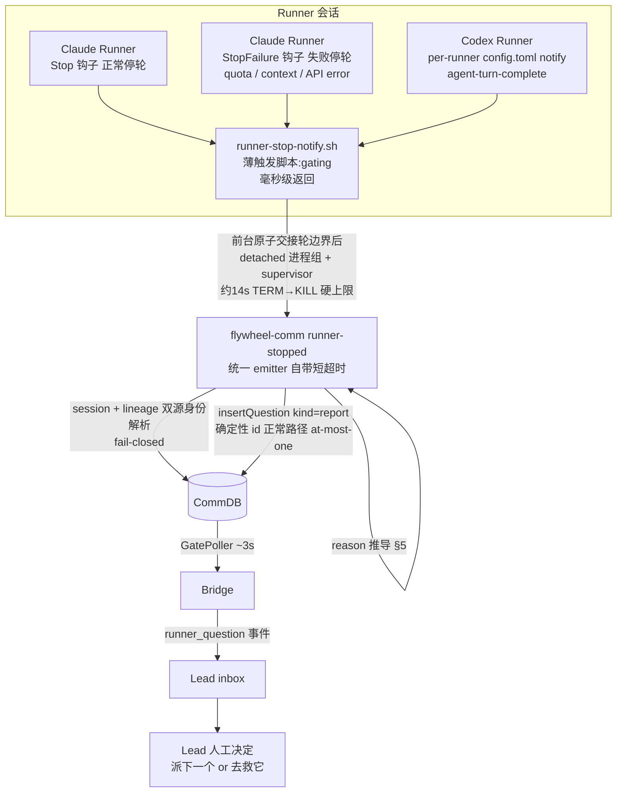

# FLY-1571 Runner stop 通知(带停的原因) — 实施计划

Issue: FLY-1571 (https://linear.app/geoforge3d/issue/FLY-1571/消息层重构-b-批次1-runner-stop-通知带停的原因)
日期: 2026-08-04(R9,依 Codex design review R1-R8 全量修订)
基于: 无(设计依据 = FLY-1569 总纲,`doc/messaging-rework/design.md`)

## 0. 一句话

Runner 每次结束一轮,由一个统一的 emitter(新 `flywheel-comm runner-stopped` 子命令)向它的 Lead 发一条 `RUNNER-STOPPED reason=… issue=… exec=…` 报文 —— Claude 侧由 `~/.claude/settings.json` 的 `Stop` + `StopFailure` 钩子触发(前者管正常停轮,后者管 quota/context/API error 类失败停轮),Codex 侧由 per-runner `config.toml` 的 `notify` 触发,三个触发点共用同一个薄脚本:**前台原子交接轮边界 → detached + 有界 supervisor 后台发送**;去重靠确定性 question id —— **正常路径 DB 级 at-most-one;no-anchor fail-safe 宁重勿吞(at-least-once)**;消息走现有 `insertQuestion(kind:'report')` → GatePoller → `runner_question` → Lead inbox 上行路径。**零新通道、零 schema 改动、零 feature flag、Lead 侧零自动决策。**

## 1. 现状审计(以下全部是实际读过的代码/二进制/实测,不是假设)

| 事实 | 出处 |
|---|---|
| 上行路径已存在:`ask --report` 写 `insertQuestion(from, lead, content, {kind:'report'})`,Bridge GatePoller ≤1 tick(~3s)relay 成 `runner_question` 事件进 Lead inbox;`kind:'report'` **唯一**特殊语义是排除 founder-reply binding,其余(relay / pending / liveness / lead_inbox at-least-once 重投直到 durable receipt)与普通 question 完全相同;**普通 question 的 `kind` 持久化为 NULL** | `ask.ts`、`db.ts:1329-1349,1408-1420`、`gate-poller.ts:3106-3112`、`lead-inbox-loop.ts:1-6` |
| `insertQuestion` 支持**确定性 id(insert-or-verify,FLY-1375)**:同 id + 同内容 → 幂等返回;同 id + 不同内容 → throw(可用作 DB 级 exactly-once 的良性竞态败者信号) | `db.ts:1360-1385` |
| `runner_question` 按 `to_agent` 路由,**不要求 session 活着** | `bootstrap-generator.ts:236,293`、`gate-poller.ts:887` |
| Claude Runner env(TmuxAdapter 注入):`FLYWHEEL_EXEC_ID`、`FLYWHEEL_ISSUE_ID`、`FLYWHEEL_COMM_DB`、`FLYWHEEL_COMM_CLI`、**`FLYWHEEL_LEAD_ID`(FLY-80,approve gate 用 —— Runner 也带!)**;`FLYWHEEL_RUNNER_STATE_DIR` 只在 mailbox 模式且 sentinel 写成功时注入 | `TmuxAdapter.ts:331-341,343-400,487-497` |
| Codex Runner env(CodexTmuxAdapter):同上含 `FLYWHEEL_LEAD_ID`(:1438)+ `FLYWHEEL_GATE_MARKER_DIR` + `FLYWHEEL_RUNNER_VENDOR_ID=codex`;**没有** `FLYWHEEL_RUNNER_STATE_DIR` | `CodexTmuxAdapter.ts:1403-1461` |
| **因此现有 `discord-reply-enforcer.py` 的 `is_lead()`(只看 `FLYWHEEL_LEAD_ID` 非空)会把 Runner 会话判成 Tier B**;Tier B 对裸写出的 `Write` 工具调用序列化会返回 block —— Codex R2 用真实 Runner env 形状回放已产出 `{"decision":"block", …}` 反例(`/tmp/fly1571-r2-runner-enforcer-counterexample.jsonl`)。enforcer 的 docstring 把该 env 描述为「Lead session marker (claude-lead.sh)」——Runner 命中属于始料未及,且 Runner 引用工具调用 XML 恰是它自己文档写明的误报源 | `discord-reply-enforcer.py:35,167-170,709-731,930-958`、TmuxAdapter.ts:491 |
| `inbox-check.sh` 已有从 execId 推导 state dir 的先例:`${FLYWHEEL_RUNNER_STATE_DIR:-$HOME/.flywheel/runner-state/<execId>}` | `inbox-check.sh:43-49` |
| CommDB `sessions` 表有 `execution_id / lead_id / issue_id / status`,`db.getSession(executionId)` 现成;`issue_id/lead_id` nullable;注册发生在 Runner release 之后(best-effort,存在首轮 race);**`finalizeSession` 会删 sessions 行** | `db.ts:62-70,6545-6581,6747,6828-6839`、`TmuxAdapter.ts:650-712` |
| **`session_receipt_lineage(execution_id PK, project_name, issue_id, lead_id)` 与 session 注册同事务写入、teardown 不删** —— terminal 之后身份仍可解析 | `db.ts:72-76,6501-6542` |
| `sessions.status` CHECK 枚举只有 `running/completed/timeout/blocked/failed`,**没有 awaiting_review** →「等审批」不能靠 CommDB 判 | `db.ts:70` |
| `complete` 的 route 枚举:`auto_approve / needs_review / blocked / ship_attempt_failed / no_code / pr_handoff / phase_design_complete`;每次 completion 已生成唯一 `event_id`;POST 失败已有 fail-close marker | `complete.ts:43-53,328-336,408-419,706-717` |
| Claude 钩子事件面(本机 native binary 2.1.221 验证):`Stop` 与 **`StopFailure`** 并列(`executeStopFailureHooks`),StopFailure 带 `error_details`,binary 内有 `error_type` / `rate_limit*` / `prompt_too_long` —— **quota / context / API error 类停轮走 StopFailure 不走 Stop**;Stop hook block 后,block reason 以 **isMeta user message** 注入下一轮 | `strings ~/.local/share/claude/versions/2.1.221`、本机源码 `query.ts:1258-1305`、`stopHooks.ts:257-263`(Codex 核对) |
| 匹配的多个 Stop 钩子**并行执行**;`stop_hook_active=true` 仅表示「因某个 stop hook block 而续轮」 | 官方 hooks 文档 + 本机源码 |
| **真实 Runner transcript 可以在最后 64KB 内 0 条 user row**(本机 3.9MB transcript 实测)—— 定长 tail 读取取不到轮锚点 | Codex R2 实测 |
| 钩子安装机制现成:`/setup-flywheel-hooks` 幂等;**合并代码 ≠ 部署**;enforcer 部署副本在 `~/.flywheel/bin/`(claude-lead.sh 安装) | `.claude/commands/setup-flywheel-hooks.md:123-131`、enforcer docstring |
| Codex:全局 `~/.codex/config.toml` 顶部单行 root-scope `notify = ["…/SkyComputerUseClient", "turn-ended"]`;per-runner CODEX_HOME(`~/.flywheel/codex-homes/<executionId>`)由 `renderCodexHomeConfig` 渲染,**live home 跨部署窗口存留,只有 retirement 才删**;FLY-1604 已建 TOML-aware 手术机制(`smol-toml` parse 权威 + 行锚手术 + fail-loud + 全脱敏),`smol-toml@1.6.1` 自带 serializer | `~/.codex/config.toml:7`、`codex-home.ts:274-290,810-865`、`CodexTmuxAdapter.ts:1627-1630` |
| Codex notify 官方合同:notify program 收到一个追加 JSON argv,当前唯一事件 `agent-turn-complete`(字段含 `thread-id/turn-id/…`);exactly-once / 线程边界 / env 继承需本机实测 | OpenAI Codex config 文档 |
| Runner 自声明状态已有:`runner_declared_states`(park/busy/unpark) | `declare-state.ts` |
| pending question 权威判定已有统一 predicate(protection 模式看 `relay_state != 'terminal_disposed'`,非 protection 看 expiry);messages 索引 `(to_agent, type, created_at)`,无 from_agent 索引;`created_at` 为 SQLite `YYYY-MM-DD HH:MM:SS` 格式,与 ISO 字符串**不可直接文本比较**(需 `julianday` 归一,Codex R2 probe 实证) | `db.ts:206-209,1829-1843,2458-2472` |

## 2. 目标 / 非目标

**目标**(= issue Scope + 验收 1-5)
1. Runner 每次结束一轮 → Lead 收到一条含 `kind / reason(必填枚举) / detail / issueId / executionId` 的消息。
2. Claude 路径:`Stop` + `StopFailure` 钩子;Codex 路径:per-runner `config.toml` `notify`(agent-turn-complete)。
3. 发送复用现有 flywheel-comm 上行路径;`issueId/executionId` 唯一定位(身份不实宁可不发,fail-closed);对 Runner 正常工作零干扰(触发脚本毫秒级返回、后台进程有硬生命周期上限、任何失败 fail-open)。

**非目标**
- ❌ 不改 mailbox / `lead_inbox` / `messages` schema(C 单)。
- ❌ Lead 收到通知不触发任何自动决策 —— 本单只把事实送到 Lead 眼前。
- ❌ 不加 feature flag。
- ❌ 不做拦截(Stop hook 硬拦是 G 单;Codex notify 只通知不阻断,本单可接受)。
- ❌ 不覆盖 antigravity / kimi / Codex app-server 形态 runner(见 §10 诚实边界)。

## 3. 架构



**关键选择与理由:**

1. **统一 emitter 放在 flywheel-comm 子命令里**(TS、vitest 可测、CommDB API 复用),触发脚本只做:env gating、入口形状识别、detached spawn、永远 exit 0。
   - 为什么不直接调 `ask`:`ask` 需要 `--lead`;reason 推导要查 sessions / lineage / 面包屑 / pending / park 多处,bash 里裸 SQL 不可测。
   - 「不要新造通道」的解读:**通道 = CommDB question(kind report)行 + GatePoller relay + `runner_question` 事件 + Lead inbox**,全部逐字复用;新增的只是一个 CLI 动词和三个触发点。
2. **三个触发点共用同一个脚本**:入口形状不同,识别后走同一条命令行,行为天然一致。
3. **Lead 侧零改动**:报文以普通 `runner_question` 文本抵达;不加任何 Bridge/Lead 自动化(issue 红线)。

### 3.1 与并行 Stop 钩子的共存(Codex R1 #1 / R2 #1)

匹配的 Stop 钩子并行执行,reporter 无法知道 sibling 是否 block。**R2 实证:现有 enforcer 会对 Runner 会话 block**(Runner 带 `FLYWHEEL_LEAD_ID` → Tier B → Write 序列化泄漏 → block;反例回放已产出 block 决定)。处理:

- **本单内修 enforcer(最小方案)**:`discord-reply-enforcer.py` 在 tier 选择**之前**加 Runner 早退 —— `FLYWHEEL_EXEC_ID` 非空 → `exit 0`。理由:该钩子守的是 **Lead** 的 Discord 回复面;Runner 命中 Tier B 属于 FLY-80 注入 `FLYWHEEL_LEAD_ID` 之后的意外交集(enforcer docstring 自己把该 env 叫「Lead session marker」),且「Runner 引用工具调用 XML」正是它文档写明的误报源。Lead 会话没有 `FLYWHEEL_EXEC_ID`,行为逐字节不变(fixture 固化)。修完后 Runner 会话上的 Stop 钩子面 = 仅本 reporter(notify-only,不 block)→「sibling block 但已报停」在当前钩子面上**不再存在**。
- **测试合同(三个可观测事实,Codex R3 #7 修正 —— 不做无法证明的 first-stop-zero 断言)**:(a) Runner env 形状(含 `FLYWHEEL_LEAD_ID`+`FLYWHEEL_EXEC_ID`)回放 R2 反例 fixture → enforcer 修后 **exit 0 零 block**;(b) Lead env 形状(无 `FLYWHEEL_EXEC_ID`)→ Tier B 行为逐字节不变;(c) 正常 Stop → 恰一条 report;`stop_hook_active=true` 的 re-fire → 零条。「blocking sibling 放行后才 emit」**只**作为 G 单的前向合同保留 —— 在并行 hook 模型下,B 单不声称能对一个真实并行 sibling block 证明 first-stop zero(那需要 composite decision owner,本单不建)。
- **G 单前向合同(显式)**:G 单引入 Runner 的 blocking Stop 把门时,停轮决定权归 G;本脚本保持 notify-only,G 单负责把发送时机排到「放行之后」(脚本头注释写明该合同)。B 单不预建 composite decision-owner。
- **去重的真正保证在 DB 级**(§5.2 确定性 id),不依赖对钩子时序的任何假设。

## 4. 报文格式

report question 的 content 为单行文本:

```
RUNNER-STOPPED kind=runner_stopped reason=<reason> issue=<issueId> exec=<executionId> route=<route|-> detail=<一句话>
```

- `reason` ∈ `done | blocked | awaiting_approval | quota | context_full | error`(issue 枚举,必填)。
- `detail`:人类可读一句话;清洗 = 去换行/控制字符、cap 200 字符;放行尾(唯一可含空格字段,前面全是 `key=value` 单 token,可 grep 可切)。
- `route`:有 complete 面包屑时带原始 route;无则 `-`。
- 为什么不是 JSON:Lead 收到的本来就是文本 relay;结构化字段位等 C 单合表,`key=value` 前缀可机械翻译。

## 5. reason 推导(优先级从上到下,第一个命中即停)

| # | 信号源 | reason | detail |
|---|---|---|---|
| 0 | **StopFailure 结构化错误**(官方 stdin 字段 `error` 为主,`error_details`/`last_assistant_message` 受控补充,R7 #4):`rate_limit` 类 | `quota` | error 枚举值 + 摘要 |
| 0 | 同上:context / prompt-too-long 类组合 | `context_full` | 同上 |
| 0 | 同上:`invalid_request` / `max_output_tokens` / 其余及未知枚举 | `error` | 同上 |
| 1 | 本轮未消费的 complete 面包屑(§5.1)route=`needs_review` | `awaiting_approval` | "PR #N ready, awaiting founder approval" |
| 1 | 同上 route=`auto_approve / no_code / pr_handoff / phase_design_complete` | `done` | route 名 + PR 号(如有) |
| 1 | 同上 route=`blocked` | `blocked` | 面包屑内 sanitizedSummary |
| 1 | 同上 route=`ship_attempt_failed` | `blocked` | "ship attempt failed, PR #N" |
| 2 | `sessions.status`:`completed` | `done` | "session terminal" |
| 2 | 同上 `blocked` | `blocked` | — |
| 2 | 同上 `failed` / `timeout` | `error` | status 名 |
| 3 | `runner_declared_states` 有 active park 声明 | `done` | "parked: <park reason>" |
| 4 | **本轮相关**的未答 checkpoint question(§5.3) | `awaiting_approval` | "waiting on gate <qid>" |
| 5 | **本轮相关**的未答普通 question(§5.3) | `blocked` | "waiting on answer to <qid>" |
| 6 | Codex `last-assistant-message` 命中保守 quota/context 模式(仅 Codex 入口;Claude 侧此职能由 #0 承担) | `quota` / `context_full` | 命中片段 |
| 7 | 兜底 | `blocked` | "idle without declared completion" + 最后输出片段(≤140 字符) |

- **结构化失败在最顶**:一条旧的 non-blocking ask 不能掩盖真实 rate limit;测试矩阵含「旧 ask 悬置 + 当前 StopFailure(rate limit)→ quota」。
- **StopFailure 字段合同(R7 #4 / R8 #3 硬门)**:实施前必须在本机 2.1.221 抓到**能判定 `context_full` 的特定真实 fixture**(context-overflow / prompt-too-long 的实际形态;另保留一份 rate_limit fixture),脱敏后回填字段与精确 classifier。**匹配优先级表驱动**:先 exact 判官方 `error` 枚举(`rate_limit → quota`;`invalid_request`/`max_output_tokens`/未知 → `error`);仅对**显式允许**的枚举值才用受限的 `error_details`/`last_assistant_message` pattern 升格为 `context_full`(如 context overflow 以 `invalid_request + details` 形态出现,规则精确到 fixture 证据);其他 `invalid_request` 一律 `error`;配 negative fixture(近似文本不得误判)。**若无法安全重现 context-overflow → `context_full` 路径不实施**(该形态落 `error` + detail),等权威证据补上再开。不以 binary strings 推断的字面量为实现依据。
- **#6 只服务 Codex 入口**:Claude 的失败停轮走 StopFailure,transcript 尾部嗅探对 Claude 没有触发机会。模式表保守,匹配不到不硬填,落 #7。
- **#7** 就是 watchdog 被替代的「它停了但什么都没说」场景。

### 5.1 complete 面包屑(Codex R1 #3/#5 定稿)

`sessions.status` 没有 awaiting_review →「等审批」**只能**由 complete 时的 route 提供。

**目录解析(两侧同一条规则)**:`STATE_DIR = ${FLYWHEEL_RUNNER_STATE_DIR:-$HOME/.flywheel/runner-state/<execId>}`,写入方 `mkdir -p`。不依赖 adapter 注入、不动 Codex env allowlist(execId 经 `FLYWHEEL_EXEC_ID` 两侧都有;complete 今天就在 Codex runner 里跑通即为证)。Codex 沙箱 `~/.flywheel` 已是 writable root;harness 断言 complete 子进程与 notify 子进程解析出同一绝对路径。

**写入(complete.ts,POST Bridge 之前,fail-open)**:原子 temp+rename 写 `${STATE_DIR}/last-complete.json`:

```json
{ "v": 1, "completionEventId": "<complete 已生成的 event_id>",
  "executionId": "...", "issueId": "...", "route": "...",
  "pr": 123, "sanitizedSummary": "≤200 字符,已去控制字符", "createdAt": "ISO" }
```

**消费(emitter,R6 #1/#2 + R7 #1/#3 定稿:不可变 marker 文件,无 cursor 记录、无锁、无时钟)**:后台侧的两类本地状态全部改为 **append-only 的 O_EXCL marker 文件**:
- 面包屑消费:`${STATE_DIR}/consumed/<completionEventId>`(空文件,`O_CREAT|O_EXCL`)。**路径安全(R8 #4)**:`completionEventId` 来自 Runner 可写的 JSON,在任何 exists/open 之前必须严格校验为 canonical UUID 形态(拒绝含 `/`、`\`、`.`、`..`、NUL 的值),`join` 解析后断言落在 `consumed/` parent 内;`consumed/` 目录本身是 symlink → fail-open + log,不跟随;非法值按 malformed 面包屑处理(忽略信号、**不创建任何文件**)。测试:traversal / absolute path / encoded separator / symlink-parent / 合法 UUID 各 fixture。面包屑作为 #1 信号生效当且仅当:可解析、`v` 已知、`executionId` 一致、**对应 marker 不存在**。发送成功后创建 marker。marker 不可变、无 wall clock(时钟回拨免疫)。**`consumed/` 在 per-execution 生命周期内绝不裁剪**(R7 #1:它没有 DB 级跨 turn 兜底 —— question id 含 turnKey 不含 completionEventId,裁掉一个仍被 `last-complete.json` 引用的 marker 会让该 completion 被反复消费;数量本来就是 completion 次数级,有界,不需要裁)。
- 已发轮缓存:`${STATE_DIR}/sent/<turnKeyHash>`(同款 O_EXCL 空文件),**只是缓存** —— at-most-one 的真正保证在 §5.2 的确定性 question id。**只有 `sent/` 参与修剪**(fail-open,按 mtime 保最新 ~50;被裁的远古轮由 DB 确定性 id 兜底)。
- **轮边界(prev-ingress)不在后台任何状态里** —— 它由前台 boundary ledger 承载并经 argv 随事件传递(§5.2)。

**面包屑消费是 at-least-once,不是恰一次(R7 #3 诚实合同)**:marker 在 effect(insertQuestion)**之后**创建,而 emitter 可运行 ~14s —— 相邻两个不同 turn 的 emitter 可以都在 marker 尚不存在时读到同一 breadcrumb,各自以不同 turn id 成功落行;winner 在 INSERT 后、marker 前被 KILL 时,下一轮还会再重用。**量化合同:在某次成功持久化 consumed marker 之前,每个后续 turn 都可能重用旧 completion,各产生一条 reason 偏旧的报文;marker 一旦落盘,该 completion 永不再消费;绝不丢报。** 不建 claim→effect→commit 协议(claimant 被 KILL 会永久吞掉 breadcrumb,吞报比重复更糟)。测试见 §11「marker 文件语义」。malformed / 他 exec / 未知版本的面包屑 → 忽略该信号 + log,落 #2 以下,不 crash;**无任何 wall-clock 比较**。

### 5.2 每轮触发与去重(Codex R2 #2 / R4 #1 定稿)

**轮边界 ledger(前台原子交接,R4 #1 结构性修复;R5 #1/#2 定稿锁与协议)**:触发脚本在**返回 / detach 之前**(此刻 runner 停着,下一轮的任何 question 都还不可能被创建)完成一次有界原子 handoff。

- **锁 = kernel flock(随进程死亡自动释放)**,复用仓库先例 `scripts/flywheel-config-lock.py:4-20,53-81` 的模式(macOS python3 自带 `fcntl.flock`;临界区实现为触发脚本**内嵌** `python3 -c` 块,随脚本一体部署,天然在 §12 原子部署/rollback closure 内)。**不用 mkdir 锁** —— mkdir 锁在 holder 被 `SIGKILL`/宿主重启后永久残留,会让该 runner 后续每轮边界永久降级(R5 #1 重放实证)。等待上限 200ms,拿不到 → 本次不带 prev 边界,emitter 按 §5.3 降级 + log(单次有界降级,不是永久)。
- **ledger 文件协议**(`turn-boundary.json`,R5 #2 / R6 #1):`{v: 1, executionId, lastIngressTs}`,严格 ISO 校验。锁内 **compare-and-update**:仅当 `t_now > lastIngressTs` 才整体覆盖;`t_now <= lastIngressTs`(乱序重放或**真实时钟回拨**)→ **不覆盖 ledger,且本次进入 no-prev 降级**(存量值处于当前事件的「未来」,拿它当 SQL 下界会把当前轮的 checkpoint/ask 全部滤掉 —— R6 #1 重放实证;这条推广成**通用有效性规则**:任何候选下界(ledger 存量、`sessions.started_at`)只要 `>= 本事件 ingress` 一律弃用、沿降级链下移,最终省略时间过滤 + log。回拨窗口内 reason 质量降级为「全部未答」,持续到 wall clock 追上,已披露)。malformed / 未知版本 / 他人 executionId / 非法时间 → 视为不存在:忽略非法 prev(绝不进 `julianday`,emitter 再校验一道)并以合法 `t_now` 重建 ledger。
- **单指针的有效域与 go/no-go(R7 #2)**:argv 传递只解决**后台 emitter 迟到**;若**前台 handoff 本身乱序**(t2 的 handoff 先于 t1 执行),t2 携带的 prev 是 t0 而非 t1,单指针无法补回。分平台论证:
  - **Claude:前台交接可证串行** —— Stop/StopFailure 钩子在事件当刻同步执行,钩子跑完之前会话不会进入下一轮;handoff 是会话生命周期的一部分,天然按 turn 顺序。
  - **Codex:是否串行取决于 codex 是否等待 notify 子进程 / turn-ended 是否可乱序** —— 这是 §7 spike 的**显式 go/no-go 分支**:真机证明「notify 前台段按 turn 串行完成」→ 单指针继续;证明不了 → **停止实施**,改成 event-keyed boundary history 或其他可证明的顺序 authority,回填计划后再动。
  - **测试按 spike 结论条件化(R8 #2 —— 预期失败不得兼任验收测试)**:
    - 分支 (a) spike 证明串行 → **必绿 suite** 只含 delayed-background-emitter 反例 + 一个「安装形状/真机 TUI 串行性」regression;t2-first reason 模型反例作为**设计证据记录**(文档 + 非门测试),不进必绿 suite。
    - 分支 (b) spike 证明不了串行 → **停止实施**,完成 event-keyed 顺序 authority 重设计并回填后,t2-first reason 测试(t1 留 pending、t2 无 pending、t2 handoff 先执行 → t2 不得继承 t1 的 pending)才纳入必绿 suite。
- **故障域隔离**:后台侧(§5.1)**没有锁也没有可覆盖记录**(全部 O_EXCL marker 文件)—— supervisor KILL 打断后台任意时刻都不影响下一轮前台交接;唯一的锁只在前台 ledger,且是 crash 自动释放的 kernel flock。
- 测试:真实 `KILL -9` holder / reboot 式孤儿残留 / 后台 writer 被 supervisor KILL 三种情况下,**下一 turn 自动恢复正确 `t_prev`**、前台仍有界返回;t2 先落 t1 后完成 → ledger 仍 t2;相等值 / 时钟回拨 / malformed / foreign-exec / invalid-time 逐 case;上一轮留普通 ask + 上一 emitter 延迟 + 当前轮无 pending → **不得** blocked。

**轮锚点(Claude,R3 #2 修正)**:从 transcript **EOF 分块向后扫描**(256KB 步长),找最后一条「真实 user row」= 非纯 tool_result **且非 `isMeta`**(Stop hook block 注入的 meta user row 必须仍映射回原轮)。**不设固定字节上限** —— 在 emitter 总时间预算内持续回扫直到找到 anchor(真实反例:本机一个 5.5MB transcript 的最后 user row 距 EOF 5.5MB,任何固定 cutoff 都会被长轮击穿)。Claude turn key = `session_id + 该行 uuid`。仅当 transcript 不可读/为空/预算耗尽仍无 anchor 时:**fail-safe = 用唯一随机 id 直接发送 + 醒目 log**(「宁重勿吞」—— 不用任何时间桶,时间桶会让同窗内两个不同轮共享 key、吞掉后一条,违背主验收)。

**轮锚点(Codex,R8 #1 简化定稿)**:turn key = **`execId + turn-id`**(question id 本就含 execId,只需 `turn-id` 在单一 execId 内唯一 —— 该唯一性由 spike §7 实测证明后回填;**全文无 thread-id 依赖**,CLI/harness/QA 只取证 `--turn-id` 一个字段)。若 spike 发现 `turn-id` 在 exec 内不唯一 → 回填显式 Codex key 设计后再实施。

**DB 级 at-most-one(R3 #3 / R4 #3 修正 —— 不再声称 insertQuestion 自带并发 insert-or-verify)**:确定性 question id = `rstop-<sha256(execId | turnKey) 截断>`。`insertQuestion(opts.id)` 的现状是**先 SELECT 后 INSERT、无事务包裹**(`db.ts:1361-1422`)——并发下败者收到的是 `UNIQUE constraint failed: messages.id`,不会进 verify 分支。emitter 因此**自己闭合幂等**:
- 调 `insertQuestion(opts.id)`;捕获**确定的** messages.id UNIQUE 约束错误(仅此错误码,其他 SQLite 错误原样上抛不伪装)→ 重读该 id 行 → 逐字段 verify:
  - 内容一致 → 幂等成功(恰一行,exit 0)。
  - 内容不一致 → **良性竞态败者**:先落的一行为准,败者仅 log,不重试不覆盖。**这是一条永久的、已接受的有界误差**(R4 #3):两个并发推导看到的都是同一轮的合法停轮快照,任一条对 Lead 都是诚实的单快照;先落者的 content **原样永久保留** —— 重投(lead_inbox 现有机制与 D 单租约)只是「同一条消息重新可见」,**不会**重跑 reason 推导、不会改写已落库 content(权威 `design.md` 的重投定义)。conflict 测试断言 first content 逐字保留。
- `sent/` marker 只是缓存,丢了不影响该保证。
- 测试:两进程 barrier **强制都越过 SELECT 后再 INSERT** → messages 恰一行,分别覆盖同内容 verified loser 与不同内容 conflict loser;anchor 距 EOF >4MB 的真实长轮 fixture;同一小时两个长轮 → **两条不同 report**(fail-safe 不共享 key);meta-row-after-block 仍映射原 turn key。

**Lead 侧噪音账(诚实)**:每轮一条 report;report 走**完全相同**的 lead_inbox at-least-once 语义(msgClass 'model',durable receipt 前被现有机制有界重投)。本单不改这套语义,只保证:行数 = 停轮次数 × 现有重投上限,不新建独立欠账、不加定时器。集成测试证:正常 receipt 后不再投;receipt 缺失只发生现有 bounded 行为。

### 5.3 pending question 查询(Codex R1 #6 / R2 #4 定稿)

精确 SQL(R3 #1 修正:补 `NOT EXISTS` 已答排除;checkpoint 全集优先,不被 LIMIT 遮蔽。**诚实注**:现状没有已封装的 shared helper,只有 `getPendingQuestions`/`isQuestionPending` 里重复的局部片段 —— 实现时抽成真实 helper,或逐字复刻同一完整 predicate,两者择一并在 PR 里写明):

```sql
SELECT m.id, m.checkpoint FROM messages m
WHERE m.to_agent = :leadId            -- 命中 (to_agent,type,created_at) 索引
  AND m.type = 'question'
  AND m.from_agent = :execId
  AND (m.kind IS NULL OR m.kind <> 'report')   -- NULL-safe:普通 ask/gate 的 kind 是 NULL
  AND m.superseded_at IS NULL
  AND NOT EXISTS (SELECT 1 FROM messages r     -- 已答排除(现有 pending 语义的必要成分)
                  WHERE r.parent_id = m.id AND r.type = 'response')
  AND <完整 answerable predicate>              -- protection: relay_state != 'terminal_disposed';否则 expiry
  AND julianday(m.created_at) >= julianday(:lowerBound)   -- 格式归一(ISO vs SQLite)
ORDER BY (m.checkpoint IS NOT NULL) DESC, m.created_at, m.rowid
LIMIT 1
```

- **checkpoint 优先由 ORDER BY 保证**(checkpoint 行排最前,`LIMIT 1` 取到的就是最高优先信号)—— 不用「任意 5 行」近似;反例测试:5 条更早的普通 ask + 第 6 条 checkpoint → 仍 `awaiting_approval`。
- **lower bound 解析顺序(R4 #1/#4 统一为 boundary ledger)**:Claude = 轮锚点行的 timestamp(ISO,经 julianday 归一);**no-anchor fail-safe 时 = `--prev-ingress`(前台 boundary ledger 交接的上一轮边界,transcript 不可读时依然可用)**;Codex = `--prev-ingress`(同一 ledger,上一 turn-ended **事件**时刻,绝不是上一次后台发送完成时刻)→ 无则 `sessions.started_at` → 都无则**省略时间过滤**并 log(降级为「全部未答」,已披露)。no-anchor 路径的测试断言 **reason 本身**(不只断言有行)。
- checkpoint 非空 → #4(awaiting_approval);否则 #5(blocked)。
- 索引现实:以 `to_agent` 打头命中现有索引,残余过滤代价小;**不加索引**。`EXPLAIN QUERY PLAN` 取证性能,语义由 §11 的逐 case 测试覆盖(ordinary NULL-kind ask、checkpoint gate、**已答排除**、**checkpoint-vs-LIMIT 反例**、report 排除、同秒边界、ISO/SQLite 格式边界、superseded、首轮 Codex、ledger 缺失降级、**上一 emitter 迟写 + 下一轮 gate 已建 → 仍 awaiting_approval**、**时钟回拨后当前 checkpoint 仍 awaiting_approval / 当前普通 ask 仍 blocked**)。

## 6. Claude 触发点:`scripts/hooks/runner-stop-notify.sh`

- 注册(经 `/setup-flywheel-hooks`,幂等 jq):`Stop` 与 `StopFailure` 数组各追加 `{command: ~/.flywheel/hooks/runner-stop-notify.sh, timeout: 10}`。全局注册 + env gating:非 Runner 会话因无 `FLYWHEEL_EXEC_ID` 秒退,零开销。
- 脚本逻辑(bash + jq):
  1. `FLYWHEEL_EXEC_ID` 空 → `exit 0`(静默)。
  2. stdin JSON:读 `hook_event_name`、`transcript_path`、`stop_hook_active`、error 字段(StopFailure);`stop_hook_active=true` → `exit 0`(快路径;正确性不依赖它 —— DB 级确定性 id 兜底)。
  3. `FLYWHEEL_COMM_CLI` 空/不存在 → log 一行,`exit 0`。
  3.5 **前台轮边界交接(§5.2 ledger,R4 #1 / R5 #1)**:kernel flock(python3 `fcntl.flock`,crash 自动释放)内 compare-and-update 读 `t_prev` / 写 `t_now`(等待上限 200ms,拿不到 → 不带 prev 边界继续,fail-open);随后才 detach。
  4. **detached + supervisor(Codex R1 #2 / R2 #3 / R3 #4 定稿)**:macOS 没有 `setsid` 可执行文件,进程组机制**明确选定仓库现成先例 `scripts/lib/bounded-run.sh:39-67` 的 `set -m` job-control 方案**(备选:Node `spawn({detached:true})`,`flywheel-claude-profile:48-60` 先例;实现取前者,shell 内闭合)。supervisor 子 shell detached 后:`set -m` 下起 `node CLI runner-stopped … --ingress-ts <捕获时刻>`(成为独立 job/进程组 leader),**signal 前验证 child PID == 其 PGID、且 ≠ 自身/父进程组**(验证不过 → 只按单 PID signal,绝不负 PGID 扩杀);12s 到期 `TERM`(负 PGID)→ 2s 后 `KILL` → supervisor 自身退出。**孤儿硬上限诚实写作 ~14s**(12s TERM + 2s KILL 窗口)。前台脚本**立即返回**(毫秒级,jq + fork 开销);settings 的 `timeout:10` 只约束前台脚本。
  5. **stdout 与 stderr 都永远空**(Claude 会观察 hook 的 stderr,两路都重定向进日志文件;重定向失败则丢弃输出)、退出码永远 0 —— 绝不输出 `decision`,绝不 block,绝不改变 Runner 输出(验收 #5)。
- harness 断言(§11):前台毫秒级返回;deadline 后 **process-absence**(永久阻塞 stub、TERM-resistant stub、以及 **supervisor 自身**都消失);日志重定向失败 / supervisor 启动失败仍 exit 0 且 stdout+stderr 全空。
- **enforcer Runner 早退**(§3.1)与本脚本同一 PR 交付,部署时**同步重部署 enforcer**(`~/.flywheel/bin/discord-reply-enforcer.py`)。
- 存量已 park 的 Claude runner 在机器部署步骤(§12)完成后的下一次停轮生效 —— merge+build 本身不部署。

## 7. Codex 触发点:per-runner `config.toml` 的 managed notify

`renderCodexHomeConfig`(`codex-home.ts`)新增 **managed notify override**,复用 FLY-1604 机制与哲学:

- notify program 路径作为**经校验的 render option** 传入;写入值经 `smol-toml` **serializer 生成**(不做字符串插值;空格/引号/反斜杠全由 serializer 负责):
  ```toml
  # >>> flywheel-managed notify (FLY-1571) — do not edit >>>
  notify = ["<serializer 输出的路径>", "--codex"]
  # <<< flywheel-managed notify (FLY-1571) <<<
  ```
- base 有 root-scope `notify`(parse 权威确认)→ 行锚 `/^\s*notify\s*=/` 定位,要求:恰一个锚行、位于第一个 `[table]` 表头之前、**该行单独 parse 为一条完整闭合赋值**(单物理行判据,多行数组首行过不了)→ 原地替换为 managed block。
- base 无 notify → 文件**顶部**插入同款 block。
- 多行数组 / 多锚行 / quoted·dotted key / root-after-table / parse 与行锚不一致 / 双定义 → **fail-loud**,固定脱敏消息;结构验证全程占位 token;产物 parse 后断言 `notify` 恰为目标数组、其余键语义不变(candidate/final 同 builder)。
- scrub/幂等:新 sentinel strip 与 GH_TOKEN block 同款。
- **取舍(显式)**:per-runner config 里 Sky 不再收 runner 的 turn-ended(founder 个人通知器,runner 事件是噪音);Annie 全局 `~/.codex/config.toml` 一字不动。
- 脚本 `--codex` 模式:取**最后一个 argv** 为 payload,jq 校验 `type == "agent-turn-complete"`,抽 `last-assistant-message` + `turn-id`(唯一 key 字段,R8 #1),detached 调 `runner-stopped --source codex-notify --last-message <text> --turn-id <id>`。env 由 codex 进程从 tmux 会话继承 —— spike 实测确认。
- 字节兼容影响:所有 per-runner 渲染产物多出 notify block —— 本单目的,非回归;`codex-home.test.ts` byte 期望随之更新(FLY-1604 合同显式重定,范围仅 notify block)。
- **实施第一步是真机 spike(硬门,结论回填本计划前不动手)**:真实 per-runner CODEX_HOME + 生产 TUI 拓扑,记录:argv 形状、payload 字段、每主 turn 触发次数与 subagent 来源、notify hang/非零退出时 codex 行为、**codex 是否等待 notify 子进程退出**(R4 #1 —— 关系到前台交接的时序假设)、子进程实际继承 env。`turn-id` 去重语义以实测为准。

## 8. `flywheel-comm runner-stopped` 子命令

```
flywheel-comm runner-stopped
  --source claude-stop|claude-stop-failure|codex-notify   (必填)
  [--transcript <path>]        (Claude:transcript JSONL 路径)
  [--error-json <json>]        (claude-stop-failure:结构化错误)
  [--last-message <text>]      (Codex)
  [--turn-id <id>]             (Codex:去重键成分)
  [--ingress-ts <iso>]         (触发脚本在事件当刻捕获的本次 ingress)
  [--prev-ingress <iso>]       (前台 boundary ledger 交接的上一轮边界,§5.2;缺省 = 降级链)
  [--exec-id <id>]             (默认 FLYWHEEL_EXEC_ID)
```

步骤:
1. resolve execId 与 CommDB 路径(缺 → exit 2)。总预算 ≤10s(supervisor ~14s 之内),SQLite busy_timeout ≤3s。
2. **身份解析,双源 fail-closed(Codex R1 #7 / R2 #5 / R3 #6 / R4 #2:每次 attempt 都重读两源)**:
   - 读两源:`db.getSession(execId)` 与 `session_receipt_lineage`(teardown 不删,注册同事务写)。
   - session 行不存在 → 有界重试(3×300ms),**每个 attempt 都重新读取两源**;最后一次 session miss 后**无条件再重读一次 lineage** 才决定 fail-closed —— 覆盖「首读两源皆无 → register(同事务写两源)→ finalizeSession 删 session」发生在重试窗口内的正常 detached 竞态(R4 #2 的可重现序列)。
   - session 无而 lineage 有 → 以 lineage 的 `issue_id/lead_id` 解析。
   - **两源都有 → 逐字段交叉校验**(issue_id/lead_id;lineage 字段为 NULL 时以 session 为准并 log),不一致 → exit 2 + 醒目 log(fail-closed)。
   - 任一必需字段最终仍 NULL/空/`unknown`、或 env `FLYWHEEL_ISSUE_ID` 与解析结果不一致 → exit 2 + log(**绝不发**伪身份报文)。
3. 计算 turn key(§5.2);`sent/<turnKeyHash>` marker 已存在 → exit 0(缓存命中)。
4. 按 §5 推导 reason/detail(所有候选时间下界过 §5.2 通用有效性规则:`>= 本事件 ingress` 一律弃用降级)。
5. `insertQuestion(execId, lead_id, 报文, {id: rstop-<hash>, kind:'report'})`;**并发幂等由 emitter 闭合**(R3 #3):捕获确定的 messages.id UNIQUE 约束错误 → 重读 → 逐字段 verify(一致 = 幂等成功;不一致 = 良性竞态败者,log,exit 0 —— 恰一行已在);其他 SQLite 错误原样失败(exit 2),不伪装。
6. 创建 `sent/` 与 `consumed/` marker(O_EXCL,§5.1;失败仅 log —— at-least-once);stdout 打印 question id(真机 QA 取证)。**后台侧无任何锁**(R6 #2:TS 侧不需要 flock,marker 文件的 O_EXCL 就是原子原语)。

**已接受的残余(显式,R5 #3 修正口径)**:从未注册(sessions 与 lineage 都无)的「瞬退 runner」丢失本轮通知(醒目 log)。**这条 stop report 就是永久缺失** —— D 单租约只能让「已存在的信」重新可见,不能合成一条从未插入的报文;能另行暴露该异常的是现有 orphan/liveness 机制或该 runner 既有的未 ack 信件(如有),两者与本报文是不同的信号。不为它把注册时序改成 release 前硬前置(adapter 生命周期改动,超出本单半径)。

## 9. 改动清单

| 文件 | 改动 |
|---|---|
| `packages/flywheel-comm/src/commands/runner-stopped.ts` | 新增:统一 emitter(§8) |
| `packages/flywheel-comm/src/index.ts` | 注册 `case "runner-stopped"` |
| `packages/flywheel-comm/src/commands/complete.ts` | 新增面包屑原子写入(§5.1,fail-open,state dir 从 execId 推导) |
| `packages/flywheel-comm/src/db.ts` | 仅新增只读查询 helper(§5.3 pending 查询 + lineage getter);**不动任何 CREATE TABLE / 迁移 / 索引** |
| `packages/claude-runner/src/codex-home.ts` | managed notify override(§7) |
| `packages/claude-runner/test/codex-home.test.ts` | 更新 byte 期望 + 新增 notify 手术矩阵 |
| `scripts/hooks/runner-stop-notify.sh` | 新增:三入口触发脚本(§6/§7,detached + supervisor) |
| `scripts/hooks/discord-reply-enforcer.py` | **Runner 早退**(§3.1:`FLYWHEEL_EXEC_ID` 非空 → exit 0,tier 选择之前) |
| `scripts/hooks/test-discord-reply-enforcer.py` | 新增 Runner env fixture(R2 反例回放 → 零 block)+ Lead 行为逐字节不变回归 |
| `scripts/hooks/test-runner-stop-notify.sh` | 新增:bash harness(含故障注入 + process-absence) |
| `.claude/commands/setup-flywheel-hooks.md` | 新增 Stop + StopFailure 注册、新脚本部署、enforcer 重部署步骤(幂等、原子) |
| `packages/flywheel-comm/src/__tests__/runner-stopped.test.ts` | 新增:emitter 测试 |

## 10. 风险与诚实边界

1. **quota / context_full 覆盖来自 StopFailure(Claude)与 last-assistant-message 嗅探(Codex,best-effort)**。StopFailure payload 字段以实现期第一手 fixture 为准。**触发面边界(接受且不覆盖,R5 #3)**:进程被 kill、用户强退、两个事件都不触发的失败形态 —— 该轮 stop report **永久缺失**(D 单不能合成从未插入的报文);这类异常由现有 orphan/liveness 机制以另一信号面暴露。现有额度自愈体系不受影响也不依赖本单。
2. **覆盖面 = Claude tmux/headless runner + Codex TUI tmux runner**(FLY-398 生产 Codex runner 必须 windowed → per-runner CODEX_HOME 路径全覆盖)。Codex app-server、antigravity/kimi 不在本单。
3. **Lead inbox 行数增加,report 遵循现有 at-least-once 重投语义**(§5.2 诚实版);膨胀病灶根治在 C/D 单。
4. **报文是事实不是指令**:Lead 端零自动化(issue 红线)。
5. **部署形状**:merge+build 之后还需机器部署步骤(§12);codex-home 改动需 Bridge 重启且只作用于新 spawn;**rollback 对 live Codex home 有专门次序**(§12,Codex R2 #6)。
6. **detail 含模型产出文本片段**:清洗后进 CommDB content,与 DONE 报文同一信任面。
7. **enforcer Runner 早退是行为变更**:Runner 会话不再收到 Write-泄漏 nudge —— 该 nudge 对 Runner 本就处在其文档自认的误报源上;Lead 面逐字节不变(fixture 固化)。
8. **identity conflict = 良性竞态败者,且为永久已接受误差**(§5.2,R4 #3):并发 emitter 内容分歧时第二个失败仅 log,恰一行落库,先落 content 永久保留 —— 重投只重送既有内容,不重跑推导。
9. **no-anchor fail-safe 是 at-least-once**(§5.2,R4 #4 / R5 #4 / R6 #3 修正):no-anchor 随机 id 分支**只存在于 Claude**(transcript 不可读/为空/扫描超预算);Codex 正常路径始终以 `execId + turn-id` 生成确定性 key,**不落入**该分支。**重复风险 = Claude no-anchor ∩ 同一实际 turn 的任意重复 invocation**(StopFailure 重放、hook 重启重调等;`stop_hook_active` 只属于 `Stop`)。测试:Claude no-anchor 的重复 StopFailure 重放 → **两行落库、Lead 侧无副作用**(接受重复);**Codex same-turn payload 重放 → 恰一行**(正常路径 at-most-one 回归,R6 #3 纠正 R5 建议)。若 spike 发现 Codex payload 无稳定 turn-id → 必须先回填显式 Codex fallback 设计与风险,不得默认套用 Claude no-anchor 分支。「宁重勿吞」是刻意选择。

## 11. TDD 计划(RED → GREEN → REFACTOR)

**vitest — `runner-stopped.test.ts`(先写,先红)**
- reason 矩阵:§5 全优先级逐条(StopFailure 各 error 类;面包屑各 route × 未消费/已消费/malformed/他 exec/未知版本;status 各值;park;checkpoint vs 普通;**旧 ask 悬置 + 当前 rate limit → quota**;**kind IS NULL 的普通 ask 命中 #5**;report 排除(上一轮 stop report 不把本轮判 blocked);Codex tail;全空兜底)。
- 身份:session 有 / 注册 race 重试内出现 / **register → finalizeSession → runner-stopped 仍经 lineage 发送且身份逐字段一致** / **首读两源皆无 → register+finalize 发生在重试窗口内 → session 始终未观察到 → 最终经 lineage 发出**(R4 #2 精确时序)/ 两源不一致 fail-closed / NULL/unknown / env mismatch → 全部不发。
- 轮边界 ledger:**上一轮留普通 ask + 上一 emitter 延迟 + 当前轮无 pending → 不得 blocked**(旧 ask 不污染);**t2-first reason 乱序反例按 §5.2 go/no-go 条件化**(分支 (a) 作设计证据记录不进必绿 suite;分支 (b) 重设计后纳入必绿);锁等待超时 → 降级链 + log;**时钟回拨 → 存量「未来值」绝不作下界(no-prev 降级),当前 checkpoint 仍 awaiting_approval、当前普通 ask 仍 blocked**;真实 `KILL -9` holder / 孤儿 lockfile / 后台被 KILL → 下一轮自动恢复;**no-anchor 路径断言 reason 本身**(prev-ingress 下界生效)。
- marker 文件语义(at-least-once 合同,R7 #1/#3):两个不同 turn 的 emitter barrier 都越过 marker read 后再 INSERT → 两行、各自 turn id;marker 落盘后 → 该 completion 永不再消费(**含时钟回拨 + 51 个未来 mtime marker + prune 场景:当前 completion 的 consumed marker 不被裁、不复消费**);winner INSERT 后 marker 前被 KILL → 下轮重复且最终收敛;`consumed/` 不裁剪、`sent/` 修剪不破坏近期去重。
- 去重:同 turn key 二次调用幂等;**两进程强制都越过 SELECT 后再 INSERT → messages 恰一行**,分别覆盖同内容 verified loser 与不同内容 conflict loser(UNIQUE 错误码精确匹配,其他 SQLite 错误不吞);**anchor 距 EOF >4MB 的真实长轮 fixture**(无固定 cutoff,预算内回扫到底);**同一小时两个长轮 → 两条不同 report**(fail-safe 唯一 id,不共享时间桶);meta-row-after-block 映射原 turn key;transcript 不可读 → 唯一 id 发送 + log。
- §5.3 SQL 语义:ordinary NULL-kind、checkpoint、superseded、**已答排除(response child 存在 → 不选中)**、**5 普通 ask + 第 6 条 checkpoint → 仍 awaiting_approval**、同秒边界、**ISO vs SQLite 格式边界(julianday 归一)**、首轮 Codex lower bound、ledger 缺失降级、**上一 emitter 迟写 + 下一轮 checkpoint 已建 → 仍 awaiting_approval(prev-ingress 下界)**、**Codex same-turn payload 重放 → 恰一行**;`EXPLAIN QUERY PLAN` 取证命中索引。
- 报文格式 golden(detail 清洗:换行、控制字符、超长)。

**python — `test-discord-reply-enforcer.py` 增补**
- Runner env fixture(R2 反例逐字回放)→ 修后 exit 0 零 block;Lead env → Tier B 行为逐字节不变;`FLYWHEEL_EXEC_ID` 空串边界。

**vitest — `codex-home.test.ts`**
- base 带单行 notify(真机形状 fixture)→ 替换,产物 parse 后 notify == 目标、其余键语义不变;base 无 notify → 顶部插入;多行数组 / 双 notify / root-after-table / quoted·dotted → fail-loud + 脱敏断言;路径空格/引号/反斜杠 → serializer 转义;与 GH_TOKEN 并存;重复渲染幂等;byte 期望更新(diff 仅 notify block)。

**vitest — complete 面包屑**
- 各 route 写入(含 event id、sanitizedSummary);目录不存在 → mkdir -p;写失败 fail-open;无 `FLYWHEEL_RUNNER_STATE_DIR` env(Codex 式)→ execId 推导路径。

**bash harness — `test-runner-stop-notify.sh`**
- 无 `FLYWHEEL_EXEC_ID` → exit 0 静默;`stop_hook_active=true` → exit 0;`FLYWHEEL_COMM_CLI` 缺 → exit 0 + log。
- 三入口参数拼装(PATH stub node 取证):claude-stop / claude-stop-failure(error 透传)/ --codex(取最后 argv、type 门、turn-id)。
- **零干扰 + 生命周期(R2 #3 / R3 #4)**:stub CLI 永久阻塞 / TERM-resistant stub / SQLite busy / 日志目录不可写 / supervisor 启动失败 —— 前台返回毫秒级(计时断言)、**stdout+stderr 全空**、exit 0;**deadline(~14s)后 process-absence 断言**(阻塞 stub、其 descendants、以及 supervisor 自身全部消失);进程组验证(child PID == PGID,拒绝对自身/父组负 PGID signal)。
- 三个可观测事实(§3.1 R3 版):Runner env 下 enforcer early-exit;正常 Stop 恰一条;`stop_hook_active=true` re-fire 零条。

**全仓门(既有纪律)**:`pnpm lint` + `pnpm -r build` + `pnpm test:packages:run` + 新增 shell/python 测试。

## 12. 部署顺序与回滚(Codex R1 #10 / R2 #6)

固定顺序,每步带回滚:

1. **两道前置硬门,全部回填本计划后才动手实现(R8 #3)**:
   1a. **Codex notify 真机 spike**(§7:argv/payload/次数/串行性 go-no-go/wait/env)。回滚:无副作用(dump 脚本 + 临时 CODEX_HOME)。
   1b. **StopFailure fixture capture**(§5:必须拿到能判定 `context_full` 的真实 fixture + rate_limit fixture;拿不到 → `context_full` 路径不实施)。回滚:无副作用。
2. 单测 / harness / 全仓门绿(必绿集按 §5.2 go/no-go 条件化)→ PR → codex code review → founder 批准 merge。
3. **原子部署触发脚本**:mktemp 写 `~/.flywheel/hooks/runner-stop-notify.sh.tmp` → chmod +x → `mv`。同步**重部署 enforcer** 到 `~/.flywheel/bin/`(带 `.bak` 备份)。回滚:恢复 enforcer `.bak`;触发脚本的删除受第 6 步约束(见下)。
4. **注册 settings**:备份 → jq 追加 Stop/StopFailure 条目 → parse 校验 → 原子 `mv` → `/hooks` 验证热加载 + 非 Runner no-op。回滚:恢复备份。顺序 3→4 保证不存在「settings 已注册但脚本不存在」窗口;安装用 mktemp + 并发锁。
5. **Bridge 重启**(FLY-270 自托管 ship 纪律)→ 仅对**新 spawn** 的 Codex runner 验证 per-runner config 含 managed notify;**记录部署后 spawn 的 Codex execId 清单**(rollback 用)。
6. **Rollback 次序(live Codex home 专门处理,R2 #6)**:per-runner config 位于 `~/.flywheel/codex-homes/<executionId>`,live home 跨部署窗口存留 —— revert 代码只影响之后的新 spawn。因此回滚 = 先恢复 settings/enforcer + revert codex-home 代码 + Bridge 重启;**触发脚本保留到第 5 步清单里所有受影响 home 退休为止**(脚本本身 fail-open,留着无害);确认无 live config 引用后才删。QA 覆盖「部署后 spawn 一个 Codex runner → rollback → 该存量 runner 下一 turn 正常、无 broken notify command」。
7. **真机验收两条路径**(§13)。

## 13. 真机 QA(逐条映射验收标准)

| 验收 | 做法 | 取证 |
|---|---|---|
| 1. Claude runner 干完 → `reason=done` | 529 房起真 Claude runner 跑一个 no_code/phase 类小单到 complete | slot comm.db `messages` 里的 RUNNER-STOPPED 行(kind=report,确定性 id)+ Lead pane 收到 relay |
| 2. Codex runner 同上(notify + turn-ended 送达) | 529 房起真 Codex runner;spike 已先行确认 payload 形状 | 同上 + notify 调用日志(argv/turn-id) |
| 3. 撞审批门 → `reason=awaiting_approval` | 真 runner 走 `complete --route needs_review` | 报文 `reason=awaiting_approval route=needs_review` |
| 4. `issueId/executionId` 唯一定位 | 取证行 `issue=/exec=` 与 sessions + lineage 逐字段比对 | sqlite 查询 |
| 5. 零干扰 | 对照:同一 runner 挂/不挂钩子跑同任务,输出与退出行为一致;钩子返回耗时 log(毫秒级);故意注坏 CLI 路径 → runner 无感;deadline 后无孤儿进程 | 钩子 log + pane 对照 + ps 取证 |
| (补)StopFailure 路径 | 真机制造 rate limit 不可控 → harness fixture 驱动 + 机会性真机取证 | fixture 断言 + 记录 |
| (补)rollback 存量 Codex | 部署后 spawn → rollback → 存量 runner 下一 turn 正常 | pane + notify log |

QA 在隔离 529 房做(`FLYWHEEL_COMM_DB` 指 slot 库,生产零污染);全程不碰生产 Bridge。

## 14. 不做什么(逐字继承 issue)

- 不改 mailbox / lead_inbox schema(C 单)。
- 不让 Lead 在收到通知时做任何自动决策。
- 不加任何 feature flag。
- 不拦截(Codex notify 只通知不阻断,可接受;拦截是 G 单)。
