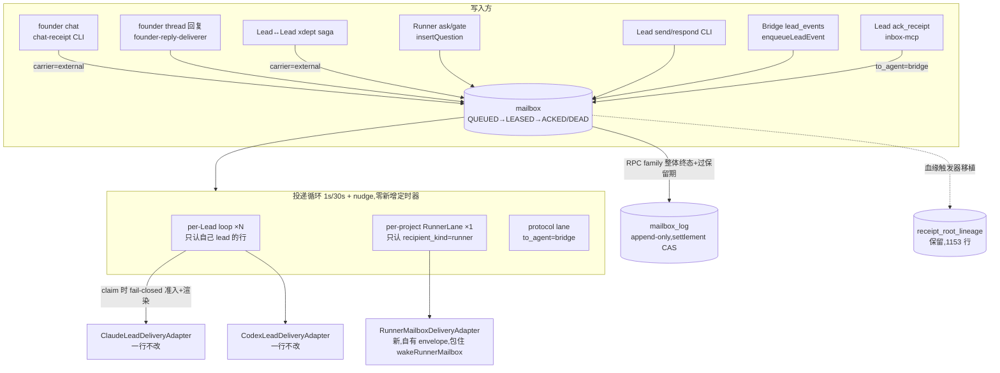

# FLY-1572 合表 + 迁移:两张信箱表并成一张 mailbox — 实施计划

Issue: FLY-1572 (https://linear.app/geoforge3d/issue/FLY-1572/消息层重构-c-批次1-合表-迁移两张信箱表并成一张-mailbox)
日期: 2026-08-04
基于: research.md(Codex design review R1 反馈已折入)

> 上游权威 = `doc/messaging-rework/design.md`(FLY-1569)。本计划把 issue 的 scope 落到可实施粒度。
> **与 issue/总纲原文的偏离全部集中在 §2(带证据)** —— 其中 P9 需要按 README 规矩改 design.md 并同步 FLY-1569。

## 0. 一句话

`lead_inbox`(37 列)+ `messages`(实测 28 列)→ 一张 `mailbox`(v1 comm.db)+ 一张 append-only `mailbox_log` + 保留 `receipt_root_lineage`;投递循环扩到所有收件人(Lead + Runner + bridge);Lead 适配器一行不改;迁移 = 单事务硬 cutover + 毒药墓碑 + 自研在线备份 + 实测回滚。

## 1. 设计总图



## 2. 与 issue/总纲原文的偏离清单(全部有证据,见 research.md + 生产只读盘点)

| # | 原文 | 实况 | 处理 |
| -- | -- | -- | -- |
| P1 | `messages` 22 列 | 实测 28 列(+checkpoint/content_ref/content_type/resolved_at/delivered_at/attachments/kind) | 7 列全进拆分对照(§4) |
| P2 | 删 17 列含 consumed_at/delivered_at/carrier/next_retry_at/batch_id | 5 列活承重 | 语义由状态机接管或保留列(§3/§4) |
| P3 | DDL 草图无 msg_class/last_error,「留 14」清单里有 | issue 自身不一致 | DDL 补上 |
| P4 | DDL 无 carrier | E 单前 external 影子行记账是活的且须对循环不可见 | 保留 carrier,E 单删 |
| P5 | 未提 gate/RPC 列 | messages 是 approve_to_ship 底座 | RPC 列随行进 mailbox;verify-approval 链字节不变 |
| P6 | 「176 活行」 | 08-04 实测未消费 9 行 | 验收 5 以迁移时刻实测为准 |
| P7 | founder→Lead 一条路径 | 实际两条(chat external + thread hub root inbox) | 分别接线(§5.1/§5.2) |
| P8 | sender 6 列「不属于投递语义」压一列 | lease_key+generation 是活授权数据(fence);writer_pid 是降级梯第二级 | 压一列但结构化+版本化,malformed fail-closed(§6) |
| P9 | 总纲 §3「ACKED 由 agent 改」 | 批次 C 无租约重投,Lead 的 agent-ack 闭环(ack_receipt↔原批关联)属 D 单能力 | **批次 C 内 Lead 行 ACK = 适配器 durable-accept;Runner 行 ACK = 拉取(真 agent 动作)。此为对 design.md 的显式修订:合并前在 design.md §3 加批次口径注记并同步 FLY-1569**,不做私下偏离 |
| P10 | —(research 遗留悬案) | 生产盘点:`candidates_json` **有史以来 0 行**、live family_root_id 0 行 | routeFounderReply 的 legacy promoted-family 读取分支直接删除(证据在案);迁移脚本再断言一次 0 行,非 0 即 abort |

## 3. 新 schema 定稿(建在 v1 `~/.flywheel/comm/<project>/comm.db`)

> ⚠️ 命名冲突声明:v2-kernel(flywheel-v2.db)另有一张 `mailbox`(不同库不同包);`bridge/mailbox-lead-runtime.ts` 的 "mailbox" 指 inbox JSON 文件传输。**本表建在 v1 comm.db,与两者无关**,代码注释与文档写明。

### 3.1 mailbox

```sql
CREATE TABLE mailbox (
  seq          INTEGER PRIMARY KEY AUTOINCREMENT,
  id           TEXT NOT NULL UNIQUE,
  from_agent   TEXT NOT NULL,          -- 发送者身份(纯身份,不再兼职审计血缘)
  to_agent     TEXT NOT NULL,          -- ★ 收件人:lead id / 完整 execution id / 'bridge'
  recipient_kind TEXT NOT NULL CHECK(recipient_kind IN ('lead','runner','bridge')),
  source_kind  TEXT,                   -- 审计血缘(原 lead_inbox.source 的职责拆出)
  source_ref   TEXT,                   -- 如 lead_event seq —— markLeadEventDelivered 依赖
  type         TEXT NOT NULL,
  msg_class    TEXT NOT NULL DEFAULT 'model' CHECK(msg_class IN ('protocol','model')),
  content      TEXT NOT NULL,
  content_ref  TEXT,
  content_type TEXT,
  ref_id       TEXT,                   -- 回复哪一封(旧 parent_id)。无自引用 FK:xdept 行的 ref 是 Discord msg id;
                                       -- 问→答 family 不变量由归档逻辑+断言测试维护(§7)
  kind         TEXT,
  checkpoint   TEXT,
  deadline_at  TEXT,
  expires_at   TEXT,
  relay_state  TEXT NOT NULL DEFAULT 'open'
               CHECK(relay_state IN ('open','protected','terminal_disposed')),
  resolved_at  TEXT,
  resolved_via TEXT,
  superseded_at TEXT,
  superseded_by TEXT,
  created_at   TEXT NOT NULL,

  state        TEXT NOT NULL DEFAULT 'QUEUED'
               CHECK(state IN ('QUEUED','LEASED','ACKED','DEAD')),
  claimed_by       TEXT,
  claim_expires_at TEXT,
  retry_count  INTEGER NOT NULL DEFAULT 0,
  next_retry_at TEXT,
  last_error   TEXT,
  acked_at     TEXT,
  dead_at      TEXT,
  dead_reason  TEXT,

  carrier      TEXT NOT NULL DEFAULT 'inbox' CHECK(carrier IN ('inbox','external')),  -- E 单删
  sender_ref   TEXT,                   -- §6:versioned canonical JSON;NULL=unprotected write

  priority     INTEGER,               -- 字段位;claim 沿用 ORDER BY COALESCE(priority,99), seq
  batch_id     TEXT,
  collapse_key TEXT
);
CREATE INDEX mailbox_live  ON mailbox(to_agent, seq) WHERE state IN ('QUEUED','LEASED');
CREATE INDEX mailbox_claim ON mailbox(to_agent, msg_class, priority, seq)
  WHERE carrier = 'inbox' AND state = 'QUEUED';
CREATE UNIQUE INDEX mailbox_unique_response ON mailbox(ref_id) WHERE type = 'response';
CREATE INDEX mailbox_archive_acked ON mailbox(acked_at) WHERE state = 'ACKED';
CREATE INDEX mailbox_archive_dead  ON mailbox(dead_at)  WHERE state = 'DEAD';
```

### 3.2 mailbox_log(append-only + settlement CAS)

```sql
CREATE TABLE mailbox_log (
  log_seq     INTEGER PRIMARY KEY AUTOINCREMENT,
  event_id    TEXT NOT NULL UNIQUE,   -- 确定性:'migrated:<src_table>:<row_id>' / 'archived:<id>' /
                                      -- 'settled:<subject_id>' / 'progress:<id>' —— crash 重放幂等键
  schema_version INTEGER NOT NULL DEFAULT 1,
  message_id  TEXT NOT NULL,
  subject_id  TEXT,                   -- settlement 主体(= 被 settle 的 mailbox/lead_inbox 行 id)
  event       TEXT NOT NULL CHECK(event IN
              ('migrated_history','migration_snapshot','archived','processed','disposed','progress')),
  at          TEXT NOT NULL,
  source_table TEXT,
  row_json    TEXT NOT NULL
);
CREATE INDEX mailbox_log_message ON mailbox_log(message_id);
CREATE INDEX mailbox_log_subject ON mailbox_log(subject_id) WHERE subject_id IS NOT NULL;
-- ★ settlement 互斥槽:每 subject 恰一条 processed/disposed,二者互斥
CREATE UNIQUE INDEX mailbox_log_settlement_slot ON mailbox_log(subject_id)
  WHERE event IN ('processed','disposed');
-- append-only 触发器(no update / no delete),照抄 workflow_source_event 模式
```

- **settlement API 合同**:`markProcessed`/`markDisposed` 的替代实现 = 事务内 INSERT settlement 行;UNIQUE 槽冲突时回读、canonical 比对证据,同值幂等、异值 fail-loud —— 与现版 CAS 语义逐条对齐(lead-inbox-queue.ts:1298-1370),受 vitest 竞争/重放测试保护。live 调用者(settleFounderHubRoot / routeFounderReply / handleReceipt / settleChatReceipt / ExternalReceiptSaga.handle / terminal-receipt-settlement)逐一列出新 API 映射(§9 步 3)。
- **`receipt_root_lineage` 保留不动**(生产 1,153 行,live 查询在 terminal-receipt-settlement);其 AFTER INSERT 捕获触发器从 lead_inbox 移植到 mailbox(join 条件改 ref_id→question 行)。**live 正确性禁止依赖扫 row_json** —— 血缘走这张表,settlement 走 UNIQUE 槽。
- progress(ProofShot)直接写 `mailbox_log(event='progress')`,attachments 进 row_json。

### 3.3 附带表

`loop_owner` 不动(仍是每库单例围栏;扩容后 per-Lead loops + RunnerLane 同进程共享一个 ownerEpoch,语义不变)。`loop_heartbeat` 的 UPSERT 内嵌子查询改指 mailbox。`receipt_alert_outbox` 保持现有 live 写入点,孤儿状态记录在案(清算归 D 单),本单不扩大。FLY-1586 三张附表(freeze_install / fenced_root / sanitation_audit)内容快照进 log 后随迁移退役(freeze 是针对旧表旧存量的 one-shot,新表无存量)。

## 4. 字段拆分对照(37 + 28 → mailbox / log / 删)

### 4.1 lead_inbox(37)

| 去向 | 列 |
| -- | -- |
| 进 mailbox 改名 | to_lead→to_agent、ref_message_id→ref_id(仅迁移映射)、attempts→retry_count;**source 拆二**:审计血缘→source_kind/source_ref,发送者身份→from_agent(按 source 值域映射表:`lead_event:<seq>`→source_ref;`discord_chat` 等→source_kind) |
| 进 mailbox 原名 | id、type、msg_class、priority、content、created_at、deadline_at、last_error、claimed_by、claim_expires_at、next_retry_at、carrier、batch_id(列留,旧值不迁 —— 前置断言 pending batch=0,§8) |
| 语义进状态机 | consumed_at→ACKED+acked_at;disposition→state+dead_reason(delivered→ACKED;frozen/quarantine→DEAD);delivered_at(external)→acked_at |
| settle 证据进 log | processed_at/processed_evidence/disposed_at/disposed_evidence(settlement CAS,§3.2;F 单 task 表接手「办没办」) |
| 删(历史值经迁移快照进 log) | read_at、escalated_at、next_unprocessed_at、resend_of、resend_round、delivered_rounds、routing_state、candidates_json(P10:有史以来 0 行)、family_root_id、legacy_alias、receipt_exempt_reason、receipt_episode_id |

### 4.2 messages(28)

| 去向 | 列 |
| -- | -- |
| 进 mailbox | id、from_agent、to_agent(+派生 recipient_kind)、type、content、parent_id→ref_id、created_at、expires_at、checkpoint、content_ref、content_type、resolved_at、kind、relay_state、superseded_at/by、resolved_via、deadline_at |
| 语义进状态机 | read_at→ACKED(instruction 的 agent-ack);**delivered_at 不是 ACK**(db.ts:5854-5864 状态机注释):instruction delivered-未读→LEASED;response 被 consume(delivered_at 有值)→ACKED |
| 压缩 | 6 sender 列→sender_ref(§6) |
| 删 | logical_event_id(零 SELECT 读者);attachments(progress 随行进 log) |

每个删除列实施时逐列 `rg` 复核零 live 引用后才落 DDL;research §2.5 死代码(db.ts receipt 链 10 方法 + LeadInboxQueue 9 方法 + routeFounderReply legacy family 分支)同 PR 删除。

## 5. 流重接线

### 5.1 founder→Lead(chat 影子行,直推不动)
begin→INSERT(carrier='external', state='QUEUED');complete→ACKED;settle→log settlement(processed);abort/quarantine→DEAD。lane 查询改 state 谓词,external 行对循环 claim 结构性不可见(逐字节等价现状)。

### 5.2 founder→Lead(thread hub root)
enqueueFounderHubRoot→mailbox(inbox lane, priority 0)照旧进循环;routing_state 删;settle→log settlement;未投家族行→DEAD('superseded')。legacy promoted-family 分支删除(P10)。

### 5.3 Runner→Lead(杀双写 ①,QuestionAdmission 改造而非退役)
`insertQuestion` 写一行 mailbox(to_agent=lead)。**QuestionAdmission 保留为 claim 时 fail-closed 准入服务**,挂在循环现有的 `revalidateModel`(仅 retry_count==0)扩展点上,首次 claim 时:
1. eligibility 全套照旧(missing/superseded/answered/session 存活/workflow gate ownership/Lead scope/terminal/QA hold,question-admission.ts:80-111,188-228)—— 不合格 → 按原因 DEAD 或跳过,fail-closed;
2. **crash-幂等地** append StateStore lead event(确定性 event id,先 append 后交付;崩溃重放靠确定性 id 去重),`source_ref` 存 seq —— loop 收 receipt 后 `markLeadEventDelivered` 照旧从 source_ref 取 seq(lead-inbox-runtime.ts:148-153 平移);
3. renderEnvelope 产出投递 content(渲染在 claim 侧,CLI 不需要会渲染)。
adapter 可见的 `deliveryId` = mailbox.id;`[receipt:<id>]` 前缀格式不变,id 值随行(迁移保 id 原值,在途 receipt 引用不断链)。**Claude/Codex 逐字节 golden 测试**钉住 payload 形状。

### 5.4 Lead→Runner(循环收编;R1 blocker 1 的修正案)
- **耐久 `to_agent` = 完整 execution id**;`runner-<exec8>` 只是 transport alias,仅在适配器边界经 `deriveRunnerMailboxIdentity()` 派生(8 字节碰撞与回查问题不进耐久层)。`recipient_kind='runner'` 由写入方(send/respond)落列。
- **lane 所有权**:每 project 恰一个 `RunnerLane`(挂在 MailboxDeliveryRuntime 里,与 per-Lead loops 平级、共享 ownerEpoch 与 1s/30s 节奏,零新增定时器)。claim 谓词按 recipient_kind 分区:Lead loop 只认 `recipient_kind='lead' AND to_agent=<自己>`;RunnerLane 只认 `recipient_kind='runner'`;**结构上不存在两个 loop 扫同一收件人**。
- **状态机(无租约到期扫描 = C 的边界)**:claim→LEASED(盖 30min claim_expires_at);doorbell 投递成功/`transport:'none'` 跳过 → **停在 LEASED**(不回 QUEUED —— 杜绝热循环与重复认领);投递失败→QUEUED+retry_count+1+next_retry_at 退避(沿用现逻辑),超限→DEAD。**C 不扫过期租约**(LEASED 行没有任何自动出路 —— 这正是「D 单让租约转起来」的准确留白);Runner 拉取(`flywheel-comm inbox` / `check` / `gate`)对 QUEUED **和 LEASED** 行 ACK。
- **活跃判定/deliverable count 只数 QUEUED**(LEASED 与 pull-only 行不驱动 tick)—— 循环永不为它们发任何东西(红线①)。
- **RunnerLane 自有 envelope**(不复用 LeadDeliveryBatch):`{mailboxId, executionId, type, kind, contentRef?, content, metadata, intentKey}`,足以逐字重建今天 send.ts/respond.ts 的 wake payload 与 `runner_phase_wakes` intent key(`instruction:<id>` / `gate-answer:<qid>` 映射表落在设计里,账本本身不动);`RunnerMailboxDeliveryAdapter` 内部 = 今天 send.ts:127-186 机制原样搬入(claim push→wakeRunnerMailbox→complete push)。最后一公里 transport.write 一行不改。
- Bridge 内部纯 wake 位点(park_wake 重推)不是新消息,不经 mailbox,保持直呼。
- 测试:full-id 无碰撞、成功后无热循环(tick 计数断言)、首 doorbell 丢失后拉取仍达、pull-ACK、no-transport、多 Lead 并发不重复认领。

### 5.5 Lead→Lead(xdept)与 Bridge 事件
xdept = external 模式(5.1)。enqueueLeadEvent 照旧(换表 + ACKED 语义)。

### 5.6 Lead→bridge(ack_receipt,杀双写 ②)+ Lead ACK 口径
inbox-mcp 写 ack_receipt 单行(to_agent='bridge', recipient_kind='bridge', msg_class='protocol');protocol lane claim `WHERE recipient_kind='bridge' AND from_agent=<lead>`,handleProtocol 处理后该行 ACKED,ProtocolIngress 镜像层退役。
**Lead 消息行的 ACK(P9)**:批次 C 内 = 适配器 durable-accept receipt(现 markConsumed 位点原样换成 setState ACKED);ack_receipt 协议照旧驱动 markLeadEventDelivered(StateStore 侧)。agent-ack 与原批的原子关联(ack 才有下一批)是 D 单「租约+in-flight 上限」能力的一半,C 单为它把 `source_ref`/batch_id 关联数据备好。design.md 修订与 FLY-1569 同步是本单交付物之一。

## 6. sender_ref(FLY-1309 五约束 + R1 blocker 8)

一列 TEXT,值 = versioned canonical JSON(键序固定):
```json
{"v":1,"lease_key":"...","generation":7,"holder_pid":123,"holder_start":"...","writer_pid":456,"writer_start":"..."}
```
- 六字段结构保留;holder 缺 history → 省略 holder 键,绝不冒充当前 holder;unprotected/carrier_passthrough → **显式** `{"v":1,"authority":"unprotected","writer_pid":...,"writer_start":...}`;SQL NULL 仅限迁移前史料。
- **fail-closed**:写侧严格校验(键集/类型/safe-integer/lease-key↔generation 成对)不合格拒写;读侧 malformed / 未知版本 → quarantine 错误,**绝不降级为 unprotected**。只有 SQL NULL 或显式 authority:'unprotected' 走 unprotected 梯级。
- `processedFenceFromProvenance` 三级梯(lease→writer_pid→unprotected)判定逻辑逐字对齐现版;handle-receipt 硬守卫不变;FLY-1309 replay 断言更新并保正反测试(含 malformed 拒绝)。

## 7. 保留期与归档(替代 72h DELETE;R1 HIGH 7 的修正案)

- 触发点:CommDB 读写 open(零新定时器),**有界批次**(单次 open 至多 N family,防同步 open 热点),走 `mailbox_archive_*` 部分索引。
- **归档原子单位 = RPC family**(question + 其 response;无 ref 关系的行自成 family):family 内**所有行都终态**(ACKED/DEAD)且 RPC 维度终局(已答 或 relay_state='terminal_disposed'),retention anchor = family 最晚终态时间 + 72h。FLY-1279 保护语义(未答未终局的 question 永不归档)自然成立。逐行 INSERT log(event='archived', row_json **内嵌 content 与 content_ref 文件内容字节**)+ DELETE,同一事务;content_ref 外部文件删除走 post-commit 可重放清单(照抄现 purge 的 deleteContentRefFile 账本模式)。
- 测试:T0 ACK 问 + T+71h 答 + response 未拉 → 不归档;verify-approval 在归档边界前后语义不变;content_ref 文件删除失败可重放;归档事务 crash 重放幂等。

## 8. 数据迁移(R1 blocker 3/4/5 的修正案)

### 8.1 备份原语(自研,不用 v2-kernel wrapper)
`backupCommDb()`:SQLite online backup API → `.tmp`(0600)→ `integrity_check` + `foreign_key_check` + **comm.db 自己的表清单/schema hash 校验**(v2 的 `schema_migrations` 校验对 comm.db 不适用 —— 生产实测无此表)→ rename 落 `comm.db.pre-fly1572-<ts>`。磁盘 preflight:源库 + WAL + 新表/log 峰值 + 备份 ≈ 3× 现库,非只看 145MB。

### 8.2 迁移脚本(`scripts/migrate-fly1572-mailbox.ts`)
- **停机窗 = quiesce 所有 writer**(不只 Bridge:所有 Lead/Runner/CLI 都直接写 comm.db)。runbook:停 Bridge → 停 Leads(舰队本来随 Bridge 重启波次管理)→ `fuser`/lsof 断言无进程持有 comm.db → `wal_checkpoint(TRUNCATE)` 全排干 → 备份 → 迁移 → 部署新 binary → 重启。任一步失败的停止点与回退动作逐条写明。
- **单事务硬 cutover**:`BEGIN IMMEDIATE` 内完成 建表/索引/触发器 → 逐 type 迁移 → 全量 log 快照 → DROP 旧表 → 毒药墓碑 → 对账 → **completed marker 最后一条写入**(`mailbox_migration_meta`,含源行数快照与 schema_generation)。中途任何失败 = 整体 ROLLBACK,库回到未迁移态。幂等:completed 已在 → 校验后 no-op;每阶段 fault injection 测试。
- **逐 type source-state 矩阵**(实施前在测试中全覆盖):

| 源 | 状态 | 去向 |
| -- | -- | -- |
| messages question(未过期未 terminal)× lead_inbox 镜像行(join ref_message_id) | 镜像 consumed / pending / 无镜像 | **合一行**:ACKED / QUEUED / QUEUED(逻辑投递恰一行) |
| messages ack_receipt(未读)× protocol 镜像行(`ack:<lead>:<receipt>`) | 同上 | **合一行** to_agent='bridge' |
| messages instruction | read→ACKED;delivered 未读→**LEASED**;未投→QUEUED(retry_count 保留) |
| messages response | delivered(已 consume)→ACKED;未→QUEUED |
| messages progress | → log(event='progress') |
| messages 过期/terminal 历史 | → log('migrated_history') |
| lead_inbox external(chat/xdept) | 未 complete→QUEUED;delivered→ACKED;disposed→DEAD |
| lead_inbox 其余 pending(inbox lane) | → QUEUED |
| lead_inbox frozen/quarantine/consumed 历史 | → log('migrated_history')(disposition 映射记录在 row_json) |
- **对账 = 覆盖记录合同,不是行数求和**:每个源物理行恰有一条覆盖记录(成为 mailbox 行 或 log 行);每个「逻辑投递」恰一行 mailbox(镜像对折算一)。**成为活 mailbox 行的源行同时写 `migration_snapshot` log 行**(row_json 全列)—— 被删旧列的值永不丢。log 幂等键 = `event_id UNIQUE`('migrated:<src>:<rowid>'),crash 重放 INSERT OR IGNORE + canonical 比对。
- **前置断言(fail-closed)**:pending batch=0、pending claim=0、candidates_json 全零(生产已实测为 0;非 0 即 abort 待人工处置)。

### 8.3 硬 cutover 守卫(无 flag)
- 新 binary:CommDB open 时要求 `mailbox_migration_meta.schema_generation='mailbox_v1'`(迁移模式除外);旧库(未迁移)一律拒绝服务,fail-loud 指向 runbook。
- **毒药墓碑**:DROP 后重建同名空表 `messages`/`lead_inbox`,各挂 BEFORE INSERT/UPDATE/DELETE 触发器 `RAISE(ABORT,'FLY-1572: table merged into mailbox')` —— 旧 binary 的 `CREATE TABLE IF NOT EXISTS` 变 no-op(表已存在),写入必炸;残留旧进程读到空表的窗口由 runbook 的 quiesce+进程断言压到零。
- **负向测试**:用真 pre-FLY-1572 build(git worktree checkout 旧 tag)对迁移后副本跑 ask/gate/send/respond/inbox/check,逐一断言 fail-loud 不静默写。

### 8.4 回滚(实测一次)
verified staging copy(先校验备份完整性)→ 清/拒绝 `-wal/-shm` sidecar → atomic rename 顶替 → fsync 目录 → readonly integrity/FK/表清单/行数校验 → 回退部署 → 起 Bridge → 旧 build 冒烟。备份文件即回滚,无 feature flag。

## 9. 实施顺序与 TDD

| 步 | 内容 | 测试先行 |
| -- | -- | -- |
| 1 | flywheel-comm:mailbox+log schema、MailboxQueue(state 机/claim 分区/settlement CAS)、写闸门平移(normalize/truncate) | schema/state/claim/settlement 竞争与重放/闸门(现 lead-inbox-queue.test 改写) |
| 2 | sender_ref v1 序列化 + fail-closed 校验 + fence 梯 | round-trip/四态/malformed 拒绝/降级梯逐字/FLY-1309 replay |
| 3 | settlement 调用方迁移(founder hub/chat/xdept/handle-receipt/terminal-receipt-settlement)+ receipt_root_lineage 触发器移植 | 各 caller 语义对齐 + lineage 查询等价 |
| 4 | CLI 改写(ask/gate/send/respond/inbox/check/chat-receipt/route-founder-reply/handle-receipt/runner-stopped/pending/complete/verify-approval)——语义与输出字节不变 | 各 command 测试 + verify-approval 反向兼容 sentinel |
| 5 | teamlead:per-Lead loop 换 MailboxQueue、QuestionAdmission 准入化(claim 扩展点)、RunnerLane + RunnerMailboxDeliveryAdapter、protocol lane 收编、heartbeat SQL、boot 时序平移 | Lead 适配器测试一行不改全绿 / Claude+Codex payload golden / 5.4 六项测试 / 双写死亡断言 |
| 6 | 迁移脚本 + 备份原语 + 毒药墓碑 + 归档 sweep | 矩阵全覆盖/幂等重跑/覆盖记录对账/fault injection/旧 build 负向/回滚干跑 |
| 7 | 死代码清理 + 逐列 rg 断言(进 scripts/__tests__) | — |
| 8 | 全仓门:pnpm lint + pnpm -r build + test:packages:run + shell 测试 | — |

真机 E2E(QA 节点):四条流送达+ack+状态断言;生产库副本迁移演练(含时长实测)+ 回滚实演;Bridge 重启 + fleet 12/12;现有 runner 不受影响;design.md P9 修订随主 PR。

## 10. 不做什么

租约到期重投/合批/死信闸/agent-ack 闭环(D=FLY-1573;LEASED 无自动出路是刻意留白)、Discord 直推收编(E;carrier 保留)、task 表(F;settle 证据暂入 log settlement 槽)、feature flag(禁令;cutover 靠 schema_generation+毒药墓碑,不靠开关)、优先级/折叠逻辑、runner_phase_wakes 改革(park_wake 泄漏行为修复归 D;本单交付统一 id 模型 + intent key 映射表)。

## 11. 风险

| 风险 | 缓解 |
| -- | -- |
| 版本错配窗口 | 毒药墓碑写必炸 + schema_generation 守卫 + runbook quiesce/进程断言 + 旧 build 负向测试(§8.3) |
| 迁移时长/体积(49k 行全量 JSON 入 log) | 单事务批量;演练实测;磁盘 preflight 3× |
| 渲染移到 claim 时改变 Lead 可见字节 | renderEnvelope 本体复用 + Claude/Codex 逐字节 golden |
| LEASED 行滞留(C 无租约扫描) | 与今天「wake 后无重推」行为一致;拉取可 ACK LEASED;D 单接管;监控台账列 LEASED 计数 |
| settlement 并发冲突 | UNIQUE 槽 + canonical 比对 + fail-loud(§3.2),竞争测试 |
| sender_ref 畸形 | fail-closed + quarantine,绝不降级(§6) |
