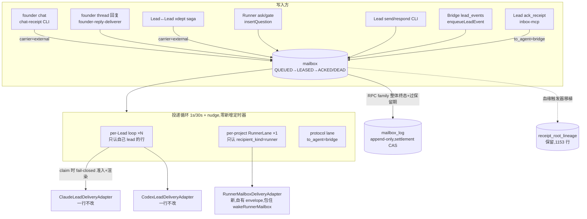

# FLY-1572 合表 + 迁移:两张信箱表并成一张 mailbox — 实施计划

Issue: FLY-1572 (https://linear.app/geoforge3d/issue/FLY-1572/消息层重构-c-批次1-合表-迁移两张信箱表并成一张-mailbox)
日期: 2026-08-04
基于: research.md(Codex design review R1 反馈已折入)

> 上游权威 = `doc/messaging-rework/design.md`(FLY-1569)。本计划把 issue 的 scope 落到可实施粒度。
> **与 issue/总纲原文的偏离全部集中在 §2(带证据)** —— 其中 P9 需要按 README 规矩改 design.md 并同步 FLY-1569。

## 0. 一句话

`lead_inbox`(37 列)+ `messages`(实测 28 列)→ 一张 `mailbox`(v1 comm.db)+ 一张 append-only `mailbox_log` + 保留 `receipt_root_lineage`;投递循环扩到所有收件人(Lead + Runner + bridge);Lead 适配器一行不改;迁移 = 单事务硬 cutover + 毒药墓碑 + 自研在线备份 + 实测回滚。

## 1. 设计总图



## 2. 与 issue/总纲原文的偏离清单(全部有证据,见 research.md + 生产只读盘点)

| # | 原文 | 实况 | 处理 |
| -- | -- | -- | -- |
| P1 | `messages` 22 列 | 实测 28 列(+checkpoint/content_ref/content_type/resolved_at/delivered_at/attachments/kind) | 7 列全进拆分对照(§4) |
| P2 | 删 17 列含 consumed_at/delivered_at/carrier/next_retry_at/batch_id | 5 列活承重 | 语义由状态机接管或保留列(§3/§4) |
| P3 | DDL 草图无 msg_class/last_error,「留 14」清单里有 | issue 自身不一致 | DDL 补上 |
| P4 | DDL 无 carrier | E 单前 external 影子行记账是活的且须对循环不可见 | 保留 carrier,E 单删 |
| P5 | 未提 gate/RPC 列 | messages 是 approve_to_ship 底座 | RPC 列随行进 mailbox;verify-approval 链字节不变 |
| P6 | 「176 活行」 | 08-04 实测未消费 9 行 | 验收 5 以迁移时刻实测为准 |
| P7 | founder→Lead 一条路径 | 实际两条(chat external + thread hub root inbox) | 分别接线(§5.1/§5.2) |
| P8 | sender 6 列「不属于投递语义」压一列 | lease_key+generation 是活授权数据(fence);writer_pid 是降级梯第二级 | 压一列但结构化+版本化,malformed fail-closed(§6) |
| P9 | 总纲 §3「ACKED 由 agent 改」 | 批次 C 无租约重投,Lead 的 agent-ack 闭环(ack_receipt↔原批关联)属 D 单能力 | **批次 C 内 Lead 行 ACK = 适配器 durable-accept;Runner 行 ACK = 拉取(真 agent 动作)。此为对 design.md 的显式修订:合并前在 design.md §3 加批次口径注记并同步 FLY-1569**,不做私下偏离 |
| P10 | —(research 遗留悬案) | 生产盘点:`candidates_json` **有史以来 0 行**、live family_root_id 0 行 | routeFounderReply 的 legacy promoted-family 读取分支直接删除(证据在案);迁移脚本再断言一次 0 行,非 0 即 abort |

## 3. 新 schema 定稿(建在 v1 `~/.flywheel/comm/<project>/comm.db`)

> ⚠️ 命名冲突声明:v2-kernel(flywheel-v2.db)另有一张 `mailbox`(不同库不同包);`bridge/mailbox-lead-runtime.ts` 的 "mailbox" 指 inbox JSON 文件传输。**本表建在 v1 comm.db,与两者无关**,代码注释与文档写明。

### 3.1 mailbox

```sql
CREATE TABLE mailbox (
  seq          INTEGER PRIMARY KEY AUTOINCREMENT,
  id           TEXT NOT NULL UNIQUE,   -- 逻辑消息身份(question/response 的 RPC 引用键)
  delivery_id  TEXT NOT NULL UNIQUE,   -- ★ 适配器/receipt 身份。生产 294 组 question/mirror 配对两 id 全不同,
                                       -- 必须双列:question 行保留 'question:<lead>:<qid>' 格式(在途 receipt 不断链、
                                       -- [receipt:<delivery_id>] 字节不变);ack_receipt 行同理 'ack:<lead>:<receipt>';
                                       -- 其余行 delivery_id = id。逐 type 生成/迁移规则见 §8.2
  from_agent   TEXT NOT NULL,          -- 发送者身份(纯身份,不再兼职审计血缘)
  to_agent     TEXT NOT NULL,          -- ★ 收件人:lead id / 完整 execution id / 'bridge'
  recipient_kind TEXT NOT NULL CHECK(recipient_kind IN ('lead','runner','bridge')),
  source_kind  TEXT,                   -- 审计血缘(原 lead_inbox.source 的职责拆出)
  source_ref   TEXT,                   -- 如 lead_event seq —— markLeadEventDelivered 依赖
  type         TEXT NOT NULL,
  msg_class    TEXT NOT NULL DEFAULT 'model' CHECK(msg_class IN ('protocol','model')),
  content      TEXT NOT NULL,          -- 发送方原始内容(不可变)
  delivery_content TEXT,               -- claim 时物化的渲染投递内容(CAS 一次性写入后不可变;§5.3)
  content_ref  TEXT,
  content_type TEXT,
  ref_id       TEXT,                   -- 回复哪一封(旧 parent_id)。无自引用 FK:xdept 行的 ref 是 Discord msg id;
                                       -- 问→答 family 不变量由归档逻辑+断言测试维护(§7)
  kind         TEXT,
  checkpoint   TEXT,
  deadline_at  TEXT,
  expires_at   TEXT,
  relay_state  TEXT NOT NULL DEFAULT 'open'
               CHECK(relay_state IN ('open','protected','terminal_disposed')),
  resolved_at  TEXT,
  resolved_via TEXT,
  superseded_at TEXT,
  superseded_by TEXT,
  created_at   TEXT NOT NULL,

  state        TEXT NOT NULL DEFAULT 'QUEUED'
               CHECK(state IN ('QUEUED','LEASED','ACKED','DEAD')),
  claimed_by       TEXT,
  claim_expires_at TEXT,
  retry_count  INTEGER NOT NULL DEFAULT 0,
  next_retry_at TEXT,
  last_error   TEXT,
  acked_at     TEXT,
  dead_at      TEXT,
  dead_reason  TEXT,

  carrier      TEXT NOT NULL DEFAULT 'inbox' CHECK(carrier IN ('inbox','external')),  -- E 单删
  sender_ref   TEXT,                   -- §6:versioned canonical JSON。NULL 仅限迁移史料,**新写禁止 NULL**:
                                       -- 未保护写必须落显式 {"v":1,"authority":"unprotected",...};唯一写入口校验+负向测试

  priority     INTEGER,               -- 字段位;claim 沿用 ORDER BY COALESCE(priority,99), seq
  batch_id     TEXT,
  collapse_key TEXT
);
CREATE INDEX mailbox_live  ON mailbox(to_agent, seq) WHERE state IN ('QUEUED','LEASED');
CREATE INDEX mailbox_claim ON mailbox(to_agent, msg_class, priority, seq)
  WHERE carrier = 'inbox' AND state = 'QUEUED';                                  -- per-Lead equality lane
CREATE INDEX mailbox_claim_runner ON mailbox(priority, seq)
  WHERE carrier = 'inbox' AND state = 'QUEUED' AND recipient_kind = 'runner';    -- RunnerLane 跨 exec 谓词(R3 M5)
CREATE INDEX mailbox_claim_bridge ON mailbox(from_agent, priority, seq)
  WHERE carrier = 'inbox' AND state = 'QUEUED' AND recipient_kind = 'bridge';    -- protocol lane
CREATE UNIQUE INDEX mailbox_unique_response ON mailbox(ref_id) WHERE type = 'response';
CREATE INDEX mailbox_archive_acked ON mailbox(acked_at) WHERE state = 'ACKED';
CREATE INDEX mailbox_archive_dead  ON mailbox(dead_at)  WHERE state = 'DEAD';
```

三条 lane 与归档/GC 候选查询用 `EXPLAIN QUERY PLAN` 测试钉死不做全表扫描(R3 MEDIUM 5)。

### 3.1b 身份永久占用(R3 blocker 1:归档不得释放幂等身份)

```sql
CREATE TABLE mailbox_identity (          -- registry:id/delivery_id 跨归档永久占用
  id          TEXT NOT NULL UNIQUE,
  delivery_id TEXT NOT NULL UNIQUE,
  insert_projection_hash TEXT NOT NULL,  -- versioned canonical 初始投影 hash(archived replay 的比较材料)
  archived_at TEXT,                      -- NULL = 活表在住;归档时一次性盖章
  UNIQUE (id, delivery_id)
);
-- 写协议 = registry 先行(R4 blocker 1):事务内先 reserve-or-resolve registry,后 INSERT mailbox。
-- mailbox BEFORE INSERT 只放行「存在精确同 pair 且 archived_at IS NULL」的 registry 行:
CREATE TRIGGER mailbox_identity_guard BEFORE INSERT ON mailbox
BEGIN
  SELECT RAISE(ABORT,'FLY-1572: identity not reserved or already archived')
   WHERE NOT EXISTS (SELECT 1 FROM mailbox_identity
                      WHERE id = NEW.id AND delivery_id = NEW.delivery_id
                        AND archived_at IS NULL);
END;
-- registry 自身:no-delete / no-rekey 触发器;UPDATE 只允许 archived_at NULL→非NULL 一次性盖章
```
- **写协议三分支**(事务内,DB 触发器兜底而非 TS SELECT-then-INSERT 独担):
  ①新身份 → registry INSERT + mailbox INSERT(同事务,DB 可证明活行必有精确配对);
  ②active 重放(pair 在住)→ mailbox `INSERT OR IGNORE` 照旧 no-op(触发器放行,现 sink dedupe 合同 db.ts:2571-2594 不变);
  ③archived 重放(pair 已盖章)→ typed 分支:canonical 投影 hash 相同 → already-settled no-op;不同 → fail-loud。
- **迁移填充 registry**(纳入覆盖对账:每个逻辑投递恰一条 identity):活行→active;直入 `migrated_history` 的 49k 历史行→**archived**(旧稳定 id 从此永久占用,迟到 source replay 走③);question/ack mirror 按双身份折叠成一条 pair。
- 测试:active duplicate no-op / mailbox-without-registry 必炸 / cross-pair 必炸 / 历史行迟到 replay(no-op 与异投影炸)/ registry 删改被拒 / 各事务 fault point / source crash→ACK→archive→replay / 二次归档幂等。

### 3.2 mailbox_log(append-only + settlement CAS)

```sql
CREATE TABLE mailbox_log (
  log_seq     INTEGER PRIMARY KEY AUTOINCREMENT,
  event_id    TEXT NOT NULL UNIQUE,   -- 确定性:'migrated:<src_table>:<row_id>' / 'archived:<id>' /
                                      -- 'settled:<subject_id>' / 'progress:<id>' —— crash 重放幂等键
  schema_version INTEGER NOT NULL DEFAULT 1,
  message_id  TEXT NOT NULL,
  subject_id  TEXT,                   -- settlement 主体(= 被 settle 的 mailbox/lead_inbox 行 id)
  event       TEXT NOT NULL CHECK(event IN
              ('migrated_history','migration_snapshot','archived','processed','disposed','progress')),
  at          TEXT NOT NULL,
  source_table TEXT,
  row_json    TEXT NOT NULL
);
CREATE INDEX mailbox_log_message ON mailbox_log(message_id);
CREATE INDEX mailbox_log_subject ON mailbox_log(subject_id) WHERE subject_id IS NOT NULL;
-- ★ settlement 互斥槽:每 subject 恰一条 processed/disposed,二者互斥
CREATE UNIQUE INDEX mailbox_log_settlement_slot ON mailbox_log(subject_id)
  WHERE event IN ('processed','disposed');
-- append-only 触发器(no update / no delete),照抄 workflow_source_event 模式
```

- **settlement API 合同**:`markProcessed`/`markDisposed` 的替代实现 = 事务内 INSERT settlement 行;UNIQUE 槽冲突时回读、canonical 比对证据,同值幂等、异值 fail-loud —— 与现版 CAS 语义逐条对齐(lead-inbox-queue.ts:1298-1370),受 vitest 竞争/重放测试保护。live 调用者(settleFounderHubRoot / routeFounderReply / handleReceipt / settleChatReceipt / ExternalReceiptSaga.handle / terminal-receipt-settlement)逐一列出新 API 映射(§9 步 3)。
- **settlement 主体命名空间唯一(R3 HIGH 3)**:`subject_id` **恒为 mailbox.id(逻辑 id),仅此一个 namespace**。receipt-facing API 一律收 typed `deliveryId` 参数,在同一事务内经 `receipt_root_lineage` / `mailbox_identity` 解析成逻辑 id 再插 `settled:<logical-id>`;逻辑侧 caller 直接用 message id;迁移把旧 mirror 行的 settlement 主体归一到逻辑 id(evidence 内原 receipt ref 原样保留)。测试:同一 question 先按 message id processed、再按 delivery id disposed → 必须冲突;反向竞争;归档后迟到 settlement。
- **`receipt_root_lineage` 保留不动**(生产 1,153 行,live 查询在 terminal-receipt-settlement);其 AFTER INSERT 捕获触发器移植到 mailbox,**typed 映射显式定稿**:`receipt_id = NEW.delivery_id, question_id = NEW.id, execution_id = NEW.from_agent, root_lead_id = NEW.to_agent`(question 行触发;不依赖 question 自身的 ref_id —— 那本来是 NULL)。**live 正确性禁止依赖扫 row_json** —— 血缘走这张表,settlement 走 UNIQUE 槽。
- progress(ProofShot)直接写 `mailbox_log(event='progress')`,attachments 进 row_json。

### 3.2b content_ref GC outbox(R2 HIGH 4:现 purge 并无可抄的账本 —— 先删文件后删行,本就有取证缺口)

```sql
CREATE TABLE content_ref_gc_outbox (
  intent_id   TEXT PRIMARY KEY,        -- 确定性:'gc:<message_id>'
  message_id  TEXT NOT NULL,
  path        TEXT NOT NULL,           -- 规范化路径
  content_hash TEXT NOT NULL,
  state       TEXT NOT NULL DEFAULT 'pending' CHECK(state IN ('pending','done')),
  attempts    INTEGER NOT NULL DEFAULT 0,
  next_retry_at TEXT,                  -- 可重试错误回 pending + 退避(R4 HIGH 3:没有回不到候选集的 failed 死态)
  last_error  TEXT,
  created_at  TEXT NOT NULL,
  finished_at TEXT
);
CREATE INDEX content_ref_gc_due ON content_ref_gc_outbox(next_retry_at, created_at)
  WHERE state = 'pending';
```
GC drain FSM:候选 = `state='pending' AND (next_retry_at IS NULL OR next_retry_at <= now)`(走上面索引);删除前再核 path/hash;成功或文件已缺 → done;**一切可重试错误(权限/IO/shared-path 仍有活引用)→ 留 pending + attempts+1 + next_retry_at 退避 + last_error**,不存在永久不可见的 failed 死态。测试:pending→claim/crash 重入、权限失败→到期重试→done、shared path 最后一个活引用消失后重试成功(时钟推进)。
归档事务内:row_json 先内嵌文件 bytes(base64)+ hash → INSERT GC intent → DELETE mailbox 行,同事务提交;**commit 后**有界 drain 删文件(FSM 与索引见 §3.2b)。**严格删除原语**(现 deleteContentRef 吞一切 unlink 错误,不能复用):归档**前**读文件缺失/hash 不符 → fail-closed 保留行不归档;commit **后** drain 时文件已缺 → 幂等成功;其余错误按 §3.2b 退避重试;同 path 仍被活行引用 → 留 pending。测试:commit-before-delete crash / delete-before-ack crash 两向重放。

### 3.3 附带表

`loop_owner` 不动(仍是每库单例围栏;扩容后 per-Lead loops + RunnerLane 同进程共享一个 ownerEpoch,语义不变)。`loop_heartbeat` 的 UPSERT 内嵌子查询改指 mailbox。`receipt_alert_outbox` 保持现有 live 写入点,孤儿状态记录在案(清算归 D 单),本单不扩大。FLY-1586 三张附表(freeze_install / fenced_root / sanitation_audit)内容快照进 log 后随迁移退役(freeze 是针对旧表旧存量的 one-shot,新表无存量)。

## 4. 字段拆分对照(37 + 28 → mailbox / log / 删)

### 4.1 lead_inbox(37)

| 去向 | 列 |
| -- | -- |
| 进 mailbox 改名 | to_lead→to_agent、ref_message_id→ref_id(仅迁移映射)、attempts→retry_count;**source 拆二**:审计血缘→source_kind/source_ref,发送者身份→from_agent(按 source 值域映射表:`lead_event:<seq>`→source_ref;`discord_chat` 等→source_kind) |
| 进 mailbox 原名 | id、type、msg_class、priority、content、created_at、deadline_at、last_error、claimed_by、claim_expires_at、next_retry_at、carrier、batch_id(列留,旧值不迁 —— 前置断言 pending batch=0,§8) |
| 语义进状态机 | consumed_at→ACKED+acked_at;disposition→state+dead_reason(delivered→ACKED;frozen/quarantine→DEAD);delivered_at(external)→acked_at |
| settle 证据进 log | processed_at/processed_evidence/disposed_at/disposed_evidence(settlement CAS,§3.2;F 单 task 表接手「办没办」) |
| 删(历史值经迁移快照进 log) | read_at、escalated_at、next_unprocessed_at、resend_of、resend_round、delivered_rounds、routing_state、candidates_json(P10:有史以来 0 行)、family_root_id、legacy_alias、receipt_exempt_reason、receipt_episode_id |

### 4.2 messages(28)

| 去向 | 列 |
| -- | -- |
| 进 mailbox | id、from_agent、to_agent(+派生 recipient_kind)、type、content、parent_id→ref_id、created_at、expires_at、checkpoint、content_ref、content_type、resolved_at、kind、relay_state、superseded_at/by、resolved_via、deadline_at |
| 语义进状态机 | read_at→ACKED(instruction 的 agent-ack);**delivered_at 不是 ACK**(db.ts:5854-5864 状态机注释):instruction delivered-未读→LEASED;response 被 consume(delivered_at 有值)→ACKED |
| 压缩 | 6 sender 列→sender_ref(§6) |
| 删 | logical_event_id(零 SELECT 读者);attachments(progress 随行进 log) |

每个删除列实施时逐列 `rg` 复核零 live 引用后才落 DDL;research §2.5 死代码(db.ts receipt 链 10 方法 + LeadInboxQueue 9 方法 + routeFounderReply legacy family 分支)同 PR 删除。

## 5. 流重接线

### 5.1 founder→Lead(chat 影子行,直推不动)
begin→INSERT(carrier='external', state='QUEUED');complete→ACKED;settle→log settlement(processed);abort/quarantine→DEAD。lane 查询改 state 谓词,external 行对循环 claim 结构性不可见(逐字节等价现状)。

### 5.2 founder→Lead(thread hub root)
enqueueFounderHubRoot→mailbox(inbox lane, priority 0)照旧进循环;routing_state 删;settle→log settlement;未投家族行→DEAD('superseded')。legacy promoted-family 分支删除(P10)。

### 5.3 Runner→Lead(杀双写 ①,QuestionAdmission 改造而非退役)
`insertQuestion` 写一行 mailbox(to_agent=lead,id=question id,delivery_id=`question:<lead>:<qid>` —— 与现镜像行 id 同构,在途 receipt 与 Lead 可见字节不断链)。**QuestionAdmission 保留为 claim 时 fail-closed 准入服务**,合同定名 `materializeForDelivery`(R2 blocker 2):
1. eligibility 全套照旧(missing/superseded/answered/session 存活/workflow gate ownership/Lead scope/terminal/QA hold,question-admission.ts:80-111,188-228)—— 不合格 → 按原因 DEAD 或跳过,fail-closed;
2. **append-or-canonical-compare** StateStore lead event:确定性 event id;UNIQUE 冲突时回读并 canonical 比对 type/payload/session key,异值 fail-loud(现 appendLeadEvent 只回读 seq 不比对 —— 须补);
3. 在 comm.db 内按 `id + state='LEASED' + claimed_by=<ownerEpoch> + batch_id + retry_count=0` **CAS 一次性写入不可变的 `delivery_content`(renderEnvelope 产物)+ `source_kind/source_ref`**(seq);CAS 已完成 → 仅允许 canonical-equal 重放,异值 quarantine;
4. **reload 该行**再构建 batch member(loop 现拿 claim 前旧行 —— 须改为物化后重读);adapter 失败重试(retry_count>0 跳过 revalidation,现行为)读到的是已物化字段,**不再变化**。
loop 收 receipt 后 `markLeadEventDelivered` 从 source_ref 取 seq(lead-inbox-runtime.ts:148-153 平移)。adapter 可见 `deliveryId = mailbox.delivery_id`。测试:crash-after-StateStore-append / crash-after-CAS / adapter-failure→retry 字节不变 / event 冲突 fail-loud + **Claude/Codex 逐字节 golden**。

### 5.4 Lead→Runner(循环收编;R1 blocker 1 的修正案)
- **耐久 `to_agent` = 完整 execution id**;`runner-<exec8>` 只是 transport alias,仅在适配器边界经 `deriveRunnerMailboxIdentity()` 派生(8 字节碰撞与回查问题不进耐久层)。`recipient_kind='runner'` 由写入方(send/respond)落列。
- **lane 所有权**:每 project 恰一个 `RunnerLane`(挂在 MailboxDeliveryRuntime 里,与 per-Lead loops 平级、共享 ownerEpoch 与 1s/30s 节奏,零新增定时器)。claim 谓词按 recipient_kind 分区:Lead loop 只认 `recipient_kind='lead' AND to_agent=<自己>`;RunnerLane 只认 `recipient_kind='runner'`;**结构上不存在两个 loop 扫同一收件人**。
- **状态机(无租约到期扫描 = C 的边界)**:claim→LEASED(盖 30min claim_expires_at);doorbell 投递成功/`transport:'none'` 跳过 → **停在 LEASED**(不回 QUEUED —— 杜绝热循环与重复认领);投递失败→QUEUED+retry_count+1+next_retry_at 退避(沿用现逻辑),超限→DEAD。**C 不扫过期租约**(LEASED 行没有任何自动出路 —— 这正是「D 单让租约转起来」的准确留白);Runner 拉取(`flywheel-comm inbox` / `check` / `gate`)对 QUEUED **和 LEASED** 行 ACK。
- **活跃判定/deliverable count 只数 QUEUED**(LEASED 与 pull-only 行不驱动 tick)—— 循环永不为它们发任何东西(红线①)。
- **RunnerLane 自有 envelope**(不复用 LeadDeliveryBatch):`{mailboxId, executionId, type, kind, contentRef?, content, metadata, intentKey}`,足以逐字重建今天 send.ts/respond.ts 的 wake payload 与 `runner_phase_wakes` intent key(`instruction:<id>` / `gate-answer:<qid>` 映射表落在设计里,账本本身不动);`RunnerMailboxDeliveryAdapter` 内部 = 今天 send.ts:127-186 机制原样搬入(claim push→wakeRunnerMailbox→complete push)。最后一公里 transport.write 一行不改。
- Bridge 内部纯 wake 位点(park_wake 重推)不是新消息,不经 mailbox,保持直呼。
- 测试:full-id 无碰撞、成功后无热循环(tick 计数断言)、首 doorbell 丢失后拉取仍达、pull-ACK、no-transport、多 Lead 并发不重复认领。

### 5.5 Lead→Lead(xdept)与 Bridge 事件
xdept = external 模式(5.1)。enqueueLeadEvent 照旧(换表 + ACKED 语义)。

### 5.6 Lead→bridge(ack_receipt,杀双写 ②)+ Lead ACK 口径
inbox-mcp 写 ack_receipt 单行(to_agent='bridge', recipient_kind='bridge', msg_class='protocol');protocol lane claim `WHERE recipient_kind='bridge' AND from_agent=<lead>`,handleProtocol 处理后该行 ACKED,ProtocolIngress 镜像层退役。
**Lead 消息行的 ACK(P9)**:批次 C 内 = 适配器 durable-accept receipt(现 markConsumed 位点原样换成 setState ACKED);ack_receipt 协议照旧驱动 markLeadEventDelivered(StateStore 侧)。agent-ack 与原批的原子关联(ack 才有下一批)是 D 单「租约+in-flight 上限」能力的一半,C 单为它把 `source_ref`/batch_id 关联数据备好。design.md 修订与 FLY-1569 同步是本单交付物之一。

## 6. sender_ref(FLY-1309 五约束 + R1 blocker 8)

一列 TEXT,值 = versioned canonical JSON(键序固定):
```json
{"v":1,"lease_key":"...","generation":7,"holder_pid":123,"holder_start":"...","writer_pid":456,"writer_start":"..."}
```
- 六字段结构保留;holder 缺 history → 省略 holder 键,绝不冒充当前 holder;unprotected/carrier_passthrough → **显式** `{"v":1,"authority":"unprotected","writer_pid":...,"writer_start":...}`;SQL NULL 仅限迁移前史料。
- **fail-closed**:写侧严格校验(键集/类型/safe-integer/lease-key↔generation 成对)不合格拒写;读侧 malformed / 未知版本 → quarantine 错误,**绝不降级为 unprotected**。只有 SQL NULL 或显式 authority:'unprotected' 走 unprotected 梯级。
- `processedFenceFromProvenance` 三级梯(lease→writer_pid→unprotected)判定逻辑逐字对齐现版;handle-receipt 硬守卫不变;FLY-1309 replay 断言更新并保正反测试(含 malformed 拒绝)。

## 7. 保留期与归档(替代 72h DELETE;R1 HIGH 7 的修正案)

- 触发点:CommDB 读写 open(零新定时器),**有界批次**(单次 open 至多 N family,防同步 open 热点),走 `mailbox_archive_*` 部分索引。
- **归档原子单位 = RPC family**(question + 其 response;无 ref 关系的行自成 family):family 内**所有行都终态**(ACKED/DEAD)且 RPC 维度终局(已答 或 relay_state='terminal_disposed'),retention anchor = family 最晚终态时间 + 72h。FLY-1279 保护语义(未答未终局的 question 永不归档)自然成立。逐行 INSERT log(event='archived', row_json **内嵌 content 与 content_ref 文件内容 bytes(base64)+ hash**)+ INSERT GC intent + **盖 `mailbox_identity.archived_at`(registry 行永不删,身份跨归档占用,§3.1b)** + DELETE,同一事务;文件删除由 §3.2b `content_ref_gc_outbox` 的 post-commit 有界 drain 承担(现 purge **没有**账本 —— 它先删文件后删行,本方案是修正而非照抄)。
- 测试:T0 ACK 问 + T+71h 答 + response 未拉 → 不归档;verify-approval 在归档边界前后语义不变;content_ref 文件删除失败可重放;归档事务 crash 重放幂等。

## 8. 数据迁移(R1 blocker 3/4/5 的修正案)

### 8.1 备份原语(自研,不用 v2-kernel wrapper;R3 blocker 2:`refs/` 纳入备份 authority)
`backupCommDb()`:SQLite online backup API → `.tmp`(0600)→ `integrity_check` + `foreign_key_check` + **comm.db 自己的表清单/schema hash 校验**(v2 的 `schema_migrations` 校验对 comm.db 不适用 —— 生产实测无此表)→ rename 落 `comm.db.pre-fly1572-<ts>`。
**`<comm-db-dir>/refs/` 外部大内容文件同窗备份**(content-ref.ts:24-45,DB-only 备份救不回被 GC 删掉的文件):逐文件复制 + path/hash/size manifest;恢复时逐项验证,缺失/hash 不符 fail-loud。生产当前 content_ref=0 行只是巧合,不是 invariant。
磁盘 preflight:源库 + WAL + 新表/log 峰值 + 备份 + refs ≈ 3× 现库,非只看 145MB。

### 8.2 迁移脚本(`scripts/migrate-fly1572-mailbox.ts`)
- **停机窗 = quiesce 所有 writer,舰队级、跨全部生产库**(不只 Bridge:所有 Lead/Runner/CLI 都直接写 comm.db)。runbook(normative,R8 MEDIUM 3:混合态没有可重启的 binary —— 旧 binary 撞已迁库毒药、新 binary 撞未迁库 legacy fail-loud,§8.3 三态合同保证混合态起不来,这是防呆不是恢复路径):
  1. 停 Bridge → 停 Leads(舰队本来随 Bridge 重启波次管理)→ `fuser`/lsof 断言无进程持有**任何一个**生产 comm.db;
  2. 按 §12.C 清单**逐库** `wal_checkpoint(TRUNCATE)` 排干 → 备份 → 迁移 → 对账;**全部库迁完前舰队保持 quiesced**;
  3. 任一库失败 → 舰队继续 quiesced,二选一**显式**恢复,禁止第三种:(a)修复后续跑剩余库(优先;已迁库的 completed marker 幂等跳过);(b)放弃本窗 —— 已迁库**全部**按 §8.4 回滚,复验 inventory 全为 legacy 态后,才允许重启旧 binary;
  4. 全部目标库 completed marker + inventory 对账通过 → 部署新 binary → 重启舰队 → 冒烟。
  任一步失败的停止点与回退动作逐条写明。
- **单事务硬 cutover**:`BEGIN IMMEDIATE` 内完成 建表/索引/触发器 → 逐 type 迁移 → 全量 log 快照 → DROP 旧表 → 毒药墓碑 → 对账 → **completed marker 最后一条写入**(`mailbox_migration_meta`,含源行数快照与 schema_generation)。中途任何失败 = 整体 ROLLBACK,库回到未迁移态。幂等:completed 已在 → 校验后 no-op;每阶段 fault injection 测试。
- **lead_inbox 行状态分类优先级(R8 HIGH 2 + R9 HIGH 1:适用域 = 全部物理 `lead_inbox` 源行 —— 含折叠镜像行与 external 行,无豁免;`messages`-only 行**不走**此阶梯,它没有 processed_at/consumed_at/disposed_at/carrier 列、其 delivered_at 逐 type 语义不同,按下方 messages 各行映射;折叠对先用阶梯给 lead_inbox 镜像行定档,再套合行规则)**:
  ① **settled 证据优先**:`processed_at IS NOT NULL OR disposed_at IS NOT NULL`(带 evidence)→ settlement 槽 + 该行绝不 QUEUED(external 行同律 —— 现行 external-lane 查询本就排除 processed,08-05 实测存在 1 行 processed-without-delivered external);
  ② **consumed 历史次之**:`consumed_at IS NOT NULL` → log('migrated_history')(参与镜像折叠时见下方合行规则);
  ③ **delivered-only(consumed/processed 皆空)按 carrier 分支**:carrier='inbox' → 逐行人工判定并记录(08-05 全机实测 1 行);carrier='external' → ACKED(external delivered 生命周期终态,对循环不可见);
  ④ **三空按 carrier 分支**:carrier='inbox' → **真未读** QUEUED(唯一进「未读」口径的档);carrier='external' → 未 complete 且未 settle 的 external 行 QUEUED(08-05 实测 3 行;external 生命周期未完成,**不属「未读」口径**,恒等锚外单列对账)。
  任何 `lead_inbox` 物理源行必须恰好落进一档;实施测试覆盖 question 镜像 × ack 镜像 × 普通 inbox × external 的 processed-only / delivered-only / consumed-only / 三空 交叉积 fixture。
- **逐 type source-state 矩阵**(实施前在测试中全覆盖;涉及 `lead_inbox` 行的「状态」判定一律先过上方阶梯,messages-only 行按本矩阵各行映射):

| 源 | 状态 | 去向 |
| -- | -- | -- |
| messages question(未过期未 terminal)× lead_inbox 镜像行(join ref_message_id) | 镜像 settled / consumed / 真未读(三空)/ 无镜像 | **合一行**:settled→ACKED(见下方合行规则)/ consumed→ACKED / 三空→QUEUED / 无镜像→QUEUED。**双身份各归其位:`id`=messages.id,`delivery_id`=镜像行 id(`question:<lead>:<qid>`);无镜像 → delivery_id 按同构规则生成**;两 id 迁移时 canonical compare |
| **合行规则:settled 镜像 × 活 messages 行**(08-05 实测 50 行,不能 abort-for-manual) | 镜像有 settle 证据、question 无 response 且未 terminal_disposed | 合行 state=**ACKED**(投递维度已由授权 settle 终局,不得再投),acked_at=COALESCE(consumed_at, settle 时间);settle 证据照写 settlement 槽(processed/disposed 各归各);relay_state 从 messages 行原样带走;**迁移不造答案** —— RPC 维度保持未答,与今天语义一致。专属 fixture |
| messages ack_receipt(未读)× protocol 镜像行(`ack:<lead>:<receipt>`) | 同 question 行(先过全局优先级) | **合一行** to_agent='bridge';`id`=messages.id,`delivery_id`=镜像 id |
| 其余全部行 | — | `delivery_id = id` |
| messages instruction | read→ACKED;delivered 未读→**LEASED**;未投→QUEUED(retry_count 保留) |
| messages response | delivered(已 consume)→ACKED;未→QUEUED |
| messages progress | → log(event='progress') |
| messages 过期/terminal 历史 | → log('migrated_history');**content_ref 非空的历史行同样先内嵌 bytes(base64)+hash 进 row_json、同事务建 GC intent**(R3 blocker 2 —— 不留 dangling 路径) |
| lead_inbox external(chat/xdept) | 先过全局优先级:settled(processed/disposed)→ settlement 槽,不 QUEUED(processed-without-delivered 实测 1 行走这档);disposed→DEAD;delivered 未 settle→ACKED;**未 complete 且未 settle**(08-05 实测 3 行)→QUEUED |
| lead_inbox 其余 pending(inbox lane) | → QUEUED。**pending 的精确谓词 = 真未读三空条件**(§12.B1,issue 2026-08-05 迁移硬约束):`carrier='inbox' AND processed_at IS NULL AND consumed_at IS NULL AND delivered_at IS NULL`。灰区处置见全局优先级 ①-③ |
| lead_inbox frozen/quarantine/consumed 历史 | → log('migrated_history')(disposition 映射记录在 row_json)。**⚠️ 假未读陷阱**:`processed_at IS NULL` 单条件会把「送到了、消费了、只差销账」的行(08-05 全机实测 9,079 行:flywheel 8,630 / growth 301 / personal-assistant 122 / tidal-echo 23 / geoforge3d 3)当成未读搬进新库 —— 它们必须按 consumed 历史进 log,绝不 QUEUED |
- **对账 = 覆盖记录合同,不是行数求和**:每个源物理行恰有一条覆盖记录(成为 mailbox 行 或 log 行);每个「逻辑投递」恰一行 mailbox(镜像对折算一)。**成为活 mailbox 行的源行同时写 `migration_snapshot` log 行**(row_json 全列)—— 被删旧列的值永不丢。log 幂等键 = `event_id UNIQUE`('migrated:<src>:<rowid>'),crash 重放 INSERT OR IGNORE + canonical 比对。
- **未读集恒等锚 = 覆盖投影,不是裸 mailbox.id 比较(issue 2026-08-05 验收锚 + R8 BLOCKER 1 修正,写进脚本终局对账 + QA 验收)**:折叠镜像行的旧 lead_inbox id 落在 `delivery_id`(`mailbox.id` = messages.id),裸比 `mailbox.id` 集合会让正确迁移必挂。正确锚:旧库每条真未读(三空)inbox 行,经覆盖记录**恰有一条** `state='QUEUED' AND carrier='inbox'` 的 mailbox 行与之对应,且 **`delivery_id` = 旧行 id**;折叠镜像行另须 `mailbox.id` = 旧行 ref_message_id;非镜像行须 `id = delivery_id = 旧行 id`。恒等比较在「旧真未读 id 集合」与「QUEUED 行的 `delivery_id` 投影集合」之间做(数量 + 逐 id),不满足即整体 ROLLBACK。测试必含真未读 question-mirror 与 ack-mirror fixture(两 id 不同的行过锚)。external QUEUED 行与 messages 来源行单列对账(不属「未读」口径)。
- **前置断言(fail-closed)**:pending batch=0、pending claim=0、candidates_json 全零(生产已实测为 0;非 0 即 abort 待人工处置)。**相邻通则(issue 2026-08-05)**:`chat-receipt pending = 0` 只覆盖 `chat:` 前缀、未 disposed 的 external 收据,`founder_msg:` / `lead_event:` / `question:` 三个 lane 结构上不在其定义域 —— runbook preflight 不得拿它当「旧库已清空」证据,quiesce 断言按 per-lane 计数逐一列出。

### 8.3 硬 cutover 守卫(无 flag;R2 blocker 3 修正)
- **毒药 VIEW(读写全路径 fail-loud)**:DROP 后建同名 VIEW `messages`/`lead_inbox`,各指向刻意不存在的 sentinel 表(`CREATE VIEW messages AS SELECT * FROM fly1572_poison_messages_use_mailbox`)。SQLite 建 VIEW 不校验引用、prepare 时才解析 —— 旧 binary 的 `CREATE TABLE IF NOT EXISTS` 因同名对象 no-op,而 **SELECT 与一切写都会在 prepare/执行时报 `no such table: fly1572_poison_...`** —— 空表墓碑做不到的(SELECT 静默返 0 行、未命中行的 UPDATE/DELETE 不触发行级触发器)这里全覆盖。
- **新 binary 三态 open 合同(R2 HIGH 5)**:①virgin(文件不存在/零对象)→ 单事务建全套 mailbox_v1 schema + meta + 毒药 VIEW 并写 generation(新项目开箱即用,open-or-create 公开合同不变);②`schema_generation='mailbox_v1'` → 严格校验后打开;③**任何 legacy/partial/unknown schema → fail-loud 指向 migration runbook**(绝不隐式 bootstrap 跳过旧数据)。`openReadonly` 同样校验 generation。测试:全新 project / 空文件 / 旧库 / 半建 meta / 错 generation / 迁移中断库。
- **负向测试**:用真 pre-FLY-1572 build(git worktree checkout 旧 commit)对迁移后副本跑**全部 live 旧入口**:ask/gate/send/respond/inbox/check + verify-approval/pending/complete/runner-stopped + 只读路径,逐一断言 fail-loud(而非静默空读/changes=0),并断言无附带表副作用。

### 8.4 回滚(实测一次;R4 HIGH 2:DB+refs 跨资产 crash reconciliation)
两类资产(DB 文件 + `refs/` 树)的恢复是**一个带 durable intent 的分相流程**,不是顺手两步:
1. **staging 全构造先行**:DB staging copy + 完整 refs staging tree 都按 manifest 逐项 hash 验证通过后,才进入交换段;
2. **durable restore intent/phase ledger** 写在被替换 DB **之外**(`comm.db.restore-intent-<ts>.json`),相序 **`staged→refs_swapped→db_swapped→verified→done`**(R5 blocker:**refs 先换、DB swap 是最后的 commit point** —— 换 DB 之前 canonical 路径上一直是迁移后的库,旧 binary 被毒药 VIEW 挡、新 binary 被外部 intent 挡;真实 pre-FLY-1572 binary 不认识 restore-intent,所以**绝不能先换 DB**:那会在 refs 未齐时放出一个可写旧 schema 的世界。DB swap 落盘后,旧 DB 与 refs 已是一致世界,旧 binary 可以运行 —— 这正是回滚的目的);
3. **canonical DB sidecar 是显式资产**(R6 blocker;`comm.db-wal`/`comm.db-shm` 不随主文件 rename 移动,漏掉会造成「旧主库 + 迁移库 WAL」混合态):`db_swapped` 之前 —— quiesce 并断言无进程持有 DB/WAL/SHM → 对迁移库 `wal_checkpoint(TRUNCATE)` 且要求 busy=0、全帧落盘 → 关连接 → WAL 非空即 fail-closed → `-wal`/`-shm` 可恢复地 quarantine/移除 + 父目录 fsync(对齐 v2 database-lifecycle.ts:208-216,264-282 的排干纪律);
4. 每个 checkpoint/sidecar 变更与 rename/fsync primitive 都按 **intent→apply→verify→complete** 四拍走:重入时**先 verify 实际 world state(pre/post image)再推进 ledger**,不盲信可能落后的 phase 字段做第二次 rename;
5. **mixed-state 重入收敛**:重跑按 intent 相位 + 实际状态判定续作;post-backup 多出来的 refs 文件 quarantine(不静默遗留);exact-manifest 收敛后写 done、删 intent;
6. readonly integrity/FK/表清单/行数/refs manifest 校验 → 回退部署 → 起 Bridge → 旧 build 冒烟。
**真 pre-FLY-1572 build 测试覆盖每个 fault intermediate**(含 checkpoint 前后、sidecar quarantine、父目录 fsync 各点):commit point(db_swapped)之前所有旧 live/只读入口必须 fail-loud 零副作用;commit point 之后允许打开,但断言 DB+refs manifest 完整一致且**无异源 sidecar 残留**。
仿 v2 模式(database-lifecycle.test.ts:128-149 / rollback-t1.test.ts:144-175):对 intent、refs swap、DB rename、各 fsync、verification、completion marker **逐点 fault-inject,连跑两遍证明幂等**。备份文件即回滚,无 feature flag。

## 9. 实施顺序与 TDD

| 步 | 内容 | 测试先行 |
| -- | -- | -- |
| **0** | **权威文档先行(不可跳过,R2 HIGH 6)**:修订 `doc/messaging-rework/design.md` §3(P9 批次口径注记,本设计节点已起草)→ 同步 FLY-1569(issue 评论)→ Lead 确认后才允许步 1-8 | — |
| 1 | flywheel-comm:mailbox+log+gc_outbox schema、三态 open 合同、MailboxQueue(state 机/claim 分区/settlement CAS)、写闸门平移(normalize/truncate) | schema/state/claim/settlement 竞争与重放/三态 open/闸门(现 lead-inbox-queue.test 改写) |
| 2 | sender_ref v1 序列化 + fail-closed 校验 + fence 梯 | round-trip/四态/malformed 拒绝/降级梯逐字/FLY-1309 replay |
| 3 | settlement 调用方迁移(founder hub/chat/xdept/handle-receipt/terminal-receipt-settlement)+ receipt_root_lineage 触发器移植 | 各 caller 语义对齐 + lineage 查询等价 |
| 4 | CLI 改写(ask/gate/send/respond/inbox/check/chat-receipt/route-founder-reply/handle-receipt/runner-stopped/pending/complete/verify-approval)——语义与输出字节不变 | 各 command 测试 + verify-approval 反向兼容 sentinel |
| 5 | teamlead:per-Lead loop 换 MailboxQueue、QuestionAdmission 准入化(claim 扩展点)、RunnerLane + RunnerMailboxDeliveryAdapter、protocol lane 收编、heartbeat SQL、boot 时序平移 | Lead 适配器测试一行不改全绿 / Claude+Codex payload golden / 5.4 六项测试 / 双写死亡断言 |
| 6 | 迁移脚本 + 备份原语 + 毒药墓碑 + 归档 sweep | 矩阵全覆盖/幂等重跑/覆盖记录对账/fault injection/旧 build 负向/回滚干跑 |
| 7 | 死代码清理 + 逐列 rg 断言(进 scripts/__tests__) | — |
| 8 | 全仓门:pnpm lint + pnpm -r build + test:packages:run + shell 测试 | — |

真机 E2E(QA 节点):四条流送达+ack+状态断言;生产库副本迁移演练(含时长实测)+ 回滚实演;Bridge 重启 + fleet 12/12;现有 runner 不受影响;design.md P9 修订随主 PR。

## 10. 不做什么

租约到期重投/合批/死信闸/agent-ack 闭环(D=FLY-1573;LEASED 无自动出路是刻意留白)、Discord 直推收编(E;carrier 保留)、task 表(F;settle 证据暂入 log settlement 槽)、feature flag(禁令;cutover 靠 schema_generation+毒药墓碑,不靠开关)、优先级/折叠逻辑、runner_phase_wakes 改革(park_wake 泄漏行为修复归 D;本单交付统一 id 模型 + intent key 映射表)。

## 11. 风险

| 风险 | 缓解 |
| -- | -- |
| 版本错配窗口 | 毒药墓碑写必炸 + schema_generation 守卫 + runbook quiesce/进程断言 + 旧 build 负向测试(§8.3) |
| 迁移时长/体积(49k 行全量 JSON 入 log) | 单事务批量;演练实测;磁盘 preflight 3× |
| 渲染移到 claim 时改变 Lead 可见字节 | renderEnvelope 本体复用 + Claude/Codex 逐字节 golden |
| LEASED 行滞留(C 无租约扫描) | 与今天「wake 后无重推」行为一致;拉取可 ACK LEASED;D 单接管;监控台账列 LEASED 计数 |
| settlement 并发冲突 | UNIQUE 槽 + canonical 比对 + fail-loud(§3.2),竞争测试 |
| sender_ref 畸形 | fail-closed + quarantine,绝不降级(§6) |

## 12. 重基核查与 issue 新约束折入(2026-08-05,继任设计节点)

> 本计划成稿于 base `dd165ee5`(2026-08-04);原设计执行体死亡(FLY-1628 文档将其记为 dead-exec 案例 `FLY-1572 / run d0bc75a4`),继任节点在 base `779ebc21` 上逐项复核。§12 之前的正文语义零改动;本节只记录核查结论与 issue 08-05 新增硬约束的折入位点(已就地改 §8.2)。

### 12.A 对三个新合入 main 的 PR 的失效核查

| PR | 核查结论 |
| -- | -- |
| FLY-1631(#775,v2 运行时退役) | `packages/v2-cutover` / `packages/v2-kernel` 已从树上删除;§5(research)与 §8.4 引用的 v2 文件(migration.ts / database-lifecycle.ts / backup.ts / database-lifecycle.test.ts / rollback-t1.test.ts)**现仅存于 git 历史,锚点 commit `dd165ee5`**。判决不变:备份/回滚原语本就是「自研、不依赖 v2 wrapper」,v2 引用是模式参照 —— 实施时从历史 commit 读模式,不依赖树内文件。§3 的 mailbox 命名冲突声明降级为历史注记:v2 包已删、生产 `~/.flywheel/flywheel-v2.db` 实测不存在(2026-08-05);声明本身保留,防读旧文档的人混淆 |
| FLY-1634(#773,restart 净删除) | 仅删 lead-lease **收养**机制(`AdoptLeaseInput` / supervisor audit);§6 sender_ref 依赖的 lease/generation provenance 与 `processedFenceFromProvenance` 三级降级梯(db.ts:3068,08-05 复核在位)原样存活。无影响 |
| FLY-1628(#776,pane-loss reconciler) | db.ts 仅新增 `finalizePaneLossResidue`(触 sessions / three_stage_turn)+ `GuardedFinalizeSessionResult` 新 union 分支;**未新增任何 messages / lead_inbox 读写者**。实施步 4/5 核对 CommDB 方法清单时把它计入。另:FLY-1628 审计把「messages 4 个抵达列全空(763 条 question)」列为本单硬输入 —— 与 §4.2「列语义由状态机接管、不原样搬」一致,无需改动 |

### 12.B issue 2026-08-05 新增迁移硬约束(Cass 实测)的折入

1. **真未读谓词**(已改入 §8.2 矩阵):真未读 = `processed_at IS NULL AND consumed_at IS NULL AND delivered_at IS NULL`。按 `processed_at IS NULL` 单条件搬 = 全机 9,079 条幽灵未读(08-05 逐库实测数字见 §8.2)。
2. **未读集 id 恒等锚**(已改入 §8.2 对账):数量 + 逐 id 恒等,不满足整体 ROLLBACK;这是验收标准 5 的精确化 —— 「行数对得上」不够。
3. **chat-receipt pending=0 定义域通则**(已改入 §8.2 前置断言):preflight 不得拿它当全库清空证据。

### 12.C 多项目库迁移明确化

迁移脚本按 `~/.flywheel/comm/<project>/comm.db` **逐库执行**(仅处理含 `lead_inbox` 表的库;无表的 QA 残库跳过并记录)。08-05 实测清单:flywheel 52,309(真未读 8)/ geoforge3d 36,831 / tidal-echo 2,861 / growth 868 / joycon-typeless 278 / personal-assistant 225 / sub 0 / test-slot-2·4 0。每库独立:备份 → 迁移 → 对账 → completed marker(库内事务原子性照 §8.2)。**部分失败的舰队级出口以 §8.2 runbook 第 3 步为准**(R8 MEDIUM 3):舰队保持 quiesced,显式二选一 —— 续跑剩余库(优先)或全量回滚已迁库后重启旧 binary;**部署新 binary 必须在全部生产库 completed marker + inventory 对账通过之后**,§8.3 三态 open 合同把混合态 fail-loud 挡死(防呆,非恢复路径)。生产快照与验收 5 以迁移时刻实测为准。
