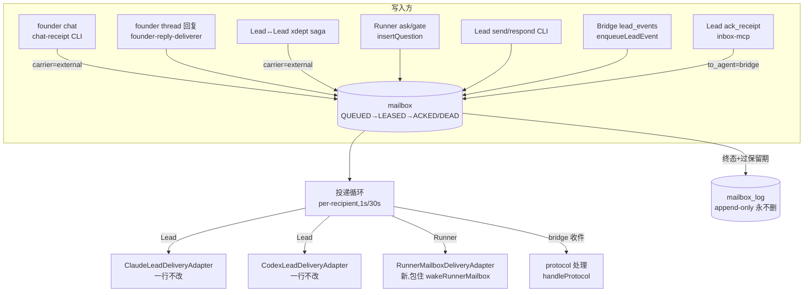

# FLY-1572 合表 + 迁移:两张信箱表并成一张 mailbox — 实施计划

Issue: FLY-1572 (https://linear.app/geoforge3d/issue/FLY-1572/消息层重构-c-批次1-合表-迁移两张信箱表并成一张-mailbox)
日期: 2026-08-04
基于: research.md

> 上游权威 = `doc/messaging-rework/design.md`(FLY-1569)。本计划把 issue 的 scope 落到可实施粒度。
> **与 issue 原文的偏离全部集中在 §2(带证据)** —— 按 README 规矩,合并前须把偏离结论同步给 Lead/总纲。

## 0. 一句话

`lead_inbox`(37 列)+ `messages`(实测 28 列)→ 一张 `mailbox`(v1 comm.db)+ 一张 append-only `mailbox_log`;投递循环从 per-Lead 扩到所有收件人(Lead + Runner + bridge);Lead 适配器一行不改;迁移带备份、幂等、实测回滚。

## 1. 设计总图



## 2. 与 issue 原文的偏离清单(全部有审计证据,见 research.md)

| # | issue 原文 | 实况 | 本计划的处理 |
| -- | -- | -- | -- |
| P1 | `messages` 22 列 | **实测 28 列**(migration 加了 checkpoint/content_ref/content_type/resolved_at/delivered_at/attachments/kind) | 7 列全部进拆分对照(§4) |
| P2 | 删 17 列含 `consumed_at` `delivered_at` `carrier` `next_retry_at` `batch_id(旧)` | 5 列是**活承重列**(pending 谓词/external 分流/批次膜/重试退避) | 语义由新状态机与保留列接管:consumed_at→state+acked_at;carrier/next_retry_at/batch_id **保留列**;delivered_at(external)→acked_at 映射 |
| P3 | mailbox DDL 草图无 `msg_class`/`last_error`,但「留 14 列」清单里有 | issue 自身不一致;msg_class 驱动 protocol/model 双 lane(循环承重) | DDL 补上两列(§3) |
| P4 | mailbox DDL 无 `carrier` | E 单前 Discord 直推不动,external 影子行的记账是活的,且必须对循环结构性不可见 | **保留 `carrier` 列**(CHECK 同现状),E 单收编后由 E 单删 |
| P5 | 未提 gate/RPC 列 | messages 是 approve_to_ship / gate 的底座(checkpoint/resolved_at/relay_state/expires_at 承重,verify-approval 链在读) | RPC 列随行进 mailbox(§3);verify-approval / respond 语义字节不变 |
| P6 | 「176 活行」 | 2026-08-04 实测未消费仅 9 行(FLY-1570 后风暴已停) | 验收 5 以迁移时刻实测数为准 |
| P7 | founder→Lead = 一条影子行路径 | 实际两条:chat 影子行(external)+ thread 回复 hub root(inbox lane,priority 0) | 两条分别接线(§5.1/§5.2) |
| P8 | 6 sender 列「压成一个 sender_ref…它们解决的是防串写,不属于投递语义」 | `sender_lease_key`+`sender_generation` 是**活授权数据**(ProcessedEvidence fence;handle-receipt 缺它硬失败;writer_pid 是降级梯第二级) | 压成**一列但结构化**(canonical JSON),字段机器可提取,三级降级梯与 FLY-1309 五条约束逐条保持(§6) |

## 3. 新 schema 定稿(建在 v1 `~/.flywheel/comm/<project>/comm.db`)

> ⚠️ 命名冲突声明:`packages/v2-kernel`(flywheel-v2.db)已有一张 `mailbox`(FLY-1497/1502 产物,不同库不同包);`bridge/mailbox-lead-runtime.ts` 的 "mailbox" 指 inbox JSON 文件传输。**本表建在 v1 comm.db,与两者无关** —— 代码注释与文档必须写明。

```sql
CREATE TABLE mailbox (
  seq          INTEGER PRIMARY KEY AUTOINCREMENT,
  id           TEXT NOT NULL UNIQUE,
  from_agent   TEXT NOT NULL,
  to_agent     TEXT NOT NULL,          -- ★ 收件人:lead id / runner-<exec8> / 'bridge'
  type         TEXT NOT NULL,          -- 粗类型,两表词汇表并集,不加 CHECK
  msg_class    TEXT NOT NULL DEFAULT 'model' CHECK(msg_class IN ('protocol','model')),
  content      TEXT NOT NULL,
  content_ref  TEXT,                   -- 大内容外溢(gate)
  content_type TEXT,
  ref_id       TEXT,                   -- 回复哪一封(= 旧 parent_id;问→答深度恰 1)
  kind         TEXT,                   -- report / gate 细分(旧 messages.kind)
  checkpoint   TEXT,                   -- gate 检查点(approve_to_ship 等)
  deadline_at  TEXT,
  expires_at   TEXT,                   -- 保留期锚点(归档判据之一,不再是 DELETE 判据)
  relay_state  TEXT NOT NULL DEFAULT 'open'
               CHECK(relay_state IN ('open','protected','terminal_disposed')),
  resolved_at  TEXT,
  resolved_via TEXT,
  superseded_at TEXT,
  superseded_by TEXT,
  created_at   TEXT NOT NULL,

  -- 状态机(总纲 §3;D 单让租约转起来,本单建对)
  state        TEXT NOT NULL DEFAULT 'QUEUED'
               CHECK(state IN ('QUEUED','LEASED','ACKED','DEAD')),
  claimed_by       TEXT,
  claim_expires_at TEXT,
  retry_count  INTEGER NOT NULL DEFAULT 0,   -- = 旧 attempts(投递失败重试计数;D 单扩展到租约到期)
  next_retry_at TEXT,                        -- 投递失败退避(claim respectRetryAt 承重,保留)
  last_error   TEXT,
  acked_at     TEXT,
  dead_at      TEXT,
  dead_reason  TEXT,

  -- E 单前的直推分流(P4;E 单删)
  carrier      TEXT NOT NULL DEFAULT 'inbox' CHECK(carrier IN ('inbox','external')),

  -- 溯源(FLY-1309;§6)
  sender_ref   TEXT,                   -- canonical JSON,NULL = unprotected write

  -- 只留字段位,本期不写逻辑
  priority     INTEGER,               -- 沿用现有 claim ORDER BY priority,seq(NULL 排后)
  batch_id     TEXT,                  -- 批次膜(claim 机制现用;D 单合批扩展)
  collapse_key TEXT
);
CREATE INDEX mailbox_live ON mailbox(to_agent, seq) WHERE state IN ('QUEUED','LEASED');
CREATE INDEX mailbox_claim ON mailbox(to_agent, msg_class, priority, seq)
  WHERE carrier = 'inbox' AND state IN ('QUEUED','LEASED');
CREATE UNIQUE INDEX mailbox_unique_response ON mailbox(ref_id) WHERE type = 'response';  -- 一问至多一答(承重不变量)
```

```sql
CREATE TABLE mailbox_log (
  log_seq     INTEGER PRIMARY KEY AUTOINCREMENT,
  message_id  TEXT NOT NULL,          -- 不唯一:同一消息可多事件
  event       TEXT NOT NULL,          -- 'migrated_history' | 'archived' | 'settled' | 'progress'
  at          TEXT NOT NULL,
  source_table TEXT,                  -- 迁移事件:'lead_inbox' | 'messages'
  row_json    TEXT NOT NULL           -- 行完整 JSON 快照(含全部旧列值 —— forensics 永不丢)
);
CREATE INDEX mailbox_log_message ON mailbox_log(message_id);
-- append-only 触发器,照抄 workflow_source_event_no_update/no_delete 模式
```

要点:
- **priority 保持 INTEGER 可空**(issue 原样)。现有 lead_inbox 行 priority 0-3 迁入原值;新 mailbox 不再强制 CHECK(本期不做排序逻辑,claim 沿用 `ORDER BY priority, seq`,NULL 视为最低,与现状一致化处理在 claim SQL 里显式 `COALESCE(priority, 99)`)。
- **attachments / progress 不进 mailbox**:`type='progress'`(ProofShot 审计)是纯写记录 → `notify` 直接写 `mailbox_log(event='progress')`,attachments 进 row_json。mailbox 保持纯投递。
- **logical_event_id 删除**:零 SELECT 读者(research §3.5),仅自身 UPDATE 幂等闩;protection 语义由单行模型天然覆盖(问题行本身就在耐久队列里)。历史值进 log。
- 三张附带表:`loop_owner` 不动;`loop_heartbeat` 的 UPSERT 子查询改指 mailbox;`receipt_alert_outbox` 保持现有 live 写入点、明确记录其孤儿状态(读侧 FLY-1570 已删;清算归 D 单死信闸),本单不扩大。

## 4. 字段拆分对照(权威版:37 + 28 → mailbox 33 / log / 删)

### 4.1 lead_inbox(37)

| 去向 | 列 |
| -- | -- |
| 进 mailbox(改名) | `to_lead→to_agent`、`source→from_agent`、`ref_message_id→ref_id`(仅迁移期映射;镜像行本身消失)、`attempts→retry_count` |
| 进 mailbox(原名) | seq(不保值,新表重排)、id、type、msg_class、priority、content、created_at、deadline_at、last_error、claimed_by、claim_expires_at、next_retry_at、carrier、batch_id(**只留列,不迁旧值**) |
| 语义进状态机 | `consumed_at→state='ACKED'+acked_at`;`disposition`→state+dead_reason(delivered→ACKED;frozen/quarantine→DEAD);`delivered_at`(external 行)→acked_at |
| 进 log(row_json) | processed_at、processed_evidence、disposed_at、disposed_evidence(F 单 task 表接手「办没办」;本期 settle 类动词写 log 事件,证据不丢且升级为永不删) |
| 删(历史值进 log) | read_at、escalated_at、next_unprocessed_at、resend_of、resend_round、delivered_rounds、routing_state、candidates_json、family_root_id、legacy_alias、receipt_exempt_reason、receipt_episode_id |

### 4.2 messages(28)

| 去向 | 列 |
| -- | -- |
| 进 mailbox | id、from_agent、to_agent、type、content、`parent_id→ref_id`、created_at、expires_at、checkpoint、content_ref、content_type、resolved_at、kind、relay_state、superseded_at、superseded_by、resolved_via、deadline_at |
| 语义进状态机 | `read_at→acked_at`(instruction 的 ACK);`delivered_at`→迁移映射(response 已 consume→ACKED) |
| 压缩 | 6 sender 列 → `sender_ref`(§6) |
| 删 | logical_event_id(零读者);attachments(progress 随行进 log) |

删除清单的每一列,实施时逐列跑 `rg` 复核零 live 引用后才落 DDL;死代码(research §2.5 的 db.ts receipt 链 10 方法 + LeadInboxQueue 9 方法)在同 PR 删除。

## 5. 四条流重接线(+两条系统流)

### 5.1 founder→Lead(chat 影子行,直推不动)
`beginChatReceipt` → INSERT mailbox(carrier='external', state='QUEUED');`complete` → state='ACKED'+acked_at;`settle` → `mailbox_log(event='settled', row_json 含 evidence)`;abort/quarantine → state='DEAD'+dead_reason。saga/lane 查询(listExternalPendingForLane 等)改写为 state 谓词。external 行因 carrier 对循环所有 claim 结构性不可见 —— 与现状逐字节等价。

### 5.2 founder→Lead(thread 回复 hub root)
`enqueueFounderHubRoot` → mailbox(carrier='inbox', priority 0)照旧进循环;routing_state 删除(唯一读者是自校验);`settleFounderHubRoot`/`routeFounderReply` 的 markProcessed → log 事件 + (未投家族行 → DEAD dead_reason='superseded');candidates_json/family_root_id 的 legacy promoted family 读取改为读 log(迁移后历史在 log.row_json)——routeFounderReply 兼容分支实施时评估:若 legacy family 已无活例(迁移时实测),直接删分支。

### 5.3 Runner→Lead(杀双写 ①)
`insertQuestion` 写**一行** mailbox(to_agent=lead, msg_class='model', type='question', checkpoint/deadline 随行)。`QuestionAdmission` 镜像层退役;**渲染移到投递时**:循环 claim 到 type='question' 行时经 renderEnvelope 产出 member content(渲染器在 teamlead,循环也在 teamlead,CLI 不需要会渲染)。protection 语义:单行本身耐久,markQuestionProtected 的「防 purge」使命消失;relay_state 照旧承担 terminal_disposed。

### 5.4 Lead→Runner(循环收编)
`send`/`respond` 写 mailbox 行(to_agent=runner-<exec8>)+ HTTP nudge(现有 lead-inbox-nudge 客户端,200ms best-effort);循环对 runner 收件人 claim → **新 `RunnerMailboxDeliveryAdapter`**(实现 LeadDeliveryAdapter 同接口):内部 = 今天 send.ts:127-186 的机制原样搬入 —— runner_phase_wakes claim push → `wakeRunnerMailbox`(transport.write 最后一公里不动)→ complete push;成功回执 → 行 ACKED?否 —— **runner 行的 ACK = runner 自己拉**:`flywheel-comm inbox` 读 state IN ('QUEUED','LEASED') AND to_agent=me → 标 ACKED(= 今天 markInstructionRead);`check`/`gate` 的 consumeGateResponse → response 行 ACKED。适配器投递成功只把行留在 LEASED?→ 不行,batch 1 无租约到期,LEASED 会永久卡住。**判决:batch 1 runner 行投递成功后回到 QUEUED(清 claim),ACK 只由 runner 拉取动作盖章**;重复 doorbell 由 runner_phase_wakes 的现有 admission cap 与 UNIQUE 约束抑制(与今天行为一致:wake 只是门铃,耐久行等拉取)。D 单再把 LEASED+租约到期语义接上。
Bridge 内部纯 wake 位点(gate-poller/plugin 的 park_wake 重推)不是新消息,不经 mailbox,保持直呼 —— 与「循环永不主动发消息」红线一致。
`transport:'none'` 后端(antigravity/kimi):runner 适配器沿用 sendRunnerWake 的短路逻辑,行留 QUEUED 等拉取。

### 5.5 Lead→Lead(xdept)与 Bridge 事件
xdept saga = external 模式(同 5.1)。`enqueueLeadEvent`(lead_events→inbox)照旧,仅换表名与 state 语义(markConsumed→ACKED)。

### 5.6 Lead→bridge(ack_receipt,杀双写 ②)
inbox-mcp 写 ack_receipt 行 to_agent='bridge'(单行);循环 protocol lane 的 claim 改为 `WHERE to_agent='bridge' AND from_agent=<lead> AND msg_class='protocol'`,`handleProtocol` 处理后 ACKED。`ProtocolIngress` 镜像层退役。**「所有收件人」把 bridge 自己也算作收件人 —— 模型自洽。**

### 5.7 循环扩容结构
`LeadInboxRuntime`(改名 `MailboxDeliveryRuntime`)构造时:每 Lead 一 loop(现状)+ **runner 收件人动态发现**:每 tick 由 queue `SELECT DISTINCT to_agent FROM mailbox WHERE state='QUEUED' AND to_agent LIKE 'runner-%'`(走 mailbox_live 索引)对有货的 runner 建/复用轻量 lane(同一 loop 内串行处理,不为每 runner 起新 timer —— **零新增定时器**,沿用 1s/30s + nudge)。owner 围栏、批次膜、失败退避、毒药隔离逻辑全部复用。

## 6. sender_ref 方案(FLY-1309 五约束逐条对齐)

一列 `sender_ref TEXT`,值 = canonical JSON(键序固定):
```json
{"lease_key":"...","generation":7,"holder_pid":123,"holder_start":"...","writer_pid":456,"writer_start":"..."}
```
- 六字段结构原样保留在 JSON 内,**lease_key/generation 机器可提取**(约束 4);holder 与 writer 仍是两组独立键(约束 2);holder 缺 history → JSON 内省略 holder 键、绝不填当前 holder(约束 1);unprotected/carrier_passthrough 写 → 仅 writer 键或整列 NULL,`validate()` 四态经「有无 lease 键」可区分(约束 3);runner 可见字节零变化(约束 5)。
- `provenanceValues()` 改为序列化;`processedFenceFromProvenance` 三级降级梯(lease→writer_pid→unprotected)改为解析 JSON,**判定逻辑逐字对齐现版**;`handle-receipt` 硬失败守卫不变。
- FLY-1309 的 qa-incident-replay.sh 断言随列名更新,回放能力等价性放进测试(§9)。

## 7. 保留期与归档(替代 messages 72h DELETE)

- 触发点沿用今天的 purge 位点:CommDB 读写 open 时跑 `archiveTerminalToLog()`(**零新定时器**)。
- 归档判据:`state IN ('ACKED','DEAD') AND acked_at/dead_at < now-72h`,**且** RPC 维度已终局(type='question' 须已答或 relay_state='terminal_disposed';FLY-1279 保护语义原样平移)。归档 = 事务内 INSERT log(event='archived', row_json) + DELETE mailbox 行 —— 行离开活表但证据永存,「永不删」成立。
- external 行同规则。

## 8. 数据迁移(scope 5)

1. **前置**:停 Bridge(单写者);`sqlite3 ... "PRAGMA wal_checkpoint(TRUNCATE)"`;`backupDatabase()`(v2-kernel 在线备份 + integrity_check + FK check)到 `comm.db.pre-fly1572-<ts>`。
2. **脚本**(`scripts/migrate-fly1572-mailbox.ts`,幂等):
   - `mailbox_migration_meta` 表记 completed 标志 + 源表行数快照;重跑时已 completed → 校验后 no-op。
   - 建 mailbox / mailbox_log / 索引 / 触发器。
   - **活行入 mailbox**:lead_inbox `consumed_at IS NULL` → state 映射(pending→QUEUED;external 未 complete→QUEUED);messages 未过期未 terminal_disposed 的 question/response/instruction/ack_receipt → 状态映射表(read→ACKED;response 已 consume→ACKED;未读/未投→QUEUED,retry_count 保留)。**question 行与其 lead_inbox 镜像行合一**(join ref_message_id;镜像 consumed→该行 ACKED)。
   - **历史全量入 log**:两表其余行 → `event='migrated_history'` + source_table + row_json(逐行完整快照)。
   - `INSERT OR IGNORE` + changes==0 时按 id 回读逐字节比对(v2-cutover 幂等模式),分歧即 abort。
   - **DROP `lead_inbox` / `messages`** + 旧索引/触发器(受 FLY-1586 附表 lead_inbox_freeze_install / fenced_root / sanitation_audit 一并清算:历史内容先快照进 log)。留表会让漏改的旧 SQL 静默写脏,fail-loud 优于双轨。
   - 行数对账:`mailbox 活行数 == 迁移前两表活行数`(打印对照,验收 5)。
3. **回滚(实测一次)**:停 Bridge → `cp comm.db.pre-fly1572-<ts>` 覆盖 → 回退部署 → 起 Bridge → fleet 冒烟。备份文件即回滚,无 feature flag(遵守铁律)。

## 9. 实施顺序与 TDD

| 步 | 内容 | 测试先行 |
| -- | -- | -- |
| 1 | flywheel-comm:mailbox schema + MailboxQueue(承接 LeadInboxQueue 全部 live 方法,state 语义)+ 写闸门(normalize/truncate)平移 | vitest:schema/state 机/claim/幂等/闸门(现有 lead-inbox-queue.test 迁移改写) |
| 2 | sender_ref 序列化 + fence 降级梯 + handle-receipt 守卫 | vitest:round-trip、四态区分、降级梯逐字对齐、FLY-1309 回放等价 |
| 3 | CLI 改写:ask/gate/send/respond/inbox/check/chat-receipt/route-founder-reply/handle-receipt/runner-stopped/pending/complete/verify-approval(只换存取层,**语义与输出字节不变**) | 各 command 测试 + verify-approval 反向兼容 sentinel |
| 4 | teamlead:循环扩容(runner lane + RunnerMailboxDeliveryAdapter + protocol lane 收编)+ 渲染移到投递时 + heartbeat SQL + boot 时序(reconciler 平移) | vitest:loop 扩容/适配器契约(Lead 适配器测试**一行不改**必须全绿)/双写死亡断言 |
| 5 | 迁移脚本 + 归档 sweep | vitest:幂等重跑/行数对账/状态映射矩阵/回滚脚本干跑;真库副本演练 |
| 6 | 死代码清理(research §2.5 清单)+ rg 复核每个删除列/表零残留 | `rg` 断言进 scripts/__tests__ |
| 7 | 全仓门:pnpm lint + pnpm -r build + test:packages:run + shell 测试 | — |

真机 E2E(QA 节点执行,本节点交设计):四条流各发一条(founder chat→Lead、Lead→Lead xdept、Runner ask→Lead、Lead send→Runner)送达+ack+表状态断言;迁移演练用生产库副本;Bridge 重启 + fleet 12/12;现有 runner 收发不受影响。

## 10. 不做什么(总纲 §9 + issue)

租约到期重投/合批/死信闸(D=FLY-1573;LEASED 到期语义留空)、Discord 直推收编(E;carrier 列因此保留)、task 表(F;settle 证据暂入 log)、feature flag(禁令)、优先级/折叠逻辑(留字段位)、runner_phase_wakes 改革(park_wake 泄漏的行为修复归 D —— 本单交付的统一 id 模型是它的前提;账本本身不动)。

## 11. 风险

| 风险 | 缓解 |
| -- | -- |
| CLI/Bridge 版本错配窗口(迁移后旧进程写旧表) | DROP 旧表 → 旧 SQL fail-loud;迁移与部署同一停机窗;self-ship 纪律(spin.md 3.4) |
| 145MB 全量入 log 的迁移时长/体积 | 单事务批量 INSERT;演练时实测时长;log 无索引负担(仅 message_id 一个) |
| 渲染移到投递时改变 Lead 看到的字节 | 渲染函数复用 renderEnvelope 本体;E2E 逐字节比对现状样例 |
| runner 行 QUEUED 常驻导致循环空转 | 活跃判定沿用 countPending;QUEUED 未拉取行属正常在途,不触发任何主动消息(红线①) |
| sender_ref 解析开销/畸形 JSON | canonical 序列化 + 解析失败按 unprotected 降级(fail-safe 语义与 NULL 相同)+ 畸形计数告警 |
