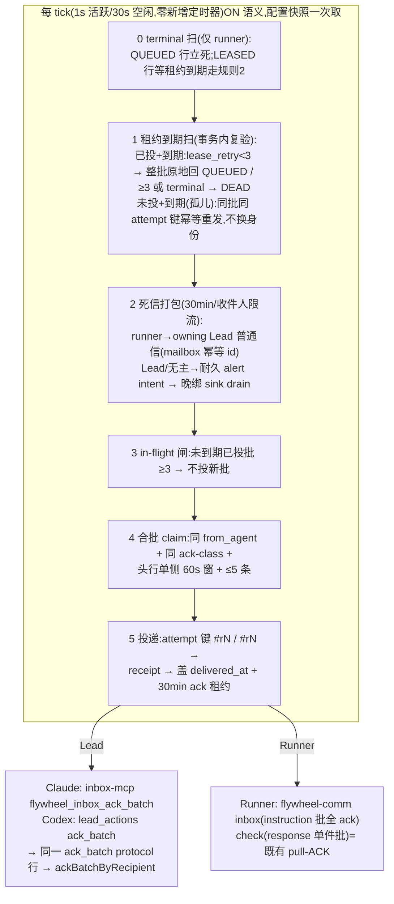

# FLY-1573 队列能力三合一:租约重投 + 合批投递 + 死信闸 — 实施计划
Issue: FLY-1573 (https://linear.app/geoforge3d/issue/FLY-1573/消息层重构-d-批次2-队列能力三合一租约重投-合批投递-死信闸)
日期: 2026-08-10
基于: research.md(exploration.md 取舍已定;Lead 裁决 question `8dcfba7c`;Codex design review R1 全 11 项 + R2 全 7 项折入;两文档已按 R2#7 勘误同步)

> 上游权威 = `doc/messaging-rework/design.md` §3/§4/§6(含 FLY-1580 勘误:死信通知 = **每收件人每 30 分钟最多一封**,非全生命周期一封)。founder 硬要求(2026-08-05):独立 flag `FLYWHEEL_MAILBOX_QUEUE`,OFF=旧流,ON=新语义,运行时可切;删 flag 归独立清理单。
> 实施若需偏离 design.md:先改该文档、同步 FLY-1569,再改代码。

## 0. 一句话

在 C 单已合入的 `mailbox` + 三 lane 上,新增两列(`delivered_at`/`lease_retry_count`)+ 一组事务内自校验的 `MailboxQueue` 新方法 + lane 层单入口 flag 分支,落地:到期**原地**重投(零新建行)、ack-同质合批 + 批级 agent-ack + in-flight 3 批、terminal 立死 + 3 次封顶 + 死信打包(runner→owning Lead 普通信;Lead→**耐久** alert intent 直发;均 30min 限流)。

## 1. 总图



红线①不破:步骤 0–2 只由**表内已有状态**驱动,mailbox 空时整个 tick 零产出(tick 计数断言)。

## 2. 语义定稿

### 2.1 schema 增量(单一幂等升级器,覆盖全部 open 路径)

```sql
ALTER TABLE mailbox ADD COLUMN delivered_at TEXT;          -- 本 attempt 的 transport 确认时刻
ALTER TABLE mailbox ADD COLUMN lease_retry_count INTEGER NOT NULL DEFAULT 0;  -- no-ack 到期重投计数(≠ retry_count=投递失败计数)
CREATE INDEX IF NOT EXISTS mailbox_lease_expiry
  ON mailbox(claim_expires_at) WHERE state = 'LEASED' AND carrier = 'inbox';
```

- **升级器 `ensureMailboxQueueSchema(db)`**(R1#8):导出单一幂等函数(`PRAGMA table_info` 探测缺列才 ALTER,duplicate-column 竞态按仓内守卫迁移模式吞并复验),**每条 open 路径先跑再 prepare**:`CommDB` open、`MailboxQueue(string)` 构造、`MailboxQueue(connection)` 构造(现直接 return,补调用)。`MAILBOX_CORE_SCHEMA` 同步加列供新库直建。测试:旧库经 CommDB / 旧库直传 MailboxQueue / 新库 / 重复 open / 双进程近并发 open 五态。
- **两个计数分账**:`retry_count` 只记 transport 投递失败(runner 6 / lead model 5 / bridge 3,全不动);`lease_retry_count` 只记「已投未 ack」到期重投,max 3(knob)。孤儿 claim(`delivered_at IS NULL`)不消耗任何计数。
- `mailbox_message_projection` 不动(OFF 字节兼容;实施时 rg 复核读者)。新索引 EXPLAIN 钉死。

### 2.2 状态机增量(批级;terminal 真值表按 design.md §6 顺序,R1#1)

**真值表(runner 收件人;lead 恒活;bridge 不入闸):**

| 行状态 | 收件人 | 动作 |
| -- | -- | -- |
| QUEUED(含重投回来的) | terminal/session 缺失 | **立刻 DEAD**(design §6 括号注「新到的信立刻进 DEAD」+ 验收 3),`dead_reason='recipient_terminal'` |
| LEASED,租约**未**到期 | 任意 | **什么都不做**(§6 规则 1 优先;terminal 也等到期,上限一个租约期 30min) |
| LEASED 已投(`delivered_at` 非空),到期 | terminal | DEAD,不重试(规则 2) |
| LEASED 已投,到期 | 活着,`lease_retry_count < 3` | **整批原地回 QUEUED**:`lease_retry_count+1`,清 `claimed_by/claim_expires_at/batch_id/delivered_at`。❌ 绝不 INSERT(规则 3) |
| LEASED 已投,到期 | 活着,`≥ 3` | 整批 DEAD,`dead_reason='lease_expired_unacked'`(规则 4) |
| LEASED 未投(孤儿:crash 于 transport 确认前),到期 | 活着 | **frozen 重发**:保 `batch_id`、保 attempt 键(`#r<lease_retry_count>` 不变)、原 membership 幂等重发(sidecar/journal 同键去重 → 已收过则无第二响);Lead/Runner 两 lane 同款(R1#5,取代原「孤儿回 QUEUED」方案) |
| LEASED 未投,到期 | terminal | DEAD(规则 2 对到期行不分已投未投) |

- terminal 判定:StateStore 导出**窄只读谓词/解析器**(新增 `resolveRunnerRecipientState(executionId): { terminal: boolean; projectName?: string; issueLabels?: string } | undefined`,内部用私有 `TERMINAL_STATUSES`;不导出集合本身),`approved_to_ship` 非 terminal 显式测试(R1#1)。session 缺失 → terminal(「不存在 ≠ 没响应」)。
- **所有回收/致死操作 = 事务内自校验**(R1#6):每个变更方法单独一个 `.immediate()` 事务,内部复验 owner lease 有效、批 membership 现读、逐成员 state/`delivered_at`/到期条件,守卫式 UPDATE 本身是权威;返回 typed 结果(`applied` / `lost_race` / `noop_already_*`),不做「先读后写再 assert」。部分成员已被 pull-ACK 的批(见 §2.3)只处理仍 LEASED 的成员,同事务内计数自洽。
- Lead 收件人的既有 frozen-batch 重领(`claimLeadBatch`)在 ON 专用方法里增 `delivered_at IS NULL` 谓词;OFF 原方法零改。

### 2.3 合批(≠折叠;design.md §4;R1#4/#9)

- **组批键 = (to_agent, from_agent, ack-class, lease_retry_count, retry_count)**(R2#2 + R3#3:重投行与新鲜行不同批使 `#r<n>` 断言结构性成立;transport `retry_count` 也入键 —— OFF 时代回 QUEUED 的 retry-5 行与 fresh retry-0 行若同批,批级失败要么早杀新行要么裂批,入键后批级 DEAD 原子成立。测试:同时间戳 fresh/redelivered 混合、`maxAttempts-1` 旧行 + fresh 行翻 ON 后投递失败、部分 pull-ACK 后的到期批):
  - `instruction` 类(runner 收件人)与 lead model 行:可合批 ≤5 —— 拉取/批 ack 对它们是真批级 ack;
  - `response` 类(runner 收件人):**单件批**(`check <qid>` 逐条 consume,凑批必产生部分 ack;R1#4);
  - 混类不同批。
- **窗口定义(唯一 SQL 规则,R1#9)**:头行 = 收件人 deliverable QUEUED(`next_retry_at` 到期、`batch_id IS NULL`)按 `(priority, seq)` 第一行;成员 = 同组批键且 `head.created_at <= created_at <= head.created_at + windowMs`(**单侧、含边界**;边界时刻由 JS 计算成 ISO 字符串参数,ISO-UTC 定长字符串字典序比较),按 `(priority, seq)` 取前 `batchMaxSize` 条。极差 ≤ window 由单侧窗保证。边界恰好/刚超、priority 与时间乱序的用例入测试。
- **窗口是约束不是等待**:tick 到了有什么投什么,不延迟攒批(验收 5 构造条件写进 QA 脚本)。
- 批内每条独立一行、独立 `[receipt:<delivery_id>]`/`[lead-instruction <id>]`;零折叠,`collapse_key` 不读不写。
- **in-flight 上限** = 该收件人「已投且租约未到期」distinct `batch_id` 数;≥3(knob)→ 不投新批(到期回收不受此闸)。
- 门铃三件事(③欠账数 F 单前省略):批头部 = `[mailbox-batch <durableBatchId> | <N> messages | from <fromAgent>]` + ack 指引(Claude Lead: `flywheel_inbox_ack_batch`;Codex Lead: `lead_actions.ack_batch`;Runner: `flywheel-comm inbox --exec-id <id>`)+「未 ack 批达上限后不会有下一批」。渲染确定性(禁时间戳)。注入位置:Claude 首成员 content 前 / Codex `modelPayload` 头部 / Runner wake content 头部。**ack 用的批 id 恒为耐久 `batch_id`**(跨 attempt 稳定)。

### 2.4 transport attempt 键(R1#2/#5 定稿)

- **批与成员双双 attempt-scoped**:transport batch id = `<durableBatchId>#r<n>`,member id = `<deliveryId>#r<n>`,`n = lease_retry_count`(同批成员恒同值;组批时断言)。**ON 首投恒 `#r0`**。
- 耐久身份不变:`mailbox.batch_id`/`delivery_id`、正文 `[receipt:<delivery_id>]`、ack capability、settlement/`receipt_root_lineage` 链全用裸 id。lane 持有 transport↔durable 映射,adapter receipt 校验对 transport id 做、ack/记账对 durable id 做(映射在 batch 组装结构里显式携带)。
- **runner 真实幂等边界**(R1#5 + R2#3):不是 `runner_phase_wakes`(out-of-scope 且 production adapter 不持久化 `intentKey`)——是 agent-team transport `writeMailboxEntry` 的 sidecar `flywheelId` 去重。**一个 runner 批 = 一次 `writeMailboxEntry`,其 sidecar 键 = transport batch id `<batchId>#r<n>`**;成员 id 是 envelope 正文内容,不是独立 sidecar 成员。ON 路径经 `wakeRunnerMailbox` 传 `flywheelId=<batchId>#r<n>` **并传 `verified: true`**(R2#3 假成功缝:`writeMailboxEntry` 对 recent-pending sidecar 可返回 `idempotent:true, finalized:false`(ClaudeMailboxCodec.ts:195-211),现 production adapter 不带 `verified` 会把「Phase-A 写了 pending、main 从没落」记成 delivered)——unverified/non-finalized 一律按投递失败处理,绝不盖 `delivered_at`。孤儿 frozen 重发同键 → sidecar 幂等,无第二响。
- **runner 投递失败 = frozen 式**(R2#3,对齐 lead `recordLeadDeliveryFailure` 形态):失败批**保持 LEASED、保 `batch_id`、保 membership、保同一 attempt 键**,清 owner claim、`retry_count+1`、`next_retry_at` 退避、超限 DEAD;到期后由 frozen 重发路径同键幂等重投。❌ 不回 QUEUED(回 QUEUED 会换耐久批 id → 换 `flywheelId` → 模糊失败二次响铃)。只有**已投租约到期**才清批重组。
- **pull-ACK 与投递记账的竞态合同**(R3#2:runner 拉取可在 wake 抵达后、Bridge 记账前把批的全部/前缀成员 ACK 掉):**所有 runner 投递后事务按原始 `batch_id` 全 membership 定义,ACKED 成员视为已了结**——`recordRunnerBatchDelivered` 只给仍 LEASED 且本 owner 的成员盖章,其余成员全 ACKED 时同样判成功(ACK 胜出 ≠ 丢围栏);`recordRunnerBatchDeliveryFailure` 同理只转移仍 LEASED 成员,全 ACKED → typed `already_settled` no-op。**frozen 重发恒渲染原始全 membership(含已 ACKED 行)**——同 `flywheelId` 永远对应同一字节 payload,绝不只渲染剩余行(runner 多看一遍已 ack 内容无害,拉取只给未 ack 行);部分 ACK 视为 runner 活着的证据,剩余 LEASED 成员照常走租约。确定性竞态测试:transport 写后记账前的全 ACK / 前缀 ACK ×(成功记账 | 模糊失败记账)四格。
- **ON↔OFF 收敛(R1#2 修正)**:
  - ON→OFF:ON 已投批 `B`(transport `B#r0`)flip 后被 OFF frozen 重领,以**裸 `B` + 裸成员 id** 投递 —— sidecar 无批 `B` 记录、成员裸 id 与 `id#r0` 不同键 → 按新批正常写入(Lead 至多多看一遍,at-least-once)→ durable-accept ACK 收敛。**同批身份不再冲突,因为 ON 从不占用裸批 id**。
  - OFF→ON:OFF 已 accept 批 `B`(裸)crash 于 ACK 前 → ON frozen(`delivered_at IS NULL`)以 `B#r0` 重发 → 新键正常写入(至多重复一遍)→ delivered → agent-ack。
  - **测试必须打真 codec/journal**(R1#2):对真 `ClaudeMailboxCodec` sidecar 与真 Codex `SqliteJournalStore`,覆盖 ON→OFF 与 OFF→ON 各三个 crash seam(transport accept 前 / accept 后 `record*Delivered` 前 / delivered 后 ACK 前),断言零 `membership_conflict`、零消息丢失、重复次数 ≤1。fake adapter 只用于流程测试,不用于此不变量。

### 2.5 死信闸(design.md §6 + FLY-1580 勘误 + Lead 裁决 + R1#7 + R2#1)

**通知生产 = source-driven,不是转移返回值驱动**(R2#1):`reconcileExpiredLeases` 只负责状态转移;通知由每 tick 的**有界扫描**从 DEAD 行(耐久 source)独立推导。DEAD 落库与通知落库之间的任何 crash/owner 丢失都不会丢通知——下一 tick 重扫即补;窗内被限流的死亡也不会丢——它们仍是「未覆盖的 DEAD 行」,窗开后第一封通知必含(专项测试)。

- **runner 收件人** → 打包普通信给 owning Lead(`resolveRunnerRecipientState` 给 projectName/labels → `resolveLeadForIssue`):`enqueue()` 正门,`from_agent='bridge'`,`type='dead_letter_notice'`,`msg_class='model'`,`priority=1`,`source_kind='dead_letter'`,`source_ref=<死收件人>`;内容 = 「runner-X 有 N 封信始终没 ack,可能已下线」+ 逐条摘要(type/from/首 120 字符)+「请决定:重新派 / 丢弃 / 转给别人」。
  - **单事务扫描+限流+落行**:一个 `.immediate()` 事务内完成 —— 取该收件人**覆盖游标**(= 最新一封通知 id `dead_letter:<recipient>:<throughDeadSeq>` 编码的高水位;id 是我们铸的确定性键,解析自己的 id 合法)→ 查 `seq > 游标` 的未覆盖 DEAD 行 → 滚动窗判定(距最新通知 `created_at ≥ windowMs` 才发)→ INSERT 通知(新 id 编码新高水位;`mailbox_identity` 重放 no-op)。并发 tick/重启天然单发。
  - **限流(硬要求,测试必写窗口语义)**:每死收件人每 `deadLetterWindowMs`(30min)≤1 封;窗内新增死亡并入窗开后第一封;❌ 禁止「全生命周期一封」形态。
  - crash 缝测试:DEAD 提交后通知前 / 通知落行后 / 窗内新增死亡 → 窗开补发,三缝全覆盖。归档边角(family 保留使旧 DEAD 行活过通知行的 72h 归档 → 游标丢失 → **新窗口**可能对旧行再发一封)不违反 per-window 硬规则,显式接受并注释。
  - 通知行走同一套队列流程(含租约/ack)。
- **Lead 收件人 + owning-Lead 推导失败的 runner**(R1#7 重做 + R2#1 跨库缝)→ **耐久 alert intent,不进 mailbox**(Tadashi 已批):
  - 同样 source-driven:每 tick 从 CommDB 扫未覆盖的 lead-收件人/无主 DEAD 行(游标 = StateStore 最新 intent 记录的 `(source_kind, recipient, through_dead_seq)` 高水位)→ StateStore `dead_letter_alerts` 建 intent。跨库 crash 缝安全:CommDB 扫描是只读推导,StateStore 写是幂等判定 —— 任一侧 crash 后重扫收敛。
  - **限流闸在「可见投递」不在建 intent**(R3#1):① **每收件人至多一条 pending intent**——有 pending 时不建新 intent,后到的 DEAD 行保持未覆盖(窗开后并入下一条);② 滚动窗锚在**投递成功时刻**:新 intent 需「无 pending 且 `accepted_at`(上次送达)距今 ≥ windowMs」;③ **drainer 每收件人每次至多投一条 due intent**——sink 断线跨两窗后恢复,也只补一条(不 back-to-back 连发);④ sink `eventId` = 确定性 `dead_letter_alert:<source_kind>:<recipient>:<through_dead_seq>`;**结算必须是收据承载的(R4#1:`LeadAlertNotifier` 的 `skipped:"duplicate"` 是 claim 不是送达凭据 —— claims 读 / 跨进程 claim / `tryClaimLeadEvent` 都在 channel 解析与 Discord POST 之前就能返回 duplicate;仓内 `founder-action-drain.ts:228-232`「claim-not-receipt」与 `StateStore.ts:3226-3234` 已记同型教训)**:sink 按 `eventId` 落**真送达收据**(POST 成功 / 进入耐久 alert 队列 / 耐久 dead-letter 时写,即 StateStore.ts:3226 所述的 real-delivery ledger),`accepted_at` **只**由 `sent | queued_durable | deadlettered_durable` 三种收据承载结果结算;claim-only duplicate/unknown → intent 留 pending 重试,重试时先查收据(有 → 结算;无 → 视为**模糊 attempt**,其 reclaim 受**同一收件人通知窗**围栏(R5#1):`reclaimAt >= ambiguousAttemptAt + deadLetterWindowMs`——若首发 POST 其实成功只是收据写 crash,窗内重投会造成 30min 内两条可见通知,违反硬约束 4;lease 取窗长而非沿用 `lead-alert.sh` shell 路径的 60s 默认/1h 上限(`scripts/lead-alert.sh:379-385` 的租约协议对本限流路径不可原样复用),超窗后允许一次重放并结算收据 —— 有界重复换不丢,且重复被窗隔开)。测试:跨两窗 sink 断线恢复只发一条、两代 source 高水位、并发 drain、**POST 成功 → 收据写 crash → 窗内反复 drain 零新 POST → 窗后至多一次重放并结算**、**claim 落盘后 POST 前 crash → 不结算、最终必送达**(短窗参数保测试快)。
  - 表形态仿 quarantine-alert outbox:`source_kind`,`recipient`,`through_dead_seq`,`payload`,`created_at`,`accepted_at`,`failure_count`;投递走既有晚绑 sink + drain 模式(`drainQuarantineAlertsNow` 同款);sink 失败留 pending 重试。
  - payload 两型:`lead_unacked`(leadId, count, summaries)与 `runner_unroutable`(executionId, count, reason —— **不要求 leadId**)。
  - 死信通知行自身死亡(Lead 3 次不 ack 通知行)→ 收件人是 Lead → alert intent → **环在此断**(测试断言无递归产物)。
- **bridge 收件人**:保持 C 现状(`maxProtocolAttempts` + `onProtocolQuarantine`),不入闸。
- **no-transport runner(agy/kimi)**:照走租约/死信闸;`no_transport` 视同 delivered(盖 `delivered_at`,ack 租约起跑),不计投递失败。

### 2.6 Lead agent-ack 闭环(两后端;R1#3)

- ON 时 `deliverModelBatch`:receipt 后不再 `ackBatch`,改 `recordLeadBatchDelivered`(盖 `delivered_at` + 租约延至 `now+ackLeaseMs`);`markAuditDelivered` 原位保留。
- **批 ack 工具两后端都给**(R1#3):
  - Claude Lead:inbox-mcp 新工具 `flywheel_inbox_ack_batch(batch_id)`;
  - Codex Lead:`lead_actions` MCP server 新 action `ack_batch`(同参);
  - 两者写**同一形态** durable protocol 行:`type='ack_batch'`,`to_agent='bridge'`,`from_agent=<lead>`,content=`{"batch_id":"…"}`。
  - 两后端 launcher/MCP 配置与 rules 各自更新(清单见 §3.3);**每后端一条「真工具调用 → protocol ingress → ackBatchByRecipient」集成测试**。
- `ProtocolIngress` 构造增 `queue: MailboxQueue`(R1#11),新分支 `ack_batch` → `ackBatchByRecipient({batchId, fromAgent, now})`:授权 = 批成员 `to_agent === from_agent`;幂等三态 `applied/duplicate/ack_late_noop`(批已到期重投 → noop,信重投 at-least-once 正确)。分支**不带 flag**(OFF 下无害幂等,避免回切瞬间在途 ack 变毒药行)。
- 既有 per-event `flywheel_inbox_ack_event`(token 门,lead_events 审计)原样保留,正交。

### 2.7 flag 与参数合同(R1#10 修订;**极性按 founder 2026-08-10 指令改为交付即 ON**)

- **`FLYWHEEL_MAILBOX_QUEUE`** = **default-on kill-switch**(`!== "0"` 为 ON,仿 `receiptFoundationEnabled` 惯例):**交付/部署即新流生效,不允许「做了但没 enable 看不到」**(founder 2026-08-10 明令,Tadashi 转达 `[lead-instruction 1fb92599-…]`;本周三起「flag 没开导致没生效」事故的直接回应)。`=0` = 运行时回滚到旧流(founder 8-05 回滚要求不变)。唯一读点 = teamlead lane 层。注册 `FEATURE_FLAGS`(`kill_switch`/`default_on`/`bridge_global`/`bool`/`direct`/readTimings 全 `call_time` + 两个 lane read-site 与 direct-toggle 证据字段按 registry 合同填全)→ fleet console 热切。
- **配置快照**(R1#10):lane 收 `queueConfig: () => ValidatedQueueConfig`(含 flag 与 6 knob),**每 tick 开头取一次**,整个 tick 用该不可变快照(杜绝 tick 中途混态);测试:两 tick 间改 env 不重建 loop 即生效、单 tick 内不混。
- knob 全带上下界 + 越界回默认 warn-once + `NON_FLAG_ALLOWLIST` "config value" 登记:

| knob | 默认 | 界 |
| -- | -- | -- |
| `FLYWHEEL_MAILBOX_ACK_LEASE_MS` | 1,800,000 | [10s, 24h] |
| `FLYWHEEL_MAILBOX_BATCH_WINDOW_MS` | 60,000 | [0, 1h] |
| `FLYWHEEL_MAILBOX_BATCH_MAX` | 5 | [1, 50] |
| `FLYWHEEL_MAILBOX_INFLIGHT_BATCHES` | 3 | [1, 20] |
| `FLYWHEEL_MAILBOX_LEASE_RETRY_MAX` | 3 | [0, 10] |
| `FLYWHEEL_MAILBOX_DEADLETTER_WINDOW_MS` | 1,800,000 | [10s, 24h] |

- **OFF(`=0`)= C 字节兼容**:旧路径一字不改;**resolver 真值表钉死:`undefined` → ON、`"0"` → OFF、`"1"` → ON**(R7#3)。sentinel 测试显式 `=0` 跑既有套件全绿,且**隔离进程或纪律化 env save/restore**(并行测试不得继承彼此的 flag 态)。flag 外仅有的改动 = schema 升级器(惰性)与 `ack_batch` 协议分支(无害幂等),各配 reverse-compat 测试。默认 ON 的部署风险由 §3.3⑤ **就绪 barrier** 吸收(不是部署后观察)。
- **带外回滚 runbook**(R7#2:队列路径崩溃循环可使 Bridge/console 不可用而 launchd 反复以默认 ON 重启):主路径 = console direct-toggle;兜底 = **canonical env 源原子写 `FLYWHEEL_MAILBOX_QUEUE=0` → `restart-services.sh` → 验 live effective flag + C 路径行为**。写进 ship runbook。旧流代码块加 `// FLY-1573 legacy (pre-queue) path — delete with FLYWHEEL_MAILBOX_QUEUE cleanup` 边界注释(founder:删 flag 归独立清理单)。

## 3. API 变更清单

### 3.1 `flywheel-comm/mailbox-queue.ts`(新方法全事务内自校验 + ownerEpoch 围栏 + typed 结果;不碰旧方法)

| 新方法 | 合同 |
| -- | -- |
| `ensureMailboxQueueSchema(db)`(模块级导出) | §2.1 幂等升级器,所有 open 路径调用;**once-per-connection 守卫**(R2#6:module-local `WeakSet<DatabaseSync>`,列+索引确认后才标记;CommDB open 时跑一次,直传 connection 在首个 wrapper 跑一次;测试断言同连接重复 wrapper 零重探、另一连接对 legacy 文件仍安全升级)|
| `claimLeadBatchQueue({toAgent, msgClass, ownerEpoch, batchId, now, transportClaimTtlMs, batchWindowMs, batchMaxSize, inflightMaxBatches})` | frozen(`delivered_at IS NULL`)重领优先(保批保 attempt 键)→ in-flight 闸 → §2.3 组批 fresh claim;`.immediate()` + owner 围栏 |
| `claimRunnerBatch({ownerEpoch, now, transportClaimTtlMs, batchWindowMs, batchMaxSize, inflightMaxBatches})` | 返回一个批(frozen 重发候选优先,同上);跳过 in-flight 达闸收件人;ack-class 组批 |
| `recordLeadBatchDelivered` / `recordRunnerBatchDelivered({batchId, ownerEpoch, now, ackLeaseTtlMs})` | 按原始 `batch_id` 全 membership:仍 LEASED+本 owner 成员盖 `delivered_at` + 延租约;**ACKED 成员视为已了结**(ack 胜出 ≠ 丢围栏,R3#2);全 ACKED → `already_settled`;typed 结果 |
| `recordRunnerBatchDeliveryFailure({batchId, ownerEpoch, now, nextRetryAt, error, maxAttempts})` | R1#4 + R2#3:批级原子失败转移,**frozen 式**(保 LEASED/batch_id/membership/attempt 键;清 owner claim;逐成员 `retry_count+1`/退避;超限整批 DEAD),单事务 |
| `reconcileExpiredLeases({ownerEpoch, now, recipientKind, toAgent?, leaseRetryMax, recipientState, maxBatches, maxTerminalRows})` | R1#6 + R2#4:**单 `.immediate()` 事务**内完成 §2.2 真值表,**有界**(`maxBatches`/`maxTerminalRows` 上限 + 稳定排序 = 剩余量下个 tick 续做);`recipientState` 为**三态**同步快照 `(execId) → 'alive' | 'terminal_or_missing' | 'unknown'`(runtime 预取;**`unknown`(快照后新插收件人)一律跳过等下 tick**,绝不当 terminal 杀新行);返回 typed 清单(requeued/dead/frozenResend/skippedUnknown/remaining) |
| runner recipient resolution | R3 后改为只对每 tick 有界候选做 lazy memoized 解析；删除不再使用的 `listRunnerRecipientsWithLiveRows` / `listRunnerRecipientsWithDeadRows` helper，避免保留误导性预扫 API |
| `ackBatchByRecipient({batchId, fromAgent, now})` | §2.6 授权 + 三态幂等 |
| `scanAndInsertDeadLetterNotices({ownerEpoch, now, windowMs, maxRecipients, maxDeadRowsPerRecipient, maxSummaryBytes, resolveOwningLead})` | §2.5 R2#1 + R3#4:单事务 source-driven 扫描(游标=通知 id 高水位)+ 滚动窗限流 + 幂等 INSERT;**行数/字节双界**——游标覆盖到全量高水位,正文报总数 + 有界代表性摘要集(DEAD 行本身耐久,摘要有界不丢账);typed(`inserted/rate_limited/uncovered_remaining`);`resolveOwningLead` 同步回调由 runtime 预取。单收件人大积压测试 |
| `listUncoveredLeadDeadLetters({sinceCursor: {recipient, throughDeadSeq}[], limit, maxRowsPerRecipient, maxSummaryBytes})` | §2.5 R2#1 + R3#4:只读推导 lead-收件人/无主 DEAD 未覆盖行(同样行数/字节双界),供 StateStore intent 建窗 |

删除原方案的 `requeueOrphanRunnerClaims` / 裸「list-then-mutate」方法族 / 返回值驱动的 `insertDeadLetterNotice`(R1#5/#6、R2#1)。

### 3.2 teamlead

- `lead-inbox-loop.ts` / `runner-mailbox-lane.ts`:`queueConfig` 供给器、ON tick 分支(§1 顺序)、批头部渲染、attempt 键组装与 transport↔durable 映射、`recordXBatchDelivered` 终点、死信打包调用。
- `protocol-ingress.ts`:构造收 `queue`;`ack_batch` 分支。
- `lead-inbox-runtime.ts`:装配 —— `resolveRunnerRecipientState`(StateStore 新窄导出)、terminal 集合预取、`dead_letter_alerts` drain 接线(晚绑 sink 模式)、`queueConfig` 下传。
- `StateStore.ts`:`resolveRunnerRecipientState` 窄只读导出(不导 `TERMINAL_STATUSES` 集合);`dead_letter_alerts` 表 + 原子建窗 + drain API(仿 quarantine-alert outbox 三件套)。
- `lead-delivery-adapter.ts`:零逻辑改(member id 由 lane 传 attempt 键);Codex 路径同。

### 3.3 两后端 ack 面与 rules(R1#3/#11 + R2#5 可部署配置合同)

- `packages/inbox-mcp`:`flywheel_inbox_ack_batch` 工具(durable 落行)。
- Codex Lead `lead_actions` MCP:`ack_batch` action。现服务是**刻意精确**的(`LEAD_ACTIONS_TOOLS` 仅 `discord_send`、入口断言恰一工具、config gate 精确 env 键集、启动无条件要求 `DISCORD_BOT_TOKEN`)——**逐点变更清单**(R2#5,实施逐项测试):① `LEAD_ACTIONS_TOOLS` 增 `ack_batch` + 入口断言改精确二工具;② config 解析器与非密 env allowlist/gate 增 `FLYWHEEL_COMM_DB` 坐标(校验后传子进程);③ **`ack_batch` 的可用性与 Discord token 解耦**(token 缺失时 `discord_send` 不注册、`ack_batch` 照常起 —— 队列 ack 不依赖 Discord 凭据);④ `buildCodexLeadMcpArgv` + TUI-home TOML 渲染 + 全部 Codex Lead launcher profile(headless/TUI)同步;⑤ **ship 就绪闸(R7#1:激活就绪是部署不变量,不是部署后观察)**。生产 `restart-services.sh` 的实际顺序是「起新 Bridge → 恢复投递 → 才滚 Lead 波次」(:1878-1966,健康等待可达 15 分钟,degraded Lead 仍推进 deployed-sha)——默认 ON 直接叠上去会有混合协议窗口(新 Bridge 发带批头部的批,旧 Lead/MCP 没有 ack 工具)。定稿:**部署级就绪 barrier,零人工步骤** —— deploy 事务开始时先在 canonical env 源原子持久化 `FLYWHEEL_MAILBOX_QUEUE=0`(deployment-only barrier)再起新 Bridge;Lead 波次完成后,**逐 Lead 校验新 launcher/MCP 配置在位 + 两后端 ack 工具探活通过**,全部通过才在**同一 deploy 事务内**经 direct-toggle(in-proc)+ env 源双写放开为 ON;任何 skipped/failed/unknown Lead → **保持 `=0` 持久化 + ship 显式 fail/degraded**(绝不静默 success)。**barrier 的耐久所有权与 crash 恢复(R8#1)**:「同一 deploy 事务」实际横跨 env 写 → 起 Bridge → Lead 波次 → 探活 → 放开,任何一步 crash 都不许把系统永久搁浅在 `=0`(重造 founder 说的「做了没 enable」),也不许把**运维手按的 `=0` 急停**误清掉。定稿:barrier = **deploy-owned 耐久 marker/lease**(可挂在既有 deploy-status 机制里),至少含 `{target SHA, 先前 raw 值, phase, ownership token}`,与 `=0` 在 canonical env 锁下**一起**落盘;**只有**把「ON/未设」态改成自己 barrier 的 deploy 才有权放开,放开前 CAS 核 marker + target SHA + env 文件修订 + live raw 值,**先前已是 `=0`(运维急停)或 rollout 中被运维改 `=0` → 保持 OFF 不清**;deploy 重试/重启时发现自己拥有的未完 marker → 自动续跑就绪校验与放开,或以显式 fail-loud 状态保持 OFF —— 绝不静默搁浅;marker 只在「持久化 + live 双 ON」验证后清除。hermetic 测试八缝:barrier 落盘后 crash / Bridge 起后 crash / 全 Lead 就绪后放开前 crash / live+env 放开后 marker 清除前 crash / 运维先置 `=0` / rollout 中运维置 `=0` / 部分 Lead 失败保持 `=0` / 中断的 happy-path 重跑无人工介入收敛到 ON;另证全 Lead 就绪前零 ON 投递/admission。就绪放开后再做 §5 验收 11 的行为实测。
- `lead-rules-base`:ack 义务并入**既有通用规则文件**(不新增 bundle 成员,避免 bundle manifest 变更;若审后必须新文件,则同步更新 bundle 脚本/manifest/README/exact-bundle 测试 —— 实施时二选一并记录);两后端工具名各自写明。
- 集成测试:每后端「真 MCP 工具调用 → 落行 → protocol lane → ACKED」链路各一;plugin 级「构造早于 notifier 晚绑 → 绑定后 drain」测试(alert intent 路径)。

### 3.4 其他

- `packages/config`:flag registry 行(read-site/toggle 证据齐)+ knob 解析(界+warn-once)+ allowlist 6 行。
- `flywheel-comm` CLI:零改动(`inbox` ACK 全部 instruction;`check` 单件批 consume —— 组批规则已保证批级 ack 语义,R1#4)。

> **Codex design review:R6 APPROVED 后因 founder「交付即 enable」指令追加 R7-R9,终局 R9 APPROVED(2026-08-10,共 9 轮)**。实施期叮嘱两条:① R6 —— §2.5 的窗围栏不变量(claim 获取与 reclaim)必须是**同一个共享谓词**,不得在 StateStore drainer 与 notifier adapter 各算一份,边界测试钉死;② R9 —— 运维 OFF 急停与 deploy-barrier 所有权变更必须在**同一把 canonical env 锁**内完成(哪怕写 `0` 是字节级 no-op),mid-rollout 运维测试要证明「所有权变了」而不只是「raw 值仍是 0」。

## 4. 实施顺序(TDD)

| 步 | 内容 | 测试先行(关键断言) |
| -- | -- | -- |
| 1 | config:flag + knobs + allowlist + registry 证据 | registry/flag-truth 门;界与 warn-once;快照供给器 |
| 2 | `ensureMailboxQueueSchema` | 五态 open(R1#8);EXPLAIN;projection 读者 rg 复核 |
| 3 | MailboxQueue 新方法 | 组批(ack-class/lease_retry 混批禁止(R2#2 同时间戳 fixture)/单侧窗边界/priority 乱序)、in-flight 闸、**零新建行不变量(重投前后 `COUNT(*)` 恒等)**、计数分账、§2.2 真值表逐行、`reconcileExpiredLeases` 竞态(丢租约/并发 ack/双 owner)+ **有界续做/公平性/unknown 收件人跳过/预取后新插收件人**(R2#4)、`ackBatchByRecipient` 三态、死信 source-driven 扫描(**窗内 1 封 + 跨窗下一封 + 反断言非终身一封 + DEAD 后 crash 补发 + 窗内新增死亡入窗开首封**,R2#1)与并发 tick 单发、跨库 intent 建窗 crash 缝、幂等 id 重放、升级器同连接零重探(R2#6) |
| 4 | attempt 键 + transport 集成 | 先读 `wake.ts` 证实 `flywheelId`+`verified` 传递链;**真 Claude sidecar + 真 Codex journal** 的 ON↔OFF 六 crash seam(R1#2);**真 ClaudeCodeAdapter 单条 wake 的 Phase-A pending/main write/finalize 三缝 + unverified 判失败**(R2#3);runner 失败批 frozen 同键零二响;孤儿 frozen 重发同键零第二响;同 attempt 幂等/新 attempt 真投递 |
| 5 | LeadInboxLoop ON + ProtocolIngress + 两后端 ack 工具 | ack→下一批、3 批闸、到期重投 adapter 可见第二响、late-ack noop、ON→OFF 收敛(真 codec)、OFF 套件全绿 sentinel、`ack_batch` OFF 无害、两后端真工具链路 |
| 6 | RunnerMailboxLane ON + 死信打包 | 批组装/一批一响/`inbox` 清 instruction 批/`check` 清 response 单件批/**pull-ACK 竞态四格(R3#2)**/terminal 真值表/死信通知内容与限流/**单收件人大积压行数字节双界(R3#4)**/owning-Lead 失败→`runner_unroutable` intent/no-transport 走租约/通知行自死→intent 断环/空 mailbox 十分钟零产出(短拍模拟+tick 计数) |
| 7 | runtime + StateStore(窄导出 + `dead_letter_alerts` + drain)+ rules/launcher | 装配集成(内存 StateStore);重启窗内不双发;**投递级限流五测(跨两窗断线恢复单发/两代高水位/并发 drain/sink 成功后 crash 的收据收敛/claim 后 POST 前 crash 不结算终送达,R3#1+R4#1)**;晚绑 drain;plugin 级接线测试(先于全仓门,R1#11) |
| 8 | 全仓门 | `pnpm lint` + `pnpm -r build` + `pnpm test:packages:run` + 相关 shell 测试(全 repo,FLY-224/248) |

## 5. 验收(QA 节点真机;issue 8 条 + flag 循环)

1. **零新建行**:短租约触发一轮重投,`COUNT(*)` 不变,仅 `lease_retry_count/state` 变化。
2. 杀 runner 进程 → 它的信到期原地回 `QUEUED`(短租约加速)。
3. session 标 terminal → 其 QUEUED 信**立刻**(≤下一 tick)进 `DEAD`;已投未 ack 批在租约到期时进 `DEAD`(真值表口径),均不等 3 次。
4. 死 runner 5 封未 ack → **同一 30min 窗 Lead 恰 1 封**通知;跨窗可再收下一封。❌ 不写「全生命周期一封」。
5. 同 tick 前连发 3 条同来源 instruction → 一次收 3 条、一次 ack。
6. 那 3 条在表里仍 3 行独立。
7. 3 批未 ack 不投第 4;ack 一批下一 tick 恢复。
8. 空 mailbox 连跑 10 分钟零消息产出。
9. **flag 循环**:交付即 ON → fleet console 热切 `=0` 验旧流(含在途 ON 状态收敛,**不重启**)→ 再回 ON。QA FAIL 复测必须用 console 合法热切形式补证，直接改 env/restart 不算。
10. Codex Lead 后端:真 `ack_batch` 工具走通一轮批 ack(R1#3 的真机对应项)。QA FAIL 首轮两 Lead 均为 Claude，复测必须显式拉起 Codex Lead 补掉此项。
11. **部署后实测新流真的在跑**(founder 2026-08-10 指令:要行为证据不是配置 —— 例:mailbox 出现 `delivered_at` 非空的 LEASED 批 + 门铃带批头部 + agent-ack 落 ACKED),之后才做第 9 条回切循环。
12. **QA 必验 `dead-letter-alert-permanently-stuck`**:为 runner 制造 DEAD 信并让 `dead_letter_alerts` 生成 pending intent；在同一 `eventId` 已被 attempt ledger（`alert_claims`/`lead_events`）claim、但 Discord POST/`alert_delivery_receipts` 尚未落盘的时点模拟 Bridge crash。重启后跨过既有 30min `reclaim_at`，连续跑至少两个 drain cadence，并在下一 30min 窗再制造该 runner 的 DEAD 信。实现口径：claim 只证明「尝试过」，receipt 才证明「送达过」；`alert_claims` 保持兼容的永久四列表，不加过期列/新 timer，reclaimed intent 复用现有 fence 后显式绕过 attempt-only dedup，仍须真实 receipt 才能结算。PASS 要求旧 intent 重新投递并 accepted、三表出现真实 receipt，且后续窗口通知不被旧 pending 行压住；若继续走 duplicate、旧 intent 永久 pending、无 receipt 或后续通知被唯一索引抑制，QA 必 FAIL。记录 `dead_letter_alerts`、`lead_events`、`alert_delivery_receipts`、`alert_claims` 四表逐阶段快照及 Discord message id。压测时同时观察 `crossdb-lookup-inside-comm-txn` 的 comm.db 锁等待/`SQLITE_BUSY`。证据脚本沿用 `~/.flywheel/evidence/fly1573-qa-20260810/fly1573-seam512.mjs`，换新 recipient 重放。

## 6. 不做什么

折叠/去重(`collapse_key` 零逻辑)、优先级新逻辑、消息分类、欠账数(F;门铃③省略)、task 表、Discord 直推收编(E)、Stop hook(G)、DAG 对接、`runner_phase_wakes` 任何改动(R1#5 确认 out-of-scope)、bridge 收件人死信闸、`mailbox_message_projection` 变更、删 flag(独立清理单)。

## 7. 风险与缓解

| 风险 | 缓解 |
| -- | -- |
| transport 同批身份/去重与重投互踩(R1#2) | 批+成员双 attempt 键;ON 不占裸 id;真 codec/journal 六 seam 测试 |
| 部分 ack 批(R1#4) | ack-class 组批(response 单件);回收操作只动仍 LEASED 成员,事务内自洽 |
| 回收竞态(R1#6) | `reconcileExpiredLeases` 单事务复验 + typed 结果 |
| 死信限流不耐久 / DEAD→通知丢失(R1#7/R2#1) | source-driven 扫描 + 游标高水位;runner 通知 = mailbox 幂等 id 单事务;Lead/无主 = `dead_letter_alerts` 原子建窗 + 晚绑 drain |
| Codex Lead ack 面配置漂移(R2#5) | §3.3 逐点清单;配置/工具就绪是 **barrier 放开的前置闸**(§3.3⑤),§5 验收 11 是放开后的行为复验 |
| 迁移路径漏洞(R1#8) | 单升级器 + 五态 open 测试 |
| Lead 长期不 ack → 消息 ~2h 后死 | fail-loud 设计意图:alert intent 上报;ack 义务进 rules;in-flight 闸供推力 |
| flag-truth CI 门 | 步 1 先行注册 |
| 生产库已迁移(r4/r5) | 仅幂等 ALTER;deploy 按 §8 就绪闸序(barrier 保 `=0` 直到全 Lead 就绪,同一 deploy 事务内放开) |
| 默认 ON 的混合舰队窗口(R7#1) | §8 部署就绪闸:Bridge 恢复投递前 barrier `=0`,全 Lead 新配置 + 两后端 ack 探活通过才放开;部分失败保持 `=0` 并显式 degraded |
| 队列路径崩溃循环使 console 不可用(R7#2) | 带外回滚 runbook:canonical env 原子写 `=0` → `restart-services.sh` → 验 effective flag + C 行为 |

## 8. 交付边界

本 design 节点交付:三份文档 + founder HTML;实施/QA/ship 归 DAG 后继节点。版本号 ship 时取空号。ship 形态(founder 2026-08-10「交付即 enable」指令 + R7#1 就绪闸):merge(founder-gated)→ 部署事务:**barrier `=0` 持久化 → 起新 Bridge → 滚全部 Leads → 逐 Lead 新配置校验 + 两后端 ack 探活 → 同一事务放开为 ON(direct-toggle + env 双写);部分失败保持 `=0` + ship 显式 degraded** → §5 验收 11 行为实测 → 真跑几天 → 全家族 flag 清理单统一删。带外回滚 = env 原子 `=0` + `restart-services.sh`(§2.7)。
**design.md 澄清随实施主 PR**(R2#7,按「先改本文、同步回 issue」规矩):§6 追加 D 批注记 —— QUEUED-vs-未到期-LEASED 真值表口径 + `lease_retry_count`(no-ack)与 `retry_count`(投递失败)双计数,同步 FLY-1569 评论(C 单 P9 同款流程)。
