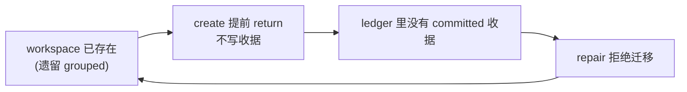

# FLY-1578 Lead cmux 会话被 group 在一起 — 探索

Issue: FLY-1578 (https://linear.app/geoforge3d/issue/FLY-1578/运维修复-14-个-lead-的-cmux-会话被-group-在一起-每个-lead-看到的是别人的窗口)
日期: 2026-07-31
基于: 无

---

## 1. 一句话结论

**「建会话」那条路径已经是对的（FLY-1272 已修，有活证据）；坏掉的是「修会话」那条路径 —— 它检测得出问题、每 25 秒喊一次，但因为一个自锁的授权条件，永远不动手。**

Annie 在 issue 里的判断（「根因是这些会话当初被 group 了，重启只是触发器」）方向正确。但比她写的更精确一层：**当初被 group 的那批，今天本来就有一套自动迁移机制该把它们救回来 —— 那套机制卡死了。** 所以修的落点不是「怎么建」，是「为什么修不动」。

---

## 2. 现场取证（2026-07-31 18:0x，生产机）

### 2.1 症状复现 —— 确认 Annie 的描述

```
$ tmux ls
flywheel:                              14 windows (created Thu Jul 23 10:58:50 2026) (group flywheel)
cmux-flywheel-flywheel-eng-lead:       14 windows (created Sun Jul 26 16:18:51 2026) (group flywheel)
cmux-flywheel-flywheel-cos-lead:       14 windows (created Fri Jul 31 00:55:00 2026) (group flywheel)
cmux-geoforge3d-cos-lead:              14 windows (created Fri Jul 31 00:55:22 2026) (group flywheel)
...（共 13 个 cmux-*-lead 全部 grouped，每个都看得见同一个 14 窗口池）
cmux-personal-assistant-belle-lead:     1 windows (created Fri Jul 31 16:52:26 2026)      ← 没有 group
```

分组名就叫 `flywheel` —— 因为源会话 `flywheel`（装 14 个 Lead 窗口的那个）是这个组的第一个成员。tmux 里 `new-session -t <源>` 就是「加入源所在的会话组」，组内所有成员**共享同一份窗口列表**。所以「活动窗口指针一漂就串台」不是巧合，是这个拓扑的必然结果。

### 2.2 关键对照组 —— belle-lead

`cmux-personal-assistant-belle-lead` 是 16:52 建的（cmux watcher 16:15 恢复之后），**1 个窗口、没有 group**。

这一条把「建会话路径默认 group」的假设直接证伪了：**同一个 watcher、同一份代码、同一台机器，今天下午新建的会话是隔离的。**

（这正是 Annie 在 issue 里问的 scope 第 3 条 —— belle 那个是必然还是偶然。答案：**必然**，见 §3.2 的机制证据。）

### 2.3 watcher 活着，而且每 25 秒抓到一次这个问题

```
$ ps aux | grep cmux-sync
xiaorongli 7580  /bin/bash /Users/xiaorongli/.flywheel/bin/flywheel-cmux-sync --watch   （16:15 起）

$ tail /tmp/flywheel-cmux-watcher.log
[18:11:40] Invariant mismatch: cmux-flywheel-flywheel-eng-lead grouped=1 active=@3036
           members=@3034,@3035,...,@3048 expected=@3036
[18:11:40] WARN: legacy grouped migration refused for flywheel-flywheel-eng-lead; no exact receipt
（13 个 Lead × 每个 tick，一直循环）
```

**检测器已经存在，而且判得完全正确** —— 它报的就是「这个 view 看得见 14 个窗口，应该只看得见 @3036 一个」。13 条 mismatch，belle 一条都没有。

**但下一行就是「拒绝迁移」。** 检测 → 拒绝 → 下一个 tick 重来。永远不收敛。

---

## 3. 根因

### 3.1 自锁的授权条件（真正的根因）

`scripts/flywheel-cmux-sync.sh` 的 `repair_view_invariants()`：

```bash
if [[ "$grouped" == "1" && -z "$owner" && -z "$marker" ]]; then     # 认出「遗留的 grouped view」
  current_refs=$(ledger_refs_for_title "$cmux_generation" "$title")
  if [[ -z "$current_refs" ]]; then
    _alert_cmux_cleanup "cmux legacy grouped migration refused" ...
    continue                                                          # ← 永远走这里
  fi
fi
dismantle_view_display ... && create_or_replace_view_session ...      # ← 永远到不了
```

要动手拆掉一个 grouped view，先要在 ledger（`~/.flywheel/state/cmux-view-ledger`）里找到一张**当前 cmux 代次的 committed 收据**，证明「这个 cmux 标签页是我建的、归我管」。

**而收据只在「创建 workspace」时写。** `create_workspace_for_window()` 一开头就是：

```bash
if <该 title 的 workspace 已存在>; then
  return 0        # already exists, nothing to create   ← 直接返回，不写收据
fi
```

于是形成闭环死锁：



**唯一能写收据的动作，恰好被「已经存在」跳过了。** 遗留 grouped view 因此永远拿不到自己的授权，永远修不了。

### 3.2 账本实证 —— 死锁的直接证据

```
$ grep '^committed' ~/.flywheel/state/cmux-view-ledger
committed|<gen>|workspace:564|personal-assistant-belle-lead     ← 只有 belle 有收据
（其余 13 个 Lead title：零行）
```

```
$ cmux --json list-workspaces        （只读）
14 个 lead-titled workspace，refs 551–564，每个 title 恰好 1 个 workspace
```

对上了：

| Lead | cmux workspace | ledger 收据 | tmux 拓扑 | repair |
|---|---|---|---|---|
| `personal-assistant-belle-lead` | workspace:564 | ✅ committed | 隔离，1 窗口 | 不需要 |
| 其余 13 个 | workspace:551–563 | ❌ 无 | grouped，14 窗口 | **每 tick 拒绝** |

belle 有收据是因为它 16:52 才第一次被建出来（走了完整 create 路径）；其余 13 个在 watcher 恢复前就存在，create 每次都提前 return。

### 3.3 为什么「新建的不会被 group」是必然，不是偶然

FLY-1272（2026-07-16 merge）已经把创建路径改成隔离构造：

```bash
if strict_view_enabled; then
  create_or_replace_view_session ...    # 私名 staging → 只 link 一个窗口 → 原子改名
else
  tmux new-session -d -t "$source" -s "$view"   # 旧的 grouped 路径
fi
```

`strict_view_enabled` 默认 on，且生产实测就是走 strict 分支（日志里的 `Invariant mismatch ... expected=` 只有 strict 分支才会打）。belle 的隔离拓扑 + 收据是这条路径跑通的活证据。

**⇒ Cass 那句「至少有两次不同的建法都产生了 grouped 会话 ⇒ 这是建会话路径的默认行为」，结论不成立。** 两批遗留会话（7/26 的 eng-lead、7/31 00:55 的 12 个）都产生于 **watcher 停摆期间**（FLY-1577：watcher 因 bin 漂移长期起不来）。它们是历史沉积，不是当前默认行为的产物。

**⚠️ 诚实标注取证边界**：我**没能**取到 7/31 00:55 那一刻究竟是哪个进程建的这 12 个会话 —— 覆盖那个时间窗的 watcher 日志已被运维清空（FLY-1577 处置时清的 22MB 日志），`/tmp/flywheel-cmux-sync.log` 无时间戳。我能证明的是**当前**创建路径产出隔离 view（belle 对照组 + 机制），不能证明 00:55 那批的确切来源。

这个取证缺口**不影响修复设计** —— 见 §4 的设计原则：修复必须对「谁建的」不可知也成立。

### 3.4 附带发现：生产 env 里躺着一个已经拉下来的回滚拉杆

```
$ grep FLYWHEEL_CMUX ~/.flywheel/.env
FLYWHEEL_CMUX_LINKED_VIEW=0        ← FLY-1272 的回滚拉杆，处于「关闭隔离视图」位
FLYWHEEL_CMUX_VIEW_INVARIANT=1

$ cat ~/.flywheel/state/cmux-flag-state
A0B1|1                              ← 代码自己把这个组合标记为 split-brain 并已告警过一次
```

今天它**没有生效**，因为 `strict_view_enabled()` 是 `LINKED_VIEW || VIEW_INVARIANT` 的或关系（FLY-1364 R6 专门加的兜底，就是为了堵这个 A0B1 组合）。

但这是个**上了膛的枪**：任何一天有人把 `VIEW_INVARIANT` 也设成 0，或者这个 flag 被退役，生产立刻回到「默认建 grouped 会话」。留着它，Cass 的担心就会在未来某天变成真的。

---

## 4. 修复方向（三条，都不加 feature flag）

### 方向 A — 打破死锁：让 repair 能自证权威（核心）

不是「发明权威」，是**换一种同等强度的取证**。当下面这组条件同时成立时，把这个 workspace **收编（adopt）**进 ledger，写一张 committed 收据，然后让现有的 `dismantle → rebuild` 机器照常跑：

1. title `T` 是受管源会话（`flywheel` / `runner-*` / `v2-*`）里一个活窗口的名字；
2. tmux view `cmux-T` 存在、grouped、且没有 `@flywheel_cmux_owner` / placeholder 标记（＝已判定的遗留形态）；
3. cmux 清单**读取成功**（rc=0，不是「空当没有」），且**恰好一个** workspace 带 title `T`。

第 3 条的实测结果：14 个 lead title **每个都恰好 1 个 workspace**，无歧义。

歧义时（≥2 个同 title、或清单读不到）**保持现状：拒绝 + 告警**。原来那个 refusal 保护的是「founder 手建的、pre-upgrade 撞名的标签页别乱拆」—— 这层保护一个字不动。

### 方向 B — 检查器必须验 pane 实际进程（Annie 的硬要求）

现有 `_linked_view_matches()` 只比 tmux 拓扑（grouped / active / members），**不看 pane 里跑的是什么**。Cass 那次「窗口数对、内容全错」正是这类漏检的家族。

要加的断言（对每个受管 view `cmux-T`）：

- `members == {wid}`（唯一窗口）—— 这是区分 grouped/隔离的判别式；
- `pane_pid(cmux-T 的活动 pane) == pane_pid(源会话:wid 的 pane)` —— 证明看的是**同一个 pane 对象**；
- 该 pid 对应的是预期的 Lead 进程，**不是裸 shell** —— 抓「标签页活着但里面是空 zsh」那一类。

并且立一条规矩：**任何「cmux 正常」的断言，不许只由「tmux 窗口数 == cmux workspace 数」得出。**

### 方向 C — 拆掉那根回滚拉杆

从 `~/.flywheel/.env` 删掉 `FLYWHEEL_CMUX_LINKED_VIEW=0`。

删掉后默认值是 1 → A1B1，**与今天的实际行为完全一致**（今天 A0B1 也走 strict），所以是行为中性的改动；同时消掉 split-brain 闩，去掉未来的回滚脚滑风险。这是运维改动，不是加 flag。

---

## 5. 设计原则（从这次事故直接提炼）

1. **修复必须对「谁建的」不可知也成立。** 我没能查清 00:55 那批的来源；正因为如此，方案的价值在于：不管未来什么路径又造出一个 grouped view，检查器会抓到、repair 会收敛。这比追凶更耐用。
2. **能检测但不能收敛，等于没修。** 现在的系统每 25 秒正确地喊一次「串台了」，已经喊了几个小时，Annie 还是踩到了。检测与收敛必须同时具备。
3. **验内容，不验数量。**（Cass 上报的那条教训，落进检查器而不是只落进人脑。）
4. **fail-closed 的拒绝要留逃生口。** 原来的 refusal 是对的，但它没有任何「合法的自证路径」，于是安全变成了永久瘫痪。fail-closed 必须配一条可审计的收编通道。

---

## 6. 与 FLY-1577 的边界（复核后同意 issue 的判断）

| | FLY-1578（本单） | FLY-1577 |
|---|---|---|
| 改哪里 | `flywheel-cmux-sync.sh` 的 repair / 检查器 | `converge-flywheel-bin.sh` 的 `FILES` |
| 职责 | **喊得对、而且喊完能自己修好** | 让告警**送得到人眼前** |

两条独立证据支持不合并：

1. **watcher 起来了也不修。** 现在 watcher 活着（PID 7580，16:15 起）、日志在刷，13 个 grouped view 一个没修好 —— 1577 修好投递不会让这 13 个变回隔离。
2. **改的文件不重叠。** 无依赖，可并行。

不过有一条**真实耦合**要记进 plan：本单产出的告警走 `_alert_cmux_cleanup`，它的**投递链**归 1577。所以本单的验收只能验「告警被产出」，不能验「Annie 收到了」—— 这一点和 issue 里的分工表一致。

---

## 7. 待确认 / 风险

1. **修复期间标签页会闪。** `dismantle → rebuild` 会先关掉 cmux 标签页、下一个 tick 再建回来。13 个一起做 = 侧边栏抖一次。建议**限速**（每 tick 至多 2–3 个）。这是个 founder 可见的副作用，plan 里要写清。
2. **cmux 重启会换代次（generation = socket 的 dev:inode:birthtime），旧收据整批失效。** 收编逻辑必须是常驻能力，不能是一次性迁移脚本 —— 否则每次 cmux 重启后同一个死锁重新武装。
3. **`flywheel` 源会话本身**在 13 个成员拆完后，`tmux ls` 里可能仍显示 `(group flywheel)`（组内仅剩它自己）。这符合 issue 验收标准里「或分组内成员唯一」那一支，QA 不要误判为失败。
4. **ledger 里还有 2 条卡在 `prepared` 的僵尸行**（`workspace:173 geoforge3d-ops-lead`、`workspace:175 tidal-echo-tidal-echo-cos-lead`，指向已消失的 ref），每 tick 刷 `prepared ledger ref absent ... preserving`。属于同一账本的卫生问题，是否顺手清由 plan 决定（倾向：不扩 scope，但要记录）。
