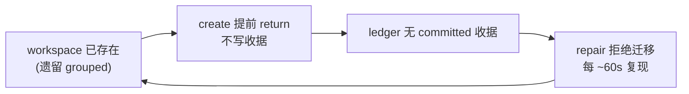
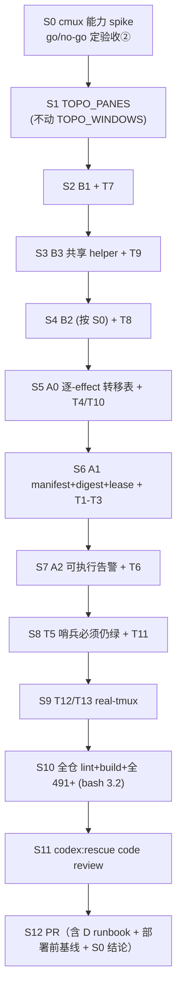

# FLY-1578 Lead cmux 会话被 group 在一起 — 实施计划

Issue: FLY-1578 (https://linear.app/geoforge3d/issue/FLY-1578/运维修复-14-个-lead-的-cmux-会话被-group-在一起-每个-lead-看到的是别人的窗口)
日期: 2026-07-31
基于: exploration.md, research.md

> **修订记录**
> - **v1** 从拓扑证据自动收编权威 → R1 驳回：会把仓库现成的 founder 保护哨兵从「必须保留」翻成「自动销毁」。
> - **v2** founder 批准的 exact migration manifest → R2 驳回：manifest 没冻结 workspace 内部结构；**close 后崩溃造出比现状更糟的死区**；B2 依赖一个 cmux API **不存在**的字段。
> - **v3** 加迁移 WAL + digest + S0 spike → R3 驳回：六个状态**每个都不止一次外部 mutation**，崩在中间仍无救；且我一边承认「无 join key 证明不了 exact view」、一边写「100% 满足验收」，自相矛盾。
> - **v4**：A0 改为**逐外部 effect** 的恢复转移表模板；验收② 改硬 go/no-go；digest 单次读取快照 → R4 驳回：转移表**只是模板，核心恢复算法未设计**。
> - **v5**：写出真正的 M0–M10 转移表 + C0–C5 post-close 分类器 + 三 gate + 单-ref 硬约束 + fd 级 manifest 读取 → R5 驳回：**剩余阻塞项已落到既有共享基建**（见 §17）。
> - **v6**（本文）：记录 R5 结论与未闭合项，交付诊断 + 已验证的方案形态 + 精确的实现前置条件。
> **五轮处置记录见 §13；当前状态与未闭合项见 §17。**

---

## 0. 一句话

**巡检已经每 ~60 秒正确抓到「这个 Lead 看得见别人的窗口」，但因为一个自锁的授权条件永远不动手。**

修法：**founder 批准的、绑死结构指纹的迁移通道 + 一个逐外部-effect 可恢复的迁移状态机**，外加把「验数量」升级成真正可信的证据。**不加 feature flag。**

---

## 1. 根因（已钉死，有铁证）



| 证据 | 位置 |
|---|---|
| create 命中同名即 return，不写收据 | `flywheel-cmux-sync.sh:4838-4845` |
| 正常 create 的收据写点 | `:4974` / `:5023` |
| 无收据即 `continue`（**够不到** `:5234` 的 dismantle） | `:5219-5231` |
| 生产每 tick 复现 13 条 refuse | `/tmp/flywheel-cmux-watcher.log` |
| **健康对照组** belle-lead：有收据、隔离、巡检零告警 | ledger `workspace:564` + `tmux ls` |

对照组是关键：**同一份代码、同一台机器、同一天**，走完整 create 路径的会话是隔离的 ⇒ 创建路径没坏（FLY-1272 已修），坏的是修复路径。

---

## 2. 三条不可逾越的红线（v1/v2/v3 各撞了一条）

### 红线 A — 不能从可变拓扑铸造权威

哨兵 `test-cmux-sync.sh:7693-7724` 构造的**正是** v1 的四条证据，并断言 **零 receipt、零 cmux mutation**。生产代码原话（`:1475-1478`）：Group name / title / pane-dead 是 mutable topology，**can never mint the first close receipt**。

### 红线 B — close 之后崩溃必须能收敛

已复核 `:5219-5231`：close 成功后崩溃 → repair 仍因「markerless grouped + 无 receipt」`continue`，**够不到** `:5234` 的 dismantle；create 又在 ready gate 因仍 grouped 失败；原 manifest 绑定的 ref 已消失无法重跑。⇒ **workspace 已关、grouped 壳还在、建不回来，比不修更糟。**

### 红线 C — 「一个状态一次 mutation」必须逐外部-effect 落实，不能停在高层阶段名

v3 把 `cmux_closed → tmux_escrowed` 当成一个 mutation，但 `escrow_view_session()`（`:4481-4509`）实际是**四步外部/持久操作**：

```
set-option @flywheel_cmux_owner  →  _inventory_upsert prepared
   →  rename-session  →  _inventory_upsert committed
```

**在第一次 `set-option` 成功后、prepared 写入前 SIGKILL** → A0 仍是 `cmux_closed`，canonical session 还在，但 owner 已从 manifest 冻结的空值变成 group 值 → 下一次 frozen snapshot guard **必然拒绝**，inventory 又无任何记录可恢复 ⇒ **新的永久死支**。

`tmux_escrowed → rebuilt` 还嵌着 `create_or_replace_view_session()` 自己的六态 construction WAL（`:3525-3616`）；`rebuilt → consumed` 含 `new-workspace` / prepared receipt / workspace rename / tab rename / ledger commit / surface verify（`:4931-5069`）—— 同样远不止一次 mutation。**crash 在 `new-workspace` 成功后、`:4974` prepared receipt 写入前**，A0 只知道「rebuilt」，ledger 也没有 create provenance。

---

## 3. 变更清单（v6）

| # | 文件 | 类型 | 说明 |
|---|---|---|---|
| **S0** | — | **能力 spike（硬前置 + go/no-go）** | cmux surface ↔ tmux client 有无稳定 join key；固化真实 fixture |
| **A0** | `scripts/flywheel-cmux-sync.sh` | 迁移 WAL + **逐外部-effect 转移表** | 与普通 ledger 完全隔离，普通 repair 永不读 |
| **A1** | `scripts/flywheel-cmux-sync.sh` | `--migrate-grouped-view` / `--resume-migration` | founder 批准的精确迁移通道 |
| **A2** | `scripts/flywheel-cmux-sync.sh` | 改 refuse 分支 | 告警升级为**可执行**候选 |
| **B1** | `scripts/flywheel-cmux-sync.sh` | 改 `_linked_view_matches()` | window/pane object identity |
| **B2** | `scripts/flywheel-cmux-sync.sh` | surface 校验（**接入周期 pass**） | 合同强度由 S0 **go/no-go** 决定 |
| **B3** | 新增共享 helper | process-tree 判据 | **已定选择**：exact `pane_pid` + expected backend，三态 |
| **C** | `scripts/test-cmux-sync.sh` | 新增 `TOPO_PANES`（**不动** `TOPO_WINDOWS`）+ 测试 | §8 |
| **D** | `~/.flywheel/.env`（runbook） | 删 `FLYWHEEL_CMUX_LINKED_VIEW=0` | §9 |

**不改**：`dismantle_view_display`、`create_or_replace_view_session`、`_ledger_*`、`view_mismatch_confirmed`、告警投递、**红线 A 的两条 founder 哨兵（`:7633-7655` / `:7693-7724`，必须继续绿）**。

---

## 4. S0 — 能力 spike（硬前置，**且是 go/no-go**）

### 4.1 为什么必须先做

v2 的 B2 写「验 surface 的 attach target」—— **这个字段不存在**。`workspace_terminal_surface_ref()`（`:2229-2250`）只读 `ref`/`type`/`selected`；`:2218-2228` 的注释已把「surface title 是**当前前台进程**，不是 create-time `--command`」写成过 FLY-169 spike 结论。且 `client_count(cmux-T)>0` 与「workspace W 有 selected terminal surface」是**两个无法关联的存在性事实**。

### 4.2 spike 要回答的问题

1. 用真实 `cmux --json list-pane-surfaces` / `surface-health` + `tmux list-clients`，有没有稳定 join key（surface 终端 PID/TTY ↔ tmux client PID/TTY）？
2. inventory 是否返回 **inactive / hidden 的全部** pane/surface？（否则 §5.2 的「完整结构」没有证据）
3. 是否支持 `--id-format both`（UUID）？**不许未经 spike 就假设短 ref 在同一 generation 内不复用。**

产出：真实 JSON fixture 落盘；测试只 mock 真实 API 能返回的字段。

### 4.3 三个**独立** gate（R4#4：join key 只决定验收②，另两项决定**能不能做破坏性迁移**）

| gate | 问题 | 失败后果 |
|---|---|---|
| **G1 exact-view join key** | surface ↔ tmux client 有稳定 join key？ | **不得声明验收② 通过**；迁移与检测照常交付，但 **ship gate blocked**，直到 (a) Annie/Eng Lead 改验收，或 (b) 提供独立 witness |
| **G2 完整 containment inventory** | inventory 是否枚举**全部** inactive/hidden pane/surface？ | **block 一切破坏性迁移**。否则 founder 在目标内加一个 hidden browser surface，指纹仍可能逐字相等 → `close-workspace` 把它一起销毁 |
| **G3 稳定 object identity** | 支持 UUID（`--id-format both`）？若否，短 ref 在同一 generation 内**实证**不复用？ | **block 一切破坏性迁移**。否则旧 approval 可能命中新对象 |

> G2/G3 失败是 **block migration**，不只是 block 验收② —— 这是 R4#4 的核心更正。

**G1 失败时的替代 witness（候选）**：QA 给 exact expected view 临时设一个 session-scoped **challenge nonce**，再从 exact cmux workspace/surface `read-screen` 观察到该 nonce，随后恢复设置。若也不可行，只能 founder 逐 tab 视觉验收，并**明写这是人工证据**。

**(b) 的候选做法**：QA 给 exact expected view 临时设一个 session-scoped **challenge nonce**，再从 exact cmux workspace/surface `read-screen` 观察到该 nonce，随后恢复设置。若这条也不可行，则只能 founder 逐 tab 视觉验收，并**明写这是人工证据**。

> v3 一边承认「无 join key 证明不了 cmux 显示的是这个 view」、一边写「Annie 核心诉求 100% 满足」—— 自相矛盾。**该 overclaim 已删除。**

---

## 5. A0/A1 — 迁移状态机 + 精确授权通道

### 5.1 manifest：canonical JSONL + 单次读取快照 + founder digest

| 字段 | 说明 |
|---|---|
| `schema_version` | 版本演进 |
| `title` | 受管窗口名 |
| `cmux_generation` / `tmux_generation` | 双代次 |
| `view_snapshot` | **完整**：`session_id`/`grouped`/**`active`**/`owner`/`marker`/`members`/**`session_group`** |
| `source_record` + `source_snapshot` | source + wid + 源会话完整快照 |
| `same_title_refs[]` | 当前**全部**同名 ref，**canonical sort**，**每个 ref 各带自己的 fingerprint** |
| `targets` | **恰好一个**销毁目标（见 §5.2） |

**单-ref 硬约束（R4#3）**：静态 preflight **强制 `same_title_refs == [target]`**；**多 ref 一律 preserve / block**，要求新的 founder manifest/protocol。

> 理由：若同名 refs = `{A,B}` 而只授权 close A，A 关掉后 B 仍在 → rebuild 段的 `create_workspace_for_window` 会因发现同名 workspace 直接 return（`:4838-4845`），M8 永远到不了；强行 `new-workspace` 又造出第三个同名对象；而自动挑用 B 等于把**未列入 targets 的 founder workspace** 当成迁移承载面。生产今天本来就是一 title 一 ref ⇒ **本单不发明多-ref winner 选择**。

**digest TOCTOU（R3#5 + R4#6）**：`shasum <path>` 后 Python 再 `open(path)`、或先 `-f`/`-L` 检查再普通 `open`，中间都可被换成 symlink / 原地改写。

⇒ 精确实现为：

```
os.open(path, O_RDONLY | O_NOFOLLOW | O_CLOEXEC)
  → 只对该 fd 做 fstat：验 regular + size 上限
  → bounded single read 到一份 bytes
  → hash / 64-hex digest 比对 / JSONL parse / canonical byte comparison  全部针对同一份 bytes
```

- **digest 通过前不输出任何执行记录**。
- canonical form 精确定义：UTF-8、key sort、separators、line order、末尾换行。
- `json.load(..., object_pairs_hook=...)` **拒绝 duplicate JSON key**。
- 后续只消费**内存/管道中**的 canonical snapshot，**绝不**重开原 manifest，也不落到可写临时路径再读回。

**整份 manifest 静态 preflight 全过，才允许写第一条 `approved` WAL**（JSON/schema、canonical encoding、duplicate title/row、target 唯一性、字段字符、digest）。⇒ 「第 2 行非法而第 1 行有效 → 全局零 mutation」（T1）。运行时 topology drift 可造成**已审计的**部分完成；静态错误**不许**伪装成允许 partial execution。

### 5.2 `structure_fingerprint`：包含什么、**排除**什么

**排除 `selected`（R3#4）** —— 它是用户切 tab/surface 的焦点状态，不改变 `close-workspace` 的销毁范围；放进指纹会让 founder 在批准与执行之间**普通点一下 tab 就误拒**。

| 包含 | 排除 |
|---|---|
| workspace UUID/ref | workspace/surface 的 `selected` / focus |
| 全部 pane UUID/ref | foreground title |
| 全部 surface UUID/ref + `type` | screen 内容 |
| surface→pane→workspace parent relation | **顺序**（见下） |
| 集合**数量** | |

- **默认把集合视为无序**：按 `(UUID/ref, parent key)` **canonical sort** 后比较。**只有** spike 证明某个顺序改变销毁范围时才把顺序纳入 —— 否则 API 返回顺序或用户重排会造成无意义拒绝（R4#4）。
- 若 G3 证明支持 UUID，**同时**绑 UUID。

⇒ founder 新增或移入任何 surface/pane 会改变对象集合 / parent graph（**被抓到**）；正常前台进程与焦点变化不会（**不误拒**）。

**`targets` 恰好一个（R3#2）**：生产今天一 title 一 ref，不等于 schema 可以留歧义。每票每行只授权销毁一个目标。

### 5.3 A0 — 逐外部-effect 的恢复转移表（关红线 B + C）

**与普通 ledger 完全隔离；`repair_view_invariants` / `dismantle_view_display` / 任何普通 reader 永不读。**

#### 5.3.0 两个先定死的决定（R4#1 要求不许再留二选一）

1. **construction WAL = 委派，不组合。** `create_or_replace_view_session()` 自带六态 WAL（`create_intent|created|link_intent|linked|claim_intent|claimed_complete`，`:4656-4753`），且 `recover_view_construction()`（`:3525-3616`）已经能独立对账、并 GC stale-generation 记录。⇒ 迁移**不进入**该 WAL，只记一条 `rebuild_intent` 并观测其 postcondition；崩溃时由现有 recover 自行收敛。**handoff 证明**：迁移的 M6 恢复判别只用 `_linked_view_matches`（外部可观测），与构造 WAL 内部状态无关。
2. **surface verify 必须纯只读。** 已复核 `self_heal_workspace_ref()`（`:2488-2526`）会经 `heal_send_attach` **向 surface 打字**——那是 mutation 不是 verify。⇒ 迁移的 M8 **禁止**调用它，只做只读观测。

#### 5.3.1 转移表（每行 = 一个外部 effect 或一次持久写）

冻结量（来自 manifest，全程不变）：`title` `view=cmux-<title>` `sid` `group` `source` `wid` `cmux_gen` `tmux_gen` `target_ref` `fingerprint`。
**keeper 名可由冻结量确定性推出**：`keeper = fwkeeper-${sid#$}-${view}`（`:4497` 同式）——这是 M4 之后仍可恢复的关键。

| 状态 | 先持久化的 intent | 唯一外部 effect | success postcondition | **effect 成功但 state 未推进的恢复判别** | generation drift |
|---|---|---|---|---|---|
| M0 `approved` | manifest 全量 preflight 通过 | 无 | WAL 有 M0 | — | 任一 gen ≠ 冻结 → §5.3.2 |
| M1 `close_intent` | 冻结量 + `target_ref` | `close-workspace <target_ref>` | inventory 中 `target_ref` 消失 | `target_ref` 已不在 inventory ⇒ 当作 M2 | cmux_gen 变 → §5.3.2 C1 |
| M2 `cmux_closed` | — | 无 | — | — | — |
| M3 `owner_claim_intent` | `group` | `set-option -t "=$view:" @flywheel_cmux_owner <group>` | `show-options -v @flywheel_cmux_owner == group` | `view` 仍在、`grouped=1`、`owner == group`（**恰等于 session_group，非任意值**）⇒ 当作 M4 | tmux_gen 变 → §5.3.2 C2 |
| M4 `owner_claimed` | — | 无（持久写）`_inventory_upsert … prepared` | inventory 有 prepared 行 | prepared 行存在 ⇒ 当作 M5 | 同上 |
| M5 `rename_intent` | `keeper` | `rename-session -t "=$view" <keeper>` | `snapshot(keeper).sid == sid` **且** `linked_session_exists(view) == false` | `keeper` 存在且 sid 相符、`view` 不存在 ⇒ 当作 M6 | 同上 |
| M6 `renamed` | — | 无（持久写）`_inventory_upsert … committed` | inventory 有 committed 行 | committed 行存在 ⇒ 当作 M7 | 同上 |
| M7 `rebuild_intent` | `source` `wid` `title` | `create_or_replace_view_session`（**委派，内部自带 WAL**） | `_linked_view_matches(view, wid, source)` 通过 | 该断言已通过 ⇒ 当作 M8；构造 WAL 残留交 `recover_view_construction` | tmux_gen 变 → §5.3.2 C2 |
| M8 `view_rebuilt` | `title` | stock `create_workspace_for_window`（自带 prepared/commit 收据，`:4974`/`:5023`） | 恰好一个 title==T 的 workspace **且**有当代 committed 收据 | 该条件已成立 ⇒ 当作 M9 | cmux_gen 变 → §5.3.2 C1 |
| M9 `workspace_rebuilt` | — | 无（**纯只读** B1 + B2 verify） | 断言通过 | — | — |
| M10 `consumed` | — | — | 终态 | — | — |
| — `handoff_to_reconcile` | — | — | **终态，不携带任何 authority** | — | 允许恢复 watcher |

> 每个 M(n) 的恢复判别都只用**外部可观测量**，不依赖「我记得我做过」。

#### 5.3.2 post-close 分类器（优先级有序、穷尽、互斥；首个匹配即生效）

| 序 | 条件 | 处置 |
|---|---|---|
| **C0** | 任一必需读取 unreadable / ambiguous / duplicate exact record | **block**（fail closed） |
| **C1** | `cmux_gen` ≠ 冻结 | **绝不**把旧 approval 转给新 ref。tmux 侧若已终态 → `handoff_to_reconcile`；否则 **block** |
| **C2** | `tmux_gen` ≠ 冻结 | 旧 tmux 对象不可能存活 ⇒ 跳过余下 teardown → `handoff_to_reconcile` |
| **C3** | 冻结 `sid` **存在** | C3a 名为 `view` 且快照 == 冻结 → 按记录状态续跑<br>C3b 名为 `keeper`（期望值）→ 当作 M6<br>C3c 名为其它，或快照漂移且**不等于任何已知 effect postcondition** → **block** |
| **C4** | 冻结 `sid` **不存在** | C4a 且**无**任何名为 `view` 的会话 → teardown 视为已完成，续跑<br>C4b 有名为 `view` 但 **sid 不同** → **preserve / block**（foreign） |
| **C5** | 以上通过后看 source | 冻结 `source`+`wid` 唯一且存活 → 进 rebuild；source 缺失或非唯一 → `handoff_to_reconcile` |

**C3 先于 C4** 消除了 R4#2 指出的「old sid 不存在」与「同名不同 sid」可同时成立的重叠：exact-SID 先判，再判同名。

**`handoff_to_reconcile` 是终态**，因此 §5.4「nonterminal WAL 存在时不得恢复 watcher」不会把这条分支锁死（R4#2 指出的不可达问题由此关闭）—— 它交回普通 create 对**当前**受管 source 重建，且不带旧权威。

#### 5.3.3 T4 注入矩阵（四类 × 每个 effect 行）

1. intent 已写、effect **未**执行
2. effect 返回**失败**
3. postcondition 读取 **unknown**
4. effect 成功、**advance 写失败**

断言：**safety（无新 manifest 不拆任何东西）AND 最终可恢复性（能继续收敛到 M10 或 `handoff_to_reconcile`）**。

### 5.4 A1 执行入口与 rollout（关 lease 问题，R3#7）

`run_mutator_once` 在 busy/malformed 时 **`return 0`**（`:6583-6595`）→ operator 拿到**假成功**。且 `wait_for_watcher_exit()` 对 survivor 发 KILL 后**立即 `return 0`**（`:6652-6657`），没有最后一次 process-absence readback；SIGKILL 不跑 lease release trap ⇒ **lease 目录会 stale**，而 `--probe-lease` 对 owner mismatch 按设计返回 2，**不会**证明「已退出且 lease 可用」。

**rollout 顺序（写进 runbook）**：

1. bootout / stop watcher
2. wait helper **最终两次稳定 census 证明 watcher absent**（**需修** helper：KILL 后补 readback）
3. migration **自己**用 `acquire_mutator_lease migrate` 的 stale-rebuild 协议取得 lease
   —— **不要**指望一个只读 probe 去清 stale lease
4. 执行 migration
5. **任何 nonterminal WAL 存在时，不得自动恢复 watcher**（否则普通 repair 会与半完成的 owner/inventory/construction 状态交互）

**登记面**：`migrate` 要加进 lease mode allowlist（`:6150`、`:6453`）**以及** `_mutator_command_matches()` 的 census verb allowlist（`:6199-6202`）。

**退出码**：busy / malformed lease / 任一行失败 / 部分完成 → **非零**，绝不沿用 skip-but-success。逐行 audit + consumption receipt。

**`--resume-migration`**：只读已批准 WAL 继续推进，**不重新转移 authority**。

### 5.5 双采集顺序（A2 出候选 与 A1 final guard 同一套）

repair 的 tmux 快照在 `:5185-5206` 建立，ref/generation 到 refuse 分支才查 → 直接拼告警会**混合两个从未同时成立的时点**。现有 `_ledger_close_guard()`（`:3909-3924`）特意在 extra guard 后重读 ref/title，就是为了关这个窗口。

```
cmux generation + exact workspace/surface fingerprint
  → tmux generation + exact source/view/group/pane snapshot
  → tmux re-pin
  → cmux exact fingerprint re-read + generation re-pin
```

前后逐字相等才算数。A1 在 `cmux_call_guarded` 内重复同序，**exact cmux re-read 是真正 close 前的最后一组证据**；tmux teardown 用独立 `tmux_call_guarded` + frozen tuple。

---

## 6. B — 检查器

### 6.1 已验证的两个错误（保留记录）

1. `pane_current_command` **不是可靠身份信号** —— `flywheel-daemon.sh:438-469` 生产实证：健康 Claude pane 报**裸版本号**（如 `2.1.170`），字符串匹配漏掉**每一个真实 Lead**，**process tree 才可靠**。
2. `_linked_view_matches` 是 tmux 侧 helper，create ready gate 在 workspace 还不存在时就调用（`:4882-4888`），**看不到 cmux 显示什么**。

### 6.2 B1 — tmux 侧：window/pane object identity

```
members == {wid}                        （已有）抓本 issue 的串台
pane_pid(view:wid) == pane_pid(源:wid)   同一个 pane object
pane_dead == 0
```

**不加** shell denylist。grouped 与 isolated 共享同一批 window/pane object ⇒ `pane_pid` 相等**无法单独区分**，判别式是 `members` 唯一性。

**多 pane 处理**：`display-message -t '=s:@wid' '#{pane_pid}'` 返回该 window 的 **active pane**。⇒ B1 明确要求 `#{window_panes} == 1`，否则 **fail closed**（不猜）。

### 6.3 B2 — cmux 侧

- 合同强度按 **S0 go/no-go**（§4.3）。
- **必须接入周期 invariant pass**，不能只在 post-create —— cmux app 重启时既有同名 workspace 命中 `:4838-4845` early return，只放 post-create 恰好**漏掉验收② 的重启场景**。
- **三态 rc**：通过 / 判定失败 / **探测不确定 → fail closed**。
- **unknown 不得报成 mismatch，也不得报成健康**；且**不得每 60 秒告警风暴**（沿用现有 transition-only / episode latch 风格）。
  > 现有代码已记录：app reopen 后未渲染的 surface 会让 `read-screen` 失败（`:2531-2534`）—— 这正是 unknown 的常见来源。

### 6.4 B3 — 选择**现在就定**（R3#8）

抽出 **Bash 3.2-safe、无全局副作用、三态 rc** 的共享 helper，输入为 **exact `pane_pid` + expected backend**；expected backend 从当前受管 roster **fail-closed** 解析。

- **`unknown` / 不支持的 backend → unknown，不是健康。**
- **不许**把空 backend 默认成「已证明的 Claude」。
- **不许**用 `claude_pane_evidence` 的 name-substring 全 server 扫描代替 exact PID 证明。
- T9 需覆盖 **PID 复用**、以及**进程在 `ps → pgrep` 之间退出**的 unknown 分支。

（现状：`process_tree_has_claude` / `claude_pane_evidence` 在可执行脚本 `flywheel-daemon.sh:416-471`，不在共享库，整份 source 会引入 `set -euo pipefail` 与一堆全局变量。）

### 6.5 立一条规矩

**任何「cmux 正常」的断言，不许只由「tmux 窗口数 == cmux workspace 数」得出，也不许只由 `pane_current_command` 字符串得出。** 用测试锁住，不是写注释。

---

## 7. A2 — 让告警可执行

refuse 的**行为逐字不变**（`continue`、零 mutation、保留候选）。只把内容升级为 canonical manifest 候选（§5.1 全字段 + 结构指纹），按 §5.5 双采集产出。

> 投递链归 FLY-1577。本单只保证**告警被产出且内容可执行**。

---

## 8. C — 测试

### 8.1 mock：新增 `TOPO_PANES`，**不动** `TOPO_WINDOWS`

`TOPO_WINDOWS` 固定五列（`:104-123`），多处五变量 `IFS='|' read`（`:209-220`、`:299`、`:336-337`）。追加字段会让 `dead` 变成 `0|4242|2.1.170` ⇒ 破坏现有 491 测试。

**schema（R3#6 + R4#5）**：`wid → active_pane_id` 还不够 —— 没有 membership 就算不出 `#{window_panes}`，也造不出 multi-pane 夹具。**两张表**：

```
TOPO_WINDOW_PANES:  wid | pane_id | active      ← membership，算 window_panes / active pane
TOPO_PANES:         pane_id | pane_pid | pane_dead
```

- **`TOPO_PANES` 是 `pane_dead` 的唯一 oracle**（**现在就定**，不留给实现者）。旧 `TOPO_WINDOWS` 第五列保留为兼容输入/占位，但所有 mock read **必须从 active pane record 派生**。
- 缺行 / 多个 active / 悬空 membership → **一律 fail closed**。
- `topo_add_window` 首见 wid 用 **deterministic 默认值**初始化；**再次见到同 wid 必须复用**，并**拒绝**冲突的显式 pane 参数（不静默覆盖）。
- **GC 顺序**：先删 window reference → 全局无该 wid reference 时才删 membership → 无 membership 时才删 pane。挂在 `topo_reset` / `topo_remove_session` / `kill-session` / `unlink-window` / `kill-window`，且在改 `TOPO_WINDOWS` **之后**。
- **group/link/rename 不得复制或删除 pane identity**（这样 T11 才真的在验 shared window object，而不是只验一张 PID 映射表）。
- `display-message` 格式白名单（`:278-310`）加新格式 —— 否则走 `*)` 兜底打印窗口名，断言**静默通过**。
- **禁止**「同 wid 在两 session 不同 `pane_pid`」夹具（真实 tmux link/group 共享同一 window object，这种夹具让 **mock 比生产更宽**）。wrong target 用**不同 wid / members** 测。
- `TOPO_JOURNAL` 在**入口**记录每条命令（`:167-170`，含只读）⇒ 拒绝路径只能 grep **mutation verb**。

### 8.2 测试表

| # | 层 | 测试 | 断言 |
|---|---|---|---|
| T1 | mock | manifest 字段漂移 / digest 不符 / **第 2 行非法第 1 行有效** | **全局零 mutation**（静态错误不许 partial） |
| T2 | mock | manifest 全对 | 恰好一次 exact-ref close，**无普通 committed 收据** |
| T3 | mock | **结构指纹漂移**（founder 加了第二个 surface）／**仅 `selected` 变化** | 前者中止；**后者不得误拒** |
| T4 | mock | **真子进程 SIGKILL** × **每个外部 effect 成功后、WAL 写入前** | safety **AND 最终可恢复性** |
| T5 | mock | **红线 A 两条 founder 哨兵原样跑** | **仍然绿** |
| T6 | mock | A2 候选内容 + 双采集一致 | canonical 全字段 |
| T7 | mock | B1：wrong wid / dead pane / grouped / `window_panes>1` | 各自报警或 fail closed |
| T8 | mock | B2（**只 mock 真实 API 字段**）+ unknown 分支 | 按 S0 结论；unknown 既非健康也非 mismatch，无告警风暴 |
| T9 | mock | B3：版本号 command + 树命中 / 树查询失败 / 活的裸 shell / 错 backend / **PID 复用** / **ps→pgrep 间退出** | 六种分别正确 |
| T10 | mock | 双采集 + **post-close 漂移六分类**（§5.3） | 全部按表处置 |
| T11 | mock | `TOPO_PANES` lifecycle | source kill 但 view 持 wid → pane 保留；最后 view 删除 → GC；rename/group/link → identity 不变；missing pane row → **read fail closed** |
| T12 | real-tmux | 真 grouped → 走 manifest → 收敛 `grouped=0 && members=={wid}` | 补充层 |
| T13 | real-tmux | **违反注入（验收④）** | 抓到并产出告警 |

**分层是硬要求**：唯一真 tmux 段（`:1503-1541`，`command tmux -S`）在受限环境**会 skip**（Codex 评审环境即因 `Operation not permitted` skip）⇒ **T1–T11 全在 mock 层**；T12/T13 放 real-tmux，**真机 QA 必须确认未 skip**。

改完必须在 **`/bin/bash` 3.2** 下跑**全部 491+**，不只跑新测试。

---

## 9. D — 运维：删掉回滚拉杆

删 `~/.flywheel/.env:136` 的 `FLYWHEEL_CMUX_LINKED_VIEW=0`。所有分支都用 `linked_view_enabled || view_invariant_enabled`，`strict_view_enabled()` 也是这个 OR（`:3233-3244`）⇒ 在 `VIEW_INVARIANT=1` 下删除只把旗标从 `A0B1` 收敛成 `A1B1`，**行为中性**；同时消掉 `cmux-flag-state` 的 `A0B1|1` 闩。

不删的风险：任何一天 `VIEW_INVARIANT` 被设 0 或该 flag 退役，生产立刻回到「默认建 grouped 会话」。

**deploy runbook 步骤，不是 repo 改动**（靠 PR 描述留痕）。

---

## 10. 执行顺序



**S0 是硬前置且是 go/no-go** —— 不先摸清 cmux API，B2 只能编字段（v2 就是这么错的），验收② 也无从判定。
**S1 必须在 B 之前** —— 不先扩 mock，B1/B2 的测试会走兜底假绿。

**before 基线是部署前置**，放在「首次执行 manifest 迁移之前立刻执行」的 rollout gate：exact refs、tmux/cmux generations、session IDs、完整快照、workspace/surface 清单、watcher version/HEAD。

---

## 11. 验收标准映射

| issue 验收 | 怎么验 | 状态 |
|---|---|---|
| ① 各自只看得见自己那一个窗口 | 迁移后每个 view `members` 单元素 | 可达 |
| ② 真实重启后仍 14/14，**按 pane 实际进程验** | `pane_pid` 与源窗口比对 + **B2**（强度按 S0）+ 对 exact PID 跑 process-tree；不看窗口名、不看 `pane_current_command` 字符串 | **⚠️ 取决于 S0 go/no-go（§4.3）** |
| ③ 检查器上线，能主动抓到串台 | T7/T8 + 生产 refuse 行归零 | 可达 |
| ④ 手工 group → 抓到并产出告警 | T13 + 真机注入 | 可达 |

### 11.1 QA 判读陷阱（四条）

1. **`flywheel` 源会话自己可能仍显示 `(group flywheel)`**（组内仅剩它一个）—— 符合验收① 的「或分组内成员唯一」一支。**判据看成员数，不看有没有 group 字样。**
2. **验收④ 只验「告警被产出」**，不验「Annie 收到了」（投递链归 FLY-1577）。
3. **real-tmux 段在受限环境会 skip** —— 必须确认 T12/T13 **实际执行了**，不是 skip 后当绿。
4. **验收② 以 S0 结论为准**。若无 join key，**不许**在 QA 报告里写「验收② 通过」；写明只证明了什么、没证明什么，并按 §4.3 走 blocked ship gate。

---

## 12. 风险

| 风险 | 缓解 |
|---|---|
| 误伤 founder 手建/扩充的 workspace | 不自动收编；冻结**结构指纹**（含 parent graph，排除 focus）+ founder digest；close 前重算逐字比对；红线 A 哨兵保持绿 |
| close 后崩溃卡死 | A0 **逐外部-effect** 转移表 + post-close 六分类；T4 在每个 effect 后注入 SIGKILL |
| 崩在 effect 与 WAL 之间（红线 C） | 每行必须写「effect 成功但 state 未推进」的恢复判别；优先用单-effect primitive |
| 假 authority 泄漏给普通 reader | 迁移 WAL 与普通 ledger **完全隔离** |
| operator 拿到假成功 | 不复用 `run_mutator_once`；修 `wait_for_watcher_exit` readback；migration 自取 lease；任何失败非零退出 |
| 编造不存在的 API 字段 | S0 spike 前置；没有 join key 就 **blocked**，不假装通过 |
| 扩 mock 破坏 491 测试 | 不动 `TOPO_WINDOWS`；`TOPO_PANES` 走可选参数 + 兼容默认值 + 明确 GC/oracle |
| mock 比生产更宽（假绿） | 禁「同 wid 不同 pane_pid」夹具 |
| 焦点变化造成误拒 | 指纹**排除** `selected`/focus/foreground title |
| unknown 告警风暴 | 三态 rc + transition-only/episode latch |

---

## 13. Codex Design Review 处置记录（R1/R2/R3 共 22 项，**全部接受，零驳回**）

### R1（7 项，5 项独立复核原始证据）
| # | 结论 | 复核 |
|---|---|---|
| 1 HIGH | C1–C4 翻转 founder 哨兵 | ✅ `test-cmux-sync.sh:7693-7724` + `:1475-1478` → **方案重做** |
| 2 HIGH | 写收据→dismantle 非 crash-safe | ✅ → 不产生中间收据 |
| 3 HIGH | 没验 cmux 实际显示；`pane_current_command` 不可靠 | ✅ `flywheel-daemon.sh:438-469`（裸版本号 `2.1.170`）|
| 4 MEDIUM | 测试分层与 harness 实况不符 | ✅ `:165-172,278-312,405-412`（白名单 + `*)` 兜底 → 静默假绿）|
| 5 MEDIUM | cadence 不是 25s；repair/create 同 pass | ✅ `:5888-5945`（15s tick，`tick%4` ⇒ ~60s）+ `:5790-5828` → **删限速** |
| 6 MEDIUM | `cmux_socket_identity()` 的 `\|\| true` 使 rc 恒 0 | ✅ `:2579-2583`（**现有代码同处同病**）|
| 7 LOW | baseline 是部署前置 | ✅ 移到 rollout gate |

### R2（7 项，4 项独立复核）
| # | 结论 | 复核 |
|---|---|---|
| 1 HIGH | manifest 没冻结内部结构、没绑 digest | → §5.1/§5.2 |
| 2 HIGH | **close 后崩溃造出不可恢复死区** | ✅ `:5219-5231` 够不到 `:5234` → 红线 B |
| 3 HIGH | B2 依赖**不存在**的 attach-target 字段 | ✅ `:2218-2252` → **S0 前置** |
| 4 HIGH | A1 无可执行入口（`run_mutator_once` 吞 busy 返 0）| ✅ `:6583-6595` → §5.4 |
| 5 MEDIUM | 缺 coherent double-collect | → §5.5 |
| 6 MEDIUM | 扩 `TOPO_WINDOWS` 破坏 491；wrong-pane 夹具让 mock 比生产宽 | ✅ `:104-123,209-220` → §8.1 |
| 7 MEDIUM | process-tree helper 不可直接复用 | → §6.4 |

### R3（8 项）
| # | 结论 | 处置 |
|---|---|---|
| 1 HIGH | 六个状态**每个都不止一次外部 mutation**；escrow 第一次 `set-option` 后崩溃无救 | → 红线 C + §5.3 逐-effect 转移表；T4 改注入点 |
| 2 HIGH | post-close 漂移与多 ref 语义未定义 | → §5.2 `targets` 恰好一个 + §5.3 六分类 |
| 3 HIGH | **无 join key 时「诚实披露」≠ 满足验收②**，且 plan 自相矛盾 | → §4.3 硬 go/no-go；**删掉「100% 满足」overclaim** |
| 4 MEDIUM | 指纹应排除 `selected`，并绑完整 containment graph | → §5.2 |
| 5 HIGH | digest hash→reopen TOCTOU；静态错误须全局 preflight | → §5.1 单次读取快照 + T1 |
| 6 MEDIUM | `TOPO_PANES` 只按 wid 索引隐含「一 window 一 pane」；GC 未覆盖全 | → §8.1 双层 schema + GC + oracle；§6.2 `window_panes==1` fail closed |
| 7 MEDIUM | `wait_for_watcher_exit` KILL 后无 readback；probe 不清 stale lease；census allowlist 漏 | → §5.4 |
| 8 MEDIUM | B3 二选一不能拖到 PR | → §6.4 **已定**：exact PID + expected backend 共享 helper |

### R4（6 项）
| # | 结论 | 处置 |
|---|---|---|
| 1 HIGH | §5.3 只有表格模板，**核心恢复算法未设计** | → §5.3.1 写出**真正的**十一行转移表；§5.3.0 **定死**两个决定（construction WAL **委派**不组合；surface verify **纯只读**，因已复核 `self_heal_workspace_ref():2488-2526` 会打字=mutation）；§5.3.3 四类注入 |
| 2 HIGH | post-close 六分类不完备、不互斥、有不可达分支 | → §5.3.2 优先级有序 C0–C5 分类器 + 终态 `handoff_to_reconcile`（解开「nonterminal WAL 阻止 watcher 恢复」的死锁） |
| 3 HIGH | `same_title_refs` 可多项而 `targets` 只一个 → 迁移不收敛 | → §5.1 静态 preflight **强制 `same_title_refs == [target]`**，多 ref 一律 block |
| 4 HIGH | S0 只把 join key 设 gate；inventory 完整性与 identity 稳定性无失败分支 | → §4.3 拆成 **G1/G2/G3 三个独立 gate**，G2/G3 失败 **block migration** 而不只是 block 验收②；指纹集合默认**无序** |
| 5 HIGH | 双层 schema 表达不了 `window_panes>1`；`pane_dead` oracle 未选 | → §8.1 `TOPO_WINDOW_PANES` + `TOPO_PANES`，**现在就定** `TOPO_PANES` 为唯一 dead oracle，GC 三级顺序 |
| 6 MEDIUM | 单次 open 仍需 fd 级约束才真正关掉 TOCTOU | → §5.1 `os.open(O_RDONLY\|O_NOFOLLOW\|O_CLOEXEC)` + fstat + bounded single read + 同一 bytes 上做全部校验 + 拒 duplicate JSON key + 绝不重开 |

**四轮共 28 项，全部接受、零驳回；每轮 findings 都是新的更深层问题，不是重复 —— 复核在收敛。**

---

## 14. 明确不做

- ❌ 不并进 FLY-1577（watcher 现在活着且日志在刷，13 个仍全 grouped —— 「修投递不修收敛」的反证）
- ❌ 不做「重启后 select-window 切回来」的补丁
- ❌ 不加 feature flag（D 是**删**一个已有 override）
- ❌ **不从名称/拓扑自动铸造权威**（红线 A）
- ❌ **不做「close 完就指望现有 teardown 收尾」**（红线 B）
- ❌ **不把多-effect 段落当成一个状态**（红线 C）
- ❌ 不动 `dismantle_view_display` / `create_or_replace_view_session` / `_ledger_*` / `view_mismatch_confirmed` / `TOPO_WINDOWS` 五列
- ❌ 不用 `pane_current_command` 字符串判 agent 身份
- ❌ **不在无 join key 时宣称验收② 通过**
- ⏸️ 账本 2 条 `prepared` 僵尸行（`workspace:173`/`175`）—— 本单不扩 scope，建议单开
- ⏸️ **永久全自动化**需先引入 create-time immutable producer stamp —— 建议单开

---

## 15. 需要 Tadashi / Annie 知道的两件事

1. **issue 期待全自动自愈；本方案交付「自动检测 + 一条 founder 批准的迁移命令」。** 降级理由是红线 A：全自动会销毁 founder 自己的 cmux 标签页，且违反 founder-only-authority；仓库有哨兵专门守着。
2. **验收②「按 pane 实际进程验」能否达成，取决于 S0 spike。** 若 cmux API 没有 surface↔tmux client 的 join key，本单**不得宣称验收② 通过**，ship gate 需 blocked，直到 Annie/Eng Lead 改验收或接受替代 witness（§4.3）。
   > v3 曾写「Annie 核心诉求 100% 满足」—— 与同页的技术事实矛盾，**已删除**。

两条均已通过 flywheel-comm ask 非阻塞报给 Tadashi。

---

## 17. 当前状态与未闭合项（**交接给实现节点的真实边界**）

### 17.1 设计评审状态：**未 APPROVED**

五轮 Codex design review（xhigh），**34 项 findings 全部接受、零驳回**，仍是 `CHANGES REQUESTED`。

**没有伪造 APPROVED，也没有写 gate 结果文件。** 收敛是真实的（R1 架构 → R2 崩溃安全 → R3 粒度 → R4 算法本体 → R5 基建前置），但尚未到零 finding。

### 17.2 R5 的关键结论：**剩余阻塞项已经落到既有共享基建，不再是本 plan 的措辞问题**

| # | 阻塞项 | 性质 |
|---|---|---|
| R5#2 | `_inventory_upsert`（`:4241-4255`）先 `mkdir .lock` → `mv` → `rmdir`。SIGKILL 落在中间会留下 **stale lock**，之后每次 M4/M6 与 `reconcile_keeper_inventory()` 都在同一个 `mkdir` **永久失败** | **既有基建缺陷**：必须先把 keeper inventory writer 改造成 lease 下可恢复的事务，迁移才可能 crash-safe |
| R5#6 | M7 委派的 construction recovery **没有驱动者**：crash 后 `create_or_replace_view_session` 会因 unresolved WAL 直接拒绝（`:4651-4654`），而普通 watcher 的 `recover_all_view_constructions()`（`:4368-4415`）又被 §5.4「nonterminal WAL 时不得恢复 watcher」挡住 | **真死锁**：migration 必须在自己 lease 下显式驱动 `recover_view_construction` 循环 |
| R5#5 | `handoff_to_reconcile` 只声明「不带 authority」，**没有证明外部状态已到 watcher 可安全接管点**；反例可**完整复现原始死锁**（workspace 已关、markerless grouped SID 仍占 canonical view、source 消失 → repair 仍在 `:5219-5231` 拒绝、create 仍在 `:4882-4888` 失败） | 需要可执行的 **settlement predicate** |
| R5#1 | M8 把 `create_workspace_for_window` 当成单一 effect，但它内部 `new-workspace`(`:4931-4941`) → prepared receipt(`:4974`) 之间仍有崩溃窗；且它在 `:5047-5069` 会调 `self_heal_workspace_ref()` **打字**，违反「verify 纯只读」 | 需要 workspace construction 子 WAL |
| R5#3 | M3/M5/C3b 的恢复证据弱于 "exact known effect transform"（确定性 keeper 名**不能**替代 provenance） | 需逐 effect 定义「只允许哪一个字段变化」 |
| R5#4 | C0–C5 按 first-match 实现时 **C5 不可达**；双 generation 同时漂移无唯一语义 | 需改成分阶段矩阵（Phase A–E） |
| R5#7 | G3 的「实证短 ref 同代次不复用」**不可证伪** —— 有限实验只能证明「这次没复用」 | G3 应硬要求 UUID 或 cmux 的稳定 API 合同，拿不到就 block migration |

### 17.3 给下一个节点的建议（**最高杠杆的问题**）

上面**每一条**阻塞项都源自同一个事实：**这条迁移路径是破坏性的 —— 它要关掉一个 cmux workspace。** 崩溃安全的复杂度、founder 误伤风险、基建前置，全部由此而来。

⇒ **S0 spike 应该先回答一个此前没问过的问题：有没有非破坏性的解法？**

具体地：能否在**不关闭 cmux workspace**、也不 kill 会话的前提下，把一个 grouped view 变成只看得见自己那一个窗口（例如把该 view 里其余窗口逐个 `unlink-window`）？

- 若可行 → §5 整段（manifest / 迁移 WAL / close / rebuild / 全部崩溃安全面）**大部分可以不做**，本单回到一个小改动。
- 若不可行 → 记录 tmux 侧的确切限制，再按 §17.2 的顺序补前置基建。

**我没有验证这条路** —— 现有代码一直走 rename/escrow 那套 dance，可能正是因为 tmux 对 grouped session 的窗口列表是同步的。**这是一个待验证的假设，不是结论。** 但它的收益足够大，值得作为 S0 的第一个问题。

### 17.4 已经可以直接用、不依赖上述任何前置的部分

- **§1 根因诊断**：完整、有铁证、独立复核过（含 belle-lead 健康对照组）。
- **§2 三条红线**：每条都由仓库里的哨兵测试或生产实证支撑，任何方案都必须尊重。
- **§6 B1/B3、§8.1 mock 模型、§9 删回滚拉杆**：与迁移路径**解耦**，可独立推进。
- **§4.3 三个 gate**：无论走哪条路都需要。

---

## 16. 未取证部分（诚实标注）

**7/31 00:55 那 12 个 grouped 会话由哪个进程创建，未能取证** —— 覆盖该时间窗的 watcher 日志已在 FLY-1577 处置时被清空（22MB），`/tmp/flywheel-cmux-sync.log` 无时间戳。

能证明的是：**当前**创建路径产出隔离视图（belle-lead 对照组）；**当前**修复路径永久拒绝收敛（13/13 每 tick 复现）。

⇒ 方案刻意做成**对创建者不可知**：不论未来什么路径又造出 grouped view，检查器抓得到、告警说得清、manifest 修得掉。验收④ 就是锁这条性质的测试。
