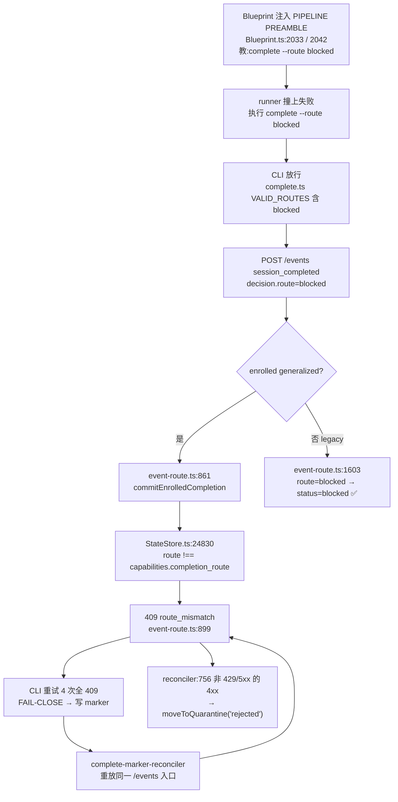

# FLY-1581 generalized node 无法「正常地失败」— 探索

Issue: FLY-1581 (https://linear.app/geoforge3d/issue/FLY-1581/契约缺口-generalized-node-无法正常地失败-模板教的失败出口被引擎恒拒-409)
日期: 2026-07-31
基于: 无(本单为链条起点;上游证据 = `~/.flywheel/evidence/FLY-7-design-blocked-20260801/scrollback.txt`)

---

## 1. 一句话

**引擎从来没给 generalized node 造过「失败」这个出口。** 模板教的 `complete --route blocked` 只是撞上了这个空洞——把它删掉不叫修好,那只会把「撞墙死」换成「静默死」。

## 2. 缺陷复现链(逐环已在本仓源码核实)



**关键对照(这才是判据):同一个 `route=blocked`,legacy runner 走到 `event-route.ts:1603` 会得到 `status=blocked` 的正常终态;enrolled generalized execution 在 line 696 就被短路进 generalized 分支,永远到不了 1603。** 也就是说 `blocked` 终态在 legacy 侧一直是好用的,generalized 引擎建起来的时候没把它继承过去。

## 3. 引擎侧到底允许什么(scope ①的答案)

单一真相在 `packages/config/src/node-type-registry.ts:10-13`:

```ts
export type WorkflowCompletionRoute =
  | "phase_design_complete"
  | "needs_review"
  | "no_code";
```

七种 node type 各自钉死一条(`node-type-registry.ts:62-142`):

| node type | completion_route | 写代码 | 说明 |
|---|---|---|---|
| design | `phase_design_complete` | ✓ | |
| implement | `needs_review` | ✓ | |
| qa | `no_code` | ✓ | 实际走 `qa-result` verdict |
| gate | `needs_review` | ✗ | |
| land | `no_code` | ✗ | |
| **generic** | **`no_code`** | ✗ | ← 本 node 自己 |
| review | `needs_review` | ✗ | |

**三条全是「成功」路由。`blocked` 不在这个类型里,而且永远不该在——** `commitEnrolledCompletion` 的路由钉死是**对的**:它防止一个 node 冒用另一个 node 的成功语义去推进 DAG。放宽它 = 拆掉校验(issue 明令禁止)。

## 4. 那引擎有没有别的失败入口?有,但它不是「失败」,是「崩了」

`event-route.ts:956` 收 `session_failed` → `recordEnrolledTerminalSignal({signal:"failed"})` → 200 `teardown: held_recorded`。看起来像出口。**但它不是**,两个理由:

**(a) runner 根本发不出来。** `flywheel-comm` 的 44 个命令里没有一个能发 `session_failed`(已逐个核 `packages/flywheel-comm/src/commands/`)。唯一产 `failureKind: "goal_blocked"` 的地方是 `CodexTmuxAdapter.ts:1041` —— codex resident goal 自己判定 `status === "blocked"`,是 **Codex 专属的 adapter 层信号**。Claude tmux runner 没有任何等价物。

**(b) 就算发得出来,语义也是错的。** 这条路记下来之后,`workflow-engine-dispatcher.ts:1157 reconcileDeadExecutions` 会把它当作**死进程**:`blocked` 在 `ZOMBIE_IRREVERSIBLE_TERMINAL_STATUSES`(`StateStore.ts:299-307`)里 → 探活确认 dead → `rollbackDeadWorkflowNodeExecution` **盲换重派**,最多 3 次(`MAX_BLIND_REPLACEMENTS=3`),然后才发「【需人工】盲换 3 次仍起不来」告警挂起 run。

对 FLY-7 那种「这单是 duplicate,做了就是造垃圾」的判定,这意味着**再烧 3 个 runner 重跑同一件不该做的事**,然后人被叫醒。

> **结论:引擎有「崩溃」,没有「想清楚了,不该做/做不了,故意停」。** 这才是真正的契约缺口,`route_mismatch` 只是它的症状。

## 5. 两边二选一 —— 证据指向哪边

issue 要求「以引擎为准还是以模板为准,由证据决定」。逐条对:

| 主张 | 判定 | 证据 |
|---|---|---|
| 放宽 `commitEnrolledCompletion` 的路由校验,让它收 `blocked` | ❌ 否 | 那是把「失败」伪装成「按某条成功路由完成」,DAG 会拿它去推进后继节点。校验本身是对的 |
| 模板删掉 `--route blocked` 这句就完事 | ❌ 否 | 删完 generalized node 一个终态失败出口都没有 = 只能靠 watchdog 盲换 3 次 + 超时。**「正常地失败」仍然做不到**,而且更隐蔽 |
| 模板改教「引擎真正接受的那条」 | ✅ 是,但**前提是引擎先得有那条** | 今天不存在。必须引擎补一条 deliberate-terminal-failure 入口,模板再指向它 |

**所以答案不是二选一,是:引擎在「路由校验」这件事上是对的,但它缺了一整条通道;模板在「该有一个失败出口」这件事上是对的,但它指的门牌号不存在。修法 = 引擎补门 + 模板指对门 + 一处真相锁死两边。**

## 6. 方案(供 plan 展开)

- **A. 引擎补 `blocked` 终态通道**:三个 completion sink(`event-route.ts` / `DirectEventSink.ts` / `complete-marker-reconciler.ts`)对 enrolled execution 的 `route=blocked` 一致地**不**走 `commitEnrolledCompletion`,改走专用的 deliberate-terminal-failure 收口,落 `blocked` 终态 + 一次性 Lead 告警,并且**明确标记为「不要盲换重派」**(与崩溃区分开)。
- **B. 模板指对门**:`Blueprint.ts` 的 PIPELINE PREAMBLE 对 generalized node 注入的失败出口,从字面量改成从同一常量取值。
- **C. 一处真相 + 反向验证**:新增导出常量(建议落在 `packages/config/src/node-type-registry.ts`,与 `WorkflowCompletionRoute` 同处),模板与引擎准入**都从它取**;合同测试渲染真实 prompt,把里面教的每个 `complete --route <x>` 抽出来喂给引擎准入函数,断言不是 409、不是 quarantine。故意改一侧 → 测试必须红。

## 7. 顺带证实的两个同族缺陷(建议单开,不在本 node 动手)

### ①`ask` 的 401 —— 信号与真相反向(**已定位**)

`packages/flywheel-comm/src/lead-inbox-nudge.ts:81-85`。401 来自**尽力而为的门铃** `/api/lead-inbox/nudge`,不是消息本体;durable queue row 确实留下了。问题是 **401 这个数字会被读成「我的消息被拒了」**,引诱重发 → 产生重复。真实后果是「Lead 的通知从即时降级成慢轮询」,这是运维信号,不是调用方错误。建议:改写文案让它不可能被读成「没存下」+ 连续 nudge 认证失败要作为运维信号浮出来(说明每一条 Lead 通知都在降级)。

### ② progress lock 报错掩盖真实原因(**已定位到行**)

`packages/flywheel-comm/src/commands/progress.ts:389-406`。`openSync(lockPath,"wx")` 的 `catch` 是**瞎的**——不看 `err.code` 就一律当「被别人占着」,自旋 50×100ms,最后抛 `could not acquire progress lock ... (another writer holds it)`。而父目录不存在时报的是 `ENOENT`,**重试一万次也不会好**。修法:`EEXIST` → 才算被占(重试);其它(`ENOENT`/`EACCES`/…)→ 立即按真实原因失败。

### ③ 本 node 亲身撞到的第三条(同根,新发现)

baseline-rules 的 **PROGRESS LEDGER** 段要求每步跑 `flywheel-comm progress`,而该命令**会 `git commit --only` 提交 progress.md**(`progress.ts:186-209`);同一份提示词里 generalized no-write node 又被告知「do not create commits」。**两条硬规则直接打架**,对每个 no-write generalized node(`generic` / `gate` / `land`)都成立。根因与主线完全一致:**为 legacy runner 写的 baseline-rules 被原样注入 generalized node,没有按该 node 钉死的 capabilities 做过对账。**

---

## 8. 本 node 的自证

本 node 是 `taskCategory: generic` → `completion_route: no_code` → no-write。**我收到的 PIPELINE PREAMBLE 第 (5) 条,逐字就是 `complete --route blocked --summary "onboard_failed: <short reason>"`。** 也就是说:如果我的 onboard 硬报错,我会精确地重演 FLY-7 design runner 的死法。**我在调查的这个 bug,此刻正装在我自己身上。**
