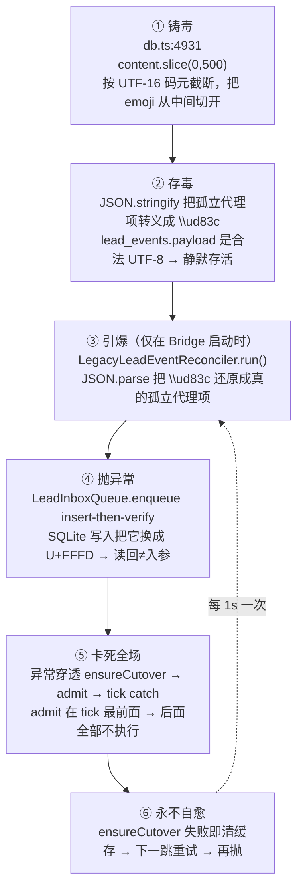

# FLY-1586 Lead 收件循环全舰队停摆 — 探索

Issue: FLY-1586 (https://linear.app/geoforge3d/issue/FLY-1586/p0承接-1579-修复-lead-收件循环全舰队停摆-毒行隔离-截断修复-存量冻结只投新增)
日期: 2026-07-31
基于: 无

> 本文所有时间戳除非特别标注，一律为 **UTC**（SQLite `datetime('now')` 的时区）。本机时区为 PDT = UTC-7。

---

## 1. 一句话结论

Bridge 每次启动都会跑一次一次性的 **boot cutover**（`LegacyLeadEventReconciler`）。`lead_events` 里有 **一行** payload 含被截断成半截的 emoji（孤立代理项 U+D83C）。这一行进 `LeadInboxQueue.enqueue` 的 insert-then-verify 时必然抛异常，异常穿透到 `LeadInboxLoop.tick()`，而 `admit()`（question 入列的唯一入口）排在 tick 的最前面 —— 于是 **`QuestionAdmission` 一次都没执行过**。

一行数据，拖死 6 个项目 **16 个生产 Lead** 的整条收件通路，已 **60+ 小时**（07-29T12:59:52Z 起算；写下这行时 61.3h）。

---

## 2. 必须先纠正 issue 的三个前提

### 2.1 ❌ 「回滚 v1 之后没恢复」—— 断裂点比回滚早 58 小时

issue 把窗口定在 07-31T23:18:59（回滚 v2）之后。**实测不是。**

权威仪器 = 每个项目 comm.db 的 `loop_heartbeat` 表。`LeadInboxLoop` 每跳开头写 `last_started_at`，只有整跳成功才写 `last_success_at`。两者一比就是「在跑」和「跑通」的差。

```
项目               Lead                     last_started_at            last_success_at
flywheel          flywheel-eng-lead        2026-08-01T01:12:58.526Z   2026-07-29T13:00:21.805Z
flywheel          flywheel-cos-lead        2026-08-01T01:12:59.851Z   2026-07-29T12:59:52.425Z
flywheel          claude-infra-bot-lead    2026-08-01T01:12:58.229Z   2026-07-29T12:59:53.554Z
flywheel          codex-infra-bot-lead     2026-08-01T01:12:34.942Z   2026-07-29T13:00:04.727Z
flywheel          flywheel-product-lead    2026-08-01T01:12:59.852Z   2026-07-29T13:00:05.601Z
geoforge3d        cos-lead / ops-lead / product-lead                   2026-07-29T13:00:04~21
growth            mufasa / rafiki / reflection-lead                    2026-07-29T13:00:04~05
joycon-typeless   joycon-lead                                          2026-07-29T13:00:21.419Z
tidal-echo        sub-lead / tidal-echo-content / tidal-echo-cos       2026-07-29T13:00:04~21
personal-assistant belle-lead                                          2026-07-29T13:00:04.779Z
```

**16 个生产 Lead、6 个项目，无一例外全部停在 2026-07-29 13:00 前后**，而 `last_started_at` 是此刻。循环一直在转，每一跳都失败。

对应的 Bridge 重启账本：

```
~/.flywheel/restart-ledger/bridge.jsonl
{"seq":2,"ts":"2026-07-29T13:00:23.344Z"}   ← 就是这一次
{"seq":3,"ts":"2026-07-29T13:01:01.939Z"}
...
{"seq":21,"ts":"2026-07-31T23:44:35.830Z"}  ← 回滚后的重启，只是又踩一次同一个雷
```

**因果**：毒行 07-29 01:09:46 生成。当时在跑的 Bridge 进程早已跑完 cutover（`ensureCutover` 全进程只跑一次并缓存），所以毒行当时没有引爆。**07-29T13:00:23 的那次重启重跑了 cutover，踩雷，从此每一个 Bridge 进程一启动就卡死。**

⇒ 回滚 **没有** 造成这个故障。回滚只是把一直在掩盖它的 v2 通路撤走了，让一个已经烂了 58 小时的洞露出来。

### 2.2 ❌ 「只有 question 不落地」—— 整条 `carrier=inbox` 全死

`lead_inbox` 有两种 carrier。`external` 是 Discord 直投，**不经过** `LeadInboxLoop`；`inbox` 才是被卡死的那条。

07-29T13:00 之后至今（**60+ 小时**）：

```
carrier    n      被消费
external   1198   1198     ← 完好，所以 Lead 表面上还活着
inbox      160    1        ← 全死
```

`inbox` 那 160 行里有：`stage_changed` 40、`founder_reply` 40、`session_started` 19、`session_monitoring_reestablished` 14、`session_completed` 4、`detection_escalation` 5、`session_zombie_detected` 3、`session_stuck` 1、`runner_idle_detected` 1 …… 加上一条都进不来的 question。

最后一条成功投递的 `carrier=inbox` 行：

```
question:flywheel-eng-lead:8af841ba-...  gate_question
created 2026-07-29T12:39:27Z   consumed 2026-07-29T12:39:29.103Z   disposition=delivered
```

这正是 issue 里「最后一条进得去的 12:39:27」。**它不是 question 类的分界线，它是整条 inbox 通路的最后一次呼吸。**

`flywheel-eng-lead` 当前积压 **211** 行未消费，最老的来自 2026-07-28T07:29:56Z。

### 2.3 ✅ 「两边都不落地」—— 这条成立，而且解释了为什么没人发现

07-29T13:00 之后 v1 已死，但流量在 v2（Cass 的日流量：07-29 259 / 07-30 507 / 07-31 267）。**v2 一直在替一具尸体干活。** 07-31T23:18:59 v2 停机，v1 这边根本没醒过，于是「两边都不落地」。

---

## 3. 完整因果链（每一环都有实证）



### ① 铸毒 — `packages/flywheel-comm/src/db.ts:4931`

```ts
contentSummary: root.content.replaceAll(/\s+/g, " ").slice(0, 500),
```

`String.prototype.slice` 按 **UTF-16 码元**切。第 500 个码元恰好落在一个 emoji 的代理对中间，尾部留下一个孤立高位代理项。

### ② 存毒 — 为什么潜伏了这么久没被发现

`JSON.stringify`（ES2019 well-formed stringify）会把孤立代理项**转义成 6 个 ASCII 字符** `\ud83c`。所以：

- `lead_events.payload` 这一列本身是**完全合法的 UTF-8**
- 直接扫这一列的原始文本，孤立代理项数 = **0**
- 静态检查、备份、导出全部看不出任何异常

**毒性只在 `JSON.parse` 之后才存在。**

### ③④ 引爆与抛异常 — 实测毒行

`lead_events` seq **56649**，lead `claude-infra-bot-lead`，type `detection_escalation`，created 2026-07-29 01:09:46，`delivered_at` 为 NULL（所以每次 boot 都会被 `listUndeliveredLeadEvents()` 捞出来）。

payload 尾部逐字：

```
..."text":"🤖[自动] ⚠️ **External merge NOT ship-eligible — FLY-1518** (flywheel-eng-lead / external_merge_suspect)\n\ud83c)
```

`LeadInboxQueue.enqueue`（`lead-inbox-queue.ts:554-602`）的写法是 **INSERT OR IGNORE，然后把行读回来逐字段比对**，任一字段不等就抛：

```ts
if (row[key] !== value) throw new Error(`lead inbox id ${id} was reused with different ${key}`);
```

孤立代理项经 better-sqlite3 的 UTF-8 编码被替换成 U+FFFD，读回来的 `content` 与入参不等 → 抛 → **整个 enqueue 事务回滚**。

> ⚠️ 这解释了一个很容易误判的现象：**那行 id 在 `lead_inbox` 里根本查不到**。不是「没写」，是「写了又被回滚」。查不到 ≠ 没发生过 —— 唯一的证据在 Bridge 日志里，不在表里。

### ⑤ 为什么一行能拖死全场

```ts
// lead-inbox-loop.ts:173 —— admit 在最前面
await this.opts.admit?.();        // ← 抛在这里
// ↓ 下面全部不执行
//   claimProtocol / handleProtocol
//   claimModelBatch / revalidateModel / deliverModelBatch
```

```ts
// lead-inbox-runtime.ts:109-113
admit: async () => {
  await this.ensureCutover(secretProvider);      // ← 抛
  await admission.materializePending();          // ← QuestionAdmission，永不执行
  protocol.materializePending(lead.agentId);     // ← 永不执行
}
```

`ensureCutover` 是**整个 runtime 共享的一个 promise**（`lead-inbox-runtime.ts:206-268`），所以第一个 Lead 踩雷，其余 Lead await 同一个 promise 拿到同一个异常 —— 日志里能看到 16 个 Lead 在同一秒依次报同一条错。

### ⑥ 永不自愈

```ts
void attempt.catch(() => {
  if (this.cutoverPromise === attempt) this.cutoverPromise = undefined;  // 清缓存
});
```

失败即清缓存 → 下一跳重新跑 → 再次踩同一行 → 再抛。这个设计本意是「失败可重试」，实际效果是**把一次性失败变成永久死循环**。

---

## 4. 实验证明（不是推断）

把毒行 payload `JSON.parse` 后的字符串写进一个干净 SQLite 再读回：

```
--- STEP 1: 原始 payload 列（存储态）
lone surrogates in raw payload text: 0          ← 静态扫描完全看不出问题

--- STEP 2: JSON.parse 之后（reconciler 实际拿到的）
lone surrogates in event.escalation_reason: [[520,"d83c"]]
tail: "suspect)\n\ud83c)"

--- STEP 3: SQLite 往返
input.length = 522   readback.length = 522
readback === input ?  false                     ← 这一行就是异常的来源
readback tail: "suspect)\n\ufffd)"
lone surrogates in readback: 0
```

脚本：`scratchpad/proof.mjs`（只读打开生产 teamlead.db，写入用的是临时库，用完删除）。

---

## 5. 毒行有多少

全库 `lead_events` **61,533** 行；未投递 **4,858** 行；对每一行做 `JSON.parse` 后深度扫描孤立代理项：

```
rows containing lone surrogates after JSON.parse: 1
  seq 56649  claude-infra-bot-lead  detection_escalation  2026-07-29 01:09:46  lone=1
```

**一行。** 61,533 分之一，拖死 16 个生产 Lead **60+ 小时**。

---

## 6. 被这次故障吞掉的东西

07-29T12:39:30 之后，`type=question` 写进了 `messages` 但没有对应 `lead_inbox` 行：

```
项目          漏掉   其中仍可救（未回答 且 relay_state != terminal_disposed）
flywheel      17     4
tidal-echo     3     3
合计          20     7
```

> ⚠️ **class-aware 校验**（issue 明确要求）：断言「没有 `lead_inbox` 行 = 没抵达」对 `question` 类**成立**，正对照是 07-29 当天 38/47 的 question 确实有对应行，且最后一条 `question:flywheel-eng-lead:8af841ba-...` 有完整的 `consumed_at` + `disposition=delivered`。这个推论对 `instruction` / `response` 类**不成立**（它们走别的通路），本单不对那两类下任何结论。

那 20 条里有 6 条是 Tadashi 手工翻库发现并回答的（`messages` 里有 `type=response` 子行，`from_agent=flywheel-eng-lead`）—— 这就是 issue 里「Lead 每一轮都要手工翻数据库」的实际形态。

---

## 7. 待办分解

| # | 事项 | 说明 |
|---|------|------|
| 1 | **止血**：让 cutover 不再被单行毒药卡死 | 一行坏数据不允许拖死全场 |
| 2 | **拔源**：截断改成按码点安全截断 | `db.ts:4931` |
| 3 | **净化边界**：`enqueue` 入口拒绝/清洗孤立代理项 | 不只 cutover，live push 路径同样会踩 |
| 4 | **补扫**：一次性命令把漏掉的 question 捞回来 | 7 条仍可救，其余出清单 |
| 5 | **不变量检查器**：question 超时未进 lead_inbox 即告警 | 而且必须验「收件方收到了」，不是「守卫喊了」 |

---

## 8. 这次故障暴露的两个系统性问题（不在本单 scope，但要记下来）

1. **`ensureCutover` 的失败重试语义反了。** 「失败就重试」对瞬时故障是对的，对确定性故障是把一次崩溃放大成永久死循环。任何 boot-time 一次性迁移都应该区分「可重试」和「这行永远不可能成功」。

2. **⚠️ 本节初稿写错了，Codex design review R1 抓出来，已独立复核确认 —— 更正如下。**

   初稿断言「没有任何人在看 `loop_heartbeat`，连守卫都没喊」。**这是错的。守卫喊了，而且 16/16 全喊了。**

   实证（`~/.flywheel/teamlead.db` 的 `lead_events`）：

   ```
   seq    lead_id                  event_type          created_at           delivered_at
   32096  mufasa-lead              inbox_loop_stalled  2026-07-20 07:09:11  2026-07-20 07:40:31   ← 正对照
   32097  codex-infra-bot-lead     inbox_loop_stalled  2026-07-20 07:09:13  2026-07-20 07:40:31   ← 正对照
   57003  product-lead             inbox_loop_stalled  2026-07-29 13:11:33  (空)
   57004  ops-lead                 inbox_loop_stalled  2026-07-29 13:11:35  (空)
   ...   （共 16 条，16 个生产 Lead 全覆盖）...
   57018  sub-lead                 inbox_loop_stalled  2026-07-29 13:12:19  (空)
   ```

   守卫是 `packages/teamlead/src/bridge/inbox-loop-health-checker.ts`（`InboxLoopHealthChecker`，W2 默认开启，阈值 `FLYWHEEL_INBOX_LOOP_STALL_MIN` 默认 10 分钟）。它在通路死掉 11 分钟后**准确地**开火了 16 次，`loop_heartbeat.stall_episode_at` 也 16/16 全部写上了。

   **那有没有人看见？—— 查不出来。这才是真正的问题。**

   > ⚠️ **本节第二稿也写错过一次，Codex R2 抓出，已独立复核并再次更正。**
   > 二稿曾断言「告警被路由进了它正在报告的那个故障里」，理由是 `delivered_at` 全空 + `lead_inbox` 里 0 行。
   > **这个推论不成立。** `LeadAlertNotifier.alert()` 在 Step 3 用 `tryClaimLeadEvent` 写 `lead_events` 只是**去重/审计 claim**，Step 5 是**直接 POST Discord**（`LeadAlertNotifier.ts:873-910`），**根本不经过 `LeadInboxRuntime` / `enqueueLeadEvent` / `lead_inbox`**。而 `delivered_at` 只由 `StateStore.markLeadEventDelivered()` 写，notifier 成功 POST 后**并不调用它**。
   > ⇒ `delivered_at=NULL` 只能证明**审计镜像**被本次 wedge 挡住，**不能证明 Discord 根告警没发出去**。
   > 同理，我引为「正对照」的 2026-07-20 那两条（`disposition=delivered`）证明的也只是审计镜像后来被消费了，**不是 Discord 投递收据**。

   独立复核后能确证的只有三件事：

   | 结论 | 证据 |
   |------|------|
   | ✅ 检测确实开火了 16/16 | `lead_events` seq 57003–57018；`loop_heartbeat.stall_episode_at` 16/16 |
   | ✅ 确实进到了 notifier 的跨进程 claim 阶段 | `~/.flywheel/alerts/claims.db` 的 `alert_claims` 表里 16 个 event_id 齐全 |
   | ❓ **有没有真的发到 Discord、有没有人看见 —— 无法确定** | 见下 |

   为什么无法确定：`claims.db` 里那张看起来像收据的 `alert_deliveries` 表（`state IN ('leased','sent','queued','dead_lettered')`）**只由 `scripts/lead-alert.sh` 写**（shell 告警通道），**TypeScript 侧的 `LeadAlertNotifier` 根本不写它**。所以：

   - 那 16 条在 `alert_deliveries` 里查不到 —— **这什么都不证明**，它们本来就不该在那儿
   - 表里 07-29 13:01–13:22 有大量 `sent` 行（阳性对照说明表当时在用），但那些是 shell 通道的别的告警
   - ⇒ **TS 通道的发送结果在本仓没有任何持久化记录**

   ⚠️ 这是一个比我原来那个结论更值得记的教训：**我第一次用 `delivered_at` 当投递证据，第二次用 `alert_deliveries` 查不到当投递失败证据 —— 两次都是拿一张不是为这个问题设计的表去回答这个问题。**（同 issue 里已经点名的 `read_at` 陷阱一模一样。）

   雪上加霜的是 `claimHealthEpisode` **先 latch episode、再发告警**（`inbox-loop-health-checker.ts:55-75`），且**不校验 `alert()` 的返回值**（`sent` / `queued` / `deadLettered` / `skipped:'duplicate'`）。latch 落下就不再重复开火 —— 所以无论当时发没发出去，**它之后都永久闭嘴了**。

   ⇒ 对修复方案的影响：
   - **不新建守卫**（检测本来就是好的，再加一个只会多一个会喊没人听的）
   - **不写「改成 out-of-band」** —— 现有 `LeadAlertNotifier` **已经是** out-of-band 直发 Discord
   - **真正要补的是「发送结果的持久化 + 收据」**：把 `alert()` 的 outcome durable 记下来、`queued` 由 drain 推进到 delivered、`skipped:'duplicate'` 必须回读真实结果而不能当成功、成功后才关 episode
   - **在拿到当时的 Discord message / 频道历史之前，只能写「16 次检测已进入 notifier，最终人类可见性未知」**，不能宣称告警被吞了

3. **生产 Lead 数是 16，不是初稿写的 14。** 按 `loop_heartbeat` 有 `stall_episode_at` 的行统计：flywheel 5 + geoforge3d 3 + growth 3 + joycon-typeless 1 + tidal-echo 3 + personal-assistant 1 = **16**（test-slot-* 的 6 个不算生产，`stalled=0`）。任何实现都**必须从生产配置动态导出目标集合**，不得硬编码这个数字。
