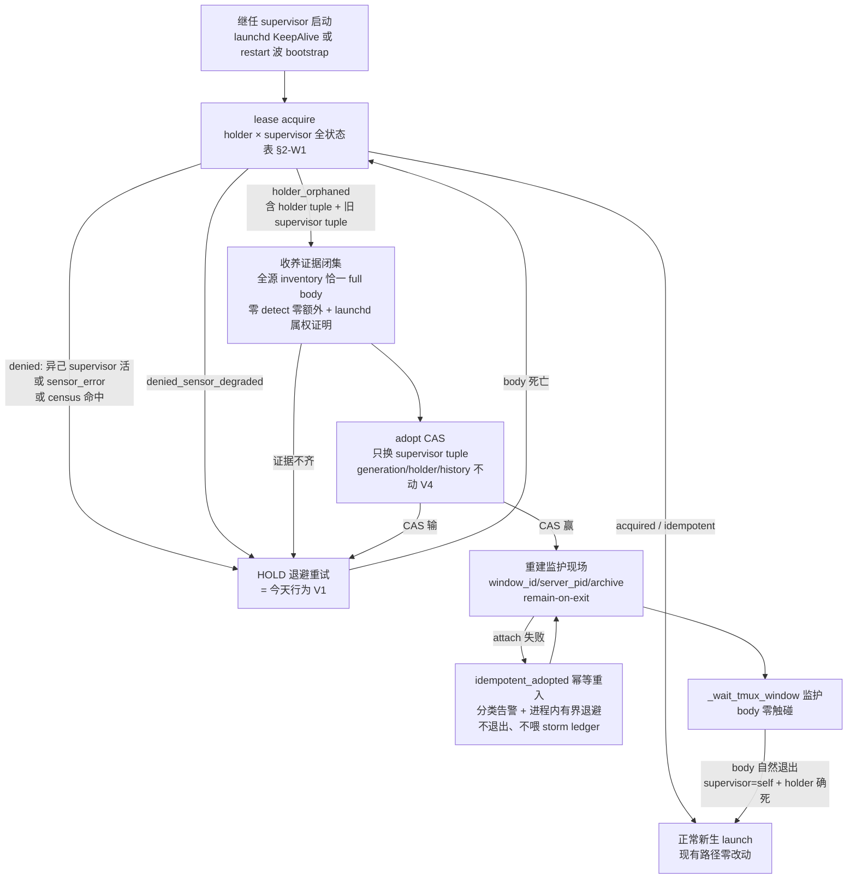
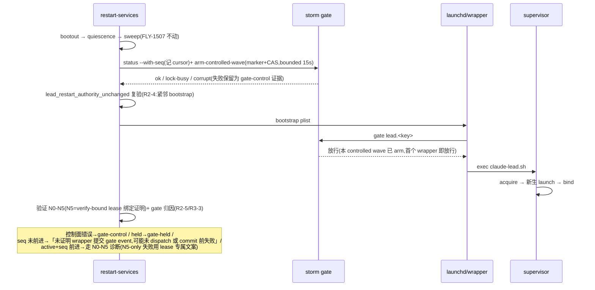

# FLY-1602 重启换代失败即孤儿 lease catch-22 — 实施计划

Issue: FLY-1602 (https://linear.app/geoforge3d/issue/FLY-1602/基建a-重启换代-lead-失败即孤儿-lease-catch-22-每次-restart-挂掉只能人工捞回)
日期: 2026-08-02
基于: research.md
Status: **codex-approved(R15 Round 4 APPROVED,2026-08-03)**——历史基座 = R7 APPROVED;合并稿 R8-R12 APPROVED;恢复复审 R13-R15 的 blocking findings 全关闭。Round 4 的 2M+1L advisories 已报告 Lead并折入下述实现/测试合同,不阻塞 implementation。**Lead 指定的首要审题(收养链对活 body 零权威路径,FLY-1507 铁律)在 R8-R15 均保持 PASS,无需回退清除重生。**

> **合并说明(2026-08-02 晚,Lead 裁定,详见 design-correction.md)**:本 issue 曾被两次独立派发,两案相撞后 Lead 裁定以本案(R7-approved,W1-W4)为基座,折入第二案独有的两块:**W5 换代验证三态 + fail-closed 终判**(治 research.md §5.1 的 4/5 假阴性——62s 窗口结构性短于真实换代,W3 的 gate resume 不足以消除)与 **W6 换代意图 marker + reconcile**(治 §5.2 的 mid-crash 中间态)。Lead 四条随行要求:①假阴性证据组原样进 research(§5.1 ✓);②converging 必须有 fail-closed 终判(W5);③病 C 不许静默丢(W6);④变异判据(W5 测试)。
> **方向澄清(避免后人读出矛盾)**:Lead 当晚曾否决过的「方向 A 收养」指**朴素收养**(无证据闭集、无 CAS 栅栏、直接接管活 body);本案的证据闭集版收养(V1-V9 + 四证合取 + adopt CAS)不在该否决范围内。R8 增量 review 的**首要审题**由 Lead 指定:复审收养链是否对活 body 保持零权威路径(FLY-1507 铁律)——若 R8 判违律,整案回退第二案的「清除重生」处置(reap-and-respawn,机制见 git 历史 8c7235b1 的 plan.md §2.4)。
> **R13 首轮修订索引(2026-08-03)**:H `w6-marker-manifest-digest-false-drift` → W6 改 stable semantic manifest identity + valid-drift 正常 restart supersede + success 当轮删 marker;H `new-hard-exit-paths-feed-storm-gate` → V9 sensor/authority failure 进程内 HOLD、移除 abdicate/attach 非零退出。M `acquire-cli-exit-code-contract-undefined` → W1 rc/status 表;M `gate-resume-noop-on-active-state` → W3 active 也推进 cursor;M `converge-deadline-extends-restart-lock` / `converge-reprobe-inputs-not-specified` → W5 显式持锁 + 完整 journal/cleanup;M `adoption-branch-bypassed-guards-not-enumerated` → W2 三 guard 替代证据。L legacy marker / store-error 例外 / collector mutation 分别冻结在 W5-W6、V2、W2。
> **R14 首轮修订索引(2026-08-03)**:H `gate-resume-semantics-widened-beyond-fly1501-contract` → 共享 `resume` 完全不改,另建 intent-marker+expected-seq 双栅栏的 Lead-only `arm-controlled-wave`;M `v9-probe-indeterminate-pid-classification` → 受管生产候选的 `error/unloaded/loaded\t0/foreign` 全 HOLD,不靠可疑 probe 判手工来源。L W6 当前新 tuple/排除 old tuple、marker hygiene 不降级 success、retired 正面证明收敛;W5 standup 实际时序改正。
> **R15 首轮修订索引(2026-08-03)**:H `w6-reconcile-bootstrap-skips-arm-and-claims-resolved` → W6 reconcile 与正常 restart 共用 arm,bootstrap rc 绝不等于 resolved;只有 supervisor+body+lease 正面闭集才 resolved,否则 converging/continue。M `v2-scheduler-kickstart-lead-bypass-unaccounted` → research 补审;W4 将 scheduler 改为全局 restart mutex 下的 graceful `launchctl kill SIGTERM`,移除 Lead `kickstart -k`;arm seq race 有界重采样。
> **R15 APPROVED advisories(实现时全折入)**:`w5-converge-terminal-fail-not-counted-in-failed` → rc 4 + terminal failed++ 合同;`w4-scheduler-shares-global-restart-mutex-starves-deploy` → scheduler subordinate mutation lock + deploy bounded wait,不持有全局锁;`w4-graceful-only-loses-wedged-supervisor-recovery` → 明记能力收窄与 v2 回归面。

## 0. 目标与不变量

**目标**:supervisor 之死(kickstart / 崩溃 / SIGKILL / 误杀,任何原因)不再产生不可恢复的孤儿态——继任 supervisor 在证据闭集下秒级收养活 body;restart-services 的合法换代波不再被 storm gate 无声否决;所有失败态报错语义诚实。

**不变量(改完必须仍成立)**:

- V1 **真双活防护零放松,version-valid 的 supervisor tuple 是独立并发权威**(R2-1/R6-1):「权威」仅指完整且 `supervisor_generation == generation` 的 supervisor tuple——异己权威 tuple `alive` **或 `sensor_error`** → 无论 holder 状态一律 deny/HOLD;census 命中亦然。NULL/版本失配的 tuple 不是权威,按 V7 legacy 分支处理。
- V2 **fail-closed 三态判活**:任何**进程 tuple 判活**测量三态(确定活 / 确定死或 tuple 确定不同 / 传感器失败);只有确定死放行;传感器失败一律 HOLD/独立错误态(R1-2)。既有 lease store/control error 启动合同暂不改:acquire rc 2 仍不导出 claim、launch 层 fail-open,写边界 fail-closed,并由 `_prepare_lead_launch` + process-table preflight + scanner 兜底;W1 migration 失败走这条明确例外,不得伪装成 tuple `dead`。
- V3 **body 终结权不裂开**:收养路径对 body 零信号;杀 body 仍只有 cleanup 优雅拆除与 identity-proven sweep 两个既有权威;cleanup 语义零改动(FLY-1507 I1 不动)。
- V4 **writer generation 是 body 的写能力,收养绝不改它**(R1-1):adopt 只换 supervisor tuple;generation / holder tuple / `lease_generation_history` 全不动;监护权变更走**专用 append-only `lease_supervisor_audit` 表**(R2-2),与 CAS 同事务。
- V5 **换身不失忆(含 bind→session 落盘窗口,R3-2)**:收养不碰 body;收养的 full body proof 必须从 holder argv 严格提取唯一 `--session-id <id>` 或 `--resume <id>`;CAS 赢后、进监护前对 `SESSION_ID_FILE` 对账——存在且精确匹配→保留;不存在→原子恢复同一 id(temp+rename);空/读失败/多 flag/与 argv 不一致→fail-closed attach failure,绝不静默覆盖。被收养 body 退出后 `--resume` 同一 session、参数走 FLY-1496 热解析。
- V6 **storm gate 防自旋语义不动**:既有共享 `resume` 保持 FLY-1501 held-only 条件 CAS 与幂等 no-op **逐字节不变**;合法 Lead 换代另走 W3 的 marker-fenced `arm-controlled-wave`。wrapper `gate` 的计数下界/阈值/hold 算法零改动,其他 Bridge/voice/quota/cmux child 不获得新卸闸面。
- V7 **旧 lease 行为兼容(R3-4 冻结三行)**:supervisor 列双 NULL 的旧行——holder 确活→`denied_holder_alive`(今天行为);holder 确死→今天的覆盖式 acquire(字节不变);holder `sensor_error`→HOLD(唯一收紧,方向更保守)。supervisor 列**部分 NULL/畸形 tuple** = 数据异常 → 一律按 `sensor_error`/HOLD。永不因旧行进入收养。
- V9 **launchd 属权是受管 Lead 的启动资格门,不只是收养门**(R3-1):磁盘存在受管 plist 的 Claude Lead,claude-lead.sh 在写 PID 文件/触碰 lease **之前**必须证明 `launchctl print` 报告的精确 PID==`$$`(wrapper 是 exec,成立)+自身 lstart 复验;`_launch_claude` 前再确认一次。受管生产候选的磁盘 authority 不可证、probe `error`、`unloaded`、`loaded\t0`/不可解析、foreign PID、timeout **全部进程内 HOLD+有界退避**,不退出、不触发 launchd 重生计数;不得用同一个可疑 probe 反推「自己是手工候选」。仅显式 QA/manual seam `FLYWHEEL_MANUAL_LEAD_LAUNCH=1` 可在零 mutation 前 `exit 0`,生产 wrapper 不设置该 seam。第二次复验失败同样 HOLD。无 plist(真 legacy nohup / QA slot 专名)保留现状。
- V8 **QA 隔离按事实**(R1-9/R2-6):测试自带临时 `HOME` / `FLYWHEEL_LEAD_LEASE_DB` / **`FLYWHEEL_PROJECTS` + `FLYWHEEL_PROJECTS_FILE` 双设且内容一致** / `FLYWHEEL_TMUX_SOCKET_OVERRIDE` / alert+claims 目录;真机 QA slot 依赖 exact `(project,lead)` 证明 + 生产状态前后快照逐字对比。

## 1. 总体设计

## 2. 变更清单(6 个工作项 + 测试)

### W1 lease:双 tuple、三态判活、全状态表、`adopt`(packages/flywheel-comm)

`src/lead-lease.ts`:

- **schema(R1-7/R2-2/R5-1)**:
  - fresh `CREATE TABLE lead_lease` 增列 `supervisor_pid INTEGER / supervisor_start TEXT / supervisor_generation INTEGER`;既有库 ordered idempotent migration(逐列 `ALTER TABLE ADD COLUMN`,仅精确 duplicate-column 可容忍,其余抛 LeaseStoreError fail-closed)。`lease_generation_history` 不动。
  - **版本栅栏(R5-1)**:新 binary 的 acquire/adopt 同事务写 `supervisor_generation = 当前 generation`。**supervisor tuple 只有在 `supervisor_generation == generation` 时才是权威**;NULL 或不等(旧 binary 的 `ON CONFLICT DO UPDATE` 不触新增列,会推进 generation 而留下陈旧 supervisor tuple)→ 该行按 **legacy/V7** 处理(holder 活→deny、确死→今天覆盖式 acquire、sensor_error→HOLD),**永不进入 orphan adoption**。混跑/rollback 序列因此只会退化到今天的行为,绝不制造新 catch-22。
  - **新表 `lease_supervisor_audit`**(append-only,无 materialized_at、无 retention、不进 dual-active outbox/materialize 流程):`(id PK AUTOINCREMENT, lead_key, generation, event('adopted'), old_supervisor_pid, old_supervisor_start, new_supervisor_pid, new_supervisor_start, holder_pid, holder_start, created_at)`。现有 `lease_audit` / `lead-dual-active-scan` 路由**零改动**(R2-2:避免 `adopted` 被映射成 `lead_lease_would_block`)。
- **三态判活(R1-2)**:liveness dependency 改三态 `alive | dead | sensor_error`(镜像 `_lead_body_tuple_state` 0/1/2)。旧布尔调用点经兼容包装(dead+sensor_error→false)字节不变。
- **`acquire()` 冻结为两层状态表(R2-1/R6-1)**:
  - **第一层:row format 判定**——supervisor 三列完整 **且** `supervisor_generation == generation` → 进入第二层笛卡尔积;三列全 NULL(旧行)或 `supervisor_generation` NULL/不等(旧 binary conflict-update 残留)→ **legacy 分支**(V7 三行);部分 NULL/畸形 → `sensor_error`/HOLD。
  - **第二层(仅 version-valid 行)**:

| supervisor tuple | holder tuple | 结果 |
|---|---|---|
| 异己 alive | 任意 | `denied_holder_alive`(V1) |
| 异己 sensor_error | 任意 | `denied_sensor_degraded` → HOLD(V1/V2) |
| self + bound | alive | `idempotent_adopted`(payload: generation + holder tuple) |
| self + bound | dead | **正常 acquire**:新 generation、新 unbound 行(supervisor=self)→ 收养后 body 自然退出的 relaunch 路径(R2-1 反例 2) |
| self + bound | sensor_error | `denied_sensor_degraded` → HOLD |
| 确死 | alive 且 bound | `holder_orphaned`(payload: generation + holder tuple + 旧 supervisor tuple),只读不改行 |
| 确死 | dead | 正常 acquire |
| 确死 | sensor_error | `denied_sensor_degraded` → HOLD |
| 任意 | — 未 bound 行 | 现有 acquire 语义字节不变(supervisor 三列同时落列,含 fence) |

  第一层 legacy 小表(R7 non-blocking 去重:legacy 行只在第一层判定,不进第二层):

| row format | holder | 结果 |
|---|---|---|
| 全 NULL 或 fence NULL/不等 | alive | `denied_holder_alive`(V7) |
| 全 NULL 或 fence NULL/不等 | dead | 今天的覆盖式 acquire(字节不变,V7) |
| 全 NULL 或 fence NULL/不等 | sensor_error | `denied_sensor_degraded` → HOLD(V7 唯一收紧) |
| 部分 NULL / 畸形 tuple | 任意 | 按 `sensor_error` → HOLD(R3-4:数据异常 fail-closed) |

  注 1:version-valid 的 unbound 行(acquire 后 bind 前)既有 same-supervisor idempotency 保持。**stale unbound 行**(R6-1:旧 binary acquire 推进 generation 后 roll-forward,`supervisor_generation` 滞留)冻结为:same requester 精确 tuple → 在 acquire 的同一 IMMEDIATE 事务内**修复** supervisor 三列(`supervisor_generation=当前 generation`)后返回 idempotent(绝不 self-HOLD,也绝不返回 idempotent 而留 stale fence);异己 alive/sensor_error → fail-closed deny/HOLD;确死 → 覆盖式 acquire。
  注 2:**adopt 的 dead-proof 由前序 acquire 分类建立,`adopt()` 本身是纯 CAS**(不重验判活,无 sensor 状态;R3-4)——因此不存在"adopt 路径 sensor 测试"。
- **`adopt()`(R1-1/R1-4/R6-1)**:单事务 CAS
  `UPDATE lead_lease SET supervisor_pid=?, supervisor_start=?, supervisor_generation=generation, acquired_at=?, acquired_by=? WHERE lead_key=? AND generation=? AND holder_pid=? AND holder_start=? AND bound_at IS NOT NULL AND supervisor_pid=? AND supervisor_start=? AND supervisor_generation=generation`(末两参 = 分类时的旧 supervisor tuple,冻结 P2 证据;WHERE 的版本谓词保证只收养 version-valid 行——stale 行在分类层就进不了 orphan,这里再原子冻结一次)。writer generation/holder 不写。changes==1 → `{status:"adopted", generation}` + 同事务 `lease_supervisor_audit(event='adopted')`;否则 `{status:"lost_race"}`(含 supervisor_generation 中途变化)。`bind()` 的 supervisor 谓词同样要求 version-valid(新 acquire 同事务写入版本列,天然成立)。
- **不新增 `abdicate` 协议(R13-2)**:attach 失败由 W2 同一 supervisor 进程内重试/HOLD。为了避免确定性 attach 错误造成 KeepAlive 重生风暴,本单不提供「审计后非零退出」路径,也不造 supervisor 哨兵。
- `bind()`:CAS 谓词补 supervisor tuple 等值(self);holder 覆写逻辑不变。

`src/commands/lead-lease.ts`:新增三个子命令(R3-4/R4-1/R9-3):
- `adopt`(`--lead --project --supervisor-pid --supervisor-start --holder-pid --holder-start --old-supervisor-pid --old-supervisor-start --json`;**exit 0=adopted,2=store error,3=lost_race**);
- **`verify-bound`(R4-1/R6-1,N5 的原子执行面)**:输入 lead key + expected supervisor pid/lstart + expected holder pid/lstart;**单条 SQL(或同一 read transaction)**同时证明 current row、bound、四个 tuple 字段、**`supervisor_generation == generation`**、generation history 存在,成功 JSON 返回 generation;**exit 0=verified,2=store/control error,3=evidence mismatch**,mismatch 附枚举 reason(`missing_lease|unbound|supervisor_mismatch|holder_mismatch|supervisor_generation_mismatch|missing_history`)——stale fence 必 exit 3,绝不 success。现有 `validate()` 复用同一快照原语,但 **writer-capability 语义不变**(只看 current generation+bound+history;supervisor 版本栅栏绝不加进 body 写权限判定,V4/V7 下旧 body 写能力不受影响,R6-1)。
- **`progress-snapshot`(R9-3/R10-1,只读;W5 的 baseline 与进展探测共用)**:`--lead --project --json`,同一 read transaction 输出。**present schema 必须能诚实表示 legacy 行(R10-1)**:`{status:"present", rowFormat:"version_valid"|"legacy"|"malformed", generation, supervisorPid|null, supervisorStart|null, supervisorGeneration|null, holderPid, holderStart, boundAt|null, acquiredAt}`——`rowFormat` 由 W1 acquire 的第一层 row-format 判定同款函数计算(三列完整且 fence 相等=version_valid;全 NULL 或 fence NULL/不等=legacy;部分 NULL/畸形=malformed,与 W1 数据异常语义一致,raw 字段原样露出);**absent schema**:`{status:"absent"}`。**rc 枚举:0=snapshot 成功(present/absent/任意 rowFormat 均 0——快照是观测不是判定,fail-closed 决策在消费方分类层)**;2=store/control error。
`acquire` JSON 输出增 `holderPid/holderStart/supervisorPid/supervisorStart`。**acquire rc 合同(R13-3)**:rc 0=`acquired|idempotent|holder_orphaned|idempotent_adopted`;rc 3=`denied_holder_alive|denied_sensor_degraded`;rc 2=store/control error。`lead_identity_prepare_lease` 必须先按精确 status 分流(两种 denied 保留不同 HOLD reason;两种 adoption status 转为函数 rc 4/5),再把与 status 不相容的 CLI rc 判成 invalid response,禁止以 `rc==3` 先行折叠。参数校验沿用现有正整数 parser(无 PID 0 哨兵)。shell harness 逐个断言 status×exit code。

测试(vitest):
- **状态表全笛卡尔积**(上表逐行 + unbound 行既有语义回归)。
- 三态:活但 lstart 读失败 → `denied_sensor_degraded`(acquire 分类;adopt 是纯 CAS 无 sensor 态,R4-2);PID 复用 → 确死;NULL 旧行 sensor_error → HOLD。
- **verify-bound(R4-1/R6-1)**:并发 generation advance(第二连接在验证间推进)→ mismatch;四个 tuple 各自 mismatch、unbound、missing history、**supervisor_generation stale(混跑 rollback 场景:N0 supervisor 与 N3 body 四 tuple 全匹配但 fence 滞留)→ 必 exit 3**、DB lock/corrupt/unreadable → 全部非 0 且 reason 正确,零 false-success。
- **版本栅栏贯穿(R6-1)**:stale bound 行 N5 必败;stale unbound same/foreign requester 三态;roll-forward 恰发生在旧 acquire 与 bind 之间(self-HOLD 禁止 + fence 修复断言);adopt CAS 遇 supervisor_generation 中途变化 → lost_race;rollback/relaunch 后不得以 stale fence 报 restart success。
- adopt CAS 双连接并发恰一赢;旧 supervisor tuple 中途变化 → lost_race;adopted-by-self 幂等;crash 前后重开库。
- **enforce 级端到端(R1-1)**:adoption 后 body 冻结 generation 走真实 validate/写边界仍放行;stale generation 仍拒。
- **迁移与混跑(R1-7/R2-6/R5-1)**:预填旧库 fixture;两并发 opener;**三列中仅部分已存在**的 prefix 恢复;`PRAGMA table_info` + 索引断言 fresh == migrated;`lease_supervisor_audit` 建表幂等。**mixed-binary 双路径**:①旧 binary 对新 schema fresh INSERT(NULL supervisor)→ V7;②旧 binary 对已含 non-NULL supervisor tuple 的行做 conflict UPDATE + bind(generation 推进、supervisor_generation 滞留)→ 新 binary 分类为 legacy(不 false-adopt、不 false-idempotent、不无限 HOLD 于错误权威);③rollback 后 roll-forward 再验。
- 带连字符 lead id 的审计行读写(R2-2)。

### W2 claude-lead.sh 收养分支(packages/teamlead/scripts + scripts/lib)

- `lead-identity-preflight.sh`:
  - `lead_identity_prepare_lease` 路由:`holder_orphaned` → rc 4 + 导出 `LEAD_LEASE_ORPHAN_HOLDER_PID/START` + `LEAD_LEASE_ORPHAN_OLD_SUP_PID/START`;`idempotent_adopted` → rc 5 + 导出 holder tuple(R2-3 冻结 payload);`denied_sensor_degraded` → 现有 HOLD(独立 reason)。
  - 新增 `lead_identity_supervisor_census <lead_id> <project>`(ps 全表 argv 扫描 claude-lead.sh 形态,排除 `$$`;扫描失败 rc 2 = HOLD)。
- **收养证据闭集(R1-3,helper `lead_body_adoption_evidence` 落 `scripts/lib/lead-body-sweep.sh`)**:复用全源 inventory 的读法(window+archive+proctable,project-scoped 证明等级),但实现为**专用只读 collector**——不得复用 `lead_body_collect_targets` 的 stale-archive `rm -f` 分支,adopt CAS 前零磁盘/进程/lease mutation。快照 `#status=complete`;恰一 full body 且 tuple == holder;零 detect、零额外匹配 body;同名窗恰 1、live pane 恰 1;**并从 body argv 严格提取唯一 `--session-id`/`--resume` 值**(缺失/多个 → 证据不齐 → HOLD;R3-2)。
- **launchd 属权 = 启动资格门(R3-1,V9;边界按 R4-3 冻结)**:
  - 「受管」谓词与 restart lifecycle 一致:`[[ -f "$plist" || -L "$plist" ]]`(restart-services.sh:1062 同款)——**broken symlink / 存在但不可读/畸形的 plist 也算受管且 fail-closed 拒绝启动**,绝不降级成 legacy 绕过 V9。
  - 受管:资格证明 = **①磁盘 authority 校验(R5-2:复用 `lead_restart_validate_authority`/其严格 plist parser——非 symlink 常规文件、真实 parse、Label/ProgramArguments 交叉验证;launchctl 已加载不代表磁盘 plist 仍健康)+ ②`launchctl print` 精确 PID==`$$` + lstart 复验**,两步都**前移到写 PID 文件/触碰 lease 之前**,并在 `_launch_claude` 前复确认。生产受管候选任一不能正面证明的形态(`error|unloaded|loaded\t0|foreign|timeout|磁盘 authority 不可证`)都进程内 HOLD+退避;仅测试/显式人工 seam 可零 mutation `exit 0`;第二次复验失败也 HOLD。所有分支零 body signal,且不新增非零退出/KeepAlive churn。收养分支自然继承此门。
  - **无 plist(真 legacy nohup / QA slot 专名):normal acquire/launch 路径保留现状,但 `holder_orphaned` 一律 HOLD、永不 `adopt`**(R4-3)——收养只对通过受管 launchd 属权资格的进程开放,Round 1 冻结的「manual/nohup 不得 adopt」约束在无 plist 世界同样成立。
- 启动环:
  - rc 4:census 空 → 证据闭集 → `adopt`(带旧 supervisor tuple)→ 赢 → attach(下条);输 → HOLD。
  - rc 5(idempotent_adopted,self+holder 活):直接 attach(幂等重入)。
  - attach = ①socket inspect 取 `TMUX_SERVER_PID`;②`LEAD_WINDOW_ID` = holder pane 的 window_id;③archive 已存在则重验 server PID+window ID+pane tuple 全等后采信,否则重建;④`remain-on-exit on`;⑤**SESSION_ID_FILE 对账(R3-2,按 V5:匹配→保留;缺失→原子恢复 argv 提取的 id;不一致/空/读失败→attach failure)**;⑥`lead_body_model_evidence` mismatch → **非阻断 observation**;⑦发 `lead_body_adopted`(info,仅 rc 4 首次成功时;rc 5 重入不重发);⑧跳过 launch 进 `_wait_tmux_window`。
  - **attach 失败(R13-2)**:保留 self supervisor tuple,按原因分类告警并在同一进程内有界指数退避后回环(rc 5 幂等重入)。session id 不一致/空/不可读、plist 损坏等确定性错误 HOLD 等待外部修复;tmux/archive 瞬时错误持续重试。**永不 abdicate、永不因 attach 非零退出**,因此不会把确定性错误喂入 wrapper storm ledger。
  - **收养后 body 自然退出**:`_wait_tmux_window` 返回 → 回环 → acquire 状态表「self + holder 确死」→ 正常 acquire 新 generation → 现有 launch(R2-1;流程图 MON→LAUNCH 的实现锚点)。
- **收养分支显式绕行三道 launch-only guard(R13-7)**:
  1. `_prepare_lead_launch`:只负责「准备新 child」,收养不创建 child;由只读证据闭集的 exact holder tuple + 唯一 live window/pane + adopt CAS 取代其 archived/unarchived 活体拒绝。
  2. `lead_identity_preflight_first_conflict`:被收养 body 本身必然命中;由 `lead_identity_supervisor_census` 无异己 supervisor + inventory 恰一 full body/零 detect/零额外 body 的更强闭集取代。任意第二 body 仍 HOLD。
  3. `_rules_bundle_commit_once`:收养不取得新 child launch ownership,故不写新 receipt;原 body 沿用其原 launch receipt。body 自然退出后的正常新生路径仍按原顺序执行该 commit point,失败继续 fail-STOP。
- HOLD 告警文案区分「真双活(census/supervisor 活)」vs「sensor degraded」。

测试(bash harness + 真 tmux fixture;env 隔离按 V8,`FLYWHEEL_PROJECTS`+`FLYWHEEL_PROJECTS_FILE` 双设):
- census(有/无/自己/失败);证据闭集矩阵(全过→adopt;窗外第二 body→HOLD;detect→HOLD;indeterminate→HOLD;lease sensor_error→HOLD);只读 collector 断言 stale archive byte-identical;**属权 `error` / `loaded\t0` / 瞬时 `unloaded` / foreign / timeout / 磁盘 authority 不可证全部进程内 HOLD**,断言零 PID/lease/body mutation、零非零退出、gate ledger seq 不增;第二次复验失败时 lease 不释放且同 supervisor HOLD;显式 manual seam 才允许 exit 0;**无 plist orphan→HOLD 永不 adopt、broken symlink→HOLD、unreadable plist→HOLD、可读但语法损坏 plist→HOLD、Label/ProgramArguments 漂移→HOLD**(R4-3/R5-2 fixtures)。
- **真实交错(R1-3/R3-1,五停点)**:受控 restart 的 ①body 尚活 ②body 刚被 sweep 杀死 ③pidfile 已删 ④arm 中 ⑤authority recheck 前,各停点注入人工直跑候选 → 断言**零 lease mutation、零 body launch**(V9 资格门拒绝入口),N0-N5 不可能把外来 body 报成功。
- **post-CAS 故障注入(R1-4/R2-3)**:archive/tmux/remain-on-exit/session 对账逐点失败 → 幂等重入收敛;确定性 session mismatch 连续超过旧 N=5 阈值仍为同一 supervisor HOLD、gate ledger seq 不增加、body 零信号;外部修复后同进程收敛。
- **guard 绕行回归**:收养分支断言不调用 `_prepare_lead_launch` / `lead_identity_preflight_first_conflict` / `_rules_bundle_commit_once`;注入第二 body、第二 supervisor、detect-only row 任一个仍拒绝 adopt;被收养 body 退出后的下一次物理 launch 必重新经过三道既有 guard/receipt commit。
- **session 窗口 fixture(R3-2)**:bind commit 后、session 文件落盘前杀 supervisor → 继任者 adopt(body PID/generation 不变)→ body 退出后下一次 launch 精确 `--resume <原 id>` 且仅一个 newborn。
- 真 tmux fixture:假 body → 杀 supervisor → 继任收养(body PID 不变、generation 不变、supervisor tuple 变、PID 文件指新 supervisor);**收养后 body 退出 → 同一 supervisor 拿新 generation 且恰 launch 一个 newborn**(R2-1)。

### W3 restart-services ↔ storm gate 握手(scripts)

- `restart_lead()` 顺序(R1-5/R2-4):sweep 收尾后 → `status --with-seq` 记 cursor → bounded `arm-controlled-wave`(`lib/bounded-run.sh`,15s;失败保留证据)→ **重跑 `lead_restart_authority_unchanged`(紧邻 bootstrap,封 TOCTOU)** → drift 则按既有 authority-drift 失败路径(severe 告警,不 bootstrap;若 arm 已重置本 wave 计数窗口而 Lead 保持 unloaded,日志明记)→ `launchctl bootstrap`。
- **专用受控动词(R14-1/R15-2;共享 `resume` 零改动)**:`restart-storm-gate.py arm-controlled-wave <child> --expected-seq <N> --intent-marker <path> --attempt-id <uuid>`。只接受 `lead.<daemon_key>`;marker 必须是 W6 受管 marker 目录下非 symlink 0600 常规文件,严格 schema 中 `daemon_key`/`expected_label` 与 child 一致、phase∈`bootout|bootstrap`、attempt id 一致。持 child lock 后重读 state+ledger;tail 必须等于 pre-bootstrap `expected-seq`,否则 rc 3 `seq_changed` 且零 mutation;通过才把任一合法 state(`active|resumed|held_alert_*`)写为 `{state:"resumed",last_resumed_seq:tail}`,为**这一个已落 intent marker 的 Lead wave**开新计数窗口。append-only `<child>.controlled-waves.ndjson` 在 state mutation 前 append+fsync `prepared`(失败则不 arm),state 原子写后再 append `armed`;crash 在两步间时 `prepared` + state cursor 足以诚实恢复审计,不得写假 `armed`。ledger 历史不删不改。rc 0=armed,2=lock busy,3=CAS/precondition changed,4=usage/state/marker invalid。
- **arm 竞争收敛(R15-2)**:normal restart 与 W6 reconcile 共用 helper:最多 3 次、总预算仍含于 15s;rc 3 `seq_changed` 时重跑 `status --with-seq`,确认同一 marker digest/attempt + authority unchanged 后以新 tail 重试;任一 marker/authority 变化、rc 2/4、三次耗尽 → gate-control failure,零 bootstrap。W4 上岗后 v2-scheduler 受同一 restart mutex 排他,此重采样主要覆盖部署过渡期旧 scheduler/真实 wrapper event,不无限追赶并发写者。
- **FLY-1501 reverse-compat**:既有 `resume` 仍只做 `held_alert_*→resumed`,active/resumed/其他合法 state 幂等 no-op 0;其告警 remediation 文案与所有非 Lead wrapper 完全不改。新动词不接受 bridge/voice/quota/cmux key,也不由人工 runbook 暴露。
- **验证穷尽后的诚实归因(R2-5/R3-3,固定优先级,不超陈述)**:比对 pre-bootstrap cursor(state+seq+status rc)与当前 `status --with-seq`,按优先级归类:
  1. pre/post `status` 自身 lock/corrupt/unavailable rc,或 arm rc 超时/lock/CAS/marker/corrupt → **gate-control failure**(独立 signature,证据附 rc);
  2. state=held → **gate held**(gate 扣住,supervisor 未获准启动);
  3. seq 未前进(state=resumed 或 active 均含)→ **「未证明任何 wrapper 成功提交 gate event——可能未 dispatch,也可能 gate 在 ledger commit 前失败(如 lock busy rc=2)」**——照此措辞上报,**不断言 wrapper 从未执行**(R3-3 实测:gate 遭 lock busy 时 state 可停在 resumed 而 wrapper 确实跑过);
  4. state=active 且 seq 前进 → gate 已执行并放行 → 走 **N0-N5** 诊断(下条)。
  - 可共用一个 alert kind,signature/title/body 按类区分;`active/resumed/held × seq × status rc × arm rc` 穷举进测试,每个**可达**类配真 gate fixture(不引入 wrapper receipt——如未来需要区分 dispatch 与 gate-control,再按 R3-3 建议加原子 attempt receipt,本单不做)。
- **N5(R3-1/R4-1,`launchd_lead_outcome_ready` 追加)**:经 W1 的 `verify-bound` CLI(单快照原子证明)验证 lease current+bound、`supervisor tuple == N0 launchd tuple`、`holder tuple == N3 newborn tuple`、generation history 在;成功才报 restart success。**N5-only 失败(N0-N4 全过)必须用 lease 专属 signature/title/body 上报**——store unreadable 与 evidence mismatch 分开措辞,**绝不回落到既有 newborn/body/model 文案**(R4-1);`launchd_lead_outcome_ready` 保留本轮失败 reason 供最终归因。
- **N5 shell 消费合同(R5-3,进程级 fail-closed)**:verifier 经 `lib/bounded-run.sh` 硬边界执行;**每轮先清 reason 变量**;成功 = rc 0 **且** JSON schema 合法(`status:"verified"` + 正整数 generation);evidence mismatch = rc 3 **且** reason ∈ 枚举;**其余一切**(rc 1/126/127/signal、超时、空/畸形 stdout、意外 status、rc 0 但 JSON 不合法)一律归 **lease-control failure**,永不 generic fallback。fixtures:rc 1/126/127、malformed-success JSON、timeout、上一轮 reason 不泄漏到下一轮。
- 计数语义注释:arm 只推进本次受控 Lead wave 的计数 cursor,ledger 历史不清;人工 `resume` 仍只解已 held episode(V6)。
- 测试:mock gate(arm 恰一次、正确 child/expected-seq/marker/attempt,顺序 = marker write 后且 authority 复验前);**authority TOCTOU fixture(R2-4)**:arm 阻塞期间改 manifest/projects/plist → 第二次复验拒绝 bootstrap;**真 gate fixtures(R1-5/R2-5/R14-1/R15-2)**:held→arm→首个 wrapper gate rc 0;active 且窗口已有 max 条→arm→首个 wrapper gate 仍 rc 0 且 state active/seq 前进;phase bootout/bootstrap 都可 arm;并发 `record-failure` 首次制造 seq race→重采样第二次成功;连续三次 race→零 bootstrap typed failure;marker 缺失/symlink/mode 错/identity 错、非 Lead child 全拒且零 state/ledger mutation;controlled-wave audit 存在。完整运行既有 `restart-storm-gate.test.sh`、wrapper wiring、QA E2E,另加 byte-compat sentinel 断言 active 上 `resume` 仍 no-op、held episode key/rc/告警正文不变;四类归因各一条;gate bin 缺失 126/127 不变。

### W4 旁路收编 + 告警登记(scripts / packages/teamlead)

- **`flywheel-daemon.sh` restart(R1-6)**:对 Lead job 拒绝 + 指路 restart-services(exit 1);`restart --all` 同样排除 Lead;不复制弱生命周期。
- **v2-scheduler Lead repair 收编(R15-2,packages/v2-scheduler)**:
  - `LaunchdPort.kickstart()` / `launchctl kickstart -k` 从 Lead repair 路径删除,接口改 `requestGracefulRestart()`并执行 `launchctl kill SIGTERM <exact Lead target>`。该命令只给 supervisor 充足时间走既有 cleanup 后由 KeepAlive 重生,绝不升级 SIGKILL;超时/无进展只记失败+backoff,不强杀。
  - 新 `RestartCoordinationPort` 用**从属 mutation lock** `~/.flywheel/scheduler-repair.lock.d`:atomic mkdir 后写 owner `{pid,lstart,created_at}`;signal mutation 前按顺序「确认全局 `restart.lock.d` 不存在 → 取 subordinate → 再确认全局仍不存在」,任一不满足即释放/defer,零 launchd/gate mutation。subordinate 只包住 bounded `launchctl kill`(≤10s),`finally` 精确释放;confirmProgress 在锁外。scheduler 永不创建/持有全局 deploy lock,所以不能让 restart-services 静默 exit 0。
  - restart-services 取得全局锁后、任何 Lead mutation 前有界等待 subordinate ≤15s;owner dead/lstart mismatch 可清精确 stale lock,活 owner 等待;超时 fail-closed 非零+告警,绝不静默跳过整轮。scheduler signal 后若发现全局锁已出现,confirm 可读但**不得再 `record-failure` 写 gate ledger**,只 defer/backoff,从而与 arm 无并发 writer。
  - cutover/live 两态均用新路径;upgrade 混跑期由 W3 arm 最多三次 seq 重采样兜住旧 scheduler 的最后一个 `record-failure`,但 ship 后仓内不再存在自动 Lead kickstart writer。能力取舍明确:SIGTERM 无响应/不可中断的 wedged supervisor 不再由 scheduler 强杀恢复,必须交给 restart-services 受控 bootout+sweep 或人工触发;这是消除孤儿制造权的刻意收窄。
- **告警五面冻结(R1-8)**:`lead_body_adopted` 登记 `lead-alert.sh` allowlist、`ALERT_EVENT_TYPES`、`INFORMATIONAL_KINDS`(notify-only,零 ticket/ARC)、`KIND_CONTRACTS`(owner/remediationRef;severity 由发送方传)、parity/routing tests;新增可传 severity 的 `_lead_identity_alert_info` helper(现有 severe helper 不动)。
- runbook:「Lead 救援禁止 kickstart -k;v2 scheduler 仅 graceful SIGTERM + shared mutex;孤儿自愈依赖收养;人工只需等待或跑 restart-services」。
- 测试:`system-ports.test.ts` / `scheduler-restart-gate-integration.test.ts` + scheduler-once 回归:argv 逐字断言 `launchctl kill SIGTERM`,源码/构建产物负断言无 Lead `kickstart -k`;global lock 先在→defer;两次 global check 间竞态→释放 subordinate/零 mutation;signal 时 deploy 到达→deploy 有界等待后继续,而 scheduler 不 recordFailure;dead-owner stale subordinate 精确清理;alive owner timeout→restart-services 非零且不 mutation;signal/confirm/recordFailure throw 均释放;wedged SIGTERM 只 backoff不强杀;cutover/live 两态回归。

### W5 restart-services 换代验证三态 + fail-closed 终判(scripts;治病 A,research.md §5.1)

背景:research.md §5.1 铁证——验证窗口 62s(restart-services.sh:80-83, 1141-1161)结构性短于真实换代(负载下 2~15 分钟;wrapper setup 单项实测 140s)。W3 的 controlled-wave arm 消除合法换代被历史计数否决后,窗口不足仍会把成功换代报成失败(4/5 假阴性)。W5 只改**结果语义与终判**,不动 N0-N5 判据本身:

- **进展探测执行面 = W1 的 `progress-snapshot` 动词**(合同定义见 W1;R8-3/R9-3/R10-1):经 `lib/bounded-run.sh` 硬边界执行;rc 非 0/2、timeout、空/畸形 stdout、意外 status → 一律 lease-control failure(与 N5 同款 fail-closed 消费)。
- **lease baseline cursor(R8-3/R9-3/R10-1/R11-1)**:**仅受管 plist 分支**在 bootout 前(与 W6 marker 同点)调 `progress-snapshot` 原子记录 lease 基线 + 本 attempt 的 commit point 时间戳,存入 W6 marker 的 `lease_baseline` 字段;legacy/nohup 分支不写 marker、也不要求 launchd baseline。**消费层按 rowFormat 分流(R11-1)**:
  - `version_valid` / `legacy` / `absent` → 记 baseline(present 取 `generation`,NOT NULL 恒可读),进入受控 bootout。**首次升级不死锁(R10-1)**:迁移后全 NULL 的 legacy bound 行照常换代,由本轮自然推进成 version_valid 行(acquire 的 V7 legacy 分支对 holder 确死是覆盖式 acquire,链路闭合)。
  - **`malformed` → marker 写入前 immediate `failed`(lease-evidence/data-integrity 专属 reason),零 marker、零 bootout、零 launchd/body mutation**——理由:acquire 对 malformed 行是 sensor_error/HOLD(W1 第一层),bootout 之后新 supervisor 永远无法 acquire,受控换代会把在线 Lead 变成确定离线;数据异常修复走人工面(告警指路)。CLI 对 malformed snapshot 仍返 rc 0(观测与决策分层)。
  - **baseline 取数失败(rc 2/timeout/malformed stdout)→ 同样立刻 `failed`,零 mutation**(fail-closed 在 mutation 之前)。
- **"本轮新 acquire"的唯一合法证明**:后续 `progress-snapshot` 观测行满足——`rowFormat == version_valid` 且 supervisor tuple 精确等于 N0 的新 launchd supervisor tuple,且 generation 相对 baseline 前进(或 `acquiredAt` 严格晚于 attempt commit point)。stale/foreign/同 generation 残留、legacy/malformed rowFormat 一律**不算进展**;不复用 `verify-bound` 的 `unbound` mismatch reason 做推断。
- **三态结果**(`restart_lead()` 验证穷尽后的分流,置于 W3 归因链的第 4 类之内):
  - `restarted`(成功):不变,日志行字节不变。
  - `failed`(立刻终态):硬证据——W3 归因 1-3 类(gate-control / gate-held / seq 未前进)、bootstrap 两次失败、authority 漂移(各既有 early-return 不变);以及 progress-snapshot 的 store/control/sensor 不确定(fail-closed,R8-3)。
  - `converging`(新):normal N0-N5 窗口耗尽或 W6 reconcile quick probe 耗尽,且进展证据成立。normal `restart_lead()` 返回**专用 rc 4**,candidate loop 对 rc 4 只入 journal、不增 `failed`/`skipped`;reconcile 直接入同 journal。run 级 TSV(0600)共用头 `{probe_kind:"normal"|"reconcile",daemon_target,project,lead_id,old_pid,old_start,backend,manifest,marker_file,last_typed_reason}`;normal 另带 `targets_file`,reconcile 带 `attempt_id`。两类都不发 premature failed 告警。
- **终判 pass + 计数合同(fail-closed 出口,Lead 裁定②/R15 advisory)**:`do_restart_all_leads` 末尾逐项读取 journal:normal 复跑完整 N0-N5,reconcile 复跑 W6 正面闭集,共用 900s budget。命中 → `restarted`/`reconciled`,不增 failed;到点 → typed FAIL 告警后**逐项执行 `failed=$((failed+1))`**。全部 terminal 后才写 `LEADS_RESTART_STATUS_FILE`、部署通知与最终 `skipped:N failed:M`;因此 normal/reconcile 终判失败都驱动 degraded/非零 run 语义,pass 保持 failed:0。normal terminal 删 targets;EXIT trap 清残余 targets+journal。
- **锁与部署时延(R13-5/R14-6/R15-2)**:终判期间继续持有 `~/.flywheel/restart.lock.d`,防 fleet/第二 deploy 破坏冻结证据。W4 scheduler 只持 subordinate lock 包住≤10s signal;它在全局锁出现时 defer且不写 gate,所以不能干扰 900s 终判,也不能反向饿死部署。ship 最坏增加 900s;正常终判前 Bridge 已健康,daily-standup 通常不进锁等待;极端 Bridge 同时掉线会丢当天 standup。deadline 可配置但不降锁。
- **诚实边界**:终判 FAIL 之后 Lead 若再自愈(W2 收养 / launchd 新生),run 报告不回改;健康态由 Bridge 观测面呈现。
- 测试(bash harness,V8 隔离):
  - 假 comm CLI 喂 bind 事件:窗口内成功(成功行逐字节断言);窗口外 → converging → 终判 pass 收敛成功;终判到点 → FAIL + 告警恰一条且 signature 按 typed reason;W3 归因 1-3 类仍立刻 failed(绝不 converging)。
  - **变异判据(Lead 裁定④)**:①"窗口耗尽 + 新 supervisor 活 + 稍后 bind"夹具——实现退回二态(谎报 failed)→ 失败告警多发 → 红;②"窗口耗尽 + 零进展证据"夹具——宽报 converging → 终判前缺失 failed → 红;③**stale pre-existing unbound 行**、④**foreign supervisor tuple unbound 行**、⑤**同 generation 残留**三个反例(R8-3)——任何一个被算作进展 → "宽报 converging"变异立即红。
  - 终判归因夹具(R8-4):deadline 上分别以 lease-control、lease-evidence、N0-N4 failure 收尾 → 断言 signature/title/body 各归各位。
  - converging journal 夹具(R13-6/R15 advisory):normal rc 4 当下不计 failed;normal/reconcile 各自 deadline FAIL 在最终 stdout 前精确各 +1,触发 degraded/部署失败通知;pass 保持 failed:0。success/deadline/signal 断言 typed probe与清理。轮询期间 global lock 始终存在,scheduler subordinate 路径 defer且不写 gate。
  - **baseline 合同夹具(R9-3/R10-1/R11-1)八例**:baseline-present(version_valid)、baseline-absent(两者正常进 bootout 流);**migrated 全 NULL legacy bound 行、mixed-binary stale-fence 行**(两者 baseline 成功 + 进入受控 bootout,但在出现本轮 exact version-valid 行之前**不得算 progress**——被算进展 → 宽报变异红);**合法 JSON 的 `rowFormat:"malformed"` 行(R11-1:→ marker 前 immediate failed + data-integrity reason,断言零 marker/bootout/mutation;与 malformed-stdout 夹具分开)**;rc 非零、timeout、malformed-success stdout(三者 → 立刻 failed,断言**零 marker 写、零 bootout、零 launchd/body mutation**)。
  - reverse-compat:既有 fast-success 行、`on final re-probe` 成功行、`skipped:N failed:M` stdout 契约**三者逐字节断言**;`on converge pass` 后缀不得出现在旧路径。

### W6 换代意图 marker + next-run reconcile(scripts;治病 C,research.md §5.2)

- **写入范围与内容(R8-2/R13-8/R14-1)**:**仅受管 plist 分支**在 authority 已校验 + W5 baseline 成功后、bootout 前原子写 `~/.flywheel/state/lead-replacements/<daemon_key>.json`(0600,temp+rename)。legacy/nohup 分支不写 marker。schema:`{schema_version:1, attempt_id:<uuid>, daemon_key, expected_label, phase:"bootout", old_supervisor_tuple, authority:{manifest:{path,semantic_identity}, plist:{path,digest}, projects:{path,digest}}, lease_baseline, ts}`。`attempt_id` 同时栅住 W3 arm。`manifest.semantic_identity` 由严格 jq parser 规范化并 hash/内嵌 `{leadId,projectDir,projectName,botTokenEnv,leadBackend.backendId}`;**明确排除**每次 supervisor/body launch 会重写的 `pid/model/resolvedModel/effort/resolvedEffort` 与其他非 authority evidence,禁止用 manifest 全文件 sha256 做跨 run 漂移判据。plist/projects 仍保留全文件 digest;bootstrap rc 0 后 update `phase:"bootstrap"`。
- **marker 删除只认正面证明(R8-1/R13-1/R14-3)**:删除条件 = (a)正常/终判成功已通过完整 N0-N5,或(b)reconcile 证明当前 launchd tuple = `launchctl print` 的**正整数 PID + 现场读取的 non-empty lstart**,exact label/authority 有效,进程确活,并且 tuple **不等于 marker.old_supervisor_tuple**。不得拿 old tuple 当 ownership target。`restarted` 路径在同一 run 尝试删 marker;FAIL/converging 未终判不删。N0-N5 已过而 delete 失败 → Lead 终态仍诚实记 `restarted`,保留 marker + 独立 marker-hygiene warning(不进 `failed:M`),下一轮 reconcile 重试清理。
- **reconcile 正面闭集(R15-1)**:`lead_replacement_reconcile_ready(marker)` 不是 `bootstrap rc` 别名。单次快照必须同时证明:storm status 可读且 state 非 held(若 held 先对同 marker/attempt 走 W3 arm并复验);当前 launchd supervisor 为正整数 PID+现场 lstart、进程活且 tuple≠old supervisor;PID 文件精确指它;全源 inventory complete 且恰一 full body/零 detect/零额外 body;model evidence 与当前 SSOT 一致;W1 `verify-bound` 证明 current supervisor/body 四 tuple+history。全部通过才可删 marker/返回 `resolved`;部分未就绪但已有 exact 新 supervisor 或本 attempt version-valid lease progress → `converging`;零进展/loaded\t0 不得冒充成功。
- **reconcile pass = phase × 当前 launchd 三态 × authority 的状态表(R8-1)**,`do_restart_all_leads` 在**先生成本轮严格 candidate inventory 后**执行;marker 先经严格 schema 解析(畸形 → 保留 + severe 告警,人工面):

| marker phase | 当前 probe | 动作 | disposition(→R9-2) |
|---|---|---|---|
| 任意 | `error` | 保留 marker + 告警(sensor fail-closed) | `blocked` |
| bootout / bootstrap | `unloaded`,当前 authority 合法且 marker 语义/plist/projects 全等 | 先走 W3 共用 helper:`status --with-seq` + 最多三次 marker/attempt/seq-fenced arm;**紧邻 bootstrap mutation 前再执行 `lead_restart_authority_unchanged`**(每次实际重试前同样 fence)→ 通过才 bootstrap。bootstrap rc 0 后跑有界 reconcile 正面闭集:全过才 resolved;有新 supervisor/lease progress→进 W5 reconcile-converging;无进展→`continue` 走正常 restart_lead 全生命周期。arm/control 失败则零 bootstrap+failed | ready=`resolved`;进展=`converging`;零进展=`continue`;arm/control=`blocked` |
| bootout / bootstrap | `unloaded`,当前 authority 合法但 marker snapshot 与当前 authority 不等 | **不盲 bootstrap、不永久 blocked**:保留旧 marker并返回 `continue`;candidate loop 随即走正常 `restart_lead()`,由当前 authority 重新完整验证+baseline,在第一次 mutation 前原子 supersede marker。若正常 preflight 后续失败,旧 marker 保留且本轮 failed | `continue` |
| bootout / bootstrap | `unloaded`,plist+manifest 均不存在,且可读合法 projects.json 正面证明 exact project/lead 已不在 canonical inventory | Lead 已退役:发一次去重 info/warning,归档到 `lead-replacements/retired/`或删除 marker;清理失败保留并发同 signature hygiene warning,不计 Lead failed | `resolved_warning` |
| bootout / bootstrap | `unloaded`,当前 authority 本身无效/不可证 | severe 告警 + 保留 marker;不得 bootstrap,不得 supersede | `blocked` |
| bootout / bootstrap | `loaded` + reconcile 正面闭集全过(含 gate 非 held),delete 成功 | 删 marker(含"bootstrap 后 update 前崩溃"的自然收敛) | `resolved` |
| bootout / bootstrap | `loaded` + 正面闭集全过,但 delete 失败 | 保留 marker(byte-identical)+ marker-hygiene warning;Lead 当前健康,不计 `failed:M` | `resolved_warning` |
| bootout / bootstrap | `loaded` 正整数新 supervisor,但 body/lease 尚未闭集 | 先对同 marker/attempt 执行 W3 arm(held 也可解),记录为 W5 reconcile-converging,终判复跑同一闭集 | `converging` |
| bootout / bootstrap | `loaded\t0` / 无可证 supervisor,当前 authority 合法 | 不 blocked:保留 marker并 `continue` 走正常 restart_lead(其 bootout→arm→bootstrap→N0-N5 负责收敛) | `continue` |
| bootout / bootstrap | `loaded` tuple 恰等于 `old_supervisor_tuple` | marker 写后 bootout 前崩溃,换代未发生;不得删 marker,`continue` 走正常 restart | `continue` |
| bootout / bootstrap | `loaded` 但 sensor/authority 不可证 | 保留 marker + 告警,零 mutation | `blocked` |

- **disposition 贯穿同轮 candidate loop(R9-2/R13-1/R15-1)**:reconcile pass 返回 `resolved/resolved_warning/converging/continue/blocked`;resolved 两态与 converging 都不重复调用 `restart_lead`(`converging` 必进 W5 fail-closed 终判,不是成功);`blocked` key 零后续 mutation并计 `failed:M`;`continue` 必进入正常 `restart_lead()`而非跳过。authority drift 的 continue 在新 baseline 后原子 supersede marker;loaded\t0/old tuple 的 continue 可复用同 attempt marker或在 normal preflight 后 supersede,但最终都必须经过 arm+N0-N5。

- **诚实边界(Lead 裁定③的 scope 定界)**:reconcile 时机 = 下一次 restart-services run;crash 到下一次 run 之间的停机由既有 Bridge W-1 liveness 告警覆盖,不新建常驻进程。
- 测试(crash-point 全覆盖,R8-1;每点断言不变量"job loaded 或 marker 存在,至少一真"):marker write 后 / bootout 后 / authority recheck 前后 / bootstrap rc 0 后 update 前 / update 后再次被外部 bootout / delete 失败,六个停点逐一注入;**核心 held 回归(R15-1)**:gate 预置 held + marker phase=bootout/bootstrap + probe unloaded→必须先 arm 再 bootstrap,bootstrap rc 0 但无 supervisor 时绝不 resolved;随后 normal/reconcile convergence 产生 gate非held+supervisor+body+lease 闭集才 resolved。另测 loaded 且其余闭集已过但 gate held→先 arm,不得直接删 marker。loaded\t0→continue 而非永久 blocked。**volatile manifest 回归(R13-1)**:仅 `pid/model/resolvedModel` 重写不得 drift;有效真实变化→continue+safe supersede;当前 authority 无效才 blocked。**TOCTOU pause(R9-1)**:对账后、bootstrap 前改 semantic manifest/plist/projects → 零 bootstrap、marker 保留;正常 N0-N5 success 当轮删 marker;unlink 失败仍 restarted+hygiene warning;current tuple==old 必 continue 且不 resolved;marker 畸形保留+告警;legacy 零 marker;retired 三证→resolved_warning,任一证据不可读不得误判;**整轮夹具**:invalid authority/malformed/sensor 三例 blocked;delete-failure resolved_warning;valid drift/loaded0/old tuple 例必须调用正常 restart;reconcile-converging 到点未闭集必须 FAIL。

### 测试总览(TDD 顺序)

RED 先行:W1 vitest(状态表 + 三态 + adopt + enforce 端到端 + 迁移)→ W2 harness(只读证据闭集 + guard 绕行 + 交错 + 进程内故障重试 + 真 tmux 双 fixture)→ W3 harness(顺序/controlled arm/`resume` byte-compat/TOCTOU/真 gate 归因)→ W4(五面 parity + daemon 拒绝 + v2 graceful repair/mutex)→ **W5 harness(三态/normal+reconcile journal/锁边界/终判/变异哨兵/reverse-compat)→ W6 harness(stable manifest identity/arm-before-bootstrap/positive closure/supersede)** → GREEN → 全仓 `pnpm lint` + `pnpm -r build` + `pnpm test:packages:run` + `scripts/__tests__/*.test.sh`。

## 3. 验收映射(issue 行为面 → 机制)

| issue 验收 | 由谁保证 |
|---|---|
| 有负载真机 restart-services 一次,eng-lead 换代成功(链含 claude-lead.sh、PID 文件指活 supervisor、lease 干净) | W3(controlled-wave arm 在 bootstrap 前 + authority 复验封 TOCTOU)+ **W5(重 Lead 慢换代不再被 62s 窗口误判失败——converging + 终判收敛成 restarted)** + FLY-1507 既有流程 |
| 注入 newborn verification 失败一次 → 系统自愈,无人工 resume | W1+W2(继任者:body 活→收养;body 死→新生;attach 失败→同 supervisor 幂等退避重入,不触发 storm)+ **W5(报告面同步收敛,不再需要人读假失败)** |
| 连续两次 restart 不产生孤儿 body | W2(孤儿态秒级被收养,不驻留)+ W4(旁路不再制造)+ **W6(restart 进程 mid-crash 不再留 unloaded 中间态)** |

## 4. 风险与边界

- R1 收养放行错误(真双活被当孤儿)→ 状态表 V1(异己 supervisor 活/sensor_error 全拒)+ 证据闭集零额外 body + launchd 属权 + CAS 冻结旧 supervisor tuple + V7。
- R2 收养 body 参数陈旧 → 非阻断 observation + 下次受控 restart 换身(FLY-1507 职责)。
- R3 controlled arm 被滥用 → 新动词只接 `lead.*` + W6 intent marker/attempt + expected-seq CAS,仅 normal restart/W6 reconcile 共用 helper 调用,bounded、authority 复验殿后;共享人工 `resume` 与其他 child 零改动,ledger 历史不清。
- R4 schema 迁移与在跑舰队并存 → ordered idempotent migration + 混跑测试 + V7;无停机。attach 不以非零退出转交,避免 migration/确定性错误与 storm ledger 耦合。
- R5(v8 新增)W5 converging 谎报方向 → 双向变异哨兵(宽报/瞒报各一)+ 终判 fail-closed 出口;归因 1-3 类硬失败绝不进 converging。
- R6(v8 新增,R13 修正)W6 marker 陈旧复活已改配置的 Lead → stable semantic manifest identity + plist/projects digest 对账;全等才直接 bootstrap,当前 authority 合法但已变化则回到正常 restart 安全 supersede,无效才 blocked。正常 success 当轮删 marker,不产生跨 run 假漂移人工态。
- R7(R13/R15)converging 最坏延长 global restart 锁 900s → 保留锁防第二换代;v2 scheduler 只用 subordinate mutation lock且 global 出现即 defer,不会反向饿死 deploy;ship 时延预算显式可见。
- R8(R15 advisory)scheduler graceful-only 无法恢复 SIGTERM-unresponsive supervisor → 不升级强杀以守住「不制造孤儿」;失败进入 backoff/观测,真正 wedged 的强制恢复只允许 restart-services 受控 bootout+sweep。此为明确能力收窄,不是遗漏。
- 边界(明确不做):Bridge lead-dual-active-scan 改造、codex-lead.sh 收养(follow-up)、storm gate 参数调优、FLY-1598/1601(已各自处理)、终判 FAIL 后的 run 报告回改(健康态由 Bridge 观测面呈现)、外部连环杀手生产身份最终 forensic(research.md §5.4,另立跟进)、**非受控场景的 gate held 自解**(gate held 时 wrapper 在 exec supervisor 前 exit 0,收养链无机会执行;已 held episode 仍需下一次 restart-services controlled arm 或人工 resume。W4 移除仓内自动 Lead kickstart churn,使该边界趋于罕见)。

## 5. 部署

纯 shell + flywheel-comm 改动:merge 后一次 restart-services 波上岗;flywheel-comm `pnpm -r build` 落 dist。Bridge 侧 kind 注册随下次 Bridge 部署生效,期间 shell allowlist 先行兼容。
