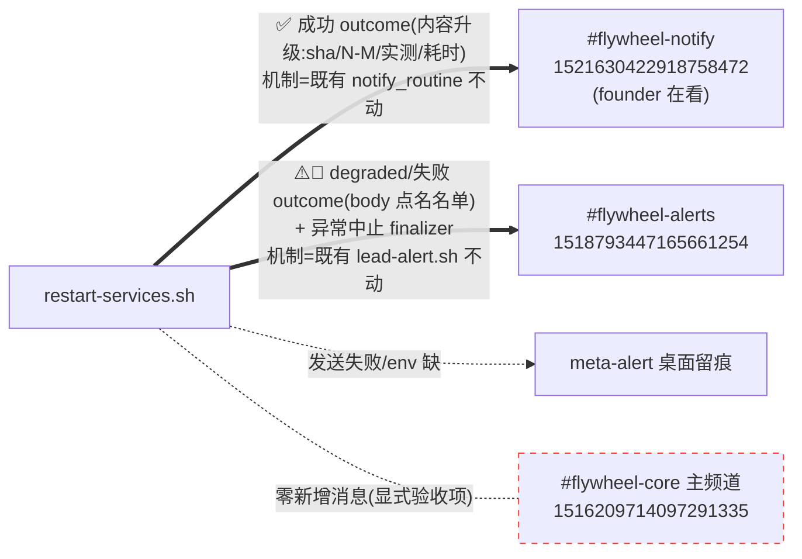

# FLY-1603 全量重启结果通知 founder — 实施计划

Issue: FLY-1603 (https://linear.app/geoforge3d/issue/FLY-1603/基建-全量重启成功后不通知-founder-她不知道什么时候能-expect-舰队上线)
日期: 2026-08-02
基于: exploration.md、research.md

> **⚠️ 设计更正(2026-08-02,founder 亲自纠正 —— 见 design-correction.md,冲突处以它为准)**:「成功/失败都发 founder 主频道」被**废除**,她看 #flywheel-notify,主频道 `1516209714097291335` **零新增消息**(升级为显式验收项)。更正后落点:✅ 成功 → #flywheel-notify `1521630422918758472`(既有 notify_routine 的消息**内容升级**,机制不动;生产 `FLYWHEEL_NOTIFY_CHANNEL` 实值已核相符);⚠️ degraded / 🚨 失败 → #flywheel-alerts `1518793447165661254`(既有 lead-alert.sh 路径机制不动,degraded body 升级为点名名单);异常中止 finalizer → 既有 `alert_severe`。`notify_founder()`/`FLYWHEEL_FOUNDER_DEPLOY_CHANNEL`/claw-bot 权限预检随主频道层一起废除;内容设计、措辞纪律、数据管道、exactly-one、预算、CI 接线全部保留。正文已按此改写;下方评审注记中涉主频道/notify_founder 的措施按 design-correction.md 的映射理解(工程纪律保留,落点改道)。

> Codex design review R1(2026-08-02,xhigh)9 项反馈全部采纳:①EXIT-trap outcome finalizer 建立 set -e 下 exactly-one 不变量 + notify 内部全防护;②stdout 合同解析 fail-closed(严格 schema + 不变量校验,违例→degraded 哨兵,绝不归零);③三处措辞降真实度(T1 不再说「未动旧版本」/ rollback 加有界恢复验证否则写「恢复未验证」/ R4a/R4b 判定纳入 skipped+解析异常 + 版本行区分 attempted/active);④measured probe 必须验响应体 `.ok==true`+偶数样本真中位;⑤routine ✅ 与 founder 三态共用同一 outcome 判定,measured degraded 全局无「完成」;⑥CI 显式接线(ci.yml script-tests 枚举 + ci-structure 注册断言 + test-restart-services.sh 旧 parser/fake-curl 同步);⑦mixed failed+skipped 的 alert 侧字节语义写成显式伪代码;⑧2000 字符确定性预算(优先保全失败名单,clamp reason);⑨degraded 验收改走既有沙箱 harness(flywheel-test-* 是 skip-test,QA room 注入产不出 failed),权限预检必须对 parent channel 真 POST 验 2xx+message id。
>
> Codex R3(2026-08-02,xhigh)3 项亦全部采纳:①固定 fallback 与 EXIT finalizer 改用 arg 解析后即派生的 `SAFE_RESTART_REASON`(120 字符 clamp),固定骨架 <300 字符结构上不可能超限;`notify_founder` 入口加 defense-in-depth(空/超 1900 → 静态短 literal 替换 + meta-alert 留痕),置 SENT 前最终断言非空 ≤1900;新增超长 reason × builder 故障族 / × EXIT/INT 测试断言 fake curl 实收 ≤1900 非空 payload;②malformed rollback probe 不报虚构 N/5 —— 可解析才报实际数字,解析失败写「实测结果无法解析,恢复未验证」;③counts-only 退化保留计入预算的短条件化留档指引(record_ok 真/假两形态),终局表措辞改「预算内全名单;超限诚实截断 + 真实指引」。
>
> Codex R2(2026-08-02,xhigh)4 项亦全部采纳:①build 收进唯一入口 `build_and_send_founder_outcome`(受保护赋值;builder 失败/空输出/超预算 → 固定 fallback 🚨 文案不依赖 builder;拿到有效消息后才置 SENT)—— 堵死「command substitution 失败 → 空消息 + SENT 置位 + finalizer 被抑制」的零有效 outcome 路径;②截断兜底指针改为**可保证的事实**:所有含 Lead wave 的 forward/rollback 终局在发 outcome 前原子写本次运行记录(runId/attempted/active sha/完整名单),builder 仅在写成功时声称「已留档」,写失败用「留档失败」措辞 + 完整名单落部署日志;删除「逐个告警见 #flywheel-alerts」这一无法保证的指引(restart_lead 存在多条不发 alert 的失败路径);③`bridge_verified` 写成唯一赋值合同 `= rollback_health_gate_ok && probe_parse_ok && probe_ok==5`,partial/invalid 一律 R4a 并报实际 N/5;④clamp 闭合:1900/1901 精确边界测试、双名单同时超长、suffix 自身占预算、多字节;builder 返回前最终硬断言 ≤1900,仍超限则收缩到 counts-only,绝不把超限 payload 交给 curl;删除过期的「fleet 7 个」硬编码(现盘 15 个非 test manifest)与过强的 `${#var}`=Discord 计数表述。

## 0. 目标一句话

`restart-services.sh` 的每次全量重启在**终局**恰好产生一条三态结果通知,落在 founder 实际在看的现有频道:✅ 成功进 #flywheel-notify(内容升级:sha 从→到、Lead T/T、Bridge 实测响应、总耗时),⚠️ degraded / 🚨 失败进 #flywheel-alerts(degraded 点名失败者,机制走既有 lead-alert.sh 不动);founder 主频道 #flywheel-core **零新增消息**;异常退出由 EXIT finalizer 兜底(走既有 alert_severe),不漏发不双发。



## 1. Scope / Non-goals

**In**:`scripts/restart-services.sh`(✅ 消息内容升级 + outcome finalizer + 终局调用点 + do_restart_all_leads stdout contract 扩展与严格解析 + Bridge 实测 + rollback 有界恢复验证 + 计时锚点);`.github/workflows/ci.yml` script-tests 枚举 + `ci-structure.test.sh` 注册断言;`scripts/test-restart-services.sh`(旧 parser 拷贝同步 + fake curl 支持 `-o/-w` + degraded 端到端场景);新测试 `scripts/__tests__/restart-outcome-notify.test.sh`;既有 2 个 notify 测试的合同锚点补充。

**Out**:`lead-alert.sh` 任何字节;deploy_failed @-mention 行为;#flywheel-alerts 的**投递机制**(仅 deploy_degraded/deploy_failed 的 body 文案富化,路径/身份/去重不动);notify_routine 的**机制**与 🔄/⏳ 文本(✅ 文本按 §2.1(b) 升级内容 + §2.1(g) 收紧发送条件);**founder 主频道任何新增消息(显式禁止 + 验收)**;update-flywheel.sh(wrap 关系自动受益);「开始重启」新消息;跨次重启聚合去重;新增任何 env/频道配置(废除 `FLYWHEEL_FOUNDER_DEPLOY_CHANNEL`)。

## 2. 变更清单(按文件)

### 2.1 `scripts/restart-services.sh`

#### (a) 计时锚点

main 序列 env 加载后(约 :119 后)加 `DEPLOY_T0=$(date +%s)`;新纯函数 `format_duration <seconds>` → `X分Y秒`(<60s → `Y秒`)。

#### (b) outcome 落点与内容升级(设计更正后:零新 helper、零新频道)

**废除** `notify_founder()` 与一切主频道投递(design-correction.md)。outcome 借**现有两路**投递,只升级内容:

- **✅ 成功** → 既有 `notify_routine`(:1607 调用点)。消息文本从现在的一行升级为富化多行(sha 从→到、`Lead: T/T 全部上线`、Bridge 实测、总耗时)—— `notify_routine` 函数本身零改动,只是传入的 message 变了。
- **⚠️ degraded** → 既有 `alert_warning`(leads-partial-failed / leads-skipped-no-manifest 两调用点)。**body 富化**:点名失败/跳过名单 + sha + 总耗时 + Bridge 实测行;slug/kind/severity/签名/去重/投递机制逐字节不动 —— 更正后 alerts 频道的这条告警**就是** founder 看的 degraded 结果通知,body 必须自足。
- **🚨 失败/回滚** → 既有 `alert_severe` 各终局调用点,body 同样富化(attempted/active sha、回滚验证结果、耗时);`deploy_failed` 的 @-mention 行为不动。

**SAFE_RESTART_REASON(Codex R3#1,保留)**:arg 解析后立刻派生 `SAFE_RESTART_REASON`(`RESTART_REASON` 截 120 字符加 `…`;现行解析只拒空值/换行,不限长,restart-services.sh:492-498)。**所有新增/富化文案**(builder、fallback、finalizer)一律用 `SAFE_RESTART_REASON`;既有未动文本继续用原值。

**主频道零新增(显式禁令)**:实现不得引入任何指向 `1516209714097291335` 的调用/配置;验收测试全终局断言该频道零 POST(§2.3)。

#### (c) exactly-one 不变量 — outcome finalizer(Codex R1#1,落点改道后保留)

仅在终局分支插调用**不能**覆盖 `set -euo pipefail` 下的意外出口(rollback 的裸 `git reset --hard` :1446、`start_bridge` :1462、deployed-sha 写入/`update_project_shas`/marker 删除 :1576-1598、INT/TERM 信号)—— 意外死掉时,notify 频道等不来 ✅、alerts 频道也没有对应告警,founder 又回到「无声消失」。机制:

```bash
OUTCOME_ARMED=0   # 1 = 本次运行承诺必有一条 outcome(✅ 或 ⚠️/🚨 告警)
OUTCOME_SENT=0    # 1 = 某个终局分支已完成它的 outcome 投递

# 唯一终局入口:build 在入口【内部】完成(Codex R2#1 —— 调用侧 command
# substitution 失败不会让外层失败:空消息 + SENT 置位 + finalizer 被抑制
# = 零条有效 outcome)。kind 决定路由:ok→notify_routine;degraded→alert_warning;
# failed→alert_severe。三个既有投递函数全部恒 return 0/带 || true,trap 内安全。
emit_outcome() {   # $1=kind(ok|degraded|failed) $2=slug(告警用) 其余=语义字段
    (( OUTCOME_SENT == 1 )) && return 0    # 幂等:恰好一条
    local kind="$1" slug="$2"; shift 2
    local msg=""
    if ! msg=$(build_outcome_message "$kind" "$@") || [[ -z "$msg" ]] || (( ${#msg} > 1900 )); then
        log "ERROR: outcome message build failed/empty/over-budget — using fixed fallback" >&2
        fire_meta_alert "deploy_outcome_build_failed" "Flywheel deploy outcome build failed" \
            "build_outcome_message failed for kind=$kind args: $*"
        # 固定 fallback:不依赖 builder;只用已限长字段(SAFE_RESTART_REASON+sha 前 7 位),
        # 固定骨架 <300 字符结构上不可能超预算(R3#1)
        msg="🚨 Flywheel 全量重启结束,但结果消息生成失败 (reason=${SAFE_RESTART_REASON}) — 最终状态以部署日志为准。版本: 尝试 \`${DEPLOYED_SHA:0:7}\` → \`${CURRENT_HEAD:0:7}\`"
        kind="failed"
    fi
    # 置 SENT 前最终断言:非空且 ≤1900(fallback 结构上已满足;此处防未来回归,R3#1)
    if [[ -z "$msg" ]] || (( ${#msg} > 1900 )); then
        msg="🚨 Flywheel 全量重启结束,结果消息异常 — 详情见部署日志。"
        kind="failed"
    fi
    OUTCOME_SENT=1                          # 拿到有效非空消息后、投递前置位
    case "$kind" in
        ok)       notify_routine "$msg" ;;
        degraded) alert_warning "$slug" "Flywheel restart degraded" "$msg" ;;
        *)        alert_severe  "$slug" "Flywheel deploy failed" "$msg" ;;
    esac
}

finalize_outcome_on_exit() {
    if (( OUTCOME_ARMED == 1 && OUTCOME_SENT == 0 )); then
        OUTCOME_SENT=1
        # 固定文案,不经 builder(trap 内零可失败构造;format_duration 纯算术);
        # 走既有 alert_severe → #flywheel-alerts(founder 已确认失败面看这里),
        # deploy_failed 天然带 @-mention,与既有失败告警行为一致
        alert_severe "deploy-aborted-unexpectedly" "Flywheel deploy aborted" \
            "🚨 Flywheel 全量重启异常中止 (reason=${SAFE_RESTART_REASON}) — 过程被信号/意外错误打断,最终状态未知,需人工确认。版本: 尝试 \`${DEPLOYED_SHA:0:7}\` → \`${CURRENT_HEAD:0:7}\`;总耗时: $(format_duration $(( $(date +%s) - DEPLOY_T0 )) 2>/dev/null || echo 未知)。详情见部署日志"
    fi
}
```

- `acquire_lock` 的既有 trap(:541)改为 `trap 'finalize_outcome_on_exit; rmdir "$LOCK_DIR" 2>/dev/null; rm -f "$PROJECT_SHA_UPDATES_FILE" 2>/dev/null; exit' EXIT INT TERM`(finalizer 前置,锁清理字节保留)。
- **武装点**:main 序列 `log "Starting full restart"`(:1614)处 `OUTCOME_ARMED=1` —— dry-run(:669 exit)、锁竞争(:535/:538 exit)、storm gate 等早退都在武装前,不发。
- 终局分支一律经 `emit_outcome`:正常路径发完后 finalizer 看到 `OUTCOME_SENT=1` 静默 —— 不漏发、不双发;builder 失败也保证恰一条**非空**消息(fallback,降级为 failed 路由)。
- T4/T5 的 `emit_outcome degraded` **就是**原 leads-partial-failed / leads-skipped-no-manifest 告警本身(body 富化,见 (f))—— 不是在既有告警之外再加一条,alerts 频道每次 degraded 仍恰一条终局告警。

#### (d) `measure_bridge_health()` — Bridge 实测(验真值,Codex R1#4)

deploy_and_verify 里 `hc_ok=true` 后调用;stdout 一行机器可读(仅被 `$( )` 捕获):

```bash
# FLY-1603: measured /health probes AFTER the boolean gate. Each probe only
# counts if HTTP succeeds AND the body parses AND .ok == true — an HTTP 200
# carrying {"ok":false} or garbage is a FAILED probe (FLY-1600 lesson).
# stdout: "ok:<N> med_ms:<X> max_ms:<Y>"  (N = 0..5; X/Y = "-" when N=0)
measure_bridge_health() {
    local interval="${FLYWHEEL_HEALTH_PROBE_INTERVAL:-1}"
    local times=() body t start end n=0
    for _ in 1 2 3 4 5; do
        start=$(date +%s%N 2>/dev/null || echo 0)
        if body=$(curl -sf --max-time 5 "$BRIDGE_URL/health" 2>/dev/null) \
           && printf '%s' "$body" | jq -e '.ok == true' >/dev/null 2>&1; then
            end=$(date +%s%N 2>/dev/null || echo 0)
            ...  # ms 计算(见下),push into times; n+=1
        fi
        sleep "$interval"
    done
    ...
}
```

- 计时:macOS `date +%s%N` 不可靠 → 用 `curl -w '%{time_total}'` 同时拿 body:`out=$(curl -sf --max-time 5 -w $'\n%{time_total}' "$BRIDGE_URL/health")`,最后一行是秒(小数),其余行是 body;body 过 `jq -e '.ok == true'` 才把该次时长计入(×1000 取整 ms)。
- 中位数:奇数取中;**偶数取两中位均值(整数除)**;`ok:0` → `med_ms:- max_ms:-`。
- `FLYWHEEL_HEALTH_PROBE_INTERVAL`(默认 1)让测试置 0,避免 harness 平白 +5s(Codex R1#6)。
- 措辞映射:`ok:5` → `健康,/health 实测 5 次全通 (中位 Xms / 最大 Yms)`;`0<ok<5` → `/health 实测 5 次仅 N 次通过 (中位 Xms / 最大 Yms) — 响应不稳`;`ok:0` → `健康检查通过但后续实测全部失败 — 状态存疑`。后两档即使 Lead 全成也**整条降 ⚠️**,且该次运行全局(含 routine 路)不得出现任何「完成」字样(见 (g))。

#### (e) `do_restart_all_leads` stdout contract 扩展 + 严格解析(fail-closed,Codex R1#2)

行式:`skipped:N failed:M total:T failed_ids:<csv|-> skipped_ids:<csv|->`

- `T` = candidate_count − skip-test 数;循环内积累 `failed_keys+=("$key")` / `skipped_keys+=("$key")`,CSV 逗号连接,空 → `-`。
- 三个早退分支(convergence ×2 / mktemp / inventory)输出 `skipped:0 failed:1 total:1 failed_ids:restart-wave-refused skipped_ids:-`(哨兵;消息层译为「Lead 重启批次整体被拒(详情见 #flywheel-alerts)」,不编名单)。
- **新严格 parser**(3 个调用点统一走它,替换现行 sed):

```bash
# stdout: "skipped:N failed:M total:T failed_ids:<csv|-> skipped_ids:<csv|->"
# on ANY violation → the invalid sentinel (degraded, fail-loud), NEVER zeros.
parse_lead_restart_result() {
    local raw="$1"
    local re='^skipped:([0-9]+) failed:([0-9]+) total:([0-9]+) failed_ids:([A-Za-z0-9._,-]+|-) skipped_ids:([A-Za-z0-9._,-]+|-)$'
    # 恰好一行、整行匹配 schema
    if [[ $(printf '%s\n' "$raw" | grep -c .) -ne 1 ]] || ! [[ "$raw" =~ $re ]]; then
        log "ERROR: lead restart result unparseable: '$raw'" >&2
        fire_meta_alert "lead_result_invalid" "Lead restart result unparseable" "raw: $raw"
        echo "skipped:0 failed:1 total:1 failed_ids:restart-wave-result-invalid skipped_ids:-"
        return 0
    fi
    # 不变量: failed+skipped<=total;计数与名单条数一致(- 记 0)
    ...同违例路由到 restart-wave-result-invalid 哨兵...
    echo "$raw"
}
```

调用形态:`lead_result=$(parse_lead_restart_result "$(do_restart_all_leads)")` 后按字段名锚定提取(`grep -oE '(^| )failed:[0-9]+'` 式);此后提取**不可能**失配(parser 已保证 schema),兜底 `|| true` 仅护 set -e。哨兵 `restart-wave-result-invalid` 在 outcome 判定里 = degraded(⚠️),rollback 判定里 = Lead 未恢复。

#### (f) 终局调用点与措辞(真实度修正,Codex R1#3/#7)

统一骨架 builder:

```bash
# build_outcome_message <三态首行> <版本行> <Lead 行> [Bridge 行] [附注行...]
# 版本行两种形态:部署成功 "版本: `old` → `new`";失败/回滚 "版本: 尝试 `old` → `new` 失败;当前 active: `<sha>`(恢复已验证/未验证)"
```

| 终局 | 三态 | 关键措辞(修正后) |
|---|---|---|
| T6 全成功(leads 全 ok 且 measured `ok:5`) | ✅ | `✅ Flywheel 全量重启完成` + 版本 + `Lead: T/T 全部上线` + Bridge 实测 + 总耗时 |
| T6′ leads 全 ok 但 measured `ok<5` | ⚠️ | `⚠️ Flywheel 全量重启结束,但 Bridge 响应异常` + 对应 Bridge 措辞档;**无「完成」** |
| T4/T5 degraded(failed>0 或 skipped>0 或解析哨兵) | ⚠️ | `⚠️ …结束,但有问题 (degraded)` + `Lead: T 个里 K 个成功、X 个失败: <预算内全名单;超限时诚实截断 + (i) 的真实留档指引>` + skipped 行(如有)。**该消息就是 leads-partial-failed / leads-skipped-no-manifest 告警本身的富化 body**(更正后 alerts 频道即 founder 看的失败面,无需再指向别处) |
| T1 端口卡死中止 | 🚨 | `🚨 …部署中止: Bridge 端口未释放` + `deployed-sha 未推进;旧 Bridge 已被停止,Bridge/端口状态需人工确认 (lsof -ti:<port>)`(**不写「未动旧版本」**——stop_bridge 已 TERM/KILL) |
| R1 无 known-good sha | 🚨 | `🚨 …首次部署失败且无法回滚,需人工介入` |
| R2 回滚被脏工作区阻止 | 🚨 | `🚨 …失败,回滚被脏工作区阻止,需人工介入` |
| R3 回滚时端口卡死 | 🚨 | `🚨 …失败,回滚时端口未释放,需手动处理` |
| R4a 回滚后 Lead/Bridge 未全恢复 | 🚨 | `🚨 …更新失败,已回滚到 \`<old>\`,但恢复不完整: <点名 failed+skipped>` + 回滚 Bridge 验证结果行 |
| R4b 回滚且恢复已验证 | 🚨 | `🚨 …更新到 \`<new>\` 失败,已回滚到 \`<old>\` 并验证恢复 (Bridge 实测…;Lead 全部拉起)` |
| R5 回滚 build 也失败 | 🚨 | `🚨 …更新失败且回滚 build 也失败,系统状态异常,需人工介入` |
| F 异常退出(finalizer) | 🚨 | (c) 中的通用中止文案 |

- **rollback 恢复验证**(R1#3b + R2#3):`rollback_and_restart` 在 `start_bridge` 后新增有界健康验证 —— 复用 T6 同款 `.ok` 轮询(`FLYWHEEL_ROLLBACK_HEALTH_TRIES` 默认 60 ×2s)+ `measure_bridge_health`。**唯一赋值合同**:

  ```bash
  # rollback_health_gate_ok: 有界 .ok 轮询在窗口内出现过健康样本
  # rb_probe: measure_bridge_health 输出;rb_probe_ok: 其 ok:<N> 字段(解析失败=-1)
  bridge_verified=$(( rollback_health_gate_ok == 1 && rb_probe_parse_ok == 1 && rb_probe_ok == 5 ))
  ```

  R4b 仅当 `rb_failed==0 && rb_skipped==0 && 解析非哨兵 && bridge_verified==1`;其余一律 R4a + 「恢复未验证/不完整」。Bridge 行按可知性分写(Codex R3#2):**可解析**的 4/5、0/5 报实际 `N/5`;**malformed(`rb_probe_parse_ok==0`)报「实测结果无法解析,恢复未验证」,不给任何虚构数字**。测试覆盖 gate-pass+4/5、0/5、malformed(断言 R4a + 无数字 + 无「验证恢复」)、5/5 四分支(R2#3/R3#2)。
- **T4/T5 alert 侧语义(设计更正后,取代 R1#7 的 body 字节保持)**:if-chain 的**顺序/slug/kind/severity/return 语义**不变;**body 由 emit_outcome 富化**(这就是 founder 看的 degraded 结果通知,须自足):

```bash
if (( leads_failed > 0 )); then
    log …
    emit_outcome degraded "leads-partial-failed" …   # body 富化:sha + T/K/X + failed 名单 + skipped 名单(如有)+ Bridge 实测 + 耗时
    return 0
fi
rm -f "$PLUGIN_RESTART_PENDING"
if (( leads_skipped > 0 )); then
    log …
    emit_outcome degraded "leads-skipped-no-manifest" …   # 同上,skipped 名单为主
    return 0
fi
```

  ⇒ mixed(failed>0 且 skipped>0)时 #flywheel-alerts 仍**只**收 `leads-partial-failed` 一条(与今天一致),其富化 body 含两份名单。行为测试断言:恰一条终局告警 + 两份名单在 body 内 + notify 频道零 ✅ + 主频道零 POST。

#### (g) ✅ 消息升级与 outcome 判定收敛(Codex R1#5,设计更正后)

现 :1607 的 `notify_routine "✅ …全量重启完成…"` 无条件跑在全成功分支。改为同一 outcome 判定驱动,且 ✅ 文本升级为富化多行(**取代**原一行文本 —— 这正是 founder 要的内容;机制仍是 notify_routine):

```bash
bridge_probe=$(measure_bridge_health)        # 采样点:Lead 重启后、终局判定前(见时序)
...
if (( leads_failed == 0 && leads_skipped == 0 )) && [[ "$probe_ok" == "5" ]]; then
    emit_outcome ok - …    # → notify_routine,富化 ✅:sha 从→到 + Lead T/T + Bridge 实测 + 总耗时
else   # T6′: leads 全 ok 但 measured 降级
    emit_outcome degraded "bridge-response-degraded" …   # → alert_warning(alerts 频道)
    # notify 频道零 ✅ —— 该次运行全局无「完成」
fi
```

时序:`measure_bridge_health` 在 Step 4(Lead 重启)完成、终局判定前执行一次,供 T4/T5/T6/T6′ 共用 Bridge 行(重启后即时快照;probe 5 次 ×(≤5s+interval) 有界)。

#### (h) 本次运行记录 — `write_leads_restart_status` 扩展为全终局留档(Codex R2#2)

加性扩展字段:`runId`(`${DEPLOY_T0}-$$`)、`total`、`failedIds`/`skippedIds`(CSV 原样)、`attemptedSha`、`activeSha`、`outcome`(succeeded/degraded/rolled-back/rollback-degraded/aborted),schemaVersion 保持 1(消费者仅本脚本 + test-restart-services.sh,已核)。**调用面扩展**:所有含 Lead wave 的终局(forward T4/T5/T6 既有一处 + rollback R4a/R4b 新增)在**发 outcome 前**原子写;写结果布尔量 `record_ok` 传给 builder —— 消息里的留档指引**只在 `record_ok=1` 时**出现(「完整名单已留档(leads-restart-status)」),写失败时改为「留档失败,全名单见部署日志」且完整 CSV 必落 stderr(deploy log)+ 既有 `restart-status-write-failed` 告警(:1586)保留。不再声称「逐个告警见 #flywheel-alerts」—— `restart_lead` 存在多条只 `return 1` 不发 alert 的失败路径(:1040/:1072/:1099/:1197 等),该指引无法保证(R2#2)。

#### (i) 闭合的 2000 字符预算(Codex R1#8 + R2#4)

`build_outcome_message` 统一 clamp,**返回前最终硬断言**:
1. `RESTART_REASON` 进消息前截 120 字符(加 `…`);
2. 组装后 `${#message} > 1900` → 逐步收缩:先截 `skipped_ids` 再截 `failed_ids`(尾部替换 `…等共 X 个` + (h) 的条件化留档指引;suffix 自身长度计入预算);
3. 收缩后仍 `>1900`(病理路径)→ 退化为 counts-only 消息:状态行+版本行+计数行+耗时行,**只删身份名单,保留一条计入预算的短条件化指引**(Codex R3#3):`record_ok=1` → 「全名单已留档(leads-restart-status)」;`record_ok=0` → 「留档失败,全名单见部署日志」;
4. **返回前断言 `${#message} <= 1900`,违背即走 (c) 的 fallback 路径 —— 绝不把超限 payload 交给投递函数**(emit_outcome 置 SENT 前另有静态 literal 最终断言,双保险);
5. 不预设 fleet 规模(现盘 15 个非 test manifest,会继续变);预算合同 = 「≤1900 字符内全名单点名;超限时诚实截断/退化 + 真实留档指引」。1900 的余量本身就是对 `${#var}`(字符计数)与 Discord(unicode 计数)差异的安全垫,不声称两者恒等。
测试:**1900/1901 精确 off-by-one**、failed+skipped 同时超长、suffix 占预算、多字节中文、counts-only 退化路径 × `record_ok` 真/假两分支、**超长 reason(2500 字符)× builder 非零/空/超限 与 × EXIT/INT**(断言 fake curl 实收一条非空 ≤1900 payload,R3#1)。

### 2.2 env / 配置

**零新增**(设计更正后):`FLYWHEEL_FOUNDER_DEPLOY_CHANNEL` 废除;成功路复用 `FLYWHEEL_NOTIFY_CHANNEL`(生产实值已核 = `1521630422918758472`,即 founder 说的 Flywheel Notification 频道),失败路复用 `FLYWHEEL_UNIFIED_ALERT_CHANNEL_ID`(= `1518793447165661254`)。部署 checklist 仅需确认这两个 env 现值(见 §3)。

### 2.3 测试

#### 新 `scripts/__tests__/restart-outcome-notify.test.sh`(hermetic,照 restart-notify-routine.test.sh 模式)

1. **measure_bridge_health 单元**:200+`ok:true` 计入;200+`ok:false`、200+非 JSON、5xx、timeout 不计入;2/5 与 5/5 与 0/5 输出形态;偶数样本中位 = 两中位均值。
2. **严格 parser 单元**:合法行原样过;多行/缺字段/计数与名单不一致/`failed+skipped>total`/非法 id 字符 → `restart-wave-result-invalid` 哨兵 + meta-alert。
3. **终局行为级(变异判据主体)**:抽取 `deploy_and_verify`/`rollback_and_restart`/`build_outcome_message`/`emit_outcome`/`format_duration` + stub 协作函数,fake `notify_routine` 与 `alert_warning`/`alert_severe`(记录 slug+body)三路记录。逐终局断言:恰 1 条 outcome(✅ 落 notify 路、⚠️/🚨 落 alert 路,slug 正确)+ 三态首行 + 关键内容(T6 ✅ 含 sha/`T/T`/中位/耗时;T4T5 mixed 恰一条 `leads-partial-failed` 且 body 含两份名单、notify 路零 ✅;T6′ 走 `bridge-response-degraded` 且全局无「完成」;R4b 含「已回滚」「验证恢复」且仅在 measured 5/5 时出现;R4a 覆盖 gate-pass+4/5、0/5、malformed 三分支 —— 4/5、0/5 报实际数字,**malformed 的 Bridge 行无 N/5 数字且含「无法解析」**(R4-note#1);R4a 含「恢复不完整」+ 点名)。**主频道零 POST 断言:全部终局场景中,记录到的所有投递无一指向 `1516209714097291335`(fake 层按频道/helper 记账)**。**删除任一 emit_outcome 调用或 finalizer → 对应断言必红**。
4. **fault-injection(finalizer + builder 合同,Codex R1#1 + R2#1)**:武装后在 stub 里注入 —— rollback `git reset` 失败、deployed-sha 写失败、`update_project_shas` 失败、模拟 INT —— 断言 EXIT 路径恰 1 条 `deploy-aborted-unexpectedly` alert_severe;dry-run/锁竞争路径零消息。**builder 故障族**:build_outcome_message 返回非零、输出空串、输出超 1900 —— 断言仍恰 1 条**非空**固定 fallback(路由降级为 failed)+ `deploy_outcome_build_failed` meta-alert + finalizer 不再补发。
5. **运行记录合同(Codex R2#2)**:rollback 终局也写 record(含 runId/attemptedSha/activeSha/outcome/名单);写失败 → 消息含「留档失败」且完整 CSV 出现在 stderr;一个不发 per-lead alert 的 restart_lead 失败路径(如 projectDir 解析失败)仍出现在 failedIds 与消息点名里。
6. **预算 clamp**:**1900/1901 精确边界**、120 字符 reason 截断、双名单同时超长、suffix 占预算、多字节、counts-only 退化 × `record_ok` 真/假、**超长 reason(2500 字符)× builder 故障族与 × EXIT/INT**(断言 fake 投递层实收一条非空 ≤1900 body,R3#1)。

#### `scripts/test-restart-services.sh`(既有端到端 harness,Codex R1#6)

- 同步旧 parser 拷贝(:637-651)到新合同;
- `bo_run` fake curl 支持 `-o/-w '%{time_total}'` 形态(返回可解析 body + 时长),`FLYWHEEL_HEALTH_PROBE_INTERVAL=0`;
- **新增 degraded 端到端场景**:fixture manifests 里放一个非 `flywheel-test-*` 前缀、必失败的 Lead identity,真脚本跑完断言 fake lead-alert 收到富化 degraded body(点名)且 notify 路零 ✅、founder 主频道零 POST —— 这就是 issue「跑一次 degraded 的 restart」的沙箱形态(生产 fleet 零风险;flywheel-test-* 在 resolver 里是 skip-test,QA room 注入产不出 failed,Codex R1#9);
- 成功端到端场景断言 notify 路恰一条富化 ✅、数字与 fixture 一致、主频道零 POST。

#### CI 接线(显式,Codex R1#6)

- `.github/workflows/ci.yml` `script-tests` 显式枚举加 `restart-outcome-notify.test.sh`(紧邻既有两个 notify suite,:451-459 区段);
- `ci-structure.test.sh` 加注册断言(新测试文件必须出现在 ci.yml 枚举里,防漏挂);
- `restart-services-notify.test.sh` 合同锚更新:deploy_degraded/deploy_failed 的**机制锚**(slug/kind/severity/调用点集合)保持,body 锚按富化文案更新(设计更正取代了 R1#7 的 body 字节保持)。

## 3. 部署 checklist(实现节点执行)

1. **env 确认(非新增)**:`FLYWHEEL_NOTIFY_CHANNEL` 现值应为 `1521630422918758472`、`FLYWHEEL_UNIFIED_ALERT_CHANNEL_ID` 应为 `1518793447165661254`(设计时已核相符;实现时再读一次活值防漂移)。**不新增任何 env,不需要任何权限预检**(两路 sender 均为现役,天天在发)。
2. ship 本 feature 的那次生产重启 = 成功面真机验收:#flywheel-notify 应收到第一条富化 ✅,数字与部署日志一致;**同时人工确认 #flywheel-core 主频道零新增消息**。
3. degraded 面验收 = §2.3 的沙箱端到端场景(真脚本 + 假 HOME + shims);不在生产 HOME 注入 fixture。

## 4. 验收(更正后行为面判据 → 覆盖映射)

| 判据 | 覆盖 |
|---|---|
| 成功 restart → #flywheel-notify 收到富化 ✅,数字与日志一致 | checklist 2(真机)+ 端到端成功场景 + 行为级 T6 |
| degraded restart → alerts 频道告警明确写出失败的那几个,不是「完成」 | 沙箱端到端 degraded 场景 + 行为级 T4T5/T6′(全局无「完成」断言) |
| **founder 主频道 `1516209714097291335` 零新增消息** | 行为级全终局零 POST 断言 + 端到端两场景断言 + checklist 2 真机人工确认 |
| 变异判据:去掉通知调用 → 测试红 | 行为级「恰 1 条」断言 ×每终局 + finalizer fault-injection |
| alerts 路机制不动(slug/kind/severity/去重/投递) | 既有测试回归 + 机制锚断言(body 富化为唯一变化) |
| Bridge 实测响应 | measure_bridge_health 单元(验 `.ok`)+ 三档措辞映射断言 |

## 5. 风险

- stdout contract 回归(严格 parser fail-closed + 3 调用点同 PR + 单元/端到端双覆盖);
- trap 改动波及锁清理(trap 行字节保留原清理段,finalizer 前置纯附加;fault-injection 覆盖);
- awk 函数抽取脆弱性(既有两测试同模式在用,新抽函数体无顶格 `}`,风险与现状持平);
- 极端长名单(确定性预算 + 留档指引为真);
- ✅ 文本变化影响下游(grep 检索 `全量重启完成` 的消费者:已核仅 restart-notify-routine.test.sh 的合同断言,随本 PR 同步更新)。
