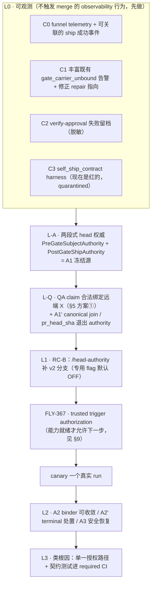
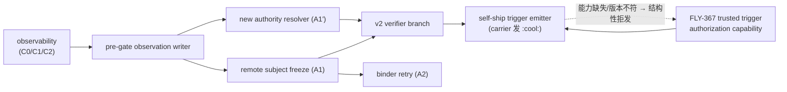

# FLY-1625 按根因分层的 self-ship 修复方案 — 实施计划

Issue: FLY-1625 (https://linear.app/geoforge3d/issue/FLY-1625/founder-直令机理深究-self-ship-修了又坏-n-次-全链取证今晨三单-1609-claims-路径-按根因分层的修复方案)
日期: 2026-08-04
基于: research.md

> **修订记录**
> - v8 → **v8.1（本版）**：**Codex design review R8 = APPROVED**（共 8 轮）。本版只折入 R8 的 3 条 downstream note（非批准条件）：① `§10.1#4g` 明确为 **L-Q / canary 前的门**而非最后的整体 smoke，选 (ii) 时原子交接须覆盖 checkout 到 activation 的**整个暴露期**；② 失败过程**不得**建模成"一次干净的状态转移"（research §3.10 补真实编年表：`worktree_dirty` gen 1–385 与首个 `head_mismatch` gen 136–330 **区间重叠**，实际 head 随 fix-loop 前推四次）；③ actor 归属追查降为可观测性工作，非前置。另补一条实测事实：该 wedge 发了 **423 条 stalled 告警**仍无人能解 —— **缺的不是可观测性，是带审计的对齐杠杆**。
> - v7 → v8：吸收 R7。**发现同一根因的第三条伤害路径 —— progress ledger 也把 rework 重入钉死**（research §3.10 新增，完整只读实测）：FLY-1571 的 rework request **成功创建了**，卡在 implement activation 前的 `assertWorktreeReady`（`base_revision` = `7cb9c776` = `chore(progress): implement 6/6`，worktree 已被 fix-loop 的两笔真 `fix(...)` 推到 `f111a2f2`），**空转 748 代后 held**。据此新增 **§5.2.4「ledger sink ↔ rework admission 互不干扰契约」**（(i) sink 不碰被检查的 worktree/ref，或 (ii) activation 前原子建立 clean exact-`X` checkout，二选一）+ **§10.1#4g 全链集成反例**（必须断言"穿过了 ledger 写入之后的 implement activation"，只断言最终有 fresh evidence 会漏掉这种"安全地卡死"）。§8.2 / §11#6c 相应更正 —— **v7 在这里也只查了一层就下结论，如实留档**。
> - v6 → v7：**撤回 v6 自行新增的「FLY-1571 是 L-Q 前置」—— 那是我判断错了**（R6 反证，我复核确认）。三条实据：① FLY-1571 是「Runner stop 通知」票、已合入 main，不是记录 attempt 缺口的票（我把"事故发生在哪张单上"当成了"哪张单在修它"）；② `POST /re-qa` 是 legacy session 收编路，不是 generalized QA retest 的能力探针；③ 生产实测 FLY-1609 run `c7b129bd` 的同一 QA execution **已经**拿到 attempt 1/2 两条绑不同 head 的 `qa_verdict` 凭据。§5.2.3(c) 改接既有 generalized rework/activation 路径（含负例断言），§8.2 重写并如实记录这次误判，第六次实例降级为 §11#6c 的开放调查线（FLY-1571 的 run `ae3b7edb` 确实只有 qa attempt 1 —— 但那是"没触发"不是"没能力"）。
> - v5 → v6：吸收 R5 的唯一 blocker。新增 **§5.2.3「QA evidence 不可变契约」** —— v5 的「detached checkout + 零新提交」不够：(反例①) generalized qa 节点照样收到 ledger 指令且 `progress` 的 git commit 锚在 `process.cwd()`；(反例②) qa 节点实测 `shared_branch_writer=true`，未提交的脏改动能让 verdict 实际证明 `X + dirty delta` 却把 claim 写成 `X`（**直接违反不变量 5**）。定稿 = evidence checkout 只读/证据时刻 clean + artifact 写到 checkout 外的受控 sink + QA 要补测试就 FAIL/hand back 形成新 head `Z` 后 fresh review + fresh QA；checkout 与 ledger sink 是**一个 capability bundle**，非法组合在 evidence 产生前 fail closed（§9 两行 + 验收 §10.1#4f）。~~并据此把 FLY-1571 从旁支上升为 L-Q 的前置~~ ← **这一条 v7 已撤回，见上**。
> - v4 → v5：吸收 R4 的 3 条。三项设计裁决落笔：**① §5 定稿采用方案①**（QA 在远端 `X` 的 clean/detached checkout 上跑）并钉死 QA ledger 去向契约；**② `sessions.pr_head_sha` 退出 authority**、canonical join 改走 observation receipt（§7.2.1）；**③ 重画 canary 边界** —— A1/A1' 全部并入 canary 前的 L-A/L-Q，canary 后只留 A2/A2'/A3，覆盖分层更正为 **A1=4/6、A1'=+1/6、A2'=最后 1/6**。另：**FLY-367 从排期约定升级为 fail-closed 的运行时能力依赖**（新增 §9.1 + 验收 §10.1#4e），A2' 首个 slice 默认取 fail-closed 人工终止，research §8 的 FLY-1624 残留表述改为与 §9 / plan §4.1 一致。
> - v1 → v2：吸收 Codex design review R1 的 8 条，全部逐字核实后采纳。
> - v3 → **v4（本版）**：吸收 R3 的 3 条。两条设计裁决：**① RC-A 的 6 个样本触发项分三类**（progress ledger 只解释 4 个），新增 terminal carrier 的处置语义；**② `:cool:` 这一跳没有 founder gate、也不携带批准时的 head（FLY-367）**，升级为 canary 前的**硬依赖**，§1 的 trigger actor 相应从「小开放问题」提升为**安全架构决策**。
> - v2 → v3：吸收 R2 的 8 条。最重要的一条是 **R2#1 —— v2 提出的 "RC-C：合同禁止 self-merge" 是误读，已撤回**（见 research §0.0 / §4b）。runner 本来就不该跑 `gh pr merge`；sanctioned 路径是 `verify-approval → :cool: → GitHub Actions SHA-pinned merge`。因此 v2 的 L-1「A/B 二选一」前置**作废**，本单回到纯工程修复 + 一个小得多的开放问题（§1）。

---

## 0. 目标与不变量

> ### ⚠️ 范围（跟 research §0 同一句话）
>
> 本单从头到尾只讲**一件事**：**「founder 批准之后，runner 自己把 PR 合掉」这一步，在 DAG 路径上不工作。**
> 流水线本身在跑 —— design → implement → qa → gate 全都跑了，PR 也产出了、也合进 main 了，
> 只是**每一次都得人手动点 merge**。任何把本文读成「DAG 没跑」的说法都是误读。

**目标**：让 sanctioned self-ship 链 —— **founder 批准 → runner `verify-approval` 通过 → runner 发一次 `:cool:` → `ship-on-comment.yml` 以钉死 head_sha 合并** —— 从结构上成为可能，而不是碰运气可能。

**必须守住的安全不变量**：

1. 批准归属永远是 founder；消息文本永远不是授权。
2. **不降低端到端安全属性。** （v2 写的"逐 predicate 只收紧不放松"是错的：L-A 确实要删掉 caller/local-HEAD 的硬等值。正确表述 = **被替换的 predicate 必须由 remote exact-head + membership + receipt 组成的等价或更强证明覆盖**。）
3. **合法的 transient/operational 状态必须有带审计的恢复路或明确的人工终止**（FLY-1483 诉求）。**安全违规（foreign execution、伪 founder attribution、nested unsupported 等）保持 hard deny，不自动收敛。** （v2 写的"每条 fail-closed 分支都要有收敛路"范围过宽。）
4. 模型/runner 永远只能 REQUEST，不能 SELF-AUTHORIZE（FLY-175/245）。
5. **QA / Codex 证据严格绑定 exact head，永不跨 head 复用**（holder evidence 有 no-update/no-delete trigger，`StateStore.ts:14759-14795`）。
6. **runner 永不直接 merge**（FLY-248 红线）。它只在服务端已验证 founder exact-head 批准后**代发一次可关联的 sanctioned `:cool:` trigger**；merge 由 `ship-on-comment.yml` 用 `sha: HEAD_SHA` 执行。
7. 每个行为改动带**自己的**默认 OFF flag + OFF sentinel；**不得复用 `FLYWHEEL_WORKFLOW_CLAIMS_READ`**（那是整条 claims-read/legacy 的总闸）。

**明确不做**：本单不改实现代码（founder 直令：诊断先行）。本文件是**方案**，落地拆成下游 issue。

---

## 1. 安全架构决策：trigger actor 与 `:cool:` 的 pre-effect 授权（FLY-367 硬依赖）

v2 曾把「runner 自 merge vs operator ship node」当成 founder 必须先裁决的 A/B —— **那个二选一基于误读，已作废**（两种方案都只能发 `:cool:`，都不得直接 merge）。

但 R3 揭示了一个**必须在 canary 之前解决**的真问题（research §4c 逐字核实）：

> **`ship-on-comment.yml` 完全不验证 founder 批准，也不携带批准时的 head。** 触发条件只是「open PR + comment body 逐字等于 `:cool:`」；授权只查 commenter 有没有 repo write；`HEAD_SHA` 是 comment **之后**由 `pulls.get` 现读的。整个文件里 `founder` / `approval` / `question_id` / `verify` 出现 **0 次**。

两条必须封住的路径：

1. **self-authorize**：有 write 身份的 carrier 跳过 `verify-approval` 直接发 `:cool:` → 照样 merge。**今天挡住它的只有提示词，而提示词不是安全边界。**
2. **exact-head TOCTOU**：批准并 verify 了 `X`；comment 发出后、workflow `pulls.get` 之前 PR 漂到 `Z` → CI 跑 `Z`、merge `Z`。`pulls.merge({sha})` 只防「读到之后再漂」。

**这个洞仓内早有单号 = FLY-367。** FLY-350 把它列为「不阻塞」，前提是 **Mufasa 被结构性剥夺了发 `:cool:` 的能力**（shell net-off + 无 GH_TOKEN + gateway 无 comment 工具）。**本计划恰恰要让 carrier 同时拥有并被指示使用这个能力** —— 正是 FLY-350 刻意回避的配置。所以对本单，**FLY-367 是硬依赖，不是并行 follow-up**。

### 1.1 最低安全合同（canary 前必须成立）

- **不可逆 effect 之前**必须有 trusted、head-scoped、**single-use** 的 trigger authorization，绑定 `run_id + question_id + founder-attributed approval + approved head X + repo/PR/generation`；
- workflow **必须拒绝普通 write collaborator 发出的裸 `:cool:`**，并在 checkout/merge 之前验证 current PR head **等于 credential 里的 `X`**；
- 若保留 **carrier 发 trigger**：它只能拿到并使用本次的 head-scoped one-time credential，**不得仅凭 GitHub write 权限触发**；
- 若改为 **引擎侧 ship node 发 trigger**：必须**同时结构性移除 carrier 的 comment/merge 通道**，且仍要把 expected `X` 带进 workflow（「发之前刚 recheck」消不掉 comment→workflow 的竞态）。

### 1.2 三条安全 E2E（缺一不可）

1. 无 founder approval 的 write collaborator 发裸 `:cool:` → **不得 merge**；
2. 批准 `X` 后、workflow 取 head 前漂到 `Z` → **必须拒绝**；
3. 旧 question / 旧 head / replayed trigger → **必须拒绝且零 merge 副作用**。

### 1.3 顺带的措辞统一（低风险，非根因）

`engineer-executor.md:32-35` 的「Never self-merge」比 bootstrap 含混。统一为：

> 不得 self-authorize、**不得直接 merge**；仅在服务端已验证 founder exact-head 批准后，**代发一次可关联的 sanctioned `:cool:` trigger**。

这是 prompt-coverage 治理，**不计入失败归因**（16 个样本零个走到那一步）。

---

## 2. 分层总览

**为什么 L-A / L-Q 提到 L1 之前**：只修 `/head-authority` 而不统一 head 权威，救回来的只是"卡片能发出"，runner 侧仍会被三道本地 HEAD 硬门拦死（research §3.7）。**L1 单独上线不是可独立宣称安全/完整的单元。**

**canary 边界（R4#1 更正）**：v4 曾把同一件事（freeze / join 迁移）同时排在 canary 前的 L-A/L-Q 和 canary 后的 L2/A1/A1' —— 那是矛盾的。定稿为：

- **canary 之前**：L0 → **L-A（＝A1 冻结源）** → **L-Q（＝§5 方案① + A1' canonical join）** → L1 → FLY-367 能力就绪。这一段跑完，6 个 unbound 里的 5 个（4 ledger + FLY-1460）在结构上已可绑定。
- **canary 之后**：L2 只剩**真正能独立发布**的三项 —— A2（binder 可收敛）、A2'（terminal carrier 显式处置）、A3（安全恢复）。它们都不改变 head 权威的定义，只补收敛与恢复能力。

---

## 3. L0 — 可观测先行

⚠️ 用词更正：这些**不是"无行为变化"**（C0 写新 durable event、C1 改 alert 文本、C2 写本地文件都改变外部可观察行为）。准确说法是「**不触发 merge 的 observability 行为**」，同样各自带专用 flag + OFF sentinel。

| 项 | 内容 | 关键约束 |
| -- | -- | -- |
| **C0** | funnel telemetry 逐级计数：`holder created → bound → card posted → founder response → approved_to_ship → verify attempted → :cool: sent → ship run started → ship run success → PR merged (exact head)` | **成功事件必须由可关联的 durable chain 驱动**，不能只看"PR 已 merged"： current question/head approval → carrier 发出的 **comment id** → 匹配 `trigger_comment_id=<id>` 的 **started receipt**（`ship-on-comment.yml:50-56`）→ 该 `run_id` 的 **success** → PR merged head **精确等于**冻结 head。 缺任一环 = 不得记 self-ship success |
| **C1** | 丰富既有告警 —— unbound **不是无声**（`StateStore.ts:28253-28295` 已写 `gate_carrier_unbound` + severe alert）。做：reason 必须点名**具体失败的那一项合取**，并打印 candidate 是否存在 / activation 是否存在 / **carrier status** / `review_question_id` / **三个 head**（holder / carrier session / node_pr_binding）+ **修正 repair action 指向**（现指向必然失败的 rebind，`:22215-22252`）。**只打三个 head 不够** —— FLY-1466 三个 head 全相同，只看 head 会被误诊 | 表述是"丰富既有告警并修正 repair 指向"，不是"从无到有" |
| **C2** | `verify-approval` 失败时把结构化 JSON + stderr 落盘 | **必须定义**：secret/URL/token 脱敏规则、`0600` 权限、保留期、单文件大小上限 |
| **C3** | `self_ship_contract` E2E harness —— 现在就写，**现在就是红的** | **修绿之前是 opt-in / quarantined**，不得接 required CI（否则 main 永久红）。修绿后才升格 |

---

## 4. L-A — 两段式 head 权威（修掉 v2 的循环依赖）

### 4.1 v2 的错误：一个对象既依赖 holder 又用来创建 holder

v2 §4.2 定义的 `ShipAuthority` 从 `current holder/question` 起手，v2 §6.1 又说 gate subject 由同一个对象提供 —— **循环**。现有 `resolveRunnerShipAuthority(holder)` 也确实必须先拿 holder，并按 `holder.head_sha` 查 node binding（`StateStore.ts:30643-30672`），**用不了在 holder 尚不存在的阶段**。

同时，FLY-1624 **没有现成的 pre-gate freeze port**：

- REST enrichment 对开放 PR 明确返回 `not_merged`（`workflow-ship-ready-arm.ts:221-265`）；
- `checkPrMergeViaGh()` 能从 open PR 读出 `headRefOid`（`external-merge-reconcile.ts:88-133`），但 classifier 对 `open` 只返回 state、**丢掉 head**（`workflow-ship-ready-arm.ts:515-518`）；
- probe candidate 本身来自已存在的 holder。

→ 可以复用 1624 的 **transport / 预算 / backoff / persist-before-effect 模式**，但**必须新增或扩展一个 open-PR head authority port**。不能写成"现成通道已经提供 `current/verified` freeze 语义"。

### 4.2 拆成两段

| 段 | 时机 | 组成 | 用途 |
| -- | -- | -- | -- |
| **PreGateSubjectAuthority** | holder 创建**前** | 由 current carrier / node binding 定位 repo + PR → **异步**读取 open PR `headRefOid` → 落 **durable observation receipt** | 决定 gate subject 冻结成哪个 head |
| **PostGateShipAuthority** | holder 创建**后** | holder / question / bound carrier（含 membership）+ **同一 observation lineage** + repo identity/slug/path/generation + PR number，**并在 verify 前重新观测远端 head** | `/head-authority`、merge probe、completion 共用 |

### 4.3 实现分三层（不要把同步持久态和异步外部观测揉成一层）

`resolveRunnerShipAuthority()` 是**同步、纯 SQLite 的私有 projection**，且在 `completeWorkflowGateRunAfterShip()` 的 **transaction 内**被调用（`StateStore.ts:31673-31736`）。**不能**把它直接提升成会访问 GitHub 的 async resolver —— 那等于在 DB 事务里做网络 I/O。

保持**一个逻辑 authority contract**，实现分三层：

1. **同步 durable target resolver**：holder / carrier / run + binding receipt + repo / PR / generation（= 现有 `resolveRunnerShipAuthority` 的强化版，仍然同步、仍可在 tx 内调用）；
2. **transaction 外的 bounded remote probe**（复用 1624 的预算与 backoff）；
3. **transaction 内用 expected binding receipt / generation / run state 做 CAS**，持久化并校验 observation receipt。

**核心反例（必须有测试）**：本地 `Y`、远端与 holder 均为 `X` → **允许**；远端漂到 `Z` → **拒绝**。

### 4.4 下游本地 HEAD 硬门一并处理

- `runner-wake.ts:70-75` 的 approval wake 写死 `--pr-head $(git rev-parse HEAD)`；
- `verify-approval.ts:247-262` 的 `head_authority_mismatch`；
- `repository-authority.ts:78-96` 的本地 `rev-parse HEAD`。

**本地 checkout HEAD 降级为定位/诊断用途**；`--pr-head` 改为可选的一致性观察值（或不再要求 runner 提供）。三处语义同步修改，否则修好冻结 head 也过不了 verify。

---

## 5. L-Q — QA claim 如何合法绑定远端 `X`（A1 的真前置）

### 5.1 问题

`/decision` 在 QA verdict 时以 QA worktree HEAD 生成 `serverHead`，**原样写进 claim subject**（`workflow-decision-routes.ts:97-113,431-448`）。Gate 随后只从 current claims 收集 subject 并要求唯一，再以该值创建 holder / question（`StateStore.ts:27980-28099,28112-28127`）。

所以**仅在 holder 创建时"改由远端 X 冻结"是不够的**：要么 gate 仍冻结 `Y`，要么强写 `X` 而证据仍证明 `Y` —— 后者直接违反不变量 5。

**实测（FLY-1608）**：`X = a94fcf3655`（PR head）、`Y = de75bb37c6`（QA claim）。`git diff X Y` = **只有 `engineering/doc/FLY-1608-lead-cwd-marker-drain/progress.md`，5 insertions / 5 deletions**。但两者 tree SHA 不同（`d03f9683…` vs `73672ff6…`）—— **差异确实只有 ledger，但 `X` 与 `Y` 在证据层不可互换。**

### 5.2 三个候选（已定稿：采用 ①）

| 方案 | 内容 | 评估 |
| -- | -- | -- |
| **① QA 在远端 `X` 的独立 clean/detached checkout 上执行** ← **本单采用** | claim 直接绑定 `X`；QA 不与 implement 共用被 ledger 污染的 worktree | 最干净；代价 = 每次 QA 多一次 checkout，且必须定义 QA 自己的 ledger 落在哪 |
| ② progress ledger 移到独立 ref | 被测 worktree 的 HEAD 本来就是 `X` | 最根治，但改动面大（触及 FLY-795 ledger 契约与 resume 逻辑），**延期，另开单** |
| ③ ledger-only equivalence receipt | 把「`Y` 是 `X` 的后代，且差异**严格限于**允许的 ledger 路径」做成不可变 equivalence receipt，再允许 claim 绑定 `X` | 改动最小，但要新造一套白名单 + 双 tree 比较 + 不可变证明并过独立安全评审 —— **在主安全路径上引入未经验证的机制，不采用** |

#### 5.2.1 定稿理由（R4#1 要求的裁决）

- ② 是根治但**已明确延期**（改动面触及 FLY-795 的 ledger 契约与 resume 逻辑）。在它落地前，主路径不能悬空。
- ③ 的安全性**取决于一个我们还没有的证明系统**（路径白名单是否完备、tree 比较是否可被绕过）。把它放在「什么能被当作 exact-head 证据」这条主安全路径上，等于用未验证机制换改动量 —— 与不变量 5 的精神相反。它可以保留为**未来的优化**，但不作为本单的主路径。
- ① 不需要任何新的证明概念：证据本来就该在**被 ship 的那个 commit** 上产生。它把「QA 在哪跑」和「ledger 写在哪」这两件今天被耦合在一起的事拆开 —— 而这正是 RC-A 的机理（§3.2「为什么两者都被污染」）。

#### 5.2.2 ① 必须同时钉死的契约：QA ledger 的去向

这是采用 ① 的**唯一新增复杂度**，必须在下游 issue 里写死，否则会撞坏 FLY-795 的 restart-resume：

- QA 的**执行与证据派生**发生在远端 `X` 的 clean/detached checkout（无 ledger 提交，HEAD 恒为 `X`）；
- QA 的 **progress ledger 仍写回持久 worktree / 分支**（`flywheel-comm progress` 的行为契约不变，restart 后仍能从真实 cursor 续跑）；
- 因此 `progress` 必须显式锚定**持久 worktree**，不得跟随 QA 进程 cwd —— **今天它跟随 cwd，这一条是行为改动，必须带自己的 flag + OFF sentinel**；
- 反例测试：QA 在 detached checkout 里跑完整一轮，断言 (a) `qa_passed.subject_digest === X`，(b) detached checkout 上**零新提交**，(c) 持久分支上 ledger 提交照常出现且 restart-resume 仍能读到 cursor。

#### 5.2.3 QA evidence 不可变契约（R4 之后新增；v5 的「零新提交」不够）

R5 用两个源码反例打穿了「detached checkout 起始时是 `X` 就够了」这个假设。**两条都已逐字复核**：

| 反例 | 复核结果 |
| -- | -- |
| **① 部分 rollout 会把 ledger 写进 evidence checkout** | `Blueprint.ts:1978` 注入 PROGRESS LEDGER 的判据是 `!isQaRunner`，而 `isQaRunner = !!ctx.qaContext`（`:1494`）—— **generalized DAG 的 qa 节点不走 `qaContext` 路径，所以它照样收到 ledger 指令**。而 `progress.ts:416` 的 `git commit` 是 `{ cwd: process.cwd() }`（路径校验与文件写入同样锚在 cwd，`:264-275,323`）。⇒ **detached checkout 已开、ledger redirect 还没开**时，一次正常的 `progress` 就在 `X` 上生出一个本地 `Y`。 |
| **② `HEAD === X` + 零新提交，仍不证明测的是 `X`** | 真实 FLY-1608 run（`732a98ad`）的 `resolved.nodes[qa].capabilities.shared_branch_writer` = **true**（实测）。QA 若在 detached checkout 里产生**未提交**的测试/配置/夹具，`git rev-parse HEAD` 依旧是 `X`、提交数依旧是 0，但 verdict 实际证明的是 **`X + dirty delta`**，claim 却写 `X`。 |

反例②正是**不变量 5 的直接违反**，也正是我们拒绝方案③（equivalence receipt）时想避开的那类「未经证明的等价」—— 只是换了个入口偷偷回来。

**定稿（两条一起，缺一不可）**：

1. **evidence checkout = repository-read-only / evidence-time clean。**
   - QA 的 ledger、founder report 等 artifact 一律写到 **checkout 之外的受控 sink**；
   - 任何会改变**被测输入**的 QA-authored test / source / config **不得与 PASS 共存**；
   - QA 认为必须补测试时：**FAIL / hand back** → 由 implement 形成新的远端 head `Z` → 在 `Z` 上**重新**取得 Codex review + QA evidence。**绝不允许用被改过的工作树给 `X` 发 PASS。**
   - 若将来确实要允许 QA 自己提交，那也必须先形成 `Z`，走完整的 new-head review/QA loop —— **同一个 verdict 不能既证明提交前的 `X` 又证明提交后的 `Z`**。
2. **checkout 与 ledger sink 是一个 runtime capability bundle，不是两个独立 flag。**
   `detached exact-head QA ON` + `persistent-ledger redirect absent / denied / version-mismatched` **必须是非法组合**（进 §9 表），并且**在 QA evidence 产生之前** fail closed：不接受 `qa-result`、不创建 holder、durable alert + park。**靠发布顺序或靠测试事后发现都不算数**（与 §9.1 对 FLY-367 的处理同一原则）。

**新增设计级验收**（进 §10.1）：

- (a) capability mismatch 时 **零 QA claim、零 holder**；
- (b) evidence 产生时刻的 tracked tree / 可被测试发现的输入偏离 `X` → **verdict 被拒**；
- (c) QA-authored 改动形成 `Z` 后，**`X` 上的旧 QA/Codex evidence 不得复用**，必须 fresh review + fresh QA。

> **(c) 走的是哪条既有路径（v7 更正）**：v6 曾在这里写「这个入口今天不存在，FLY-1571 是 L-Q 的前置」—— **那是错的，已删**（R6 反证，我复核确认，见 §8.2）。generalized rework/activation 路径**今天就会**为同一个 QA execution 开出新 attempt 并发新的 head-scoped 凭据。所以 (c) 不需要任何 ticket 级前置，它是 **L-Q 自己的 exact-head 接线验收**：
>
> QA 在 `X` 上 FAIL / hand back → implement attempt 在远端形成 `Z` → `X` 的 claim/evidence 对当前 gate 立即失效 → 既有 rework/activation 路径为 implement / QA 各开新 attempt 与 activation → 在 `Z` 上 fresh Codex review + fresh QA → **只有 `Z` 能开新 holder**。
>
> 配套负例断言：同一个 QA execution 可以复用，但**旧 attempt 的 activation / capability / claim 一律不得满足新 attempt**；新的 QA capability 与 verdict 必须绑定 `Z`，fresh Codex review 也必须绑定 `Z`。

#### 5.2.4 ledger sink ↔ rework admission 的互不干扰契约（R7；**不补这条，L-Q 自相矛盾**）

§5.2.2 说「QA 的 ledger 仍写回**持久 worktree / 分支**」。R7 指出这与既有 rework 重入前置直接冲突，**我复核后确认，而且实测到的现场比描述更严重**（详见 research §3.10）：

- `WorkflowReworkCoordinator` 在 admission / credential / turn **之前**调用 `assertWorktreeReady(actor, request.base_revision)`（`workflow-rework-coordinator.ts:355-365`）；
- 生产实现要求该 actor 的持久 worktree **先 clean、再 `git rev-parse HEAD` 逐字等于 `base_revision`**（`plugin.ts:8366-8400`）；
- FLY-1571 现场：`base_revision` = `7cb9c776` = **`chore(progress): FLY-1571 implement 6/6`**（QA 的 subject head 本身就是 ledger 提交）；实际 HEAD 已被 fix-loop 推到 `f111a2f2`，中间夹着两笔真正的 `fix(FLY-1571)` —— **delivery 空转 748 代后 `held`**。

⇒ **今天这条链上，「QA 落一笔 ledger」与「implement 能被重新唤醒」是互斥的。** 而 §5.2.3(c) 的 canonical 路径（FAIL → implement 形成远端 `Z` → 在 `Z` 上 fresh review + fresh QA）**必须先穿过这个 admission**，否则永远走不到 `Z`。

**必须在 L-Q 里二选一定稿（下游实现 mechanics 不限）**：

| 选项 | 内容 | 代价 |
| -- | -- | -- |
| **(i) sink 不碰被检查的 worktree/ref** | QA 的 ledger / artifact sink **不得移动也不得弄脏** rework admission 所检查的那个 worktree/ref（ledger cursor 持久化到该 worktree 之外） | 需要一个 worktree 外的持久 cursor 载体；FLY-795 的 resume 语义要重新对齐 |
| **(ii) activation 前原子建立 clean exact-`X` 的 implement checkout** | 在 activation 之前，以**原子、fail-closed**的方式给 implement 备好一个 clean 且逐字等于 `X` 的 checkout；ledger cursor 同样存在它之外 | 交接必须原子，不能出现"半建好"的中间态 |

**同时必须修的一个上游问题**：`base_revision` 今天直接取 QA 的 subject head。A1 落地后 subject head 变成远端 `X`，`base_revision` 也随之变成 `X` —— 这**顺带**修掉「rework 基线是一条本地专属 ledger 提交」这个荒谬前置。**但它只解决"基线是什么"，不解决"worktree 会被 ledger 推走"** —— 所以 (i)/(ii) 仍然必须选一个。

**三条落地约束（R8 note 1/2/3，采纳）**：

1. **(i)/(ii) 的选择必须在 L-Q 内部完成**，`§10.1#4g` 是 **L-Q / canary 前的门**，**不是**放到最后的整体 smoke。若选 (ii)，**原子交接必须覆盖 checkout 从建立到 activation/admission 的整个暴露期** —— "先 reset 再等着被 activate"中间留一个无锁竞态窗口**不满足**本契约。
2. **不得把失败过程建模成"一次干净的状态转移"。** 实测是交错的（research §3.10 编年表：`worktree_dirty` 覆盖 gen 1–385，第一个 `head_mismatch` 覆盖 gen 136–330，**区间重叠**；实际 head 随 fix-loop 前推四次）。诊断输出与测试 fixture 都要保留这个真实形态。
3. **「谁/什么在 admission 前推进或弄脏了 actor worktree」归为可观测性工作**（telemetry / runbook），**不是本单或 L-Q 的前置**：(i)/(ii) 与 #4g 已经独立定义了正常路径必须的行为，且对**意料之外的写入方**保持 fail-closed。

> **一个必须记住的数字**：这个 wedge 一点都不安静 —— 同一 run 发了 **423 条 `rework_activation_stalled_alerted`**（research §3.10），仍然没人能解开它。**缺的不是可观测性，是一根带审计的对齐/恢复杠杆** —— 与 §3.6 的 `gate-carrier-rebind` 全网 0 次成功同一个结论。这也是 §7.4/A3 存在的理由。

**新增验收**：先断言 `qa_passed.subject_digest === X`，再断言 holder / head / question 全为 `X`。

---

## 6. L1 — RC-B：`/head-authority` 补 schema-v2 分支

### 6.1 问题定性

`workflow_ship_target_binding` 是 **land_v1 / schema_version 1** 概念：写侧 `bindWorkflowShipTargetForGateTx` 第一行 `if (!this.workflowRunRequiresShipTarget(input.runId)) return;`，该谓词只对 `isWorkflowManifestV1Land` 返真（`StateStore.ts:23310-23321`）。今天的 `tpl_code` 是 schema_version 2 → 行**按设计**不该有。

缺陷在读侧：`workflow-decision-routes.ts:304-323` 的 approve-question 分支照 v1 世界写，**没有 v2 分支**，无条件要求那一行。自 2026-07-24 v2 run 流经此处，每次调用都 fail-closed。

**注意：不要给 v2 伪造一条 schema-v1 的 ship-target row。**

### 6.2 改法

按 run schema 分流：

- **v1（land_v1）**：行为**逐字不变**（OFF sentinel 锁住）。
- **v2**：走 §4.2 的 `PostGateShipAuthority`。成功必须**同时**满足：
  - holder 是 current 且未 superseded；
  - `carrier_binding_state = 'bound'`；
  - **`holder.source_execution_id === executionId`**（现行代码只比 binding 的 run/head，**没有证明请求方就是当前 bound carrier**）；
  - execution → run membership 成立；
  - session 的 question / head / status 一致；
  - current gate / attempt / epoch 一致；
  - `workflow_node_pr_binding` 唯一命中（`many` → fail-closed）；
  - repo generation / path / slug / PR number 一致；
  - **verify 前重新观测的远端 `headRefOid` == holder 冻结 head**。
- `target_repo_identity !== '__main__'` 仍返回 `nested_ship_unsupported`。

### 6.3 别把"单一 subject tuple"误写成"单一表装下全部 eligibility"

`tpl_code` 的 holder evidence prerequisite 是 **`qa_passed`**；**Codex code review 与 CI 是 `verifyApproval` 里另外两套 head-scoped predicate**，不是同一张 holder evidence 表的行。统一 authority 的设计文档必须**逐条列出各自的 writer / reader**，否则会误以为一张表就是全部放行条件。

### 6.4 测试

1. v1 land run → 逐事件与改动前一致（OFF sentinel）。
2. v2 happy path → `ok:true`，`prHeadSha === holder.head_sha === 远端 headRefOid`。
3. **负例集（缺一不可）**：foreign execution、superseded holder、unbound holder、ambiguous node binding、terminal run、stale worktree generation、远端 head 漂移、缺 node binding。
4. **FLY-1609 replay** —— fixture **不能只复制当前终态 DB 行**。必须重建 merge 前状态：founder-attributed CommDB response、`approved_to_ship` session、head-scoped QA/Codex evidence、current holder、node binding、CI 结果、远端 head probe。否则 `approved` 只证明了 happy-path mock。

---

## 7. L2 — RC-A：冻结源归一 / binder 可收敛 / 安全恢复

> **覆盖边界（诚实分层，R4#1 更正）**：6 个 unbound 由**三个不同的改动**分别覆盖，不能记在 A1 一项名下 ——
>
> | 改动 | 覆盖 | 为什么单独不够 |
> | -- | -- | -- |
> | **A1**（冻结源换成远端 `X`） | **4/6** —— 4 个 progress-ledger 样本 | 这 4 个的 carrier persisted head 本来就等于真实 PR head，只要 gate 别再冻结 ledger 提交就能绑上 |
> | **A1'**（canonical join 改走 observation receipt，`sessions.pr_head_sha` 退出 authority，§7.2.1） | **+1/6** —— FLY-1460 | 它的 carrier persisted head `W` 是**过期投影**。只改冻结源，binder 第四项合取仍拿 `W` 去比 → 仍 `unbound` |
> | **A2'**（terminal carrier 处置，§7.3b） | **最后 1/6** —— FLY-1466 | 三个 head 逐字相同，失败的是 carrier lifecycle，**与 head 无关** |
>
> **A1 与 A1' 必须一起上线**（同属 canary 前的 L-A/L-Q，见 §2/§10）；A2/A2'/A3 才是 canary 后可独立发布的部分。

### 7.1 A1 — gate subject head 的权威源

**现状**：`qa_verdict` family 的 `serverHead` 来自 Bridge 对 **QA session 持久化 worktree** 跑 `git rev-parse HEAD`（`workflow-decision-routes.ts:97-113` → `head-authority.ts:18-43`），而 implement 与 qa **共用同一个 worktree**，那个 HEAD 已被 progress ledger 提交推走。客户端 `--pr-head` 只是一致性比较项 —— 两边一致所以不报错，**错得很安静**。

**改法**：§5 选定的方案让 claim 直接绑 `X`；holder 的冻结 head 来自 §4.2 的 `PreGateSubjectAuthority`。三态：

- 观测 `current`/`verified` 且与 node binding 一致 → 冻结；
- 观测与 node binding 不一致 → 见 §7.2 的数据模型，**不得静默 update**；
- 观测不可用 → **不冻结、park + 告警**，绝不回退到本地 HEAD（fail-closed）。

### 7.2 A1' — observation 记录的数据模型（方案①：binding 保持 write-once）

`workflow_node_pr_binding` 主键 `(run_id, node_id, attempt)`（`StateStore.ts:14618-14633`），writer 是 receipt-keyed write-once + 全 tuple 幂等 replay，head 变了直接返回 false，**既不 update 也没有 supersede/revision 语义**（`:24586-24650`）。

采用**方案①**（binding 保持 write-once provenance，另建 observation 记录）。**必须钉死的字段/规则**：

- key；**source binding `receipt_id`**；repo identity / slug / PR number / worktree binding generation；
- observed head / state / observed_at；request id / receipt id；
- current vs superseded 规则；并发与 crash replay 语义。

#### 7.2.1 canonical join 与 `sessions.pr_head_sha` 的归属（已定稿，R4#1 要求的裁决）

**join 问题**（R2#4）：现有 node binding lookup 要求 `binding.head_sha === holder.head_sha`（`StateStore.ts:30231-30255,30669-30672`）。若旧 binding head 是 `W` 而 observation head 是 `X`，resolver 直接返回 unavailable。

**裁决 —— 只保留一个 authority，不留双语义**：

1. **canonical join = observation receipt**。resolver 不再按 `head_sha` 等值找 binding，改为：`holder` → 其 **source binding `receipt_id`** → 该 receipt 的 **current observation**（observation 携带 observed head / repo identity / PR number / generation）。write-once 的 `workflow_node_pr_binding` 保持**只作 provenance**（"这次 attempt 当初绑了哪个 PR"），**不再是 head 的 authority**。
2. **`sessions.pr_head_sha` 退出 authority**。它降级为**派生投影**：
   - **单写者**：只有 observation writer 写它，按 generation 做 CAS；任何其他写点视为 bug；
   - **零 authority 读者**：binder 的第四项合取、verifier、`/head-authority` 全部改读 observation lineage；
   - **tombstone 断言**：迁移完成后加一条断言/测试，任何 authority 路径再去读 `sessions.pr_head_sha` 就 **fail loud**（防止下一个增量又悄悄把它当权威 —— 这正是 §8 的类根因）；
   - 保留投影只为兼容既有展示/日志读者，**有明确的下线条件**（所有 authority 读者迁完即可删）。

**这一条直接决定 FLY-1460 能否收敛**：它的失败正是「carrier 的 persisted head 是过期投影 `W`，而真实 PR head 已经是别的值」。只改冻结源（A1）不改 join（A1'），binder 依旧拿 `W` 去比 —— 所以 §7.0 的覆盖分层必须是 A1=4/6、**A1'=+1/6**。

（备选"binding revision/supersede"已弃：要额外定义 attempt / generation / 并发 / crash replay / 旧行读者迁移，且**依赖 FLY-1571 先落地**，把本单卡在另一个未完成单上。）

### 7.3 A2 — binder 从"创建时试一次"改成可收敛

**现状**：`StateStore.ts:28149-28182`，谓词不满足即 `unbound`，此后无人再碰（`created_at == updated_at` 逐毫秒相等，6/6 实证）。

**改法**：绑定从"创建时的一次性副作用"改成**幂等收敛动作**，挂在既有事件位点 + 引擎每秒 reconcile pass（carrier 进入 `ship_parked` / `pr_head_sha` 更新 / observation receipt 刷新 / holder 创建），**不新增周期性 timer**（遵循 FLY-1570 方向）。每次失败写 `last_bind_attempt_reason` / `last_bind_attempt_at` + 三个 head。

### 7.3b A2' — 覆盖 terminal carrier（A1/A2 单独救不回来的那一类）

**A1 只能救 head 那一项。** research §3.8 实测：6 个 unbound 里 **1 个（FLY-1466）三个 head 逐字相同**，失败的是 binder 四项合取里的 **carrier lifecycle** —— carrier 在 holder 创建前 ~18 小时就已 `completed`。

**必须做的**：

- L1/L2 的负例集加一条：`holder.head == carrier.head` **但 carrier 为 `completed`/`terminated`**；
- **首个可发布 slice 的默认处置（已定稿，R4#1）＝ fail-closed 的显式人工终止**：binder 识别出「carrier 已终态」这一项失败后，**不重试、不自动复活**，写明确 reason 的 durable 告警（§3/C1 的 payload 已含 carrier status），把 gate 标为需要人工处置，由 operator 决定重跑还是关掉。
  - **为什么先选它**：它是这三种处置里唯一**不产生任何新的自动化权限**的一种。自动新建 carrier attempt 会让引擎在无人确认的情况下自行开出一个新的执行体，而这恰恰要在 §1 的授权合同稳定之后才谈。
  - **「自动创建新的 carrier attempt」延后**（走 §7.4 的"新证据、新 holder"同一套机制），作为独立 issue，在 canary 通过后评估。
- **红线：绝不能靠 A2 的重试把一个合法终态 session 自动复活成 `ship_parked`。** 重试只对"尚未终态、条件可能变好"的 case 有意义。

若认为 FLY-1466 是旧版本才可达的历史形态，**必须用当前 source/contract 证明今天不可再到达**，并把它从"现行根因"里诚实剔除 —— 而不是继续算进 progress-ledger 那一类。

### 7.4 A3 — 安全恢复：**新证据、新 holder**，不跨 head 搬运

原方案（把 holder 从旧 head 改到新 head 并重铸 question）**不安全，已作废**：会把针对 `Y` 的 QA/Codex pass 当成 `X` 的前置证明，绕过不变量 5。

**新方案**：**supersede 旧 holder** → 在新 head 上取得**新的 head-scoped QA/Codex claims** → 创建**新 holder / 新 question**。

rebind route 定位澄清：现有 route 只有 loopback/same-origin + stage confirm token + state replay + receipt（`workflow-decision-routes.ts:648-764`）—— **文件里没有 founder-consent evaluator**（v1 plan 的相关声称是错的，已删）。若 rebind 仅是 operator repair，写明它**不批准任何内容**；若确实需要 founder consent，那是一道**新闸**，单独设计。

**连带**（FLY-533）：恢复动作**不得** terminalize session。`complete --route needs_review` 是终态载体，从 `approved_to_ship` 回不到 `awaiting_review`。A3 走**引擎侧重铸**，不经 runner 的 `complete`，从设计上绕开这条死胡同。

### 7.5 上游硬化（FLY-1483 诉求 2）

- 若 §5 选①或③：progress ledger 提交不再进入 gate subject 的计算。
- 若选②（ledger 独立 ref）：从根上消灭"本地专属提交污染分支 HEAD"这一类。改动面大，**另开单评估**。
- **未做②期间的硬规则**：`git rev-parse HEAD` 在任何 runner 里都**不是可信 head**，新代码一律不得用它当权威。

---

## 8. L3 — 类根因：为什么会"修了又坏 × N 次"

**机理（research §5 已坐实）**：系统里同时存在多条 ship 授权路径；每个增量在旁边新建一条，旧路径的端到端保证**静默失效**且不产生红灯 —— 旧路径的测试仍然绿，它测的路还在，只是没人走了。FLY-945（07-06）→ #667/#687/#690（07-22/23）→ 945 的保证当天起失效，**16 个 runner_ship holder、0 个可证 self-ship success、11 天无人察觉**。

1. **收敛到单一 ship 授权路径**：以 `workflow_gate_holder` + §4.3 的三层 authority contract 为唯一权威；`sessions.pr_head_sha`+`review_question_id` 与 `workflow_ship_target_binding` 降级为投影/兼容层，退役的加 tombstone + 断言。
2. **跨增量端到端契约测试**（C3）：断言链路走通**且 merge 由 sanctioned workflow 在钉死 head 上完成**、carrier 只发了一次本次 `:cool:`。
3. **活体哨兵**：C0 的可关联 ship 成功事件 + 「连续 N 个 gate 无自 ship」告警。

### 8.1 与 FLY-1624（已合入 #769）的边界

| | FLY-1624 | FLY-1625 |
| -- | -- | -- |
| 阶段 | **merge 之后**的观测与收敛 | **merge 之前**的冻结与放行 |
| 交付 | 配额安全的 merge 观测、dead-end memo、跨重启 hydration | 两段式 head 权威、QA claim 绑远端 head、binder 可收敛、v2 放行分支 |
| 关系 | 让"别人合了之后能正确收尾"可靠（实测 1 秒收敛） | 复用其 **transport/预算/backoff/persist-before-effect 模式**；但 **open-PR head authority port 是新增的**，不是现成可用 |

### 8.2 与 FLY-1571 的关系

> ⚠️ **本节 v6 写错过，v7 已更正。** v6 断言「同 session 复验缺 attempt 武装的入口今天不存在，因此 FLY-1571 是 L-Q 前置」。R6 反证，我逐条复核**确认 v6 是错的**。这里如实记录，因为它本身就是本单要防的那类错误（拿一个错的探针去证明能力缺失）。

**三条复核结果**：

1. **票号事实相反。** FLY-1571 是「**Runner stop 通知（带停的原因）**」（`engineering/doc/FLY-1571-runner-stop-notify/plan.md` 抬头逐字），已随 `dd165ee5` 合入 main。它**不是**记录 attempt/凭据缺口的票。第六次实例发生在**跑 FLY-1571 这单的那个 run 上**，不等于 FLY-1571 这张票在跟踪这个问题 —— 我把"事故发生在哪张单上"当成了"哪张单在修它"。
2. **`POST /re-qa` 是错的参照路径。** 它是把**尚未 enrollment 的 legacy durable QA session** 收编进 claims engine 的恢复路，所以才刻意用 `!getWorkflowActor(executionId)` 拒绝已入册的 execution。generalized DAG 的正常 QA FAIL → implement fix → QA retest **根本不走这条 route**。
3. **生产数据直接反证「入口不存在」。** FLY-1609 的 run `c7b129bd`：**同一个** QA execution `1a28df44` 同时有 attempt 1 与 attempt 2 的 execution binding，且 `workflow_decision_capability` 有**两条独立的 `qa_verdict` 凭据、绑定两个不同的 expected head**（attempt 1 = `b9f5b45c6f90`，attempt 2 = `8906cee1ba54`），两条都已 consumed、都未 revoked。⇒ 引擎**今天就能**为同 execution 开新 attempt 并发新的 head-scoped 凭据。

**第六次实例的真实成因（v8 再更正 —— v7 这里也只查了一层）**：v7 写「这条路在 FLY-1609 跑通了、在 FLY-1571 没触发」。**再次错了。** R7 继续往 rework ledger 里查，实测反证（我已逐条复核，完整证据见 research §3.10）：

- rework request `rework:1eb8e15d…` **成功创建**（authority=`qa`、target=`implement` attempt 2、policy=`["code_review","qa_retest"]`）；`workflow_run_node` 确有 `implement / attempt 2 / pending`。**路径触发了。**
- 它卡在 **implement activation 之前**的 `assertWorktreeReady`：首次 `worktree_dirty`，随后一路 `head_mismatch:f111a2f2…:7cb9c776…`，**delivery generation 748** 后 `held`。
- `base_revision` = `7cb9c776` = **`chore(progress): FLY-1571 implement 6/6`**；实际 HEAD `f111a2f2`，中间夹着两笔真正的 `fix(FLY-1571)`。⇒ **fix-loop 越干活，越回不到那个 ledger 基线。**
- QA attempt 2 缺失只是这一步失败的**下游结果**，不是原因。

> ⚠️ 我在这一节连错两次：v6 错在归因到无关的票，v7 错在只查「有没有 QA attempt 2」就断言"没触发"。**两次都是探针太浅。** 如实留档，因为这正是本单要防的失效模式。

**这不改变"不需要 ticket 级前置"的结论**，但它把 §5.2.4 的互不干扰契约从"稳妥起见"变成**必须**：不定义它，§5.2.3(c) 的 canonical 路径根本走不到 `Z`。

**依赖结论（v7 定稿）**：

- §7.2 的备选"binding revision/supersede"曾依赖 FLY-1571 先落地；**该备选已弃用**，依赖随之消失。
- **§5.2.3(c) 不产生任何 ticket 级前置** —— 它接的是既有 generalized rework/activation 路径，属于 L-Q 自身的接线验收（见 §5.2.3 与 §10.1#4f）。
- 若下游实现时确实发现「把同一 QA actor 的 evidence checkout 从 `X` 换到 `Z`」缺具体 runtime 接线，那就在 **L-Q 名下**拆一个有界的实现 issue；**在有证据之前不得把这份工作挂到无关的票上**。

---

## 9. Flag 依赖图与非法组合

先在 plan 层定死组合合同，再由下游 issue 填具体触点（注册点 / read-at-use 位点 / 默认值 / OFF sentinel）。

**必须 fail-closed 拒绝的非法组合**：

| 组合 | 为什么非法 |
| -- | -- |
| **self-ship trigger emitter ON + FLY-367 trusted trigger authorization capability 缺失 / 版本不符** | **carrier 会在没有 founder/head credential 的情况下触发不可逆 merge。** 见下方 §9.1 —— 这一条是本节的第一优先级 |
| **detached exact-head QA ON + persistent-ledger redirect 缺失 / 被拒 / 版本不符** | 一次正常的 `progress` 就会在 evidence checkout 上生出本地 `Y`（`Blueprint.ts:1978` 的 `!isQaRunner` 判据会给 generalized qa 节点注入 ledger 指令；`progress.ts:416` 的 git commit 锚在 `process.cwd()`）→ 证据又回到 ledger 污染的老路。**必须在 QA evidence 产生之前 fail closed**：不接受 `qa-result`、不建 holder、durable alert + park。见 §5.2.3 |
| **detached exact-head QA ON + evidence-time cleanliness 校验缺失** | `HEAD === X` 且零新提交仍可能是 `X + dirty delta`（qa 节点实测 `shared_branch_writer=true`）→ claim 写 `X` 但证明的是别的东西，**直接违反不变量 5**。见 §5.2.3 反例② |
| remote subject freeze **ON** + v2 verifier **OFF** | gate 冻结远端 `X`，verifier 仍按旧路比本地 → 全灭 |
| new resolver **ON** + observation writer **OFF** | resolver 找不到 observation lineage → 全部 unavailable |
| **remote subject freeze ON + new resolver OFF** | A1 冻结 `X`，binder 仍拿过期的 `sessions.pr_head_sha` 比 → FLY-1460 那类不但没修好，还会把原本能绑的 4 个也推成 unbound。**A1 与 A1' 必须同开同关** |
| binder retry **ON** + 旧 predicate 仍在 | 反复重试一个永远不可能满足的等值条件，制造噪音 |
| v2 verifier **ON** + pre-gate observation **OFF** | verify 时无 lineage 可比，退化成信任本地 head |
| **binder retry ON + terminal carrier 处置未定义** | 重试会不断撞上合法终态 carrier，制造无尽噪音甚至诱导"复活"补丁（§7.3b 红线） |

### 9.1 FLY-367 不是排期约定，是运行时能力依赖（R4#2）

v4 只在 §1/§10 写了「FLY-367 不过不许 canary」。**那是人工纪律，不是结构保证** —— 误配、部分 rollout、手工提前开 flag，都能让 emitter 在授权能力缺席时先跑起来。而今天的 `ship-on-comment.yml` 会接受**任何 write collaborator 的裸 `:cool:`**，所以这个窗口一旦出现，就是一次真实的不可逆 merge。

**跨 FLY-1625 / FLY-367 的 runtime dependency contract（本单要钉死的，不含 token 表和 API 细节）**：

1. **能力探测，不是 flag 自述**。emitter 侧在**发 comment 之前**必须向可信侧取得一个本次专用的 authorization；取不到（能力不存在 / 版本不匹配 / 被拒）→ **不发 comment、不产生任何 merge 副作用**，写 durable 告警并 park。**fail-closed 的位置在 effect 之前，不在事后 correlation。**
2. **workflow 侧独立拒绝，不依赖 emitter 自律**。`ship-on-comment.yml` 必须自己拒绝**没有有效 one-time authorization** 的裸 `:cool:`，并在 checkout / merge 之前校验 **current PR head 等于 credential 里的 `X`**。emitter 与 workflow 是两道独立的闸 —— 任何一道单独失效都不得导致 merge。
3. **版本对齐**：authorization 的**能力版本/ready contract** 参与上面的非法组合判定；emitter 认识的版本与 workflow 校验的版本不一致 → 视为能力缺失。

**新增组合验收（进 §10.1）**：构造「verifier 可以返回 `approved`、但 trusted trigger authorization 能力缺失/版本不匹配」的组合 → 断言 **(a) 一条 comment 都没发出，(b) 零 merge 副作用，(c) 有 durable 告警说明原因**。

> 只有这三条成立，本单批准标准 (b)「不可逆 effect 之前必须存在 founder 归属、head-scoped 的授权」才是**结构保证**，而不是 rollout 纪律。

---

## 10. 排序与验收

| 序 | 层 | 内容 | 门 |
| -- | -- | -- | -- |
| 1 | L0 | C0 可关联 telemetry + C1 告警丰富 + C2 留档脱敏 + C3 红色 quarantined harness | 各自专用 flag；不触发 merge |
| 2 | L-A | 两段式 head 权威（Pre/Post）+ 三层实现 + 下游本地 HEAD 硬门语义修改 **＝ A1 冻结源（覆盖 4/6）** | 核心反例测试 |
| 3 | L-Q | §5 方案① QA 在远端 `X` 的 clean checkout 上跑（含 §5.2.2 ledger 去向）+ **A1' canonical join 改 observation receipt、`sessions.pr_head_sha` 退出 authority（§7.2.1，覆盖 +1/6）** | 断言 `qa_passed.subject_digest === X`；**FLY-1460 重放能 bind** |
| 4 | L1 | `/head-authority` v2 分支 | FLY-1609 真实重建 fixture + 全负例 + OFF sentinel |
| 4b | **FLY-367** | `:cool:` 的 pre-effect 授权（§1.1 最低安全合同）+ §1.2 三条安全 E2E + **§9 的 fail-closed 能力依赖** | **硬依赖：能力未就绪时结构性拒发 comment，不是"排期在前"** |
| 5 | — | founder 确认后 **canary 一个真实 run** | 观察 C0 funnel |
| 6 | L2 | **A2**（binder 可收敛）/ **A2'**（terminal carrier 显式人工终止，覆盖最后 1/6）/ **A3**（安全恢复） | 逐项独立 flag；**这三项都不改 head 权威定义**，故可 canary 后独立发布 |
| 7 | — | 一次可证的 sanctioned self-ship 成功后才扩大 rollout | |
| 8 | L3 | 单一授权路径收敛（含 `sessions.pr_head_sha` tombstone 断言）+ C3 升格 required CI | 防第 N+1 次复发 |

### 10.1 全单验收（硬门，缺一不可）

1. **FLY-1609 重建重放**（非终态行拷贝）→ `verify-approval` 返回 `approved`。
2. **FLY-1608 重放** → `qa_passed.subject_digest === a94fcf3655`，holder/head/question 全为该值，`bound`，卡片发出，**且 runner 侧 verify 通过**（只到"卡片发出"不算过）。
3. **注入式竞态**：QA 出 verdict 前后各插一笔 progress ledger 提交 → 仍绑正确远端 head、仍 `bound`、仍能 verify。
4. **本地/远端分叉反例**：本地 `Y` + 远端/holder `X` → 允许；远端漂到 `Z` → 拒绝。
4b. **FLY-1460 重放**（真实内容漂移，非 ledger-only）→ 冻结到远端 head 并能 bind。
4c. **FLY-1466 重放**（三 head 相同、carrier 已 `completed`）→ **不得**被重试自动复活；必须走 §7.3b 的显式处置并留审计。
4d. **§1.2 三条安全 E2E 全绿**（裸 `:cool:` 不 merge / `X→Z` 拒绝 / replay 拒绝）。
4e. **§9.1 组合验收**：verifier 可返回 `approved`、但 trusted trigger authorization 能力缺失/版本不匹配 → **零 comment、零 merge 副作用、有 durable 告警**。
4f. **§5.2.3 QA evidence 不可变性三条**：(a) detached QA ON 而 ledger redirect 缺失/版本不符 → **零 QA claim、零 holder**（不是"测试事后发现"）；(b) evidence 产生时刻 tracked tree / 可被测试发现的输入偏离 `X` → **verdict 被拒**；(c) QA-authored 改动形成 `Z` 后，`X` 上的旧 QA/Codex evidence **不得复用**，必须 fresh review + fresh QA。
4g. **§5.2.4 全链集成反例（R7；只断言"最终有 fresh evidence"会漏掉 FLY-1571 那种"安全地卡死"）**：QA 在 detached `X` 上**按正常协议落一笔持久 ledger** 后 FAIL → **implement attempt 2 必须真正拿到新的 activation/turn**（不得停在 `worktree_not_ready:*`）→ 从 clean exact `X` 形成远端 `Z` → 同一 QA execution 的 attempt 2 取得**绑定 `Z`** 的 fresh capability/verdict → fresh Codex review 也绑定 `Z` → **旧 attempt 的 activation/capability/claim 一律不能开 holder**。**必须逐段断言，尤其是"穿过了 ledger 写入之后的 implement activation"这一段**。
5. **真机端到端**：真实 issue 走完 design→implement→qa→founder Discord 批准→carrier **只发一次** `:cool:`→匹配的 started receipt→该 run success→PR 以**钉死 head** merged；C0 的可关联 ship 成功事件出现。**这一条不做，本单不算修好。**
6. reverse-compat：每个 flag 各自 `=0` 时逐事件与改动前一致（**不是**靠 `FLYWHEEL_WORKFLOW_CLAIMS_READ`）。

---

## 11. 风险与开放问题

| # | 风险/问题 | 处理 |
| -- | -- | -- |
| 1 | **`:cool:` 这一跳今天没有 founder gate、也不带批准时的 head（FLY-367）** —— 而本计划正要让 carrier 拥有并使用这个能力 | **已升级为 fail-closed 的运行时能力依赖**（§9.1）：能力缺席即结构性拒发 comment，不再只是"排期在前"。验收 §10.1#4d/#4e。C0 的事后 correlation 只能发现、不能阻止 |
| 1b | 实现后机器会自主触发向 main 的合并 | 专用 flag 默认 OFF + canary + founder 明确确认；merge 边界仍是 CI + branch protection（FLY-248 不变） |
| 2 | A1 改冻结源会动 question_id 的派生（由 subjectDigest 算），存量 in-flight gate 需迁移 | 只对**新建** holder 生效；存量走 §7.4 的"新 holder"恢复 |
| 3 | **§5 已定稿采用方案①**（QA 在远端 `X` 的 clean/detached checkout 上跑）。残余代价 = 每轮 QA 多一次 checkout，且 `progress` 必须显式锚定持久 worktree（**行为改动**） | §5.2.1 给了定稿理由，§5.2.2 钉死 ledger 去向契约 + 三条反例断言（含 restart-resume 仍可读 cursor）。**若真机实测 checkout 代价不可接受，回到 ②（ledger 独立 ref）而非 ③** |
| 4 | §5 方案③（ledger-only equivalence）**不采用** | 它把「什么算 exact-head 证据」这条主安全路径押在一套我们还没有的证明系统上（白名单完备性 + tree 比较不可绕过）。保留为未来优化，需独立安全评审后才可重提 |
| 5 | 1483/533 已被 Canceled（2026-08-03 21:56） | 诉求吸收进 §7.4；是否重开由 Lead/founder 定 |
| 6 | **3 个永挂 `awaiting_review` + 5 个被抢先 merge 的直接死因未查清** | research §0.1 已标注，**未收口的调查线** |
| 6c | ~~同一条 rework/retest 路径在 FLY-1571 的 run 没触发~~ → **v8 已查清，不再是开放问题**：路径**触发了**，卡在 implement activation 前的 `assertWorktreeReady`（`base_revision` 是 ledger 提交 `7cb9c776`，worktree 已被 fix-loop 推到 `f111a2f2`），空转 **748 代**后 `held`。见 research §3.10 | **已转化为设计要求**：§5.2.4 的互不干扰契约 + §10.1#4g 的全链集成反例。剩余开放项只有「**谁/什么在 rework admission 之前推进或弄脏了 actor worktree**，以及 L-Q 选 (i) 还是 (ii)」 |
| 6d | **同一根因至少有三条伤害路径**：① gate 冻结（RC-A）② evidence 可被脏改动放宽（§5.2.3）③ **rework 重入被钉死**（§5.2.4 / research §3.10） | 三条都源于「把活 worktree 的 git HEAD 当权威」。A1 把 subject head 换成远端 `X` 会顺带修好 ③ 的**基线**，但**修不掉** ③ 的 worktree 漂移面 —— 所以 (i)/(ii) 必选其一 |
| 6b | **6 个 unbound 由三个改动分别覆盖**：A1=4/6（ledger）、A1'=+1/6（FLY-1460 过期投影）、A2'=最后 1/6（FLY-1466 终态 carrier） | 见 §7.0 覆盖表；research §3.8/§3.9 一致。**不再声称"A1 修完 unbound 归零"，也不再把 FLY-1460 记在 A1 名下** |
| 7 | **`:cool:` 之后整段在 v2 路径上零样本验证** | 修完 RC-A/RC-B 才第一次真正被走到；验收 10.1#5 就是它的首测 |
| 8 | 1609 那个 runner 的 `FLYWHEEL_BRIDGE_URL` 实际值未留存 | 不影响结论；C2 落地后不再有此盲区 |
