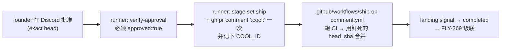
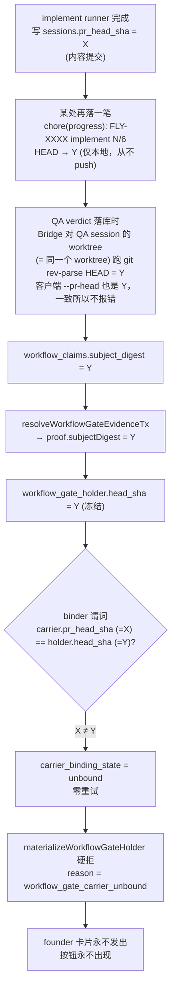

# FLY-1625 self-ship 全链取证 — 调研

Issue: FLY-1625 (https://linear.app/geoforge3d/issue/FLY-1625/founder-直令机理深究-self-ship-修了又坏-n-次-全链取证今晨三单-1609-claims-路径-按根因分层的修复方案)
日期: 2026-08-04
基于: exploration.md

---

## 0. 一句话结论

> ### ⚠️ 先划清范围：坏的是**最后一步**，不是整条流水线
>
> 本报告说的**全部**是：**「founder 批准之后，runner 自己把 PR 合掉」这一步，在 DAG 路径上不工作。**
>
> **不是**说 DAG 没跑、也**不是**说这些活没干成。恰恰相反 —— 这 16 个 run 的
> design → implement → qa → gate **全都跑了**，PR 也都产出了，绝大多数**最后也合进 main 了**。
> 只不过每一次都是**人手动点的 merge**，不是 runner 自己合的。
>
> 用一句话说：**流水线在跑，只是最后一步永远得人来按。**
>
> 任何把本报告读成「DAG 全灭」「16 个 run 都失败了」的说法，都是**误读**。

**在上面这个范围内**：自 2026-07-24 DAG gate-carrier 上线以来，共 16 个 `runner_ship` gate holder，**0 个可证的 self-ship 成功**。两条互相独立的根因，每一条单独都足以把这最后一步打死：

- **RC-A（门开不出来）**：carrier binder 是对**多个各自独立漂移的异步投影**（carrier lifecycle 状态 + carrier persisted head + QA subject head）做的**一次性合取**，任一项不满足即 `unbound`，**创建时只试一次、永不重试**。unbound → 卡片永不发出 → founder 连按钮都看不到。**共判死 6 个 run，但触发项不止一种**（§3.8 拆分：4 个 progress-ledger head / 1 个真实内容漂移 / 1 个 carrier 已终态）。今天最常见的触发器是：gate 冻结的 head 由 Bridge 对 **QA session 持久化 worktree**（= implement 用的同一个）跑 `git rev-parse HEAD` 得到，而它已被 Flywheel **自己强制的 progress ledger 自动提交**推到一个**只在本地存在、从未推到 PR 上的提交**。
- **RC-B（门开出来了也放不了行）**：`/api/workflow/head-authority` 的 approve-question 分支是照 **land_v1 / schema_version 1** 世界写的，无条件要求 `workflow_ship_target_binding` 有行；而该表的写侧 `workflowRunRequiresShipTarget()` 只对 v1 返真，今天的 `tpl_code` 是 **schema_version 2**，行永远不写。→ Bridge 409 `ship_target_binding_unavailable` → runner 收到 `head_authority_unavailable`。**对全部 v2 run 是结构性 blocker；在 2 个走到 `approved` 的样本上被直接观测到。**

FLY-1609 是 RC-B 的纯净隔离样本：holder `approved`+`bound`、冻结 head `8906cee1ba`、PR #766 最终合入的 head 也**逐字是** `8906cee1ba`（零漂移）—— 其他一切都对，self-ship 仍然失败。

### 0.0 先厘清：「self-ship」到底指什么（我第一版读错过，已更正）

**runner 从来就不该、也不会自己跑 `gh pr merge`。** 被批准的路径是（`packages/edge-worker/src/Blueprint.ts:2348-2357` 的 ship bootstrap 逐字规定）：



Blueprint 原话：「The :cool: deploy workflow is the ONLY merge path — do NOT run `gh pr merge` yourself (**FLY-248**: a Runner must never self-merge; the project's own CI/CD + branch protection is the hard merge boundary)」。`founder-only-authority.md:155-176` 同样把「Runner ships itself」定义为 `verify-approval → :cool: → landing signal → completed`。

所以 **runner 是「授权的 trigger actor」，GitHub Actions 才是「merge actor」**。本报告说的 self-ship 一律指这条 sanctioned 路径。

**已撤回的假设（RC-C）**：第一版把 `engineer-executor.md:32-35` 的「Never self-merge」读成「禁止 runner 自 ship」，并据此提出第三条根因。**这是误读** —— 那句话是**直接 merge 的红线**，与 `verify-approval` → `:cool:` 并不互斥。（另：`.flywheel/menus/ic-roster.yaml:2` 实测把 `implement` 角色解析到 `engineer-executor.md`；`nodes/implement.md` 只服务非 role 的 built-in 节点，第一版拿它当第二份证据也是错的。）保留的只是一条**风险**，不是已观察死因：`engineer-executor.md` 的措辞比 bootstrap 含混（bootstrap 精确说的是「不要自己跑 `gh pr merge`」），值得统一，但**没有任何样本越过 RC-B 之后因为提示词而拒发 `:cool:`** —— 16 个样本没有一个走到那一步。详见 §4b。

### 0.1 归因的诚实边界（不要把"潜在阻断"讲成"已观察因果"）

16 个 gate 的 funnel 分母必须拆开看，否则会把结论说过头：

| 阶段 | 数量 | 已确证的直接死因 |
| -- | -- | -- |
| holder 创建 | 16 | — |
| → `bound` | 10 | **6 个卡在这里 = RC-A（binder 一次性合取失败），其中 4 个由 progress ledger 触发、1 个真实内容漂移、1 个 carrier 已终态 —— 见 §3.8** |
| → 卡片发出 / `awaiting_review` | 10 | — |
| → founder 应答并 `approved` | **2** | 8 个没走到（5 个被人抢先 merge、3 个一直挂着）—— **这 8 个的直接死因未确证** |
| → `verify-approval` 通过 | **0** | **2 个全被 RC-B 拒绝**（RC-B 对全部 10 个 bound run 都是必然的潜在阻断，但只在这 2 个上被直接观测） |
| → runner 发 sanctioned `:cool:` | **0** | 无样本走到这一步 —— 所以这一步**从未被测试过** |
| → ship workflow SHA-pinned merge | **0** | 同上 |

→ 正确表述是「**RC-A 的一次性合取判死 6 个（触发项分三类，progress ledger 只解释其中 4 个）；RC-B 是全部 v2 bound run 的结构性 blocker，并在 2 个 approved 样本上被直接观测**」，**不是**「两因 100% 解释了 16 次失败」。

两条未收口的调查线，**不能因为 RC-A/RC-B 成立就宣布收工**：

1. 那 3 个永挂 `awaiting_review` 与 5 个被抢先 merge 的投递/归属机制尚未查清，不能排除第三类生命周期原因。
2. `:cool:` 之后的整段（trigger → started receipt → workflow run → SHA-pinned merge）**在 v2 DAG 路径上零样本验证过**。修完 RC-A/RC-B 之后它是不是也坏的，现在无法回答。

---

## 1. 取证方法与可信度

- 数据源：`~/.flywheel/teamlead.db`（**全程 `file:...?mode=ro` 只读**，未做任何写入）、GitHub PR 元数据（`gh pr view`）、`~/Dev/flywheel` 真实 git 历史、当前 `main`（`dd165ee5`）的源码。
- 1609 当时的完整 stderr **已丢失**，run 已 completed 无法复现。本报告**不依赖**那条 stderr —— 改用持久状态（表里有没有那一行）做判定，结论是确定性的而非推测。
- 全量普查而非抽样：`workflow_gate_holder` 里 `authority_mode='runner_ship'` 且 `created_at >= 2026-07-24`（epoch-1 切换日）的**全部 16 条**都在 §6 表里，没有挑样本。

---

## 2. 判别式：卡死 vs 健康，100% 落在 `carrier_binding_state`

`workflow_gate_holder` 全表对照（节选，完整见 §6）：

| carrier_binding_state | state / materialization_stage | created_at vs updated_at |
| -- | -- | -- |
| `unbound` | 永远停在 `materializing` / `question_intent` | **逐毫秒完全相等** |
| `bound` | 7–41 秒内走到 `awaiting_review` / `completed` | 相差数秒 |

`created_at == updated_at` 精确到毫秒，是"**创建时试了一次，失败后再也没有任何东西碰过它**"的铁证。

---

## 3. RC-A — 门开不出来（`gate_carrier_unbound`）

### 3.1 完整因果链（源码逐点定位）



### 3.2 每一环的源码坐标

| 环 | 文件:行 | 关键内容 |
| -- | -- | -- |
| **head 权威（服务端）** | `packages/teamlead/src/bridge/workflow-decision-routes.ts:97-113` → `bridge/head-authority.ts:18-43` | `qa_verdict` family 的 `serverHead = resolveWorkflowHeadAuthority(store, qa_execution_id).prHeadSha`，即 **Bridge 对 QA session 的 `worktree_path` 跑 `git rev-parse HEAD`** |
| head 观察值（客户端） | `packages/flywheel-comm/src/commands/qa-result.ts:177,384-396` | `deriveHeadSha()` = 裸 `git rev-parse HEAD`（QA 进程 cwd）。**只是一致性比较项，不是权威** |
| 为什么两者都被污染 | 实测 `sessions.worktree_path` | implement 与 qa **共用同一个 worktree**（如两者都是 `/Users/xiaorongli/Dev/flywheel-FLY-1608`）→ 服务端读到的就是那条 progress ledger 提交 |
| 冻结成 gate subject | `packages/teamlead/src/StateStore.ts:28090-28099` | 所有 evidence claim 的 `subject_digest` 必须唯一 → 即 QA claim 的 head |
| 写进 holder | `StateStore.ts:28184-28213` | `head_sha = proof.subjectDigest` |
| **binder 谓词** | `StateStore.ts:28149-28154` | `candidate.execution_id && activation && session.status === 'ship_parked' && session.pr_head_sha === proof.subjectDigest` |
| 零重试 | `StateStore.ts:28177-28181` | 只有 `getRowsModified() === 1` 才置 `bound`；失败没有任何重试挂钩 |
| 卡片硬拒 | `packages/teamlead/src/bridge/gate-materializer.ts:69-74` | `authority_mode === 'runner_ship' && carrier_binding_state !== 'bound'` → `workflow_gate_carrier_unbound` |

### 3.3 铁证（4 个样本）：这一类卡死 gate 的冻结 head 逐字都是 progress ledger 提交

把 2026-08-03/04 这 4 个 `unbound` holder 的 `head_sha` 丢进 `git log -1`（另外 2 个 07-25 的样本机理不同，见 §3.8）：

| run | issue | holder.head_sha | 该 commit 的提交信息 |
| -- | -- | -- | -- |
| 9077db7e | FLY-1603 | `59fea1c311` | `chore(progress): FLY-1603 implement 6/6` |
| 732a98ad | FLY-1608 | `de75bb37c6` | `chore(progress): FLY-1608 implement 6/6` |
| 3a9745e7 | FLY-1624 | `c9e4da4b59` | `chore(progress): FLY-1624 implement 5/6` |
| 901ce8f2 | FLY-1570 | `8bb43a7e1d` | `chore(progress): FLY-1570 implement 6/6` |

而对应的 carrier（implement session）`pr_head_sha` 分别是 `bacd2b59b3` / `a94fcf3655` / `a3f9e02e2e` / `d0453aa086` —— 全是真正的内容提交（`docs:` / `refactor:` / `fix:`）。

### 3.4 比"漂移"更糟：冻结的 head 根本不在 PR 上

```
git merge-base --is-ancestor de75bb37c6 refs/pull/765/head  →  NO
git merge-base --is-ancestor 59fea1c311 refs/pull/762/head  →  NO
git merge-base --is-ancestor a94fcf3655 de75bb37c6          →  YES（progress 提交是 PR head 的后代）
```

progress ledger 的契约是「**path-limited 只提交 progress.md 到你的分支**」，并且**只 commit 不 push**（既有记录：`reference_progress_ledger_commits_locally_never_pushes`）。所以 gate 冻结的这个 head：

- 比 PR head 更**新**（是它的后代），
- 但**从未存在于 remote**。

这意味着即便绕过 binder，也没救：`completeWorkflowGateRunAfterShip` 要求 `mergedHead === holder.head_sha`（`workflow-engine-dispatcher.ts:644-649`），而这个 head 永远不可能成为 merged head → 该 run 被**结构性判定**为 `head_mismatch` 死胡同。

### 3.5 为什么"跑过 2 轮 QA"的 run 反而能绑上（相关性 8/8）

| run | issue | qa attempt 数 | holder source | binding |
| -- | -- | -- | -- | -- |
| 25216e27 | FLY-1605 | 2 | implement | `bound` ✅ |
| c7b129bd | FLY-1609 | 2 | implement | `bound` ✅ |
| 049af564 | FLY-1602 | 4 | implement | `bound` ✅ |
| 39278b2e | FLY-1482 | 2 | implement | `bound` ✅ |
| 9077db7e | FLY-1603 | 1 | **qa** | `unbound` ❌ |
| 732a98ad | FLY-1608 | 1 | **qa** | `unbound` ❌ |
| 3a9745e7 | FLY-1624 | 1 | **qa** | `unbound` ❌ |
| 901ce8f2 | FLY-1570 | 1 | **qa** | `unbound` ❌ |

机理：fix-loop 里 implement runner 被重新唤醒并**在 QA 那些 ledger 提交之后**再落内容提交、刷新自己的 `pr_head_sha`；第二轮 QA 复验时（FLY-752「一个 issue 只有一个 QA」，同 session 复用）**没有再产生新提交**，于是两个 head 恰好相等。

→ **绑定成功是运气，不是设计。** 判据是"两个在不同时刻、从不同来源取的快照是否碰巧相等"，中间任何一笔提交都能打破它 —— 而系统自己强制要求那种提交。

### 3.6 逃生口的先决条件跟失败原因是同一个

`gate_carrier_unbound` 告警文本明确指路（`StateStore.ts:22234`）：

> Repair through `POST /api/workflow/gate-carrier-rebind/stage` followed by `POST /api/workflow/gate-carrier-rebind`

但 `rebindWorkflowGateCarrier`（`StateStore.ts:30525-30533`）的守卫是：

```ts
if (session?.status !== "ship_parked" ||
    session.review_question_id != null ||
    session.pr_head_sha?.toLowerCase() !== String(holder.head_sha).toLowerCase()) {
  result = { ok: false, reason: "carrier_session_mismatch" };
```

**跟创建时失败的那条谓词逐字相同。** 也就是说：唯一被官方告警指定的修复杠杆，对**恰好需要它的那批 gate**保证失败。

实测佐证：`SELECT count(*) FROM workflow_gate_carrier_rebind_receipt` = **0**。这条路从上线至今没有一次成功过。

补充（重要，避免误导）：unbound 发生时**并非无声** —— `StateStore.ts:28253-28295` 会写 `gate_carrier_unbound` 事件并入队 severe alert。问题不是"没告警"，而是**告警的 reason 过于笼统，且指向一条必然失败的修复动作**（`:22215-22252`）。

### 3.6b 什么证据能推翻 RC-A（founder 直令：每条根因都要写清楚自己怎么才算错）

我认为 RC-A 成立。**下面这些东西只要有一样被找到，RC-A 就该被推翻或大幅改写** —— 而且每一条都能用只读查询在几分钟内验掉，不需要重跑任何东西：

| # | 找到这个 → RC-A 就错了 | 怎么查 | 我查的结果 |
| -- | -- | -- | -- |
| 1 | **任何一个 `unbound` holder，在创建那一刻四项合取其实全满足** | 该 run 的 carrier session 在 holder `created_at` 时刻的 status / head 与 holder head 对照 | 未找到。6/6 都能指出**具体是哪一项**不满足（§3.8） |
| 2 | **任何一个 `bound` holder，其 carrier head ≠ holder head** | `workflow_gate_holder` ⋈ carrier `sessions.pr_head_sha` | 未找到。10 个 `bound` 全部相等 |
| 3 | **任何一条 `carrier_binding_state` 从 `unbound` 变成 `bound`** | `created_at` 与 `updated_at` 是否仍逐毫秒相等 | 未找到。6/6 逐毫秒相等 ⇒ 创建后无人再碰 |
| 4 | **`workflow_gate_carrier_rebind_receipt` 有任何一行** | `SELECT count(*)` | **0 行**。这条官方修复杠杆从上线至今 0 次成功 |
| 5 | **那 4 个 ledger 提交其实在 PR 上** | `git merge-base --is-ancestor <sha> refs/pull/<n>/head` | 全是 NO ⇒ 确为本地专属提交 |
| 6 | **`assertWorktreeReady` 其实不在 activation 之前** / 或不要求逐字等值 | 读 `workflow-rework-coordinator.ts` + `plugin.ts` 的生产组合 | 两者都成立（§3.10） |

**反过来，这些东西不足以推翻 RC-A**：

- 「后来有一次 self-ship 成功了」—— 若那次是**人手动 reset 了 worktree**或走了别的旁路，它证明的是"手动能救"，不是"binder 会自愈"；
- 「不是每次 QA 都落 ledger 提交」—— 对，所以命中率是 4/8 而不是 0/8（§9）。**RC-A 的主张从来不是"每次必炸"，而是"炸不炸取决于两个快照碰巧是否相等，而系统自己强制要求那种会打破相等的提交"**；
- 「FLY-1466 跟 ledger 无关」—— 对，所以它被单列成第三类触发项（§3.8）。**RC-A 的核心是"一次性合取 + 零重试"，不是"progress ledger"** —— ledger 只是今天最常见的那个触发器。

### 3.7 即使冻结 head 修对了，下游还有三道本地 HEAD 硬门

设 PR 真实 head 为 `X`、progress-only 本地提交为 `Y`。就算把 holder / node binding / session 全部对齐到 `X`，下面三处仍会拿 `Y` 去比：

| # | 位置 | 行为 |
| -- | -- | -- |
| 1 | `packages/teamlead/src/bridge/runner-wake.ts:70-75` | approval wake 文本**写死** `--pr-head $(git rev-parse HEAD)` → runner 传的是 `Y` |
| 2 | `packages/flywheel-comm/src/commands/verify-approval.ts:247-262` | `callerHead !== authoritativeHead` → `head_authority_mismatch` |
| 3 | `packages/teamlead/src/bridge/repository-authority.ts:78-96` | `resolveBoundRepositoryAuthority()` 跑 `git -C <target> rev-parse HEAD` → 又拿到 `Y` → `ship_target_authority_drift` |

→ **「卡片能发出」不等于「runner 能 verify 并 merge」。** 任何只修冻结 head 的方案，验收里必须包含 runner 侧真的 verify 通过，否则救回来的仍然只是半程。

### 3.8 6 个 unbound 的真实分母：三类触发项，不是一种

第一版把 4 个 08-03/04 样本的机理外推到全部 6 个 —— **这是过度归纳，已更正**（Codex R3 用生产只读数据反证，我复核确认）。实测：

| run | issue | holder head | carrier `pr_head_sha` | node binding head | 触发项 |
| -- | -- | -- | -- | -- | -- |
| 9077db7e | FLY-1603 | `59fea1c311` | `bacd2b59b3` | `bacd2b59b3` | **progress ledger head** |
| 732a98ad | FLY-1608 | `de75bb37c6` | `a94fcf3655` | `a94fcf3655` | **progress ledger head** |
| 3a9745e7 | FLY-1624 | `c9e4da4b59` | `a3f9e02e2e` | `a3f9e02e2e` | **progress ledger head** |
| 901ce8f2 | FLY-1570 | `8bb43a7e1d` | `d0453aa086` | `d0453aa086` | **progress ledger head** |
| fbbdcd38 | FLY-1460 | `b1779703d6` | `84563bbb73` | `84563bbb73` | **真实内容漂移**（非 ledger-only） |
| 66bae78a | FLY-1466 | `340ecf6f7e` | `340ecf6f7e` | `340ecf6f7e` | **三个 head 完全相同 → 不是 head 问题** |

**FLY-1460（1/6）**：`git diff 84563bbb b1779703` 含 `.github/workflows/ci.yml`、`CLAUDE.md`、`plan.md`、`progress.md` —— 是节点交接后往共享分支推的**真实内容提交**（正是 FLY-1483 描述的那一类），不是 ledger-only。

**FLY-1466（1/6）**：holder / carrier / node binding **三个 head 逐字相同**（`340ecf6f7e`，提交信息 `docs: record FLY-1466 mainline rebase guards`，也不是 progress 提交）。binder 是四项合取（`StateStore.ts:28131-28154`）：candidate + activation + `session.status === 'ship_parked'` + exact head。**head 那一项是满足的**，所以失败必然出在另外三项。实测该 carrier（`0a23cb41`）在 **2026-07-24 23:55:44 就已 `completed`**，而 holder 到 **2026-07-25 17:43:38** 才创建 —— 相隔约 18 小时。→ **carrier lifecycle 已终态**，binder 永远等不到 `ship_parked`。

> ⚠️ 方法论注意：`sessions.status` 读到的是**当前**状态，不是 bind 时刻的状态（对照组：4 个 `bound` 的 carrier 现在也都是 `completed`）。所以"carrier 状态"只对 FLY-1466 有**正面证据**（head 项已满足 ⇒ 失败必在其余合取项），不能反过来推断其他样本。

### 3.9 由此得到的更上位的结构判断

真正的结构缺陷不是"progress ledger 污染了 head"，那只是**今天最常见的触发器**。结构缺陷是：

> **binder 把三个各自独立漂移的异步投影 —— carrier lifecycle 状态、carrier persisted head、QA subject head —— 在某一个瞬间做一次性合取，任一项不满足即永久失败，且没有任何重试或收敛路。**

任何只修 head 来源的方案（包括本报告 plan 的 A1）**只能救掉 4/6**。FLY-1460 需要 head 权威改成远端 PR head 才能覆盖；FLY-1466 那一类**必须单独设计 terminal carrier 的处置语义**，而且**绝不能靠重试把合法终态 session 自动复活**。

### 3.10 同一根因的第三条伤害路径：progress ledger 也把 **rework 重入**钉死（FLY-1571 现场，实测）

前面两条伤害路径是「gate 冻结到 ledger 提交」（RC-A）和「evidence 可被脏改动悄悄放宽」（plan §5.2.3）。**还有第三条，而且它咬的是恢复路径本身。**

FLY-1571 的工作 run `ae3b7edb`（`tpl_code`, schema_version 2）完整时序（全部只读实测）：

| # | 事实 | 证据 |
| -- | -- | -- |
| 1 | QA attempt 1 在 head `7cb9c776524f` 上发 verdict，消费凭据 id 80，写出 `qa_failed` claim id 99 | `workflow_decision_capability` / `workflow_submission_credential` id 97 |
| 2 | **`7cb9c776` 的提交信息是 `chore(progress): FLY-1571 implement 6/6`** —— 又是一条 progress ledger 提交 | `git log -1 7cb9c776` |
| 3 | 同一事务**成功创建** rework request `rework:1eb8e15d…`：authority=`qa`、target=`implement` attempt 2、preferred actor=`983ec2b8`、verification policy=`["code_review","qa_retest"]`、**`base_revision` = `7cb9c776`** | `workflow_rework_request` |
| 4 | `workflow_run_node` 确有 `implement / attempt 2 / pending` 行 —— **路径触发了** | `workflow_run_node` |
| 5 | coordinator 在 admission/credential/turn **之前**调用 `assertWorktreeReady(actor, request.base_revision)` | `workflow-rework-coordinator.ts:355-365` |
| 6 | 生产实现要求 worktree **先 clean、再 `git rev-parse HEAD` 逐字等于 base_revision** | `plugin.ts:8366-8400` |
| 7 | 实际 HEAD 是 `f111a2f2` = `chore(progress): FLY-1571 implement 3/5`；`7cb9c776..f111a2f2` 之间是 `290c7b09 chore(progress) 6/6`、**`f77144c4 fix(FLY-1571)`**、**`dfa30750 fix(FLY-1571)`**、`b66556fc chore(progress) 2/5`、`f111a2f2` | `git log 7cb9..f111` |
| 8 | **delivery generation 748**，终态 `held`，`last_error = worktree_not_ready:head_mismatch:f111a2f2…:7cb9c776…` | `workflow_rework_delivery` |

**失败原因的真实编年（不是"先 dirty 后 mismatch"这么干净 —— 是交错的）**：

| 失败原因 | 出现的 generation 区间 | 次数 |
| -- | -- | -- |
| `worktree_dirty` | **1 – 385** | 208 |
| `head_mismatch:f77144c4…:7cb9c776…` | **136 – 330** | 163 |
| `registered_liveness_indeterminate` | 148 | 1 |
| `head_mismatch:dfa30750…:7cb9c776…` | 370 – 432 | 60 |
| `head_mismatch:b66556fc…:7cb9c776…` | 433 – 514 | 82 |
| `head_mismatch:f111a2f2…:7cb9c776…` | 515 – 748 | 234 |

`worktree_dirty`（1–385）与第一个 `head_mismatch`（136–330）**区间重叠** —— 实现方不能把它建模成"一次干净的状态转移"。期望值恒为 `7cb9c776`，而**实际 head 随 fix-loop 一路前推四次**：`f77144c4` → `dfa30750` → `b66556fc` → `f111a2f2`。这就是"越干活越回不去"的逐帧记录。

**而且它一点都不安静**：同一 run 有 **423 条 `rework_activation_stalled_alerted`** + 424 条 `workflow_engine_alert_posted`（11:07:27 – 11:57:41）。⇒ **系统看见了、也喊了 423 次，仍然没人能把它解开。** 所以这里缺的**不是可观测性，是一根带审计的对齐/恢复杠杆** —— 与 §3.6 里 `gate-carrier-rebind` 全网 0 次成功是同一个结论。

**机理**：QA 的 verdict subject head 被 ledger 污染成 `7cb9c776`（§3.2 的同一个机制）→ 它被原样写成 rework 的 `base_revision` → coordinator 要求 implement 的持久 worktree **回到那条 ledger 提交上且完全干净** → 而 fix-loop 正在按设计干活，已经往前推了两笔真正的 `fix(FLY-1571)` 提交和更多 ledger 提交 → **永远不可能相等** → claim/release 空转 **748 代**后 held。

**这条比前两条更刺眼的地方**：

1. **它卡死的是"修复"本身。** fix-loop 的正常产出（fix 提交 + 系统自己强制的 ledger 提交）**就是**让它再也进不去的原因。越干活越进不去。
2. **它是活的生产 wedge，不是历史形态。** 748 代空转发生在 2026-08-04 当天，终态时间 `11:57:30`。
3. **它解释了第六次实例。** 「QA 复验做完了却提交不了 / attempt 2 不存在」不是"引擎缺 attempt 递增能力"（§8.2 已用 FLY-1609 反证），而是 **implement attempt 2 从来没能 activate**，所以下游的 QA attempt 2 自然不存在。

> ⚠️ 本节是 R7 反证我之后补的。我先前只查了「有没有 QA attempt 2」就下了「路径没触发」的结论 —— **查一层就停，得到的是相反的答案**。这与本报告要防的失效模式是同一个：拿一个太浅的探针去证明"能力不存在"。

**对方案的直接后果**：plan §5.2.2 要求 QA 的 ledger 继续写回**持久 worktree/分支**，而 rework 重入又要求那个 worktree **clean 且逐字等于 base_revision**。这两个合同今天直接打架 —— 必须在 L-Q 里定义互不干扰契约（见 plan §5.2.4）。

**什么证据能推翻这一条**：

| # | 找到这个 → §3.10 就错了 | 我查的结果 |
| -- | -- | -- |
| 1 | 该 run **没有** rework request / 没有 `implement attempt 2` 行（= 真的"没触发"） | 两者**都有**（`rework:1eb8e15d…` + `implement/2/pending`） |
| 2 | `assertWorktreeReady` 其实在 activation **之后**才调用 | 在之前（`workflow-rework-coordinator.ts:355-365`） |
| 3 | 生产的 readiness 实现**不要求**逐字等值（比如只要求是祖先） | 逐字等值（`plugin.ts:8366-8400`） |
| 4 | `base_revision` **不是** ledger 提交 | `7cb9c776` = `chore(progress): FLY-1571 implement 6/6` |
| 5 | 存在任何一次 delivery 在 `HEAD ≠ base_revision` 下仍被 admit | 未找到；748 代全部 release |

⚠️ 这一节是我**第二次修正**同一个问题才写对的：v6 归因到了无关的票，v7 只查「有没有 QA attempt 2」就说"没触发"。**两次都是探针太浅。** 这也是为什么本报告每条根因都要配一张"什么能推翻我"的表 —— 它逼着我说清楚**我查了什么、没查什么**。

---

## 4. RC-B — 门开出来了也放不了行（`head_authority_unavailable`）

### 4.1 两个增量写了两套账，从未接上

`StateStore.ts:26255-26341`，gate 打开时的分叉：

```ts
if (run.gate_carrier_epoch === 1) {
    this.createWorkflowGateHolderTx({...});          // ← 全函数 0 次 bindWorkflowShipTargetForGateTx
} else if (... manifest_variant === "land_v1") {
    ... INSERT workflow_gate_holder ...
    this.bindWorkflowShipTargetForGateTx({...});     // ← 只有这条旧分支写 ship target
}
```

生产 `~/.flywheel/.env:152` 有 `FLYWHEEL_WORKFLOW_GATE_CARRIER=1` → **所有新 run 都是 `gate_carrier_epoch=1`** → 全部走第一条分支 → **`workflow_ship_target_binding` 永远不写**。

另一个写点 `setReviewBinding(...shipTarget)`（`StateStore.ts:5806`，由 `event-route.ts:1788` 的 `awaiting_review` 完成事件触发）也够不着：epoch-1 的 binder 是**直接用 SQL 把 `sessions.status` 从 `ship_parked` 改成 `awaiting_review` 并写 `review_question_id`**（`StateStore.ts:28155-28176`），根本不经过 `/events` 的 `awaiting_review` 完成路径。

### 4.2 而 runner 侧强制要求这张表

`packages/flywheel-comm/src/index.ts:1234` → `verifyApprovalWithBridgeHead`；生产 `.env:143` 有 `FLYWHEEL_WORKFLOW_CLAIMS_READ=1`（至少自 2026-07-20 起，早于 gate-carrier 上线），所以**一定**走 claims 路径：

`verify-approval.ts:215-226` POST `/api/workflow/head-authority`，带 `approve_question_id`（取自 `sessions.review_question_id`，epoch-1 binder 刚写过，一定非空）
→ `workflow-decision-routes.ts:314-323`：

```ts
const binding = deps.store.getWorkflowShipTargetBinding(approveQuestionId);
if (!binding || binding.superseded_at) throw new Error("ship_target_binding_unavailable");
```

→ 409 → `verify-approval.ts:263-272` catch → **`head_authority_unavailable`**，exit 1。

### 4.3 实测坐实

```sql
-- workflow_ship_target_binding 共 30 行，最新一行属于 FLY-1577（约 2026-07-29）
-- 2026-07-25 之后创建的 17 个 gate holder，按 question_id 关联：
--   命中 binding 的：0 个
```

**17/17 全部 `NO-BINDING`。** 包括 holder 状态完全健康的 FLY-1605 / FLY-1609 / FLY-1602 / FLY-1482。

### 4.4 FLY-1609 是 RC-B 的纯净隔离样本

| 事实 | 值 | 来源 |
| -- | -- | -- |
| holder 状态 | `approved` / `completed` / `bound` | `workflow_gate_holder` |
| holder 冻结 head | `8906cee1ba` | 同上 |
| carrier `pr_head_sha` | `8906cee1ba` | `sessions` (exec `0573b149`) |
| qa attempt 2 claim subject | `8906cee1ba` | `workflow_claims` |
| `workflow_node_pr_binding` (implement att.2) | PR #766 @ `8906cee1ba` | 同名表 |
| **PR #766 实际合入的 head** | **`8906cee1ba`** | `gh pr view 766` |
| `runner_ship_approved` 事件 | 2026-08-03 16:59:30 | `workflow_run_event` |
| PR #766 merged | 2026-08-03T17:19:19Z（人工） | GitHub |
| `run_completed`（外部 merge 收敛） | 17:19:20，**1 秒后** | `workflow_run_event` |
| `workflow_ship_target_binding` | **无行** | 实测 |

**五个 head 全部逐字相同，零漂移，批准正确落地，收尾链健康 —— 唯一缺的就是那一行 binding。** 这排除了所有 head 相关的解释，把 1609 的失败单独钉死在 RC-B 上。

### 4.4b 什么证据能推翻 RC-B

RC-B 是本报告里**最硬**的一条 —— 它不依赖任何时序或运气，是一个读写不对称的静态事实。**下面任一条成立，RC-B 就该被推翻**：

| # | 找到这个 → RC-B 就错了 | 怎么查 | 我查的结果 |
| -- | -- | -- | -- |
| 1 | **任何一个 schema-v2 run 有 `workflow_ship_target_binding` 行** | 按 `question_id` 关联 `workflow_gate_holder` | 07-25 之后的 **17/17 全部无行**；该表最新一行属于 FLY-1577（约 07-29，v1 形态） |
| 2 | **`workflowRunRequiresShipTarget()` 对 v2 返真** | 读 `StateStore.ts:23310-23322` | 谓词逐字是 `schema_version === 1 && isWorkflowManifestV1Land(...)` ⇒ v2 恒假 |
| 3 | **`/head-authority` 的 approve-question 分支有 v2 旁路** | 读 `workflow-decision-routes.ts:304-323` | 无条件 `if (!binding \|\| binding.superseded_at) throw` —— 没有任何 schema 分流 |
| 4 | **生产其实没开 `FLYWHEEL_WORKFLOW_CLAIMS_READ`**（那样就不走 claims 路径） | `~/.flywheel/.env:143` | 已开（且早于 gate-carrier 上线） |
| 5 | **任何一个 v2 run 的 `verify-approval` 返回过 `approved`** | `workflow_run_event` 里的自 ship 成功链 | 未找到 |

**这些不足以推翻 RC-B**：

- 「1609 那个 runner 的 `FLYWHEEL_BRIDGE_URL` 可能是空的」—— 见 §4.5。**即使它完全正常，binding 缺失也已经是充分原因**；这条盲区不改变结论，只是让"还有没有第二个原因"这个问题暂时无法回答。
- 「v1 的 run 能通过」—— 对，v1 本来就写这张表。**RC-B 的主张精确限定在 v2**。

> **RC-B 与 RC-A 的关系（不要混淆）**：两者**互相独立**。RC-A 让 6 个 run 连门都开不出来；RC-B 让**所有** v2 run 即使门开了、批准完美落地、head 零漂移，也一样放不了行。**只修任何一条，self-ship 都仍然是 0。**

### 4.5 诚实标注：未能验证的部分

`verify-approval.ts:166-173` 还有一条独立通向同一个 reason 的路：`FLYWHEEL_BRIDGE_URL` 为空时立即返回 `head_authority_unavailable`。1609 那个 runner 进程的实际 env **未留存，无法核实**。但这不影响结论 —— binding 缺失是**已证实且确定性**的充分原因，即使 BRIDGE_URL 完全正常也一样拒绝。

---

## 4b. RC-C（已撤回）— carrier 合同措辞风险，不是已观察死因

第一轮我把 `.flywheel/agents/engineering/engineer-executor.md:32-35` 的「Never self-merge」定性成第三条根因。**这是误读，已撤回**（Codex design review R1 提出、R2 自行更正，我逐字复核后确认 R2 正确）。

### 4b.1 为什么是误读

sanctioned ship path 明确区分两件事（§0.0）：

| 禁止 | 允许且被要求 |
| -- | -- |
| runner 直接 `gh pr merge`（FLY-248 红线：CI/CD + branch protection 才是硬边界） | `verify-approval` 通过后 `stage set ship` + `gh pr comment ":cool:"` 一次 |

`Blueprint.ts:2357` 逐字：「The :cool: deploy workflow is the ONLY merge path — do NOT run `gh pr merge` yourself」。`founder-only-authority.md:155-176` 把「the Runner **ships itself**」定义为 `verify-approval → :cool: → landing signal → completed`。**两者不冲突。**

另一处事实错误：第一版引 `.flywheel/agents/nodes/implement.md` 当第二份证据。实测 `.flywheel/menus/ic-roster.yaml:2` 是 `implement: .flywheel/agents/engineering/engineer-executor.md`，而 `workflow-run-snapshot.ts:397-406` 只有**非 role** 的 built-in 节点才读 `nodes/<type>.md`。所以今天的 implement 节点根本吃不到那份手册。

### 4b.2 保留下来的（降级为风险，不计入归因）

- `engineer-executor.md` 的措辞（「Never self-merge」+ 同句要求 merge 前跑 `verify-approval`）比 bootstrap 含混；bootstrap 说的是精确的「不要自己跑 `gh pr merge`」。**建议统一措辞**为「不得 self-authorize、不得直接 merge；仅在服务端验证 founder exact-head 批准后代发一次可关联的 sanctioned `:cool:` trigger」。
- 这是 **counterfactual / prompt-coverage 风险**：16 个样本**没有一个**越过 RC-B 走到发 `:cool:` 那一步，所以从未被观测触发。**不能写成已观察死因。**

### 4b.3 这次误判本身的教训

我读了角色 `.md`，没读**运行时 bootstrap**（`Blueprint.ts` 在 spawn 时注入的 ship 段），就把一句提示词文本当成了系统行为事实。角色 `.md` 只是 runner 提示词的**其中一层**。凡是断言"系统被禁止做 X"，必须追到运行时注入的完整提示词与实际执行路径（这里是 `.github/workflows/ship-on-comment.yml`），不能停在一份 markdown 上。

---

## 4c. 前瞻性安全发现 — `:cool:` 这一跳没有 founder gate，也不携带批准时的 head（= FLY-367）

**这不是已观察死因**（16 个样本零个走到发 `:cool:` 那一步），但它是**开启自主 merge 之前必须先解决的安全边界**。逐字核实 `.github/workflows/ship-on-comment.yml`：

| 环节 | 实际实现 | 缺口 |
| -- | -- | -- |
| 触发条件（`:30-34`） | `issue.pull_request && issue.state == 'open' && comment.body == ':cool:'` | **完全不引用** question / founder response / holder / verify receipt |
| 授权检查（`:58-77`） | 仅 `getCollaboratorPermissionLevel(commenter) ∈ {admin, write}` | 有 repo write 权限就能触发 —— **prompt 不是安全边界** |
| head 来源（`:36-55`） | comment **之后**由 `pulls.get` 现读 `pr.head.sha` | 读到的是「workflow 启动那一刻的 head」，**不是 founder 批准的那个 head** |
| merge（`:145-165`） | `pulls.merge({ sha: HEAD_SHA })` | `sha` 只能防住「读到之后再漂」，**不能证明 `HEAD_SHA === 批准的 X`** |

实测：整个 workflow 文件里 `founder` / `approval` / `question_id` / `verify` 的出现次数 = **0**。

由此有两条本报告的 plan 必须封住、否则不能 canary 的路径：

1. **self-authorize**：拥有 write 身份的 carrier 跳过 `verify-approval` 直接发 `:cool:`，Actions 照样跑 CI 并 merge。今天挡住它的**只有提示词**。
2. **exact-head TOCTOU**：founder 批准并 verify 了 `X`；comment 发出后、workflow `pulls.get` 之前 PR 漂到 `Z` → CI 跑 `Z`、merge `Z`。

**仓内早已记录这个洞 = FLY-367**（`.github/workflows/ci.yml:15`；`doc/engineer/plan/archive/v1.50.0-FLY-350-mufasa-write-capable-roundtable.md:27,102,200`）。FLY-350 之所以能把它列为「不阻塞」，是因为 **Mufasa 被结构性剥夺了发 `:cool:` 的能力**（shell net-off + 无 GH_TOKEN + gateway 无 comment 工具）。

**而本报告 plan 的方向恰恰是让 carrier 同时拥有并被指示使用这个能力** —— 正是 FLY-350 刻意回避的那种配置。所以 FLY-367 对本单是**硬依赖**，不是可以并行的 follow-up。C0 的 `approval → comment id → started receipt → run success → merged head` 链条是有价值的**事后归因**，但 merge 已经发生之后才发现链断了，**没有安全价值**。

---

## 5. Q3 — FLY-945 到底覆盖了哪条路径

FLY-945 的 plan（`engineering/doc/FLY-945-founder-approve-self-ship/plan.md`，日期 2026-07-06）的整个模型是**单 session**：

- Fix A：ship-gate founder 文字消息去 10min grace（GatePoller / founder-reply-deliverer）
- Fix B：head 漂移自动 rebind —— 改 `auto-qa-coordinator` 的 qa_result 校验，更新 **`sessions.pr_head_sha`** + gate-message-binding
- Fix C/D：FSM 重 review 恢复边、外部 merge 收敛兜底

它认识的世界只有 `sessions.pr_head_sha` + `sessions.review_question_id`。

而 DAG gate-carrier 层是**之后**才建的：

| 组件 | 引入 commit | 日期 |
| -- | -- | -- |
| `workflow_gate_holder` | `ee2bf78f` FLY-1375 automate engine-owned land flow (#667) | 2026-07-22 |
| `workflow_ship_target_binding` | `f812aafb` FLY-1434 harden DAG ship chain (#687) | 2026-07-23 |
| `carrier_binding_state` + `gate_carrier_epoch` | `ea32cf6d` emit ship approval only at terminal DAG Gate (#690) | 2026-07-23 |

**FLY-945 比这三个增量早 2.5 周。** 它修的每一处触点（gate-poller、founder-reply-deliverer、auto-qa-coordinator、gate-message-binding）在今天的 `tpl_code` DAG 流里**一个都不在关键路径上**。

→ **945 没有"坏掉"，它是被绕过去了。** 新增量在旁边建了一条平行的 ship 授权路径，而没有人把 945 的端到端保证重新对着新路径跑一遍。

**这正是"修了又坏 × N 次"的机理**：每次修的是"当时那条路"，下一个增量换了路，上一次的保证就静默失效 —— 而且失效不产生任何红灯，因为它测的路径还在、还绿。

---

## 6. Q1 — 全量结局普查（epoch-1 切换 2026-07-24 之后的全部 16 个 runner_ship gate）

| # | issue | run | 创建时间 | holder 终态 | binding | 结局事件 | 是否 self-ship |
| -- | -- | -- | -- | -- | -- | -- | -- |
| 1 | FLY-1374 | 45bbb1c8 | 07-24 09:44 | awaiting_review | bound | `merged_before_approval` | ✗ |
| 2 | FLY-1456 | 8a36ec17 | 07-24 09:50 | awaiting_review | bound | `merged_before_approval` | ✗ |
| 3 | FLY-1448 | 37ab5275 | 07-24 09:50 | awaiting_review | bound | （无结局，永挂） | ✗ |
| 4 | FLY-1462 | f6494319 | 07-24 18:14 | awaiting_review | bound | （无结局，永挂） | ✗ |
| 5 | FLY-1463 | c156cb8f | 07-24 19:07 | awaiting_review | bound | （无结局，永挂）= **FLY-1483 现场** | ✗ |
| 6 | FLY-1446 | cce08acc | 07-25 05:51 | awaiting_review | bound | `merged_before_approval` | ✗ |
| 7 | FLY-1466 | 66bae78a | 07-25 17:43 | materializing | **unbound** | `gate_carrier_unbound` + `merged_before_approval` | ✗ |
| 8 | FLY-1460 | fbbdcd38 | 07-25 18:15 | materializing | **unbound** | `gate_carrier_unbound` | ✗ |
| 9 | **FLY-1605** (PR #763) | 25216e27 | 08-03 06:27 | approved | bound | `runner_ship_approved` → 07:12:44 人工 merge | ✗ |
| 10 | **FLY-1603** (PR #762) | 9077db7e | 08-03 06:40 | materializing | **unbound** | `gate_carrier_unbound` → 07:05:56 人工 merge | ✗ |
| 11 | **FLY-1608** (PR #765) | 732a98ad | 08-03 09:28 | materializing | **unbound** | `gate_carrier_unbound` → 15:05:41 人工 merge | ✗ |
| 12 | **FLY-1609** (PR #766) | c7b129bd | 08-03 09:46 | approved | bound | `runner_ship_approved` → 17:19:19 人工 merge | ✗ |
| 13 | FLY-1602 (PR #764) | 049af564 | 08-03 18:16 | awaiting_review | bound | `merged_before_approval` | ✗ |
| 14 | FLY-1624 (PR #769) | 3a9745e7 | 08-03 21:36 | materializing | **unbound** | `gate_carrier_unbound` | ✗ |
| 15 | FLY-1482 (PR #768) | 39278b2e | 08-03 23:54 | awaiting_review | bound | `merged_before_approval` | ✗ |
| 16 | FLY-1570 (PR #771) | 901ce8f2 | 08-04 12:13 | materializing | **unbound** | `gate_carrier_unbound` + `legacy_merge_anomaly` | ✗ |

**16 / 16 未 self-ship**（10 bound / 6 unbound）。`workflow_run_event` 里 `runner_ship_*` 系列**根本不存在**"runner 自己合并成功"这一类事件 —— 所有 `run_completed` 都是外部 merge 后由每秒探测收敛出来的。

⚠️ 按 §0.1：这 16 个里只有 **6 个**（unbound）与 **2 个**（approved 后被 RC-B 拒绝）有已确证的直接死因。另外 **8 个**（5 个 `merged_before_approval` + 3 个永挂 `awaiting_review`）没走到 approval verification，**它们的直接死因未查清**，RC-B 对它们只是必然的潜在阻断。这 8 个的投递/归属机制是一条**尚未收口的调查线**。

### 6.1 今晨三单各自死在哪一步（Q1 直答）

| PR | issue | 死点 | 根因 |
| -- | -- | -- | -- |
| **#762** | FLY-1603 | 门**没开** —— gate 冻结在 `chore(progress): FLY-1603 implement 6/6`（`59fea1c3`，本地专属），carrier head `bacd2b59b3`，不等 → `unbound` → 卡片永不发出 | **RC-A** |
| **#763** | FLY-1605 | 门开了、founder 06:29:51 批了 —— runner `verify-approval` 拿不到 ship-target binding → `head_authority_unavailable`；43 分钟后 07:12:44 人工 merge | **RC-B** |
| **#765** | FLY-1608 | 门**没开** —— gate 冻结在 `chore(progress): FLY-1608 implement 6/6`（`de75bb37`，本地专属），carrier head `a94fcf3655`（= 最终合入 head） | **RC-A** |

补充：当晚 **#769 (FLY-1624)** 和次日 **#771 (FLY-1570)** 也是 RC-A；**#766 (FLY-1609)** 是 RC-B 的纯净样本。

---

## 7. Q4 — 与 FLY-1483 / FLY-533 的关系：同根，三种形态

两单均于 **2026-08-03T21:56 被 Canceled**（不是修好，是关掉）。

| 单 | 日期 | 形态 | 冻结 head 的来源 | 漂移由谁造成 |
| -- | -- | -- | -- | -- |
| FLY-533 | 06-24 | legacy 单 session | 批准时的 `pr_head_sha` | 人：批准后又 push 修复 |
| FLY-1483 | 07-25 | DAG（FLY-1463 现场） | QA PASS 时的 head | 人：另一个节点交接后往共享分支推文档提交 |
| **今天 RC-A** | 08-03/04 | DAG | **Bridge 对 QA session worktree 跑的 `git rev-parse HEAD`**（客户端 cwd 值只是一致性比较项） | **系统自己**：强制的 progress ledger 自动提交 |

**同一个根**：引擎把一个**本质可变**的量（活 worktree 的 git HEAD）当成**冻结权威**，而且在**不同时刻、从不同来源**各取一次快照，然后要求它们相等 —— 不等就永久失败，没有收敛路径。

**今天这一版最严重**，因为：

1. 触发它**不需要任何外力**。系统自己的 progress ledger 纪律就是触发器 —— 越守规矩，越必然踩中。
2. 冻结的 head 是**本地专属提交**，连"等 PR 追上来"这条自然收敛路都被堵死（PR 永远不会有那个 sha）。
3. 唯一的官方修复杠杆（`gate-carrier-rebind`）的先决条件跟失败原因**逐字相同**（§3.6），全网 0 次成功。

FLY-1483 描述的「五条恢复路全堵死」在今天依然逐条成立，而且多了一条：`gate-carrier-rebind` 也堵死了。

---

## 8. Q5 — 与 FLY-1624 的边界

FLY-1624（PR #769，`6a0603be`，已合入）做的是 **merge 之后的观测层**：GraphQL 配额预算、REST head enrichment、persist-before-effect observation、dead-end memo、跨重启 hydration。

它**修好了收尾链** —— 这正是为什么"外部 merge 后 1 秒内 `completeWorkflowGateRunAfterShip` 自动收敛"是可靠的（FLY-1609 实测 17:19:19 merge → 17:19:20 收敛）。

它**不触碰**、也不该触碰：

- gate subject head 从哪来（RC-A 上游）
- carrier binder 谓词与重试（RC-A 核心）
- `workflow_ship_target_binding` 的写入（RC-B）

**边界一句话**：FLY-1624 让「别人合了之后我们能正确收尾」变可靠；FLY-1625 要让「我们自己能合」这件事从结构上成为可能。两者不重叠。

⚠️ **不要把 1624 当成现成的 pre-gate live-head 通道**（第一版这么写过，已更正，与 §9 / plan §4.1 统一）：1624 的 REST enrichment 对 **open** PR 返回 `not_merged`，现有 classifier 在 `open` 分支上直接丢掉 head，candidate 又反过来依赖 holder（`workflow-ship-ready-arm.ts:221-265,515-518`）。1625 能复用的是它的 **transport / 配额预算 / backoff / persist-before-effect 模式**；**open-PR head authority port 必须新增或扩展**（详见 plan §4.1）。

---

## 9. 修复所需的关键事实：正确的 head 其实已经在库里

`workflow_node_pr_binding` 每个 run 都有行，记录 implement 节点每次 attempt 绑定的 **PR 号 + head + repo 路径**：

| issue | 最新 attempt 的 binding head | PR 实际合入 head | 相符 |
| -- | -- | -- | -- |
| FLY-1605 | `915f5939ec` | `915f5939ec` | ✅ |
| FLY-1608 | `a94fcf3655` | `a94fcf3655` | ✅ |
| FLY-1609 | `8906cee1ba` | `8906cee1ba` | ✅ |
| FLY-1602 | `a1fdbe6d1c` | `a1fdbe6d1c` | ✅ |
| FLY-1482 | `b3d744c13c` | `b3d744c13c` | ✅ |
| FLY-1624 | `a3f9e02e2e` | `a3f9e02e2e` | ✅ |
| FLY-1570 | `d0453aa086` | `ac93e3d6b3` | ✗（binding 写入后又推了提交，未刷新） |
| FLY-1603 | `bacd2b59b3` | `70963adc71` | ✗（同上） |

三种 head 来源对最终合入 head 的命中率（同一批 8 个 run）：

| head 来源 | 命中 | 备注 |
| -- | -- | -- |
| QA session worktree 的 `git rev-parse HEAD`（**现行**，服务端读） | **4/8** | 命中的 4 个**恰好就是** `bound` 的 4 个，落空的 4 个**恰好就是** `unbound` 的 4 个 —— 判别式与命中率完全重合 |
| `workflow_node_pr_binding`（已存在，未被 gate 使用） | **6/8** | 两个落空都是"binding 写入后又推提交、binding 从不刷新" |
| GitHub PR 活 `headRefOid` | 语义上就是 exact live head | **尚无可用的 pre-gate port** —— FLY-1624 的 REST enrichment 对 open PR 返 `not_merged`（`workflow-ship-ready-arm.ts:221-265`），classifier 对 `open` 丢掉 head（`:515-518`），且 candidate 依赖已存在的 holder。必须新增/扩展 open-PR head authority port |

→ `workflow_node_pr_binding` 是**正确的种类**（PR 绑定，非 cwd 快照）但仍是快照；冻结时应以它定位 PR，再现读一次 open PR 的 `headRefOid` 校准。**注意**：这条现读通道**不是现成的** —— 可以复用 FLY-1624 的 transport / 预算 / backoff / persist-before-effect 模式，但 open-PR head authority port 必须新增或扩展（详见 plan §4.1）。

---

## 10. 证据清单（可复核）

```bash
# 判别式对照
sqlite3 "file:$HOME/.flywheel/teamlead.db?mode=ro" \
  "SELECT run_id,head_sha,state,materialization_stage,carrier_binding_state,created_at,updated_at
     FROM workflow_gate_holder WHERE created_at>'2026-08-02' ORDER BY created_at DESC;"

# 冻结 head 的真身
cd ~/Dev/flywheel && for s in 59fea1c311 de75bb37c6 c9e4da4b59 8bb43a7e1d; do git log -1 --format='%h %s' $s; done

# ship-target binding 全缺
sqlite3 "file:$HOME/.flywheel/teamlead.db?mode=ro" \
  "SELECT count(*) FROM workflow_gate_holder h
     LEFT JOIN workflow_ship_target_binding b ON b.approve_question_id=h.question_id
    WHERE h.created_at>'2026-07-25' AND b.approve_question_id IS NULL;"   -- 17

# rebind 杠杆从未成功
sqlite3 "file:$HOME/.flywheel/teamlead.db?mode=ro" \
  "SELECT count(*) FROM workflow_gate_carrier_rebind_receipt;"            -- 0

# 全量结局
sqlite3 "file:$HOME/.flywheel/teamlead.db?mode=ro" \
  "SELECT kind,count(*),min(at),max(at) FROM workflow_run_event
    WHERE kind LIKE '%ship%' OR kind LIKE '%carrier%' GROUP BY 1;"
```

---

## 11. 附录 · 第七号展品：这张单自己的完成信号，也被同族缺陷咬了

**研究「self-ship 为什么坏」的这张单，交付时自己的 `flywheel-comm complete` 撞了 Bridge 500 —— `incoherent_ship_bundle`。** 初版附录只记到「与 FLY-1591 同签名」就停手了；**2026-08-04 的 resume 把它查到了源码行和回归提交**，结论比当时以为的严重得多，故升级为完整条目。

### 11.1 精确机理（三个抛点里的第三个）

`resolveWorkflowGateAuthority()`（`packages/teamlead/src/workflow-run-snapshot.ts:142-184`）有**三个** `incoherent_ship_bundle` 抛点。本次撞的是第三个：

1. `subjectKind` 由 manifest 推导（:145-148）：`ship_claims` 里**只要没有** `founder_approved` 之外的 claim → `snapshot_digest`，否则 `git_head`。
2. carrier 候选 = 任一 `creates_pr || can_ship || can_land` 的节点（:152-157）。本 run 恰好一个：`execute`（type=`generic`）。
3. carrier 能力自洽性检查通过（:166-175）——`generic` 的能力集完全合规。
4. **`:176-178` —— `subjectKind !== "git_head"` → throw。**

即：**`tpl_generic_menu` 声明的 `ship_claims` 说「这条流水线没有 git-head 级的 claim」，而它的 `execute` 节点却是一个完整的 runner_ship carrier。两者结构性矛盾，永远无法解析出 gate authority。**

`ship_claims` 的产地是**另一个文件**：`packages/teamlead/src/workflow-menu.ts:368-371`

```ts
ship_claims:
    menu.shape === "code"
        ? ["qa_passed", "founder_approved"]
        : ["founder_approved"],
```

`generic` shape 走 else 分支 → 恒为 `["founder_approved"]` → 恒推出 `snapshot_digest`。

### 11.2 回归边界（实测，非推断）

**回归提交 = `2ed08e54` "feat: give generic nodes the capabilities to land their work" (PR #748, 2026-08-01 00:05:53 -0700)。**

该 PR 把 `generic` 节点从「12 个能力位全 false」改成「与 `implement` 同款能力集」（`packages/config/src/node-type-registry.ts:139-149`），**但没有动 `workflow-menu.ts` 的 `ship_claims` 推导**（`git show 2ed08e54 -- packages/teamlead/src/workflow-menu.ts | grep -c ship_claims` = **0**）。

DB 实测的分水岭逐行可见（`workflow_run` 全部 19 个 `tpl_generic_menu` run）：

| 创建日期 | `ship_claims` | `execute.creates_pr` | resolver 结局 |
| -- | -- | -- | -- |
| 2026-07-24 ~ 08-01（前 13 个，至 FLY-1587） | `["founder_approved"]` | `0` | `ok:engine_terminal`（无 carrier → 走 :158-160 提前返回，**碰不到第三个抛点**） |
| **2026-08-01 起（后 6 个，FLY-1590 之后）** | `["founder_approved"]`（**未变**） | **`1`** | **`THREW:incoherent_ship_bundle`** |

`ship_claims` 一列自始至终没变；变的只有 `creates_pr`。**是 carrier 的出现把原本走不到的抛点激活了。**

### 11.3 后果（当前生产状态，实测）

把**全部** 96 个存量 run 的快照喂进**生产 Bridge 正在跑的**那份 resolver（只读复现，`~/.flywheel/teamlead.db?mode=ro`）：

```
  41  tpl_code         | ok:runner_ship
  36  tpl_eng_heavy    | ok:runner_ship
  13  tpl_generic_menu | ok:engine_terminal
   6  tpl_generic_menu | THREW:incoherent_ship_bundle   ← 全部卡死 active@execute
```

抛错的 6 个 = **FLY-1590 / 1591 / 1597 / 1606 / 1623 / 1625**，与「卡在 `active` / `current_node_id=execute`」的集合**逐一重合**。`tpl_generic_menu` 至今 **`completed` 计数为 0**（对照：`tpl_code` 有 8 个 completed）。

**这是确定性失败，不是概率事件** —— 快照是建 run 时冻结的，重试永远走同一条路。本单 `complete` 连撞 4 次即为实证；resume 后再复现一次，结果逐字相同。

> ⚠️ 一处**自我更正**：普查前我以为 11 个卡住的 generic run 同根。实测否证 —— 卡在 `founder_gate` 的那 5 个（FLY-1578/1579/1580/1581/1587）resolver **解析正常**（`engine_terminal`），它们卡住另有原因，**不在本条目名下**。

### 11.4 为什么它逃过了 review 和 CI

PR #748 的 commit message **逐字点名了这个函数**，并正确推理了三个抛点里的**第二**个：

> "completion_route is `needs_review`, not `no_code`, because creates_pr makes the node a ship-bundle carrier … `resolveWorkflowGateAuthority()` throws incoherent_ship_bundle for a carrier on any other route"

作者查了 carrier 的**能力自洽**，没查 carrier 与 **manifest `ship_claims` 的自洽** —— 而后者在另一个文件里，且是 `else` 分支的隐式默认值。

同一 PR 新增的验证脚本 `scripts/verify-workflow-seeds.mjs` 断言的是「12 个 seed 都能 validate」——**seed 合法性**，不是**「编译出来的快照能否解析出 gate authority」**。所以 "all 12 bundled workflow seeds validate" 是真绿，而每个新建的 generic run 都是死的。

**缺的那一条断言，一行就够：** 对每个 seed 编译出的快照跑一遍 `resolveWorkflowGateAuthority()`，不抛即通过。

### 11.5 归位

这条**不是**巧合花絮，而是本单主论点的第七号展品，且是**同一模式的纯化标本**：

- **引擎的账面模型（`ship_claims`）与现实路径（节点真实能力）脱钩** —— 与 RC-A 的「三 head 不等」、§3.10 的「rework 重入被钉死」同构；
- **门测的是错的东西**（seed 合法 ≠ authority 可解析）——与 §10.1#4g 要求「必须断言穿过了 ledger 写入之后的 implement activation」是同一教训：只断言终点，会漏掉「安全地卡死」；
- **没有带审计的对齐杠杆** —— 6 个 run 卡死至今无人能解，只能靠 marker 兜底。

**处置**：本单是 founder 直令的诊断单，**不改实现代码**（含本缺陷）。修复归属与 6 个卡死 run 的处置由 Lead / founder 决定，建议单独立单（`workflow-menu.ts:368-371` 让 carrier 存在时 `ship_claims` 必须蕴含 git-head claim，+ §11.4 的 seed 合成断言）。本单完成信号继续靠 `~/.flywheel/state/complete-failed/` 的 marker 兜底。
