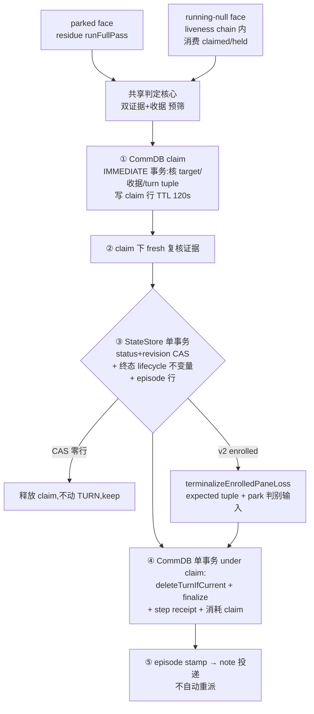

# FLY-1628 pane-loss reconciler — 实施计划

Issue: FLY-1628 (https://linear.app/geoforge3d/issue/FLY-1628/pane-loss-reconcilertmux-体已灭但-commdb-仍-runningparked-全量重启会成批制造现无任何)
日期: 2026-08-04
基于: 无
版本: R5（折入 Codex design review R1×7 + R2×7 + R3×6 + R4×5，均采纳）

---

## 1. 问题与实测证据（设计时现场复核，非转述）

2026-08-03 19:23 全量重启把全舰 runner 的 tmux 体拆掉，账面没跟上。设计期（2026-08-04）在生产库直接复核，事故形态**至今仍在**：

| 证据 | 实测 |
| -- | -- |
| CommDB（`~/.flywheel/comm/flywheel/comm.db`）| `e3cfedd7`（FLY-1624 design holder，2026-08-03 15:48 起）status=`running`，tmux_window=`runner-flywheel:@434` |
| tmux 真相 | `tmux list-panes -t "runner-flywheel:@434"` → `can't find window: @434`（体已灭 ~23h） |
| park 声明 | `runner_declared_states`：`e3cfedd7 / parked / design-context-holder / expires_at 为空`（**永不过期**） |
| StateStore（`~/.flywheel/teamlead.db`）| `65e81f76`（FLY-1518）status=`awaiting_review`，heartbeat 停在 2026-07-28（一周前），体已灭 |
| 存量 | 两条 FLY-1378 CommDB `running` 行自 2026-07-19 挂到现在（FLY-1383 家族的存量样本） |
| 活体对照 | 当前 6 个活 runner window 都带 `@flywheel_exec_id` marker（FLY-1374）——样本证据，不是能力证明（§3.2） |
| TURN | FLY-1624 的 turn holder 是 QA session（e0370711），不是死掉的 design holder——留住 e3cfedd7 的是 park veto 不是 turn veto |

### 1.1 为什么现有机制一个都不覆盖（逐条谓词核对）

| 机制 | 谓词 | 为什么漏 |
| -- | -- | -- |
| FLY-817 `commdb-fsm-reconcile` | CommDB `running` && FSM ∈ 可删终态 && probe=dead | ① FSM 非终态 → `keptNonTerminal`；② FSM 已终态但有 park 声明 → **FLY-1329 park veto 无条件保留**（e3cfedd7 正是这条） |
| FLY-1066 residue-harvest | FSM 缺失/CRASH_PRESERVE + proven-dead | 同被 park veto 拦（veto 位点在所有 finalize 路径之前） |
| FLY-324 done-but-running | `status=running && stage=completed && 无 route && 无 PR` | 事故 session 不满足 stage/route 形态 |
| `reapOrphans`（heartbeat 链）| `getOrphanSessions`：**`status='running'` && heartbeat 非空**且 stale | ① parked 家族结构性零覆盖；② `heartbeat_at IS NULL` 的 running 永远不进候选 |
| FLY-1082 zombie-scan | shape③ 双侧 running + dead + 心跳陈旧 ≥24h | detection-only 且 24h floor，同样跳过 NULL heartbeat |
| FLY-1082 server-loss | server-fresh boot leg 需 **≥3 个 running 且全部 gone** 才认领 | 1–2 个 runner 的重启/单体 NULL-heartbeat 不触发 |
| FLY-172/623 monitor-loss | tmux **alive** → readopt/advisory | tmux dead → 「留给 reapOrphans」，谓词如上够不着 |

**关键洞察（决定证据模型）**：parked runner 等 gate/review 时本来就不刷心跳——「心跳陈旧」是 parked 的**正常态**。parked 家族的死活判定**只能是 tmux 现实证据**。

### 1.2 wake_failed 连发的根（验收 3）

死体 session 账面仍是 parked → wake 入口仍选中它 → mailbox wake 失败 → `runner_wake_failed`。实测 `sendRunnerWake` **没有终态 guard**——除了转终态，wake 入口自身也要加终态 fence（§8）。

## 2. 方案总览

**pane-loss reconciler**：boot（tick 0）+ 巡检运行的新 reconcile face。两个 owner 位点、一套共享判定核心、一条**跨库线性化协议**：

- **parked face**（主体）：候选 = `{awaiting_review, approved_to_ship, ship_parked, design_done}`（project-scoped 查询 §5.1），跑在 residue-harvest `runFullPass`。
- **running-null face**：候选 = `running AND heartbeat_at IS NULL`（`getOrphanSessions`/zombie/server-loss 都够不着的无主家族），跑在 **HeartbeatService liveness chain 内**（reapOrphans 之后），消费该 tick 的 claimed/held 集合。`running AND heartbeat 非空`完全归既有链。
- 判定 = 双 tmux 证据 + **window-id 绑定且「新体先作废旧收据」的 marker 能力收据**（§3.2）。
- 销毁路径 = **pane-loss claim 协议**（§3.4）：CommDB 线性化 claim → StateStore `(status, lifecycle_revision)` CAS + 完整终态 lifecycle 不变量 + episode 账本同事务 → claim 下单事务完成 TURN 条件 release + finalize + **step receipt** → stamp。任意点崩溃可凭 receipt/claim 收敛重放。
- **通知**：episode 驱动 issue thread 状态说明（durable retry，不静默过期）+ 恢复提案；**不自动重派**（恢复走 founder-gated `retry` = 后继 dispatch，FSM `failed` 没有直接 `→ running` 边）。



## 3. 证据与权威模型（验收 4「反向安全」的核心）

### 3.1 双证据 + fail-closed 矩阵

- **证据 A**：`probeTmuxWindowLiveness(tmux_window) === "dead"`；target = CommDB `tmux_window`（`lookupTmuxTarget`）；`error` → keep；无 target → report-only。
- **证据 B**：pass 级 `list-windows -a` inventory 只做预筛；判死前对该 execId 定向 `discoverTmuxTargetByExecutionId`，必须 `missing`。命令失败 → keep（server 整体消失归 FLY-1082）。

| 证据 A | 证据 B（定向）| 判定 |
| -- | -- | -- |
| dead | missing | 进入 §3.4 claim 协议 |
| dead | found | keep（FLY-1319 形态）计 `keptMarkerFound` |
| alive | 任意 | keep（含 dead_pin：窗在则 list-panes 成功 → alive，归 FLY-720 crash reaper） |
| indeterminate/error | 任意 | keep |
| 任意 | ambiguous/失败 | keep |

### 3.2 marker 能力收据（R1#1 + R2#1 + R3#1）

`@flywheel_exec_id` 发布在两个 adapter 都是 best-effort；裸时间戳收据会被 re-pin 漂移授权；window-id 比较也堵不住「同 exec 的新体已建、re-register 与 publish 双双失败、旧行旧收据原封不动」的反例（R3#1，Claude 注册失败 non-fatal、Codex 注册失败继续起 daemon 都是实况）。修法三层：

1. **收据形态**：CommDB `sessions` 幂等 `ADD COLUMN marker_receipt TEXT`（JSON `{"windowId":"@N","serverPid":<pid>,"serverStart":<ts>,"verifiedAt":<ms>}`；server 代际字段为取证 belt，销毁有效性不依赖它——`@N` 复用只会让 probe 读到别人的活窗 → keep，错向安全侧）。**迁移同步加进 FLY-1066 sessions rebuild schema**（否则 legacy rebuild 丢列）。
2. **写收据（两 adapter 统一时序）**：**exact `@id` pin 先于收据写**（Codex adapter 初始注册的是 name target，`wireCreated` 懒建窗后必须先 `updateSessionTmuxWindow` 到 `session:@id` 再写收据，否则条件 UPDATE 恒零行）→ `set-option` → `show-options -w -v` **读回校验** → `UPDATE sessions SET marker_receipt=? WHERE execution_id=? AND tmux_window LIKE '%:'||<windowId>`（零行不写，fail-closed）。读回失败 → 无收据，spawn 照常。
3. **void-before-create = 单一 CommDB 原语 `prepareBodyGeneration(execId)`（R3#1 + R4#1）**：任何 adapter 路径**在为已有 execId 创建/pin 新 tmux 体之前**必须调用它并拿到 typed success。原语在一个 IMMEDIATE 事务内：存在该 exec 的 pane-loss claim 行（§3.4，**不看 TTL**）→ 返回 `claim_conflict`（**本次不建体**，adapter 走既有重试/失败面）；否则清 `marker_receipt` → success。**DB error / busy / throw → 一律「本次不建体」**（fail-closed；Claude 的 `tmux new-window`、Codex 的每次 ensure/reopen create 都只在 success 后执行）；`row absent`（该 exec 从未注册，首次 spawn）→ success。register/publish 保持 non-fatal 不变。由此收据的结构不变量成立：**一张收据绝不可能比「为同一 exec 创建更新的体」活得更久**，且 void 与 pane-loss claim 互斥——R4#1 的两个反例（claim 期间未受保护的 void+create；void 写失败仍继续 create）都被原语挡死。原语代码在 flywheel-comm db 层、**不读任何 env**（跨进程 writer 无论 flag 取值都受同一约束，见 §10）。
4. **判死侧有效性 = 比较派生**：`receipt.windowId === 当前 CommDB tmux_window 解析出的 window id`，且 claim 事务内复核（§3.4）。无有效收据 → **report-only**（说明文案请 Lead 用 close_runner 处置）。**诚实后果**：现存存量（e3cfedd7、FLY-1378 等，全无收据）只被曝光不被自动清；**验收 1 的重启验收对象是部署后新 spawn 的 runner**。

### 3.3 fail-closed 预筛 guard

- spawn 竞态：CommDB `started_at` 距今 < 120s → keep。
- `hasPendingCompleteMarker` → keep（FLY-172 drain 拥有真实 route）。
- 进程内 `withIssueMutex` 只用于缩小窗口，**不是权威**（不覆盖 adapter/CommDB writers；`activateHolderForWake` 生产调用不取它）。权威在 §3.4。

### 3.4 pane-loss claim 协议（R2#2 + R3#2/#3/#5——跨库线性化的唯一权威）

status-only CAS 挡不住 ABA（`awaiting_review → running → awaiting_review`），也挡不住「probe 之后、CAS 之前 CommDB target 被 rebind 到新活窗而 StateStore 还没转走」——finalize 才发现 conflict 已经晚了（StateStore 已错转，违反验收 4 的 mutation-time 语义）。因此销毁走**先 claim 后写**的固定顺序，每步 crash/replay 语义显式：

**新 CommDB 表**（与 sessions 同库，天然同事务域）：

```sql
CREATE TABLE IF NOT EXISTS pane_loss_claims (
  execution_id TEXT PRIMARY KEY, claim_token TEXT NOT NULL,
  episode_key TEXT NOT NULL,                       -- 确定性 "<execId>:transitioned",①时即知
  expected_tmux_window TEXT NOT NULL, receipt_snapshot TEXT NOT NULL,
  turn_issue_id TEXT, turn_epoch INTEGER,          -- 候选是 holder 时快照
  created_at INTEGER NOT NULL, takeover_eligible_at INTEGER NOT NULL   -- 见下:不是写权限
);
CREATE TABLE IF NOT EXISTS pane_loss_step_receipts (
  episode_key TEXT PRIMARY KEY, execution_id TEXT NOT NULL,
  expected_tmux_window TEXT NOT NULL, turn_released INTEGER NOT NULL,
  retired_gate_count INTEGER, retired_ask_count INTEGER,
  committed_at INTEGER NOT NULL
);
```

**固定顺序**（编号即 crash 点位）：

| 步 | 动作 | 崩溃后果与重放 |
| -- | -- | -- |
| ① claim | CommDB IMMEDIATE 事务：复核 `tmux_window==probed target`、收据有效、（holder 时）turn holder/epoch 与快照一致、无既有 claim 行 → 写 claim 行（含确定性 episode_key）| 崩溃 → claim 行留存，writers 持续拒绝；recovery 过 takeover 点后按「无 applying episode」删 claim，无任何状态被改 |
| ② 复核 | claim 保护下 fresh 证据 A/B 再采一次 | 不满足 → 删 claim，keep |
| ③ StateStore 终态化 | 单事务：`UPDATE ... WHERE execution_id=? AND status=<expected> AND lifecycle_revision=<expected>`（真 CAS）+ **完整终态 lifecycle 不变量**（§6.3）+ episode 行（`cleanup_state='applying'`, 存 claim_token）| CAS 零行 → 删 claim、不动 TURN、`keptRevalidationChanged`。崩溃于提交后 → episode(applying)+claim 在，recovery 沿原 token 走 ④ |
| ④ CommDB 效应 | IMMEDIATE 事务（验 claim 行在且 `claim_token` 完全匹配）：`deleteTurnIfCurrent(issue, holder, epoch)`（仅 holder）+ 既有 finalize 管道（retire gates/asks + 删 session 行）+ **写 step receipt** + 删 claim——**同一事务** | 崩溃于提交前 → 行都在，recovery 沿原 token 重试 ④；提交后 → receipt 在，重放走 ⑤ |
| ⑤ stamp | StateStore：episode `cleanup_state='finalized'`（携带 receipt 计数）| 崩溃 → 重放看到 step receipt 存在 → 只补 stamp，不重做效应 |

- **重放判定权威 = step receipt**：session/turn 行不存在且 **receipt 存在** → 本步已完成；行不存在且 **receipt 不存在** → 记 `degraded_already_absent`（别的路径删的/证据丢失），**文案不得声称本次清理了 gates/TURN**（R3#5）。
- **claim 的被尊重方**（flywheel-comm 内 `assertNoPaneLossClaim(execId)` helper，五个写点接入）：`prepareBodyGeneration`（§3.2）、`registerSession`（conflict-update 分支）、`updateSessionTmuxWindow`、`grantTurn`、`activateHolderForWake` 的 CommDB 写。**命中 claim 行即拒绝，不看 TTL**（可重试拒绝；wake 走既有失败/重试面）。helper 不读 env（跨进程一致）。
- **TTL = takeover eligibility，不是写权限（R4#2）**：`takeover_eligible_at`（120s）只决定 pane-loss **recovery** 何时允许接手一个疑似遗弃的 claim，writers 永远无条件拒绝。「已授权 step③ 与否」的判定权威**只有一处**：StateStore 是否存在 `cleanup_state='applying'` 且 `claim_token` 匹配的 episode 行（③ 与 episode 同事务提交，天然原子）——不在 claim 表里双写 phase，避免跨库两阶段提交套两阶段提交。recovery 规则：claim 过了 takeover 点 → 查 episode——**无匹配 applying episode**（③ 从未提交）→ 删 claim（放行该 exec 的正常生命周期）；**有匹配 applying episode** → 沿原 token 从 ④ 续跑（或凭 step receipt 补 ⑤）。claim 卡住活体复活路径的最长时长 = Bridge recovery 的到达时间（boot drain + 每 maintenance tick），不再由 wall-clock 自动放行。
- **generic terminal sync 排除**：`terminal-commdb-sync` 的 `markSessionTerminalStatus` 对**存在未过期 claim 或 applying episode** 的 exec 跳过（pane-loss 的 CommDB 效应只走 ④ 的 claimed 管道，不进无 fence 的通用同步）（R3#2）。
- TURN 顺序唯一化（R3#3）：release 只发生在 ④（CAS 之后、claim 之下、与 finalize 同事务）；§5.3 不再有「先 release 后 CAS」的旧表述。epoch 在 ① 快照、④ 条件删——中途被合法接手（epoch 变）→ ④ 的 deleteTurnIfCurrent 零行，事务照常 finalize session 行但 `turn_released=0`，episode 记 `turn_epoch_conflict` 注记（turn 未被本流程动过）。

## 4. FSM 变更（`packages/core/src/workflow-fsm.ts`）

- 补两条边：`awaiting_review → failed`、`ship_parked → failed`（另两态已有）。先例 FLY-208。
- **带 guard 收窄**：导出 `WORKFLOW_GUARDS`，两条边仅 `ctx.trigger === "pane_loss_reconcile"` 放行；生产两处 `new WorkflowFSM(WORKFLOW_TRANSITIONS)`（`plugin.ts:3472`、`:4034`）改传 guards。
- `last_error` 前缀 **`pane-lost: `**（镜像 `zombie: `）。

## 5. 判定核心与两个 owner 位点

### 5.1 候选查询与全量 drain

新增 project-scoped 查询（`getActiveSessions` 不含 `design_done` 且 FLY-1204 言明故意不扩宽）：

```sql
SELECT * FROM sessions
 WHERE project_name = ? AND status IN (<statuses>) AND execution_id > ?
 ORDER BY execution_id ASC LIMIT ?
```

parked face 传四态；running-null face 加 `heartbeat_at IS NULL`。**单逻辑周期全量 drain**：游标翻页直到取空；软 deadline 10 分钟（每 probe 自带 5s timeout）只防 tmux wedge；**中断即续批**——游标持久（episode/进程内），下一个 **maintenance tick（每 heartbeat interval）继续**直到 drain，才回到 hourly 全扫节奏；boot（tick 0）全扫覆盖重启产线。

### 5.2 逐条处理序列（两 face 共享）

```
预筛: inventory 命中 → keep(keptMarkerFound)
guard: started_at<120s / pending marker / 无 target / 收据无效 → keep 或 report-only episode
证据 A+B 满足 → §3.4 claim 协议 ①-⑤（v2 enrolled 的 ③ 用 §6.2 原语）
episode consumer 同 pass 即时驱动一次（④⑤ + note;失败留 applying/pending）
```

### 5.3 TURN holder

死体 holder **在范围内**（R2#3 撤回 report-only：`activateHolderForWake` 只复用 fresh probe=alive 的 target，对死体没有复活路径，report-only 只会永久留死 TURN）。处置 = §3.4 ④ 的条件 release（`deleteTurnIfCurrent`，holder+epoch 快照条件删）；**不自动指派新 holder**。文案注明「原 holder 占用的 three-stage TURN 已释放，续作需 Lead 重新推进该 phase」。

### 5.4 result 形态

```ts
export interface PaneLossReconcileResult {
  scanned: number; transitioned: number;
  keptAlive: number; keptMarkerFound: number; keptIndeterminate: number;
  keptSpawnGrace: number; keptPendingMarker: number; keptRevalidationChanged: number;
  keptClaimContention: number;
  reportOnlyNoReceipt: number; reportOnlyNoTarget: number;
  turnReleased: number; turnEpochConflict: number;
  episodesEnqueued: number; finalizeDone: number; finalizeDegraded: number; finalizePending: number;
  notesPosted: number; notesPending: number; notesNeedsHuman: number;
  cursorDrained: boolean; unscannedAtDeadline: number;
}
```

### 5.5 running-null face 接线

`HeartbeatService.check()` liveness chain 内、`reapOrphans` 之后新增 `reconcilePaneLossRunningNull(claimed ∪ held ∪ deadPinOwned ∪ zombieHeld)`：候选 = `running AND heartbeat_at IS NULL` 且不在任何集合，走同一共享核心。单飞由 liveness chain 既有 guard 提供。

## 6. StateStore 终态化

### 6.1 legacy（未 enroll）

§3.4 ③ 的单事务原语 `transitionPaneLossIfStatus(execId, expectedStatus, expectedRevision, evidence)`：`(status, lifecycle_revision)` 双条件 CAS + §6.3 终态不变量 + episode 行。FSM 合法性（新边+guard）在 CAS 前用 `fsm.canTransition`+guard 校验。

### 6.2 v2 enrolled：`terminalizeEnrolledPaneLoss`（R2#4 + R3#4）

`getGeneralizedWorkflowNodeForExecution` 只是反查；current/ambiguous 判定在 `resolveCurrentWorkflowActivation`；`recordEnrolledTerminalSignal` 事务外解析、不重验、不 CAS、不写 park-clear；admission 已占用 `engine-park-clear:<activationId>` 命名空间。且 **`ship_parked` 的 node=done 是预期形态**（`projectGeneralizedCompletionTx` 先置 node done 再投影 ship_parked + engine-park-open）——不能把 node-done 当 abort 条件（R3#4）。新原语：

- **输入**：`{ executionId, runId, nodeId, attempt, activationId, park: {kind:'open', rowId, generation} | {kind:'none'}, expectedStatus, expectedLifecycleRevision, evidence }`。**park 判别值不按 status 静态映射，而从账本派生（R4#5）**：preflight 用 current activation + `getCurrentWorkflowEngineParkEvidence` 的最新 open 行算出——`ship_parked` 必须 `open`；enrolled `awaiting_review` / `approved_to_ship` 在 open 行**尚未 clear 时同样必须传 exact `open`**（生产实况：`projectGeneralizedCompletionTx` 写 ship_parked + `engine-park-open` 后，gate materialization/rebind 把 carrier 改成 awaiting_review 但**不写 park_cleared**——open authority 仍在）；`none` 只允许于确实无 current open evidence 且该 status 形态允许（如 design_done 无 park 的形态）。
- **事务内**：重解 current activation 并**重算 park 派生值**与输入核对（run 是 current/active、node/attempt/activation ownership 未变、`open` 时最新 open park 行未被更高代 supersede、`none` 时确实无 open evidence）→ deterministic teardown signal（来源 `pane_loss_reconcile`）→ 条件 failed projection（status+revision CAS）→ `open` 时写 **`pane-loss-park-clear:<activationId>:<openParkRowId>`**（新命名空间，绑定 open 行代际，恰一代）→ §6.3 终态不变量 → episode 行。**任一 mismatch → 零写入**，结构化 abort。
- **abort 枚举**（各自计数）：run 非 current/active；attempt/activation ownership 已变；open 行被 supersede；`none` 输入但实际存在 open evidence（或反之）；ambiguous activation；session 已 terminal / statusPreserved。**node=done 且 park tuple 精确匹配 → 预期，继续**（`ship_parked` 的 node=done 是 projectGeneralizedCompletionTx 的正常形态）。
- replay 校验完整 payload tuple；事务后由既有 projector 收尾（CommDB 侧只走 §3.4 ④，不进通用 terminal sync）。

### 6.3 终态 lifecycle 不变量（R3#6，两原语共用）

绕过 `applyTransition` 的两个新 writer 必须维护现有每条真实 status writer 的同事务不变量：`terminal_at`、`terminal_lifecycle_id`、receipt-settlement intent、单调 `lifecycle_revision`（+1 恰一次）——从现有 writer 内部提取 **transaction-local helper `applyTerminalLifecycleTx`** 供两原语共用（漏掉 terminal chronology 会让 ask sweep 静默吃掉 reopened runner，源码注释有明示）。commit 成功后显式触发：audit directive（trigger=pane_loss_reconcile）、issue-display refresh、terminal receipt settlement。结构性测试：pane-loss failed 行有 terminal 时间戳/连续 lifecycle id、revision 恰 +1、settlement intent 原子存在；CAS 失败/replay/abort 不重复 bump、不重发 hook。

## 7. CommDB 侧其余两件事

### 7.1 park-veto 升级（`commdb-fsm-reconcile.ts`，收 e3cfedd7 形态——FSM 已终态的死体 parked 行）

veto 位点接受注入 `opts.markerEvidence?: (execId) => "missing" | "found" | "indeterminate"`——注入且 `missing` **且收据有效（§3.2 比较）** → veto 放行；其余（found/indeterminate/无有效收据/未注入）→ **逐字节现状 keep**（reverse-compat sentinel）。TURN-holder veto、`getEffectiveDeclaredState` fail-closed 分支不动。

**放行后的删除不再走无 fence 的 `finalizeSessionUnlessTurnHolder`（R4#4）**：该原语的 IMMEDIATE 事务只重验 TURN，不重验 target/收据——probe 之后并发 `prepareBodyGeneration`（void）+ re-register 到新活窗的行会被按 execId 误删。改用新的**条件 finalize 变体 `finalizePaneLossSession(execId, expectedWindow, expectedReceipt)`**：在同一 IMMEDIATE 事务内重比 `tmux_window == expectedWindow` **且** `marker_receipt == 快照`（并发 void 必然先清收据 → 比较失败 → abort 不删）+ 既有 TURN 检查，全过才 finalize。此 face 的 StateStore 不被改写，无需完整 claim 协议——mutation-time fence 由「所有建体路径必先 void（§3.2 原语）+ 事务内收据比较」闭合。新增真竞争测试：markerEvidence 返回后、finalize 前并发 void/rebind → abort 零删除。

### 7.2 补账（anti-join）只补通知债，不授清理权（R3#5）

`status='failed' AND last_error LIKE 'pane-lost: %' AND NOT EXISTS(episode kind=transitioned)` 的补账行**只生成 degraded 通知债务**（immutable evidence 已丢，不能重造 expected target/receipt/turn proof）——文案按 degraded 措辞，不声称清理了 gates/TURN；CommDB 清理权威只来自 §3.4 的 claim+receipt 链。

## 8. wake 终态 fence（验收 3）

- **实现前先取证**：追 2026-08-03 那 4 条 `runner_wake_failed` 的确切 producer（候选：actions approve/feedback wake、founder-reply 路由、workflow-rework-coordinator、plugin.ts:8457），结论写进 implement progress。
- **统一 admission fence**：`sendRunnerWake` 入口重读 persisted status，`isNoOutEdgeTerminalStatus(status)` 或 ∈ {failed, blocked} → 跳过 transport，`skippedReason:"terminal_status"`（**不产生 wake_failed**）。
- 回归双层：direct-helper 单测 + producer 级集成（对已转 failed 的 session 重放原始触发入口）。

## 9. 通知与恢复提案（验收 2）

### 9.1 episode 账本（StateStore 表；cleanup intent 与 note outbox 合一）

```sql
CREATE TABLE IF NOT EXISTS pane_loss_episodes (
  episode_key TEXT PRIMARY KEY,     -- "<execution_id>:<kind>"; report-only 每 kind 一行可更新,
                                    -- transitioned 每 exec 恰一行(status CAS 唯一性保证)
  execution_id TEXT NOT NULL, issue_id TEXT NOT NULL, issue_identifier TEXT,
  project_name TEXT NOT NULL, kind TEXT NOT NULL,
    -- transitioned | degraded_backfill | report_only_no_receipt | report_only_no_target
  from_status TEXT, evidence_json TEXT NOT NULL, expected_tmux_window TEXT,
  claim_token TEXT, turn_issue_id TEXT, turn_epoch INTEGER,
  cleanup_state TEXT NOT NULL DEFAULT 'n/a',
    -- pending | applying | finalized | degraded_already_absent | error | n/a(report-only)
  note_state TEXT NOT NULL DEFAULT 'pending',  -- pending | posted | needs_human
  note_attempts INTEGER NOT NULL DEFAULT 0,
  created_at TEXT NOT NULL, updated_at TEXT NOT NULL, posted_at TEXT, last_error TEXT
)
```

- transitioned 行与 status CAS 同事务（§3.4 ③）；`cleanup_state` 生命周期 `applying →(④⑤) finalized | degraded_already_absent | error(重试从①重claim)`——claim-resume 规则显式：重放以 **step receipt 有无**定判（§3.4）。consumer 的竞争由 episode 行级 `claim_token`+单飞消解（same-pass 即时驱动、maintenance tick drain、boot drain 三入口共用一个单飞 guard）。
- **note 债务**：`report_only → transitioned` 是不同 episode_key，各自独立债务；transitioned note **永不静默过期**——durable retry，`note_attempts ≥ 8` → `needs_human` + Lead FYI（`appendLeadEvent`，**不是** insertEvent/session_events）+ 行保留可复位重投。
- **路由契约（照 disposition-receipt 现状）**：遍历 `ProjectEntry.leads[].chatChannel`（字段名以 ProjectConfig 为准）查 `getChatThreadByIssue(issue_id, chatChannel)`；token 按 thread 创建时 `lead_id` 解析；thread 缺失 → 尝试既有 `ChatThreadCreator` 创建；仍不可路由 → `needs_human` + Lead FYI。**2xx 才 stamp posted**；at-least-once。
- Lead FYI 与 thread note 分离，互不充当对方成功凭证。

### 9.2 文案（中文，founder 视角；按 cleanup_state / receipt 事实措辞）

> ⚠️ **Runner 失联下线**：`<issue>` 的 `<角色>` runner 的终端窗口已不存在（多半是舰队重启拆掉的），账面此前还挂在 `<原状态>`。已把它标记为 failed{、并清掉了它占用的待答复项 | ；待答复项清理中，稍后自动完成 | ；其账面残留由其他清理路径处置（本次未重复操作）}{；它占用的 three-stage TURN 已释放，续作需 Lead 重新推进该 phase | }。**没有自动重派**——如需继续这单：在 dashboard 对该 session 用 retry（founder 批准后会**另派一个后继 runner**），或让 Lead 重新派单；不需要则无需操作。

report-only：no-receipt/no-target →「疑似失联但无法安全自证，请 Lead 核实后用 close_runner 处置」；degraded_backfill →「该 runner 此前已被标记失联，本条为补发说明」。不 @ 任何人。

## 10. 配置与开关

- `FLYWHEEL_PANE_LOSS_RECONCILE`，**default ON**，`=0` 只旁路**增量入口**：新 candidate scan、新 claim 获取、veto 升级放行、wake fence、新 note 投递。**安全栅栏与收尾永远在线（R4#3）**：`prepareBodyGeneration` 的 void+claim 检查、五个写点的 claim 拒绝、terminal-sync 对 claimed exec 的跳过、既有 applying episode / step receipt 的 recovery 收尾——这些不读 env（flywheel-comm db 层代码路径，跨进程 writer 无论 env 取值行为一致；flag=0 重启后已开工的 episode 仍被 drain 到终局，claim 不会因 flag 关闭而变成永久幽灵或被 writer 穿透）。注册 feature-flags registry 时如实描述这个「只关新增、不拆栅栏」语义。
- 组合矩阵：pane-loss × `FLYWHEEL_COMMDB_RESIDUE_HARVEST` × `FLYWHEEL_COMMDB_FSM_RECONCILE`——claim/episode 链在所有组合下行为一致。
- 常量：spawn grace 120s、claim takeover 点 120s（不是写权限，§3.4）、pass 软 deadline 10min（中断即续批）、needs_human 阈值 8。

## 11. 诚实边界（本设计不做什么）

1. **`running` 且 heartbeat 非空不碰**：heartbeat 链属地。pane-loss 只补两块无主地：parked 四态 + running-null。
2. **无有效收据的存量 report-only**：e3cfedd7/FLY-1378 等由 Lead 借说明用既有工具收。
3. **Lead pane 不在范围**：归 FLY-1602。
4. **tmux server 整体消失不判**：归 FLY-1082 server-loss。
5. **不改 `restart-services.sh`**：Bridge boot 就是重启后第一时间点；FLY-1634 并行互不依赖。
6. **不放宽 CRASH_PRESERVE 通用语义**：pane-loss finalize 只走 claim+receipt 管道。
7. **不自动指派新 TURN holder**。
8. **zombie-scan 24h floor、server-loss ≥3 阈值不动**。
9. **收据只保证「不误杀」，不保证「必能自证」**：register/publish 失败的 runner 永远 report-only——宁可留人工尾巴，不做无收据销毁。

## 12. 备选方案与拒绝理由

| 备选 | 拒绝理由 |
| -- | -- |
| 新 FSM 态 `orphaned` | 爆炸半径（全部 sink/dashboard/close_runner/FLY-1427/v2 kernel）；`failed+trigger+前缀` 等价且 retry 现成 |
| 用 `terminated` | 语义=主动关闭，不在 retry fromStates |
| heartbeat 阈值方案 | parked 不刷心跳是正常态 |
| 单证据（name probe）| FLY-1319/1329 重演 |
| 裸时间戳/纯 window-id 收据 | re-pin 漂移授权；「新体已建+双写失败」反例（R3#1）——void-before-create 结构性堵死 |
| fail spawn on register/publish 失败 | 改变 spawn 语义、爆炸半径大；void-before-create 用一条 UPDATE 达成同一不变量（新体存在 ⇒ 旧收据已废）|
| 进程 mutex / status-only CAS 当权威 | 不覆盖 CommDB writers；ABA；probe-后-rebind 竞态（R2#2/R3#2）——CommDB claim 线性化 |
| TURN report-only / 先 release 后 CAS | 死体无复活路径（R3 核实）；顺序矛盾会留「已释放 TURN+无 episode」残局（R3#3）——release 固定在 ④ |
| 复用 `recordEnrolledTerminalSignal` | 事务外解析、不重验、不 CAS、不写 park-clear、事件 id 撞命名空间 |
| node=done → abort | `ship_parked` 的 node=done 是 projectGeneralizedCompletionTx 的预期形态（R3#4）|
| 依赖后续 FLY-817 face 收 CommDB 行 | CRASH_PRESERVE 在 probe 前 continue；residue OFF 无人管——episode+claim 自带 owner |
| 无 step receipt 的效应重放 | 「行不在」无法区分成功/他路径/证据丢失（R3#5）|
| 通知直发/attempts 过期作废 | founder-visible note 是验收 2 收据，静默过期=违约 |
| pane-loss 兼收全部 running | 与 server-loss/heartbeat 链双头认领 |
| 自动重派 | issue 明确 founder-gated |
| 复用 FLY-1571 Stop hook | SIGKILL/整窗拆除时 hook 不会跑 |

## 13. 测试计划（TDD，先测后码）

**Unit（vitest，teamlead / core / flywheel-comm）**：
1. 判定矩阵全组合（§3.1，含 dead+found FLY-1319 回归、discovery 失败全 keep）。
2. 收据：比较有效性（re-pin 失效/新窗重挣）；**`prepareBodyGeneration` 原语**——claim 在（不看 TTL）→ `claim_conflict` 且零 `new-window`；DB error/busy/throw → 零 `new-window`；成功 void 与创建间崩溃 → report-only；claim-vs-void 两种先后次序 fixture；Codex reopen retry 行为；读回失败不写；条件 UPDATE 零行不写；Codex name→exact-id pin 先于收据写；rebuild schema 含新列；「新体已建+register/publish 双失败」反例 → report-only 不销毁（R3#1/R4#1 场景）。
3. claim 协议：①-⑤ 每个崩溃点位 replay 收敛（含 post-④/pre-⑤ 凭 receipt 补 stamp；无 receipt → degraded_already_absent 且文案不声称清理）；**TTL 语义**——takeover 点恰在 ②后/③提交中/③提交后到期的确定性竞争测试（writers 全程拒绝、recovery 按「applying episode 有无」分别删 claim/续跑 ④）、applying episode 重启后沿原 token takeover/replay；五个写点（prepareBodyGeneration / registerSession conflict-update / updateSessionTmuxWindow / grantTurn / activateHolderForWake）对 claim 的无条件可重试拒绝；terminal-commdb-sync 对 claimed exec 跳过。
4. CAS：`(status, lifecycle_revision)` 双条件；ABA（parked→running→parked，revision 已变）→ 零行 abort；CAS 失败 episode 行不产生。
5. FSM：两条新边+guard；`completed→failed` 仍非法；两处构造点带 guards。
6. v2 原语：park 判别值从账本派生并事务内重算——**`ship_parked → gate materialization → awaiting_review`（open 行未 clear）fixture：pane-loss terminalize 成功且恰写一代 exact park-clear**；founder-approved 后 session 仍 awaiting_review 的 open-row fixture；`approved_to_ship` enrolled 形态；`none` 输入但实际有 open（或反之）→ abort；run 非 current / ownership 变 / open 行 supersede / ambiguous / terminal / statusPreserved → 零写入结构化 abort；node=done+park 精确匹配 → 成功；replay 校验完整 tuple。
7. 终态不变量（§6.3）：terminal_at / terminal_lifecycle_id / settlement intent / revision 恰 +1；abort/replay 不重复 bump 不重发 hook；audit + display refresh 在 commit 后触发。
8. TURN：④ 内 holder+epoch 匹配 → release+receipt.turn_released=1；epoch 已变 → 零行、turn_epoch_conflict 注记、session 照常 finalize；非 holder 不碰 turn 表。
9. park-veto 升级四分支（missing+有效收据 → 放行；其余逐字节现状）；放行后条件 finalize——markerEvidence 返回后、finalize 前并发 void/rebind → 事务内收据/target 比较失败 → abort 零删除（R4#4 真竞争）；三 flag 组合矩阵 + **flag=0 重启 fixture**：step①/③/④ 后分别以 `FLYWHEEL_PANE_LOSS_RECONCILE=0` 重启——无 writer 穿透、无活体误转、已有 receipt 仍 stamp、applying episode 仍收尾（R4#3）。
10. note：report_only→transitioned 独立债务；needs_human 不静默过期可复位；chatChannel 路由 + thread 创建时 lead_id token；ChatThreadCreator 修复路径；2xx 才 posted；补账=degraded 通知债不授清理权。
11. wake fence：terminal → 零 transport 零 wake_failed；no-transport 不回归。
12. 候选查询：project-scoped、含 design_done、running-null 谓词、游标 drain、deadline 中断→下 tick 续批直到 drain。
13. running-null face：消费 claimed/held/deadPin/zombie 集合；liveness chain 单飞契约。

**集成（真 tmux，先例 FLY-172/FLY-817）**：
1. 带 marker+收据的窗 → kill → 全链（claim→CAS→finalize+receipt→note posted）。
2. **反向安全对照组（验收 4）**：活窗改名 → keep(`keptMarkerFound`)；活窗 re-pin 新窗（旧收据 void）→ report-only；probe 后并发 rebind（模拟 wake activation 拿到 claim 拒绝重试）→ 零误转。
3. 活窗不动 → 零转出。
4. producer 级 wake 回归。

**QA node（下游）**：验收 1-4 原样重放——带 active runner（含至少一个 turn holder、一个 parked 声明者）真跑 `restart-services.sh`：boot 逻辑周期内全部死体（含 holder）转出、thread 每条有说明、无 wake_failed 连发、活 runner 一条不误转。

## 14. 实施步骤（implement node 的 chunk 划分）

1. RED：FSM 边+guard、判定矩阵、收据（含 prepareBodyGeneration 反例）、CAS/claim/TTL 竞态的失败测试。
2. 收据：flywheel-comm 迁移（`marker_receipt` 列 + rebuild schema）+ `prepareBodyGeneration` 原语 + 两 adapter（原语先行、exact-pin 先于收据、读回、条件写）。
3. claim 基建：`pane_loss_claims`/`pane_loss_step_receipts` 表 + `assertNoPaneLossClaim`（无条件拒绝，不读 env）+ 五写点接入 + terminal-sync 跳过 fence + takeover recovery。
4. StateStore：`applyTerminalLifecycleTx` helper 提取 + `transitionPaneLossIfStatus` + `pane_loss_episodes` 表 + 补账查询（degraded 债）。
5. v2 原语：`terminalizeEnrolledPaneLoss`（park 派生+事务内重算 + 全 tuple 核对 + 新 park-clear 命名空间）。
6. CommDB 效应事务：条件 TURN release + finalize + step receipt + claim 消耗；`finalizePaneLossSession` 条件变体（§7.1 face）；episode consumer（三入口单飞）。
7. 共享判定核心 + parked face（runFullPass 首 face + 游标续批）+ running-null face（liveness chain 钩子）。
8. note 投递（路由契约 + needs_human + Lead FYI）。
9. wake fence（先取证 producer）。
10. `plugin.ts` 接线 + flag 注册。
11. 集成测试（真 tmux 四场景 + crash fixtures）+ 全仓 gates。
