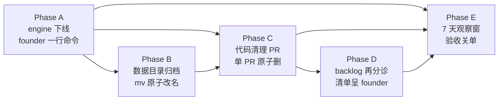

# FLY-1631 v2 运行时退役与整批清理 — 实施计划

Issue: FLY-1631 (https://linear.app/geoforge3d/issue/FLY-1631/v2-退役-废弃-v2-运行时下线与整批清理-engine-仍在跑-数据目录-代码-backlog-旧单再分诊)
日期: 2026-08-04
基于: 无(本设计节点直接对生产机与代码库取证,取证证据全文内嵌 §2)

---

## 0. 一句话

把已废弃的 v2 运行时从生产机上彻底清干净:engine 下线 → 数据目录归档 → 代码整批删除(单 PR 原子)→ backlog 旧单再分诊 —— 每步留备份、可回滚,全程不碰任何 v1/v1.5 现役组件。

## 1. 背景与裁定

Founder 裁定(2026-08-04):v2 整批废弃,「那一整批代码都要全部清理掉」。消息层重构(FLY-1569~1576)是 v1 的进化(v1.5),与废弃 v2 无关。FLY-1627 事故的真凶正是 v2 残留(v2-scheduler 拿废弃名册每 60s SIGTERM 杀现役 eng-lead)。

第①步已执行(2026-08-04 05:15,Tadashi,founder 放行):名册全量 offline(实核 online_count=0)、`com.flywheel.v2-scheduler` plist 已退休到 `~/.flywheel/v2/launchd-retired/`、备份 `flywheel-v2.db.bak-pre-retire-20260803-231552` 已留。

本计划 = 第②步:engine / 数据目录 / 代码 / backlog 四件事的完整方案。

## 2. 取证结论(2026-08-04 实测,逐条带证据)

### 2.1 `com.flywheel.v2-engine` 现状:活着,但在纯空转报错

| 事实 | 证据 |
|---|---|
| engine 进程 PID 1737 自 8-02(Sat)11AM 起跑 | `launchctl list` 显示 `1737 0 com.flywheel.v2-engine`;`ps` 显示 `node packages/v2-host/dist/cli.js --db ~/.flywheel/v2/flywheel-v2.db --socket ~/.flywheel/v2/host.sock --window fly1502-qa-real-rehearsal --host-epoch fly1502-prod-h1 ...` |
| plist `KeepAlive=true` + `RunAtLoad=true` | `~/Library/LaunchAgents/com.flywheel.v2-engine.plist`(直接 kill 进程会被 launchd 复活 —— 下线必须走 bootout + plist 退休,不能只杀进程) |
| engine 自启动以来唯一输出 = 1 行 ready JSON + **437,442 行同一条 git fatal** | `/tmp/flywheel-v2-engine.log`(44.6MB):`fatal: cannot change to '/Users/xiaorongli/Dev/flywheel/worktrees/fly1567': No such file or directory` 每 tick 重复(dispatch_interval_ms=1000);除 ready 行外无任何其他输出 |
| 空转根源:kernel db 里 FLY-1567 的 design task 仍 `running`,但其 worktree 早已删除 | `flywheel-v2.db` tasks 表:15 条非终态 task(FLY-1543×2 blocked、FLY-1547/1548/1549/1563/1567 running、FLY-1567×2 ready、6 条 draft);FLY-1567 在 Linear 已 Done(2026-07-31) |
| **这本身就是验收标准 1 所说的「现役路径报错」反例的孪生兄弟**:虽无现役路径报错,但废弃路径在持续报错刷日志 | 同上 |

### 2.2 现役依赖 = 零(第②步第 1 问的正面回答,逐条证据,不是「应该没有」)

**运行时面(活体取证):**

| 检查项 | 结论 | 证据 |
|---|---|---|
| host.sock 消费者 | 只有 engine 自己(监听端),无任何客户端 | `lsof ~/.flywheel/v2/host.sock` → 仅 PID 1737 |
| flywheel-v2.db 打开者 | 只有 engine 自己 | `lsof ~/.flywheel/v2/flywheel-v2.db` → 仅 PID 1737 |
| 出/入站信使(Discord) | v2 的 Discord 收发全部在 `com.flywheel.v2-ingress`,而 ingress **从未安装加载** | `launchctl list \| grep ingress` 空;`~/Library/LaunchAgents/` 无 ingress plist(plist 草稿只存在于 v2 私有目录 `~/.flywheel/v2/launchd/`);engine 日志零 Discord 活动 |
| injector | `~/.flywheel/v2/inj/claude/` 41 个条目全部是历史 activation 残留,最后写入 2026-07-31 00:41,4 天零新写入 | `ls -lat` |
| 名册 | agents 表 13 lead + 2 runner **全部 offline** | kernel db `SELECT kind,state,COUNT(*) FROM agents GROUP BY ...` |
| Lead 的 v2 mailbox MCP 注册(claude-lead.sh:2303-2345 条件块) | 死路:注册条件是 `~/.flywheel/v2/state/<lead>-credential.json` 存在,而 state/ 里只有 `discord-messenger-credential.json` / `lead-delivery-credential.json` 两个非 Lead 名文件 → 现役 Lead 重启也不会注册;当前机器上零 `v2-mailbox` MCP 子进程 | `ls ~/.flywheel/v2/state/ \| grep credential`;`ps aux \| grep v2-mailbox` 空 |
| 其他 launchd job / crontab / 生产 `.env` / Bridge 活进程 env | 零 v2 引用 | `grep -l '.flywheel/v2\|v2-host\|v2-cli' ~/Library/LaunchAgents/*.plist` 只命中 v2-engine 自己的 plist;`crontab -l` 无;`~/.flywheel/.env` 无 `FLYWHEEL_V2`;Bridge(PID 13687)`ps eww` env 扫描无 v2 |
| mailbox 积压会不会被谁消费 | 不会:mailbox 292 条 pending 的唯一消费路径是 v2 家族自身(engine/ingress/v2-cli),前者只在空转、后两者不在跑 | kernel db mailbox 表 `applied 859 / dead 13 / pending 292`;events 表最后一条 2026-08-01 17:45 |

**代码面(全 repo 盘点,main 上,详见 §4 波及面):现役 v1 → v2 的引用只有 4 类,其中 3 类是结构性 no-op 或死代码,1 类是启动闸(见 §2.3)。**

### 2.3 唯一的真实耦合点:v2-kernel 的开机硬闸(删除顺序的决定性约束)

`requireLegacyWriterAllowedFromEnvironment`(`packages/v2-kernel/src/cutover-authority.ts:611`)被 **5 个现役 v1 进程入口在启动第一句调用**:

1. `packages/teamlead/src/index.ts:11,21` — **Bridge 主守护进程**
2. `packages/flywheel-comm/src/index.ts:9,200` — flywheel-comm CLI 全部子命令
3. `packages/teamlead/src/lead-backends/codex/codex-lead-runtime.ts:34,1828`
4. `packages/teamlead/src/lead-backends/codex/codex-lead-tui-runtime.ts:39,824`
5. `packages/teamlead/src/lead-backends/codex/gateway/gateway-main.ts:35,502`

外加 `packages/teamlead/scripts/claude-lead.sh:78-90` — Claude Lead supervisor 启动前置闸(node 子进程 `import("flywheel-v2-kernel")`,失败 `exit 1` → **Lead 起不来**)。

**为什么它在生产是结构性 no-op(可以安全删)**:guard 从 env 解析 authority 文件路径,默认 `~/.flywheel/v2-cutover-armed`(`packages/v2-kernel/src/paths.ts:19`)。实测该默认路径**不存在**(armed=live 的那份在 `~/.flywheel/v2/state/`,只被 engine 以 `--armed` 显式传参使用);生产 v1 进程均未设 `FLYWHEEL_CUTOVER_ARMED_PATH`/`FLYWHEEL_HOME` override(Bridge 活进程 env + `.env` 已扫)。`readCutoverAuthority` 对 armedPath 不存在返回 `{mode:"legacy"}` → 放行。**删除这些调用点 = 生产行为零变化。**

**决定性约束**:先删 v2-kernel 包、后删调用点,会让上述 5 个入口 `ERR_MODULE_NOT_FOUND` **打死 Bridge + 全部 Lead + comm CLI**。因此代码清理必须**单 PR 原子完成**(monorepo 单次 merge 同时删包与删调用),且 ship 部署窗按 self-hosting 纪律走。

### 2.4 重名陷阱(实测区分完毕,红线清单)

以下带 "v2" 字样的都是**现役组件,本单严禁触碰**:

- `workflow_v2` — Bridge 内部 DAG 引擎(44 处:`StateStore.ts:15409` CHECK 枚举、`runs-route.ts` 派工路由、`work-kind.ts:53`、`workflow-template-selection.ts:162` 等)
- `WorkflowManifestV2`(`workflow-template.ts`)、config registry 里的 "schema v2 / DAG v2 dispatch" flags、Fleet console 的 "DAG v2" 面板
- `PersistenceManager.ts` 的 session 状态 v2→v3 迁移、`HeartbeatService.ts` 的 `reconcileCandidateReadoptV2`、`scripts/workkind-cutover.mjs`(FLY-1436,grep v2 家族命中数=0)
- `.github/workflows/ci.yml:255` 注释 "journal v2"(Buddy onboarding journal 第二版)
- Linear 侧:FLY-878([infra·loop/watchdog v2] = watchdog 的第二版规格,非废弃 v2)

**护栏**:代码清理 PR 的验收含一条 grep 断言 —— 上述红线位点在 PR 前后逐字节不变(`git diff` 对这些文件为空)。

## 3. 实施方案:五个阶段



依赖关系:**A 必须先于 C 的 ship**(删代码后生产 `git pull`,若 engine 还 loaded,KeepAlive 会对着已消失的 `dist/cli.js` 疯狂重启失败)。B 在 A 之后任意时点。D 与 C 并行无依赖。

### Phase A — engine 下线(运维动作,founder-gated,今天可做)

**顺序定为「先退休 plist、后 bootout」,中断安全**(codex R1-6):任一步之间被打断,最坏情形只是「本登录期进程还活着但下次登录不复活」;反序被打断则留下 `RunAtLoad` 待引爆。

1. **plist 退休**(agent 可做,mv 非 launchctl):
   `mv ~/Library/LaunchAgents/com.flywheel.v2-engine.plist ~/.flywheel/v2/launchd-retired/com.flywheel.v2-engine.plist.retired-<ts>`
2. **founder 在裸终端贴一行**(与第①步对 scheduler 的处理对称;FLY-913 护栏拦 agent 跑 launchctl,正确不绕):
   ```
   launchctl bootout gui/$(id -u)/com.flywheel.v2-engine
   ```
   幂等定义:若输出「service not found / no such process」视为已卸载,继续;任何其他报错停下报 Lead。plist 步的幂等定义(codex R2-3):「原位不存在 + retired 目录恰有一份」= 已退休,跳过。
3. **日志留证后放行自清**:`tail -100` + `grep -c` 行数统计存入 `~/.flywheel/v2/launchd-retired/engine-log-evidence-<ts>.txt`;`/tmp/flywheel-v2-engine.log`(44MB)本体随系统重启自清,不必搬。
4. **顺手同批退休**:`~/.flywheel/v2/launchd/com.flywheel.v2-ingress.plist`(从未加载,但留着就是下一颗雷)→ 同目录 retired 改名。
5. **验证(精确命令,不用自匹配 grep)**:
   - `launchctl print gui/$(id -u)/com.flywheel.v2-engine` → 期望 "Could not find service"
   - `launchctl print gui/$(id -u)/com.flywheel.v2-scheduler` → 同上(顺手确认第①步残余在 bootout 后归零)
   - `pgrep -f 'v2-host/dist/cli.js'` → 空
   - `lsof ~/.flywheel/v2/host.sock` → 空(Phase B 前;归档后 socket 文件随目录走)
6. **回滚路径**:plist mv 回原位 + founder `launchctl bootstrap gui/$(id -u) <plist>`,数据一字未动。**若 Phase B 已执行,回滚 Phase A 前必须先把数据目录 mv 回 `~/.flywheel/v2`**(plist 参数全部指向该路径,目录缺失时 KeepAlive 会疯狂重启失败)。

### Phase B — 数据目录归档(engine 下线后)

1. **前置检查(幂等护栏,codex R1-6)**:目的地 `~/.flywheel/v2.retired-20260804` **必须不存在**(存在即停 —— 重试时 `mv` 会把 v2 嵌套进已有目录而非原子改名);`stat -f %Lp ~/.flywheel/v2` 确认 700。
2. `mv ~/.flywheel/v2 ~/.flywheel/v2.retired-20260804` — 单次原子改名,权限(0700)与内容原样保留 = evidence 备份本体。3.0GB 不压缩(便于回滚与后续取证);7 天观察窗结束后是否压缩/删除另行 founder 拍。mv 后复核目的地仍为 0700。
3. 两个 db 备份(`bak-pre-migrate`、`bak-pre-retire`)随目录一起走,不单独处理。
4. **回滚路径**:mv 回原名即可(若要同时回滚 Phase A,先 mv 回、再恢复 plist,见 Phase A-6)。
5. **验证**:`~/.flywheel/v2` 不存在;现役侧零报错(Phase E 观察);`~/.flywheel/` 根下无新增 v2 散件(`v2-cutover-authority.json`/`v2-cutover-armed` 默认路径本来就不存在,归档后保持不存在)。

**B+ 凭据处置门(codex R1-8,与观察窗并行,关单前必须完成)**:归档≠退役凭据。目录内明文敏感物逐项分类并呈 founder 拍板,决策留档(不印密钥值):

| 凭据 | 位置 | 分类判定(执行时核实) | 建议 |
|---|---|---|---|
| Discord bot token | `launchd/com.flywheel.v2-ingress.plist` 内嵌 | **按凭据指纹与现役 bot 池逐一比对**(不凭账号名判定;指纹与原值都不落报告 —— codex R2-3) | v2 专属→revoke;共享→不动(rotate 需 v1 波及面计划,另行单) |
| Claude 凭据 | `claude-credentials.json` | FLY-1542 时代「全 runner 共享一把钥匙」的复印,大概率与 v1 现役同源 | 共享→不动;留档判定依据 |
| GitHub 凭据 | `gh-admin/`、`gh-bot/` | 执行时 `gh auth status` 对照现役判定 | v2 专属→revoke;共享→不动 |
| host.secret | `host.secret` | v2 专属(host.sock 握手密钥,消费者已全灭) | 随归档封存即可,无外部效力 |

### Phase C — 代码整批清理(单独 PR,ship 照旧 founder-gated)

**单 PR 原子删除**(理由见 §2.3),波及面清单见 §4。PR 结构建议按 commit 分层便于 review:①删 9 个 v2 包;②删 teamlead 寄生 v2 文件+测试;③删 5 入口 guard 调用 + claude-lead.sh 两处块;④package.json/CI/scripts 收尾;⑤docs 归档 + CLAUDE.md 里程碑(按 `feedback_archive_docs_in_main_pr` 放最后一个 commit)。

**验收门(全仓,FLY-224/248 教训)**:`pnpm lint` + `pnpm -r build` + `pnpm test:packages:run` + `scripts/__tests__` 相关套件 + **`bash scripts/test-cmux-sync.sh`(cmux v2 arm 摘除后全绿)** + **`package-onboard.test.sh` + 真跑一次 package-onboard 冒烟**(PO_PACKAGES 收缩后打包路径不断)+ **hermetic launcher 测试:真跑 claude-lead.sh 到写出 `.mcp.json` 为止,断言 v2 声明清零且 `set -u` 下无 unbound variable**(codex R1-1)。

**gbrain MCP slot 语义说明(code review R1 advisory)**:`write_atomic_mcp_config` 的公开合同是 5 个位置参数(out/user/terminal/inbox/gbrain),旧 `claude-lead.sh` 却在 inbox 与 gbrain 之间多传了第六个 `v2_mailbox_server`,导致真实 `gbrain_server` 被静默丢弃。删除 v2 参数后,gbrain 首次落回正确的第 5 槽。这是修正既有 arity 漂移,不是 v2 替代路径;当前生产机 PATH 无 gbrain binary,所以本次部署对现役 `.mcp.json` 是 no-op。若后续安装 gbrain,它会按 FLY-90 原合同生效;ship 报告必须显式记这项语义修正。

**残留断言(显式契约,替代粗 regex —— codex R1-4:粗 regex 既漏 `is_v2_*`/`@flywheel_v2_session_ref`,又误报现役 schema-v2 测试里的 `flywheel-v2-agent-` 临时前缀)**:
- 存在性:9 个 `packages/v2-*` 目录与 3+4 个 v2 专属脚本 **absent**;
- 标识符零非 doc 命中(逐个列举):9 个包名(`flywheel-v2-kernel` 等)、`FLYWHEEL_V2_` env 前缀、`.flywheel/v2` 路径、`requireLegacyWriterAllowed`、`v2_mailbox_server`、`is_v2_session_shape`、`is_v2_runner_session`、`@flywheel_v2_session_ref`、`com.flywheel.v2-`,以及 TeamLead 本地模块名 `v2-issue-display` / `v2-display-refresher` / `v2-display-state-reader` / `v2-discord-outbound` / `v2-discord-ingress` / `V2DiscordIngress`;guard 在 `rg` 缺失时必须显式 fail-closed,不能把 command error 当零命中;
- **显式 allowlist**(命中即豁免,禁止扩大):§2.4 红线清单的现役 v2 号符号 + `StateStore.workflow-templates.test.ts` 的 `flywheel-v2-agent-` 临时前缀(live schema-v2 测试);
- 红线文件 byte-diff 为空(§2.4)。

**部署窗纪律(self-hosting,措辞对齐真实机制 —— codex R1-7)**:单 PR 保证**源码面**原子,但 install/build/重启不是 PR 的一部分。真实链路:founder 批 → merge → Runner 把 canonical merge SHA 经 `scripts/self-ship-restart.sh` 交给 detached updater → updater 在干净 main 上 pull + install + build + `restart-services` 受控重启全舰队。**Phase A 完成证据(launchctl 双 print 均 "Could not find service")是这次 handoff 的 fail-closed 前置** —— 未满足不得触发。handoff 失败 = fail-close,不发成功 completion。此 PR 改了 Bridge/Lead 启动路径上的文件(index.ts / claude-lead.sh / flywheel-comm),ship 由 founder 批。

**生产 checkout 的 stale dist 清单(code review R1 advisory)**:`git pull` 删除 tracked source,但不会删除既有 ignored `packages/v2-*/dist`。Phase C 部署后、观察钟开始前,先以 `find <canonical-root>/packages -maxdepth 2 -type d -name 'v2-*' -print` 留证,再仅对 §4 列出的 9 个精确 package 路径做 root/realpath 校验后删除,最后复核该 find 零输出且 `pgrep -f 'v2-host/dist/cli.js|v2-scheduler/dist/'` 为空。不得用未解析 glob 或仓库根级 `git clean`;源代码回滚仍走 PR revert + detached updater,运行数据回滚仍走 Phase B 的归档目录。

**回滚路径**:`git revert` 单 PR 只恢复源码;完整回滚 = revert merge + 再走一次 detached updater(install + build + 受控重启)。这不是「一键」,写进 ship 报告让 founder 知情。

### Phase D — backlog v2-track 旧单再分诊(清单呈 founder,Lead 执行)

全量扫描完毕(Linear query + kernel db 残留任务 + StateStore session + open PR 四路交叉)。分诊清单:

**D1. 建议 Cancel(纯 v2 家族,废弃口径,10 单)**

| Issue | 标题要点 | 状态 | 理由 |
|---|---|---|---|
| FLY-1521 | [v2·上线后] events 归档器 | Backlog | 工作对象=v2 kernel events 表 |
| FLY-1525 | [v2·上线后] v2-dag 五条 advisory | Backlog | 工作对象=v2-dag(废弃包),非 Bridge workflow_v2 |
| FLY-1528 | [v2·配方] 模板→受理自动化 | Backlog | v2 recipe 体系;v1 侧模板已有 FLY-1020/1135 track |
| FLY-1532 | [v2·体验对齐A5] HTML 发布器独立化 | Backlog | 诉求已由 v1 的 FLY-203 publish-report 覆盖 |
| FLY-1534 | [v2·舰队C1] 13 Lead 迁上新引擎 | Backlog | 舰队已于 7-31 迁回 v1,方向作废 |
| FLY-1535 | [v2·可见性] 投递健康报警 | Backlog | 指标全绑 v2 账本表;诉求如仍要,由消息层重构(v1.5)重新立项 |
| FLY-1540 | [v2·跟进] 引擎失败路径硬化 | Backlog | 工作对象=v2 engine |
| FLY-1541 | [v2·部署] v2 自 ship | Backlog | 工作对象=v2 三服务 |
| FLY-1555 | [v2·可见性] Stop 钩子 | Backlog | 绑 v2 信箱取信语义 |
| FLY-1562 | [B方案·阶段0] 舰队迁回 v1 + v2 停役封存 | Todo | 迁回部分已实际发生(7-31);停役封存部分被本单超越(1631 还删代码)→ 关闭注明 superseded by FLY-1631 |

**D2. 建议改写保留(挂错 v2 前缀、实质是 v1 现役问题,2 单)**

| Issue | 现标题 | 建议 |
|---|---|---|
| FLY-1523 | [v2·上线后] flywheel-comm send 不校验 --to | **flywheel-comm 是 v1.5 现役组件,bug 真实存在** → 去掉 [v2·上线后] 前缀,保留为 v1 bug 单 |
| FLY-1522 | [v2·上线后] ship-report 义务挪到「开 ship 门的节点」共享合同 | 内容是现役流程合同修正(修 FLY-1463 落点),与 v2 运行时无关 → 去前缀保留,或并入消息层/流程 track,founder 拍 |

**D3. 边界单(不动,仅提示,2 单)**

- FLY-1561([B方案·阶段2] v1 消息层换装 MCP 信箱,Todo):对象是 v1,不在废弃口径;但与消息层重构(FLY-1569~1576)的关系需 PM 层面复核是否已被覆盖 → 提示 founder/Lead,本单不动。
- FLY-878([infra·loop/watchdog v2],Backlog):重名(watchdog 第二版规格);另注 FLY-1570 已物理拆除追人型 watchdog,该单可能已过时 → 提示,本单不动。

**D4. 残留 PR / session 收尾(管理性动作,零代码)**

| 对象 | 事实 | 建议动作 |
|---|---|---|
| PR #727(FLY-1542) | issue 已 Canceled(7-30),PR 还开着 | close PR 不 merge |
| PR #739(FLY-1564) | issue 已 Done(观察目的已达成);PR 内容=改 v2 节点说明书(nodes/*.md 5→3),对象随 v2 废弃 | close PR 不 merge |
| PR #741(FLY-1566) | issue 已 Done;PR 是 e2e findings doc(v2 信箱观察记录) | founder 拍:要留档就 merge docs,不要就 close;建议 close(v2 观察记录价值随体系废弃) |
| StateStore session `65e81f76`(FLY-1518) | 卡 awaiting_review 自 7-28;**其实体工作(PR #722)与文档产出(qa-report.md)均已在 main** —— 纯状态残留,不存在「要不要 ship」的决定 | 普通 close session(**不带 done=true**,避免触发重派 —— `feedback_close_runner_done_true_triggers_respawn`);向 founder 澄清:issue 描述里「挂着迁移 PR 需 abandon/ship 抉择」经取证不成立,PR #722 已于 7-28 merge |
| kernel db 15 条非终态 task + 1 条 active activation + 292 条 pending mailbox | 全部随 Phase A/B(engine 下线+db 归档)自然冻结,无需逐条清 | 无动作,归档即封存 |

**执行方式**:本清单随设计 HTML 呈 founder;founder 批后由 Tadashi(Lead)逐单执行 Linear 状态变更与 PR close(founder-facing 动作经 Lead,不由 runner 直改)。

### Phase E — 7 天观察窗与验收

**观察钟起点(codex R1-7)**:从 **Phase C 部署完成且首次全舰队受控重启成功**起算 7 天(Phase A 后即开始每日轻量巡检,但正式验收钟挂在最大考验点之后)。

观察项(每日一次,轻量):
1. `launchctl print gui/$(id -u)/com.flywheel.v2-engine` 与 `.../v2-scheduler` 持续 "Could not find service";
2. Bridge log / lead 启动零 v2 相关报错(最大考验点 = Phase C ship 后的首次 Bridge+Lead 重启 —— guard 删除后全舰队正常起来,该次即为观察钟第 0 天);
3. `~/.flywheel/` 根下无进程重建 v2 目录/散件;
4. canonical checkout 下无 `packages/v2-*` stale dist 目录,进程表无 v2 host/scheduler dist 入口。

验收对照 issue 原文五条:①engine 下线且观察窗无异常;②数据目录归档、launchd 无 v2 job;③代码清理 PR merge(founder 批)+ 部署后全舰队健康;④v2-track 旧单分诊完成;⑤每步有备份可回滚(A=plist retired 可 bootstrap 回、B=mv 可逆、C=revert+重装+受控重启、D=Linear 状态可改回)。**关单前置**:B+ 凭据处置门决策留档完成。

## 4. 代码清理波及面(Phase C 的完整清单,全部在 main 上实测)

**整体删除(零现役消费者)**:
- 9 个 v2 包(~63k 行 TS):`packages/v2-{kernel,dag,host,engine,cli,cutover,scheduler,mailbox-mcp,actions}/`(依赖自闭环;v2→v1 的反向 import 随包消失)
- teamlead 寄生源文件 6 个(2,510 行):`v2-issue-display.ts`、`v2-display-state-reader.ts`、`v2-display-refresher.ts`、`v2-discord-outbound.ts`、`v2-discord-ingress.ts`、`lead-backends/codex/V2DiscordIngress.ts`
- teamlead v2 测试 7 个(2,249 行,含 `v2-authority-entrypoints.test.ts` —— 它断言 guard 必须存在,不删则 CI 红)
- `scripts/install-v2-host.sh`、`install-v2-scheduler.sh`、`rehearse-v2-cutover.sh` + 4 个 v2 专属测试脚本(`v2-host-install.test.sh`、`v2-scheduler-install.test.sh`、`v2-cutover-rehearsal.test.mjs`、`qa-fly1502-real-rehearsal.sh`)+ `test-fly1608-lead-guard-cwd.test.sh`(guard 的守卫,随 guard 同删)
- `.flywheel/agents/nodes/` 整目录 9 个 *.md(唯一代码读者 = `packages/v2-host/src/role-instruction.ts:70`;Bridge 的 DAG 模板走 `.flywheel/agents/<dept>/` 与 workflow-template 体系,不读 nodes/)

**必须同批修改的现役文件(15 处,按风险序)**:

| # | 文件:行 | 动作 | 不改后果 |
|---|---|---|---|
| 1 | `packages/teamlead/src/index.ts:11,21` | 删 guard import+调用 | Bridge 起不来 |
| 2 | `packages/teamlead/scripts/claude-lead.sh:78-90` | 删启动闸块 | Lead supervisor exit 1 |
| 3 | `packages/flywheel-comm/src/index.ts:9,200` | 删 guard import+调用 | comm CLI 全崩 |
| 4-6 | codex 三入口(runtime/tui/gateway)同上 | 删 guard import+调用 | Codex Lead/gateway 崩 |
| 7 | `packages/teamlead/package.json:17-19,42,68` | 删 `./v2-issue-display` exports + `flywheel-v2-discord-ingress` bin + `flywheel-v2-kernel` dep | 构建/打包失败 |
| 8 | `packages/flywheel-comm/package.json:52` | 删 `flywheel-v2-kernel` dep | install 失败 |
| 9 | `packages/config/src/feature-flags/truth.ts:109` + `flag-truth.test.ts:124` | 成对删 `FLYWHEEL_V2_RESTART_CONCURRENCY_MAX` | CI 红 |
| 10 | `.github/workflows/ci.yml:351` | 删 `v2-scheduler-install.test.sh` 行 | CI 红 |
| 11 | `scripts/package-onboard-files.allow:121-122` | 删 v2-kernel 打包白名单两行 | 打包携带幽灵条目 |
| 12 | **`packages/teamlead/scripts/claude-lead.sh:2409`** — `write_atomic_mcp_config` 调用里的 `"$v2_mailbox_server"` 实参(codex R1-1) | 与 :2303-2345 定义块、:2531-2534 dev-channels 行**同一笔删** | **`set -u` 下 unbound variable → 每个 Claude Lead 重启即崩**(与 #2 同级) |
| 13 | **`scripts/package-onboard.sh:47`** — `PO_PACKAGES` 默认列表尾部含 `v2-kernel`(codex R1-3) | 从列表移除 | 客户 payload 打包路径断裂 |
| 14 | **`scripts/flywheel-cmux-sync.sh` 全部 v2 session arm**(codex R1-2):`is_v2_session_shape`/`is_v2_runner_session` 的定义块(1368-1398)+ **全部调用者**(inventory/view ownership/adoption/cleanup/hooks/event drain,实测至少 :1510,1537,1724,2160,3144,3495,3505,4328,5357,5745,5959,6106,6254)| 逐调用点摘除 v2 分支(保留 runner-* 分支逐字节不变),以「残留断言」的 `is_v2_*`/`@flywheel_v2_session_ref` 零命中收口 | 只删谓词=调用点 undefined function;只删部分=残留退役行为 |
| 15 | **`scripts/test-cmux-sync.sh`** — FLY-1550 mock seam + 5 个 v2 测试函数(codex R1-2) | 随 #14 同批删,删后 `bash scripts/test-cmux-sync.sh` 必须全绿 | 测试引用已删函数 → 套件红 |

**审计后处置(codex R1-5)**:
- `packages/inbox-mcp/src/channel-lease.ts` — `lastOkAt`/`touchLease`/`leaseIsHealthy`(以及同属 FLY-1547 健康扩展的 `readLease`)是 v2 信箱加的扩展,实测无非 v2 生产消费者;公开 export `flywheel-inbox-mcp/channel-lease` 为退役包服务。**摘除 v2-only API 与 export(连同 `packages/inbox-mcp/package.json` 的 `exports`/`typesVersions` 条目与 `src/__tests__/channel-lease.test.ts` 对应用例)、保留 v1 lease 行为逐字节等价**;若实现时发现活消费者,记录证据并保留。(codex R2-2)

**同批顺手清理(软依赖/死代码)**:
- `scripts/__tests__/supervisor.test.sh:101-108`、`packaged-seams.test.sh:372,377` — 仅以 `v2-scheduler` 作 fixture 名,**改名保留不删文件**
- `pnpm-lock.yaml` v2 条目随 `pnpm install` 自动重写

**docs 处置**:v2 相关 `engineering/doc/FLY-14xx/15xx-*` 与 `doc/engineer/plan/v2/` **保留不删**(历史档案,git 上的文档不是「睡尸」——尸体的定义是会跑的代码)。CLAUDE.md 里程碑表:加本单行,并把废弃 v2 家族的历史行(如 FLY-1497 "PR pending"、FLY-1549 "In progress")**就地标注 retired/superseded by FLY-1631**(保留原文不改写历史,只加标注;FLY-1570/1571 等 v1.5 消息层行零改动 —— codex R1-9)。

## 5. 风险与对策

| 风险 | 等级 | 对策 |
|---|---|---|
| 删包顺序错 → Bridge/Lead/comm 全死 | 高 | 单 PR 原子(§2.3;严格不变量=「调用点摘除的部署不得晚于包删除」);ship 窗 fail-closed 前置验证 Phase A 完成;部署走 self-ship detached updater + restart-services |
| `claude-lead.sh` 漏删 `$v2_mailbox_server` 任一引用 → `set -u` 下全部 Claude Lead 重启崩 | 高 | §4-#12 三处同笔删 + hermetic launcher 测试(真跑到 `.mcp.json` 写出) |
| cmux-sync 摘 v2 arm 时误伤 runner-* 分支 | 中 | 逐调用点摘除、runner 分支 byte-diff 为空 + `bash scripts/test-cmux-sync.sh` 全绿 |
| guard 删除在某台环境不是 no-op(设了 FLYWHEEL_CUTOVER_* env) | 低 | 已实测生产 env 干净;PR 里保留一次性检查脚本输出附 PR body;回滚=revert |
| 误伤 workflow_v2 等重名现役件 | 中 | §2.4 红线清单 + PR 验收 grep 断言(红线文件 diff 为空) |
| 归档目录含 secrets 被误公开 | 低 | 同盘 mv 权限不变(0700);token 清单呈 founder 拍 rotate 与否 |
| FLY-1631 runner 自身 exec 被 Bridge 标 failed(实测 `08b23898` status=failed,last_error="tmux session ensure held: unknown",但 runner 存活)→ progress ledger 拒写、complete 事件可能异常 | 中(流程风险,非方案风险) | progress.md 手工维护随分支;complete 若 500/拒收走 marker 兜底(`reference_complete_500_diagnosis_and_marker_fallback`);已在给 Lead 的报告中列明 |
| 观察窗内发现漏网依赖 | 低 | A/B 全可逆(bootstrap 回 + mv 回);C 未 ship 前不受影响 |

## 6. 诚实边界

- 本设计**不做**:v2 的任何功能迁移(founder 裁定整批不要,无迁移对象);消息层重构(1569-1576)的任何改动;`workflow_v2`/Bridge DAG 的任何改动。
- kernel db 里 292 条 pending mailbox 与 15 条非终态 task **不逐条清算**——它们是废弃体系的内部状态,随归档整体封存;如日后需要取证,归档目录里全在。
- 「7 天无异常」的观察是抽样(每日一次)而非持续监控;Bridge/Lead 重启日(Phase C ship 日)是唯一高风险时点,已单列。
- Phase A 的 bootout 一行依赖 founder 亲手执行(FLY-913 护栏不绕);若 founder 选择不贴,engine 会继续空转刷日志直到下次登录(plist 退休后自然消失)——功能上无害但日志每天 +21MB。
