# Research: 失败面全盘点 — 各 harness 适配器死因面 + 告警通道现状 + 自愈切号安全边界 — FLY-1639

**Issue**: FLY-1639（[research·B 前置] 失败面全盘点）
**URL**: https://linear.app/studio/issue/FLY-1639
**Date**: 2026-08-05
**基于**: FLY-1638（病理存档）· FLY-1625（self-ship 病理）· 2026-08-05 usageLimited 事故
**范围**: 纯研究。本单不改任何生产代码。
**代码基线**: `main` @ `6fbc4292`（工作分支 `flywheel-FLY-1639`）
**日志证据快照**: `/tmp/flywheel-bridge.log` 前 **430,039 行**（sha256 前 24 位 `a27d527ce48d296af9018a43`）。
该文件是活文件、还在增长；下文所有计数**只对这个快照成立**。
**评审**: Codex design review **R1–R4**（每轮 CHANGES REQUESTED）。每条 HIGH 我都**独立复核**后再采纳，
其中头条级事实两次靠查 durable DB（`teamlead.db`）才定案。
**被证伪并改写的初稿结论共 8 条**，全部登记在 §1.2。
R4 剩余项已全部折入本版；**若还有遗漏，属"B 单实施期可解决"级别，不改变本稿的结论与边界**。

---

# 📋 要修什么、怎么修、几张单、多大

> founder R2 原话：**「整个看完 还是没看出来要怎么修理!」** —— 这条我认。
> 前面的稿子是"诊断详尽、修法散在各处"。**这一节就是能拍板的清单；论证全在后面，给工程看。**
> 工作量是**粗估**（小 = 一两天 / 中 = 数天），不是承诺。

## 先回答你的疑问：**「runner 都死了，怎么填死因？谁填？」**

**填死因的从来不是 runner 自己 —— 是"看着它的那个程序"。这套东西不依赖死人开口。**

（就像死亡证明不是死者自己写的。）



<details><summary>Mermaid 源码：<code>diagram-who-writes.mmd</code>（mmdc 已渲染验证）</summary>

源码见同目录 `diagram-who-writes.mmd`。

</details>

分三种死法说清"**谁**观察到、**从哪**拿证据、**写到哪**"：

| 死法 | 谁来填 | 从哪拿到证据 | 举例 |
|---|---|---|---|
| **① 活着，只是停下了**<br/>（**最常见**） | **它自己报** | 进程还在，只是任务停了 —— 它能开口 | 额度满了 / 卡住了 / 等审批超时 |
| **② 进程真没了，但留了痕迹** | **看着它的那个程序** | 它是**启动 runner 的那个进程**，runner 死了**它还活着**；从 tmux 拿到**退出码** ——<br/>**这个今天就已经拿到手了，只是随手扔了**（修法第 3 项） | 崩了 / 被杀掉 / 窗口没了 |
| **③ 一点痕迹都没有** | 同上，但**必须写"不知道"** | ❌ **不许留空** | 查不出为什么 |

**第 ③ 种是整套设计的底线**：说不出原因**不是**可以不说 ——
**"不知道"本身就是有用的信号**，它告诉人"**这条得有人看一眼**"。
一条留空的记录会被读成"没问题"，一条写着"不知道"的记录会被人翻出来看。

> 💡 **回到你的疑问**：之所以做得到，是因为**观察者一直活着** ——
> 系统里始终有一个进程在看着 runner，runner 死了它不会跟着死。
> 我们缺的不是"能不能拿到"，是**"拿到了没往上带"**（修法第 1、3 项）。

---

## 📋 那么，要修什么

> **两张还没立的大单，我们内部临时叫它们 A 单 / B 单**：
> **A = 引擎单**（引擎循环与生命周期）· **B = 上报单**（失败上报与告警）。
> 下面一律用人话写清"这条归哪儿做"，不用代号。

| # | 问题（一句话） | 怎么修（一句话） | 这条归哪儿做 | 粗估 |
|---|---|---|---|---|
| 1 | **runner 死了，说不出为什么** | 加**一个**统一的"死因"字段，所有 runner 都得填；填不出也得写"不知道" | **上报单**（还没立） | 中 |
| 2 | **失败会被判成完成** | 发信号那步不再用「成功 **或** 有判定」，改成**单一结论** | **上报单**（还没立） | 中 |
| 3 | **Claude 压根不算死因** | 它已经读到退出码了，**别扔，带上** | **上报单**（还没立） | 小 |
| 4 | **以后接新 runner 能不实现就混过去** | 6 项写代码时的检查，**不实现就编译不过** | **上报单**（还没立） | 小 |
| 5 | **Codex 的工具被一份名单洗掉**（整族模板在 Codex 上走不通） | 删掉那道会漏的名单，改成"发什么=有什么" | ✅ **今晚已经修完合并了**（FLY-1643） | 小 |
| 6 | 🆕 **那份名单本身就是埋雷**（你 19:38 说的） | 名单改成**发凭据的代码自己声明放行** —— 单一事实源，不再有第二张靠人记的清单 | **引擎单 / 上报单**（你已拍，必须进设计范围） | 中 |
| 7 | **钥匙存两处，会不同步**（送出刚作废的卡） | **只存一处** + 用一次就作废、跟任务同生死 | **引擎单**的凭据设计（还没立）<br/><span style="font-size:12px">今晚在另一张单的现场发现的，修法归大单</span> | 中 |
| 8 | **记进度会把 PR 版本号往前推 → 假警报** | 记进度**别往被测分支写**（"能接着干"的能力挪个地方保住） | 小毛病，**还没立单** | 小 |
| 9 | **汇报类消息的送达记录全是空的** | 审计**改看"被人用了"那个痕迹**，不补戳 | 小毛病，**还没立单** | 小 |
| 10 | 告警名字有**两份**并行名单 | 合并成一份 | **等你拍**（问题 G） | 中 |

**读这张表的三句话**：

- **1–4 是主线，都在上报单**，核心就一件事：**让系统能说出"为什么停"，说不出时必须承认说不出**。
- **5–7 是今晚从别的现场抓到的同类病** —— 第 5 项**已经修完了**，第 6 项是**你今晚亲自拍的**，第 7 项归引擎单。
- **8–9 是流程自造的假信号**，很小，但会让人**不敢信告警**。

**这一整轮我一次都没有提议"加一条要靠人记得做的规矩"** —— 遇到 4 次这种形状，4 次都改成删（详见后文净删账）。

---

## ⚖️ Founder 设计裁决（2026-08-05 15:45）与本稿的对齐

founder 原话：**「我建议不要加唯一失败处理器。失败应该上报给 Lead 和我，Lead 根据具体情况决定怎么处理。」**

据此，B 单形态 = **纯上报**：死因分类随返回值 → 告警带死因送 Lead（去重）→ 重大者 Lead 转 founder →
**处置由 Lead 人工判断**。本稿相应调整：

| 原研究问题 | 裁决后的定位 | 本稿对应章节 |
|---|---|---|
| 4. 自愈切号安全边界 | **降级为 Lead 人工处置手册**（操作步骤 + 风险清单），非机器行为 | §5（已改写为手册形态） |
| 5. 处方表（引擎配置） | **改为告警路由草案**，**不含自动处置** | §7.4（已改写） |

**本稿的证据支持这个裁决**（不是被动服从）：§5.3 查出**一条"默认按 Claude 处理"的破坏性链**
（quota daemon wake / Claude 账号 ledger 写入 / rescue 匹配与 sweep / pane-loss 与 server-loss 两个
reconciler）—— 它们全都是**"系统替人做决定"**的产物，而且**全都缺 provider 判据**。
「不加唯一失败处理器」在结构上避开了再造一条同类链。

> 🔔 **但有一条必须让 Lead 知道**：**纯上报不会自动停掉已经存在的自动重试面。**
> S8（workflow dead-exec 替换）、S19（Auto-QA `retry_pending` 再派发）、S20（QA-loss 重生）
> **今天就在自动跑**，`MAX_BLIND_REPLACEMENTS = 3` 是它们唯一的熔断。
> 2026-08-05 的三次盲换正是 S8 做的（§3.3）。
> **"B 单只上报"≠"系统不再自动重派"** —— 要不要让死因参与抑制这些既有自动面，
> 是一个**独立的**决定（→ §8.2 O-10）。

---

## 0. 结论先行

### 0.0 直答 founder R1 的问题：「是没有失败这个 status 吗?」

**不是。`failed` 这个 status 存在，而且用得很多。**
生产库 `sessions` 表实测（`~/.flywheel/teamlead.db`，只读查询）：

| status | 行数 |
|---|---|
| completed | 1074 |
| terminated | 497 |
| **failed** | **170** |
| blocked | 155 |
| awaiting_review | 15 |
| running | 6 |
| shelved / rejected / approved_to_ship / ship_parked | 3 / 2 / 1 / 1 |

所以"没有失败的形状"这个说法**我写得不准确**，已废弃。准确的缺失是**两条**，图上都指得出来：

| # | 精确缺失 | 图上位置 |
|---|---|---|
| **缺失 1** | **有"失败"，没有"为什么失败"。** `failed` 只是个状态标签；承载**死因**的类型（`TerminalFailureKind`）**只有 2 个取值**（`goal_blocked` / `worktree_takeover_failed`）。额度用完、登录失效、崩溃、超时、收尾未确认 —— **一个都装不进去** | 图②「能装进死因这个盒子吗」→ 红框「装不进」 |
| **缺失 2** | **而且失败常常走不到 `failed`。** 判定层恒返回一个"判定"，而发信号的判据是「成功 **或** 有判定」→ 于是走 completed 出口 | 图③「发信号时怎么选？」→ 实线走「发完成」，虚线「几乎走不到」指向「发失败」 |

**两条叠加的后果**（图⑤）：账本记成"完成"，且**成果数字被那条空消息覆盖**（35 个提交 → 5 个），
你收到的是"PR 可以看了"。

#### 图 1 · 一次失败的信号，从死亡现场走到你眼前



<details><summary>Mermaid 源码（<code>diagram-dataflow.mmd</code>，mmdc 已渲染验证）</summary>

见同目录 `diagram-dataflow.mmd`。

</details>

> 读图三个要点：
> 1. **左边那条虚线**「连算都没算」—— Claude/agy/kimi 三家**根本没算死因**，直接掉进"装不进"；
> 2. **绿色只有一条**（目标僵局抄近路）—— 这是唯一带着死因走完全程的死法；
> 3. **「发失败」那条是虚线**（几乎走不到）—— 所以 170 条 `failed` 大多来自别的路径
>    （心跳失联、reaper 判死等），**不是**来自适配器报上来的死因。

### 0.0.1 直答 ①：**「为什么两种 runner 的岗位职责不一样？理论上设计上应该一样啊！」**

**你的直觉是对的 —— 岗位职责本来就【应该】一样。不一样的不是岗位，是【接线】。**

> ⚠️ **这是对我上一版答案的更正。** 我上一版写的是「两家适配器的契约根本不同」——
> 那个说法**读起来像在为这个差异找合理性**，其实它一点也不合理。
> **差异本身就是 bug**，不是"设计如此"。你这一问正好戳中了这层。

#### 事情是这样的

两家 CLI 在"停下来那一刻能交出多少信息"上确实不同 —— **这一层是客观的**：

| | 停下来时我们能拿到什么 | 信息量 |
|---|---|---|
| **Codex** | 一个**带原因的状态**（"额度满了""卡住了"这种） | 任务级，**高** |
| **Claude** | 一个**退出码** —— 知道它非正常退出了，**但不知道为什么** | 进程级，**低** |

**但真正的 bug 不在这一层，在下一层 —— 我们自己写的适配层怎么处理这个差距：**

- Codex 侧：拿到了原因，**却只有一种带得走**，其余就地丢；
- Claude 侧：拿不到细原因，**就直接写成了「成功」** ——
  **而不是写「不知道」**。

**"不知道为什么停"和"成功"是两件完全不同的事，我们把它们写成了同一个值。**
这就是全稿反复说的那句：**同一个字段名，两种含义**。



<details><summary>Mermaid 源码：<code>diagram-wiring.mmd</code>（mmdc 已渲染验证）</summary>

源码见同目录 `diagram-wiring.mmd`。

</details>

#### 所以修法很直接：**统一死因词汇表**

1. **两种 runner 都必须填同一套死因枚举** —— 不给谁开小灶；
2. **Claude 拿不到原因时填「不知道」，不许填「成功」** ——
   信息量的差距**允许存在**（CLI 本来就不同），但**不允许被伪装成好消息**；
3. **判定逻辑只认这套词汇表，不认是哪家 runner** —— 判定层不需要知道底下是谁。

> 🔑 **一句话结论：不是 Claude 的缺陷，是我们接线的方式。**
> 也正因为如此，这条修起来不难 —— 它不需要 Claude 那边变得更聪明，
> **只需要我们别把"不知道"写成"成功"**。


### 0.0.2 直答 R2 ②：**系统不知道它失败了，那为什么会判定"完成"？**

**关键在于：系统不是"知道失败却说成完成"，而是"根本没人告诉它失败了，
于是它拿手头剩下的证据做了一个合理推断 —— 而那个证据确实存在"。**

因果链，六步：

1. **适配器不说失败**（见 ①）—— 它只说"进程跑完了"；
2. Blueprint 拿这个结果去问**判定层**（DecisionLayer）：这次算什么？
3. 判定层看的是**工作区里有几个提交、PR 什么状态** ——
   它**看不到**"额度撞没撞"这种事，因为**根本没人把这件事传给它**；
4. 8 月 5 号那次，worktree 里**真的有 35 个提交、PR 真的开着** →
   判定层据此判成 `needs_review`（等审），**这个推断在它掌握的信息里是对的**；
5. 判定层**总会给出一个判定**，而发信号那一步的判据是
   「`success` **或** 有判定」（`Blueprint.ts:2806`）→ **有判定就走"完成"这条出口**；
6. 于是发出去的是 `session_completed`。

**一句话**：**它不是撒谎，是在信息缺失下做了合理推断。**
问题出在第 1 步（没人告诉它）和第 5 步（那个"或"字）——
**这正好就是修法清单的第 1 项和第 2 项。**

> 💡 这也解释了为什么第 2 项要改成"单一结论"：
> 只要判据里还有那个"**或**"，任何拿不到死因的失败都会从"完成"那个口子漏出去。

### 0.1 事故的真实经过（**第 1、2 版我写错两次，这是查完 durable ledger 的定案**）

数据源：`~/.flywheel/teamlead.db` 的 `session_events`（durable，非日志推断）。
execution `a1462774-37aa-4dc1-8f41-bce8efeddf29`，issue FLY-1596：

| 时间 | 事件 | 关键载荷 |
|---|---|---|
| 09:04:24 | `session_started` | source=`direct-event-sink` |
| 09:04→10:07 | `stage_changed` ×8 | onboard → implement → test → code_review → implement → test → code_review → approve |
| **10:10:41** | **`session_completed`** | **source=`flywheel-comm`（runner 自报）**，`route=needs_review`，`commitCount=35`，17 files，+4294/−120 |
| 10:10:41 | `state_transition` | `running → awaiting_review` |
| 10:10:48 | `founder_thread_notified` | `checkpoint=approve_to_ship`（**唯一一条** durable founder 通知） |
| 10:10:48 | `ship_gate_msg_binding` | `prHeadSha=34fa370d…` —— **这条「PR ready」是真实且正确的** |
| *（`awaiting_review` 期间，codex resident daemon 仍在跑、仍在烧配额）* | | |
| **11:10:50** | **第二条 `session_completed`** | **source=`direct-event-sink`，event payload 为 NULL** ← 由 `usageLimited` 变来 |
| 11:10:50 | `park_liveness_downgrade` | 同秒；日志显示 PhaseOrchestrator 试图起 QA 后失败 |
| 11:10:53 | 第二条 high-priority `lead_events.session_completed` | 文案仍是 `"PR ready for review — Lead notifies Annie in Chat"` ← **重复投递给 Lead** |
| 11:12:46 | `state_transition` | `awaiting_review → terminated`（trigger=`terminate`，**人工**） |

对应日志（快照行号）：`394445` usageLimited → `394460` DirectEventSink completed →
`394461` EventFilter high-priority → `394462` worktree → `394463` `[RetryDispatcher] … completed`。

**真实缺陷是三条，不是"伪造成功"**：

1. **attempt 层死因 `usageLimited` 完全丢失** —— 适配器算出来了，没有任何一层承载它；
2. 🔴 **session evidence 被这条空 payload 的重复终态覆盖掉了。**
   `sessions` 行现在是 `commit_count=5, lines_added=125, lines_removed=33`，
   而 10:10:41 的 durable 事件记录的是 **35 commits / 17 files / +4294 / −120**。
   **founder 面向的成果记录被一次配额死亡改小了 7 倍。**
   （Codex R4 指出、我查 `sessions` 表复核确认。这是本研究里最具体的一条数据损坏证据，
   前三版全都漏了。）
3. **重复投递** —— 第二条 high-priority `lead_events.session_completed` 又要求 Lead 通知 founder。
   ⚠️ 精确说法：**durable `founder_thread_notified` 全程只有 1 条**，
   所以是"重复要求通知"，**不是"第二次真的通知了 founder"**（Codex R4 纠正）。

> ⚠️ **术语更正**：我第三版写"覆盖了**已 settle** 的 session"。**不准确** ——
> `awaiting_review` **不是终态**（它有多条出边，StateStore 自己称其为 live），
> 11:10 也没有发生 state transition，仍停在 `awaiting_review`，
> 12 分钟后才由人工转 `terminated`。
> 准确说法是：**一个 live / parked 的 session 接受了第二个跨 source 的 completion 信号，
> 并让它覆盖了自己的 evidence。**这是**幂等性 / 信号权威**问题，不是"终态被覆盖"。

> 🔴 **诚实更正（这是我在本研究里最严重的一次错误）**：
> 我第三版把这写成「一个撞了配额、**什么都没干成**的 run 被以 high priority 推成假的『PR ready』」。
> **这是错的。** 那次 run **真的干完了活**（35 commits、PR 就绪、gate 已贴），
> 「PR ready」在 10:10:48 是**正确的**；11:10:53 那条是**重复**，不是伪造。
> Codex R3 指出后我查了 `teamlead.db` 才确认。
> 我差点把一个"重复终态 + 死因丢失"的问题包装成"系统在撒谎"——那会让 B 单去修错的东西。
> **另外**：「有 landing evidence 时是否可以覆盖 attempt 失败」**是 §8.2 O-5 的待拍板项，不是已定的事实**，
> 本稿不替它作答。

### 0.2 结论清单

1. **死因不是"没被记录"，是"没有能承载它的类型"。** 跨适配器边界的**统一** failure carrier
   （`TerminalFailureKind`）只有 **2 个**（`core/src/adapter-types.ts:398`），
   Codex 一家的**终态**就有 **4 个**（`codex-daemon-client.ts:36-41`）。
   > 仓内另有多套局部分类（landing 的 `parse_error`/`signal_missing`/`verification_failed`、
   > settlement 的 `terminated`/`rejected`/`shelved`）。它们**没有汇入同一个跨边界 carrier**。
   > **注意**：`ErrorSignatureKind`（`error-signatures.ts`）**当前没有生产调用方**（只被自己的测试引用）
   > —— 它是一个**已建好但没接线**的分类法，不能当作"已在起作用的局部体系"来引用（Codex R3 纠正，已复核）。

2. **极性转换是真的（机制层面）**：生产装配**永远**带 DecisionLayer + EvidenceCollector
   （`run-infra.ts:311-319` 构造 DecisionLayer，`:489-499` 接进 Blueprint）→
   非 `goal_blocked` 的适配器失败走 `runWithDecision`，它**总是**返回 `decision`
   （`Blueprint.ts:2916-2931`）→ `emitTerminal` 判据 `result.success || result.decision`
   （`:2806`）→ 发 `session_completed`。
   **这证明了传输层的极性转换；它本身不证明任务层结论一定是假的**（§0.1 就是反例）。
   **但极性转换的代价是实的**：转换后的空 completion 会走完整的 completion 消费链 ——
   §0.1 里它覆盖了 evidence（35 → 5 commits）并触发了 completion hooks。

3. **`unknown` 是症状不是病灶。** `run-dispatcher.ts:1568` 只是本地打印，不持久化。

4. **Claude 一家在归因上更空。** claude/agy/kimi 的**所有正常收敛路径共用 `success: true` 返回形状**
   （`TmuxAdapter.ts:847-853`）—— 干净完成、pane 死亡、非超时收敛不可区分（异常仍会失败）。

5. **最直接的死因证据被读出来又扔掉**（`TmuxAdapter.ts:1243-1251`）。

6. **告警侧不缺基建，缺接线**；但"改 4 处就行"是初稿的过度自信（已收回，§4.2）。

7. 🔴 **默认按 Claude 处理的破坏性面不是 3 条，是一条链**（§5.3）——
   包含 wake、rescue、**Claude 账号 ledger 写入**、**两个** default-to-Claude 的终态 reconciler。

8. **Codex 的"轮转池"在生产里只有一个成员**（`CodexTmuxAdapter.ts:496`）—— 初稿的
   "只差一把钥匙"已撤回。

9. 🔴 **"不自动重试"这个处方在当前架构里根本不成立**（Codex R3 HIGH-4，已复核）：
   `session_failed` 落 sink 时会调 `AutoQaCoordinator.onQaSessionFailed()`
   （`DirectEventSink.ts:1345`），它可以把行置成 **`retry_pending` 并排队自动重试**
   （`auto-qa-coordinator.ts:1412-1428`）。
   **一个 `retry: ❌` 的合同必须机械地压住三条重试面**（workflow dead-exec 替换、Auto-QA 重试、
   phase QA 重生），而不只是"告诉某个 dispatcher 别重试"。

---

## 1. 方法、范围与诚实边界

### 1.1 方法
- 结论以 `文件:行号` 取证；事故经过以 **durable DB**（`teamlead.db` 的 `session_events` /
  `workflow_run_event`）为准，**不用日志前缀推断因果**。
- 与 R2 单分工：只看"等待外部引擎"类等待点。
- **未做**：任何代码改动、QA 跑测、账号操作。

### 1.2 被证伪并改写的结论（全部经我独立复核确认评审方正确）

| # | 初稿说法 | 真相 | 谁抓到 |
|---|---|---|---|
| 1 | 生产链是 `usageLimited → emitFailed("unknown")` | 生产恒装 DecisionLayer → 发 `session_completed` | Codex R1 |
| 2 | "五次之后都紧跟 completion rejected" | 5/5 进 completed sink，1 次落 `awaiting_review` + 4 次 rejected | Codex R2 |
| 3 | Codex 轮转"只差一把钥匙" | 生产 `codexHomes` 只有一个成员 | Codex R1 |
| 4 | 告警接入"只改 4 处，不多不少" | 注册面 4 处，行为面另有 6+ 处 | Codex R2 |
| 5 | **"那次 run 什么都没干成、PR ready 是假的"** | **该 run 真的完成了（35 commits、PR 就绪、gate 已贴）；11:10 那条是重复终态** | Codex R3 |
| 6 | **"五连不是 workflow dead-exec 阶梯干的，是 RunDispatcher ×4"** | **ledger 铁证：workflow 初始派发 ×1 + `execution_dead_rolled_back` 替换 ×3；`[RunDispatcher]` 只是共享执行载体** | Codex R3 |
| 7 | "第二条终态覆盖了**已 settle** 的 session，并**再次通知了 founder**" | `awaiting_review` **不是终态**（是 live/parked）；durable `founder_thread_notified` 全程只有 **1** 条 —— 是**重复要求 Lead 通知**，不是第二次真的通知 | Codex R4 |
| 8 | "重复终态只造成重复通知" | 🔴 **它还把 session evidence 从 35 commits/+4294/−120 覆盖成 5/+125/−33**（`sessions` 表实测），并触发了 completion hooks（同秒 `park_liveness_downgrade`） | Codex R4 |
| 9 | "FLY-1643 的修法是**往白名单里加三个名字**" | founder 定案 ②：**白名单整个删掉**，走零继承构造式。我原来的建议是在错误的结构上打补丁 | founder R2 |
| 10 | "B1 运行时自检是 B 单**唯一需要新增的观测点**" | 🔴 **我自己收回**：定案 ② 删掉白名单后，B1 要守的故障模式**从源头消失**；再加探针就是定案 ③ 说的繁复埋雷。**修结构，不给坏结构加探针** | founder 定案 ② + 我自己重推 |
| 11 | **上一条的"收回"本身也是错的** | 🔴 FLY-1643 实际落地口径 = **安全门保留 + 名单改自动生成 + B1 采纳并落地**。我把"删掉清单"和"消灭靠人维护"混为一谈；更粗的错是用了**"加检查=繁复"**这条推理 —— **靠人维护的清单才是繁复，fail-loud 零维护的断言不是**（§7.0） | 我自己核 1643 时发现，Tadashi 裁定改稿 |

**教训（写给 B 单实施者）**：#5 和 #6 都是**用日志前缀/日志相邻性推断因果**造成的。
durable ledger 存在且能直接回答这些问题。**不要从 logger prefix 推 lineage。**

### 1.3 仍然存在的已知不完整性（不掩饰）
- §2.4 的终结者清单是**手工枚举 + 逐条取证**，不是穷举证明。B 单前应以代码搜索
  （全部 `applyTransition` / `forceStatus` / terminal `upsertSession` / `recordEnrolledTerminalSignal`
  调用点）生成可校验清单。计数不是合同边界。
  > **这条不是免责声明，是已经被验证的事实**：Tadashi 交叉引用的 FLY-1643（§2.6）
  > **就是这份手工清单漏掉的一类死法** —— 它没有退出码、没有异常、没有 pane 文本，
  > §2.4 里没有任何一个观测机制能看见它。**靠人想全是想不全的。**
- §7.2 矩阵有大量 `UNKNOWN` —— 这是诚实的（代码未证明可否），不是偷懒。

### 1.4 引用基准与漂移复核（2026-08-06 恢复时重验，**结论无一被推翻**）

**全文所有 `文件:行号` 引用锚定在一棵树上**：本分支的 merge-base
`6fbc4292`（FLY-1636 #777）。2026-08-06 会话恢复时，我拿当时的
`origin/main`（`4857d999`）重新核了两条中心发现与两处相邻案例。逐条结果：

| 引用 | 在 main 上还成立吗 | 说明 |
|---|---|---|
| 中心发现 A：`CodexTmuxAdapter.ts:1047-1052`（只有 `blocked` 会写 `result.failure`） | ✅ **成立**，行号漂到 **`:1053`** | 全仓仍只有这一处 `goal_blocked` 分支填 `failure`，其余非成功路径照旧不填 |
| 中心发现 B：`run-dispatcher.ts:1568`（`result.error ?? "unknown"` 归零） | ✅ **成立**，行号漂到 **`:1701`** | 并且 main 上还有**一处孪生** `:1055`（RetryDispatcher）同样 `?? "unknown"` —— 归零点是**两处**不是一处 |
| §2.6 FLY-1643（`codex-home.ts:136-156`、`:237-243` 白名单） | ⚠️ **代码已不存在** | #783 已合入 main：`RUNNER_ALLOWED_FLYWHEEL_ENV` 全仓 **0 命中**（本分支树仍 2 命中）。**白名单是被删掉的，不是被补三个名字** |
| §2.6.2 FLY-1572（`teamlead.db` 凭据 ↔ `comm.db` `runner_workflow_activation` 两表不同步） | ✅ **成立，未被触碰** | #780（lead_inbox/messages → mailbox 合并）diff 内 `runner_workflow_activation` **0 命中**；两处事实源在 main 上都还在 |

**这张表最该被读到的一行是第三行**：§7.0 定案 ③ 说的「不是往白名单里加三个，是把白名单删掉」，
**已经在一处真实落地并合入 main 了**。它不再是一个提案的口径，而是一个**已经被执行过一次的先例** ——
B 单引用它时可以说「照 FLY-1643 那样删」，而不是「建议这样删」。

**对 B 单的操作要求**：本稿行号是 `6fbc4292` 的快照。冻结死因枚举那一刻，
必须按**符号名**（`goal_blocked` / `resolved with failure` / `RUNNER_ALLOWED_FLYWHEEL_ENV` …）
而不是按行号重新解析一遍 —— 上面四行里已经有三行的行号或存在性发生了变化，**四天不到**。

---

## 2. R1 · 失败面普查

### 2.1 死因类型脊柱的容量

| 层 | 类型 | 可表达值 | 位置 |
|---|---|---|---|
| Codex 协议层（全状态） | `GoalStatus` | 6 值 | `codex-daemon-client.ts:27-33` |
| Codex **终态**子集 | `TERMINAL_STATUSES` | 4 值 | 同上 `:36-41` |
| 适配器归一层 | `GoalClassification` | `{success, timedOut, failureReason?: string}` | `codex-daemon-adapter-helpers.ts:118-123` |
| **跨适配器统一 carrier** | **`TerminalFailureKind`** | **2 值** | **`core/src/adapter-types.ts:398`** |
| Bridge HTTP 入口 | `asTerminalFailureInfo` | 白名单 2 值，其余 `undefined` | `event-route.ts:198-211` |
| 持久层 | `session_events.payload` 里的 `failureKind` | JSON 字符串，非一等可查列 | `StateStore.ts:21303`、`:21360` |

### 2.2 归一化轴 × 投递轴

```
                ┌─ normalizer ────────────────────────────────────────────┐
adapter result ─│ DecisionLayer（生产恒启用，run-infra.ts:311-319/:489-499）│
                │   └ route ∈ {auto_approve, needs_review, pr_handoff,     │
                │              blocked}  ← blocked 也是可能结果             │
                │   └ 返回值恒带 decision（Blueprint.ts:2916-2931）          │
                │ fallback（无 DecisionLayer/evidence）                     │
                └──────────────────────────────────────────────────────────┘
                        │ Blueprint.ts:2806  success||decision ? emitCompleted : emitFailed
                ┌─ sink ──────────────────────────────────────────────────┐
                │ DirectEventSink（当前生产）                               │
                │   legacy 落库 / generalized PR completion 可 early-return 拒绝 │
                │ HTTP /events（TeamLeadClient）                            │
                │   2 值白名单丢新 kind；🔴 载荷对 runner 可见=不可信（§5.4） │
                │ NoOpEventEmitter                                          │
                │   🔴 ExecutionEventEmitter.ts:393-411 **整个事件连同 failure 一起丢弃** │
                └──────────────────────────────────────────────────────────┘
```

**丢失点**：

| # | 位置 | 丢了什么 |
|---|---|---|
| L1 | `CodexTmuxAdapter.ts:1047-1052` | `failure` 只在 `blocked` 时设置；其余 reason 仅入 `console.error`（`:1059-1062`） |
| L2 | `Blueprint.ts:2916-2931` | `runWithDecision` return 既无 `failure` 也无 `error` |
| L3 | `Blueprint.ts:2786-2796` | fallback return 同样两者皆无 |
| L4 | `Blueprint.ts:2806` | `success \|\| decision` → 失败送进 completed 分支（**极性转换**） |
| L5 | `event-route.ts:198-211` | 2 值白名单 |
| L6 | `ExecutionEventEmitter.ts:393-411` | NoOp 丢弃整个事件 |
| L7 | `run-dispatcher.ts:1567-1569` | 只 console.warn，不持久化 |

**B 单必须先回答**：终态**优先级** —— runner 自报 / adapter 权威 failure / DecisionLayer /
liveness reconciler / operator disposition / merge-derived writer，谁覆盖谁？（→ §8.2 O-5）
§0.1 的"第二条空 payload completed 覆盖到已 settle 的行"就是这个 precedence 缺失的直接后果。

### 2.3 四种 runner 的死因信号路径对照（图说话）

> founder R1 批注：「啥意识 没看懂!画图解释!」——「覆盖面」这类抽象词已删，本节改为图 + 逐格取证。

**一个 runner 死掉时，本来有四个时机可以看见死因**：开工前体检、跑的时候屏幕上的报错、
断气那一刻它自己报的状态或退出码、交回来的返回值里带不带死因。
下图把「四种 runner × 四个时机」摊开，**红色 = 根本没人看**。

#### 图 2 · 四种 runner，同样四个时机 —— 红色是没人看



<details><summary>Mermaid 源码：<code>diagram-runners.mmd</code>（mmdc 已渲染验证）</summary>

源码见同目录 `diagram-runners.mmd`；`diagram-runners.svg` 是 mmdc 的渲染产物。

</details>

**读图三条结论**：

1. **整张图只有一个绿格** —— Codex 在"断气那一刻"说得出「额度满了」这类状态。
   可它到了第 ④ 行又缩回「只有目标僵局能带走」。
2. **第 ② 行整排红** —— 屏幕报错的识别器**写好了但没接线**
   （`error-signatures.ts` 无生产调用方，§2.4 S11）。这不是"没做"，是"做了没用上"。
3. **Claude / agy / kimi 第 ④ 行全红** —— 三家返回值**一个死因都带不走**。
   它们的退出码在第 ③ 行还是黄的（读到手了），到第 ④ 行就没了；中间那一步就是 `settle(false)`。

**逐格取证**（图上每格对应的代码位置）：

| harness | ① 开工前体检 | ③ 断气那一刻 | ④ 返回值带死因 |
|---|---|---|---|
| **codex-tmux** | `CodexTmuxAdapter.ts:374-381`（tmux + 版本；失败抛裸 Error） | `classifyGoalOutcome`（`:1029-1033`）说得出 4 种终态 | **仅** `goal_blocked`（`:1049`）；usage / budget / timeout / transport / teardown 全丢 |
| **claude-tmux** | `TmuxAdapter.ts:245-263` | `pane_dead_status` 读出并打印（`:1243-1249`） | **无** —— `:1250` `settle(false)` 丢掉；正常收敛统一 `success:true`（`:847-848`） |
| **antigravity-tmux** | `:64-83` 真探了 auth，但**分不清"没登录"和"过期"** | 继承 claude | **无** |
| **kimi-tmux** | `:175-190` binary + `:207-213` 凭据**存在性**（过期看不出来） | 继承 claude | **无** |

> ⚠️ 这张图**只画了主执行面**。session 还能被适配器之外的 20+ 条旁路终结或改写（§2.4），
> 且 §2.6 的 FLY-1643 已经证明这份手工清单**确实漏了一整类**。

### 2.4 终结者 / 观测者 / 消费者清单（手工枚举 22 项 + 生成方法）

> 每行标注**角色**：`P`=producer（产死因）· `N`=normalizer（重解释）· `S`=sink · `W`=settlement writer ·
> `O`=observer · `R`=remediation consumer。Codex R3 指出"S1-S17 不都是 producer"，采纳。

| # | 角色 | 面 | 关键行为 | 取证 |
|---|---|---|---|---|
| S1 | N | DecisionLayer / GitResultChecker / EvidenceCollector | 重解释 adapter 结果（也可返回 `blocked`） | `Blueprint.ts:2762-2775`；构造 `run-infra.ts:311-319`；接线 `:489-499` |
| S2 | P | landing evidence 结构化原因 | `parse_error` / `signal_missing` / `verification_failed` | `ExecutionEvidenceCollector.ts:105-148` |
| S3 | **S+W** | Direct / HTTP sink + StateStore 持久化 | 三者**只把 `goal_blocked` 映射成 blocked`**；它们同时是**主要 settlement writer**（不只是"投递"） | `DirectEventSink.ts:1212-1249`；`event-route.ts:2226-2232`；`StateStore.ts:21249-21253` |
| S3b | **纯 drop** | `NoOpEventEmitter` | 🔴 **整个事件连同 failure 一起丢弃**，不映射也不持久化 | `ExecutionEventEmitter.ts:393-411` |
| S4 | W | Heartbeat / zombie 终结者 | **生产路径**是 `applyTransition(…,"failed")`；`forceStatus` 是 legacy/测试兜底 | 生产 `HeartbeatService.ts:1215-1226`、`:2199-2213`；兜底 `:1235`、`:2215-2220` |
| S5 | W | pane-loss reconciler | `isAutoMigratableClaudeTmux`：**空 `adapter_type` 当 Claude** → 可转 failed | `pane-loss-reconcile.ts:106-111`、`:446-458` |
| S6 | W | complete-marker / done-running 对账 | `complete --route blocked` 是 `session_completed` 事件却终结成 blocked；`pr_handoff` 是**成功**终态 | `complete-marker-reconciler.ts:318-330`；`event-route.ts:1449-1463`、`:1654-1676` |
| S7 | W | crash reaper / ghost reconcile | 转 **`terminated`** | `crash-reaper.ts:350`；`statestore-ghost-reconcile.ts:259` |
| S8 | W+R | workflow dead-execution recovery | 固定阶梯 + rollback/**replacement**，**全程不读 `failureKind`**。**本次事故的 3 次替换就是它做的** | 阶梯 `workflow-engine-dispatcher.ts:1399-1424`；替换 `:1486-1501`；委派 `:2049` |
| S9 | R | manual retry / actions | 运行时 eligibility 在 `ACTION_DEFINITIONS`；派发携带 `previousError` | `actions.ts:728-733`、`:1203-1213`（`:88-89` 已废弃，勿引） |
| S10 | O+**W** | RunnerIdleWatchdog 的 quota / auth 扫描 | 两者都 provider-blind；🔴 **auth 扫描还会把 active Claude 账号 auth 标记为 stale = 状态写入，不是纯观测** | `runner-quota-scan.ts:45-104`；🔴 `runner-auth-scan.ts:113-120`（`recordAuthHealth(store.activeAccount)`）；接线 `plugin.ts:9682-9692` |
| S11 | — | `error-signatures.ts` | 🔴 **无生产调用方（dead path）**；LeadWatchdog 用的是另一套 `BLOCKED_KEYWORDS` | `LeadWatchdog.ts:137-153` |
| S12 | P | 派发前 / 编排层失败 | worktree 接管等（其余需各自 call-site，见 §1.3） | `Blueprint.ts:1277` |
| S13 | O | AgentTeamTransport | 表达**投递**失败/预检，不证明 executor 死亡 | `agent-team-transport/src/types.ts` |
| S14 | W+R | operator disposition | `reject`/`defer`/`shelve` → `rejected`/`deferred`/`shelved`，且**可以顺手关掉 runner**；operator **terminate** 是**另一条独立 writer** | 运行时 `actions.ts:547-565`；关 runner `:622-640`；**terminate `:1479-1520`**（`:94-97`/`:646-649` 已废弃或仅人读） |
| S15 | W | merge-derived 直写 completed | 绕过 adapter/DecisionLayer 直接 `upsertSession({status:"completed"})` | `merge-ship-gate.ts:525-533`；`external-merge-reconcile.ts:645-653` |
| S16 | W | cron stale-blocker 自动完成 | `applyTransition(…,"completed", trigger:"cron_stale_finalize")` | `stale-blocker-guard.ts:333-339` |
| S17 | R | alert → 破坏性 rescue 投影 | pending 行**有资格**被显式 rescue 或被 post-switch sweep 扫到（**不是告警即自动触发**）；真实 `terminated` 变更在 plugin 接线处 | 匹配 `rescue.ts:100-111`；调用 `:339-344`；sweep `:397-412`；接线 `plugin.ts:8933-8949` |
| **S18** | W | 🔴 **ServerLossCoordinator** | `isAutoMigratable`：**空 `adapter_type` 当 Claude** → 可转 failed。**第二个** default-to-Claude 终态 writer | `server-loss.ts:116-119`、`:195-202`；接线 `plugin.ts:9514-9542` |
| **S19** | R | 🔴 **Auto-QA 失败重试** | 失败 sink 调 `onQaSessionFailed()` → 置 `retry_pending`；**真正的自动再派发**在 coordinator 的 recovery 循环里 | hook `DirectEventSink.ts:1345`；置位 `auto-qa-coordinator.ts:1412-1428`；**再派发 `:1493-1512`**；HTTP 姊妹面 `event-route.ts:2841-2851` |
| **S20** | R | **三段式 QA-loss 重生** | 失败 settlement 触发 `reconcileQaLoss()` 重开 QA（有 `qaRespawnEnabled()` 开关 + engine-owned/非-qa 行早退） | `DirectEventSink.ts:1352-1361`；`event-route.ts:2911-2927`；`phase-orchestrator.ts:893-909` |
| **S21** | W | **lifecycle closeout** | 按 disposition **可 completed、可 terminated、也可保留原状态**（canceled/founder-parked 下 blocked/failed 保留并 teardown；已终态不改） | `lifecycle-closeout.ts:1244-1317`、`:1343-1363` |
| **S22** | W | **Lead done-finalization** | Lead 断言 done 的 runner → completed | `close-runner.ts:236-285` |

S18-S22 是 Codex R3 提出、我逐条复核后补入的。**S19/S20 直接推翻了我第三版的"初版一律不自动重试"**（§0.2-9）。

### 2.5 死因全类 disposition（16 类）

> Codex R3 MEDIUM-6 指出我第三版把"归属"和"可观测成熟度"塞进同一个枚举、且计数算错。
> 本版**拆成两列**，并**不再强行让计数加总到 16**。

**可观测成熟度**：`STRUCTURED`=已有结构化信号且能传出 · `INTERNAL`=内部可观察但被丢弃 ·
`TEXT`=仅文本可判 · `UNKNOWN`=代码未证明可否
**产出归属**：`ADAPTER` · `SHARED`（编排/归一层）· `SETTLEMENT`（不属 attempt 层）

| # | 死因类 | 成熟度 | 归属 | 取证 |
|---|---|---|---|---|
| 1 | 配额封顶 | INTERNAL（Codex）/ TEXT（Claude pane） | ADAPTER | `codex-daemon-client.ts:31` |
| 2 | 预算封顶 | INTERNAL | ADAPTER | `:32` |
| 3 | 目标僵局 | **STRUCTURED**（唯一） | ADAPTER | `CodexTmuxAdapter.ts:1049` |
| 4 | **auth 不可用**（缺失+过期合并） | INTERNAL（agy 探针不分 missing/expired；kimi 只判 presence、expiry 仍 UNKNOWN） | ADAPTER | `AntigravityTmuxAdapter.ts:73-82`；`KimiTmuxAdapter.ts:192-213` |
| 5 | entitlement 拒绝 | TEXT | ADAPTER | 记忆 `reference_codex_only_school_profile_entitled.md` |
| 6 | 进程非零退出 | INTERNAL | ADAPTER | `TmuxAdapter.ts:1243-1251` |
| 7 | transport 断 | INTERNAL | ADAPTER | `codex-daemon-goal-runtime.ts:562-572` |
| 8 | 超时 | **超时本身 = STRUCTURED（`timedOut` 已传出）；超时的 *stage* = INTERNAL** | ADAPTER | `TmuxAdapter.ts:852`、`:1144-1149`、`:1179-1185` |
| 9 | 模型拒答（AUP） | **UNKNOWN**（第三版标 TEXT_ONLY **无源可证**，已降级） | ADAPTER? | — |
| 10 | teardown 未确认 | INTERNAL | ADAPTER | `CodexTmuxAdapter.ts:1030-1033` |
| 11 | worktree 脏接管失败 | STRUCTURED | **SHARED** | `Blueprint.ts:1277` |
| 12 | workspace 缺失 / ENOENT | **UNKNOWN**（原据 `error-signatures.ts` 是 dead path） | UNKNOWN | S11 |
| 13 | 预检失败 | INTERNAL（四家都有结构化预检代码路径，抛出后压进字符串 fallback） | ADAPTER | `TmuxAdapter.ts:245-263`；`CodexTmuxAdapter.ts:374-381`；`Blueprint.ts:2704-2715` |
| 14 | landing 判定失败 | STRUCTURED | **SHARED**（归一层） | `ExecutionEvidenceCollector.ts:105-148` |
| 15 | server error / stream idle | **UNKNOWN**（同 dead path） | UNKNOWN | S11 |
| 16 | reaper 判死 / operator disposition | STRUCTURED | **SETTLEMENT**（不是死因） | `crash-reaper.ts:350`；`actions.ts:547-565` |
| **17** | 🔴 **能力供给被静默剥夺**（FLY-1643：凭据被 env 白名单洗掉） | **无任何信号**（适配器成功、runner 正常跑完、零报错；只在下游 credential ledger 记 `completed_no_artifact`） | ADAPTER（`stage=launch`） | §2.6 全节 |
| **18** | **能力供给不同步**（FLY-1572：两个库两处事实源，送出刚被 revoke 的卡） | **STRUCTURED** —— 服务端在收口处校验，给 `409 credential_revoked` | SHARED（提交时，`active` 之内） | §2.6.2 全节 |

**读表（精确表述）**：
- **`timedOut` 布尔是四家唯一共有的、已传出的结构化终态位**（#8 上半行）；
- **typed `failure.kind` 目前只有 Codex 的 `goal_blocked` 一个**（#3）；
- 其余全部是 INTERNAL / TEXT / UNKNOWN。

→ 现状不是"某家没做好"，是 **attempt 层的死因 carrier 根本没建**：
系统能说"它超时了"，但说不出"它为什么停"。

### 2.6 相邻案例：FLY-1643 —— 一类**连适配器自己都不知道**的死法

> Tadashi 2026-08-05 交叉引用要求：FLY-1643 刚代码级闭链，与本普查强相关。
> 我独立复核了它的三处代码，**结论成立，并且比 issue 记的更严重一点**（见下）。
>
> 🕐 **2026-08-06 复核补注**：修复 #783 已合入 main，本节引用的
> `RUNNER_ALLOWED_FLYWHEEL_ENV` **在 main 上已整体删除**（全仓 0 命中）。
> 本节描述的是**病理发生时的代码**（锚定 `6fbc4292`），不是 main 的现状；
> 病理与它导出的死因类 #17 不受影响，且修法恰好走的就是 §7.0 定案 ③ 的「删掉白名单」。见 §1.4。

**它是什么**：`vendor=codex` 且 `produces_output=true` 的 generalized 节点，在真机上交不出 artifact
→ 永远到不了 `needs_review` → **开不出 approve gate** → 只能落 `no_code`。
受控对照（同 slot / 同 Bridge / 同 PR head / 同天，只换 carrier vendor）：
Claude carrier 的凭据 16:41:37 被 consumed ✅；Codex carrier **从未** consumed，
最终 `revoked=1 reason=completed_no_artifact`。

**三文件链**（逐条我自己读过）：

| # | 位置 | 事实 |
|---|---|---|
| 1 | `CodexTmuxAdapter.ts:1434-1440` | 适配器**确实设置了**这几个 env：`FLYWHEEL_WORKFLOW_SUBMISSION_CREDENTIAL`(`:1434-1436`)、`FLYWHEEL_WORKFLOW_SUBMISSION_EXPECTED`(`:1437-1438`)、`FLYWHEEL_WORKFLOW_OUTPUT_CREDENTIAL`(`:1439-1440`)。**意图正确** |
| 2 | `codex-daemon-runtime.ts:520` | spawn 时 `...stripInheritedSecretEnv(opts.env ?? process.env)` —— 洗的是**构造好的** `opts.env`，不只是继承的 base |
| 3 | `codex-home.ts:136-156` + `:237-243` | `RUNNER_ALLOWED_FLYWHEEL_ENV` 是精确名白名单，`keepInheritedEnv` 把不在名单上的 `FLYWHEEL_*` 全丢 |

**我复核出的两处与 issue 记录不同的细节**（供修者采用）：

1. 🔴 **被洗掉的是 3 个不是 2 个**。除了 issue 记的 output / submission 两个凭据，
   **`FLYWHEEL_WORKFLOW_SUBMISSION_EXPECTED` 也不在白名单上**（脚本枚举确认）。
   这个 flag 是"告诉 runner 它本来就该交东西"的信号 —— 丢了它，
   runner 连"我该交作业"都不知道，而不只是"我没有交作业的钥匙"。
   ⚠️ **修法口径已被 founder 裁决改写**：见 §7.0 —— **不是"往白名单里加三个"，是把白名单删掉**。
   这条事实的价值因此从"补三个名字"变成"**证明这类白名单一定会漏**"（连它自己的维护者都漏了一个）。
2. **白名单是 17 条不是 18 条**（脚本计数）。按 §7.0 裁决，这 17 条**整体删除**。
3. 附议 issue 的注释更正：`codex-daemon-runtime.ts:518-519` 写着
   «FLYWHEEL_* (the daemon's own scoped tokens) is preserved» —— **对这三个名字是错的**。

**它为什么对本研究是关键案例**（这才是写它进来的理由）：

FLY-1643 是**本普查漏掉的一类死法**，而且是最危险的一类 ——
**适配器成功、runner 正常跑完、什么都不报错。失败是一个"缺席"**：
它从没交出 artifact，而这件事只在下游被 credential ledger 记成
`revoked=1 reason=completed_no_artifact` 才浮现。

对照 §2.4 的观测清单：这类死法**没有退出码、没有异常、没有 pane 文本、没有 transport 断、
没有超时** —— §2.4 里除了凭据台账，**没有任何一个观测机制能看见它**。
它也不属于 §2.5 的 #13「预检失败」：**预检是过的**。

→ 因此新增死因类 **#17「能力供给被静默剥夺」**（capability silently stripped）：
runner 被启动了，但**没拿到完成任务所必需的某项能力**，而它自己不知道。
`stage` 应为 `launch`；它是 §7.1 里 `stage` 字段存在价值的最好例证 ——
没有 stage，这类死法会被误归成"runner 没干活"。

> 📌 **这条案例同时验证了 §1.3 的自知之明**：我的 17 项终结者清单是手工枚举，
> **FLY-1643 就是它漏掉的那一类**。这不是"再补一行"能解决的，
> 说明 B 单必须按 §1.3 的方法**用代码搜索生成**清单，而不是靠人想全。

### 2.6.2 相邻案例二：FLY-1572 QA 现场 —— 凭据**给到了，但过期了**

> Tadashi 2026-08-05 交叉引用（今晚第 5 处实证，**真机可复现**）。
> ⚠️ **先说清归属**：这条同时证伪了姊妹研究里「提交时现读就好」的推论。
> **那句不是本稿写的**（本稿全文零处 `现读` / `activation`），所以对本稿**不是纠错，是补一类新形态**。

**形态**：Lead 轮换凭据时**只写** `teamlead.db` 的 `workflow_submission_credential`，
**没有同步更新** `comm.db` 里的 `runner_workflow_activation` 行。
CLI 提交时**忠实地**读 activation 里的明文 → 送出一张**刚被 revoke 的卡** →
服务端**忠实地**拒（`409 credential_revoked`）。
**三方都没做错，是两张表没对齐 —— 两个库、两处事实源。**

**它和 §2.6 的 FLY-1643 是同一个病根的两种表现**：

| | FLY-1643 | FLY-1572 |
|---|---|---|
| 病根 | 能力供给链上**有两处事实源** | 同左 |
| 表现 | 能力**没给到**（被白名单洗掉） | 能力**给到了但过期**（两表不同步） |
| **信号** | 🔴 **零信号**（跑完才在下游对账里浮现） | 🟢 **信号清楚**（`409 credential_revoked`） |
| 死因归类 | #17 能力供给被静默剥夺 | **#18 能力供给不同步**（新增） |
| 阶段 | `launch` | 提交时（`active` 之内） |

> 这一对**恰好构成本研究的一组对照**：同样是"供给出问题"，
> 一个零信号、一个信号清楚。**差别不在错误有多严重，在于有没有人在收口处校验。**
> 服务端校验了凭据 → 于是 1572 有 409；没有人校验 env 是否到位 → 于是 1643 是哑的。

**🔴 本研究对修法的意见（与 §7.0 定案连起来看）**：

Tadashi 给了两个方向，我认为**第二个才是终局，第一个是会漂的权宜**：

1. 「**凡 mint/rotate 凭据处必须同事务推进 activation 行**」——
   在轮换这个操作还存在的前提下，这是对的。但它有两个隐患：
   (a) 它是一条**"每个签发点都要记得做 X"的纪律** ——
   和被删掉的那份 env 白名单是**同一种形状**（靠人记全），§2.6 已证明这种形状必漏；
   (b) `teamlead.db` 与 `comm.db` 是**两个独立 SQLite 文件**，
   "同事务"跨库要靠 ATTACH 之类的手法，**本身就是要小心维护的复杂度** —— 正是定案 ③ 要删的东西。
2. 「**砍掉『凭据明文存两处』本身**」—— 这才是 founder 定案的单一事实源方向。

**并且我想指出一个更强的点**：
**founder 定案 ①（无 TTL、一次性消费、绑 `run/node/attempt`、钥匙与任务同生命周期）
本身就把这个 bug 类结构性杀掉了** ——
因为**根本不存在"轮换"这个操作**，也就不存在两表不同步的窗口。
这个 bug 活在 `rotate` 里；**没有 rotate，就没有它。**

> 和 §7.0 收回 B1 是**同一个道理**：不是给不同步加一道校验，而是让不同步**无从发生**。
> 这也是本稿第二次得出「修结构 > 加检查」的结论 —— 两次都是被 founder 的口径逼出来的。

### 2.6.3 相邻案例三：QA 自造 head-drift —— **没有故障，却有信号**

> Tadashi 2026-08-05 交叉引用（今晚第 6 形态，1643 QA 实证）。
> ⚠️ **归属先说清**：本稿**没有** "head-drift / 账本跟随" 那一节（全文零命中），
> 所以这不是"补进既有章节"，是**新开一条相邻案例**。放这里是因为它补齐了 §2.6 / §2.6.2 缺的第三格。

**形态**：progress ledger 是 **path-limited commit 到被测分支**的。
于是 QA 每跑一次 `flywheel-comm progress` 记账，**就把 PR head 推一格** ⇒
**QA 报告点名的 verified head，在写完记账那一刻就已经不是 PR head 了。**

1643 实证：QA 测的 `5d857c61` 与 gate 绑的 `2d58de50` 之间**四个 commit 全是 QA 自己的 chore(progress)**，
`git diff -- packages/ scripts/` **为空**。

**本单实测复现（第一手，就在这条 PR 上）**：

```
$ git log --oneline main..HEAD          # PR #781，共 11 个 commit
18cb26fc docs: ...          ← 内容
ad6ff4ee docs: ...          ← 内容
4a0341af docs: ...          ← 内容
501a4844 docs: ...          ← 内容
b69d5d02 chore(progress): FLY-1639 design 10/10   ← 自造
1da4ffce docs: ...          ← 内容
45f4a7ed docs: ...          ← 内容
9017b324 chore(progress): FLY-1639 design 8/8     ← 自造
7539f7e1 chore(progress): FLY-1639 design 8/8     ← 自造（同一 cursor 写了两次，各推一格）
a8d03923 chore(progress): FLY-1639 design 4/8     ← 自造
abd2196c chore(progress): FLY-1639 design 2/8     ← 自造
```
**11 个 commit 里 5 个是纯记账**（45%），每个都把 head 推了一格，零内容贡献。
注意 `7539f7e1` 与 `9017b324` **是同一个 cursor 8/8 写了两次** —— 记两次账就漂两格。

#### 它补齐了信号保真度的第三格（本节真正的价值）

前两个相邻案例讲的都是"**真故障**信号够不够"，这个讲的是反方向：

| | 有信号 | 无信号 |
|---|---|---|
| **真故障** | §2.6.2 FLY-1572（409，看得见） | §2.6 FLY-1643（哑的，#17） |
| **无故障** | 🔴 **本节：QA 自造 head-drift（伪报）** | （正常） |

→ **信号保真度是双向的：既会漏报，也会误报。**
我前面整份研究都在治"漏报"（死因传不出去），这条提醒：
**合同两头都要管** —— 一个只会漏报的系统会让人错过问题，
一个会误报的系统会让人**不敢相信任何信号**，最终同样导致"没人看告警"。

**具体危害**（Tadashi 指出、我认同）：任何把 founder 批准绑到 QA-verified head 的审计，
**若按 SHA 严格比对**，会对自造漂移**误报不一致** ——
较真的 QA 得靠人工比空 diff 才敢放行；不较真的要么漏过，要么**被误报吓停一次合法的 ship**。
（本稿 §0.1 引的 `ship_gate_msg_binding` 里那个 `prHeadSha`，正是被这种漂移打中的绑定。）

#### 🔴 两条出路，我明确支持第一条

| 出路 | 性质 | 我的判断 |
|---|---|---|
| ① **记账别提交到被测分支** | **净删**（去掉"账本↔被测分支"这个耦合） | ✅ **支持** |
| ② 绑定比对改成「**生产路径** diff 为空」而非 SHA | **加逻辑** | ❌ **反对，理由如下** |

**为什么反对 ②**：它需要维护一份"**哪些路径算生产路径**"的清单
（`packages/` `scripts/` …还有呢？新加目录记得加吗？）——
**这就是一份白名单**，和 founder 定案 ② 刚删掉的那份 env 白名单**是同一种东西**，
和 §2.6.2 里我拒绝的"每个签发点都要记得做 X"也是同一种东西。
**本研究第三次遇到这个形状，第三次给同一个答案：靠人记全的清单必漏，不要新增。**

**但 ① 要说清楚一件事，否则会被读成"别记账了"**：
progress ledger 存在的理由是**重启续跑** —— 我的 node 契约原文：
「它 path-limited commits ONLY progress.md 到你的分支……这正是让 restart / terminate / handoff
能从你真实的 cursor 继续、而不是从头再来的原因」。
所以 ① **不是删掉记账**，是**把它挪到不碰被测分支的持久化位置**
（独立 ref / 分支外存储皆可，本稿不替 B 单选具体形态）。
**耦合要删，durability 必须原样保住。**

### 2.6.4 相邻案例四：`delivered_at` 对 `kind=report` **从来不写**

> Tadashi 2026-08-05 交叉引用（第 7 处，1643 QA 发现 + Lead 复核）。
> ⚠️ **归属**：本稿**没有** "receipts / 送达" 那一节（全文零命中），故新开相邻案例四。

**我自己查库复核（`~/.flywheel/comm/flywheel/comm.db` 的 `messages` 表，2026-08-05 当日）**：

| kind | 当日条数 | `delivered_at` 为 NULL |
|---|---|---|
| **`report`** | **191** | **191（100%）** |
| （空 kind，普通消息） | 433 | 141（32.6%） |

（Tadashi 复核时是 185/185 与 421/138；我这次跑数更大，是**时间往后走又多了几条**，图景一致。）

**而这些 report 全都确实送达了** —— 最硬的证据就在本单：
**我这一晚发的每一条 DONE 报告都是 `kind=report`**，
库里 `delivered_at` **全是 NULL**，而 Tadashi **逐条读到并大段引用了原文回我**。
（我自己那两条含 `FLY-1639` 的 report：2 条，2 条 NULL。）

**顺带核到一件 Tadashi 没提的**：`read_at` 对这 191 条**也全是 NULL**
（`read_ok=0 / read_null=191`）。所以**不是"戳打在别的列上"** ——
这一类消息在库里**根本没有任何机器可读的送达/消费痕迹**，只有人能证明它到了。

**危害**：任何按 `delivered_at` 审计投递的机制（misroute 黑洞巡检、FLY-1426/1448 receipt 家族）
对 report 类会 **100% 误判为未送达**。若它今晚扫过我的报告，会为 8 条"未送达"报警 ——
**而那 8 条 Tadashi 条条都回了。**

#### 🔴 它和本研究的主线是**同一个病的两面**

这是本节真正的价值，也是我愿意把它写进来的理由：

| | 我的主线发现 | 本案例 |
|---|---|---|
| 列 | `TerminalFailureKind` | `delivered_at` |
| 病 | **读端**白名单只认 2 值 → 新 kind 被丢成 `undefined`（§2.1、L5） | **写端**路径不覆盖 `kind=report` → 永远 NULL |
| 结果 | **一个列因为读不进而说谎** | **一个列因为写不到而说谎** |

→ **归纳成一条给 B 单的通则**：
> **任何被当作事实源的列，必须先回答：它的写入路径是否覆盖所有读它的场景？**
> 覆盖不了，就**不要拿它当审计依据** —— 它不会报"我不知道"，它会报"没有"。

这条比"给 report 补个戳"重要得多：补戳只修一个 kind，**通则修的是"以后不会再这样"**。

#### 关于修法：**第四次遇到同一个形状**

「**在每一处发消息的地方记得打戳**」——
和 §2.6 的 env 白名单、§2.6.2 的"每个签发点记得推 activation 行"、
§2.6.3 的"维护一份生产路径清单"**是同一种东西**：
**靠人记全的清单/纪律，必漏。**（本研究第四次给同一答案。）

**更合定案③的方向**：QA 最终是靠"**Lead 引用了我的原文**"反证送达的 ——
也就是说，**真正证明送达的是"被消费"这件事本身**，不是某个要人记得打的戳。
所以与其把戳补全，不如让**审计去看那个本来就存在、且无法伪造的消费痕迹**。
具体形态本稿不替 B 单选，但**方向是"少一处要维护的写入点"，不是"多一处"**。

> 📌 这条也**再次印证 §1.3**：我的手工清单第四次被外部实证补漏。
> 四次都指向同一件事 —— **这类清单必须由代码生成，不能靠人枚举。**

### 2.7 返回值形状差异
- `AdapterExecutionResult.failure` 是**可选** → 新 harness 不填也编译过 = 静默降级。
- `success` 两家语义不同（Claude=runner 级，Codex=任务级）→ **处方表不能以 `success` 为键**。
- `timedOut` 同名不同义，且四家都**无结构化 stage**。

---

## 3. R2 · 等待面普查

### 3.1 现状表

| 等待点 | deadline | 超时行为 | 取证 |
|---|---|---|---|
| Runner 内部 gate 等待 | ✅ 49h/次，进入即重置 | `resolveGate(0)` + `gate_timed_out` | `TmuxAdapter.ts:1065-1075` |
| 外层硬超时 | ✅ ≈14.3 天 | `settle(true)` | `:213-218`、`:1138-1149` |
| ship-ready → founder 投递 | ✅ 45min + 指数退避 | `retry_budget_exhausted` | `workflow-engine-dispatcher.ts:131-133`、`:826-856` |
| dead-execution 替换 | ⚠️ 固定阶梯 `[60s,5min,15min]`（**最小等待**，非节奏） | 替换 `:1486-1501` | `:1399-1424` |
| dead-execution 观察窗 | ✅ 24h TTL | 退出观察 | `:129` |
| **QA verdict 回收** | ❌ **无 elapsed deadline** | `auto_qa_stuck` 只在离散错误/hold 触发 | `auto-qa-effects.ts:440-480`；`gate-poller.ts:444-481` |
| **review gate（codex）** | ❌ 无 | 事件触发 | `auto-qa-effects.ts:591` |

### 3.2 结论
1. **投递类等待有 deadline，判定类等待没有** —— 安静卡住的 verdict 是沉默的。
2. dead-exec 阶梯**死因盲** —— 对 usage_limit（正确等待写在 `resetAt`，数小时）结构上必然过早重试。
3. `auto_qa_stuck` 的 eventId 含 `${now}`（`:473`）→ **持久去重失效**；
   `handleHeldReviewGate` 的是确定性的（`:460`）。**新 kind 必须显式规定 eventId 组成。**
4. 🔴 §0.1 揭示的第四点：**resident runner 在 `awaiting_review` 期间仍在烧配额**，
   它的死亡会给一个**已 settle** 的 session 追加一条终态事件。等待面与终态面在这里耦合。

### 3.3 五连的真实 lineage（**第 2、3 版各写错一次，本版查 ledger 定案**）

数据源：`teamlead.db` 的 `workflow_run_event`，run `9104f7c5-d6e3-4b09-9f06-b3c04636f159`：

| seq | kind | execution | 时间 |
|---|---|---|---|
| 6 | `node_dispatched` | `441445b6` | 11:36:12 ← **workflow 引擎初始派发** |
| 10 | `execution_dead_rolled_back` | `441445b6` | 11:57:26 |
| 11 | `dispatch_vendor_resolved` | `ac1c8c41` | 11:57:27 ← **替换 1** |
| 14 | `execution_dead_rolled_back` | `ac1c8c41` | 12:22:28 |
| 15 | **`repeated_dead_execution_pattern`** | `ac1c8c41` | 12:22:28 |
| 16 | `dispatch_vendor_resolved` | `0d2bdc45` | 12:22:29 ← **替换 2** |
| 19 | `execution_dead_rolled_back` | `0d2bdc45` | 12:47:30 |
| 20 | **`repeated_dead_execution_pattern`** | `0d2bdc45` | 12:47:30 |
| 21 | `dispatch_vendor_resolved` | `5c7c718d` | 12:47:31 ← **替换 3** |
| 24 | **`run_terminated_by_operator`** | — | 12:49:21 ← **人工叫停** |

**定案**：后四次 = **workflow 引擎初始派发 ×1 + `execution_dead_rolled_back` 替换 ×3**（即 S8）。
第一次（`a1462774`）属**另一条 lineage**（§0.1 那个已完成的 run）。
`[RunDispatcher]` 前缀只是**共享执行载体** —— `workflow-engine-dispatcher.ts:2049` 把它们统一委派给
`startDispatcher.start()`。

> 🔴 **诚实更正**：我第三版据日志前缀断定"不是 workflow dead-exec 阶梯干的"。**正好相反。**
> **不要从 logger prefix 推 lineage**（§1.2 教训）。

**两个衍生发现**（第 2 条已在 R4 查清，直接给答案，不再当开放问题）：

1. **`repeated_dead_execution_pattern` 是纯 audit 事件，没有生产消费者**
   （只在 `StateStore.ts:23019` 产出）。**真正的熔断是 `MAX_BLIND_REPLACEMENTS = 3`**
   （`StateStore.ts:88`）：`StateStore.ts:22897` 在 `launchCount >= MAX+1` 时 hold 住 run 并发
   `retry_limit_escalated`（`:22917`），founder 文案在 `:22190-22191`
   （「盲换 3 次仍起不来，引擎已停手，run 已挂起(held)」）。
   → **熔断器是存在的**；本次事故在**第 4 个 execution 还没再死之前**就被人叫停了，
   所以它还没轮到触发。**这不是缺失，是没走到。**（Codex R4 查清，我复核了 `:88`/`:22897`/`:22917`。）
2. **最终是人（`run_terminated_by_operator`，12:49:21）叫停的，不是系统自己收敛的。**
   系统当时的收敛路径是"再死一次 → 触发熔断"，代价是**再烧一轮配额**。
   → 真正的改进点不是"加熔断"，而是**让死因参与判断**：撞配额的死亡不该消耗盲换预算，
   它该直接等 `resetAt`。这正是 §7.4 处方表的价值所在。

**接入点结论**：处方表**必须**接进 **S8（workflow dead-exec 替换）**、**S19（Auto-QA 重试）**、
**S20（QA-loss 重生）** 三条自动重试面 —— 只接一条无效（§7.4）。

---

## 4. R3 · 告警通道现状

### 4.1 能力面

| 能力 | 实现 | 位置 |
|---|---|---|
| kind 全集 | `ALERT_EVENT_TYPES`（**86**） | `LeadAlertNotifier.ts:69-347` |
| **穷尽性强制** | `Record<AlertEventType, KindContract>` —— 缺 contract = 编译错误 | `kind-contract.ts:70-312` |
| **启动期 fail-loud** | `validateKindContracts()`，listen 前抛 | `:373-406` |
| 所有权 / 自愈姿态 | `claude`/`codex`/`cross_by_provider`/`founder_direct`；`auto`/`none_escalate`/`human_by_design` | `:46-62` |
| 路由三分 | `ticket`/`issue_thread`/`notify` | `infra-event-router.ts:32-105` |
| founder FYI | `INFORMATIONAL_KINDS` | `LeadAlertNotifier.ts:350-353` |
| 跨进程去重 | `~/.flywheel/alerts/claims.db` 原子 claim | `:5-12`、`:584-604` |
| shell 面 + 双面守卫 | `lead-alert.sh:22`、`:184-187`；`kind-contract.test.ts` | |

### 4.2 接入一个新 kind 的改动面

**最小注册面（4 处）**：`ALERT_EVENT_TYPES` → `KIND_CONTRACTS`（缺则编译红）→
`infra-event-router` 路由类 → shell 白名单。

**行为依赖消费者（注册 ≠ 正确行为）**：AutoRepairBot（`:104-110`、`:209-210`）·
ticket owner 映射 · 🔴 quota daemon wake 闸 · 🔴 rescue 匹配与 sweep ·
🔴 **Auto-QA / QA-loss 重试面（S19/S20）** · founder 文案 · 三 sink 一致性（S3）。

### 4.3 为什么快照期内一条配额告警都没响

快照内 `usage_limit|account_rotation|quota` 计数 = **0**。三条叠加：

1. **信号从没变成告警** —— 适配器返回值与告警通道之间**没有任何桥**。
2. **pane 扫描覆盖不到** —— `detectRunnerQuotaCap` 的 `provider` 默认 `"claude"`
   （`runner-quota-detector.ts:26`、`:35`），`makeRunnerQuotaScan` 从不传（`:49-54`）；
   Codex daemon runner 死时 TUI 窗口已 kill。
3. **`usage_limit` 的 ARC 已被 Bridge 交出** —— `kind-contract.ts:73-78` 标 `arc:"auto"`，
   但 `attachAccountSwitch: false`（`quota-daemon-cutover.ts:15-24`）。
   **契约表不能单独当执行真相的现成反例。**

---

## 5. R4 · Lead 人工处置手册（原「自愈切号安全边界」，按 founder 裁决降级）

> **定位变了**：这一节不再论证"机器该不该自动切号"，而是给 **Lead 人工处置时**的
> 操作步骤 + 风险清单。下面每一条既有机制的描述，读法是「**你（Lead）动手时要知道的边界**」。

### 5.0 Lead 速查：收到带死因的告警后怎么办

> 🔴 **R2 unify 改写**：本表原按 vendor 分行。founder R2「不要搞特殊」⇒
> **改为按死因分行，处理方式对所有 harness 一致。**
>
> ⚠️ 一个必须说清的分寸：**unify 的是"处理方式"，不是"抹掉工具差异"**。
> 「Claude 有自动救援、别人没有」是**权限不对称**，那是她要删的"搞特殊"；
> 「不同 CLI 的命令名不一样」是**工具事实**，写在"操作细节"列，不是特权。

**统一规则（所有 harness 一样，先记这一条）**：
**停手 → 带死因报 Lead → Lead 人工判断 → 需要拍板的转 founder。谁都不自动救。**

| 死因 | Lead 第一步 | 绝对不要做 | 操作细节（因工具而异，非特权） |
|---|---|---|---|
| **配额封顶** | 看重置时间，等它恢复；**不要换号** | 🔴 **不要手工轮换任何账号** —— Claude 侧会和既有 daemon 的锁/CAS 打架；Codex 侧会把陈旧快照覆盖进共享 live auth（2026-07-17 冻结令） | Claude：`~/.flywheel/quota-monitor.pid` 可看既有 daemon 状态<br>Codex：`codex-profile` 一律不碰 |
| **entitlement 拒绝**（账号没有该模型权限） | 确认是不是号本身没权限 | 🔴 **不要轮转找"能用的号"** —— 换完往往更糟（§8.2.2 B 理由 2） | Codex 实测只有一个号有权限 |
| **auth 不可用** | 报 Lead，等人处理 | 🔴 **不要给它套用现成的 `runner_login_expired`** —— 那会让这条记录**有资格被自动关掉重开**（§5.3） | — |
| **teardown 未确认** | **先查有没有还活着的进程**（可能还在烧 token） | 不要直接当"已结束"归档 | Codex 侧查 daemon |
| **worktree 脏接管失败** | 先看有没有未提交的工作 | 🔴 **不要自动清场** | — |
| **`unknown_terminal`** | 当"我们不知道"处理：看 pane、看 worktree、看 PR | 不要默认重试（可能在重复烧配额） | — |

### 5.1 Claude 侧：能力成熟，执行权已单点收归（Lead 手工介入前必读）

`switch-executor.ts:1-19`：«read active → reconcile → CAS → select → apply(Keychain 写) →
commit state **整段跑在一把锁里**»；崩溃恢复权威 = `readActiveProfile`；
破坏性写藏在注入的 `applyProfile`（要 `LeaseProof` + `AbortSignal`）；身份三检查点（`:83-90`）。

执行权（`quota-daemon-cutover.ts:15-24`）：`attachAccountSwitch: false`、
`runAccountSwitchWatchdog: false`、`retireAccountSwitchRoute: true`、`runRunnerQuotaScan: true`。
«**外部 quota daemon 是唯一的自动切号执行者**»，且它用的是 **Claude** profile/Keychain，
**不是 provider-neutral 执行器**。

> **结论**：适配器只能**报告事实**。

### 5.2 Codex 侧：禁止自动轮转

三条禁止理由：① 冻结令（2026-07-17）——自动轮转把陈旧快照覆盖进共享 live `auth.json`，
「不是解药，是伤害」；② 只有 `school` 有 entitlement；③ 真要切必先 `save`（需要人）。

**初稿更正**：`CodexTmuxAdapter.ts:496` 生产传 `codexHomes: [codexHome]`（单元素）。

| Codex 凭据写入面 | 触发条件 | 被 `usageLimited` 触发？ |
|---|---|---|
| runtime home 轮换 | `isTransportDeath(err)` + 预算 + `!stopped` | ❌（且池只有一个成员） |
| `flywheel-codex-with-fallback` / `-profile next` | 子进程输出/退出码 | ❌（goal 干净 return，子进程没失败） |
| per-runner `CODEX_HOME` seed | provision 时 | 不适用 |
| 共享 live `auth.json` | `codex-profile use/save/login` | 人工（冻结令禁止） |

### 5.3 🔴 "默认按 Claude 处理"的链条清单（不是"三条"）

> Codex R3 HIGH-3 要求把这里从"计数"改成"链条清单"。采纳。

| 面 | 缺什么判据 | 后果 |
|---|---|---|
| `shouldWakeQuotaDaemon()`（`quota-daemon-wake.ts:30-38`） | 无 provider。**且它对 `metadata.accountLimit != null` 也唤醒** → **光换一个新 kind 名不足以隔离** | 唤醒 Claude Keychain 执行 daemon |
| **该谓词的接线点**（`plugin.ts:9272`：`if (shouldWakeQuotaDaemon(payload)) wakeQuotaDaemon();`） | 它挂在**共享的 routed alert sink 上** —— 意味着**任何**经这条 sink 的告警载荷都会被它检查 | 判据缺失的影响面 = 全部走该 sink 的告警，不限于某一个发射点 |
| `makeRunnerQuotaScan()`（`runner-quota-scan.ts:49-54`） | 不传 provider，detector 默认 Claude | 误判来源 |
| 🔴 `makeRunnerAuthScan()`（`runner-auth-scan.ts:113-120`） | 不看 `adapter_type`；**`recordAuthHealth(store.activeAccount)` 把 active Claude 账号标 stale = 状态写入**，并发 provider 硬编码为 claude 的 `runner_login_expired` | **任意 runner pane 可污染 Claude 账号健康台账** |
| `findPendingRunnerAlert()` / `postSwitchRescueSweep()`（`rescue.ts:100-111`、`:397-412`） | 只按 eventType + execId | 行**有资格**被 rescue（关 session + 派继任者，`:339-344`、接线 `plugin.ts:8933-8949`）。⚠️ 建 alert **不等于**自动执行 rescue |
| `isAutoMigratableClaudeTmux()`（`pane-loss-reconcile.ts:106-111`） | `!normalized` → 空当 Claude | 可转 failed |
| 🔴 `ServerLossCoordinator.isAutoMigratable()`（`server-loss.ts:116-119`，接线 `plugin.ts:9514-9542`） | 同上 | **第二个** default-to-Claude 终态 writer |

**合同必须写进的负向要求**：在**每一个** scanner / reconciler 入口先解析**服务端 admission binding**；
无 binding ⇒ **只观测/只告警**。禁止非-Claude 扫描写 Claude 账号 ledger。
wake 谓词必须消费**服务端权威**而非 runner 载荷。
负测必须覆盖 **显式非-Claude** 与 **binding 缺失** 两种，且覆盖 pane-loss 与 server-loss 两个 reconciler。

### 5.4 provider 的可信来源

- **Direct sink** 可用 Bridge 在 dispatch/admission 算出的 backend —— 可信；
- **HTTP `/events`** 的 ingest token **对 runner 可见**，且 `event-route.ts:1150-1153` 仍从
  **payload** 读 `runnerBackend` → 由它写入的 `session.adapter_type` **不能**作为凭据动作权威；
- 仅做 enum 校验或"payload 与 session 相等"检查**也无效**（同一不可信 sender）。

**要求**：拆 `reportedProvider`（仅诊断）与 **Bridge 在 admission 持久化的不可伪造
`authoritativeProvider` binding**（凭据动作只认后者）；无 binding 一律 **fail-closed**。
负测三例：**spoof / missing / mismatch**。

### 5.5 Lead 人工介入的风险清单（原「自愈动作的前提」）

按 founder 裁决，**B 单不建自动处置**。但 Lead 人工动手时，下列不变量**仍然全部适用** ——
因为你要动的是**同一批已经有锁、有 CAS、有审计**的机制：

| 不变量 | 对 Lead 的含义 | 现存实现 |
|---|---|---|
| **单执行面** | Claude 切号只有外部 quota daemon 一个执行者。你手工 `use` 会和它抢 | `quota-daemon-cutover.ts:15-24` |
| **跨进程锁 + CAS** | 你的手工操作要走 `flywheel-claude-profile`，它会进同一把锁；**别绕过去直接写 Keychain** | `switch-executor.ts:1-19`、`:36-90` |
| **崩溃恢复权威=真实状态** | 判断"现在是哪个号"要看真实 `.active`，**不要信 JSON 缓存** | `readActiveProfile` |
| **活会话不热切** | 切号只影响**新** run；当前这个 session 只能等 reset | `runner-quota-scan.ts:86-88` |
| **审计** | 你的操作会落 `~/.flywheel/claude-profile-audit.log`；这是好事，别绕开 | `quota-incident.ts` |
| **fail-closed** | 不确定就别动 —— 这条对人同样成立 | — |
| 🔴 **provider 隔离（当前缺失）** | **这条是给你的警告不是保证**：系统当前**不会**帮你区分 provider（§5.3）。所以**分辨 provider 是你的责任** | §5.3 全表 |

---

## 6. 反例样本集（合同验收清单）

| 反例 | 现有 2 值枚举为何盖不住 |
|---|---|
| Claude runner 因配额被 CLI 自己退出 | 适配器无失败形状 |
| agy 未登录 / kimi binary 挂起 | 派发前抛裸 Error，还没有 session row |
| Codex `budgetLimited` | 同构，同样落空 |
| **已 settle 的 session 又收到一条终态**（§0.1） | 没有 precedence 定义 |
| teardown 未确认（daemon 可能还活着） | 只翻布尔 |
| auth **缺失** vs **过期** | agy/kimi 探针**结构上无法区分** |
| worktree **脏**接管 vs workspace **缺失** | 处方不同 |
| gate / 活跃 / 外层三种超时 | 超时本身有信号，**stage 没有** |
| socket 断 ≠ agent 进程死 | 远程/第五 backend 上是两件事 |
| reaper `terminated` vs operator `terminated` | 同一 status，**原因完全不同** |
| operator `rejected`/`shelved` | 人工处置，**不该伪装成故障** |
| merge-derived 直写 completed | 绕过 adapter 与 DecisionLayer |
| **失败进 sink 后被 Auto-QA 自动重试** | 处方的 `retry:❌` 拦不住 |

---

## 7. R5 · 合同草案

> 修订史：v1 扁平 13 值枚举（混维度）→ v2 typed observation（`terminated` 混回 kind）→
> v3 两层合同（settlement 层不是完整类型）→ v4 `SettlementRecord` →
> **v5 按 founder 三连定案（§7.0）重写修法口径，并据此收回我自己的一条结论**。

### 7.0 ⚖️ Founder 三连定案（2026-08-05）—— 本章的硬口径

founder 原话：
> **「不要搞什么会过期的钥匙!」**
> **「白名单拿掉!」**
> **「系统设计简单!简单!简单!所有繁复埋雷的东西全删除掉!」**

落到设计的三条：

| # | 定案 | 对本稿的影响 |
|---|---|---|
| **①** | **workflow 凭据砍 TTL** —— 只留**一次性消费** + 绑 `run/node/attempt` 两个属性，**钥匙与任务同生命周期**。「TTL 预配 / 续期」类修法**全部作废，不得再出现** | 本稿未提议过 TTL/续期，无需删改；**登记为不可逾越的口径**，B 单不得引入 |
| **②** | **白名单不再靠人维护** —— 见下方"落地口径更正" | 🔴 §2.6 我原写的「修法 (a) 加白名单时三个都要加」**作废**，已改 |
| **③** | **A/B 单验收唯一标准 = 删掉的机制比加上的多** | 新增 §7.5「净删机制账」，B 单按它验收 |

#### 🔴 定案 ② 的落地口径更正（**我 v5 写错了，这里改正**）

我 v5 把定案 ② 写成「**白名单文件删除**」，并据此**收回了 B1**。
**这两点都不对。** FLY-1643 的实际落地口径（founder 2026-08-05 19:38 thread 原话
「为什么要加白名单?!这不是明摆着给之后埋雷吗?!」，issue 内已记处置）是：

| 实际口径 | 我 v5 的写法 |
|---|---|
| **安全门保留** —— 第三方引擎默认不放行敏感物是底线 | ❌ 我写成"白名单文件删除" |
| **本单内加 launch 自检** —— 未来任何漏登记**第一次跑就响亮报错**，杀掉"静默烂几周" | ❌ 我把它（B1）整项收回了 |
| **A/B 单结构修**：名单改为**从声明处自动生成** —— 发凭据的代码自己声明放行，单一事实源 | 我写成"删掉" |

**所以纠正两处：**

**① B1 恢复为"已采纳"** —— 而且它**今晚真的落地了**（在 FLY-1643 里，不在 B 单）。

**② 我的核心论点没错，但被采纳的形态我说错了。**
我一直反对的是「**靠人记全的清单**」这个形状 —— 这一点 founder 采纳了。
但采纳的形态是 **「自动生成」**（消灭"靠人记"这个属性），**不是「删掉清单」**（消灭清单本身）。
**安全门该留，会漂的维护方式该走。** 我把这两件事混为一谈了。

#### 🔴 附带一条我自己的推理错误（比上面那条更值得记）

我当初收回 B1，除了"前提没了"，还用了一条更粗的理由：
**"加检查 = 繁复埋雷"**。**这条推理太粗，是错的。**

**不是所有"加检查"都是繁复 —— 只有"靠人维护的清单"才是。**

| | 我反对的那类 | B1 这类 |
|---|---|---|
| 形态 | 一份要**人记得去更新**的名单/纪律 | 一条**自动执行**的启动断言 |
| 漏了会怎样 | **静默**烂几周（§2.6 实证） | **第一次跑就响亮报错** |
| 维护成本 | 每加一样东西都要记得登记 | **零** —— 它检查的是"声明了什么就该有什么" |

**B1 属于右边这类，我当初把它归到左边，是我判断失误。**
（这也是本研究第 11 条证伪，登记在 §1.2。）

> 💡 **留下来的正确判据**（B 单照这条用）：
> 反对的不是"检查"，是**"要靠人记得维护的东西"**。
> **fail-loud、零维护、自动执行**的断言 —— 加；
> **靠人记全、漏了没声音**的清单 —— 不加。

### 7.1 两层合同

```
┌── 第 1 层：Attempt Observation（producer：适配器 + SHARED 编排/归一层）────────┐
│ AttemptObservation {                                                          │
│   outcome:  "completed" | "failed" | "blocked"                                │
│              ⚠️ 不新造 "timed_out" —— Bridge FSM 无此状态、CommDB 用 `timeout`。 │
│              超时表达为 outcome="failed" + failure.kind=timeout + stage。       │
│              （或由 B 单显式决定新增/迁移一个规范 timeout 状态，二选一）          │
│   failure?: outcome !== "completed" 时必填（至少 unknown_terminal）             │
│     ├─ kind        枚举待 §7.2 矩阵填完再冻结                                   │
│     ├─ backend     ExecutorBackend                                            │
│     ├─ stage       preflight | workspace_prepare | launch | active            │
│     │              | waiting | teardown | orchestration                        │
│     ├─ signal      结构化死亡信号（exitCode / signal / transportClose /         │
│     │              goalStatus / preflightProbe …）                             │
│     ├─ retry       { retryAfterMs? , resetAt? }                                │
│     ├─ evidence    { source, confidence }  ← pane 文本只能进这里                │
│     └─ details     按 kind 判别的 discriminated payload                         │
│   reason: string   只做人读，不参与路由                                         │
│ }                                                                             │
└───────────────────────────────────────────────────────────────────────────────┘
              │ Bridge admission 绑定 authoritativeProvider（§5.4）
              ▼
┌── 第 2 层：SettlementRecord（producer：生成清单里的全部 settlement writer）────┐
│ SettlementRecord {                                                            │
│   status:               canonical Bridge FSM status（不自造新值）              │
│   source:               哪个 writer（S4/S7/S14/S15/S16/S21/S22/…）             │
│   authority:            这个 writer 的权威级别                                  │
│   precedence:           与其它 writer 的覆盖关系（→ O-5）                       │
│   attemptObservationId? 关联的 attempt（可空 —— reaper/operator 没有）           │
│   disposition?/cause?   crash-reaper 的 terminated ≠ operator 的 terminated     │
│ }                                                                             │
└───────────────────────────────────────────────────────────────────────────────┘
```

**为什么必须两层**：`terminated` 既可由 reaper 也可由人工产生，**原因完全不同**；
`rejected`/`shelved` 是策略处置不是故障。塞进一个 failure enum 会逼出
"人工处置必须伪装成故障"的荒谬要求。**`source`/`authority`/`precedence` 是这一层的核心，
不是 status 本身。**

**原则**：P1 单一极性（不提供"`success:true` + 有 `failure`"矛盾态）·
P2 可判定（只能靠文本认的不做 kind）· P3 兜底是声明（不填 `failure` 才是违约）·
P4 维度分离 · P5 provider 权威分离。

### 7.2 可判定性矩阵（**B 单冻结枚举前必须填完**）

**范围**：仅 attempt 层。**每格两轴**：`成熟度`（STRUCTURED/INTERNAL/TEXT/UNKNOWN）与
`归属`（ADAPTER/SHARED）。`UNKNOWN` 是默认值 —— **不拿 "—" 冒充"不可能"**。

| 死因类 | claude-tmux | codex-tmux | antigravity | kimi | 归属 |
|---|---|---|---|---|---|
| 配额封顶 | TEXT | INTERNAL | UNKNOWN | UNKNOWN | ADAPTER |
| 预算封顶 | UNKNOWN | INTERNAL | UNKNOWN | UNKNOWN | ADAPTER |
| 目标僵局 | UNKNOWN | **STRUCTURED** | UNKNOWN | UNKNOWN | ADAPTER |
| auth 不可用 | UNKNOWN | UNKNOWN | INTERNAL（不分 missing/expired） | INTERNAL（仅 presence；expiry=UNKNOWN） | ADAPTER |
| entitlement 拒绝 | UNKNOWN | TEXT | UNKNOWN | UNKNOWN | ADAPTER |
| 进程非零退出 | INTERNAL | UNKNOWN | INTERNAL | INTERNAL | ADAPTER |
| transport 断 | UNKNOWN | INTERNAL | UNKNOWN | UNKNOWN | ADAPTER |
| 超时（本身） | **STRUCTURED** | **STRUCTURED** | STRUCTURED | STRUCTURED | ADAPTER |
| 超时的 **stage** | INTERNAL | INTERNAL | INTERNAL | INTERNAL | ADAPTER |
| 模型拒答 | UNKNOWN | UNKNOWN | UNKNOWN | UNKNOWN | UNKNOWN |
| teardown 未确认 | UNKNOWN | INTERNAL | UNKNOWN | UNKNOWN | ADAPTER |
| 预检失败 | INTERNAL | **INTERNAL**（`CodexTmuxAdapter.ts:374-381`） | INTERNAL | INTERNAL | ADAPTER |
| worktree 脏接管 | `N/A_SHARED`（跨四列合并，由 `Blueprint` 单点产出） | | | | **SHARED** |
| landing 判定失败 | `N/A_SHARED`（跨四列合并，由归一层单点产出） | | | | **SHARED** |
| workspace 缺失 | UNKNOWN | UNKNOWN | UNKNOWN | UNKNOWN | UNKNOWN |
| server error / stream idle | UNKNOWN | UNKNOWN | UNKNOWN | UNKNOWN | UNKNOWN |

**读表（精确表述）**：
- **唯一一行四家都 STRUCTURED 的是"超时本身"** —— 但它只是个布尔位，`stage` 整行 INTERNAL；
- **typed 死因**这一维，四家合计只有 codex 的 `goal_blocked` 一格；
- 整行 `UNKNOWN` 的（模型拒答 / workspace 缺失 / server error）目前**无源可证**
  （原据 `error-signatures.ts` 已确认是 dead path），按 P2 **暂不做 kind**；
  若 B 单要做，须先补真实取证。
- `N/A_SHARED` = 该类由单点共享 producer 产出，**不该要求四家各自声明**
  （与"UNKNOWN 是默认值、禁用 `—`"不冲突：这是"归属"轴的取值，不是"成熟度"轴的）。

### 7.3 合同测试形态

| 层 | 归属 | 内容 |
|---|---|---|
| `flywheel-core` | 共享 shape | `AttemptObservation` / `FailureInfo` 的 **generic base**（**不引用** `ExecutorBackend`，否则 core→config 反向依赖）+ kind 常量 + parser |
| `claude-runner`（已依赖 core + config） | 适配器合同 | 交叉出 `{backend: ExecutorBackend}` + `Record<ExecutorBackend, FailureSurfaceDeclaration>` + fixtures |
| `flywheel-teamlead` | settlement / 处方 / 告警 | settlement writer 声明表 + 处方表 + alert 映射 + provider 隔离 |

> 替代方案：backend canonical type 下沉到真正共享低层再由 config re-export。**B 单二选一。**
> `ExecutorBackend` union 与 `EXECUTOR_BACKENDS` 数组**手写两份** → 应从 `as const` 派生或加双向守卫。
> ⚠️ **静态声明不证明接线**：四个 factory 实际注册在 teamlead `run-infra.ts`；
> 需加**注册工厂 ↔ 声明**的运行时 parity 检查，并把 runner 包的 typecheck 纳入 monorepo gate。

#### 7.3.0 「自动检查」到底检查什么（founder R1 批注：「自动检查检查什么?!」）

**六项**，每项写死：查谁 / 什么时候查 / 判据 / 缺了会怎样。**全部在 CI，运行时不加任何检查。**
（v4 曾有第七项 B1 运行时自检，已按 §7.0 定案 ② 收回删除。）

**A 族 · CI 时的合同检查**（目的：新 harness 不实现就过不去，不靠人记得提醒）

| # | 查谁 | 什么时候 | 判据（红的条件） | 缺了会怎样 |
|---|---|---|---|---|
| A1 | 每个 `ExecutorBackend` | **编译时** | 有没有在 `Record<ExecutorBackend, FailureSurfaceDeclaration>` 里声明 | 加了第五种 runner 却不声明死因面 → **编译红**（比测试红更早更硬） |
| A2 | 每个非成功的终态出口 | 单测 | 是否**恰好**产出一个 typed failure（不是 0 个，也不是 2 个） | 出口偷偷返回"成功"或什么都不带 → 红 |
| A3 | 每个已知结构化信号（退出码 / goalStatus / 预检结果） | 单测 fixture | 是否映射到**预期的** kind | 信号被认错类 → 红 |
| A4 | 未知信号 | 单测 fixture | 是否映射到**显式** `unknown_terminal` | 悄悄吞掉未知信号 → 红（"不知道"必须说出来） |
| A5 | 同一条 fixture 跑两条 sink（Direct / HTTP） | 集成测试 | 两侧落库结果是否**一致** | 一条路带死因、另一条丢 → 红 |
| A6 | 非-Claude 的失败 | **负向**集成测试 | 是否产生了**任何** Claude 凭据写入 / daemon 唤醒 / rescue 资格 | 只要碰到一样 → 红（§5.3 那条链的防回归） |

**B 族 · 运行时的启动自检 —— ✅ 已采纳，且今晚已在 FLY-1643 落地**

| # | 查谁 | 什么时候 | 判据 | 缺了会怎样 |
|---|---|---|---|---|
| B1 | 本次任务**声明需要**的每项能力（提交凭据 / 输出凭据 / "该交作业"标志等） | runner **启动后、干活前** | 该能力在 runner 进程里**实际可见**吗 | 缺 → **第一次跑就响亮报错**（按 `launch` 阶段失败上报），而不是静默烂几周 |

> **v5 曾把这一项整项收回，那是错的**（完整更正见 §7.0）：
> ① 我误以为白名单会被删掉，实际是**保留安全门 + 改成自动生成**；
> ② 我用了"加检查 = 繁复"这条太粗的推理 —— **靠人维护的清单才是繁复；
> fail-loud、零维护、自动执行的断言不是**。B1 属于后者。
>
> founder 要它的理由也正是这一点：**结构就算修好了，未来任何漏登记也必须
> 第一次跑就响亮报错**，不能再有"静默烂几周"。

→ **所以「自动检查」= A 族 6 项（CI）+ B 族 1 项（启动时），共 7 项。**

**三层不变量**（即上表 A2–A5 的合并表述）：
1. 每一个非成功 attempt 终态出口，**恰好产生一个 typed failure**；
2. 每个已知结构化信号映射到预期 kind；未知信号映射到显式 `unknown_terminal`；
3. 同一 fixture 端到端跑通 Direct 与 HTTP 两条 sink，**结果一致**。

加：**第五-backend 编译 fixture** + **provider 隔离负测**（spoof/missing/mismatch ×
pane-loss/server-loss 两个 reconciler）。

**参考但不照抄** `kind-contract.ts`：它只校验 alert 侧静态字段，**不证明适配器实现或 remediation 已接线**。

### 7.4 告警路由草案（**不含自动处置** —— 按 founder 裁决改写）

> **改写说明**：本节原为「处方表（引擎配置）」。按 2026-08-05 founder 裁决
> （「不要加唯一失败处理器」），**删去全部"重试/切号"决策列**，只保留
> **死因 → 告警 kind → 送给谁 → 该 kind 会牵动什么**。
> 处置由 Lead 人工判断（操作手册在 §5）。

> 🔴 **R2 unify 改写**：本表原按 `provider` 拆成 claude / 非-claude 两套行。
> founder R2「不要搞特殊」⇒ **provider 列整体删除，所有 harness 一套规则**（§8.2.1）。

| 死因类 | 告警 kind | 送给谁 | 🔔 选这个 kind 会牵动什么（**选 kind 时必须知道**） |
|---|---|---|---|
| **配额封顶** | 🔴 **新 kind（统一，不分 vendor）**；**不得复用 `usage_limit`，也不得复用 `accountLimit` metadata 形状** | Lead → 重大转 founder | 复用旧 kind 会 **signal 外部 quota daemon**（`plugin.ts:9272`）。**新合同不要这个副作用：谁都不自动切号**（§8.2.1 ②） |
| **预算封顶** | 新 kind | **Lead 同收 + founder**（🔴 **E 改判**） | 无 |
| **auth 不可用** | 🔴 **新 kind（统一）**；**不得复用 `runner_login_expired`** | Lead | 复用旧 kind 会让这条记录**有资格被 rescue / sweep**（关 session + 派继任者）。**新合同不要这个副作用** |
| **entitlement 拒绝** | 新 kind | Lead → 转 founder | 无 |
| 进程非零退出 | `crash_loop`（现契约 `human_by_design`） | Lead | 无 |
| transport 断 | 新 kind（与上一条**分开**） | Lead | 无 |
| 目标僵局 | 现状不发（仅转 `blocked`） | — | — |
| 超时（带 stage） | 新 kind | Lead | 无 |
| teardown 未确认 | **必须告警** | Lead | 无（可能有活 daemon，手册 §5.0 要先查） |
| worktree 脏接管失败 | `three_stage_takeover_failed`（现有） | Lead | ⚠️ **已经会跑 failure hooks、可排队/重生 QA、对账 turn belt**（S19/S20） |
| 🔴 **能力供给被静默剥夺**（#17 / FLY-1643） | **必须告警** | Lead | 无。**但这类今天连"该发告警"都触发不了**（无任何信号）—— 见下方注 |
| `unknown_terminal` | **必须告警** | Lead | 无。**"我们不知道"必须可见** |

> ⚠️ **#17 这一行的处理办法已按 §7.0 定案 ② 改写**（v4 的写法已作废）：
> #17 在 attempt 层确实没有任何信号，我 v4 因此提议"加一道启动后自检"。
> **现在不加了** —— 定案 ② 把制造它的那道 env 白名单**删掉**，
> **这一整类死因随之从源头消失**，不需要为它新增任何观测点。
> **结构修好之后，这一行在合同里是空的：它不再会发生。**
> （若将来出现别的"能力供给"路径，按同一原则处理：**修供给的构造，不加收方的探针**。）

### 7.5 净删机制账（founder 定案 ③ 的验收标准：**删掉的比加上的多**）

按定案 ③，B 单验收**只看这一条**。下面是本研究能盘出来的账，**逐项可复查**。

**➖ 删掉的机制（10 项真删 + 3 项撤回不加，分开记，不混算）**

| # | 删什么 | 位置 | 为什么能删 |
|---|---|---|---|
| D1 | **那份"靠人维护"的 env 白名单**（17 条精确名手工登记） | `codex-home.ts:136-156`、`:237-243` | 🔴 **v5 措辞更正**：删的是**"手工维护"这个属性**，**不是安全门本身**（安全门保留，见 §7.0）。改为**从声明处自动生成** —— 发凭据的代码自己声明放行。**它自己都漏了一个名字**（§2.6），正是"必漏"的实证 |
| D2 | **对构造后 env 的二次清洗** | `codex-daemon-runtime.ts:520` | 零继承后无需再洗；顺带删掉 `:518-519` 那条**已被证伪**的注释 |
| D3 | **`TerminalFailureKind` 的 2 值硬编码白名单** | `event-route.ts:198-211` | 换成统一 carrier 后，这处"只认两种"的特判整段消失 |
| D4 | **`goal_blocked` 的提前 return 抄近路** | `Blueprint.ts:2744-2760` | 它存在只因为"只有这一种死因能带走"；统一 carrier 后所有死因走同一条路，特例取消 |
| D5 | **`success` 的双重语义** | Claude 家 runner 级 vs Codex 家任务级（§2.7） | 换 `outcome` 判别式后，一个字段一个含义 |
| ~~D6~~ | ~~v4 提议的 B1 运行时自检~~ | — | 🔴 **本项作废，已从"撤回不加"移出**：B1 **已采纳并在 FLY-1643 落地**（§7.0）。它移到下方 ➕ 侧 |
| D7 | **`error-signatures.ts` 死代码** | 全文件（无生产调用方，§2.4 S11） | 写好了从没接线。按定案 ③「繁复埋雷的东西全删除掉」，要么接线要么删；**本研究建议删** |
| D8 | **workflow 凭据的 TTL / 续期机制**（若存在） | 凭据签发侧 | 定案 ①：只留一次性消费 + 绑 run/node/attempt，**钥匙与任务同生命周期**，没有过期这回事 |
| D9 | **凭据明文存两处**（`teamlead.db` 的 `workflow_submission_credential` + `comm.db` 的 `runner_workflow_activation`） | 两个独立 SQLite 库 | 定案 ①/②：单一事实源。**顺带消灭「轮换」这个操作** —— FLY-1572 那个 bug 活在 `rotate` 里，没有 rotate 就没有它（§2.6.2） |
| D11 | **progress ledger 与被测分支的耦合**（记账 path-limited commit 到 PR 分支） | `flywheel-comm progress` | §2.6.3：每次记账推一格 head，制造伪 head-drift。**删的是耦合，不是记账** —— durability 必须挪到不碰被测分支的位置原样保住 |
| D12 | **~~"绑定比对按生产路径 diff 为空"这条规则~~**（**不要引入**） | — | 它要维护一份"哪些路径算生产路径"的清单 = **又一份白名单**（§2.6.3）。D11 落地后不需要 |
| D13 | **~~"在每一处发消息的地方记得打 `delivered_at` 戳"~~**（**不要引入**） | — | 第四次同型（§2.6.4）。改为**审计那个本来就存在、无法伪造的消费痕迹** —— 少一处要维护的写入点，不是多一处 |
| D14 | **告警路由与 Lead 手册里的整条 `provider` 分支** | §7.4 原表、§5.0 原表 | 🔴 **founder R2 unify**：「不要搞特殊」⇒ 两张表的 vendor 拆行**整体塌缩成一套规则**（§8.2.1）。这是**她的指令直接删掉的一列条件判断** |
| D10 | **~~"凡 mint/rotate 处必须同事务推进 activation 行"这条纪律~~**（**不要引入**） | — | 它是"每个签发点都要记得做 X"的形状，和已删的 env 白名单同型；且跨两库的"同事务"本身就是要维护的复杂度。**D9 落地后它自动不需要** |

**➕ 加上的机制（4 项）**

| # | 加什么 | 说明 |
|---|---|---|
| A1 | **一个** 统一的 `failure { kind, backend, stage, signal, evidence }` | 它**替换**掉 D3+D4+D5，不是叠加 |
| A2 | 死因 kind 常量表 | 纯数据，不是机制 |
| A3 | 6 项 CI 合同检查 | 其中 A1（编译期穷尽）**替代**了"靠人记得提醒新 harness" |
| **A4** | 🔴 **B1 启动自检**（原 D6，v5 误列为"撤回不加"） | **已在 FLY-1643 落地，不在 B 单账面内**；但它确实是一项**新增机制**，如实记在这边 |

**账面结论：真删既有机制 10 项（D1-D5、D7-D9、D11、D14）+ 撤回不加 3 项（D10、D12、D13）
/ 新增 4 项（A1-A4，其中 A4 已在 1643 落地、不计 B 单），且新增里有 2 项是"替换"而非"叠加"。**

> 🔴 **v5 → v6 账面更正两处，都是往"对我不利"的方向改**：
> ① D1 从"删掉白名单"改为"删掉**手工维护**这个属性"（安全门保留）；
> ② D6 从"撤回不加"移出，改列到 **➕ 侧 A4**（B1 已采纳并落地）。
> 撤回不加从 4 项降到 3 项、新增从 3 项升到 4 项。
> **数字变难看了，但这是真账** —— 同 §7.5 一贯的记法：宁可难看，不虚报。

> 分栏记的原因：D6（我自己的 B1）和 D10（同事务纪律）**本来就不存在**，是"撤回不加"而不是"删掉"。
> 把它们算进"删"会虚报账面 —— 定案 ③ 要的是真账，不是好看的账。

> 🔎 **一处我主动摆出来、但不敢自己拍的**：告警 kind 也有一套**双份白名单**
> （TS 的 `ALERT_EVENT_TYPES` + shell 的 `lead-alert.sh:184-187`，靠一个漂移守卫测试同步，§4.2）。
> 按定案 ②/③ 的精神它也该合并成单一事实源 —— **但它不在 A/B 单范围内，动它会牵动 86 个 kind 的现状**。
> 我把它记在这里当**候选**，请 Tadashi / founder 判要不要单开一单，**本单不擅自扩大范围**。

**选 kind 的三条纪律**（本单最实用的产出之一）：

1. **新 kind 一律 `human_by_design` + 无破坏性 remediation**（`kind-contract.ts` 的契约字段）；
2. **复用现有 kind 前必须查它的 side effects** —— `usage_limit` 牵动 daemon wake，
   `runner_login_expired` 牵动 rescue 资格。**"名字合适"不等于"行为合适"**；
3. **eventId 必须确定性**（不含 `${now}`），否则 claims.db 的持久去重失效（§3.2-3）。

**表外单列**：瞬时限流（529 等）= adapter 内部 bounded 退避重试，**不是终态死因**，
不进本表（`runner-quota-detector.ts:5-8` 的既定纪律）。

> 🔔 **给 Lead 和 founder 的一句提醒（这是本节最容易被误读的地方）**：
> **本单改成"纯上报"，不会自动停掉系统里已经在跑的自动重试。**
> S8（workflow dead-exec 盲换，熔断=`MAX_BLIND_REPLACEMENTS=3`）、S19（Auto-QA 再派发）、
> S20（QA-loss 重生）**今天就在自动跑**，2026-08-05 的三次盲换正是 S8 做的。
> 要不要让死因参与抑制这些**既有**自动面，是一笔**独立的**账（→ §8.2 **O-10**）。

---

## 8. 开放问题

### 8.1 工程侧直接决定

| # | 决定 |
|---|---|
| **E-1** | 单一 `outcome` 判别式，不提供矛盾态；**不自造 `timed_out`**（§7.1）。 |
| **E-2** | pane 文本 → `evidence{source, confidence}`，不做 kind；低可信 evidence **永不单独授权**凭据动作或破坏性 rescue。 |
| **E-3** | 包归属按 §7.3；core base shape 不引用 `ExecutorBackend`；加注册↔声明 parity。 |
| **E-4** | **合同模型覆盖全部 terminal producer/writer**，实施可分 phase。 |
| **E-5** | 两层合同；settlement 层用 `SettlementRecord`（含 source/authority/precedence/cause）。 |
| **E-6** | **禁止从 logger prefix 推 lineage**；持久化显式 dispatch-source/lineage 字段（§1.2 教训）。 |

### 8.2 ✅ 已批（founder R1，2026-08-05）—— B 单的设计输入，不再是开放问题

founder 在 R1 批注里对**五个拍板全部回「没意见 / OK」= 按本稿建议方案正式定案**。
下表逐条写明**被批准的方案原文**；B 单直接按这些实现，不需再问。

| 拍板 | 对应 | 状态 | **已批准的方案（原文）** |
|---|---|---|---|
| **A** | **O-10** | ✅ **已批** | **既有的自动重试面（S8 盲换 / S19 Auto-QA / S20 QA-loss）要让死因参与抑制。** 具体：**撞配额的死亡不该消耗盲换预算，它该直接等 `resetAt`。** → B 单必须让 `retry: ❌` 能**机械地**压住这三条面，而不只是"告诉某个 dispatcher 别重试"（§7.4） |
| **B** | **O-3** | ✅ **已批** | **禁止 Codex 自动轮转账号。** 2026-07-17 冻结令继续有效：自动轮转会把陈旧快照覆盖进共享 live auth，且只有 `school` 有 entitlement。**B 单范围内不得恢复或扩展任何 Codex 凭据变更。** |
| **C** | **O-9** | ✅ **已批** | **已经有成果记录的 session，后来的空消息不许覆盖 evidence。** → 直接修掉 §0.1 那条"35 个提交被覆盖成 5 个"的路径 |
| **D** | **O-6** | 🔴 **R2 改判** | ~~非-Claude 一律停手上报~~ → founder R2 原话：**「为什么 Claude 和其他处理不一样!为什么要这样?!我们要 unify 处理方式!不要搞特殊!」** ⇒ **新口径见 §8.2.1** |
| **E** | **O-2** | 🔴 **R2 改判** | ~~花超了直接归 founder~~ → founder R2 原话：**「也报给 lead!不用搞特殊!」** ⇒ **预算超支 Lead 同收**，不是 founder-only |

**批准后的连带效果**（B 单要一并落地）：

- A 批准后，§7.4 处方表的 `retry` 列**从"建议"变成"合同"** —— 三条自动面必须接受死因抑制；
- B 批准后，§5.0 Lead 手册里「🔴 不要 `codex-profile next/use/save/login`」**从纪律升为硬约束**；
- C 批准后，§7.1 第 2 层 `SettlementRecord` 的 `precedence` 字段**有了第一条确定规则**：
  空 payload 的后到 completion **不得**覆盖已有 evidence；
- **D 改判后**：§7.4 的 provider 拆行**整体塌缩**（见 §8.2.1），A6 负向测试的措辞随之改为
  "**任何** harness 的失败都不得触发**任何** vendor 专属的破坏性动作"；
- **E 改判后**：预算超支的告警 owner 从 `founder_direct` 改为 **Lead 同收**。

### 8.2.1 🔴 D 改判：**unify —— 不按 vendor 分特例**

founder R2：**「为什么 Claude 和其他处理不一样!为什么要这样?!我们要 unify 处理方式!不要搞特殊!」**

**这条指令让我的方案变简单了，不是变复杂。** 具体三个变化：

**① 新合同：零 vendor 分支。**
我 v5 的 §7.4 处方表按 `provider` 拆成 claude / 非-claude 两套行。**现在整体塌缩成一套**：
**所有 harness 的失败，一律「带死因上报 Lead」，谁都没有"自动救援"特权。**
—— 这同时删掉了一整列条件判断（净删账 **D14**）。

**② 她的 unify 顺手回答了 B。**
我原来把「禁止 Codex 自动轮换」写成一条**Codex 特有的禁令**。
unify 之后它不再特殊：**谁都不自动轮换账号** —— Claude 也不。
**"Codex 禁止"变成了"没有人有这个权限"，特例消失。**

**③ 既有的不对称是遗留，我如实标出、不擅自动它。**
今天系统里**只有 Claude 侧**有自动切号能力（外部 quota daemon，§5.1），
非-Claude 侧什么都没有 —— **这本身就是她说的"搞特殊"**。
按 unify 口径这道不对称应当收敛，**但它是既有生产机制、不在 A/B 单范围**，
我记为**遗留特例待处理**，交 Tadashi / founder 判要不要单独收（同 §7.5 那笔"候选"的处理方式）。

> ⚠️ **一个必须说清的边界**：unify 指的是**处理方式统一**，
> **不是**"把 provider 这个字段删掉"。§5.3 查出的那条链之所以危险，
> 恰恰是因为系统**分不清**是哪家的失败就去动 Claude 的凭据。
> unify 之后这条链的修法更彻底：**那些自动破坏性动作本来就不该按 vendor 触发，
> 而在新合同里它们干脆不存在** —— 问题从"要不要加 provider 判据"变成"这个动作不该有"。

### 8.2.2 R2 追问的两个"为什么"（她要理由，我写在这）

#### B：**为什么禁止自动轮换账号？**（unify 后：为什么谁都不许）

三条理由，前两条是实测事实，第三条是结构：

1. **轮换会造成伤害，不是修复。** 2026-07-17 冻结令记录：撞限流自动轮转 profile
   会把**陈旧的登录快照覆盖进共享的 live 凭据文件** —— 把一个还能用的号也弄坏。
2. **"下一个号"往往根本不能用。** 实测：非 `school` 的号对**所有** Codex 模型都报
   `model is not supported` —— 只有一个号有权限。"轮到下一个"= 轮到一个没权限的号，
   **换完更糟**。
3. **按定案①，钥匙跟任务同生同死、用一次就作废 ⇒ 本来就没有"轮换"这个动作。**
   所以这条禁令在新设计里**不需要专门写**，它是自然结果。

#### C：**为什么空消息不许覆盖成果数字？如果之前的成果是错的呢？**

**她这个反问问得对，我把条件写清楚**：

**不许覆盖的是"什么都没带的消息"，不是"不许更新"。**

| 后来的消息 | 允不允许改写成果 | 为什么 |
|---|---|---|
| **带了新证据**（重新数了提交、重新读了 PR 状态） | ✅ **允许** | 它是一次**新的测量**。之前的成果如果真错了，就该由这种消息更正 |
| **什么都没带**（payload 为空） | ❌ **不允许** | 它**没有说"成果是 5 个"，它只是没说** |

**核心一句**：**"我没带数据" ≠ "数据是零"。**

> 💡 这和 §2.6.4 那条通则**是同一个形状**：
> 一个字段没被写，读的人**不该**理解成"没有" ——
> **它不会报"我不知道"，它会报"没有"**。
> 8 月 5 号那次 35 → 5，正是把"这条消息没带成果数字"当成了"成果只有 5 个"。

### 8.3 仍然开放（**未向 founder 提过**，B 单启动前需要答案）

| # | 问题 | 为什么还开着 |
|---|---|---|
| **O-5** 🔴 | 终态**优先级全量**：runner 自报 / adapter 权威 failure / DecisionLayer / liveness reconciler / operator disposition / merge-derived writer，谁覆盖谁？ | 拍板 C 只答了其中**一个具体子问题**（空消息不许覆盖 evidence）。**全量 precedence 表**没提过，跨三个包，仍需产品语义决定。 |
| **O-7'** | 纪律项：任何自动 retry 上线前必须先追清该路径的 lineage | 本次已在 §3.3 追清；A 批准后 B 单会动重试面，**此项因此变成前置纪律**而非可选。 |

> **O-8 已在 R4 查清并关闭**（无需 founder）：`repeated_dead_execution_pattern` 无生产消费者（纯 audit）；
> 真正的熔断是 `MAX_BLIND_REPLACEMENTS = 3` + `retry_limit_escalated`（§3.3）。

> **O-5 / 问题 F（全量"谁说了算"优先级表）→ founder R2 裁定：「交给 lead 处理分析!」
> ⇒ 归 Lead，本稿不做，也不替它拟表。** 本稿只保留 C 已批的那一条具体规则（§8.2.2）。

### 8.4 「系统不自己救，那是**报给谁、怎么报**？」（R2 追问，补齐）

她问得对 —— 前面几版一直说"上报"，没讲清形态。**统一口径（不分 vendor）**：

| 环节 | 谁 | 形态 |
|---|---|---|
| **① 谁先收** | **Lead** | 带**死因**的告警：哪个 issue、哪个 runner、为什么停、下一步建议。**所有 harness 同一条路** |
| **② 谁判断** | **Lead** | 人工判断：等一等 / 换个做法 / 需要人动手 / 该找 founder |
| **③ 什么情况转 founder** | Lead 决定 | 涉钱（预算超支，**E 改判后 Lead 也同收**）、涉账号凭据、需要她拍板的取舍 |
| **④ 怎么送到 founder** | Lead 经 Discord | 进对应 issue 的 thread，不是另开频道 |

**关键的两条纪律**（不然"上报"会退化成"刷屏"）：

- **每种死因的告警必须有确定性的去重键**，同一个问题**不重复报**（§3.2-3 已给出反例：
  一个含时间戳的 key 让持久去重整个失效）；
- **"我不知道"必须报**（`unknown_terminal`）—— 它是最需要人看的一类，
  **不能因为说不清就不报**。

> 这一节讲的是**形态**，不是新增机制：①-④ 用的都是今天已经在跑的通路
> （告警 → Lead → issue thread）。B 单要加的只有"**带上死因**"这一件事。

---

## 9. 证据索引

**类型脊柱**：`core/src/adapter-types.ts:398`、`:400-403`、`:411-453` ·
`codex-daemon-client.ts:27-33`、`:36-41` · `codex-daemon-adapter-helpers.ts:118-172`

**极性 / propagation**：`CodexTmuxAdapter.ts:1029-1064`（`:1047-1052`、`:1059-1062`）·
`Blueprint.ts:2704-2715`、`:2744-2760`、`:2786-2796`、**`:2806`**、`:2810-2815`、`:2916-2931` ·
`run-infra.ts:281`（EvidenceCollector）、**`:311-319`**（DecisionLayer）、`:489-499`（接线）·
`event-route.ts:198-211`、`:1150-1153`、`:2226-2232` · `DirectEventSink.ts:1212-1249` ·
🔴 `ExecutionEventEmitter.ts:393-411`（NoOp 丢弃）· `StateStore.ts:21249-21253` ·
`run-dispatcher.ts:1561-1587`

**Claude 家死因面**：`TmuxAdapter.ts:245-263`、`:847-853`、`:1235-1254`、`:1144-1149`、`:1179-1185` ·
`AntigravityTmuxAdapter.ts:64-83` · `KimiTmuxAdapter.ts:175-190`、`:192-199`、`:207-213`

**相邻案例 FLY-1643（§2.6，逐条自核）**：`CodexTmuxAdapter.ts:1434-1436`（SUBMISSION_CREDENTIAL）、
`:1437-1438`（SUBMISSION_EXPECTED）、`:1439-1440`（OUTPUT_CREDENTIAL）·
`codex-daemon-runtime.ts:518-519`（注释对这三名字是错的）、`:520`（洗构造后 env）·
`codex-home.ts:136-156`（`RUNNER_ALLOWED_FLYWHEEL_ENV`，脚本计数 **17** 条，三个 workflow env **全不在**）、
`:237-243`（`keepInheritedEnv` 丢弃）

**终结者 / 观测者 / 消费者（§2.4）**：`ExecutionEvidenceCollector.ts:105-148` ·
`HeartbeatService.ts:1215-1226`、`:2199-2213` · `pane-loss-reconcile.ts:106-111`、`:446-458` ·
`complete-marker-reconciler.ts:318-330`、`event-route.ts:1449-1463`、`:1654-1676` ·
`crash-reaper.ts:350`、`statestore-ghost-reconcile.ts:259` ·
`workflow-engine-dispatcher.ts:1399-1424`、`:1486-1501`、`:2049` ·
`actions.ts:547-565`、`:622-640`、`:728-733`、`:1203-1213` ·
`merge-ship-gate.ts:525-533`、`external-merge-reconcile.ts:645-653` · `stale-blocker-guard.ts:333-339` ·
`rescue.ts:100-111`、`:339-344`、`:397-412`、接线 `plugin.ts:8933-8949` ·
🔴 `server-loss.ts:116-119`、`:195-202`、接线 `plugin.ts:9514-9542` ·
🔴 `DirectEventSink.ts:1339-1345`、`auto-qa-coordinator.ts:1412-1428` ·
`lifecycle-closeout.ts` · `close-runner.ts:236-285` · `LeadWatchdog.ts:137-153`

**等待面**：`workflow-engine-dispatcher.ts:129-133`、`:826-856`、`:1399-1424` ·
`auto-qa-effects.ts:440-480`（`:473`）、`:591` · `gate-poller.ts:444-481`（`:460`）·
`TmuxAdapter.ts:205-218`、`:1065-1075`

**告警面**：`LeadAlertNotifier.ts:69-347`、`:350-353`、`:584-604` ·
`kind-contract.ts:70`、`:73-78`、`:320-322`、`:331-364`、`:373-406` ·
`infra-event-router.ts:32-105` · `AutoRepairBot.ts:104-110`、`:209-210` ·
`scripts/lead-alert.sh:22`、`:184-187`

**自愈 / 切号**：`quota-daemon-cutover.ts:10-24` · 🔴 `quota-daemon-wake.ts:30-38` ·
🔴 `runner-auth-scan.ts:113-120` + `plugin.ts:9682-9692` · `switch-executor.ts:1-19`、`:36-90` ·
`runner-quota-scan.ts:45-104`（`:49-54`、`:82`、`:86-88`）· `runner-quota-detector.ts:26`、`:35` ·
`codex-daemon-goal-runtime.ts:64-68`、`:544`、`:562-572` · 🔴 `CodexTmuxAdapter.ts:496` ·
`bin/flywheel-quota-monitor`、`scripts/flywheel-quota-monitor-wrapper.sh` ·
记忆 `reference_codex_only_school_profile_entitled.md`

**熔断器**：`StateStore.ts:88`（`MAX_BLIND_REPLACEMENTS = 3`）· `:22897`（触发条件）·
`:22917`（`retry_limit_escalated`）· `:22190-22191`（founder 文案）· `:23019`（audit-only 的
`repeated_dead_execution_pattern`）

**Durable DB 证据**（`~/.flywheel/teamlead.db`，只读查询）
- `session_events WHERE execution_id='a1462774-…'` → §0.1 时间线全表
- 🔴 `sessions WHERE execution_id='a1462774-…'` → `commit_count=5, lines_added=125, lines_removed=33`
  （**对照** 10:10:41 事件载荷的 35 / +4294 / −120 = evidence 覆盖铁证）
- `workflow_run_event WHERE run_id='9104f7c5-d6e3-4b09-9f06-b3c04636f159'` → §3.3 lineage 全表

**日志证据**（快照：`/tmp/flywheel-bridge.log` 前 430,039 行，sha256 前 24 位 `a27d527ce48d296af9018a43`）
- usageLimited：394445 / 397679 / 401571 / 406209 / 410724（快照内计数 = 5）
- 394460-394463：`session_completed` · `awaiting_review` · high-priority `"PR ready for review"` ·
  `[RetryDispatcher] … completed`
- 397680 / 401572 / 406210 / 410725：`generalized PR completion rejected`
- 快照内 `usage_limit|account_rotation|quota` 计数 = **0**；
  `resolved with failure … unknown` 计数 = 20
