# FLY-1640 研究:DAG 引擎等待/重激活点普查 — 激活-门票-补位状态机端到端

**Issue**: FLY-1640([research·A 前置] DAG 引擎等待/重激活点普查:激活-门票-补位状态机端到端 + 通用循环修法草案)
**URL**: https://linear.app/geoforge3d/issue/FLY-1640
**日期**: 2026-08-05
**基于**: FLY-1638(病理来源,第 8/9 项 + ⚖️ 通用化硬约束章)· FLY-1135(引擎正典)· FLY-1020(初心 PRD)
**读码基线**: `main` @ `6fbc4292`(FLY-1636)。FLY-1638 第 1–7 项在 PR #779,**尚未合入**。
**活体取证**: `~/.flywheel/teamlead.db`(生产库,只读)。**两次快照:16:0x 与 16:57:41 UTC** —— 库是活的,见 §5.3。
**评审**: Codex design review **5 轮 → R5 APPROVED**(R1–R4 均 CHANGES REQUESTED)。**每轮全部逐条读码复核后改写**,记录见 §9。
**founder 批注 R1**(2026-08-05,针对 §6):要求讲清「有哪些库、互相什么关系」、求证「消息层重构后库版图变成什么样」、并把每条修法改写成「问题是什么 → 图 → 怎么修」。→ 新增 §1 库版图、§6 全节按该结构重写、全文补 11 张 Mermaid 图。

> **交付边界**:纯研究稿,**零生产代码改动**。结论供 founder 共审后立「A 单:DAG 循环与生命周期通用化」。

---

## 0. 为什么 DAG 是通用模板引擎(初心链复述)

### 0.1 初心链

| 单 | 命题 | 关键原话 / 结论 |
|---|---|---|
| **FLY-1004 / 1020** | 两层 DAG。第二层=高层编排(做哪些 issue),**第一层=选中后怎么跑** | 目标:把**今天唯一一个写死的 eng 三段式**,升级成**每类任务一套、可覆盖的模板** |
| **FLY-1020 红线** | 模板 **轻 / 默认 / 可覆盖**,不是紧身衣 | 只钉粗脚手架(哪些节点 / 每节点哪个模型 / 哪 loop / 哪 skip),**不定节点内部怎么想** |
| **FLY-1135 §2 Q2** | 三段式只是模板 #1 | Annie:「以后管它什么三段式、四段式还是两段式,只要这个 DAG 设计得足够好,都是可以很灵活地接入进去的」 |
| **FLY-1135 §2 卡3** | 静态图 = **配置数据**,引擎只执行数据 | 「改流程 = 改配置不发 PR」 |
| **FLY-1135 第一章** | 边的契约 = **谁有权声明一个事实,声明什么时候过期**,fail-closed | 门票(credential/claim)体系的来源 |
| **FLY-1396 / 1380** | work-kind binding:类别 → 模板,由数据决定 | 模板是可注册的多份 |
| **FLY-1168** | 动态编排方向 | 静态先跑稳再谈动态 —— 但静态本身必须**图通用** |

### 0.2 三条判准

1. **图通用**:引擎行为只能由 `manifest.{nodes, edges, loops}` + 节点 capabilities 决定。依赖节点**名字**、或假设「一定有个叫 qa 的节点」的逻辑都是 bug —— 哪怕今天跑得对。
2. **回边是普通结构**:「QA fail → 回 implement」是模板图上的**一条回边**,不是引擎的特殊法条。
3. **简单**:上面两条不能靠加机制换。generic 的正确做法是**减特判**,不是**再加一层适配**。

> founder 2026-08-05(FLY-1638 ⚖️ 章):「我不希望你改了半天最后把这个东西写死在 QA 和 Implement 之间」;两原则 = **generic + 简单**。

### 0.2b founder 2026-08-05 三连定案(本稿已按此重写)

| 定案 | 原话 | 对本稿的影响 |
|---|---|---|
| **凭据砍 TTL** | 「不要搞什么会过期的钥匙!」 | 原修法 3c(读模板 TTL)**作废**,改为 **3c′ 砍 TTL**(纯删 227 处);FLY-1638 第 4 项连带作废 |
| **白名单删除** | 「白名单拿掉!」 | 本稿无白名单类修法;但 §6 修法 3a 要删的 `routeIsValid` **正是一份字面量白名单**,方向一致 |
| **验收唯一标准 = 净删** | 「系统设计简单!简单!简单!所有繁复埋雷的东西全删除掉!」 | §6.5 总账**换标准重写**:从「机制数不升」升级为「**删掉的比加上的多**」,逐条给净值 |

### 0.3 四句话结论

1. **通用化有一个现成的正确锚点** —— `resolveWorkflowDecisionContract` 的注释逐字写着「**Resolve a decision node from its pinned verdict pair, never its node type or id**」(`workflow-run-snapshot.ts:93-95`)。引擎认「谁是裁决节点」靠的是**回边的裁决对**,不靠名字也不靠类型。
2. **引擎里最要命的 node-id 字面量,集中在返工/恢复这条支路上**(§2.5a)。而**最难修的那条不是写死,是两个数据库之间没有事务边界**(§1.3 + §6 修法 1)—— 且 §1.4 已求证:**这道裂缝不在消息层重构的范围内**,等不到它顺手治好。
   ⚠️ 但**不是**「所有写死都在支路」—— 主路上仍有 type 驱动的语义(gate/ship carrier/裁决契约,§2.5b)。
3. **全篇最统一的一句判词(六个形态 + 三个洞 + 送达缺口共同指向)**:
   > **系统把「某一列 / 某一份记录」当成事实,而那个字段的<u>写入路径存在覆盖盲区</u>。**

   | 病例 | 被当成事实的东西 | 写入路径的盲区 |
   |---|---|---|
   | head-drift 家族(四本账 + 六形态) | 账本里的 `head_sha` | **假设 head 在 attempt 内不动**,漂移后无跟随写入 |
   | 洞 C 凭据不同步 | `comm.db` 的明文 activation 行 | **`UPDATE runner_workflow_activation` 全库零处** —— 根本没有更新路径 |
   | §3.5 送达审计 | `delivered_at` | **只覆盖 `type='response'`**;所有 question(含全部 report)100% 无戳 |

   **⇒ 修法的正确方向因此是同一条:要么消除多余的事实源,要么让判据不依赖那个有盲区的字段。**
   两条都是**净删**,都合 founder 的「简单」定案。

3b. **配套的一条决策判词(七处证据一路验证下来的规律)**:
   > **每个病都有两类出路 —— 「消除病根」和「加判据/加机制」。今晚七处,<u>「消除病根」那一类始终落在净删一边</u>。**

   | 病例 | 消除病根(净删) | 加判据/加机制(净加) |
   |---|---|---|
   | 洞 A + 洞 C 凭据 | **形态 A**:明文只存一处 | 形态 B:维持两处 + 跨库围栏 |
   | 第 6 形态 流程自造漂移 | **出路 ①**:台账不提交到被测分支 | 出路 ②:改判据比 diff |
   | 凭据 TTL | **3c′**:砍掉过期机制(删 227 处) | (旧)3c:按模板声明窗口 |
   | node-id 写死 | **3a**:复用已有的图拓扑推导 | (无人主张) |

   **⇒ 实践含义:遇到一个新病,先问「有没有<u>不存在这个问题</u>的形态」,再问「怎么加检查」。**
   这条与 founder 的「简单!简单!简单!所有繁复埋雷的东西全删除掉!」是同一件事,
   也是 §6.5「删 > 加」验收标准在设计阶段的前置形态 —— **别等到验收才发现是净加。**

4. **等待点有<u>两个同构</u>的结构死点**:「无死人出口」(actor 死了,§3.1 D-1)与「**无漂移出口**」(head 漂了,§3.4)—— 都是「可证明的外部事实发生了,但状态机没有对应的边,巡检又把这个状态排除在外」。
   后者生产实测 **10 次发生 / 1 次修复,跨度 2026-07-25 → 08-05**,**有现成参照可搬**(legacy 的 FLY-945)。已有单 FLY-1615 记录了其中一例。
   **⚠️ 而且它比「一个 gate bug」大得多** —— 同一条错误不变量(**「head 在一个 attempt 内不动」**)被烤进了**四本账**(claims / gate_holder / review 记录 / pr_binding),而 QA 台账 commit、评审补录、docs-only fast-forward 这些**正常操作**天然就会推 head。⇒ **修法不该做四遍,要的是一条统一的「合法前向漂移 ⇒ 账本跟随」出口**(§3.4 家族全景 + §6 修法 2b)。
5. **写死分两层**:node-**id** 字面量(引擎面 3 处 + legacy 面 2 处);node-**type** 语义层(回边归属、裁决词汇表、ship carrier 政策)。
6. **founder 硬验收锚(「两个任意命名节点 X↔Y」)按其字面意思指的是<u>任意节点 ID</u> —— 而那今天就能构造**(node id 是任意非空字符串)。但它**单独钉不死**引擎面那 3 处字面量,需补 founder-feedback 用例(§6 T1)。
   **「任意<u>语义</u>契约」是另一个独立的架构范围决定**(node `type` 是否继续当语义契约),不是同一句话的第二种读法 —— 它今天不可构造,补齐是独立大设计(§8 问题 1′)。

---

## 1. 库版图(founder 直问:现在有哪些库、互相什么关系)

> **本节全部从 code 实证 + 生产实盘核对。** 体积取 2026-08-05 17:xx UTC 实测。

### 1.1 一张图看清全部持久化库

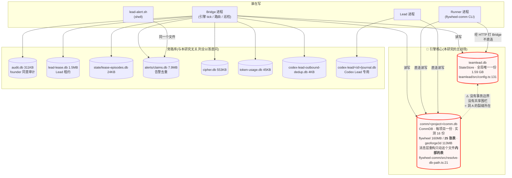

### 1.2 逐库清点

| 库 | 份数 | 实测体积 | 存什么 | 谁写 | 谁读 | 路径来源 |
|---|---|---|---|---|---|---|
| **`teamlead.db`** | **全局 1 份** | **1.59 GB** | StateStore 全部:sessions、workflow_* 全部引擎表(run / run_node / binding / **门票 hash** / claims / rework 四表 / gate_holder / launch_owner …) | **只有 Bridge 进程** | Bridge;Runner 经 HTTP 间接读 | `teamlead/src/config.ts:131` |
| **`comm/<project>/comm.db`** | **每项目 1 份**,实测 **16 份** | flywheel 160 MB<br>**(25 张表)**<br>geoforge3d 113 MB<br>tidal-echo 12.7 MB<br>其余 ≤3.8 MB | 消息层:`lead_inbox`(52,814 行)、`messages`、11 张追人账本、TURN(`runner_workflow_activation`,**含门票明文**)、`turn_source_history`、`workflow_source_event` —— **逐表分类见 §1.4.3** | Bridge、Runner、Lead **三方直连写** | 同上三方 | `flywheel-comm/src/resolve-db-path.ts:21`<br>`teamlead/src/bridge/commdb-path.ts:27` |
| `audit.db` | 1 | 311 KB | founder 同意审计(FLY-175 Track 2) | Bridge + `flywheel-comm respond` | 同 | `bridge/founder-consent/config.ts:121` |
| `lead-lease.db` | 1 | 1.5 MB | Lead 租约/占位 | Bridge、`flywheel-comm lead-lease` | 同 | `bridge/plugin.ts:9826` |
| `state/lease-episodes.db` | 1 | 24 KB | 租约 episode | Bridge | Bridge | `bridge/plugin.ts:9832` |
| `alerts/claims.db` | 1 | 7.9 MB | 告警去重账本(跨重启) | Bridge **+ `lead-alert.sh`(shell)** —— 两条独立写路径打同一文件 | 同 | `bridge/lead-alert-helpers.ts:33` |
| `cipher.db` | 1 | 553 KB | Cipher 同步 | Bridge | Bridge | `teamlead/src/index.ts:32` |
| `token-usage.db` | 1 | 45 KB | token 计量 | token-usage CLI | 同 | `token-usage/src/store/index.ts:18` |
| `codex-lead-outbound-dedup.db` | 1 | 4 KB | Codex Lead 出站去重 | Bridge | Bridge | `bridge/plugin.ts:2219` |
| `codex-lead/<id>/journal.db` | per-Codex-Lead | — | Codex Lead journal | Codex Lead runtime | 同 | `lead-backends/codex/SqliteJournalStore.ts` |
| `memories/<project>/history.db` | per-project | **生产未落盘** | 记忆服务 | edge-worker | — | `edge-worker/src/memory/createMemoryService.ts:17` |

> **本研究只关心红框那两个。** 其余八个是旁路,列全只为回答「现在到底有哪些库」这个直问。

### 1.3 关键关系:两个大库为什么会裂

**它们之间没有任何事务边界,也没有共享的围栏。** 一次返工唤醒要同时改两个库,而这两次写入之间只要崩一下,状态就对不上 —— 这就是 §6 修法 1 要治的东西(那里有专门的 dataflow 图)。

### 1.4 求证题:消息层重构落地后,库版图变成什么样?

> **⚠️ 本节是 founder R2 批注后重做的。** 她的原话:「我很确定我们的消息层重构就包括减少 table!」
> **她是对的 —— 重构确实减表,而且减得比我上一版写的多。** 上一版我把标题写成「库的数量一个都不会少」,
> 事实没错(数据库**文件**确实不减),但那句话把「表在减」整个盖住了。**事实归事实,表述归表述,下面分开写。**

#### 1.4.1 先对账:1569 与 design.md 是不是同一份?

| | FLY-1569 issue 正文 | `doc/messaging-rework/design.md@main` | 差异 |
|---|---|---|---|
| 内容 | §0 背景与病因 → §10 实施单索引 | 同 | **无语义差异** |
| 自证 | — | 文档**附录**逐字声明:与 1569 原文「**一个字符都没动**」,除 **3 处**(2 处 markdown 排版修复 + 1 处新增导航指针),并给出可复现的 diff 核对方法 | 3 处非语义 |
| 实施单索引 | §10 七单表 | 同 + README 补 Linear 单号/依赖图 | README 是新增导航 |

**⇒ 「1569 的 design 比 design.md 更全」这个假设不成立 —— 是同一份。**
**但她的判断没错**:减表这件事**两份里都有**,是我上一版没讲出来。

#### 1.4.2 事实:到底减了什么、加了什么

**A · 表(comm.db 内部)—— 确实减,这是重构的核心动作之一**

| 动作 | 单 | 现状 → 目标 |
|---|---|---|
| **两张信箱表合并** | **C · FLY-1572** | `lead_inbox`(37 字段)+ `messages`(22 字段)**→ 一张 `mailbox`** |
| **追人机制的账本清退** | C(承接 A 拆完之后) | FLY-1570 明写「**不动 schema(那是 C 单)**」+「让 **C 单删字段**变干净 —— 那 **17 个死字段**本来就是 watchdog 的账本」。**Lead 实测补充:1572 继任正在做的五项里就有「`receipt_resend` 入族」** ⇒ 这批账本表/字段的清退**是 C 单的活**,只是 design.md 没逐张列名 |
| **新增一张 task 表** | F · FLY-1575 | 职责不同(答「办没办」),不是信箱表的替代 |

**B · 行 —— 减得最狠的其实是这里**

`lead_inbox` 里 **42% 的行是它自己的回声**(重发副本)。租约到期改成「同一行重新变可见」而不是「复制一份新的」之后,**这个来源直接消失**。

```
2026-07-31(design.md 记录)   lead_inbox 44,567 行 · 其中 18,595 行(42%)是重发副本
2026-08-05(本研究实测)       lead_inbox 52,814 行   ← 5 天又长了 8,247 行
```

**C · 库(数据库文件)—— 数量不变**

七个实施单**全部在 `comm.db` 这一个文件内部操作**;`design.md` 里 **`teamlead` 出现 0 次**(`grep -c` 实测),FLY-1570 也明写「**纯删代码,不动 schema**」。**没有任何一单合并、新建或删除数据库文件。**

#### 1.4.3 现状实盘:comm.db 里现在有多少表

实测 `~/.flywheel/comm/flywheel/comm.db` 共 **25 张表**,按职责分四类:

| 类 | 表 | 说明 |
|---|---|---|
| **信箱(C 单要合的)** | `lead_inbox`(52,814 行)、`messages`(1,241 行) | **2 → 1** |
| **追人机制账本(A 已拆代码,表待 C 清退)** | `receipt_resend_deliveries`(**19,993 行**)、`receipt_handle_requests`(10,930)、`receipt_alert_outbox`(7,768)、`receipt_root_lineage`(2,023)、`receipt_activation_episodes`(2)、`receipt_exemption_audit`(0)、`lead_inbox_fenced_root`(10)、`lead_inbox_freeze_install`(1)、`lead_inbox_sanitation_audit`(1)、`runner_wake_failure_episode`(0)、`runner_phase_wakes`(2,527) | **11 张**。⚠️ **它们不是孤儿** —— 仍有写入方(`lead-inbox-queue.ts:1748`、`db.ts:3442` 等);Lead 报 1572 继任正在「receipt_resend 入族」 |
| **轮次/激活(本研究关心)** | `runner_workflow_activation`(25 行,**存门票明文**)、`turn_source_history`、`three_stage_turn`、`workflow_source_event` | 重构**不动** |
| **其他运行态** | `sessions`、`loop_heartbeat`、`loop_owner`、`runner_declared_states`、`runner_shutdown_controls`、`session_receipt_lineage`、`workflow_engine_park`、`workflow_engine_park_cursor` | — |

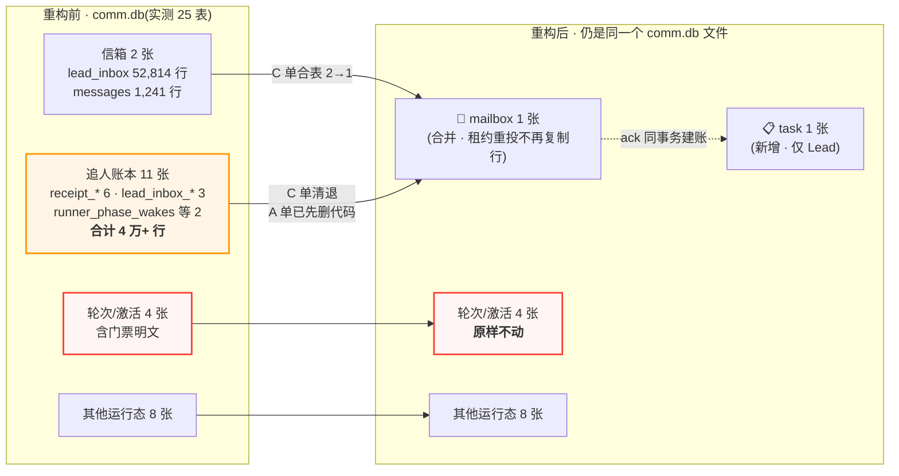

#### 1.4.4 三句话收口

1. **表:确实减。** 信箱 2→1,外加 11 张追人账本要清退。**这是重构最实在的成果之一,我上一版没写出来,是我的表述问题。**
2. **行:减得更狠。** 42% 的回声行从源头消失。
3. **库(文件):不变。** 七单全在同一个 `comm.db` 内部;`teamlead.db` 一次都没被提到。

> ### ⚠️ 但对 A 单来说,结论不变 —— 而且理由更硬了
> 上面那张图里,**红框那 4 张表(含存门票明文的 `runner_workflow_activation`)前后原样不动**,`teamlead.db` 更是整个不在范围内。
> **⇒ §6 修法 1 那道跨库裂缝,不会被消息层重构顺手治好。** 这一条**不因「重构确实减表」而改变** ——
> 它减的是消息层自己的表,而裂缝在**消息层与引擎账本之间**,那正好是七个单都没碰的地方。

---

## 1b. 引擎账本地图(`teamlead.db` 内部)

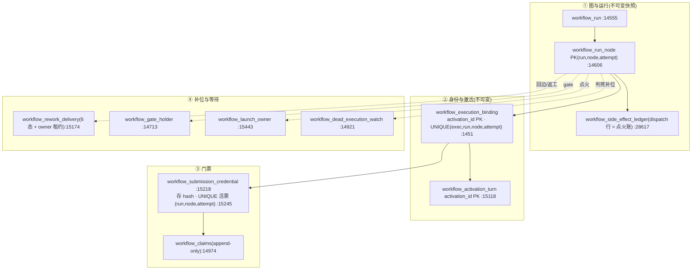

**主路**:`workflow_run_node(run,node,attempt)` 是唯一位置游标,`pending → admitted → running → done`。
`admitGeneralizedWorkflowExecution`(`:20545`)在同一事务里建 binding、铸门票、写 runtime、记事件。

**门票两条投递通道**:
- **spawn**:进程 env。`run-dispatcher.ts:850-863` / `:1470-1484` → 实际注入在 `claude-runner/src/TmuxAdapter.ts:452-456`、`CodexTmuxAdapter.ts:1434-1436`。
- **wake**:CommDB 的 TURN 记录。`coordinator.ts:36-63` → `flywheel-comm/src/db.ts:6265-6285` 落库;`plugin.ts:8551-8587` 的唤醒消息**只带文本与 metadata,不带 token**。
- **Runner 侧优先级**:`flywheel-comm/src/commands/workflow-activation.ts:13-45` —— activation `stale` → 抛;有 current activation 但无票 → 抛(**fail-closed**);**只有完全没有 current activation 时才回落 env**。

---

## 2. R1 · 重激活点普查

### 2.0 总体(population)定义

**总体 = `engine_owned = 1` 的 run 上,任何会让某个 `node_id` 被再次驱动去干活的<u>触发器</u>。**
下面分成**两张表**:§2.3 是触发器普查;§2.6 是**相邻的凭据/重放失败模式**(它们不是触发器,只是紧邻同一条路的故障形态)。

**明确排除**(legacy / shadow 面,不受 DAG 引擎契约管辖,但会写同一张 `workflow_run_node`):

| 排除项 | 位置 |
|---|---|
| 旧 typed 准入 `admitWorkflowExecution` | `StateStore.ts:19075`,生产调用方 `bridge/run-infra.ts:623-645` |
| legacy 再 QA(关旧 QA 重开) | `workflow-decision-routes.ts:872-989`、`phase-orchestrator.ts:647-723`(显式拒绝已入册的 `workflow_actor`) |
| shadow 批量投影 | `StateStore.applyWorkflowShadowBatch:29931-29999` |

### 2.1 唯一的铸票缝与它的 4 个调用点

`admitGeneralizedWorkflowExecution`(`:20545`)自称 "One fail-closed admission seam"。生产调用点穷举:

| 调用点 | 场景 | attempt | mode |
|---|---|---|---|
| `dispatcher.ts:1868` | 引擎 tick 派发 | 由 intent 决定 | `spawn` |
| `coordinator.ts:387` | 返工唤醒 | `route.target_attempt` | **`wake`** |
| `runs-route.ts:2568` | `/api/runs/start` | 1 | `spawn` |
| `actions.ts:989` | operator retry | `attempt+1` | `spawn` |

铸票在 `:20830-20866`。

### 2.2 幂等重放分支:真实边界(**Codex R1 更正**)

```ts
// StateStore.ts:20666-20688
if (existingBinding) {
    if (existingBinding.activation_id !== activationId || ...) return { ok:false, reason:"activation_conflict" };
    return { ok:true, idempotentReplay:true, activationId, outputCredential:undefined, snapshotDigest };
}
```
- binding 有 `UNIQUE (execution_id, run_id, node_id, attempt)`(`:1451-1461`)⇒ **不同的 activation 身份返回 `activation_conflict`(fail-closed)**,不会静默走这里。走到这里的**定义上就是同一 activation 的重放**。
- 引擎派发侧有旋转路径:`dispatcher.ts:1971-2006`(取得新 launch generation 时)、`:2007-2045`(投递修复时)。
  > ⚠️ **上一版把这两条写成「已有补偿」—— 只对 <u>spawn</u> 成立,对 <u>wake</u> 不成立,已按 §2.6 洞 C 更正。**
  > 旋转发生在 `teamlead.db`;新明文经 **env** 交给**新进程**。而一个**活着的**进程读的是 `comm.db` 的 TURN 行 —— 那一行**不会被更新**。
- Runner 侧 fail-closed(见 §1)。

**⇒ 真正的洞是两个可分辨的失败模式,列在 §2.6。**

### 2.3 触发器 / 再驱动族普查(engine-owned)

**计数单位**:一个「族」= **一个对外可调用的入口** 或 **一个持久的恢复驱动**。
(`qa_fail` 与 `review_fail` 分列,因为二者走**实质不同的激活通道**;T-7 的两个调用点合为一族。)

| # | 触发器 / 再驱动族 | 入口 | 新 attempt? | 铸票 | 判定 |
|---|---|---|---|---|---|
| **T-1** | **自动裁决转移 · `qa_fail` 子情形** | `StateStore.ts:25939-26039` → rework request → `coordinator.ts:387`(wake) | ✅ `max+1` | ✅ 经 TURN | 🟢 |
| **T-2** | **自动裁决转移 · `review_fail` 子情形** | 同上,**但 `reworkAuthority` 只认 `qa_fail` / `founder_feedback_kickback`**(`:25940-25943`)⇒ **review_fail 不建 rework,走普通后继 spawn** | ✅ | ✅ 经 env | 🟢 **⚠️ 原稿把 T-1/T-2 混成一条「裁决 fail → 链式 rework」,是错的** |
| **T-3** | **founder feedback(CommDB source event)** | `applyWorkflowSourceEvent`(`:27394-27614`) | ✅ | ✅ 经 TURN | 🟡 payload 里 target 写死 `design｜implement`(§2.5a #3) |
| **T-4** | **operator rework** | `openOperatorRework`(`:21766+`);接受 `active` **或 `completed`** 的 run | ✅ `max+1` | ✅ 经 TURN | 🟢 拓扑派生,**正面样板** |
| **T-5** | **operator loop re-entry** | `/api/workflow/loop-reentry` → `commitWorkflowLoopReentryRequest`(`workflow-decision-routes.ts:766-870`;`StateStore.ts:25535-25690`) | ✅ | 由后续 tick 铸 | 🟡 **原稿漏列** |
| **T-6** | **判死补位 · 通用** `rollbackDeadWorkflowNodeExecution`(`:22759`) | dead-exec sweep(`dispatcher.ts:1340-1500`) | ❌ 同 attempt,换 exec | ✅ 先撤旧票再铸 | 🟢 **全库做得最对的样板** |
| **T-7** | **判死补位 · rework 专用** `materializeWorkflowReworkReplacement`(`:19550`) | **两个驱动**:① 普通 pre-wake 补位(`dispatcher.ts:794-809`)② held pane-loss 恢复(`:724-779`) | ❌ 同 attempt,换 exec + route rev+1 | ✅ | 🟢 |
| **T-8** | **operator retry**(`actions.ts:989`) | `/api/actions/retry` | ✅ `attempt+1` | ✅ | 🟡 只收 `failed/blocked/rejected`,**不收 `terminated`** |
| **T-9** | **launch-owner 恢复族(点火重放 / 投递修复再驱动)**(**Codex R3 补 + R4 补全调用方**) | `recoverOrAcquireWorkflowLaunch` 全库 **3 个生产调用方**,三者都能「重放准入 → 租约到期后重取 → 旋转丢失的 plaintext → **再次派发**」(①② 走 `startDispatcher.start`,③ 走 `retryDispatcher.dispatch`):**① 引擎 tick** `dispatcher.ts:1907`(acquired 重放 `:1973-2006`;committed + 无可 adopt session + liveness 判死 → `claimWorkflowLaunchDeliveryRepair` `:1925-1957` → 修复围栏下旋转 `:2007-2045` → `:2049+` 再 start);**② `/api/runs/start`** `runs-route.ts:2659` —— 幂等请求且无持久响应时**重入准入**(`:2534-2581`),注释逐字写着「reacquire + re-drive after expiry」(`:2639-2644`),acquired 路径旋转丢失的 output plaintext(`:2747-2774`),再次 start(`:2804-2831`);committed 分支对非-output 节点另有条件式投递修复(`:2685-2745`);**③ operator retry** `actions.ts:1034` —— 在其 generalized 准入(`:989-998`)之后同样有 committed/acquired 恢复分支(`:1034-1165`),再派发(`:1203-1205`)⇒ **作为 T-8 的子路径** | ❌ 同 execution | ✅ 旋转 | 🟢 `allocateWorkflowLaunchOrdinalTx` 注释逐字称之为「**a pre-commit re-drive of one physical launch**」(`:32955-32960`)。它不改 `workflow_run_node`,但 §2.0 的总体按「再驱动工作」定义,故必须列入。**⚠️ 计数说明**:按「一个对外可调用入口 = 一族」,②(start 入口)本应独立成行;此处按**共享的 launch-owner 恢复机制**归并为一族并列全三个调用方,③ 同时也是 T-8 的子路径 |

### 2.4 activation / 门票的生命周期(**Codex R2 精确化**)

- `activation_id`:默认 `activation:${exec}:${run}:${node}:${attempt}`(`:20558`);rework 用 `activation:${requestId}`(`coordinator.ts:376`)。
- `workflow_activation_turn` **immutable 且 `activation_id` 为 PK** ⇒ **一个 activation 至多一条 turn 行**;`epoch` 由 CommDB 在 StateStore 准入**之后**分配 ⇒ **它不能当准入前的分配器**。
- **门票不是"一个 activation 一张"**:一个 activation 可以经旋转产生**多条物理门票行**;
  **活票唯一性边界是 `(run_id, node_id, attempt)`**(`ux_workflow_submission_live`,`:15245`),
  而每张票同时绑 `activation_id` 与 `execution_id`。二者不是同一个粒度。

### 2.5 写死坐标

#### (a) node-**id** 字面量

| # | 位置 | 写死内容 | 面 |
|---|---|---|---|
| 1 | `StateStore.ts:20222-20260` | `routeIsValid` 只接受 `design`/`implement` 的 3 个字面量元组 | **引擎** |
| 2 | `StateStore.ts:26147-26166` | `target.id === "design"` 决定 verificationPolicy。**注意**:`reworkAuthority === "qa"` 分支在它之前命中,所以普通 QA 回边**走不到**这一处 | **引擎** |
| 3 | `StateStore.ts:27394-27466` | founder-feedback source payload:`target: "design"｜"implement"`,scope ∈ `design｜implement｜qa` | **引擎** |
| 4 | `workflow-decision-routes.ts:235-255`、`:919-974` | `/re-qa` 要求投影节点 id 字面等于 `qa`。**`:249-254` 显式拒绝已入册的 `workflow_actor` ⇒ 这是 legacy-only 面** | legacy |
| 5 | `workflow-decision-routes.ts:488-525` | legacy claims 回退用 `listWorkflowRunNodes(run, "implement")` | legacy |
| — | `workflow-shadow-writer.ts:359-380`、`:623-668` | 直写三角色投影 | shadow(总体外) |

> 正面对照:**T-4 operator rework**(`:21864-21895`)是**完全图拓扑派生**的(BFS 可达集 + 按 type 映射)。「按图推导」代码现成,只是没被 1/2/3 复用。**修 1/2/3 是净减代码。**

#### (b) node-**type** 语义层

`WorkflowNodeType`(`workflow-template.ts:31-38`)是闭合枚举,且 type **承载语义**:
```ts
// v2 :1197-1247
if (node.type === "qa")         { 必须恰好 1 条 qa_fail/qa_pass 回边 }
else if (node.type === "review"){ 必须恰好 1 条 review_fail/review_pass 回边 }
else if (nodeLoops.length > 0)  { throw new Error(`node ${node.id} cannot own a loop`); }
```
v1(`:405-410`、`:678-735`)**不含 `review`**。
**但 node id 是任意非空字符串**(`workflow-template.ts:875` `nonempty(node.id)`)—— **没有任何地方要求 `type:"qa"` 的节点必须叫 `qa`。**

> ### ⚠️ 验收锚:字面指的是「任意 ID」,那今天可构造;「任意语义」是另一个范围决定
> - **验收线(A 单)= 任意 ID**:`beta(type=implement) → alpha(type=qa)` + `alpha → beta` on `qa_fail` + 任意命名 gate + 反向 vendor。**今天就能构造能跑。**
>   ⚠️ 但它**单独钉不死**引擎面那 3 处字面量(§6 修法 4)。
> - **独立的架构决定 = 任意语义/类型**:`type:"generic"` 的节点拥有回边。**今天不可能**,补齐它不是加两个枚举值(§6 修法 3b 的 8 项阻碍)。
>
> **⇒ 二者不是同一句话的两种读法,是两个不同层级的决定(§8 问题 1 与 1′)。**

### 2.6 相邻的凭据/重放失败模式(**不是触发器**)

| 洞 | 形态 | 证据强度 |
|---|---|---|
| **洞 A · 门票明文丢失(跨库崩溃窗口)** | 锁芯(hash)已落 `teamlead.db`、钥匙(明文)尚未落 `comm.db` 时崩溃 —— 明文只在内存,随进程消失。重放时 admission 无法重建,而 `coordinator.ts:387-445` 不补偿就把 `undefined` 喂给 `grantTurn`。**两个库之间没有事务边界**(§1.3);人话版 + 时序图见 **§6 修法 1** | **源码层确证** |
| **洞 C · activation 行陈旧(旋转不跨库传播)** | Lead 侧旋转凭据**只写 `teamlead.db` 的 `workflow_submission_credential`**,**不更新 `comm.db` 的 `runner_workflow_activation`**;CLI 忠实读 activation 的明文 → 送出一张**刚被 revoke 的卡** → 服务端忠实拒(**409 `credential_revoked`**)。**三方都没做错,是两个库的两处事实源没对齐。** | **源码层确证 + 1572 QA 现场可复现** |
| **洞 B · 无 activation 的进程内复测** | 没有任何新 activation → Runner 无 current activation → `workflow-activation.ts:36` **合法回落 env** → 用已消费的票提交 → `409 replay_payload_mismatch` | **源码层确证**;但「FLY-1638 第 9 项现场 = 洞 B」**是假设,不是实测** —— 附录 B 的查询没有证明当时 `FLYWHEEL_COMM_DB` 是否可用、CommDB session/turn 是否解析成 legacy、跑的是不是本次审阅的二进制。要坐实需补历史 CommDB / env / CLI 证据 |

#### 🔬 洞 C 的取证(比 Lead 报的更硬)

| 我核的 | 结果 |
|---|---|
| `credential_revoked` 拒绝点存在 | ✅ `StateStore.ts:23138 / 23157 / 23189 / 25243` |
| StateStore 的 rotate 会不会更新 comm.db | ✅ **不会** —— StateStore 只在注释里提 CommDB,**不写它** |
| **`UPDATE runner_workflow_activation` 全库有几处** | 🔴 **零处。** 那张表**只在 `grantTurn` 时 INSERT,此后再无任何更新路径** |

> **⇒ 这不是「旋转时忘了同步」,是「压根没有同步这个动作」。** 一旦 `grantTurn` 写下明文,那一行就冻住了;
> 之后 `teamlead.db` 侧的任何撤销/旋转,都会**静默地**让它变成一张作废卡。

> ### 💥 洞 C 证伪了我上一轮的一个推论
> 我上一轮据「Runner 是 TURN 优先 + fail-closed」推出「**提交时现读就好**」。
> **不成立** —— 现读的前提是 **activation 行本身是新的**。Runner 对「**没有**凭据」是 fail-closed,
> 但对「**有、但已作废**」毫无防御:它忠实地把那张卡递上去,然后被忠实地拒掉。
>
> **⇒ 真正的病根不是「读得不够新」,而是「明文被存在了两个地方」。**
> 这正好落在 founder 定案的**单一事实源**方向上(§0.2b)。

---

## 3. R2 · 等待点普查(引擎内状态机)

### 3.1 `workflow_rework_delivery`(`StateStore.ts:20115-20125`)

```ts
const allowed =
  (from === "pending"             && ["turn_granted","replacement_pending","held"].includes(to)) ||
  (from === "turn_granted"        && ["wake_delivered","replacement_pending","held"].includes(to)) ||
  (from === "wake_delivered"      && to === "completed") ||
  (from === "replacement_pending" && to === "completed");
```

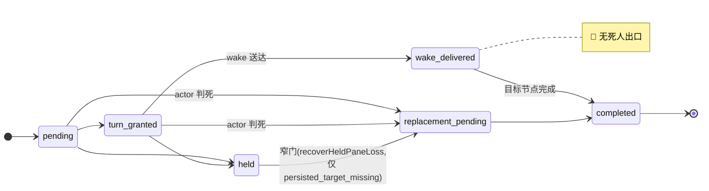

| 死角 | 证据 | 后果 |
|---|---|---|
| **D-1 `wake_delivered` 无死人出口** | `:20122` 只有 `→completed` | actor 在 wake 送达后死亡 → 永久搁浅 |
| **D-2 `wake_delivered` 全域不可见** | ① `listWorkflowReworkDeliveries()` **默认状态集** = `pending/turn_granted/replacement_pending`(`:19524-19531`);② 主对账显式拉 `pending/turn_granted/held`(`dispatcher.ts:698-709`);③ `claimWorkflowReworkDelivery` 只收 `pending/turn_granted`(`:19979-19991`);④ `releaseWorkflowReworkDelivery` 同(`:20070-20075`);⑤ `escalateWorkflowReworkStall` 守卫 + hold CAS 同(`:18017-18020`、`:18047-18065`) | 搁浅**静默**:既扫不到、也 claim 不了、也告不了警 |
| **D-3 终态冻结(**Codex R2 更正为四档**)** | `terminated` / `canceled` / `cancelled`:**真冻结**(所有 rework 路径 `run.status !== "active"` 跳过;`openOperatorRework:21771-21777` 只收 `active｜completed`)。生产实测有 **4 个 engine_owned 的 canceled run**。`held`:**有一条有界恢复窄门**(`dispatcher.ts:724-779` + `:19623-19669`)。`completed`:**仍可 operator rework** | 原稿「非 active 一律永久惰性」与「只有 terminated 是真冻结」两版都不准确;此为第三版 |

### 3.2 其余引擎内持久状态机

| 状态机 | 等待态 | 自动驱动 | 出口 |
|---|---|---|---|
| `workflow_launch_owner`(`:15443`) | `pending`/`repairing` | 点火路径 + 未点火 tripwire | 🟢 `repairing` 可租约接管(`:18835-18912`);marker 不一致 fail-closed 需人工 |
| `workflow_gate_holder`(`:14713`) | `materializing` | `plugin.ts:6911-6977` 重试 | 🔴 `runner_ship + carrier_binding_state='unbound'` **被物化器显式排除**(`:32314-32333`),只能人工双步重绑。**这是一条常发死点,见 §3.4 全案** —— 生产实测 **10 次发生 / 1 次修复**,其中 **FLY-1636 此刻仍卡在 active run 上** |
| `workflow_gate_holder.awaiting_review` | 是 | — | 🟢 **有意的、无限期的权威等待**,非 bug。**出口(读码列全,不留 TODO)**:founder feedback → `superseded`(`:27496-27520`);founder 批准 → `approved`(`:27710-27738`);operator rework → supersede(`:22018-22025`)。**超时只发通知、不迁移状态**(通用 session 超时码 `:5725-5759` 只 emit + 去重)⇒ **timeout 行为 = alert-only** |
| `workflow_loop_reentry_request`(`:14825`) | 无 | — | 🟢 immutable `status='committed'`,无等待态 |
| `land_operation`(`:14857`) | `intent`/`partial`/过期 `running` | `:32422-32521` + `plugin.ts:6979-7008` | 🟢 可回收;`held` 有意人工终态。生产库当前 0 行 |
| `workflow_pr_finalization`(`:14664`) | `claimed` | `listWorkflowPrConvergenceRows`(`:24078-24139`)持续重试 | 🟢 非死人等待。生产库当前 0 行 |

### 3.3 tripwire 阈值

| 巡检 | 阈值 | 环境变量 | 动作 | 代码 |
|---|---|---|---|---|
| 未点火 alert / rollback | 10 min / 60 min | `FLYWHEEL_ENGINE_UNLAUNCHED_ALERT_MS` / `..._ROLLBACK_MS` | 告警 / 三重取证后撤销准入 | `dispatcher.ts:1093-1097`、`:1170-1240` |
| rework 停滞 alert / hold | 复用上面两个变量 | — | 告警 / run 打 `held`(告警文案说的是「TURN/wake 未送达」,`:18091-18097`) | `dispatcher.ts:883-890` |
| 盲换上限 | **3** | — | run `held` + 「【需人工】」告警 | `:88`、`:22190` |
| dead-exec 退避 | 60s / 5min / 15min | — | 判死前梯度 | `dispatcher.ts:1396` |
| liveness `unknown` × 3 | — | — | severe 告警,**不动节点** | `dispatcher.ts:1424-1470` |
| dead-exec watch TTL | 24 h | — | 误杀 tripwire | `dispatcher.ts:129` |
| ~~门票窗口~~ | rework wake 路径硬编码 60 min;模板节点有 `submissionWindowMinutes` 但该路径不读 | — | 过期 fail-closed | **⚠️ founder 2026-08-05 定案:整个 TTL 机制砍掉(见 §6 修法 3c′)。此行仅作现状存档,不再是待修项。** |

---

### 3.4 第三个死点:head 漂移 → carrier 永不绑定(「无漂移出口」)

> **来源**:Tadashi 2026-08-05 在 FLY-1596 生产现场解开的活例,交给本普查记档。
> **我逐条读码复核 + 生产库取证,四条成立、一条需更正、并测出它<u>远不是孤例</u>。**

#### 病理链(逐条已验证)

| # | 环节 | 证据 |
|---|---|---|
| ① | implementer park 时 `session.pr_head_sha` = 旧 head | — |
| ② | QA 复测期间写了台账 commit(progress.md),branch head 前移 | 台账机制本身 |
| ③ | `qa_passed` claim 绑**新** head → gate holder 以新 head 建行,`authority_mode='runner_ship'`、`carrier_binding_state='unbound'` | — |
| ④ | 绑定校验要求 **`session.pr_head_sha == holder.head_sha`**,否则 `carrier_session_mismatch` —— 而 session 还停在旧 head ⇒ **永真失败** | `StateStore.ts:30558-30566`(逐字:`session.pr_head_sha?.toLowerCase() !== String(holder.head_sha).toLowerCase()`) |
| ⑤ | 物化清扫队列**显式排除** `runner_ship` + `unbound` ⇒ **零自动重试** | `listWorkflowGateHoldersForMaterialization`(`:32314-32333`):`AND (h.authority_mode IS NULL OR h.authority_mode <> 'runner_ship' OR h.carrier_binding_state = 'bound')` |
| ⑥ | 只能靠 operator 双步通道人工解 | `workflow-decision-routes.ts:648`(`/gate-carrier-rebind/stage`)+ `:688`(`/gate-carrier-rebind`) |
| ⑦ | 对照:legacy 路径有 **FLY-945 自动 rebind**(QA 证据 commit 挪 head 会自动重绑) | `bridge/auto-qa-coordinator.ts:212 / :256 / :1284 / :1305` |

#### ⚠️ 一处更正:不是「零告警」,是「告警一次、不重试、不自愈」

原始报告写「零重试零告警」。**零重试成立;零告警不成立** ——
存在一条 **severity=`severe`** 的告警 `gate_carrier_unbound`(`StateStore.ts:22267`、`:28289-28293`),body 里甚至逐字写明了修复用的两个端点。
`escalationUid = gate_carrier_unbound:${questionId}` ⇒ **每个 holder 只告一次**(不刷屏,也不重来)。
生产 `alerts/claims.db` 的 `alert_claims` 里能查到这些告警记录;`alert_deliveries` 无对应行 —— **投递结果无法从这个账本单独判定,不下结论。**

#### 📊 生产取证:**10 次发生,只有 1 次被修复**

```sql
SELECT kind, COUNT(*) FROM workflow_run_event
 WHERE kind IN ('gate_carrier_unbound','gate_carrier_rebound') GROUP BY kind;
-- gate_carrier_unbound  10
-- gate_carrier_rebound   1     ← 只有今天 Tadashi 手工解的那一次
```

| run | issue | unbound 时刻 | rebound | run 终态 |
|---|---|---|---|---|
| `fee58f20` | **FLY-1596** | 08-05 18:46:02 | **19:09:17(人工,23 分 15 秒)** | active |
| `24b03042` | **FLY-1636** | 08-05 06:47:37 | ❌ 从未 rebind | terminated(**19:2x 由 Lead 收账**)|
| `551d37dc` | FLY-1628 | 08-05 00:19:24 | ❌ | terminated |
| `7ca088e6` | FLY-1634 | 08-04 19:07:33 | ❌ | terminated |
| `901ce8f2` | FLY-1570 | 08-04 12:13:13 | ❌ | terminated |
| `3a9745e7` | FLY-1624 | 08-03 21:36:12 | ❌ | completed |
| `732a98ad` | FLY-1608 | 08-03 09:28:30 | ❌ | completed |
| `9077db7e` | FLY-1603 | 08-03 06:40:02 | ❌ | completed |
| `fbbdcd38` | FLY-1460 | 07-25 18:15:28 | ❌ | terminated |
| `66bae78a` | FLY-1466 | 07-25 17:43:38 | ❌ | terminated |

**⇒ 这不是孤例,是一条<u>常发</u>路径:10 天里 10 次,修复率 1/10。**

#### 🔬 未 rebind 的 9 例不是同一种东西 —— 至少三个亚型

| 亚型 | 说明 | 实证 | 该用什么修 |
|---|---|---|---|
| **(a) 真·漂移卡死** | head 前移导致绑定永真失败,活儿还没干完 | **FLY-1596**(已人工解)· **FLY-1603**(gate 的 subjectDigest 是 implement worktree 的 `chore(progress)` 本地 head,**不是 QA 验的 PR head** —— 见 FLY-1615) | **修法 2b** 自动重绑 |
| **(b) 外部旁路已完成、run 账没跟上** | 交付物其实已经 ship 了(PR 已 merge + 重启验证 + 归档),三个 session 全 completed,**run 只是一本僵尸账**。此时 rebind 反而有害 —— 只会给一个**已合并的 head** 发一张过期的 gate 卡 | **FLY-1636 确证**(PR #777 于 06:59Z 合入;Lead 走 operator terminate 收账,**不是** rebind) | **修法 2c**「外部完成收敛」——对账到 merged 事实,**不是**重开 gate |
| **(c) 批文早于 gate、不回扫** | founder 的批准发生在 gate **创建之前**,gate 开出来后不回扫早先的批文 ⇒ 批准无处落地 | **FLY-1603**(Annie 06:24 的 SHIP-VERDICT yes,gate 06:40 才开) | 见 **FLY-1615** 第二子病 |

> **⚠️ 分类学的实践意义**:(a) 和 (b) **需要完全相反的动作** —— 前者要重绑,后者重绑有害。
> **任何自动修复上线前必须先能区分这两者**(判据:目标 head 是否已经 merged)。这是修法 2b 的一条硬前置。

#### 🧬 家族补全:这不是四个 bug,是**同一条错误不变量被烤进了四本账**

> **第 4 例来源**:Tadashi 2026-08-05 在 FLY-1596 自 ship 时又揭一处,交本普查记档。**我逐条读码复核。**

**第 4 例病理**:`workflow_node_pr_binding` 主键 `(run_id, node_id, attempt)`、append-only。
`recordWorkflowNodePrBindingTx`(`StateStore.ts:24593-24650`)对**同 attempt 已存在的行只做比对、不做更新**:

```ts
const existing = /* WHERE run_id=? AND node_id=? AND attempt=? */;
if (existing) return tupleMatches(existing);   // ← 只比对,不更新
// 而 tupleMatches 里包含:
//   String(row.head_sha).toLowerCase() === normalized.headSha
```

⇒ 同 attempt 内 PR 前向 push(docs-only fast-forward)之后,**账本永远停在旧 head**。
随后 `bindWorkflowShipTargetForGateTx`(`:23424-23443`)按新 head 找 binding 行:

```ts
const binding = this.getCurrentWorkflowNodePrBindingForHead(runId, headSha);
if (!binding) throw new Error("workflow_ship_target_binding_unavailable");
```

⇒ **找不到 → `ship_target_binding_unavailable` → verify 恒 fail**(路由侧同名抛出在 `workflow-decision-routes.ts:322`)。
Lead 已手工对齐收场(单行 UPDATE 让账本 = GitHub 事实)。

**⇒ 家族全景(核实状态逐条标注):**

| # | 账本 | 它怎么绑 head | 前向漂移后的后果 | 我的核实 |
|---|---|---|---|---|
| 1 | `workflow_claims` | `subject_kind='git_head'` + `subject_digest`(`:14993`) | qa_passed 绑新 head,下游对不上 | ✅ 读码确认 |
| 2 | `workflow_gate_holder` | 绑定要求 `session.pr_head_sha == holder.head_sha`(`:30558-30566`) | carrier 永不绑定 | ✅ 读码确认 |
| 3 | review 记录 | **不是引擎账本** —— 存在 `~/.flywheel/state/review-requests/*.json` 文件里 | **它有天然出口:重新请求一次评审即可**(见下方不对称性) | ⚠️ 见下方核实边界 |
| 4 | `workflow_node_pr_binding` | PK `(run,node,attempt)` + tupleMatch 含 head 相等(`:24593-24650`) | ship target binding 查不到 → verify 恒 fail | ✅ 读码确认 |

#### 🔄 第 6 形态:**流程自造漂移**(记账机制自己在推 head)

> **来源**:Tadashi + 1643 QA 现场实证,交本普查记档。**我复核并在本 PR 上复现了第二个实例。**

**机制**:`flywheel-comm progress` 的记账是 **path-limited commit 到<u>被测分支</u>**
(`packages/flywheel-comm/src/commands/progress.ts:205` 逐字:`git commit --only -m <msg> -- <args.file>`)。
⇒ **QA 每跑一次记账,PR head 就前移一格。**
⇒ **QA 报告里点名的那个 "verified head",在写完记账那一刻就已经不是 PR head 了。**

**实证一(Tadashi / FLY-1643)**:QA 测的 `5d857c61` 与 gate 绑的 `2d58de50` 之间四个 commit **全是 QA 自己的 `chore(progress)`**,`git diff -- packages/ scripts/` **为空**。

**实证二(本 PR 自证,我实测)**:**PR #782 —— 也就是这份研究稿自己 —— 有 9 个 `chore(progress)` 提交**;
取最近相邻两个之间做 `git diff --stat -- packages/ scripts/` ⇒ **0 行**,改动全在 `engineering/doc/` 下。
**这份讲 head-drift 的稿子,自己就在制造 head-drift。**

**为什么这一支不同于前五种**:前面几种的推手是**人**(implementer 推代码、Lead 手工轮换、评审补录);
这一支的推手是**流程自己的记账机制** —— 它**每次都会发生,而且完全合法**。

#### 两条出路(Lead 与 1643 QA 都倾向第一条)

| 出路 | 做法 | 净值 | 我的补充 |
|---|---|---|---|
| **① 记账别提交到被测分支** | 台账写到别处(独立 ref / 仓外状态目录 / notes) | **净删**,合 founder 简化定案 | ⚠️ **有一条约束不能破**:台账之所以要 commit,是为了**跨重启可续**(restart / terminate / handoff 后能从真实游标继续)。换位置的设计**必须保住这条**,否则是拿一个已知收益换一个未知损失 |
| ② 绑定比对改判据 | 不比 SHA 相等,比「**生产路径 diff 为空**」 | 加判据(净加) | 它同时也能覆盖前五种形态里的「内容等价」情形 —— 与 §6 修法 2b 的三条件之一(**内容等价**)是同一件事 |

> **⇒ 归位**:本形态并入 §6 **修法 2b「合法前向漂移 ⇒ 账本跟随」**,不另开单(founder 已点名不许无限开单)。
> 它对 2b 的贡献是**把「内容等价」这个条件从抽象变具体**:
> **判据 = 生产路径(`packages/` / `scripts/` 等)的 diff 为空。** 这是可执行的、不需要人工看的。
>
> 而出路 ① 是**更彻底的形态** —— 它让这一支漂移**根本不产生**,与洞 C 的形态 A(单一事实源)同属「**消除病根而非加判据**」这一类。

#### ⚖️ 四本账里有一个不对称 —— 而它指出了修法的方向

**Lead 观察**:第 3 本(评审记录)在 1596 现场**自愈了** —— runner 重新请求一次评审就拿到 APPROVED,说明评审侧**有「重请求」这个天然跟随出口**,只是要人手动触发。

**我去核这条,核出了一个更锋利的解释,同时有一处没核到:**

| 我核到的 | 证据 |
|---|---|
| ✅ **评审记录根本不是引擎账本** | 它存在 `~/.flywheel/state/review-requests/*.json`;而引擎 claims 表里 `codex_approved` / `design_review_approved` 两个 predicate **全库 0 行**(实测 `GROUP BY predicate`:只有 `founder_approved` 12 / `qa_exempt` 13 / `qa_failed` 34 / `qa_passed` 57) |
| ✅ **重请求确实是常规可重复动作** | review-requests store 里 1596 的同一个 execution(`695938e5`)在 08-04 有 **5 次** design 评审请求,状态全是 `accepted` |
| ✅ **已核到(Lead 补位置后)**:exact-head 代码评审的 APPROVED | 它在 **`comm.db`** 里 —— `messages` 表存裁决 JSON(`{"reviewVerdict":"APPROVED","reviewerVerdict":"APPROVED","requestId":"d610de01…","round":…,"findings":[…]}`),`lead_inbox` 里有对应的 `gate_question` / `runner_question`(正文含 "Exact-head review 813cac99…")。**既不在 review-requests store,也不在 claims 表** |

> ### 💡 由此得到的更锋利的解释(**三处独立位置印证**)
> **不对称的根源不是「评审账本更聪明」,而是「评审压根不是一本被 head 钉住的账」。**
>
> 评审结果实际散落在**三个各自独立、且全都不是引擎账本**的位置:
> 1. `~/.flywheel/state/review-requests/*.json` —— 请求记录(文件)
> 2. `comm.db` 的 `messages`(裁决 JSON)+ `lead_inbox`(gate question)—— **问答对**
> 3. **引擎 `workflow_claims` 里 0 行** —— 两个 review predicate 全库未被写过
>
> 而另外三本(claims / gate_holder / pr_binding)都是**引擎侧、不可变、且把 head 焊进主键或相等校验里**。
> 评审是**请求-响应式**的:换个 head 就是发一条新请求 —— **它从来没被钉住,所以不需要出口。**
>
> **⇒ 对修法的指向**:1/2/4 的「账本跟随」出口,设计上可以参照评审那种**请求-作用域**的形态
> (每次漂移产生一条新的、指向新 head 的记录),而不是去改那三张不可变表的既有行。
> 这比「给不可变表加 UPDATE」干净得多,也更符合 founder 的「简单」原则。

> ### 🔴 共同根因(**这才是本节最重要的一句**)
> **系统各账本都假设「head 在一个 attempt 内不动」。**
> 而 **QA 台账 commit、评审补录、docs-only fast-forward —— 这些天然会推 head,而且都是<u>正常操作</u>。**
>
> ⇒ 这不是四个独立缺陷,是**一条错误的不变量**被分别烤进了四本账。
> ⇒ 因此**修法也不该做四遍** —— 需要的是一条统一的「**合法前向漂移 ⇒ 账本跟随**」出口。

#### 📌 这条病理已经有单了:**FLY-1615**

`[巡检场景2] gate carrier unbound 后无自愈无重发 — founder 批准无处落地(1603 实证)`,2026-08-03 建,Backlog,parent FLY-1613。

**本普查对它的增量**(不是重复建单,是给它补量化与分类):
1. 它记的是**单例**(1603);本普查测出**10 次发生 / 1 次修复 / 跨度 07-25→08-05**
2. 它没有分**亚型**;本节给出 (a)/(b)/(c) 三型,并指出 (a)(b) 需要相反动作
3. 它没有指出**现成参照**;本节找到 legacy 的 FLY-945 自动 rebind 可搬

**⇒ A 单立单时应与 FLY-1615 合并或明确主从,不要各修一半。**

#### 分类学归位

这是 §3.1 D-1「**无死人出口**」的姊妹:**「无漂移出口」**。
两者同构 —— **一个可证明的外部事实发生了(actor 死了 / head 漂了),但状态机没有对应的合法边,而巡检又把这个状态排除在外。**

| | 无死人出口(D-1) | 无漂移出口(本节) |
|---|---|---|
| 外部事实 | actor 进程死了 | branch head 前移了 |
| 卡住的行 | `workflow_rework_delivery.wake_delivered` | `workflow_gate_holder` `runner_ship`+`unbound` |
| 为什么不自愈 | 无 `→replacement_pending` 边 + 三重巡检盲区 | 绑定校验永真失败 + 物化队列显式排除 |
| 告警 | **无**(守卫把它挡回) | **有,但只一次** |
| 有没有现成参照 | 无 | **有 —— legacy 的 FLY-945 自动 rebind** |

---

### 3.5 送达审计缺口:`delivered_at` 的写入路径不覆盖问题类消息

> **来源**:1643 QA 自核送达时撞出,Lead 复核后交本普查记档。**我复核并测出<u>比原报告更大的边界</u>。**

#### 原报告 vs 我的实测

| | 原报告 | 我的实测(今日 24h,`~/.flywheel/comm/flywheel/comm.db`) |
|---|---|---|
| 范围 | `kind='report'`,185/185 全 NULL | **`kind='report'` 189 / **189 NULL** = 100%** ✅ 成立 |
| **真实边界** | (未提) | 🔴 **不是 report 的问题,是 `type='question'` 全体** —— **276 条 / 276 条 NULL = 100%**。`kind='report'` 的 189 条**全部是 `type='question'`**,所以 100% 中招 |
| 对照 | `kind` 为空的 421 条仅 138 未打戳 | `kind=''` 441 条 / 146 NULL = 33.1%;按 type 看:`response` 273/49 = 17.9%、`instruction` 81/10 = 12.3% |
| **Lead 独立复核**(不同时刻抽样) | — | `question` **279/279 = 100%**、`response` 47/275 = 17.1%、`instruction` 11/82 = 13.4% ⇒ **两次独立测量在不同时刻都得出「question 100%」**,结论稳健 |

#### 根因(读码)

`packages/flywheel-comm/src/db.ts` —— **锚点是下面这段字面量,行号仅作提示**
(我这棵树 `5917-5919`,Lead 那边报 `5916-5919`,同一条语句、版本偏移;**行号会漂,字面量不会**):
```sql
UPDATE messages
   SET delivered_at = COALESCE(delivered_at, datetime('now'))
 WHERE id = ? AND type = 'response'      -- ← 写入路径按 type 过滤
```
> 📌 **顺带一条方法上的自纠**:本稿其余 file:line 引用同理 —— **行号是给人快速定位用的,真正的锚点是代码字面量**。
> 跨版本核对时以字面量为准。(这条本身也是「把某一列当事实」那个病的一个小变种:**把行号当事实,而行号会漂。**)

**⇒ 打戳路径只覆盖 `type='response'`。问题类消息从来不会被打戳 —— 不是漏打,是路径不覆盖。**

#### 自证:我这一整晚的报告全在里面

本 exec(`d27f6133`)发出的 `kind='report'` 消息:**21 条,21 条 delivered_at 为 NULL。**
而它们**全部确实送达** —— Lead 逐条读到并引用原文回复了(本单往来可查)。
我自己也在过程中多次看到 `lead inbox nudge failed (durable queue row retained)`,
**没有把它当成投递失败**,而是靠 Lead 的引用反证送达 —— 与 1643 QA 的判断路径相同。

#### 含义

任何**按 `delivered_at` 审计投递**的机制(黑洞巡检、receipt 家族),
对**所有问题类消息**(含全部 report)会 **100% 误判为未送达**。
⚠️ **误判面比原报告大**:不止 report,是每一条 question。

---

## 4. R3 · 重开成本解剖

### 4.1 为什么今天重开必从首节点全过

- `workflow_start_reservation.run_id` **UNIQUE + append-only**(`:15361-15380`)。
- 公开入口的选择器把起点定为**入度为 0 的唯一节点、attempt 1**(`workflow-template-selection.ts:389-429`),`materializeWorkflowRun` 直接种进 `workflow_run_node`(`:16911-16917`)。
- `snapshot` 在 run 创建时固化(`:16849`)。

**⚠️ 更正**:`workflowAdmissionReservationBlocker`(`:20446-20480`)**本身不强制 root-only** —— 匹配的 `pending|running` reserved successor 会绕过「空 attempt → 必须是起点」。
**「只能从头跑」是<u>物化 + 选择</u>整体的不变量。** 有利推论:**一个原子预约了合法前沿的 resume 物化器,可能根本不需要弱化 blocker。**

### 4.2 代价(生产库,16:57:41 UTC 快照)

```
active 7 · canceled 8 · cancelled 1 · completed 10 · held 22 · terminated 119   (合计 167)
```
- `completed` = **10 / 167 = 6.0%**
- `terminated + held` = **141 / 167 = 84.4%**
- 全部非 completed = **157 / 167 = 94.0%**
- `canceled` / `cancelled` **两种拼写并存**,独立的小脏数据问题。

> **诚实边界**:① 「这些 run 已完成节点的产出在账本层完好」**未经本次查询验证**(只查了状态计数)。② 「多数 terminated 是被搁浅逼出来的」**也未验证** —— 需按事件 reason 抽样才能说。两条都是待验证假设。

### 4.3 节点级恢复 —— **open hypothesis(原「三处改动、不新增表」已撤回)**

已有证据面:`workflow_run_node.state='done'`、`workflow_node_completion`(append-only)、`workflow_node_outputs`/`_current`、`workflow_claims`、`snapshot_digest`。

**撤回原因(逐条成立)**:
1. `workflow_node_completion.activation_id` / `workflow_node_outputs.activation_id` **指向旧 run 的 binding**(`:15344-15358`、`:15274-15291`)⇒ 复制造成跨 run 权威归属,清空又丢证据链。**必须有 provenance/derivation 记录。**
2. 复制所有 `state='done'` 行**不等于闭合的合法前缀**(回边、superseded attempt、恢复点之后的下游工作、output-current 指针、PR 绑定、物化副作用、gate 证据都需要显式继承/失效规则)。
3. `snapshot_digest` 相等只证明**图与配置相同**,不证明 worktree/head 相同或外部副作用仍有效。
4. **`subject_digest` 不是权威边界**:claim 还绑 issue、run、decision_kind、predicate、issuer 节点/执行/vendor/model、subject producer、attempt、过期、撤销、authority_id(`:14974-15008`);索引是 `(workflow_run_id, decision_kind, subject_digest)`(`:15526`),**不支持无 run 作用域的按 digest 查**。

**⇒ 未来设计需要**:显式 resume lineage + 每节点继承回执、闭合前缀校验、head 与副作用权威重校验、以及**明确哪些 claim 允许被重新派生**。是新表还是 append-only 事件 + provenance 列,**应由不变量决定,不预设「不新增表」**。

---

## 5. R4 · 2026-08-05 活体病例串讲

### 5.1 病例 A(FLY-1638 第 8 项):FLY-1596 run `abb718fd` · rework `3ba50…`

```
run  abb718fd… | FLY-1596 | tpl_code | status=terminated
node design@1 done · implement@1 done · qa@1 done · implement@2 running(复用 implement@1 的同一 execution 0b48ca50)
delivery rework:3ba50… | wake_delivered | updated_at=2026-08-05T08:45:48.007Z  ← 至今未变
```

| seq | 时刻 | 事件 | 解读 |
|---|---|---|---|
| 16-18 | 08:45:46 | `claim_written` → `node_completed`(qa) → `loop_iteration` | QA@1 FAIL,**回边机制本身正常** |
| 19-22 | 08:45:46 | `rework_requested` → `route_interpreted` → `edge_traversed` → `target_reserved` | 路由到 implement@2,复用原 actor |
| 23-27 | 08:45:47-48 | `delivery_claimed` → `execution_admitted` → `activation_turn_granted`(epoch 8)→ `turn_granted` → **`wake_delivered`** | **delivery 行与 target-attempt 的推进自此不再改变**(账本本身仍有 seq 29–32 的后续写入) |
| **29** | **08:57:12** | `event_uid = divergence:…:implement:` **`1`**,payload `{"nodeState":"done","sessionStatus":"failed","lifecycleRevision":3}`,`execution_id=0b48ca50` | 见下 |
| 30-31 | 10:59 | qa divergence + teardown | 第二具尸体 |
| 32 | 11:12:22 | `run_terminated_by_operator` | 人手介入 |

> #### 🔍 实测能支撑的表述(**原稿把推断当实测,经多轮更正后的最终版**)
> **对这个被复用的 implement execution 而言,唯一持久化的 divergence 观测挂在 attempt 1 上;attempt 2 没有任何当前-attempt 的存活观测被记录。**
>
> #### 🔴 更重要的发现:被复用的 wake actor 落在**两个恢复驱动的共同盲区**里(全部可测)
> | 驱动 | 结构性排除原因 |
> |---|---|
> | `reconcileWorkflowDivergence` | 候选集 `WHERE n.state = 'done'`(`StateStore.ts:22651-22677`)⇒ **按定义看不到 running 的 attempt** |
> | `reconcileDeadExecutions` | 要求存在**最新的 `workflow_side_effect_ledger(kind='dispatch')` 行且 execution 匹配**(`dispatcher.ts:1383-1398`)。而 rework 复用 actor 时走 `rework_target_reserved` 分支,**该分支不调用 `allocateWorkflowLaunchOrdinalTx`**(`StateStore.ts:26385-26400`,只有新起 execution 的 else 分支才分配)⇒ **复用的 wake actor 没有 dispatch 账,永远进不了这个 sweep** |
>
> **⇒ 结论(可测,不含推断)**:`mode='wake'` 的复用 actor 一旦死亡,**既不被 divergence 观测覆盖,也不被 dead-exec sweep 覆盖,而 delivery 状态机还没有出口。三重结构性盲区。**

### 5.2 病例 B(FLY-1638 第 9 项):门票 id=107

```
id=107 | run=abb718fd | node=qa | attempt=1 | family=qa_verdict | exec=90920261…
       | issued=08:02:42.848 | expires=09:02:42.848(60 min)| consumed_at=08:45:46.352 | revoked=0
```
该 run 的 qa 节点全库只有这一张票。**候选解释 = §2.6 洞 B(源码层确证的失败形态);现场归因仍是<u>待验证映射</u>,不是实测**(见 §2.6 表注)。数据库只证明了「有一张被消费的凭据」,没有证明当时 Runner 走的是哪条 activation 解析路径。
逃生通道全堵:两个 rotate 函数**无 HTTP 暴露**;`/api/actions/retry` 不收 `terminated`;60 min 窗口在 rework 路径硬编码。

### 5.3 ⚠️ 活体存量 —— **库是活的,两次快照结论不同**

**16:0x 快照**:5 行非 completed delivery,全部在非 active run 上。
**16:57:41 快照(Codex R2 触发的复查)**:**6 行**,新增一行:

```
rework:d3a82d… | wake_delivered |              | run fee58f20 | status=active   | FLY-1596 | 16:44:43.814Z   ← 新增
rework:3ba50b… | wake_delivered |              | run abb718fd | terminated     | FLY-1596 | 08:45:48.007Z
rework:e26a21d… | held | persisted_target_missing        | run 9c785ed9 | held | FLY-1596 | 08-04 18:16
rework:1eb8e15… | held | worktree_not_ready:head_mismatch| run ae3b7edb | held | FLY-1571 | 08-04 11:57
rework:d90e10f… | held | terminal_status_unconfirmed     | run d015ad38 | held | FLY-1150 | 07-25 02:32
rework:389336… | held | persisted_target_missing         | run d015ad38 | held | FLY-1150 | 07-24 11:45
```

**两条更正 + 一条强化**:
- ❌ 原稿「非 completed 的 delivery 全部落在非 active run 上」—— **16:57 已不成立**。
- ❌ 原稿「5 行 0 行可自愈」—— `persisted_target_missing` 那两行**正是** `dispatcher.ts:724-779` 专门扫描的可恢复形态(能否真通过 liveness/物化守卫是另一个待测事实)。
- ✅ **强化**:`rework:d3a82d…` 在一个**active** run 上于 16:44:43 进入 `wake_delivered`,**这证明 D-1/D-2 不是「terminate 的后果」,而是在 <u>active 状态</u>的 run 上独立成立的结构缺陷**(注:`status='active'` 只证明该缺陷不以 run 终止为前提;它**不**证明这个 actor 当下是活着、死了还是搁浅 —— D-1/D-2 的成立由源码结构独立证明)。这比原稿单一 terminated 案例的证据强得多。

> **附录 B 使用说明**:存量清单是**活数据**,不同时刻结果不同。状态计数与 FLY-1596 的历史行(节点/事件/凭据 107)是稳定可复现的;**delivery 存量必须带时间戳读。**

### 5.4 三个投递:**共享失败模式**,不是一个已测得的单一根因(**Codex R2 更正**)

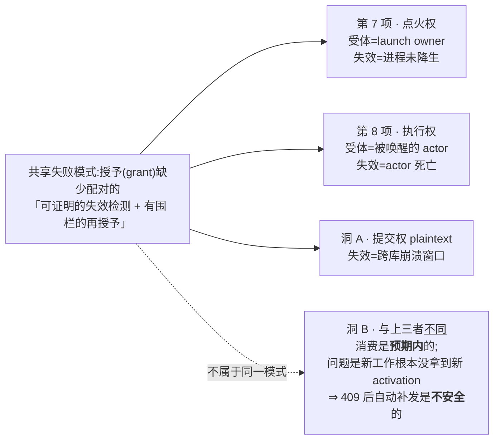

---

## 6. R5 · 通用修法议程(供共审)

> 本节经 Codex 五轮评审 + founder 三轮批注改写。**每条统一按「① 问题是什么(人话)→ ② 图 → ③ 怎么修」组织**,并如实标注哪些是**待设计**、哪些是**方案已清楚**。

### 6.0 设计基线声明:本节全部按<u>重构之后</u>的版图设计(可证明)

> **founder R3 直问**:「你的设计要完全按重构之后的设计去做啊!」「不是说重构后 db table 数量就会减少吗?这里为什么还是按照有两个 table 这样去设计的?!」

**先澄清一个我上一版没讲清的地方 —— 那不是两张<u>表</u>,是两个<u>数据库文件</u>:**

| 概念 | 是什么 | 重构动它吗 |
|---|---|---|
| **合表 2→1** | `lead_inbox` + `messages` **两张表** → 一张 `mailbox`。这是 **`comm.db` 文件<u>内部</u>**的事 | ✅ 动(C 单) |
| **修法 1 的「两个」** | `teamlead.db` 和 `comm.db` —— **两个不同的数据库文件** | ❌ 不动(七单都在 `comm.db` 一个文件内部) |

**⇒ 合表把 comm.db 里的两张信箱表变成一张,但 `teamlead.db` 与 `comm.db` 仍然是两个文件、之间仍然没有事务边界。修法 1 治的是后者,合表一点都没碰它。**

**证明「本节已经是按终态设计」的硬证据** —— 本节修法涉及的每一张表,在已批 `design.md` 里的出现次数:

| 修法涉及的表 | 所在库 | 在 `design.md` 出现次数 | ⇒ 重构前后 |
|---|---|---|---|
| `workflow_submission_credential` | teamlead.db | **0** | 逐字不变 |
| `runner_workflow_activation`(存门票明文) | **comm.db** | **0** | 逐字不变 |
| `workflow_rework_delivery` | teamlead.db | **0** | 逐字不变 |
| `workflow_gate_holder` | teamlead.db | **0** | 逐字不变 |
| `workflow_execution_binding` | teamlead.db | **0** | 逐字不变 |
| `workflow_activation_turn` | teamlead.db | **0** | 逐字不变 |

并且**本节全文对 `lead_inbox` / `messages` / `mailbox` 零引用**(可 grep 验证)。

> **⇒ 结论:本节的修法<u>天然就是按重构后版图设计的</u>** —— 不是因为我先见之明,而是因为**它们碰的表根本不在重构范围内**。
> 重构改的是消息层自己的表;这些修法改的是引擎账本 + 那张不被碰的激活表。**两拨人不在同一片地上施工。**

---

### 修法 1 · 门票明文丢失(原稿写的「跨库补铸」)

#### ① 问题是什么 —— 一句人话

> **一张门票,锁芯在一个库、钥匙在另一个库,而装锁和配钥匙是分两步做的,中间没有事务。崩在两步之间,锁装好了、钥匙永远配不出来了。**

拆开讲(全部对应 §1 库版图那两个红框):

| | 存在哪 | 存的是什么 | 谁能读 |
|---|---|---|---|
| **锁芯** | `teamlead.db`(全局 1 份) | 门票的 **hash**(`hashCapabilityToken(...)`) | 只有 Bridge |
| **钥匙** | `comm/<project>/comm.db`(每项目 1 份) | 门票的**明文**(`runner_workflow_activation.submission_credential`,`db.ts:6265-6285` 逐字存 `activation.submissionCredential`) | Runner 直连读 |

**要在两边一致的东西**:同一张门票 —— teamlead.db 里有它的 hash 且状态是「活的、未消费」,comm.db 里有能算出这个 hash 的那串明文。
**会裂的那一步**:先写 teamlead.db(铸 hash),再写 comm.db(落明文)。**这两次写入之间没有任何事务边界**(§1.3)。

#### ② 图

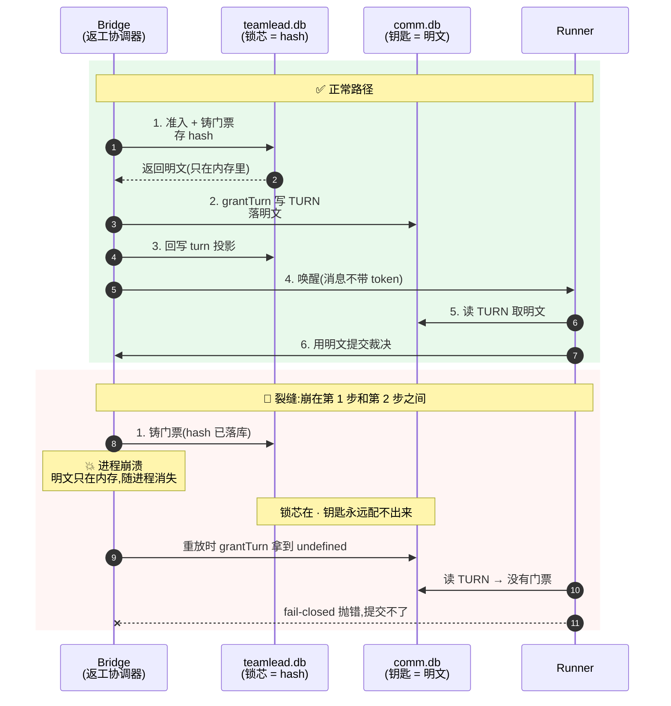

**还有一个更隐蔽的裂法(两代竞态,Codex R2 抓出来的)**:

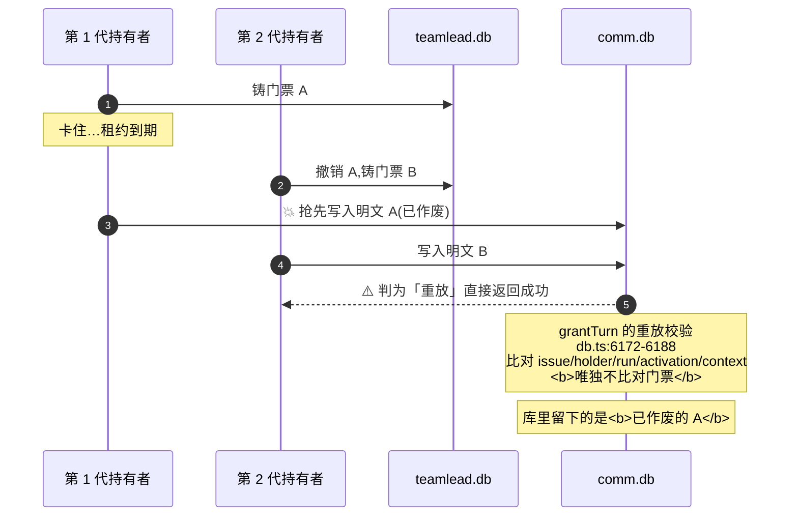

#### ③ 怎么修

**已排除的两种写法**:
- ❌ 给 binding 加「重激活序号」列 —— 那张表是 immutable 且 `UNIQUE(exec,run,node,attempt)`(`:1451-1461`),加序号会让 binding 变一对多,牵动 `activation_turn` 的主键等一大片。
- ❌ 只靠「租约 + 回执」做围栏 —— **它只围住了 teamlead.db 那一侧**(上面第二张图)。而且两个现成的 rotate 函数都由 `workflow_launch_owner` 围栏(`:18644-18655`、`:18750-18759`),**不是** `workflow_rework_delivery` ⇒ 需要一个新的、由返工投递授权的 StateStore 操作。

**判别必须沿四个维度取值**,只看「两个库各有没有」会把三种不同的崩溃态混成一格:
1. binding 有没有、身份是否精确匹配
2. teamlead.db 的门票 hash 行:无 / 活的 / 已消费 / 已撤销;以及 family
3. comm.db 的 TURN:无 / 有(含明文与代际围栏)
4. teamlead.db 的 turn 投影:无 / 有

| comm.db TURN | teamlead 投影 | 要求的处理 |
|---|---|---|
| 无 | 无 | **这格必须再按维度 1/2 拆**:(a) 尚未准入 (b) **已准入、有活票、明文丢了 ← 就是本节的问题** (c) 有已消费/已撤销的历史。三者动作不同;**同代重放但拿不到明文时必须等待/对账,绝不报成功** |
| 有 | 无 | 校验 TURN 身份 **且把明文 hash 一遍与一张活票比对**,再投影 |
| 有 | 有 | 双向校验身份 + 门票 family/存在性 |
| 无 | 有 | 按预期顺序不可能 ⇒ **fail loud(脑裂)** |
| 有但 token 缺失/已撤销/不匹配 | 任意 | **不具权威**,需显式修复/取代设计 |

> ### 🥇 首选形态(founder 单一事实源定案 + 洞 C 实证共同指向):**别让明文存两处**
>
> 洞 C 证明:只要明文同时存在 `teamlead.db`(hash)与 `comm.db`(明文)两侧,
> **就必须有人负责让两边同步 —— 而今天<u>根本没有这个动作</u>**(`UPDATE runner_workflow_activation` 全库零处)。
> 加围栏是在**维持两处事实源**的前提下让它们别打架;**砍掉第二处**则是让这个问题不存在。
>
> | 形态 | 做法 | 代价 | 与 founder 定案 |
> |---|---|---|---|
> | **A. 单一事实源(建议)** | 明文**只在一处**权威存放,另一侧只存 hash / 只存指针;Runner 提交时按指针现取 | 需改 CLI 取凭据的路径 | ✅ 正向:**删掉一处事实源**,符合「删>加」 |
> | **B. 加跨库围栏** | 维持两处,加单调围栏 + 同事务推进 activation 行 | 新增机制 | ⚠️ 净加,过不了「删>加」(§6.5) |
>
> **⇒ 形态 A 同时解决洞 A、洞 C,并且是净删。** 形态 B 只解决洞 A,而且是本议程唯一的净加项。
> **这条把 §8 那个「修法 1 过不了新标准」的问题也一并解掉了** —— 换个形态就不用纠结了。
>
> 若最终仍走形态 B,则以下四条硬要求不变:

**四条硬要求**:① 围栏必须**加在 comm.db 的写入处**(最清楚的做法:一个按返工请求键的单调围栏);② comm.db 的 source 身份/context 需 generation-aware;③ 投影与投递转移要 CAS 在仍然当前的 `(request, owner, generation)` 上(否则过期 epoch 会变成不可变的 `activation_turn` 行,`:19427-19456`);④ 每个切点 + 两代交错都要有故障注入测试。

> **必须先答的身份约束**:generation-aware 的 source **本身不等于「可以再铸一个语义 activation」** —— 每个 `activation_id` 只允许一条不可变 turn(`:15118-15133`、`:19427-19456`),binding 唯一性又禁止同 `(exec,run,node,attempt)` 有第二个 activation。**设计必须规定:后来的一代什么时候「采纳已有的权威 turn」,什么时候必须「换 execution / 新 activation 身份」。** 否则解决完竞态会立刻撞 `activation_turn_conflict` / `activation_conflict`。

> ⚠️ **「零新字段」不再是本条的目标。** 一个显式的单调围栏,比一个「过期写入方不会被拒绝」的隐式协议**更简单**。
> ⚠️ **等消息层重构治不好这条** —— §1.4 已求证:重构不碰 `teamlead.db`,也不碰存明文的那张表。

**另一个不同性质的问题(§2.6 洞 B)**:没有任何新 activation 的进程内复测 —— 那里门票被消费是**正常的**,病在「新一轮工作根本没走激活流程」。**不该靠补铸解决**,该靠「没有 activation 就不许提交」:(i) 让复测必须产生真 activation(走 T-1/T-4);(ii) 把两个 rotate 暴露成**带审计的 operator 端点**当逃生口。**建议 (i) 为主、(ii) 兜底。409 之后自动补发是不安全的。**

---

### 修法 2 · 被叫醒的 runner 死了以后没人管

#### ① 问题是什么 —— 一句人话

> **引擎叫醒一个已有的 runner 去返工,叫醒之后它死了。返工登记表上「已叫醒」这一格<u>只有一条出路:等那个已经死了的 runner 把活干完</u>。而整套恢复系统在结构上又恰好看不见它。**

#### ② 图

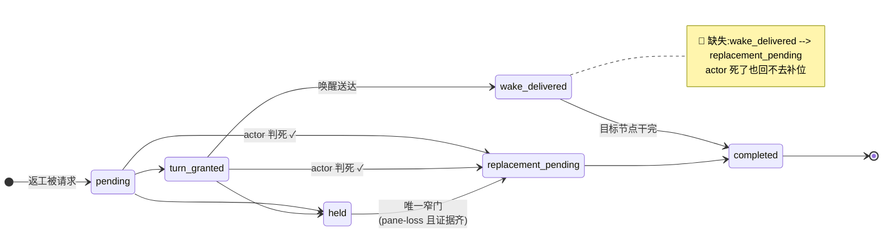

**为什么整套系统还看不见它**(三重盲区,全部实测):

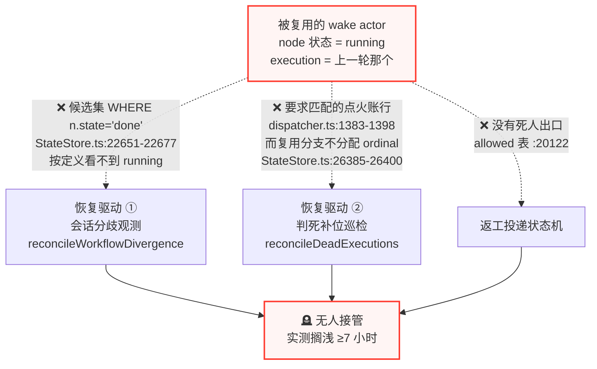

#### ③ 怎么修

**两个不能做的**:
- ❌ **不能塞进现有停滞计时器** —— `wake_delivered` 意味着投递**成功**,执行体可以合法跑一个多小时;那个计时器 60 分钟会把 run 打成 `held`,且告警文案说的是「TURN/wake 未送达」(`:18091-18097`)⇒ **会误杀正常长跑**。
- ❌ **不能直接复用现成判死巡检** —— 它要求点火账行,而复用的 wake actor 根本没有(上图)。

**守卫图 —— 按「旧路径排除项 / 新操作不变量」分类**(原稿把两类混成一张「必须改动」表,照做会造出两个互相竞争的驱动):

| 分类 | 条目 | 设计含义 |
|---|---|---|
| **A. 继续把 `wake_delivered` 排除在旧驱动之外** | ① `listWorkflowReworkDeliveries()` 默认状态集(`:19524-19531`)② 主对账数组(`dispatcher.ts:698-709`)③ 停滞升级前置 + hold CAS(`:18017-18020`、`:18047-18065`) | **不要**喂给通用 coordinator 或停滞计时器 |
| **B. 归属原语,取决于并发方案** | ④ `claimWorkflowReworkDelivery`(`:19979-19991`)⑤ `releaseWorkflowReworkDelivery`(`:20070-20075`) | **只有**专属分支复用它们、且旧 coordinator 仍收不到该状态时才放宽;否则另建专属 claim/release 或用无租约幂等 CAS |
| **C. 新原子操作必须强制的不变量** | ⑥ 迁移表加 `wake_delivered → replacement_pending`(`:20115-20125`)⑦ 物化器目标守卫接受 `running`(`:19644-19655`)⑧ 补「无完成回执」校验 + 写**真实**活动基线(`:19781-19801`)⑨ 验证路径 CAS 在同一 target 且 `active` | 由**专属的单个原子操作**承担 |
| **D. 旧 coordinator 守卫** | ⑩ `coordinator.ts:288-303` 只收 `pending｜admitted` | coordinator 若不再拥有该状态,**就不要放宽它**;把「execution 精确匹配」搬进新操作 |

**建议形态**:在现有维护 tick 内加一个**专属分支**(候选 = `mode='wake'` 且 `delivery.state='wake_delivered'`),用**完整的判死证明**(终态/teardown 证据 **且** `probeTerminalLaunchLiveness === 'dead'`,带退避、`unknown` 不动、采真实活动基线),**单个原子操作**完成全部变更,并明确**驱动权交接**:专属分支拥有被复用的 wake actor;一旦产生带点火账的新 `mode='replacement'` actor,后续死亡归普通巡检。

> **必须先答的并发问题(要选的是<u>归属模型</u>,不是「用不用 CAS」)**:
> (i) 专属的 wake-recovery 租约归属,还是 (ii) 无租约归属、靠事务幂等 CAS + 固定回执收敛?
> **两种安全设计在最终变更处都需要事务性 CAS;二选一选的是「谁拥有这一行」。真正的禁止项是两个恢复驱动同时认领同一状态。**

---

### 修法 2b · head 漂移的自动重绑(「无漂移出口」)<span> — 有现成参照,是本议程里最便宜的一条</span>

#### ① 问题是什么 —— 一句人话

> **QA 复测期间往分支上写了几个台账 commit,branch head 就前移了。批准闸认新 head,而 parked 的那个 runner 还停在旧 head —— 两边对不上,闸就永远绑不上人,founder 永远看不到卡片。**

#### ② 图

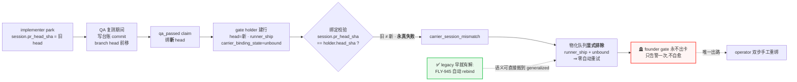

#### ③ 怎么修

**把 legacy 的 FLY-945 语义搬到 generalized 路径,并且<u>按家族统一做,不做四遍</u>。**

原表述只说了「重绑 carrier」。按 §3.4 家族补全,正确的形态是**一条统一的「合法前向漂移 ⇒ 账本跟随」出口**,覆盖四本账:

| 账本 | 跟随动作 |
|---|---|
| `workflow_gate_holder` | 对齐 session head 后重绑 carrier |
| `workflow_node_pr_binding` | 允许**同 attempt 内的前向 head 更新**(今天是 tupleMatch 拒绝) |
| `workflow_claims` | 判定旧 head 的 claim 对新 head 是否仍然成立(前向且内容等价 ⇒ 成立) |
| review 记录 | 同上 |

**「合法漂移」的三条件(不可放宽)**:**同分支 · 纯前向 · 内容等价**(即新 head 是旧 head 的祖先链后继,且不引入被验证范围之外的改动)。

> **「内容等价」的可执行判据(由第 6 形态给出,§3.4)**:**生产路径的 diff 为空** ——
> `git diff <verified_head>..<current_head> -- packages/ scripts/` 无输出。
> 这是机器可判的,不需要人工看 diff。**较真的 QA 今天正是靠人工比这个空 diff 才敢放行。**

配套两条:
- **物化队列的排除条件要放宽**:今天它把 `runner_ship + unbound` 整类排除(`:32314-32333`);自动重绑接上后,这一类应改为「可进队列、但绑定前先做漂移判定」。
- **告警语义改一次性为可复发**:现在 `escalationUid` 按 questionId 固定 ⇒ 一个 holder 只告一次;若自动重绑失败,应允许按「漂移代次」再告(避免像今天 FLY-1636 那样告过一次就再无声息)。

**为什么这是最便宜的一条**:参照实现已经存在且在生产跑着(legacy 路径),不需要新设计范式;**风险主要在「什么算合法漂移」的判定**(必须限定同分支、前向、且 claim 主体一致),不在机制本身。

---

### 修法 2c · 外部完成收敛(与 2b **动作相反**,必须成对设计)

#### ① 问题是什么 —— 一句人话

> **活儿其实已经干完了、PR 也合了,只是 run 这本账没跟上。** 这时候你去「自动重绑」不但没用,**还有害** —— 它会给一个**已经合并的 head** 发一张过期的批准卡,请 founder 批一件已经做完的事。

#### ② 图

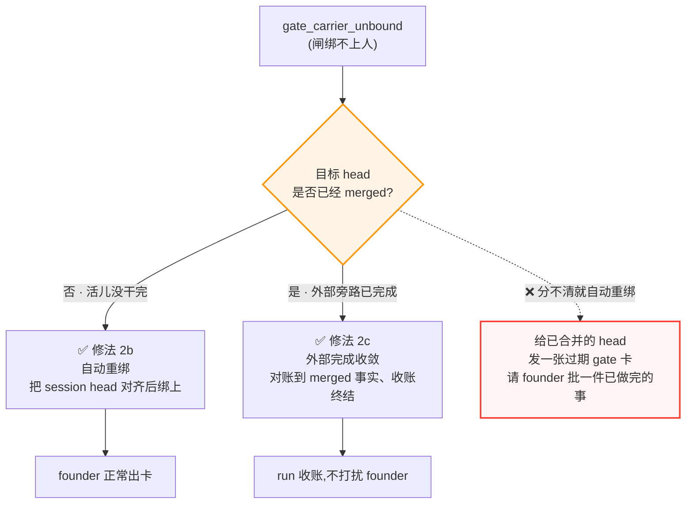

#### ③ 怎么修

- **判据**:`workflow_gate_holder.head_sha` 对应的提交**是否已进入目标分支**(merged 事实)。这是一次外部只读核验,不是猜。
- **动作**:已 merged ⇒ 走**收敛/收账**路径终结该 run(等价于 Lead 今天手工做的 operator terminate),**不开 gate、不打扰 founder**;未 merged ⇒ 才交给修法 2b。
- **⚠️ 硬前置**:**2b 上线前必须先有这个判据**,否则 2b 会在 (b) 型上主动制造「请批一件已完成的事」的噪音 —— 那比现在的「卡住不动」更糟。

**⇒ 2b 与 2c 必须成对设计、成对验收。** T2 故障注入测试要同时覆盖两条分支(未 merged → 重绑成功;已 merged → 收敛终结、零 gate 卡)。

---

### 修法 3 · 去写死

#### ① 问题是什么 —— 一句人话

> **同一件事(返工要作废哪些节点、之后要重跑哪些验证),引擎里有两套算法:一套<u>按图算</u>,一套<u>按节点名字查表</u>。按名字那套让任何不叫 design/implement/qa 的图直接非法。**

#### ② 图

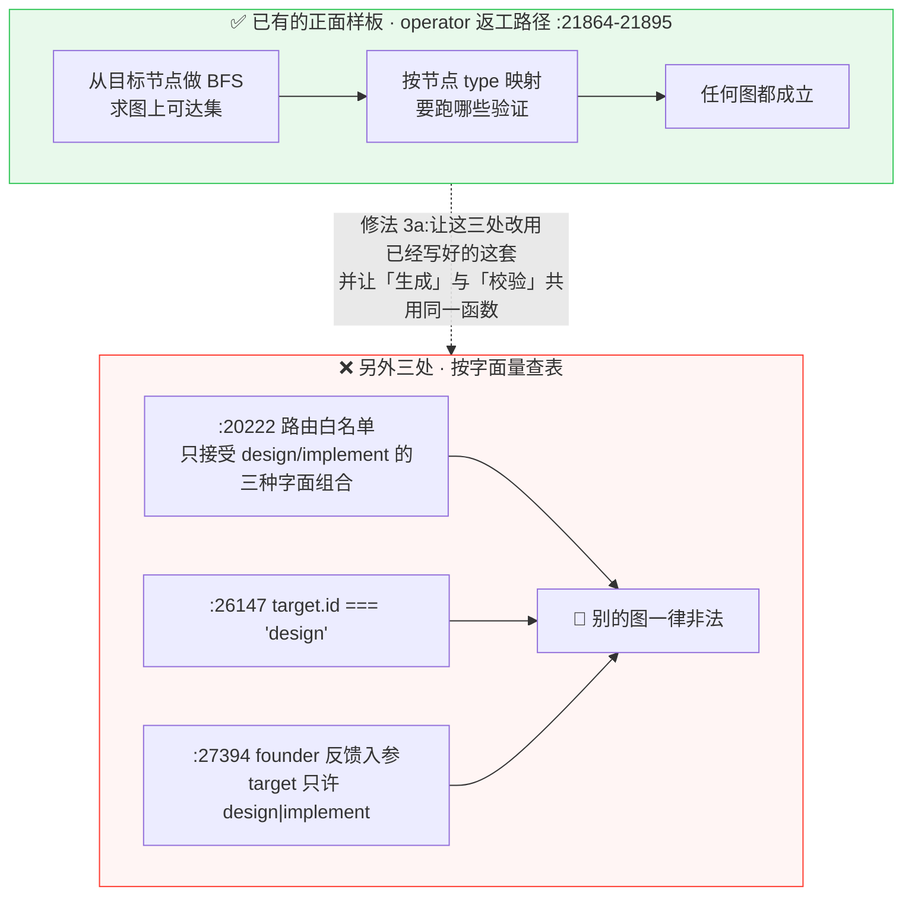

#### ③ 怎么修

- **3a(建议进 A 单)**:引擎面那 3 处改用同文件已有的拓扑推导,**生成与校验共用同一个函数**(写死自动消失)。**净减代码。** legacy 面 2 处(`workflow-decision-routes.ts`)需显式 scope 裁定。
- **3c′(founder 2026-08-05 定案改写:<u>砍 TTL</u>,不是读 TTL)**:见下方独立小节。
  > ⚠️ **本条上一版写的是「返工路径改读节点的 `submissionWindowMinutes`」—— 已作废。**
  > founder 原话:「**不要搞什么会过期的钥匙!**」⇒ 凭据**不再有过期这回事**,「TTL 预配 / 续期 / 按节点声明窗口」整类修法全部取消,本稿不再出现。
- **3b(建议**不**进 A 单)**:见下。

---

### 修法 3b · 类型层解耦 —— 为什么它是独立一单

#### ① 问题是什么 —— 一句人话

> **节点的「类型」不是标签,它是合同。** 谁能拥有回边、回边怎么触发、谁是 ship carrier、裁决叫什么名字,全由类型决定。想让任意语义的节点拥有回边,就得把这份合同整个重写。

#### ② 图

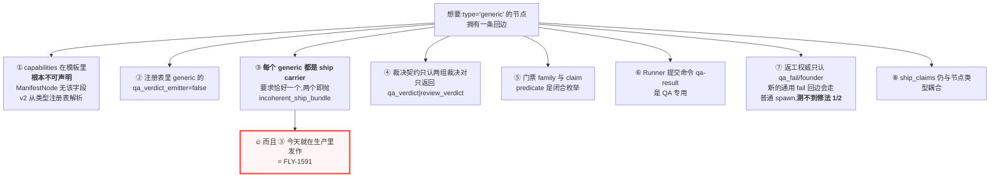

#### ③ FLY-1591 交叉发现(Tadashi 2026-08-05 确诊,我读码复核)

`incoherent_ship_bundle` 全库**恰好三处 throw,全在同一个函数** `resolveWorkflowGateAuthority`:`workflow-run-snapshot.ts:162 / :174 / :177`。而 `generic` 类型在注册表里带 `creates_pr / can_ship / can_land = true`(`node-type-registry.ts:125-149`),该函数又要求 ship carrier **恰好一个**。

**这条约束原本被我写成「未来做 3b 时会撞上的设计阻碍」;Tadashi 的确诊说明它<u>今天就在生产里现行发作</u>**(FLY-1591 —— 本单自己的 `flywheel-comm complete` 撞 500 就是同源)。

含义两层:① 三处 throw 同源同函数,修的时候大概率是**一个收口**而非三个补丁;② **3b 的论证增强(它不只是未来的绊脚石,是现在正在漏的地方),但结论不变:不进 A 单。**

#### ④ 怎么修

**正确入口**:阻碍 ④ 的那个函数注释写着「**never its node type or id**」—— 解析锚点已经是**回边的裁决对**。所以通用化应做成**「裁决契约」一等公民化**(允许的 outcome/predicate、subject 权威、生产者关系、独立性规则、门票政策、ship carrier 政策)。**这是独立设计单的体量,不是加两个枚举值。**

---

### 修法 3c′ · 砍掉凭据 TTL(founder 定案 · **纯删除,删除力度最大的一条**)

#### ① 定案原话与落法

> 「**不要搞什么会过期的钥匙!**」「**系统设计简单!简单!简单!所有繁复埋雷的东西全删除掉!**」

**新口径**:workflow 凭据只保留**两个属性**——
1. **一次性消费**(消费过就作废)
2. **绑 `run / node / attempt`**

**⇒ 钥匙与任务同生命周期。任务还在,钥匙就有效;任务终结,钥匙随之无意义。不设时钟。**

#### ② 能删掉多少(实测,已排除租约)

| 要删的机制件 | 实测量 |
|---|---|
| 凭据侧过期引用(**已排除** `lease_expires_at` / `claim_expires_at` 等租约,那些不在本条范围) | **227 处**(非测试) |
| `submissionWindowMinutes` 模板 TTL 字段及其全部消费点 | 25 处 |
| `invalid_expiry` 守卫分支 | 12 处 |
| `workflowCredentialRotationExpiryTx`(旋转时的过期重算) | 5 处 |
| `credentialExpiryForNode`(派发时算窗口) | 4 处 |
| 带 `expires_at` + `absolute_deadline_at` 两列的凭据表 | 5 张 |
| 硬编码窗口(`coordinator.ts:382/385`、`actions.ts:995/1129` 等) | 全去 |

**保留**:`consumed_at IS NULL AND revoked = 0` 的一次性消费判定(**17 处**)+ `(run_id, node_id, attempt)` 活票唯一索引。**这两样就是新口径的全部。**

#### ③ 顺带把修法 1 也变简单了

修法 1 原本要沿**四个维度**判别崩溃态,其中一维是「门票 hash 行:无 / 活的 / **已过期** / 已消费 / 已撤销」。
**砍掉 TTL 后这一维少一个取值**,而且 `workflowCredentialRotationExpiryTx` 整个从旋转路径上消失 ⇒ **修法 1 的状态表和实现面都跟着缩。**

#### ④ 与 FLY-1638 第 4 项的处置(**口径由 Lead 补正**)

FLY-1638 第 4 项是「QA 节点 TTL 预配(qa 默认 6h)」—— 方向与「不要会过期的钥匙」相反。但它的处置**不是「作废别做」,而是「已经做了,由 A 单删掉」**:

| 事实 | 状态(实测) |
|---|---|
| 该项**已在 PR #779 里实现** | ✅ PR #779 **`state=OPEN`、未合入**;`main` 仍在 `6fbc4292` |
| PR #779 的 TTL 相关新增 | **43 行**命中 `submissionWindowMinutes` / `expiresAt` / `absolute_deadline` / `credentialExpiry` |
| FLY-1638 已冻结在 ship gate | **不重开、不回改** |

> **⇒ 处置口径:1638 第 4 项由 A 单 3c′ <u>收编清除</u>,不回改 1638。**
> 也就是说 #779 照常 ship,它带进来的那部分 TTL 代码由 A 单一并删除。

#### ⑤ ⚠️ 227 这个数字的口径

**227 是在 `main@6fbc4292`(本研究的读码基线)上量的,即 <u>#779 合入之前</u>。**
#779 落地后 TTL 面会**变大**(至少多上面那 43 行)。
**⇒ A 单 3c′ 的实际删除量 = 227 + #779 带进来的部分,只多不少。** 本稿不预估合入后的确切数,避免虚报。

相关病历(1628 QA 凭证 3.7h 撞 1h 墙)在新口径下**不会再发生** —— 因为根本没有墙。

---

### 修法 4 · 测试拆三份

| 测试 | 内容 | 能钉死什么(不要高估) |
|---|---|---|
| **T1 · 任意 ID 回边** | `alpha`/`beta` 任意 ID + 现有语义类型 + 反向 vendor + 一个 carrier + 任意命名 gate;2 轮 `qa_fail` 后 pass | ✅ 证明**普通 QA 回边路径与名字无关**<br>❌ **走不到** `/re-qa`、legacy 回退、founder 反馈解析;**也走不到 `target.id === "design"`**(`reworkAuthority === "qa"` 分支先命中,`:26162-26166`)⇒ **要钉死引擎面 3 处,必须另加「任意 ID 的 founder-feedback / route-revision」用例** |
| **T2 · wake 死亡故障注入** | 推到 `wake_delivered` → 经**生产 liveness 缝**证明进程已死 → 断言有围栏的继任被铸出。覆盖 `alive`/`dead`/`unknown`/缺点火账/已有完成回执/route-revision 竞态/租约代际竞态/驱动权交接 | 修法 2 全部 |
| **T3 · 未来** | 任意**语义**节点拥有回边 | 类型层写死(需 3b 完整设计) |

---

### 6.5 验收总账(**按 founder 2026-08-05 定案的新唯一标准:删掉的机制比加上的多**)

> 原话:「**系统设计简单!简单!简单!所有繁复埋雷的东西全删除掉!**」
> **⇒ 上一版那个「机制数不升」的口径已经不够了。新标准是净删。** 下表按新标准逐条给净值。

| 修法 | 加什么 | 删什么 | 净值 | 进 A 单 |
|---|---|---|---|---|
| **3c′ 砍凭据 TTL** | 无 | **227 处过期引用 + 25 处模板 TTL 字段 + 12 处 `invalid_expiry` 守卫 + 5 处旋转期重算 + 4 处派发期算窗 + 5 张表各 2 列** | **🟢 纯删,力度最大** | ✅ |
| **3a 去 node-id 写死** | 无(复用已有的拓扑推导) | 3 处字面量白名单/特判 + 一份重复的推导逻辑 | **🟢 净删** | ✅ |
| **2 wake 死亡出口** | 1 条迁移边 + 1 个专属恢复分支 | **5 处把 `wake_delivered` 排除在外的守卫条件** | 🟡 **接近持平,偏删**(去掉的是「排除逻辑」,加的是「一条边」) | ✅ |
| **2b + 2c 漂移/完成收敛** | 1 个漂移判据 + 1 个 merged 判据 | **operator 双步手工重绑通道**(2 个端点 + 分级流程)+ 一次性告警的特判 | 🟡 **偏删**(把人工流程换成两条判据) | ✅ 成对 |
| **1 门票明文丢失** | **1 个跨库单调围栏** | 因 3c′ 连带删掉旋转期的过期重算;但围栏本身是**净加** | 🔴 **唯一净加项** | ✅ 但**必须论证** |
| **T1 / T2 测试** | 测试 | — | ⚪ 测试不计入机制数 | ✅ |
| 3b 类型层解耦 | 大量 | — | 🔴 净加 | ❌ 另立单 |
| R3 节点级恢复 | provenance 账本 | — | 🔴 净加 | ❌ 另立单 |

#### ⚠️ 诚实标注:修法 1 是唯一过不了新标准的一条

它是**纯加一个围栏**。三条应对,请 founder 拍:

1. **只加不删,但换掉一整类失败**:那道围栏消灭的是「过期写入方能写进作废明文」这类竞态。可以要求它**替换掉现有的隐式约定**(现在靠「先写 A 再写 B」的时序默契),把默契变成机制 —— 那就是**用一个显式机制换掉一个隐式约定**,不算净加。
2. **或者:先只做 3c′ + 3a + 2 + 2b/2c,把修法 1 单独拆出去**。前面几条都是净删,A 单整体就能过新标准。
3. **或者:接受它,前提是 A 单整体净删仍为正**(按上表,3c′ 一条的删除量就远超修法 1 的新增量)。

**我的建议是 3** —— 但这是 founder 的标准,该她拍。已列进 §8 拍板问题。

## 7. 与在飞工作的关系

### 7.1 与消息层重构(FLY-1569 批次)

**先纠正一句上一版的表述**:上一版写「互不相干」,太绝对了。准确说法是 —— **有接触面,但那条裂缝不在它的范围里。**

| 问题 | 答案 | 依据 |
|---|---|---|
| 重构减不减表? | **减。** 信箱 2→1,外加 11 张追人账本待清退 | §1.4.2 / §1.4.3 |
| 减不减库(文件)? | **不减。** 七单全在同一个 `comm.db` 内部 | `design.md` 里 `teamlead` 出现 0 次;FLY-1570 明写「纯删代码,不动 schema」 |
| **那道跨库裂缝会被它治好吗?** | **不会。** 裂缝在**消息层与引擎账本之间**,而七个单都只在消息层内部动 | 存门票明文的 `runner_workflow_activation` 表**前后原样不动** |

**两条实际的协调纪律**:
1. **口径**:回答「重构后长什么样」一律取**已批的 `design.md`**,不取 FLY-1572 实现中的过渡态(它今天 QA 判 FAIL、继任正在修 —— 过渡态会变,已批设计才是合同)。
2. **排期**:A 单若要在 `comm.db` 侧加围栏(修法 1),与 1572 的迁移窗口要**错开或对齐**。特别是 1572 继任正在做的 **`-shm` 围栏**与修法 1 想加的跨库围栏**落在同一个文件的并发面上** —— 两边需先对齐再动。
   *(此判断基于 Lead 给的五项标题,我没有 1572 的实现细节;是否真冲突需 1572 那边确认。)*

### 7.1b 排期直答:A 单的每一项该排在哪个 issue 之后?

> **founder R3 直问**:「我们要在哪个 Issue 之后再做这些改动呢?听起来重构本身就要改很多东西!」

**总答:A 单的每一项都<u>不必排在 1572~1576 任何一单之后</u>,可即开。** 逐条列接触面:

| A 单项 | 碰哪个库 / 哪张表 | 与消息层七单的关系 | 排期 |
|---|---|---|---|
| **修法 1** 门票明文丢失 | `teamlead.db`(门票 hash)+ `comm.db` 的 `runner_workflow_activation`(明文) | 两张表在 `design.md` 里都**出现 0 次** ⇒ 正交 | **可即开**,但见下方 ⚠️ |
| **修法 2** wake 死亡恢复 | `teamlead.db` · `workflow_rework_delivery` | 完全不碰消息层 | **可即开** |
| **修法 2b** head 漂移重绑 | `teamlead.db` · `workflow_gate_holder` + `sessions` | 完全不碰消息层 | **可即开** |
| **修法 3a** 去 node-id 写死 | `teamlead.db` 内的纯逻辑 | 完全不碰 | **可即开** |
| **修法 3c** TTL 读模板 | 模板 schema(不在任何库里) | 完全不碰 | **可即开** |
| **T1 / T2** 测试 | 测试代码 | 完全不碰 | **可即开** |

> ### ⚠️ 唯一的排期注意事项(是**协调**,不是**依赖**)
> **修法 1 要在 `comm.db` 的写入处加一道围栏,而 FLY-1572 的继任正在同一个文件上做 `-shm` 围栏。**
> 两者**不在同一张表**上(1572 动信箱表,修法 1 动激活表),但**在同一个 SQLite 文件的并发面上**。
> ⇒ **建议**:修法 1 动手前与 1572 侧对一次并发方案(谁持锁、WAL/-shm 怎么处理),而不是等它落地。
> *(此判断基于 Lead 给的五项标题;是否真冲突需 1572 侧确认 —— 已由 Lead 安排。)*

**为什么「重构要改很多东西」不影响 A 单**:重构改的量确实大(合 2 张表、清 11 张追人账本、新增 task 表、42% 的行从源头消失),**但那些改动全部发生在消息层自己的表上**。A 单碰的 6 张表在已批设计里一次都没被提到 —— **改动量大 ≠ 影响面广。**

### 7.2 与 FLY-1638 / PR #779

PR #779 覆盖第 1–7 项。A 单应在其**之后**,注意两处交集:
- 第 2 项「重试封顶 → needs_lead 告警」与 §3.1 D-2 的告警补齐**应合并**,不要两套。
- 第 4 项「QA 节点 TTL 预配(qa 默认 6h)」**按 founder 2026-08-05 定案整条作废** —— 它是「把窗口调长」,与「不要会过期的钥匙」方向相反。见 §6 修法 3c′。

---

## 8. 待 founder 拍板的三件事

> **Codex R3 的框架更正**:原稿把问题 1 写成「『任意命名』这个词有歧义」。更准确的说法是 ——
> **验收锚的字面意思本来就是 ID**;「任意<u>语义</u>契约」是一个**独立的架构范围决定**,不是同一句话的另一种读法。故拆成 1 与 1′。

1. **A 单的验收线定成什么?(建议:任意 ID + 补足用例)**
   - 用**任意节点 ID** + 现有语义类型(`implement`/`qa`)构 T1 —— **今天就能建**。
   - ⚠️ 但 **T1 单独钉不死引擎面那 3 处字面量**(§6 修法 4):普通 `qa_fail` 走不到 `target.id === "design"`,也走不到 founder-feedback 解析。
     ⇒ **必须additionally 加「任意 ID 的 founder-feedback / route-revision」用例**,才真正把 `:20222` / `:26147` / `:27394` 三处钉住。

1′. **(独立的架构决定)节点 `type` 继续当语义契约,还是换成可声明的 capabilities / 裁决契约?**
   - 维持现状 = A 单小而快;
   - 换 = 需先做「裁决契约一等公民化」设计(§6 修法 3b 的 8 项阻碍),**A 单会显著变大**。
   - **建议:A 单按问题 1 止血,同时立一个独立设计单做 1′(T3 属于那个单)。**

1″. **修法 1 取哪个形态?(洞 C 出现后,这题变简单了)**
   - **形态 A · 单一事实源(建议)**:明文**只存一处**,另一侧只存 hash / 指针。
     **同时解决洞 A + 洞 C,而且是<u>净删</u>** —— 直接符合「删 > 加」,不再是例外项。
   - **形态 B · 加跨库围栏**:维持两处事实源再加围栏。只解决洞 A,且是本议程**唯一的净加项**。
   **⇒ 建议 A。** 洞 C(实测:`UPDATE runner_workflow_activation` 全库零处)证明了「两处事实源 + 没人同步」本身就是病根,
   加围栏是在维持病根的前提下打补丁。**这条也顺带解掉了原来「修法 1 过不了新标准」的纠结。**

2. **节点级恢复进不进 A 单?**
   **建议不进**(§4.3 的四条阻碍)。
   *(原稿的理由「那 141 个 run 多数是被搁浅逼出来的」**未经验证,已撤回**;需按事件 reason 抽样才能说。)*

3. **终态 run 的冻结政策?**
   **建议**:`terminated` / `canceled` / `cancelled` 三者都保持**不可逆**(它们本就是有意的终态);保留 `held` 那条有界恢复窄门;`completed` 维持可 operator rework 的现状。
   **附属工程决定(从属于上面这条政策,不由存量本身证明)**:operator 终止时应**结算或明确墓碑化**名下的 delivery 行,且**墓碑必须保留不可变的诊断历史**。
   ⚠️ **证据边界**:§5.3 那 6 行里,**只有 `rework:3ba50…` 一行在 terminated run 上**,能当"终态收尾残渣"的例子;其余 1 行在 active run、4 行在 held run 上,**它们证明的是别的问题**(D-1/D-2 与 held 存量),不能拿来支持墓碑化。

---

## 9. 修订记录(Codex design review 五轮,R5 APPROVED)

**R1**(3 WRONG / 2 OVER-STATED / 9 Issues)· **R2**(2 BLOCKER / 5 组)· **R3**(5 项 bounded,且 Codex 明确表示「approval 不需要先做出最终实现设计」)。
**每轮全部逐条读码复核,全部成立,已改写。**

**R5 = APPROVED**(仅 3 处非阻塞措辞,已一并修:T-9 共同结尾改「再次派发」并分别点名 ①② `startDispatcher.start` / ③ `retryDispatcher.dispatch`;divergence 观测限定为「对这个被复用的 implement execution 而言」;清理陈旧的「两轮」标签)。

**R4**(2 项 bounded):① T-9 的调用方不止引擎 tick —— `recoverOrAcquireWorkflowLaunch` 全库 **3 个生产调用方**(`dispatcher.ts:1907` / `runs-route.ts:2659` / `actions.ts:1034`),`/api/runs/start` 自己就能「重入准入 → 重取租约 → 旋转 plaintext → 再 start」(注释逐字写着 reacquire + re-drive after expiry,`:2639-2644`)⇒ T-9 重定义为**共享的 launch-owner 恢复族**并列全三个调用方;② §0.3 / §2.5(b) / §9 还停留在「两种读法、需 founder 先选」的旧框架,与已改好的 §8 冲突 ⇒ 三处统一为「字面 = 任意 ID(今天可构造);任意语义 = 独立架构决定」。另按 R4 澄清 Fix 2 的「二选一」指的是**归属模型**(专属租约 vs 无租约 CAS),而非「租约 vs CAS」——两种安全设计在最终变更处都需要事务性 CAS。

| 轮次 | Codex 发现 | 我的复核 | 处置 |
|---|---|---|---|
| R1 | 「Runner 沿用 env 旧票」WRONG | ✅ `workflow-activation.ts:13-45` TURN 优先 fail-closed;binding UNIQUE ⇒ `activation_conflict` | §2.2 重写;洞拆成 A/B |
| R1 | 「全库只有 2 处 node-id 写死」WRONG | ✅ `:27394-27466` 等,≥5 处 | §2.5(a) 表格 + §2.0 定义总体 |
| R1 | 「X↔Y 今天构造不出来」WRONG | ✅ node id 任意(`workflow-template.ts:875`) | §2.5(b) 改写(R4 再定稿为「字面 = 任意 ID,今天可构造」)+ 升格为拍板 1 / 1′ |
| R1 | 新 run 只能从 root 起 OVER-STATED | ✅ 是物化+选择的整体不变量 | §4.1 更正 |
| R1 | 「非 active 一律惰性」OVER-STATED | ✅ held 有 pane-loss 窄门 | §3.1 D-3 |
| R1 | R1/R2 非穷举 | ✅ 漏 `/loop-reentry`;缺 4 个状态机 | §2.3 补 T-5;§3.2 新增普查表 |
| R1 | Fix 1 `reactivation_ordinal` 不可行 | ✅ binding immutable + UNIQUE | 换成跨库对账 |
| R1 | Fix 2 驱动源错 | ✅ divergence 候选是 `state='done'` | 换驱动源 |
| R1 | Fix 3b/4 远不止两个枚举值 | ✅ 8 项阻碍 | 3b 移出 A 单;测试拆分 |
| R1 | R3 不 fail-closed / 算术错 | ✅ | §4.3 降级;§4.2 更正 |
| **R2** | **BLOCKER 1:`(request_id,generation)` 只围栏了 StateStore 一侧** | ✅ `db.ts:6172-6188` 的重放校验**不比对凭据**;两个 rotate 由 `launch_owner` 而非 delivery 围栏 | **修法 1 标为「待设计」**,加竞态叙述 + 5 态处理表 + 4 条要求;撤回「零新字段」目标 |
| **R2** | **BLOCKER 2:Fix 2 不是「两个数组两个守卫」** | ✅ 另有 `listWorkflowReworkDeliveries` 默认集 / `claim` / `release` / hold CAS / 无完成回执校验 / 全 unknown 基线;且**复用 wake actor 没有 dispatch 账**,dead-exec sweep 结构性看不到 | **修法 2 改为专属分支**,列出 10 处守卫 + 原子物化 + 驱动归属交接;撤回「零新巡检」 |
| R2 | R1-7/R1-8 是失败模式不是触发器;`review_fail` 走 fresh spawn;founder-feedback 是独立触发面 | ✅ `:25940-25943` 只认 `qa_fail`/`founder_feedback_kickback` | §2.3 重排为 8 个触发器;§2.6 独立列两个洞 |
| R2 | canceled 也冻结;completed 可 rework | ✅ `:21771-21777`;实测 4 个 engine_owned canceled run | §3.1 D-3 改为四档 |
| R2 | T1 钉不死那 5 处字面量 | ✅ `reworkAuthority === "qa"` 分支先命中 `:26162-26166` | §6 修法 4 明确「能/不能钉死什么」 |
| R2 | 存量清单是活数据,已变成 6 行 | ✅ 16:57:41 复查确认,新增行在 **active** run 上 | §5.3 重写为双快照;**并把它升级成更强的证据** |
| **R3** | §2.3 漏「点火重放 / 投递修复」再驱动族 | ✅ `dispatcher.ts:1907-2049` 两条路径都再次 `startDispatcher.start`;`allocateWorkflowLaunchOrdinalTx` 注释自称 pre-commit re-drive(`:32955-32960`) | 新增 **T-9**;T-7 补两个驱动;表头改为「触发器/再驱动族」并定义计数单位 |
| **R3** | Fix 2 守卫表**自相矛盾**(既要加进停滞扫描、又说停滞计时器不能看到) | ✅ 照原表做会造出两个竞争驱动 | 重写为**四类**:旧路径排除项 / 归属原语(二选一) / 新原子操作不变量 / 旧 coordinator 守卫;并把并发围栏方案记为开放议程 |
| **R3** | Fix 1 状态表少两个维度 + 未记 activation 身份约束 | ✅ 一个 `activation_id` 只允许一条不可变 turn(`:15118-15133`、`:19427-19456`);binding 唯一性禁止第二个 activation | 补 binding / 门票 hash 两维;新增「何时采纳既有 turn、何时必须换 execution/activation 身份」的必答约束 |
| **R3** | `awaiting_review` 普查只写了 TODO | ✅ 出口在 `:27496-27520` / `:27710-27738` / `:22018-22025`;超时码 `:5725-5759` 只通知 | §3.2 列全出口,并标注 **timeout = alert-only** |
| **R3** | 4 处残留的「推断当实测」+ §8 框架 | ✅ | §5.1「账本不再改变」→ delivery 行与 target-attempt;§5.2「落点」→ 候选解释/待验证映射;§5.3「健康 run」→ active 状态 run;§8 拆成 1 与 1′,并限定 6 行存量各自能证明什么 |
| R2 | 洞 B 的现场归因是假设;「141 多数被搁浅逼出」无据;「单一根因」应改为共享失败模式;「所有写死在支路」太绝对;门票生命周期措辞不准 | ✅ | §2.6 表注、§4.2 诚实边界、§5.4 改图、§0.3 第 2 条、§2.4 精确化 |

---

## 附录 A · 证据索引(file:line)

**账本**:`StateStore.ts:14555` run · `:14606` run_node · `:14695` run_event · `:14713` gate_holder · `:14825` loop_reentry · `:14857` land_operation · `:14921` dead_execution_watch · `:14974` claims · `:15118` activation_turn · `:15141/15157/15174/15189` rework 四表 · `:15218`/`:15245` 门票 + 活票唯一索引 · `:15361` start_reservation · `:15443` launch_owner · `:1451-1461` **binding UNIQUE** · `:28617` side_effect_ledger

**激活/门票**:`:20545` 唯一准入缝 · `:20558` 默认 activation_id · `:20666-20688` 幂等重放 · `:20830-20866` 铸票 · `:20446-20480` reservation blocker · `:18611`/`:18716` 两个 rotate(**由 launch_owner 围栏,无 HTTP 暴露**)· `:18644-18655`/`:18750-18759` rotate 的围栏来源 · `:19427-19456` activation_turn 投影
`flywheel-comm/src/commands/workflow-activation.ts:13-45` **TURN 优先 fail-closed** · `flywheel-comm/src/db.ts:6172-6188` **grantTurn 重放校验(不比对凭据)** · `:6265-6285` TURN 落库 · `claude-runner/src/TmuxAdapter.ts:452-456`、`CodexTmuxAdapter.ts:1434-1436` env 注入

**返工/补位**:`:20105` advance · `:20115-20125` allowed 表 · `:20165` admitted→running · `:20222-20260` routeIsValid · `:19524-19531` **list 默认状态集** · `:19979-19991` claim 守卫 · `:20070-20075` release 守卫 · `:18017-18020`/`:18047-18065` stall 守卫 + hold CAS · `:18091-18097` stall 告警文案 · `:19550`/`:19644-19655`/`:19781-19801` rework 补位 · `:19623-19669` held→active 窄门 · `:22759` dead 补位样板 · `:21766-21777` operator rework 状态守卫 · `:21864-21895` **拓扑派生正面样板** · `:25939-26039` 返工权威(**只认 qa_fail / founder_feedback**)· `:26147-26166` / `:27394-27466` 写死 · `:26385-26400` **rework 复用分支不分配 launch ordinal** · `:88` MAX_BLIND_REPLACEMENTS

**调度**:`dispatcher.ts:698-709` states 过滤 · `:724-779` held 恢复 · `:883-890` stall · `:1090-1269` 未点火 tripwire · `:1315-1337` divergence(只观测)· `:1362-1500` dead-exec · **`:1383-1398` 要求 dispatch 账行** · `:1868` 准入 · `:1971-2045` rotate
`coordinator.ts:36-63` TURN 带票 · `:254-264` settled 早退 · `:288-303` 目标守卫 · `:376` activation_id · `:378` 硬编码 60min · `:387` wake 准入
`StateStore.ts:22651-22677` **divergence 候选 `state='done'`**

**模板/契约**:`workflow-template.ts:31-38` NodeType · `:54-68` ManifestNode(**无 capabilities 字段**)· `:78-89` ManifestLoop · `:405-410`/`:678-735` v1 规则 · `:853-880` v2 节点解析(**id 任意**)· `:1068-1118`/`:1197-1247` v2 回边规则 · `:1136-1169` ship_claims
`workflow-run-snapshot.ts:82-136` **decision contract(按裁决对,不按 type/id)** · `:142-178` gate authority / incoherent_ship_bundle · `:359-367` capabilities 来自注册表
`packages/config/src/node-type-registry.ts:125-149` generic 能力

## 附录 B · 活体取证 SQL(只读)

> **⚠️ 使用说明**:`workflow_rework_delivery` 的**存量清单是活数据**,不同时刻结果不同(§5.3 两次快照差 1 行)。
> 稳定可复现的是:run 状态计数、FLY-1596 的历史节点/事件行、凭据 107。**引用存量必须带时间戳。**

```bash
sqlite3 -readonly ~/.flywheel/teamlead.db "
SELECT datetime('now') AS snapshot_utc;
SELECT d.request_id, d.state, d.last_error, r.run_id, r.status, r.issue_id, d.updated_at
  FROM workflow_rework_delivery d
  JOIN workflow_rework_request q ON q.request_id=d.request_id
  JOIN workflow_run r ON r.run_id=q.run_id
 WHERE d.state NOT IN ('completed') ORDER BY d.updated_at DESC;
SELECT status, COUNT(*) FROM workflow_run GROUP BY status;
SELECT status, entry_kind, COUNT(*) FROM workflow_run WHERE engine_owned=1 AND status LIKE 'cancel%' GROUP BY status, entry_kind;
SELECT node_id, attempt, state, execution_id, started_at, ended_at
  FROM workflow_run_node WHERE run_id='abb718fd-6ffb-4bb2-a4e8-26190e28317b' ORDER BY started_at;
SELECT seq, kind, node_id, event_uid, payload FROM workflow_run_event
  WHERE run_id='abb718fd-6ffb-4bb2-a4e8-26190e28317b' ORDER BY seq DESC LIMIT 18;
SELECT id, run_id, node_id, attempt, family, execution_id, issued_at, expires_at, consumed_at, revoked
  FROM workflow_submission_credential ORDER BY id DESC LIMIT 15;
"
```
