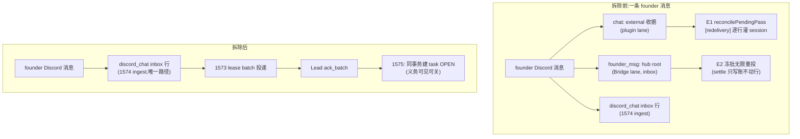

# FLY-1645 收据账本机器拆除 — 实施计划

Issue: FLY-1645 (https://linear.app/geoforge3d/issue/FLY-1645/消息层重裁-b-拆除收据账本机器relay-statesettle-通路-义务账归-1575-task-表排-1575-之后)
日期: 2026-08-11
基于: research.md

**Status**: draft(待 codex-design-review)
**Scope**: 主仓 `packages/flywheel-comm` + `packages/teamlead` + `packages/config`;第二仓 `claude-plugins-official` fork(`external_plugins/discord`)
**排期前置**:FLY-1575 task 表先行或同批(验收 V4 依赖它);FLY-1572 重迁已上线(mailbox 产线活跃);`FLYWHEEL_MAILBOX_DISCORD=1` 已是产线姿态

---

## 1. 目标与不变式

拆除消息层收据账本机器(FLY-1426 时代:收据铸造 / relay 义务列消费 / mailbox_log settlement / 重投直到 settle / 关闭动词),使以下三条成为**结构性不可能**而非"被修好":

- **N1(不铸债)**:任何入站消息不再铸出「需要有人来关」的收据行;SQL 不变式 `relay_state='open' ⇔ type='question'` 恒成立(出生即定,非 question 行出生即 `terminal_disposed`)。
- **N2(不重催)**:不存在任何按「办没办」重投的发射器;仅存的重投是 1573 投递层的租约语义(送到没送到)。
- **N3(不再有第二本账)**:`mailbox_log` 不再接受 processed/disposed 新事件;「办没办」唯一归宿 = FLY-1575 task 表(ack 同事务建,agent done/no_action 关)。

**幸存不变式**(不许被拆坏):question/gate 生命周期(relay_state 三列的引擎语义,db.ts:1350 口径)逐字节不变;FLY-1448 founder-approval 电路行为不变;1573 lease/batch/dead-letter 与 1574 chat-ingest 行为不变;xdept 投递 lane 行为不变(仅少一条 settle 写入);域 C 撞名系统零接触。

## 2. 设计总览

拆除面 = research.md §3–§6 的 [拆] 清单全量;本节只列**手术项**(两域一体、需要精确切分的):

| # | 手术 | 切法 |
|---|---|---|
| S1 | `supersedeShipGateAndReceiptFamily`(db.ts:1131) | 删整函数;3 个终局权威调用点(issue_done / pr_merged / session_terminal)改指既有 `retireShipGate`(db.ts:1096-1122,同款双守卫 gate CAS、零收据接触,已有 3 个生产调用先例) |
| S2 | `trustedFounderApprovalAndReceipt`(:2962)/ `trustedFounderGateResponseAndReceipt`(:3035)/ `respondAndReceipt`(:2866) | 前两者保 gate-response + founder-attribution 事务、摘 settle、更名去 `AndReceipt`;`respondAndReceipt` 与 `handleReceipt` relay/respond 的业务半边统一收敛到既有 `respond` 动词(insertResponse + markQuestionTerminalDisposed) |
| S3 | `listExternalPending`(mailbox-queue.ts:653) | 去 `NOT EXISTS settlement` 子句,终态只认 `state='ACKED'`;前置存量 sweep 保证「settled-未-ACKED」集合为空(§4-2),上线前生产谓词预演 |
| S4 | `ExternalReceiptSaga.handle()`(:71-98) | 摘 settle 调用,其余(begin/complete/reconcile)逐字节不变 |
| S5 | plugin `acceptInbound`(:179-195) | 收敛为无条件 `ingest()`;`FLYWHEEL_MAILBOX_DISCORD` / `FLYWHEEL_CHAT_RECEIPTS` 两开关删除(耐久入站不再可关);ingest 全家(intent/worker/retry/codec/RecorderMode 能力门/roundtable 路由)逐字节保留 |
| S6 | plugin.ts:7231 | founder-decision convergence 的 question_retired 判定改读 `resolved_at`/`superseded_at`(teamlead 对 relay_state 引用归零) |
| S7 | `enqueue()`(mailbox-queue.ts:392) | 出生不变式:`relay_state = type==='question' ? 'open' : 'terminal_disposed'`(显式入参仍优先——迁移 replay 保真);`materializeForDelivery` 的 question→protected 不动 |
| S8 | gate-poller.ts:3177-3182 handoff 文本 + lead-rules-base/discord-reply-contract.md:20-45 + plugin 三段 MCP 文案(recorder:238-251) | 同批改写为纯路由指示(转交 gate 用 `respond`;无收据关闭义务);`meta.receipt_id` 停发与文案停示配对落地 |

## 3. 变更清单(按仓/文件)

### 3.1 主仓 PR(base=main)

**packages/flywheel-comm**
| 文件 | 变更 |
|---|---|
| mailbox-queue.ts | 删 `settle()`/`getSettlement()`/`MailboxSettlement`/`ProcessedEvidenceV1`+validator;S3 谓词;S7 出生不变式;`claimDiscordLane` 收窄 external 二值(与 plugin 同批) |
| mailbox-schema.ts | 删 `mailbox_log_settlement_slot` 索引、`receipt_root_lineage` 表+触发器、`receipt_handle_requests` 表(新库);既有库走幂等 `DROP INDEX/TABLE/TRIGGER IF EXISTS` 迁移步;`mailbox_log` 表/触发器/event CHECK **不动**(processed/disposed 保留为历史合法值) |
| db.ts | 删 `handleReceipt`/`routeFounderReply`/`enqueueFounderHubRoot`/`settleFounderHubRoot`/`listReceiptRootsForExecution`/`getReceiptSettlementLineage`/`settleReceiptFamilyForTerminalSubject`/`respondAndReceipt`/`supersedeShipGateAndReceiptFamily`/`listChatReceiptPending`/`quarantineChatReceipt`/`TERMINAL_RECEIPT_DISPOSAL_KINDS`+equiv helper;S1/S2 手术;question 域 40+ 位点零接触 |
| commands/ | 删 handle-receipt.ts、route-founder-reply.ts;chat-receipt.ts 删五个子命令壳,envelope codec(`chatReceiptId`/encode/parse/normalize/`CHAT_RECEIPT_ENVELOPE_PREFIX`)迁至 ingest 侧模块(discord-chat-ingest.ts 或新 chat-envelope.ts),`chat:` id 公式保留作 dedupe 键 |
| index.ts | 删 3 个 CLI 注册 + usage 文本;`chat-ingest`/`pending`(question 域)/`ack-event` 不动 |
| founder-reply-routing.ts | 删(hub root id 铸造与路由态机) |
| mailbox-migration.ts | settlement replay 改统一直写 mailbox_log(历史保真,不再依赖 `settle()`);`classifyLead` 的 legacy→ACKED/DEAD 映射不动 |

**packages/teamlead**
| 文件 | 变更 |
|---|---|
| bridge/terminal-receipt-settlement.ts | 删整文件;done-thread-reconcile / external-merge-reconcile 的 `settleIssueReceipts`/`settleMergedReceipts` dep 改为「retire 未答 ship gate」薄函数(指 `retireShipGate`);plugin.ts 接线同步 |
| StateStore.ts | 删 `receipt_settlement_intent` 表+全套 ensure/claim/fence/retry/complete + 终态转换热路径上的 intent 铸造(保 `terminal_lifecycle_id`);删 `receipt_unprocessed%` 检测 lane 四函数 + `detection_escalations.source_receipt_id` 列(幂等 DROP COLUMN 迁移;若 SQLite 因引用拒绝则列留存+tombstone 注释,代码零消费) |
| bridge/founder-reply-deliverer.ts | 删 hub root 铸造与两处 settleFounderHubRoot;投递/路由/审批半边不动 |
| bridge/gate-poller.ts | 删 `receiptFoundationEnabled` 全家 + off 告警;S8 文本改写 |
| bridge/plugin.ts | 删 projector 接线 + flag 接入;S6 |
| bridge/lead-inbox-loop.ts | 删 `[receipt:<delivery_id>]` token(批头「must ack」契约保留——那是 1573 投递 ACK) |
| LeadAlertNotifier / LeadWatchdog / infra-event-router / kind-contract | 删 `receipt_foundation_off` alert kind |
| lead-rules-base/discord-reply-contract.md | 删 :20-45 收据节(:1-18 FLY-387 保留) |
| lead-backends/codex/ExternalReceiptSaga.ts | S4 |
| 测试 | 收据域测试整删(terminal-receipt-settlement ×2、discord-chat-receipt-contract、gate-poller-founder-reply 的 route-founder-reply 断言、handle-receipt/chat-receipt/founder-reply-routing/fly1646-replay-bound 等);幸存域测试改断言(lead-inbox-loop 载荷、kind-contract) |

**packages/config**:删 feature-flags/receipt-foundation.ts(+ registry 项)。

**scripts/**:新增一次性 sweep 程式(§4),仿 FLY-1648 closeout 形态:默认 dry-run 物理只读、`--apply` 前 online backup、逐账事务、幂等重放、operator(Tadashi/founder)执行。

### 3.2 plugin fork PR(claude-plugins-official,subdir external_plugins/discord)

research.md §6 清单全量:删 legacy begin/deliver/settle/pending/quarantine + `reconcilePendingPass` + settle/spool intents + `receiptNotification`(`meta.receipt_id`+`[redelivery]`)+ 三段 receipt 文案(恒返 STOCK_*)+ 两个环境开关;ingest 全家保留(含 `parseSpoolIntent` codec、`isIntentFilename`、`chat-receipt-spool/{ingest,meta}` 目录结构不改名);`kickWorker` 收敛为只踢 ingest worker;server.ts `onSent` 还原素 `noteSent`;测试按 research §6 存亡表处置。

### 3.3 明确不做(rejected alternatives)

| 备选 | 拒绝理由 |
|---|---|
| 修复三缺陷(原路线,Codex 2 轮 APPROVED) | founder 裁决 B 明确推翻;且 8-10 实弹证明还有缺陷④⑤,修复面越挖越大 |
| 只拆义务半边、留 legacy chat lane 投递壳 | 「无重投扫描」是 issue 验收原文;留壳 = 留一台没人关账还在铸行的机器;1574 已产线跑通,旧流留着只剩风险 |
| `relay_state` 三列 drop/rename 或把 question 状态迁走 | 那是 gate 生命周期重构,不是收据拆除;40+ 生产位点、零行为收益、高风险(research §2) |
| 存量 open 收据自动转 1575 task | 量级个位数,人工 review 更准;自动转换 = 引擎替 agent 判义务,违反 1575 铁律 |
| 给拆除加 feature flag | 留开关 = 机器还在;回滚 = git revert;且本单实际是**删** 3 个旧 flag(`FLYWHEEL_RECEIPT_FOUNDATION`/`FLYWHEEL_CHAT_RECEIPTS`/`FLYWHEEL_MAILBOX_DISCORD`),与 founder 对**新流**的 flag mandate 不冲突 |
| 给已删 CLI 留「成功 no-op」墓碑 | 报成功不落账正是缺陷③的形状;删除后 unknown command fail-loud 是正确行为 |
| 顺手修 E2 `frozenResend` 无上限分支 | 1573 投递域既有边缘,scope 纪律;research §8 已如实记录 |

## 4. 存量清账程式(operator sweep,一次性)

交付物 `scripts/fly1645-receipt-teardown-closeout.mjs`,merge 后、统一重启前由 operator 执行(dry-run → 报数 → `--apply`):

1. **预检**:记录三条 lane + uuid 杂项的 open/external/死信基数(前后对照留档)。
2. **S3 前置**:`carrier='external' AND state<>'ACKED' AND EXISTS settlement` 集合 → 按 delivered 证据补 ACKED 或 markDead;apply 后断言集合为空。
3. **义务行终局化**:`relay_state='open' AND type!='question'` → `terminal_disposed` + `resolved_via='fly1645_teardown_final_sweep'`(最后一次 relay 账写入;历史口径自洽)。**前置人工步**:founder_msg/hub-root open 行(个位数)逐条 review,该办的办完/建 task 再扫。
4. **死信残留 3 条**:按 `dead_reason` + id 前缀(非单一 type)核对后终局化。
5. **范围**:所有项目 shard 的 comm.db(不只 flywheel);逐库事务 + busy retry + 幂等重放;`mailbox_log` 历史零触碰。

## 5. 交付顺序与部署

1. 主仓 PR 与 plugin PR 同批开、同窗 merge(互相在 PR 描述里链接)。
2. 危险配对唯一是「旧 plugin + 新 CLI」(收据动词消失 → 旧 plugin 重试刷 spool/advisory)。部署序:merge 两仓 → `update-discord-plugin.sh` 刷 cache → sweep 程式(§4)→ 统一重启(restart-services.sh,Bridge+全 Lead 一波)。重启前旧+旧继续正常;重启后新+新;不存在混窗。
3. ship 走 founder-gated 流程(本 design 节点不请求 ship);自托管重启纪律照 spin.md 3.4。

## 6. TDD 测试计划(RED → GREEN)

**结构不变式(N1)**
- T1 enqueue 非 question 行 ⇒ `relay_state='terminal_disposed'` 出生;question 行 ⇒ 'open';迁移显式入参优先(reverse-compat:迁移 fixture 三列逐列保真)。
- T2 一轮模拟 Discord 入站(chat-ingest)⇒ 零 external 行、零 `founder_msg:` 行、零 settlement 事件;`open AND type!='question'` 计数=0。

**幸存域回归(最重的一半)**
- T3 question 生命周期全绿:既有 gate/ask/supersede/hygiene 测试零改动跑绿(retire/resolve/protected/pending/TOCTOU/归档 not-due)。
- T4 S1:issue_done / pr_merged / session_terminal 三权威下,未答 `approve_to_ship` gate 被 `retireShipGate` 退休(行为等价断言:gate CAS 三列 + superseded 标记),且**零** mailbox_log 写入。
- T5 S2:founder approval 写入路径(卡片/文本/JSON)行为不变——gate response + attribution 落账,`verify-approval` 全绿;摘除 settle 后零 settlement 事件。
- T6 S4:xdept lane begin→complete→reconcile 全流程不变;handle() 不再写账;已 complete 行不进 pending 集合。
- T7 1573/1574 投递回归:lease batch 全家 + chat-ingest + ack_batch + 死信闸既有测试全绿;lead-inbox-loop 载荷断言更新(无 `[receipt:]` token,批头 ack 契约仍在)。
- T8 S6:founder-decision convergence 的 question_retired 判定在「已 resolve」「已 supersede」「仍 pending」三态下行为与现状一致。

**拆除完成性**
- T9 grep 门(CI 级):`getSettlement|settleFounderHubRoot|receipt_root_lineage|receipt_settlement_intent|reconcilePendingPass|receiptFoundationEnabled|route-founder-reply|handle-receipt` 全仓(源码,非 docs/历史)零命中;`relay_state` 命中全部落在 research §2 白名单函数。
- T10 plugin:入站消息在 enabled 模式恒走 chat-ingest;`meta.receipt_id` 不再出现;MCP instructions 为 STOCK 三段;ingest intent 恢复(重启后 spool 重放)仍绿。
- T11 sweep 程式:副本库上 dry-run 零写入;apply 幂等(重放二次零变化);S3 前置集合 apply 后为空;`mailbox_log` 行数前后不变。

**全仓门**:`pnpm lint` + `pnpm -r build` + `pnpm test:packages:run` + plugin 仓测试(FLY-224/248 教训:全仓不是只跑改动包)。

## 7. 验收对照(issue 原口径 + 评论补强,全部观测非推断)

| # | 验收 | 验证 |
|---|---|---|
| V1 | 收据机器代码/表征全灭:grep 无收据域 relay_state 消费者、无 settle CLI、无重投扫描 | T9 grep 门 + 纯收据 schema 对象(lineage/handle_requests/settlement_intent/settlement_slot)在产线库 `sqlite_master` 零残留 |
| V2 | 一轮真实对话零收据行残留 | 真机:founder 发消息→Lead 回复,复跑 issue 口径查询:零新 external/founder_msg 行、零新 settlement 事件、`open AND type!='question'`=0 |
| V3 | Lead 冷启动零历史重播洪水(FLY-1677 反向清单) | 真机:重启一个 Lead,session 头部零 `[redelivery]`、零批量历史灌入(对照:8-10 实弹 837 条) |
| V4 | founder 消息处理义务在 task 层可见可关 | 依赖 1575:ack → task OPEN → done/no_action 关(联合验收;1575 未上线则此条挂起并在 PR 里显式移交) |
| V5 | 全舰静止窗口零收据活动;operator sweep 从此不再需要 | ≥15 分钟静止窗:settlement 事件零增量、无重投、`open AND type!='question'` 恒 0(修前阴性基线:77→77 纹丝不动) |
| V6 | 幸存域零回归 | T3–T8 + 全仓门;真机 founder 审批一次(approve gate 走通) |

方法论(issue 评论定稿,写给 QA 节点):判据不看「命令返回成功」;必核「健康行怎么变健康的」(resolved_via 来源);「尝试过/没尝试」分类统计,不按 open 计数聚合。

## 8. 边界与风险(honest boundaries)

1. **V4 依赖 1575**:1575 未上线期间,「acked 但没办」无跟踪——与今天等价(收据机器从未生效过,义务本就只靠人工;research exploration §5)。排期约束按 issue:1575 先行或同批。
2. **E2 `frozenResend` 无上限分支**(mailbox-queue.ts:1480-1489)是 1573 投递域既有边缘,本单不修(research §8 诚实记录);拆除后它不再承运义务行,风暴形态(Lead 认为已办永不 ack)随义务行消失。
3. **`relay_state` 三列物理保留**(question 域),`mailbox_log` 历史 settlement 行保留(append-only 审计)——「表征全灭」的口径 = 纯收据 schema 对象删除 + 消费者归零 + 出生不变式,不含改写历史。
4. **双仓协同**:plugin cache 被 ~20 个活 Lead pin;部署序(§5)消除混窗;若 plugin merge 先行而主仓延后,新 plugin + 旧 CLI 兼容(chat-ingest 已存在)。
5. **`detection_escalations.source_receipt_id` DROP COLUMN** 若被 SQLite 引用检查拒绝,回退为列留存+零消费(tombstone 注释),不 rebuild 共享表。
6. **HeartbeatService/legacy-lead-event-reconciler**(research §8 E5)休眠代码不在本单——不删不改,避免范围膨胀;grep 门白名单注明。
