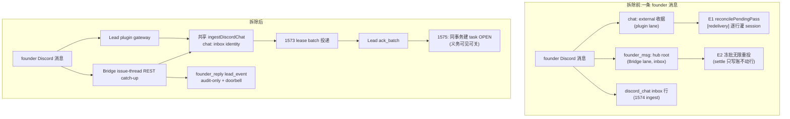

# FLY-1645 收据账本机器拆除 — 实施计划

Issue: FLY-1645 (https://linear.app/geoforge3d/issue/FLY-1645/消息层重裁-b-拆除收据账本机器relay-statesettle-通路-义务账归-1575-task-表排-1575-之后)
日期: 2026-08-11
基于: research.md

**Status**: design review R6 CHANGES_REQUESTED 已全量折入(阻塞项:Bridge founder-thread catch-up 的真实投递载体、closeout archive snapshot 合同;advisory:Bridge outage contract/change matrix);等待 fresh review
**Scope**: 主仓 `packages/flywheel-comm` + `packages/teamlead` + `packages/config`;第二仓 `claude-plugins-official` fork(`external_plugins/discord`)
**排期前置**:FLY-1572 重迁已上线(mailbox 产线活跃);**FLY-1575 前置已豁免**(lead-instruction 047a2ee0,2026-08-11:义务账由 1573/1574 新信箱队列接管,task 层验收移交 1575 落地时联合执行,见 §7-V4);legacy 旧流退役走 §5 解锁门(产线 `FLYWHEEL_MAILBOX_DISCORD=1` + 1574 lane 健康流转已实测)

---

## 1. 目标与不变式

拆除消息层收据账本机器(FLY-1426 时代:收据铸造 / relay 义务列消费 / mailbox_log settlement / 重投直到 settle / 关闭动词),使以下三条成为**结构性不可能**而非"被修好":

- **N1(不铸债)**:任何入站消息不再铸出「需要有人来关」的收据行;SQL 不变式 **`type != 'question' ⇒ relay_state = 'terminal_disposed'`**(等价:`relay_state IN ('open','protected') ⇒ type='question'`——question 行自身合法经历 open/protected/terminal_disposed 三态,Codex R1 #5 修正)恒成立,并由 **schema 触发器结构性强制**:INSERT 触发器拒绝新非法行;UPDATE 触发器只守 `UPDATE OF relay_state,type` 且仅在 `NEW.relay_state IS NOT OLD.relay_state OR NEW.type IS NOT OLD.type` 时判断,所以存量非法行上的普通投递状态更新不会被误杀,但任何把行改成非 question 活账的真实 delta 都 fail-close。迁移路径的历史 relay_state 覆写隔离在迁移代码内。
- **N2(不重催)**:不存在任何按「办没办」重投的发射器;仅存的重投是 1573 投递层的租约语义(送到没送到)。
- **N3(不再有第二本账)**:`mailbox_log` 不再接受 processed/disposed 新事件;「办没办」唯一归宿 = FLY-1575 task 表(ack 同事务建,agent done/no_action 关)。

**幸存不变式**(不许被拆坏):question/gate 生命周期(relay_state 三列的引擎语义,db.ts:1350 口径)逐字节不变;FLY-1448 founder-approval 电路行为不变;1573 lease/batch/dead-letter 与 1574 chat-ingest 行为不变;xdept 投递 lane 行为不变(仅少一条 settle 写入);域 C 撞名系统零接触。

## 2. 设计总览

拆除面 = research.md §3–§6 的 [拆] 清单全量;本节只列**手术项**(两域一体、需要精确切分的):

| # | 手术 | 切法 |
|---|---|---|
| S1 | `supersedeShipGateAndReceiptFamily`(db.ts:1131)+ terminal-receipt-settlement projector | **`retireShipGate` 不是等价替身**(Codex R1 #3:缺 `resolved_via`、`superseded_at` 仅在传 supersededBy 时写、用 db-now 非权威时间戳),且删 projector 后 session_terminal 退休无人做。改为:新建**无收据的终局权威 gate 退休原语** `retireGateForTerminalAuthority`(显式 `now` + reason→`resolved_via` + 未答/已答 CAS + supersede 审计字段,语义对齐原函数 gate 半边);issue_done / pr_merged 由各自 reconciler(done-thread / external-merge)直连并保留**每次不可逆动作前的权威复验**;session_terminal 改为**派生幂等 patrol**(Codex R2 #5 补齐耐久性设计):owner = 既有 `onReconcilePatrolTick`(原 projector 同位);查询 = CommDB pending gates ⋈ StateStore operational-terminal sessions,**每 pass 限额 + keyset 游标 + 按 project 轮转公平**;每次不可逆动作前 snapshot 并**重读 `terminal_lifecycle_id`**(revived/unknown 权威 → 跳过不动,留给下一 pass);失败行天然留在派生集合内(幂等推导 = 无需 durable intent 的重试);boot 恢复 = 同一查询自然重推导。保留 `workflowGatePresentationDisposition === "holder_authoritative"` 否决;原 terminal-settlement 测试改写为 gate-retirement 测试(响应竞态/holder 否决/扫描-变更之间 session 复活/未知权威/CommDB 瞬断/积压公平/boot 恢复/三权威全覆盖),不是整删 |
| S2 | `trustedFounderApprovalAndReceipt`(:2962)/ `trustedFounderGateResponseAndReceipt`(:3035)/ `respondAndReceipt`(:2866)/ `respond` 动词 | 前两者保 gate-response + founder-attribution 事务、摘 settle、更名去 `AndReceipt`。**`respond` 现状对非 approve_to_ship 问题缺守卫**(Codex R1 #4):改用从 `insertResponseIfGateOpen` 泛化的**守卫式立即事务响应原语**。契约端到端(R2 #4 + R3 #1/#2 + Lead 裁定「删概念优先」):**放弃冻结快照概念**(hub root 删除后它没有投递载体;评估结论:其防竞态价值已被守卫事务谓词覆盖)。普通 Runner 的本地 `respond` 可选传 `--expect-owner`、`--expect-checkpoint <kind>` / `--expect-no-checkpoint`(**typed string|null**,SQL null-safe 比较);无条件强制 `question.to_agent === 认证 Lead` + CommDB session lead 绑定,以及存在/非排除类/未答/未 resolved/superseded/过期/终态的新鲜度守卫。**founder issue-thread 路由不在 CLI 进程猜 scope**:新增 authenticated Bridge endpoint(沿用 `TEAMLEAD_API_TOKEN` + Lead lease/carrier claim),CLI 以 `--source-thread <discord-thread-id>` + `--bridge-url` 调用;Bridge 用 StateStore `getChatThreadByThreadId` 派生 project/issue,再由 question.from_agent 查 CommDB session,核对 session project/issue/lead、question.to_agent/owner/checkpoint,最后调用同一守卫式 CommDB 原语。模型不再提供 `--expect-project/--expect-issue`;Bridge 不可达、thread 未注册、session 元数据缺失或 scope 不一致一律 fail-close 且零写入。thread→issue 绑定实质不可变,跨 DB 读写间的竞态由写事务内重检 CommDB question/session 挡住。**取舍记录**(Lead 要求):被拒方案 = 经 1573 投「出生即终局的路由指示行」——它新增一种投递概念,且冻结时点与现库的一致性窗口在稳定 thread-issue 绑定下无实差。测试:null-checkpoint / 跨 Lead拒绝 / 省略期望 / 选中-写入之间被答或被退休 / Bridge down / 未知 thread / session 元数据缺失 / scope 不符 / founder 非 ship 输入→Bridge endpoint→守卫式 Runner 应答端到端(全程零 `founder_msg:` 行、零 settlement 事件) |
| S3 | `listExternalPending`(mailbox-queue.ts:653) | 去 `NOT EXISTS settlement` 子句,终态只认 `state='ACKED'`;前置存量 sweep 保证「settled-未-ACKED」集合为空(§4-2),上线前生产谓词预演 |
| S4 | `ExternalReceiptSaga.handle()`(:71-98) | 摘 settle 调用,其余(begin/complete/reconcile)逐字节不变 |
| S5 | plugin `acceptInbound`(:179-195)+ **主仓/Codex 侧全部 flag 面**(Codex R1 #1) | plugin **保留 `mode.kind === 'enabled'` capability gate**(commCli/dbPath/leadId 三元组),只删除其后的 flag fork:enabled 模式恒走 `ingest()`,stock/isolated/broken 姿态不变。两开关(`FLYWHEEL_MAILBOX_DISCORD`/`FLYWHEEL_CHAT_RECEIPTS`)**全仓拔除**:discord-chat-ingest.ts:14/:150 readMailboxDiscordFlag + lib.ts 再导出 + registry.ts:3205 注册项 + 两个 Codex runtime 的 env 注入 + `CodexDiscordMailboxStrategy.ts:41-98` 的 legacy verdict 分支 + `CodexDiscordRuntimeOwnership` 的 flag 判定(**硬定 enabled 姿态**:保 mailboxReady 重试/fail-closed、socket ownership、ingress lock,绝不回落到无主直连路径)+ claude-lead.sh:2937 的 `FLYWHEEL_CHAT_RECEIPTS` 透传;Claude plugin + Codex headless + Codex TUI 三载体 ownership 各测;ingest 全家逐字节保留 |
| S6 | plugin.ts:7231 | founder-decision convergence 的 question_retired 判定改读 `resolved_at`/`superseded_at`(teamlead 对 relay_state 引用归零) |
| S7 | `enqueue()`(mailbox-queue.ts:392)+ N1 触发器 | 出生规则:`relay_state = type==='question' ? 'open' : 'terminal_disposed'`(显式入参仍优先——迁移 replay 保真);sweep 后安装 N1 schema 触发器(§1)做结构强制。**⚠️ 投影哈希兼容**(Codex R1 #6):enqueue 的 SHA-256 投影含 relay_state 且永久存于 `mailbox_identity.insert_projection_hash`(update guard 禁改)——稳定 ID 生产者(lead-event-queue.ts:22 / ExternalReceiptSaga.begin / 死信告警)的确定性重放会撞旧哈希。补**窄兼容规则**:既有非 question identity 且调用方未显式传 relayState 时,按 `relay_state='open'` 重算逐字节相同才接受旧哈希;其余差异与显式覆写维持 conflict。测试覆盖活/已归档 identity + 升级前铸造的 lead-event 重放 |
| S9 | FLY-1448 审批路径上的收据根契约(Codex R2 #3):`founder-reply-deliverer.ts` / `founder-ship-approval-factory.ts` / `founder-ship-approval-handler.ts` / `approval-signal/write-gate-response.ts` 贯穿传递 `founderReceipt`/`FounderGateReceiptContext`/`rootId` | 四文件 + 测试全进变更矩阵:替换为**无收据的 founder 决策 source context**(载 `msgId`/`now`;Discord `msgId` 保留——source-event 幂等承重),删 `rootId`;DB 接口/factory/handler/deliverer 一体更新;text/card/JSON 三形态 source-event id 与 attribution 行为逐字节保留 |
| S8 | gate-poller.ts:3177-3182 handoff 文本 + lead-rules-base/discord-reply-contract.md:20-45 + plugin 三段 MCP 文案(recorder:238-251)+ **`<channel>` 可见属性**(Codex R1 #9) | 同批改写为纯路由指示(转交 gate 用 `respond`;无收据关闭义务);`meta.receipt_id` 停发与文案停示配对落地;主仓 `discord-chat-ingest.ts:53` 渲染进投递 XML 的 `receipt_id` 属性更名 `delivery_id`(内部 `chat:` dedupe 公式保留为传输身份),`scripts/audit-discord-mailbox-ingest.sh:29` 断言同步 |
| S10 | Bridge founder-thread REST catch-up 的 canonical transport(R6 HIGH) | `founder_msg:` hub root 不能直接删而不补 transport:`emitFounderReplyDeliveryForThread` 对每条 founder 消息在任何 cursor advance / dead-letter skip / approval classification **之前**,调用与 plugin 共用的 `ingestDiscordChat` 写同一个 `chat:<lead>:<discord-msg>` inbox identity;ingest 失败→本轮 process_failed + cursor 不前进,成功后才允许后续处置。plugin 与 Bridge 双观察由 `claimDiscordLane` 收敛为一行(active/inserted inbox),Bridge crash-after-ingest-before-cursor-save 的重跑同样幂等。`makeAmbiguousHandoff` 保持 audit-only + doorbell,不伪装成投递行;随后删 `enqueueFounderHubRoot`/settle/root contract。测试:gateway offline 时 REST catch-up 仍入 1573;plugin/Bridge 双入不双投;ingest 失败不越 cursor;crash 窗重跑;direct approval/dead-letter/ambiguous 三分支都先有 canonical chat row;全程零 `founder_msg:` |

## 3. 变更清单(按仓/文件)

### 3.1 主仓 PR(base=main)

**packages/flywheel-comm**
| 文件 | 变更 |
|---|---|
| mailbox-queue.ts | 删 `settle()`/`getSettlement()`/`MailboxSettlement`/`ProcessedEvidenceV1`+validator;S3 谓词;S7 出生不变式;`claimDiscordLane` 收窄 external 二值(与 plugin 同批);从 `archiveFamily` 抽出 canonical snapshot/GC/identity helper 给 T11 operator archive 复用 |
| mailbox-schema.ts | 删 `mailbox_log_settlement_slot` 索引、`receipt_root_lineage` 表+触发器、`receipt_handle_requests` 表(新库);既有库走 §3.4 迁移;`mailbox_log` 表/触发器/event CHECK **不动**(processed/disposed 保留为历史合法值,不收窄 CHECK——收窄需重建表,零收益) |
| db.ts | 删 `handleReceipt`/`routeFounderReply`/`enqueueFounderHubRoot`/`settleFounderHubRoot`/`listReceiptRootsForExecution`/`getReceiptSettlementLineage`/`settleReceiptFamilyForTerminalSubject`/`respondAndReceipt`/`supersedeShipGateAndReceiptFamily`/`listChatReceiptPending`/`quarantineChatReceipt`/`TERMINAL_RECEIPT_DISPOSAL_KINDS`+equiv helper;S1/S2 手术;question 域 40+ 位点零接触 |
| commands/ | 删 handle-receipt.ts、route-founder-reply.ts;chat-receipt.ts 删五个子命令壳,envelope codec(`chatReceiptId`/encode/parse/normalize/`CHAT_RECEIPT_ENVELOPE_PREFIX`)迁至 ingest 侧模块(discord-chat-ingest.ts 或新 chat-envelope.ts),`chat:` id 公式保留作 dedupe 键 |
| index.ts | 删 3 个 CLI 注册 + usage 文本;`chat-ingest`/`pending`(question 域)/`ack-event` 不动 |
| founder-reply-routing.ts | 删(hub root id 铸造与路由态机) |
| discord-chat-ingest.ts / lib.ts | 删 `readMailboxDiscordFlag`(:14/:150)与 lib.ts 再导出(S5);`renderDiscordChatContent` 的 `receipt_id` 属性更名 `delivery_id`(S8);ingest 主体不动 |
| scripts/audit-discord-mailbox-ingest.sh | :29 属性断言同步 `delivery_id`(S8) |
| mailbox-migration.ts | **迁移引擎是 receipt_root_lineage 的活消费者(Codex R1 #2),须先重写再删表**::645 从 lineage 反推 orphan question sender → 改为无收据、fail-loud 的 sender 推导;:848-852 lineage 回填/校验、:949 迁移期 drop 触发器、:1059-1068 重建触发器 → 三段整删;:822 settle replay 改直写 mailbox_log(确定性 event id + 同 evidence 冲突检查,历史保真);`classifyLead` 的 legacy→ACKED/DEAD 映射不动。测试:legacy 库全迁 / 已迁库幂等 / 中断重放 / 终态 `sqlite_master` 残留集断言 |

**packages/teamlead**
| 文件 | 变更 |
|---|---|
| bridge/terminal-receipt-settlement.ts | 删整文件,按 S1 落地替身:`retireGateForTerminalAuthority` 原语 + done-thread / external-merge reconciler 直连(权威复验保留)+ session_terminal 派生幂等 patrol(holder_authoritative 否决保留);plugin.ts 接线同步;测试改写非整删(S1) |
| StateStore.ts | 删 `receipt_settlement_intent` 表+全套 ensure/claim/fence/retry/complete + 终态转换热路径上的 intent 铸造(保 `terminal_lifecycle_id`);**detection-lineage 三列族整体处置(Codex R1 #7,不许只删一列)**:`source_receipt_id`/`source_execution_id`/`source_question_id` 三列 + `DETECTION_ESCALATION_COLUMNS` 静态列表 + parser 索引 + 通用 upsert/backfill SQL + `getDetectionEscalationBySourceReceiptId`/`attachDetectionSettlementLineage`/`receipt_unprocessed%` 四函数 + `stuck-remanage-routes.ts:75/:380` 消费点,整族删除(workflow 表里同名列不动);升级测试从**有数据的** StateStore 跑;sql.js 运行时 `DROP COLUMN` 集成测试(宿主 SQLite 3.51 已核可行,sql.js 需实测),被拒则三列 tombstone(零运行时 SELECT/INSERT/UPDATE) |
| bridge/founder-reply-deliverer.ts | 按 S10 把 hub root 的真实投递职责换成共享 `ingestDiscordChat` canonical chat row,再删 hub root 铸造与两处 settle;REST cursor、bounded retry、approval/ambiguous 分类不动 |
| bridge/gate-poller.ts | 删 `receiptFoundationEnabled` 全家 + off 告警;S8 文本改写 |
| bridge/plugin.ts | 删 projector 接线 + flag 接入;S6 |
| bridge/founder-routing-response-route.ts(新)+ plugin.ts route registration | 新增 `POST /api/founder-routing/runner-response`:TEAMLEAD_API_TOKEN + Lead lease/carrier claim 认证;StateStore by-thread 派生 scope;CommDB session/question 交叉核验;调用 S2 guarded response。Bridge 不可达时 CLI 返回明确 retryable error,不做本地 fallback |
| bridge/lead-inbox-loop.ts | 删 `[receipt:<delivery_id>]` token(批头「must ack」契约保留——那是 1573 投递 ACK) |
| LeadAlertNotifier / LeadWatchdog / infra-event-router / kind-contract | 删 `receipt_foundation_off` alert kind |
| lead-rules-base/discord-reply-contract.md | 删 :20-45 收据节(:1-18 FLY-387 保留) |
| lead-backends/codex/ExternalReceiptSaga.ts | S4 |
| lead-backends/codex/CodexDiscordMailboxStrategy.ts / CodexDiscordRuntimeOwnership.ts / 两个 codex runtime | S5:删 flag 注入与 legacy verdict 分支,硬定 enabled 姿态(mailboxReady fail-closed / socket ownership / ingress lock 保留,绝不回落无主直连);headless + TUI ownership 各测 |
| scripts/claude-lead.sh | :2937 删 `FLYWHEEL_CHAT_RECEIPTS` 透传(S5) |
| 测试 | **删/改/移植三分表**(Codex R2 #6——行为保全套件不得同时出现在删除清单与验收清单):**整删** = discord-chat-receipt-contract、handle-receipt、chat-receipt 五子命令、founder-reply-routing(其 stale/scope/竞态断言先移植再删);**改写** = terminal-receipt-settlement ×2 → gate-retirement 套件(S1)、gate-poller-founder-reply 的 route-founder-reply 断言 → respond 路由断言(S2/S8)、fly1646-replay-bound(describe.skip)→ T7 启用态外部行真值表;**改断言** = lead-inbox-loop 载荷、kind-contract |

**packages/config**:删 feature-flags/receipt-foundation.ts + registry **两项**(`receipt_foundation` / `mailbox_discord`;`FLYWHEEL_CHAT_RECEIPTS` 从未在 registry 注册,只存在 plugin/runtime 侧),并把 `FLYWHEEL_RECEIPT_FOUNDATION` / `FLYWHEEL_MAILBOX_DISCORD` / `FLYWHEEL_CHAT_RECEIPTS` 三者加入 `feature-flags/truth.ts` 的 `RETIRED_FLAGS`;truth-ledger 测试断言旧环境行被识别为「已退役假开关」而非 unknown。

### 3.4 CommDB / StateStore schema 迁移设计(有序、事务、幂等)

CommDB(每项目 shard,CommDB open 时执行,幂等可重放):

1. 前置:`PRAGMA quick_check` 通过;WAL checkpoint;online backup 由 §4 sweep 程式在 apply 前完成(迁移自身不再备份——同一部署窗)。
2. `DROP TRIGGER IF EXISTS mailbox_receipt_root_lineage_insert`(先于表)。
3. `DROP TABLE IF EXISTS receipt_root_lineage / receipt_handle_requests / receipt_activation_episodes / receipt_resend_deliveries / receipt_exemption_audit`(后三张是产线残留的 FLY-1426 遗留表,源码零消费者——grep 实证)。
4. `DROP INDEX IF EXISTS mailbox_log_settlement_slot`。
5. **保留**:`mailbox_log` 表 + 两个 append-only 触发器 + 全部历史行(processed 43,921 / disposed 10,351 一行不动;行数守恒断言);`receipt_alert_outbox`(runner wake,域 C);`session_receipt_lineage`(runner 身份,runner-stopped.ts 在用);`mailbox` 表结构不变(三列留租户 A)。
6. 后置:`PRAGMA foreign_key_check` + `quick_check`;迁移标记落 `mailbox_log`(kind=migration_snapshot 惯例)。

7. **N1 触发器安装(与 legacy 迁移解耦,Codex R2 #2 + R3 #3 + 本轮 HIGH)**:触发器**不进 `MAILBOX_CORE_SCHEMA`**(`migrateLegacyDatabaseFile` 先装核心 schema 再灌行,进核心会拦死迁移);实现为**单一可复用 installer**。INSERT trigger 对每个新行强制 N1;UPDATE trigger 声明 `BEFORE UPDATE OF relay_state,type` 且 `WHEN (NEW.relay_state IS NOT OLD.relay_state OR NEW.type IS NOT OLD.type) AND NEW.type != 'question' AND NEW.relay_state != 'terminal_disposed'`,不因 `materializeForDelivery` 等把同值 relay_state 写回而误杀存量行。三个受测调用位点:①常规建库/开库(`MAILBOX_SCHEMA` 执行 + receipt schema preflight/drop 之后——覆盖 virgin 与已迁移 shard,允许未 sweep shard 继续做非 relay delta 的投递更新);②cutover closeout(残留清空之后);③legacy 迁移收尾(归一化之后、**绝不早于 replay**)。closeout dry-run/apply 都直接使用 raw `better-sqlite3` connection(不用 `CommDB`/`MailboxQueue` constructor);apply 在同一 IMMEDIATE transaction 内先归一化/归档再调用 installer,但即使 site ① 已装过,delta guard 也允许 state-only sweep。三路径各断言 commit 时两触发器在位;另测未清扫 legacy open 非 question 行可 ACK/lease,但修改 relay/type 继续 fail-close。迁移侧 relay 归一化规则:`mailbox-migration.ts:509-511` 改为 question 行保留 legacy 生命周期、非 question 行 commit 前归一化 `terminal_disposed`(对「迁移 byte 保真」承诺的显式修订,T1 同步)。
8. **迁移引擎重写**(R1 #2,与 DROP 同 PR、先码后删):orphan sender 无收据推导 + lineage 三段删除 + settle replay 直写化(§3.1 mailbox-migration 行);legacy 库/已迁库/中断重放/残留集四类测试全绿后才允许 DROP 步生效。

StateStore(既有 migration ladder 追加):同一 fence 窗内先 `StateStore.backupTo()` + checksum(Codex R2 #8——回滚演练含 StateStore 恢复校验,不只 CommDB shard);`DROP TABLE IF EXISTS receipt_settlement_intent`;detection-lineage **三列族**(`source_receipt_id`/`source_execution_id`/`source_question_id`)先 `DROP INDEX IF EXISTS` 其上索引,三列 DROP 在**单事务**内全成或全滚(半 drop 禁止;失败整体回退 tombstone 分支:三列留存、零运行时读写);sql.js 运行时集成实测。升级测试从有数据的 StateStore 快照跑。

**scripts/**:新增一次性 sweep 程式(§4),仿 FLY-1648 closeout 形态:默认 dry-run 物理只读、`--apply` 前 online backup、逐账事务、幂等重放、operator(Tadashi/founder)执行。

### 3.2 plugin fork PR(claude-plugins-official,subdir external_plugins/discord)

research.md §6 清单全量:删 legacy begin/deliver/settle/pending/quarantine + `reconcilePendingPass` + settle/spool intents + `receiptNotification`(`meta.receipt_id`+`[redelivery]`)+ 三段 receipt 文案(恒返 STOCK_*)+ 两个环境开关;ingest 全家保留(含 `parseSpoolIntent` codec、`isIntentFilename`、`chat-receipt-spool/{ingest,meta}` 目录结构不改名);`kickWorker` 收敛为只踢 ingest worker;server.ts `onSent` 还原素 `noteSent`;测试按 research §6 存亡表处置。

### 3.3 明确不做(rejected alternatives)

| 备选 | 拒绝理由 |
|---|---|
| 修复三缺陷(原路线,Codex 2 轮 APPROVED) | founder 裁决 B 明确推翻;且 8-10 实弹证明还有缺陷④⑤,修复面越挖越大 |
| 只拆义务半边、留 legacy chat lane 投递壳 | 「无重投扫描」是 issue 验收原文;留壳 = 留一台没人关账还在铸行的机器;1574 已产线跑通,旧流留着只剩风险 |
| `relay_state` 三列 drop/rename 或把 question 状态迁走 | 那是 gate 生命周期重构,不是收据拆除;40+ 生产位点、零行为收益、高风险(research §2) |
| 存量 open 收据自动转 1575 task | 量级个位数,人工 review 更准;自动转换 = 引擎替 agent 判义务,违反 1575 铁律 |
| 给拆除加 feature flag | 留开关 = 机器还在;回滚 = git revert;且本单实际是**删** 3 个旧 flag(`FLYWHEEL_RECEIPT_FOUNDATION`/`FLYWHEEL_CHAT_RECEIPTS`/`FLYWHEEL_MAILBOX_DISCORD`),与 founder 对**新流**的 flag mandate 不冲突 |
| 给已删 CLI 留「成功 no-op」墓碑 | 报成功不落账正是缺陷③的形状;删除后 unknown command fail-loud 是正确行为 |
| 顺手修 E2 `frozenResend` 无上限分支 | 1573 投递域既有边缘,scope 纪律;research §8 已如实记录 |

## 4. 存量清账程式(operator sweep,一次性)

交付物 `scripts/fly1645-receipt-teardown-closeout.mjs`,merge 后、统一重启前由 operator 执行(dry-run → 报数 → `--apply`):

1. **预检**:记录三条 lane + uuid 杂项的 open/external/死信基数(前后对照留档)。
2. **S3 前置(external 行收敛真值表,Codex R2 #1——markDead 满足不了后置条件[DEAD 仍匹配集合且对保留谓词可见],故整表不用 markDead)**:
   - `xdept:*`(存活 lane)→ 一行不动;
   - `chat:*` 全量(ACKED/QUEUED/LEASED/DEAD;settlement 有无均同)→ **一次性 closeout archive**,不伪造 `acked_at`:每条先落 **closeout manifest 记录**(mailbox_log 之外的带校验和清单文件,随 ops 工件归档):{shard,id,原 state/relay 三列快照,disposition,backup checksum};12 条未投递 QUEUED 行的 disposition 三选一 **fail-closed**:matched_1574_delivery(已有对应 1574 identity 投达)/ manually_completed(操作员处理 + 证据引用)/ unresolved——存在 unresolved 时 `--apply` 拒绝执行。resolved manifest 校验完成后,抽取/复用 `MailboxQueue.archiveFamily` 的 snapshot helper:同一 shard 事务内先写 `event='archived'` + **完整 canonical row_json**(含 content_ref archive),再排 `content_ref_gc_outbox`,写 `mailbox_identity.archived_at`,最后删除 mailbox 投影;无法安全 snapshot/排 GC 即 fail-close。`getIdentityCarrier` 因 archived snapshot 仍返回原 `external`,稳定 ID 重放返回 archived;不存在 ACKED+NULL acked_at 永久人口,也不把取证历史押在临时 backup 上;
   - apply 后**双后置断言**:全局 `carrier='external' AND state<>'ACKED' AND EXISTS settlement` = 0;退役前缀(`chat:`)的非 ACKED 行 = 0(⇒ S3 改谓词后不存在任何对保留调用方[仅 xdept idPrefix]可见的复活行)。
3. **义务行终局化**:`relay_state='open' AND type!='question'` → `terminal_disposed` + `resolved_via='fly1645_teardown_final_sweep'`(最后一次 relay 账写入;历史口径自洽)。**前置人工步**:founder_msg/hub-root open 行(个位数)逐条 review,该办的办完/建 task 再扫。
4. **死信残留 3 条**:按 `dead_reason` + id 前缀(非单一 type)核对后终局化。
5. **范围**:所有项目 shard 的 comm.db(不只 flywheel);逐库事务 + busy retry + 幂等重放;既有 `mailbox_log` 历史零改写,只 append T11 明列的 archived snapshot + migration marker,绝不新增 processed/disposed。

## 5. 交付顺序与部署

0. **旧流退役解锁门**(registry 里 `mailbox_discord` default=false、=0 是 founder 要求的验证窗回滚路径——退役必须凭证据,不默认成立):①产线 `.env` 与活 Bridge env 均 =1(2026-08-11 实测);②1574 lane 产线健康流转(inbox chat 行实测在投);③存量 external 行 sweep 有界排干(§4);④#797 合入后验证窗运行记录由 ship 节点落 PR。四门齐 → 删旧流 = 执行 founder「if it works, delete old flow immediately」。
1. 主仓 PR 与 plugin PR 同批开、同窗 merge(互相在 PR 描述里链接)。
2. **静默切换(quiesced cutover,Codex R1 #8——旧序「先 sweep 后重启」会让仍 pin 旧 plugin 的活 Lead 在 sweep 与重启之间继续铸行/结账,且新 CLI 若先可见会撞旧 plugin 的已删动词)**:① stage 两仓构建(**cache 不动**——提前刷新会让 fence 前崩溃重启的旧 Lead 装上新 plugin 撞旧 CLI,Codex R2 #8);② **fence 全部旧生产者**(停 Bridge + 全 Lead + 挂 admission pause 压住 launchd/supervisor 的重启授权),fence 内才执行 `update-discord-plugin.sh` 刷 cache(或等价:stage 到惰性版本路径、fence 内原子切换);③在保留 §5-0 解锁证据后,从生产 `.env` 与 launch/service env 删除三条退休 flag,跑 `validateFlagTruthEnvironment` 确认零 stale retired entry;④跑 closeout sweep + schema 迁移(§4/§3.4,含 per-shard online backup);⑤验证 S3 与 N1 两个残留谓词为空 + N1 触发器就位;⑥启动配对的新 Bridge + 新 Lead(新 plugin cache);⑦重开入站,跑 V2–V6。**回滚 = 逐 shard 恢复 backup + plugin cache pin 还原 + 旧构建重启**,不是裸 `git revert`(表已 drop、行已终局);退休 flag 不作为回滚开关复活。
3. ship 走 founder-gated 流程(本 design 节点不请求 ship);自托管重启纪律照 spin.md 3.4。

## 6. TDD 测试计划(RED → GREEN)

**结构不变式(N1)**
- T1 出生/迁移规则(R3 #3 定稿口径,替代旧「三列逐列保真」措辞):enqueue 非 question 行 ⇒ `relay_state='terminal_disposed'` 出生,question 行 ⇒ 'open';迁移 = **question 行保留 legacy relay 生命周期,非 question 行 commit 前归一化 `terminal_disposed`**(含 legacy 缺失/open 两形态用例);S7 投影哈希兼容分支同测。
- T2 一轮模拟 Discord 入站(chat-ingest)+Bridge REST catch-up 双观察⇒ 同一 `chat:` inbox identity、零 external 行、零 `founder_msg:` 行、零 settlement 事件;`open AND type!='question'` 计数=0;catch-up ingest 失败/崩溃重跑不越 cursor。

**幸存域回归(最重的一半)**
- T3 question 生命周期全绿:既有 gate/ask/supersede/hygiene 测试零改动跑绿,行为等价面显式枚举——`retireShipGate`/`resolveGate`/`retireQuestionGuarded`/`markQuestionProtected`/`insertResponse*` 三写入器/`finalizeSession`/zombie-gate hygiene/supersede 巡逻/`getPendingQuestions`/ask 宽限(不靠「两个函数源码没动」推断)。
- T4 S1:issue_done / pr_merged / session_terminal 三权威下,未答 `approve_to_ship` gate 被 **`retireGateForTerminalAuthority`** 退休(行为等价断言:gate CAS 三列 + `resolved_via`=reason + supersede 审计字段 + 权威时间戳),且**零** mailbox_log 写入;patrol 耐久性用例(S1:复活 fence/瞬断/公平/boot)同套件。
- T5 S2:founder approval 写入路径(卡片/文本/JSON)行为不变——gate response + attribution 落账,`verify-approval` 全绿;摘除 settle 后零 settlement 事件。Founder routed respond 的 Bridge 暂停测试:返回明确 retryable、零 CommDB 写;Bridge 恢复后同命令幂等成功(接受的 outage contract = founder relay 延迟,不降级到未鉴权本地写;canonical chat 输入仍在 1573 投递历史中)。
- T6 S4:xdept lane begin→complete→reconcile 全流程不变;handle() 不再写账;已 complete 行不进 pending 集合。
- T7 1573/1574 投递回归 + **外部行真值表**(替代现为 `describe.skip` 的 fly1646-replay-bound.test.ts,以**启用态**落地):未投递行保持可重试;投毕 ACKED 永久出列;ACKED 永不重投(**无 ACKED→QUEUED 边**的结构断言);可恢复 DEAD(quarantine)按调用方策略;lane 仲裁不双投;xdept 全流程不变;lease batch 全家 + chat-ingest + ack_batch + 死信闸既有测试全绿;lead-inbox-loop 载荷断言更新(无 `[receipt:]` token,批头 ack 契约仍在)。
- T8 S6:founder-decision convergence 的 question_retired 判定在「已 resolve」「已 supersede」「仍 pending」三态下行为与现状一致。

**拆除完成性**
- T9 残留门(CI 级,**语义化 + 文件域限定**的机器可读 allow/deny 清单跨两仓,Codex R1 #9 + R2 #7——字面零命中做不到:拆除迁移自身必含 `DROP ... IF EXISTS receipt_root_lineage`,retired-flag truth tombstone 必含旧 env 名,负向测试同理):禁止的是**运行时生产者/消费者与可调用 API**;显式 allow = 破坏性迁移语句精确模式 + `RETIRED_FLAGS` 三条精确 tombstone + 残留断言 + 负向测试文件;单独断言 tombstone detection 三列零运行时 SELECT/INSERT/UPDATE,并断言活 `.env`/service env 不再携退休 flag。deny 名单 = `getSettlement|settleFounderHubRoot|receipt_root_lineage|receipt_settlement_intent|reconcilePendingPass|receiptFoundationEnabled|route-founder-reply|handle-receipt|FLYWHEEL_MAILBOX_DISCORD|FLYWHEEL_CHAT_RECEIPTS|receipt_handle_requests|AndReceipt|source_receipt_id|founderReceipt|FounderGateReceiptContext`;**不许用裸 `receipt` 全局禁令**(域 C 合法);`relay_state` 白名单 = research §2 函数集 + 本单新增不变式实现(出生规则/trigger/hash compatibility/迁移归一化);实现期以**实现 merge-base** 重校准全部 file:line(本 plan 引用基于 d6536134/0bc79ae6)。
- T12 迁移四类(R1 #2):legacy 库全迁 / 已迁库幂等 / 中断重放 / `sqlite_master` 残留集断言;S7 投影哈希兼容:升级前铸造的稳定 ID(lead-event / xdept / 死信)重放不冲突,显式差异仍冲突。
- T13 StateStore 升级(R1 #7):有数据快照上跑 DROP COLUMN 迁移(sql.js 实测);tombstone 回退分支同测。
- T10 plugin:入站消息在 enabled 模式恒走 chat-ingest;`meta.receipt_id` 不再出现;MCP instructions 为 STOCK 三段;ingest intent 恢复(重启后 spool 重放)仍绿。
- T11 sweep 程式:副本库上 dry-run 零写入;apply 幂等(重放二次零变化);S3 前置双后置断言;**既有 processed/disposed 行集合逐字节不变且零新增**,新增 archived 数 = 删除投影数,另允许且只允许预期的 migration_snapshot marker;**manifest 全覆盖**(每条被归档行有记录、原态保真可回放)+ 存在 unresolved 时 `--apply` 拒绝;archive snapshot 含完整 canonical row,mailbox 投影为零、identity.archived_at 在位、getIdentityCarrier 保原 carrier、content_ref GC 有界、稳定 ID 重放仍返回 archived。

**全仓门**:`pnpm lint` + `pnpm -r build` + `pnpm test:packages:run` + plugin 仓测试(FLY-224/248 教训:全仓不是只跑改动包)。

## 7. 验收对照(issue 原口径 + 评论补强,全部观测非推断)

| # | 验收 | 验证 |
|---|---|---|
| V1 | 收据机器代码/表征全灭:grep 无收据域 relay_state 消费者、无 settle CLI、无重投扫描 | T9 grep 门 + 纯收据 schema 对象(lineage/handle_requests/settlement_intent/settlement_slot)在产线库 `sqlite_master` 零残留 |
| V2 | 一轮真实对话零收据行残留 | 真机:founder 发消息→Lead 回复,复跑 issue 口径查询:零新 external/founder_msg 行、零新 settlement 事件、`open AND type!='question'`=0 |
| V3 | Lead 冷启动零历史重播洪水(FLY-1677 反向清单) | 真机:重启一个 Lead,session 头部零 `[redelivery]`、零批量历史灌入(对照:8-10 实弹 837 条) |
| V4 | founder 消息处理义务在 task 层可见可关 | **移交 1575 落地时联合验收**(前置豁免,lead-instruction 047a2ee0——豁免下达于该简报的「scope(founder 裁定)」段,即临时空窗经 founder 线批示;若 review 要求更强背书,由 Lead 升级 founder 拍,不由本节点自行扩权)。移交的验收合同(防「验收成消息被弃置」):每条 Lead 消息 ack 在**同一事务**恰建 1 条 task;建 task 失败则 ack 回滚;重复 ack 不重复建;task 带 owner/消息/issue 溯源、被忽视时保持 OPEN;`done`/`no_action+原因` 可关;ack 后零 mailbox 重投;Runner 消息不建 task。间隙姿态(1575 未上线期间):义务承接止于 ack 层(送到即止)——与今天等价(收据账本的义务追踪从未有效工作过) |
| V5 | 全舰静止窗口零收据活动;operator sweep 从此不再需要 | ≥15 分钟静止窗:settlement 事件零增量、无重投、`open AND type!='question'` 恒 0(修前阴性基线:77→77 纹丝不动) |
| V6 | 幸存域零回归 | T3–T8 + 全仓门;真机 founder 审批一次(approve gate 走通) |

方法论(issue 评论定稿,写给 QA 节点):判据不看「命令返回成功」;必核「健康行怎么变健康的」(resolved_via 来源);「尝试过/没尝试」分类统计,不按 open 计数聚合。

## 8. 边界与风险(honest boundaries)

1. **1575 前置已豁免**(lead-instruction 047a2ee0):拆除不等 1575。豁免的代价如实记录——1573 队列**结构性拒绝**义务账(无 ACKED→QUEUED 边,ack 即终局永不再催;research §0.3),故 1575 上线前「acked 但没办」无跟踪,与今天等价(收据机器的义务追踪从未有效工作过,今天靠的也只是人工与自觉)。V4 合同显式移交(§7)。
2. **E2 `frozenResend` 无上限分支**(mailbox-queue.ts:1480-1489)是 1573 投递域既有边缘,本单不修(research §8 诚实记录);拆除后它不再承运义务行,风暴形态(Lead 认为已办永不 ack)随义务行消失。
3. **`relay_state` 三列物理保留**(question 域),`mailbox_log` 历史 settlement 行保留(append-only 审计)——「表征全灭」的口径 = 纯收据 schema 对象删除 + 消费者归零 + 出生不变式,不含改写历史。
4. **双仓协同**:plugin cache 被 ~20 个活 Lead pin;部署序(§5)消除混窗;若 plugin merge 先行而主仓延后,新 plugin + 旧 CLI 兼容(chat-ingest 已存在)。
5. **`detection_escalations` 三列族 DROP COLUMN** 若被 SQLite 引用检查拒绝,整族回退为列留存+零消费(tombstone 注释),不允许半 drop,不 rebuild 共享表。
6. **HeartbeatService/legacy-lead-event-reconciler**(research §8 E5)休眠代码不在本单——不删不改,避免范围膨胀;grep 门白名单注明。

## 9. 实现期加固备注(Codex R4 非阻塞,随 APPROVED 折入)

1. **scope 派生 = 具名 fail-closed seam**:S2 明确新增 authenticated Bridge endpoint;它用 StateStore `getChatThreadByThreadId` 派生线程→issue/project,与 CommDB session/question 绑定交叉核验后调用守卫式响应原语。CLI 只传 `--source-thread`,**不接受模型手写的 `--expect-project/--expect-issue` 作为真相源**;未知线程、缺 session 元数据/project、线程与问题 issue 不匹配均拒绝且零写。Bridge down 是明确 retryable outage:不本地 fallback、不吞消息;Lead/operator 在 Bridge 恢复后重跑同一幂等命令,founder relay 暂缓但 canonical chat delivery 不丢。
2. **manifest 带 shard 命名空间 + 崩溃围栏**:sweep 横跨全部项目 shard,行 id 单独不构成定位符——每条 manifest 记录带稳定 shard/project 标识 + 对应 pre-apply backup checksum;先写全量 resolved manifest 并校验和,再动 shard;shard 事务 commit 后补记 applied 结果/校验和——重启后可分辨 planned-only 与 committed。补钉一测:closeout archive 后 mailbox 投影消失、identity 永久归档且重放仍 dedupe,不存在 ACKED+NULL `acked_at` 的不可归档人口。
