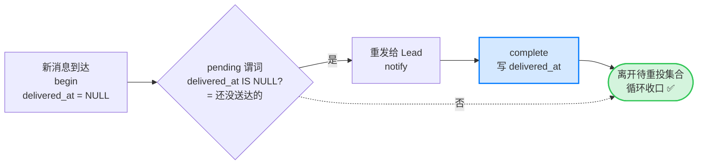
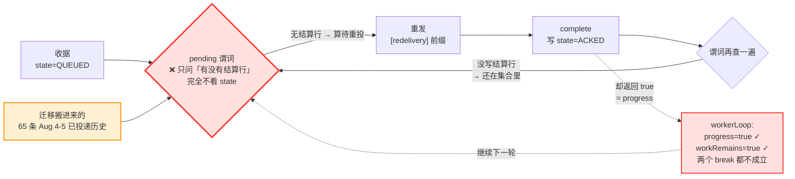
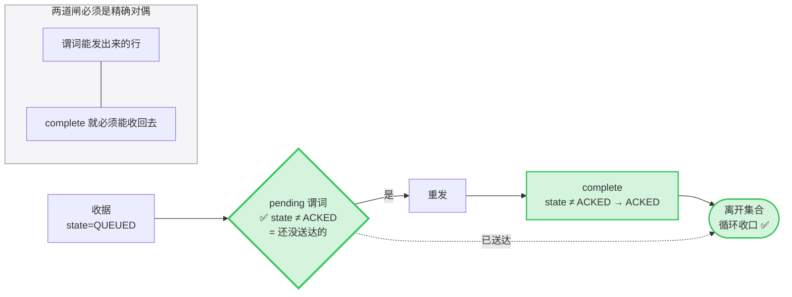

# 事故复盘:FLY-1572 迁移部署引发全舰队 Discord 重投风暴 + Lead 会话活锁 — FLY-1646

**Issue**: FLY-1646 (https://linear.app/studio/issue/FLY-1646)
**Date**: 2026-08-06
**基于**: FLY-1572 (mailbox 合表,PR #780, commit `754541aa`);止血 CLI 病灶归 FLY-1645

---

## 0. 一句话结论

FLY-1572 合表时，把 external 收据"待重投"谓词里的 **`delivered_at IS NULL` 这道闸删掉了、且没有等价替代**。Discord 插件的重投循环靠这道闸终止；闸没了之后 `complete` 再也清不掉行，循环的两个 break 条件永远不成立 —— 这既是重投风暴的源头，也是活锁本身。**同一个缺陷。**

关键澄清:**这不是"迁移把数据搬坏了"，而是"读取端的谓词本身错了"**。迁移只是在第一天就往这个错谓词里塞了 65 行已投递的历史消息，把一条本来会慢慢渗漏的裂缝，变成了当场的全舰队洪水。

---

## 1. 触发器:实体证据

### 1.1 代码路径(逐跳)

| # | 位置 | 行为 |
|---|---|---|
| ① | `~/.claude/plugins/cache/claude-plugins-official/discord/0.0.4/chat-receipt-runtime.ts:420` `reconcilePendingPass()` | 调 `chat-receipt pending`，把返回的**每一行**重发 |
| ② | 同上 `:475` | `this.notify(receiptNotification(replay, true))` — 第二参 `true` = 重投 |
| ③ | 同上 `:621` | `content: '[redelivery] ' + begin.text` ← **`[redelivery]` 前缀的唯一产地** |
| ④ | 同上 `:483` | 重发成功后调 `complete()` → `progress = true` |
| ⑤ | `packages/flywheel-comm/src/commands/chat-receipt.ts:283` → `db.ts:2310` → `mailbox-queue.ts:399` `listExternalPending()` | **谓词在这里** |
| ⑥ | `mailbox-queue.ts:384` `markExternalDelivered()` | `complete` 的落地写:只写 `state='ACKED'` |

### 1.2 机制图:一条收据的一生

**正常（FLY-1572 之前）** —— 闸在，环能收口：



**断路（FLY-1572 之后）** —— 闸被删，`complete` 的写和谓词的读**对不上**，环永远收不了口：



一句话读图：**`complete` 写的是 `state`，谓词读的却是结算账本** —— 写和读不在同一个地方，所以「已送达」这件事永远传达不到循环，20 秒 7,810 条。

（结算行只有 `settle` 会写，而 `settle` 要 Lead 用显式 Discord 回复触发 —— 于是谓词实际问的是「回复了吗」，循环却拿它当「送达了吗」用。）

**修复** —— 把闸补回去，并让读写成对：



（注意：真正的终态是**结算账本里的 `disposed`/`processed` 行**，不是 `state`。隔离 `DEAD` **不是**终态 —— 详见 §3.1，把它当终态排除会变成静默丢消息。）

### 1.3 被删掉的那道闸(前后对照)

**FLY-1572 之前** — `lead-inbox-queue.ts:1163` `listExternalPendingForLane()`：

```
carrier = 'external'
AND delivered_at IS NULL     ← ★ 这道闸
AND disposed_at IS NULL
AND processed_at IS NULL
AND to_lead = ? AND 前缀匹配 AND seq > cursor
```

**FLY-1572 之后** — `mailbox-queue.ts:399` `listExternalPending()`：

```
to_agent = ? AND carrier = 'external'
AND id LIKE 'chat:<lead>:%' AND seq > cursor
AND NOT EXISTS (SELECT 1 FROM mailbox_log
                 WHERE subject_id = mailbox.id
                   AND event IN ('processed','disposed'))
```

**新谓词完全不看 `state`。** 唯一能让一行离开"待重投"集合的，是 `mailbox_log` 里一条 `processed`/`disposed` 结算记录 —— 而那只有 Lead**用显式 Discord 回复触发 `settle`** 才会写。`complete`（= 已投递给 Lead）写的是 `state='ACKED'`，新谓词看都不看。

于是语义被悄悄偷换了：

> 谓词从「**还没送达**的收据」变成了「**还没被回复**的收据」。

重投循环拿"还没被回复"当"还没送达"来驱动，就必然把所有已读未回的消息无限重发。

### 1.4 真机复现 ①:迁移把已结清的历史变成待重投

拿**生产真备份**（`~/.flywheel/comm/flywheel/comm.db.pre-fly1572-2026-08-05T23-47-54.535Z`，即迁移当刻的真输入）跑**真迁移代码**，再跑**真谓词**：

```
tsx engineering/doc/FLY-1646-redelivery-storm/evidence/repro-migration-pending.ts <db 副本>
```

| | 真 Lead 待重投条数 |
|---|---|
| **迁移前**（legacy 谓词） | **0**（仅 `flywheel-test-1` QA 槽 3 条真未读） |
| **迁移后**（新谓词） | **68**，其中 **65 条 `state='ACKED'` 且 `acked_at` 非空 = 迁移前就已投递过** |

逐 Lead，且**日期区间正是 `2026-08-04` → `2026-08-05`**：

| Lead | 条数 | 其中已 ACKED | 时间跨度 |
|---|---|---|---|
| flywheel-eng-lead | 42 | 42 | 08-04 → 08-05 |
| flywheel-cos-lead | 17 | 17 | 08-04 → 08-05 |
| claude-infra-bot-lead | 5 | 5 | 08-04 → 08-05 |
| flywheel-product-lead | 1 | 1 | 08-05 |
| flywheel-test-1 | 3 | 0 | 08-01（真未读，本该重投） |

**与 Annie 描述的「Aug 4–5 已处理历史消息整批带 `[redelivery]` 反复重投」逐字吻合。**

这也直接解释了 Annie 提的谜团 —— **为什么被重投的 `chat:` 收据 id 在分片 mailbox 里"查无此行"**：重投的行来自 `mailbox` 表，但当时排查用的是 `relay_state='open'` 这类 lead-inbox 语义去找，而新谓词根本不看 `relay_state`、也不看 `state`。三方证据（HL 的 12 条 no-route 后仍重投、eng-lead 的 289 条 founder_msg open 却不重投、settle 清零后仍继续注入）会互相矛盾，正是因为**大家都在找一个不是开关的开关**。真正的开关只有一个：`mailbox_log` 里有没有 `processed`/`disposed`。

### 1.5 真机复现 ②:活锁

`workerLoop()`（`chat-receipt-runtime.ts:285`）只有两个出口：

```ts
if (!pass.workRemains) break                      // ① 没活儿了
if (!pass.progress && !kickDuringPass) break      // ② 有活儿但推不动
```

- `workRemains = sawRows || …` → 只要还有待重投行就是 `true` → **①永不触发**
- `progress` ← `complete()` 返回值。`markExternalDelivered` 对**已经是 ACKED** 的行会走 `getById(id)?.state === 'ACKED'` 分支**返回 true** → **②永不触发**

**"清不掉"和"报告成功"同时成立 = 活锁。** 用真插件循环 + 真迁移后的库实测（`evidence/repro-livelock.ts`）：

| | 判定 | 重投数 | 不同消息数 | 单条最多被重投 | 耗时 |
|---|---|---|---|---|---|
| **迁移后语义（事故当时）** | **循环不终止** | **7,810** | 42 | **186 次** | 卡满 20s 上限 |
| **对照组:迁移前语义** | 循环正常终止 | 42 | 42 | **1 次** | 170ms |
| **修复后（同库同循环）** | 循环正常终止 | **0** | 0 | 0 | 36ms |

对照组是同一份数据库、同一份插件代码、同一个循环，**只有"complete 能不能清掉行"这一个变量不同** —— 排除了"本来就该这样"。

> 补充观察：无 `sleep` 的紧循环会把 macrotask 队列饿死（我第一版 harness 因此连超时定时器都跑不了，`timeout` 180s 才杀掉）。生产每页之间有 1s 真定时器所以会让出，但这说明该循环在压力下对事件循环极不友好。

### 1.6 真机复现 ③:这不只是迁移数据问题（最关键）

在**全新空库、零迁移历史**上（`evidence/repro-standing-defect.ts`）：

```
begin ×2                      → pending = [...001, ...002]   ✔ 正确
complete ×2（都已送达 Lead）  → pending = [...001, ...002]   ✘ 送达清不掉
settle ...002（显式回复）     → pending = [...001]           ✘ 永久卡住
```

**结论:只要 Lead 收到一条消息而没有用显式 Discord 回复去 settle，这条收据就永远是重投源。** 所以——

> **只修迁移脚本、不修谓词，FLY-1572 重新部署一定会再炸。** 迁移不是病因，是加速器。

---

## 2. Annie 三问的实测裁决

### Q1 重播真触发器是什么？

**`mailbox-queue.ts:399` `listExternalPending()` 缺失投递状态闸**，由 `chat-receipt-runtime.ts:420` 的重投循环驱动。已用代码路径 + 真数据复现 + 对照组三重定死。

Annie 列的候选里：boot 扫描 / Coalescing 队列 / delivery pipeline 内存态 —— **都不是**。触发器是一条 SQL 谓词。但"内存态"这个直觉有一半对：**风暴的持续性确实在内存里**（那个不终止的 `workerLoop`），所以清 DB 之后同批消息还会继续注入数轮 —— 因为循环还在跑，它每轮都重新查库。这解释了 eng-lead "settle 清零后同批消息仍在会话内继续注入数轮"。

### Q2 Coalescing 活锁根因？

**上游产生侧的无界重投**。~390 条/秒的注入速率下，Lead 会话的入站队列永远排空不了，会话持续处于合并（Coalescing）状态而不收敛。

诚实边界：**我严格证明的是产生侧的活锁**（§1.5，有对照组）。会话侧 Coalescing 是它的下游表现 —— 这是 operator 与 Annie 观察到的现象，我没有单独复现会话内部状态机。但两者的因果方向是确定的：产生侧停了，注入就没了（修复后 0 条）。

本次修复动作 = operator 手工重启 Lead（清掉进程内那个不终止的 loop）+ 回滚代码与 DB。

### Q3 迁移语义关联度？

- Cass 的「迁移后 0 条 `chat:` 收据被正常结清」—— **实测证实且给出机制**：`complete` 写 `state='ACKED'` 但从不写 `mailbox_log` 结算行，而正常结清只认后者。所以"0 条正常结清"是必然，不是巧合。
- 「sweep 引发刷屏」—— **实测推翻**。我的复现里**完全没有 sweep**，光跑迁移就得到 68 条待重投 + 不终止的循环。刷屏早于 sweep 这个时间观察是对的，**sweep 不是原因，是补救**（且因为写的是 `mailbox_log` 结算行，它的方向其实是对的）。
- 迁移本身的行映射(`classifyLead`)对 `processed`/`disposed` 的翻译是**正确**的 —— 会写带 `subject_id` 的结算行。缺口精确落在**"只有 delivered、没有 processed/disposed"** 这一类：映射成 `state='ACKED'` 且**不带任何结算行**，于是被新谓词当成待重投。

---

## 3. 修复

### 3.1 主修:补回投递状态闸

`packages/flywheel-comm/src/mailbox-queue.ts` — 补回投递状态闸：

```sql
AND state <> 'ACKED'
-- excludeQuarantined（调用方 opt-in；两种拼写都要匹配,迁移行沿用旧的）
AND (? = 0 OR dead_reason IS NULL
     OR dead_reason NOT IN ('chat_delivery_unconfirmed', 'delivery_quarantined'))
```

`state <> 'ACKED'` 是旧 `delivered_at IS NULL` 的等价翻译 —— `markExternalDelivered` 是唯一把 external 行推到 `ACKED` 的写者。

**闸的宽窄经过一轮修正（Codex review R1 抓出）**：初版写的是 `state IN ('QUEUED','LEASED')`，**过窄，会造成静默丢消息**。因为 **`DEAD` 对 external 收据不是终态**：

- `quarantineChatReceipt` 的注释明说「Quarantine is visibility, never disposal」；
- 查 legacy 实现 `quarantineExternalDelivery`（`lead-inbox-queue.ts:1255`）确认：它**只写 `disposition` 和 `last_error`，从不写 `delivered_at` / `disposed_at`** —— 所以被隔离的、**尚未送达**的收据在旧语义下**仍然留在待重投集合里**；
- `ExternalReceiptSaga` 还会因为「journal 暂时不可用」这类**可恢复**原因把行标 DEAD。

把 DEAD 一并排除，等于把「风暴」换成「静默丢消息」—— 这正是修这个 bug 时最危险的失败模式。真正的终态是**结算账本里的 `disposed` 行**，那个已经被 `NOT EXISTS` 子句排除了。

`excludeQuarantined` 因此不是冗余参数，而是**调用方的 opt-in**（对应 legacy 的 `disposition <> 'delivery_quarantined'` 过滤），已按真实语义**实现**而非仅声明；且必须同时匹配迁移行沿用的旧拼写 `delivery_quarantined`（迁移把 `lead_inbox.disposition` 原样搬成 `dead_reason`），否则这个 opt-in 会漏掉所有迁移前的收据。

**闸必须成对（Codex review R2 抓出）**：`markExternalDelivered` 原本只认 `state='QUEUED'`。谓词放开 DEAD 之后，被隔离的行**能被重发却永远无法被标记送达** —— 重投永不收敛，而 `ExternalReceiptSaga.complete()` 遇到恢复了的 xdept 收据会直接抛错。现在 `markExternalDelivered` 用 `state <> 'ACKED'`，是谓词的**精确对偶**：

> **谓词能发出来的行，`complete` 就必须能收回去。** 这个对称性本身就是循环终止的保证。

### 3.1.1 为什么这个回归能通过 CI（最值得记住的一条）

FLY-1572 不只删了谓词的闸，它**顺手把断言这条契约的测试改成了断言 bug**：

| | 测试名 |
|---|---|
| FLY-1572 **之前** | `quarantines with one stable alert and **still permits later completion**` |
| FLY-1572 **之后** | `quarantines to a stable DEAD state that **cannot later complete**` |

（`git log -S` 确认这行改动只来自 commit `754541aa`。）

隔离行"仍可后续完成"是 FLY-1426 定下的原始契约，`quarantineChatReceipt` 的注释至今仍写着这句话 —— 但测试被改成了相反的断言，于是**回归在 CI 上是绿的**。本 PR 把该测试还原回原语义。

**教训**：改行为的 PR 如果同时改了断言该行为的测试，绿色 CI 不构成任何证据。review 时应当把"测试断言方向被反转"当成独立的高危信号。

**刻意不做的事**：不加任何 watchdog / 陪跑巡检 / 新告警（Annie 红线）。这是**删掉一个错误行为、补回一道原有的闸**，净结构收敛 —— 不是加报警器。

### 3.2 配套加固:半迁移分片不得被静默跳过

`scripts/migrate-fly1572-mailbox.ts` — 新增 `mixed` 状态（legacy 表与 `mailbox_v1` 标记并存），写入前 **fail-loud 拒绝**，不再 `continue` 跳过。见 §4-B1。

**范围声明（与 FLY-1645 的边界）**：本 PR 只动**读取侧的 pending 谓词**（`listExternalPending`）与迁移脚本的 `classify`。**没有碰 settle 写入侧** —— `settle()` / `markProcessed` / `handle-receipt` / no-route 路径一行未改，全部归 FLY-1645。`mailbox-queue.ts` 这个文件同时含 `settle()`，属**同文件不同函数**，合并时留意即可。

### 验证

| 项 | 结果 |
|---|---|
| 新增 TDD `fly1646-replay-bound.test.ts` | 修前 3 红 2 绿 → 修后 **8/8 绿**（含"隔离行仍可重投""隔离行可被送达收回""真 disposed 才出集合""opt-in 匹配迁移旧拼写"四条防丢消息/防不收敛断言） |
| `chat-receipt.test.ts` 隔离契约测试 | 还原回 FLY-1572 之前的语义（见 §3.1.1） |
| 真插件循环 + 真迁移库 | 7,810 条重投 / 不终止 → **0 条 / 36ms 终止** |
| `flywheel-comm` 全套 | **93/94 文件绿**；唯一红的 `qa-result.test.ts` 把本改动 revert 后**同样红** = 既有环境项，非本单引入 |
| `ExternalReceiptSaga`（另一个消费者，Codex Lead 侧） | **4/4 绿** |
| `scripts/__tests__/migrate-fly1572-mailbox.test.sh`（含新增 mixed 用例） | 修前红（exit 4）→ 修后 **PASS** |
| `pnpm -r build` / `pnpm lint` | 全绿（13 条既有 warning） |

---

## 4. FLY-1572 剩余批次再部署 checklist

**必须全部满足才可再部署。**

### A. 代码前置（阻塞项）

- [ ] **A1.（必要条件）谓词修复已合入**（本 PR）。否则不得重新部署 —— §1.6 已证明重新部署必然复发。
      **⚠️ 这条现在是重迁前唯一的代码防线。** founder 裁决 B 已取消 FLY-1645 的"修结清通路"路线：按 FLY-1569 总纲铁律，**message 层本就不该有收据账本**，FLY-1645 重裁为「整体拆除收据账本机器」，排到重迁后批 3（FLY-1575 task 表接班之后）。
      因此**再部署 checklist 不得假设 FLY-1645 的修复存在** —— 它不会在重迁前落地。
- [ ] **A2. 重投循环加界**：`reconcilePendingPass` 目前没有任何回退/上限，`workerLoop` 也无最大轮次。即便谓词修好，任何未来把行留在 pending 的 bug 都会再次变成无界洪水。建议在插件侧加**单调退避 + 单轮上限**（这是给循环加界，不是加 watchdog）。→ 建议开 follow-up，不阻塞本单。
- [ ] **A3. `quarantine` 不是限流阀,别指望它兜底。** 两条实测事实：
      (a) `markDead` 只对 `state IN ('QUEUED','LEASED')` 生效，对已 ACKED 的行是 no-op → `quarantineChatReceipt` 返回 false。所以隔离对"已投递"的行本来就无效（谓词修好后这类行不再进 pending，问题自然消解）。
      (b) **隔离对"未投递"的行也不减少重投** —— 按设计，被隔离但仍未送达的收据**继续留在待重投集合**（见 §3.1；这是刻意的，否则就是丢消息）。所以 `QUEUED → DEAD(隔离) → 仍然重发` 这条路径依然存在。
      **准确边界（Codex R3 更正）**：修复后这条路径**会收敛** —— 重发一旦成功，`complete` 就能把行推到 `ACKED` 并移出集合。只有在**通知或 complete 持续失败**时才会持续重试（那是正确行为，不是风暴）。
      **结论**：quarantine 是可见性标记，**不是限流阀**；真正给这条路加界的是 A2 的退避/上限，或调用方显式传 `excludeQuarantined`。**不要把 quarantine 当限流机制写进任何 runbook。**
> **A4.（非 checklist 项 —— 已判定不修,再部署不阻塞）xdept 终态 abort 的行留在集合里。**
>
> 记在这里是为了让下一个读代码的人不要把它当新 bug 重新查一遍，**不是待办**，所以不给勾选框。
>
> `ExternalReceiptSaga.reconcile()` 在 `provenAbsent` 分支只调 `markDead(..., "journal_absent_after_watermark")`，**不写结算行**，于是该行留在集合里。这是 FLY-1572 遗留的同族缺陷（shipped 版谓词完全不看 state，同样有此问题），**非本 PR 引入**。
>
> **实测下来它在生产里根本不触发**（Codex R7 提示后逐处核过调用点）：
> - `reconcile()` 只在 `startGateway`（Lead 启动）调一次，**不是循环、不是定时任务** —— `codex-lead-runtime.ts:1668`、`codex-lead-tui-runtime.ts:748`。
> - 两个调用点都传 `absenceProvenThroughMessageId: "0"`，而判定是 `BigInt(messageId) <= BigInt("0")` —— 对任何真实 Discord snowflake **永远为假**，所以 `provenAbsent` 分支**在生产中根本进不去**。
> - 返回值 `result.aborted` 被两个调用点**直接丢弃**（既不落日志也不落库），所以连"日志里重复计数"这个症状也没有。
>
> **且它与 Discord 重投无关** —— 重投走的是 `chat:` 前缀那条完全不同的循环。
>
> **不要用"补一条 `disposed` 结算行"来修**：founder 裁决 B 之后 FLY-1645 是**拆除**收据账本，往一个即将被拆的账本里加写入是反方向的；重迁后 task 表（FLY-1575）接班时这条路径会随账本一起消失。
>
> ⚠️ **A2 的加界对它无效** —— A2 加的是 Discord 插件 `chat:` worker 循环的界，跟 saga reconcile 不是同一个循环。别误以为 A2 顺带覆盖了它。

### B. 数据与库状态（阻塞项）

- [ ] **B1. 先清 `growth` 分片的分裂状态。** 现在生产是全面回滚（主仓 HEAD `4857d999` = FLY-1572 之前；各分片 DB 已还原成 legacy `messages` + `lead_inbox`），**唯独 `growth` 例外** —— 它同时存在 legacy 表**和** `mailbox`/`mailbox_log`/`mailbox_migration_meta`(`schema_generation = mailbox_v1`)。
      **实测判定依据**：拿真迁移跑出来的干净迁移库只有 `mailbox,mailbox_log,mailbox_migration_meta` —— **legacy 表是被 drop 掉的**。所以 growth 里 legacy 表与 mailbox 表并存，证明它的 swap 没走完，属异常态而非正常迁移态。
      **危害**：`classify()` 原本见到 `mailbox_migration_meta` 就判 `migrated`，`main()` 里 `if (item.state === "migrated") continue` → **重新部署时 growth 会被静默跳过**，继续用 legacy 表服务，而 mailbox 表停留在 `2026-08-06T03:54:08Z` 的陈旧快照。
      **已在本 PR 加固**：新增 `mixed` 状态 + cutover 前 fail-loud 拒绝（不再静默 skip）。**`--rollback` 排在这道闸之前** —— rollback 正是半迁移分片的恢复路径，闸不能把它堵死（Codex review R1 抓出）。
      **仍需人工动作**：重新部署前显式把 growth 还原成干净 legacy（用 `comm.db.pre-fly1572-2026-08-05T23-48-34.638Z` 备份），或显式补完迁移。**旧栈下它是惰性的，现在不要动生产库。**
- [ ] **B5. 跑迁移脚本前先 `unset FLYWHEEL_COMM_DB`。**
      `discover()` 会把环境变量 `FLYWHEEL_COMM_DB` 指向的库并进清单。Runner / Lead 的 shell 里这个变量**默认就指向生产分片**，所以在任何 agent 环境里直接跑这个脚本会静默把生产库拉进迁移目标。
      本单调查时真实撞到了这一幕：一次 `--confirm-quiesced` 的验证跑把 `~/.flywheel/comm/flywheel/comm.db` 带进了清单 —— **靠 B1 新加的 fail-loud 在任何写入之前拦下**（事后核验：生产分片仍是 legacy 两表，无新建 staging 目录、无新备份、无 swap-intent）。
      建议脚本自身对"清单里混入了 `FLYWHEEL_HOME` 之外的库"也 fail-loud。→ follow-up。
- [ ] **B2. 迁移按未读语义搬，并逐条对账**：用 Cass 的谓词口径（7,036 / 1,102 / 389）在**迁移前后各跑一次**，逐条比对而不是只比总数。特别要断言：**迁移前 `delivered_at IS NOT NULL` 的行，迁移后不得出现在新 pending 谓词的结果里**（这正是本次 65 条的那一类）。
- [ ] **B3. 迁移后、放流量前，先跑一次"pending 集合体检"**：对每个分片每个 Lead 跑一次新谓词，**结果必须与迁移前 legacy 谓词的结果逐行相等**。不等就中止。这一步如果当时做了，本次事故在放流量前就会被抓住。
- [ ] **B4. 备份与 `.migration-swap-intent.json` 齐备**（本次是齐的，回滚因此可行 —— 这条做对了要保留）。
- [ ] **B6.（已知无害,不必清）收据 `relay_state` 残留 `open` 不用管。**
      事故排查期间在 `relay_state='open'` 上花的力气是白费的：重投谓词**从来不看这个字段**（§1.3）。修复后重投只认 `state` 与结算账本，所以残留的 open 行**不会引发任何重投**。
      这些行的终态由 FLY-1645「拆除收据账本机器」统一了结（重迁后批 3），**再部署前不需要、也不应该为它们做数据清理**。

### C. 部署过程

- [ ] **C1. 灰度：先迁一个低流量分片**（如 `personal-assistant`，`total_chat = 1`），跑满一个观察窗再推全舰队。本次是全舰队同时切，把一个可控故障放大成了全局。
- [ ] **C2. 部署后第一件事是跑 B3 体检**，而不是等 Discord 上出现症状。
- [ ] **C3. 明确的回滚触发条件与执行人**（本次回滚本身执行得干净，代码+DB 都回到位，值得固化成 runbook）。

### D. 观测（克制,Annie 红线）

- [ ] **D1. 不加常驻 watchdog、不加轮询巡检、不加新告警通道。**
- [ ] **D2. 唯一建议的信号**：迁移脚本**自己**在收尾时打印 B3 的对账结果（迁移前/后 pending 集合 diff）。这是一次性的部署产物，不是常驻监控。diff 非空 → 迁移脚本自身 fail-closed 退出。

---

## 5. 教训

1. **谓词是契约，删条件等于改语义。** `delivered_at IS NULL` 看着像可有可无的过滤，实际是重投循环唯一的终止条件。合表重写 SQL 时，**每一个被删掉的条件都必须能指出它在新 schema 下的等价物**，指不出就是丢语义。
2. **"报告成功"与"实际清除"必须是同一件事。** `complete` 返回 true 但清不掉行，是活锁的另一半。任何 drain 循环里，**推进信号必须来自集合真的变小**，而不是来自写操作的返回值。
3. **迁移验收要验读取端，不只验数据搬没搬对。** 本次迁移的行映射基本是对的，炸的是读它的谓词。只对账行数会全绿放行。
4. **三方证据互相矛盾时，说明大家找错了变量。** `relay_state` 的三条矛盾证据不是数据不一致，是那个字段根本不参与决策。矛盾本身就是"你在看错的字段"的信号。
5. **改了行为又改了断言该行为的测试，绿 CI 等于没测。** 见 §3.1.1 —— 这次回归正是这样溜过去的。"测试断言方向被反转"应当在 review 里被当成独立的高危信号，而不是当成配套改动一笔带过。
6. **闸要成对。** 决定"谁进待办集合"的谓词，和决定"谁能出集合"的写者，必须是精确对偶。本单前后两版都栽在这上面：第一版谓词能发的行 `complete` 收不回（不收敛），修宽之后又差点漏掉写者侧。**任何 drain 循环都该有一条这样的不变量断言。**
7. **修"发太多"的时候，最危险的失败模式是"改成发太少"。** 本单初版补闸补得过窄（把 `DEAD` 也排除），会把重投风暴换成静默丢消息 —— 而后者没有任何症状、不会有人来报。凡是收窄投递集合的改动，都必须逐个状态问一句"这个状态是真终态吗"，并对**每一个非终态**留下断言。`DEAD` 在这里就不是终态。

---

## 6. 归属边界

- 本单：风暴触发器定位、活锁根因与结构性修复、再部署 checklist。
- **不在本单**（归 FLY-1645）：结清通路 CLI 病灶 —— `reply_to` 不关 `relay_state`、`handle-receipt` ack 被挡、no-route 假成功毒化、product-lead 12 行锁死解锁。
  **⚠️ 状态更新（founder 裁决 B）**：FLY-1645 的"修结清通路"路线**已取消**。按 FLY-1569 总纲铁律，message 层不该有收据账本，FLY-1645 重裁为「整体拆除收据账本机器」，排到**重迁后批 3**（FLY-1575 task 表接班之后）。
  对本单的影响：本单的谓词修复成为**重迁前唯一的代码防线**（见 §4-A1），而不是"临时顶一下、等 1645 来修"。
- 建议 follow-up：§4-A2 重投循环加界；§4-B5 迁移脚本对清单混入 `FLYWHEEL_HOME` 之外的库 fail-loud。
