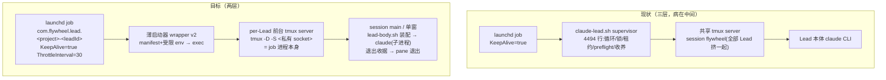
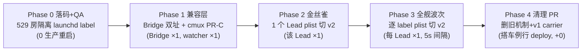

# FLY-1663 拆除 Lead lifecycle 层，回归 launchd 原生 — 实施计划（design r5，Codex 5 轮 APPROVED）

Issue: FLY-1663 (https://linear.app/geoforge3d/issue/FLY-1663/拆除-lead-lifecycle-层回归-launchd-原生根治非补丁)
日期: 2026-08-08
基于: research.md（r2 并入 Codex R1 全 11 条；r3 并入 R2 全 7 条；r4 并入 R3 全 5 条；r5 并入 R4 全 2 条。tmux 生死链在 R3 通过 Codex 独立复验）

> ⚠️ 本单例外硬 gate：本 design 经 founder 批准后才进 implement。design 阶段零生产改动。
> 设计原则（宪法）：修复 = 净删除；每保留一个机制必须有真实事故场景支撑；不变量由 OS/结构保证，不由自研代码保证。

## 0. 一句话

把现在的三层 `launchd → claude-lead.sh supervisor（4494 行病灶）→ Lead 本体` 压成两层 `launchd → Lead 本体`：launchd job 进程就是该 Lead 私有的前台 tmux server（`tmux -D`），Lead 死 → server 收口退出 → KeepAlive 重拉；supervisor、全局锁、租约、preflight、共享 session、收养全部随层消失。

## 1. 目标形态

### 1.1 架构



### 1.2 生死链（全部实测锚定）

- **死了重拉（三层收口，全部绑定不可变的 body pane 身份，R2 blocker 1 的修复）**：
  1. **主路径 = body 自杀 server**：lead-body.sh（一次性 wait 父进程）在 claude 退出、写完退出收据后，自己执行 `tmux kill-server`（pane 内有 `TMUX` env，天然指向自己的 server）。Spike L 实测：即使 founder 在 `main` 内另开了 window，server 仍被干净收割——收口不依赖任何 session/window 拓扑。
  2. **fallback = `pane-exited` hook 绑定 body pane id**：conf 内 `set-hook -g pane-exited 'run-shell "if [ #{hook_pane} = %0 ]; then tmux -S <sock> kill-server; fi"'`。覆盖 body 脚本本身被 SIGKILL 的角落。Spike T/U 正例实测（含同 session 额外 window + session 改名）；Spike S 反例实测（额外 pane/window 退出**不**触发）。body pane = `%0` 是结构性确定的：server 每次都是全新起的，conf 的 `new-session` 创建的第一个 pane 恒为 `%0`（Spike J 观察证实）。
  3. **兜底 = `exit-empty on`**（无额外 session 时的原始链路，Spike S1）。
  - 两个实测地雷写进实现合同：hook 的条件**不能用 `if -F`**（hook 格式变量在 if -F 上下文不展开，实测不触发）；run-shell 内 **必须显式 `-S <sock>`**（server 环境没有 `TMUX` 变量，裸 `tmux` 会打到默认 socket）。
  - R1 稿的 `session-closed` + session 名过滤方案被 R2 反例证伪（同 session 额外 window 时 body 死而 session 不关；session 名可被 founder 改名），弃用；session 名不再承担任何生命周期语义。
  - server 退出 → launchd KeepAlive 在 ThrottleInterval（30s）节奏内重拉。
- **重启一个 Lead** = `launchctl kickstart -k`：SIGTERM → tmux server 干净收整棵进程树（Spike S2），launchd 重拉。founder 的正规重生路径（D3）= 这一条命令。
- **不双跑**：launchd 同 label 单实例（OS）+ 同 socket 双 server 结构性不可能（Spike S3，exit 1）。详见 §5。

### 1.3 目标不变量（与 FLY-1655 同一设计语言：按不变量，不按快照）

| # | 不变量 | 保证者 |
|---|--------|--------|
| I1 | **受管路径内**同一 Lead 身份至多一个 body（同 label 同 domain 唯一 job；受管创建路径唯一） | launchd label 单实例 + per-Lead socket 独占 |
| I2 | Lead 死了会被重拉 | KeepAlive + 三层收口（body 自杀 / pane-exited %0 hook / exit-empty，均实测 + Codex 独立复验） |
| I3 | **受管路径内** Lead env 只来自唯一正规路径，且**最小化**（per-role allowlist） | wrapper 受限投影（§3.2），手工救活路径废除：救活 = kickstart |
| I4 | 一个 Lead 的终端面不被别的 Lead 波及 | per-Lead server：没有共享可变面，就不需要锁 |
| I5 | Bridge 死了会被重拉 | Bridge launchd KeepAlive（§7） |

**威胁模型边界（R3 issue 5 的修正，防止把接受的残余写成 OS 已消除）**：I1/I3 的量词是"受管 launchd 路径"。人工在别的终端直跑 `claude --agent X` 这种**非受管** body，OS 不能也不去阻止——这是明示接受的纪律性残余（§5.5），验收断言的是"不存在第二条**受管**创建路径"，不是"全机不存在同身份进程"。lease 写校验的删除以此为准确论据。

唯一自研的 lifecycle 残留 = lead-body.sh 的**一次性 wait 父进程**（§3.3）：每次启动运行一次、无循环、无锁、无仲裁，只为记录退出收据与 resume 三振。设计上明示这是保留的一个 shim，进程链验收按它写。

## 2. 必答 1：五层机制逐层判定

| 机制 | 判定 | 理由 |
|------|------|------|
| **supervisor**（claude-lead.sh Layer 2 循环 + 建窗 FIFO/pending/fence/archive + 死亡检测） | **拆除** | 它复刻的就是 KeepAlive。FLY-1662 自撞、FLY-1659 锁风暴、restart #400+ 全长在这。保留的判断只剩 resume 快死三振（§3.3，场景 FLY-109 族） |
| **全局 tmux 锁**（tmux-server-rescue.sh 1760 行 per-socket 互斥，Lead+Runner 同锁排队） | **Lead 侧拆除** | per-Lead server 没有共享可变面，锁保护的对象不存在。Runner 仍在默认 server，Runner 侧 ensure/锁**原样保留**（§11 边界） |
| **租约 + preflight**（lead-lease.ts 族 + preflight 链） | **拆除（按消费者矩阵有序退役，§11.2）** | I1 已由 OS 保证。preflight 是 FLY-1662 的直接病灶。lease 在 flywheel-comm 写路径等全部消费位逐一摘除；通用工具函数（如 loopback 判定）先抽出再删文件 |
| **共享 tmux session**（一台 server + session `flywheel`） | **拆除（Lead 部分）** | quiesce 杀错窗、锁风暴的土壤。per-Lead server 后 cmux 的 Lead view-session 补偿机器不再需要（§4）。Runner 的 `runner-<project>` session 不动 |
| **archive / 收养 / rescue** | **archive+收养拆除；捞号保留（本来就在外面）** | 收养反复伤人；目标形态没有孤儿可收。捞号已全部在 Bridge + 独立 CLI（research §2.5），动作 = `launchctl kickstart`，只需保住 label 契约 |

配套拆除：lead-restart-lifecycle.sh、lead-body-sweep.sh、restart-candidate.sh、lead-identity-preflight.sh、tmux-supervisor-guard.sh、lead-launch-authority.sh、restart-services.sh 的 Lead 编排族。restart-storm-gate.py **只删 Lead 调用位**（文件继续服务 Bridge wrapper 与 cmux autostart，见 §11.3——不宣称整文件删除）。

## 3. 必答 2：launchd job + 薄启动器

### 3.1 版本化 carrier：plist 逐 Lead 原子切换（R1 blocker 2 的修复）

r1 稿"plist 一字不改、只换 wrapper 内容"被 Codex 证伪：15 个 plist 指向**同一份** wrapper，converge 即全舰同时翻转，逐 Lead 迁移和单 Lead 回滚都不成立。r2 改为**静态版本化 carrier**：

- v2 交付物为**新文件**：`flywheel-lead-wrapper-v2.sh` + `lead-body.sh`（进入 converge-flywheel-bin.sh 与 packaged bootstrap 的安装闭包，原子发布）；v1 wrapper 原文件不动。
- **carrier 是 FLY-247 受管 desired state 的一部分，不是手改 plist 的旁路（R2 blocker 3 + R3 blocker 1 的修复）**。carrier 的两半有各自的唯一权威，**manifest 完全不承载 carrier 字段**：
  - **期望值（desired）** 记在 `~/.flywheel/projects.json` 的 leads[] 行（FLY-247 单一真相；v1 启动**不会**重写 projects.json）——immutable v1 的 `claude-lead.sh:543-600` 每次物理启动会用 `jq -n` 全量重建 manifest、把任何新增字段抹掉，所以 durable carrier 放 manifest 会被 v1 亲手删除、进而把 FLY-247 recovery 打进 manual intervention（Codex R3 抓出的合同破坏）。
  - **观测值（observed）** = 该 label plist 的 ProgramArguments 与两个 canonical wrapper 路径的精确匹配：v1 路径 → v1；v2 路径 → v2；其他 → **fail-close（unknown，不洗成 v1）**。归一化语义只有这一套，projection / classification / staging / recovery 全部共用。
  - `flywheel-daemon.sh generate_plist_to` 按已验证的 desired carrier 渲染 wrapper 路径（现 `:238` 写死 v1 的行为终结）；受管判定三处同步识别 v1/v2：`flywheel-daemon.sh:549,604`、`flywheel-fleet.sh:57,198-202`、`bridge/fleet-data.ts:201-202,287-290`。
  - **常规 model/effort apply 保留该 Lead 当前已批准的 carrier**（否则下一次 fleet apply 把 ProgramArguments 静默渲染回 v1——回退地雷）。
  - cutover/rollback 不是裸 `mv plist → bootout → bootstrap`：复用 FLY-247 staged journal + preimage hash + bootout/bootstrap/recovery 状态机，每个 crash boundary 可对账恢复（bootout 后中断不留 Lead down）。
- **每 Lead cutover = 经 fleet 事务把该 label 的 desired carrier 切到 v2 并重渲 plist**；**单 Lead 回滚 = 同一事务切回 v1**。金丝雀失败只回它自己，真实成立。
- 迁移全程 v1/v2 两份 wrapper 并存且各自不可变；Phase 4 清理时才删 v1，之后新装机默认 v2、未知 wrapper 继续 fail-close。
- **零状态账：missing-carrier bootstrap + roster reconciliation（R4 blocker 的修复）**。真实起点（只读核对）：projects.json 16 行 **carrier 0/16**；LaunchAgents 17 个 Lead plist = 15 指 canonical v1 + 2 个 Codex bespoke；另有 1 个 **plist-only 孤儿**（`flywheel-anna-interviewer-lead`：指 v1 wrapper，但无 projects 行、无 manifest）。合同：
  - schema `carrier?: "v1"|"v2"`。**混合期 absent 语义**：仅对 config-backed 且 **effective backend = claude-code**（显式写出，或现行 absent 字段默认——当前 14 个非 Codex 行都省略 backend，实现必须复用 canonical desired-backend resolver，不许字面 `.backend=="claude-code"` 匹配；fixture 覆盖 backend absent + carrier absent + observed canonical v1 的现网 shape）的 Lead，desired absent 归一为 v1；eligibility 仍要求 observed 精确等于 canonical v1 路径——unknown/bespoke wrapper 不会被洗白。cutover 写**显式 v2**、回滚写**显式 v1**；Phase 3 结束时全部受管 Claude Lead 必须显式 v2；Phase 4 后新建 Lead 直接写显式 v2，**不做全局翻转 absent 默认**。
  - carrier 与 model/effort 进**同一笔** projects.json 原子 composite write（`flywheel-fleet-batch.sh` 的 original/desired/touch/CAS/conditional restore/crash recovery 全套字段扩展）；`touchCarrier=false` 的普通 model/effort apply **逐字保留**原字段/absence；非法 carrier fail-loud；`backend=codex-app-server` + carrier 组合明确拒绝（cross-field 校验，FLY-247 先例）。
  - **Phase 0 增加三方 inventory gate**：`projects roster × canonical plist × manifest` 对账闭合。Anna 孤儿 plist 交 founder 二选一（补回权威配置后迁移 / 作为遗留 job 退役），不许隐式落出迁移账；2 个 Codex bespoke label 明确 classified out-of-scope、零 mutation。
  - **Phase 4 删 v1 wrapper 前的硬门**：全部 loaded label + 磁盘 canonical plist 的 ProgramArguments 对 v1 路径引用为**零**，否则不删（防遗留 plist 变成永久失败入口）。
- 测试合同（R3 追加"必须等旧 body 完成 manifest self-write 再判定"；R4 追加真实 shape）：v1 普通 model apply（absent carrier + 启动后 manifest 重建）/ v2→v1 金丝雀回滚 + KeepAlive 重启 + 下一次 apply / 两方向每个 crash boundary recover / unknown Codex bespoke wrapper / plist-only 无 manifest 遗留 / Phase 3 后显式 v2 完备性 / Phase 4 v1-reference-zero / 未知 wrapper fail-close。

### 3.2 薄启动器（flywheel-lead-wrapper-v2.sh）

```bash
# 1. 读 manifest（leadId/projectDir/projectName/botTokenEnv/backendId…）
# 2. backendId=codex-app-server → exec 现有 codex 路径（本单不动 codex Lead）
# 3. role 判定【唯一权威 = projects.json，fail-stop】（R2 issue 5 的修复）：
#      沿用 claude-lead.sh:332-468 现行安全合同——每次物理启动按 exact
#      project/lead 查询 projects.json；notfound/读错 → fail-stop；
#      manifest 不携带 role、不允许 role env bypass（陈旧 manifest 不能降级安全）
# 4. 装配【受限】server 环境（R1 blocker 5 的修复）：
#      读 ~/.flywheel/.env 为不导出的 shell 局部值，按 role 构造正向 allowlist
#      （自己的 bot token、必需 FLYWHEEL_*；companion/external 继续清空
#        TEAMLEAD_API_TOKEN / BRIDGE_URL / FLYWHEEL_COMM_* / OPENAI_API_KEY，
#        契约沿用 claude-lead.sh:2660-2833 现行为 + FLY-231/879 测试）
#      env -i + 显式变量启动 server，server 本身不持有无关 secrets
# 5. SOCK=$(derive_lead_socket <exact-key>)（R3 blocker 2 的修复：wrapper 每次
#    从 exact key 现场【派生】canonical 路径——不信任 manifest 里的旧值——
#    并校验 secure dir（0700/owner/非 symlink）；派生器是 shell/TS 共享的唯一
#    pure resolver，生成期只用它做 roster 唯一性/长度预检，不写 manifest）
#    不做 kill-server（R1 修正）：socket 被占 → tmux -D 自己 fail-loud 退出，
#    launchd 按 30s 节流重试；占用即证据，不先销毁证据
# 6. 一次原子 read-modify-write manifest：同笔提交 pid=$$ + socketPath(=派生值)，
#    保留全部未知字段（exec 后 $$ 即 server PID，满足 FLY-247 契约，§3.6）
#    ——首次 v2 启动 manifest 无 socketPath 也成立：字段是产物，不是输入
# 7. 生成 per-launch conf（实测合同，§1.2）：
#      set -g exit-empty on
#      set-hook -g pane-exited 'run-shell "if [ #{hook_pane} = %0 ]; then tmux -S <SOCK> kill-server; fi"'
#      new-session -d -s main -x 220 -y 50 "exec bash <bin>/lead-body.sh <manifest>"
# 8. exec tmux -D -S "$SOCK" -f <conf>
```

删掉的 wrapper 职责：PID 文件单实例守卫（label 语义）、restart-storm-gate 调用（ThrottleInterval）。

### 3.3 lead-body.sh：按职责清单迁移（不是按行号切）+ 一次性 wait 父进程（R1 blocker 4 的修复）

claude-lead.sh 不是干净的"前 3900 行装配 / 后 600 行循环"——生命周期库 `:204` 就 source、共享 session 逻辑在 `:1491+`、roundtable/core-room 一次性装配反而在 Layer 2 标记之后（`:3999-4075`）。r2 改为**逐项职责清单**，每项标注去留与新 owner，迁移时逐项搬对应 characterization test：

| 职责 | 去留 | 新 owner |
|---|---|---|
| workspace、rules bundle、MCP config、model/effort、隔离 config 校验、hooks 安装、roundtable/core-room 装配、orphan adapter 清理 | 保留 | lead-body.sh |
| role 检测 | 保留（换位置） | wrapper（projects.json fail-stop resolver，§3.2 第 3 步） |
| manifest 写入 | **body 零写入**（R2 issue 4） | 静态字段归 fleet/daemon；运行时字段归 wrapper（§3.6 ownership 表）；退出收据写独立 state 文件，不进 manifest |
| session-id 管理 + `--resume` 决策 | 保留（换实现） | lead-body.sh |
| Claude argv 构造 + per-role env 投影 | 保留 | lead-body.sh：.env 读为不导出局部值 → 生成 .mcp.json → 以第二次显式受限环境（env -i/argv env）exec claude，只带自身 bot token + 实际引用的变量（R2 issue 5：动态 MCP 值由 body 就地物化，server 始终不持有无关 secrets） |
| **正向 env baseline（R3 issue 3 + R4 issue 2）** | 新增合同 | versioned positive schema 按 **provenance 三段矩阵**写：① wrapper→server：最小 non-secret baseline（HOME/PATH/TERM/TMPDIR/locale/CLAUDE_CONFIG_DIR 等），**显式 unset `TMUX`/`TMUX_PANE`**（server 环境本来就没有它们，正向转发只会把调用终端的 stale/嵌套 socket 带进新 server——R4 实测）；② tmux→body：`TMUX`/`TMUX_PANE` 由 tmux 注入 pane、wait parent 保留；③ body→claude：第二个 allowlist 从 **pane env** 显式转发正确值（flywheel-comm `index.ts:1122` 依赖 TMUX_PANE 登记 pane）+ role/MCP secrets 层。每个变量有 owner、source、unset-vs-empty 语义。**先对现有 v1 启动环境做 characterization 再收缩**，不许退回全量 `set -a` export。验收断言：server global **absent**、body 与 claude 的值指向当前 private socket/`%0`（不是三层都"存在"） |
| 共享 session ensure、建窗 FIFO/pending/fence/archive、preflight、adoption、恢复循环、HOLD/退避 | 删除 | —（launchd + 三层收口） |
| blocked 分类 | 早已在 Bridge（LeadWatchdog） | 不动 |

**一次性 wait 父进程**（明示保留的唯一 lifecycle shim）：pane 命令是 `lead-body.sh`，它装配后以**子进程**方式运行 `claude`（不 exec），wait 到退出后原子写退出收据（exit code、运行时长、session id → `~/.flywheel/state/lead-resume/<key>.json`，0600、temp→mv，坏文件按 fresh 处理），随后**主动 `tmux kill-server` 收口**（§1.2 主路径，Spike L）。**resume 三振**语义与现行为逐字对齐：带 `--resume` 启动且 <60s 死、连续 3 次 → 删 session-id 转 fresh；>60s 存活清零。它每次启动只跑一遍：无循环、无重启逻辑、无锁。进程链验收相应为 `launchd → tmux server → lead-body.sh(wait) → claude`。

### 3.4 每 Lead 的确定性地址（typed，含 socket；R1 issue 6 的修复）

Bridge 侧新增 typed 地址对象（TS + shell 同构；R2 blocker 2 修复——attach 与 pane 两种 target 语义**分开**，不再混用）：

```ts
LeadAddress = {
  socketPath: string,        // manifest 记录的绝对路径（§3.5）
  sessionTarget: "=main",    // 仅 attach-session 用（=name 是合法 session 精确匹配）
  bodyPaneTarget: "%0",      // capture-pane / send-keys 用：不可变 pane id
}                            // 每次调用都带 -S socketPath
```

- `=main` 直接当 pane target 会 `can't find pane`（Codex 实测）；`=main:` 又指"当前 pane"、会随 founder 新开 window/pane 漂移——所以 capture/send 一律用 **body pane id `%0`**：server 每次全新起、conf 的 new-session 创建的第一个 pane 恒为 `%0`（Spike J），无发布步骤、无漂移。
- **fail-closed（R3 issue 4 定稿为单一 typed predicate，禁止各消费者自写 regex）**：LeadAddress helper 提供唯一判定——capture 强度：exact socket + `%0` 存在 + **anchored `pane_start_command` 匹配 manifest 记录的 lead-body 路径**（`pane_current_command` 只是前台短名，装配期会漂）+ pane PID argv 是 wait-parent；send-keys 强度另加：前台进程组/后代属已批准的 claude runtime（防把按键送进装配期 shell）。测试组：装配期 / claude 运行中 / claude 已退 pane 将关 / 伪造 `%0` / 旧址 fallback。
- 裸 `@window_id` 跨 socket 不唯一（各 server 都从 `@0`/`%0` 起）——**所有消费者一律携带完整地址**，双址回落也返回完整旧/新地址对象而非 window id。消费者矩阵：

| 消费者 | 适配 |
|---|---|
| `LeadWindowLocator.ts` / `LeadWatchdog` capture | 确定性地址，无需查找；旧址回落（迁移窗内） |
| `lead-alert-helpers.ts`、plugin 内 rescue/reconcile/send-enter call sites | 同一 LeadAddress helper |
| `bridge/tmux-lookup.ts` | 只加 Lead 分支；**不**把 runner-only API 改成 Lead 语义 |
| `rescue-runtime.ts` | kickstart 按 label 不变；send-keys 走 LeadAddress |
| quota：`quota-monitor-runtime.ts` + `quota-revive-scan.ts` | 从 launchd roster 枚举【默认 Runner socket + 每个 Claude Lead socket】；snapshot/action key 含 socket；managed classifier 接受 `main/main` 形态；并发与扫描预算 + 混合舰队测试 |
| `flywheel-daemon.sh` / `flywheel-fleet.sh` / `bridge/fleet-data.ts` 运行时探针 | per-socket probe（§3.6） |

### 3.5 socket 派生契约（R1 issue 9 的修复）

- **绝对路径 `-S`**，不用 `-L`：`~/.flywheel/sock/<short>.sock`，与 `TMUX_TMPDIR` 彻底解耦（cmux autostart 不 source 全量 .env，`-L` 会在不同进程解析到不同目录——实测风险）。
- `<short>` = `fw-` + exact key 截断可读前缀（≤20 字符，sanitized）+ `-` + exact key sha256 前 **16** 位（64-bit，R2 issue 7：8 位仅 32-bit 不能自称无碰撞）→ 有界、**collision-resistant**、可读。
- **唯一 pure resolver（R3 blocker 2 定稿：方案 B，wrapper-owned runtime evidence）**：`derive_lead_socket(exactKey)` 是 shell/TS 共享的唯一派生函数——
  - **生成期**（plist/manifest 渲染时）只调用它做全 roster **exact-key→socketPath 唯一性断言 + 完整路径 < 90 字节断言**（sun_path 限 104 留余量，FLY-1659 教训成文），碰撞/超长在生成时 fail-loud；**不写 manifest**；
  - **运行期** wrapper 每次启动从 exact key 现场派生（不信任 manifest 旧值——被排除在 CAS 外的字段不能反过来当输入，否则 drift/手改可把 job 指到错误 socket 绕过断言），校验 secure dir 后随 pid 一并 RMW 写入 manifest；
  - **manifest.socketPath 是产物（供 Bridge/watchdog/rescue 只读），不是输入**；TS 消费者读 manifest，可用同一 resolver 交叉校验。
- **socket 目录契约**：installer/wrapper 创建并校验 `~/.flywheel/sock`（owner 本人、0700、非 symlink），失败 fail-stop——目录可被他人替换会破坏"占用即证据"的语义。
- 测试覆盖：**首次 v2 cutover（输入 manifest 无 socketPath）**、stale/错误路径被派生值覆盖、wrapper 写与 staged verify/rollback 交错、最长合法 key、跨项目同名 leadId、非默认 TMUX_TMPDIR、missing dir / 错误 owner / symlink、构造碰撞、最长 HOME、packaged 首装。

### 3.6 FLY-247 manifest PID / fleet 契约（R1 blocker 3 的修复）

`flywheel-daemon.sh:627-639,723-749`、`flywheel-fleet.sh:190-225,437-457`、`bridge/fleet-data.ts:298-329` 都断言 `manifest.pid == launchd PID`。适配：

- wrapper 在 `exec tmux -D` **之前**做**一次原子 read-modify-write**：同笔提交 `pid = $$` + `socketPath`，保留全部未知字段（exec 保 PID，$$ 即最终 server PID）。不分两次写——启动中断不得产生混合代 manifest。
- **manifest 字段 ownership 表（R2 issue 4 的修复）**：

| 字段类 | 例 | 唯一 writer | 语义 |
|---|---|---|---|
| 静态配置（FLY-247 desired state） | leadId/projectDir/botTokenEnv/model/effort | fleet/daemon（staged 事务 + CAS） | projection/CAS 保护 |
| **carrier** | —（**不在 manifest**） | desired 在 projects.json；observed = plist ProgramArguments 归一化（§3.1，R3 blocker 1） | v1 的 manifest 全量重建不能伤到它 |
| 运行时证据 | **pid、socketPath** | wrapper（单次原子 RMW；socketPath = 每次现场派生的产物，§3.5） | CAS/projection 明确排除——由 exact key 可再生的 runtime evidence，rollback restore 不得把它判成 carrier drift |
| 退出收据/resume 状态 | exit code、时长、session id | lead-body.sh | **不进 manifest**，写独立 `~/.flywheel/state/lead-resume/<key>.json` |

  现 `claude-lead.sh:543-600` 的 jq 全量重建 manifest 行为随迁移**删除**：body 对 manifest 零写入（全量重建会抹掉 wrapper 刚写的 runtime 字段——Codex 抓出的交错地雷）。交错测试合同：wrapper write / staged verify / rollback restore 互相穿插。
- daemon/fleet/fleet-data 的运行时探针从"默认 socket 枚举窗"改为 per-socket 探针（读 manifest socketPath）；保留 exact-key、plist、PID liveness、Claude 进程四轴证据与 staged install/CAS rollback 测试。
- **更正先例表述**：Mufasa 是 `launchd → Node TUI runtime`（在默认 session 建 TUI），证明的是"launchd 直管 Lead 级进程 + KeepAlive"可行，**不是** "job=tmux server" 形态的先例；后者由本单 QA 首次真机验证。

## 4. 必答 3：cmux 可见性（不共享 server、不用锁；R1 issue 7 并入）

核心洞察不变：cmux 的 per-窗 view-session（link-window + ledger + restoredv1 收养）是"多 Lead 挤一个 session"的补偿物，per-Lead server 后对 Lead 整套退役。r2 补齐工程细节：

- **持久 reconnect 命令**（不是一次性 2s retry）：Lead 行 workspace 命令 = 有界重试的 attach 小循环（attach 退出 → sleep 2 → 重试，响应 cmux workspace teardown 信号退出）。场景：每次 kickstart/body death 都会退 server，已 attach 的 client 必然掉——数小时后的下一次重启也必须自动重连，founder 打开的行不能变死 shell。这是显示层 helper（一行 while 循环），非 lifecycle watchdog。
- **canonical 语法升级**：`flywheel-cmux-sync.sh` 的 command parser / workspace adoption / ledger / title reconciliation / `--list-lead-refs` / `--rebuild-views` / `--verify-sidebar` 当前把 `env -u TMUX tmux attach -t '=cmux-…'` 硬编码为唯一合法语法——**PR-C 必须让它们识别新 Lead reconnect 语法**，并按 carrier 版本（读 plist ProgramArguments）区分该 Lead 走旧 shared-view 还是新 per-socket 命令，同 title 恒只一个 workspace（混合期去重）。
- **Lead 行来源改名册**：`derive_lead_roster()`（launchd plists + manifests，已存在）驱动"每 Lead ensure 一行"；watcher 对 Lead 不再做任何 **tmux** 变更。
- **workspace ownership 收据保留（收缩版，R2 issue 6 的修复）**：r2 稿"不写 Lead ledger 收据"与 adoption/同 title 去重自相矛盾——`VIEW_LEDGER` 不只是 tmux link-window 账，它把 cmux workspace ref 绑定到 generation、保证一 title 一 ref、给 rename/duplicate-close 提供 authority（`flywheel-cmux-sync.sh:93-98,3863-3877,5280-5345`）。r3 判定拆分：**删除的是 Lead 的 tmux view 建造（view session/WAL/keeper inventory）**；**保留一份只管 direct-attach Lead workspace ref 的 ownership 收据**（现有 watcher lease 下使用）——没有它，fail-closed 逻辑会留下 unreceipted stock 行、mixed-fleet 去重无法完成，绕过收据又会重开 FLY-1446/1605 防过的"误关 founder surface"风险。场景真实，保留有据。五组测试：create crash / 同 title founder stock / v1→v2 原 ref cutover / duplicate cleanup / watcher restart。
- **锁的角色收缩**：watcher lease 继续做 cmux IPC 单写者 + Runner view 机器互斥（Runner 域不动）；Lead 路径零 tmux 互斥需求。
- **裸 tmux 兜底**：founder 任意终端 `tmux -S <sock> attach`。
- **真机验收**（写死进 QA）：已打开的 cmux Lead 行 → `kickstart -k` → **同一 workspace/ref 自动重连**（不是"启动间隙 attach 成功"）。

**排序硬约束（R1）**：PR-C 在任何生产 Lead cutover 之前完成并验收，Phase 2/3 依赖新显示层。

### 4.1 Runner 窗口与 watcher/ledger 机器的判定（r5.1 addendum，Tadashi 指令 + 活体实证 2026-08-08）

**活体证据**：本单进行当晚，FLY-1663 的 runner 本体正常运行，却在 cmux 隐身 40 分钟——`flywheel-cmux-sync --watch` 的 linked-view ledger 机器每轮在 `prepare_linked_view_state` pre 阶段失败（WAL 残留隔离后仍卡，疑 keeper inventory escrow 会话 snapshot 读回失败）→ refresh 永久 skipped → 新 runner workspace 永不自动创建，founder 亲历「看不到 1663 的 session」。

**判定（目标形态下 Lead / Runner 可见性分开回答）**：

1. **Lead**：§4 名册驱动直连。view-session / link-window / WAL / keeper / escrow **这台机器对 Lead 零参与**（保留的只有 §4 收缩版 workspace ownership 收据，那是 cmux 行的账，不是 tmux 镜像机器）。
2. **Runner**：本单机制不动（仍是 `runner-<project>` 多窗 session + view-session + ledger）。但这台 ledger/keeper/escrow 机器被本 design **判定为同病器官**：它是"多窗共享 session、多 client 抢当前窗"的补偿物，病理与 Lead 侧完全同构——今晚的 wedge 就是第 N 例（前有 FLY-1578/1596）。
3. **整台退役的路径 = 后续单把 Runner 迁到与 Lead 同形**：每 runner 一个 session（或 socket）+ 直连 + roster 驱动行——TmuxAdapter 建 per-runner session 而非 per-project 多窗 session，view 机器随之无物可镜像、整台退役。**不并入本单**：全舰 Lead 迁移已是本单血量上限，把两场迁移绑进一个窗口违反"不做大爆炸"红线。
4. **本单的间接收益与诚实边界**：Lead 退出后这台机器的负载与爆炸半径显著缩小（view/ledger 行减半以上），但 runner 行的 wedge 类故障在后续单落地前仍可能复发——按宪法**不再给它打补丁**，坏了走 FLY-1596 已落地的 `--verify-sidebar` / `--rebuild-views` 运维路径恢复。

## 5. 必答 4：防双 body

1. **launchd 单 label 单实例**（OS）：同 label 同 GUI domain 只有一个 job 进程。
2. **job 进程 = tmux server，socket 独占**：同 socket 第二个 server 结构性失败（S3）。
3. **body 只由 server 启动 conf 创建一次**：没有第二条创建路径。
4. **占用即证据（r2 修正）**：不再启动前 `kill-server` 清障——手工误跑 wrapper 时那会反杀健康的 launchd Lead。socket 被占 → `tmux -D` 自行 fail-loud 退出 → launchd 30s 节流重试，日志与 runs 计数即证据；人工清理占用者。
5. **诚实残余**（接受，不加机制）：SIGKILL 路径（SIGTERM 超时才发生；tmux 对 SIGTERM 响应即时，S2）理论可留短暂孤儿 pane，pty 已死随即自退；人工绕过 launchd 直跑属纪律问题（已成文），不再用机器抓——用机器防纪律问题正是这层病的起源。

## 6. 必答 5：rescue 捞号工具化

结论不变（research §2.5）：捞号已是独立工具，**零迁移**——检测在 Bridge（LeadWatchdog + detection-classifier），执行是 `POST /api/rescue` + `flywheel-rescue-lead` + `flywheel-claude-profile` + quota daemon，动作 = `launchctl kickstart -k com.flywheel.lead.*`，与目标形态天然同构。本单只做两件：① label 契约入不变量（§3.4）；② rescue/quota 的 pane 定位与扫描改走 LeadAddress / per-socket roster（§3.4 矩阵）。

## 7. 必答 6：Bridge launchd 化 —— 并入本单（收尾，不是新建）

判定：**并入**。理由与 r1 相同（Bridge 已在 launchd、漂移口子 = nohup fallback + 无 installer、EventLoopWatchdog 前提要 KeepAlive）。r2 按 R1 issue 10 收窄实现方案：

- 删 `restart-services.sh:1178-1202` nohup fallback，plist 未加载 → fail-loud 指引 install。
- **installer 复用现有 canonical seam**：packaged 路径已有 `scripts/packaged/bootstrap-services.sh` → `scripts/lib/supervisor.sh` 生成安装 Bridge/Lead job。r2 方案 = 从 `supervisor.sh` 抽出共享 service-spec renderer，monorepo 日常入口（新增薄命令）与 packaged 入口调**同一个** primitive——不给 `flywheel-daemon.sh` 硬塞 bridge 目标造成两个 plist writer。两条路径产物等价性测试（label/Throttle/日志契约逐字段比对）。
- restart 后置断言：`com.flywheel.bridge` 已加载且 KeepAlive=true + `/health` 探活（FLY-1651 验收吸收）。Bridge 重启统一 kickstart，admission pause（FLY-1638）照旧包裹。

## 8. 必答 7：FLY-1661 —— 并入批E（收据机器），KeepAlive 子项由本单吸收

三选一判定：**并入批E**。理由不变（r1 §8）：① receipt-settlement 冲突无终态 + disposition 重试燃料恰好长在批E（FLY-1574）+ FLY-1645（founder 已裁"拆不修"）要删的机器里，单独修 = 给待拆器官打补丁；② stage-emoji stamp 洪水属统一 mailbox 投递域，随批E 收编；③ 不判死——事故真实，FLY-1661 保留为批E 域验收载体；④ 不单独最小修——KeepAlive（本单 §7）在场后 boot-storm 从"永久死"降级为"自愈重启"（FLY-1661 二次 boot 对照实验实测收敛）。
诚实缺口（写给批E）：Bridge 无统一 boot 期预算，15 个 boot sweep 各自判断"安全"、加总成洪。
**r2 新增（R1 issue 11）**：cutover 级 Bridge boot 积压 replay 成为**本单迁移 gate**——证明 KeepAlive 下有限次重启收敛、积压与日志不无界增长（不新增节流机制，只是验收）。

## 9. 必答 8：全舰迁移 + 回滚 + 重启账（r2 按版本化 carrier 重写）

### 9.1 迁移步骤



- **Phase 0**：全部代码落地；529 房用**真隔离 launchd job**验证（QA 专属 label + 唯一短 socket + QA manifest；main/extra Lead 都走 v2 wrapper；teardown 先 bootout QA label 再验证 server/body 消失，绝不触碰生产 socket/plist——现 test-deploy.sh 直跑 claude-lead.sh 的形态**不能**代表新形态，QA 房需同步改造，否则 Phase 0 是假 PASS）。含 FLY-1661 积压 replay gate（§8）+ **三方 inventory gate**（§3.1：projects roster × canonical plist × manifest 对账闭合；Anna 孤儿 plist 的处置交 founder 二选一；Codex bespoke 零 mutation）。roster seed / 遗留 plist 处置若只是配置写与未加载 plist 清理，重启账记 **0 restart**。
- **Phase 1**：Bridge 双址 locator + LeadAddress 消费者 + quota per-socket 扫描上线（Bridge kickstart ×1，admission pause 包裹）；cmux PR-C（watcher 重启 ×1）。此后显示与观测层同时认识新旧两形态。
- **Phase 2**：金丝雀（建议 reflection-lead）：该 label plist 原子切 v2 → bootout/bootstrap → 验收清单（launchd job PID 出现 → `main` pane + claude 进程证据 → inbox-ready → Discord 往返 → cmux 同 ref 重连 → `--resume` 记忆延续逐字验证；每层用实测预算，不硬写统一 35s）。
- **Phase 3**：其余 Claude Lead 逐 label 切换，5s 间隔（防 load 尖峰）。Mufasa/codex TUI Lead 不迁（形态不同，§3.6 更正）。
- **Phase 4**：稳定 ≥48h 后清理 PR（§11 矩阵驱动），搭车例行 deploy。

### 9.2 重启账

| 对象 | 次数 | 影响 | 恢复 |
|---|---|---|---|
| Bridge | 1（Phase 1） | 事件投递停 ~1 分钟，admission pause 兜底 | KeepAlive + /health 断言 |
| cmux watcher | 1（Phase 1） | 显示层短暂不刷新 | launchd 自拉 |
| 每个 Claude Lead | 1（Phase 2/3，plist 切换的 bootout/bootstrap） | 该 Lead Discord 掉线数秒；`--resume` 保记忆 | KeepAlive + 验收清单 |
| 清理阶段 | +0 | 搭车例行 deploy | — |

回滚成本：受影响对象各 +1 次（plist 指回 v1 + bootout/bootstrap）。

### 9.3 回滚方案

版本化 carrier 使回滚真实成立：**单 Lead 回滚 = 该 label plist 指回 v1 wrapper + bootout/bootstrap**，其他 Lead 不受影响；v1 wrapper/脚本迁移全程原样在盘。Phase 1-3 期间不删任何旧状态文件（lease.db、pids/、archive）——回滚后旧 supervisor 原地找回状态。Bridge 双址 locator 兼容两形态，无需跟随回滚。

### 9.4 迁移红线

- 不做大爆炸 cutover：逐 label、可独立回滚、每步验收清单（R5 教训内建）。
- 不在疲劳态执行；每 Phase 之间观察窗。
- 部署效果由独立 QA 节点把关（实施者不自证——团队既定纪律）。

## 10. 必答 9：与 FLY-1655 的边界

同一场战役——**按不变量设计，不按事故快照打补丁**；不同器官：

| | FLY-1655 | FLY-1663（本单） |
|---|---|---|
| 器官 | ship-gate / workflow 引擎账面 | Lead 进程生命周期 |
| 病形 | 每次修复只覆盖上次事故的状态签名 | 每次事故加一个新护栏机制，机制互相踩 |
| 药方 | 杠杆按不变量对齐任意不一致状态 | 不变量由 OS/结构保证，删掉检查机器 |
| 文件面 | StateStore / workflow engine / approval-signal | scripts/ 生命周期族 + launchd + 显示层 |

文件零交集，互不阻塞。1655 真机验证先行，与本单迁移窗错开。

## 11. 删除 / 保留清单（净删除账，r2 按消费者矩阵闭合）

### 11.1 删除（生产机制）

| 对象 | 说明 |
|---|---|
| claude-lead.sh 生命周期职责（§3.3 清单"删除"行） | Layer 1 装配按职责清单迁入 lead-body.sh |
| lease TS 族 + lead-lease.db | **按 §11.2 矩阵有序退役**，通用工具先抽出 |
| lead-restart-lifecycle.sh / lead-body-sweep.sh / restart-candidate.sh / lead-identity-preflight.sh / tmux-supervisor-guard.sh / lead-launch-authority.sh / resume-recovery.sh | 整文件（三振断路器换实现进 body） |
| restart-services.sh Lead/Bridge 编排族 + nohup fallback | → kickstart + 波次 sleep + fail-loud |
| restart-storm-gate.py 的 **Lead 调用位** | 文件保留（Bridge wrapper + cmux autostart 仍用 + converge 硬依赖）；Bridge/cmux 侧退役另立后续单逐一论证 |
| tmux-server-rescue.sh 的 Lead 调用位 | 库为 Runner 保留 |
| flywheel-cmux-sync.sh 的 Lead **tmux view 建造**（view session/link-window/WAL/keeper inventory） | Phase 4 深清理（PR-C 已切换来源）；**workspace ownership 收据保留**（§4，收缩到 direct-attach Lead 行） |
| wrapper v1 + PID 守卫 + storm-gate 调用 | Phase 4 删 v1 carrier |

### 11.2 lease 退役消费者矩阵（R1 issue 8）

lease 不只在写路径。退役顺序：**先抽出通用函数 →  逐消费位摘除 → 最后删文件**。已盘点的消费位：`send/respond/handle-receipt/route-founder-reply`（comm 写校验）、Bridge lease diagnostics/self-check、`lead-dual-active-scan`、`fleet-data`、founder consent/write-gate、Codex runtimes、feature-flag registry/truth、alert kind/watchdog 映射、`isAllowedLoopbackHostname` 等 utility import。实施时以 `rg` allowlist 归零 gate + TS build + shell tests 三重闭合；**QA 的 `.inbox-ready-<lead>` 是 transport readiness marker、非 lease，明确保留**。

### 11.3 保留（每条附场景）

| 机制 | 场景 |
|---|---|
| flywheel-daemon.sh plist 生成/切换（+共享 renderer，§7） | launchd 机器本身 |
| wrapper 受限 env 投影契约 | FLY-199 token 泄漏 + FLY-231/879 companion/external 最小权限 |
| lead-body.sh 一次性 wait 父进程 + resume 三振断路器 | 损坏 session 的 KeepAlive 死循环（FLY-109 族）；明示为唯一保留 shim |
| cmux Lead 行持久 reconnect 命令 | Lead 重启后 founder 已打开的行不能变死 shell |
| cmux workspace ownership 收据（收缩版） | 同 title 去重 / rename authority / 误关 founder surface 防线（FLY-1446/1605 场景） |
| 波次切换 5s sleep | load 尖峰崩机历史 |
| LeadWatchdog / rescue / quota daemon / lead-alert.sh（LeadAddress 适配） | 观察者与工具，非生命周期 |
| tmux-server-rescue.sh（仅 Runner 域）、restart-storm-gate.py（仅 Bridge/cmux 域） | 边界外，另行论证 |
| admission pause（FLY-1638）、EventLoopWatchdog（前提被 §7 补齐） | Bridge 应用层 |

### 11.4 明确不做

- 不动 Runner 生命周期 / TmuxAdapter / runner session。
- 不动 codex Lead（Mufasa 等；形态不同，§3.6）。
- 不新增 watchdog / 陪跑告警 / feature flag。crash-loop 可见性 = launchd runs 计数 + 日志。
- 不做多机。

## 12. 风险与诚实边界

1. **迁移窗口 watchdog/quota 盲区**：双址 + per-socket roster 消除大部分；金丝雀期发现盲点即暂停波次。
2. **SIGKILL 孤儿残余**（§5.5）：接受，pty 死亡自然收敛。
3. **KeepAlive 循环烧配额**：装配失败的 Lead 以 30s 节奏重试，唯一刹车 = ThrottleInterval（OS）。比今天三套自研刹车互相打架更差的场景不存在；持续失败可见于日志与 runs 计数。
4. **cmux Electron 端行为**：reconnect 命令覆盖重启窗口；异常时 Runner 域不受影响，Lead 行裸 tmux 兜底。
5. **lease 写校验摘除**：冒名写入的防线换成"孤儿不存在"（结构）；纪律性绕过不再有机器抓，留档。
6. **新形态无先例**（§3.6 更正后诚实承认）：job=tmux server 是新形态，Mufasa 只证明了 launchd 直管可行——所以 Phase 0 的真 launchd QA 与金丝雀观察窗是硬门，不可跳。

## 13. 关联单处置（定稿）

| 单 | 处置 |
|---|---|
| FLY-1662 supervisor 自撞 | **不修**：机制随拆除消失；本单 ship 后 close |
| FLY-1661 Bridge boot 防洪 | **并入批E**；KeepAlive 子项本单吸收；积压 replay 成为本单迁移 gate（§8） |
| FLY-1651（已 Cancel） | 遗产吸收：installer+断言堵漂移；死亡留痕 = launchd runs + 日志 |
| FLY-1655 self-ship | 独立单，设计语言对齐（§10），文件零交集 |
| FLY-1659 / 1657 / 1649 等补丁族 | 机制整体退役，不再投入补丁 |
| cmux runner view/ledger 机器 | 判定同病器官（§4.1）；整台退役走后续单（Runner per-session 直连迁移），本单不并入 |

## 14. 实施切分（founder 批准后）

| PR | 内容 | 性质 |
|---|---|---|
| PR-A | wrapper v2 + lead-body.sh（职责清单迁移 + characterization tests）+ socket/manifest 契约 + plist 切换命令 + Bridge installer renderer + 529 QA 房 launchd 化改造与真机验证 | 新形态落地（不接管生产） |
| PR-B | LeadAddress + 双址 locator + rescue/quota per-socket + fleet/daemon 探针适配 | 兼容层 |
| PR-C | cmux watcher：名册驱动 Lead 行 + reconnect 命令 + parser/adoption/ledger 识别 + 混合期去重 | 显示层（**先于任何生产 cutover**） |
| （迁移窗） | Phase 1-3 执行（founder-gated，独立 QA 把关） | 运维 |
| PR-D | 清理：§11 矩阵驱动删除 + v1 carrier 退场 + 文档与 CLAUDE.md 里程碑 | 净删除主体 |

## 15. 验收（可证伪，分层时钟）

1. **形态**：全舰 Claude Lead 两层：`ps` 链 = `launchd → tmux server → lead-body.sh(wait) → claude`，无 supervisor 进程。
2. **重生**：kill 任一 Lead body → 分层验收时钟（launchd job PID 出现 → pane+claude 证据 → inbox-ready → Discord 往返 → cmux 同 ref 重连），每层预算取 Phase 0 实测值；`--resume` 记忆延续。
3. **kickstart**：整树干净收割（无孤儿 claude）、同上时钟回归；founder 已打开的 cmux 行自动重连（同 workspace/ref）。
4. **拓扑反例矩阵**（R2 blocker 1 的 QA 合同）：同 session 额外 window / 同 window 额外 pane / 额外 session / session 改名——每种拓扑下 kill body → server 仍收口、KeepAlive 仍触发；反向：非 body pane 退出**不**误杀 server；body 正常退出 / crash / 启动快死 / 重启命令四种死法全覆盖。
5. **机制归零**：无全局锁竞争（Lead 侧）、无 lease 写入、无 preflight HOLD 日志、无收养路径（`rg` allowlist 断言归零 + TS build + shell tests）。
6. **Bridge**：restart 后断言已加载 + KeepAlive + /health；nohup fallback 不存在；cutover 级 boot 积压 replay 有限次重启收敛（§8 gate）。
7. **安全（负向）**：受限 Lead（companion/external）在 server / body / claude 三层 `tmux show-environment` + `ps e` 断言拿不到禁用凭证。
8. **能力（正向，R3 issue 3）**：受限 env 下逐项验证 Claude config/rules 加载、TUI 渲染、comm identity（TMUX_PANE 登记）、每种启用的 MCP、runner spawn / terminal action、git/auth——防"安全测试全绿、Lead 却失能"的静默回归。
9. **机制归零验收的量词**（R3 issue 5）：断言"无第二条**受管**创建路径"（launchd 唯一），不宣称全机不存在同 agent CLI 进程。
10. 独立 QA 出具 verdict（实施者不自证）。
