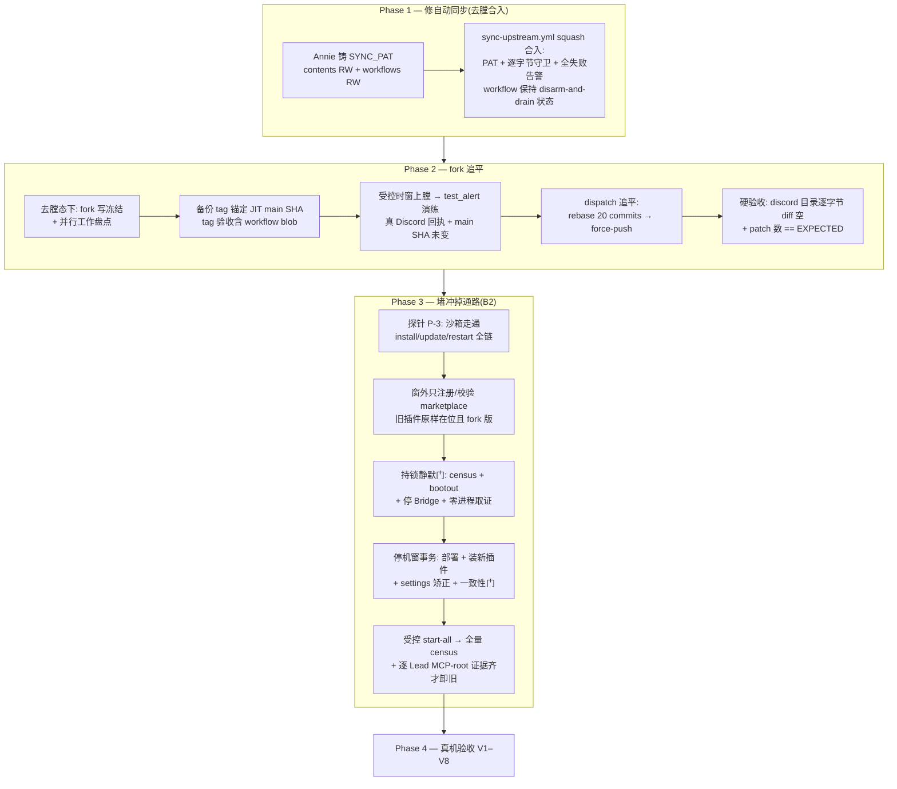

# FLY-1676 Discord plugin fork 追平 + 自动同步修复 + 冲掉通路根治 — 实施计划

Issue: FLY-1676 (https://linear.app/geoforge3d/issue/FLY-1676/chore-把-discord-plugin-fork-整个追平上游-rebase-我们的定制-修好自动同步-founder-裁定不)
日期: 2026-08-10
基于: research.md(Codex design review 11 轮 APPROVED;R5 首过后按 Lead no-flag 裁定〔instruction 122f2c3e〕重设计 §4.3,R6–R11 打磨无开关事务至通过)

## 0. 目标 / 非目标

**目标**(founder 裁定的三件事):
1. fork(`xrliAnnie/claude-plugins-official`)main 追平上游最新,20 个定制 commit rebase 上去,discord 目录内容逐字节不变。
2. Sync Upstream workflow 修到每天真的能跑成功;**任何失败路径都告警**(Discord),不再静默。
3. 结构性堵住「running 副本被官方 marketplace 刷新冲成 vanilla」的通路。验收:官方 marketplace 自动刷新发生一次之后,discord runtime 仍是 fork 版(定制标志 grep > 0)。

**非目标**:
- 不 vendor 化(founder 裁定);插件代码继续住 fork、跟上游跑。
- 不改 discord 插件自身功能(fetch_messages 只验证,fork 版若复现问题另立 issue)。
- 不动官方 marketplace 里其他插件(context7 / playwright 等继续用官方 vanilla,官方 autoUpdate cutover 后保持开启)。

**红线**(issue 原文):
- 舰队不许出现「部分 Lead fork 版、部分 vanilla」的混跑窗口 → cutover 按 §4.3 的分段编排执行,任一时刻 discord runtime 均为 fork 版。
- band-aid(`update-discord-plugin.sh` cache→running 恢复)在根治验收通过前保留为应急手册。

**方案选型已收口**(Codex R1 依据 CLI 2.1.226 binary 实证):`claude-plugins-official` 是 CLI 内建的 **reserved marketplace**,只能从 Anthropic 官方源注册、走原生 GCS 通道 → 「改官方 source 指 fork」(原方向 A)与「fork 直接注册撞名实验」(原 B1)从生产设计中**删除**;生产方案唯一收敛到 **B2 pointer marketplace**,仅一个聚焦探针 P-3 验证 install/update/restart 链路,P-3 失败才回头重开选型。

## 1. 方案总览



Phase 1→2 严格串行(追平就是修好后的 workflow 跑一次;上膛前必须完成冻结/盘点/tag,`test_alert` 在上膛窗内、追平 dispatch 之前)。Phase 3 探针可与 1/2 并行,静默门与停机窗事务在追平后执行。

## 2. Phase 1 — 修自动同步(sync-upstream.yml)

### 2.1 根因回顾
默认 `GITHUB_TOKEN` 是 GitHub App 令牌,**结构上无法**推送含 `.github/workflows/*` 变更的 commit;上游在 merge-base 后新增了 workflow 文件,rebase 后 push 必带这些 commit → 100/100 被拒,且该失败路径零告警。

### 2.2 改动清单(fork 仓,单 PR)

`.github/workflows/sync-upstream.yml`:

1. **checkout 换 PAT**:
   ```yaml
   - uses: actions/checkout@v4
     with:
       fetch-depth: 0
       token: ${{ secrets.SYNC_PAT }}
   ```
   `SYNC_PAT` = fine-grained PAT,scope 仅 `xrliAnnie/claude-plugins-official` 仓,权限 Contents: Read+Write、Workflows: Read+Write。persist-credentials 使后续 push 复用。
2. **push 前逐字节守卫**(替代单一 `grep allowBots`——单标志防不了「保住 allowBots 丢掉 reply-guard/roundtable/receipt」的坏 rebase,也防不了上游未来 discord delta 未审即入舰队):
   ```bash
   # rebase 前: OLD_FORK_HEAD=$(git rev-parse HEAD)
   git diff --exit-code "$OLD_FORK_HEAD" HEAD -- external_plugins/discord/ \
     || { alert "discord tree changed during sync — manual review required"; gh issue …(dedup); exit 1; }
   ```
   语义:**任何** discord 目录 delta(上游首次动 discord、或坏冲突解)都在 push 前失败 + 告警 + 开/去重人工审查 issue;人工审定后以新基线重跑。初次追平必须空 diff 过关。`grep allowBots` 降级为次级防线保留。
3. **conflict 路径改红**:告警 + gh issue 后 `exit 1`(现状发完通知 run 结论是绿的,误导)。
4. **兜底告警步骤**:
   ```yaml
   - name: Alert on any failure (or alert drill)
     if: ${{ failure() || inputs.test_alert }}
   ```
   (R2 纠正:`test_alert` 模式下所有 mutating step 被跳过、没有任何 step 失败,单纯 `if: failure()` 永远为假、演练打不到告警步骤——条件必须显式并入 `inputs.test_alert`。R3 纠正:`type: boolean` 的 dispatch input 在 `inputs` context 里是**真布尔**,`== 'true'` 字符串比较不成立——用错类型会让演练跑真 push 且不发告警,必须全程原生布尔。)curl 用 `--fail-with-body --show-error --retry 3`(裸 `curl -s` 对 Discord 4xx/5xx 也返回成功 = 假投递),webhook secret 先验非空,JSON 用 jq 构造。文案含 run URL + 常见原因(SYNC_PAT 过期 / 守卫触发 / push 被拒)。已知盲区如实记档:runner 分配失败、GitHub 平台故障、webhook 自身挂掉时 Discord 告警不可达——补一条 out-of-band 提示(GitHub 邮件通知开启 + 每周人工瞄一眼 run 历史写进 runbook)。conflict 专用告警(信息更具体)保留。
5. **`test_alert` 演练通道**:`workflow_dispatch` 加 `type: boolean, default: false` 的 `inputs.test_alert`;为 true 时**跳过一切 rebase/push 等有副作用步骤**,告警步骤按上式强制触发。**执行时点 = §2.2-8 的受控上膛窗内(tag 之后、追平 dispatch 之前),不是 Phase 1 合入后立即**(R9 MEDIUM 时序统一);验收 = 真 Discord 消息回执(链接留证)+ 远端 main SHA 演练前后未变——`DISCORD_WEBHOOK_URL` 从未被触发过,有效性未知;无效则 Annie 重建 webhook 并更新 secret。
6. **`test_discord_guard` 守卫演练通道**(R2 纠正:拿沙箱分支预置 discord delta 测不到守卫——`OLD_FORK_HEAD` 在 checkout 后记录,预置 delta 已在基线里,conflict-free rebase 后 diff 恒空):第二个 `type: boolean, default: false` 输入,为 true 时在**记录 `OLD_FORK_HEAD` 之后**由 workflow 自身提交一个受控的 discord 目录改动(不 push),证明逐字节守卫真的失败 + 发出预期告警。守卫逻辑抽成 helper 后另配 hermetic 测试,但 V2 的 workflow 级验收必须走这条真实步骤顺序。
7. **演练围栏的统一类型纪律**(R3 BLOCKER-1):所有远端有副作用步骤(rebase/push/issue 写)统一挂双重负围栏 `if: ${{ !inputs.test_alert && !inputs.test_discord_guard }}`;守卫注入步骤挂 `if: ${{ inputs.test_discord_guard }}`;两个演练输入同时为 true 的 dispatch 直接拒绝(首步校验 exit 1);加一个静态检查测试断言 workflow 里**每个**远端 mutating step 都带双重负围栏(防未来新增步骤漏挂)。
8. **上膛协议 = disarm-and-drain 一体化操作 + fail-closed arming**(R8 HIGH-3 + R9 BLOCKER-1:GitHub 的 disable 只阻止**新触发**,已排队/在跑的 run 是另一回事——光 disable,pending run 仍可在回滚后启动、checkout 已回滚的 main、把追平原样重推;`concurrency` 防重叠但显式允许一个 pending run,堵不住这条竞态):
   - **canonical disarm-and-drain**:`gh workflow disable` → 枚举该 workflow 全部非终态 run → 逐个 cancel → 等每个已记录 run 到达终态 → 复查直至 queued/pending/waiting/requested/in-progress 全为零 → 记录远端 main SHA + disabled 状态。**tag 创建与回滚 force-push 在此门通过前不可达**;
   - Phase 1 合入、写冻结、盘点、squash、immutable tag 创建+校验都在 drained 去膛状态完成;之后受控非 cron 时窗 `gh workflow enable` → `test_alert` → dispatch 追平;
   - **arming fail-closed**:enable 之后 `test_alert` 或追平任一失败 → operator 离开受控窗前**立即 disarm-and-drain**;只有验证成功的追平才允许把 schedule 留在 enabled;
   - workflow 加 `concurrency` 组(同组排队不并行);arm/disarm/drain 转换全部留证(命令输出/时间戳/run 清单)。

### 2.3 founder 依赖(只能 Annie 做,一次性)
- 铸 SYNC_PAT 并存入 fork 仓 secret(`gh secret set SYNC_PAT --repo xrliAnnie/claude-plugins-official`)。有效期建议 1 年;到期风险由失败告警自然兜住(文案已含提示)。
- ~~gh auth refresh 加 workflow scope~~——**已失效的旧账**:R1 实测本机 `gh auth status` 现有 token 已含 `workflow` scope,workflow 修改 commit 可由实现 Runner 直接 push。操作卡执行时点再各自复核一次(auth/secret 状态以执行时实测为准,不信文档快照)。

## 3. Phase 2 — fork 追平(catch-up = 修好后的 workflow 跑一次)

0. **前置:workflow 处于去膛状态**(§2.2-8):Phase 1 合入后 workflow 保持 disabled,直到本 Phase 的冻结/盘点/tag 全部完成;之后受控时窗 enable → `test_alert` → dispatch。
1. **fork 写冻结 + 并行工作全量盘点**(force-push 前):不止 open PR #14(FLY-1319)/#15(FLY-802)——本地还有领先 origin/main 一个 commit 的活跃 worktree(R1 时点:`fix/FLY-1658-discord-access-fail-loud`)。逐项处置:已被 main 覆盖 → close 并注明;仍需要 → 记录 head sha,追平后 rebase 重开;正在进行 → 通知 owner 冻结窗口。执行时以 `gh pr list` + 本地 `git worktree list` + `git branch -vv` **当场重盘**,不吃本文档快照。
2. **回滚锚 = 不可变引用**:在 fork 上打 tag(如 `pre-catchup-20260810`)或 backup ref 指向**执行时点**的远端 main SHA(force-push 后旧 commit 会逐渐不可达,裸 SHA 无保障;文档里的 `e1b061b0` 仅供参考,以 JIT 读取为准)。
3. `gh workflow run sync-upstream.yml` → 观察 run 绿 + fork main = upstream/main + 20 commits。
4. **硬验收(逐字节 + 显式 commit 拓扑算术,R3 MEDIUM-5)**:
   现 fork 的 ahead=20 = 19 个非 merge commit + 1 个 merge commit;**rebase 会丢弃 merge commit** → 追平后序列 = 19 + Phase 1 新增 commit 数。因此:
   - Phase 1 的 workflow 修复 PR **必须 squash 为恰好一个非 merge commit**,且 squash subject 保留 `chore(discord): advance sync version` 前缀(当前 PR #19 标题已钉住;workflow 靠此前缀 amend 同一个 version tip,否则首次追平会新增第 21 个 patch);
   - 打 pre-catchup tag 时 JIT 记录期望 patch 数:`EXPECTED=$(git rev-list --no-merges --count <merge-base>..<tag>)`(应为 20 = 19+1);**若 ≠ 20 先停下审计序列,不许事后改门槛**(founder 验收口径点名 20);
   ```bash
   git fetch origin main
   git diff --exit-code <pre-catchup-tag>..origin/main -- external_plugins/discord/ ':(exclude)external_plugins/discord/.claude-plugin/plugin.json' # 期望: 空
   git rev-list --left-right --count upstream/main...origin/main                    # 期望: 0<TAB>$EXPECTED
   git rev-list --no-merges --count upstream/main..origin/main                      # 期望: $EXPECTED
   ```
   `plugin.json` 只允许 version patch +1(这是 CLI 跟随 non-FF ref 的必要更新信号),除此之外不一致即停,人工审(2.2-2 的守卫在 CI 侧同样会在 intentional bump 前拦)。
5. **先修脚本卫生,再跑 updater**(R2 纠正顺序:现役 `update-discord-plugin.sh` 的 `git reset --hard origin/main` 打在 clone 当前 checked-out 分支上,而 deploy clone 此刻停在 `fix/FLY-898-…` feature 分支——先跑 updater 会硬移活跃分支指针):
   a. 卫生修复先落地并验证:分发操作改用专用 deploy checkout / 临时 worktree(或 `git switch main` 先行),生产分发**永不**重置开发者 checkout;
   b. 跑修复后的 `update-discord-plugin.sh`(现行 overlay 机制,Phase 3 前仍是现役防线)→ preflight `.fork-sha` 对齐;
   c. 此步前后各盘一次 `git worktree list` + 分支 head,证明所有既有 worktree 分支指针逐字节未动。

## 4. Phase 3 — 堵冲掉通路(B2 pointer marketplace)

### 4.0 探针 P-3(隔离沙箱,唯一保留的探针)
用既有 QA seam(isolated `CLAUDE_CONFIG_DIR`)走通全链。**隔离纪律(R2 HIGH-3)**:
- **绝不为探针 mutate fork main**(那会动生产 fork 历史 + 破坏 Phase 2 的 ahead=20 基线,而 P-3 允许与 Phase 1/2 并行);更新语义用**一次性探针分支/ref**(pointer 条目 `ref` 指它)或一次性测试仓验证,取证后清理。
- pointer source 放进 isolated config 树内部,或给 registrar 加一个**受校验的 test-only 目标根 seam**——生产 registrar 现状把 local marketplace 拷到 `$HOME/.flywheel/marketplaces`,而 isolated launcher 校验器拒绝 `known_marketplaces.json` 里指向 `CLAUDE_CONFIG_DIR` 外的路径:不改就调 = 要么碰宿主状态、要么被既有 containment 门拦死。生产 registrar 自身仍由其既有事务测试覆盖;沙箱 Lead 必须过 `validate_isolated_claude_config`(全部 registry 路径受containment)。

判据逐条:
1. 注册 pointer marketplace(§4.1 清单)→ `claude plugin install discord@flywheel-plugins --scope user` 成功,`installed_plugins.json` 出现**恰好一个** user-scope 条目;
2. 由该条目 `installPath` 解析出的目录含 fork 标志(grep > 0);
3. **生产形态的更新语义**(R3 HIGH-4:生产 sync 是 rebase + force-push,插件更新跟随的是**非 fast-forward 的 ref 重写**,只测「推进一个 commit」是在测更容易的 fast-forward 情形):装出探针 commit A → 从 A 起一个真 adapter → 把一次性探针 ref **非 fast-forward 重写**到 sibling/rebased commit B(只 force-push 该一次性 ref)→ **在 A 的 adapter 存活时**跑 `claude plugin update discord@flywheel-plugins`,断言:仍恰好一个 user-scope 条目;`gitCommitSha == B` 且 == JIT `git ls-remote` 结果(**这一步同时钉死 §4.2 新鲜度判定的 SHA authority 语义**——不是「存在完整 SHA」而是「等于解析后的源 ref commit」);新 installPath 完整且含 fork 标志;A 的存活 adapter 全程健康;kill 它后重启干净地从 B 起来,无半更新目录窗口、无双 adapter 间隙。(R1 实证背景:`claude plugin marketplace update` 只刷新 manifest,不更新已装插件——每日链路必须 `claude plugin update <plugin>`。)
4. 沙箱 Lead 以 `--dangerously-load-development-channels plugin:discord@flywheel-plugins` 启动,真 CLI 不出现 allowlist 拒绝;MCP server 进程的实际加载根(ps/lsof 取证)= 新 installPath(仅作为字节 provenance),并由另一测试 bot 的真实入站消息证明 channel 已注册;
5. **双装共存态复现**(R2 BLOCKER-1 的探针面):新旧两插件都 installed 的状态下,按 **cutover 后的直接形态**(部署新代码 + settings 旧 `false`/新 `true`)启动沙箱 Lead,证明**恰好一个** discord adapter/MCP 注册、根在所选 installPath、无重复轮询无 server-name 冲突告警;
6. 沙箱内官方 marketplace 刷新(session start + 0–10min 窗)后,上述加载根内容不变;
(原判据 7「顺序波前置的官方 autoUpdate 冻结证明」随顺序波分支一并删除——stop-all 窗口内无存活进程,无此需求。)
P-3 失败 → 停,带证据回 Lead 重开选型(不自行退回已判死的 A/B1)。

### 4.1 生产接线(尽量复用既有机制)
- **pointer marketplace**:复用**既有** `scripts/register-local-marketplace.sh` 与项目惯例路径 `~/.flywheel/marketplaces/<name>`(R1 纠正:不新造 `~/.flywheel/marketplace/` 单数路径、不写第二个注册器)。marketplace 内容(源码进 flywheel 仓,安装器铺到位):`.claude-plugin/marketplace.json`,name = `flywheel-plugins`,单条目,**schema 照 CLI 2.1.226 实际格式**(与官方 marketplace 里 83 个 git-subdir 条目同形):
  ```json
  { "name": "discord",
    "source": { "source": "git-subdir",
                "url": "https://github.com/xrliAnnie/claude-plugins-official.git",
                "path": "external_plugins/discord",
                "ref": "main" } }
  ```
  字段名以 P-3 实测通过为准(先照抄官方一个真实 git-subdir 条目的字段形状)。
- **安装/更新统一走 CLI**:`claude plugin install|update discord@flywheel-plugins --scope user`;活动路径一律从 `installed_plugins.json` 该 key 的 `installPath` 解析。**不再 rsync 直写 CLI 拥有的 cache/marketplace 目录**——单一受控写者 = CLI 自己,registry 永远自洽。
- **插件 ID 迁移的完整 authority map**(R1 BLOCKER-1,全集如下,实现时逐项迁移 + 测试):
  | authority | 现值 | 迁移动作 |
  |---|---|---|
  | `~/.claude/settings.json` `enabledPlugins` | `discord@claude-plugins-official: true` | **窗外不存在双装态**(R10 LOW 收口;R2 BLOCKER 背景:双 true 会让新进程加载两份捆绑 MCP adapter——`claude-lead.sh:3279` 记档 enabledPlugins 捆绑 MCP 独立于 `--channels` 加载)。三态精确定义:窗外 = 新插件缺席、旧 enabled;持锁停机窗内 = install 可短暂造成双 true(此时零 Lead 存活),随即恢复脚本矫正为恰好旧 `false`/新 `true`;**只有这个精确终态可进受控启动**。census 全绿后旧项移除 |
  | `installed_plugins.json` | 旧条目 | 新条目**只在 §4.3-3(b) 停机事务内** CLI install;收尾 `claude plugin uninstall` 旧条目 |
  | **`claude-lead.sh:3402` `--channels plugin:discord@claude-plugins-official`** | **真正的运行时选择器** | 代码 PR 内直接改为新 ID,与新 checker/updater **同一 PR 原子携带**(§4.3-2,无模式开关);pinned isolated QA 走既有豁免 seam 保旧 ID;argv 测试覆盖生产/QA 两路径 + revert 线自洽 |
  | `check-discord-plugin.sh` / `update-discord-plugin.sh` | rsync overlay 语义 | 同一代码 PR 内换成 pointer 实现(「查/触发 CLI update + 校验 installPath 标志」,见 4.2);legacy 实现具名保留为**恢复脚本**(回滚用,非运行时开关) |
  | `restart-services.sh:453–526` fork 检测 | 旧路径 | 同一代码 PR 内 retarget 到新 installPath 解析(与上两行同 PR 原子换血) |
  | `scripts/test-deploy.sh:567` cache 探针 + QA pinned-plugin fixture | 旧 ID/路径 | QA 探针改为解析所选 plugin 的 installPath;pinned QA 保留旧 ID 属**有意豁免**,标注不迁移 |
  | `apply-core-room-mention-gate.sh` runtime capability probe | 官方 marketplace 路径 | 默认经 canonical checker 的 `--print-install-path` 解析 pointer server.ts;显式 fixture override 只留测试 |
  | `packages/teamlead/scripts/lib/reap-orphan-adapters.sh` FLY-183 shell backstop | exact path allowlist 只认官方 cache/marketplace | 增加 `flywheel-plugins/discord/<version>` exact-boundary 形态,覆盖 inner/wrapper/launcher,继续拒绝 `discord-backup` sibling;否则 adapter 内自清洁的 `ps` probe 一旦降级,外层 reaper 也会同时失效 |
  | `~/.claude.json` 内 `discord@claude-plugins-official` | **pluginUsage telemetry,非 authority** | **不碰**(R1 纠正:手改 telemetry 无意义且越界) |
- **运维脚本获得 repo 源**(R1 HIGH-7,现状两脚本仅存活于 `~/.flywheel/bin`,repo 显式记档它们**不由** `converge-flywheel-bin.sh` 管理):在 flywheel 仓新增 canonical 模板 + 专用安装器(由主 checkout 调用),带 bash 测试;**不**把 fork 强制逻辑塞进面向打包/客户的 convergence(那里的 no-op stub 是有意的)。旧 overlay 版脚本在 V1–V8 全过前以**具名恢复脚本**形式保留——**只作为一次性恢复命令存在,绝不被生产运行时配置选择**(R6 HIGH-3:先前"单配置切换新旧目标的 allowlist"备选正是被 no-flag 铁律禁止的持久运行时开关,删除);加一条静态守卫(plan/code guard)拒绝在既有 isolated-QA seam 与一次性恢复命令参数之外新引入任何 cutover-mode / legacy-pointer 选择器变量。沙箱里正反向安装都演练过才算数。

### 4.2 更新链路(cutover 后的日常)
sync workflow 保 fork main 新鲜 → Lead 启动 preflight / restart-services 触发 canonical updater。**新鲜度判定与全机串行化**(R2 HIGH-5:重启波/整机重启时多个 launcher 会并发做同一判定、并发调 CLI 写同一 `installed_plugins.json`——「CLI 是单一写者」只定了写者实现,没防多个写者进程):
- **新鲜度 authority 明确定义**:JIT 读远端 fork main SHA,与 user-scope 安装条目的完整 `gitCommitSha` 比对(该字段语义 =「等于解析后的源 ref commit」,由 P-3 判据 3 先钉死);不用 marker/内容猜。
- **canonical updater 全机有界锁**:拿锁 → 锁内复检 → 至多一次 `claude plugin update` → 重读 `installed_plugins.json` 解析新 installPath → 校验期望 SHA + 关键内容 → 释放。等锁方拿到后复检直接返回成功;锁超时 / registry 损坏 = fail-STOP + 告警。并发调用测试断言「恰好一次 CLI mutation,所有调用方结论一致」。
**告警接线是新增工作而非既有能力**(R1 HIGH-6 实证:`claude-lead.sh:942–956` 现状 check/update 失败只 log + exit,无 lead-alert.sh 调用;`restart-services.sh:464–470` 缺脚本时 rc=2 按 skip 吞掉):
- launcher 侧:缺工具 / update 失败 / 复检失败 → fail-STOP + `lead-alert.sh`(claims.db 日签名 dedup);**新 event kind 双面登记**:shell allowlist + `LeadAlertNotifier.ts` 的 `ALERT_EVENT_TYPES` + 既有 kind-parity 测试(R2 LOW-7,只改 shell 面会被 parity 测试拦或造成静默丢弃);hermetic 测试断言「fail-STOP + 恰好一条去重告警」,isolated-QA skip seam 原样保留;
- restart-services 侧:rc=2 一律分类;**cutover 窗口内 rc=2 = 硬波次失败**,不是 skip。

### 4.3 cutover 编排(直接生效、无开关;Lead 指令 2026-08-10 + R1 BLOCKER-3 + R2 BLOCKER-1 + R4 BLOCKER-1)
**Lead 指令(founder 无-flag 铁律的本单落法):交付 = 直接生效,不做开关;回滚手段 = git revert / 恢复脚本,不是 flag。** 原设计中的「持久 cutover-mode 状态载体 + legacy/pointer 真值表 + 顺序混跑波」整体删除,编排收敛为唯一的 stop-all 直切形态(这也正是 Codex R5 收尾建议偏好的分支,且让 R2/R3 的顺序波竞态、R4 的 split-authority 问题**结构性消失**——不再有任何"模式"可与代码错位):

1. **并置准备(只注册不安装,严格零行为变化)**(R8 BLOCKER-1 收紧:CLI 文档明确 `claude plugin install` 会把插件写进该 scope 的 `enabledPlugins`(manifest 无 `defaultEnabled:false` 时默认 true)——生产 install 在停机窗外执行就会造成双 enable,窗口期新起/重载的 Lead 会双开 adapter,且「abort 时 settings 未动」的断言被打破):窗外只做 marketplace 注册/校验(可在 isolated config 里预演 install 取证);**生产 user-scope install 移进 §4.3-3(b) 停机事务内**、settings 精确写入之前。旧插件保持 enabled 且 overlay 防线照常,确认旧 runtime 当下是 fork 版;P-3/事务测试必须证明「install 的隐式 enable 绝无可能与存活 Lead 重叠」;
2. **selector 与 integrity checker 由同一份部署代码原子携带**(R4 BLOCKER 的无-flag 解法 + QA BLOCKER-1 修正):私有 marketplace 不在 CLI approved-channel allowlist,所以 launcher 必须把 `plugin:discord@flywheel-plugins` 放进 `--dangerously-load-development-channels` 的 variadic 参数列表;`server:flywheel-inbox` 仅在启用时追加到同一列表,不得再用会被静默 skip 的 `--channels`。preflight 调用的 checker/updater 实现与 selector 在同一个代码 PR 里一起从旧换新。新 launcher/restart 在任何 update 或服务 mutation 前要求 live checker 精确返回 `discord@flywheel-plugins/v1`;`update-flywheel.sh` 更在 fetch 后、pull 前检查 incoming selector 与 live contract,所以普通 deploy 不会先把 checkout 拉到新 selector;只有持锁 cutover 的 `deploy_sha` 可完成这次前进并安装 canonical ops。**硬前置:FLY-1679 / PR #801 已落地**,且 deployed launcher 含 v2 `_poll_dev_channels_dialog_v2` call site;该 poller 必须跟随 development-channel 的存在,不得继续以 `INBOX_MCP_ENABLED` 作唯一闸——companion/external 的 inbox 为 false 但 Discord 仍需确认。否则 development-channel 确认框会让冷启动 Lead 假健康卡死,cutover preflight 必须 fail-stop。pinned isolated QA 的旧 ID 豁免走既有受校验 seam(既有机制,非新开关)。测试:真实 argv block 的 inbox on/off 两态、pre-pull guard、new argv+checker 配对、FLY-1679 call-site gate + inbox-false 冷启动、legacy contract 先于 restart 被拒、QA seam 保持、旧代码线(revert 后)配对同样自洽;
3. **切换 = 一次 fail-closed 的静默门控事务**(R6 BLOCKER-1/2 定形;R2/R3 竞态的根除前提「窗口内无存活进程」必须**被证明**,不是被假设——现行 restart 架构显式承认单 Lead 可 failed/skipped/indeterminate,launchd 还可能独立重拉;且 repo PR 无法原子部署 `~/.flywheel/bin` 两个活脚本副本 + settings,漏装/装到一半会重现 R4 的 split authority):
   一次性编排脚本(one-shot orchestration,非任何 feature flag),顺序全 fail-closed:
   a. **静默门 = 持有独占启动权的不变量,不是两次采样**(R8 BLOCKER-2:第二次探测只封到那一瞬,之后 launchd `KeepAlive`、其他 `restart-services.sh`/fleet 调用、Bridge rescue 的 `launchctl kickstart` 都还能把 Lead 拉起来):**先取得既有全机 restart/deploy 互斥锁(`~/.flywheel/restart.lock.d`)再做 census,持锁贯穿到 post-start census 通过或反向恢复完成**;执行时 inventory 是「非 QA manifest labels ∪ 非 QA Lead plists」,只把当时 loaded 的 authority 记进精确恢复集,因此无 manifest 的 Codex infra job 不会漏停、stale/unloaded plist 也不被伪造为失败;另存 `leadBackend.backendId=claude-code` 的 label + leadId 子集作为 adapter 期望/归属。adapter 只在直接父进程带精确 `--agent <loaded-lead-id>` 时归给生产 Lead;Runner 的 `--agent-id`、interactive/reviewer、QA 的 `--agent flywheel-test-*` 即使都用共享生产 cache 路径也不计入,ppid=1 的真 orphan 仍一律阻断。对每个记录的 Lead launchd job 做 unload/bootout(不只杀进程);**独占机制定死为唯一选择**(R9 HIGH-2:不留"或"——仓内现有 admission pause 显式 best-effort、`runner-admission.ts` 探测错误 fail-open、Bridge rescue 能直接 `launchctl kickstart`,没有一个是全路径 fail-closed 屏障):**停/unload Bridge 启动权威 + bootout 全部 Lead job + 持共享互斥锁**,直到精确新 Bridge 健康、受控 Lead 启动完成;不设"新屏障"备选(真要造屏障需自己的完整 authority map + fail-closed 测试,另立单)。受控 start 阶段(先起精确新 Bridge/runtime、再起 Leads)仍在持锁中进行。流程:census → 停全部候选 + bootout → 独立取证零存活 scoped Lead supervisor/Claude body + Lead-owned discord adapter/孤儿 → mutation;有进程复活即 abort。pre-mutation 先用现役 legacy checker 做只读 fork 验证;反向事务只恢复精确 bytes/settings 并再跑只读 checker,**绝不调用**会 reset developer clone 的旧 updater。旧舰队恢复不了 → fail-loud + operator 交接。hermetic 用例必须使用真实共享 cache 下的 QA/Runner/reviewer adapter argv 形态,证明它们不造成假阳性,同时 scoped resurrect/orphan/sensor failure 仍阻断;
   b. **停机窗内事务**:部署恰好一个 commit → 从该 checkout 调用专用 Discord-ops 安装器(铺 `~/.flywheel/bin` 两脚本)→ **`claude plugin install discord@flywheel-plugins --scope user`(生产安装在此执行,R8 BLOCKER-1)** → 恢复脚本把 enabledPlugins 原子矫正为恰好旧 `false` / 新 `true`(覆盖 install 的隐式 enable;同脚本可逆)→ **pre-start 一致性门**:部署 repo SHA、两个活 bin 脚本对该 SHA canonical 源的 checksum/权限一致、development-channel selector 已选新 ID且不存在旧 `--channels` 形态、FLY-1679 v2 auto-confirm call site 存在、restart 检测已选新 ID、install 记录存在且 enabledPlugins 恰为旧 false/新 true、pointer installPath 新鲜且含 fork 标志——全部断言过了受控 start 阶段才可达;
   c. **任一子步失败**:舰队保持停止(仍持锁),跑反向恢复事务(revert 代码 + 反向翻转 settings + **移除/禁用半装的新插件条目** + 恢复 legacy bin),验旧字节后才允许按旧形态起舰队;
   d. 测试:hermetic 覆盖 stop 失败/skip/launchd 重拉/孤儿 adapter 四型 + 每个部署/安装/settings 子步后的故障注入,证明**不存在能把 Lead 起在不一致状态的路径**;回滚同样先静默门后 mutation;
4. **收尾门槛**:`failed=0, skipped=0`,总数与生产 census 相符;逐 Lead MCP 进程根路径取证(ps/lsof)指向 flywheel-plugins installPath只作为**字节 provenance**。它不能证明 channel 注册(已被 QA 反例证伪),所以还必须有:关闭 QA 外部代偿后的 v2 冷启动零人工按键证据、真 CLI 无 allowlist 拒绝、以及另一 bot 发出的 Discord 入站消息实际到达 pointer Lead。上述全绿才允许卸载旧插件、归档 legacy overlay 脚本(保留为具名恢复脚本);
5. **任一部分失败(含 cutover 完成后的事后回滚)→ 走 canonical 反向事务,不许简写**(R7 HIGH + R10 HIGH:事后回滚发生在新 Bridge/舰队已活着时,3(a) 原事务的锁早已释放——反向事务必须**重新取得同一独占启动门**,否则 Bridge rescue / 并发 restart 会在回滚 mutation 窗内重拉 Lead,重造竞态):**取全机互斥锁 → 权威 census → 停/unload Bridge → bootout 全部 Lead job → 独立证明零 body/零 adapter** → 恢复精确 legacy 代码 + 两个 legacy live-bin 字节 → 反向翻转 settings + 移除/禁用新插件条目 + 恢复/修复旧 fork runtime → 过 legacy pre-start 一致性门 → 持锁中先起精确旧 Bridge 再起 Leads → 全量 census + 旧根取证 → 释放锁。对抗性重拉测试与连续独占证据(V8 同款)同样适用于反向事务。任一反向子步或断言失败 = 舰队保持停止 + 告警;修复后重新完整跑一轮;
6. QA slot 不受影响(isolated CLAUDE_CONFIG_DIR + `TEST_SKIP_PLUGIN_FORK_CHECK` seam 原样)。

### 4.4 cutover 后姿态
- **官方 marketplace autoUpdate 保持开启**(R1 MEDIUM-8:关它徒增 blast radius——context7/playwright/security 变陈旧,还削弱 V3 的说服力)。官方目录里的 vanilla discord 从此无任何加载方,刷新无害。
- preflight check(retarget 后)长期在岗:防「新链路自身坏了」(fork 拉不下来 / installPath 损坏),fail-STOP + 告警语义。
- band-aid 手册保留至 Phase 4 全过,之后标注「历史应急,根治后不再需要」。

## 5. Phase 4 — 真机验收(全部硬门)

| # | 验收 | 判据 |
|---|---|---|
| V1 | 告警通道 | Phase 1 的 `test_alert` 演练已在追平前拿到真 Discord 消息回执(链接留证)**且远端 main SHA 演练前后未变**;此处复核记录在案 |
| V2 | sync workflow | 手动 dispatch 绿;**次日 schedule run 绿**;守卫路径经 `test_discord_guard` 演练通道(§2.2-6,OLD_FORK_HEAD 记录后受控注入 delta、push 全禁)确认真实步骤顺序下拦截 + 告警;**arm/disarm 转换证据齐**(§2.2-8:disabled 状态证明、drain 前后 run 清单、被 cancel 的 run ID 与终态、远端 main SHA、enable 时间戳、concurrency 组生效) |
| V3 | fork 追平 | behind=0,非 merge patch 数 == pre-catchup tag 时 JIT 记录的 `$EXPECTED`(§3-4 拓扑算术);discord 目录对 pre-catchup tag 逐字节 diff 空 |
| V4 | 冲掉通路 | 生产 cutover 后**实际观察一次官方 marketplace 刷新**(`.gcs-sha` 变化为证),新 installPath 内容字节不变、标志 grep > 0 |
| V5 | adapter 中途重启 | kill 一个 Lead 的 discord adapter 使其重启,重启后仍 fork 版(allowBots 生效:roundtable bot 消息可达) |
| V6 | Lead 冷启动 + channel 真注册 | **前置 FLY-1679 已落地**;以 `SKIP_DEV_CHANNELS_WORKAROUND=1` 关闭 QA 外部代偿后,分别冷启动 inbox=true 的普通 Lead 与 inbox=false 的 companion/external 形态,两者全程零人工按键;argv 的 development-channel 列表均含 `plugin:discord@flywheel-plugins`,TUI/debug 证据无 `not on the approved channels allowlist`,v2 poller 只在确认框确已消失后记 `confirmed=1`;另一 bot 在隔离房发一条消息,该 Lead 实际收到并回复(allowBots 生效)。旧 `--channels plugin:discord@flywheel-plugins` 作为阴性对照必须出现拒绝且收不到入站 |
| V7 | fetch_messages | 真机调用拉真实频道历史成功;失败则记录报错原样并立独立 issue |
| V8 | 无混跑 + 事务铁证 | cutover 波日志 failed=0/skipped=0/census 全数 + 逐 Lead MCP-root **provenance** 证据存档,并引用 V6 的真 channel 注册/入站证据;**并归档 §4.3-3 事务证据**:mutation 前权威 census、两次零进程探测结果、pre-start 一致性门输出(commit SHA / bin checksum / settings / development-channel selector / FLY-1679 call site / pointer installPath)、start 后 census+根取证;**连续独占证据而非两次采样**(R9):互斥锁 acquire/release 归属记录、bootout 的完整 launchd label 集、Bridge 停启状态贯穿 mutation 全程的时间线、受控 start 边界时间戳 |

## 6. 回滚

| 场景 | 动作 |
|---|---|
| 追平后发现问题 | **执行 §2.2-8 canonical disarm-and-drain 并归档其证据**(R10:光 disable 不够——pending run 可在回滚后启动、把追平原样重推;drain 操作要防假绿:disable 后 `gh run list --workflow` 默认**不列** disabled workflow,必须用捕获的 workflow ID + `--all`(或 Actions API),非终态含 `action_required`,逐个 cancel、轮询到终态、最终复查为零)→ force-push 回 pre-catchup tag 并验证 → 告警「自动同步已有意暂停」→ 回滚原因解决后才 re-enable。**tag 验收含 workflow blob 校验**:tag 在 Phase 2 打(Phase 1 的 workflow 修复已 merge),必须含修好的 workflow → 回滚到它**保留**修好的同步与告警。只有回滚到 Phase-1 之前的更老锚点这种显式单列的应急场景,才需要「禁用 schedule 或 cherry-pick workflow 修复」 |
| cutover 后新链路坏 | **执行 §4.3-5 的 canonical 反向事务**(先停全员并证明静默,才动代码/settings/bin——无模式开关可切,回滚就是换回旧代码线);收尾前旧插件/旧路径始终完好;收尾后才发现 → 同一反向事务 + 恢复脚本重装 legacy overlay(沙箱已演练过反向) |
| sync workflow 改坏 | revert 该 PR;失败告警会自己叫 |

## 7. 风险与开放问题

1. **CLI 行为随版本漂移**(git-subdir schema / update 语义 / reserved marketplace 语义都来自 2.1.226 实证)→ P-3 探针钉死当前版行为;preflight 哨兵长期在岗,漂移表现为 fail-STOP + 告警而非静默 vanilla。
2. **PAT 过期**(fine-grained 上限 1 年)→ 失败告警文案自带提示;到期 = 告警,不是静默。
3. **告警通道自身的盲区**(webhook 挂 / GitHub 平台故障)→ 2.2-4 已如实记档 + out-of-band 兜底(GitHub 通知邮件 + runbook 周检)。
4. **上游未来真的改 discord 目录**:逐字节守卫会在 push 前拦下 + 告警 + 人工审;审定后新基线重跑。频率极低(4 个月零次)。
5. **fork PR #14/#15 及并行分支处置**可能涉及产品取舍 → 实现节点逐个查证后经 Tadashi 决定,不自裁。

## 8. 工作量与节点划分建议(供 DAG 后继节点)

- 实现节点:Phase 1 workflow PR + test_alert 演练(小);Phase 2 冻结/盘点/tag/dispatch/验收(小);Phase 3 P-3 探针 + marketplace 源码与安装器 + authority map 全量迁移 + 告警接线 + cutover 编排脚本化(**主要工作量,中大**);Annie 操作卡一张(SYNC_PAT)。
- QA 节点:Phase 4 V1–V8 全表独立执行,真 Discord + 真 Lead 重启 + 逐 Lead 取证。
- 涉及仓:fork 仓(workflow PR)、flywheel 仓(launcher 默认值 + 脚本 canonical 源 + 安装器 + retarget + 测试 + 文档)。
