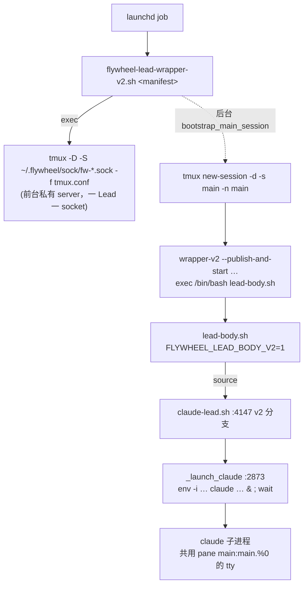

# FLY-1679 wrapper-v2 缺 dev-channels 自动确认 — 探索

Issue: FLY-1679 (https://linear.app/geoforge3d/issue/FLY-1679/wrapper-v2-缺-dev-channels-自动确认-lead-冷启动卡确认框直到人工按键该-lead-discord-下线)
日期: 2026-08-10
基于: 无

---

## 1. 症状复述

Lead 的 `claude` 以 `--dangerously-load-development-channels server:flywheel-inbox` 启动时，Claude Code 会渲染一个 TUI 确认框：

```
WARNING: Loading development channels …
❯ 1. I am using this for local development
  2. Exit
```

无人按键 ⇒ 永远停在框上 ⇒ 该 Lead 的 Discord / inbox 全下线，而 launchd 任务显示「在跑」（假健康）。

两次活体：
1. 2026-08-10 早（08:34 重启窗口）13/14 Lead 卡框 ≈3 小时
2. 2026-08-10 12:39 PT eng-lead 正规重生再次卡框 ~5 分钟

---

## 2. 审计结论：根因逐字定位（不是推测）

### 2.1 FLY-109 的自动确认 poller 仍然存在，但只挂在 v1 supervisor 路径上

`packages/teamlead/scripts/claude-lead.sh`：

| 位置 | 内容 |
|------|------|
| `:1460` | `_poll_dev_channels_dialog()` 函数定义（capture-pane 轮询 + `send-keys 1` + `send-keys Enter`） |
| `:4525` | **唯一**调用点：`if [ "$INBOX_MCP_ENABLED" = "true" ] && [ -n "${LEAD_WINDOW_ID:-}" ]; then _poll_dev_channels_dialog ... & fi` |

这个调用点位于 v1 supervisor 重启循环内部（`:4440` 之后），**在 v2 分支之后**。

### 2.2 v2 载体在到达那一行之前就 `exit` 了

`claude-lead.sh:4147`：

```bash
if [ "${FLYWHEEL_LEAD_BODY_V2:-0}" = "1" ]; then
  ...
  _launch_claude "${_v2_launch_args[@]}" || _v2_launch_rc=$?
  ...
  tmux kill-server 2>/dev/null || true
  exit "$_v2_exit"      # ← :4203，v2 一次性 body 在这里终结
fi
```

v2 分支自己完成「选 resume/fresh → 跑一个 claude 子进程 → 写 exit receipt → 关私有 server」，**从头到尾没有调用 `_poll_dev_channels_dialog`**，也永远走不到 `:4525`。

### 2.3 就算调用了也会被跳过：v2 从不设置 `LEAD_WINDOW_ID`

`:4525` 的守卫是 `[ -n "${LEAD_WINDOW_ID:-}" ]`。`LEAD_WINDOW_ID` 只在 v1 的 `_lead_create_tmux_window`（`:2386`）与 adoption（`:1682`）里赋值；v2 的 `_launch_claude` 分支（`:2873`）直接 `env -i … claude … &` + `wait`，**不建 tmux window**，`LEAD_WINDOW_ID` 保持 `:1237` 的初始空值。

所以这是一个**双重缺口**：调用点不在 v2 路径上，且 v2 也不满足调用点的前置条件。

### 2.4 现役舰队全在 v2 上

`flywheel-lead-wrapper-v2.sh` 是 FLY-1663 的 launchd-native 载体；14 个生产 Lead 都在它上面。因此**每一次冷启动/重启都必然复发**，与「今天两次活体」完全吻合。

---

## 3. v2 拓扑（决定 poller 该往哪打）



关键事实（逐条已核）：

| 事实 | 证据 |
|------|------|
| 会话/窗口/pane 名固定 | `wrapper-v2.sh:224` `new-session -d -s main -n main`；`tmux.conf` 的 pane-exited hook 硬编码 `#{hook_pane} = %0` |
| body shell **就是** pane 进程 | `lead-body.sh:5` 注释 + `wrapper-v2.sh:218` `exec` 链；活体验证 `main:main.%0 pid=82117 cmd=bash`，command 为 `lead-body.sh <manifest>` |
| claude 与 body 共用同一个 pane tty | `_launch_claude` v2 分支无重定向，`&` 后台但非交互 shell 不开 job control ⇒ 同前台进程组，能读 tty |
| body 手上有 tmux 身份 | `_launch_claude:2884-2886` 显式把 `TMUX` / `TMUX_PANE` 透传给 claude 子进程，证明 body 环境里两者存在 |
| 私有 socket 可从 `$TMUX` 推出 | tmux 约定 `TMUX=<socket_path>,<server_pid>,<session_id>` |

活体探测（只读）：

```
$ ls ~/.flywheel/sock/ | wc -l      → 14 个私有 socket
$ tmux -S fw-flywheel-claude-infr-*.sock list-panes -a
main:main.%0 pid=82117 cmd=bash
$ ps -p 82117 -o command=
/bin/bash …/packages/teamlead/scripts/lead-body.sh …/flywheel-claude-infra-bot-lead.json
```

---

## 4. 已有的「代偿层」证明这个洞是真的

`scripts/test-deploy.sh:1216` `confirm_dev_channels_prompt()` —— QA 槽自己写了一个**外部** poller，用的正是 v2 拓扑的目标：

```bash
pane=$(tmux -S "$socket" capture-pane -t '=main:main.%0' -p …)
if echo "$pane" | grep -qE "Loading development channels|am using this for local|development channels"; then
  tmux -S "$socket" send-keys -t '=main:main.%0' "1"; sleep 0.3
  tmux -S "$socket" send-keys -t '=main:main.%0' Enter
fi
```

并且有 `SKIP_DEV_CHANNELS_WORKAROUND=1` 开关（`:1218`）用于「不要外部代偿、依赖启动链自己确认」。

含义有两层：
1. QA 房**一直**在替生产打这一针，所以 QA 从没暴露过这个洞（生产没有这一针）。
2. `SKIP_DEV_CHANNELS_WORKAROUND=1` 正好是本单验收 #1 的现成杠杆：关掉外部代偿，冷启动仍然零人工按键才算修好。

> 注：该分支的日志文案 `"… relies on expect-dev-channels.exp"` 是 FLY-109 时代的遗留，现在依赖的是启动链内的 poller，不是 expect 脚本（expect 路径在 v2 下完全没接）。

---

## 5. 三条候选路线与取舍

| 路线 | 做法 | 判断 |
|------|------|------|
| **A. 把 v1 poller 直接复用到 v2** | 在 v2 分支里调用现有 `_poll_dev_channels_dialog "$LEAD_WINDOW_ID"` | ❌ 不成立。函数体内的存活闸 `_tmux_target_matches_archive_fast` 读 v1 的 `TMUX_ARCHIVE_FILE` 归档（v2 没有），且 `_tmux` 在 `FLYWHEEL_TMUX_SOCKET_OVERRIDE` 下会打**共享** socket；`LEAD_WINDOW_ID` 也是空的 |
| **B. 新增一个 v2 专用 poller 函数，v2 分支里起/收** | 同一套识别文本与按键序列，目标改为「本 pane / 本私有 socket」，存活闸改为「pane 还在不在」 | ✅ 采纳。v1 函数**逐字不动**（`supervisor-storm-regression.test.sh:311` 有断言依赖它含 `_tmux_target_matches_archive_fast`），v1 路径字节兼容 |
| **C. 把外部代偿搬进 wrapper-v2** | wrapper 在 bootstrap 后另起一个 poller 打私有 socket | ❌ 更差。wrapper 在 `exec tmux -D` 后就是 tmux server 本体，没有干净的后台位置；且 poller 的生命周期应该跟着 claude 子进程，body 才是它的宿主 |

**选 B。**

---

## 6. 需要在 research/plan 阶段落实的开放问题

1. **目标寻址**：用 `$TMUX_PANE` 还是硬编码 `=main:main.%0`？socket 用 `${TMUX%%,*}` 还是 `_tmux`？
   - 倾向：socket 从 `$TMUX` 推导并**显式** `-S`（绕开 `FLYWHEEL_TMUX_SOCKET_OVERRIDE` 这个 v1 概念误伤 v2）；pane 用 `${TMUX_PANE}`，缺失时退回 `%0`（wrapper 与 tmux.conf 双重保证）。
2. **起停时机**：v1 是 `_launch_claude` 返回后起（v1 的 launch 不阻塞）；v2 的 `_launch_claude` 内部 `wait` 会阻塞，所以必须**先起 poller 再 launch**，返回后 kill + reap。
3. **误按防护（验收 #3）**：识别正则是否原样搬 FLY-109 的三段式？第三段 `development channels` 是前一段的子串，语义上最松。要不要收紧，收紧算不算「发明」？
4. **超时预算**：沿用 `FLYWHEEL_DIALOG_TIMEOUT_SEC`（默认 90s，来自 `FLYWHEEL_EXPECT_DIALOG_TIMEOUT_SEC`）。
5. **flag**：founder 既有裁定「统一修复不加开关，回滚=revert」⇒ 不新增 env/flag。

---

## 7. 明确不做

- 不改 v1 `_poll_dev_channels_dialog`（保持 v1 路径字节兼容 + 保住既有断言）。
- 不新增任何 feature flag / env 开关。
- 不删 `scripts/test-deploy.sh` 的外部代偿（它幂等：生产 poller 先确认掉，QA 那一轮就 grep 不到框，只打一行 "No dev-channels prompt observed"）。保留它 = 保住 QA 房现有 30 个用例的稳定性，同时用 `SKIP_DEV_CHANNELS_WORKAROUND=1` 单独验证生产路径。
- 不碰 `expect-dev-channels.exp`（v2 完全没接它；删它属于另一单的死代码清理）。
