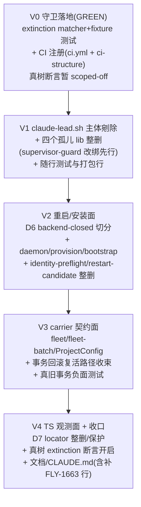

# FLY-1680 删除旧 Lead 启动链(v1 载体)— 实施计划

Issue: FLY-1680 (https://linear.app/geoforge3d/issue/FLY-1680/删除旧-lead-启动链v1-载体代码-1663-设计48h-后净删除条款的执行单)
日期: 2026-08-11(r4,QA-FAIL 修复方案见 §10;r4 折入 fresh Codex design review R1 全部 6 项)
基于: research.md;§10 基于 QA 判决 workflow_claims id=140(head 98e0e4b6)+ 本 design 节点独立复审

> 性质:**净删除,只减不加**。唯一允许的「加」:① carrier 状态契约的 fail-before-mutation 边界校验(§2a-T);② 仓库级 grep-zero 残留守卫测试 + 其 CI 注册(参照 FLY-1631 形态);③ **§10 QA-repair 追加例外**(r3):CI 路径存在性结构守卫 + `_log_startup` 3 行恢复——两者同为删除的收口件(Codex r3-R1#4)。

## 1. 目标与不变量

**目标**:v1 Claude Lead 启动链(wrapper v1 → 共享 tmux session supervisor → create-kill 建窗验收 → lease/adoption/pending-fence/generation-guard 全家)从仓库消失;「能被跑到」的路径(含**历史 fleet 事务回滚复活 v1** 的路径)归零。

**不变量(每个 commit 之后必须仍然成立)**:
1. 16 个生产 label 的启动与**重启**行为逐字节不变——本 PR 不要求任何生产 plist/manifest/projects.json 改动。
2. v2 活链(research §1)零触碰;**Codex bespoke 链零触碰,含其重启编舞**(R1#1:`lead_restart_validate_authority` 给两个 codex wrapper 判 `carrier=v1`,restart-services 的非-v2 分支就是 codex 的活重启路径——按 backend 切分,不按 carrier 标签切分)。
3. Runner 生命周期 / TmuxAdapter 零触碰。
4. 源码回滚 = `git revert` 单 PR + redeploy/converge(R1#7:revert 不自动恢复盘上已装字节);**运营级回退 v1 在灭绝后有意不可用**,除非走 reviewed runbook 恢复源码+安装件+desired config 三件套。
5. 每个 commit 独立全绿(§3 垂直切片保证)。

## 2. 决策定案

| # | 定案 |
|---|---|
| D1 | claude-lead.sh **原地剜除**(TRIM);删除清单按**实际调用图与可达性闸**生成,不按 research 的近似行号(R1#2) |
| D2 | carrier 状态契约见 §2a-T;`resolve_manifest_carrier` 缺省翻转 v2 只是其中一处,完整覆盖 reader/writer/classifier/CLI/staged 事务/rollback/recovery 全边界。**backend 权威只取 `projects.json` 的 project+lead 精确项并复用 `ProjectConfig` 校验**,manifest 的可选 `leadBackend` 永不用于 carrier/installer 判向(r4-R1 HIGH) |
| D3 | `codex-lead.sh` 保留 + 头注声明「launchd 无到达路径;QA/fleet 休眠能力」 |
| D4 | 盘上 `~/.flywheel/bin/flywheel-lead-wrapper.sh` 与 `.bak-*` plist = ship 窗运维清扫项(PR 描述 checklist,founder 知情);**排在约定回滚视界之后**,并附 reviewed 重装恢复步骤(R1#7) |
| D5 | `lead-body-sweep.sh` **TRIM 非整留**:保留主因是 **Codex 重启路径的 hard-clear/census 依赖**(R1#1/#3),Claude 共享 session census 与 Claude hard-clear 族随 v1 死;其 `lead_body_process_start_identity` 对 `tmux_supervisor_process_start_identity` 的委托**改绑**到保留的 lifecycle 原语并直接测试(R1#3) |
| D6 | restart-services **backend-closed 切分**(R1#1):删 Claude-v1 路径;Claude-v2 native-kickstart 臂保留;Codex bespoke bootout/quiescence/hard-clear/bootstrap 逐字节保留;重启测试覆盖 14 Claude-v2 + 2 具名 codex wrapper |
| D7 | TS 侧(R1#5):**保护** `lead-backends/codex/tui-window.ts` 及其直测(codex TUI 的共享 session 所有权在此,不在 LeadWindowLocator);Claude-v1 `LeadWindowRef`/locator 臂与 fleet locator/capture/Enter 的对象回退**整删**;`tmux-lookup.ts` 中 Runner/非-Lead 调用者仍用的字符串 helper 保留 |

### 2a. 消费者闭合矩阵(R1#3 定版;research §2 行号仅作寻位参考)

**DELETE(整文件)**:
`scripts/flywheel-lead-wrapper.sh`;`packages/teamlead/scripts/lib/tmux-supervisor-guard.sh`(`lead-body-sweep.sh` **与** `lead-rules-bundle.sh` 两个活消费者均改绑后才归零);`lib/lead-launch-authority.sh`;`lib/resume-recovery.sh`;`packages/teamlead/scripts/expect-dev-channels.exp`;`packages/teamlead/scripts/lib/lead-identity-preflight.sh`(Claude 部分删净后消费者归零,R1#3);`scripts/lib/restart-candidate.sh`(§11.1 原列、零生产调用,仅孤立测试引用,R1#3)。

**TRIM(保留文件,删 v1 区段/臂)**:
`claude-lead.sh`(v1 supervisor 循环、launch/pending/fence/adoption/generation-guard 族、v1 poller、`_wait_tmux_window` 族、`_launch_claude` 的 tmux new-window 臂、v1 manifest 写块、authority HOLD 段;**`_emit_launch_plan` 保留**——v2 dry-run 共享 seam,R1#2);`packages/teamlead/scripts/lead-rules-bundle.sh`(`tmux_supervisor_process_start_identity` 委托就地改绑为 `ps -p ... -o lstart=`,并钉生产定义存在性);`scripts/lib/lead-restart-lifecycle.sh`(删 Claude-v1 臂;v2/codex 臂保留——相对 §11「整文件删」的**已声明有界偏离**,因该文件如今承载 v2+codex 真实消费者,R1#3);`scripts/restart-services.sh`(按 D6);`scripts/lib/lead-body-sweep.sh`(按 D5);`scripts/flywheel-daemon.sh`(v1 安装/`lead_wrapper_path`/classify/`generate_plist_to` 默认与 case/`resolve_manifest_carrier` 缺省/missing-plist 探针/staged desired-carrier 读位;installer backend 判向改读 `projects.json`;bulk/explicit 语义见 §2a-T;提示语改指 canonical materializer);`scripts/provision-fleet-host.sh`(generic install 同一 backend 判向);`scripts/packaged/bootstrap-services.sh`;`scripts/flywheel-fleet.sh`(`--carrier v1`、WRAPPER_DST 默认、backup/restore 位);`scripts/flywheel-fleet-batch.sh`(request/write/restore,R1#4);`scripts/flywheel-cmux-sync.sh`(classify v1 臂→config-drift);`scripts/packaged/create-compat-mirror.sh` / `scripts/converge-flywheel-bin.sh` / `scripts/flywheel-cmux-autostart.sh` / `scripts/flywheel-bridge-wrapper.sh`(注释/清单级 wrapper 引用,归 V2 切片,R2#2);`scripts/package-onboard.sh` **及 `scripts/package-onboard-files.allow`** + 其 smoke/audit 测试(R1#3);`scripts/setup-new-project.sh`(首次 manifest 的操作步骤改为 materialize→daemon install);`packages/teamlead/src/ProjectConfig.ts`(`LeadCarrier` 类型与 validator 收敛,R1#4);`src/bridge/fleet-data.ts`;`src/LeadWindowLocator.ts` / `src/bridge/fleet-lead-locator.ts` / `src/bridge/tmux-lookup.ts`(按 D7);`src/account-heal/quota-*`(v1 共享 session 扫描臂);`src/LeadWatchdog.ts`(残留 v1 分支)。

**KEEP**:v2 家族全量(research §1)、`scripts/materialize-lead-manifests.sh`(**全新 Lead 首次 manifest 的唯一 canonical owner**)、`lead-backends/codex/tui-window.ts`(D7)、`codex-lead.sh`(D3)、lease TS 族 + lead-lease.db(follow-up 单)、cmux runner view/ledger(§13 既定后续单)。

### 2a-T. carrier 状态契约(R1#4,post-FLY-1680 全边界)

| 边界 | 契约 |
|---|---|
| 有效 Claude Lead,carrier 缺省 | = v2(唯一载体) |
| backend 判别权威 | 对 manifest 的 project+lead exact key 查 `projects.json`,复用 `ProjectConfig` 的 canonical backend/cross-field 校验;**禁止**读 manifest 可选的 `.leadBackend` 作判别 |
| Codex Lead,无 carrier | `projects.json.backend="codex-app-server"` → bespoke/none,不进 wrapper 选择;bulk `install --all` 在任何 plist/launchctl mutation 前 warning+skip;显式 `install <codex-lead>` 在 mutation 前 non-zero fail-loud |
| 显式 `carrier:"v1"`(config/CLI/staged 输入) | **在任何 mutation 之前 fail-loud**(报错指向 FLY-1680) |
| 观测到的遗留 v1(盘上 plist/安装件) | unknown/config-drift **证据**,绝不当 managed authority |
| 历史 fleet 事务 journal 含 v1 desired/preimage/wrapper 备份 | 可读作诊断;**restore/bootstrap v1 的写路径必须先 fail**;wrapper-backup 恢复路径相应移除或收束 |
| 全新 Lead 首次 manifest | clean HOME 的 `projects.json` → `materialize-lead-manifests.sh` 原子生成 → daemon install;body/wrapper 不自举静态 manifest |

负面测试用**真实旧 v1 事务 fixture**(不造干净 fixture 假绿),并加入真实 Mufasa 形态:manifest 无 `leadBackend` + `projects.json.backend="codex-app-server"`;断言 bulk skip / explicit fail 都发生在 bootout/plist 写之前。

## 3. 实施切分:单 PR,垂直切片(R1#6)

「每 commit 全绿」与「先 RED」的冲突解法:**RED 只作本地证据**(阳性对照跑给 QA 看、记录输出,不提交红仓库);每个 commit = 一个**依赖闭合的垂直切片**(被删文件 + 其全部 source/调用者 + 打包清单行 + 随行测试同 commit 移动)。

- **V0**:新增 `scripts/__tests__/fly1680-v1-extinction.test.sh` —— matcher 用**生成式清单**(全部被删 basename + **逐个精确函数名并带词边界,禁止裸前缀** + scoped carrier 选择子 + restore 路径),清单条目数与 §2a/research §5.2 冻结删除账逐项对齐。fixture 同时证明「能抓到已知 v1 引用」(阳性对照)与「不得命中仍活的 `tmux_generations_share_ambiguous_endpoint` / `tmux_server_generation` / `_GUARD_TMUX_GENERATION` / `runner_lead_pending_unhandled`」(阴性对照);真树断言由环境闸 scoped-off。**同 commit 注册进 `.github/workflows/ci.yml` 显式 suite 清单 + ci-structure/matrix 覆盖测试**(R1#6:shell job 是显式枚举,落文件≠会跑)。
- **V1**:改绑 D5(sweep 的 start-identity 原语)+ `lead-rules-bundle.sh` 的 start-identity 原语,分别加生产定义存在性断言 → 删 `tmux-supervisor-guard.sh`/`lead-launch-authority.sh`/`resume-recovery.sh`/`expect-dev-channels.exp` → claude-lead.sh 剜除(调用图驱动,`_emit_launch_plan` 保留)→ **同 commit 摘除 restart-services 对 supervisor-guard 的 source 行(≈1213-1215;更大的 backend 切分仍在 V2)**(R2#1)→ 同 commit 删随行测试 + package-onboard(+allow)对应行。
- **V2**:**整删 `scripts/flywheel-lead-wrapper.sh`(连同 daemon/provision/bootstrap/converge 等全部安装/清单消费者,R2#1)**+ D6 重启切分 + daemon/provision 的 projects-backed backend 判别 + clean-HOME materialize→install characterization + `lead-identity-preflight.sh`/`restart-candidate.sh` 整删 + 四个注释/清单级支撑文件清理(R2#2)+ 对应测试(含 14+2 重启覆盖)。
- **V3**:§2a-T 全边界落地 + fleet/fleet-batch/ProjectConfig 收敛 + 真旧 v1 事务 fixture 负面测试。
- **V4**:D7 TS 面 + quota/watchdog 残臂 + **开启真树 extinction 断言**(此时应 GREEN)+ cmux-sync classify 臂 + 文档归档、CLAUDE.md 里程碑(**先补上缺失的 FLY-1663 行,再加 FLY-1680 行**,R1#7)。

## 4. TDD 纪律

- V0 的 matcher fixture 测试 = 常绿守卫;真树断言的「先 RED」以本地运行记录留证(QA 可复核),不产生红 commit。
- 每个 TRIM 文件:先跑既有测试圈定行为,删后同套必须绿;删测只随删机器,不许为过绿弱化 v2 断言(vacuous green 红线)。
- **v2 装配 characterization 冻结**(R1#2):剜除 claude-lead.sh 前,冻结 standard/companion/external 三形态 v2 Lead 的 dry-run 输出,剜除后同套比对。**比对用规范化投影**(R2#3):易变字段(rules-bundle 生成路径、PID/generation token)固定或归一化;行为承载行(argv、role、model、effort、MCP、credential 状态)逐字节相等。
- D5 改绑与 D6 切分:先写 Codex 重启路径直测(两具名 wrapper 的 census/hard-clear/quiescence 行为锚点),再动源。
- **被测试 stub 的跨文件函数不算生产定义证据**:删除其 owner 前必须为每个仍活消费者加「生产文件自带定义/已明确改绑」断言(`_log_startup` 与 rules-bundle start-identity 同属此纪律)。
- 改验收判据的测试必须拿真数据跑一次:extinction matcher 阳性+阴性对照 + §2a-T 负面测试用真实旧事务/Mufasa fixture + clean-HOME materialize→install。

## 5. 全量门禁(FLY-224/248 教训:全仓,不是只改动文件)

每个垂直切片 commit:`pnpm lint` + `pnpm -r build` + `pnpm test:packages:run` + `scripts/__tests__/` 全套(含新守卫)+ CI Script Tests 结构断言。宿主既有环境例外按惯例如实标注,不伪报整门全绿。

## 6. 验收(可证伪)

| # | 验收项 | 证据形态 |
|---|---|---|
| A1 | grep 级灭绝 | extinction 守卫真树断言 GREEN(生成式清单:basename+精确 API+carrier 选择子+restore 路径;阳性/阴性对照均 GREEN)+ 人工 `rg` 四形态复核(basename/`./`/`../`/字符串拼接);白名单=`.git/`、`doc/**`、`docs/**`、`engineering/doc/**`、`product/doc/**`、CLAUDE.md、守卫自身 |
| A2 | QA 槽全流程冷启动彩排 | 529 房 slot Lead:launchd → wrapper-v2 → 私有 socket → REPL + Discord 往返全通;**独立 QA 节点**执行 |
| A3 | 批E1 批尾统一重启零异常 | 全舰换代 16/16 label supervisor tuple 回归(**含 2 codex bespoke 走保留编舞**)+ Bridge /health + 零 v1 路径日志 |
| A4 | 生产零配置改动 | PR 不含任何生产文件写;plist/projects.json diff = 0;D4 清扫单列于回滚视界后 |
| A5 | carrier 复活路径封死 | §2a-T 负面测试 GREEN(真旧事务 fixture:desired-v1 / v1-preimage / wrapper-backup 三型都 fail-before-mutation) |
| A6 | bespoke Codex 安装边界 | 真实 Mufasa 形态(manifest 无 `leadBackend`,projects backend=codex-app-server):bulk install skip、显式 install non-zero,bootout/plist 写计数均 0 |
| A7 | 首次 manifest ownership | clean HOME:projects.json → materialize → daemon install GREEN;直接 body/wrapper 不创建静态 manifest;setup/daemon 操作文案只指 canonical materializer |

## 7. 批次与前置(总计划 V6.5)

- **批E1**,与 FLY-1674 同批(同为批D 后大面积删除,冲突面错开)。
- 已核前置:FLY-1679(#801)✅、批D 1573(#798)/1574(#797)✅(本地 main 三个 merge commit 在)。
- **稳定性前置 = PENDING**(R1#7):repo 历史证明不了 48h 舰队稳定与无回滚。实施节点开工时记录:观察窗起止时戳(全舰切 v2 完成时刻 +48h ≥ 开工时刻)+ 无 carrier 回滚证据(fleet journal / restart 日志),写进 PR 描述。设计时点的「2026-08-12 起可动手」是日历下界,不是证据。

## 8. 风险与回滚

| 风险 | 化解 |
|---|---|
| Codex 重启路径误删(R1#1) | D6 backend-closed 切分 + 两具名 wrapper 直测 + A3 含 codex 观察 |
| 共享 seam 误删(R1#2) | `_emit_launch_plan` 列保留清单 + dry-run characterization 冻结比对 |
| 事务回滚复活 v1(R1#4) | §2a-T fail-before-mutation + 真旧事务负面测试(A5) |
| 中间 commit 不可绿(R1#6) | §3 垂直切片:文件+消费者+清单+测试同 commit |
| 测试删改藏 vacuous green | §4 纪律 + review 逐文件对照 §2a 矩阵 |
| 多形态引用漏网 | A1 四形态 sweep + 生成式清单双轨 |
| 源码回滚≠运营回滚(R1#7) | 不变量 4 的精确表述;D4 排回滚视界后并附重装 runbook |

## 9. 明确不做(继承 exploration §5)

lease TS 族退役(**另立 follow-up 单,建单动作列入本单 ship checklist**)、cmux runner view/ledger 机器、Runner 生命周期、codex Lead 形态(含其重启编舞)、git 历史、生产状态文件删除、任何新 watchdog/flag。

## 10. QA-FAIL 修复方案(r3 — design rework,2026-08-11)

**判决来源**:独立 QA verdict `workflow_claims id=140`(FAIL at head `98e0e4b6`,PR #806)+ Lead 接续令 `[lead-instruction 1cff9782-…]`。QA 确认两条 CI 阻断;本 design 节点独立复审又发现第三个缺陷(QA 与 Codex R1-R4 均未覆盖)。三个缺陷都在本机逐一复现后才写入本节(改验收判据必须拿真数据跑——已跑:fly1496 9 passed/2 failed、ci.yml 目标文件 MISSING、`_log_startup` 定义 grep 零命中)。

### 10.1 Fix-1:fly1496 §5 manifest 证据断言 → 正式退役 launch-evidence 工件(QA 选项 a)

**现象**:`scripts/__tests__/fly1496-qa-acceptance.test.sh` §5 断言「manifest 被 launch 重写为当前 raw+resolved 对」。删除后 launch 路径对 manifest 零写入,manifest 文件根本不再产生 → `FAIL - manifest evidence stale after relaunch`(本机复现含 jq no-such-file)。

**决策 = 选项 (a) 退役工件,不是选项 (b) 让 v2 补写**。证据:
1. `resolvedModel`/`resolvedEffort` 在 PR head 上**零生产读者**。同名生产命中只有 `workflow-menu-routes.ts` 的无关字段;受影响的测试读者是 `fly1496-qa-acceptance.test.sh`、`fly241-lead-model-override.test.sh` 与 `test-restart-services.sh` fixture,三套都必须随 ownership 合同反转/收束。
2. manifest `.model` 的读者只有 fleet 引擎的 reconcile-diff(`flywheel-fleet.sh:279/316/328/585/818/909` — classify_lead 的 desired-vs-observed 比对与事务 pre-image)。其写者是 fleet apply 事务本身;launch 写与不写,classify 的判向不变(手改 projects.json 后两种世界都显示 APPLICABLE 直到 apply 收敛;launch 本身已按 FLY-1496 行为半直接跟随 projects.json——该行为半由 §5 的 argv 断言继续钉住)。
3. FLY-1663 §3.3 的 v2 不变量就是 **body 对 manifest 零写入**(R2#4:全量重建/交错写是被点名击毙的机制)。选项 (b) 等于在净删除单里复活一条 body→manifest 写路径,与已批设计正面冲突。

**ownership 精确表述(Codex r3-R1#1/r4-R1 收紧)**:退役的只是 `resolvedModel`/`resolvedEffort` 这对 launch-evidence 工件;**raw `.model`/`.effort` 与首次静态 manifest 继续由控制面拥有**(`materialize-lead-manifests.sh` 是 clean-HOME/新 Lead 的 canonical 首次 writer;fleet apply/daemon 渲染消费既有 manifest,真实生产读者为 `flywheel-daemon.sh:285-326`、`fleet-data.ts:285-305`);**wrapper 仍原子 RMW `pid/socketPath`**(`flywheel-lead-wrapper-v2.sh:17-29,203-204`)——「零 manifest 写入」的量词只作用于 **claude-lead.sh body/dry-run seam**,绝不能据此动 wrapper 的 runtime RMW。`setup-new-project.sh` 与 daemon 错误提示必须把旧「先跑 claude-lead.sh」改成 materialize→install。

**测试改写合同(非 vacuous green)**:§5 保留 FIRST/SECOND argv 断言与 effort 移除断言(两次 `run_dry` 走真实 body seam);manifest 断言**反转为 body 合同**——fixture 预写一份 wrapper 形态的 manifest(含无关字段),两次 launch 后分别断言其**字节不变**(证明 body/dry-run 对 manifest 零写入,能抓住已删 v1 body-rewrite 的任何回归)。断言从「launch 写证据」变为「body 永不写 manifest」,钉住的是 1663 §3.3 的真实不变量。**随修复同步订正被推翻的文字合同**(Codex r3-R1#2):`flywheel-fleet.sh:893-895` 与 fly1496 测试头注仍称「every physical launch 写 manifest」——改为「manifest 是 fleet/materializer 的 applied/pre-image 工件,body launch 只读 projects.json 不改 manifest」,防后来者按旧注释复活 writer。
同文件已知宿主环境项:`dispatch canonicalization contract broken` 为本机 models.json Opus-1M binding 假红(QA 已核 CI Linux 不红),implement 不要追。

### 10.2 Fix-2:ci.yml 残留调用 + 两个守卫缺口

1. 删 `.github/workflows/ci.yml:355` 对已删文件 `claude-lead-resume-recovery.test.sh` 的调用(藏在无关的 FLY-1389 step 里,故 R1-R4 与 extinction 守卫都没抓到);同步订正 `:341-342` 过期注释("the resume-recovery window fix" 一句)。
2. **结构性守卫(灭类)**:`scripts/__tests__/ci-structure.test.sh` 新增断言——ci.yml 里每个 `bash <path>.sh` 调用的路径必须存在于树上。**解析边界(Codex r3-R1#3)**:复用该测试既有的 PyYAML/shlex 基础,遍历**全部** `jobs.*.steps[*].run`(不只 script-tests 组),忽略空行/注释,只解析 `bash` 后的静态 repo-relative `*.sh` 字面参数,相对 REPO_ROOT 校验 regular file;当前 workflow 无动态/绝对/仓库外此类调用,零现存 false positive。此断言让「删文件漏删 CI 注册」这一整类 bug 不可能再发生,精神上是净减(把人肉 sweep 换成机器断言)。
3. **matcher 缺口**:extinction matcher 的 `resume-recovery\.sh` 不匹配 `claude-lead-resume-recovery.test.sh`(中缀 `.test`)——把已删测试文件的 basename 补进生成式清单。

### 10.3 Fix-3(本节点独立发现):`_log_startup` 悬空 — FLY-1679 启动证据链失明

**现象**:删除把 `_log_startup()`(定义原在 v1 区段内,`ddd9fc83^:1318-1320`)连带删除,但存活的 v2 poller `_poll_dev_channels_dialog_v2` 仍调用它 **10 次**(`claude-lead.sh:1242-1321`);每处 `|| true` 把 127 静默吞掉 → 自动确认行为仍工作,但 `DEV_CHANNELS_*` 整条冷启动取证日志失明。residue:`FLYWHEEL_STARTUP_LOG`(:1194)与 logs mkdir(:1192)成为零读者残迹。fly1679 套件自己 stub 了该函数,结构上抓不到(42/42 假安心)。

**修复**:在 `:1194` 旁原样恢复 3 行 `_log_startup()`(取自 `ddd9fc83^`);`fly1679-dev-channels-v2.test.sh` 增加一条「生产文件必须自带 `_log_startup()` 定义」断言(套件继续 stub 行为层,定义存在性单独钉)。同一纪律覆盖 `lead-rules-bundle.sh` 对被删 supervisor-guard 函数的 stub 盲区:生产文件必须已改绑且测试显式钉住。

### 10.4 附带判定(不进修复 scope,按 issue scope#3 列出不静默连带)

- **buddy-captain live preview**:PR head 的 carrier FATAL 门会拦 `buddy-captain-preview.sh:168` 的真实 nohup 启动。实测:该路径本就是**默认关闭的显式 opt-in**(`FLYWHEEL_BUDDY_PREVIEW_LIVE=1`,因 pane-env argv 红线早已 deferred),dry-run 契约模式不受影响,`flywheel-buddy-captain.test.sh` 10/10 绿(P6 正断言默认不 spawn)。判定:接受现状;buddy live-preview 的后续单落地时必须改用 v2 载体形态。
- **TS 无害残迹**(独立审计清单,QA 已定 VERIFIED-GREEN 不 churn):`DEFAULT_TMUX_SESSION "flywheel"`(lead-alert-helpers.ts:32)及其 string-branch capture、`CaptureFn | string` 臂、`sendEnterToWindow` string 臂、quota-revive-scan 正则里的 `flywheel` 字面、truth.ts 的 `FLYWHEEL_TMUX_SESSION` 条目。全部随 **lease follow-up 单**一并处置,本单不动已 review 的面。

### 10.5 修复验证清单(implement 节点)

1. `fly1496-qa-acceptance.test.sh` 11/11(宿主 Opus-1M 项除外,如实标注)+ `fly241-lead-model-override.test.sh` + `test-restart-services.sh` ownership 相关用例全绿;2. `fly1679-dev-channels-v2.test.sh` 全绿含新定义断言,`fly1402-single-bundle.test.sh` 钉住 production start-identity 改绑;3. `ci-structure.test.sh` 新路径存在性断言绿 + 全 ci.yml `bash` 路径 resolve;4. extinction 守卫全绿 + matcher 阳性/阴性对照 + 清单计数重跑;5. daemon/provision 真实 Mufasa 负面 fixture + clean-HOME materialize→install 全绿;6. 全仓 `pnpm lint` + `pnpm -r build` + Script Tests;7. 修复后 head 交还 park 中的 QA runner(claim 140 会话)复验 + 补跑 deferred 的 A2 529 冷启动彩排。修复均在删除的收口面上,不新增运行机制、不触碰生产配置,A4(生产零 diff)不变。

### 10.6 fresh design review R1(r4)收口

- **HIGH `daemon-carrier-default-flip-clobbers-bespoke-codex`**:采纳。daemon/provision 不能从 manifest `.leadBackend` 判 backend;必须 exact lookup `projects.json` 并在任何 mutation 前执行 bulk-skip / explicit-fail。以生产 Mufasa 的「manifest 缺 leadBackend,projects backend=codex-app-server」形态作负面 fixture。
- **MEDIUM `supervisor-guard-delete-misses-rules-bundle-consumer`**:采纳。`lead-rules-bundle.sh` 补进 §2a/V1,与 sweep 一起在删 guard 前改绑并加 production-definition 断言。
- **MEDIUM `extinction-matcher-needs-negative-control`**:采纳。matcher 只允许逐个精确符号+词边界,补活标识符阴性对照与 inventory count,禁止靠缩窄前缀逃绿。
- **MEDIUM `manifest-bootstrap-ownership-transfer-unscoped`**:采纳。materializer 明定为首次 manifest owner,setup/daemon 文案和 clean-HOME 验收同步纳入。
- **LOW `resolvedmodel-reader-count-understated` / `a1-whitelist-omits-docs-and-product-doc`**:采纳。补全三套测试读者、验证清单与真实历史白名单。
