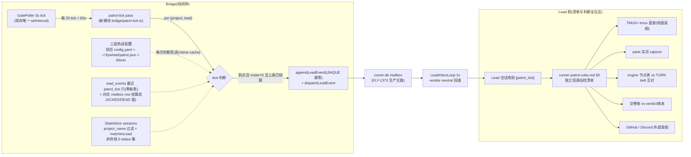

# FLY-1687 Bridge 派发式 Lead 巡检(patrol_tick) — 实施计划

Issue: FLY-1687 (https://linear.app/geoforge3d/issue/FLY-1687/机制-bridge-派发式-lead-巡检patrol-tick-纯闹钟名册声明清单与判断全在-lead-侧独立核founder)
日期: 2026-08-13
基于: research.md

版本:暂定 v1.58.0(ship 时取空号)。

---

## 0. 一句话

Bridge 在现有 GatePoller 60s 子节拍上做 per-(project, lead) 的 due 判断,到点、该 Lead 名下有非终结 runner、且上一条 tick 已在 mailbox 结算(ACKED/DEAD)时,经 lead_events + mailbox 主路注入一条**固定两句模板**的 `patrol_tick`(闹钟 + 名册待核声明,零预判零指令);频率三层配置全热读(项目 YAML > `~/.flywheel/patrol.json` > 默认 60min),改配置下一次 due 判断即生效,零重启;「收到 tick 做什么」全部写在 Lead 侧 `runner-patrol-rules.md` 的独立信源清单里。

## 1. 硬约束(全部来自 founder 裁定,设计不可违)

1. **Bridge = 纯闹钟**:不做预检、不给「该查什么」、tick 内容严格限于闹钟 + 名册声明(名册是待核声明非结论);
2. **默认 60min**(2026-08-12 评论,覆盖正文 30min);
3. **频率动态可调,热生效零重启**(参照 models.json 热读);
4. 零 runner = 零 tick;新 Lead 零配置自动获得;
5. 不加新 flag(机制无 on/off 门,数值参数合规);零新 timer(FLY-1570 纪律);
6. Lead 侧清单以**独立信源**为准,不采信 Bridge 单方账本。

## 2. 架构



要点:tick 到 Lead 手里只有「时间到了 + Bridge 账上的名册」;每一条清单动作的信源都不依赖 tick 本身正确。

## 3. 变更清单(按包)

### 3.1 `packages/config` — 频率配置(三层全热)

**新文件 `src/patrol-config.ts`**(并加入 `src/index.ts` 公共导出,Codex R1-3):
- `DEFAULT_PATROL_INTERVAL_MINUTES = 60`、`MIN_PATROL_INTERVAL_MINUTES = 10`(floor)、`MAX_PATROL_INTERVAL_MINUTES = 1440`(cap);
- `readGlobalPatrolConfig()`:热读 `~/.flywheel/patrol.json`(`{"interval_minutes": <n>}`),**完全复刻 `model-config.ts:120-149` 的 snapshot cache**(cache key = path:dev:ino:mtimeMs:size;文件缺失/损坏 → **失败 snapshot 也按 key 缓存**,只在 key 变化时重解析/重告警——不刷屏,Codex R1-6);路径覆盖 env `FLYWHEEL_PATROL_CONFIG` 仅供测试注入(bracket-access 读法,同 `FLYWHEEL_MODELS_CONFIG`;若 `feature-flags-drift` 抓到,按 `truth.ts:243` 先例加 `tuning knob` 理由行——它不是 flag);
- 数值校验:interval 必须是 **positive finite number**(YAML/JSON 可表达 Infinity/NaN,显式拒;Codex R1-6);floor/cap clamp 的 warn **绑定到 snapshot**(同一坏值多轮只 warn 一次,snapshot key 变了才重新 warn),不在每次消费时告警;
- `effectivePatrolIntervalMs(projectPatrol, globalPatrol)`:项目值 > 全局值 > 默认,统一 floor/cap;纯函数,不做 IO 不打日志(日志归 snapshot 层)。

**`src/types.ts`**:`FlywheelConfig` 加 `patrol?: PatrolConfig`(`{ interval_minutes?: number }`),注释含 FLY-1687 与「absent = 全局默认」语义。

**`src/ConfigLoader.ts::validate`**:`patrol` 块校验——非对象/非 positive-finite number throw(与既有风格一致);floor/cap 在**消费端** snapshot 层统一 warn+clamp(不在 loader throw,保 boot 连续性)。

### 3.2 `packages/teamlead` — Bridge 侧闹钟

**新文件 `src/bridge/patrol-tick.ts`**(核心逻辑,全部纯函数 + 注入依赖,便于 TDD):
- `runLeadPatrolPass(deps)`:**pass 级 in-flight guard 单飞**(与 `runReconcilePatrolPass` 同级;GatePoller rider 是 fire-and-forget,慢 pass 会与下一子节拍并发——Codex R1-2),遍历 (project, lead):
  1. **热读项目配置**:每 project 每轮取**一份原子 snapshot**(该 project 全部 Lead 共用,Codex R1-6):`<projectRoot>/.flywheel/config.yaml` 的 `patrol` 块,mtime cache(**安全红线照抄 `founder-milestone-config-source.ts:1-12` 头注释**:projectRoot 一律取 `ProjectEntry.projectRoot` mainline checkout,绝非 session worktree;malformed → 失败 snapshot 缓存、按缺省,单项目坏配置不拖垮整轮);
  2. **名册**:`store.getPatrolRosterSessions(projectName)`(新只读查询,status ∈ `running, ship_parked, awaiting_review, approved_to_ship, pending, design_done`——`StateStore.ts:6061` 保护集同款,SQL 已含 `project_name = ?`)→ `matchesLead(s, lead.agentId, projects)` 过滤(throw → warn+排除,同 `lead-scope.ts:66`);
  3. **roster.length === 0 → 跳过**(零 runner 零 tick);
  4. **due 判断 —— settlement 合同以 canonical mailbox row 为准**(Codex R1-1/R1-5,弃用 `delivered_at`——它在 adapter receipt 时就回写、早于 batch ACK,既楔死又封不住)。settlement lookup 显式三态建模(Codex R2-1):
     - 查上一条 tick:`store.getLatestPatrolTickEvent(leadId, sessionKey)`,**`session_key` 等值匹配**(`patrol:<project>:<lead>`),不用 LIKE(`_` 通配会跨项目串账,Codex R1-5);无行 → due(genesis);
     - 有行 → 按 `delivery_id = lead_event:<leadId>:<eventId>` 查该 project comm.db,结果三态:
       - **`absent_identity`**(identity 完全不存在 = append→enqueue 崩溃窗口)→ 从 durable journal row 重建 envelope 后**幂等重投**(恢复,不铸新 tick,本轮结束);
       - **`live(state)`**:**QUEUED / LEASED** → 未结算 → 跳过(结构性封顶:每 Lead 至多一条在途 tick;不补发积欠——巡检幂等,漏一轮无损);**ACKED** → 已结算,cadence 锚 = `acked_at`;**DEAD** → 已结算(巡检不被死信永久压住;死信告警归 FLY-1573 既有面),锚 = `dead_at`;
       - **`archived_terminal`**(终态 row 过 72h retention 被 `archiveDueFamilies` 归档:live row 已删、`mailbox_identity`/`mailbox_log` 仍在,`getById` 缺、`enqueue` 只回 `{outcome:"archived"}` 不重建——`mailbox-queue.ts:2144-2183/:2333-2372/:408-435`。**绝不能并进 missing**,否则「零 runner >72h 后 runner 重现」或「Bridge 停机 >72h」会把巡检永久楔死在 missing→重投→archived 死循环)→ 从 archived `row_json` 还原 ACK/DEAD 终态与时间(或等价 typed settlement API)→ 按已结算继续 due 判断;
     - due ⇔ `now - parseSqliteUtcMs(锚) >= effectiveIntervalMs`(SQLite UTC 文本一律走既有 `parseSqliteUtcMs`,不裸 `new Date()`;锚取结算时刻而非 `created_at`,积压 3h 后刚 ACK 不会 1 分钟内又来一条);
  5. **注入 —— envelope 一律从 durable journal row 重建**(Codex R2-2):`eventId = patrol_tick:<project>:<lead>:after-<prevSeq|genesis>`(**链式确定性 id**:两个并发 pass 读到同一 prevSeq 生成同一 id;prevSeq 单调递增保证 id 终身不重复)→ `store.appendLeadEvent(...)`(UNIQUE 冲突时返回既有 seq,不标示是否新插入——`StateStore.ts:10719-10726`)→ **append 后必须读回 durable `lead_events` row,经既有 `leadEventEnvelopeFromJournalRow()`(`legacy-lead-event-reconciler.ts:17-38`,本就声明用于 byte-stable append→crash→retry)重建 envelope 再 dispatch**——loser 若用自己内存里的 envelope(不同 `generated_at`/roster/timestamp)会撞 `MailboxQueue.enqueue` 的 immutable projection hash(`mailbox-queue.ts:347-400/:420-427`)抛 identity conflict;journal 重建让 initial dispatch 与 missing-row recovery 走同一条 byte-stable 路径,UNIQUE + journal 才构成完整幂等,pass guard 只是第一道减载;
  6. **typed payload**(Codex R1-3:`LeadEventEnvelope.event` 必须是 `HookPayload`,`event_type`/`execution_id`/`issue_id` 必填,`sessionKey` 必填 string——`lead-runtime.ts:53-61`):`{ event_type: "patrol_tick", execution_id: "patrol:<project>:<lead>"(稳定合成值), issue_id: "", project_name, roster: [{identifier, sessionRole, status, executionId8}], generated_at }`;`sessionKey = "patrol:<project>:<lead>"`(同时就是 §步骤4 的账本作用域键);
  7. 每个 (project, lead) 独立 try/catch,单点失败不拖垮整轮(GatePoller rider 纪律)。

**`src/bridge/gate-poller.ts`**:新增可选 config 回调 `onLeadPatrolTick`,在现有 20-tick 子节拍位调用(与 `onHealthTick` 同构,`:1013`);不新增 timer、不改 3s 主节拍;并发防护在 pass 内部 guard(见上)。

**`src/bridge/plugin.ts`**:装配——构造 pass 依赖(store / registry / projects / per-project mailbox 查询与重投入口)传入 GatePoller config。若 FLY-1082 kind-contract 校验面(`plugin.ts:4090`)覆盖 lead_events event_type,登记 `patrol_tick`(owner: eng, 姿态: informational);实现时现场核实(research §8.2)。

**`src/StateStore.ts`**:两个新只读查询,零 schema 迁移:
- `getPatrolRosterSessions(projectName)`:上述 6-status + project 过滤;
- `getLatestPatrolTickEvent(leadId, sessionKey)`:`SELECT ... FROM lead_events WHERE lead_id=? AND event_type='patrol_tick' AND session_key=? ORDER BY seq DESC LIMIT 1`(全等值,无 LIKE;表小;若 EXPLAIN 需要,补幂等 CREATE INDEX IF NOT EXISTS)。

**渲染 —— 共享 `formatPatrolTick`,Mailbox 与 CommDB 两个 runtime 分支共同调用 + parity 测试**(Codex R1-3):新增 `patrol_tick` 分支,输出**固定模板**(唯一动态部分是名册本身)。**名册字段输入契约**(Codex R2-3:`session_role`/`issue_identifier` 是无 CHECK 的 TEXT,`runs-route.ts:1218-1225` 也收任意 string——换行/控制字符/模板分隔符能把 `- identifier (role, status)` 撑出模板外):status 只取查询闭集(6-status);identifier/role 过共享 **bounded single-line canonicalizer**(剥 CR/LF/控制字符、长度上限、未知值无歧义转义),恶意 roster fixture(含换行+指令词)进测试,断言输出仍只有既定两句 + 规范化名册行:

```
[patrol_tick] 巡检时间到。
按 Bridge 的账,你名下有 N 个未终结 runner(此名册是待核声明,不是结论):
- FLY-XXXX (implement, running)
- FLY-YYYY (qa, awaiting_review)
```

**负面约束是模板的一部分**:不含任何「该查什么/哪个可疑/建议动作」。「收到 tick 做什么」由 Lead 侧 rules 文件回答(见 3.3)——这是 founder 裁定下唯一合规的知识放置点。

**「严格两句」的边界声明(Codex R1-4,验收口径必须先说清)**:生产 mailbox 主路会给**所有** Lead 向消息统一加 FLY-1573 canonical batch 框架(`[mailbox-batch <id> | N messages | ...]` 头 + batch ACK 指令),且 patrol row 可能与其他业务消息合批。founder 裁定约束的是 **patrol_tick 本体内容**(Bridge 不给巡检预判/指令),不是运输层协议(ACK 指令是「怎么收任何信」,对每条消息一视同仁,不是「该巡什么」)。据此:
- 阴性对照的判定对象 = batch 中抽出的 **patrol_tick body**,逐字节等于固定模板;
- 合批进来的其他消息是其他消息,不计入 tick 内容;
- 本边界作为 tradeoff 在 founder design HTML 里明示,founder 可否决(若否决,则需在 mailbox 主路内设计隔离投递形态,scope 升级,另行裁定)。

### 3.3 `packages/teamlead/lead-rules-base/runner-patrol-rules.md` — Lead 侧独立清单(扩展,不新建文件)

选扩展不新建的依据:该文件已在 dept 分支双路径接线(`claude-lead.sh:2273` + `lead-rules-bundle.sh:365`),companion/external/cos 不加载，故 patrol pass 显式排除 `canSpawnRunners:false`;新建文件需四处接线且 resolver parity 单向、漏接不红(现存漂移先例 default-enable-policy)。

**新增「§0 patrol_tick — scheduled independent patrol (FLY-1687)」**(置于现有 §1 之前),内容要点:
- `[patrol_tick]` 是 Bridge 的**纯闹钟**:它只知道「时间到了」和「Bridge 自己账上有谁」。名册是**待核账本,不是事实**——巡检存在的意义就是兜 Bridge 的底,所以巡检的每一步都必须用 Bridge 之外的信源;
- 独立信源清单(每条注明信源,源自 2026-08-10 实战):
  1. **名册核对**:tick 声明列表 vs `TMUX= tmux list-windows -a` 直查(地面真相)。窗名前缀即 Linear identifier(FLY-272),直接可对;**多了少了都是 finding**。正常存在的非 runner 窗(`zsh` 脚手架窗、`cmux-*` 镜像 session、Codex Lead TUI 窗)不算;Claude Lead 本体在私有 socket 上,共享 server 看不到,不要当成缺失;
  2. **每个 runner 的 pane 实况**:`capture-pane` 读它到底在干什么——活跃 ≠ 进展(轮询等棒?卡菜单?报错循环?);
  3. **交接账交叉**:engine 节点表 vs TURN belt 互对(断链形状);
  4. **交卷账交叉**:runner 自报交付(报告/PR)vs verdict claim / 账本落账;
  5. **外部真相**:PR head/draft/state 用 `gh pr view` 问 GitHub,thread/归档问 Discord 本体——**不采信内部账本转述**;
  6. **处置**:能修的按既定应急程序手修+留证;系统性的立 follow-up 单。巡检结论(含「全部正常」)按现行汇报纪律对上可见;
- `runner_terminal_list` 保留为起点工具之一,但明确它仍是系统内部视角,与 `TMUX= tmux` 直查互为交叉,不能单采;
- 更新现 §1 的「When」:tick = 定时主触发;既有 natural cadence(inbox 批次后 + 任务边界)保留为事件驱动补充;Lead 自身仍然不建任何 timer(定时器在 Bridge 侧,FLY-1687);
- 过渡注记落幕:本节落地即取代「会话 cron」人肉过渡(运维口头约定,仓库内本无成文)。

**既有锚点全部保留**(fly369 guard test 锁定:runner_terminal_list / parked-alive / FLY-271 / FLY-368 / discipline-not-guarantee / /api/chat-threads/send / FLY-576 / 生命周期事件名等)。

### 3.4 测试(TDD,先红后绿)

| 面 | 用例 |
|---|---|
| `patrol-config`(config 包) | 默认 60;全局文件热读(改 mtime → 新值,不重启进程);项目覆盖优先;malformed/Infinity/NaN → 缺省+**同一 snapshot 只 warn 一次**、原子替换后恢复并可再 warn;floor 10min 抬升 / cap 24h 压回(warn 绑 snapshot);缺文件不刷屏;读取来源永远是 `ProjectEntry.projectRoot` 而非 session worktree |
| `patrol-tick` pass(teamlead) | 首 tick due(genesis);interval 未到不发;**改 interval 后下一次判断即用新值(热调核心用例)**;零 roster 零注入;**settlement 三态矩阵**:live QUEUED/LEASED 跳过、ACKED 按 `acked_at` 锚恢复 cadence、DEAD 按 `dead_at` 锚不楔死、**absent_identity → journal 重建幂等重投不铸新 tick**(append→enqueue 崩溃窗口)、**archived_terminal:ACKED/DEAD→过 retention 归档→runner 重现 → 从 row_json 还原终态、正常铸下一条链式 tick**(绝不落 missing 死循环);**并发单飞 + journal 幂等**:第一个 pass 悬住时触发第二个子节拍 → 仅一次 append/enqueue;**绕过单飞的对抗测试**:同 prevSeq、不同 now/roster 的两个 producer → durable winner 两次经真实 MailboxQueue enqueue 不抛 projection conflict;单 (project,lead) 抛错不拖垮整轮且连续 3 次进入既有 severe 告警面、恢复后 re-arm 但同 Lead 30min 冷却;`canSpawnRunners:false` 显式零 tick，其 fallback session 不能静默丢失而须按 30min bucket severe 告警，无 patrol-capable Lead 时归 fleet;时间解析走 `parseSqliteUtcMs`(非 UTC 本地时区下用例) |
| roster 口径 | 6-status 集精确(design_done/pending 在内,terminal 全排除);project_name 过滤(双项目同 lead id 陷阱,`StateStore.ts:6709`);**下划线项目名对照**(`foo_bar` 不串账——session_key 等值,无 LIKE);matchesLead throw → 排除不炸 |
| 渲染 | `formatPatrolTick` → **patrol body** 逐字节等于固定模板;Mailbox/CommDB 两 runtime 分支 **parity 测试**;每行带 identifier + executionId8 以便 tmux 对账，保持完整 roster 以满足独立核名册合同;**阴性对照进测试**:body 不含预判/指令词表(check/verify/建议/怀疑/该查 等 deny-list;判定对象=body,不含 FLY-1573 batch 框架,边界见 3.2);**恶意 roster fixture**:identifier/role 带 CR/LF/控制字符/指令词 → canonicalizer 后输出仍只有两句+单行名册 |
| GatePoller 接线 | 20-tick 子节拍触发 onLeadPatrolTick;不影响既有 rider 节拍(既有 poller 测试全绿) |
| rules 契约 | 扩展 `fly369-patrol-rule.test.ts`:既有锚点不动 + 新增 patrol_tick 节锚点(`patrol_tick` / `TMUX= tmux` / 待核声明措辞 / gh pr view / TURN belt / 独立信源) |
| 全仓门 | `pnpm lint` + `pnpm -r build` + `pnpm test:packages:run`(FLY-224/248 教训:全仓不只改动文件) |

### 3.5 实现时现场核实清单(research §8 收敛 + Codex R1)

1. `formatEnvelope` 与 `hook-payload.ts` 共享 renderer 的精确接缝 → `formatPatrolTick` 抽成共享函数,两 runtime 分支调用;
2. kind-contract 是否覆盖 lead_events event_type 面 → 命中则登记;
3. `fly369-patrol-rule.test.ts` 全量锚点(审计只读了前 60 行)→ 扩展前先全读;
4. lead_events 查询计划(EXPLAIN)→ 补 `(lead_id,event_type,session_key,seq)` 复合索引，避免 temp ORDER BY b-tree;
5. mailbox settlement 三态查询口:pass 需要 per-project 的 typed settlement API(`absent_identity | live(state) | archived_terminal`,archived 从 `mailbox_identity`/`mailbox_log` 的 `row_json` 还原终态与时间)+ journal 重建的幂等 re-enqueue 入口(经 lead-inbox-runtime 暴露或复用现有 queue API),确认不破坏 FLY-1573 lease/batch 不变量;另核对 CommDB open-purge(`db.ts:780-825`)与 `archiveDueFamilies` retention(72h)的边界时序;
6. `FLYWHEEL_PATROL_CONFIG` 是否被 drift 守卫抓到 → 抓到则加 allowlist 理由行;
7. 合成 `execution_id`/`sessionKey`(`patrol:<project>:<lead>`)在下游(admission/kind-contract/渲染)无副作用 → 逐面核实;
8. append→enqueue 的 crash/restart 矩阵逐格测:append 后 enqueue 前、adapter receipt 后、audit mirror 后、batch ACK 前后(Codex R1-1);
9. **(Codex R3 终审注记,实现约束)** settlement 三态 reader 做成 `flywheel-comm`/`MailboxQueue`(或经 `LeadInboxRuntime` 封装 seam)拥有的**只读 typed API**,绝不在 `patrol-tick.ts` 里发裸 mailbox-schema SQL——现有公开 `getById()` 单独分不出 absent vs archived、也拿不到终态时间;
10. **(Codex R3 终审注记,实现约束)** canonicalizer 对文法外值 **fail-closed**(替换为带明显转义的有界 token,不是只删 CR/LF);恶意指令词 fixture 与全 body deny-list 放同一测试里,同时证明单行结构安全 + founder 无指令不变量。

## 4. 明确不做(honest boundary)

- Bridge 侧任何预检/健康判断/指令(founder 裁定,阴性对照直接写进渲染测试);
- 关键节点自动 thread 留痕(同族子项,founder「不用马上修」;本设计不堵死它——它将来走同一 dispatchLeadEvent/thread 面,与 tick 无耦合);
- Lead 巡检结果自动落账/自动处置/机器评分;
- runner 侧改动(FLY-1614 已覆盖当事人视角);
- mailbox/投递机制本身的改动(纯消费现有主路);
- on/off 开关(机制无条件启用,靠零 runner 自然静默;想要事实停用 = 把 interval 调大,这是 tuning 不是 flag)。

## 5. 部署与验收

### 5.1 部署形态

纯 Bridge 侧代码 + config 包 + rules 文件。**merge + Bridge 重启**生效(正常批次车);Lead 侧 rules bundle 在 Lead 启动时物化——**存量在跑的 Lead 要到下次重启才带新清单节**,期间收到 tick 也可理解执行(模板自含名册;现有巡检纪律已在其 bundle 里)。如实标注,不算阻塞。

### 5.2 真机验收(issue 5 条 + 评论追加,QA 节点执行)

1. 有 runner 的 Lead 按配置间隔收到 tick;零 runner 的 Lead 全天零 tick;
2. tick 内容阴性对照:**从真机 batch 中抽出 patrol_tick body**,严格「闹钟+名册声明」逐字节对模板,无任何预判/指令(渲染测试 + 真机抓消息双证;FLY-1573 batch 框架属运输层,不计入,边界见 3.2 及 founder HTML tradeoff);
3. 一处配置全舰生效:改 `~/.flywheel/patrol.json` → 全部 dept Lead 下一周期生效;
4. 新建 Lead(QA 槽)零配置自动获得;
5. **阳性对照**:账里故意多记一个死 runner(测试库插一条非终结 session)→ Lead 按清单核名册发现「账上有、地面无」;
6. **热调验收(评论追加)**:改 interval(如 60→10min)→ 下一个 tick 即按新频率,全程零 Bridge/Lead 重启;改回亦然。

### 5.3 风险与对策

| 风险 | 对策 |
|---|---|
| tick 在 Lead 信箱堆积(Lead 卡死) | 「上条未结算(QUEUED/LEASED)则跳过」结构性封顶为 1 条在途;结算判据=mailbox ACK,不是 adapter receipt(Codex R1-1);Lead 卡死本身由 LeadWatchdog 面负责,不归本单 |
| append→enqueue 崩溃窗口楔死巡检 | `absent_identity` → journal 重建幂等重投(恢复合同,crash 矩阵进测试) |
| >72h retention 归档误判成 missing 楔死巡检 | settlement 三态显式建模,`archived_terminal` 从 row_json 还原终态继续 cadence(Codex R2-1,专项测试) |
| 并发 producer 撞 projection hash conflict | envelope 一律从 durable journal row 重建(`leadEventEnvelopeFromJournalRow`),UNIQUE+journal 构成完整幂等(Codex R2-2,绕过单飞的对抗测试) |
| 脏 roster 字段撑破固定正文 | bounded single-line canonicalizer + 恶意 fixture 测试(Codex R2-3) |
| 死信永久压住巡检 | DEAD = 已结算,按 `dead_at` 锚继续 cadence(有界重试,死信告警归 FLY-1573 既有面) |
| Bridge 重启丢节奏 | lead_events 即账本,重启后 due 判断连续;不会 boot 风暴(每 Lead 至多 1 条,且要过 interval) |
| 巡检变刷屏负担 | 默认 60min + floor 10min;founder 可随时热调大 |
| Lead 拿名册当结论(机制被误用) | 模板自带「待核声明,不是结论」;清单每条注明独立信源;guard test 锁措辞 |
| 双项目同 lead id 串名册 | SQL 层 project_name 过滤(3.2-2),测试覆盖 |
