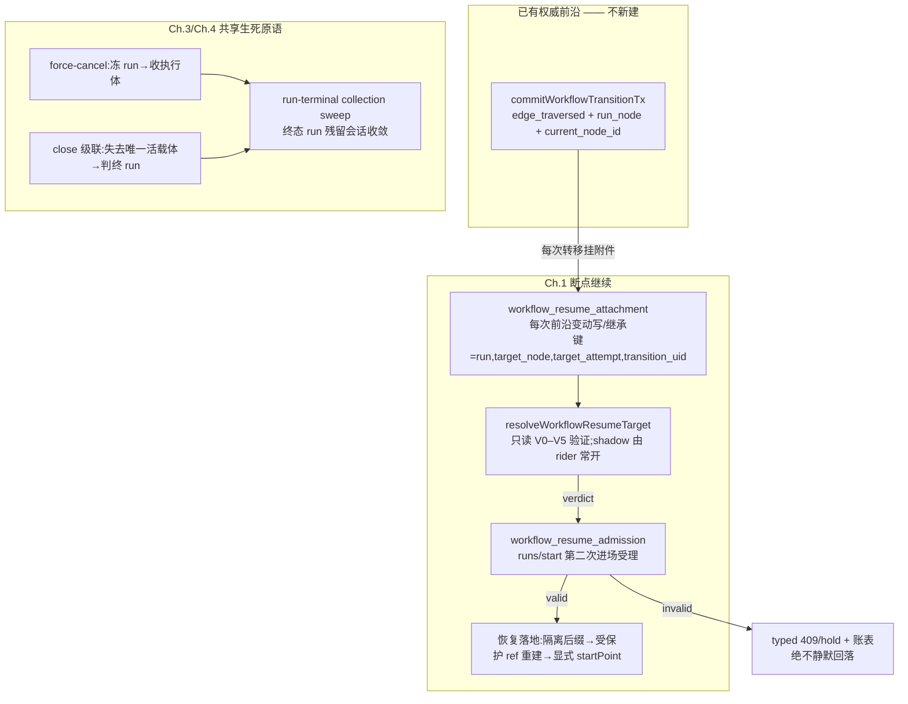

# FLY-1707 DAG 断点继续与恢复 epic — 实施计划

Issue: FLY-1707 (https://linear.app/geoforge3d/issue/FLY-1707/epic-重跑与恢复dag-断点继续fly-1699-prd-已定稿-建设)
日期: 2026-08-15
基于: research.md

---

## 0. 决策记录(全部已裁,不再开口)

| # | 决策 | 依据 |
|---|---|---|
| D1 | 形状 = 恢复当前那一步;不做逐节点缓存 | Annie 锁定①(PRD §4.1) |
| D2 | 半成品 = 隔离归档后从该节点重跑,不算「代码变了」 | Annie 锁定②(PRD V1 细则) |
| D3 | 生命周期 = 路 A:续同一 run + 独立 resume admission | Tadashi 裁定(ask 01f77c53),路 B 留后续单 |
| D4 | 降级 = typed 409/hold + 显式 supersede 入口;绝不静默回落模板头 | Tadashi 裁定 |
| D5 | 每次 hold/409 落 log + 可查账;typed reason 归一化短码(避开 500 字上限门) | Tadashi 硬要求①② |
| D6 | 与 FLY-1770/#845、FLY-1772/#846 辖区对账写入本 plan §9;dispatcher 接线切片排在两单合入后 rebase | Tadashi 硬要求③ |
| D7 | Ch.4 级联终态写 `terminated` + typed reason,**不写 `completed`**(偏离 FLY-1711 原文「done→completed 类终态」);级联只从 `active` 出发,**run 已 `held` 时级联让路不覆写**(held = 人类终态,FLY-1770 合同) | `completed` 全部现有写入者都是「引擎走完 DAG」语义;FLY-1655 terminal-land 不变量 + FLY-1770 completed 前置(linear_done disposition)都压在它上面。伪造 completed 会让 FLY-1709 类「账面完成」误判。done/abandon 的区分保留在 reason 里;held 的显式判终仍走既有 operator terminate API,不由级联代劳 |
| D8 | rollout = 恰好一个注册 opt-in flag(`workflow_resume`)只控 enforcement;shadow 完全在 rider 侧、不碰请求路径 | PRD K7(爆炸半径=所有 DAG start)与 FLY-1466「不加新 flag」精神的最小交集;flag 走 FLY-709 registry 正门 |
| D9 | v1 resume admission 只接 `run.status='active'`;held/terminated → typed 409 带 hint(rework / terminate+fresh) | crash 场景(8-11)run 留在 active;held 各族已有自己的恢复/终结路径(1668/1770/pane-loss),resume 不做万能解卡工具。**loop-limit escalate 的 held 缺继续把手 → Ch.2 §3.5 补 `loop_limit_escalated` rework 形态(FLY-1775 活证据)** |
| D10 | Ch.2 主路径 = 重派认领(fresh replacement),不放开 `completed → running` | E5 定稿 + PRD §4.9/§4.10;dispatch 机制归 FLY-1772,Ch.2 只做 doctrine + 残余死角 + e2e 实证 |

---

## 1. 总览:一份凭据 + 一套生死原语



四章共享两个底座:**恢复凭据挂在已有权威目标元组上**(不造第二份前沿);**run 的生与死都有原子入口 + 收敛 sweep**(1416 关得掉、1711 死得透、残留会话不再锁死 runs/start)。

---

## 2. Ch.1 断点继续(FLY-1707 核心)

### 2.1 数据模型(新表清单 = 8 张,诚实计数;0 个既有表列改动;**本节 DDL 是规范文本,与后文冲突以本节为准**)

| 表 | 形态 | 作用 |
|---|---|---|
| T1 `workflow_resume_attachment` | append-only + 触发器 | 恢复凭据本体(目标元组绑定) |
| T2 `workflow_resume_attachment_state` | CAS 生命周期(land_operation 姿态) | ref prepare / store push / envelope+runtime stamp 的 durable 状态机(§2.2) |
| T3 `workflow_resume_admission` | append-only(SQL CHECK 承载 action union) | 第二次进场受理行 |
| T4 `workflow_resume_response` | append-only | admission 的 byte-identical 响应重放(不能复用 `workflow_start_response`,它 FK 在 start_reservation 上) |
| T5 `workflow_resume_probe` | 有界账表(带 opportunity key) | shadow/admission 可查账(D5) |
| T6 `workflow_operator_close_intent` | 带 stage 的 CAS 表 | Ch.4 运维意图(§5) |
| T7 `workflow_run_collect_receipt` | CAS 生命周期 + collector lease | Ch.3 收执行体的 durable 收据(§4) |
| T7b `workflow_run_collect_alias` | append-only | (run, client key) → 每 episode 唯一收据的不可变映射(§4) |

**T1 `workflow_resume_attachment`(append-only,house style 同 workflow_node_completion)**

```sql
CREATE TABLE IF NOT EXISTS workflow_resume_attachment (
  attachment_id TEXT PRIMARY KEY,            -- uuid
  run_id TEXT NOT NULL,
  target_node_id TEXT NOT NULL,
  target_attempt INTEGER NOT NULL CHECK (target_attempt > 0),
  transition_uid TEXT NOT NULL,              -- 目标权威 receipt 的 event_uid(W2=edge_traversed;其余 W 类见 §2.2 合成 uid)
  receipt_kind TEXT NOT NULL CHECK (receipt_kind IN
    ('start_reservation','edge_traversed','writer_replacement','rework_replacement',
     'operator_rework','route_revision','admission_frontier','resume_replacement')),
  receipt_digest TEXT NOT NULL,              -- 对应 receipt 的 canonical 投影 digest(V0 同时验身份与内容,防可变账行被改写)
  carrier_kind TEXT NOT NULL CHECK (carrier_kind IN ('git_checkpoint','state_only_checkpoint')),
  anchor_ref TEXT,                           -- git_checkpoint: refs/flywheel/checkpoints/<run_id>/<attachment_id>
  anchor_commit TEXT CHECK (anchor_commit IS NULL OR length(anchor_commit) = 40),
  repo_identity TEXT,                        -- target_repo_path + probe_repo_slug(同 pr_binding 姿态)
  snapshot_digest TEXT NOT NULL,             -- V3:绑 run 自己的 pinned snapshot
  resolved_node_digest TEXT NOT NULL,        -- V3:目标节点的 resolved digest(agent 内容 + dispatch pin)
  runtime_semantics_digest TEXT,             -- V3:versioned 语义投影 digest({vendor,model,effort,capabilities digest}),
                                             --   排除 execution 身份/时间戳;插入时 runtime 行未必存在 → NULL,
                                             --   由 T2.runtime_semantics_stamped 补(有效值 = COALESCE 两处,§2.3)
  rework_authority_digest TEXT NOT NULL DEFAULT 'none',  -- V3:适用 rework authority context digest,无则 'none'
  envelope_json TEXT NOT NULL,               -- V2 输入信封 DB 内来源(S1/S2);S3 在 T2 stamp
  schema_version INTEGER NOT NULL DEFAULT 1,
  created_at TEXT NOT NULL,
  UNIQUE (run_id, target_node_id, target_attempt, transition_uid),
  CHECK ((carrier_kind = 'state_only_checkpoint' AND anchor_ref IS NULL AND anchor_commit IS NULL AND repo_identity IS NULL)
      OR (carrier_kind = 'git_checkpoint' AND anchor_ref IS NOT NULL AND repo_identity IS NOT NULL
          AND (anchor_commit IS NOT NULL OR receipt_kind = 'start_reservation')))
  -- R8-4:NULL anchor_commit 只许 W1(start_reservation)pending 形;其余 git 附件建行即须有 anchor。
  -- 有效 anchor = COALESCE(T1.anchor_commit, T2.resolved_anchor_commit);两列皆 NULL 的 ready 附件 parse fail-closed
);
-- no_update/no_delete 触发器;生命周期与异步补全全部在 T2,主表纯 append-only。
-- 亲子关系:W10 子附件的唯一 parent 关系 = T3.source_attachment_id/result_attachment_id(不另设 FK 列)。
```

**目标权威 receipt 的统一形态(Codex R4-2)**:每条 W 路径在同一事务里**必然**追加一条不可变 `workflow_run_event`(event_uid = transition_uid,kind = receipt_kind 对应的事件类),receipt_digest = 该事件 payload 的 canonical digest。W2 直接复用既有 `edge_traversed` 事件;其余 W 类各追加自己的事件(见 §2.2 表)。**不把 `workflow_rework_request` / `workflow_rework_route_revision` 等无 no-update 触发器的表行当「不可变 receipt」** —— receipt 一律落在 run-event 上(append-only、event_uid UNIQUE),表行只作辅助引用。V0 验证 = receipt 存在(身份)+ digest 相符(内容)。

**T2 `workflow_resume_attachment_state`(可变 CAS,承载 §2.2 状态机)**

```sql
CREATE TABLE IF NOT EXISTS workflow_resume_attachment_state (
  attachment_id TEXT PRIMARY KEY REFERENCES workflow_resume_attachment(attachment_id),
  state TEXT NOT NULL CHECK (state IN ('intent','ref_prepared','store_pushed','ready','invalid')),
  resolved_anchor_commit TEXT CHECK (resolved_anchor_commit IS NULL OR length(resolved_anchor_commit) = 40),
                                             -- W1-pending 形专用:launch 侧 continuity 定出 startPoint 后一次性 stamp;
                                             -- stamp helper 拒绝非-W1 附件(R8-4;schema 负测:W2/W3 NULL anchor 建行被 CHECK 拒)
  store_locator TEXT,                        -- 耐久载体定位:checkpoint store 路径 + ref + generation(§2.2)
  envelope_stamped_json TEXT,                -- S3(issue 正文)异步来源的一次性 stamp
  runtime_semantics_stamped TEXT,            -- runtime 语义投影:对应 execution 的 admission 事务同步 stamp
  invalid_reason TEXT,                       -- 归一化短码
  attempt_count INTEGER NOT NULL DEFAULT 0,
  next_attempt_at TEXT,
  revision INTEGER NOT NULL DEFAULT 0,       -- R12-3:每次 T2 变更单调 +1;reconciler 失效必须带 expectedRevision
  updated_at TEXT NOT NULL,
  CHECK ((state = 'invalid') = (invalid_reason IS NOT NULL))   -- R10-1:真约束非注释;非 invalid 态不得带 reason
);
-- schema 负测(SQLite 实跑,非 grep):invalid+NULL reason 拒 / 非 invalid 带 reason 拒;
-- resolver 对 NULL/未注册 legacy reason fail-closed
```

- **ready 的统一定义(两种 carrier 一致,Codex R4-3)**:`ready` ⇔ 该 carrier 所需全部异步件齐备 —— git_checkpoint 需 有效 anchor + ref_prepared + store_pushed + S3 stamp(+ 若 T1.runtime_semantics_digest 为 NULL 则需 runtime stamp);state_only_checkpoint 需 S3 stamp(无 git 步骤,从 `intent` 直接推 `ready`)。**不存在「state_only 写入即 ready」**。
- **terminal invalid 的唯一入口(R8-1;R10-6 判别式输入)**:专用事务 helper `invalidateResumeAttachmentTx({attachmentId, runId, nodeId, attempt, authority, reason})`,`authority` 为判别式 union —— `launch_delivery{executionId, activationId, ownerGeneration, deliveryAttempt}`(可执行目标,launch 围栏核验)/ `gate_target{holderRef, sourceReceipt}`(state-only/gate,无 execution)/ `attachment_reconciler{expectedState, expectedAttemptCount, expectedNextAttemptAt, expectedRevision}`(R12-3:`(state, attempt_count, next_attempt_at)` 三元组挡不住「部分 stamp 不改这三值」的进度 —— stale 耗尽者快照 `intent`、launch 侧 stamp 了 W1 anchor 仍是 `intent`,三元组照样匹配会毁掉有用进度;T2.revision 每次变更单调 +1,失效 CAS 必须命中 expectedRevision + 事务内 readiness 复查)(状态机重试耗尽、pre-launch 附件失败;**非 durable 权威,R11-3:只许从 `intent/ref_prepared/store_pushed` 三个 retryable 态、且预算已耗尽时,按 attachment + 当前 V0 target/receipt + 期望 T2 态/attempt_count/next_attempt 的精确 CAS 失效 —— 绝不许打 `ready`**,防 stale 第五次重试在别人 stamp 成功之后赢单)。**`ready` → `invalid` 只保留给当前 launch_delivery 或 gate_target 权威**。TS 编译期穷举 + 跨型负测(gate 进 launch 形被拒,反之亦然)+ 交错测试:旧重试在他人 commit ready 之后才耗尽 → ready 存活;**每种部分 stamp(W1 anchor / store locator / S3 / runtime)之后的 stale 失效 → revision 失配拒**(R12-3)。launch/gate 形 CAS **任意非-invalid 态(含 `ready`)→ `invalid`** 并存 reason;全部 stamp/推进 CAS 一律**拒绝 invalid 起点**(invalid 是吸收态,rider 竞态不能把它复活成 ready)。resolver 次序:state=`invalid` → 返回存储的 `invalid_reason`;`intent/ref_prepared/store_pushed` → `anchor_pending`(retryable 只留给这三态)。专测:fallback 与 rider stamp 从 T2 每个状态起竞态,结果**永不为 ready 或 anchor_pending**。
- 指纹 JSON:canonical 编码复用 `canonicalSubmissionDigest` 家族(排序、拒重复 key),大小上限 32KB,超限 → 写 non-recoverable receipt(run event `resume_target_unrecoverable` + T5),**判失效不截断吞错**;两种 carrier 都不满足的目标同此 —— 「没写附件」永远是显式账,不是沉默。

**T3 `workflow_resume_admission`(append-only)+ T4 `workflow_resume_response`**

```sql
CREATE TABLE IF NOT EXISTS workflow_resume_admission (
  admission_key TEXT PRIMARY KEY,            -- 调用方 idempotencyKey(必填,无自动合成)
  admission_digest TEXT NOT NULL,            -- digest(runId, requestedEntry, sourceAttachmentId, targetTuple, actionKind)
  run_id TEXT NOT NULL,
  action_kind TEXT NOT NULL CHECK (action_kind IN ('redispatch_execution','reconcile_state_only')),
  source_attachment_id TEXT NOT NULL REFERENCES workflow_resume_attachment(attachment_id),
  result_attachment_id TEXT REFERENCES workflow_resume_attachment(attachment_id),
  target_node_id TEXT NOT NULL,
  target_attempt INTEGER NOT NULL,
  new_attempt INTEGER,
  new_execution_id TEXT UNIQUE,
  redrive_generation INTEGER,                -- reconcile_state_only:发给 gate/carrier tick 的 redrive 代号
  frozen_s3_body TEXT,                       -- R10-2:redispatch 必填 —— frozen_replay 要重放的**逐字 S3 正文**
                                             --   (基线/marker 只存 digest,重建不出字节;admission 后、launch 前
                                             --    crash + Linear 被改 = 没这列就无法交付冻结输入)。上限 256KB,
                                             --    超限 → 该目标 non-recoverable(绝不改抓新字节);digest 必须
                                             --    == 基线 bodyDigest(写入时验证);W10 链下游引用本行,不复制
  requested_entry TEXT,
  verdict TEXT NOT NULL,
  created_at TEXT NOT NULL,
  CHECK ((action_kind = 'redispatch_execution' AND result_attachment_id IS NOT NULL
          AND new_attempt IS NOT NULL AND new_execution_id IS NOT NULL AND redrive_generation IS NULL
          AND frozen_s3_body IS NOT NULL AND length(CAST(frozen_s3_body AS BLOB)) <= 262144)
      OR (action_kind = 'reconcile_state_only' AND result_attachment_id IS NULL
          AND new_attempt IS NULL AND new_execution_id IS NULL AND redrive_generation IS NOT NULL
          AND frozen_s3_body IS NULL))
  -- R11-1:body 属于 action union;负测(SQLite 实跑):redispatch NULL body 拒 / state-only 带 body 拒 /
  --        多字节超 256KB(按 BLOB 字节数)拒;digest == 基线在写事务内校验,超限走 frozen_input_too_large
);
-- no_update/no_delete;一个 run 可多行(多次 crash 多次 resume)。
-- T4 workflow_resume_response(admission_key PK, response_json, created_at):append-only;
-- 写入前置证据按 action 判别(Codex R3-3):
--   redispatch_execution → launch delivery 证据(同 recordWorkflowStartResponse :19033-19081 合同);
--   reconcile_state_only → 存在对应 redrive ack 事件(event_uid = resume_redrive_ack:<admission_key>,
--     由 gate materialize tick / carrier delivery 机器消费 redrive 请求后 CAS 追加)。
```

**T5 `workflow_resume_probe`(可查账,Tadashi 硬要求①;有界保留;带公平游标)**

```sql
CREATE TABLE IF NOT EXISTS workflow_resume_probe (
  id INTEGER PRIMARY KEY AUTOINCREMENT,
  run_id TEXT NOT NULL,
  probe_kind TEXT NOT NULL CHECK (probe_kind IN ('shadow','admission')),
  opportunity_key TEXT,                      -- shadow:attachmentId + ':' + T2.state(唯一投影,无 generation 分量;R8-5)
  proposed_node_id TEXT, proposed_attempt INTEGER,
  verdict TEXT NOT NULL,                     -- 成功字面量 'proposed'(shadow 命中,detail 带 proposed target)或 §2.3 canonical 失败短码(R8-5)
  detail_json TEXT,
  created_at TEXT NOT NULL
);
CREATE UNIQUE INDEX IF NOT EXISTS idx_resume_probe_opportunity
  ON workflow_resume_probe(probe_kind, opportunity_key) WHERE opportunity_key IS NOT NULL;
-- 保留策略:每 run 保最近 20 行 + 全表 90 天,由现有 GatePoller rider 顺带修剪(零新 timer)。
-- T5 只装 resume 探针(R5-8):Ch.3/Ch.4 的 intent 过期、级联拒绝、sweep 诊断一律走 typed 不可变
-- workflow_run_event(close_intent_expired / cascade_refused / residue_sweep_note),不塞进本表。
```

**T4 `workflow_resume_response`(append-only)**

```sql
CREATE TABLE IF NOT EXISTS workflow_resume_response (
  admission_key TEXT PRIMARY KEY REFERENCES workflow_resume_admission(admission_key),
  response_json TEXT NOT NULL,
  created_at TEXT NOT NULL
);
-- no_update/no_delete 触发器;写入前置证据按 action 判别(见 T3 段注释)
```

**T6 `workflow_operator_close_intent`(CAS stage)**

```sql
CREATE TABLE IF NOT EXISTS workflow_operator_close_intent (
  execution_id TEXT PRIMARY KEY,
  mode TEXT NOT NULL CHECK (mode IN ('done','abandon')),
  reason TEXT NOT NULL,
  stage TEXT NOT NULL CHECK (stage IN ('prepared','committed','failed')),
  created_at TEXT NOT NULL,
  updated_at TEXT NOT NULL
);
```

**T7 `workflow_run_collect_receipt`(CAS 生命周期 + collector lease)+ T7b alias**

```sql
CREATE TABLE IF NOT EXISTS workflow_run_collect_receipt (
  receipt_key TEXT PRIMARY KEY,              -- episode:<runId>:<n>
  run_id TEXT NOT NULL,
  state TEXT NOT NULL CHECK (state IN ('frozen','collecting','collected','responded')),
  owner_id TEXT, owner_generation INTEGER, lease_expires_at TEXT,
  target_list_json TEXT NOT NULL,            -- 冻结有序活会话清单(事务内查询)
  outcomes_json TEXT NOT NULL DEFAULT '[]',
  response_json TEXT,                        -- responded 前 NULL
  updated_at TEXT NOT NULL,
  UNIQUE (run_id, receipt_key),              -- R6-1:给 T7b 复合 FK 当父键
  CHECK ((state = 'responded') = (response_json IS NOT NULL)),
  -- R6-1:lease 状态机入 schema —— frozen 无 claim;claim 态必须整组且 generation 正数
  CHECK ((state = 'frozen' AND owner_id IS NULL AND owner_generation IS NULL AND lease_expires_at IS NULL)
      OR (state IN ('collecting','collected','responded')
          AND owner_id IS NOT NULL AND owner_generation > 0 AND lease_expires_at IS NOT NULL))
);
CREATE UNIQUE INDEX IF NOT EXISTS idx_collect_one_open
  ON workflow_run_collect_receipt(run_id) WHERE state != 'responded';

CREATE TABLE IF NOT EXISTS workflow_run_collect_alias (
  run_id TEXT NOT NULL,
  client_request_id TEXT NOT NULL,
  receipt_key TEXT NOT NULL,
  request_digest TEXT NOT NULL,              -- digest(principal, action, collectExecutions, 冻结清单 digest)
  created_at TEXT NOT NULL,
  PRIMARY KEY (run_id, client_request_id),   -- R5-7:raw client key 全局 PK 会跨 run 撞车
  FOREIGN KEY (run_id, receipt_key)          -- R6-1:复合 FK,别名不可指向他 run 的收据
    REFERENCES workflow_run_collect_receipt(run_id, receipt_key)
);
-- 两表:alias append-only(no_update/no_delete);receipt 仅经 claim CAS 推进。
-- 负向 schema 测试:跨 run alias 插入被拒 / 半组 claim 被拒 / responded 缺 response_json 被拒(R6-1,PRAGMA foreign_keys=ON 下实跑)
```

**建表归属(每表恰建一次,R5-8)**:S1 建 T1–T5;S6 建 T7/T7b;S7 建 T6。

### 2.2 附件写入点与跨存储状态机(每一种前沿/writer 变动,漏一种就分叉 —— K5)

**单一收口原则(Codex R1-2)**:所有会改动「权威目标元组或其 writer」的写路径,一律经过一个事务内 helper `commitAuthoritativeTargetChangeTx`,它做三件事之一都不可省:co-write 精确附件 + 追加目标权威 receipt 事件,或写 explicit non-recoverable receipt —— 没有第三态。实施第一步是**全量盘点** `current_node_id` / 目标预留 / preferred actor / launch owner 的每个生产写入点(下表为已审计清单,盘点脚本作守卫测试防新增漏网):

**宿主事务与证据事务的失败边界(R17-1)**:上述「没有第三态」是**提交后的存在性不变量**,不是「resume 证据写失败就把宿主业务事务一起回滚」。W1–W8 每个常开写面都必须经过同一个**非抛出、全或无的 evidence savepoint boundary**:attachment/receipt 整组精确写或精确重放成功才 RELEASE;预置 uid/projection 冲突、附件投影冲突或 non-recoverable receipt 本身冲突时先 `ROLLBACK TO`(禁止提交「有 T1 无 T2」的半附件),宿主 mutation 再按原有结果提交,该目标只标记 non-recoverable/写入独立诊断(诊断再失败也不反向抛出)。任何存量 T1-without-T2 也是 terminal non-recoverable,绝不是 `anchor_pending`。该规则显式覆盖 W1 `materializeWorkflowRun` / W2 `commitWorkflowTransitionTx` / W3 `rollbackDeadWorkflowNodeExecution` / W4 `materializeWorkflowReworkReplacement` / W5 `openOperatorRework` / W7 `appendWorkflowReworkRouteRevision` / W8 `admitGeneralizedWorkflowExecution`,以及 baseline/prepared/delivery 三个 launch 面;**flag OFF 时任一 resume-evidence 域冲突都不得改变原 run/node/launch/rework 结果**。W10 `admitWorkflowResume` 不在该豁免内:它的 admission + child attachment + T3 本就是产品事务,必须全或无,证据冲突回滚整个 admission 并返回 canonical typed refusal。只有宿主 StateStore 操作本身不健康才保留原失败。

| 写入点 | 位置(research §2/§4) | receipt_kind / uid | 动作 |
|---|---|---|---|
| W1 初始起点 | `materializeWorkflowRun` | `start_reservation` / `resume_origin:<runId>` | 需要工作区的可执行根 → `git_checkpoint`,anchor_commit NULL(W1-pending 形,materialize 无 startPoint 输入 `StateStore.ts:18448-18496`),launch 侧 continuity 定出 startPoint 后 stamp T2.resolved_anchor_commit;**不把可执行根谎标 state_only**。真 state_only 只给不需要工作区的根 |
| W2 普通转移 | `commitWorkflowTransitionTx` 三目标分支(gate `:30831`/rework `:30914`/normal `:30930`)之后、`current_node_id` UPDATE 之前 | `edge_traversed` / transitionUid(既有) | 同事务写新目标附件。**QA fail loop 出的 implement#2 写自己的新附件,绝不继承 implement#1**(A9 铁案) |
| W3 dead-exec replacement | `rollbackDeadWorkflowNodeExecution` | `writer_replacement` / `writer_replacement:<digest(run,node,attempt,newExec)>` | 前沿不变、writer 换代:写继承附件(anchor 不变,同 W10 的引用语义)+ 换代 receipt 事件 |
| W4 rework replacement | `materializeWorkflowReworkReplacement`(含 pane-loss 分支 `:22121-22128`) | `rework_replacement` / `rework_replacement:<requestId>` | 新附件,anchor = `request.base_revision` |
| W5 operator rework | `openOperatorRework` | `operator_rework` / `operator_rework:<runId>:<clientRequestId>` | 同 W4 |
| W6 gate opening | W2 的 gate 分支覆盖 | (随 W2) | gate 目标附件 = `state_only_checkpoint`,起始 `intent`,rider stamp S3 后 `ready`(A10 可恢复前沿;gate 无 launch,S3 只能靠 rider) |
| W7 rework 路由改版 | `appendWorkflowReworkRouteRevision`(`:23525-23552`;founder-feedback 在 transition 后调它 `:32134-32156`) | `route_revision` / `route_revision:<revisionId>` | **同事务**写新目标附件(R1 抓出的分叉点:W2 的初步目标附件被本步第二次前沿移动作废,由 W7 新附件接管) |
| W8 generalized admission | `admitGeneralizedWorkflowExecution`(可改 `current_node_id`,`:24073-24079`) | `admission_frontier` / 复用既有 `execution_admitted` 事件身份 | 改前沿则 co-write + receipt;不改则断言附件与现值一致(分叉探测器)。**本事务同时 stamp T2.runtime_semantics_stamped**(runtime 行在此事务 INSERT,R3-2/R4-2) |
| W9 ledger batch | `applyWorkflowLedgerBatch` | (无 receipt —— **guard-only**,Codex R5-5) | 源码合同实核:显式点名 run(唯一能指到 engine-owned run 的路径)只允许 side_effect 操作(`StateStore.ts:34493-34503`);动前沿的 dispatch/wake/complete 分支只服务 `engine_owned=0` 兼容 shadow ledger;finalize 是 projection-only 且源码注释明禁发明 finalize run-event(`:34475-34478`)。⇒ W9 = **守卫断言**:engine-owned 显式 batch 恒为 side-effect-only;该合同一旦放宽,盘点守卫必须变红、届时再补真 receipt 映射。不给兼容 shadow run 挂附件 |
| W10 resume admission 自身 | `admitWorkflowResume`(§2.5) | `resume_replacement` / `resume_replacement:<admissionKey>` | admission 事务 co-write **子附件**,绑 new_attempt + 新 writer;T3.result_attachment_id 指向它。**子附件语义(R3-1 方案 a)**:anchor/store 直接引用已验证 source 附件的同一 immutable ref + store_locator(纯 SQLite,不新建 ref),T2 行原子 `ready`;parent 关系唯一落在 T3 的 source/result 对上。测试:连续 2/3 次 crash+resume 每轮全链过 V0,每次 co-write 后注入 response 丢失重放 |

**变异测试合同(R4-2 三分)**:①注释掉任一 W 点的附件 co-write → V0 分叉探测器红;②注释掉 receipt 事件 → V0 `receipt_missing` 红;③篡改 receipt payload(重放不同内容)→ digest 比对红。三类分别可辨。

**git anchor 的 durable 状态机(R1-3:forward reconciler;R3-4:create-only store CAS)**:
transition tx 是同步 SQLite 事务,不能在事务内跑 git。T2 承载:

```
intent ──(有效 anchor 就位:T1.anchor_commit 或 T2.resolved_anchor_commit 已 stamp)
      ──(prepare:git update-ref refs/flywheel/checkpoints/<run>/<attId> <anchor> 0{40},
          create-only CAS 同 workflow-docs-git.ts:177;object 不在本地 → 定向 fetch 重试一次)──▶ ref_prepared
ref_prepared ──(store push:git push --force-with-lease=<ref>:(空=期望不存在) <store> <anchor>:<ref>;
          被拒 → fetch 比对:同值=adopted(幂等),异值=conflict → invalid+审计)──▶ store_pushed
store_pushed ──(异步件补齐:S3 stamp = 搬运 run 级不可变 `issue_baseline` 事件,R6-3;
          T1.runtime_semantics_digest 为 NULL 时需 runtime stamp)──▶ ready
state_only 目标:intent ──(同上 S3 stamp)──▶ ready(无 git 步骤)
任一步骤耗尽重试(5 次,1m/2m/4m/8m 同族 backoff)──▶ invalid + 归一化 reason + T5 账
```

- **执行者**:fresh dispatch 的 launch 前置、rework wake 路径、GatePoller rider(兜底:gate/state_only 目标、crash 孤儿 intent)三者都能推进,CAS on T2.state 单写者。
- **载体丢失唯一裁定规则(R3-4/R4-4,本段为准)**:任何 ready 附件在恢复/验证时本地 ref 缺失,**一律先从 checkpoint store adopt**(`git fetch <store> <ref>` + 重建本地 ref);仅当**两个载体都取不回**才判 `anchor_unreachable`。不存在「本地丢即 terminal」的路径。状态机 `intent/ref_prepared/store_pushed` → `anchor_pending`(retryable,A13 的可恢复性靠它);`invalid` → 返回存储的 `invalid_reason`(吸收态,见 §2.1;两套写法以 §2.1 为准,R9-3)。
- **耐久载体**:checkpoint store = `~/.flywheel/checkpoint-store/<project>.git`(bare,Bridge 初始化,0700);T2.store_locator 记路径+ref+generation。不 push 引擎 ref 到 origin。A4 升级:**未 push 提交 + 删除整个原仓(非共享 object database 的第二 worktree)→ 仍能恢复**。crash/竞态:push 先于 DB / DB 先于 push / already-same / already-different / fast-forward 覆写被拒 / 仅本地丢 / 仅 store 丢 / 双丢。
- **引用感知保留(R4-4/R5-6:live 根定义,历史行永真的字面引用不算)**:按**物理 ref** 分组其全部引用附件,ref 为 live ⇔ 存在至少一个 **live 根附件**:①所在 run 非终态,或 ②非-invalid 且在 90 天保留窗内(invalid 优先于 recency:invalid 附件不算 live 根)。T3 lineage **只从 live 根出发**跟(append-only 的 T3 历史链自身不构成 liveness —— 否则 W10 一跑 ref 永生,R5-6 点名)。非 live ref 由 rider 以 expected-old CAS 删除(本地 + store 一致)。专测:终态 run 的 W10 链超 90 天 → 回收;同 ref 存在 active/近期子附件 → 保活;completed run / superseded 附件 / 清理与 admission 竞态。
- response 丢失重放:admission 侧由 T4 承载(§2.6);附件侧无 response 概念。

anchor_commit 的来源 = 该转移已有的 head 权威(completion 的 `completionSubjectDigest` / claims 的 `subject_digest` / rework 的 `base_revision` / W1 的 continuity startPoint),**不新增任何探测**;来源为空(genericNoCodeExit 等)且节点需要工作区 → 写 non-recoverable receipt。

### 2.3 V0–V5 验证合同(resolver 的逐条实现)

`resolveWorkflowResumeTarget(store, {runId, requestedEntry?, envelopeObservation, env})` —— 只读、无副作用、每步产出归一化短码。**`envelopeObservation` 是调用方(admission 路径 / shadow rider)在调用前异步取好的新鲜外部观测**(S3 = 当前 Linear issue 正文 digest;取不到 = `{unavailable: true}`),resolver 自己不做网络 I/O;DB 内来源(S1/S2)在事务内现读(R4-3)。

有效值定义:`effectiveAnchor = COALESCE(T1.anchor_commit, T2.resolved_anchor_commit)`;`effectiveRuntimeSemantics = COALESCE(T1.runtime_semantics_digest, T2.runtime_semantics_stamped)`。

| 条 | 实现 | fail-closed 短码 |
|---|---|---|
| V0 目标元组 + typed receipt | 读 `current_node_id` + 该节点 max(attempt) 行;按附件 receipt_kind 验对应不可变 run-event receipt(§2.1):**身份存在 + payload digest == T1.receipt_digest** 双验;admission 写事务内重读比对 | `target_moved` / `receipt_missing` / `receipt_digest_mismatch` / `attachment_frontier_divergence` |
| V1 锚点可达 | T2.state 必须 `ready`;`git rev-parse --verify <anchor_ref>^{commit}` == effectiveAnchor;本地缺失先 store adopt(§2.2 唯一裁定规则)再判;repo_identity 校验;**只 rev-parse 不 git status**(`deriveTargetPrHead` 防 RCE 姿态 + `GIT_SAFE_CONFIG`) | 双载体皆失 → `anchor_unreachable`;`intent/ref_prepared/store_pushed` → `anchor_pending`(retryable);`invalid` → 存储的 `invalid_reason`(R9-3) |
| V2 输入信封 | 具名来源 `[{source, version, digest}]`:S1 rework 反馈与 route revision(DB 单调 seq,事务内现读)、S2 founder 追加指令集合(DB 行集 digest,事务内现读)、S3 issue 正文 —— **run 级不可变基线 + per-writer 投递收据两件套(R6-3 + R7-1)**:
①基线:**单一逻辑槽位(R8-2)** —— 恰一条不可变事件,**确定性 uid `issue_input_baseline:<runId>`**,payload 判别式 `{outcome: 'authoritative'|'unavailable', updatedAt?, bodyDigest?}`;权威观测与 fallback 哨兵**写同一个 uid、经同一个事务原语 `ensureWorkflowIssueBaselineTx`** 仲裁(event_uid UNIQUE 使两结果物理互斥,不存在「基线与哨兵并存、消费者各读各的」):首个提交者胜出;权威胜出 → 后到 fallback 只 invalidate 自己的目标;unavailable 胜出 → 后到权威观测**采纳终局、不得补建基线**。已有 well-formed 槽位直接采纳不比对;malformed/错 run/错 kind fail-closed;runId 显式来自 `generalizedExecutionContext`。**launch 发起的槽位写入与 delivery invalidation 同款围栏(R10-3)**:绑 owner identity/generation/deliveryAttempt + 活 lease/cancellation fence —— 过期/被接管的旧 launch 迟到回来,**既不能补建 authoritative 基线、也不能写 run 级 `unavailable`**(后者会永久废掉整 run 的可恢复性,比 T2 毒化更重);state-only W1 用 start/gate authority 变体。接管测试扩展:stale 权威观测与 stale fallback 都断言**零槽位变更**(不止零 T2 变更)。专测:两种并发提交次序 / 重启后重放 / malformed 既有事件 / 两次不同正文权威 fetch 并发(任一 launch 不失败、恰一条基线、更新正文 resume 报 `envelope_changed`)。
②投递收据(**commit-bound 物理 launch 协议,R8-3/R9-1;只适用可执行目标 —— state-only/gate 见③**):
- **candidate**:hydration 携带 `{updatedAt, bodyDigest, sourceKind: authoritative|fallback|frozen_replay}`,prompt 继续之前 prepare/check;
- **fallback 或与冻结基线 version/digest 不符的非-frozen 投递 → prompt 继续之前经 `invalidateResumeAttachmentTx`(delivery 形权威,见下)终局失效该目标**(R7-1 五步反例的 per-writer 负证据:node2 走 `session.summary` 回落 `run-infra.ts:223-270`、崩溃后 Linear 又答出未变的 A,光比 run 级基线会假过);基线尚未建立时的 fallback → ①槽位写 `outcome:'unavailable'`;
- **commit 内落账**:不可变收据在 `fencedCommitWorkflowLaunch` / `commitWorkflowLaunchDeliveryRepair` 事务内追加,uid = `issue_delivery:<executionId>:<ownerGeneration>:<deliveryAttempt>`(activation + generation + delivery_attempt 精确围栏,`StateStore.ts:17274-17290,19286-19295,21190-21216`)—— prompt 物化先于 commit,**precommit 失败的 launch 不留「已投递」假象**;同 execution 的 delivery repair 是**新的物理收据**,不被旧收据遮蔽;
- **marker 崩溃缝(R9-2)**:两个 commit 函数都是「先写/回读 filesystem marker、后 SQLite 提交」(`StateStore.ts:21259-21292,21317-21371`);crash 于 marker 落盘与 DB 提交之间时,重启走 `recoverOrAcquireWorkflowLaunch` 的 marker 采认路径(`:20328-20377`)**绕开两个 commit 函数** —— 现 marker 只含 execution/generation/deliveryAttempt/token,重建不出收据。**修法(R9-2/R10-4/R11-2 定稿:prepared 事件认证,marker 保持四字段字节兼容,不引入 v2 marker)**:现 `workflowLaunchToken` 只绑 execution/generation/deliveryAttempt(`StateStore.ts:19286-19295`),`readWorkflowLaunchMarker` 拒绝四字段以外的 key(`:19298-19326`),candidate 在 `Blueprint.hydrate()` 之后才产生,而三个 TeamLead launch 面都在更早处构造零参 `commitWorkflowLaunch` 闭包、adapter 事后调用 —— 需要**具名 post-hydration seam**:新 `prepareWorkflowIssueDelivery(candidate)` 从 Blueprint 经 core/adapter 上下文传到三个 launch 面,在 prompt 继续之前追加 checked 不可变 run event **`issue_delivery_prepared:<execution>:<generation>:<deliveryAttempt>`**(完整 candidate 投影)。**marker 不改**(四字段字节兼容,回滚天然安全):采认时的 prepared 事件查找**以被采认 marker 的四字段元组为键,绝不以当前 owner 元组为键**(R12-1:`recoverOrAcquireWorkflowLaunch` 在 owner `repairing` 时接受 `deliveryAttempt = owner.delivery_attempt - 1` 的旧 marker,`StateStore.ts:20338-20351` —— repair N 已 append prepared:N 但 crash 于写 marker N 之前时,盘上只有 marker N-1;按 owner 键查会给**从未跨过 marker 边界的物理 attempt N** 铸假收据)。`markerIsExpectedPriorRepair` 分支只 dedupe/修复 N-1 的证据、**绝不消费 N 的 prepared 事件**(N 的 repair 走既有 re-drive)。命中则在修复 owner 状态的同一事务 co-write 精确 `issue_delivery` 收据;缺失 = legacy 采认、不产 resume 证据(该 writer V2 无收据 = 不可恢复,诚实降级)。frozen_replay 收据的 admission/source 绑定在 append 前从 marker execution 的不可变 T3 行重建并核验。矩阵补测:prepared:N + 盘上 marker N-1 → **N 零收据**;marker N 在盘 → 恰 commit N。本项工作归 **S2**;测试覆盖 runs-route / actions retry / engine-dispatcher 三面的 initial + repair 路径,及「prepared 事件被篡改/缺失 → 零收据」。崩溃点矩阵(初始 launch 与 repair 各覆盖):candidate prepared / marker 已写 / SQLite owner+event 已提交 / response 已返回 —— 每条恢复路径的结果只能是「无被确认的 launch」或「恰一条匹配的 committed 收据」,绝无「被确认却缺/歧义 V2 证据」;
- **V2 sourceKind 与选择规则(R17-2)**:candidate 的封闭 union = `authoritative|fallback|frozen_replay|writer_migration`;前三者仍是物理 launch 产生的 committed delivery,`writer_migration` 是唯一非物理例外,且只能由 §11.2 的 dead-exec replacement 事务铸造。选择先读**当前 writer 的最新 committed 物理 delivery**;若当前 writer 尚无物理 commit,才允许读它名下唯一、链接完整的 `writer_migration` receipt。因此 replacement 在 migration 后又真 launch 时,新物理 receipt 绝对覆盖 migration,不存在「最近一张任意 kind」的宽松选择。可恢复前提为三形:sourceKind=`authoritative` 且 digest==基线;或 sourceKind=`frozen_replay` 且绑定的 admission/source attachment 链有效(W10/redispatch:resume dispatch 显式投递 **T3.frozen_s3_body**(admission 事务落库的逐字正文,digest 验过 == 基线;与 V3 冻结 runtime 重放同哲学 —— 显式 kind,不是对 authoritative 谓词的未定义豁免));或 sourceKind=`writer_migration` 且 current delivery → `resume_writer_binding` → `writer_replacement` → source delivery/dead-watch 全链逐跳验证通过,正文 digest==基线,并从源 writer 冻结 runtime receipt 验 V3(不给未 launch replacement 预造 runtime 行)。专测:W10 admission 提交后、physical launch commit 前 crash + 改 Linear → 重放仍交付冻结字节(R10-2);
- **delivery 形 invalidation 权威(R9-4)**:delivery 触发的 `invalidateResumeAttachmentTx` 额外绑 owner identity/generation/deliveryAttempt(或精确 launch token),同事务核验活 launch-owner lease/cancellation fence —— **stale precommit 旧 generation 在接管后观测到 fallback 也零 T2 变更**;只有当前物理 launch 能失效。
- 专测:五步反例序列 / 权威 A 后同 execution repair 投 B / 收据已写但 precommit 失败 / marker 崩溃缝四点 ×(launch,repair) / Linear 内容改后又改回 / 连续 frozen resume / 首 launch fallback 后续成功 / **旧 generation 接管后报 fallback → 零 T2 变更**。
③**state-only/gate 的 V2 证明与失效(判别式 union,R9-5)**:gate 目标是 `workflow_run_node(state='review')`、无 execution(`StateStore.ts:30831-30837`),admission 拒 gate 节点(`:23813-23818`)—— 它**没有也不需要**物理 launch 收据。其 V2 证明 = 不可变基线 + resume 时 fresh `envelopeObservation` + 精确 transition/source-holder receipt + §2.3bis gate authority 谓词;**零合成 runner、零目标 delivery**。失效走 **gate/target 形 `invalidateResumeAttachmentTx`**(绑 run/node/attempt + gate holder/source receipt,不要求 execution/activation)。**真 state-only 的 W1 根**:要么在 W1 stamp 时 ①槽位已是 authoritative(权威起始观测),要么显式 non-recoverable —— rider 不发明历史基线。A10 测试:普通进入的 gate 恢复 / gate 失效路径 / state-only 根两策略。
**所选 action 缺其所需证明 → V2 fail-closed**(R10-6:按 ②/③ 判别式各验各的 —— 可执行目标缺 committed delivery、gate 目标缺 transition/holder receipt、任一缺基线;不存在「gate 因无 delivery 被拒」的跨型误判)。resume 时现值 = `envelopeObservation`(fresh 权威取,unavailable → fail-closed) | `envelope_changed:<s>` / `envelope_unavailable:<s>`;**专测:①目标事务提交后、首次 rider tick 前改 Linear → `envelope_changed`;②Linear 回落(summary)后不得复用旧观测当新基线;③两个 execution 交错 fetch 不得互相污染(run 级单基线天然免疫,测试钉死)** |
| V3 语义未变 | 四元:snapshot_digest == run.snapshot digest;resolved_node_digest == 快照内目标节点 digest;effectiveRuntimeSemantics == 原 admission 冻结的语义投影(resume dispatch **重放冻结投影、不调 live `resolveNodeDispatchAtLaunch`** —— 它读当前发布模板,R2-3);rework_authority_digest == 适用 authority context(或 'none')。**不比「当前发布模板」**(A7)。变异:改 live 模板 dispatch / 改 authority context → 同 run 语义保持冻结 | `snapshot_mismatch` / `runtime_mismatch` / `authority_context_mismatch` |
| V4 载体 kind | 严格 union;unknown/NULL → 不可恢复;action 与 carrier 匹配(git → 只能 redispatch;state_only → 只能 reconcile) | `carrier_unknown` / `carrier_action_mismatch` |
| V5 目标 writer 已围栏 | **admission 侧取证 + mutation 侧硬闸两层(§2.3bis),缺一不可**。admission 事务内:旧 execution 终态(lifecycle_revision 取证)或 liveness=dead(复用 dead-exec probe;**unknown 一律 hold**);launch owner release/cancel;CommDB turn/credential 撤销复用 close-runner 收口;worktree 围栏靠 §2.4 重建(generation nonce 轮换 + FLY-1759 cwd 进程回收 = 物理围栏)。**禁调 `validateRunQuiescenceEvidenceTx`(中和假绿,K4);parked 只读 holder 显式排除** | `writer_not_fenced` / `writer_liveness_unknown` |

**canonical 短码 union(D5;唯一权威清单,观测/测试/resolver 同源)**:`target_moved / receipt_missing / receipt_digest_mismatch / attachment_frontier_divergence / attachment_missing / anchor_pending / anchor_unreachable / envelope_changed:<s> / envelope_unavailable:<s> / snapshot_mismatch / runtime_mismatch / authority_context_mismatch / carrier_unknown / carrier_action_mismatch / input_fallback / frozen_input_too_large / writer_not_fenced / writer_liveness_unknown / external_drift / quarantine_overflow / run_not_active / rewind_not_supported / resume_disabled`。全部 ≤64 字符,细节进 detail_json,任何进 ≤500 字上限门的 reason 先归一化到短码。

**降级(D4)**:任一条不过 → HTTP `409 RESUME_INVALID { reason, detail, hint }` + T5 + 结构化 log;hint 三选一:`retry_after_fix`(anchor_pending/writer 类可自愈)、`operator_rework`(V2/V3 语义变更)、`terminate_then_fresh`(显式 supersede = 既有 terminate + 新 key fresh start)。**没有任何路径静默回落模板头。**

### 2.3bis mutation-time writer fence(Codex R1-1/R2-5/R3-5)

admission 时的取证挡不住**延迟回来的旧 writer**:completion 受理只查旧行还挂着旧 execution(`StateStore.ts:29084-29090`),`commitWorkflowTransitionTx` 只拒 `done` 不拒 `superseded`、无 attempt 换代取证(`:30248-30255`),dispatcher 只看 latest ordinal + 行 execution(`workflow-engine-dispatcher.ts:316-341`)。

**机制 = 三型 discriminated 事务内权威谓词**:
- **execution 型** `assertCurrentWorkflowWriterTx({runId,nodeId,attempt,executionId,activationId})`:行 state ∈ {pending,admitted,running}(拒 `superseded`)+ execution 精确匹配 + 无更高 attempt + 无 launch_cancellation 覆盖 + resume admission(若存在)的 new_execution 就是它;
- **gate authority 型**(gate 合法转移走 `review` 行 + 精确 holder、刻意无 execution,`:30223-30253`):绑 current run / gate attempt / question / head / holder state / source receipt;
- **land effect 型(R4-5:绑全量权威,不止 operation+generation)**:= **current run/target + current gate holder/question/head/source receipt + 已批 PR binding/claims + land operation owner/generation/lease 的全量合取** —— holder 被 supersede 或 resume 已 admit 而 operation 行未动的场景,单看 operation+generation 仍会放行 stale 效果。

接入点(全部 authority-bearing mutation receiver):

| 受理面 | 位置 | 谓词型 / 现状缺口 |
|---|---|---|
| completion | `commitEnrolledCompletion` 事务内 | execution 型;现状只查行 execution、不拒 superseded |
| transition | `commitWorkflowTransitionTx` 入口 | execution 型;现状不拒 superseded、无 attempt CAS |
| decision/claims | `submitWorkflowDecisionByCredential` | execution 型;credential 单次消费已有,补 writer 现时性 |
| PR/gate binding | `recordWorkflowNodePrBindingTx` / `recordWorkflowGateEntryBindingTx` | execution 型;monotonic attempt 闸已有,补 execution 匹配 |
| output | `workflow_node_outputs` 写入点 | execution 型 |
| launch commit | `fencedCommitWorkflowLaunch` | 既有 generation fence(复用,不重造) |
| founder source event | `applyWorkflowSourceEvent` 的 claim/holder/carrier/终态写入前(`:31797-31844,32202-32378`,完全绕开 execution 受理面) | gate authority 型 |
| land 不可逆效果 | land executor / merge-ship-gate:**triggerCool/merge/finalize/cleanup 每个效果执行前 + 每个 await 之后重检**(现状 `executeLandOperation` 授权一次跨多 await,`land-executor.ts:303-466` —— stale generation 可先 merge 再发现收据被拒) | land effect 型(全量合取)+ 每效果配既有 head-bound 幂等键;**与 FLY-1770 同文件,rebase 协调** |

admission 事务同时原子撤销旧 writer:写 `workflow_launch_cancellation`、consume 旧 submission credential、CommDB TURN 撤销(复用 close-runner 收口)、旧行标 `superseded`。`current_node_id` 裸 UPDATE(`:31044-31047`)升级为 CAS,失配 throw(与 transitionUid 幂等重放共存)。
**阴性测试合同(A11/A16 扩)**:新 admission 后,旧 actor 依次提交 output / completion / verdict / PR 证据 / launch commit → 五路全拒零权威写入;land 效果谓词的**每个构成件独立变异**(supersede holder / admit resume / 换 head / 换 claim)→ 外部效果调用必须不发生(不是仅收据写失败);gate 合法路径(founder 批准/kickback)回归全绿。

### 2.4 恢复落地(A1/A2/A3/A5 的机制)

新增 `WorktreeManager.quarantineAndRebuild({mainRepoPath, projectName, issueKey, anchorRef, anchorCommit})`,由 dispatcher 在 resume launch 时调用(普通 dispatch 零改动):

1. **隔离不可信后缀(D2;两段快照,R2-7/R3-6/R4-6/R5-2)**:worktree 存在时 `rev-parse HEAD`(记 `suffixHead`);**进入隔离的条件 = `suffixHead != effectiveAnchor` OR `status --porcelain=v2 -z --untracked-files=all` 非空** —— 只看 head 会把「HEAD==anchor 但有 staged/dirty/untracked 残留」这个最常见 A1 现场直接交给 `removeIfExists()` 毁掉(R5-2)。既有 `bridge/worktree-quarantine.ts` 的 dirty 探测与有界处理可复用/抽因子。满足条件时:
   - **Phase 1(staged 快照)**:临时 `GIT_INDEX_FILE` ① `read-tree <suffixHead>` 播种;② `status --porcelain=v2 -z --untracked-files=all` 解析 delta;③ **只应用 staged 变更**:staged blob 从活 index `ls-files --stage` 取 oid 原样写入(绝不重 hash 工作树字节;staged 大小用 `cat-file -s` 计入上限)、staged 删除 `update-index --force-remove`;④ `write-tree` → `indexCommit`(parent = suffixHead)。
   - **Phase 2(worktree 快照)**:第二个临时 index 从 `indexTree` 播种;**只应用 unstaged/untracked 变更**:工作树文件 `hash-object --no-filters -w`(symlink 用 `lstat` 判型,存 link 文本 + mode `120000`,绝不 follow)、工作树删除 `--force-remove`;`write-tree` → `worktreeCommit`(parent = indexCommit)。index == worktree 时跳过 Phase 2;**quarantineTip = 有 Phase 2 则 worktreeCommit,否则 indexCommit**(R5-2:跳过 Phase 2 时 worktreeCommit 不存在,ref 不能指向它)。
   - **porcelain-v2 记录类型穷举(R6-5)**:`1`(普通变更)/`2`(**按 `<X><score>` 分流,R7-3**:`R*` = 源路径删除 + 目标写入;`C*` = **源路径保留** + 目标写入 —— copy 也删源会丢文件;未知 score 前缀 fail-closed。双 NUL 路径都消费)/`u`(unmerged index:**无法用普通 write-tree 表达 → 在 `removeIfExists()` 之前 fail-closed**,落 manifest + 逐 stage blob 保全,`quarantine_overflow` 同族 hold)/`?`(untracked)/ignored(跳过)。mode 保真:`100644`/`100755`(**exec 位变化保留**)/`120000`;`160000` **只支持 clean/staged 的 gitlink 指针变更(对象核验过)** —— porcelain-v2 的 `<sub>` 字段 `S<c><m><u>` 中 m/u 位在场(子模块内有改动/未跟踪)= 超项目树无法表达那些字节,**在 removeIfExists 之前 fail-closed、原 worktree 不动**(R7-4;递归归档判为不必要 scope)。测试:clean gitlink 变更进快照;dirty submodule → 零破坏性重建。
   - 全程 `GIT_SAFE_CONFIG`(hooksPath=/dev/null 家族);路径仓内相对 + symlink/逃逸校验;有界:文件 ≤2000、总字节 ≤64MB(staged 按 `cat-file -s` + worktree 按字节),超限 → quarantine manifest + `quarantine_overflow` hold,不静默收录。
   - `git update-ref refs/flywheel/quarantine/<runId>/<admissionKey> <quarantineTip>`(create-only CAS,撞已存在 = 幂等校验同值)+ 诊断 run event(`resume_suffix_quarantined`)。
   - 测试合同(十七类,含 §上方 clean-gitlink / dirty-submodule 两例):**HEAD==anchor + 仅 dirty/staged/untracked 残留(A1 主形,必须进隔离)** / dirty / staged 与工作树分歧(两版本各在其 commit 可证保全) / staged 删除 / staged 删除 + 工作树重建同名 / untracked(含深目录) / 后代 commit / filter 配置在场 / symlink / **rename(源删目标存)** / **copy(双路径都在快照里,R7-3)** / **chmod-only(exec 位)** / **unmerged index(fail-closed + 零破坏性重建)** / 超限 / ref 竞态;断言 **GC 后快照链内容与 ref 可达性,或零破坏性重建**。
   - **方向判定**:anchor 是 suffixHead 祖先(本 run 自己往前走)→ 隔离后重建;无祖先关系或**远端分支被外部推进**(`ls-remote` 三态探针,indeterminate → hold)→ `external_drift` hold,不许静默 reset(A5)。
2. **重建**:`removeIfExists()`(FLY-1759 先物理回收旧 writer 进程树)→ `create({startPoint: effectiveAnchor})` —— **显式传 startPoint,绝不走 origin/main 缺省链**。worktree/本地分支全没了也能恢复(A3);对象由 checkpoints ref + store 保活(A4)。
3. resume 上下文带 `req.startPoint`,FLY-1718 continuity preflight 自然跳过(`run-dispatcher.ts:1466-1473` 既有前置)。

### 2.5 resume admission 落库(action 严格二型)

`admitWorkflowResume(input)`(Codex R2-2:gate 目标是 `review` 行、无 execution,`admitGeneralizedWorkflowExecution` 拒 gate 节点 `:23813-23819`):

- **`redispatch_execution`**(可执行节点):复用 `rollbackDeadWorkflowNodeExecution` 骨架(fence run active → 校验最新 dispatch ledger 指向旧 execution → 铸 new_execution + 新 attempt + 旧 attempt 标 `superseded`),附加 V0–V5 全谓词 + T3 行 + **W10 子附件 co-write**;dispatch intent 携带 effectiveAnchor startPoint + resume 上下文;仅当附件 `ready` 才可铸。blocker(`workflowAdmissionReservationBlocker`)天然放行(attempts 非空走非起点分支)。
- **`reconcile_state_only`**(gate 等待目标,A10):同 attempt、不铸 execution、不 dispatch。**全谓词** = V0 + V1(平凡:无 git)+ V2(**含 S3**,经 envelopeObservation)+ V3 + V4(carrier 必须 state_only)+ **V5 gate 型**。落库:T3 行带 `redrive_generation`,同事务追加 durable redrive 请求事件;既有 gate materialize tick / carrier delivery 机器消费后 CAS 追加 **ack 事件 `resume_redrive_ack:<admissionKey>`**(E5 不直接写 holder 行 —— §9 辖区:supersede/void 归 1772,E5 只发 redrive 请求;既有 `workflow_carrier_redrive_receipt` 只服务已批 carrier,不适用未批 founder gate,故用新 ack 事件)。T4 response 在 ack 落地后才可缓存。测试:Linear 在 stamp 与 admission 之间不可用/变更;crash 于 stamp 前后;crash 于 redrive ack 前后;response 丢失于 ack 前后。A10 验收:**零 QA 重跑 + 零合成 gate runner**。

### 2.6 runs/start 接线 + 幂等 + shadow

- **接线顺序(R1-4)**:`resume: true` 的解析与鉴权在**显式 key guard(`runs-route.ts:1715-1732`)之前**,否则 resume 必带的新 key 先被 `WORKFLOW_RUN_KEY_MISMATCH` 杀掉。resume 的 key 只进 T3/T4 命名空间,不触 start_reservation key 比对;非 resume 路径与 successor-phase 409 逐字节不变(A17 态 1)。resume 字段(resume/entryNodeId/attachmentId)冻进 admission_digest 与 route digest,route-decision 层不得认领 resume key。
- 请求新字段:`resume: true` + `entryNodeId?`(上限请求:`effectiveEntry = min(requested, 引擎目标)`;「更早」= 真 rewind,v1 拒绝 `rewind_not_supported`)+ `idempotencyKey`(resume 必填,不自动合成)。
- 幂等:admission_key 首次冻结;精确重放返回 T4 缓存字节;payload/attachment 不同 → 409 `RESUME_ADMISSION_CONFLICT`(A13/A14)。
- **shadow(R2-8/R3-8/R4-8:零请求路径改动)**:GatePoller rider 的 opportunity 源**只有一个** = 活跃 engine run 当前目标的附件行(W1–W10 已落库;「start 路由 409 事件」不存在于现路由,不引用)。`opportunity_key = attachmentId + ':' + T2.state`,T5 上 (probe_kind, opportunity_key) 唯一 —— 已探过的机会天然跳过、附件 pending→ready 产生新 key 自动重探;rider 每 tick 取**未探明的**机会按 keyset 顺序 ≤3 个(公平,不重复打前三个 run)。**机会入队门(R10-5 + R11-4 判别式)**:key 不含 delivery/liveness 分量,过早消费唯一机会会把过期 verdict 焊死 —— 入队资格按目标类型判别:**可执行目标** = 已有 committed `issue_delivery` 收据 且 writer 处于恢复相关 dead/终态;**state-only/gate 目标** = T2 `ready` + 精确当前 transition/holder/source receipt + gate authority 现势(**不要求死亡、不要求 delivery** —— gate 天生没有,R11-4:否则 A10 类目标在 enforcement 前永远出不了 shadow verdict)。未达门槛的不入队不耗 key。专测:ready-before-receipt(不产 verdict,收据 commit 后恰一条现势 verdict)/ writer live→dead(死后恰一条)/ **现势 gate 恰一条 `proposed`** / superseded holder/source receipt 负例。flag OFF 下 runs/start 代码路径零改动字节;O1 注入(rider 内 DB 失败/throw/git 超时)断言 HTTP 字节与错误顺序不变、rider 失败只落 T5。测试:重启续扫 / pending→ready 重探 / >3 run 公平轮转 / T5 保留修剪 / rider 故障隔离。

### 2.7 rollout(D8 + A17 三态)

- 注册 flag `workflow_resume`(env `FLYWHEEL_WORKFLOW_RESUME`,category feature,opt_in,default false,readSites 齐全,directToggleProof 指认测试)。
- 态 1:flag OFF → runs/start 请求路径逐字节不变(shadow 全在 rider)。**写侧兼容失败合同(R11-6 + R12-2 + R17-1 事务规则)**:W1–W10 / 基线 / prepared 事件 / delivery co-write 是 flag 无关的常开写路径,它们的失败不许改变**任一宿主 DAG mutation**(不只 launch)。**事务规则(R12-2)**:两个 launch commit 都是「marker 在 SQLite 事务内先落、owner 更新在后」(`StateStore.ts:21259-21292,21317-21370`),`appendWorkflowRunEventCheckedTx` 冲突会 throw(`:31193-31230`)—— 若放任 evidence append 异常逃逸,SQLite 回滚 owner 变更而 marker 留盘,采认还会撞同一冲突 = 「证据冲突毁掉健康 legacy launch」。规范:initial commit / repair commit / marker 采认三处的 evidence 步骤**非抛出**:精确重放/成功 append → 产证据;**evidence 域冲突 → 同事务照常提交 legacy owner 转移 + 以独立 durable receipt/T2 invalid 标记该目标 non-recoverable**;只有让底层 StateStore/marker 操作本身不健康的失败才保留 legacy 失败行为。「收据 ⇔ 物理 commit」不变量对成功证据保持。O1 不再只测三个 launch 面:对 W1/W2/W3/W4/W5/W7/W8/W10 分别预置真实 checked-event 或 attachment projection 冲突(非 mock throw),断言对应 materialize/transition/replacement/rework/route/admission 的 run/node/writer 结果与 flag OFF 基线一致,且零 ready 假附件;另保留**真实预置冲突 `issue_delivery:<tuple>` 事件**的三面 × initial/repair/采认,断言 owner/session/HTTP 兼容 + 零假收据。本准备/commit/采认协议在 S2 切片行具名,先于 S3 消费。任一 resume-证据写失败 → 该目标显式 non-recoverable(non-recoverable receipt / T2 invalid/独立诊断)+ **只要底层宿主操作本身健康,legacy 的 run/node/session/owner/HTTP 行为照旧**。态 2:flag ON 但目标无可用附件(存量 run)→ `attachment_missing` typed 409(保守档,NULL 判失效不猜);态 3:flag ON + 新 run → 全链新行为。
- **R17-1 范围校正(后文覆盖上句的 W1–W10 略写)**:非抛出 savepoint 只覆盖 flag-independent 的 W1–W8 宿主面,O1 也只对 W1/W2/W3/W4/W5/W7/W8 做 flag-OFF 宿主兼容断言;W10 证据冲突必须原子回滚整个 resume admission 并返回 typed refusal,不得产生无 child attachment 的 new attempt/execution。
- 次序:先合入写侧(W1–W10 攒附件不读)→ shadow 观察(命中率/NULL 占比,T5 出数)→ flag ON。

---

## 3. Ch.2 救援路径扶正(FLY-1668)

1. **Doctrine 定案**:crash/重启的 active run → resume admission(Ch.1);QA fail / founder kickback 返工 → fresh replacement 重派认领(coordinator 关 zombie → `materializeWorkflowReworkReplacement`;dispatch 侧由 FLY-1772 §13.3 修通);operator rework → 权威变更工具,不是 crash 恢复手段。
2. **死角 #3 收口**:`activateHolderForWake` 白名单不动(终态免疫红线)。验证「completed holder → 关 zombie → replacement」链在 1772 合入后端到端可走;残余死角候选(逐个 RED 先行):route 绑旧 `preferred_actor_execution_id` 时 `:328-352` 的 `rework_target_not_reserved` 是否被 replacement 改绑解开;backoff 5-strike 后 needs_lead 出口与 doctrine 一致性。
3. **端到端实证**:隔离房造真卡 run(preferred actor 已 completed),走重派认领恢复到可继续,**无热循环**(claim/release 频率有界断言,对照 1668 实测 58 次/秒)。
4. **死角文档化**:`rework-dead-corners.md` 记录 #1/#2(已修 #795)/#3(doctrine 收口)+ 残余边界;`subjectDigest` 误导命名只加注释,不改名(避免与 1772 撞文件)。
5. **loop-limit escalate 的继续把手(Tadashi 活证据,FLY-1775,2026-08-15)**:`qa_retry` 循环上限 `onLimit=escalate` 把 run 判 `held` 后**没有任何继续把手** —— operator rework 拒 `run_not_reworkable`(held 白名单只有 needs_lead 与 land_head_mismatch,loop-limit held 两者都不是),唯一权限旁路 `reworkAuthority=founder` 又无 API 面;escalate 语义=升级给人决断,但人没有操作面,只能走收体+替代 run+判终旧 run 的全套旁路(成本高且 QA attempt 计数清零,变相绕开循环护栏本想保留的历史)。**设计要求**(含 Codex R15 两项收口):
   - **白名单第三形态** `loop_limit_escalated`:判定 = run held 且**被引用的 hold 事件是该 run 当前/最新 hold 权威**(闭式查询,防「历史 escalate 收据被错配到后来无关 hold」);
   - **ack 是可执行合同,不是形容词(R15-1)**:新可选请求字段 `escalationAck: { holdEventUid, holdReceiptDigest, decision: 'continue'|'reclassify' }`,仅该形态必填。现路由只收 targetNodeId/feedback/clientRequestId(`runs-route.ts:816-834`)、replay 比对只含 target/feedback/principal(`StateStore.ts:25082-25146`)、`operator_rework_requested` payload 无 hold/ack(`:25594-25612`)—— 同事务:核验被引用不可变事件为现势 hold 权威 + payload/digest 相符;把 ack 投影 co-write 进 `operator_rework_requested` 与 `authority_context_json/digest`;**ack 进 replay/conflict 比对**(带/不带 ack 的请求绝不 alias)。authority 取**既有 authority_context 兼容通道**表达 operator+escalation_ack(`workflow_rework_request.authority` 现枚举只有 qa|founder `:16965-16977`,不动 schema 枚举、不做迁移)。负测:陈旧旧-loop 收据 / 错 run/edge/digest / decision 变更 / response 丢失重放 / 缺 ack;两个既有 held 形态字段缺省、字节不变;
   - **循环计数连续是投影问题,不是「同 run 就自动保留」(R15-2)**:两个生产计数器都只 `COUNT(kind='loop_iteration')`(`StateStore.ts:29891-29899,:30393-30400`),而超限 attempt 只写 `loop_limit_escalated`(loopIteration=N)不写 `loop_iteration`(`:30402-30449`)—— ack 重开后下一次 QA fail 会再标 N 而非 N+1。修法:**单一 canonical 迭代投影**(同一边的 `loop_iteration` ∪ `loop_limit_escalated` 收据计数),loop-reentry canonicalization 与 transition commit 两个消费者共用;测试序列 `1..max → escalate(max+1) → ack rework → escalate(max+2) → 二次 ack → (max+3)`,把任一消费者改回旧计数必须红;全程断言同 run id + 节点 attempt 单调。
   验收:正 = escalate-held 的 run 经带 ack 的 operator rework 恢复到可继续且迭代计数连续;阴 = 无 ack 拒 / 陈旧收据拒;needs_lead / land_head_mismatch 行为不变。

---

## 4. Ch.3 force-cancel(FLY-1416)

**现状修正**:`RUN_HAS_LIVE_EXECUTIONS` 已是死代码(quiescence 中和 #705);真缺口 = terminate 不收执行体 + 残留 session 锁死 runs/start(research §4.1/§4.5)。

1. **API**:`POST /api/runs/:runId/terminate` 新增可选 `collectExecutions: true`(缺省 false 逐字节兼容)。**flag 解析在 liveness 探针之前**(R3-7:现路由先 await `collectRunQuiescenceEvidence`,探针不可用 503 `runs-route.ts:404-520` —— force-cancel 恰要在探针失灵时可用):collect 路径跳过探针(活集来自事务内 live-session 查询);flag 缺省旧路径逐字节保留。
   - **Phase A(collectExecutions:true 时扩展同一事务,R5-3)**:run CAS → `terminated` + settle parks + cancel carriers,**并在同一 StateStore 事务内 create** canonical open T7 收据(active|held 路径上 sweep 收据不可能存在 —— sweep 只服务已终态 run;**Phase A 恒为创建者,无 adopt 分支**;静态守卫:任何「sweep→Phase A adoption」措辞/代码路径都算违约)+ 冻结有序活会话清单与 digest + 写入 T7b alias 行 —— crash 于「run 已 terminated 但收据不存在」的窗口从此不存在;原 client key 重放永远能找回同一收据与同一冻结集。flag 缺省时事务逐字节 = 现状。四道 `status='active'` 闸即刻生效 = 「不再生」无需新 marker(回归测试钉死)。
   - **Phase B(推进已在 Phase A 铸好的收据)**:收据身份 = **canonical episode key** `episode:<runId>:<n>`(n = 该 run 已 responded 收据数,事务内算),不用调用方 key 当 PK;客户端请求经 **T7b alias**(run 内 scoped,见 §2.1 DDL —— **raw client key 当全局 PK 会跨 run 撞车,R5-7**)映射到 canonical 收据 —— alias 语义按状态中立表述(R13-1):active|held 请求 alias 到它自己在 Phase A 创建的收据;**terminal collect-only 请求**才可能 alias 到 sweep 先建的 open 收据;两者都经 T7b 重放。partial unique index `(run_id) WHERE state != 'responded'`(一 run 至多一张 open 收据;`pa_one_running` 先例)。
   - **collector lease(R3-7/R4-7/R5-4)**:推进者先 claim(owner+generation+lease);**每次 close 前续租 + close 过程中续租**。**closeRunner 今天不是有界操作**(Terminal 路径可挂,`closeRunnerTerminalView()` 的 osascript 无超时)—— 光在调用方 Promise.race 不取消底层 teardown,lease 过期后接管者会与仍在跑的旧 collector 重叠。修法:①把 T7 owner/generation 经 `closeRunner` 既有 `authorityCheck` seam 传入,且 sticky 校验**移到所有 early-return 分支之前**(R6-4:现状 sticky helper 在 no-target 返回之后才建 `close-runner.ts:521-574` —— `!target` 路径可在零校验下写 close 事件/清 detection/finalizeCommunications;graceful 路径 shutdown 后到 archive 也无再检):「每个破坏性边界」显式含 CommDB/gate finalization、detector 清标、Discord archive、每个 await 之后的续段,不止 tmux/Terminal kill;②底层子进程真超时/可取消(含 osascript);③接管只在 lease 过期 + generation 递增后。专测:挂死 Terminal close 跨 lease 到期、**`!target` 路径接管**、**graceful 路径接管** —— 三形 stale collector 均须**零 close-success/session 变更/finalization/archive 效果**;既有 `lead_close_runner_authority_lost` 诊断事件(`close-runner.ts:592-610`)**允许且应当**恰好一条(R7-5:断言写成「零破坏性效果 + 恰一条 authority-loss 诊断」,防实现靠删观测性来过字面「零事件」)。stale 晚到 outcome 被 generation CAS 拒。`target_list_json` = 冻结时刻事务内活会话查询(attributed executions JOIN sessions,status ∉ 终态)的显式有序清单(**非** `listRunAttributedExecutions` 裸集 —— 它含全部历史 id 无状态过滤);只减不增。逐 execution `closeRunner({abandon 语义})` → outcome CAS 追加 → `collected` → `response_json` → `responded`。
   - **请求次序与 terminal-run 分支(R11-5:「sweep 先建、请求后 alias」在 active/held 终止路径上不可达 —— sweep 只对已终态 run 建收据,而 terminate CAS 只吃 active|held,两者互斥)**:①先做 operator 事件与 T7b alias 的 replay/conflict 检查;②run active|held → 既有原子 terminate+收据路径(Phase A);③run 已终态且请求带 `collectExecutions:true` → **具名 collect-only adoption 分支**:不改 run 状态;有 open 收据 → adopt;**无任何收据(级联判终后首个请求、sweep 尚未 tick)或最新收据已 `responded` → 开新 episode 收据**(R12-4:首 episode 无「前张」,规则按此归一)+ 写 alias;同 key false→true 仍被 ① 的 operator 事件 payload 比对拒。测试:**terminal-by-cascade 且首个 sweep tick 之前的新 key collect-only(零历史)** / 并发首请求 / terminal 后同 key false→true 拒。
   - **幂等**:同 (run, client key) 重放 → alias → 收据;`responded` 后 byte-identical 重放;`collecting` 中重放 → **显式非缓存合同** `{inProgress:true, snapshot}`(两态形状写死 API 文档)。request_digest 绑 principal + action + `collectExecutions` + 冻结清单 digest。**false→true 拒绝是 durable 的(R5-7,R6-2 修正投影)**:现状 operator 幂等比对只含 reason/principal/status/clientRequestId/closeout 两字段(`StateStore.ts:24843-24852`),**不含 collectExecutions —— 不改投影的话 false→true 会被 `:24856-24861` 当幂等成功放行**。规范改法:true 路径在 Phase-A 事务把 `collectExecutions:true`(+ canonical receipt key)写进既有 operator 事件 payload;replay 比对 `(payload.collectExecutions ?? false) === 请求值`;false 路径继续**省略该字段**(legacy 字节保真)。**变异测试:单独去掉这个比对器 → false→true 用例必须变红(且在 `run_not_manageable` 兜底掩盖之前红)**。true 起步的请求由 T7b request_digest 拒。跨 run 同 client key 各自独立(key 含 run_id)。新残留(responded 后又出现)→ 新 episode 收据。
   - 测试:crash before Phase B / 每 execution 之间 / collected↔responded 之间;并发同 key / 异 key;**terminal collect-only:sweep 先建收据 → 后到请求 alias 到它 → 首个响应 → 原 client key 重放**;claim 互斥 / lease 续租下慢 close 不被接管 / claimant crash 后接管 / stale outcome 拒;进程重启续推;false→true 重放;responded 前/后两形。
2. **run-terminal collection sweep(共享原语)**:GatePoller rider(零新 timer):枚举终态 engine run 中仍有活 attributed session 的(`terminalSchema2RunsWithResidue` 同族查询),每 tick ≤2 run;无 open 收据 → 铸 `episode:<runId>:<n>` 收据推进;有 open 收据 → claim/adopt 推进,绝不另铸。**先 observe 一个发布窗**(只列账不动手,第二个 PR 才开 close)—— 历史残留可能有人为保活例外,先出清单。

## 5. Ch.4 close 级联判终(FLY-1711)

1. **级联授权显式 opt-in(R1-6)**:`closeRunner` 是共享 teardown 原语(stale-terminal 清理、parked-phase reclaim `plugin.ts:6403-6459`、rework supersession `:8448-8458`、post-ship finalization 等自动化调用方一律不级联)。新 opts `runCloseAuthority?: { mode: 'done'|'abandon', principal }`,只有两个 operator 入口传:`POST /api/sessions/:executionId/close-runner` 与 terminal-mcp `close_runner --done/--abandon`。缺省 = 现状逐字节。
2. **运维意图标记(带 stage,防 crash 永久 veto)**:T6 `workflow_operator_close_intent(execution_id PK, mode CHECK IN ('done','abandon'), reason, stage CHECK IN ('prepared','committed','failed'), created_at, updated_at)`。带 authority 的 close 在 FSM 转移前写 `prepared`,终点 CAS → `committed`/`failed`。dead-exec sweep 两分支(盲 replacement / completed-without-receipt hold)消费:`prepared`(≤10min)或 `committed` → 跳过 respawn/hold;`prepared` 超 10min → rider 标 `failed` + 追加 `close_intent_expired` run event,sweep 恢复正常 —— 不留永久 veto。FLY-1416 点名的「运维意图 vs 意外死亡」最小区分;不重建 FLY-1415。
3. **正向级联(单事务 recheck)**:close 收尾调 `cascadeRunTerminationOnCarrierClose(executionId, authority)`,一个事务内:重读 execution lifecycle 证据与所属 run(`generalizedExecutionContext`)→ 三条件全真(无其他非终态 attributed session;无 pending dispatch intent;无在途 rework delivery)→ CAS `status='active'` → `terminated`(reason=`carrier_closed:<mode>`,clientRequestId=`carrier_closed:<executionId>` 幂等同族)。任一不成立或 CAS 失配(含已 `held`)→ **零动作 + `cascade_refused` run event**(D7:held 让路;T5 只装 resume 探针,R5-8)。判定读与 CAS 同事务,关掉 check-then-act 竞态。随后触发一次 §4.2 收残(通常为空)。
4. **反向级联** = §4.2 sweep(run 判终 → 会话收敛),两本账双向对齐。
5. **竞态测试合同**:intent/FSM/kill/CommDB/finalization 每边界注入 crash;级联判定每边界插入第二载体 / dispatch intent / rework delivery / 并发 held 转移 —— 级联要么干净成功要么零动作,永不半判终。
6. **验收对照**:正 = close 唯一载体后 `POST /api/runs/start`(新 key)立即 200;阴 = 多载体 run close 一个 → run 仍 active 零级联零 sweep 动作;补 = 旧 idempotencyKey 复用 → `RUN_NOT_REWORKABLE_VIA_START`(文档化预期,不改 append-only 表)。

---

## 6. 观测与账表(D5 全域合同)

- 所有 refuse/hold/degrade:§2.3 canonical 短码 + detail payload;写 `workflow_run_event`(挂 run)或 T5(挂探针);结构化 stderr log 一条。dispatcher consume 静默 `continue`(证据⑥)在触及分支补 debug 账(只加 T5/event,不加告警)。
- 告警面:仅三处走现有 `enqueueWorkflowEngineAlertTx` outbox —— enforcement 下同 run 连续 3 次 admission 失败(episode 去重);sweep 收残失败超阈;§11.1 resume-first 窗口首次开启通知 owning Lead。disposition union +3(`resume_admission_stuck`,`run_residue_sweep_stuck`,`resume_first_available`)—— 与 1772 的 +6 同一 closed union,rebase 对齐。

## 7. 验收矩阵

机制验收 A1–A18(隔离房 4 节点合成 DAG,非工程线模板,证 R3 通用):
- A1/A2(半成品隔离,staged/worktree 双快照保全)、A3(删 worktree+本地分支后仅凭凭据恢复)、**A4:未 push 提交 + 删除整个原仓 → 从 checkpoint store 恢复**、A5(外部推进 hold)→ §2.2/§2.4;
- A6(信封变更:S1/S2/S3 各一例,S3 用 envelopeObservation 对比)、A7(模板改版不失效)、A8(探测打断 fail-closed)→ §2.3;
- A9(QA fail 后必进 implement#2)→ W2 铁案 + V0;A10(gate 等待可恢复)→ W6 + reconcile_state_only(零 QA 重跑 + 零合成 gate runner + redrive ack 链);
- A11(旧 writer 延迟回来被拒:五路)→ §2.3bis + 物理围栏;A12(并发 CAS/unknown hold)→ V0/V5;
- A13(逐崩溃点重放:含 T2 状态机各步、redrive ack 前后、T4 前后)→ §2.2/§2.5/§2.6;A14(同 key 不同 payload 409)→ §2.6;
- A15(旧 schema/NULL/unknown kind 不恢复)→ §2.7 态 2;A16(gate 批准/land 效果永不复用)→ §2.3bis 真变异(每个权威构成件独立变异 → 外部效果不发生;不以「附件字段不含它们」代证);
- A17(三态分别定义)→ §2.7;A18 → 现役 menu 绑定模板 `tpl_generic_menu` / `tpl_prd` 各一(`WORKFLOW_MENU_BINDINGS` 实测现值;`tpl_generic`/`tpl_product_v1` 在 `RETIRED_BUNDLED_TEMPLATE_IDS`),retired id 另列 migration case。
新增:C1–C3(force-cancel:冻结即免 respawn / 逐个收 + episode/alias/lease 全合同 / 收集失败 sweep 收敛)、D1–D3(级联:正/阴/幂等 + §5.5 竞态注入)、R1–R2(rescue e2e 无热循环 / doctrine 文档一致)、O1(shadow 零请求路径改动 + rider 故障注入隔离)、W 变异三分合同(§2.2)。
**事故重放(最后)**:只读生产副本 + 真 dispatcher(VACUUM INTO 配方);判据①四单 design 0 新 attempt ②FLY-1645 首个 running == qa ③附件精确绑当时权威元组 ④FLY-1614 head 改一位必拒 —— 先做**凭据重建**(pr_binding.head_sha / codex_review_record 反推),证明「判据当时能判对」,发布话术与省时数字绑死(锁定语义④)。

## 8. 切片建议(交 Tadashi 定,顺序 = PRD §8 冻结语义先行)

| # | 切片(≈1 PR) | 内容 | 依赖 |
|---|---|---|---|
| S1 | 语义合同 + schema | T1–T5 建表(T6/T7/T7b 归 S7/S6)+ TS 类型 + `superseded` 节点态 + canonical 短码 union + A17 三态哨兵 | — |
| S2 | 挂写入点 W1–W10 + T2 状态机 + checkpoint store + reconciler rider + **投递证据协议**(R12-2/R13-2):`prepareWorkflowIssueDelivery` seam 贯通 Blueprint→core/adapter→三个 launch 面;initial/repair commit 与 marker 采认的非抛出 evidence 处理;accepted-marker 元组键测试;真实预置冲突兼容测试;**R17-1 返工**:W1–W8 共享 savepoint 式 non-throwing boundary + 真实预置冲突 O1 矩阵,W10 保持原子拒绝 | 攒数据不读;W 变异三分测试;盘点守卫;**S3 依赖本行完整合同** | S1 |
| S2b | mutation-time writer fence(§2.3bis) | 三型谓词接入八受理面 + admission 原子撤销 + 五路阴性 + land 构成件变异 | S1 |
| S3 | 只读 resolver + rider shadow + T5 | 常开、零请求路径改动;O1 哨兵 | S2 |
| S4 | 恢复落地(两段快照 quarantine + rebuild + startPoint) | WorktreeManager 新方法 + dispatcher resume 上下文 | S2 |
| S5 | admission + runs/start 接线 + flag | resume 解析先于 key guard;二型 action union;redrive ack 链;**1772 合入后 rebase** | S2b,S3,S4,1772 |
| S6 | Ch.3 force-cancel + T7/T7b 建表 + sweep(observe → act 两步) | Phase-A 同事务铸收据;episode/alias/lease + closeRunner 有界化;C1–C3 | S1 |
| S7 | Ch.4 级联 + T6 建表 | authority opt-in + sweep 消费 + typed run events;D1–D3 | S6(共享 sweep) |
| S8 | Ch.2 rescue e2e + 死角文档 | 隔离房实证;R1–R2 | 1772 合入 |
| S9 | E2E(A1–A18)+ rollout + **最后**事故重放 | 合成 DAG 房 + 生产副本重放 | 全部 |

并行独立(PRD 既定):接管路语义(不解除 active run hold 前提)、设计门结论耐久化 —— 不在本 epic 切片内。

## 9. 与在飞 PR 的辖区与交接面(D6)

| 交接面 | 裁定 |
|---|---|
| `held` 语义(1770 收窄为人类终态) | E5 零新增 held 产生点:降级 typed 409 + 账表;级联/force-cancel 用 terminated |
| gate holder supersede/void(1772 Part1) | E5 不写 holder 行;reconcile_state_only 只发 durable redrive 请求给既有 tick;operator rework supersede 走 1772 统一 helper |
| rework replacement dispatch(1772 §13.3) | 机制归 1772;E5 S5/S8 排其后 rebase;dispatcher 启动闸区域已知文本冲突点 |
| land executor(1770 retry/backoff 同文件) | E5 只加 effect-time fence(§2.3bis land 型),rebase 协调,不动 1770 的 retry 语义 |
| alert disposition union | 三单同 union;E5 +2 literals,rebase 对齐 |
| run `completed` 前置(1770 刀5) | E5 不写 completed(D7),无交集 |
| dead-exec sweep 本体 | E5 辖区(intent 消费 + terminal 收敛);1772 只消费 replacement 产物 |
| runs/start / start_reservation | E5 独占辖区(两单均不触) |

## 10. 风险

| # | 风险 | 处置 |
|---|---|---|
| R1 | 半成品被判「代码变了」退回模板头(K1) | §2.4 祖先方向判定 + A1/A2 |
| R2 | 裸 SHA 被 GC(K2) | checkpoints ref + store 双载体 + A3/A4;FLY-1718 只救已 push 的 |
| R3 | `done`≠成功 误判(K3) | 附件挂权威目标元组 + A9 |
| R4 | 复用中和 quiescence 假绿(K4) | V5 明令禁调 + A11/A12 |
| R5 | 附件与 current_node_id 分叉(K5) | W1–W10 全覆盖 + typed receipt(身份+digest 双验)+ 单一收口 helper + 盘点守卫 + 三分变异 |
| R6 | SQLite×git 跨存储崩溃(K6) | §2.2 状态机逐崩溃点 + A13 |
| R7 | 爆炸半径 = 所有 DAG start(K7) | shadow rider 先行 + 单 opt-in flag + O1 哨兵 |
| R8 | 与 1770/1772 撞车(K8 扩) | §9 辖区表 + S5/S8 排后 rebase;实施起点前与两单 head 对一次 |
| R9 | 「机制上线」被读成「历史 run 也省」(K9) | §7 重放 caveat 绑死发布话术 |
| R10 | sweep 收残误杀人为保活残留 | observe → act 两步 + 每 tick 上限 + 全量 event |
| R11 | 级联误判「唯一载体」 | 三条件全真同事务 + 阴性对照 |
| R12 | V2 S3 stamp/observation 复杂度 | stamp 缺失 = retryable pending;observation 取不到 = fail-closed hold;S3 被证不可行则降级「v1 信封只含 DB 内来源」+ PRD 偏离说明,不静默砍 A6 |
| R13 | T6 intent `prepared` 残留成永久 veto | stage + 10min TTL + rider 收敛 |
| R14 | writer fence 误伤合法写入(gate 合法转移无 execution) | 三型谓词 + S2b 独立切片 + 八受理面正对照 + 五路阴性 |
| R15 | checkpoint store 单点 | store 是第二载体:本地 ref 在则不依赖;双失才 `anchor_unreachable`;store 初始化/权限失败 → 停在 ref_prepared(retryable 账) |
| R16 | T5 opportunity 唯一索引膨胀 | 保留修剪覆盖 opportunity 行;key 含 state,单附件至多 5 行 |

## 11. 诚实边界与 QA 返工接缝

### 11.1 resume-first:ready 附件先于 dead-exec sweep(2026-08-15 QA 裁定)

QA 在 exact head `9ea22a62` 的隔离房复现出一条双路互锁:dead-exec sweep 先把 `(run,node,attempt)` 从旧执行体换绑到新执行体;附件虽被继承为 `ready`,但 `issue_delivery` 仍只属于旧执行体,因此 resolver 按当前写者查收据得到 `receipt_missing`;新执行体又停在 `intent_recorded / git_head_unavailable`,普通重派与 resume 都不能前进。以下合同替换本节原来的「sweep 行为不变」边界,不重写 sweep 的重试/告警策略。

1. **资格门(OFF 零行为变化)**:仅当 `FLYWHEEL_WORKFLOW_RESUME=1`、run 为 active engine run、当前可执行节点无 completion、当前 writer 已由既有 terminal/teardown+dead probe 证死、最新附件精确绑定当前 `(run,node,attempt)` 且 T2=`ready`、当前 writer 的 `issue_delivery` 链有效时,该目标才是 resume-first opportunity。flag OFF、附件非 ready、收据不全或元组不现势时不写窗口事件,dead-exec sweep 逐字走旧路径。
2. **耐久 10 分钟窗口**:第一次满足资格时 append `resume_first_window_opened:<run>:<node>:<attempt>:<execution>` run event,内含 `attachmentId / observedAt / expiresAt`(`expiresAt = observedAt + 10min`)。在 `now < expiresAt` 时 sweep 对 completed-without-receipt hold 与 writer replacement 两分支都让位,由显式 `runs/start {resume:true}` 先 CAS admission;Bridge 重启只回读同一事件,不重开窗口。`now >= expiresAt` 从该 tick 起旧 sweep 兜底;resume 从未来到也不会让 run 永久悬死。窗口内 admission 已移动前沿时,sweep 的既有 CAS 自然 no-op。
   **具名行动者与 10 分钟上限**:窗口首次开启的同一事务经既有 `workflow_alert_outbox` 向 owning Lead 只入队一次 warning(精确 run/node/attempt/attachment + 显式 `runs/start {resume:true}` 动作 + 截止时间;uid 同窗口事件,重启不重发)。10 分钟与既有 operator-close `prepared` TTL 对齐:给 Lead 一个可操作窗口,同时对未监管 crash 把新增 MTTR 硬封顶为 10 分钟;它只对「ready 附件 + 完整 delivery + 已证死 writer」的可恢复小集开启,不是所有 dead writer 的统一延迟。
3. **时间/冲突 fail-closed**:窗口 uid 的 payload 必须精确重放;畸形 timestamp、attachment/元组不符或同 uid 不同 payload均视为窗口不可用并写诊断,不形成无限 veto。窗口只延后自动 sweep,不放宽 V0–V5、run active 或 writer fence。

### 11.2 sweep 确需换绑时迁移当前写者收据链

窗口超时后 sweep 仍可执行既有 replacement,但 replacement 事务必须把 resume 证据同步迁到**新当前写者**,而不是让 resolver 回头宽松读取旧写者:

1. **具名迁移链**:在既有 `writer_replacement` receipt 与 dead-watch(old→new)旁,append 当前新执行体名下的 `resume_writer_binding` receipt,精确绑定 `sourceExecutionId / newExecutionId / run / node / attempt / launchOrdinal / writerTransitionUid / sourceAttachmentId / sourceIssueDeliveryUid+digest`。再 append 当前新执行体名下的 `issue_delivery` receipt,其 `sourceKind='writer_migration'`,携带原冻结 body/bodyDigest 并引用上述 binding 与源 delivery。继承附件仍以 `writer_replacement` 为 T1 receipt,但只有 migration binding + migrated delivery 全部成功后才写出 `ready` 的 inherited attachment。**不**预造通用 `workflow_execution_binding`/runtime/物理投递事实;普通 fallback 真 launch 仍走原 admission+delivery 协议。
2. **当前写者验证不放宽**:resolver 只接受 `execution_id == node.execution_id` 的 migrated delivery;随后逐跳验证 current-writer delivery → `resume_writer_binding` → `writer_replacement` → old-writer source delivery,并校验每一跳 digest/元组/dead-watch old→new。只剩旧 writer 收据仍为 `receipt_missing`;任一 link 被改、缺失或指向别的 attempt 均为 `receipt_digest_mismatch`/`attachment_frontier_divergence`,绝不按 run 内「最近一张」猜。
3. **未 launch replacement 的原子 fence**:迁移 binding 只能把 current replacement 证明为「尚未物理 launch」,不是把 live writer 判死。resolver 与 `admitWorkflowResume` 事务内都须同时重读:replacement side-effect 仍为 `intent_recorded`;dead-watch 精确 old→current;current execution 无 session、launch owner、lifecycle claim 或通用 activation binding。全部成立时 admission 先为 current replacement 写 launch cancellation,再 supersede/建新 attempt;任一 launch-commit/running 竞态出现即拒绝 `writer_not_fenced`/`target_moved`,让普通 fallback 获胜。
4. **兼容失败合同**:源 delivery/binding 不完整或 evidence append 冲突不得毁掉健康的 legacy replacement。replacement 仍提交,但不得留下半条 `ready` 继承链;同事务写 `resume_target_unrecoverable` + typed detail,该前沿只能走普通 sweep fallback。所有迁移 event uid 由源/目标 execution + transition digest 决定,同输入幂等,不同输入冲突。
5. **RED 矩阵**:dispatcher 覆盖 flag OFF 零窗口、ready+flag ON 首 tick 开窗/窗口内零 replacement、精确到期 tick fallback、Bridge restart 不续窗、resume admission 抢赢后 sweep no-op;StateStore 覆盖 authoritative 与 frozen-replay delivery 迁移、缺源/冲突时 legacy replacement 继续且零 ready 假链、同调用幂等;resolver/admission 覆盖 current-writer migration 正例、old-only delivery 负例、逐 link/digest/attempt 变异、unlaunched 四条件每项独立变异、launch commit 与 admission 竞态。QA 隔离房重放同一 crashstate:窗口内 resume 必须从 checkpoint 显式 `startPoint` 启动,普通 replacement 零 launch;另一路不发 resume,10 分钟后 sweep 必须自行恢复或给出原 typed hold,不得悬死。

### 11.3 gate-holder 收据的双写者兼容(2026-08-15 QA 实证)

生产已有两种合法 `gate_holder_created` payload:写者 A 为 `{attempt,questionId,head}`;写者 B 为 `{attempt,questionId,authorityMode,subjectKind:'git_head',subjectDigest,...}`。resolver 的 holder 头值必须是封闭判别式:`payload.head` 为 string 时用 A;否则仅在 `payload.subjectKind === 'git_head'` 且 `subjectDigest` 为 string 时用 B;所得值必须精确等于 `holder.head_sha`。其他 subject kind、双字段冲突或缺头值继续 `receipt_missing`/`receipt_digest_mismatch`,不放宽 holder/question/attempt/source execution 校验。集成测试必须分别调用真实 A/B 生产写路径产生收据后再喂 resolver,禁止 fixture 手搭 payload 假绿。append-only 历史行不回填。

### 11.4 本 epic 仍不做

节点内续传;逐节点缓存;重构 dead-exec sweep 的 retry/backoff/告警语义(仅做 §11.1–11.2 的有界协调);路 B(supersede 投影);放开 `completed→running`;Lead 主动 rewind(v1 拒绝,授权语义留子单);held run 的 resume(D9);跨 issue/分支复用;founder 批准/land 效果/裁决 fail 复用;FLY-1713/1714/1736 完整机制;模板/gate 语义(FLY-1691);存量 194 行 completion 的附件回填(append-only 物理不可能 —— 新机制从下一次转移生效)。
