# FLY-1709 archive-once 死角与 no-op 假成功 — 实施计划

Issue: FLY-1709 (https://linear.app/geoforge3d/issue/FLY-1709/archive-once-死角agent-在归档-thread-发言后永远关不上-no-op-返回伪装成-archivedtrue)
日期: 2026-08-12
基于: research.md(Codex design review R1-R6,R6 APPROVED,见 §9)

> 2026-09-02 · FLY-2028 后续语义：本计划的「founder 手动重开不抢」仍适用于非终态 authority；当调用方以 fresh Linear Done/Canceled 证明 `authority: "terminal"` 时，静默满 1 小时的 reopened issue thread 会重新归档，窗口内的新活动继续 fail-closed 延后。首次归档和再次归档都使用 frontier fence、补偿 receipt 与 Discord 结果核验。

## 0. 目标与不变量

修 4 个正交缺陷(exploration §2),使「bot 弹开的归档 thread 永远关不上 + 假成功返回 + 状态贴弹开归档 thread + 清账 terminate 渲染成受阻」整条链收敛。

**硬不变量**:
- 「founder 手动重开不抢」语义一个字不改——只允许更保守(any-human 规则,限定在一个 archive epoch 内,见 §2)。
- 零新表、零新 env flag、零新周期任务;6h reconcile sweep 与 terminal 定向归档的枚举范围不扩。(唯一 schema 触碰:`chat_threads` 幂等 ADD COLUMN 一个可空补偿 receipt 列,§2.3 R3 #3——不是新表,沿用仓内 FLY-267 式迁移形态。)
- `archived:true` 当且仅当 Discord 侧验证过(本次 PATCH 成功,或 GET 确认仍归档)。
- 未归档 thread 的首次归档路径**行为不变,范围收窄为(R5 #5)**:Discord PATCH 序列、removeUser、HTTP result 形态、审计事件语义逐一不变;`archived_at` 持久化精度从秒升为 ISO 毫秒是**有意 retarget**(§2.2),不在字节不变承诺内。非归档 issue 的显示路径行为不变(唯一有意的显示行为变化 = Fix D 的 `terminated`+收官映射)。
- sink 的 never-throws 合同不变;新增的 no-op 结果对下游消费方是「义务已了结(settled/waived)」而非可重试失败(§2.5,防 finalization 永久 partial)。

## 1. 方案总览

```mermaid
flowchart TD
    subgraph FixA["Fix A · sink reopener 守卫 (done-thread-archiver.ts,per-thread 锁内)"]
        G0["archiveThreadAndRecord<br/>archived_at 已置?"] -->|否| N["正常首次归档 PATCH<br/>(字节不变)"]
        G0 -->|是| P1["GET thread 元数据<br/>(getChannelName)"]
        P1 -->|"archived===true"| R1["archived:true<br/>already_archived<br/>(验证过的真话)"]
        P1 -->|404| R4["markMissing → missing"]
        P1 -->|"失败/archived 缺失"| R3["archived:false<br/>reopen_check_failed<br/>(可重试)"]
        P1 -->|"archived===false 被弹开"| V0["活跃 run 检查<br/>(fresh DB read)"]
        V0 -->|"grace 窗内新 admission<br/>或 verified-live(dead husk 不算)"| R5["archived:false<br/>in_active_use(+activeExecutionId)<br/>(waived)"]
        V0 -->|无| C1["classifyThreadReopener<br/>单页 after=anchor&limit=100<br/>+ 记录 frontier(最新消息 id)"]
        C1 -->|"存在人类消息"| R2["archived:false<br/>founder_reopened<br/>(waived,不抢)"]
        C1 -->|"unknown(空页/满页/过滤后空/畸形/HTTP 失败)"| R3
        C1 -->|"全部 bot"| F1["PATCH 前 frontier 复查<br/>(GET limit=1)"]
        F1 -->|"有新消息"| R3
        F1 -->|不变| RA["re-archive PATCH"]
        RA --> PC["PATCH 后双条件核验<br/>(metadata archived===true<br/>且 frontier 未变)"]
        PC -->|"不变"| OK2["markChatThreadArchived<br/>唯一 event id + reArchived:true<br/>archived:true"]
        PC -->|"增量含人类"| CP["锁内补偿 unarchive PATCH<br/>→ founder_reopened(不记 archived)"]
        PC -->|"增量全 bot / 核验失败"| CP2["锁内补偿 unarchive(尽力)<br/>→ reopen_check_failed(可重试)"]
    end
    subgraph FixB["Fix B · endpoint 诚实 (tools.ts)"]
        B1["删前置短路,sink 结果原样透传"]
    end
    subgraph FixC["Fix C · 状态贴闸门 + 生命周期 reactivation"]
        C2["refreshOnce: archived_at 置<br/>→ 三 face 零写 + 落 fingerprint"]
        C3["legacy face A/B (stamp/pin)<br/>+ legacy face C (refreshPhaseStatusLine)<br/>同款闸"]
        C4["显式 reactivation:首次有效<br/>session_started activation(DirectEventSink)<br/>clearChatThreadArchived(锁内)<br/>replay/预注册/(/create)/register 均不清"]
    end
    subgraph FixD["Fix D · 终态映射 (issue-display.ts)"]
        D1["terminated + issueConcluded → ✅/done<br/>failed/blocked/rejected 不变<br/>(统一 + legacy 两条路径都传)"]
    end
```



## 2. Fix A — sink reopener 守卫

### 2.1 `chat-thread-utils.ts` 新增

```ts
/** 由毫秒时间戳合成 Discord snowflake(用作 messages?after= 锚点)。
 *  ((ms - 1420070400000) << 22),BigInt 实现;ms 早于 Discord epoch 时钳到 0。 */
export function snowflakeFromMs(ms: number): string

export type ReopenerClass =
  | { kind: "bot_only"; frontierMessageId: string }
  | { kind: "human" }
  | { kind: "unknown"; detail: string };

export async function classifyThreadReopener(
  threadId: string, botToken: string, afterMs: number,
  deps: DisplayRestDeps = {},
): Promise<ReopenerClass>
```

**单页算法(R1 #5 采纳 Codex 的简化建议,不做混合游标翻页)**:
1. 仅发**一个**请求:`GET /channels/{threadId}/messages?after=<snowflakeFromMs(afterMs)>&limit=100`。
2. 完成判据与分类:
   - HTTP 非 2xx / 网络错 → `unknown`;
   - **空数组 → `unknown`**(被弹开的 thread 必有弹开消息;空 = 锚点异常或缺 `READ_MESSAGE_HISTORY`——Discord 在无该权限时对此接口返回空数组,不能当 bot_only 证据);
   - **恰好 100 条(满页)→ `unknown`**(无法证明窗口扫尽;归档后堆满 100+ 条消息的 thread 不该被自动关);
   - < 100 条:先本地按 `id > anchor` 过滤(防御性,不信任服务端窗口语义);**过滤后为空 → `unknown`**(R2 #5:非空响应但全部 `id <= anchor` 同样没有 reopen 后证据,不得产出 undefined frontier 或误判 bot_only);
   - 过滤后逐条看 `author`:`author` 缺失 → 整体 `unknown`(malformed,不凭空当 bot 证据);`author.bot !== true` → `human`(即刻返回);全部 `author.bot === true` → `bot_only`,并携带 `frontierMessageId` = 过滤后最大消息 id(供 §2.3 前后复查)。

测试必须断言:请求 URL/参数、满页 bail、空页 bail、过滤后空 bail、`author` 缺失 bail、混合(bot 后有人类)→ human、本地 anchor 过滤。

- `ArchiveReason` 联合类型追加 `"founder_reopened" | "reopen_check_failed" | "in_active_use"`,doc 注释写明:三者都是 `archived:false` 的诚实 no-op;`founder_reopened` / `in_active_use` 属「义务已了结(waived)」,`reopen_check_failed` 属可重试。
- 归档状态探测复用现成 `getChannelName`(已返回 `archived?: boolean`);`archived` 字段缺失按探测失败处理。

### 2.2 `StateStore.ts` 新增(均不加表)

```ts
/** 归档时间戳原文(双格式:新行 ISO 毫秒 UTC;历史行 "YYYY-MM-DD HH:MM:SS"),未归档/空串 → null。 */
getChatThreadArchivedAt(threadId: string): string | null
/** 显式 reactivation:清 chat_threads(+ 对称清 phase_chat_threads)的 archived_at。 */
clearChatThreadArchived(threadId: string): void
/** issue 是否存在 main-role 且 status ∈ statuses 的 session 行(phase 行不能冒充收官证据)。 */
hasMainSessionWithStatusForIssue(issueId: string, statuses: readonly string[]): boolean
/** 候选快照(R5 #4:StateStore 只做同步只读快照,不做异步判活——不得跨 await
 *  持有 SQLite statement):REOPEN_ACTIVE_STATUSES 的 session 行(executionId,
 *  started_at, status, project_name)+ starting|active claim(executionId,
 *  created_at, lease/horizon 字段);session/claim lookup 先扩 UUID↔identifier aliases。 */
listReopenVetoCandidates(issueId: string): { sessions: […]; claims: […] }
/** 补偿 receipt(R3 #3 + R4 #1 write-ahead):幂等 ADD COLUMN `reopen_compensation_pending TEXT`(可空,JSON)。 */
getChatThreadCompensationPending(threadId: string): CompensationReceipt | null   // 畸形/未知 version → 返回 fail-closed pending 哨兵,不静默丢
setChatThreadCompensationPending(threadId: string, receipt: CompensationReceipt): void
clearChatThreadCompensationPending(threadId: string): void
/** 原子提交(R4 #1):新 epoch + 清 receipt + 成功审计,单 transaction。 */
commitReArchive(threadId: string, auditEvent: …): void
/** 原子 reactivation(R5 #5):清 receipt + 清 archived_at,单 transaction(不用两个 setter 拼)。 */
commitReactivation(threadId: string): void
```

**原子 helper 实现约束(R6 备注 #3)**:`commitReArchive` / `commitReactivation` 在单个 `db.transaction` 内**直接执行目标 UPDATE/INSERT SQL**,结束后统一持久化;不得在 transaction 内复用 `markChatThreadArchived` / `insertEvent` 这类自带 `save()` 的 public mutator。原子性测试在 transaction 中途注入异常,断言三项(epoch/receipt/审计)全部回滚。

**veto 判定的 async policy helper 放 `done-thread-archiver.ts`(R5 #4)**:`resolveReopenVeto(candidates, deps)` 逐候选执行 target lookup + 进程判活(seam:`deps.targetLookupFn` / `deps.livenessProbeFn`,或合并为 `Promise<"live"|"dead"|"indeterminate">`;默认复用 reconcile 的 `lookupTmuxTarget` + `probeRunnerProcessLiveness`,异常/indeterminate 按 reconcile 惯例算 live),调用点显式 `await`。规则见 §2.3 ①。

**时间戳统一(R4 #3)**:`markChatThreadArchived` 自本单起写 **ISO 毫秒 UTC**(JS `toISOString()`)——首归档路径持久化精度的**有意 retarget**(§0);`isChatThreadArchived`(非空判断)与既有读方不受影响,`getChatThreadArchivedAt` doc 注释同步改为双格式。解析 helper `epochStartMs/epochIntervalMs`(取代早稿的 `parseSqliteUtc` 名称)同时接受两种格式:ISO 毫秒 → 点;历史 `"YYYY-MM-DD HH:MM:SS"` → 展开为 `[t, t+1000)` 不确定区间(保守分支永久保留,历史行不迁移)。`phase_chat_threads` 对称。

### 2.3 `done-thread-archiver.ts` 守卫重写(:106-128)

**首归档路径(archived_at 未置)行为不变(范围见 §0 收窄:PATCH 序列/removeUser/HTTP result/审计语义;时间戳精度除外)**;`archived_at` 已置时进入 reopen 处理,全程在既有 per-thread 锁临界区内:

```ts
// ⓪ 补偿 receipt 恢复(R3 #3 + R4 #1:必须在 already_archived 短路之前,否则「可重试」是谎言。
//    receipt 是 §2.3.1 的 write-ahead 状态;存在(含畸形/未知 version JSON —— fail-closed
//    一律按 pending 恢复,绝不静默忽略)即优先把 thread 还原到 verified-open:
//    GET 元数据 → 已 open → 清 receipt;仍 archived → unarchive + 验证 archived===false → 清 receipt;
//    404 → markChatThreadMissing + 清 receipt;失败 → 保留 receipt。
//    恢复后本次调用一律返回 {archived:false, reason:"reopen_check_failed"}(下次调用以干净状态
//    重跑完整判定——endpoint 调用方最多两回合收敛,诚实且可重入):
const pendingComp = store.getChatThreadCompensationPending(input.threadId);
if (pendingComp) return await resumeCompensation(pendingComp, …);

const archivedAtRaw = store.getChatThreadArchivedAt(input.threadId);
if (archivedAtRaw) {
  const probe = await (deps.probeFn ?? getChannelName)(threadId, botToken, {fetchImpl});
  if (!probe.ok) {
    404 → markChatThreadMissing → {archived:false, reason:"missing"} + 失败审计
    其他 → {archived:false, reason:"reopen_check_failed", error} + 失败审计
  } else if (probe.archived === true) {
    → {archived:true, attempts:0, reason:"already_archived"} + noop 审计(Discord 验证过)
  } else if (probe.archived === undefined) {
    → {archived:false, reason:"reopen_check_failed"} + 失败审计
  } else {
    // archived === false:被弹开。
    // ① 活跃 run veto(R3 #1 + R4 #3 + R5 #3 收敛版)。原则:**任何候选最终都要
    //    current liveness 证明**——status/claim 的“存在性”不算活跃证据(dead husk 与
    //    crash-orphan claim 永存);“严格晚于 epoch”也不算(post-archive admission
    //    随后 crash 变成的新 husk,若无条件 veto,死角只是从旧 epoch 挪到新 epoch)。
    //    epoch/时间只承担两个辅助角色:排除明确属于旧生命周期的噪声 + 界定 admission
    //    grace 窗。判据(async policy helper resolveReopenVeto,§2.2):
    //    a. 时间统一解析成 ms(§2.2:秒精度历史行展开 [t, t+1000) 不确定区间,
    //       ISO 毫秒新行为点;不裸比字符串——archived_at/claim 秒 vs started_at 毫秒)。
    //    b. session(REOPEN_ACTIVE_STATUSES,按 started_at):
    //       - admission grace 窗内(started_at 严格晚于 epoch 且距 now 未超既有
    //         launch-claim horizon 阈值)→ 临时 veto(护「刚 admission、tmux target
    //         还没建立」的窄窗,不必探测);
    //       - 其余一律 target lookup + 进程判活(复用 reconcile helper;异常/
    //         indeterminate 按惯例算 live):live → veto(含 pre-archive 但确实活着
    //         的 run,R4 #3);dead → 不 veto(含 post-archive 后 crash 的新 husk,
    //         R5 #3——它们必须能被 endpoint re-archive)。
    //    c. claim(starting|active):**grace 未过期** → veto(短窗保护);
    //       已过期 → 有对应 session 行则按 b 判,否则不 veto(orphan 不复活死角)。
    //    grace 阈值 = 具名导出常量 REOPEN_ADMISSION_GRACE_MS(固定值、可测试、
    //    不加 env flag;R6 备注 #2:lifecycle_launch_claims 只有 created_at/
    //    updated_at,没有物理 lease-expiry 列,不得隐式套用其他表的 lease/horizon
    //    语义——常量注明取值来源,候选快照只声明真实存在的时间字段)。
    //    alias 深度解析留在 caller 侧(terminal 定向归档已自带),此处按 sink
    //    收到的 canonical issueId 查,记录为已知边界:
    const cand = store.listReopenVetoCandidates(input.issueId);          // 同步快照
    const hit = await resolveReopenVeto(cand, archivedAtRaw, deps);      // 异步判活
    if (hit) → {archived:false, attempts:0, reason:"in_active_use", activeExecutionId: hit.executionId} + skip 审计
    // ② reopener 分类:
    const afterMs = epochStartMs(archivedAtRaw) - 2000;   // 2s 容差,误差方向=多算人类=偏向不抢
    const cls = await (deps.classifyFn ?? classifyThreadReopener)(threadId, botToken, afterMs, {fetchImpl});
    cls.kind === "human"   → {archived:false, attempts:0, reason:"founder_reopened"} + skip 审计
    cls.kind === "unknown" → {archived:false, attempts:0, reason:"reopen_check_failed"} + 失败审计
    // ③ bot_only:进入 re-archive 事务(独立于首归档路径,不复用其尾部):
    return await reArchiveWithQuietWindow(cls.frontierMessageId, …);
  }
}
// …以下首归档路径逐字不变(PATCH → markChatThreadArchived → 固定幂等 event id)。
```

**re-archive 事务 `reArchiveWithQuietWindow`(R2 #2 + R3 #3 + R4 #1:write-ahead 状态机,锁内)**:
1. PATCH 前 frontier 复查:`getLatestThreadMessageId`(GET `…/messages?limit=1`)≠ `frontierMessageId` 或失败 → `reopen_check_failed`(零 PATCH、零 receipt)。
2. **write-ahead receipt(R4 #1:effect 前落盘)**:PATCH **之前**耐久写 `reopen_compensation_pending = {version:1, state:"prepared", archiveEpoch: archivedAtRaw, frontier, cause:"unknown", at}`。此后任一点崩溃,重启后的 sink ⓪ 步都会把 thread 还原到 verified-open——宁可撤销一次本来安全的 archive,也绝不让 founder 的消息被埋在一个没人会再看的归档 thread 里。
3. `archiveFn` PATCH `archived:true`(含既有重试/验证)。**失败不清 receipt(R5 #1)**:`archived:false`/timeout/network error/`exhausted` 只说明没拿到成功响应,Discord 可能已应用 PATCH 后连接才断(archiveChatThread 的 2xx-但-verify-false 重试路径同理不能自证「未生效」)。prepared 一旦落盘,**只有 fresh metadata 证明 open 或 404 才能清**——失败即转入统一 restore-to-verified-open 流程(⓪ 步同款):GET 确认 open → 清 receipt + 既有失败语义返回;仍 archived → unarchive+验证 → 清;不确定 → 保留 receipt + `reopen_check_failed`。必测:「Discord 已应用 PATCH 后 fetch 抛 ECONNRESET/AbortError」→ receipt 保留、本次或下次 sink 恢复,绝不直接清。
4. **PATCH 后双条件核验(R3 #3a)**:再 GET channel 元数据 + latest id。**提交条件 = `thread_metadata.archived === true` 且 frontier 未变**,二者缺一不可(founder 可无消息手动 unarchive——只比 frontier 会把「她刚重开」记成「已归档」)。
   - 双条件满足 → **原子提交(R4 #1)**:单个 StateStore transaction 内完成 `markChatThreadArchived`(写 ISO 毫秒 epoch,§2.2)+ 清 receipt + 成功审计 insert(唯一 event id `chat-thread-rearchived-fly1709-${randomUUID()}`、payload `reArchived:true`)→ `{archived:true, reason:"ok"}`。禁止「archived_at 已刷新但 receipt 仍在」或反向半状态。(R1 #6:首归档固定 id 会撞 `session_events.event_id` 唯一约束被静默丢弃,故 re-archive 必须唯一 id。)
   - 元数据已是 `archived===false`(有人手动重开)→ **不发多余补偿 PATCH**(已经开着),清 receipt:frontier 未变 → 无消息的人工 unarchive = founder 动作 → `founder_reopened`;frontier 变了 → 按增量分类(人类 → `founder_reopened`;否则 → `reopen_check_failed`)。
   - 元数据仍 archived 但 frontier 变了 / 核验 GET 失败 → 更新 receipt 的 cause(增量含人类 → human;全 bot / 分类失败 / 核验失败 → verify_failed)后走**补偿执行**。
5. **补偿执行(耐久、可重入;receipt 已在盘上)**:
   - 补偿 = `unarchiveChatThread` PATCH `archived:false` + **GET 验证最终 `archived===false`**(单次+一次重试)。
   - 成功 → 清 receipt + 按 cause 返回:human → `{archived:false, reason:"founder_reopened"}`;verify_failed/unknown → `{archived:false, reason:"reopen_check_failed"}`。均不 markChatThreadArchived。
   - 失败 → **保留 receipt** + 失败审计,返回 `{archived:false, reason:"reopen_check_failed", error}`。
   - **恢复路径 = sink 入口第 ⓪ 步**(锁内、在 already_archived 探测之前,含畸形 JSON fail-closed):每次 sink 调用都推进补偿直到 Discord 验证打开,「可重试」是真话。receipt 只被本协议(+§4.3 reactivation)读写,不进入任何枚举/周期路径。
   - 合同:**re-archive 只在验证过的静窗 + 已验证的归档终态下原子提交;prepared receipt 在盘 = thread 必须走向 verified-open,绝不 `archived:true`**。
   - 崩溃注入测试(R4 #1 必测):PATCH 后 / 元数据 GET 后 / 静窗核验后 / DB 提交前各注入 crash+重开 store,断言下一次 sink 不走 already_archived 而是恢复补偿;404 → markMissing+清 receipt;畸形/未知 version JSON → 按 pending 恢复。
6. re-archive 模式**跳过** `discordOwnerUserId` 的 removeUser:owner 在首归档已移除;若走到补偿分支,不应刚移除了 founder 又把 thread 还给她(sidebar 消失)。

> R1 曾拒绝补偿写手,理由是「残窗自愈」;R2 证伪了自愈论(PATCH 后 sink 只会探到 `archived===true` 短路,founder 落窗消息被埋)。补偿因此收进方案——但它**只在本事务内撤销自己刚做的 PATCH**(锁内、单 thread、单次),不是游走的 un-archive 巡逻。

- `getLatestThreadMessageId`:`GET …/messages?limit=1` 小 helper(chat-thread-utils);补偿用 `unarchiveChatThread`(PATCH `archived:false`,单次+一次重试,尽力)。
- skip 审计 = `event_type: "chat_thread_archived"`(非失败)、唯一 id `chat-thread-archive-skip-fly1709-${randomUUID()}`、payload 带 reason(+in_active_use 时带 activeExecutionId);失败审计沿用既有 `chat_thread_archive_failed`(id 本就 randomUUID)。
- 测试 seam:`ArchiveThreadDeps` 追加 `probeFn?` / `classifyFn?` / `frontierFn?` / `unarchiveFn?`(默认真实现,与既有 `archiveFn` seam 同款)。
- `parseSqliteUtc`:`"YYYY-MM-DD HH:MM:SS"` 拼 `Z` 解析;解析失败 → 按 `unknown` 处理(不抢)。
- `ArchiveChatThreadResult` 追加可选 `activeExecutionId?: string`(R2 #3:terminal 消费方的 `vetoed_active` outcome 需要真实 execution 身份)。**缺失时 fail-closed(R3 #5)**:result 不是按 reason 判别的 union,terminal 消费方遇到 `reason==="in_active_use" && !activeExecutionId`(测试 seam / 未来 caller 可能构造)→ 映射 `transient_error` + 失败审计;禁止 non-null assertion 伪造 `vetoed_active.executionId`。

**关于「把 active veto 放到 sink 所有 PATCH 路径之前」(R2 #1 尾项)——有意不做,理由**:首归档路径字节不变是本计划硬不变量;更重要的是,手动 endpoint 是 FLY-1165 泄漏类 B(husk-block:死的 awaiting_review/approved_to_ship 残行永远算 active)的**逃生口**——给首归档路径加 active veto 会把 husk 卡死的 thread 重新变成关不上的死角,恰是本 issue 要消灭的形态。既有调用方各自带 active 门(cascade no-other-active / reconcile 三重 liveness veto / targeted 严格前置);reactivation 收窄到 session_started(§4.3)后,「clear 后 stale caller 首归档」的暴露面 = 今天一个从未归档的活跃 thread 的暴露面,未扩大;后果非破坏且自愈(新 run 下一条消息即重开)。re-archive 分支的 veto(上方 ①)是新增行为,照加。

### 2.4 与 issue 原文的偏差(R1 已认可,保留)

issue 写「archived_at 之后**最新发言者**是 bot ⇒ 允许 re-archive」;本计划用「同一 archive epoch 内(archived_at 之后)**存在任何**人类消息 ⇒ 不抢」。latest-speaker 会在「founder 重开聊天、bot 随后 relay 回复」时当面关掉她的 thread;any-human 只会更保守,且对 issue 全部实证案例判定一致。epoch 边界 = `archived_at`(re-archive 与 reactivation 都会刷新/清除它,上一轮的人类消息不会永久锁死后续轮次)。

### 2.5 下游消费方映射(R1 #2 BLOCKER:新 reason 不得被当成可重试失败)

| 消费方 | 现状 | 修改 |
|--------|------|------|
| `post-ship-finalization.ts:943` | `threadArchived = archived \|\| reason==="already_archived"` | 追加 `\|\| reason==="founder_reopened" \|\| reason==="in_active_use"`(义务 waived = settled,不再进 `land_postconditions_incomplete:thread_archive` 永久 partial;`reopen_check_failed` 维持 partial 可重试)+ log 一行 waive 原因 |
| `terminal-thread-archive.ts:269-279` | 除 already_archived/missing 外一律 `transient_error`(可重试) | `founder_reopened` → 新 outcome `{kind:"founder_reopened"}`,`isRetryableOutcome` 返回 false(终态 skip,退出 scheduler 队列);`in_active_use` → 既有 `{kind:"vetoed_active", executionId}`(可重试),**executionId 取 sink 结果的 `activeExecutionId`**(R2 #3:真实 active 身份,不得用进 sink 前的终态 snapshot 伪造);测试断言真实 execution identity 而非只断 kind |
| `done-thread-reconcile.ts:710-718` | 非 archived 即 `failed++` | `founder_reopened` / `in_active_use` → 新计数 `skippedReopenProtected++`(非 failed);`reopen_check_failed` → 维持 failed(下轮重试)。注:sweep 只枚举 `archived_at IS NULL`,常态打不到这些分支,属防御性对齐 |
| endpoint (`tools.ts:1149-1164`) | 透传 | 不变(新 reason 自然到达调用方) |

三处映射各自补测试;不允许只测 HTTP 透传。

## 3. Fix B — endpoint 诚实返回

`tools.ts`:
- **删除 :1119-1129** 的 `thread.archived_at` 前置短路(判定收口到 sink;endpoint 注释同步改写)。
- :1149-1164 不动——sink 结果 `{threadId, ...result}` 原样透传。
- HTTP 状态码保持 200(语义在 body 的 `archived`/`reason`;`archived:true` 从此只在验证过时出现)。

## 4. Fix C — 状态贴闸门 + 生命周期 reactivation

### 4.1 统一刷新器闸(`issue-display-refresher.ts`)

`refreshOnce` 在 :653-655 thread 取行后:

```ts
if (thread.archived_at) {
  // 归档 = 收官静默:任何 face 都不写(POST 会弹开归档 thread —— 根因③)。
  // 落 fingerprint,否则 face A 的 deferred 让本 issue 永远是 sweep 候选。
  store.setChatThreadDisplayFingerprint(issueId, chatChannel,
    JSON.stringify({ s: computeSessionsFingerprint(store, issueId), c: JSON.stringify({ archived: true }) }),
    new Date().toISOString());
  return;
}
```

### 4.2 legacy 三个写手同款闸(R1 #3 BLOCKER:是三个,不是两个)

| 写手 | 位置 | 闸 |
|------|------|-----|
| legacy face A | `stampStageEmojiForSession`(refresher :188-189 后) | `if (thread.archived_at) return;` |
| legacy face B | `pinRunnerAttachForSession`(refresher :251-252 后) | 同上 |
| **legacy face C** | `auto-qa-effects.ts` `refreshPhaseStatusLine`(:212-265,plugin.ts :8067-8107 flag-off fallback 调用;edit-404→POST 是弹开向量) | `resolveThread` 后 `if (store.getChatThreadArchivedAt(t.threadId)) return;`(零 edit/POST) |

flag-off 路径测试:归档 thread 上零 rename / 零 edit / 零 POST / 零 pin。

### 4.3 显式 reactivation(R1 #1 + R2 #1 + R3 #2:权威点 = **首次有效 `session_started` activation**,清账动作在 DirectEventSink,不进 creator)

**不在 `upsertChatThread` 的 ON CONFLICT 清 `archived_at`**(标准 rework 的 session_started 复用根本不走 upsert;而 `/chat-threads/register` 幂等重放走,会无新 run 地撤销 founder-reopen 保护)。清账是显式操作,且**只挂一个权威点**:

1. **唯一清账点在 DirectEventSink `emitStarted` 内**(R3 #2:不走 `ChatThreadContext` intent flag——creator 的 `(issue, channel)` inflight 合并会把后到的权威请求吞进先到的 `/create` 在途 promise,intent 丢失;而 `emitStarted` 自身支持 duplicate/replay,caller 恒传 true 会被历史重放误清)。**eligibility 是可重算的耐久谓词,不是单次调用栈里的 boolean**(R4 #2:首次 activation 的 ensure 若暂时失败,行已 started,旧方案会把后续 replay 全判成「不清」,归档显示永久冻结):
   a. **谓词**:`本 execution 的 started_at 属于当前 archive epoch(严格晚于 archived_at 区间,§2.2 解析;同秒模糊 → 不清 + 响亮日志,护 founder epoch)且 thread 仍有 archived_at`。每次 `session_started` 投递(含 duplicate/replay)都重算:首次没清成,replay 补做;历史旧 execution 的 replay(started_at 早于 epoch)天然不满足,不误清。**前提:`started_at` 必须 set-once(R5 #2 + code review R1)**——现状 `upsertSession` 的 `started_at = COALESCE(excluded.started_at, started_at)` 是 excluded 优先,running replay 每次都会用新 `now` 覆盖旧 activation 时间,把旧 run 伪造成 post-archive activation。修法取局部方案:DirectEventSink 与 HTTP `/events` 两个 `session_started` surface 都先读 pre-upsert 行,**行已有 `started_at` 时回传原值**(不动全仓 upsert SQL 语义);pending-without-started_at → 首次 running 写一次。必测:旧 running/pending execution → 归档 → 两 surface replay `session_started` → DB `started_at` 字节不变且零 reactivation。
   b. thread 定位**不依赖 ensure 结果**:session upsert 成功后直接 `store.getChatThreadByIssue(issueId, chatChannel)` 取既有映射(R4 #2 备选 b 一并采纳——清账在 ensure 之前也能做,ensure 只负责 Discord existence/create;无映射行 → 无账可清,ensure 建新 thread 天然 NULL)。
   c. 谓词为真 → 经 `runUnderThreadArchiveLock`:**先执行/恢复补偿义务(R4 #4)**——receipt 存在则先 unarchive + 验证 `archived===false`(不能假设「新 run 的消息必然自动重开」:ensure 复用路径只 validate/改名/主频道通知/加 member,ChatThreadCreator.ts:337-363,无一保证 thread 内消息成功)——补偿成功(或无 receipt)才调 **`commitReactivation`(单 transaction 原子清 receipt + archived_at,R5 #5,不用两个 setter 拼)**;Discord 暂不可用 → **保留 receipt 与 archived_at**,session start 照常继续 + 可重试失败审计(下次 replay / sink ⓪ 步续推)。
   `ChatThreadCreator` 零改动。
2. **`/api/runs/start` 显式 pair 预注册不清账**(R2 #1:预注册发生在 dispatch admission 之前,runs-route.ts:1538-1548 → :3352 之间大量校验/拒绝路径,请求被拒会无 execution 地丢掉 founder-reopen epoch)。显式 pair 的 run 起跑后同样触发 `session_started` → 在权威点清账。
3. **`/chat-threads/create` 复用不清账**(它不等价于 run admission);tools :865 的 lookup-first 路径在已有 row 时根本不调 ensure(R2 #1 纠正 R1 版计划的错误覆盖声明)。Lead 建完 thread 起 run → 仍由 session_started 清。
4. 新建 thread 行天然 `archived_at = NULL`,无需处理。

**fence(R1 #4)**:把 sink 的 per-thread 锁重构为可导出的 `runUnderThreadArchiveLock(threadId, fn)`(done-thread-archiver 内部实现搬入,行为不变);清账位点经它执行 → 同 thread 的 reactivation 与归档判定/PATCH/补偿全程串行。跨序死角分析:
- clear 先、stale caller 后:stale caller 走首次归档路径——caller 侧门(cascade no-other-active、reconcile 三重 liveness veto、targeted 严格前置)与既有暴露面一致;endpoint 无门是 husk-block 逃生口的既有设计(§2.3 尾段),clear 后的 thread 暴露面 = 一个从未归档的活跃 thread,未扩大,后果自愈(新 run 下一条消息重开);
- stale caller 先、clear 后:Discord 侧短暂归档,新 run 首条消息自动 unarchive,自愈;
- classify→PATCH→提交窗内 founder 发言:由 §2.3 的 PATCH 前 frontier 复查 + **PATCH 后静窗核验 + 锁内补偿 unarchive** 完整覆盖(R2 #2)。

确定性测试:run/start 预注册后被 4xx 拒绝 → archived_at 未被清;重复 `/create` 复用 → 不清;**首次有效 session_started → 清(含 receipt);terminal/running execution 的 duplicate replay → 不清;`/create`(无 intent)在途、首次 session_started 后到 → 仍必清(R3 #2 两组交错)**;clear 与 re-archive 两个方向的锁内交错;human 在 classify→PATCH 间到达 → 补偿恢复 + founder_reopened;human 在 PATCH 后到达 → Discord 自动 unarchive(fixture 断言不二次 PATCH)。

## 5. Fix D — `terminated` 收官映射

### 5.1 `issue-display.ts`

- `PhaseDisplayInput` 追加 `issueConcluded?: boolean`;`derivePhaseDisplayState` 在 DONE 判定后、BLOCKED 判定前插入:`if (p.status === "terminated" && p.issueConcluded) return "done";`
- `deriveIssueTitleBadge` args 追加 `issueConcluded: boolean`;单 session 主路径在 MAIN_BLOCKED 判定前插入:`if (status === "terminated" && args.issueConcluded) return { kind: "completed" };`
- **三阶段聚合同步修(R2 #4)**:`allExistingDone` 分支(:176-196)的最终 completed 条件由 `statuses.every(PHASE_DONE)` 扩为 `statuses.every(PHASE_DONE) || args.issueConcluded`——blocked 优先、`approved_to_ship→ship`、`awaiting_review→approve` 的优先级保持在前不动。否则「历史 completed/merged 证据 + 当前 phase terminated(state=done 但 raw status 不在 PHASE_DONE)」会落回 phase badge 而非 ✅。
- `failed / blocked / rejected` 与 `terminated && !issueConcluded` 零变化(真废弃、真受阻仍 🔴)。
- 文件头映射表注释补行;`issue-display.test.ts` 仅新增行(既有行断言不动)。

### 5.2 收官证据与传递(统一 + legacy 两条路径,R1 #3 尾项)

```ts
const issueConcluded =
  store.hasFinalizationCompletedForIssue(issueId) ||          // land finalization / post_ship 事件
  store.hasMainSessionWithStatusForIssue(issueId, ["completed", "merged"]);
```

`chat_thread_role='main'` 是 fallback 的硬边界:三阶段任一 phase 的 `completed/merged` 不能证明 issue 收官,否则首个 phase 完成会把仍 running/terminated 的后续 phase 假绿。

- 统一刷新器 `refreshOnce` 计算一次,传入两处 derive 与 face B 行状态;
- **plugin.ts :8067-8107 flag-off fallback 同样计算并传入 `derivePhaseDisplayState`**(否则修点④在 flag-off 下不成立);
- **fingerprint 纳入新派生输入(R2 #4)**:`computeSessionsFingerprint` 追加 `cc: <issueConcluded>` 分量(与渲染同源计算)。否则历史 session 转 completed/merged 会改变渲染却不触发 sweep(layer-1 只比 `stored.s`)。部署后首轮 sweep 因 fingerprint 形态变化会全量 enqueue 一次,零变化 issue 均为 noop 写,一次性收敛,记录于部署注意事项。
- **`thread.archived_at` 有意不列入收官证据**(exploration §4.4 曾列,此处裁掉):Fix C 的闸让归档 thread 根本不渲染,该析取不可达;FLY-1680 形态用 fixture 证明——归档 + terminated 的 issue,断言**闸生效(三 face 零写)**而非映射结果。非归档且无耐久证据(无 finalization、无 completed/merged session)的 terminated 维持 🔴受阻 = 诚实边界(宁红勿假绿)。

## 6. TDD 顺序与测试清单

RED → GREEN 逐项(vitest,teamlead 包):

1. **chat-thread-utils**:`snowflakeFromMs`(epoch 前钳 0 / 已知时间戳对拍);`classifyThreadReopener` 矩阵——全 bot → bot_only+frontier;首条人类 → human;混合 → human;满页 100 → unknown;空页 → unknown;**过滤后空 → unknown**;`author` 缺失 → unknown;HTTP 失败 → unknown;本地 anchor 过滤;请求 URL/参数断言。`getLatestThreadMessageId`;`unarchiveChatThread`(尽力+一次重试)。
2. **done-thread-archiver(sink 守卫矩阵)**:archived_at 置 × {probe archived=true → already_archived true + 零 PATCH;probe 404 → markMissing;probe 失败/字段缺失 → reopen_check_failed;**弹开+epoch 内新 admission → in_active_use + 真实 activeExecutionId + 零 classify;弹开+归档前 husk(awaiting_review/approved_to_ship 残行)或 crash-orphan claim + 无新 admission → 不 veto、照走 re-archive 并成功(R3 #1 必测 fixture)**;弹开+human → founder_reopened + 零 PATCH;弹开+unknown → reopen_check_failed;弹开+bot_only+双条件核验通过(metadata archived===true 且 frontier 未变)→ 真 PATCH + `markChatThreadArchived` 刷新 + **唯一 event id 的第二条持久审计(先首归档、再模拟 reopen+re-archive,断言两条都在且 payload reArchived:true)**;弹开+bot_only+PATCH 前 frontier 变化 → reopen_check_failed + 零 PATCH;**PATCH 后无消息的人工 unarchive(metadata open、frontier 未变)→ founder_reopened、零补偿 PATCH、未 mark(R3 #3a)**;**PATCH 后增量含人类 → 补偿 unarchive(验证终态 archived===false)+ founder_reopened + 未 mark**;**PATCH 后增量全 bot / 核验失败 → 补偿 unarchive + reopen_check_failed**;**补偿失败 → 耐久 receipt 落库 + reopen_check_failed;第二次 sink 调用在 already_archived 短路前恢复补偿、成功后按 cause 返回(R3 #3b 必测)**;re-archive 模式零 removeUser}。锁串行、never-throws、未归档首次路径 reverse-compat sentinel(probe/classify/frontier/unarchive 零调用、事件 id/removeUser 行为逐字节)。
3. **消费方映射(§2.5)**:post-ship-finalization——founder_reopened/in_active_use → `threadArchived=true`(settled)且 receipt 完成、reopen_check_failed → partial;terminal-thread-archive——founder_reopened outcome 非 retryable、in_active_use → `vetoed_active` 且 **executionId = sink 的 activeExecutionId(断言真实身份)**;done-thread-reconcile——skippedReopenProtected 计数。
4. **tools endpoint**:archived_at 置时不再短路(sink 被调、结果透传);`archived:true` 仅在验证分支出现。
5. **issue-display-refresher**:archived_at 置 → 三 face 写手零调用 + fingerprint 落库 + 脱离 sweep 候选;legacy face A/B 零写;非归档 reverse-compat sentinel;`issueConcluded` 传递。
6. **auto-qa-effects / plugin fallback**:归档 → refreshPhaseStatusLine 零 edit/POST;flag-off terminated+concluded → face C 文本渲染 done;FLY-1680 形态 fixture(归档+terminated:闸生效、零写)。
7. **issue-display 映射**:新增行 terminated+concluded → done/completed;**三阶段聚合:finalization 或 main-role completed/merged 证据 + 当前 phase terminated → completed;单独 phase completed/merged + 后续 running/terminated → 绝不 concluded(code review R1 HIGH)**;既有行断言不动。**fingerprint:`cc` 分量变化触发 sweep enqueue**。
8. **StateStore + reactivation(DirectEventSink activation 谓词)**:`getChatThreadArchivedAt` / `clearChatThreadArchived` / `hasMainSessionWithStatusForIssue` / alias-aware `listReopenVetoCandidates` + `resolveReopenVeto` / receipt 三方法 / `commitReArchive` + `commitReactivation` 原子性(含 transaction 中途异常注入回滚,R6 #3);**archive 锁内 await 期间 emitStarted 基于旧 epoch 取得 eligibility 并排队 → re-archive 先提交后,排队的 `commitReactivation` 仍必须清掉刚刷新的 epoch(R6 #4 交错钉死,防未来把 eligibility 重读移进锁内冻结新 run)**;首次有效 session_started → 清;**首次 ensure 暂时失败 → duplicate session_started 重算谓词补清(R4 #2 必测)**;terminal/running replay(started_at 早于 epoch)→ 不清;runs-route 预注册后请求被 4xx 拒 → 不清;重复 `/register` → 不清;`/create` 复用 → 不清;新建行 NULL;**pending receipt + session_started + thread 写全失败 → receipt 与 archived_at 保留、start 不受阻、下次续推(R4 #4 必测)**;clear 经锁串行(与 §4.3 fence 测试合并)。
9. **veto 判定(R4 #3 四象限 + R5 #3 liveness 收敛)**:session started_at 同秒早于/晚于 archived_at、claim created_at 同秒早于/晚于(秒精度历史行按区间);**pre-archive 但真实 live 的 execution → veto(不被 husk 规则误关)**;pre-archive dead husk → 不 veto;**post-archive 新 admission → crash 成新 husk(row 停 awaiting_review/approved_to_ship 或 claim 变 orphan)→ endpoint 仍可 re-archive(R5 #3 必测 fixture)**;grace 窗内新 admission 免探测临时 veto;未过期 claim → veto、过期 orphan claim → 不 veto;探测异常/indeterminate → 按惯例 live(veto);ISO 毫秒新行走点比较。**receipt 生存(R5 #1)**:PATCH 已被 Discord 应用但 fetch 抛 ECONNRESET/AbortError → receipt 保留、下次 sink 恢复。**started_at set-once(R5 #2)**:旧 running replay 不覆盖 activation 时间、零 reactivation。
10. **schema 迁移**:fresh DDL 含新列;legacy 幂等 ADD COLUMN(接入 StateStore.ts:4008-4014 迁移序列);fresh DB / legacy DB / 重复启动 / 畸形 JSON(fail-closed pending)四组。

回归门(FLY-224/248 教训,全仓):`pnpm lint` + `pnpm -r build` + `pnpm test:packages:run`(宿主负载例外按仓规隔离复跑,不伪报整门)。

## 7. 部署与验收

- 纯 Bridge 侧(teamlead 包)→ merge 后**单次 Bridge 重启**部署,无需重启 Lead/Runner。
- 生产验收(post-ship,由 QA/ship 节点执行):
  1. bot 弹开的历史死角 thread(eng 5 例任选)调 endpoint → 真 re-archive、`archived:true, reason:"ok"`、Discord 确认关闭、审计出现 reArchived:true 的第二条记录;
  2. founder 手动重开并发言 → endpoint → `archived:false, reason:"founder_reopened"`、thread 保持打开;
  3. 归档 thread 上触发显示刷新(terminate 残留 run)→ 零新消息、保持归档;
  4. rework 复用归档 thread 的 issue → session_started 后 `archived_at` 清空、显示恢复。
- **schema 与回滚合同(R4 #5)**:本单含一次幂等 ADD COLUMN(`chat_threads.reopen_compensation_pending`,fresh DDL 同步进 StateStore.ts:3053-3068,legacy 迁移接入 :4008-4014 序列)。回滚 = 单 commit revert + Bridge 重启;**列保留**(nullable,旧代码兼容但会忽略它)——回滚前必须先枚举所有 pending receipt 并 drain(逐个恢复 verified-open)或人工处置,否则错误归档态会被旧代码永久搁置;此步写入回滚 runbook。

## 8. 诚实边界(本设计不做什么)

- founder 参与过(当前 epoch 内有人类消息)的重开 thread 不会被自动关——需 founder 本人或 Lead 在下一个 epoch(reactivation 后)处理。
- Discord 不提供「只在 UI 点 unarchive、未发言」的 actor;若 founder 裸打开后第一条可见消息来自 bot,它与 bot 自动弹开在证据面不可区分。代码注释显式记录此观测边界;任何人类消息仍 fail-closed 且优先保护。
- bot 弹开的 thread 不设后台巡逻——收敛靠下一次归档触发(agent 的 post-then-archive 自然序列 / close / reap / 手动 endpoint);sweep 枚举范围不扩。
- re-archive **仅在验证过的静窗 + 已验证归档终态下提交**;一切异常按 §2.3 补偿协议(锁内补偿 + 耐久 receipt 可重入恢复)处理,绝不 `archived:true`。(R2 时「接受残窗、不做补偿」的旧表述已被 R2 #2/R3 #3 推翻并从本节移除——本节与 §2.3 是同一份合同。)
- 无耐久收官证据的 terminated 仍渲染受阻(不假绿)。
- Lead 主动通信(/send、gate relay、founder 通知类)不设归档闸——弹开是 Discord「重新使用」的正常语义。

## 9. Review 记录

- Code R3 follow-up(Lead instruction `4c8a9b56-0a5d-4a72-a8e5-c2a9a0b3cdba`):审计确认 generalized multi-main MEDIUM 是本 PR 引入,不转 follow-up。RED 复现「历史 completed main + 更新 terminated main」被假判完成;结论证据改为 `hasFinalizationCompletedForIssue || hasMergeConfirmedForIssue`,既保留 FLY-1680「PR 已 merge 后清账」语义,又不让 stale session 成功外溢。配对回归覆盖未 merge 保持受阻、merge-confirmed 映射完成;focused 427/427。

- Code R2(Codex,xhigh):APPROVED。无 blocking finding。非阻塞 advisories 已回报 Lead:generalized DAG 的历史 main-role completed 仍可能让后续 terminated main 被判 concluded;operator sweep Markdown 顺序遗漏 `skipped_founder_reopened`;Discord 裸 UI unarchive 无 actor 可观测性的既知边界。三项不改变本轮 hard gate 结论。

- Code R1(Codex,xhigh):CHANGES_REQUESTED。1 HIGH 全修:`issueConcluded` fallback 从「任意 phase completed/merged」收窄为 main-role,补 running QA / terminated implement 两个 real-StateStore 假绿回归。其余 advisories 同轮折入:HTTP `/events` started_at set-once、reopen veto UUID↔identifier alias、SQLite fractional timestamp UTC 解析、waived backfill 计数、模糊 activation 响亮日志;Discord 裸 UI unarchive 因无 actor 只能显式记录诚实边界。

- R1(Codex,xhigh):CHANGES REQUESTED,6 项。#1 upsert 清账错位(采纳:显式 reactivation);#2 新 reason 卡 finalization(采纳:waived/settled 消费方映射,§2.5);#3 第三个 legacy 写手(采纳:face C 闸 + flag-off issueConcluded,§4.2/§5.2);#4 并发 fence(采纳锁共享 + 活跃 veto + frontier 复查;当轮拒了补偿 unarchive);#5 分页游标(采纳 Codex 简化案:单页满即 unknown,§2.1);#6 审计 event id 碰撞(采纳:re-archive 唯一 id,§2.3)。any-human 偏差获认可(§2.4)。
- R2(Codex,xhigh):CHANGES REQUESTED,5 项。#1 reactivation 权威点(采纳:收窄到唯一 `session_started` 权威点,预注册/(/create) 不清,§4.3;**拒**「sink 首归档路径加 active veto」——会杀掉 endpoint 对 husk-block 泄漏类 B 的逃生口,理由 §2.3 尾段);#2 残窗非自愈、违硬不变量(**采纳,推翻 R1 时我方的「自愈」论**:PATCH 后静窗核验 + 锁内补偿 unarchive,§2.3);#3 vetoed_active 缺 executionId(采纳:`ArchiveChatThreadResult.activeExecutionId`,§2.3/§2.5);#4 三阶段聚合 + fingerprint 漏派生输入(采纳,§5.1/§5.2);#5 过滤后空集(采纳,§2.1)。
- R3(Codex,xhigh):CHANGES REQUESTED,5 项,全采纳。#1 status/claim 存在性 veto 重建 husk 死角(**被抓到用我方自己的 husk 论据反噬**;改 epoch 绑定:仅 archived_at 之后的新 admission veto,husk/orphan 不算,§2.3 ①;husk fixture 必测);#2 session_started replay/inflight 合并(清账动作移回 DirectEventSink、以「首次有效 activation」判定,creator 零改动,§4.3);#3 提交条件与补偿恢复(双条件提交 metadata+frontier;无消息人工 unarchive → founder_reopened;补偿失败 → 耐久 receipt + sink ⓪ 步可重入恢复,让 reopen_check_failed 的「可重试」成为真话,§2.3;为此引入一列幂等 ADD COLUMN——`不加新表`边界的最小触碰,§0 注明);#4 §8 与 §2.3 合同矛盾(已改写);#5 activeExecutionId 缺失的 fail-closed 映射(§2.5)。R2 对首归档路径 pushback(husk 逃生口)获 R3 认可维持。
- R4(Codex,xhigh):CHANGES REQUESTED,5 项,全采纳。#1 receipt 是 effect-after、跨 crash 保不住 founder(改 **write-ahead 状态机**:PATCH 前 prepared receipt、提交走单 transaction 原子三写、⓪ 步对任何 receipt 先还原 verified-open、崩溃注入四点必测,§2.3);#2 activation 一次性判定在 ensure 失败后永久漏清(改**可重算耐久谓词**「started_at 属当前 epoch 且 archived_at 仍在」,replay 补做;thread 定位不依赖 ensure,§4.3);#3 时间戳精度不齐(archived_at/claim 秒 vs started_at 毫秒;统一解析 + 秒精度行展开不确定区间 + liveness 二级证据;**pre-archive 但真实 live 的 run 也 veto**;新 epoch 改写 ISO 毫秒,§2.2/§2.3 ①);#4 reactivation 不得丢弃未完成补偿义务(先补偿后清账,Discord 不可用则保留 receipt 不阻 start,§4.3.1c);#5 迁移/回滚合同 + 术语残留(§7 重写、§6.8 改词)。
- R6(Codex,xhigh):**APPROVED — ready to implement**。附 4 条非阻塞备注,已全部折入:#1 旧术语清理(§2.2 双格式注释、§2.3 不变量措辞、§6.8 helper 名、总览 veto 文案);#2 admission grace 用具名固定常量 `REOPEN_ADMISSION_GRACE_MS`(claim 表没有物理 lease 列,不得隐式套用别表语义,§2.3 ①c);#3 原子 helper 直写 SQL 不复用带 save() 的 mutator + 回滚注入测试(§2.2);#4 archive 锁内 await 与 emitStarted eligibility 的交错测试钉死(§6.8)。
- R5(Codex,xhigh):CHANGES REQUESTED,5 项,全采纳。#1 prepared 后的 archiveFn failure 不得清 receipt(PATCH 可能已生效才断连;prepared 只有 fresh metadata 证明 open / 404 才能清,失败即走统一 restore 流程,§2.3.3);#2 `started_at` 非 set-once——`COALESCE(excluded…, …)` 是 excluded 优先,running replay 会伪造 post-archive activation(局部修:emitStarted 行已有 started_at 时回传原值,不动全仓 SQL,§4.3.1a);#3 「严格晚于 epoch ⇒ 无条件 veto」把 husk 死角推迟到新 epoch(收敛为**一切候选终须 current liveness**,epoch 只做旧噪声过滤 + admission grace 窗,未过期 claim 短窗保护,post-archive-crash husk 必须可关,§2.3 ①);#4 StateStore 同步 helper 装不下异步判活(拆:`listReopenVetoCandidates` 同步快照 + `resolveReopenVeto` async policy helper,双探测 seam,不跨 await 持 statement,§2.2);#5 「首归档字节不变」与 ISO 毫秒改写冲突(不变量收窄为 PATCH/removeUser/HTTP/审计语义不变、精度升级为有意 retarget;`commitReactivation` 原子 helper;总览图/旧术语同步清理,§0/§2.2)。
