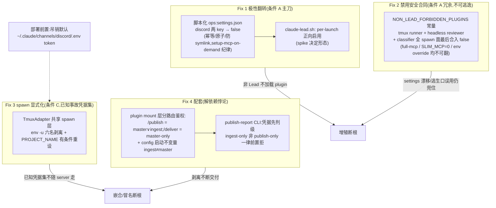

# FLY-1715 Runner 不应加载 Discord plugin — 实施计划

Issue: FLY-1715 (https://linear.app/geoforge3d/issue/FLY-1715/runner-进程不应加载-discord-plugin-server-个例-roguefly-1704-runner-名下-bun)
日期: 2026-08-12
基于: research.md
版本: r6(折入 Codex design review R1×7 + R2×7 + R3×6 + R4×4 + R5×3)

## 0. 一句话

把「谁能加载 Discord plugin、谁持有 Discord/Lead 凭据」从 **ambient 默认全有** 翻转为 **默认全无、仅 Lead 启动器单点显式 opt-in**,并让 runner 的身份/凭据在 tmux spawn 边界显式派生、不再继承 tmux server env——增殖与嵌合两条病根一次断掉,配套解开 publish-report 对泄漏凭据的隐性依赖。

## 1. 目标 / 非目标

**目标**
1. 任何非 Lead 的生产 claude 进程(tmux runner / Bridge headless reviewer / subscription classifier / ad-hoc)不再加载 discord plugin;禁用是**不可被 slim 逃生口翻转的安全合同**,不是内存优化的一部分。
2. runner pane 的**已知事故凭据集**不再依赖它出生在哪台 tmux server:**六名剥离**(`LEAD_ID` / `DISCORD_STATE_DIR` / `DISCORD_BOT_TOKEN` / `TEAMLEAD_API_TOKEN` / `BRIDGE_URL` / `PROJECT_NAME`),其中 `PROJECT_NAME` 无条件剥后按 ctx 有条件显式重设;身份仅经 `FLYWHEEL_LEAD_ID`(ctx=registry 派生)显式注入——与 FLY-1726「单一权威源+派生」合同对齐。
3. 剥离 `TEAMLEAD_API_TOKEN` 不打断 runner 的两条必经 Bridge 依赖:**(a) DESIGN-HTML 交付**——`/api/reports/publish` 接受 runner 侧 `FLYWHEEL_INGEST_TOKEN`;`/deliver` 仍 master-only,以 **token 不等式启动不变量**保证边界真实存在;**(b) ask/gate 的 lead-inbox nudge**——该端点接受 ingest,且 runner 路径**绝不**触发 nudge helper 的磁盘 master-token 回读(`lead-inbox-nudge.ts:67-79` 现状会在 401/403 时读 `~/.flywheel/.env` 重取 master——不堵这条,`env -u` 会被运行时旁路)。
4. Lead 的 Discord channel 完全不受影响(含 QA slot 的 test lead)。

**非目标(诚实边界)**
- 不改 flywheel-plugins fork(plugin 侧 default-deny 门 = follow-up,见 §8)。
- 不做身份单一权威源本体(FLY-1726);本单只落 spawn 链切片。
- **不承诺开集 env 安全**:deny-list 之外的未列名 ambient 变量仍会继承(deny-list 的固有边界)。整 env 显式重建(`env -i` + safe base,claude-lead.sh:1614 / FLY-1643 codex daemon 范式)归 FLY-1726 面——runner 是开放式 dev 工作负载,合法 env 依赖不可能在本单窗口内可靠盘尽,FLY-1643 的教训正是洗过头会打断 credential delivery。「plugin 误加载也安全」**不是**本计划的声称;误加载防线是 Fix 1+2 两重 + 部署前置 P0(默认 token 吊销)。
- 不执行 88723 退役、TEAMLEAD_API_TOKEN 轮换、存量增殖体 sweep——列为 ops checklist(§6)与顺序约束,执行归 team-lead(已有排期)。唯**默认 state dir token 吊销**升级为部署前置(见 Phase 0.5)。
- 不治 Lead 自身 Bash 子进程对 Lead 其它 env 的继承(属 1726 面)。
- **本单防的是 ambient/自动泄漏,不是进程能力边界(Codex R3#3,显式接受)**:runner 与 Lead 同 UID 同 HOME,且以 `bypassPermissions` 携 Bash 启动(Blueprint.ts:2705-2712)——一个**主动配合规避的** runner 可以直接 `cat ~/.flywheel/.env`(0600 但同 UID 可读)取得 master,进而调用一切 master-only API。本单的「deliver 仍 master-only」等表述精确含义是 **bearer-tier-only**(按出示的 bearer 分级),不是「runner 无法取得 master」。真·进程隔离(独立 OS identity / sandbox / broker)绑定 FLY-1726/凭据治理面。本单消灭的是:出生即持有、不知情继承、内建工具自动回读——即事故的全部实际形态。
- agy / kimi 不加载 claude plugins,Fix 1/2 对其无行为变化;Fix 3 的凭据剥离对其生效(共享 spawn 层)。
- 不为 runner 预留任何 discord opt-in 通道:`full-mcp` **不会**(也从未)正向启用 discord,机器 default-off 下它保持 off;若未来出现真实「测试用 discord runner」需求,作为独立设计变更走 forbidden 合同的显式修订(§8)。

## 2. 改动总览

## 3. 分阶段实施(TDD;实现者可按 Phase 拆 PR,但 Phase 2 与 Phase 3 必须同 PR 或 Phase 3 先行)

### Phase 0 — 真机 spike(先于一切代码,产出决定 Phase 1 形态)

在隔离环境(QA slot 或临时 HOME overlay)验证:机器级 `enabledPlugins."discord@flywheel-plugins": false` 时——

- S1:`claude --dangerously-load-development-channels "plugin:discord@flywheel-plugins"`(Lead 形态)是否仍加载 plugin 并 spawn adapter?
  - **是** → Phase 1 Lead 侧零改动(分支 a);
  - **否** → claude-lead.sh `CLAUDE_ARGS` 追加 `--settings '{"enabledPlugins":{"discord@flywheel-plugins":true}}'`(分支 b,FLY-1185 已证 per-launch 正向覆盖有效;`scripts/setup-mcp-on-demand.sh:2-12` 即该先例)。
- S2:裸 `claude` / `claude -p 'hi'` 在 default-off 下确认 **0 adapter**(`pgrep -f 'discord/0\.0\.4/server\.ts'` 按进程树归属)。
- S3:`--settings '{"enabledPlugins":{"discord@flywheel-plugins":false}}'` 在机器级 **true** 时也确认 0 adapter(Fix 2 兜漂移的直接证据;FLY-751 2026-07-01 spike 已证 false 条目阻断 MCP 子进程,此处复证 fork key)。
- spike 结论(含 pane 截证)写入本文件夹 `spike-notes.md`,随 PR 提交。

### Phase 0.5 — 部署前置(ops,一次性,可先于代码)

吊销并归档默认 state dir 凭据:`~/.claude/channels/discord/.env` 与 `.env.bak` 中的 bot token 在 Discord 开发者门户吊销,文件移出(归档到安全位置)。依据:plugin server 在 `DISCORD_STATE_DIR` 缺席时回退该默认目录取 token 自连(server.ts:74-90 → client.login 无角色检查)——**不吊销它,Fix 3 的 `env -u DISCORD_STATE_DIR` 会把误加载的 plugin 推向默认 token**,纵深防御不成立。该 token 3 个月无活动(research §2),吊销风险≈0;若 Annie 日后要终端 Discord channel,重新 `/discord:configure` 配新 token。

### Phase 1 — Fix 1 + Fix 2(条件 A)

1. **Fix 2 形态(Codex R1#1)**:两枚 discord key 不进 `DEFAULT_RUNNER_DISABLED_PLUGINS`(那是可逃逸的内存 slim 机制),而是独立安全常量:
   - `packages/config/src/non-lead-forbidden-plugins.ts`(新):`NON_LEAD_FORBIDDEN_PLUGINS = ["discord@flywheel-plugins", "discord@claude-plugins-official"] as const` + `buildForbiddenPluginsSettings()` helper(产出 `{enabledPlugins: {…:false}}` 片段);头注记录 FLY-1715 supersede FLY-812 的依据与「不可被任何逃生口翻转」的合同。
   - **RED**(`packages/config/src/__tests__/`):forbidden 集两 key 缺一即败;与 `resolveRunnerMcpProfile` 的合成语义——`full-mcp` / `FLYWHEEL_RUNNER_SLIM_MCP=0` / `FLYWHEEL_RUNNER_DISABLED_PLUGINS=""`(显式空 override)/ `enabledPluginsExtra` 正向项,任何组合下 forbidden 仍为 false。
   - **GREEN**:`TmuxAdapter.buildClaudeArgs`(TmuxAdapter.ts:1019-1035)在既有 merge(ponytail true → disabledPlugins false → enabledPluginsExtra true)**之后**最后合入 forbidden false——顺序即优先级,forbidden 永远最后写。行为变更点明:claude-tmux 启动从此**总是**携带 `--settings`(原「双源皆空则无 flag」的字节兼容性质随本单有意作废);`test/TmuxAdapter.test.ts:600-681` 期望串逐条更新。
2. **覆盖全部生产非 Lead spawn 面(Codex R1#1)**:
   - `packages/teamlead/src/bridge/claude-review-runner.ts`(buildClaudeReviewArgv,~:114-150,441)与 `packages/teamlead/src/bridge/approval-signal/subscription-claude-classifier-runner.ts`(~:93-120):argv 追加 `--settings ${JSON.stringify(buildForbiddenPluginsSettings())}`;各补 argv 断言测试。
   - **SDK / voice 三个活跃面,确定实现(Codex R2#2 + R3#5)**:
     统一走一个 **canonical security-last merge helper**(随 `NON_LEAD_FORBIDDEN_PLUGINS` 同模块导出):输入 caller 的 settings(对象或 `--settings` 字符串),解析→深合并→forbidden 最后覆写→输出**恰一份** settings——与 FLY-751/TmuxAdapter 的「所有来源合并成单 flag」既有合同一致(TmuxAdapter.ts:1011-1035),**绝不产生两枚 `--settings` 依赖未验证的 last-wins**;caller settings 无法解析 → fail-closed(拒启该 spawn,不带病放行)。
     (a) `packages/claude-runner/src/ClaudeRunner.ts`(EdgeWorker 的 PR/新 issue/resume 路径实际构造,EdgeWorker.ts:954-971,2909-2935,5592-5614;`config.extraArgs` → SDK,ClaudeRunner.ts:461-494):经 helper 合入,caller 正向 discord 启用被覆盖;
     (b) `packages/voice-core/src/brain/HeadlessClaudeBrain.ts`(:88-112 直接组 argv):解析 caller extraArgs 中既有 `--settings`(兼容 `--settings value` 与选定支持的 `=` 形态)→ helper 合并 → 最终 argv **只发一枚** `--settings`;
     (c) `packages/voice-core/src/brain/ResidentClaudeBrain.ts`(:441-465 已有自建 `--settings` JSON,由 voice daemon ResidentBrainManager 创建):forbidden 经同一 helper 合入其现有 settings JSON。
     **依赖清单变更(R3#5)**:`packages/voice-core/package.json` 现无 `flywheel-config` workspace 依赖——加依赖 + lockfile 更新,**不许复制 forbidden 常量**。
     测试:caller 尝试正向启用 discord 被覆盖 / caller settings 不可解析 fail-closed / Headless resume / Resident respawn,各断言最终**单枚** settings 中 forbidden 为 false。机器级 default-off 只兜**真正未知的 ad-hoc 面**,不替代以上已确认活跃的生产 spawn。
3. **Fix 1 脚本化(Codex R1#7 + R2#7)**:机器级翻转不做手工命令。新 `scripts/setup-discord-plugin-default-off.sh`,复用/抽取 `scripts/setup-mcp-on-demand.sh:11-67` 的既有纪律(幂等、原子替换、保 mode、拒 symlink、坏 JSON 拒改、变更才备份),原子设置两 key=false。**回滚是脚本一等接口**:`--restore <backup-path>` 子命令,同一套校验(target/backup 存在性、拒 symlink、backup JSON 可解析、保 mode、原子替换)。bash harness(`scripts/__tests__/`)覆盖 no-op 幂等 / 坏 JSON / symlink 拒绝 / 从 true 翻转 / **经 `--restore` 的真回滚路径**(不许测试里手工 `cp` 代替)。部署 checklist 正反两向都调脚本。
4. claude-lead.sh 按 spike 分支处理;若分支 b,`scripts/__tests__/` lead-launch harness 补 args 断言。QA slot test lead 走同路径自动继承,无需特判。

### Phase 2 — Fix 3(条件 C:spawn 显式化,已知事故凭据集)

1. **RED**(`packages/claude-runner/test/TmuxAdapter.test.ts`):
   - 剥离与重注**同在最终 `env` argv 完成,顺序固定**(Codex R3#1:初稿「tmux `-e` 重注 + exec 前 `env -u`」自相矛盾——`-e` 先设 pane env,`env -u` 后执行会把 ctx 值一并删掉):`env` argv 先列全部六个 `-u`,**然后**在 binary 之前按 ctx presence 追加独立的 `PROJECT_NAME=<ctx>` assignment 元素。**不用 tmux `-e` 重注该键**;
   - gated `sh -c` 路径:projectName 的 value/presence 经**位置参数**传入 shell(禁止把 projectName 插值进 shell 字符串——注入面纪律),shell 内组装 `exec env -u … [PROJECT_NAME="$v"] ${binaryName} "$@"`;direct 分支(agy/kimi 形态)为纯 argv 元素;
   - `FLYWHEEL_LEAD_ID` 显式注入断言保持;剥离名单精确六名(`LEAD_ID` / `DISCORD_STATE_DIR` / `DISCORD_BOT_TOKEN` / `TEAMLEAD_API_TOKEN` / `BRIDGE_URL` / `PROJECT_NAME`;`env -u` 只删指定名,不碰 PATH/HOME);
   - **测试必须真执行生成的命令并观察 child env**(如 `env`→`sh -c 'echo $PROJECT_NAME'` 探针),不许只做 argv 文本匹配(Codex R3#1);覆盖:poisoned ambient + ctx 在场 → child env 值=ctx;poisoned ambient + ctx 缺席 → child env **变量缺席**。
   - PROJECT_NAME 无条件剥的依据(Codex R2#4):`ctx.projectName` optional(adapter-types.ts:253-256),TmuxRunner.run() 兼容入口不传——「有 ctx 才注入」若不配无条件剥,absent 分支退回继承而验证空过;flywheel-comm index.ts:685 的 env fallback 因 ctx 在场路径重注而保持兼容。
2. **GREEN**:`TmuxAdapter.ts` 模块级 `AMBIENT_IDENTITY_DENYLIST`(六名;每名注释其 ambient 读者与依据指向 research §4),windowCommand 两分支经同一 helper 包裹;deny-list 在共享基类,子类零改动继承。
3. **真机验证(复现-治愈证明)**:在带污染 env 的 server 上(`env LEAD_ID=x DISCORD_STATE_DIR=y TEAMLEAD_API_TOKEN=z PROJECT_NAME=wrong SOME_UNLISTED_SECRET=w tmux -L test-1715 new-session -d`)spawn 真 runner,`ps eww` 断言:六名 ambient 值全数不见(PROJECT_NAME 若有 ctx 则=ctx 值非 wrong)、`FLYWHEEL_LEAD_ID`/`FLYWHEEL_INGEST_TOKEN` 在位、**`SOME_UNLISTED_SECRET` 仍在**——最后一条是对 deny-list 开集边界的诚实取证(证明我们知道边界在哪),写进 spike-notes/QA 证据,不得省略。
4. **runner 运行时零 master 回读(Codex R2#1 的 Phase 2 侧)**:剥离后 runner 的 `ask`/`gate`/`ack` 全链真跑一次,断言 `~/.flywheel/.env` **零读取**(fs 探针或 helper 层单测,见 Phase 3.5)——`ps eww` 干净不等于运行时拿不到 token,这条是防旁路的落锤。

### Phase 3 — Fix 4(runner-tier Bridge 鉴权配套;与 Phase 2 同 PR 或先行合入)

现状核准(Codex R1#3):reports 路由仅 `POST /publish` 与 `POST /deliver`(reports-route.ts:210,311);screenshot 在 CLI 本地采集后作为 `/deliver` body 的 `screenshotPath`;**auth 归属 plugin mount 层**(reports-route.ts:12-14 的既有所有权注释;plugin.ts:3822-3833 现为整面 master middleware)。设计据此落位:

1. **mount 层分路由鉴权(plugin.ts)**:
   - `POST /api/reports/publish`:Bearer ∈ {master(TEAMLEAD_API_TOKEN), ingest(TEAMLEAD_INGEST_TOKEN)} → 放行,并把已判定的 credential tier 传递给 route(供 §3.4 的 ingest 级校验与审计);
   - `/api/reports` 其余(含 `/deliver`):master-only;**已识别为 ingest** 的 bearer 打 `/deliver` → 403(明确语义);缺失/未知 bearer → 401;
   - master 未配置 → 整面 503(FLY-203 sentinel 不变);
   - token 比对复用 ingest 既有比对纪律(常量时间比较),不新造。
   - **RED**:mount 级真测试(`packages/teamlead/src/__tests__/reports-route-mount.test.ts` 形态,不绕 auth 测裸 router):矩阵 = {master, ingest, 未知, 缺失} × {publish, deliver} 全 8 格 + master 未配置 503 + **master==ingest 碰撞态由启动不变量排除**(见下)。
2. **config 规范化 + 启动不变量(Codex R1#5 + R2#5 + R3#2/#4 + R4#1/#2)**:
   - **两层分离:ops-preflight(部署硬前置)≠ `loadConfig()`(全局启动不变量)(R5#1,Codex 自我纠正上一轮的混淆)**——tokenless Bridge 是**既有合同**:`BridgeConfig.apiToken/ingestToken` 均 optional(types.ts:11-16);多项默认配置测试在无 master 环境启动(bridge.test.ts:310-319,344-354,406-419);gemini 测试明确覆盖「scoped set、master unset → Bridge 启动且 scoped ignored」(gemini-scoped-token.test.ts:192-203);reports 的「无 master → 敏感路由 503」sentinel 依赖进程能 tokenless 启动。故:
     - **`loadConfig()` 只对「已提供」的值下手**:(a) 若 `TEAMLEAD_API_TOKEN` 提供且带外层空白 → fail-start(配置错误,「trim 你的配置值」);(b) 对**同时存在**的、reachable-set 不同的 bearer 做规范化后碰撞拒绝。**绝不因 token 缺席而 fail-start**——保留 tokenless 降级形态与 reports 503 sentinel。
     - **master+ingest present 是本单的 *生产 ops preflight* 硬要求**(部署 checklist),不是全局 config 必填。
   - **master 不做「trim 后可用」(R4#1)**:master 的生产调用方太多且全发原串(claude-lead.sh:1170-1174 bootstrap、:1586/:1636 pane 注入、:1854-1863 terminal MCP;respond.ts:166,244;lead-lease.ts:117,194;report-deployed.ts:192),server 单边 trim = 全体 Lead 系统性 401。故只在**提供且带空白**时 fail-start(上条 a),不改比较语义。
   - **ingest 走「注入边界规范化」(R3#4)**:`Blueprint` 现注入**原始** `process.env.TEAMLEAD_INGEST_TOKEN`(Blueprint.ts:2771-2777),`complete`/`stage`/`qa-result`/`review-ruling` 等直接发未 trim 值(complete.ts:215-219,353;stage.ts:171-175,240;review-ruling.ts:111-116)。处置:注入边界(Blueprint→`bridgeIngestToken`)写入规范化值,CLI 侧 bearer consumers 复用同一规范化 helper;**e2e 回归:whitespace-padded 源 ingest 下 `stage`/`complete` 仍成功**。
   - **碰撞比较(R3#2 + R4#2)**:一律用 trimmed 值;present 的 bearer 两两不等——master/ingest/gemini-agent(`TEAMLEAD_GEMINI_AGENT_TOKEN`,optional 保持;现状只拒 gemini==master,config.ts:84-100;gemini==ingest 会让 Gemini 凭据升权为 publish/nudge caller)。mount 负测:gemini bearer 不能 publish / 不能 nudge。
   - 单测:master padded fail-start(提供时)+ **master 缺席 Bridge 仍启动(tokenless 合同不破)** + whitespace-only + present 三方 pairwise + gemini unset 合法。ops preflight(部署 checklist,非 config):输出 present(master+ingest)/ pairwise-distinct / master_padded 布尔值,不回显 token。
   **credential tier 传递合同**:tier 由 mount 层 auth middleware 判定后写入 **server-owned `res.locals`**(请求侧不可伪造);route 读 locals,缺 tier → fail-closed 拒绝;负测:请求 header/body 伪造 tier 字段不能绕过 ingest 级 project 校验。
3. **CLI(publish-report.ts,Codex R1#4)**:
   - 凭据先判级:`master = trim(TEAMLEAD_API_TOKEN) || absent`、`ingest = trim(FLYWHEEL_INGEST_TOKEN) || absent`(不用裸 `??`,空串视为缺席);master 优先;
   - **ingest-only 且 `!args.publishOnly` → 在读 html、截图、publish、任何 fetch 之前 fail-fast**(不带 `--channel/--issue` 也会经 generalChannel fallback 投递——reports-route.ts:397-423——故拒绝条件只看 publishOnly,不看 channel/issue);错误文案指路「runner 无投递权:用 --publish-only 拿 URL,经 flywheel-comm ask 报 Lead 投递」;
   - 单测:ingest-only × {默认投递, --channel, --issue} 三拒绝态断言**零 fetch/零截图/零文件读**;ingest + --publish-only 成功;master 全能力不变;空串 token 判级。
4. **/publish 的 ingest 级加固(Codex R1#6 + R2#3,风险接受 + 廉价校验 + 资源止损)**:
   - 事实承认写入计划:`FLYWHEEL_INGEST_TOKEN` 是 **fleet-shared** 进程级凭据(Blueprint.ts:2771-2777 同值发给每个 runner),非 per-runner;`/publish` 是外部写能力(Vercel deploy + 全局 registry,retention 100 条/10MiB);
   - 廉价校验:ingest tier 的 publish 要求 `projectName` 匹配 Bridge 已配置项目(master tier 字节兼容不加);负测:ingest + 未配置 projectName → 4xx;
   - **资源止损(Codex R2#3)**:现有 `publishChain` 是无上限串行队列(reports-route.ts:207-210,301-308,每个待命闭包持 req/res + ≤512KiB HTML)。加**固定常量 outstanding 上限**(不设 flag;所有 tier 生效,满 → 429,`finally` 归还额度)。测试:超限请求不触 deploy、队列排空后额度恢复;
   - 审计:publish 成功日志行带 credential tier(master/ingest),给 retention/配额滥用留可观测面;
   - **明示接受的剩余风险**:同舰任一 ingest 持有者可代任意已配置项目 publish、消耗 Vercel 配额、挤退 retention 旧报告(Bridge 内存无界堆积已由上限排除,不在接受清单)。接受依据:该持有者本已在信任边界内(持 gh 凭据、可写代码),publish 无 Discord 出站、URL 不可猜;report-scoped per-runner credential 归 FLY-1726 token 治理面(§8)。此项须在 PR 描述向 Lead/founder 显式呈现。
5. **lead-inbox nudge 的 runner-tier 收编(Codex R2#1,不堵=Fix 3 被运行时旁路)**:
   - 现状:`runAsk` / gate / ack 的 nudge 均传 `process.env.TEAMLEAD_API_TOKEN`(index.ts:385,455,682,1925-1931);helper 在 401/403 时**从磁盘 `~/.flywheel/.env` 回读 master 再试**(lead-inbox-nudge.ts:67-79);服务端 `/api/lead-inbox/nudge` 在 master middleware 后(plugin.ts:2329-2350)。即:pane env 剥干净后,runner 第一次 `ask` 就把 master token 从磁盘捡回来。
   - 端点侧:`/api/lead-inbox/nudge` 是无权威写入、仅缩短 durable poll 的端点 → mount 层放宽为 master∨ingest(与 reports/publish 同款 tier 判定;**其余 master-only API 一律不放宽**,负测覆盖)。
   - CLI 侧:nudge 调用点凭据判级(master 优先、ingest 次之,trim 语义与 §3.2 一致);**磁盘 master 回读仅限「初始凭据为 master-tier」的 401/403(Lead 轮换场景的原设计意图);ingest-tier 或无凭据路径绝不读 master 文件**。
   - 测试:ingest nudge 200;未知 token 401;runner 全链(`ask`→`check`→gate)fs 探针断言 `~/.flywheel/.env` 零读取;master-tier 轮换回读行为字节保持。

## 4. 验收判据(全舰口径,独立 QA 可复跑)

| # | 判据 | 尺 |
|---|------|-----|
| V1 | 新 spawn 的 runner / headless reviewer / classifier / SDK(ClaudeRunner)/ voice brains / ad-hoc claude 名下 **0 adapter** | `pgrep -f 'discord/0\.0\.4/server\.ts'` + 进程树归属;对照组=修前基线(16 Lead 各 1 + rogue) |
| V2 | 每活跃 Lead 恰 1 adapter,gateway 正常(频道真机收发) | 同尺计数 + 真收发 |
| V3 | 污染 server 复现试验:六名 ambient 值全数不见(PROJECT_NAME 有 ctx 则=ctx 非 wrong)、`FLYWHEEL_LEAD_ID`/`FLYWHEEL_INGEST_TOKEN` 在位、未列名注入 canary 仍在(开集边界取证) | `ps eww` 字段互比(Cass 嵌合尺) |
| V4 | 剥离后 runner `publish-report --publish-only` 成功;非 publish-only(含无 --channel 默认投递)被前置拒 | 真跑 CLI |
| V5 | `FLYWHEEL_RUNNER_SLIM_MCP=0`、`full-mcp` label、显式空 `FLYWHEEL_RUNNER_DISABLED_PLUGINS` 三逃生口下 runner 仍 0 adapter | forbidden 合同不可逃逸的直接验证 |
| V6 | mount 级鉴权矩阵 8 格 + 503 sentinel + 规范化/不变量测试 + tier 伪造负测 + publish 队列上限(超限 429 不触 deploy / 排空恢复) | 真 mount 测试 + config 单测 |
| V7 | 全仓 gate:`pnpm lint` + `pnpm -r build` + `pnpm test:packages:run` + shell harness | 既有纪律 |
| V8 | 剥离后 runner `ask`→`check`→gate 全链可用,nudge 走 ingest(200),`~/.flywheel/.env` **零读取**;其余 master-only API 未被放宽 | fs 探针 + mount 负测 |

## 5. 部署顺序(自托管 ship 约束)

1. **前置(可先行)**:Phase 0.5 默认 token 吊销;ops preflight 确认 master+ingest present 且互异、gemini(若 present)异于两者、master 无外层空白(任一违反先修配置——preflight 是部署硬前置,不是 config 必填,见 §3 Phase 3.2)。
2. PR 合入 → **一次 `request-restart.sh` 驱动的受管 full-fleet 事务(Codex R5#2,收敛原 3/4/5 步)**:
   - `restart-services.sh` 现状**无条件把每次合法调用收敛为 full-fleet wave**(重启 Bridge + 全部 Lead + cmux watcher;:1087-1093 / Lead wave :2012-2040),**全文件无 voice-bridge label**。故本单要把 voice-bridge **确定性纳入** `deploy_and_verify()` **与** `rollback_and_restart()`(不是「待核实」,不新增手工 kickstart 旁路——FLY-913 硬拦):持 restart lock、紧邻 mutation 时采集 voice daemon + 既有 Headless/Resident child 的 PID+start;受管替换;`:9878/health` 失败**不得推进 deployed-sha**,并用旧 build 重启/复验 voice。
   - 该入口异步入队(request-restart.sh:72-79 → `com.flywheel.updater`);**等 updater 完成证据 + Bridge/voice health 绿 + 旧 voice identity 消失**后才进下一步。一次事务覆盖:TmuxAdapter / reviewer / classifier / SDK(ClaudeRunner)/ reports+nudge mount / config 不变量 / voice brains 全部生效。
   - harness:正常部署、voice health failure(不推进 sha)、rollback 三条各走受管路径。
3. 若 spike 走分支 b:各 Lead 已在上一步的 full-fleet wave 带 per-launch 正向启用重启——**逐 Lead 真验 channel 收发**,才进下一步。
4. **ops:跑 `setup-discord-plugin-default-off.sh`**(机器级翻转)。回滚=同脚本 `--restore <backup>` + 经受管重启工具链重启受影响 Lead + channel 复验。
5. 验收 **V1-V8**。
6. 之后 ops 处置:88723 退役(既有排期)、TEAMLEAD_API_TOKEN 轮换、存量增殖体一次性 sweep(活父进程名下,FLY-183 reaper 射程外,人工)。**顺序硬约束:Fix 4(reports+nudge)生效前不得做 token 轮换/干净 server 迁移**。

## 6. ops checklist(执行归 team-lead,本单交付清单本身)

- [ ] (前置)吊销 + 归档 `~/.claude/channels/discord/.env`、`.env.bak` 的 token(Phase 0.5)。
- [ ] (前置)preflight:master/ingest present + pairwise-distinct、gemini(若 present)异于两者、master 无外层空白(`master_padded=false`)——只输出布尔。
- [ ] 受管 full-fleet 事务(`request-restart.sh`):含 voice-bridge 受管重启 + `:9878/health` + 旧 Headless/Resident child 回收证明(部署第 2 步;非手工 kickstart)。
- [ ] `setup-discord-plugin-default-off.sh` 翻转两 key(部署第 4 步);回滚 `--restore <backup>`。
- [ ] 88723 退役(排期已有);退役前确认其上无未收工 runner。
- [ ] TEAMLEAD_API_TOKEN 轮换(88723 env 明文暴露过;半径=Bridge 配置 + 各 Lead launcher env)。
- [ ] 存量增殖体 sweep:`pgrep -f 'discord/0\.0\.4/server\.ts'` 中父进程非 Lead 的逐个核实后清除。

## 7. 风险与回滚

| 风险 | 处置 |
|------|------|
| spike S1=分支 b 且 Lead 重启期间 settings 已翻转 → Lead 掉 channel | §5 强制顺序「full-fleet 事务(含 Lead 带 per-launch 启用)完成 + 逐 Lead 验证 → 才翻转」;翻转脚本秒级 `--restore` 回滚 |
| 未列名 ambient 凭据仍继承(deny-list 开集边界) | **设计承认,不假装修复**(§1 非目标 + V3 canary 取证);整 env 重建归 1726 |
| ingest 权限面扩大(/publish 外部写) | §3.4 廉价校验 + 审计 + 显式风险接受呈报;deliver 边界由 403 + 启动不变量双保 |
| master==ingest 现状配置使 403 形同虚设 | present 时碰撞拒绝(不因缺席 fail-start;tokenless 合同保留);ops preflight 先行不撞启动失败 |
| nudge 磁盘回读把剥掉的 master 捡回来 | Phase 3.5 收编:端点收 ingest + 回读仅限 master-tier 初始凭据;V8 fs 探针落锤 |
| 某未盘点 runner 流程依赖六件套之一 | research §4 已逐名盘点读者(含 nudge 回读);PROJECT_NAME 以「无条件剥+有 ctx 显式重设」保兼容;回滚=revert+重启,**不新增 env flag** |
| /publish 队列在 Vercel 慢调用期无界堆积 | 固定常量 outstanding 上限,429 + finally 归还(Codex R2#3) |
| 存量进程不回收 | 部署只管新 spawn;存量走 §6 sweep;V1 以「新 spawn」为准并注明 |
| TmuxAdapter 测试期望串大改 | 有意行为变更,逐条更新并在 PR 描述列明;不得为过测放宽断言 |

## 8. Follow-up(不阻塞本单)

- plugin fork(flywheel-plugins)server.ts default-deny 门(显式 allow 标记或见 `FLYWHEEL_EXEC_ID` 拒连)——第三重皮带,走 fork repo + FLY-1676 sync。
- runner 级 report-scoped credential(替代 fleet-shared ingest 复用)+ 整 env 显式重建(env -i safe base)——并入 FLY-1726。
- 「测试用 discord runner」若出现真实需求:作为 forbidden 合同的显式修订独立设计(本单不预留通道)。
- FLY-1726 落地后,`FLYWHEEL_LEAD_ID`/`PROJECT_NAME` 注入点改读统一权威源(位置不变,来源替换)。
