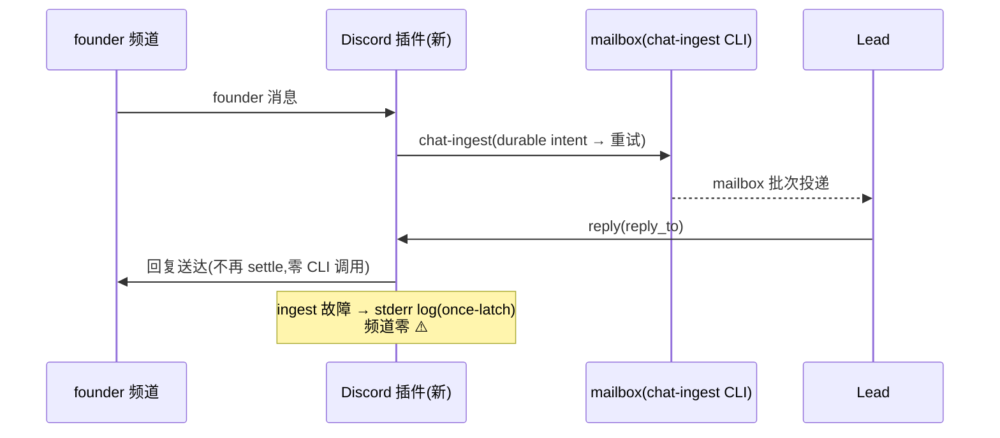

# FLY-1730 Discord 插件 chat-receipt 配套断代 — 实施计划

Issue: FLY-1730 (https://linear.app/geoforge3d/issue/FLY-1730/bug配套断代-discord-插件仍调用已拆除的-chat-receipt-cli-每条-founder-消息结算永败内部告警直喷)
日期: 2026-08-12(R1 修订)
基于: research.md

## 0. 一句话

采纳已写好的 fork PR #20(FLY-1645 插件侧拆除,head `3c72cd9`)为基底,叠加 FLY-1730 delta(剩余 plumbing advisory 整体降级为 stderr log + `plugin.json` JIT patch bump),配套主仓 checker 过渡兼容(dual fork marker),经 managed updater + 统一重启波真正部署到生产 plugin cache,以终态回执 + 真机观察窗验收——交付定义是生产行为改变,不是 merge。

## 1. 范围与红线

- **fork 仓** `xrliAnnie/claude-plugins-official``external_plugins/discord/`:主体拆除 + delta(交付物 A)。
- **主仓(flywheel)**:一个**最小兼容 delta**(交付物 B):FLY-1676 完整性 checker 的 fork marker 从单一 `ChatReceiptRuntime` 过渡为 dual-accept(R1 BLOCKER:现役 checker `scripts/discord-plugin/check-discord-plugin.sh:77` + 生产副本 `~/.flywheel/bin/check-discord-plugin.sh:77` 逐字要求 `ChatReceiptRuntime`,PR #20 改名 `ChatIngestRuntime` 后 `restart-services.sh` 会在 recheck 失败时于任何 Lead mutation 前中止 fleet wave(:513-525, :968-976))+ 本 doc 文件夹 + CLAUDE.md 里程碑。
- **红线**:零新机制,净删除单。不引入新告警通道、新 flag、新配置面。checker dual marker 是**过渡兼容**(deploy 收敛后可在后续单收窄回单 marker),不是新机制。
- **不做**(诚实边界):寄生 runtime ×N(FLY-1715)、频道级内部告警治理(FLY-1612)、FLY-1645 主仓生产 closeout(sweep/schema/.env flag 清除)、mailbox 投递语义(1573/1574 逐字保留)。

## 2. 交付物 A — fork PR(supersede #20)

### 2.1 分支与 PR 形态

- 新分支 `fix/FLY-1730-receipt-cli-desync`,**从 PR #20 head `3c72cd9` 起**(先 `git merge-base --is-ancestor` 校验 main 无新交叠;有则先 rebase)。保留原 commit(FLY-1645 归属),叠加 FLY-1730 delta commit。
- PR base = fork `main`;body 链接 FLY-1730 + FLY-1645 + 主仓 #808;注明 supersede #20(由 Tadashi 关 #20)。
- 与 fork PR #21(FLY-1710)互为 rebase 邻居:先落者赢,本单不等它。**若 #21 先落**:rebase 后重算版本(§2.2 D3)、全量重跑 tests + 残留门、对新 exact head 重新过 codex review。

### 2.2 delta 内容(在 PR #20 版本之上)

**D1 — 告警面净删(runtime,PR #20 版行号)**:
- 删 `AdviseFn` 类型、`advise` option(:63/:82/:100)、`adviseWithMarker`(:378-397)、`adviseBroken`(:172-179)及其 meta marker 写盘(`broken-advised.json`/`ingest-corrupt-advised.json`)。
- 4 处 advisory 改为结构化 stderr log(经既有 `this.log`),保留既有一次性 latch 语义防日志刷屏:
  - :140 应急(intent 写盘失败+立即 ingest 失败)→ `log(JSON.stringify({event:'discord_mailbox_ingest_unrecoverable', message_id, …}))`;
  - :252 腐坏 intent → log(`.corrupt` 改名本身就是幂等 latch);
  - :275 停滞 → log `discord_mailbox_ingest_stalled`(event 行 PR #20 已有,删 advise 分支;`advisedAt` 字段保留为 stall-log once-latch,不改 intent schema);
  - broken 模式:删 `adviseBroken` 后靠 server.ts :94 既有启动 stderr 警告(逐字保留),不补新代码。
- 结果:runtime **物理上不再持有任何向 Discord 频道发内部告警的通路**。

**D2 — server.ts 配套**:
- 删 `advise` 闭包(:1004-1009 `channel.send('⚠️ …')`)与 `adviseBroken` 调用点(:1605 一带);`fetchAllowedChannel` 先 grep 全部引用,仅当 advise 是唯一调用者时才删。
- `notify`(MCP 入站投递)与其余接线逐字不动。

**D3 — 版本号(JIT patch+1,不写死)**:merge 前 JIT 读取 fork main `external_plugins/discord/.claude-plugin/plugin.json` 当前版本,严格 patch +1(当前预期 0.0.4 → 0.0.5;**若 #21 等先落已占号则顺延**)。理由:plugin.json patch version 是部署管线可用性单点(FLY-1676 operator card:同版本改写 → CLI 判 already latest、registry 停旧 SHA)。部署验收读取 **merged manifest 的实际版本**,不硬编码。

**D4 — 测试(TDD,先写后改)**:
- 更新/删除 PR #20 里断言 advisory 会发频道的用例;新增:
  - settle/receipt 调用面不存在:源码级断言(`chat-receipt` 字符串仅允许出现在 spool 目录名常量)+ 行为级:reply_to 回复路径**零** CLI spawn(除 chat-ingest);
  - ingest 停滞/腐坏/应急 → 仅 log,一次性;runtime options 形状无 advise 注入点;
  - ingest spool 兼容回归(重启后重放)保持绿。
- 门:`bun install --frozen-lockfile && bun test` 全绿(基线 173,delta 后数目允许变化但零红);PR #20 带的 path-scoped CI 在本 PR 真跑绿。
- 跨仓残留门:按主仓 `scripts/fly1645-receipt-residue-gate.config.json` 复跑,零新残留。

### 2.3 review 门

fork PR 走 codex code review(`codex:rescue`,xhigh),loop 至 APPROVED——PR #20 原 commit 零 review,本 PR 是它第一次过审,review 范围 = 全 PR(基底+delta)。

## 3. 交付物 B — 主仓 PR(checker 兼容 + docs)

本分支 `flywheel-FLY-1730` → PR base main:

**B1 — checker dual fork marker(TDD)**:
- `scripts/discord-plugin/check-discord-plugin.sh:77` 与 `check-discord-plugin-legacy-overlay.sh:31`:fork marker 集合从要求 `ChatReceiptRuntime` 改为「`allowBots` + `[reply-guard]` 必须 + (`ChatReceiptRuntime` **或** `ChatIngestRuntime`)至少一个」;exact remote SHA 与其余校验逐字不变。**禁止**在新插件里塞过期 `ChatReceiptRuntime` 假哨兵骗 checker(R1 明令)。
- 测试(R2-3):ops suite(`scripts/__tests__/discord-plugin-ops.test.sh`)新增 **直接执行两个 canonical checker**(pointer + legacy overlay)的 hermetic fixture——构造 registry/recovery clone/cache/marketplace 双 target,对三态逐一断言:旧 marker 单存 PASS、新 marker 单存 PASS、两 runtime marker 双缺 → VANILLA 拒绝(现有 suite 只执行 pointer checker,legacy checker 仅存在性+`cmp`,`cutover.test.sh:324` 用的是 fake checker——**不得**把 fake checker 当 B1 行为证据,只改 fixture 字符串可能让 legacy OR 逻辑写坏而测试全绿);`discord-plugin-cutover.test.sh` 仅承担 installed-byte/编排覆盖。
- 生产收敛路径:merge 后由 updater 拉 main,**显式跑 `scripts/install-discord-plugin-ops.sh`**(原子 staging cp → `~/.flywheel/bin/`;无自动触发,必须作为 runbook 步骤),再 `grep ChatIngestRuntime ~/.flywheel/bin/check-discord-plugin.sh` 验证收敛。
- 该改动对现 0.0.4 插件**惰性**(旧 marker 仍被接受),可先行部署零风险。

**B2 — docs**:本 doc 文件夹 + CLAUDE.md 里程碑行(最后一个 commit)。

## 4. 部署 runbook(ship 节点执行;merge 后才开始)

> 纪律:全程只走 managed 通道(`~/.flywheel/bin/update-discord-plugin.sh` 持全机锁 + `restart-services.sh` 内建复检),**禁止**裸 `claude plugin update` / `uninstall+install` fallback(会与 updater 竞写 registry / 在活舰队中撤走插件 authority——R1 撤销原 §6 fallback)。禁手敲 tmux/cmux(FLY-1596)。

**Phase A — checker 先行(对现插件惰性)**:
0. **窗口 hold(R2-4,Phase A 第一步前登记,Phase C 才释放)**:Tadashi 明确登记两条 HOLD——① FLY-1676 PR #19 merge/cutover HOLD(cutover 会冻结其他 deploy、改写 checker/updater authority,插进 A/B 之间会使本 runbook 前提失效);② FLY-1645 retired-flag removal HOLD(不是只在最后「解锁」,而是从现在起对所有 owner 可见的禁令)。HOLD 覆盖 A→B→QA 全窗。#21 先落仍允许(按 §2.1 rebase 路径)。
1. 主仓 PR(交付物 B)founder-gated merge → updater 收敛 main(标准 `request-restart` 或搭下一班部署车)。
2. 从 deployed checkout 显式跑 `scripts/install-discord-plugin-ops.sh`;验证 `~/.flywheel/bin/check-discord-plugin.sh` 含 dual marker 且 `bash ~/.flywheel/bin/check-discord-plugin.sh` 对现 0.0.4 cache 仍 PASS。

**Phase B — 插件部署**:
3. **进程 census(更新前)**:记录所有 `bun …server.ts` adapter 的 PID/PPID/argv/启动时间/state-dir/归属(Lead or 寄生 runner),存档为对照组。
4. fork PR founder-gated merge(JIT 版本已定)。冻结目标:fork main SHA(`git ls-remote`)+ merged manifest version + 主仓 main SHA。
5. **冻结波次边界(R2-1)**:入队**前**记录 `phase_b_started_at`(UTC,含可读的 request marker 名/nonce 如可得)。然后 `scripts/request-restart.sh` 入队(其成功**只表示 durable handoff 入队**,不是完成——源码 :2-5/:72-79 明示)。updater 波内:restart-services `check_discord_plugin_fork()` 发现 pointer 过期 → managed updater 更新 cache → recheck(dual marker + exact SHA)→ Lead wave。
6. **终态回执(硬门,全部满足才算部署完成;必须绑定到 Phase B 本次波次——Phase A 的旧终态同 SHA 同 reason,不设时间边界就能冒充)**:
   - `reason=updater` 的 founder 播报到达,且其时间/消息 ID **晚于 `phase_b_started_at`**;
   - `~/.flywheel/leads-restart-status.json`:`codeDeployedSha` == 步骤 4 冻结的主仓 SHA、`leadsRestartStatus == "healthy"`、`failed == 0`、`skipped == 0`、**`recordedAt > phase_b_started_at`**(只用既有字段,不加 schema);
   - `installed_plugins.json`:恰一条 user-scope `discord@flywheel-plugins`,version == merged manifest version,`gitCommitSha` == 冻结 fork SHA;
   - cache 内容哨兵:CLI 动词零残留(spool 目录名除外)。
   任一不满足 → 停,走 §6 处置;入队成功/update 命令成功/单次 checker 通过都**不是**完成收据。以上时间边界必须早于(被)波后 census(§4.7)覆盖。
7. **进程 census(波后,fail-closed)**:全局 `ps` 对照步骤 3:所有 adapter 均从新版本路径起且启动晚于 cache 更新;**任何仍 pin 旧 cache 的进程**(含寄生——统一重启只拥有 manifest+plist 内的 Lead,`restart-services.sh:1676-1758`,**不会**自然清掉 runner 寄生进程)→ 经其归属 Lead/Runner 的既有生命周期精确重启/关闭(runner-lifecycle 动作照旧 founder-reserved 纪律,由 Tadashi 协调);无法归属 → **停止部署验收,人工接管**。零旧 producer 后才进入下一步。
8. **残骸归档(碰撞安全)**:对每个 `~/.claude/channels/discord-*/chat-receipt-spool/`:归档根部 begin `*.json`、`settle/`、`meta/*-advised.json` 到唯一时间戳目录(如 `/tmp/fly1730-spool-archive-<ISO8601>/<state-dir名>/{root,settle,meta}/`,**保留相对层级**防同名覆盖),先写 count+hash manifest 再 move;**`ingest/` 严格排除**。

**Phase C — 联动解锁(顺序硬约束)**:
9. §5 验收 A1-A5 **全部通过** 且 rollback 决策窗声明关闭**之后**,才通知 FLY-1645 closeout 持单人:`.env` 退休 flag 清除解锁(在此之前 `FLYWHEEL_MAILBOX_DISCORD=1` 必须原样保留——旧插件回滚路径仍读它);通知 FLY-1676:patch 盘点 +1(或 +2 若 #21 已落)。

## 5. 验收(独立 QA 节点;真机,Claude-in-Chrome + 真 Discord)

| # | 验收项 | 判据 |
|---|---|---|
| A1 | founder 频道连发 2 条消息,各获 Lead 带 reply_to 回复 | 回复正常送达(消息层无回归) |
| A2 | 15 分钟观察窗 | founder 频道**零** `⚠️` advisory;所有 Lead 载体 stderr 日志零 `settle failed`/零 chat-receipt spawn 痕迹 |
| A3 | spool 地板 | 观察窗内 `discord-*/chat-receipt-spool/settle/` 零新文件;`ingest/` 行为正常(`discord_mailbox_ingest_verdict` 日志可见) |
| A4 | 多 runtime 回归 | §4.7 census 证明观察窗内零旧路径进程;源码级断言新代码无 chat-receipt 告警面可发 |
| A5 | 对照组(判据信号存在性,防空绿) | 引用部署前实证(11:14–11:26 的 8 个 settle intent + census 快照):同操作旧代码必产 intent,新代码零产 |

## 6. 风险与回滚(两级,roll-forward 优先)

| 风险 | 处置 |
|---|---|
| managed updater 更新失败 / recheck 失败 | restart-services 自身 fail-closed(mutation 前中止 + integrity alert);**不做** uninstall/install fallback;按 alert 人工接管 |
| delta(D1/D2)引入回归、但 PR #20 拆除本体健康 | **一级回滚 = 修复性 roll-forward(R2-2:不是整笔 revert delta——那会把 `AdviseFn`/`channel.send('⚠️')` plumbing advisory 通路原样复活,违反 §1 硬不变量)**:允许撤销有问题的 log/latch 实现细节,但必须保住结构门:无 `AdviseFn`/advise option、无 plumbing `channel.send`、runtime options 无 advise 注入点、对应负测继续绿;JIT patch+1 出下一版重走 Phase B。「PR #20 原样部署」不是合法一级回滚 |
| PR #20 拆除本体造成更严重回归 | **二级回滚(需 founder 拍板)**:回 0.0.4 前**必须**确认 `~/.flywheel/.env` 仍有 `FLYWHEEL_MAILBOX_DISCORD=1`(§4.9 保证未删),明示回滚终态 = settle 告警事故复发,先建 containment(known-issue 通告)再执行 |
| PR #21(1710)先落 | rebase + 版本重算 + 全量重测重审(§2.1) |
| ingest 故障从此频道不可见(降级为 log) | 有意为之(issue 硬指令);表征变为「Lead 不回」;频道级可见性由 FLY-1612 接管——founder HTML 与 PR body 明示 tradeoff |
| checker dual marker 长期留存 | 部署收敛后由后续清理单收窄回单 `ChatIngestRuntime` marker(不阻塞本单) |

## 7. 时序图

## 8. 执行顺序(implement 节点)

1. 主仓分支:B1 checker dual marker(TDD:先扩双 fixture 测试 RED → 改 checker GREEN)+ docs;
2. fork:clone → 分支自 `3c72cd9` → D4 测试先行(RED)→ D1/D2/D3(GREEN)→ `bun test` 全绿 + 残留门 → push → PR(链接三方)→ codex code review loop → 报 Tadashi;
3. merge(founder-gated,非本 run 职责)→ runbook §4 Phase A→B→C → 验收 §5。
