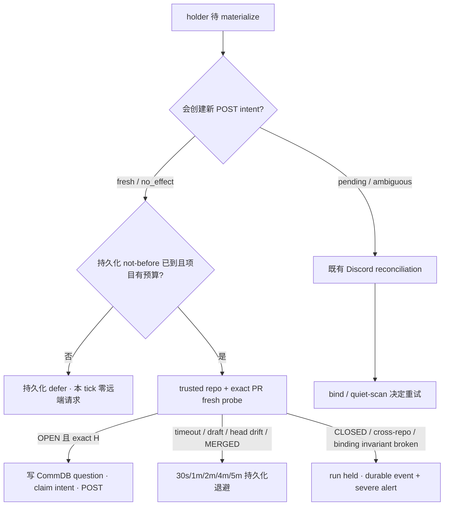

# FLY-1757 铸卡前确认 head 已在 origin — 实施计划
Issue: FLY-1757 (https://linear.app/geoforge3d/issue/FLY-1757/ship卡残刀-铸卡前head-已在-origin断言a4重复卡病已修好留证关闭原1818范围承接于此)
日期: 2026-08-21
基于: research.md

## 1. 目标与非目标

目标：新的 ship-card POST intent 只能在 frozen head 被 fresh 证明仍是该 gate 所绑定 PR 的 GitHub `headRefOid` 后创建；同 head 重放仍只有一张卡，换 head 的新 gate 仍正常铸新卡。远端暂时不可读时持久化退避；`CLOSED` / cross-repo / binding invariant 破坏时 hold run 并告警；`MERGED` 交回既有 external-merge reconciler，不能抢权或每个 3 秒 tick 热循环探测。

非目标：不改 #869 去重算法、不改打回/void/thread archive、不加 reaction 回执、不做历史卡运维清账，也不改 founder 48h 时钟或已退役的 `checkpoint-park`。A4 生产命中次数在现有证据中未知；不把重复卡实发事故误归因给 A4。

## 2. 复审处置

- R1 `origin-probe-trusts-runner-writable-git-config`（HIGH）：接受。删除 `ls-remote`，不读取 worktree Git config；把现有 `probeWorkflowPr()` 抽到无 Express 依赖的小模块，用 trusted slug + exact-head PR number。
- R3 `preflight-hot-loop-unbudgeted-github-probe`（HIGH）：接受。holder 增加专用持久化 probe 状态，materialization 查询尊重 `origin_probe_next_at`；生产 preflight closure 沿用仓库现有 6 次/项目/分钟预算与 backoff 治理形态。确定由 A4 负责的终态不重试，而是原子 hold run、写事件并入 severe alert outbox。
- R4 `merged-pr-hold-conflicts-external-merge-authority`（HIGH）：接受。`MERGED` 不 hold、不 finalize，只做零卡 + durable defer；`external-merge-reconcile.ts` 继续独占 external merge 的 `computeShipDecision → verifyApproval → runPostShipFinalization` / merge-block 裁决。即使其 kill-switch 被 operator 关闭，A4 也不建立第二套 authority；既有 10 分钟 materialization fail-loud 仍会报出 `MERGED` reason。
- R4 resume-redrive 旁路（MEDIUM）：接受。not-before 与 run-active 检查放在 preflight closure 入口，工作集 SQL 仅作优化；resume redrive 直接调用也不能发 raw probe。run 已 held 时直接短路，不重放 terminal settlement。
- R4 reconciliation（LOW）：工作集过滤显式放行 pending/ambiguous/legacy-unknown，确保已可能 POST 的卡永远继续收敛。
- R4 backoff 口径（LOW）：使用与现有 GitHub probe 相同的 30s/1m/2m/4m/5m 数值，但在 A4 模块内本地定义；不从 unrelated ship-ready classifier import 私有常量，不制造跨 feature 耦合。
- R5 fail-loud anchor（MEDIUM advisory）：接受。origin probe bookkeeping 仿照 `recordWorkflowGateCardZeroScan()`，任何 defer/verify/stop 写入都不更新 holder `updated_at`；新增连续 defer 12 分钟后 severe alert 仍触发且 body 带 reason 的回归。
- R5 merged cap（LOW advisory）：接受。source session 已有 `merge_block_reason` 时将 holder 记为 delegated stop reason；工作集优化排除该 reason，closure 入口也永久零 raw probe。外部 reconciler 的现有告警/人工恢复面保持唯一 authority。
- R3 founder clock / retired park（MEDIUM）：接受并删出 scope。A4 在 card intent 前生效，不改 FLY-191 的 `awaiting_review_entered_at` 不变量，也不修改无生产消费者的 `checkpoint-park`。
- R3 focused command（MEDIUM）：去掉 pnpm 的 `--`，确保 Vitest 收到 positional filter。
- legacy NULL（LOW）：无 ship-target binding 保持兼容 skip；下游 `/head-authority` 对 `authority_mode ?? legacy_runner_ship` 仍要求 binding，缺失返回 409 `ship_target_binding_unavailable`（`workflow-decision-routes.ts:498-535`），因此不能实际 ship。
- PR 来源（LOW）：PR number 明确取自 `getCurrentWorkflowNodePrBindingForHead(runId, headSha)`，不从 ship-target binding 读取。

## 3. TDD 分块

### Chunk 1 — RED：probe 原语与持久化节流

1. 将 `WorkflowPrProbeResult` / `probeWorkflowPr()` 原样抽到 `workflow-pr-probe.ts`，原 gate-entry route 继续 import，行为不变。
2. `workflow_gate_holder` 只增加 A4 所需列：`origin_probe_attempts`、`origin_probe_next_at`、`origin_probe_last_reason`、`origin_probe_verified_at`；同步 startup contract/type。
3. StateStore 测试先钉住：transient 失败按 30s/1m/2m/4m/5m（封顶 5m）原子写入 attempts/not-before/reason；未到期 fresh/no_effect holder 不进入 materialization 工作集，pending/ambiguous/legacy-unknown 仍进入；成功清 not-before/reason并写 verified-at；重启新 store 后退避仍有效。
   所有 probe bookkeeping update 明确不写 `updated_at`，避免重置既有 10 分钟 fail-loud 的陈旧锚点。
4. 终态 settlement 测试先钉住：current holder + active run 才能 CAS；一次调用把 run 变 `held`，写唯一 `workflow_gate_origin_preflight_terminal` 事件与 severe alert；重放幂等，不产生重复告警。

### Chunk 2 — RED：exact-PR preflight + 每项目预算

新增 `gate-origin-preflight.test.ts`，覆盖：

1. land/runner_ship binding missing、superseded、run/head/repo mismatch → terminal hold；
2. PR `CLOSED` / cross-repository → terminal hold；`MERGED` → durable defer，run 保持 active，等待现有 external-merge reconciler；
3. probe throw/timeout、draft、head H→H′ → transient backoff，零卡；到期且收敛 OPEN PR@H 后 pass；
4. 同项目一分钟最多 6 次 raw probe；第 7 个 holder被持久化 defer，零 `gh` 调用；不同项目互不影响；
5. engine_terminal → skip；legacy NULL + no binding → skip；legacy NULL + binding → assert；
6. exact OPEN/non-draft/non-cross PR@H → pass 并写 verified-at。
7. source session 出现 `merge_block_reason` 后，当前与后续 tick 永远零 raw probe；run/holder authority 不由 A4 二次改写。

实现 `createWorkflowGateOriginPreflight()` closure。入口第一步重新读取 current holder/run：run 非 active 直接短路；fresh/no_effect 且 not-before 未到直接 defer、零 raw probe，因此 `listWorkflowResumeRedriveWork()` 的第二入口也不能绕过。project key 取 durable run 的 `project_name`，PR number 取 exact-head node binding，repo slug/identity/head 必须与 current ship-target binding 一致。预算只在进程内保留最近 60 秒时间戳（与既有 classifier 一致）；预算耗尽也把 holder defer 到窗口释放，避免 3 秒 CPU 热循环。所有远端失败状态由 StateStore 持久化，所以 Bridge 重启不会清掉退避。

### Chunk 3 — RED：materializer 的 question/intent 前置

在 `gate-materializer.test.ts` 增加：

1. preflight 拒绝时 CommDB 无 pending question、`postCard` 0 次、`card_post_intent_seq=0`；
2. 到期且 PR 收敛后同 holder 重试成功；completed 重放时 preflight/POST 不增加；
3. ambiguous reconciliation 不重复 preflight；
4. no_effect 授权下一次 POST 前重新 preflight。

`GateMaterializerDeps` 增加 required async preflight。调用条件严格为 `card_post_legacy_unknown=0` 且 outcome 为 NULL / `no_effect`，首次位置在 `question_written` 前；pending / ambiguous 与 legacy-unknown 继续既有 reconciliation。failure reason 透传给既有 fail-loud，alert body 追加该 reason。

`workflow-gate-materialization-alert.test.ts` 增加 12 分钟连续 defer 回归：probe bookkeeping 不漂移 `updated_at`，到期 tick 必须 enqueue 一条 body 含最新 failure reason 的 severe alert。

### Chunk 4 — 生产接线与既有对照

plugin 启动时创建一次共享预算的 preflight closure，再注入 materializer；不在每 tick 重建预算。现有直接 materializer 测试显式传 no-op preflight；安全、退避、预算和 terminal hold 由新模块/StateStore 测试覆盖。

保持并复跑：#869 同-holder exact-one；#846 card A → 新 head → card B 且只批准 B；ambiguous effect reconciliation；workflow decision route 的原 PR probe 测试。

## 4. 失败分类与恢复

| 分类 | 例子 | 处置 |
|---|---|---|
| pass | `OPEN`、非 draft、非 cross-repo、`headRefOid=H` | 记录 verified-at，继续铸卡 |
| transient | CLI timeout/auth/API error、draft、`headRefOid=H′` | 零卡；30s/1m/2m/4m/5m 持久化退避，10m fail-loud 带 reason；收敛后自动恢复 |
| terminal invariant | binding 缺失/已 superseded/run-head-repo identity 不一致 | 零卡；run held；唯一 durable event + severe alert，需 Lead 检查 |
| external merge | `MERGED` | 零卡；durable defer；run 保持 active，由现有 external-merge reconciler 独占 finalization / merge-block 裁决 |
| terminal PR | `CLOSED` / cross-repository | 零卡；run held；唯一 durable event + severe alert，不再自动 probe |
| compatibility skip | `engine_terminal`；legacy NULL 且无 binding | 不 probe；后者 ship 下游仍被 binding 409 拦住 |

## 5. 验收

- A4 负向：PR 远端 head 已非 H → 0 CommDB question、0 intent、0 Discord 卡，并按持久化 not-before bounded retry。
- 正对照：PR 仍为 H，同一 holder 触发两次 → 1 次 fresh probe、1 个 POST intent、1 张卡。
- 变 head 对照：打回修复后 H′ 的新 holder可铸新卡，旧卡保持 superseded。
- ambiguous 对照：已可能 POST 的 intent 只 reconcile，不因 remote probe 卡死。
- quota 对照：同项目 raw probe ≤6/min；Bridge 重启不绕过 holder 的失败 not-before。
- external-merge 对照：`MERGED` 不铸卡、不 hold、不直接 finalization；既有 reconciler 仍能在 TTL 后收敛。
- terminal 对照：`CLOSED` / cross-repo / binding invariant 使 run held 且 durable alert 可见。

## 6. 验证命令

focused（无 `--`，Vitest 实际接收 path filter）：

- `pnpm --filter flywheel-teamlead test:run src/bridge/__tests__/gate-origin-preflight.test.ts src/bridge/__tests__/workflow-decision-routes.test.ts`
- `pnpm --filter flywheel-teamlead test:run src/__tests__/StateStore.workflow-gate-origin-probe.test.ts`
- `pnpm --filter flywheel-teamlead test:run src/bridge/__tests__/gate-materializer.test.ts src/bridge/__tests__/workflow-gate-materialization-alert.test.ts`
- `pnpm --filter flywheel-teamlead test:run src/__tests__/StateStore.founder-kickback-newcard-loop.test.ts`

full repo：`pnpm lint`、`pnpm -r build`、`pnpm test:packages:run`；另跑 `git diff --check`，确认无 dependency/flag 变化。

只读 auth 证据：不执行真卡演练；记录相同 Bridge 环境的 `gh pr view -R <nodeBinding.probe_repo_slug> <nodeBinding.pr_number> --json headRefOid` 事实。部署后 daemon 行为由 DAG QA 验证，本 implement 节点不冒充已测。

## 7. 回滚与风险

回滚移除 preflight 模块/接线、holder 的兼容新增列与测试；SQLite 新列可保留无害，避免破坏性 down migration。

主要风险是把 ambiguous effect 当 fresh attempt、resume-redrive 绕过 not-before、或 A4 抢走 external-merge authority。materializer 判据、closure 入口与 `MERGED` non-hold 测试分别钉住；terminal settlement 用 current-holder + active-run CAS，不能 hold 已换 head 的新 run。

## 8. 会过期的结论

| 结论 | as-of | 何时会过期 | 重核命令 |
|---|---|---|---|
| exact PR probe 可抽为无 Express 依赖模块 | `origin/main` @ `d97bd1173` | workflow decision PR authority 改动后 | `git log -S 'probeWorkflowPr' -- packages/teamlead/src/bridge/workflow-decision-routes.ts` |
| materializer poll 是 3 秒且 holder 工作集来自 StateStore | `origin/main` @ `d97bd1173` | GatePoller / plugin tick 改动后 | `rg -n "pollIntervalMs|listWorkflowGateHoldersForMaterialization" packages/teamlead/src/bridge packages/teamlead/src/StateStore.ts` |
| 既有项目预算为 6/min、unknown backoff 封顶 5m | `origin/main` @ `d97bd1173` | ship-ready classifier 改常量后 | `rg -n "PROBE_BUDGET_PER_MINUTE|UNKNOWN_BACKOFF_MS" packages/teamlead/src/bridge/workflow-ship-ready-arm.ts` |
| full-repo gate 命令仍为 lint/build/test:packages:run | 2026-08-21 | root scripts 改名后 | `node -e "const p=require('./package.json'); console.log(p.scripts)"` |
