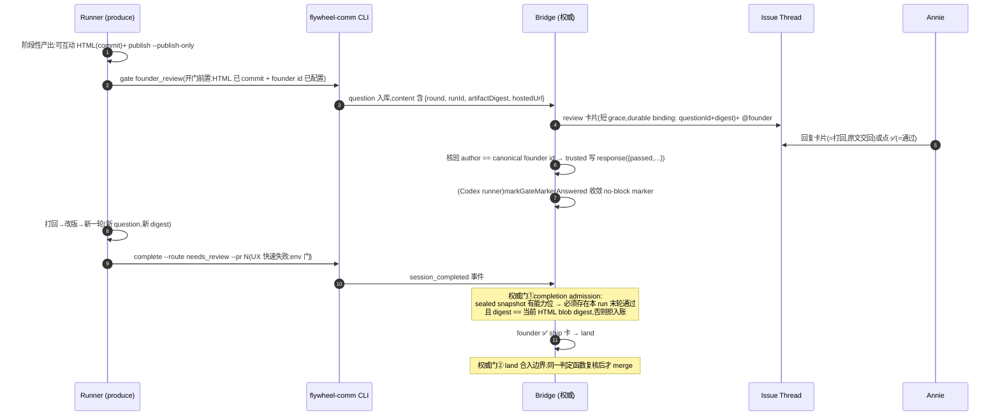

# FLY-1758 产品线互动回合:founder_review checkpoint — 实施计划

Issue: FLY-1758 (https://linear.app/geoforge3d/issue/FLY-1758/产品线互动回合-阶段性产出必须先经-founder-review-才准继续-新-founder-review-checkpoint复用)
日期: 2026-08-14(R1+R2+R3 修订:finalization 真实入口逐点接线、marker 锚点改 response 派生、末轮语义措辞统一)
基于: research.md + Codex design review R1(5B+2H+1M)+ R2(2B+3H+1M)+ R3(1B+1H+1M),全部采纳

## 0. 一句话

新增一个**非终局、只有 founder 能答、一个 run 内可多次**的 checkpoint `founder_review`(复用 `isTrustedApprovalAttribution` 归属 + 现有 gate/卡片基座),把 FLY-1404/1508 的可互动 HTML 合同以**阻塞版**注入 prd/design/prototype 的 produce 节点;**授权主脊在 Bridge/engine 侧**:generalized completion admission 与 engine land 合入边界共用同一个 **run 级、产物版本绑定**的通过判定 —— 没拿到 founder 对**当前版本产物**的末轮「通过」,完成入不了账、land 合不了;CLI complete 门只是就近的 UX 快速失败。零 gate 节点、零图结构改动、零新送达设施。

## 1. 范围与非目标

**范围**(全部在本仓):
- flywheel-comm:`founder_review` checkpoint 语义(拒答/founder 写入/round-artifact 绑定/complete UX 门/verify 3.6/gate 开门前置/Codex marker 收敛)。
- Bridge(teamlead):**completion admission 权威门 + land 边界复核**、卡片白名单+文案、reply/✅ 摄入、review-card binding 新表、park 归属、退休/巡逻清单逐处裁定。
- 能力位全链:shapes YAML → menu 编译 → manifest validator → sealed run snapshot(唯一权威)→ dispatcher/Blueprint → AdapterExecutionContext → Claude `-e` env / Codex `buildDaemonEnv`。
- Prompt 合同拆分 + 阻塞版收尾;三个 executor .md;`.flywheel/config.yaml`;部署 quiesce 手册。

**非目标(⛔ 明确不做)**:
1. 不加 kickback 环/边(FLY-1691 冻结);不加第二个 gate 节点(一图一 gate);不动 `menus/shapes/*.yaml` 的 nodes/edges(只加 shape 级布尔字段)。
2. 不新造送达设施、不复活 FLY-598 founder-ux 路由(FLY-900 已撤)。
3. 不改 FLY-1404 design 节点合同的非阻塞语义(逐字不变)。
4. 不做页内留言自动回传(FLY-298 Backlog);文案绝不暗示已自动化。
5. 不加新 env feature flag;启用面 = shapes 能力位 + `.flywheel/config.yaml` checkpoints 块,双缺席 = 逐字现状。
6. `question` checkpoint(runner 问 Lead)行为零变化。
7. **不把 `founder_review` 加进 `REVIEW_GATE_CHECKPOINTS`**(那个集合让 checkpoint 跨 owner 生命周期存活;review 回合是 run 内之物,owner finalize 即随之退休)。

## 2. 设计总览

**授权模型(R1 B1 + R2 B1 修订)**:runner env / CLI 门都是可被剥离的,**不作为授权**。授权 = **一个共享的 run 级判定谓词**,在覆盖全部通向「Done/合入」的服务端边界被调用:
- ①generalized completion admission(`event-route.ts` 的 `commitEnrolledCompletion` 之前);
- ②managed land 合入边界(`land-executor` 权威检查处,merge 前复核);
- ③**external/engine finalization 各真实入口逐点接线(R3 B1 修正:`computeEngineWorkflowShipPrecondition` 不是共同咽喉,生产只有 completed-but-unfinalized 一处调它)**:
  - (a) declared-PR convergence:`reconcileDeclaredPrRuns`(`external-merge-reconcile.ts:581-605`)在 `:601` 调本地 `finalize()`(→`:461` 直入 `runPostShipFinalization`)**之前**显式调用同一谓词;digest 从 sealed producer node 解析 exact `workflow_node_pr_binding` 的 repo/path/head 重算 —— **不得**拿排序后 `current.at(-1)` 当 founder artifact authority。
  - (b) completed-but-unfinalized:保留在 `computeEngineWorkflowShipPrecondition`(`merge-ship-gate.ts:198-264`;现有调用点 `external-merge-reconcile.ts:682-687`)。
  - (c) parked/recovered(status-independent)路径:在 `computeAuthoritativeShipDecision` 的 engine 分支(或各 mutation boundary)显式接入(`external-merge-reconcile.ts:616` / `merge-ship-gate.ts:504` 两个调用方自然继承)。
  - 拒绝时写 durable once-per-(run, head, reason) 的 hold + alert,且**不得**产生 manifest finalization claim / `post_ship_finalization_claim` / `external_merge_finalized` / Linear Done。
  - 六条破坏性测试中的 external 三条必须**驱动这些真实入口**并断言共享谓词确实被执行(不许只单测 helper)。
三处读同一份 sealed snapshot(是否 required)+ 同一份 CommDB/StateStore 数据(是否通过),不存在第二套判定(FLY-900 双层脱节教训)。**digest 的 Git 输入按调用点取权威值**:admission 用 `event-route` 已解析的 server-authoritative completionHead;land/finalization 用 `approved_head`/`frozen_head_sha` 对应的 Git object 重算 —— 绝不用进程当前 HEAD。

**代码事实更正(R2 B1)**:`computeAuthoritativeShipDecision` 的 legacy 分支在 `merge-ship-gate.ts:353-359` 会调 `computeShipDecision`(内含 verifyApproval);真正跳过 verifyApproval 的是 engine land 与 status-independent recovery。`verify-approval` 3.6 仍加,只诚实覆盖 legacy/runner_ship CLI 路径。

**包边界(R2 M6)**:`flywheel-comm` 不依赖 teamlead —— 谓词做成 comm 包里的**纯判定函数 + 窄接口**(`FounderReviewStateReader` / artifact reader);Bridge 侧用 StateStore adapter、CLI 侧用 readonly SQLite adapter 实现同一接口,**两个 adapter 跑同一组 contract tests**(snapshot 缺失/跨 run/digest 漂移必须给出一致结果),杜绝各调用点各自重写查询造成第二套判定。

## 3. 核心数据设计(R1 B2/B3 修订)

### 3.1 round 的身份:run 级,不是 issue 级
- 历史 run 与 active run 同 issue 并存(StateStore 只限「同 issue 同时一个 active run」),按 issue_id 取末轮会让**新 run 复用旧 run 的批准**。
- 判定 helper 签名:`resolveFounderReviewVerdict({reader, runId, authoritativeHead})` —— 只接受 **question owner 的 execution 属于该 run**(经 `workflow_execution_binding` / run node execution 归属)的回合;跨 execId 同 run 可过,跨 run 同 issue 必不串线。
- 取 run 的方式:complete 侧从 `currentWorkflowCompletionActivationFromEnv`(现有 activation env)取;Bridge 各权威门从 exact workflow binding 取。**产品 run 的 snapshot/binding 解析失败 = fail-closed**(不是静默跳过)。
- **「末轮」的精确语义(R2 H3)**:先由**服务端插入顺序**选出本 run 最新的、未被 supersede 的有效 question,**再要求该 question 本身的 response 为 passed** —— 绝不是「存在任一 passed」:round 1 passed 后 round 2 pending/rejected(哪怕同 digest)= 未通过。测试:pass(H)→新 pending(H) 拦;pass(H)→新 rejected(H) 拦。

### 3.2 round 与产物版本的不可变绑定
- **开 round 时**把 `{round: N, runId, artifactDigest, hostedUrl, paths}` 写进 question content(mailbox 行 insert 后不可变,零 schema 迁移)。
- `artifactDigest` = founder-facing HTML 的 **git blob digest**(多文件时取排序后 (path, blobSha) 列表的 sha256)。绑 blob 不绑 HEAD:progress.md 等无关 commit 漂 HEAD 不影响;**HTML 内容一变 digest 必变**。
- **通过只对版本有效(与 §3.1 末轮语义严格同构,R3 M3)**:各权威门与 complete 门的判定统一为「本 run **最新有效(未 supersede)question 本身**必须 passed,**且该 question/response 封存的 digest == 当前 committed HTML blob digest**」—— 绝不回退取历史某个 passed round 的 digest(pass(H) 后出现新 pending/rejected(H) 时,旧 pass 不得复用;两条 pass→pending / pass→rejected 破坏性测试作为非空哨兵)。不等 = 她通过的不是这一版 → 必须重开 round。
- 对照测试:pass 版本 H → 改 HTML 再 commit → complete/land 必败;只加无关 progress commit(HTML blob 不变)→ 通过(显式政策)。

### 3.3 review-card binding(R1 B4 + R2 H4)
- 现有 ship 卡 binding 强制 `prHeadSha` 且只在 `awaiting_review + review_question_id` 时写 —— `founder_review` 发生在 PR 之前,**不能复用**。
- 新增 StateStore **additive 小表** `founder_review_card_binding(question_id PK, message_id NOT NULL UNIQUE, run_id NOT NULL, artifact_digest NOT NULL, created_at)`;**不可 UPDATE/DELETE**(insert-or-verify 语义);写入时重新核对 question 的 runId/digest/当前轮次。`UNIQUE(message_id)` 保证同一条 Discord 消息永远绑不了两个 round。
- **崩溃窗次序(R2 H4)**:Discord POST 成功后,**只有 binding insert-or-verify 成功才写 terminal notify marker**;binding 写失败保持 transient + 告警,由 GatePoller 既有重试/恢复机制重放 —— 消灭「founder 看得到但永远不能作答的孤儿卡」。测试:POST 后崩溃、binding 写失败、2xx 缺 message id、重启重放、同 message 绑两题 —— 终态必须恰一张 authoritative 卡,其余全 stale 且不能授权。
- reply(type-19)与 ✅ reaction 都**只能命中 exact current round**(经 binding 表回查 questionId);旧卡迟到 reaction、round N 的 reply 到达时 N+1 已开、同 issue 多卡、binding 缺失/重复 → 全部 fail-closed 不串 round。
- ✅ 摄入:**扩展 GatePoller 既有 reaction rider**(现只筛 `approve_to_ship`)加 founder_review 分支;文字 reply 走 founder-reply-deliverer 新分支。两路汇入同一个写入原语。

### 3.4 裁定语义
- ✅ reaction = passed;reply 文本过精确 allowlist(「都可以了/可以了/通过/LGTM/approved」归一化匹配)= passed;其余 reply = passed:false + feedback=全文。v1 无 Haiku 分类器 —— 错判只许偏「多一轮」。
- 写入原语 `trustedFounderReviewResponse`:包 `insertResponseIfGateOpen`(expectedCheckpoint+TOCTOU)+ `isTrustedApprovalAttribution` 断言;content=`{passed, feedback, artifactDigest}`。**不复用** `write-gate-response.ts`(硬拒非 ship + 强绑 ship FSM)。
- **durable response 落库后,幂等调用 `markGateMarkerAnsweredForExecution`** —— 否则 Codex runner 的 `--no-block` marker 永不收敛(R1 H6)。**重放锚点 = response 行本身,不建第二份 intent(R2 H5 + R3 H2)**:若把 intent 写进 StateStore,CommDB response commit 之后、StateStore intent 写入之前的崩溃会留下永久孤儿(question 已退出 pending 扫描,intent 又不存在)。改为**从 durable 数据直接派生收敛工作**:写入路径先尽力 mark;Bridge 启动与每轮 poll 各跑一个有界 reconcile —— 扫描近期已答的 `founder_review` question(CommDB,时间窗有界),对其 execution 幂等补 `markGateMarkerAnsweredForExecution`。response 行即锚点,零新表、无跨库写序问题;绝不回滚 response。**精确 crash 测试(R3 H2)**:CommDB response commit 成功后、任何 marker 写入前 kill 进程 → 重启后 `answeredAt` 最终补齐、无迟到 timeout;foreign execution marker 不被碰。

## 4. 能力位全链(R1 B5:每一跳都点名)

唯一权威表示 = **sealed run snapshot 里的节点字段**。落点链(每跳都有正反兼容测试):
1. **shape YAML**:`menus/shapes/{prd,design,prototype}.yaml` 加 shape 级 `founderReview: true`;`workflow-menu.ts:203-206` 严格 parser 的接受键集合加该可选布尔(缺席=false)。`code/generic.yaml` 不动。
2. **menu 编译**:`compileWorkflowMenuSeed` 把它投影为 produce 节点 manifest 条目的可选键 `founder_review: true`。
3. **manifest validator**:`workflow-template.ts:888-909` exact-key 校验加该可选键(布尔;非布尔 throw)。
4. **run snapshot**:`workflow-run-snapshot.ts:385-416,478-536` 构建/严格解析/digest 加该字段(缺席=false);暴露 `nodeRequiresFounderReview(nodeId)`。旧 snapshot(无字段)解析不变 —— 向后兼容;新 snapshot 落到旧代码由部署 quiesce(§7)保证不发生。
5. **dispatch/Blueprint**:generalized selection / RunDispatcher 把该位带进 `BlueprintContext.workflowCapabilities`;`AdapterExecutionContext`(`packages/core/src/adapter-types.ts`)加可选字段。
6. **两个 adapter**:Claude tmux `-e FLYWHEEL_FOUNDER_REVIEW_REQUIRED=1`;Codex `buildDaemonEnv` 显式写入(FLY-1643 delete-then-layer 模式)+ `assertWorkflowCapabilities` 同步。
7. **权威读法**:Bridge 各权威门只读 sealed snapshot;env 只喂 CLI 的 UX 门与 prompt 注入。

**启用公式(R2 B2,写死,所有暴露面一致)**:`config enabled && exact owner activation/run binding && sealed producer node founder_review === true`。逐面落实:
- **Blueprint**:对**所有** runner(不只 generalized;legacy 工程 runner 同样)在能力位缺席时无条件 skip founder_review 注入 —— 项目级 checkpoint config 单独存在**不产生任何 prompt**;`:2571-2600` 的兜底 else 分支绝不能吃到它。
- **gate 开门 / Bridge question admission**:server-side 校验 owner activation 的 sealed snapshot 确实带能力位,不带 = 拒开/拒收;卡片层不得只信 question content 自述。
- **land/finalization**:required 判定读**产生 carrier 的 produce 节点**的能力位,不读 land 节点自身。
- 正反测试:config 已启用时,legacy 工程 / code generalized(design·implement·qa)/ QA runner 均无 prompt、无卡;仅三条产品 produce 有。

## 5. 改动清单(按依赖顺序)

### 层 1 — flywheel-comm
- **1a** 新建 `founder-review.ts`:checkpoint 常量 + `isFounderReviewCheckpoint` + digest 计算 + `resolveFounderReviewVerdict`(§3.1/3.2 语义;供 CLI 与 Bridge 共用)。
- **1b** `respond.ts` **无条件拒**(先于批准意图判定;通过和打回都拒 —— approve_to_ship 那套只拦批准、放行反馈走 Bridge,对 founder_review 不够)。
- **1c** `db.ts:1704-1709` not-Lead-routable 加名;裸 SQL 清单逐处裁定(**决定写死在本计划**,R1 M8):
  - `db.ts:1381/1401/1426`(supersede 巡逻):**加,且不止 SQL IN 加名(R2 H3)** —— 现有 `issue-gate-supersede.ts:135-171` 分组键是 `issueId + checkpoint`、`canSupersedeGate` 只验 checkpoint/时间,直接加名会跨 run 误杀。founder_review 的分组与 mutation-time recheck 都必须纳入经 `workflow_execution_binding` 解析出的 runId:新 round 只 supersede **同 run** 旧 pending;跨 run question 永不互相 supersede(测试覆盖)。
  - `db.ts:4889-4929`(finalizeSession):**不加豁免** —— owner finalize 时未答 round 随之 terminal-disposed(回合是 run 内之物)。
  - `zombie-gate-hygiene.ts:342`:**不加集合**,但补测试:live running/parked session 的 pending round 不被 sweep。
  - `question-admission.ts:242-277`:**加** checkpoint 专属 admission —— content 缺 runId/digest 绑定即拒。
  - `REVIEW_GATE_CHECKPOINTS`:**不加**(非目标 7)。
- **1d** `db.ts` 新增 `trustedFounderReviewResponse`(§3.4)。
- **1e** `gate.ts` 开门前置(fail-open catch 之外):founder id 未配置 → throw(FLY-900);HTML 证据未 commit → throw(验收 3);开门时计算并封存 artifactDigest 进 question content。
- **1f** `complete.ts` UX 快速失败门:env=1 且 route ∈ {needs_review, no_code} 时,调 1a helper(runId 取自 activation env)要求末轮通过且 digest 当前;失败给出正路文案。route ∈ {blocked, ship_attempt_failed} 豁免;env 缺席零变化。**定位=就近反馈,不是授权**。
- **1g** `verify-approval.ts` 3.6:新增 reason `founder_review_missing/not_passed/stale_artifact`;经 session→workflow binding 解析 run,产品 run 解析失败 fail-closed;无 binding 的 legacy session 跳过。诚实边界:此步只覆盖 legacy/runner_ship CLI 路径(engine land 由层 2 权威门覆盖)。

### 层 2 — Bridge 权威 + 可见性
- **2a 权威门①**:generalized completion admission(`event-route.ts:733-938`,`commitEnrolledCompletion` 之前):sealed snapshot 有能力位的节点 completion,必须过 1a 判定,否则拒入账(结构化 reason,进 issue thread 提示);digest 用 server-authoritative completionHead。
- **2b 权威门②**:`land-executor` 合入前复核同一判定(防「admission 后又改 HTML / 直接驱动 carrier」);digest 从 `approved_head` Git object 重算。
- **2b′ 权威门③(R2 B1)**:`computeEngineWorkflowShipPrecondition`(`merge-ship-gate.ts:198-264`)接入同一判定 —— 覆盖 external-merge reconcile 的 declared-PR finalize 与 completed-but-unfinalized 两条路及 status-independent recovery;无通过 = hold + alert,绝不 finalize/Done;digest 从 `frozen_head_sha`/`approved_head` 重算。三条外部合并破坏性测试:parked recovery / completed-unfinalized / sealed declared-PR convergence。
- **2c** `gate-poller.ts:1556` 卡片白名单加名;grace 走 ship 式短档;dedup/退避复用。
- **2d** `founder-thread-notifier.ts`:union + `buildBody` founder_review 分支(第 N 轮 + hosted URL + 「回复=打回 / ✅=通过 / 页内留言用汇总复制贴回」)。
- **2e** `founder-reply-deliverer.ts` reply 分支 + GatePoller reaction rider 分支(§3.3);歧义散文维持 `deliverAmbiguousToLead`。
- **2f** StateStore additive 表 `founder_review_card_binding`(§3.3)。
- **2g** `checkpoint-park.ts`:founder_review → `party:"founder"`。
- **2h** H6 marker 收敛接线(§3.4 末条)。

### 层 3 — 能力位管线(§4 全链)

### 层 4 — Prompt 合同
- `founderDesignHtmlDeliveryLines` 拆共享正文 + 可替换收尾;design 节点收尾逐字不变(现有正负锚点测试保绿)。
- 产品线阻塞版收尾 + 回合协议块(粒度表、publish --publish-only、gate founder_review、打回改版循环、机器门声明、诚实边界),注入条件 = ctx 能力位,在 generalized 路径 complete 指令行之前。
- `Blueprint.ts:2356-2600` checkpoint prompt 加 founder_review 显式分支;`:2367-2372` generalized 剥离名单按能力位放行;兜底 else("BLOCKS until your Lead responds")绝不能吃到 founder_review。

### 层 5 — 三个 executor .md(+designer 变体):删病根句(pm:119-122),回合协议改挂 founder_review;question 仍问 Lead(不再声称 question 有 founder 兜底);"No new channel" 措辞澄清。

### 层 6 — 配置:`.flywheel/config.yaml` checkpoints 加 `founder_review {enabled, timeout_ms: 172800000, timeout_behavior: fail-close}`(48h 对齐 FLY-159;超时=停+gate_timed_out 升级,绝不 fail-open 放行)。

## 6. 测试计划(先红后绿;验收逐条映射)

| # | 验收 | 测试 |
|---|---|---|
| 1 | 无通过**无法**进 ship,主动去破 | **六条破坏性测试(R1 B1 + R2 B1)**:①伪造 `/events session_completed`(剥 env 直发)→ admission 拒;②直接驱动 carrier → land 边界拒;③直接执行 engine land → 拒;④external-merge parked recovery、⑤completed-unfinalized、⑥sealed declared-PR convergence → 无通过均 hold+alert 不 finalize/Done。加:complete 门四态(零回合/末轮 rejected/末轮 pending/末轮 passed);**run 级串线矩阵(R1 B2)**:旧 run passed + 新 run 无 round 必拦;同 run 跨 execId passed 必过;同 issue 不同 run 的 pending/rejected 不串;**末轮语义(R2 H3)**:pass→新 pending / pass→新 rejected 均拦;**版本绑定(R1 B3)**:pass 后改 HTML 必败、无关 progress commit 不受影响;**双 adapter contract tests(R2 M6)**:StateStore adapter 与 readonly SQLite adapter 对 snapshot 缺失/跨 run/digest 漂移结果一致;byte-compat 哨兵:无能力位工程 run 全链逐字现状 + **config 已启用时 legacy 工程/code generalized/QA 无 prompt 无卡(R2 B2)** |
| 2 | Lead respond 被拒 | respond 三形态(批准文本/反馈文本/JSON)全拒;`--lead bridge`/snowflake 伪造拒;db 层 not-Lead-routable 断言 |
| 3 | 产出未产出/未送达 → 回合无效 | 无 committed HTML → gate 拒开;伪造 leadId response → verdict 视同未答;question 缺 runId/digest → admission 拒 |
| 4 | E2E 她收到→留言→打回→再送达 | 真机(QA 节点,real Discord):卡片短 grace 送达、reply 原文回 runner、✅=passed、**旧卡迟到 ✅ / N+1 已开时 round N reply / 同 issue 多卡 / binding 缺失重复全 fail-closed(R1 B4)**;**binding 崩溃窗矩阵(R2 H4)**:POST 后崩溃 / binding 写失败 / 2xx 缺 message id / 重启重放 / 同 message 绑两题 → 终态恰一张 authoritative 卡;**marker 收敛(R1 H6 + R2 H5)**:首次 mark 失败+重启后 answeredAt 补齐、foreign marker 不碰、已答 gate 不迟到超时;founder id 未配置 fail-loud(FLY-900 回归) |
| — | 生命周期矩阵(R1 M8) | live running/parked 的 pending round 经 purge/zombie sweep 存活;新 round 只 supersede 同 run 旧 pending;answered 历史不可改写;finalize 后未答 round terminal-disposed 且迟到写入被拒;一题第二个 response 被唯一索引拒 |
| — | 能力位兼容(R1 B5) | 旧 snapshot/digest 解析不变;字段缺席=false;新字段非布尔 throw;两 adapter env 注入各一条;权威门读 snapshot 非 env |

单测落点:flywheel-comm(respond/gate/complete/verify/founder-review)、teamlead(admission/land/deliverer/poller/park/binding 表)、edge-worker(Blueprint 注入正负锚点)、config(registry 兼容)。全仓 lint + build + 定向 test(host 全量不作验收门)。

## 7. 部署(R1 H7:quiesce 顺序是强制步骤,不是提醒)

1. **暂停** prd/design/prototype 三类 dispatch(Lead 停派 + 确认无 in-flight 产品 produce 节点,或等其收尾)。
2. merge → 生产 `git pull` + build。
3. **重启 Bridge/Lead**,探测新能力(新 checkpoint 卡片路径 / reaction rider / admission 门生效)。
4. seed 新 menu(shapes 能力位随 build 加载)→ 恢复产品 dispatch。
5. **回滚序**:先停新 dispatch,再回退消费者(Bridge),最后回退 shapes;重启窗口内已开的 pending founder_review 回合:记录 questionId,重启后由 Lead 用恢复手册(附在 PR)重放卡片或判 supersede —— 不许静默丢。
版本错位风险(旧 Bridge + 新 prompt = 最长 48h silent hold)由步骤 1/3 消除。

## 8. 交付切分

单 PR、按层分 commit(1→6 层顺序即依赖顺序)。PR 描述含:裸 SQL 清单逐处裁定表(§5-1c)、部署 quiesce 手册(§7)、pending round 恢复手册。后续单:FLY-298 回传;pass 文本 Haiku 分类器;Lead 规则细化。

## 9. 风险与诚实边界

1. 超时 48h fail-close:宁可停,绝不无 review 继续;gate_timed_out 已有升级。
2. 页内留言无自动回传(FLY-298);文案不撒谎。
3. 「每一版都送」的 cadence 是 .md 行为合同;机器门保证:required run 必有回合、末轮通过、且通过绑定当前版本产物。
4. env/CLI 门可被剥离 —— 已明确降级为 UX;授权在 Bridge/engine 权威边界(R1 B1)。
5. 命名撞车:`founder_review_gate_exclude`(FLY-1314)与本单无关,注释互认。
