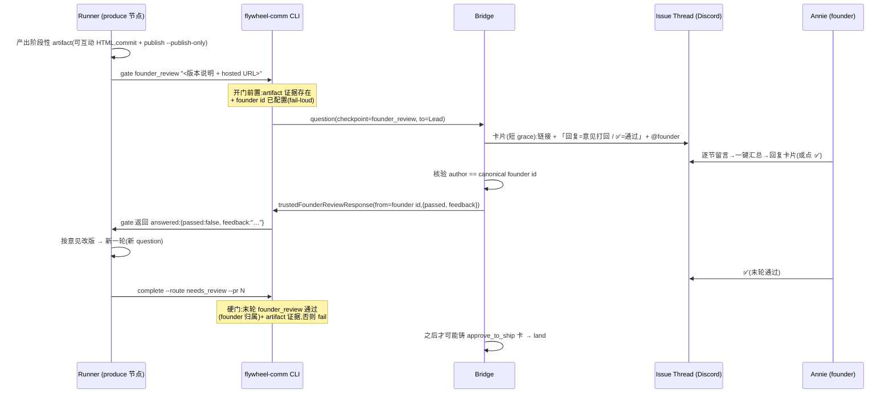

# FLY-1758 产品线互动回合:founder_review checkpoint — 实施计划

Issue: FLY-1758 (https://linear.app/geoforge3d/issue/FLY-1758/产品线互动回合-阶段性产出必须先经-founder-review-才准继续-新-founder-review-checkpoint复用)
日期: 2026-08-13
基于: research.md

## 0. 一句话

新增一个**非终局、只有 founder 能答、一个 session 可多次**的 checkpoint `founder_review`(复用 `isTrustedApprovalAttribution` 归属 + 现有 gate/卡片/回复摄入基座),把 FLY-1404/1508 的可互动 HTML 合同以**阻塞版**注入 prd/design/prototype 三条流的 produce 节点,并用「complete 硬门(主)+ verify-approval 3.6(兜底)」两道共享数据源的机器校验保证:没拿到 founder 末轮「通过」,产品线 run 完成不了、更进不了 ship。零 gate 节点、零图结构改动、零 schema 迁移、零新送达设施。

## 1. 范围与非目标

**范围**(全部在本仓):
- flywheel-comm:`founder_review` checkpoint 语义(拒答/founder 写入/complete 硬门/verify 3.6/gate 开门前置)。
- Bridge(teamlead):卡片白名单+文案、founder 回复/✅ 摄入新分支、park 归属、巡逻清单加名。
- 能力位管线:menus YAML → menu 编译 → manifest → Blueprint ctx → runner env。
- Prompt 合同:`founderDesignHtmlDeliveryLines` 拆分 + 阻塞版收尾 + checkpoint prompt 分支。
- 三个 executor .md 的回合协议改写 + `.flywheel/config.yaml` checkpoint 配置。

**非目标(⛔ 明确不做)**:
1. 不给三个产品模板加 founder kickback 环/边(FLY-1691 已冻结);不新增 gate 节点(引擎一图一 gate,`workflow-menu.ts:219` / `workflow-template.ts:1290-1318`);不改 `menus/shapes/*.yaml` 的 nodes/edges。
2. 不新造送达设施、不复活 FLY-598 founder-ux 的独立路由(FLY-900 已撤)。
3. 不改 FLY-1404 design 节点合同本身(它的非阻塞语义对工程 design 节点保持逐字不变)。
4. 不做 HTML 页内留言的自动回传(FLY-298 仍 Backlog;真实闭环=她汇总复制→回贴卡片→即本轮 feedback)。
5. 不加新 env feature flag(Annie「不加新 flag」方向;启用面 = `.flywheel/config.yaml` checkpoints 块 + 模板能力位,双双缺席 = 逐字现状)。
6. `question` checkpoint(runner 问 Lead)行为零变化 —— Annie 明确说这块不变。

## 2. 设计总览



**为什么这个形状**(取舍,详见 research.md §6/§8):
- 回合收件人从结构上改回 founder(gate-poller 白名单加名 + 短 grace 直投卡片),而不是靠 FLY-605 超时兜底 —— 这正是 issue 定位的退化点。
- 阻塞点放在 **runner 自己的 complete**(FLY-1404 硬门同款形状),字面实现「不许把做完了当可以 ship」:approve_to_ship 卡在通过前根本铸不出来,不会出现「她收到 ship 卡但从没 review 过」的错误 UX,也没有扣留 materialization 的 FLY-1731 族 strand 风险。
- **不选** ship_claims 头钉方案:produce 分支上 progress ledger 持续 commit,git head 恒漂,头对齐约束在产品线不可用(research §6a)。
- verify-approval 3.6 兜底防绕过(env 被剥/非常规路径),land 与 runner_ship 经 `evaluateShipEligibility` 同时继承;与主门共享同一查询 helper、同一 CommDB 数据源(FLY-900 双层脱节教训)。

## 3. 改动清单

### 层 1 — flywheel-comm(checkpoint 语义,核心)

**1a. 新建 `packages/flywheel-comm/src/founder-review.ts`**(单一真相源,照 `review-gate-checkpoints.ts` 集合模式):
- `FOUNDER_REVIEW_CHECKPOINT = "founder_review"`;`isFounderReviewCheckpoint(cp)`。
- 裁定 helper:`resolveFounderReviewVerdict(db, issueId, founderId, gateOn)` → `{state: "none"|"pending"|"passed"|"rejected", latestQuestionId, feedback?}`:取该 issue 最新 `founder_review` question;未答=pending;已答则 parse `{passed:boolean, feedback?:string}` 且 **response.from_agent 必须过 `isTrustedApprovalAttribution`**,否则视同未答(不计数,验收 3)。**按 issue_id 查,不按 execId**(research §6 雷点;复用 verify-approval 已读的 sessions.issue_id)。
- 此 helper 是 complete 门与 verify 3.6 的**共同**判定函数(FLY-900 教训:一份数据源一份判定)。

**1b. `respond.ts` 无条件拒**(插在 `:44` checkpoint 读取后、所有放行路径前;**先于**批准意图判定):
```ts
if (isFounderReviewCheckpoint(question.checkpoint)) {
  throw new Error("flywheel-comm: founder_review is founder-only — a Lead cannot respond (neither pass nor feedback). The founder answers on the review card in the issue thread (reply = feedback, ✅ = pass).");
}
```
与 approve_to_ship 的差异必须保留:approve_to_ship 只拦批准意图、放行反馈走 Bridge;founder_review **通过和打回都拒**(research §4 —— 不然 Lead 仍可替写打回意见,中间版本照样绕过她)。

**1c. `db.ts:1704-1709` not-Lead-routable 加名**(纵深,挡绕过 CLI 的直写)+ 全库审计裸 SQL `IN ('approve_to_ship','review_design','review_code')` 清单(`db.ts:1381/1401/1426/4923`、`zombie-gate-hygiene.ts:342`、`question-admission.ts:242-277`):逐处判定 founder_review 该不该进 —— 原则:**session 存续期内活回合不得被退休/僵尸清理;session finalize 时未答回合正常随之退休**(回合是 session 内之物)。每处判定写进 PR 描述。

**1d. 新增 `db.ts` founder 写入方法 `trustedFounderReviewResponse(input)`**:包一层 `insertResponseIfGateOpen`(:1604-1653,自带 expectedCheckpoint+TOCTOU),断言 `isTrustedApprovalAttribution(input.fromAgent, founderId)`,content = `JSON.stringify({passed, feedback})`。**不复用** `write-gate-response.ts`(其 :319 硬拒非 ship 且强绑 ship FSM/pr_head_sha)。~25 行。

**1e. `gate.ts` 开门前置**(照 CI-green 形状,放在 fail-open catch 之外,`gate.ts:83-88` 同款):
- checkpoint == founder_review 时:①`resolveFounderId` 未配置 → throw(FLY-900 fail-loud 教训:绝不静默卡死);②artifact 证据必须已存在(复用 `design-html-evidence.ts` 的 committed-HTML 收集)→ 没产出/没提交就开不了回合(**验收 3 的机器实现**)。

**1f. `complete.ts` 产品线完成硬门(主门)**:当 runner env `FLYWHEEL_FOUNDER_REVIEW_REQUIRED=1` 且 route ∈ {needs_review, no_code}:
- 要求 ①design-html 证据(与 1404 门同源收集器);②`resolveFounderReviewVerdict(...) === "passed"`。
- 失败走 `failDesignHtmlCompletion` 同款 fail-closed 报错,文案给出正路(「开 gate founder_review …」/「末轮被打回,按意见改版再送」/「末轮还没答,等 founder」)。
- route ∈ {blocked, ship_attempt_failed} 豁免(失败出口不受阻)。env 缺席 = 零行为变化(byte-compat)。

**1g. `verify-approval.ts` 3.6 步(兜底)**:归属门(:526-557)之后,新增 reason `founder_review_missing` / `founder_review_not_passed`(枚举 :83-104):
- 判定是否 required:经 StateStore 解析本 session 所属 workflow run 的 manifest,任一节点带 `founder_review` 能力位 → required。解析不出(legacy/非 engine run)→ 跳过(byte-compat;产品模板必然是 engine run)。
- required 时调 1a 同一 helper,按 issue_id 判末轮通过。`evaluateShipEligibility` 无需改动即继承(它 AND 了 verifyApproval),land 与 runner_ship 两路都被兜住。

### 层 2 — Bridge(可见性 + 摄入)

**2a. `gate-poller.ts:1556`** 白名单加 `founder_review`;grace 走 ship 式短 grace(15s 档,非 brainstorm 的 10min)——回合的第一收件人就是 founder,不是「Lead 十分钟没答的兜底」。复用既有 dedup marker/退避。
**2b. `founder-thread-notifier.ts`**:`FounderGateCheckpoint` union 加名 + `buildBody` 新分支:标题「📝 阶段性产出待你 review(第 N 轮)」+ hosted URL + 明示协议「**回复这条消息 = 意见打回**(全文会原样交回 runner);**点 ✅ = 通过**;页内留言用汇总按钮复制后贴在回复里」。绝不暗示页内留言会自动回传(非目标 4)。
**2c. `founder-reply-deliverer.ts`**:与 `tryFounderShipApproval` 并列新增 `tryFounderReviewResponse` 分支:
- 只认**对已绑定 review 卡的 reply** 与 **卡上的 ✅ reaction**(复用 gate-message-binding 与 type=19 reply 检测 :30-57);其他 thread 散文维持 `deliverAmbiguousToLead` 现状 —— 歧义永远交 Lead 人工,不猜。
- 核验 author == canonical founder id(`canonical-founder-id.ts`,fail-closed)。
- 裁定:✅ = passed;reply 文本先过**精确 allowlist**(「都可以了」「可以了」「通过」「LGTM」「approved」等,大小写/空白归一)→ passed;否则 passed:false + feedback=全文。**v1 不上 Haiku 分类器** —— 错判方向只允许偏「多一轮」,不允许偏「放行」。
- 写入走 1d;回执复用 `founder-ack.ts`(她的消息上点 ✅/❓)。
**2d. `checkpoint-park.ts:71-113`**:founder_review → `party:"founder"`(watchdog/展示归属正确)。
**2e. 卡片绑定**:founder_review 卡沿用 ship 卡的 durable message binding 写法,reply/reaction 才能精确回落到本轮 question。

### 层 3 — 能力位管线(注入的开关)

**3a. `menus/shapes/{prd,design,prototype}.yaml`**:shape 级新增可选字段 `founderReview: true`(不动 nodes/edges;显式声明,拒绝按 shape 名硬猜)。`code.yaml`/`generic.yaml` 不加 = 逐字现状。
**3b. `workflow-menu.ts` 编译**:`founderReview: true` 时,把能力位投影到 produce(该图唯一可执行 generic)节点的 manifest 条目(additive 可选字段,不动 `node-type-registry.ts` 的 per-type pinned capabilities,不碰 FLY-1441 六能力 coherence 规则读的那组字段)。新 manifest 只影响**新 dispatch**;在飞 run 不变。
**3c. Blueprint/spawn env**:ctx 能力位 → runner env `FLYWHEEL_FOUNDER_REVIEW_REQUIRED=1`(FLY-1643 的 runner 控制面 env 模式;Claude 与 Codex 两 adapter 都要透传,Codex 路径注意 FLY-1643 的显式 buildDaemonEnv 写入)。

### 层 4 — Prompt 合同

**4a. `Blueprint.ts:825-858` 拆分**:`founderDesignHtmlDeliveryLines` → 共享正文(五节结构 + INTERACTIVE COMMENT LAYER a-e + 图表合同 f-i,**逐字保留**)+ 可替换收尾。design 节点收尾 = 现 `:857` 非阻塞句逐字不变(byte-compat,现有 `Blueprint.fly793-phase-prompt.test.ts` 正负锚点全保)。
**4b. 新增产品线阻塞版收尾 + 回合协议块**,注入条件 = 节点能力位(注入点仍 `:1878-1891` 一族;generalized 路径在 `:1749` 的 complete 指令**之前**注入,保证「先回合后 complete」的阅读顺序):
- 每个阶段性产出(粒度表:PRD=explainer→v1→每版;Design=方向卡→定向后高保真;Prototype=首个能跑→每轮修订)→ commit 可互动 HTML → `publish-report --publish-only` 拿 URL → `gate founder_review "<第N轮 · 变更说明 · URL>"`。
- 拿到 `{passed:false, feedback}` → 按意见改版 → 新一轮;`{passed:true}` 才准 `complete`;明写 complete 有机器硬门,绕不过。
- 明写诚实边界:页内留言不会自动回来,她会汇总贴在卡片回复里。
**4c. `Blueprint.ts:2356-2600` checkpoint prompt**:新增 `founder_review` 显式分支(答主是 founder、回合可多次、timeout fail-close 即停并报 Lead);`:2367-2372` generalized 剥离名单对带能力位的节点放行 founder_review(工程 tpl_code 各节点无能力位,不受影响);兜底 else 分支("BLOCKS until your Lead responds")绝不能吃到 founder_review。

### 层 5 — 三个 executor .md(+ 变体)

`pm-executor.md` / `designer-executor.md`(含 `.bare/.matt` 变体同步)/ `prototype-executor.md`:
- **删病根句**(pm `:119-122`):回合协议改为「阶段性产出 → founder_review 回合(卡片直达 founder;Lead 不会也不能代答)」;`question` gate 保留且只用于问 Lead 的技术/执行问题(收敛 false 的 FLY-605 承诺表述:question 没有 founder 兜底)。
- 三处产出流定义(pm PRD 版本流 / designer 方向→高保真 / proto 版本+iterate loop)把「开 QUESTION GATE 问 founder」改为「开 founder_review」;designer Step 0 的 mockup type 确认与 proto 的技术问题**仍走 question 问 Lead**(她拍过:这块不变)。
- "No new Runner↔founder channel" 三处措辞补一句:founder_review 是现有 gate/卡片基座的既有通道,非新通道。

### 层 6 — 配置

`.flywheel/config.yaml` checkpoints 块加:
```yaml
  founder_review:
    enabled: true
    timeout_ms: 172800000   # 48h,FLY-159 默认对齐
    timeout_behavior: fail-close   # 超时不通过=不许继续;gate_timed_out 已有 Discord 升级
```
不改 ConfigLoader(Record 形状免改)。其他项目不配置 = 完全无此回合。

## 4. 测试计划(验收逐条映射,先红后绿)

| # | 验收(issue 原文) | 测试 |
|---|---|---|
| 1 | 无 founder_review 通过时**无法**进 ship,主动去破 | ①complete 门:env=1 + 零回合 → complete needs_review 必败;末轮 rejected → 必败;末轮 pending → 必败;末轮 passed → 过。②verify 3.6:构造绕过 complete 的 session(直写状态)→ `founder_review_missing` exitCode 1;**跨 execId 用例**(回合在 produce exec、verify 在另一 phase exec,同 issue)必须通过与必须拦住各一条。③byte-compat 哨兵:无能力位/无 env 的工程 run 全链逐字现状(1404 现有正负 prompt 锚点保绿) |
| 2 | Lead respond 被拒 | respond.gate.test.ts 加:founder_review 上 respond(批准文本/反馈文本/结构化 JSON 三形态)全拒;`--lead bridge`/snowflake 伪造仍拒(既有 L1);db 层 `insertGuardedResponse` not-Lead-routable 断言 |
| 3 | 产出未产出/未送达 → 回合无效不计数 | gate 开门前置:无 committed HTML 证据 → gate founder_review 拒开;Lead-归属答复(伪造场景直写 leadId response)→ `resolveFounderReviewVerdict` 视同未答 |
| 4 | E2E:她收到可互动 HTML → 留言 → 打回 → 修订版再送达 | 真机(QA 节点,real Discord):卡片送达 issue thread(短 grace)、reply=feedback 原文回到 runner gate 返回值、✅=passed、末轮通过后 complete 成功、approve_to_ship 卡此后才出现。founder id 未配置 → 开回合 fail-loud 信息正确(FLY-900 回归) |

单测落点:`packages/flywheel-comm/src/__tests__/`(respond.gate / verify-approval / complete / founder-review 新套)+ `packages/teamlead`(deliverer 分支/park/notifier)+ `packages/edge-worker`(Blueprint 注入正负锚点)。全仓 `pnpm lint` + `pnpm -r build` + `pnpm test:packages:run`(定向优先,host 全量不作验收门)。

## 5. 交付切分与部署

- **单 PR**(本仓),按层分 commit;三个 .md 与 YAML 能力位随同一 PR(prompt 现读,merge+生产 git pull 即生效;Bridge 侧改动需随下一班统一重启生效 —— 两者生效时点不同,PR 描述明写)。
- 部署顺序无脆性:能力位只影响新 dispatch;Bridge 未重启期间新 dispatch 的回合卡片发不出(gate-poller 旧白名单)→ **必须**在 ship 说明里标注「重启前不要派产品线单」,或按惯例随统一重启窗上线。
- 后续单(不阻塞本单):FLY-298 留言回传后端;pass 文本的 Haiku 分类器;Lead 规则(department-lead-rules)产品线条目细化。

## 6. 风险与诚实边界

1. **founder 回复延迟 vs 48h fail-close**:超时后 runner 停、Lead 收 gate_timed_out 升级、可复活重开回合 —— 明确取「宁可停,不可无 review 继续」(她的规则字面义)。
2. **页内留言无自动回传**(FLY-298):所有 founder-facing 文案只承诺「汇总复制→回贴卡片」。
3. **中间版本 cadence 是行为合同**:机器门保证「≥1 轮 + 末轮通过 + 产出已送达」;「每一版都送」由 .md 回合协议驱动,机器不逐版点名 —— 这是诚实边界,不假装可枚举。
4. **能力位解析失败的兜底方向**:verify 3.6 解析不出 manifest → 跳过(byte-compat)。被绕的前提是 complete 门也被绕(env 被剥),FLY-1643 已把 env 缺失做成 fail-loud;残余风险接受并记录。
5. **命名撞车**:与既有 flag `founder_review_gate_exclude`(FLY-1314)无关,代码注释里显式互认,防误改。
