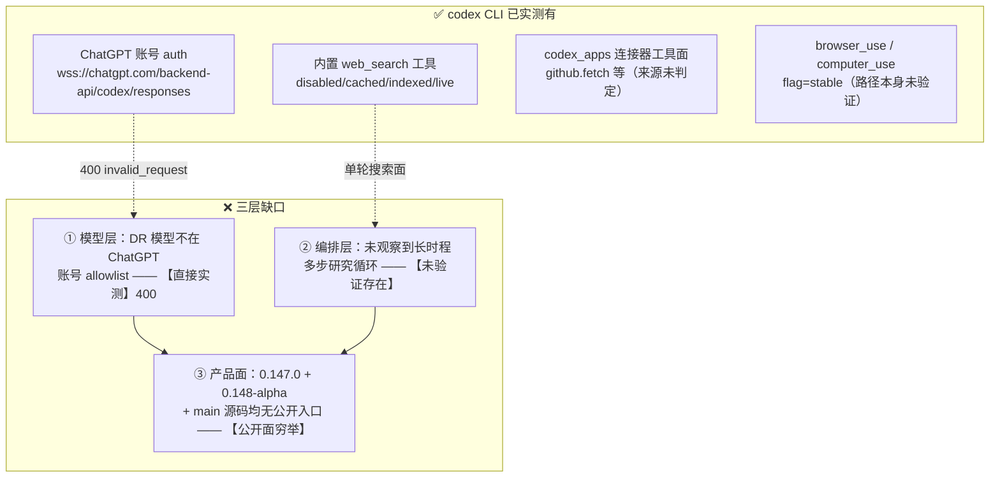

# FLY-1763 Codex CLI 能否直接跑 ChatGPT Deep Research — 调研

Issue: FLY-1763 (https://linear.app/geoforge3d/issue/FLY-1763/research-codex-cli-能否直接跑-chatgpt-deep-research替代浏览器路-codexchatgpt)
日期: 2026-08-13
基于: exploration.md

---

## 0. 结论先行

> **结论的适用范围（先说清；注意不同结论的版本覆盖面不一样）**
>
> | 结论 | 覆盖的版本 | 说明 |
> |------|-----------|------|
> | 公开面无 DR 入口（§2） | **0.147.0 ＋ 0.148.0-alpha.14 ＋ main 分支源码** | alpha 那一版做的是**公开面枚举**（子命令 / feature flag / 二进制字符串），见 §2.4 |
> | ChatGPT 授权选不到 DR 模型（§3） | **仅 0.147.0** | 模型 A/B 只在装机版跑过，**没有**在 alpha 上重跑 |
> | 浅研究替代可用（§5） | **仅 0.147.0** | 真机跑通那一例是装机版 |
>
> 共同前提：本机 macOS · **ChatGPT 账号登录态**（非 API key）· 实测时间 **2026-08-13 18:43–21:10 PT**。
> 本单**没有**测试 API-key 登录态（见 §3.5），因此结论**不覆盖**那条路。

**在上述范围内：不行 —— 但有一个够用的「浅研究」替代。**

| 问题 | 结论 | 一句话根据 |
|------|------|-----------|
| codex CLI 的**公开可见面**上有 Deep Research 入口吗？ | **未发现** | 无子命令 / 无 flag / feature flag 零命中（0.147.0 的 104 条 **与当天最新 0.148.0-alpha.14 的 113 条**）/ 二进制零个 "deep research" 字符串 / main 分支源码零命中 / 官方 repo 的功能请求 issue **仍开着** |
| ChatGPT 账号授权**当前**能选到 DR 模型吗？ | **不能**（这一条是**直接实测**的） | 服务端下发的模型目录 9 个模型零 DR；实选 DR 模型服务端回 400：*"The 'o3-deep-research' model is not supported when using Codex with a ChatGPT account."* |
| 最薄替代是什么？ | **`codex exec -c web_search="live"`** | 真机跑通：真发 5 次 web_search、54 秒、给出可点的 URL 引用（配方见 §5） |
| 浏览器路 DR skill 可以退役吗？ | **不可以** | 替代品是「浅研究」，能力差距见 §6（注意：§6 是**未做受控对比**的定性表） |

**证据强度分层**（别把不同强度的东西读成一样硬）：

| 强度 | 属于哪些结论 |
|------|-------------|
| **硬（服务端原话 / 服务端下发数据）** | ChatGPT 账号选不到 DR 模型（§3.1 §3.2） |
| **硬（真机事件流）** | `codex exec -c web_search="live"` 真的发出了搜索（§5.2） |
| **中（公开面穷举 + 阳性对照）** | CLI 公开面上没有 DR 入口（§2）—— 这是「没找到」，不是「不存在」 |
| **弱（单样本、无对照）** | 浅研究 vs DR 的能力差距（§6）—— 只跑了 1 例、**没跑同题 DR 对照** |

**「Unify」到底 unify 了什么**（这是 Annie 直觉里对的那一半）：codex CLI 确实**用 ChatGPT 账号、打 ChatGPT 后端**（`wss://chatgpt.com/backend-api/codex/responses`），另外还拿到一个**名为 `codex_apps` 的连接器工具面**（§4 —— 只证到「非本地 user config」，未证它属于 ChatGPT 侧或账号级下发）。所以 unify **被证到的只有账号认证这一层**（计费归属本单没查账单，不下断言）；但**模型 allowlist 是分开的** —— ChatGPT 网页版有的 Deep Research，那条后端路对 codex 是关着的（§3.2 有服务端原话）。

---

## 1. 现场与口径

| 项 | 值 |
|----|----|
| codex 版本 | 主体：`codex-cli 0.147.0`（`/Users/xiaorongli/.local/bin/codex`）；§2.4 另**隔离实测**了 `0.148.0-alpha.14`（下载到 scratchpad、独立 `CODEX_HOME`，未安装） |
| 实验时间 | 2026-08-13 18:43–21:10 PT（证据文件里的时间戳是 UTC 01:4x–04:0x） |
| auth | **ChatGPT 账号**（非 API key）；profile 变动见 §8 |
| 证据目录 | 本 doc 文件夹下 `evidence/`（随分支走，不依赖 session scratchpad） |

所有实验：`--ephemeral`（不落 session 文件）+ `-s read-only` + 独立 sandbox 目录 + `< /dev/null`（避开非 TTY 挂 stdin 的已知坑）。

---

## 2. 问题一：codex CLI 的公开面上有没有 Deep Research 入口？—— 未发现

**先声明这一节的证据性质**：下面五条**都是负证据**（「没找到」），**不是**「不存在」的证明。它们也**不完全互相独立**（同一份二进制的不同切面）。它们能排除的是「有公开入口而我没看见」，**不能**排除服务端隐藏能力、灰度实验组、或未文档化的协议入口。

### 2.1 命令面：无 deep research 子命令、无 flag

`codex --help` 全量子命令（证据 `01-codex-help.txt`）：

```
exec  review  login  logout  mcp  plugin  mcp-server  app-server  remote-control
app   completion  update  doctor  sandbox  debug  apply  resume  archive  delete
unarchive  fork  cloud  exec-server  features  help
```

与研究相关的只有一个 flag，且它是 **web search 不是 deep research**：

```
      --search
          Enable live web search. When enabled, the native Responses `web_search`
          tool is available to the model (no per-call approval)
```

**其他 surface 也查了**（Codex R1 点名要补的，证据 `30-other-surfaces.txt`）：

| surface | 是什么 | 有 DR 吗 |
|---------|--------|---------|
| `codex cloud` | 提交/查看 Codex Cloud 的**编码任务**（exec/status/list/apply/diff） | 无 |
| `codex app-server` | 协议服务（daemon / proxy / 生成 TS bindings 与 JSON Schema） | 无 |
| `codex exec-server` | 独立 exec 服务 | 无 |
| `codex remote-control` | 管理开了 remote control 的 app-server daemon | 无 |

这四个都只是**同一个 agent 的不同传输壳**，且都共用同一个 `-c model=` 配置口 → 受同一份 allowlist 约束（§3.2）。

**顺带一个自动化陷阱**：`--search` 只存在于**交互 TUI**，`codex exec` 不认（证据 `11-e1-exec-search-flag.txt`）：

```
$ codex exec --search "hi"
error: unexpected argument '--search' found
```

无人值守必须走 `-c web_search="live"`（见 §5）。

### 2.2 feature flag：104 条（0.147.0），零条 deep research —— alpha 的 113 条见 §2.4

`codex features list` 共 **104** 条 flag（证据 `04-codex-features-list.txt`），grep `deep` 命中 **0**。搜索相关的只有：

```
search_tool                 removed             false
standalone_web_search       under development   false
web_search_cached           deprecated          false
web_search_request          deprecated          false
browser_use                 stable              true
```

即：搜索能力在收敛成内置 `web_search`，**这份公开 flag 表里**没有任何 deep-research 开关（哪怕是 under development 的）。

### 2.3 二进制：零个 "deep research" 字符串（带阳性对照）

证据 `05b-binary-strings-clean.txt`：

```
=== A. literal 'deep research' (任意分隔符/大小写) ===   → 0 命中
=== B. deep-research 模型 id (o3-deep-research 等) ===   → 0 命中
=== D. 阳性对照: browser_use ===                          → 12 命中
```

阳性对照过（尺子没坏），A/B 才算数。

全二进制里 `research` 这个词只出现在**泛化散文**中（系统提示词的「区分 research / design / implementation 阶段」、模型描述「dig into research」、以及一堆 CA 证书名 "Hellenic Academic and Research Institutions"），没有任何产品面（证据 `07-research-context.txt`）。

⚠️ **absence-of-string 是弱证据**：字符串可以被混淆、可以由服务端下发、可以在插件里。这条只和 2.1/2.2/2.4/2.5 合起来当**佐证**用。

### 2.4 **最新版**也查了：0.148.0-alpha.14（今天发的）+ main 分支源码

> Founder 补充指令（2026-08-13）：「看一下最新的信息，因为他们很多东西可能都有变化，然后也可以自己去试一下。」
> 下面这一小节就是照这条做的：**不停在装机版 0.147.0**，把当天最新的 alpha 拉下来**真跑**，再查 main 分支源码。

**(a) 装机版不是最新版**。`gh release list` 显示 stable 停在 0.147.0（8-07），但 pre-release 已经滚到 **0.148.0-alpha.14（2026-08-14 01:37 UTC，即当天）**。

**(b) 一次失败的取证，如实记下来**：我先去 grep 这些 alpha 的 release notes，全部 0 命中——但**阳性对照发现它们的 body 只有 27 个字符**（内容就是一行 `Release 0.148.0-alpha.14`）。所以那次 grep 是**空过绿**，作废，不作为证据（证据 `32`/`33`）。

**(c) 改成真跑最新二进制**（证据 `35-alpha148-handson.txt`）。把 `codex-aarch64-apple-darwin` 下载到 scratchpad、用**独立 `CODEX_HOME`** 跑，**不安装、不碰生产 `~/.local/bin/codex`**：

```
$ ./codex-aarch64-apple-darwin --version
codex-cli 0.148.0-alpha.14
```

| 检查项 | 0.147.0（装机版） | **0.148.0-alpha.14（当天最新）** |
|--------|------------------|-------------------------------|
| feature flag 总数 | 104 | **113**（+9） |
| 含 `deep` 的 flag | 0 | **0** |
| 新增 9 条里含 search/research 的 | — | **0**（新增的是 `psp` / `code_mode_interrupt` / `guardian_*` / rollout 迁移等） |
| 二进制 "deep research" 字符串 | 0 | **0**（阳性对照 `browser_use` = 11 命中） |
| 子命令新增 | — | 只多了 `migrate-rollouts`，**无 DR 入口** |
| search 相关 flag | `standalone_web_search` under development | **一模一样**，没动 |

**(d) 再查 main 分支源码**（比 alpha 还新，证据 `34-code-search-main.txt`）：

- `deep_research` → **0 命中**
- `deep-research` → **1 命中，而且是别人家的**：
  ```
  codex-rs/external-agent-migration/src/service_tests/general/detection.rs:
    "skills: [deep-research]"
  ```
  这是 **Claude Code agent 迁移测试的 fixture**（把外部 agent 的 frontmatter 解析出来），不是 Codex 自己的能力。
- 阳性对照 `web_search_mode` → 10 命中（尺子没坏）。

→ **结论对「最新版」同样成立**：到 2026-08-13 为止 OpenAI 公开发布/公开源码里都没有这个东西。

### 2.5 官方 repo：这是一个**仍未实现**的功能请求

[openai/codex#29741 — *Feature request: Add native Deep Research task mode in Codex Mac app and CLI*](https://github.com/openai/codex/issues/29741)，2026-06-23 开，**至今 open**，无 maintainer 答复、无关联 PR。

请求内容恰好就是 Annie 想要的：在 Codex 会话里 `/deep-research <question>`，跑长时程研究、拿回带引用的报告、交接给实施规划。

⚠️ **一个 open issue 不是官方声明**：它证明「有人要，且没被公开实现」，**不证明** OpenAI 内部没有。

---

## 3. 问题二：ChatGPT 授权能不能到达 DR 后端？—— 当前不能（直接实测）

这一节是全篇**证据最硬**的部分：服务端下发的数据 + 服务端原话。

### 3.1 服务端下发的模型目录：9 个，零 DR

`~/.codex/models_cache.json`（**ChatGPT 后端针对当前 auth 下发**的目录，本机缓存时间 2026-08-13 18:39 PT）里的全部 model slug（证据 `10-models-cache.txt`）：

```
gpt-5.6-sol   gpt-5.6-sol-wm   gpt-5.6-terra   gpt-5.6-luna
gpt-5.5       gpt-5.4          gpt-5.4-mini    gpt-5.3-codex-spark
codex-auto-review
```

grep `deep.?research` → **0 命中**。这是服务端的话，不是我推的。

### 3.2 硬点名：服务端 400，原文

三臂 A/B，同一 auth、同一分钟、只换 `-m`（证据 `27-model-ab.txt` / `29-400-verbatim.txt`）：

| 臂 | `-m` | 结果 |
|----|------|------|
| 对照 1 | `gpt-5.6-sol` | ✅ 正常返回 `OK` |
| 实验 | `o3-deep-research` | ❌ HTTP 400 |
| 对照 2（假模型名） | `totally-not-a-real-model-xyz` | ❌ HTTP 400，**同样文案** |
| 对照 3 | `gpt-5.6-sol` | ✅ 正常返回 `OK` |

服务端原文（逐字）：

```json
{"type":"error","status":400,"error":{"type":"invalid_request_error",
 "message":"The 'o3-deep-research' model is not supported when using Codex with a ChatGPT account."}}
```

**边界要说清楚**：假模型名拿到**同一句**文案，说明这句话是「不在 ChatGPT 账号 allowlist 上」的**通用**回复，**它不能区分**「模型存在但你没授权」和「模型名不认识」。但两种解读的运营结论完全一样：**ChatGPT 账号授权下，codex 选不到任何 deep-research 模型**。这一条与 §3.1（服务端目录本身就没有）互相印证。

### 3.3 官方公开的 DR 接口在另一个钱包

官方 Deep Research 指南（[developers.openai.com/api/docs/guides/deep-research](https://developers.openai.com/api/docs/guides/deep-research)）：模型 `o3-deep-research` / `o4-mini-deep-research`，走 **Responses API `https://api.openai.com/v1/responses`**，`$OPENAI_API_KEY` bearer 认证。该页**零处**提及 Codex CLI 或 ChatGPT 订阅认证。

**措辞纪律**：我**不说**「这是唯一的官方接口」——我没有穷举 OpenAI 的所有产品面。准确说法是：**本次查到的公开 DR API 走 API key 计费；没有找到任何「用 ChatGPT 订阅认证从 CLI 调用 DR」的官方文档。**

而 ChatGPT 网页版的 Deep Research 是消费产品面，本次未找到其公开 API。

### 3.4 缺的到底是哪一层（三层，验证强度不同）



- ① 是**直接实测**的（§3.2）。
- ② 是**未观察到**——我没有找到它的入口，但我也**没有**证明它不存在于服务端。
- ③ 限定在**公开面**，但覆盖三处：**0.147.0 + 0.148.0-alpha.14 + main 分支源码**（§2.4）。

我**不再断言**「②③ 还得 OpenAI 自己做」——那是对未来实现路径的猜测，本单没有证据支持。

### 3.5 明确列为「未测」的面（Codex R1 #5）

| 未测项 | 为什么没测 | 值不值得跟进 |
|--------|-----------|-------------|
| **API-key 登录态下能否选 DR 模型** | `codex login --with-api-key` **确实存在**（证据 `31-apikey-surface.txt`，`ForcedLoginMethod` 有 `chatgpt` / `api` 两档）；但用 API key 会动 Annie 的另一个钱包，且本单红线是「不改登录态」→ 没测 | **值得**：这是本单发现的**最有希望的下一条路**，见 plan.md 建议 5 |
| codex 完整 config schema 逐键穷举 | 只查了搜索/模型相关键 | 低 |
| app-server / cloud / exec-server 的**协议内部**（非 `--help`） | 只查了公开命令面 | 低 |
| 不同 ChatGPT 套餐（Pro / Business / Enterprise）的 allowlist | 本机只有 Plus 级账号 | 中（结论可能因套餐而异） |

---

## 4. 一个顺带查实的事实：`codex_apps` 连接器不来自本地 config

做「关掉 web_search 的对照臂」时翻出来的（证据 `19-negcontrol-mcp-calls.txt`）：

即使 `-c web_search="disabled"` **且** `--ignore-user-config`（不加载 `~/.codex/config.toml`，等于砍掉所有本地 MCP server），codex 仍然拿得到实时网络数据，因为它调了：

```
server=codex_apps  tool=github.fetch
   args={'url': 'https://api.github.com/repos/openai/codex/releases?per_page=3'}
```

**能证的**：`codex_apps` **不来自被忽略的本地 user config**。
**不能证的**：它是**账号级下发**还是 **CLI 内建**——我没做跨账号对照，无法区分。（原稿写成「账号级」是超出证据的，已改。）

两个含义：

1. **CLI 拿到了一个名为 `codex_apps`、能出网取数的连接器工具面**，且它不来自被忽略的本地 user config。**它的归属（内建 / 服务端下发 / 账号绑定）本单未判定**，因此不把它当作「unify」的证据 —— 仅记录这个工具面的存在与可用性。
2. **对实验设计是个坑**：「关掉 web_search」**不等于**「断网」。我因此**无法**构造干净的「无实时数据」阴性对照臂。我不拿这条当 A/B 结论，只记录「live 数据至少有两条独立通路」。（`web_search="live"` 真的跑了，是靠 JSONL 里真实出现的 `{"type":"web_search"}` 事件**直接**证的，不靠对照臂反推。）

---

## 5. 最薄替代：`codex exec` + live web search（真机配方）

### 5.1 配方

```bash
codex-with-fallback exec --json \
  --strict-config \
  -s read-only --skip-git-repo-check --ephemeral \
  -C /path/to/empty/sandbox \
  -c 'web_search="live"' \
  -c model_reasoning_effort="medium" \
  "<你的调研问题；要求列出引用 URL>" \
  < /dev/null
```

要点（每条都是踩出来的）：

| 要点 | 原因 |
|------|------|
| `-c 'web_search="live"'`，**不是** `--search` | `codex exec` 不认 `--search`（§2.1） |
| `--strict-config` | 配置键写错会 fail-loud，不会静默按默认跑 |
| `< /dev/null` | 非 TTY 下 `codex exec` 会去读 stdin 然后**永久挂死**（本机既有事故） |
| `--json` | 拿到 `{"type":"web_search",...}` 事件流 = 「它真的搜了」的直接物证 |
| `model_reasoning_effort="medium"` | 本机 load 高（实验时 33.8）时 xhigh 容易被 reap |
| `--ephemeral` + `-s read-only` | 不落 session、不写盘 |

`web_search` 四档语义（官方 config reference 逐字）：

> `disabled | cached | indexed | live`，默认 `"cached"`；cached 用 OpenAI 维护的索引、**不出网**；indexed 只在索引 gate 时才出网；用 `--yolo` 之类全权限沙箱时默认变成 `"live"`。

→ **默认 `cached` 是「不出网」的**。做调研必须显式 `live`，否则拿到的是索引快照。

### 5.2 真机跑通一例（n=1，见下方限制）

问题：openai/codex 最近 3 个发布版本 + 日期 + 各一条变更，必须给 release 页面 URL。

跑通结果（证据 `15-e3-live-search.jsonl`，耗时 **54 秒**，5 次 `web_search`）：

```
web_search: site:github.com/openai/codex/releases openai codex releases latest
web_search: https://api.github.com/repos/openai/codex/releases?per_page=10
web_search: '## 0.144.3'
web_search: https://github.com/openai/codex/releases/tag/rust-v0.147.0
web_search: (empty)
```

答案：0.147.0 (Aug 7) / 0.146.0 (Jul 29) / 0.145.0 (Jul 21)，每条带 release URL。

**核对（`gh release list` 作 ground truth，证据 `16-ground-truth-releases.txt`）：**

| 声称 | 真值 | 判定 |
|------|------|------|
| 0.147.0 @ 2026-08-07 | `2026-08-07T01:41:49Z` | ✅ |
| 0.146.0 @ 2026-07-29 | `2026-07-29T01:42:51Z` | ✅ |
| 0.145.0 @ 2026-07-21 | `2026-07-21T18:21:04Z` | ✅ |
| 「0.145.0 把 `/import` 扩到迁移 Cursor 与 Claude Code 的设置/session/plugin/memories」 | release body 逐字：*"Expanded `/import` to migrate Cursor and Claude Code settings, MCP servers, plugins, sessions, commands, and project-scoped memories."* | ✅ |
| 「排除 pre-release 后最近三个」 | 真值是 0.147.0 / **0.146.1** / 0.146.0 —— 它**漏了 0.146.1**（8-05，非 pre-release） | ❌ 完整性漏项 |

**这次运行的诚实评级：日期与引用全对，枚举完整性有一处漏。**

⚠️ **限制（Codex R1 #8）**：这是 **n=1**，且**没有**用同一问题、同一时间跑一次浏览器 DR 作对照。漏掉 0.146.1 的原因可能是提示词、模型单次判断、或搜索结果排序，**不能**据此归因到「架构上不穷尽」。要下那个结论，需要 plan.md 建议 6 的受控实验。

---

## 6. 能力差距表（**定性**，未做受控对比）

⚠️ **先说清这张表的性质**：右列是**本单 n=1 实测**；左列是 ChatGPT Deep Research 的**产品面已知行为**（来自我们自己 skill 的使用经验与产品描述），**不是**本单同题实测的结果。这张表是**决策用的定性判断**，不是实验数据。

| 维度 | 浏览器路 ChatGPT DR（已知行为，未同题实测） | `codex exec -c web_search=live`（本单 n=1 实测） |
|------|-------------------------------------------|----------------------------------------------|
| 运行时长 | 5–15 分钟 | **54 秒** |
| 检索轮次 | 数十～上百来源，自主追链 | **5 次**，基本单轮扇出 |
| 收敛策略 | 规划→检索→再规划的多步循环 | 一次 turn 内的工具调用 |
| 完整性 | 穷尽式（DR 的核心卖点） | 本例**出现漏项**（n=1） |
| 引用 | 逐句锚定 + 完整来源列表 | 段落级 URL |
| 报告形态 | 结构化长报告 | 一段回答 |
| 无人值守 | ❌（headed Chrome + 交互配对 + 串行） | ✅ 完全 headless、可并行 |
| 稳定性 | 脆（8-13 实测取报告半截已坏） | 稳（纯 CLI，无 UI 依赖） |
| 成本 | 订阅内 | **未核验**（ChatGPT 账号登录态下跑通；计费归属本单没查账单，见 §0） |

**据此的判断（是判断，不是实验结论）**：这更像**两类不同任务**，而不是同一能力的两种实现。

- 「查清一个具体事实 / 核一份文档 / 摸一个 API 的现状」→ **CLI 路更合适**（快、无人值守、可并行、本例够准）
- 「一个领域的穷尽性扫描 + 结构化长报告」（FLY-1294 竞品扫描那类）→ **本单没有证据表明 CLI 路能胜任**，且本例已出现漏项 → 保守起见继续用 DR

→ **浏览器路 skill 不能退役。**

关于「日常调研是否改走 CLI 路」：本单**只能提一个暂行的、可撤回的分流建议**，不能给制度性规则——依据是 n=1 且无对照臂。建议的形式应该是「默认先试 CLI 路，结果不满意就升级到 DR」，由使用者当场判断，而**不是**「某类问题一律走 CLI」。要把它变成制度性分工，先做 plan.md 建议 6 的受控对比。

---

## 7. 一条**记录但不产品化**的非官方路径

codex 的 `browser_use` / `computer_use` feature flag 都是 `stable=true`（证据 `04-codex-features-list.txt`）。**这只说明 flag 存在**——我**没有**验证 codex 能否真的起 headed 浏览器、继承 ChatGPT 登录态、操作 DR UI、把报告取回来。所以准确表述是：

> **存在相关 flag；这条路径能否跑通，本单未验证。**

即便能跑通，也**不做成配方**：

1. 那只是把同一段浏览器舞步从 claude-in-chrome 搬到 codex，**脆点一个不少**（还是要 headed 浏览器、登录态、UI 不能改版），收益接近零；
2. 用自动化去驱动消费产品面属于灰区，本单红线是不绕 ToS、非官方路径只记录不产品化。

按红线，**只记录到此**。

---

## 8. 副作用与状态如实上报（必须读）

实验期间 `codex-with-fallback` 因一次 401 **自行轮转了 codex profile**（这是 wrapper 的既有行为，不是我主动切的）。全过程与善后（证据 `21`–`26`，在 session scratchpad；关键结论抄录如下）：

1. 18:49 一次 `o3-deep-research` 调用返回 401 `refresh_token_reused` → wrapper 依次试完 5 个 profile 后报 `AUTH_EXPIRED`；
2. 我先用**已知良好模型**做对照，确认这是**瞬时 refresh-token 竞争**（本机同时跑着多个 codex 进程），**不是** DR 模型的拒绝信号 —— 后来干净的三臂 A/B 拿到 400 原文，才是真信号（§3.2）。**这个 401 是诊断红鲱鱼，别把它当结论**；
3. 善后：按规矩**先 `codex-profile save` 再切**，未丢任何刷新后的 token；
4. **当前状态：active profile = `business`，实测可用**（`RESTORED` / `OK` 均正常返回）。

⚠️ **需要 Tadashi 知悉的两点**：

- **active profile 从 `school` 变成了 `business`。** 我尝试复原 `school` 时发现 `profiles/school/auth.json` 快照里的 refresh token 已被消耗（复原后立刻 401），所以退回到当前可用的 `business`。
- **归因边界（Codex R1 #9）**：我**没有**实验前的 school 快照可用性基线，因此**无法判定**这个快照失效是实验前就已存在、还是本次并发调用/wrapper 轮转造成或暴露的。我只陈述可观测的前后状态：实验前 active=`school`（未验证其 token 是否可用）→ 实验后 active=`business`（已验证可用），`school` 快照现在不可用。
- 若需要 `school` 回到 active，需要走 `/codex-relogin`（属 infra-bot 线，超出本 research 单授权，我没做）。

零生产代码改动；零生产配置改动（`~/.codex/config.toml` 未被写过）。

---

## 9. 待办建议（不在本单执行，详见 plan.md）

1. 新建 `web-research` skill（浅研究专用，无人值守、可并行）
2. `deep-research` skill 加分流指引
3. 订阅 openai/codex#29741
4. codex profile 快照漂移治理（infra-bot 线）
5. **API-key 登录态下试 DR 模型**（本单未测的最有希望的一条路）
6. 受控对比实验：同题、同时跑 DR 与 CLI 路 × N 次，把 §6 从定性判断升级为数据

---

## 10. 证据索引（`evidence/` 目录，随分支走）

| 文件 | 内容 |
|------|------|
| `01-codex-help.txt` | `codex --help` 全量 |
| `02-codex-exec-help.txt` | `codex exec --help` 全量（证明无 `--search`） |
| `04-codex-features-list.txt` | 104 条 feature flag 全表 |
| `05b-binary-strings-clean.txt` | 二进制 deep-research grep + 阳性对照 |
| `07-research-context.txt` | 全部含 "research" 字符串的上下文 |
| `08b-config-clean.txt` | `~/.codex/config.toml` 摘要（未含 web_search 键） |
| `10-models-cache.txt` | 服务端下发的 9 个模型 slug |
| `11-e1-exec-search-flag.txt` | `codex exec --search` 报错原文 |
| `12-e2-tool-inventory.jsonl` | 工具清单自述（**弱证据**，被 `13`/`14` 证伪修正） |
| `13-skills-check.txt` / `14-deep-research-skill-provenance.txt` | 证明 codex 看到的 `deep-research` skill 是**我们自己写的** claude-in-chrome skill 的软链，不是 OpenAI 能力 |
| `15-e3-live-search.jsonl` | live web search 真机跑通（5 次 web_search） |
| `16-ground-truth-releases.txt` | `gh release list` ground truth 核对 |
| `18-tool-call-diff.txt` / `19-negcontrol-mcp-calls.txt` | 阴性对照臂被 `codex_apps` 污染的证据 |
| `27-model-ab.txt` / `29-400-verbatim.txt` | 三臂模型 A/B + 400 原文逐字 |
| `30-other-surfaces.txt` | cloud / app-server / exec-server 的 `--help` |
| `31-apikey-surface.txt` | `codex login --with-api-key` 存在性（§3.5 的依据） |
