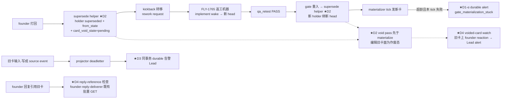

# FLY-1772 打回后返工闭环出新卡 — 实施计划

Issue: FLY-1772 (https://linear.app/geoforge3d/issue/FLY-1772/bug-打回后的返工闭环必须出新卡打回-返工新-head-自动出新卡旧卡作废不再接受操作founder-8-14-裁定版)
日期: 2026-08-14
基于: research.md(codex design review 4 轮 **APPROVED**:R1 6 项 + R2 6 项 + R3 4 项全采纳 + R4 非阻断优化折入;R1-1 以有界形态,R2-4 升格为前门处置协议,R3-1 fallback 改 durable-receipt 判据)

## 0. 目标 / 非目标

**目标**(founder 8-14 裁定:一轮打回 = 一张新卡):

- D1:打回 → 返工新 head → 引擎自动出新卡(绑新 head)的闭环可靠;「新 holder → 新卡」最后一米的静默失效 fail-loud;整环端到端回归钉死。
- D2:旧卡随打回/换代/operator rework 作废 —— 编辑旧卡 Discord 卡面为作废态,作废卡不存在被误点的语义。
- D3(后门):workflow-source-projector deadletter founder 输入时,durable 告警 Lead(不打扰 founder)。
- D4(前门,R1-1):founder 对已作废卡的真实输入(✅ reaction / 引用旧卡的文字回复)在 source event 生成**之前**就被静默过滤 —— 在既有观察面上补 Lead-only durable 告警,founder 零消息。

**非目标**(founder 已裁,不做):

- ❌ 打回过的旧卡复活接受 ✅(第一版方案,已作废)。
- ❌ 点错卡给 founder 回执(FLY-1757 已裁)—— D4 告警只进 Lead,founder 侧零消息。
- ❌ 同 head 去重发卡 / PR 已合入卡转终态(FLY-1757 范围)。
- ❌ 重做返工可达性(FLY-1765 已修);不动 FLY-1655 terminal-land 不变量;不碰 FLY-1448 投递 seam;不加新 env/flag(FLY-1466);不开终态复活边。

## 1. 架构总览



全部骑既有原语:engine alert outbox(escalation_uid 幂等)、LeadInboxRuntime durable queue(fallback receipt)、GatePoller 驱动的 materializer tick(零新 timer)、`editDiscordMessageInChannel`(PATCH)、reaction fetcher、founder-reply-deliverer 批量 GET、holder 状态机(加七列,零新状态)。

## 2. D2 — 统一 supersede + 旧卡作废(先行:D1-β/D4 依赖其台账)

### 2.1 schema(`StateStore.ts` workflow_gate_holder 既有 add-column 循环,:16466-16476)

- 加列(七):`card_void_state TEXT`(NULL/`pending`/`done`/`failed`/`skipped_legacy`)、`card_void_attempts INTEGER DEFAULT 0`、`card_void_transient_attempts INTEGER DEFAULT 0`(当前瞬态窗口的 durable 计数)、`card_void_next_at TEXT`(Discord 瞬态失败的下次可重试时刻)、`superseded_from_state TEXT`(supersede 瞬间的前状态,D4 过滤用)、`card_watch_next_at TEXT`(D4 公平检查账本,§5.1)、`card_watch_expires_at TEXT`(R3-2:**不可滑动**的 watch 截止锚,void → done 时一次性写 `now+48h`,之后任何更新不得延长)。
- boot 幂等回填:`UPDATE workflow_gate_holder SET card_void_state='skipped_legacy' WHERE state='superseded' AND card_void_state IS NULL` —— 存量卡不追溯编辑(FLY-1757 清账);新 supersede 总是显式落值,回填不误伤。

### 2.2 统一 supersede helper(R1-2:五处生产 writer 全收口)

新 tx-local `supersedeWorkflowGateHoldersTx({runId, gateNodeId?, questionId?, fromStates?, reason, now}): {updated: number}`,统一执行:记录每行 `superseded_from_state = state`、`state='superseded'`、`superseded_reason=reason`、`card_void_state = CASE WHEN card_message_id IS NOT NULL THEN 'pending' ELSE card_void_state END`。**scope 与 fence(R2-6)**:支持 exact `questionId + fromStates` 收窄并返回更新计数 —— founder_feedback 路径保留既有 exactly-one 语义(`questionId` + `fromStates:['awaiting_review']`,`updated !== 1` 时沿用现行 `holder raced` throw);其余路径按 `runId(+gateNodeId)` 面扫。替换五处直写:

| 位点 | reason |
|---|---|
| founder_feedback apply(:32056) | `founder_feedback` |
| commitWorkflowTransitionTx land 路径(:30873) | `new_gate_attempt` |
| createWorkflowGateHolderTx(:32828) | `new_gate_attempt` |
| ensureWorkflowGateHolder(:34775) | `new_gate_attempt` |
| operatorReworkWorkflowRun(:25510) | `operator_rework` |

**writer-matrix sentinel 测试**:扫描 StateStore.ts 源码,断言 `state = 'superseded'` 的 UPDATE 仅存在于 helper 内(防未来第六处漏接)。

### 2.3 void pass(`plugin.ts`,挂在 workflowGateMaterializeTick **头部、先于 materialize**;R1-5 时序)

- 新 store 查询 `listWorkflowGateHoldersForCardVoid(now, limit=20)`:`state='superseded' AND card_void_state='pending' AND (card_void_next_at IS NULL OR card_void_next_at <= now)`,按 `card_void_next_at,question_id` 排序。
- 每条:run → `resolveLeadForIssue` 拿 botToken;**threadId 只认精确证据**(R1-5):`readCurrentGateMessageBinding(source_execution_id, question_id, head_sha)` 的 (threadId, gateMessageId),缺失时从 `founder_thread_notified` audit 事件按 exact gateMessageId 恢复;两者皆无 → 本条计一次失败(**不用** `getChatThreadByIssue` 猜测)。
- `editDiscordMessageInChannel(threadId, card_message_id, voidText, botToken, {origin:"automation"})`:
  - 成功 → `done`;
  - `404` **且 threadId 来自精确 binding/audit** → `done`(卡确已删),且直接把 `card_watch_expires_at` 结清为 now(R4 非阻断建议:已删除的消息不再进 D4 watch);猜测来源不存在(上一条已禁);
  - network/timeout/`429`/`5xx` 瞬态失败 → 以实际失败时刻写 `card_void_next_at=now+60s`;单次不立即消耗永久失败预算,但每 5 个 durable 瞬态窗口折算 1 次永久失败,因此持续故障最迟 25 个窗口 fail-loud;
  - 其他永久失败 → attempts+1。
- **第 5 次失败:`pending→failed` + `enqueueWorkflowEngineAlertTx`(uid=`card_void_stuck:${question_id}`,payload 恒定)+ run event,三者在同一 StateStore 事务内**(R1-4:经 `advanceWorkflowGateCardVoid` helper;crash 后整组重放,恰一条 outbox)。
- 状态推进全部条件 UPDATE(`WHERE question_id=? AND card_void_state='pending'`)保幂等/防并发;单 holder 的结算/defer throw 被局部吸收,不中断同 tick 后续 holder。Discord PATCH 与 reaction GET 均有默认 10s `AbortController` 真取消边界。

### 2.4 作废文案(holder 行字段确定性重建,单 chunk 有界)

- `founder_feedback`:`⛔ 已打回作废 — 请勿在本卡操作\n~~🚀 {issue} is ready to ship · head {head8}~~\n返工完成后会自动出一张新的 ship 卡(绑新 head),请在新卡上批准。`
- `new_gate_attempt`:`⛔ 已作废(head 已换代)— 新的 ship 卡见下\n~~🚀 {issue} is ready to ship · head {head8}~~\n请在最新的 ship 卡上操作。`
- `operator_rework`(R1-2):`⛔ 已作废(工单已被 operator 重开返工)\n~~🚀 {issue} is ready to ship · head {head8}~~\n返工完成后会出新的 ship 卡。`

## 3. D1 — 闭环可靠

### 3.1 D1-α:materialization 卡住 fail-loud(R1-3 + R2-5 修正形态:无进程态,durable 恰一次,告警前复核仍卡住)

- tick 内把 **throw 与 `{ok:false, reason}` 归一为失败**(现状 `plugin.ts:7220` 完全忽略返回值 —— 归一是本修的一部分)。
- 判据(R2-5:告警前**重读复核**,materialize await 期间 holder 可能已被 supersede/complete):失败后重新读取该 `question_id` 的 holder,确认同一 run/head、`state ∈ {materializing, awaiting_review}` 且 `materialization_stage != 'completed'`、run 仍 active、且 `now - holder.updated_at > 10min`(常量)→ 才 `store.enqueueWorkflowEngineAlert({escalationUid: "gate_materialization_stuck:" + question_id, runId, payload})`。用最近 holder 进展时刻避免「创建已久但刚有进展」的误报;holder 已消失/superseded/完成 → 零告警。无内存计数器(outbox uid 跨重启恰一次)。
- **payload 完全静态**(R2-5):issue、question_id、head8、gate_node_id、source_execution_id + 首次 enqueue 时刻解析的 `resolveWorkflowRunAlertIdentity` 身份;**不含 reason/age/时间戳/attempt**(当次失败 reason 只进结构化日志)。
- `workflow_alert_uid_conflict` **不盲吞**(R2-5:它是 :25628-25640 的完整性保护):捕获后重读既有 outbox 行,`run_id` 与本 holder 一致 → 视为已入队;不一致 → 结构化错误日志(不掩盖)。
- severity=severe,eventType=`workflow_engine_escalation`,`metadata.workflowEngine.disposition` 新增字面量 `gate_materialization_stuck`(union 扩展见 §6),title「【需人工】{issue} 的 ship 卡发不出来(卡在 materializing)」,body 含 question_id/head/排查指引。

### 3.2 D1-β:补齐真实 template 拓扑 + 整环端到端回归

**实现期证据修正:**真实 `menus/shapes/code.yaml` 缺少 `founder_feedback_kickback` loop,与调研时从 legacy/测试 manifest 得出的“kickback loop 已存在”不同。先在 code menu 加 `founder_gate → implement`,`loop_when=founder_feedback_kickback`,`exit_when=founder_approved`,`max_iterations=3`,`on_limit=escalate`,并扩展 `workflow-menu.ts` 的 shape parser/contract,再运行下列整环。底层返工状态机仍复用既有实现,不重做 FLY-1765。

真实 compiled `tpl_code` snapshot(沿 FLY-1765 测试基座):

1. run 进 gate → holder A(head₁)materialize → 卡 A。
2. `founder_feedback` source apply(打回)→ helper:holder A superseded(founder_feedback,from_state=awaiting_review)+ void pending + kickback + rework request(authority=founder)。
3. rework 投递 → implement wake → 完工新 head₂ → chained qa_retest → QA PASS → gate 重入 → holder A′(head₂,materializing)。
4. void pass(stub edit)→ 卡 A 面变打回作废样式(先于/独立于新卡发出)。
5. materializer(stub postCard)→ 卡 A′ 发出、card_message_id 落账、awaiting_review。
6. `founder_approval` source apply(✅ 卡 A′,head₂)→ holder A′ approved → land 转移 → run 终态。
7. 阴性 a:纯 ✅ 无打回 → 与现状逐字节一致(零回归)。
8. 阴性 b(后门):✅ 写成 source event 落在卡 A(head₁,superseded)→ apply 抛 `gate holder` → deadletter + D3 告警恰一次;founder 侧零消息。
9. 阴性 c(前门,R1-1):真实 reaction handler + CommDB guard 路径 —— superseded 卡不进 pending-gate 枚举、`insertFounderApprovalResponseWithSource` 对 disposed question 返回 false;断言零 response、零 source event、founder 零消息,且 D4 watch 对该卡告警恰一条。

## 4. D3 — 后门:死信 durable 告警(R1-6 修正形态)

### 4.1 先分类、后写入(R2-1:消除「先插 deadletter 再谈 fallback」的自相矛盾)

founder-origin **terminal** 错误(`isTerminalSourceError` 命中;`workflow source run unavailable` **不在其列**,今天是 retryable、维持不变)在任何写入前先做 **read-only 分类**:解析 payload,查 run 并校验精确绑定(run 存在且 `run.issue_id === payload.issue_id && run.project_name === project`,R1-6)。

- **可绑定** → 走扩展 recorder,**单事务**完成 deadletter INSERT + `enqueueWorkflowEngineAlertTx`(uid=`founder_input_deadletter:${sourceEventId}`,payload 静态:issue、question_id、动作 approve/打回、terminal reason、指引「founder 的这次输入没有入账;请确认新卡是否已出,必要时人工跟进」;severity=severe;disposition 字面量 `founder_input_deadletter`)+ run event(仅首插时,`getRowsModified()===1` 判定)。

```ts
recordWorkflowSourceDeadletter(input: {
  project; sourceEventId; reason;
  founderOrigin?: { kind; payloadJson; alertIdentity };  // 只在分类=可绑定时传入
}): { deadlettered: boolean; alertEnqueued: boolean }
```

- **不可绑定** → **先** `await alertFallback`;**acceptance 的判据是可重读的 durable receipt,不是 claim**(R3-1:`LeadAlertNotifier` 的 `alert_claims`/`lead_events` 只证明「尝试过」,`LeadAlertNotifier.ts:542-554`;claim 后 crash 会让重试撞 `{skipped:'duplicate'}` 而无真投递)。实现选既有 idempotent **`LeadInboxRuntime.enqueueInfraAlert` durable queue**(delivery id 由 eventId=`founder_input_deadletter:${sourceEventId}` 确定,`lead-inbox-runtime.ts:401-449`),**enqueue receipt 落地后才返回 `accepted:true`** → 调用**不带 founderOrigin 的 legacy recorder** 落 deadletter 并 advance cursor;`accepted:false`/throw → **零写入且立即 `break` 当前 project 的 drain**(R3-1:row N 未处置时绝不处理 row N+1,cursor 停在 N 之前),下轮重试。deadletter 表在 fallback 被拒后必须为空(专项测试);crash 注入测试:claim/lead_event 已写、delivery receipt 未落时崩溃,重启后必须重新完成 durable 投递,duplicate 不得当成功。
- 既有调用方不传 founderOrigin → 行为逐字节不变(返回值适配;当前生产调用仅 projector 一处)。非 founder-origin kind(`turn_grant`)与 `skipped` 重放路径零变化。

### 4.2 projector 接线(R2-2:early holder 破 TDZ + single-flight)

- `drainWorkflowSourceEvents` 改 async;`startWorkflowSourceProjector` 加 **single-flight**(上一轮 Promise 未落定则本 tick 跳过)+ 顶层 rejection containment(慢 fallback 不与 5s interval 重叠处理同一 cursor)。
- deps 加:`resolveAlertIdentity(project, issueId)`(plugin 用 `resolveWorkflowRunAlertIdentity` 实现)与 `alertFallback(payload): Promise<{accepted: boolean}>`。
- **TDZ 修复(R2-2)**:在 projector 接线点(plugin.ts:4238)**之前**声明一个仅含 `current?: AlertSink` 的早期 holder;projector callback 只读该 holder(绝不直接引用 6944/7704 才声明的 notifier);sink 就绪后赋值。boot 首 drain 即遇不可绑定 poison row → holder 为空 → `accepted:false` → 干净重试,零 ReferenceError。

## 5. D4 — 前门:已作废卡上的真实输入告警(R1-1,有界)

### 5.1 reaction leg:voided-card watch(挂 tick,void pass 之后;R2-3 公平有界形态)

- **durable 检查账本(R3-2 锚定形态)**:void → done 的同一 UPDATE 一次性写 `card_watch_next_at = now` 与 `card_watch_expires_at = now + 48h`(watch 窗口从卡面作废起算 —— 作废前卡面即防护,作废后才有「不听作废声明的输入」可观察;expires 此后**永不更新**)。候选:`state='superseded' AND card_void_state='done' AND superseded_from_state != 'approved'`(approved 后被换代/operator 重开的卡带着**已入账**的 ✅,不告警 —— from_state 列即为此设)且 `card_watch_next_at <= now AND now < card_watch_expires_at`,按 **`card_watch_next_at` 最早到期取 10 条**/tick(R2-3:公平推进,11+ 张卡不饥饿)。
- 每条先查 outbox 是否已存在 uid=`voided_card_input:${question_id}` → 已告警的卡直接把 `card_watch_next_at` 推到 `expires_at`(不再拉 Discord)。
- 用既有 per-emoji `ReactionFetcher` 对精确 (threadId, card_message_id)(binding/audit 来源,同 §2.3)只拉 **✅**(R2-3:收窄到本单定义的批准 emoji);检出 founder ✅ → `enqueueWorkflowEngineAlert`(同 uid,payload 由**共享 builder** 生成(§5.3),severity=warning,disposition 字面量 `voided_card_input`,title「founder 在已作废的 ship 卡上有操作 — 未入账」)。恰一次;founder 零消息。
- **每次实际 fetch 后 `card_watch_next_at = now + 10min`(绝对赋值,非 `+=` 旧值;R3-2:停机 24h 重启后不做 144 个历史 slot 的追赶突刺)** —— 单卡 48h 生命周期 GET 硬上界 ≈ 288 次;GatePoller 3s tick 不再放大。测试断言:模拟 48h 单卡 GET ≤ 硬上界、11+ 卡全覆盖、「卡创建很久后才 supersede」窗口仍从 void 起算、watch 推进不延长 deadline、长停机后首 tick 无 catch-up burst。

### 5.2 text leg:旧卡 REPLY 最高优先级处置(R2-4:升格 —— 不再是旁路观察)

- deliverer 已逐条持有 `message_reference.message_id`(`founder-reply-deliverer.ts:51-62`,type 19 REPLY)。**现状缺陷(R2-4)**:旧卡 reference 未命中 current binding 后会落入 `cardGate ?? sole shipGate` fallback(`founder-reply-deliverer.ts:601-630`)—— 新 gate 唯一时,founder 在旧卡下回复 `ship` 会被当作**新 gate 的批准**,直接违反「旧卡不再接受操作」。
- **修法**:founder REPLY 的引用 message_id 精确命中某 superseded holder 的 `card_message_id`(新 store 查询 `getSupersededHolderByCardMessageId`;此检查**先于** messageGate/sole-gate fallback)→ 该输入按 **old-card misuse 处置**:**先读 outbox**(R3-3)—— uid=`voided_card_input:${question_id}` 已存在且其 `run_id` 与 holder 一致 → alert 已 durable,直接完成处置;不存在 → durable enqueue(与 5.1 共享 uid + builder,同卡恰一次),enqueue 撞 `workflow_alert_uid_conflict` → 重读该行做同一 run 验证(race 收敛,Lead identity 漂移不 pin)。处置成立后 —— **绝不**调用 `tryFounderShipApproval`、绝不写任何 current gate;真失败(异 run / enqueue 异常)→ pin cursor 重试(不静默放行)。
- 引用 current 卡 / 非 REPLY / 无引用的消息:既有行为逐字节不变。

### 5.3 共享 payload builder(R2-6)

reaction leg 与 text leg 共用一个 `voidedCardInputAlertPayload(holder, identity)` builder,输出与 ingress kind 无关、逐字节相同(uid 相同时 outbox 幂等永不冲突)。

## 6. 变更文件清单

| 文件 | 变更 |
|---|---|
| `packages/teamlead/src/StateStore.ts` | holder 加七列+回填;`supersedeWorkflowGateHoldersTx` 收口五 writer(exact-scope + 计数返回);`listWorkflowGateHoldersForCardVoid`;`deferWorkflowGateCardVoid`(5 个瞬态窗口折算 1 次永久失败);`advanceWorkflowGateCardVoid`(第 5 次永久失败同事务告警);`getSupersededHolderByCardMessageId`;`recordWorkflowSourceDeadletter` 扩展;**`WorkflowEngineAlertPayload.metadata.workflowEngine.disposition` union 扩展**(R2-6:新增 `gate_materialization_stuck`/`card_void_stuck`/`founder_input_deadletter`/`voided_card_input` 字面量,:40878-40921)+ `voidedCardInputAlertPayload` 共享 builder |
| `packages/teamlead/src/bridge/founder-approval-projector.ts` | drain async 化 + single-flight;deps 加 `resolveAlertIdentity`/`alertFallback`;先分类后写入协议(§4.1) |
| `packages/teamlead/src/bridge/workflow-gate-card-lifecycle.ts` | void pass、作废卡 reaction watch、Discord 10s 取消边界与 5:1 durable transient 预算 |
| `packages/teamlead/src/bridge/workflow-gate-materialization-alert.ts` | 对 materialize `ok:false`/throw 重读 fail-loud;以 SQLite UTC/ISO 双格式最新进展时钟计龄 |
| `packages/teamlead/src/bridge/discord-utils.ts` | Discord PATCH 支持传入 `AbortSignal` |
| `packages/teamlead/src/bridge/plugin.ts` | 早期 alert-sink holder(先于 :4238 声明,R2-2);tick:void pass(先)→ materialize(归一 ok:false/throw + D1-α 复核后告警)→ voided-card watch;projector 新 deps 接线 |
| `packages/teamlead/src/bridge/founder-reply-deliverer.ts` | 旧卡 reference 最高优先级处置(先于 messageGate/sole-gate fallback,R2-4;enqueue 成功才视为已处置) |
| `packages/teamlead/src/__tests__/…` | 新 `StateStore.founder-kickback-newcard-loop.test.ts`(D1-β 整环)+ 各单元(§7);既有 projector/land-lifecycle/materializer 套件同步 |

## 7. TDD 测试计划(RED → GREEN)

1. **D2 supersede helper**:五处 writer 经 helper 后 `superseded_from_state` 正确、有卡→pending/无卡→NULL;founder_feedback 路径 exact-scope `updated===1` fence 保留(raced 时 throw 同现状,R2-6);operator_rework 场景(有卡/无卡);boot 回填幂等;writer-matrix sentinel(源码扫描)。
2. **D2 void pass**:成功→done(edit 参数含 binding 来源 threadId/messageId/token/reason 分流文案);binding-404→done;binding+audit 皆缺→失败计数(不猜 thread);第 5 次失败→failed+告警+run event **同事务**(crash 在 failed 提交前/告警 enqueue 前的重放测试;双 worker 并发第 5 次仍恰一条 outbox);条件 UPDATE 幂等;void pass 先于 materialize 的顺序断言。
3. **D1-α**:`{ok:false}` 与 throw 都计失败;超龄+本 tick 失败+**复核仍卡住**→告警;materialize await 期间被 supersede/complete→零告警(R2-5);未超龄/本 tick 成功→不告警;Bridge 重启后仍恰一次(outbox uid);payload 全字段静态断言(含 leadId/leadResolution,连续两次不同 reason 仍字节相同);uid-conflict 时重读 outbox 行验证同 run 才视为已入队,异 run→结构化错误(不掩盖);Lead identity 漂移场景。
4. **D3**:可绑定 founder-origin 首插→deadletter+outbox+run event **同事务**恰一次;run 存在但 issue/project 不匹配→按不可绑定处理;不可绑定→fallback **durable receipt 落地后**才落 deadletter+advance;fallback 拒绝/throw→deadletter 表为空、cursor 停在该 row 之前且**同 project 后续 row 不处理**(row N 拒绝 + row N+1 合法 → N+1 未动,R3-1);crash 注入:claim 已写/receipt 未落→重启后重新完成 durable 投递,duplicate 不当成功(R3-1);boot 首 drain 即遇 poison row(early holder 为空)→干净重试零 ReferenceError(R2-2);慢 fallback 与 5s interval 不并发(single-flight);`workflow source run unavailable` 维持 retryable 不转 terminal;deadletter 已存在的重放→零新告警;`turn_grant` 零告警;不传 founderOrigin 的调用逐字节不变。
5. **D4 reaction leg**:voided 卡有 founder ✅→告警恰一次(先查 outbox 再拉 Discord 的顺序断言);`superseded_from_state='approved'`→不告警;`now >= card_watch_expires_at`→不拉;单 tick 取 10 条按 `card_watch_next_at` 最早到期;**11+ 卡全部最终被观察**;模拟 48h 单卡 GET 总量 ≤ 硬上界(≈288);无 reaction 也推进账本;「创建很久后才 supersede」窗口从 void 起算、推进不延长 deadline、长停机后无 catch-up burst(R3-2);founder 零消息。
6. **D4 text leg**:新 gate awaiting_review + REPLY 引用旧 card_message_id + 内容 `ship` → 新旧 question 均零 response/零 source event、恰一条 Lead 告警、founder 零消息(R2-4 核心场景);「reaction 先告警 → Lead identity 漂移 → old-card REPLY」→ 零第二条 alert、零 gate write、cursor 正常推进(R3-3 existing-outbox 快路);enqueue 撞 uid-conflict→重读同 run 验证收敛;真失败→pin 重试不放行;引用 current 卡→零告警且投递行为逐字节不变;非 REPLY/无引用→零变化;reaction/text 两 leg payload 逐字节相同(共享 builder)。
7. **D1-β 整环**(§3.2 场景 1-9,真实 compiled tpl_code + 真实 handler/guard 路径,不伪造 source event 走前门)。
8. **既有回归**:`StateStore.workflow-source-projector.test.ts`、`land-lifecycle`、`workflow-engine-transition`、gate-materializer、founder-reply-deliverer 套件全绿。

## 8. 验收(对 issue 逐条)

| issue 验收 | 由谁满足 |
|---|---|
| 打回→返工新 head→新卡自动出现 | 既有机件(1765 基座)+ D1-α fail-loud + D1-β 断言 |
| 旧卡面变作废态 | D2(统一 supersede 意图 + void pass;void pass 先于 materialize,常态下打回落账后一个 tick 内作废,不等新卡) |
| founder 在新卡 ✅→正常入账走 ship | 既有 founder_approval 通路,D1-β 断言 |
| 对旧卡的任何输入不被静默吞(Lead 告警,founder 不扰) | 后门:D3(可绑定分支同事务 durable;不可绑定分支 durable-receipt fallback 先于 deadletter);前门:D2 治本(作废脸)+ D4(reaction watch + reply-reference 最高优先级处置,Lead-only) |
| 纯 ✅ 无打回零回归 | D1-β 阴性 + 既有套件 |

## 9. 风险与边界

- **Discord 编辑限权**:void 编辑用与发卡同源的 lead botToken;lead 换 bot 窗口 → 403 → attempts→failed→告警,Lead 人工兜底。
- **payload 恒定纪律**:四类新告警(stall/void_stuck/voided_card_input/deadletter)payload 不含时间/计数/reason,测试钉死;uid-conflict **不盲吞** —— 重读既有 outbox 行验证同 run 才视为已入队,异 run 结构化报错(§3.1/§5.2 合同)。
- **存量卡**:不追溯编辑(skipped_legacy);FLY-1757 清账。D4 watch 只看 post-ship 的新作废卡(存量无 from_state/void done,不进候选)。
- **时序表述(R1-5 修正)**:void pass 先于 materialize 保证同 tick 内旧卡先作废;跨 tick/重启积压时新卡可能先于旧卡编辑到达 Discord —— 不承诺严格全序,承诺收敛(两者都在秒~分钟级完成)。
- **D4 有界性即边界**:>48h 的沉睡旧卡上的输入不被 watch 覆盖(存量归 1757 清账;D2 作废脸长期在);reply 无 message_reference(founder 直接打字不引用)本就归属 current gate,非本单问题。
- **QA 建议**:真机 529 房跑一轮真实打回→返工→新卡→✅ 全链(含真 Discord 卡编辑 + 旧卡 ✅ 的 D4 告警),再 ship。

## 10. R1 code review 收敛与验证

R1 对 `64207fdf0` 给出 `APPROVED` 及非阻断 advisories。可复现项已全部 RED→GREEN 收敛到 `52048ee38`:

- founder source 的 project 不匹配 deadletter 以当前 drain project 记录/查找/应用,不再让 poison row 永久 pin cursor;
- materialization stall 以重读 holder 的 `updated_at` 计龄;
- card void 的单行结算异常不中断整 tick,network/timeout/`429`/`5xx` 延迟 60s 且不立即消耗永久失败预算;
- Discord PATCH/reaction GET 补默认 10s `AbortController` 真取消边界;voided-card watch 的 uid 异 run 冲突停止本轮,避免热循环。

另两项经核对保持既有设计:旧卡输入按 card/question durable uid 恰一告警,不按每条原始输入重复 page Lead;文字 leg 先读 outbox 后再取 identity,测试注入经过创建时的正规化 shim,生产身份不会被漂移值替换。writer-matrix sentinel 在本轮前已存在并持续覆盖所有 `state='superseded'` 直写点。

验证证据:FLY-1772 定向 5 文件 44/44;全仓 `pnpm lint` 0 error、`pnpm -r build` 22 workspace 全绿;core 排除宿主 Terminal.app 的 219/219 全绿。canonical package sweep 在本机剩余两个未改动类别:core Terminal.app AppleScript 两例无法连接 GUI;另一轮 TeamLead 汇总为 8,956 pass/5 skip 及 4 个宿主抖动失败。四例分别通过隔离复跑收敛:`terminal-thread-archive` 22/22;`shell-publish.e2e` 以可写 npm cache 24/24;`createLeadRuntime-preflight` 冷启首次需 9.94s,放宽至 20s 后 4/4,缓存热起后默认 5s 也为 4/4。未把这些宿主/负载环境项伪报为产品回归。

R2 在 exact head `8bc054d72` 捕到一条 HIGH:生产 `runner_ship` bind writer 可把 `updated_at` 写成 SQLite UTC `YYYY-MM-DD HH:MM:SS`,PT 主机直接 `Date.parse` 会当作本地时间,使 materialization stall 告警负龄并静默。修复复用仓内 `parseSqliteUtcMs`,ISO 与 SQLite UTC 双格式统一成 epoch;无法解析时保持 fail-loud,不以无效时间扩大沉默窗口。R2 同时确认一条 MEDIUM:无上限 transient defer 会让旧卡永久 pending;改为上述 5:1 双层 durable 预算,既吸收偶发 Discord 故障又保证持续故障最终进 `card_void_stuck`。新增 PT 时区 SQLite 实例与 25 窗口持续 503 实例;FLY-1772 影响面 9 文件 88/88、TeamLead build 及变更文件 Biome 全绿。

---

# Part 2 — 8-15 裁定增量:E1 去上限 + E2 打回目标可选 — 实施计划

日期: 2026-08-15
基于: 本文件 Part 1(已实现,PR #846 head `fd00170d`,R3 APPROVED)+ research.md §6-8 + exploration.md §8-11。本部分为重派 run 的 design 节点交付,实施由后继 implement 节点执行。

## 11. 目标 / 非目标

**目标**(founder 8-15 打回原话逐条):

- E1:founder_rework 循环**无上限** —— 声明层(shape/schema/menu 校验)与行为层一致;超过 3 轮参考线起,每轮一条 Lead-only warning 告警,**绝不阻断 founder**。
- E2:打回目标可选 **design / implement / qa** —— founder 的自然表达决定路由,默认 implement 零回归;operator-rework 端点对 qa 目标给出端到端证明(research §7.1 轨道 C:代码结构上已通,缺证据)。

**非目标**:

- ❌ QA-FAIL 循环(qa_retry)cap 不动(机器自转护栏,3/escalate 保留)。
- ❌ 不加 loop 边、不改 transition 选边逻辑(research §7.1 轨道 A:find-first 不可判)。
- ❌ 不动 FLY-1765 返工机器 / FLY-1655 terminal-land 不变量 / Part 1 的 supersede-void-materialize 机器(完全复用)。
- ❌ 不加新 env/flag(FLY-1466);不做同 head 去重(FLY-1757,只声明交集规则)。
- ❌ 不给 Lead HTTP 面暴露 rework hint 写入(approve gate 禁 Lead relay,FLY-1655;hint producer 仅 server 侧两层)。

## 12. E1 — founder_rework 无上限 + 轮次告警

### 12.1 schema:「成对可选」**仅限 founder loop,按 loop_when 分语义**(R1-1)

- `workflow-template.ts:83-84` 类型改 `max_iterations?: number; on_limit?: "escalate"`;两套 validator(`:597`/`:1184` exactKeys 与 `:612-615`/`:1199-1202`)是**通用 manifest validator(服务所有模板,不只 code menu)**,约束必须按 loop_when 分语义写死:
  - `loop_when === "founder_feedback_kickback"`:两键要么同时存在(有界:正整数 + escalate),要么同时缺席(= 无上限);单键存在 → throw(拒绝半声明)。
  - `loop_when ∈ {qa_fail, review_fail}`:两键**必填**(正整数 + escalate)—— 机器自转护栏在 schema 层锁死,任何来源的 manifest 都不可能声明无上限机器 loop。
- 编译(`:631`/`:1223`)条件透传。`workflow-menu.ts`:`WorkflowMenuLoop` 类型同步可选对;parser(`:257-286`)同分语义(founder loop 允许缺席对,qa_fail 必填);编译(`:419`)条件 spread。
- **兼容**:存量 frozen manifest(founder loop 带 `max_iterations: 3`)在新 validator 下仍合法(可选=接受存在),解析零变化。
- **阴性测试必须含 custom manifest(非 menu 来源)**:qa_fail/review_fail loop 缺键 → throw;founder loop 单键 → throw。

### 12.2 shape 声明 + menu 校验

- `menus/shapes/code.yaml`:`founder_rework` loop 删除 `maxIterations`/`onLimit` 两行(= 无上限);`qa_retry` 不动。
- `workflow-menu.ts:299-308` code shape 校验改为:`qaLoop.maxIterations === 3 && qaLoop.onLimit === "escalate"`(不动)+ **`founderLoop.maxIterations === undefined`**(必须无上限);错误文案改「code must have three executable nodes, a max-3 QA loop and an unbounded founder-rework loop」。
- **template revision**:code.yaml 内容变 → `workflowSeedContentHash` 变 → boot 既有 seed authority 物化新 `tpl_code` revision(FLY-1638/1693 机器,零新机制);存量 active run 冻结 manifest 不动,行为本就无上限(engine 豁免)。

### 12.3 engine:轮次记账 + 每轮告警(不阻断)

- `StateStore.ts:30653` 去掉 founder 排除 → founder loop 也追加 `loop_iteration` 事件;payload `{iteration, ...(有界 ? {maxIterations} : {})}`。溢出面已审计(research §6 末):四个 count 消费点全部安全,实现期 grep 复核钉死。
- `StateStore.ts:30453` escalation 条件:**保留** `reworkAuthority !== "founder"` 豁免(存量 frozen manifest 带 3 的真无上限保证)。**结构守卫按 authority 分流(R1-1)**:founder authority 的无界 loop 合法(不 escalate);**非 founder authority 撞上缺 `max_iterations` 的 loop = 非法状态,fail-closed**(schema 层已禁,防御性:按 limit 已超处理 → escalate/held + 结构化错误日志),绝不解释为合法无限机器循环。
- **告警 identity 输送(R1-4:现状 apply site 拿不到 identity)**:projector 的 `resolveAlertIdentity` 目前只在 terminal error → deadletter 路径使用(`founder-approval-projector.ts:154-193`);正常 applied path(`:143-151`)与 `WorkflowSourceEventInput`(`StateStore.ts:41772-41779`)都不带 identity。修法:drain 侧对 founder_feedback kind 的 source event 在 apply **之前**解析一次 identity(同 D3 的 resolver),经 `WorkflowSourceEventInput` 新增的可选受校验字段 `alertIdentity` 传入;apply site 用它构造 `WorkflowEngineAlertPayload`。**resolver 失败/缺席 = 非阻断**:kickback 照常落账,本轮告警跳过 + 结构化错误日志(warning 级 advisory 绝不 pin founder 输入;下一轮 identity 恢复则告警恢复)。
- **告警**:founder_feedback apply site(`StateStore.ts:32149-32209`,与 kickback transition 同一 db 事务)在 transition ok 后,当 `transition.loopIteration >= 4`(常量 `FOUNDER_REWORK_ROUND_ALERT_FLOOR = 4`,= 退役的 3 轮参考线 + 1):`enqueueWorkflowEngineAlertTx`
  - uid = `founder_rework_round:${runId}:${loopIteration}`(按轮幂等,重放/重启恰一次;轮次在 uid 内,同 uid payload 恒定 —— 沿 Part 1 §9 payload 恒定纪律);
  - severity=warning,eventType=`workflow_engine_escalation`,disposition 新字面量 `founder_rework_round_high`(union 扩展位点 = `StateStore.ts:41485-41532`,R1-5 修正;Part 1 §6 引用的 `:40878-40921` 为旧行号);
  - title「{issue} 第 {N} 轮 founder 打回 — 无上限,仅提醒」,body:轮次、question_id、head8、指引「打回无上限;请 Lead 关注返工循环是否在收敛,必要时人工介入;不要打扰 founder」。
- 告警有界性:每轮 = 一次真实 founder 动作,天然人速;无 timer、无扫描,纯事件驱动。测试从**真实 projector drain** 起步(注入 identity resolver),断言第 4 轮 outbox 含 leadId/leadResolution,不直调 StateStore 私有路径(R1-4)。

## 13. E2 — 打回目标可选 design / implement / qa

### 13.1 白名单/类型三处同步加 qa(引擎面)

- `StateStore.ts:23429` `targetNodeId` 类型 + `:23443-23464` 白名单新增第四形态:**qa / scope `["qa"]` / policy `["qa_retest","founder_gate"]`**(与轨道 C 拓扑计算结果一致,research §7.1)。
- projector hint 校验 `:32022`:target 枚举 + qa。
- `write-gate-response.ts:163-171` `founderRework.target` 类型 + qa。
- 路由语义(固定映射,producer 只产 target,形态由常量表给):design → `[design, implement, qa]` 全链重验(打回的是已 ship 交付物,设计变则实现/QA 必须重走);implement → `[implement, qa]`;qa → `[qa]`。design 的窄形态 `[design]` 保留在白名单里(operator 场景用),founder 打回不产它。
- **审计事件写 effective target(R1-5)**:`source_feedback` run event(`StateStore.ts:32216-32227`)现写 `transition.targetNodeId/targetAttempt`(= loop 边默认 implement),改道后审计会撒谎。改为:hint 生效时写 route revision 的 effective target/attempt(与 `rework_route_interpreted` 一致);实现期 grep 该 payload 的全部消费者确认无 loop-边语义依赖。

### 13.2 表达层:前缀 > 分类器提取 > 默认 implement(producer)

**载体 = 共享不可变 `FounderReworkHint`,全链贯穿(R1-2:今天这条链没有 target 的载体,held/deferred 路径还会丢 hint)**:

- 现状缺口:classifier reject verdict 只返回 reason(`founder-ship-approval-classifier.ts:127-132`);`text-approval-source.ts:113-134` 投成的 `ApprovalSignal`(`approval-signal/types.ts:29-48`)没有 target 字段;held 窗口的 reject 会被 durable defer(`founder-ship-approval-handler.ts:466-503`),之后 `deferred-approval.ts:626-666` 直调共享 writer,deferred row 只存 decision+原文 —— 不补齐则 founder 在 held 时说「给 QA 打返工」会在 rebind 后静默回落 implement。
- 修法:定义共享不可变 `FounderReworkHint = {target, invalidationScope, verificationPolicy, interpretedBy, interpretationReason}`,贯穿 classifier verdict → `ApprovalSignal`(types.ts 加可选字段)→ `text-approval-source` → live writer;**deferred 路径把 hint 与 deferred row 同事务持久化**(`founder_deferred_approval` schema 迁移,沿既有 add-column 幂等模式),rebind 时原样传给 `writeGateResponseAndRunPostWrite`。
- 三层优先级(hint 生成,单点函数,live/deferred 共用):
  1. **显式前缀**(确定性最高):feedback 原文起头匹配 `design:` / `implement:` / `qa:`(大小写不敏感,半/全角冒号)或中文别名 `设计:` / `实现:` / `测试:` → 产 hint,`interpretedBy="founder-reply-prefix"`,`interpretationReason` 记命中前缀。feedback 原文**逐字保留**(authority 不动,前缀不剥)。
  2. **分类器提取**:`founder-ship-approval-classifier.ts` 输出合同扩展可选键 `"rework_target": "design"|"implement"|"qa"|null` —— 仅 decision=reject 时消费;枚举校验失败按 null;null → 不产 hint。`interpretedBy="founder-ship-approval-classifier"`,reason 记证据消息 id。她说「给 QA 打返工」即路由 qa,零语法负担。
  3. **默认**:两层无信号 → 不产 hint → loop 边默认 implement(今天行为,零回归)。
- 测试:live 与 deferred 两条链喂**同文输入**断言同 hint 落 writer(parity);writer-call matrix(实现期 grep 全部 reject 写入调用方,逐一断言 hint 通路或显式豁免)。

hint 语义遵守 seam 注释(`write-gate-response.ts:158-162`):**只是路由 hint,绝非 founder authority**;白名单校验兜底;错路可恢复(founder 再打回 / Lead operator-rework),非终局。approve 分支既有短路(`:259`)保证 hint 只随打回生效。

**fail-loud 分界(Lead 批注②)**:分类器**目标提取**失败/歧义 → 静默落默认 implement,可以(hint 是 advisory);但**打回本身**(reject 判定/入账)被静默吞,不可以 —— 既有 `decision_classification_failed` 与 Part 1 D3/D4 的 fail-loud 面在 hint 层改造中一根手指都不许动,hint 生成的任何异常都不得让 reject 写入短路。测试:hint 生成 throw 注入 → reject 照常入账、kickback 照常、零 hint。

### 13.3 打回原文投递到非 implement 目标(research §7.3 缺口 3;R1-3 具体化)

- **现状事实(R1-3 核验)**:rework transition 的 `successorExecutionId` 为 undefined(`StateStore.ts:30616-30621`),dispatcher 的 transition 定位只认 `edge_traversed.payload.successorExecutionId === intent.execution_id`(`workflow-engine-dispatcher.ts:2122-2132`)—— 所以 rework 的 fresh replacement **根本命中不了** `:2188` 那条注入;只放宽 `node.type` 修不了任何东西。replacement 的身份在 side-effect ledger reason `rework_replacement:${requestId}`(`StateStore.ts:22191-22209` 写入,dispatcher `:2253-2257` 消费)。
- **修法(可执行形态;R2-1 扩展为「replacement context 先于 predecessor 解析」)**:现状 dispatcher 在 phase-role 分支先过 predecessor/start-point 门(`:2199-2217`:非根 design 首 attempt 且无 predecessor → throw `engine_predecessor_unavailable`),而 `reworkReplacementRequestId` 要到 `:2252-2257` 才解析 —— **根 design 目标的 fresh replacement(无入边 → transition 查不到;start reservation 是 attempt 1 → startRetry 不成立)必然在门口炸掉**。修法:把 `rework_replacement:${requestId}` 的解析**提前到 predecessor 解析之前**,建立一个 request/route/delivery/intent **全绑定校验**的 replacement context(latest route 的 run/node/attempt/revision 必须与当前 intent 匹配),它同时提供:
  1. `workflow_rework_request.founder_feedback_verbatim`(列已存在,`StateStore.ts:16998`,写入位点 `:25450`/`:30765`)—— authority 为 founder 才注入打回原文语境(4000 字截断沿现状);operator rework 沿既有形态不动;
  2. 受校验的 `request.base_revision` 作为 phase replacement 的 **startPoint**(40-hex 校验;与 coordinator wake 路径的 worktree 锚同源,`workflow-rework-coordinator.ts:391-394`)—— 有合法 replacement context 时 predecessor 门由它满足,根 design / implement / qa 三目标同路。
  绑定校验失败 → **fail-closed**(精确错误 throw,沿既有 fail-loud 纪律,不静默无语境启动)。普通非-rework dispatch 的 predecessor/startPoint 逻辑逐字节不变。
- coordinator wake 路径(`workflow-rework-coordinator.ts:489-499`)经 `authorityContext.founderFeedback` 投递,目标无关,零改动。
- 测试:**真实走 replacement materialization**(`materializeWorkflowReworkReplacement` 链,`StateStore.ts:22191-22271`)产生 intent 再断言,不许伪造带 `successorExecutionId` 的 edge receipt(R1-3);**非空洞硬场景(R2-1):根 design 无入边 + 旧 actor 判死 + 真实 materialize replacement → dispatcher 以 base_revision 为 startPoint 启动且收到逐字 feedback**;qa replacement 对照保留;wake 与 fresh-dispatch 两路径 × design/qa 目标矩阵。

### 13.4 operator-rework qa 端到端证明(轨道 C)

- 代码结构上已通(research §7.1);补 e2e 回归:`POST /api/runs/:id/rework` target=qa → scope `[qa]`/policy `[qa_retest,founder_gate]` 拓扑计算正确 → 投递 → qa 重跑 → gate 重入出新卡。跑出隐藏栓塞按发现修(设计上无预期改动)。

### 13.5 卡面文案(founder 可见的用法说明)

ship 卡 body 加一行:「打回:直接回复意见即可;可用 design: / implement: / qa:(或 设计:/实现:/测试:)起头指定返工对象,不写默认给 implement。」位点 = `packages/teamlead/src/bridge/gate-materializer.ts:91`(R1-5 精确化)。

### 13.6′ 返工新 attempt 的 land 凭证闭环(Lead 批注①,硬约束)

**事实(FLY-1771/1716 两例实锤 + 本单审计)**:land 口的头校验(`StateStore.ts:30371`)与 land gate-entry(`:27122`/`:28662`)都走 `getCurrentWorkflowNodePrBindingForHead` → `currentWorkflowPrBindingRows`(`:27697-27713`),它把 binding 行 join 到**每节点 latest attempt**(`MAX(attempt)` from workflow_run_node)—— rework 一开新 attempt,旧 attempt 的 binding 立即出「current」窗口;而 binding 铸造只发生在**两条 gate-entry seam**(下述 decision 路径与 completion 路径,R5-2 修正),返工新 attempt 若两条 seam 都没走到就是零 binding。两例事故都是返工新 attempt 没铸出 binding、land 撞 `land_head_unavailable`,靠人工 INSERT 才走通(FLY-1716 有正式更正评论)。本单把打回目标扩到 design/qa,**每条返工路径的新 attempt 走到 land 前,binding 铸造必须被机器显式覆盖,否则修好的打回环在 land 口复发同病**。

**合同**:

- 任何打回目标(design/implement/qa)、任何轮次:返工链重入 gate 时,effective head 的 binding 必须由机器铸到**当前(最新)attempt**,禁止人工 INSERT。
- **gate-entry mint 有两条生产 seam,都在嫌疑面内(R4-1)**:
  1. **decision 路径(tpl_code 的实际入口)**:`qa_pass` 是 `qa_verdict` decision —— `bridge/workflow-decision-routes.ts:228-334` 解析 `gateEntryBinding`,`StateStore.submitWorkflowDecisionByCredential`(`:29716-29743`)调 `recordWorkflowGateEntryBindingTx` 写到 credential 所属的 exact QA attempt;
  2. **completion 路径**:`commitEnrolledCompletion` 带 `input.prBinding` 且 outcome 进 approval gate 时(`:29224-29247`)。
  实现期第一步 = 在真实 compiled template 上重放 FLY-1771/1716 的失败形态定位铸造断点(嫌疑:返工 QA attempt 的 decision 提交缺 `gateEntryBinding` 输入 / `resolveGateEntryBinding` 对新 attempt 的 worktree binding 与 producer PR identity 解析不出 / woken-complete 重放不带 prBinding / completion 归属旧 attempt / mint fence 拒写),按根因修。
  - qa 目标(同 head):qa 新 attempt 进 gate 时以同 head 重铸到新 attempt(`recordWorkflowNodePrBindingTx` 的 `currentMax > attempt → false` fence 允许,`:28329-28336`);**同 head 不豁免铸造**。
- **e2e 必须从生产 producer 驱动(R4-1 防假绿)**:真实 `tpl_code` 的 QA PASS 走 `/workflow/decision` 生产路由,证明最新 QA attempt 能由 `resolveGateEntryBinding` 产出 binding 并落到该 attempt;**不许**沿 Part 1 整环测试的手工 `gateEntryBinding` 注入形态(`StateStore.founder-kickback-newcard-loop.test.ts:152-176`)扩展 —— 那会把缺失的生产 producer 绕过去。
- 验收(R4-2 修正,原「由 D1-α 看见」不可达 —— `land_head_unavailable` 在 `:30366-30375` 先于 holder 创建 `:30882-30911` 返回,D1-α 只枚举既存 holder):§15.7 全部 e2e 场景显式断言「land 成功且 binding 由机器铸造(测试零人工 INSERT)」;负例 = 铸造被压掉时 decision/transition 调用方收到 typed `land_head_unavailable`(HTTP 面 409)、凭据可重试、**零 gate/holder mutation**;并新增独立 durable outbox 告警(下述 producer 合同)满足批注①的 fail-loud 要求 —— 不声称 Part 1 已覆盖。
- **告警 producer 合同(R5-1:抗回滚/crash)**:能观察拒绝且已脱离失败事务的位置恰两处 —— `commitEnrolledCompletion` 的 catch(`StateStore.ts:29383-29411`)与 `submitWorkflowDecisionByCredential` 的 catch(`:29868-29899`)。两处共用一个 **post-rollback helper**,在**同一个新事务**里完成:checked refusal event + `enqueueWorkflowEngineAlertTx` + alert receipt,然后返回原 typed refusal。禁止在失败事务内 enqueue(随 transition 回滚丢告警);禁止 refusal event 与 outbox 分两次提交(两次之间 crash = 「已记录 refusal、无告警」的永久缺口)。两条 seam 都要 crash/replay 测试,并断言主事务 credential/completion 未消费、零 gate/holder mutation。
- **告警 payload 合同(R5-2)**:uid=`land_head_unavailable:${runId}:${nodeId}:${attempt}`,disposition 新字面量 `land_head_unavailable` 进闭合 union(`StateStore.ts:41500-41532`);`enqueueWorkflowEngineAlertTx` 要求同 uid `payload_json` 逐字节相同(`:25651-25663`),而 Lead identity / executionId 会在重试与同 attempt actor replacement 间漂移 —— 因此**共享 payload builder** 只放稳定字段(issue、runId、nodeId、attempt、head8),identity 沿 Part 1 纪律在首次 enqueue 时解析并固化;`workflow_alert_uid_conflict` 不盲吞:existing-outbox 同 run 快路 + 冲突重读校验(Part 1 §5.2 同款)。测试:重启重放、Lead identity 漂移、同 attempt replacement actor 三场景同 uid 恰一条。

### 13.6 与「一轮打回 = 一张新卡」的合成(Part 1 复用声明)

任何目标、任何轮次:打回落账即 supersede 旧 holder(Part 1 D2)→ 验证链走完 gate 重入 → 新 holder → materialize 新卡(Part 1 D1)。**qa 目标不产新 head → 同 head 新卡**:land 头校验(`StateStore.ts:30366-30376`)只要求 head 有 current PR binding,同 head 重入结构上通;e2e 断言。**FLY-1757 交集规则(边界声明)**:同 head 去重以 gate attempt 换代为准 —— 打回换代出的新卡不属于「重复发卡」,1757 实现时不得吃掉它。

## 14. 变更文件清单(Part 2)

| 文件 | 变更 |
|---|---|
| `menus/shapes/code.yaml` | founder_rework loop 删 maxIterations/onLimit(→ 无上限) |
| `packages/teamlead/src/workflow-menu.ts` | loop 可选对 parser/类型/编译(按 loop_when 分语义);code shape 校验(founder 无上限 + QA 3/escalate) |
| `packages/teamlead/src/workflow-template.ts` | manifest loop 类型/两套 validator/编译:founder loop 成对可选,qa_fail/review_fail 必填(R1-1) |
| `packages/teamlead/src/StateStore.ts` | `:30653` founder loop 记 loop_iteration;`:30453` 豁免保留 + 非 founder 缺键 fail-closed(R1-1);apply site 轮次告警(uid 按轮,disposition `founder_rework_round_high`,union 位点 `:41485-41532`);`WorkflowSourceEventInput` 加可选 `alertIdentity`(R1-4);`:23429/:23443-23464/:32022` 白名单+类型加 qa;`:32216-32227` source_feedback 写 effective target(R1-5) |
| `packages/teamlead/src/bridge/founder-approval-projector.ts` | drain 侧对 founder_feedback 事件 apply 前解析 identity 并传入(R1-4;resolver 失败非阻断) |
| `packages/teamlead/src/bridge/approval-signal/types.ts` | `ApprovalSignal` 加可选 `FounderReworkHint`(R1-2) |
| `packages/teamlead/src/bridge/approval-signal/text-approval-source.ts` | classifier verdict → signal 的 hint 透传(R1-2) |
| `packages/teamlead/src/bridge/approval-signal/deferred-approval.ts` + deferred schema | hint 与 deferred row 同事务持久化,rebind 原样传 writer(R1-2) |
| `packages/teamlead/src/bridge/approval-signal/write-gate-response.ts` | founderRework.target 类型加 qa |
| `packages/teamlead/src/bridge/approval-signal/founder-ship-approval-classifier.ts` | 输出合同加可选 rework_target(枚举校验,失败按 null) |
| `packages/teamlead/src/bridge/approval-signal/founder-ship-approval-handler.ts` | 前缀解析 + hint 组装单点函数(前缀 > 分类器 > 默认);target→scope/policy 常量映射表;live/deferred 共用 |
| `packages/teamlead/src/bridge/workflow-engine-dispatcher.ts` | replacement intent 经 `rework_replacement:${requestId}` → `founder_feedback_verbatim` 注入 + 绑定校验(R1-3);普通 dispatch 零变化 |
| `packages/teamlead/src/bridge/gate-materializer.ts` | `:91` 卡面加打回用法一行(R1-5) |
| binding 铸造路径(§13.6′;精确位点由 FLY-1771/1716 重放定,嫌疑面 = decision 路径 `workflow-decision-routes.ts:228-334`+`submitWorkflowDecisionByCredential` / completion prBinding 输送 / `resolveGateEntryBinding` / woken-complete 重放) | 返工新 attempt 机器铸 binding 闭环(Lead 批注①,R4 两 HIGH 修正) |
| `land_head_unavailable` durable 告警(§13.6′ R5 合同):post-rollback helper 挂 `commitEnrolledCompletion` catch `:29383-29411` + `submitWorkflowDecisionByCredential` catch `:29868-29899`;disposition 字面量进 union `:41500-41532`;共享 payload builder | refusal 层 fail-loud(R5-1/R5-2) |
| `packages/teamlead/src/__tests__/…` | §15 全部;menu/template/seed fixture 同步 |

## 15. TDD 测试计划(RED → GREEN)

1. **schema 分语义可选**:menu/manifest 两层 —— founder loop 缺席对合法(无上限)、单键 throw、有界对正整数+escalate 不变;**custom manifest 阴性:qa_fail/review_fail 缺键 → throw**(R1-1);存量含 3 的 manifest 解析零变化;code shape 校验:founder loop 带 maxIterations → throw,QA loop 非 3/escalate → throw。
2. **E1 engine**:真实 compiled tpl_code(新 revision,无上限 founder loop)连打 5 轮:每轮 loop_iteration 追加、run 永不 held、每轮出新卡旧卡作废(Part 1 机器);第 4/5 轮各恰一条 warning 告警(uid 按轮,重放/重启幂等,payload 恒定);第 1-3 轮零告警;**驱动方式 = 真实 projector drain + 注入 identity resolver,断言 outbox 含 leadId/leadResolution;resolver 失败轮:kickback 照常、零告警、结构化日志**(R1-4)。非 founder 缺键 loop 的防御路径:fail-closed escalate(R1-1)。
3. **frozen manifest 兼容**:构造带 `max_iterations: 3` founder loop 的旧 snapshot 连打 4 轮 → 不 held(authority 豁免)、告警照发、loop_limit_escalated 零条;QA loop 第 4 次 qa_fail 仍 escalate→held(护栏零回归)。
4. **loop_iteration 溢出面**:loop-reentry receipt 对 founder loop 仍 undefined;`countWorkflowRunLoopIterations` 零生产调用方 grep 守卫;phaseFixContext 不受 founder 轮影响。
5. **E2 白名单**:qa 形态 route revision 合法;非法组合(qa+错 scope/policy)拒;projector hint qa 通过、未知值 throw(既有行为);design 全链/implement 形态零回归;**source_feedback 事件在改道时写 effective target**(R1-5)。
6. **表达层**:前缀六形态(en/zh × 半/全角冒号)命中 + feedback 原文逐字保留;分类器 rework_target 枚举/非法值→null;优先级(前缀压分类器);双无 → 零 hint 默认 implement;approve 分支零 hint;**live/deferred 同文输入 parity(held 窗口 defer → rebind 后 hint 不丢)+ writer-call matrix**(R1-2)。
7. **端到端(真实 compiled 模板,沿 Part 1 D1-β 基座扩展)**:
   - 打回「qa: 测试没测到位」→ 路由 qa → qa 重跑(收到打回原文)→ 同 head gate 重入 → 新卡出、旧卡作废 → 新卡 ✅ → land。
   - 打回「设计: 方向不对」→ 路由 design → 全链 design→implement→qa → 新 head 新卡。
   - 无前缀自然语言(分类器给 target)与无信号默认 implement 两条对照。
   - operator-rework target=qa(§13.4)。
   - **全部场景显式断言 land 凭证闭环(§13.6′):QA PASS 从 `/workflow/decision` 生产路由驱动(禁手工 gateEntryBinding 注入)、land 成功、binding 由机器铸到最新 attempt、零人工 INSERT;负例:压掉铸造 → 调用方收 typed `land_head_unavailable`(HTTP 409)、零 gate/holder mutation、refusal 层 durable 告警恰一条(completion/decision 两 seam 各一组 crash/replay + 重启重放/identity 漂移/replacement actor 同 uid 恰一条)。先重放 FLY-1771/1716 失败形态(RED)再修铸造(GREEN)。**
   - **hint 生成异常注入 → reject 照常入账、零 hint(批注② fail-loud 分界)。**
8. **dispatcher 注入 + replacement context**:design/qa 目标 × wake/fresh-replacement 两路径都收到打回原文;**replacement 场景必须真实走 `materializeWorkflowReworkReplacement` 链产生 intent,不许伪造带 successorExecutionId 的 edge receipt**(R1-3);**根 design 无入边 + 旧 actor 判死 → dispatcher 经 replacement context 以 base_revision 启动、逐字 feedback 注入、零 `engine_predecessor_unavailable`**(R2-1);绑定校验不匹配 → fail-closed throw;qa_fail 路径与普通 dispatch 逐字节零变化。
9. **既有回归**:Part 1 全部套件(88/88 面)+ menu/template/seed/projector/land-lifecycle/deferred-approval 套件全绿;纯 ✅ 无打回零回归。

## 16. 验收映射(对 founder 两条逐条)

| founder 原话 | 由谁满足 |
|---|---|
| 「没有必要设这个限制」 | §12:声明层无上限(schema+YAML+校验)+ engine 豁免保留 + 5 轮 e2e;仅 ≥4 轮 warning 告警 Lead,founder 全程零阻断零打扰 |
| 「可能是给 Design/Implement/QA 返工」 | §13:三目标全通(白名单+表达层+投递缺口修);她自然说「给 QA 打返工」即路由;不说默认 implement;operator 端点 qa 证明 |
| (Lead 批注①)返工环不得在 land 口复发 `land_head_unavailable` | §13.6′:三目标 e2e 全部断言机器铸 binding 到最新 attempt、零人工 INSERT |

## 17. 风险与边界(Part 2)

- **分类器提取错路**:hint 仅路由、authority 是 feedback 原文;错路可再打回/operator-rework 纠正;route revision 落 interpretedBy/reason 全审计。风险与收益(founder 零语法负担)成比;前缀通道永远是确定性逃生口。
- **旧 run 轮次从下一次打回起算**:存量 active run 此前的 founder 轮没有 loop_iteration 账(Part 1 行为),告警轮次相对起算 —— 接受(告警语义是「循环在变长」,非精确史)。
- **同 head 新卡 vs FLY-1757**:§13.6 交集规则声明;1757 实现时以 gate attempt 换代为准。
- **告警噪声**:按轮 uid、人速驱动、warning 级 —— 无 storm 面;不进 founder 频道。
- **QA 建议**:真机 529 房跑一轮「打回 qa: → 同 head 新卡 → ✅ land」+「4 轮打回告警」两条链后再 ship。

## 18. Codex design review 收敛(Part 2)

R1(4 HIGH + 1 MEDIUM,全采纳):①通用 validator 按 loop_when 分语义,机器 loop 护栏 schema 层锁死 + 非 founder 缺键 fail-closed;②共享不可变 FounderReworkHint 贯穿 classifier→signal→writer,deferred row 同事务持久化防 held 窗口丢 hint;③replacement 注入以 `rework_replacement:${requestId}` → `founder_feedback_verbatim` 为准(successorExecutionId 查询对 rework 不命中);④round alert 的 identity 经 `WorkflowSourceEventInput.alertIdentity` 由 drain 侧 apply 前解析,resolver 失败非阻断;⑤source_feedback 写 effective target、disposition union 位点 `:41485-41532`、卡文案 `gate-materializer.ts:91`。
R2(1 HIGH,采纳):replacement context 前移到 predecessor 门之前,以 request/route/delivery/intent 全绑定同时授权 feedback 与 `base_revision` startPoint —— 根 design fresh replacement 不再撞 `engine_predecessor_unavailable`。
R3:**APPROVED**。非阻断建议(采纳,实现约束):「完整绑定」收成单一 helper/predicate,测试逐字段变异 request run / route revision / target node+attempt / preferred execution / delivery state,每种都在 admission/start 之前 fail-closed —— 防实现期把全绑定合同缩水成只校验 request id。
R3 后 Lead 批注折入(方向认可 + 三条):①§13.6′ 返工新 attempt 的 land 凭证(PR binding)机器铸造闭环(FLY-1771/1716 实锤的硬约束);②§13.2 fail-loud 分界(目标提取可静默落默认,打回本身绝不可静默吞);③founder HTML 由 Lead 转投 thread。
R4(对 §13.6′/② 增量复审,2 HIGH,全采纳):①tpl_code 的真铸造入口是 **decision 路径**(`workflow-decision-routes.ts:228-334` → `submitWorkflowDecisionByCredential:29716-29743`),completion 只是第二条 seam;e2e 必须从 `/workflow/decision` 生产路由驱动 QA PASS,禁手工 `gateEntryBinding` 注入(防假绿);②负例的 D1-α 断言不可达(`land_head_unavailable` 先于 holder 创建返回),改为 typed 409 + 零 mutation + refusal 层新增独立稳定 uid durable 告警。
R5(1 HIGH + 1 MEDIUM,全采纳):①告警 producer 合同 —— 两个 post-rollback catch(`:29383-29411`/`:29868-29899`)共用 helper,checked refusal event + outbox + receipt 同一个新事务,消除回滚丢失与两段提交 crash 缺口;②payload 合同 —— disposition `land_head_unavailable` 进闭合 union `:41500-41532`,共享 builder 只放稳定字段防 `payload_json` 逐字节要求撞 identity 漂移,uid-conflict 走 existing-outbox 同 run 快路;§13.6′ 残留「仅 completion 铸造」旧句改双 seam。
R6:**APPROVED**(Part 2 终态;全程 R1→R6 共 6 轮,3 轮 CHANGES 全采纳收敛)。非阻断实现建议(采纳):helper 单测钉死仅 exact `transitionReason === "land_head_unavailable"` 产生该 severe alert;首次 enqueue 固化的 `metadata.workflowEngine.executionId` 在同 attempt replacement 重放中 first-write immutable。
