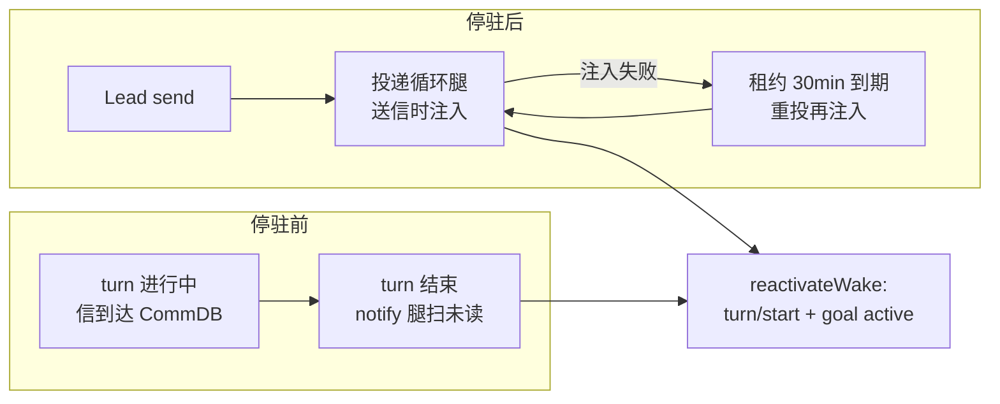

# FLY-1774 Codex 停驻唤醒自动腿 — 探索

Issue: FLY-1774 (https://linear.app/geoforge3d/issue/FLY-1774/机制-codex-停驻唤醒自动腿notify-回灌-租约兜底消灭人肉-goal-戳1569-7-既定设计的落地)
日期: 2026-08-14
基于: 无(上游为 FLY-1569 设计定稿 `doc/messaging-rework/design.md` §7)

## 1. 病(问题重述)

Codex runner 目标完结停驻(Goal achieved / paused)后**不再读信箱** —— Lead 发 `flywheel-comm send` 唤不醒,只能人肉往它的 tmux 观察窗发 `/goal <指针>`。8-14 一天两例(FLY-1751 rebase 令、FLY-1764 返工令)。Claude runner 无此问题(官方 mailbox poller 常驻)。

FLY-1569 §7 已写明方向:Codex 无主回合 stop 事件 → 用 `config.toml` 的 `notify` + turn-ended 回灌唤醒;可靠性弱一档 → 必须靠租约到期重投兜底。本单是该既定设计的落地设计。

## 2. 代码审计结论(推翻/修正 issue 假设的部分)

审计范围:`packages/claude-runner`(CodexTmuxAdapter / codex-daemon-* / codex-home)、`packages/flywheel-comm`、`packages/teamlead/src/bridge`、`scripts/hooks`。全部结论带代码证据,详见 research.md。

### 2.1 Codex runner 的真实形态(不是裸 TUI)

```
CodexTmuxAdapter (Node, edge-worker 进程内)
   ├─ spawn: codex app-server --remote-control --listen unix://~/.flywheel/cdx-sock/<sha1(execId)[:16]>.sock
   │         (detached daemon, CODEX_HOME=~/.flywheel/codex-homes/<execId>, per-runner 隔离)
   ├─ 机器客户端: CodexDaemonClient — JSON-RPC over unix socket
   │         goal 注入 = thread/goal/set (有界指针) + turn/start (kick text)
   └─ 观察窗: tmux pane 跑 codex resume --remote <socket> <threadId>
             (founder 观看 + 人肉插手用 —— 人肉 /goal 就是戳在这个窗里)
```

- **人肉 /goal 的程序化等价物已存在**:`CodexDaemonClient.startTurn(threadId, text)` + `setGoalStatus("active")` —— phase wake 的 `reactivateWake()`(`codex-daemon-client.ts:872-931`)就是这个组合。**不需要 tmux send-keys**。
- **外部进程可凭 execId 独立连上 daemon**:socket 路径是 execId 的纯函数(`resolveDaemonSocketPath`),threadId 持久化在 `codexSessionStateDir(execId)/session.json`。

### 2.2 notify 通道已被 FLY-1571 占用(本单是扩展,不是新建)

- 每个 runner 的 config.toml 已由 `renderCodexHomeConfig` 写入 `notify = ["~/.flywheel/hooks/runner-stop-notify.sh", "--codex"]`(sentinel 包裹,恰好一个 root notify,多了 fail-loud)。
- 现钩子是 **notify-only reporter**:过滤 `type=="agent-turn-complete" && client=="codex-tui"` → detach 调 `flywheel-comm runner-stopped` → 给 Lead 信箱插一条 `RUNNER-STOPPED` report。**没有任何回灌**。
- 钩子头注释已预留前向合同:「未来的 blocking Runner Stop hook(FLY-1569 batch G)拥有停轮决策权,只能在放行后调用本 reporter」。

### 2.3 「停驻后读不到信」的准确机理(代码级证实)

Codex runner 的信箱读取是 **agent-in-turn pull**(提示词教它在 task boundary 跑 `flywheel-comm inbox` / `check`),不是 runtime push。turn 一结束,轮询者消失。daemon 的非 hold 主循环只轮询 goal 状态,完全不看信箱(`codex-daemon-client.ts:1237-1325`)。

停驻分两种形态,处置完全不同:

| 形态 | 状态 | daemon | 可注入? |
|---|---|---|---|
| **A. goal terminal**(complete/blocked)且 session 走完 | `runGoal` 返回 → teardown:killWindow + runtime.stop() | **已拆** | ❌ 注入无靶子;信箱按「收件人 terminal → DEAD → 死信给 Lead」既有规则走,不在本单范围 |
| **B. phase hold 停驻**(park / awaiting_review / QA-wait) | goal `paused`,daemon 常驻,观察窗还在 | **活着** | ✅ 这就是 1751/1764 人肉戳的场景,本单的靶子 |

形态 B 已有一条 runtime push:`wakeRunnerMailbox` → codex-teams inbox JSON → `CodexMailboxWatcher`(仅 phase hold 期间启动)→ `runner_phase_wakes` 表 → `reactivateWake()`。**但 `flywheel-comm send` 走的是 CommDB mailbox 表,与这条 phase-wake 通道互不相通** —— 这是两起事故的直接原因(待 research.md 以投递侧审计补完闭环)。

### 2.4 notify 的硬约束(实测已证)

- **codex 会等 notify 程序退出才接受下一 turn** —— 回灌逻辑必须毫秒级返回前台、真正工作 detach。
- **子 agent 的 turn 也触发 notify**(`client=null`,且 remote 形态继承 parent input history)—— 必须保留 `client=="codex-tui"` 过滤。
- notify payload 无 session/exec 概念,exec 绑定靠 daemon env 继承(`FLYWHEEL_EXEC_ID` / `FLYWHEEL_COMM_DB` / `FLYWHEEL_COMM_CLI` 等已在 `buildDaemonEnv()` 注入)。
- `runner-stop-notify.sh` 不在 Bridge 自动部署列表(`sync-flywheel-hooks.ts` 只部署 `inbox-check.sh`)—— 部署缺口,本单需要收口。
- 存量 live CODEX_HOME 的 config.toml 不随代码更新(只影响新 spawn)—— 发布顺序要考虑。

## 3. 关键时序洞察:notify 一条腿不够

`notify` 只在 turn 结束**那一刻**触发。停驻之后不会再有 turn-end 事件。所以:

- **「停驻时信已在箱」**(信在 turn 进行中到达,agent 没读就停了)→ notify 腿在停驻瞬间扫一次未读,能兜住。
- **「停驻后来信」**(1751/1764 的实际场景:runner 先停,Lead 后发令)→ notify 永远不会再响。**必须由投递时注入承担**(mailbox 投递循环的 codex 最后一公里在送信时顺手唤醒)。验收的「Lead send → N 秒内醒来」只能靠这条。
- **「注入失败/丢失」** → 租约到期重投(FLY-1573 已建)重新走一遍最后一公里 → 注入天然重试。

三条腿各管一段,合成完整覆盖:



## 4. 方案空间与取舍

### 4.1 注入原语(怎么把「读信箱」塞给停驻的 codex)

| 选项 | 评估 |
|---|---|
| **A. daemon JSON-RPC:`turn/start` + `goal set active`**(reactivateWake 模板) | ✅ 选它。已有生产验证的现成模板;外部进程凭 execId 可达;协议级、无渲染竞态 |
| B. tmux send-keys 往观察窗打 `/goal` | ❌ 自动化人肉动作的字面复刻,但依赖 pane 存活(开窗是 fail-open 的)、有渲染/焦点竞态、全仓无先例 |
| C. 新 goal:`thread/goal/set` 换 objective | ❌ 语义过重 —— 停驻 runner 的 goal(北极星指针)没变,变的是「有新指令要读」;且 objective 有 `GOAL_OBJECTIVE_MAX_CHARS` 上限、覆盖原 objective 有副作用 |

注入文本 = 有界指针(「你有未读 Lead 指令,跑 `flywheel-comm inbox --exec-id …` 读取并执行」),不塞信件正文 —— 与 FLY-1236「durable /goal 是指针不是任务体」同一纪律。

### 4.2 notify 腿放哪

| 选项 | 评估 |
|---|---|
| **A. 扩展 `runner-stop-notify.sh` 的 detach 段**:上报 runner-stopped 之余,查未读 → 有则触发注入 | ✅ 选它。一个 notify 通道(渲染器强约束恰好一个)、一次 fork;前台段不加任何耗时工作 |
| B. 新加第二个 notify 程序 | ❌ `renderCodexHomeConfig` 明确 fail-loud 拒绝多 notify |
| C. 改 config 断言支持三参 argv 换新脚本 | ❌ 多改一层渲染断言,收益为零 |

### 4.3 投递腿放哪(停驻后来信的主腿)

投递循环对 codex runner 的最后一公里在送达动作之后,追加「收件人是 codex-tmux 且处于可注入停驻态 → 触发注入」。具体挂点(runner-mailbox-lane / wakeRunnerMailbox / transport 层)待投递侧审计定稿于 research.md。

### 4.4 阴性对照(设计红线,双向都要守)

1. **无未读信的停驻 codex 不被打扰**:notify 腿查未读为空 → 静默退出;投递腿只在真有信投出时动作(FLY-1569 红线①「投递循环永远不主动发消息」的注入版:**没有新信 = 不注入**)。
2. **正常 goal 进行中零行为变化**:goal `active` 时不注入(注入前查 goal 状态);notify 前台段行为与 FLY-1571 现状 byte-等价。
3. **形态 A(daemon 已拆)不注入**:socket 连不上/`session.json` 无 hold 标记 → 放弃注入,交给既有 terminal→DEAD→死信规则。

## 5. 范围边界

**做**:notify 腿(turn-end 扫未读回灌)+ 投递腿(送信时注入)+ 租约重投复用(注入随重投天然重试)+ 阴性对照三条 + `runner-stop-notify.sh` 部署收口。

**不做**:
- 形态 A(session terminal)的复活/重派 —— 死信闸已有归宿;
- turn 进行中的插话(`turn/steer` runner 侧未实现,信到达 active goal 时等 turn 结束由 notify 腿兜);
- Claude runner 任何路径(官方 poller 已覆盖,零改动);
- FLY-1569 batch G 的 blocking Stop hook(停轮决策权),本单只做唤醒。

## 6. 待 research.md 回答的问题

1. `flywheel-comm send` → mailbox 表 → 投递循环 → codex runner 的现有最后一公里到底是什么、断在哪一环(runner-mailbox-lane.ts / sendRunnerWake / transport)。
2. 租约重投(FLY-1573)重投时走不走最后一公里(决定投递腿挂点能否让重投免费复用)。
3. 停驻 runner 在 mailbox 视角的 terminal 判定(会不会被误判 terminal 直接 DEAD,导致投递腿根本轮不到)。
4. `client=="codex-tui"` 过滤在无观察窗(pane 拆除 fail-open)时 payload 的 client 取值 —— 实测项,进 QA 清单。
