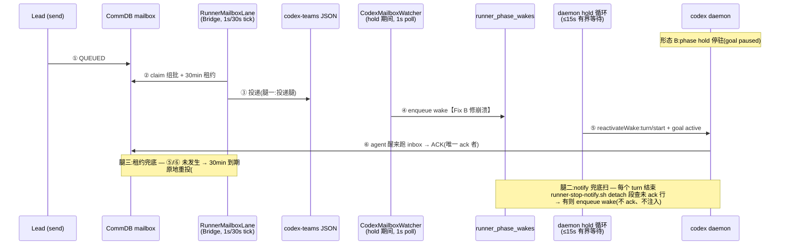

# FLY-1774 Codex 停驻唤醒自动腿 — 实施计划

Issue: FLY-1774 (https://linear.app/geoforge3d/issue/FLY-1774/机制-codex-停驻唤醒自动腿notify-回灌-租约兜底消灭人肉-goal-戳1569-7-既定设计的落地)
日期: 2026-08-14
基于: research.md

## 0. 一句话

唤醒链路(lane 投递 → codex-teams JSON → watcher → `runner_phase_wakes` → hold 循环 → `reactivateWake` 注入)**已存在**;本单修好链上两处断裂(投递闸误判 terminal、batch 唤醒入队崩溃),给 turn 边界加一条 notify 兜底扫,租约重投天然复用 —— 消灭人肉 /goal 戳。

## 1. 目标与验收(照抄 issue,加量化)

1. Codex 停驻(phase hold)时若信箱有未读 Lead 指令 → 自动作为新 turn 注入(自动化人肉 /goal)。
2. 回灌失败/丢失 → 租约到期重投再次触发注入。
3. 阴性对照:无未读信的停驻 Codex 不被打扰;正常 goal 进行中零行为变化。

**真机验收**:Codex runner 停驻 → Lead `flywheel-comm send` → **≤60s 自动醒来执行(典型 ≤5s),零 tmux 人肉输入**。
延迟预算(worst):lane 空闲 tick 30s + watcher 轮询 1s + hold 循环有界等待 15s + RPC ≈ 47s → 定 N=60s;lane 活跃(有待投信钉 1s 档)时典型 2-5s。

## 2. 三条腿总览

腿的分工:
- **腿一(投递腿,主腿)**:现有链,修 Fix A/B 后即通。覆盖「停驻后来信」= 验收场景。
- **腿二(notify 兜底扫,FLY-1569 §7 的 notify 回灌)**:覆盖 watcher 丢事件/进程内链路失灵;也兜「停驻时信已在箱」(与 hold 首扫双保险)。只入队,不注入、不 ack。
- **腿三(租约兜底,FLY-1573 已建)**:重投重走全链 → 注入天然重试,零新代码(留神 frozen-resend 幂等吞,见 §3-B)。

## 3. 改动面(4 个 Fix,零新 env flag,零 config.toml 渲染变更)

### Fix A — 投递闸:仅 carve out `awaiting_review`(断裂①,R1-4 修正)

- **改**:`StateStore.resolveRunnerRecipientState`(`StateStore.ts:5524-5534`)的 terminal 判定**只从现集合里剔除 `awaiting_review`**,即 mailbox recipient terminal 集 = `OUTCOME_STATUSES − approved_to_ship`。**不换成 `WAKE_TERMINAL_STATUSES`** —— 该集合还刻意排除 `approved/rejected/deferred/shelved` 四个 outcome 态(`operational-terminal-status.ts:15-29`),整体换集会把这四个也从 instant-DEAD 放宽,超出本单意图。`TERMINAL_STATUSES` 本体不动(FSM 单调性照旧)。
- **不变量 I7(修正后)**:instant-DEAD = `OUTCOME_STATUSES − approved_to_ship` ∪ session 缺失;唯一放宽的是 `awaiting_review`(`design_done`/`ship_parked`/`approved_to_ship` 现状本就 alive)。放宽后的收件人真死也有界:3×30min 租约 → DEAD → 死信给 Lead(比 instant 慢 ≤90min,换来可唤醒)。
- **爆炸半径(显式声明)**:跨 vendor —— Claude runner 的 `awaiting_review` 信也从「立即 DEAD」变「正常投递 + 官方 poller 唤醒」(修 FLY-1731 实录事故的正向效果);QA 加 Claude 对照组。R1 已 grep 确认:无任何消费者按 `awaiting_review`/`recipient_terminal` 来源状态分支,下游只处理通用 DEAD/dead-letter notice → 风险面 = 死信时机变化,无 schema 兼容问题。
- **在途对账**:FLY-1731(PR #819/#822)在同一 seam 邻区(R1 已核 main `59e8bd645`:该函数未被其触碰,其改动主要在 question admission)。implement 节点 JIT rebase 后核对:若其已改此判定,以先落地者为准、本 Fix 缩为对账;**不双改一处**。

### Fix B — batch 唤醒入队:新建 doorbell-wake 专用事务路径(断裂②,R1-1/R1-2 重写)

R1 揭示的三个硬事实,决定了不能在现 `enqueueRunnerPhaseWake` 上小修:
1. 现函数对任何非空 `source_instruction_id` **在同一事务里 `UPDATE mailbox SET state='ACKED'`**(`db.ts:2712-2720`,测试 `db.test.ts:1245-1265` 把它定义为 "queues ... and claims its instruction")—— batch 若绑首成员,等于 watcher 替 agent ACK 首条、其余成员仍 LEASED,破坏批级 ACK 语义。
2. 唯一索引 `idx_runner_phase_wakes_source (execution_id, source_instruction_id) WHERE source_instruction_id IS NOT NULL`(`db.ts:253-255`)—— 同 source 第二次 INSERT 直接撞约束。
3. envelope 的 `metadata.memberIds` 取自 `MailboxRow.delivery_id`(`runner-mailbox-lane.ts:188`),与 canonical `mailbox.id` 是两个独立唯一列,不能直接当 projection id 查。

**改法:新增 batch/sweep 共用的专用 DB helper(命名建议 `enqueueRunnerDoorbellWake`),单一事务内完成**:
- **成员解析与校验**:按 `delivery_id` 解析回 canonical mailbox 行;校验每个成员 `to_agent === executionId`、`recipient_kind='runner'`、`carrier='inbox'`、state ∈ {QUEUED, LEASED};memberIds 缺失/解析失败/ownership 违规 → fail-loud(维持现诊断风格)。
- **零 settlement 副作用**:**绝不触碰 mailbox 行的任何状态**(不变量 I1 的 DB 层落实)。ACK 只发生在 agent 醒后自己跑 `inbox`/`check`。
- **doorbell wake 身份与去重(R1-2 + R2-1 合同)**:`source_instruction_id = NULL`(既避开唯一索引,又避开 legacy 自动 ACK 路径)。**schema 声明(R4 修订)**:本单接受**恰一处**幂等 ADD COLUMN —— CommDB `sessions.phase_keep_alive`(见下「capability + 存活围栏」),走仓库 `ensureMailboxQueueSchema` 同款就地迁移惯例;`runner_phase_wakes` 表结构不动。
  - **稳定 attempt 身份 `doorbellAttemptId`(batch 与 sweep 跨腿共享,不用 transport 随机 UUID —— `CodexAdapter.ts:156-160` 的 message.id 是写入时另造的)**:
    - batch 腿:取已验证 envelope 的 `flywheelId = <durableBatchId>#r<lease_retry_count>`(`runner-mailbox-lane.ts:163-188`,attempt 内稳定);
    - sweep 腿对 LEASED 成员:从 canonical 行的 `batch_id` + `lease_retry_count` 推导出**完全相同**的值;
    - sweep 腿对 QUEUED(未领批)行:`sweep:<execId>:<eligible 行的 max(seq)>` —— 同一 eligible 集合 → 同 id 幂等;frontier 变化(新信到达 seq 增长,**或 eligible 集合收缩使 max(seq) 变小**)→ 新 attempt id。
  - **多批快照的全函数规则(R3-2)**:in-flight 上限允许同收件人并存多个 LEASED batch(默认 3、上限 20,`mailbox-queue-config.ts:14-20,81-87`;`claimQueueBatch` `mailbox-queue.ts:1070-1096`)。一次 sweep 快照可能同见 batch A `#r1`、batch B `#r0`、QUEUED 行。规则:**事务内按组排序(LEASED attempt 按其最老成员 seq 升序在前,QUEUED frontier 组最后),选第一组作本次唯一 `doorbellAttemptId`,doorbell 文案/metadata 只覆盖该组成员**;其余组不入账,留给各自的 watcher callback 或后续 sweep(agent 醒后跑 `inbox` 本就整箱排空,后续组的 wake 会以 `already_settled` 收敛)。**reuse 不丢 response ref**:命中合同 2 复用时,若现 pending(未 started)wake 的覆盖集缺本快照新出现的 response refId,同事务把缺的 `check <refId>` 指针并入其 content/metadata;已 started 的 wake 不改(残余义务由 finish 后的下一 attempt 补敲)。
  - **落库形态**:doorbell 的耐久 `message_id` = `doorbell:<doorbellAttemptId>`(namespaced),等价查重直接骑在现 `(execution_id, message_id)` 查询上;transport UUID 只进 `metadata_json` 作审计。namespace 前缀同时是 **doorbell 分类标记** —— 覆盖检查只数 `doorbell:` 前缀的 wake,不把现存 source-null 的 park_wake/gate/retest wake 误当 doorbell(反向亦然:doorbell 不抑制它们)。
  - 去重合同:
    1. 同 `doorbellAttemptId` → 永远幂等(跨腿:batch 成功后同 attempt 的 turn-end sweep 推出同 id → 不叠加);
    2. 该 execution 已存在 **non-finished(pending/started)** doorbell wake → 复用不新增(**每 execution 至多一条在途 doorbell**);
    3. 仅当前一条已 finished 且出现**新 attempt id**(新验证 batch attempt `#r+1`,或新 QUEUED sweep frontier —— 含 eligible 集合收缩导致的 frontier 变化,不等同于新邮件投递)→ 允许新 wake。
  - **跨 attempt 复用的耐久 coverage(R4-1)**:合同 2 复用时,同一 immediate 事务把被复用的 attempt id 写入承载 wake 的 canonical `coveredDoorbellAttemptIds`(存 `metadata_json`);**等价检查同时查主 `message_id` 与全部 doorbell wake(含 finished)的 covered 集合** —— 检查实现为事务内加载该 execution 的 `doorbell:` 前缀行(每 execution attempt 数有界)在 JS 侧判成员。回归:A pending → B reuse 并合并 pointer → A finished → **同一 B** 再 callback/sweep → `already_covered` 零新增;并发重复 B 只记录一次。
  - **capability + 存活围栏(R4-2/R4-3 统一解,R5 定死 producer/terminal/migration 合同)**:
    - **capability 事实**:CommDB `sessions` 新列 `phase_keep_alive`,DDL 定为 `INTEGER NOT NULL DEFAULT 0 CHECK(phase_keep_alive IN (0,1))`,由 adapter 在现有 session 注册位点(`CodexTmuxAdapter.ts:1525-1532`,它持有 `ctx.phaseKeepAlive`)写入。单一真相在 CommDB → sweep CLI 用现成 `FLYWHEEL_COMM_DB` 即达,**无跨包文件 resolver、无 `buildDaemonEnv` 变更、无 session.json 合同**;列缺失/未置位 → doorbell 腿 fail-closed no-op。
    - **producer 合同(R5-1,fail-loud + write-once 单调)**:现 `registerCommDbSession()` 吞异常返 false(`CodexTmuxAdapter.ts:1513-1539`)且注册 seam 多 caller(dispatcher pre-register / adapter / CLI),`registerSession()` 的 ON CONFLICT 会覆盖字段(`db.ts:4864-4907`)。合同:非 phase 注册维持 best-effort 现状;**`ctx.phaseKeepAlive` 时 register/open/migration 失败必须 fail-loud,且 phase controller `start()` 前断言同一行 `phase_keep_alive=1 AND status='running'`,断言不过不得启动 controller**(否则 fence 会让唤醒静默全失效)。列写入用单调 `MAX(existing, excluded)`(后来的 absent/false caller 不得把 1 降回 0);所有旧 caller 默认 0。回归:注册故障 → runtime/controller 均未启动;pre-register 0 → adapter 1;后续 0 不降级;terminal row 不得带 live controller 启动。
    - **terminal 收口(R5-2,覆盖全部生产 writer + started 态)**:生产 status-terminal writer 有两个 —— adapter 的 `updateSessionStatusIfRunning`(`db.ts:5039-5047`)与 Bridge `terminal-commdb-sync.ts:175` 的 `markSessionTerminalStatus`(`db.ts:5055-5063`,StateStore failed/blocked 投影);且现 `disposeRunnerPhaseWakeForTerminal` 只收 `state='pending'`(`db.ts:2988-3004`),started 行会残留。合同:两个 writer 各保留自身 CAS/覆盖语义,但**共用同一内部事务 primitive**:flip status 的同一事务里 bulk-finish `message_id LIKE 'doorbell:%' AND state IN ('pending','started')`,写 terminal disposal reason 并清 claims;fence 的存活判定写成闭集 `status='running'`。implement 时审计 `finalizeSession`/delete 路径既有 wake prune,防旁路。回归:terminal-commdb-sync 先赢 → 后续 sweep no-op;pending/started 各一条被收走;adapter 重复 terminalize 幂等;`finishWake()` 对已 terminal-finished 行幂等。
    - **migration 落点(R5-3)**:`ensureMailboxQueueSchema` 只管 `mailbox` 表(`mailbox-queue.ts:240-295`),**sessions 的真实升级 seam 是 `CommDB.applyMigrations()`**,且 FLY-1066 迁移会整表重建 sessions 并显式列复制列(`db.ts:898-953`)。顺序合同:fresh `SCHEMA` 加列;FLY-1066 rebuild 的 create/copy 保留该列**或**幂等 ADD 放在全部 rebuild 之后;容忍 duplicate-column race;终态断言列存在。升级测试三起点:当前 schema、缺 vendor/failed-check 的古老 fixture、已有 session 行 —— 断言旧行=0、新 phase 注册=1、重复/并发 open 幂等、Tmux/CLI/dispatcher 注册仍为 0。
    - **两向竞态收敛**:teardown 先 → doorbell helper 围栏见非 running → no-op;doorbell 先插入 → terminal 事务收走 → terminal 后零 non-finished doorbell。batch callback 与 sweep 共用同一 helper → 同一围栏。回归:shutdown 先 fence 后释放暂停的 sweep → no-op;sweep 先插入后 shutdown → terminal 后零 non-finished doorbell;controlled shutdown 与普通/error teardown 两形态都覆盖;capability 未置位 → 恒 no-op。
  - **并发正确性**:检查+INSERT 用 `transaction(...).immediate()`(写锁),普通 deferred 不足以证明跨连接并发复用。
- **stale envelope 收敛(R2-2,不许毒化 watcher)**:watcher 只有 callback 成功才把 JSON 标 read(`CodexAdapter.ts:458-475`),callback 抛错 = 同一消息每秒重试到永远。故 helper 校验**绑定到当前 attempt**:canonical 行的 `batch_id` + retry 序数 + 成员集合须与 envelope 一致;返回值分型:
  - `queued` / `reused` / `already_settled`(成员已全 ACK/DEAD)/ `stale_attempt`(行已回 QUEUED 或被新 batch_id 重新 LEASED)→ **全部让 watcher 正常 ACK transport 消息**(旧 envelope 被消费,不成环);
  - 仅 malformed / recipient-ownership 违规 → 抛错(真异常才 fail-loud)。
  - 同 attempt 内仅部分成员仍 eligible → 只覆盖剩余子集。
- **消费侧零改动**:`observe()` → `reactivateWake()` → finished 现状即可(`codex-phase-lifecycle.ts:287-301`;`codex-daemon-client.ts:914-930`)。合同 2 保证 hold 恢复后不残留同义务的 stale wake。
- **接线**:watcher `onDelivered` 路径(`codex-phase-lifecycle.ts:372-400`)按 flywheelId 形态分流:`mailbox-batch:` 前缀 → 新 helper;单条 legacy 形态(queue OFF)→ 现 `enqueueRunnerPhaseWake` **逐字节不变**(含其自动 ACK 行为,byte-compat)。
- **测试**:batch → 恰一条 wake 且 mailbox 全员状态零变化;重投×前 wake pending → 复用零新增;重投×前 wake finished + 成员未 ACK → 恰一条新 wake(新 attempt id);**batch 成功但 agent 未 ACK 后的同 attempt sweep 不新增;sweep-first 与同 attempt watcher callback 不叠加;已有非-doorbell source-null wake 不抑制 doorbell**;并发 onDelivered 只入一条(immediate 锁);active runner 已 ACK 后首次进 hold → 旧 envelope `already_settled` 被消费;暂停 watcher 跨 lease expiry 同见旧/新 JSON → 旧被 ACK、只有当前 attempt 成 wake、无错误循环;delivery_id→canonical 映射/ownership 违规 fail-loud;**多批快照(R3-2)**:两条不同 LEASED batch + QUEUED 行 → 恰一条 wake 且覆盖最老组;instruction/response 分属不同 attempt → reuse 并入 response ref 不丢;第二 attempt 在第一条 wake finished 前到达 → 复用、finished 后到达 → 新 wake;legacy 单条路径全量回归。
- **QA 前置**:先真机复现断裂②(before 基线:停驻 codex + batch send → watcher 日志 `bound instruction ... not found` + runner 不醒),再验修复(after:同场景醒来)。因果归因必须有 before 基线。

### Fix C — notify 兜底扫(腿二,FLY-1569 §7 notify 回灌的落地形态;R1-3 收紧)

- **新增** `flywheel-comm runner-wake-sweep`(名字 implement 可调):**复用 Fix B 的专用 helper**,资格判定 + 覆盖检查 + 插入在**同一事务**内原子完成:
  1. 资格谓词(不是裸 to_agent+state):`to_agent=execId AND recipient_kind='runner' AND carrier='inbox' AND state IN ('QUEUED','LEASED') AND 未过期(expires_at)`;
  2. **按 type 分流 doorbell 文案**:有 instruction 行 → 指针含 `flywheel-comm inbox --exec-id <id>`;只有 response 行 → 指针含 `flywheel-comm check <refId>`(逐个列出;`inbox` 只读 + ACK instruction,response-only 时通用 "run inbox" doorbell 是错的);混合 → 两条命令都列;
  3. 覆盖检查走 Fix B 合同(同 `doorbellAttemptId` 幂等 + 至多一条 non-finished doorbell);
  4. **消费者资格闸(R2-3 → R3-1 → R4 定稿:capability 级 + 存活围栏,单一真相在 CommDB)**:R3 复核推翻了 declared-park 闸 —— `declare-state park` 是通用命令、无 phase-capability 校验(`declare-state.ts:75-106`,非 phase runner 也能声明 → false positive);且 native goal 到 `complete` 时 phase controller **不经 marker 直接 `enterPhaseHold()`**(`codex-daemon-client.ts:1061-1067`;marker 只是另一条提前进入路径 `:1093-1101, 1233-1235`),而 `send.ts:33` 无条件清 marker → 拿 marker 当闸会在「Goal achieved 停驻」主场景 false negative。**正确的 authority = phase-keep-alive capability**(静态、每 execution 定于 spawn,`ctx.phaseKeepAlive` 存在 = 唯一会创建 hold 消费者的路径),按 Fix B「capability + 存活围栏」持久化在 CommDB `sessions.phase_keep_alive` 并在同一事务内连同 status 非 terminal 一起校验。非 capability runner → 无条件 no-op(声明了 park 也 no-op);capability runner **不要求当前已 parked** —— active 期入队的 doorbell 在下次 hold 进入时被消费,正是 park-with-unread sweep 语义;teardown 侧由 terminalization helper 收走残留(无孤儿行,两向竞态收敛见 Fix B);
  5. **绝不 ack(零 mailbox settlement 副作用)、绝不直连 daemon RPC**(不变量 I1/I5);
  6. 空结果 → 静默 exit 0(阴性对照 I2);
  7. CLI 身份只从 `FLYWHEEL_EXEC_ID` env 取(与 `inbox`/`turn` 同款纪律;显式 `--exec-id` 仅 debug override 并打 warning)。
- **挂点**:`scripts/hooks/runner-stop-notify.sh` `--codex` 分支的 **detach 段**,`runner-stopped` 之后顺序追加;监督结构见 Fix D(不是无脑"复用 12s watchdog")。**前台段零新增工作**(实测硬约束:codex 等 notify 退出才接受下一 turn);保留 `client=="codex-tui"` 过滤;**Claude 的 Stop/StopFailure 分支绝不跑 sweep**(该脚本双 vendor 共用)。env 依赖(`FLYWHEEL_EXEC_ID`/`FLYWHEEL_COMM_CLI`/`FLYWHEEL_COMM_DB`)已由 `buildDaemonEnv()` 注入,零新 env。
- **消费时机**:wake 行黏在表里;runner 若继续跑,下次进 hold 即消费(= park-with-unread sweep);runner 已在 hold,hold 循环 ≤15s 消费。
- **自唤醒循环论证**:注入 turn 结束又触发 notify → sweep 再查 —— 若 agent 已按 doorbell 排空并 ACK,资格谓词为空 → 静默;若 agent 没 ACK(违约),合同 2 限一条在途 wake + 消费侧 finished 后才可能新增 → 每个投递 attempt 至多一次重敲,不成环。
- **已知可容忍噪声**:sweep 读取与 agent 下一 turn 内 ack 的竞态 → 至多一条对已 ack 信的 stale doorbell(合同 2 限一条)→ 下次 hold 注入一句「查信箱」、agent 查空即继续。有界、自限、无副作用,写入 QA 观察项。
- **测试**:两个并发 detached sweep 只入一条;response-only 不产生 "run inbox" doorbell;资格谓词各维度(kind/carrier/expiry);已有 pending/started/finished wake 三态行为;Claude 分支零 sweep;scan 后 agent ACK → 至多一条无害 stale wake;**capability 闸(R3-1)**:非 phase runner 即使自己声明 park 仍 no-op;phase runner park → Lead send 清 marker → goal complete 仍进 hold 且 sweep 可入队;已 paused hold 的 marker 被清后仍可 sweep;restart 恢复的 phase hold 资格事实仍在。

### Fix D — 部署收口 + detach 段监督结构(R1-5 写实)

- `runner-stop-notify.sh` 加入 Bridge 自动部署列表 —— **改动面不止一行**:`HOOKS_TO_DEPLOY`(`sync-flywheel-hooks.ts:51`)+ 模块头注释 + `sync-flywheel-hooks.test.ts` 里假设「只有 inbox-check.sh」的多处断言,一并更新;补默认双 hook 的安装/权限(0755)/原子替换测试。
- **诚实边界**:Bridge 侧 hook sync 是 soft-fail 只记日志(`sync-flywheel-hooks.ts:425-440`、`plugin.ts:4304-4328`)—— 它修复常规部署漂移,**不宣称彻底消除静默失效**;sync 失败的 degraded 形态照旧可观察(日志),不新增告警。
- **detach 段监督结构**:现 12s watchdog 只监督单个 `runner-stopped` child。追加 sweep 后的结构:同一个 detached 子 shell 内**顺序**执行 `runner-stopped`(自有 12s 预算)→ `runner-wake-sweep`(**独立** 12s 预算);`runner-stopped` 超时/失败**不吞掉 sweep**(sweep 独立预算、独立 fail-open),整个子 shell 总预算 ≤30s 兜底。implement 在此边界内定具体形状。
- **不改** config.toml 渲染值(notify argv 仍 `[path, "--codex"]`)→ `renderCodexHomeConfig` 断言零改动、**存量 live CODEX_HOME 无需重写**,hook 脚本落盘即全体 runner 生效。

## 4. 不变量(review 锚点)

| # | 不变量 |
|---|---|
| I1 | queue-enabled 的 batch/sweep doorbell 腿零 settlement 副作用;ack 只由 agent 自己的 `inbox`/`check` 完成(FLY-1569 铁律 1)。**Legacy 例外**:queue-OFF 单条路径的 `enqueueRunnerPhaseWake` 自动 ACK 是既有行为,字节保留(见 I8),本单不扩张该 seam |
| I2 | 无未 ack 信 → 零注入零打扰(防 watchdog 红线①的注入版) |
| I3 | goal active 期间零打断:注入只发生在 hold 循环内;notify sweep 只入队 |
| I4 | 注入内容 = 有界 doorbell 指针,信件正文只经 agent 自己拉 CommDB |
| I5 | 单一注入者 = daemon hold 循环;外部(sweep/lane)只入队,不直连 daemon RPC |
| I6 | 零新 env flag(FLY-1466 铁律);config.toml notify 渲染值字节不变 |
| I7 | instant-DEAD = `OUTCOME_STATUSES − approved_to_ship` ∪ session 缺失;唯一放宽 `awaiting_review`(转租约周期兜底,≤90min 有界) |
| I8 | Claude 路径零行为变化(除 Fix A 声明的正向爆炸半径);antigravity/kimi(transport=none)零变化;legacy 单条 wake 路径字节不变 |
| I9 | doorbell wake:每 execution 至多一条 non-finished;入队零 mailbox settlement 副作用;新 wake 只随**新验证 batch attempt 或新 QUEUED sweep frontier** 产生 |

## 5. 测试与 QA

**单元/集成(TDD,实现前红)**:
- Fix A:`resolveRunnerRecipientState` 全状态矩阵(park 态 alive / OUTCOME terminal / missing);lane 集成:awaiting_review 收件人 QUEUED 行不进 DEAD、OUTCOME 行仍 instant-DEAD。
- Fix B:batch envelope → 恰一条 wake 且 mailbox 全员状态零变化;delivery_id→canonical 映射与 ownership 违规 fail-loud;memberIds 缺失 fail-loud;重投×前 wake pending → 复用零新增;重投×前 wake finished + 成员未 ACK → 恰一条新 wake;并发 onDelivered 只入一条;单条 legacy 路径回归(现测试全绿,自动 ACK 行为字节不变)。
- Fix C:sweep 空箱静默;有未 ack 行入队一条;幂等(重复 sweep 不叠加);绝不触碰 ack 位;shell 侧 harness 验前台段零新增延迟 + detach。
- 回归:FLY-1573 lane/lease 套件、codex-phase-lifecycle 套件、`codex-home` 渲染断言(应零 diff)。

**真机 QA(独立 QA 节点,按验收剧本)**:
1. **断裂② before/after 铁证**(§3-B 前置)。
2. 主链:phase-hold 停驻 codex → send → ≤60s 醒(典型 ≤5s),零人肉输入;断言注入 turn + agent 自己 ack。
3. 阴性 a:停驻 + 无信,观察 ≥10min 零注入。
4. 阴性 b:active goal + send → 当前 turn 不被打断;turn 结束/下次 hold 才处理。
5. 租约兜底(R1-6:验真实失败态,不删耐久行造假成功):用可注入的 watcher callback failure / 暂停消费保留真实 CommDB + codex-teams 状态,缩短 `ackLeaseMs` 后验证:首次未形成可消费 wake → 原批回 QUEUED → 新 attempt 投递 → **恰一条**可消费 wake → 注入 → agent ACK;保留 frozen-resend 同 envelope id 的阴性用例(已知幂等吞,不当可靠性保证)。
6. Claude 对照:awaiting_review Claude runner 收信被官方 poller 唤醒;OUTCOME-terminal runner 信仍 DEAD + 死信通知(死信闸不回归)。
7. 实测项:无观察窗(pane 拆除)时 notify payload `client` 取值 → 若非 `codex-tui`,腿二在无窗 runner 失效,须回改过滤或记录边界。

## 6. 不做(边界)

- 形态 A(goal terminal → teardown)的复活/重派 —— 死信闸 + Lead 决策,不归本单。
- 非 phaseKeepAlive codex runner:无 hold 形态,不放宽 lifecycle 语义。
- turn 进行中插话(`turn/steer` runner 侧未实现)。
- FLY-1569 batch G blocking Stop hook(停轮决策权)—— 本单只做唤醒,hook 前向合同保留。
- Runner 侧 `ack_batch` 工具化、投递失败回执给发信方 —— 各自独立单。

## 7. 发布与回滚

- **生效路径**:Fix A/B = Bridge 进程内(lane/StateStore/CommDB)→ 需一次 Bridge 重启;Fix C/D = hook 脚本 + CLI,脚本落盘即对全体 runner(含存量 CODEX_HOME)生效;唯一 schema 变更 = CommDB `sessions.phase_keep_alive`(DDL 与 migration 顺序合同见 Fix B,落点 `applyMigrations()` 而非 `ensureMailboxQueueSchema`);`runner_phase_wakes` 表结构不动。**存量在途 codex execution 的诚实口径(R5-4,选边:不做回填)**:capability fence 由 batch callback 与 sweep 共用,故部署时已在途的 codex execution(列值=0)**两条 doorbell 腿都 no-op** —— 即它们保持与今天完全相同的(坏的)行为,fallback 仍是人工 `wake_pointer` nudge,不劣化;Fix A(投递闸)对它们照常生效(信不再被误 DEAD,进 codex-teams JSON 与租约周期)。全部腿从**下一次 spawn 的 execution** 起完整生效。不做在途 controller 的 capability 回填(避免给无 fail-loud producer 保证的旧注册补写 1 的风险面)。
- **存量在途停驻 runner**:hold 循环活在 Bridge 进程树内 —— 重启窗口对它们的收编按现有恢复机制处置,implement 节点部署时 JIT 核实,不在本设计内做保证;最坏 fallback = 现有人工 `wake_pointer` nudge(与今天等同,不劣化)。
- **回滚**:Fix A/B/D 单 commit revert + Bridge 重启;Fix C revert hook 脚本(notify argv 未变,渲染层零涉及)。
