# FLY-1781 每周扫描退役出口 — 实施计划

Issue: FLY-1781 (https://linear.app/geoforge3d/issue/FLY-1781/flag治理b3第4批-每周扫描-摆出候选问-annie留清-退役出口主体永不自动删)
日期: 2026-08-16(R6 定稿;Codex design review 6 轮 APPROVED:R1×8 + R2×7 + R3×5 + R4×5 + R5×2 + R6 LOW×1 全折入)
基于: 无(上游 = `product/doc/FLY-1412-flag-governance-source/prd.md` v23 §5.3/§5.4/§5.5/§5.6 + issue 正文 2026-08-15 快照法附录)

---

## 0. 一句话

Bridge 内每 7 天(**写死,无旋钮**)对全部 registry flag 的**解析后生效值**采一次样;一个 flag **连续两次采样同值且间隔 ≥ 7 天**、且她没答过「留」、也没人在退它 → 进当周候选批,**一张 Linear 批量单 + 一页可留言 HTML** 摆到 Annie 面前问「留/清」;她答「留」→ 人按 runbook 把 `longTermKeep`/`keepReason`(带本轮绑定 token)写进 registry 走 PR,之后不再问;她答「清」→ 人开执行单、写 `retiring`。**扫描本身永不删任何东西、永不自动建执行单。**

## 0.1 铁律回执(写死,实现体不许偏离)

| # | 铁律 | 出处 |
|---|---|---|
| 1 | **节奏 = 每周**。不攒批、不改月、不改事件触发;**周期在代码里写死 7 天,不提供任何配置旋钮** | Annie O5 = A;R1#1 |
| 2 | **永不自动删**;扫描只「摆出来问」,执行单由人裁决后才产生 | issue 硬约束 1 + PRD §5.4 |
| 3 | 摆出来 = **一张批量单**;执行按**动作性质**拆(机械批量 / 破坏性逐单) | 硬约束 2+3,OQ-8 |
| 4 | 她答「留」→ 写 `longTermKeep`,不再问;**值又变了 → 重新计时、可再问**(锚绑定她实际裁决的那份冻结候选样本,§3.4) | 硬约束 4 |
| 5 | 判据锚在**解析后生效值**,不锚某一层配置 | Tadashi 约束 1 |
| 6 | 采样**不锚日历周**:「连续两次采样同值且间隔 ≥ 7 天」 | Tadashi 约束 2 |
| 7 | 每次采样对 registry 做**差集**:新 flag 无历史不误报稳定;已删 flag 清残留(含 anchor/provenance 缓存) | Tadashi 约束 3;R1#3 |
| 8 | 判据凑不齐 = 判「无时钟」,**不进候选但显式列出**,不许估;不可判分「读不到」与「观测到不稳」两类,后者作废旧时钟(§3.1) | issue readiness ⚠️;R1#5 |
| 9 | founder-facing 文案不得暗示 HTML 留言会自动回传(FLY-298 仍 Backlog) | issue 不做 |
| 10 | **来源查询没跑成 = 整轮 fail-closed:零扫描状态写、零 founder-governance 输出(不建单/不发报告/不发频道消息/不记 run 行);唯一允许的副作用是一条走既有 durable 告警路径、按失败类 dedup 的 Lead 运维告警**。「确实查不到」才是无主 | PRD §5.3;R2#2 |

批次归属注:快照法脱钩提案曾待 Annie 拍板;现批 1–3 相关单(FLY-1779/1806/1809/1811)已全部 merge,本单作为第 4 批被 dispatch 属**原定顺序内**,不涉及脱钩提前,无需再等裁决。

## 1. 现状审计(实现的地基,全部已核实;R2 补三处)

| 事实 | 位置 |
|---|---|
| registry 现存 **51** 条 `FEATURE_FLAGS`(R2 实数;加本单 kill switch 后 52)。**测试一律动态断言集合相等,不钉散文数**。无任何一条已带 `longTermKeep`/`keepReason` | `packages/config/src/feature-flags/registry.ts` |
| FLY-1779 已交付两个可写字段 + `validateKeepFieldContract()`(retiring×longTermKeep **互斥**、keepReason 依附、空串拒绝) | `registry.ts:107-172` |
| `resolveAllFlags(ctx)` 吐出解析后生效值。真实形状:一般路径有 `displayEffective`,`liveness_activity_window_ms` 特殊分支**只回 `effective`**(`resolve.ts:265-276`);`FlagView` 不含 keep 字段 → 需按 name 与 `FEATURE_FLAGS` 1:1 join | `resolve.ts:54-95,327` |
| Bridge 三处同 ctx 调用;⚠️ `ffConfigCache.current()` 是「上次物化的 map」,真刷新走 `refreshManagementSources()` —— **周扫描前必须显式刷新,不得拿陈旧 roster 当真集合**(R2#4) | `plugin.ts:4626-4716` |
| GatePoller 3s tick,riders `(tickCount-1) % N === 0` 搭车,late-arm ready 守卫 | `gate-poller.ts:248-262,1100-1118` |
| Linear 建单先例 `runbookCreateIssue`(仅本地 open-issue 去重,不足以承载本单 crash contract) | `plugin.ts:9429`,`runbook-gap.ts:52-81` |
| Aunt Cass triage 查询只取 `Flywheel,Flywheel-Product`;`/api/runs/start` 的 label 读取**失败时刻意继续(空列表)**,department check 只在 `leadId` 存在时执行 → 纯 label 守卫在 label 不可读路径失效(R2#5) | `.lead/flywheel-cos-lead/identity.md:56-66`,`runs-route.ts:1506-1572` |
| `registry.ts` first-parent 历史现约 **86 commit**;其首个相关 commit 已含 47 条 flag,**父 commit 无此文件** —— 「commit 在、路径不在」是合法的 absent 侧,不是查询失败(R2#6) | git |
| report registry **每次 publish 铸新随机 token** → 该腿天然不幂等;实现归属 = **Bridge 侧** `packages/teamlead/src/bridge/report-registry.ts:177`(`packages/flywheel-comm/src/commands/publish-report.ts` 只是 CLI 客户端,R4#5) | `teamlead/src/bridge/report-registry.ts` |
| 新增 `AlertEventType` **默认落 ticket 路由**,不显式分类会被 infra bot 接走并可能升级到 founder(R2#7) | `kind-contract.ts`,`infra-event-router.ts` |
| 存量来源素材 FLY-1782 `flags-data.js` 只作措辞参考,不作运行时依赖 | `product/doc/FLY-1782-flag-recheck/` |
| 判据风险先例:resolver 曾与真实解析器分叉(`qa_auto`、FLY-1811)→ 本单信 `resolveAllFlags`,分叉类 bug 由 FLY-1811 类审计守 | FLY-1782 §7 / FLY-1811 |

## 2. 总体形态

```mermaid
flowchart LR
    subgraph Bridge[Bridge 进程内]
        GP[GatePoller rider<br/>~10min:先恢复 pending,无则查 due] --> SCAN[flag-retirement-scan 单飞]
        SCAN --> FRESH[refreshProjectSources<br/>拿新 roster+configs 同快照]
        FRESH --> MEM[内存算 proposed state<br/>采样+差集+候选+问法]
        MEM --> PROV[git 来源现算<br/>整轮一次 walk,fail-closed]
        PROV --> TX[BEGIN IMMEDIATE CAS 事务:<br/>state + run + frozen items<br/>全库至多一个 pending run]
        TX --> LEGS[外部腿状态机 按输出形态冻结欠账<br/>pending→claimed→done/ambiguous+fence<br/>Linear/HTML/Discord/lead_notify]
    end
    LEGS --> ANNIE[Annie 裁决<br/>HTML 留言→复制→回贴]
    ANNIE --> LEAD[Lead 汇整 verdict 文件<br/>+按动作性质开执行单]
    LEAD --> EDIT[人工 registry 源码编辑<br/>keep 带 flag-scan:runToken]
    EDIT --> VERIFY[本地只读 preflight 对生产库<br/>+ CI verifier 校验落位]
    VERIFY -.registry 变化被下轮读到,闭环自愈.-> SCAN
```



闭环取巧:**扫描的唯一输入 = registry + 自己的快照库**。裁决落账 = registry 字段变化(留 → `longTermKeep`+带 token 的 `keepReason`;清 → `retiring`),下轮自然跳过 —— 无 verdict 数据库、无双端状态同步。

## 3. 判据引擎(packages/config 纯函数)

新文件 `packages/config/src/feature-flags/scan.ts`。核心入口(R2#3 补齐锚输入):

```ts
computeScan(input: {
  rows: Array<{ spec: FeatureFlagSpec; view: FlagView }>; // 按 name 1:1 join,集合不等即抛
  expectedProjectNames: string[];   // 来自本轮 fresh 刷新的权威 roster(§4.2 第 2 步)
  prevState: FlagScanStateRow[];
  anchors: FlagKeepAnchorRow[];     // 已解析的锚(含 bound_run_token 与冻结 canonical)
  keepBindings: Map<string, ResolvedKeepBinding | "unbound">; // flag name → §3.4 token→冻结候选行 解析结果
  now: number;
}): ProposedScan                    // 纯数据,不落库
```

### 3.1 canonical 采样值与两类不可判

```ts
type Sample =
  | { kind: "value"; canonical: string }
  | { kind: "indeterminate"; class: "read_unavailable" | "observed_instability"; reason: string };
```

| FlagView 情形 | Sample |
|---|---|
| bridge_global 正常 | `JSON.stringify({k: valueKind, v: displayEffective ?? effective})`;非 dormant 而两者皆缺 → indeterminate/`read_unavailable` |
| `divergence: "source_unavailable"` | indeterminate/`read_unavailable` |
| `divergence: staged_restart\|split_brain\|bridge_stale` | indeterminate/**`observed_instability`**(值正在变/两来源冲突的正证据) |
| `error`(枚举非法等) | indeterminate/**`observed_instability`** |
| project scope | 行集合必须**恰好覆盖** `expectedProjectNames`(缺/多/roster 刷新失败 → indeterminate/`read_unavailable`);任一行 `error`、或**行既无 error 也无声明 kind 的值**(R2#4)→ indeterminate/`read_unavailable`;否则按 projectName 排序 `JSON.stringify({k: valueKind, v: [[name,value],...]})` — project 集合变化 = 值变,重新计时 |
| `dormant` | `{k:"dormant"}` 哨兵,照常进时钟 |

不可判处理(铁律 8):`read_unavailable` **不动 streak**;`observed_instability` **作废旧 streak**(置空 canonical,恢复后重攒两次干净采样);两类都持久化 `indeterminate_streak`+`indeterminate_class`;交付合同见 §8.3(首轮即通知 Lead,streak ≥2 升级)。

### 3.2 连续段与候选时钟

- value 型采样:与存量 `canonical` 相等 → `streak_samples++`;不等(或存量为空)→ 重置(`canonical=新值, streak_started_at=now, streak_samples=1`),并清 `indeterminate_streak`。
- **候选时钟满足** ⇔ `streak_samples ≥ 2 && now − streak_started_at ≥ 7d`(写死)。新 flag 首采 1 个样本 → 天然不候选。
- registry 差集:registry 有、状态无 → 建行(canonical 允许 NULL);状态有、registry 无 → 退场(§7)。

### 3.3 两段式过滤(PRD §5.4 原样)

```
第一段: retiring 非空          → 跳过,报告「已认领」节
        longTermKeep === true  → keep-anchor 判定(§3.4)
        其余(含缺失与 false)  → 第二段
第二段: 时钟满足 §3.2          → 候选
```

### 3.4 keep-anchor:锚绑定「她实际裁决的冻结候选样本」(R1#4 + R2#3)

registry 无时间戳字段,锚放扫描库;**锚值绝不取「下次扫描时的当前值」**:

- **绑定载体**:apply 时 `keepReason` 写成 `"<decidedAt> [flag-scan:<runToken>]: <她的一句>"`。
- **绑定解析(编排器做,喂给 computeScan)**:token → 精确 `(run_token, flag_name)` 查 frozen `flag_scan_run_items`,且必须 `bucket IN ('candidate','orphan_candidate')`、`canonical` 非空 —— **她没被摆过的行、无值的行不构成合法绑定**(R2#3);解析失败一律 `"unbound"`。
- 扫描遇到 `longTermKeep === true`:
  1. 绑定合法且锚未建(或锚的 `bound_run_token` ≠ 绑定 token)→ 建/换锚(`anchor_canonical = 该冻结行 canonical`);**锚在 bound token 不变期间不可变**——「失效」只是当轮豁免不生效,绝不删锚重绑当前值(R2#3);
  2. 绑定 `"unbound"`(无 token / token 未知 / 行不合法)→ 进「keep 无绑定」bucket + Lead 告警;手改 registry 绕过 runbook 的持续显形,直到补正规裁决;
  3. 锚在、当前 canonical == `anchor_canonical` → 跳过;
  4. 锚在、当前值可判但 ≠ 锚 → 豁免失效:从当前值首个可信样本重新计时,攒满进候选并注明「她 <decidedAt> 答过留,但值其后变了」;当前值不可判 → 走「判据不可用」,不动锚。
- **keep → clear 转换**:registry 编辑必须**同 commit 原子删 `longTermKeep`/`keepReason` 再写 `retiring`**(互斥,`registry.ts:152-156`);verifier 强制(§9)。
- 必测全序列(R2#3):keep 绑 A 值 → 压制;观测到 B → 样本 1;≥7d 后再观测 B → **尽管 `longTermKeep: true` 仍进候选**;新 keep token → 重锚 B。

### 3.5 问法(value_kind 驱动)

| 形态 | 问句模板 |
|---|---|
| bool 开着且稳定 | 「bake in(写死成默认行为)+ 删掉这个 flag?」 |
| bool 关着一直没动 | 「删?」 |
| enum | 「选一个赢的 branch 留下,删其余分支 + 删 flag?」 |
| value | 「把它写死成当前值 <v> + 删 flag?」(FLY-1456 先例) |

措辞红线(逐字进模板):**「扫描产出的是候选清单,删除动作由人点头后另行执行」**;founder-facing 文案禁用「自动清理/自动删除」。

## 4. 存储与 run 生命周期(R2#1/#2 重做)

### 4.1 表

```sql
CREATE TABLE IF NOT EXISTS flag_scan_state (
  flag_name TEXT PRIMARY KEY,
  canonical TEXT, streak_started_at INTEGER,
  streak_samples INTEGER NOT NULL DEFAULT 0,
  last_sampled_at INTEGER NOT NULL,
  indeterminate_streak INTEGER NOT NULL DEFAULT 0,
  indeterminate_class TEXT,
  last_retiring_issue TEXT,
  ask_count INTEGER NOT NULL DEFAULT 0, last_asked_run_id INTEGER
);
CREATE TABLE IF NOT EXISTS flag_scan_runs (
  run_id INTEGER PRIMARY KEY AUTOINCREMENT,
  run_token TEXT NOT NULL UNIQUE,
  started_at INTEGER NOT NULL, committed_at INTEGER NOT NULL,
  candidate_count INTEGER NOT NULL, indeterminate_count INTEGER NOT NULL,
  status TEXT NOT NULL              -- committed | published(无 failed:fail-closed 轮不落 run 行,R2#2)
);
CREATE UNIQUE INDEX IF NOT EXISTS flag_scan_one_pending
  ON flag_scan_runs(status) WHERE status = 'committed';   -- 全库至多一个 pending(R2#1)
CREATE TABLE IF NOT EXISTS flag_scan_run_legs (            -- 外部腿 durable 状态机(R2#1/R3#1/#2)
  run_id INTEGER NOT NULL, leg TEXT NOT NULL,              -- linear | report | discord | lead_notify
  status TEXT NOT NULL,                                    -- pending | claimed | ambiguous | done | degraded
  claimed_at INTEGER, lease_owner TEXT,
  ambiguous_at INTEGER, reconcile_not_before INTEGER,      -- 可见性 fence(R3#2)
  evidence TEXT,                                           -- issue_id / report_url / message_id / 已投 chunk 清单
  PRIMARY KEY (run_id, leg)
);
CREATE TABLE IF NOT EXISTS flag_scan_run_items (
  run_id INTEGER NOT NULL, flag_name TEXT NOT NULL,
  bucket TEXT NOT NULL,   -- candidate | orphan_candidate | claimed | no_clock | keep_unbound
  canonical TEXT, ask_phrase TEXT, reason TEXT,
  ask_count INTEGER, provenance_json TEXT,
  PRIMARY KEY (run_id, flag_name)
);
CREATE TABLE IF NOT EXISTS flag_keep_anchor (
  flag_name TEXT PRIMARY KEY,
  bound_run_token TEXT NOT NULL, keep_reason TEXT NOT NULL,
  anchor_canonical TEXT NOT NULL, anchored_at INTEGER NOT NULL
);
CREATE TABLE IF NOT EXISTS flag_provenance (
  flag_name TEXT PRIMARY KEY,
  status TEXT NOT NULL,             -- resolved | unresolved
  introduced_sha TEXT, introduced_at INTEGER,
  author TEXT, source_issue TEXT, source_pr TEXT,
  resolved_at INTEGER NOT NULL
);
CREATE TABLE IF NOT EXISTS flag_departures (
  flag_name TEXT NOT NULL, departed_at INTEGER NOT NULL,
  disposition TEXT NOT NULL,        -- governance_cleared | feature_removed
  last_canonical TEXT, retiring_issue TEXT
);
CREATE TABLE IF NOT EXISTS flag_scan_failure_alert_intents (  -- 失败轮告警的 durable intent(R5#1)
  event_id TEXT PRIMARY KEY,        -- §6 确定性里程碑 ID
  payload TEXT NOT NULL, created_at INTEGER NOT NULL,
  lease_owner TEXT, claimed_at INTEGER, replay_not_before INTEGER,
  outcome TEXT                      -- NULL=未结算;结算只认 alert_delivery_receipts
);
```

### 4.2 run 生命周期(顺序即合同)

1. **tick 入口**:先结算未结的 `flag_scan_failure_alert_intents`;有 `status='committed'` run → **先按腿状态机恢复,不谈 due**;无 pending 且(`now − max(committed_at) ≥ 7d` **或库中尚无任何 committed run —— 空库立即 due,首轮就是首采**,R5#2)→ 开新轮。进程内单飞只是快路径,**真正的准入在第 5 步事务里**(空库态同样由事务内重读 + 唯一索引保「恰一个首轮」)。
2. **fresh 快照**:`await refreshProjectSources()` → 同一次成功快照里取 `expectedProjectNames` + `projectConfigs`(R2#4);刷新失败 → project 类 flag 全 indeterminate/`read_unavailable`(bridge_global 不受影响,轮子照走)。
3. **内存计算**:`resolveAllFlags` + 绑定解析 → `computeScan` 出 proposed state + 候选集(零落库)。
4. **来源现算(落库之前,整轮一次 walk,§5)**:**任一查询动作失败 → 本轮整体放弃:零扫描状态写、零 founder-governance 输出、不落 run 行;唯一副作用 = 铁律 10 豁免的 alert-path 写:向 `flag_scan_failure_alert_intents` 幂等 insert 一条按 `(上次 committed run_id 或 0, 失败类, milestone)` 派生确定性 event_id 的 durable intent**(R2#2 + R5#1 —— 失败轮没有 run/leg 行可当 outbox,repo 现有 `dead_letter_alerts`/`workflow_alert_outbox` 都绑定别的 source 契约,不可挪用;每 tick 先按 `alert_delivery_receipts` 结算 intent,未结算则 lease-claim 投递,缺 receipt 走同款 ambiguous-replay fence)。
5. **提交事务(`BEGIN IMMEDIATE` CAS,R2#1)**:事务内**重读** pending/最新 committed_at,与第 1 步观测一致才写;写 proposed state + frozen items + 退场台账 + `ask_count`(对 candidate/orphan_candidate 行 +1)+ run 行,并**按输出形态在同一事务内冻结「欠账腿集合」**(R3#1):
   - `candidates > 0` → `linear/report/discord` 三腿(若另欠 keep-unbound/no-clock 工程告警,再加一条 `lead_notify` 腿),run = `committed`;
   - `candidates = 0` 且欠 no-clock/keep-unbound 告警 → **只有一条 `lead_notify` 腿**(零 founder-governance 输出),run = `committed`;
   - 什么都不欠(健康零候选)→ **run 直接落 `published`、零腿**,全静默且不会挡住下一轮 due。
   `flag_scan_one_pending` 唯一索引兜底并发写者;部署重叠/双 Bridge 由 CAS + 唯一索引 + 腿 lease 共同挡住。
6. **外部腿状态机(逐腿,恢复只认 durable 状态;R4#1 每种腿的恢复合同必须封闭)**:
   - 通式:`pending → claimed(lease_owner/claimed_at,过期可接管) → done(evidence)`;**外部请求超时必须小于 lease 时长,完成写以 `lease_owner` fence(过期旧主不得结算已被接管的腿)**(R3#2);
   - **可见性 fence(仅 Linear/Discord,R3#2)**:结果不明 / claim 过期接管时 → `ambiguous`(记 `ambiguous_at` + 保守 `reconcile_not_before` ≥5 分钟);**fence 之前的阴性查证不作数**;fence 之后权威穷尽查证 —— 阳性 → 收养落 evidence;**阴性证明成立才允许 CAS 回 claimable 重试**;
   - **跨时钟安全(R4#3)**:查证下界不得拿本地时刻直接比远端时间戳 —— 统一用**持久化的对账地板 = 本地锚点 − 固定 skew 余量(30 分钟常量)**:Linear 用 `createdAt ≥ started_at − skew` 过滤后逐条核对首行 token;Discord 分页回溯到 `committed_at − skew`;命中只认**精确 run marker/token**。必测「Bridge 时钟快于远端 → 收养而非重建」两个阳性 fixture;
   - **Linear**:正文首行含 `run_token` 与 §8.1 机器 marker;查证 = 按 team **穷尽分页**枚举(不赖全文搜索可见性);
   - **report(明示豁免 ambiguous,R4#1)**:`publish-report --publish-only` 无权威回查手段,合法转移只有 `pending → claimed → done | degraded`,claim 过期 → **CAS 回 pending 直接重发**(孤儿报告泄漏已接受,由 retention 100 份上限回收,不为它扩 publish-report 合同);
   - **Discord(依赖兄弟腿证据,R4#2)**:**仅当 `linear = done` 且 `report ∈ {done, degraded}` 才可 claim**,消息体从两腿持久化 evidence 渲染(Linear 链接 + 报告 URL 或「报告发布失败」注记)—— 跨进程也不可能发出缺证据的那条消息;linear/report 可并行,`lead_notify` 独立;
   - **lead_notify(结算只认 delivery receipt,R4#1)**:按 §8.3 确定性分片逐片投递;`LeadAlertNotifier` 的 claim 只证「尝试过」不证「送达」(`LeadAlertNotifier.ts:553-565`)—— **每片只以 `alert_delivery_receipts` 结算**;撞 duplicate claim 而无 receipt → 该片 ambiguous,等 notifier 既有的 ambiguous-attempt 窗后以 `alert(..., {replayAfterAmbiguousAttempt: true})` 重放;全部片有 receipt 才 done;
   - 全部腿 done/degraded → run `published`。
7. **不盲弃**:pending 恢复失败每 tick 重试 + 升级告警;**没有 24h 自动 failed**。
8. **dry-run**(§6 触发口):跑到第 3/4 步 + 渲染预览,零 DB 写、零外部写。

## 5. 来源现算(R1#6 + R2#6:整轮一次、线性、可证、fail-closed)

**每轮一次**(不是每候选一次):

1. `git log --first-parent --reverse --format=%H%x1f%ct%x1f%an%x1f%B%x1e -- packages/config/src/feature-flags/registry.ts`(**必须带路径过滤**:不带是 847 commit、带是 ~86,R3#5;`%x1e` 记录框架兜多行 %B;预算 2000 超限 = 查询失败);
2. **逐 commit 物化 registry name 集合一次**,全部候选的 incarnation 从同一序列推导;`git show` 报「commit 在、路径不在」= **合法 absent(空集合)**——首个 registry commit 的父就是这形态;git 对象缺失/shallow/超时/抽取器遇未知形状 = **查询失败**(整轮 fail-closed,§4.2 第 4 步);
3. 引入点 = **当前 incarnation 的最后一次 absent→present**,断言前一状态 absent、HEAD present;
4. **归类(R3#3)**:从引入 commit 的 **%B 全文**抽 `(FLY|GEO)-\d+`(去重)与 `(#<PR>)`。`resolved` ⇔ **能确定性选出恰好一个 source issue**(恰一个去重后 issue id);**零个、或多个不同 id(歧义)→ `unresolved` = 无主** —— commit 必然有 author,author 在场不构成「来源已知」;无标记直提正是 PRD §5.3 定义的无主形态(现实存量:4 个现役 registry commit 有 author 无 issue 号)。无主行仍**并列展示** author / SHA / PR 号作部分证据,进「无主候选」节;
5. 缓存失效:退场事务连删 `flag_provenance` 与 `flag_keep_anchor` 当前行(历史进 departures);同名重加按新生命周期重算;
6. **已知盲区(留档,R3#5 修正措辞)**:同一 commit 内删除+重建同名 flag,在 commit 快照粒度上不可分辨,**可能把引入点误归到更早的 incarnation** —— 这是正确性盲区,记为 code-review residual。

必测 fixture(R2#6):首次建文件、删后重加、删除 commit、first-parent merge(subject 只有 PR#)、无标记 commit、unknown syntax、shallow history、git timeout、路径缺失=合法 absent。

人话解释用 registry `description`;FLY-1782 素材只作模板措辞参考。

## 6. 调度、开关与告警装配

- GatePoller 新 rider `onFlagScanTick`(~10min 档,late-arm ready 守卫);逻辑见 §4.2 第 1 步;**`SCAN_INTERVAL_MS = 7d` 写死,无 env 无 config**(R1#1;改周期 = founder-gated 代码 PR)。
- 仅一条新 registry flag:`flag_retirement_scan` / `FLYWHEEL_FLAG_RETIREMENT_SCAN`,kill_switch,default_on,bool — 关 = rider 整体 no-op,字节兼容逃生口(FLY-1455 登记强制,readSites 全套)。
- 内部触发口 `POST /api/flag-scan/run`(loopback + 管理面既有守卫):`{dryRun?: boolean}`;非 dry-run 语义**只有**「恢复 pending run 外部腿」;QA 造 due 用回拨 `committed_at`。
- **告警装配(R2#7 + R3#4,对齐 `LeadAlertNotifier` 的 eventId 原子 claim 语义:同 ID 后到 payload 一律被跳过,`LeadAlertNotifier.ts:893-943`)**:
  - 两个新 kind `flag_scan_failed` / `flag_scan_no_clock` **显式分类为非 ticket 的 `notify` 事件**;severity **封顶 `warning`**(severe 会触发现 notifier 的 `alertDmUserId` founder DM,违反零 founder 路径);
  - 收件人解析:**department === "engineering" 的唯一 flywheel Lead**,零个或多个匹配 fail-loud(不依赖不存在的 "primary eng Lead" 字段);
  - `flag_scan_failed` 的升级不靠改同 ID payload(claim 语义做不到),用**确定性里程碑 ID**:`(基准 run_id 或 0, 失败类, milestone∈{initial,24h})` 各一条;10 分钟重试撞 intent 幂等 insert 天然 dedup;**intent 的持久化 owner = §4.1 `flag_scan_failure_alert_intents` 表**(R5#1:不是裸调 notifier;结算只认 `alert_delivery_receipts`,缺 receipt 走 ambiguous-replay fence);**24h 里程碑的时钟原点 = `initial` intent 行的 `created_at`**(重启不重置;空库/无历史 run 基准 run_id=0 同规则;期间任一 run 成功 commit → 失败 episode 随基准 run_id 前进自然翻新,R4#4);必测 restart-at-23h/25h、no-prior-run、双写者恰一条 intent、intent 落库后 notifier 调用前 crash、claim 后 receipt 前 crash;
  - `flag_scan_no_clock` 分片:**每片独立 ID 含 `partIndex/partCount`**(共享 ID 只会投出第一片);分片预算按**最终成品消息**(含标题/头部/automation marker)计,不按裸正文;
  - 补 kind-copy、inventory、**路由 contract 测试证明零 founder/ARC 升级路径**。

## 7. 两类退场台账

registry 差集删行事务内定性写 `flag_departures`:`last_retiring_issue` 非空 → `governance_cleared`;否则 → `feature_removed`(FLY-1782 实证迄今 26 个全是这类)。从未成功采样的 flag 也有状态行(canonical NULL),退场同样被差集看见。台账本单只写不读。

## 8. 摆出来问:三件输出

### 8.1 Linear 周批量单(裁决台账)

- 标题 `flag 周扫描 YYYY-MM-DD · N 个候选待裁决(留/清)`;FLY team + Flywheel project;**正文首行 = 机器 marker `<!-- flywheel:flag-governance run=<run_token> -->` + 「本单是裁决请求,不进派工、不指派 Runner」**。
- **派工硬防线(R1#7 + R2#5,四层皆交付项)**:
  1. 专用 label `flag-governance`,绝不打 `Flywheel` 部门 label;label 不存在则创建,创建失败 = 该腿挂起重试(fail-closed);
  2. `.lead/flywheel-cos-lead/identity.md` 必做规则「带 `flag-governance` 的单永不派工、永不补部门 label」+ prompt contract test(FLY-1787 先例);
  3. `/api/runs/start` 窄拒绝:目标 issue **带 `flag-governance` label(规范化大小写)或正文含上述机器 marker** → 拒,覆盖有/无 `leadId` 两路径;
  4. marker 检查兜住 **label 读取失败仍继续(空列表)** 的现状路径(`runs-route.ts:1506-1522`)—— 治理单在 label 不可读时依然 fail-closed,而无关 run-start 不新增 label 可用性依赖。
- assignee:不指派;到达面 = Discord 通知。
- 正文分节:**候选 / 无主候选 / 已认领(retiring)/ 判据不可用(两类 + keep 无绑定,各带原因)/ 裁决方法说明**(留=一句理由;清=进清理单;§3.5 措辞红线)。逐行:flag、问法、当前值、稳定时长、来源(单链接 + commit author 并列或「无主」)、人话描述、已问过 N 次。全部渲染自 frozen items。

### 8.2 HTML 报告(她的裁决界面)

- 同 frozen 数据,Apple-light 房规 + 逐 flag 留言(localStorage,pathname 前缀键)+ 底部聚合 + 一键复制;页内明写「留言后点『复制全部』贴回 Discord」,不暗示自动回传(铁律 9)。
- `publish-report --publish-only` 拿 URL;失败 → `degraded`(通知注明「报告发布失败,见 Linear 单」+ 告警),不阻塞。

### 8.3 Discord 通知与 no-clock 交付合同(R2#7 单值化)

- **有候选周**:generalChannel 一条(标题+候选数+Linear 链接+报告 URL,automation marker,token 收养去重)。
- **candidate=0 且 indeterminate=0**:全静默。
- **candidate=0 且 indeterminate>0**:不建批量单、不打扰 Annie;经该 run 冻结的 **`lead_notify` 腿**(§4.2 —— 有 durable 欠账,crash 后可恢复)**首轮即发** Lead `flag_scan_no_clock` notify(第一轮 info 措辞,`indeterminate_streak ≥ 2` 起 warning 措辞 + 重复提示;severity 封顶 warning,§6);明细完整落 frozen items,消息体为**有界摘要 + 确定性分片**(每片独立 eventId 含 `run_token, kind, partIndex/partCount`,§6;不做新查询端点)。
- 判据故障是工程债不是裁决请求 —— Lead-only 载体已获 R2 认可。

## 9. 裁决 → 执行(人做;工具只验不写;R2#3 拆两级校验)

接手人 = **Tadashi(eng Lead)**。顺序:

1. Annie HTML 留言/回贴 → Lead 汇整 verdict 文件 `engineering/doc/flag-governance-ledger/<run-date>-verdicts.json`:
   `[{flag, verdict: "keep"|"clear", runToken, decidedAt, canonicalDigest, reason?, execIssue?}]`(`canonicalDigest` = 批量单/HTML 上随行给出的冻结样本摘要);
2. 「清」先按动作性质开执行单(机械批量一张,FLY-1243 先例;破坏性逐 flag 独立单,FLY-1240 先例;执行单 assignee 按来源单归户),回填 `execIssue`;
3. 人工做正常可审查的 registry 源码编辑:keep → `longTermKeep: true` + `keepReason: "<decidedAt> [flag-scan:<runToken>]: <reason>"`;clear → `retiring: "<execIssue>"`,旧有 keep 字段**同 commit 删除**;
4. **两级校验(R2#3:一个脚本证不了生产绑定)**:
   - **本地只读 preflight(必做,Bridge 机上跑)**:`scripts/verify-flag-verdicts.mjs --preflight` 以只读方式开生产 StateStore,逐条核 `(runToken, flag)` 冻结行存在、`bucket ∈ {candidate, orphan_candidate}`、canonical 非空、digest 相等;**零写零迁移**;输出 evidence 块贴进 PR;
   - **CI 校验(同脚本默认模式,无生产库)**:verdict schema、registry 落位恰好、keep reason 格式/token、clear 的 execIssue 格式与旧 keep 字段已移除、全表 `validateKeepFieldContract`、脚本前后 registry 字节不变(只读自证);
5. 正常 worktree + PR 流合入;verdict 文件 + preflight evidence 随 PR = 逐条裁决回执(硬约束 3);Lead 在批量单收汇总评论后关单;
6. 她漏答的 flag:registry 无变化,下轮照常再摆,`ask_count+1` 显示「已问过 N 次」。

## 10. 诚实边界

- 采样窗内翻转再翻回观测不到 —— 快照法固有盲区,Tadashi 认可;
- 判据正确性上限 = `resolveAllFlags`;resolver-vs-真实解析器分叉由 FLY-1811 类审计守;能防的一层已收进 §3.1;
- HTML 留言不自动回传(FLY-298);
- B3 不建执行单、不删 flag、不写 registry;写 registry 的是人;
- 首个生产周期只产首采样本,第二轮才可能有候选(§5.5,Annie 已知情);
- 绕过 runbook 手写的 `longTermKeep`(无 token)以「keep 无绑定」持续显形;
- report 腿不幂等:crash 重发可能留孤儿报告,靠 retention 上限回收(明示接受);
- provenance 同 commit 删+重建同名盲区(§5.6);
- `flag_departures` 台账本单只写不读。

## 11. 改动清单与 TDD

### 11.1 文件

| 文件 | 改动 |
|---|---|
| `packages/config/src/feature-flags/scan.ts` | 新增:`computeScan`(§3 全部纯逻辑,含锚/绑定输入) |
| `packages/config/src/feature-flags/registry.ts` | +1 行 flag(`flag_retirement_scan`) |
| `packages/config/src/feature-flags/index.ts` | 导出 scan API |
| `packages/teamlead/src/StateStore.ts` | §4.1 八张表/索引 + 访问器(CAS 提交、pending 唯一、腿状态机、收养查证、anchor、provenance、departures、失败告警 intent 结算) |
| `packages/teamlead/src/bridge/flag-retirement-scan.ts` | 新增:编排器,依赖全注入(`refreshProjectSources` / `expectedProjectNames` / `views` / store / git exec / Linear create+穷尽枚举 / publishReport / Discord post+回溯查证 / alert / now / logger) |
| `packages/teamlead/src/bridge/gate-poller.ts` | +`onFlagScanTick` rider(ready 守卫) |
| `packages/teamlead/src/bridge/plugin.ts` | 装配:rider + `/api/flag-scan/run` + kill switch 读点 + 两个 kind 的 copy/路由分类 |
| `packages/teamlead/src/bridge/runs-route.ts` | `flag-governance` label∨marker 窄拒绝(含无 leadId 路径) |
| `.lead/flywheel-cos-lead/identity.md` + `scripts/__tests__/`(contract test) | CoS 永不派工规则 |
| `scripts/verify-flag-verdicts.mjs` + `scripts/__tests__/test-verify-flag-verdicts.test.sh` | 两级只读校验器 + harness |
| `engineering/doc/FLY-1781-weekly-flag-scan/runbook.md` | §9 裁决→执行 runbook(含 preflight evidence 要求) |

### 11.2 测试(先红后绿)

**config / scan.ts**:canonical 全分支(`?? effective` 特殊分支拿真 spec;两类 indeterminate;project 行无 error 无声明 kind 值 → read_unavailable;roster 缺/多/刷新失败;dormant;排序;valueKind 入 canonical);streak(首采不候选、两采 ≥7d、变值清零、read_unavailable 保段、observed_instability 作废段+重攒两采);join 集合相等动态断言;anchor 全序列(R2#3 那条完整走一遍)+ 绑定不合法(bucket 错/canonical 空/token 未知)→ keep_unbound + 不重绑;问法四形态;差集与退场定性;**provenance 归类:恰一 issue id → resolved;零个 → 无主;多个不同 id(歧义)→ 无主且并列展示部分证据**(R3#3)。

**teamlead / StateStore**:迁移幂等;`flag_scan_one_pending` 唯一索引拒第二个 pending;CAS 事务(注入并发写者 → 恰一轮成功);**欠账腿集合按输出形态冻结**(三种形态各断言,含零腿直落 published);ask_count 随事务;退场连删 anchor/provenance;腿状态机转移合法性(ambiguous 后禁直接重试;fence 前阴性不放行;lease_owner fence 拒过期旧主结算)。

**teamlead / 编排器**:pending 优先;7d due(第 6 天拒、≥7d 恰一次、停机顺延、**空库立即 due + 双 orchestrator 恰一个首轮**,R5#2);**双 orchestrator/部署重叠 → 恰一个 run、恰一张单**(R2#1);provenance 失败 → **七张 scan/run/governance 表**(state/runs/legs/items/anchor/provenance/departures)快照 before/after 逐字节相等 + 无 run 行,**显式排除** `flag_scan_failure_alert_intents` 与 `alert_delivery_receipts`(那两张恰恰必须变,分开断言,R2#2 + R6 LOW);**可见性 fence(R3#2):结果不明 → fence 前阴性不触发第二次 create;fence 后延迟可见 → 收养;fence 后真缺失 → 重建恰一次**;**跨时钟(R4#3):Bridge 时钟快于 Linear/Discord 各一 fixture → 收养不重建**;**report 腿豁免 ambiguous:claim 过期 → 回 pending 重发,孤儿由 retention 覆盖(R4#1)**;**Discord 依赖闸(R4#2):linear 未 done 或 report 未定 → 不可 claim;双 orchestrator 下发出的唯一消息含收养后的 Linear URL + 报告 URL/降级注记**;HTML 腿 degraded 不阻塞;**健康零候选 → 零腿 published、不挡下一轮 due;crash 在 lead_notify 首片前 → 恢复后补投;notifier claim 后、投递前 crash → 无 receipt 判 ambiguous → 窗后 replayAfterAmbiguousAttempt 重放;receipt 写失败与多片部分完成各一例(R4#1)**;candidate=0+indeterminate>0 → 首轮 Lead notify、streak2 warning、分片各带独立 partIndex ID、预算按成品消息;`flag_scan_failed` 里程碑 ID(initial/24h)各恰一条 + **restart-at-23h/25h、no-prior-run(R4#4)**;收件人解析零/多匹配 fail-loud;kill switch off 全链 no-op;dry-run 零写;keep_unbound 告警;路由 contract:两 kind 非 ticket、severity 封顶 warning、零 founder/ARC/DM 升级。

**runs-route**:label 可读拒 / label 读取失败但 marker 在 → 仍拒 / 大小写混拒 / 有无 leadId 两路径;无 label 无 marker 行为逐字不变。

**shell**:CoS contract test;verifier 双模式(preflight 对假库核绑定四要件;CI 模式落位/格式/互斥清除/契约/前后字节不变)。

**真机 QA 挂点**(下游 QA 节点):dry-run;回拨 `committed_at` 造 due;529 房 Linear/Discord mirror 真跑建单 + 崩溃恢复收养 + 双写者压测。

### 11.3 验收门

全仓 `pnpm lint` + `pnpm -r build` + `pnpm test:packages:run` + 新 shell harness;Codex code review 循环至 APPROVED;founder-gated ship(单次 Bridge 重启部署,self-ship 纪律照 FLY-270)。

## 12. 被否/未选方案(留档防翻案)

| 方案 | 为什么不 |
|---|---|
| 等 FLY-1778 动态 store | 快照法向前采样,不重建历史不踩 PRD 四个洞 |
| `flag_scan_interval_days` 可配周期(R2 删) | 旋钮 = 已否决的 monthly 后门;FLY-1466「不加新 flag」铁律 |
| 独立 CLI + launchd 扫描 | bridge_boot 类 flag 真值只有 Bridge 进程知道 |
| verdict 数据库 / Bridge API 收裁决 | registry 字段即回执,闭环自愈 |
| 攒批 / 每月 / 事件触发 | Annie O5 亲自否掉 |
| 扫描自动建执行单 | PRD §5.4:执行单由人裁决后才产生 |
| indeterminate 一律清零时钟 | 瞬时 IO 失败烧时钟 → 系统性晚问;两类分治(§3.1) |
| provenance presence 二分(R2 删) | presence 非单调;~86 commit 线性扫即可 |
| 每候选一次 walk(R3 删) | 无新证据白乘工作量;整轮一次物化 name 集合 |
| apply codemod 自动写 registry(R2 删) | AST/fresh-load/回滚合同不划算;人编辑 + 只读 verifier |
| keep-anchor 锚「下次扫描当前值」(R2 删) | 「答留后扫描前值已变」被永久静音,违反硬约束 4 |
| provenance 失败落 `failed` run 行(R3 删) | 与「零状态写」自相矛盾;失败轮不落 run 行,靠确定性 eventId 告警 dedup(R2#2) |
| no-clock 明细查询端点(R3 未选) | 确定性分片更简单;不为周报加认证端点 |
| 扩 publish-report 幂等合同(R3 未选) | 每周一次、孤儿有 retention 上限回收;明示接受泄漏(R2#1 认可选项) |
