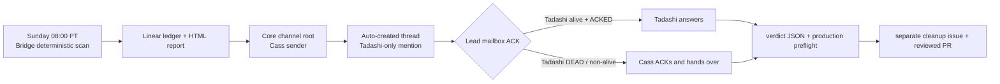

# FLY-1781 每周 flag 扫描与裁决回流 — Runbook

Issue: FLY-1781 (https://linear.app/geoforge3d/issue/FLY-1781/flag治理b3第4批-每周扫描-摆出候选问-annie留清-退役出口主体永不自动删)
日期: 2026-08-21
基于: ../FLY-1831-flag-governance-a9/plan.md

## 1. 安全边界

扫描只计算并摆出候选，永不自动删除 flag，也不自动派发清理 Runner。Annie 不回复时，本周所有 flag 原样保持；仍满足候选条件的项下周再次出现。`clear` 也只是一条人工裁决，必须经过 verdict 文件、生产绑定 preflight、独立执行单和正常 PR/ship gate 才能改变代码。

## 2. Flywheel 当前运行合同

| 项 | 已交付合同 |
| --- | --- |
| 时间 | 每周日 08:00 `America/Los_Angeles`，按 IANA 时区处理 PST/PDT；Bridge 停机错过后在恢复 tick 补跑最近未结周槽，不用“距上次满 7 天”漂移时刻。 |
| 候选判据 | 生效值仍须有至少 7 天可信稳定证据；这是候选资格，不是调度周期。两者不可共用旋钮。 |
| 执行人 | Bridge 内置 deterministic scanner；不启动 Runner。 |
| 模型 | 扫描、候选解释和 HTML 生成均为零 LLM 调用；免费、可复现、不受 quota 影响。报告后的自然语言答疑由 Tadashi 承接。 |
| Founder 阅读面 | Flywheel 核心频道 `1516209289406971965`：一句摘要 + HTML 报告页链接；即使 0 候选也必须发布。 |
| 台账 | Linear `flag-governance` issue 保留为 ledger，不是 Annie 的阅读面，也不要求她查看 issue thread。 |
| 发件身份 | 固定使用 `flywheel-cos-lead`（Cass）登记的 bot token/id；不回退 host bot、announcer bot 或 Tadashi bot。 |
| 谁答疑 | Tadashi（`flywheel-eng-lead`）。root 自动开 thread，只 @ Tadashi；同一 handoff 另投 Tadashi Lead mailbox，只有 `ACKED` 才算 intake 完成。仅当 Tadashi mailbox `DEAD`，或 canonical lease liveness 明确为 `terminal_or_missing` 时，才把同一 handoff 投给 Cass；缺失/`unknown` liveness 继续留在 primary，不凭不确定性切 owner。 |
| 失败通知 | scan/source/provenance、no-clock 与 delivery failure 先写 durable failure intent 并投 Tadashi Lead mailbox；每个 flag-scan tick 都重新 reconcile 未完成 intent，只有 mailbox `ACKED` 才 settle，同样只按 `DEAD`/`terminal_or_missing` 规则由 Cass 接住。Bridge 不托管 Flywheel 项目时正常不启用 scanner、零告警；若 roster 已托管 Flywheel 但 channel / Engineering Lead / CoS sender 等 owner contract 非法，则经现有 `flag_scan_failed` 治理告警面上报并把 scanner 标为 unavailable，不能只写 console，也不新增告警 kind。旧的 unified `alert_delivery_receipt` 不再是 failure-intent authority。 |



## 3. 每周发布链

1. Bridge 计算最近的 Sunday 08:00 PT slot，并用 durable pending-run/CAS 防止双 Bridge 重复开批。
2. 计算所有 registry flag 的可信生效值、稳定时长和 provenance。报告至少包含人话描述、当前值、稳定时长；0 候选仍生成完整空报告。
3. 创建 Linear ledger，再发布 HTML 报告。报告失败允许该 leg `degraded`，但 Discord 正文必须诚实显示失败并保留 Linear 链接。
4. 每次真实 Discord 发布前都验证 canonical Lead identity 投影、core group 与 Tadashi `access.json.allowBots` 中的 Cass 身份；Cass token 还须通过 `/users/@me` exact-id 校验。
5. 首次、上次成功超过 21 天或 identity/channel/access fingerprint 变化时，做一次有界 `root → thread → thread message` 权限 probe。probe 的归档/删除 cleanup 失败不推翻已经证明的权限；真实周报失败仍由 Discord leg 的恢复合同处理。
6. root 用单次 Discord POST，自动化前缀和 run marker 在第一行，正文不得超过单消息上限；随后以该 root 自动开 thread，发送 Tadashi-only handoff，再等待 Lead mailbox settlement。
7. Discord leg 只有在 root、thread、handoff 与 Tadashi/Cass mailbox `ACKED` 四层证据齐全时为 `done`。root 已存在但 mailbox 尚为 `QUEUED` 时只 reconcile，不能再发第二条 root。

`flag_scan_runs.status=published` 是历史兼容的“本 run 已 settled”，不是“所有腿成功”。查真实交付必须看每个 leg 的 `done/degraded` 与 evidence。

## 4. Thread 互动与裁决

Annie 在自动创建的 core-channel thread 里做三类动作：

- 问：这条 flag 管什么、删了会怎样；Tadashi 在原 thread 回答。
- 定：`留 A`、`清 B`、`C 再想`；Tadashi 把明确裁决写进 verdict 文件。
- 不回复：零动作、零默认裁决、零自动删除。

HTML 页内勾选只帮助整理；浏览器本地状态不是治理权威。最终裁决必须写入 `engineering/doc/flag-governance-ledger/<run-date>-verdicts.json`，每条含 `flag`、`verdict`、`runToken`、`decidedAt`、`canonicalDigest`；`keep` 另含 `reason`，`clear` 另含 `execIssue`。

落账步骤：

1. `clear` 按动作风险新开执行单；机械清理可批量，破坏性变化逐 flag 独立开单。不得复用周扫描 ledger issue 当执行单。
2. 在 Bridge 机器先做只读生产绑定核验，把 `EVIDENCE` 放入实现 PR：

   ```bash
   node scripts/verify-flag-verdicts.mjs --preflight \
     --db "$FLYWHEEL_STATE_DB" \
     --verdicts engineering/doc/flag-governance-ledger/<run-date>-verdicts.json
   ```

3. 人工更新 `registry.ts`：

   - `keep`：写 `longTermKeep: true` 与 `keepReason: "<decidedAt> [flag-scan:<runToken>]: <reason>"`。
   - `clear`：写 `retiring: "<execIssue>"`；若原来有 keep 字段，同 commit 删除。

4. 提交前运行源码核验：

   ```bash
   node scripts/verify-flag-verdicts.mjs \
     --verdicts engineering/doc/flag-governance-ledger/<run-date>-verdicts.json
   ```

5. verdict、preflight evidence 与 registry 修改必须在同一 PR 接受审查。合入后在 ledger issue 留逐条回执；未裁决项不改 registry。

## 5. 故障与恢复

- visible effect 超时或进程在 HTTP 成功后崩溃：leg 进入 `ambiguous`，等待 visibility fence 后按 run marker reconcile；先查远端，不能盲重发。
- Discord 找到 root 后仍须补齐/确认 thread、handoff 与 mailbox ACK；root-only 永远不是完成证据。
- scan/no-clock/delivery failure intent 在 `scanIfDue` 与 pending recovery 的每个 tick 都按 Lead mailbox settlement 重检；`QUEUED`、`LEASED`、缺失或 `unknown` liveness 都继续等 Tadashi，只有 `DEAD`/`terminal_or_missing` 才投 Cass，任一方都只以 `ACKED` 终结。Bridge 崩溃重启后不能用旧 alert receipt void 掉这条重试链；`StateStore` 也不再暴露旧 receipt/void settlement API。
- pending run 达 24 小时或已经跨入下一个周槽：先发 durable failure notice，再把未结腿标为 `degraded`，释放后续周槽。不能让一次坏 run 永久堵住所有未来扫描。
- 只有 founder surface 的 root/thread 都没到货时才回滚本 run 增加的 `askCount`；root/thread 已到但 mailbox ACK 尚缺时不回滚，因为 Annie 已被问到。
- 任一 no-clock 项从 founder 候选中扣下并通知 Lead；不得猜值、猜稳定期或用 LLM 补证据。

## 6. FLY-1831 部署前一次性清理

FLY-1831 把 `FLYWHEEL_ALERT_ROUTING`、`FLYWHEEL_ALERT_TICKETS` 固化为 ON 并写入 tombstone。生产 `~/.flywheel/.env` 在 2026-08-21 审计时仍含这两行；本实现 worktree 不修改 live `.env`，merge 也不触发即时部署。

第一次部署包含 FLY-1831 的 build 时，updater/operator 必须：

1. 用现有原子 env 编辑流程只删除上述两个 key，保留原文件 owner、mode 与其它字节；不要把值改为 `0`，tombstone 要求整行不存在。
2. 证明文件内两个 key 均为零行，再运行静态 preflight：

   ```bash
   scripts/check-flag-truth.ts --env-file "$HOME/.flywheel/.env"
   ```

3. 静态 preflight 通过后继续 updater 的正常部署，让新 build 的 Bridge 进程接管；旧进程仍可能保留启动时读入的 tombstone env，不能拿它做部署前 live 判据。
4. 新 Bridge 健康后再验证运行中进程：

   ```bash
   scripts/check-flag-truth.ts --env-file "$HOME/.flywheel/.env" --live
   ```

5. live preflight 失败则按 updater 的既有回滚/告警流程处理。不得为本单单独运行 `restart-services.sh`；merge 后仍走 00:00/12:00 updater 班车，除非 founder 另行单次批准紧急票。

## 7. 推广为通用项目能力

本单冻结 adapter 合同，但没有加入无人消费的 config 字段或假 loader。Flywheel 是 v1 试点；其它项目只有在 adapter 真正实现并测试下列合同后才算接入：

| 项 | 通用合同 |
| --- | --- |
| per-project 开关 | 项目显式 opt-in；缺配置默认不扫描。该字段必须与实际 adapter consumer 同 PR 落地，不能只写 inert config。 |
| registry | `<projectRoot>/.flywheel/feature-flags/registry.json`，schema versioned；路径固定相对 `projectRoot`，拒绝越界路径/symlink。 |
| 生效值 | 项目 adapter 输出解析后的 effective value 与可信采样证据；Bridge 不猜源码默认值或 `.env` 合并规则。 |
| 频道 | canonical project roster 的 `generalChannel`；不可回退其它项目、任一 Lead 私聊或 Linear thread。 |
| owner/fallback | 唯一 Engineering Lead 负责答疑；CoS 只在 Lead mailbox `DEAD` 或 canonical liveness=`terminal_or_missing` 时接力；缺失/`unknown` 不触发 fallback。 |
| 时区/周期 | 每周日 08:00 项目声明时区；Flywheel v1 固定 `America/Los_Angeles`。扫描仍为零 LLM。 |
| verdict | `<projectRoot>/engineering/doc/flag-governance-ledger/`，或项目显式声明的 department doc 根；沿用 frozen run token、digest 与 production preflight。 |

接入验收至少覆盖：0 候选发布、DST 冬夏槽、重复 tick 幂等、root 后崩溃恢复、Lead mailbox ACK/fallback、failure intent 跨 tick/重启重试、未知 liveness 不切 Cass、24h stall breaker、路径越界拒绝、未知/缺证据值不入候选，以及“无回复永不自动删”。
