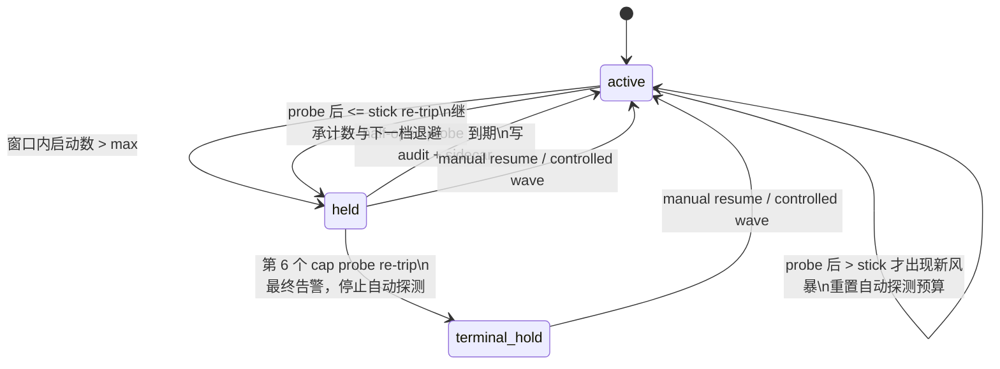

# FLY-1784 restart-storm gate 有限 half-open 自愈 — 实施计划

Issue: FLY-1784 (https://linear.app/geoforge3d/issue/FLY-1784/infra复盘-restart-storm-gate-自锁无自愈-bridge-plist-keepalive-30s-使60s-内-3)
日期: 2026-08-15
基于: research.md(v4)；Founder 2026-08-15 返工裁决

状态: Founder 已裁决有限探测语义；本版同步实现与 QA 的唯一验收口径。原 Codex design review R4 已批准 half-open 基础设计；本次按 Lead 指令在 exact head 重新走 code review。

## 0. 一句话

restart-storm gate 在 `held` 后按 5→10→20→40→60 分钟 half-open；60 分钟档默认最多探测 6 次（可配置，第一次 60 分钟探测计为第 1 次）。第 6 次仍在稳定窗内 re-trip 时原子进入 `terminal_hold`，停止全部自动探测，并发一次带人工 `resume` 命令的最终告警。

默认完整序列为 `5/10/20/40 + 60×6`：共 10 次自动探测、累计 435 分钟（7.25 小时）。

## 1. Goals / Non-goals

### Goals

1. 源头静默后，`held` 能在当前退避到期时自动 half-open，无需人工记住 runbook。
2. 同一失败链中的真 crash-loop（每次 probe 后都在 `stick` 内 re-trip）不会无限探测：默认第 10 次探测（第 6 个 cap probe）失败后进入 `terminal_hold`。
3. sidecar 跨进程崩溃持久保存探测总数、cap 探测数与累计冷却时长；prepared replay 不重复计数。
4. 最终告警复用现有 `restart_storm_hold` kind，明确说明“尝试 N 次、历时 X 小时、自动恢复已放弃”，并带绝对路径人工恢复命令。
5. 人工 `resume` / `arm-controlled-wave` 仍优先，清空 sidecar 并离开 `terminal_hold`。

### Non-goals

- 不改生产阈值 600s / >5；held/refused 启动仍不计窗口。
- 不改 plist、wrapper、launchd 或 Bridge 告警基础设施。
- 不新增依赖、不新增 lead-alert kind、不为网络告警造 exactly-once 状态机。
- 不自动退出 `terminal_hold`；恢复必须来自人工 `resume` 或 controlled wave。

## 2. 状态机



磁盘状态增加 `terminal_hold`，shape 与两个 held 状态相同：

```json
{"state":"terminal_hold","episode_key":"bridge__20260815T064432Z__165","window_start":"2026-08-15T06:44:32.000Z","last_resumed_seq":164}
```

`gate` 读到 `terminal_hold` 直接返回 3，不读写 probe sidecar、不追加 launch ledger、不重复告警。`record-failure` 返回 held；`status` 只读展示；`resume` 与 controlled wave 可恢复。

## 3. 持久化 sidecar v2

```json
{"schema_version":2,"step":10,"last_auto_resume_ts":"2026-08-15T14:00:00.000Z","episode_key":"bridge__20260815T130000Z__221","probe_count":10,"cap_probe_count":6,"total_delay_sec":26100,"terminal_episode_key":null}
```

- `step`：现有指数档位，`0..32`，32 仍是计算饱和哨兵。
- `probe_count`：当前预算周期内已提交的自动探测总数。
- `cap_probe_count`：其中 delay 等于 cap 的探测数；第一次 cap probe 计为 1。
- `total_delay_sec`：当前预算周期累计计划冷却秒数，用于跨配置变化仍能生成真实最终告警。
- `terminal_episode_key`：非终态为 `null`；进入终态时写当前 held episode。它让预期的有限终止在 sidecar 上也与旧版意外自锁明确可区分，并为 state 提交前崩溃提供可恢复的 terminal intent。
- 读取 v2 时 exact-shape 严格校验：所有计数均为非 bool、非负整数；`cap_probe_count <= probe_count`；`step <= probe_count`；时间不在未来；episode child 一致；文件为 non-symlink 0600 regular。
- 兼容已存在的 schema v1 四字段 sidecar：读取后在内存归一化为 `probe_count=step`、`cap_probe_count=0`、`total_delay_sec=0`；下一次提交写成 v2。v1 不隔离。
- 其他损坏 sidecar 继续 quarantine + corruption alert + 空预算 fail-open，不改变现有退出码。

预算继承仅发生于 `hold_at - last_auto_resume_ts <= stick`。超过稳定窗视为新事故，`step/probe_count/cap_probe_count/total_delay_sec` 全部归零。

因此有限预算约束的是同一条持续失败链；若一次 probe 后运行超过 `stick` 才再次失败，该稳定期被视为恢复成功，后续风暴开启新预算。低频 flapper 的跨事故聚合不在本单范围。

## 4. 配置

| env | 默认 | 含义 |
|---|---:|---|
| `FLYWHEEL_RESTART_STORM_AUTORESUME_BASE_SEC` | 300 | 首次探测冷却 |
| `FLYWHEEL_RESTART_STORM_AUTORESUME_CAP_SEC` | 3600 | 冷却封顶 |
| `FLYWHEEL_RESTART_STORM_AUTORESUME_STICK_SEC` | 1800 | re-trip 继承预算的稳定窗 |
| `FLYWHEEL_RESTART_STORM_AUTORESUME_CAP_PROBES` | 6 | cap 档允许的自动探测次数 |

四项在 `gate` / `record-failure` 入口、取锁和任何持久写之前解析。全部必须为正整数；沿用 `base <= cap <= 31536000`。非法配置返回 4，零 mutation。

## 5. 决策与提交顺序

### 5.1 计划

`_autoresume_display_plan(...)` 按以下顺序返回 `replay | terminal | probe`：

1. `terminal_episode_key` 等于当前 held episode：重放 terminal intent，不再探测。
2. sidecar episode 等于当前 held episode且 `step >= 1`：prepared probe replay，直接复用已持久化的全部计数，绝不再 +1。
3. sidecar 仍在 stick 稳定窗内，且 `cap_probe_count >= CAP_PROBES`：`terminal`，不等待下一小时。
4. 否则按指数档计算 delay；生成 `probe` 时一次性计算下一份 v2 sidecar：总数 +1、若 `delay == cap` 则 cap 数 +1、累计 delay 加本次 delay，`terminal_episode_key=null`。

`_autoresume_plan(...)` 对 replay/terminal 立即返回；probe 仅在 ETA 到期时返回。

### 5.2 half-open probe

提交顺序保持：mandatory audit → v2 sidecar → `resumed` state（提交点）→ best-effort probe alert。`after_autoresume_sidecar` 崩溃后 replay 使用原计数，不重复消耗预算。

第 6 个 cap probe 的告警不再承诺“下次 cooldown”，而是说明若再次 re-trip，自动恢复将停止。

### 5.3 terminal transition

`_evaluate_brake` 生成新 held episode 后立即计算 plan；若为 terminal，不发普通 hold 告警，调用 `_enter_terminal_hold(...)`：

1. best-effort 发最终 meta + Lead alert；Lead `kind=restart_storm_hold`、severity `severe`、signature=`{episode_key}__terminal`。
2. 原子更新 sidecar 的 `terminal_episode_key`，持久声明“这是预算耗尽的预期终态”。
3. 原子写 `terminal_hold` state。
4. 返回 EXIT_HELD；不追加 probe audit、不放行。

最终文案必须包含：

`Automatic recovery abandoned after 10 probes over 7.25h; terminal_hold requires manual recovery: python3 <absolute gate path> resume <child>`

若进程在告警后、state 写前崩溃，下一次通过 sidecar terminal intent 收敛并用同 signature 重试；Lead 告警去重。告警失败仍写终态，避免网络故障重新开启无限探测。

持有 `held_alert_pending/attempted` 的恢复路径也先识别 terminal；`record-failure` 触发的 re-trip 走同一 `_evaluate_brake`，因此与 `gate` 行为一致。

## 6. TDD / 验收

先扩 `scripts/__tests__/restart-storm-gate.test.sh` 与独立 CLI harness，再实现：

1. 默认完整序列锁定 `5/10/20/40 + 60×6`；第一个 cap probe 计 1，前五个 cap 失败仍可继续，第六个 re-trip 立即 terminal。
2. `terminal_hold` 首次只发最终告警；`.state=terminal_hold` 且 sidecar `terminal_episode_key` 指向同 episode，可与旧自锁区分；重复 `gate` 不追加 ledger、sidecar/audit 不变、无 probe/重复告警。
3. 最终告警含总探测数、7.25h、`automatic recovery abandoned`、绝对路径 `resume` 命令；不出现普通 hold copy。
4. `CAP_PROBES=1` 在第一个 cap probe re-trip 后终止；非法 0/非数字在 `gate` 与 `record-failure` 均 exit 4 且零 mutation。
5. sixth-cap sidecar commit 后 crash：replay 仍为第 6 个 cap probe、总数不变；随后 re-trip terminal。
6. sidecar v1 可读并在下一 probe 升级 v2；v2 缺键/多键/bool/负数/计数关系错误均 quarantine。
7. `resume` 与 controlled wave 均清 sidecar并离开 `terminal_hold`；`status` 只读。
8. `record-failure` 可触发 terminal，输出 reason/state 与现有合同相容。
9. 既有 crash/audit/alert failure/clock rollback/ledger corruption 用例全部回归。
10. 两个 shell harness、`py_compile`、`shellcheck`、全仓 `pnpm lint`、`pnpm -r build`、`pnpm test:packages:run` 通过；exact-head code review APPROVED；新 head 交 QA 重验。

## 7. Rollout / Rollback

- 仍有两条执行面：repo path 与 `~/.flywheel/bin` copied-bin；部署时需 converge 并核对 hash。
- 本次只更新 PR，不部署；按 Lead 指令与下一次 restart train 同车。
- `terminal_hold` 是有意新增的 fail-closed 状态，旧 binary 不认识它。回滚前必须先用新 gate 对所有 `terminal_hold` child 执行人工 `resume`（或 controlled wave），再 revert/converge；否则旧 binary 会以 invalid state fail-closed。
- schema v2 residue 对旧 binary 无害，因为旧 binary 不读取 sidecar；真正的回滚前置是清掉新 `.state` 状态名。
- merge / ship 继续 founder-gated，本 implement 节点不 merge、不部署。
